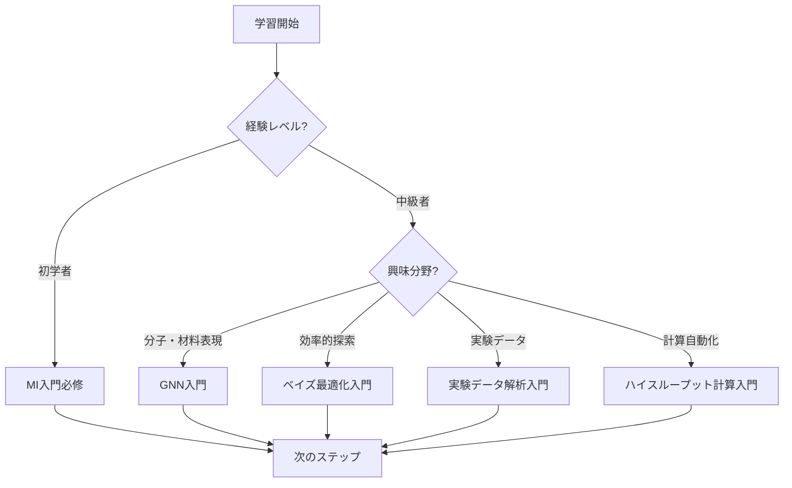

# MI寺子屋 要件定義書
**Materials Informatics Knowledge Hub - Requirements Specification**

**作成日**: 2025-10-17
**作成者**: Dr. Yusuke Hashimoto, Tohoku University
**バージョン**: 2.0
**プロジェクト名**: MI寺子屋（Materials Informatics Terakoya）

---

## 1. エグゼクティブサマリー

### プロジェクトビジョン
**「材料科学とデータサイエンスの融合領域における、世界最高水準の日本語学習プラットフォーム」**

### コアバリュー
- 🎯 **材料科学特化**: 一般MLではなく、材料・化学・物理への応用に焦点
- 🔬 **実践重視**: 全コード例が実行可能、実データ・実問題を使用
- 📚 **体系的学習**: 基礎から応用まで段階的に学べる構造
- 🌐 **オープンアクセス**: 無料、CC BY 4.0、GitHubで公開
- 🇯🇵 **日本語優先**: 世界トップレベルの日本語MI教育コンテンツ

### ターゲットユーザー
1. **材料科学研究者** (大学院生、ポスドク、助教)
2. **企業R&Dエンジニア** (化学、材料、製薬、半導体)
3. **計算化学者** (DFT、MD経験者)
4. **データサイエンティスト** (材料科学への応用を目指す)

---

## 2. 現状分析

### 2.1 既存コンテンツ（2025年10月時点）

**4つの入門シリーズ**:
| シリーズ | 対象 | 章数 | コード例 | 学習時間 | ステータス |
|---------|------|------|---------|---------|----------|
| MI入門 | 材料全般 | 4章 | 35個 | 90-120分 | ✅ 完成 |
| NM入門 | ナノ材料 | 4章 | 30-35個 | 90-120分 | ✅ 完成 |
| PI入門 | プロセス | 4章 | 35個 | 90-120分 | ✅ 完成 |
| MLP入門 | 分子シミュレーション | 4章 | 15個 | 85-100分 | ✅ 完成 |

**合計**: 16章、115コード例、355-460分の学習コンテンツ

### 2.2 強み
- ✅ 体系的な4章構成（導入→基礎→実践→応用）が確立
- ✅ 実行可能なPythonコード例が豊富
- ✅ 産業ケーススタディ（20件以上）
- ✅ キャリアパス情報が充実
- ✅ 学習ロードマップが明確

### 2.3 課題と拡張の必要性

#### コンテンツの欠落
- ❌ **最新AI技術**: GNN、Transformer、拡散モデルが未カバー
- ❌ **基礎技術**: ベイズ最適化、アクティブラーニングの詳細解説不足
- ❌ **実験データ解析**: XRD、SEM/TEM画像解析が不足
- ❌ **ハイスループット計算**: 自動化、並列化の実践が不足
- ❌ **データベース活用**: Materials Projectの基本的な使い方のみ

#### ナビゲーションの問題
- ❌ トピック別・難易度別の索引がない
- ❌ シリーズ間の相互参照リンクが不足
- ❌ 学習パス診断フローが弱い
- ❌ 横断検索機能がない

#### 技術的課題
- ❌ Mermaid.jsによる図表が一部のみ
- ❌ インタラクティブなコンテンツがない
- ❌ モバイル対応が不十分

---

## 3. 拡張方針

### 3.1 プロジェクトスコープ

**IN SCOPE（含む）**:
- ✅ 材料科学・化学・物理へのAI/ML応用
- ✅ 計算材料科学（DFT、MD、フォノン計算）
- ✅ 実験データ解析（XRD、SEM/TEM、スペクトル）
- ✅ 材料データベース活用（Materials Project、AFLOW、NOMAD）
- ✅ 分子・材料表現学習（GNN、Transformer、グラフ表現）
- ✅ 材料探索・最適化（ベイズ最適化、強化学習、進化的アルゴリズム）
- ✅ ハイスループット計算（自動化、並列化、ワークフロー管理）

**OUT OF SCOPE（含まない）**:
- ❌ 一般的な機械学習（材料科学と無関係）
- ❌ ビジネスアナリティクス（マーケティング、財務分析）
- ❌ 自然言語処理（材料科学論文解析を除く）
- ❌ コンピュータビジョン（顕微鏡画像解析を除く）

### 3.2 拡張戦略

#### 戦略1: 深さの拡充（Depth）
既存4シリーズを深化させる
- MI入門 → MI中級（GNN、Transformer for Materials）
- MLP入門 → MLP中級（Universal MLPs、Foundation Models）
- 各シリーズに章を追加（4章 → 6-8章）

#### 戦略2: 幅の拡充（Breadth）
新規シリーズを追加
- データベース活用入門
- ベイズ最適化・アクティブラーニング入門
- 実験データ解析入門
- ハイスループット計算入門
- 計算材料科学基礎入門

#### 戦略3: 横断的機能強化（Integration）
- トピック別索引（GNN、Transformer、ベイズ最適化など）
- 難易度別学習パス（入門→初級→中級→上級）
- 応用分野別ガイド（電池、触媒、半導体など）
- インタラクティブコンテンツ（Jupyter Notebook、Google Colab）

---

## 4. 新規コンテンツシリーズ提案

### 4.1 最優先シリーズ（Phase 1: 1-3ヶ月）

#### 📘 グラフニューラルネットワーク（GNN）入門
**Graph Neural Networks for Materials and Molecules**

**位置づけ**: MI入門・MLP入門の発展、最新AI技術

**概要**:
- 🎯 **対象分野**: 分子特性予測、結晶構造予測、触媒設計
- 📊 **難易度**: 中級（MI入門またはDL基礎の前提知識必要）
- ⏱️ **学習時間**: 120-150分（全5章）
- 💻 **コード例**: 35-40個

**章構成**:
1. **第1章**: なぜ材料科学にGNNが必要か
   - グラフとは何か（頂点、辺、隣接行列）
   - 分子・材料のグラフ表現（原子=頂点、結合=辺）
   - 従来の材料記述子の限界
   - GNNの成功事例（OC20、QM9、Materials Project）

2. **第2章**: GNNの基礎理論
   - Message Passing Neural Networks (MPNN)
   - Graph Convolutional Networks (GCN)
   - Graph Attention Networks (GAT)
   - SchNet、DimeNet、GemNet（材料科学特化GNN）

3. **第3章**: PyTorch Geometric実践
   - 環境構築（PyG、RDKit、ASE）
   - QM9データセットで分子特性予測
   - Materials Projectデータで結晶特性予測
   - モデル評価とハイパーパラメータチューニング

4. **第4章**: 高度なGNN技術
   - 等変GNN（E(3)-equivariant）: SchNet、NequIP、MACE
   - Transformer + GNN: Graphormer、MAT
   - 事前学習モデル: MolBERT、ChemBERTa

5. **第5章**: 実世界応用とキャリア
   - 触媒設計（OC20 Challenge）
   - 創薬（分子生成、結合親和性予測）
   - 材料探索（新規結晶構造予測）
   - キャリアパス（GNN専門家の需要）

**前提知識**: MI入門 または 深層学習基礎
**関連シリーズ**: MI入門、MLP入門
**使用ツール**: PyTorch Geometric, RDKit, ASE, matminer

---

#### 📘 ベイズ最適化・アクティブラーニング入門
**Bayesian Optimization and Active Learning for Materials Discovery**

**位置づけ**: MI/NM/PI全シリーズの横断的技術

**概要**:
- 🎯 **対象分野**: 効率的材料探索、実験計画、ハイスループット最適化
- 📊 **難易度**: 初級〜中級
- ⏱️ **学習時間**: 100-120分（全4章）
- 💻 **コード例**: 30-35個

**章構成**:
1. **第1章**: なぜ材料探索に最適化が必要か
   - 探索空間の広大さ（10^60通りの組み合わせ）
   - ランダム探索の非効率性
   - ベイズ最適化の成功事例（Li-ion電池、触媒、合金）

2. **第2章**: ベイズ最適化の基礎
   - ガウス過程（Gaussian Process）
   - 獲得関数（EI、UCB、PI）
   - 探索と活用のトレードオフ
   - 制約付き最適化、多目的最適化

3. **第3章**: Python実践
   - scikit-optimize (skopt)
   - BoTorch（PyTorch版）
   - Ax（Meta開発、A/Bテスト対応）
   - 実データで最適化（バンドギャップ、触媒活性）

4. **第4章**: アクティブラーニングと応用
   - Uncertainty Sampling
   - Query-by-Committee
   - Expected Model Change
   - 実験とのクローズドループ（自動実験装置との連携）
   - 産業応用（触媒プロセス、合金設計）

**前提知識**: MI入門 または 統計学基礎
**関連シリーズ**: MI入門、NM入門、PI入門
**使用ツール**: scikit-optimize, BoTorch, Ax, GPyOpt

---

### 4.2 高優先シリーズ（Phase 2: 3-6ヶ月）

#### 📗 材料データベース活用入門
**Materials Databases Mastery**

**概要**:
- 🎯 **対象分野**: Materials Project、AFLOW、OQMD、NOMAD完全活用
- 📊 **難易度**: 入門〜初級
- ⏱️ **学習時間**: 90-110分（全4章）
- 💻 **コード例**: 40-45個

**章構成**:
1. **第1章**: 材料データベースの全貌
   - Materials Project（140k材料、DFT計算）
   - AFLOW（3.5M構造、結晶対称性）
   - OQMD（1M材料、熱力学データ）
   - NOMAD（10M以上、計算データリポジトリ）
   - Citrine、NIMS MatNavi（実験データ）

2. **第2章**: Materials Project完全ガイド
   - API基礎（認証、クエリ、データ取得）
   - pymatgen連携（結晶構造、状態図、バンド構造）
   - 高度なクエリ（フィルタリング、並べ替え）
   - バッチダウンロード（10,000件以上の効率的取得）

3. **第3章**: 複数データベースの統合活用
   - データベース間の相互参照
   - データの結合と統合（pandas）
   - データクリーニング（欠損値、外れ値）
   - メタデータ管理

4. **第4章**: 独自データベース構築
   - 実験データの構造化
   - SQLiteによるローカルDB
   - MongoDB（NoSQL）での管理
   - データ共有とバージョン管理（Zenodo、Figshare）

**前提知識**: Python基礎
**関連シリーズ**: MI入門
**使用ツール**: pymatgen, mp-api, aflow, pandas, SQLite

---

#### 📗 実験データ解析入門
**Experimental Data Analysis for Materials Scientists**

**概要**:
- 🎯 **対象分野**: XRD、SEM/TEM、スペクトル、熱分析のPython解析
- 📊 **難易度**: 初級〜中級
- ⏱️ **学習時間**: 100-120分（全4章）
- 💻 **コード例**: 35-40個

**章構成**:
1. **第1章**: 実験データ解析の重要性
   - 材料キャラクタリゼーション技術一覧
   - データ駆動型解析の利点
   - 従来手法（手動ピーク同定）の限界

2. **第2章**: XRDデータ解析
   - XRDパターンの読み込みと前処理
   - バックグラウンド除去（多項式フィッティング）
   - ピーク同定（scipy.signal）
   - 結晶構造リファインメント（pymatgen、GSAS-II）
   - 機械学習によるフェーズ同定

3. **第3章**: SEM/TEM画像解析
   - 画像読み込み（OpenCV、PIL）
   - 前処理（ノイズ除去、コントラスト調整）
   - 粒子検出・カウント（Watershed、U-Net）
   - 粒径分布解析
   - 深層学習によるナノ構造分類

4. **第4章**: スペクトル・熱分析
   - UV-Vis、IR、Ramanスペクトル解析
   - スペクトル前処理（ベースライン補正、正規化）
   - ピークデコンボリューション
   - TGA/DSCデータ解析（転移温度、エンタルピー）
   - 機械学習による材料同定

**前提知識**: Python基礎、材料キャラクタリゼーション基礎
**関連シリーズ**: NM入門
**使用ツール**: OpenCV, scikit-image, scipy, pymatgen, PyTorch

---

#### 📗 ハイスループット計算入門
**High-Throughput Computational Materials Science**

**概要**:
- 🎯 **対象分野**: DFT計算自動化、ワークフロー管理、並列計算
- 📊 **難易度**: 中級〜上級
- ⏱️ **学習時間**: 110-140分（全5章）
- 💻 **コード例**: 25-30個

**章構成**:
1. **第1章**: ハイスループット計算の必要性
   - 材料探索の加速（1材料/週 → 1000材料/週）
   - Materials Genomeイニシアティブ
   - 成功事例（AFLOW、Materials Project）

2. **第2章**: DFT計算自動化
   - ASE（Atomic Simulation Environment）基礎
   - VASP、Quantum ESPRESSO、CP2Kの自動実行
   - 入力ファイル自動生成
   - 計算結果の自動解析

3. **第3章**: ワークフロー管理
   - FireWorks（Materials Project採用）
   - AiiDA（欧州中心、データプロビナンス）
   - Atomate（DFTワークフロー）
   - エラーハンドリングと自動リスタート

4. **第4章**: 並列計算とクラウド活用
   - MPI並列計算（複数ノード）
   - ジョブスケジューラ（SLURM、PBS）
   - クラウドHPC（AWS、Google Cloud、Azure）
   - コスト最適化

5. **第5章**: データ管理と共有
   - 計算データの構造化
   - NOMAD、Materials Cloudへのアップロード
   - データバージョン管理（DVC）
   - 再現性確保（コンテナ化、Docker）

**前提知識**: DFT基礎、Linux/UNIX基礎
**関連シリーズ**: MLP入門
**使用ツール**: ASE, pymatgen, FireWorks, AiiDA, Docker

---

#### 📗 ロボティクス実験自動化入門
**Robotic Laboratory Automation for Materials Discovery**

**概要**:
- 🎯 **対象分野**: 自律実験、クローズドループ最適化、ロボットアーム制御、材料合成・評価自動化
- 📊 **難易度**: 中級〜上級
- ⏱️ **学習時間**: 110-130分（全5章）
- 💻 **コード例**: 20-25個

**章構成**:
1. **第1章**: 材料実験自動化の必要性と現状
   - 従来の手動実験の限界（1材料/日 → 1時間/材料）
   - 自律実験の成功事例（A-Lab、RoboRXN、Emerald Cloud Lab、Acceleration Consortium）
   - Materials Acceleration Platform (MAP)
   - 開発期間の劇的短縮（年単位 → 週単位）
   - 24時間稼働による生産性向上

2. **第2章**: ロボティクス実験の基礎
   - ロボットアームの制御（逆運動学、経路計画）
   - 液体ハンドリング（ピペッティング、分注、OT-2）
   - 固体ハンドリング（粉末計量、錠剤成形、粒子供給）
   - センサー統合（カメラ、分光計、XRD、質量分析）
   - 安全性とエラーハンドリング（緊急停止、異常検知）
   - ラボウェアの標準化（マイクロプレート、バイアル）

3. **第3章**: クローズドループ最適化
   - ベイズ最適化との統合（実験提案 → 実行 → 評価）
   - アクティブラーニングによる効率的探索
   - 実験 → 測定 → 解析 → 予測 → 次実験の自動サイクル
   - Python実装（PyLabRobot、OpenTrons Python API）
   - 仮想ロボット環境でのシミュレーション（Gazebo、PyBullet）
   - 実データでのデモ（量子ドット発光波長最適化）

4. **第4章**: クラウドラボと遠隔実験
   - Emerald Cloud Labの使い方
   - APIによる実験依頼（REST API、Python SDK）
   - データ自動取得とクラウドストレージ
   - コスト比較（従来研究室 vs クラウドラボ）
   - リモート実験の利点（装置共有、専門技術者サポート、スケーラビリティ）

5. **第5章**: 実世界応用とキャリア
   - 触媒スクリーニング（200材料/週、従来の50倍）
   - 量子ドット合成最適化（RGB波長の同時最適化）
   - 電池電解質の高速探索（イオン伝導度測定自動化）
   - 医薬品製剤開発（溶解性・安定性の並列評価）
   - 有機合成の自動化（RoboRXN、連続フロー合成）
   - キャリアパス（ロボティクスエンジニア、自律実験専門家、R&D自動化）

**前提知識**: ベイズ最適化・AL入門、Python基礎、実験科学の基本的理解
**関連シリーズ**: ベイズ最適化・AL入門、実験データ解析入門、NM入門、PI入門
**使用ツール**: PyLabRobot, OpenTrons Python API, scikit-optimize, pandas, requests (API calls)

---

### 4.3 中優先シリーズ（Phase 3: 6-9ヶ月）

#### 📙 計算材料科学基礎入門
**Computational Materials Science Fundamentals**

**概要**:
- 🎯 **対象分野**: DFT、MD、フォノン計算の基礎
- 📊 **難易度**: 入門〜初級
- ⏱️ **学習時間**: 120-150分（全5章）
- 💻 **コード例**: 20-25個

**章構成**:
1. **第1章**: 量子力学基礎
2. **第2章**: 密度汎関数理論（DFT）入門
3. **第3章**: 分子動力学（MD）入門
4. **第4章**: フォノン計算と熱物性
5. **第5章**: 実践（VASP、Quantum ESPRESSO、LAMMPS）

**前提知識**: 大学物理・化学
**関連シリーズ**: MLP入門、ハイスループット計算入門
**使用ツール**: VASP, Quantum ESPRESSO, LAMMPS, ASE

---

#### 📙 強化学習入門（材料科学特化版）
**Reinforcement Learning for Materials Optimization**

**概要**:
- 🎯 **対象分野**: 材料探索、プロセス最適化、合成経路設計
- 📊 **難易度**: 中級〜上級
- ⏱️ **学習時間**: 100-120分（全4章）
- 💻 **コード例**: 25-30個

**章構成**:
1. **第1章**: なぜ材料科学に強化学習か
2. **第2章**: 強化学習基礎（Q学習、DQN、PPO）
3. **第3章**: 材料探索への応用（状態空間、報酬設計）
4. **第4章**: 実践（化学プロセス最適化、合成経路設計）

**前提知識**: MI入門、Python基礎
**関連シリーズ**: PI入門、ベイズ最適化入門
**使用ツール**: OpenAI Gym, Stable Baselines3, PyTorch

---

#### 📙 Transformer・Foundation Models入門
**Transformers and Foundation Models for Materials**

**概要**:
- 🎯 **対象分野**: 材料表現学習、事前学習モデル、生成モデル
- 📊 **難易度**: 中級〜上級
- ⏱️ **学習時間**: 110-130分（全4章）
- 💻 **コード例**: 25-30個

**章構成**:
1. **第1章**: Transformer革命と材料科学
2. **第2章**: 材料向けTransformer（Matformer、CrystalFormer）
3. **第3章**: 事前学習モデル（MatBERT、ChemBERTa）
4. **第4章**: 生成モデル（拡散モデル、VAE for materials）

**前提知識**: GNN入門、深層学習基礎
**関連シリーズ**: MI入門、MLP入門、GNN入門
**使用ツール**: Hugging Face Transformers, PyTorch

---

### 4.4 拡張シリーズ優先順位マトリックス

| 優先度 | シリーズ名 | 材料科学関連性 | 最新性 | 実用性 | 実装難易度 | Phase |
|-------|----------|--------------|-------|-------|-----------|-------|
| 🔴 最優先 | GNN入門 | ⭐⭐⭐⭐⭐ | ⭐⭐⭐⭐⭐ | ⭐⭐⭐⭐⭐ | 中 | 1 |
| 🔴 最優先 | ベイズ最適化・AL入門 | ⭐⭐⭐⭐⭐ | ⭐⭐⭐⭐ | ⭐⭐⭐⭐⭐ | 低 | 1 |
| 🟡 高優先 | 材料データベース活用入門 | ⭐⭐⭐⭐⭐ | ⭐⭐⭐ | ⭐⭐⭐⭐⭐ | 低 | 2 |
| 🟡 高優先 | 実験データ解析入門 | ⭐⭐⭐⭐⭐ | ⭐⭐⭐ | ⭐⭐⭐⭐⭐ | 中 | 2 |
| 🟡 高優先 | ハイスループット計算入門 | ⭐⭐⭐⭐⭐ | ⭐⭐⭐⭐ | ⭐⭐⭐⭐ | 高 | 2 |
| 🟡 高優先 | ロボティクス実験自動化入門 | ⭐⭐⭐⭐⭐ | ⭐⭐⭐⭐⭐ | ⭐⭐⭐⭐⭐ | 高 | 2 |
| 🟢 中優先 | 計算材料科学基礎入門 | ⭐⭐⭐⭐⭐ | ⭐⭐ | ⭐⭐⭐⭐ | 中 | 3 |
| 🟢 中優先 | 強化学習入門 | ⭐⭐⭐⭐ | ⭐⭐⭐⭐⭐ | ⭐⭐⭐ | 高 | 3 |
| 🟢 中優先 | Transformer入門 | ⭐⭐⭐⭐ | ⭐⭐⭐⭐⭐ | ⭐⭐⭐ | 高 | 3 |

---

## 5. index.md 拡張要件

### 5.1 新しい構造設計

```
MI寺子屋トップページ (index.md)
│
├── 📖 はじめに
│   ├── MI寺子屋とは
│   ├── 学習の進め方
│   └── 推奨学習パス診断
│
├── 🎓 入門シリーズ（Beginner）
│   ├── MI入門 ⭐ 必修
│   ├── NM入門
│   ├── PI入門
│   └── MLP入門
│
├── 🚀 発展シリーズ（Advanced）
│   ├── GNN入門 ⭐ 推奨
│   ├── ベイズ最適化・アクティブラーニング入門 ⭐ 推奨
│   ├── Transformer・Foundation Models入門
│   └── 強化学習入門（材料科学特化）
│
├── 🛠️ 実践技術シリーズ（Practical）
│   ├── 材料データベース活用入門
│   ├── 実験データ解析入門
│   ├── ハイスループット計算入門
│   └── ロボティクス実験自動化入門
│
├── 📐 基礎理論シリーズ（Fundamentals）
│   └── 計算材料科学基礎入門
│
├── 🗺️ 学習ナビゲーション
│   ├── 難易度別学習パス
│   ├── トピック別索引
│   ├── 技術別索引（GNN、ベイズ最適化など）
│   └── 応用分野別ガイド（電池、触媒、半導体など）
│
├── 📚 リソース
│   ├── 主要論文リスト
│   ├── オンラインコース
│   ├── データベース・ツール
│   └── コミュニティ
│
└── ❓ FAQ・サポート
```

### 5.2 必須機能

#### インタラクティブ学習パス診断


#### トピック別索引
- **GNN（グラフニューラルネットワーク）**
  - GNN入門 全章
  - MI入門 第4章（分子表現）
  - MLP入門 第2章（等変GNN）

- **ベイズ最適化**
  - ベイズ最適化・AL入門 全章
  - NM入門 第3章
  - PI入門 第3章

- **Transformer**
  - Transformer入門 全章
  - GNN入門 第4章

- **データベース**
  - 材料データベース活用入門 全章
  - MI入門 第2章（Materials Project基礎）

#### 技術レベル別フィルタ
- **入門レベル**: MI、NM、PI、材料データベース活用
- **初級レベル**: MLP、実験データ解析、ベイズ最適化
- **中級レベル**: GNN、ハイスループット計算
- **上級レベル**: Transformer、強化学習

#### 応用分野別ガイド
- **電池材料**: MI入門、GNN入門、ベイズ最適化入門
- **触媒**: MI入門、GNN入門、MLP入門、強化学習入門
- **半導体**: MI入門、GNN入門、ハイスループット計算入門
- **ナノ材料**: NM入門、実験データ解析入門、GNN入門
- **プロセス最適化**: PI入門、ベイズ最適化入門、強化学習入門

---

## 6. 技術要件

### 6.1 コンテンツフォーマット

#### Markdownベース
- **フォーマット**: Markdown (.md) + HTML変換
- **図表**: Mermaid.js（フローチャート、ダイアグラム）
- **数式**: MathJax/KaTeX（LaTeX形式）
- **コードハイライト**: Prism.js or highlight.js

#### コード例
- **言語**: Python 3.8+
- **実行環境**: Google Colab、Jupyter Notebook、ローカル実行
- **要件**: requirements.txt、環境構築手順
- **テスト**: 全コード例が実行可能であることを検証

#### メタデータ
各シリーズのindex.mdにYAMLフロントマター:
```yaml
---
series_id: "gnn-introduction"
title: "グラフニューラルネットワーク入門"
category: "advanced"
difficulty: "intermediate-advanced"
learning_time: "120-150分"
chapters: 5
code_examples: 35
prerequisites:
  - "mi-introduction"
  - "deep-learning-basics"
related_series:
  - "mi-introduction"
  - "mlp-introduction"
applications:
  - "molecular-property-prediction"
  - "crystal-structure-prediction"
  - "catalyst-design"
tools:
  - "PyTorch Geometric"
  - "RDKit"
  - "ASE"
version: "1.0"
created_at: "2025-10-20"
updated_at: "2025-10-20"
---
```

### 6.2 ディレクトリ構造

```
wp/knowledge/
├── jp/
│   ├── index.md（大幅拡張）
│   ├── index.html（index.mdから生成）
│   │
│   ├── mi-introduction/（既存）
│   ├── nm-introduction/（既存）
│   ├── pi-introduction/（既存）
│   ├── mlp-introduction/（既存）
│   │
│   ├── gnn-introduction/（新規）
│   │   ├── index.md
│   │   ├── index.html
│   │   ├── chapter1-introduction.md
│   │   ├── chapter1-introduction.html
│   │   ├── chapter2-fundamentals.md
│   │   ├── chapter2-fundamentals.html
│   │   ├── chapter3-hands-on.md
│   │   ├── chapter3-hands-on.html
│   │   ├── chapter4-advanced.md
│   │   ├── chapter4-advanced.html
│   │   ├── chapter5-real-world.md
│   │   └── chapter5-real-world.html
│   │
│   ├── bayesian-optimization/（新規）
│   ├── materials-databases/（新規）
│   ├── experimental-data-analysis/（新規）
│   ├── high-throughput-computing/（新規）
│   ├── robotic-lab-automation/（新規）
│   ├── computational-materials-basics/（新規）
│   ├── reinforcement-learning/（新規）
│   └── transformer-materials/（新規）
│
└── en/（英語版は後回し）
```

### 6.3 技術スタック

#### コンテンツ生成
- **作成**: Markdown（Claude Code支援）
- **変換**: Python-Markdown or Pandoc
- **テンプレート**: Jinja2
- **スタイル**: CSS（既存の統一スタイル継承）

#### 図表・可視化
- **ダイアグラム**: Mermaid.js（既に実装済み）
- **グラフ**: matplotlib, seaborn（静的画像として埋め込み）
- **インタラクティブ**: Plotly（将来的に検討）

#### インタラクティブコンテンツ
- **Jupyter Notebook**: nbconvert でHTML変換
- **Google Colab**: 各章ごとにColabリンク提供
- **コードサンドボックス**: Google Colab優先、将来的にJupyterLite検討

#### バージョン管理
- **Git**: 全コンテンツをバージョン管理
- **GitHub**: リポジトリ公開、Issue・PR受付
- **リリース**: セマンティックバージョニング（v1.0, v1.1, v2.0）

---

## 7. 非機能要件

### 7.1 パフォーマンス
- ページロード時間: < 3秒（4G回線）
- モバイル対応: Lighthouse Performance 90+
- SEO: Lighthouse SEO 100

### 7.2 アクセシビリティ
- WCAG 2.1 Level AA準拠
- スクリーンリーダー対応
- キーボードナビゲーション対応
- 色覚異常対応（カラーパレット調整）

### 7.3 互換性
- **ブラウザ**: Chrome、Firefox、Safari、Edge（最新版+1つ前）
- **デバイス**: デスクトップ、タブレット、スマートフォン
- **OS**: Windows、macOS、Linux、iOS、Android

### 7.4 セキュリティ
- HTTPS必須
- 外部リソース（CDN）はSRI（Subresource Integrity）対応
- ユーザー入力なし（静的サイト）のためXSS脆弱性なし

### 7.5 保守性
- **ドキュメント**: 各シリーズにREADME、コントリビューションガイド
- **コードスタイル**: PEP 8（Python）、Prettier（Markdown）
- **テスト**: 全コード例の自動テスト（CI/CD）

---

## 8. 実装計画

### 8.1 Phase 1: 基盤整備（1-2週間）

#### Week 1: 設計・準備
- [ ] 全シリーズの詳細設計（章構成、コード例リスト）
- [ ] ディレクトリ構造最終確定
- [ ] テンプレート作成（統一フォーマット）
- [ ] スタイルガイド作成
- [ ] メタデータスキーマ確定

#### Week 2: index.md拡張
- [ ] 新構造でindex.md書き直し
- [ ] 学習パス診断フロー実装（Mermaid）
- [ ] トピック別索引作成
- [ ] 技術別索引作成
- [ ] 応用分野別ガイド作成
- [ ] HTML変換・デザイン確認

### 8.2 Phase 2: GNN入門作成（2-3週間）

#### Week 3: 第1-2章
- [ ] 第1章: なぜ材料科学にGNNが必要か（執筆・コード例作成）
- [ ] 第2章: GNNの基礎理論（執筆・コード例作成）
- [ ] HTML変換・Mermaid図表追加

#### Week 4: 第3-4章
- [ ] 第3章: PyTorch Geometric実践（執筆・コード例作成）
- [ ] 第4章: 高度なGNN技術（執筆・コード例作成）

#### Week 5: 第5章・完成
- [ ] 第5章: 実世界応用とキャリア（執筆・ケーススタディ）
- [ ] 全コード例のテスト・検証
- [ ] シリーズindex.md作成
- [ ] HTML変換・公開

### 8.3 Phase 3: ベイズ最適化・AL入門作成（2週間）

#### Week 6-7
- [ ] 全4章執筆（30-35コード例）
- [ ] scikit-optimize、BoTorch実装例
- [ ] 材料探索ケーススタディ
- [ ] HTML変換・公開

### 8.4 Phase 4: 高優先シリーズ（5-8週間）

#### Week 8-9: 材料データベース活用入門
- [ ] 全4章執筆（40-45コード例）
- [ ] Materials Project、AFLOW、OQMD実践
- [ ] HTML変換・公開

#### Week 10-11: 実験データ解析入門
- [ ] 全4章執筆（35-40コード例）
- [ ] XRD、SEM/TEM、スペクトル解析実装
- [ ] HTML変換・公開

#### Week 12-13: ハイスループット計算入門
- [ ] 全5章執筆（25-30コード例）
- [ ] ASE、FireWorks、AiiDA実装例
- [ ] HTML変換・公開

#### Week 14-15: ロボティクス実験自動化入門
- [ ] 全5章執筆（20-25コード例）
- [ ] PyLabRobot、OpenTrons実装例
- [ ] クローズドループ最適化デモ
- [ ] HTML変換・公開

### 8.5 Phase 5: 中優先シリーズ（6-8週間）

#### Week 16-18: 計算材料科学基礎入門
- [ ] 全5章執筆（20-25コード例）

#### Week 19-21: 強化学習入門
- [ ] 全4章執筆（25-30コード例）

#### Week 22-23: Transformer入門
- [ ] 全4章執筆（25-30コード例）

### 8.6 総所要時間見積もり
- **Phase 1（基盤）**: 2週間
- **Phase 2（GNN入門）**: 3週間
- **Phase 3（ベイズ最適化）**: 2週間
- **Phase 4（高優先4シリーズ）**: 8週間
- **Phase 5（中優先3シリーズ）**: 8週間

**合計**: 約23週間（5.5-6ヶ月）

### 8.7 マイルストーン

| マイルストーン | 期限 | 成果物 |
|-------------|------|-------|
| M1: 基盤整備完了 | Week 2 | 拡張版index.md、テンプレート |
| M2: GNN入門公開 | Week 5 | GNN入門シリーズ完成 |
| M3: ベイズ最適化入門公開 | Week 7 | ベイズ最適化入門完成 |
| M4: 高優先4シリーズ公開 | Week 15 | データベース、実験解析、HT計算、ロボティクス完成 |
| M5: 全シリーズ公開 | Week 23 | 全13シリーズ完成 |

---

## 9. 成功指標（KPI）

### 9.1 コンテンツ指標
- [ ] **シリーズ数**: 4 → 13（3.25倍）
- [ ] **総章数**: 16 → 55+（3.4倍）
- [ ] **コード例数**: 115 → 375+（3.3倍）
- [ ] **学習時間**: 355-460分 → 1,210-1,530分（3.3倍、約20-25時間）

### 9.2 ユーザー指標（6ヶ月後）
- [ ] **月間訪問者数**: 100-500人 → 1,000-3,000人（10倍）
- [ ] **平均滞在時間**: 5-10分 → 15-30分
- [ ] **コンテンツ完走率**: 20% → 40%
- [ ] **GitHubスター数**: 0 → 100+

### 9.3 品質指標
- [ ] **Lighthouse Performance**: 95+
- [ ] **Lighthouse Accessibility**: 100
- [ ] **Lighthouse SEO**: 100
- [ ] **コード実行成功率**: 100%（全コード例が動作）

### 9.4 コミュニティ指標
- [ ] **GitHub Issue数**: 0 → 20+（フィードバック活性化）
- [ ] **貢献者数**: 1 → 5+（コミュニティ形成）
- [ ] **SNS言及数**: 0 → 50+（認知度向上）

---

## 10. リスクと対策

### リスク1: コンテンツ作成の膨大な作業量
**影響**: 高
**対策**:
- Phase分割で段階的実装
- Claude Code活用で執筆効率化
- テンプレート・スタイルガイドで統一性確保
- 優先順位に従い、最重要シリーズから着手

### リスク2: 技術の急速な進化
**影響**: 中
**対策**:
- 基礎理論を重視（流行に左右されない）
- 最新技術は別章で追加可能な構造
- 定期的なコンテンツ更新（3-6ヶ月ごと）

### リスク3: コード例の動作不良
**影響**: 高（信頼性に直結）
**対策**:
- 全コード例をGoogle Colabでテスト
- 依存ライブラリのバージョン固定（requirements.txt）
- CI/CDで自動テスト（GitHub Actions）
- エラー報告フォーム設置

### リスク4: ユーザー層の拡大不足
**影響**: 中
**対策**:
- SEO最適化（キーワード調査、メタタグ最適化）
- SNS活用（Twitter、LinkedIn、Qiita）
- 学会・勉強会での宣伝
- 大学・企業への直接アプローチ

---

## 11. 次のステップ

### 即時アクション（今週）
1. **ユーザー承認**: この要件定義書の承認を得る
2. **詳細設計開始**: GNN入門の章構成・コード例リスト作成
3. **テンプレート作成**: 統一フォーマット確定
4. **index.md設計**: 新構造の詳細設計

### 来週アクション
1. **index.md拡張実装**: 新構造でindex.md書き直し
2. **GNN入門 第1章執筆開始**: 章構成確定後、執筆開始
3. **GitHub リポジトリ整備**: Issue、PR テンプレート作成

### 1ヶ月後目標
- index.md拡張版公開
- GNN入門 第1-2章公開
- フィードバック収集開始

---

## 12. 承認・変更管理

### 承認者
- **プロジェクトオーナー**: Dr. Yusuke Hashimoto

### 変更履歴
| バージョン | 日付 | 変更内容 | 承認者 |
|----------|------|---------|-------|
| 1.0 | 2025-10-17 | 初版作成（一般ML含む拡張案） | - |
| 2.0 | 2025-10-17 | 材料科学特化方針に変更、MI寺子屋に改名 | 橋本佑介 |
| 2.1 | 2025-10-17 | ロボティクス実験自動化入門シリーズを追加（全13シリーズに） | 橋本佑介 |

### 次回レビュー予定
- **日付**: 2025-11-01
- **目的**: Phase 1（基盤整備）完了後のレビュー

---

**この要件定義書についてご確認・承認をお願いします。承認いただければ、index.md拡張設計から実装を開始します。**
