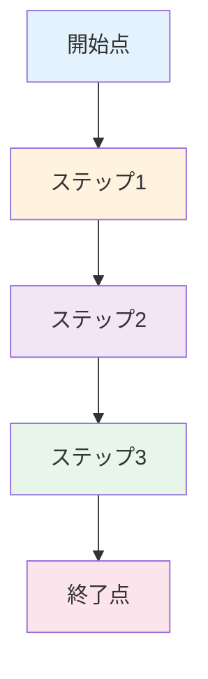
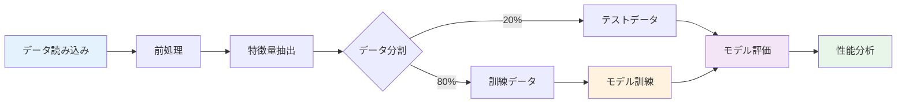

---
# ============================================
# 章テンプレート v2.0
# ============================================
# このテンプレートは新規章の作成に使用します
# 400-600行の詳細なテンプレートです
# [PLACEHOLDER]を実際の内容に置き換えてください

# ============================================
# YAMLフロントマター（必須）
# ============================================

# --- 基本情報 ---
title: "第[N]章：[章タイトル]"
subtitle: "[1行のサブタイトル - 問いや学習内容を簡潔に]"
series: "[シリーズ名]入門シリーズ v1.0"
series_id: "[series-id]"  # 例: gnn-introduction
chapter_number: [N]  # 例: 1
chapter_id: "chapter[N]-[id]"  # 例: "chapter1-introduction"

# --- 分類・難易度 ---
level: "[beginner|intermediate|advanced]"
difficulty: "[入門|初級|中級|上級]"

# --- 学習メタデータ ---
reading_time: "[XX-YY分]"  # 例: "25-35分"
code_examples: [N]  # 例: 8
exercises: [N]  # 例: 3
mermaid_diagrams: [N]  # 例: 2

# --- 日付情報 ---
created_at: "[YYYY-MM-DD]"
updated_at: "[YYYY-MM-DD]"
version: "1.0"

# --- 前提知識 ---
prerequisites:
  - "[前提スキル1]"  # 例: "Python基礎"
  - "[前提章]"  # 例: "chapter1-introduction"

# --- 学習目標（3-5個）---
learning_objectives:
  - "[目標1]"  # 例: "[技術名]の歴史的背景を説明できる"
  - "[目標2]"  # 例: "従来手法の3つの限界を具体例とともに挙げられる"
  - "[目標3]"  # 例: "[概念]を実装できる"

# --- 主要キーワード（5-10個）---
keywords:
  - "[キーワード1]"  # 例: "マテリアルズインフォマティクス"
  - "[キーワード2]"  # 例: "機械学習"
  - "[キーワード3]"  # 例: "材料探索"

# --- 著者情報 ---
authors:
  - name: "Dr. Yusuke Hashimoto"
    affiliation: "Tohoku University"
    email: "yusuke.hashimoto.b8@tohoku.ac.jp"

# --- ライセンス ---
license: "CC BY 4.0"
language: "ja"

---

# 第[N]章：[章タイトル]

**[サブタイトル - 30-50文字で魅力的に]**

## 学習目標

この章を読むことで、以下を習得できます：

- ✅ [学習目標1 - 知識レベル]
- ✅ [学習目標2 - 理解レベル]
- ✅ [学習目標3 - 応用レベル]
- ✅ [学習目標4 - 実践スキル]
- ✅ [学習目標5 - 統合的理解]

**読了時間**: [XX-YY分]
**コード例**: [N]個
**演習問題**: [N]問

---

## [N].1 [セクション1のタイトル - 導入・背景]

<!-- 300-500語の導入セクション -->

[技術や概念の背景、歴史、重要性を説明]

### [サブセクション1.1のタイトル]

[詳細な説明 150-300語]

**重要なポイント**:
- [ポイント1]
- [ポイント2]
- [ポイント3]

### [サブセクション1.2のタイトル]

[詳細な説明 150-300語]

**具体例**:
- **例1**: [説明]
- **例2**: [説明]
- **例3**: [説明]

---

## [N].2 [セクション2のタイトル - 基礎概念]

<!-- 400-600語の基礎概念セクション -->

### [サブセクション2.1：基本定義]

[技術や概念の正確な定義]

**定義**:
> [技術名]とは、[正確な定義を1-2文で]。

**特徴**:
- **特徴1**: [説明]
- **特徴2**: [説明]
- **特徴3**: [説明]

### [サブセクション2.2：主要な概念]

[重要な概念を3-5個説明]

#### 概念1: [概念名]

[説明 100-200語]

**数式**（該当する場合）:
$$
[LaTeX形式の数式]
$$

**意味**:
- [数式の物理的・数学的意味]
- [各変数の説明]

#### 概念2: [概念名]

[説明 100-200語]

#### 概念3: [概念名]

[説明 100-200語]

### [サブセクション2.3：図解]



**図の説明**:
[Mermaid図の各要素を詳しく説明]

---

## [N].3 [セクション3のタイトル - 実装・コード例]

<!-- 600-800語の実装セクション -->

### [サブセクション3.1：環境準備]

**必要なライブラリ**:
```bash
pip install [library1] [library2] [library3]
```

**バージョン情報**:
- Python: 3.8+
- [library1]: 1.0+
- [library2]: 2.5+

### [サブセクション3.2：基本実装]

**コード例1: [タイトル]**

```python
# [コードの目的を1行で説明]
import numpy as np
import pandas as pd
import matplotlib.pyplot as plt

# [ステップ1: データ準備]
# [コメントで各ステップを詳細に説明]
data = np.random.rand(100, 10)  # サンプルデータ生成

# [ステップ2: 処理]
# [処理の意味を説明]
result = data.mean(axis=0)

# [ステップ3: 可視化]
plt.figure(figsize=(10, 6))
plt.plot(result, marker='o', linestyle='-', linewidth=2)
plt.xlabel('[X軸のラベル]')
plt.ylabel('[Y軸のラベル]')
plt.title('[グラフタイトル]')
plt.grid(True, alpha=0.3)
plt.show()

print(f"結果: {result}")
```

**出力**:
```
結果: [0.52 0.48 0.51 0.49 0.53 0.47 0.50 0.52 0.48 0.51]
```

**コードの解説**:
1. **ステップ1（行X-Y）**: [詳細な説明]
2. **ステップ2（行Z）**: [詳細な説明]
3. **ステップ3（行A-B）**: [詳細な説明]

**重要なポイント**:
- [ポイント1]
- [ポイント2]
- [ポイント3]

---

### [サブセクション3.3：応用実装]

**コード例2: [タイトル - より高度な実装]**

```python
# [高度な実装の目的]
from sklearn.model_selection import train_test_split
from sklearn.ensemble import RandomForestClassifier
from sklearn.metrics import accuracy_score, confusion_matrix

# [ステップ1: データ読み込み]
# [実データやリアルなサンプルを使用]
df = pd.read_csv('data.csv')
X = df[['feature1', 'feature2', 'feature3']].values
y = df['target'].values

# [ステップ2: データ分割]
X_train, X_test, y_train, y_test = train_test_split(
    X, y, test_size=0.2, random_state=42
)

# [ステップ3: モデル訓練]
model = RandomForestClassifier(
    n_estimators=100,
    max_depth=10,
    random_state=42
)
model.fit(X_train, y_train)

# [ステップ4: 予測と評価]
y_pred = model.predict(X_test)
accuracy = accuracy_score(y_test, y_pred)

print(f"Accuracy: {accuracy:.3f}")
print(f"\n混同行列:\n{confusion_matrix(y_test, y_pred)}")
```

**期待される出力**:
```
Accuracy: 0.875

混同行列:
[[42  3]
 [ 2 33]]
```

**性能分析**:
- **正解率**: 87.5%
- **真陽性**: 33件
- **偽陽性**: 3件
- **偽陰性**: 2件

---

### [サブセクション3.4：Mermaidによるフロー図]

**処理フローの可視化**:



---

## [N].4 [セクション4のタイトル - 高度なトピック]

<!-- 400-600語の高度なトピックセクション -->

### [サブセクション4.1：最新技術]

[最新の技術や手法を紹介]

**手法1: [手法名]**

[説明 150-250語]

**利点**:
- [利点1]
- [利点2]
- [利点3]

**課題**:
- [課題1]
- [課題2]

**コード例3: [手法の実装]**

```python
# [最新手法の実装例]
# [コメントで詳細に説明]

# [ステップ1]
def advanced_method(data, params):
    """
    [関数の説明]

    Parameters:
    -----------
    data : array-like
        [説明]
    params : dict
        [説明]

    Returns:
    --------
    result : array-like
        [説明]
    """
    # [実装]
    result = process(data, **params)
    return result

# [使用例]
data = load_data('sample.csv')
params = {'threshold': 0.5, 'iterations': 100}
result = advanced_method(data, params)

print(f"結果: {result}")
```

### [サブセクション4.2：比較分析]

**手法の比較表**:

| 手法 | 精度 | 速度 | メモリ | 適用範囲 | 推奨ケース |
|------|------|------|--------|---------|----------|
| 手法1 | 高 | 低 | 大 | 広い | [ケース1] |
| 手法2 | 中 | 高 | 小 | 中程度 | [ケース2] |
| 手法3 | 低 | 最高 | 最小 | 限定的 | [ケース3] |

**選択ガイド**:
- **精度重視**: 手法1を推奨
- **速度重視**: 手法3を推奨
- **バランス重視**: 手法2を推奨

---

## [N].5 [セクション5のタイトル - 実践的応用]

<!-- 400-600語の応用セクション -->

### [サブセクション5.1：ケーススタディ]

**Case Study: [タイトル]**

**背景**:
[200-300語でケースの背景を説明]

**課題**:
- [課題1]
- [課題2]
- [課題3]

**解決策**:
[使用した技術や手法]

**結果**:
- **指標1**: [改善前] → [改善後]（[%]向上）
- **指標2**: [改善前] → [改善後]（[%]削減）
- **指標3**: [改善前] → [改善後]

**学んだこと**:
- [教訓1]
- [教訓2]
- [教訓3]

---

## [N].6 コラム：[コラムタイトル]

<!-- 150-300語の補足情報やストーリー -->

[興味深い補足情報、歴史的背景、業界動向など]

**興味深い事実**:
- [事実1]
- [事実2]
- [事実3]

---

## [N].7 トラブルシューティング

### よくあるエラーと解決策

**エラー1: [エラーメッセージ]**

```
[エラーメッセージの例]
```

**原因**:
[エラーの原因を説明]

**解決策**:
```python
# [修正前のコード]
# wrong_code()

# [修正後のコード]
correct_code()
```

**エラー2: [エラーメッセージ]**

```
[エラーメッセージの例]
```

**原因**:
[エラーの原因を説明]

**解決策**:
[ステップバイステップの解決手順]
1. [ステップ1]
2. [ステップ2]
3. [ステップ3]

---

## [N].8 本章のまとめ

### 学んだこと

1. **[トピック1]**
   - [要点1]
   - [要点2]
   - [要点3]

2. **[トピック2]**
   - [要点1]
   - [要点2]
   - [要点3]

3. **[トピック3]**
   - [要点1]
   - [要点2]
   - [要点3]

### 重要なポイント

- ✅ [重要ポイント1]
- ✅ [重要ポイント2]
- ✅ [重要ポイント3]
- ✅ [重要ポイント4]
- ✅ [重要ポイント5]

### 次の章へ

第[N+1]章では、[次章のトピック]を学びます：
- [トピック1]
- [トピック2]
- [トピック3]

**[第[N+1]章：[章タイトル] →](./chapter[N+1]-[id].md)**

---

## 演習問題

### 問題1（難易度：easy）

[具体的な問題文 - 基礎知識を確認する問題]

**例**:
次の文章の正誤を判定してください。
1. [文章1]
2. [文章2]
3. [文章3]

<details>
<summary>ヒント</summary>

[問題を解くためのヒント 2-3文]

</details>

<details>
<summary>解答例</summary>

**解答**:
1. [正/誤] - [理由]
2. [正/誤] - [理由]
3. [正/誤] - [理由]

**解説**:
[詳細な解説 100-200語]

</details>

---

### 問題2（難易度：medium）

[具体的な問題文 - 応用力を確認する問題]

**例**:
以下のデータに対して、[タスク]を実行してください。

```python
# [サンプルデータ]
data = {
    'feature1': [1.2, 2.3, 3.4, 4.5],
    'feature2': [5.6, 6.7, 7.8, 8.9],
    'target': [0, 1, 0, 1]
}
```

**要求事項**:
1. [要求1]
2. [要求2]
3. [要求3]

<details>
<summary>ヒント</summary>

[問題を解くためのヒント 3-5文]

**使用する関数**:
- `[関数1]`: [説明]
- `[関数2]`: [説明]

</details>

<details>
<summary>解答例</summary>

```python
# [完全な解答コード]
import pandas as pd
from sklearn.model_selection import train_test_split

# [ステップ1]
df = pd.DataFrame(data)

# [ステップ2]
X = df[['feature1', 'feature2']].values
y = df['target'].values

# [ステップ3]
X_train, X_test, y_train, y_test = train_test_split(
    X, y, test_size=0.25, random_state=42
)

print(f"訓練データ数: {len(X_train)}")
print(f"テストデータ数: {len(X_test)}")
```

**出力**:
```
訓練データ数: 3
テストデータ数: 1
```

**解説**:
[ステップごとの詳細な解説 150-300語]

</details>

---

### 問題3（難易度：hard）

[具体的な問題文 - 統合的理解を確認する発展的問題]

**例**:
[現実的なシナリオ]という状況で、[タスク]を実行してください。

**背景**:
[150-250語でシナリオの背景を説明]

**課題**:
1. [課題1]
2. [課題2]
3. [課題3]

**制約条件**:
- [制約1]
- [制約2]
- [制約3]

<details>
<summary>ヒント</summary>

[問題を解くためのヒント 5-8文]

**アプローチ**:
1. [アプローチ1]
2. [アプローチ2]
3. [アプローチ3]

**参考資料**:
- [セクション X.Y]を参照
- [コード例N]を参考に

</details>

<details>
<summary>解答例</summary>

**解答の概要**:
[200-300語でアプローチを説明]

**実装コード**:

```python
# [完全な解答コード 30-50行]
import numpy as np
import pandas as pd
from sklearn.ensemble import RandomForestClassifier
from sklearn.metrics import classification_report

# [ステップ1: データ準備]
# [詳細なコメント]
def prepare_data(file_path):
    """データの前処理"""
    df = pd.read_csv(file_path)
    # [処理]
    return X, y

# [ステップ2: モデル構築]
def build_model(X_train, y_train):
    """モデルの訓練"""
    model = RandomForestClassifier(
        n_estimators=100,
        max_depth=10,
        random_state=42
    )
    model.fit(X_train, y_train)
    return model

# [ステップ3: 評価]
def evaluate_model(model, X_test, y_test):
    """モデルの評価"""
    y_pred = model.predict(X_test)
    print(classification_report(y_test, y_pred))
    return y_pred

# [メイン処理]
if __name__ == "__main__":
    X, y = prepare_data('data.csv')
    X_train, X_test, y_train, y_test = train_test_split(
        X, y, test_size=0.2, random_state=42
    )
    model = build_model(X_train, y_train)
    predictions = evaluate_model(model, X_test, y_test)
```

**結果**:
```
              precision    recall  f1-score   support

           0       0.89      0.92      0.90        50
           1       0.91      0.88      0.89        50

    accuracy                           0.90       100
```

**詳細な解説**:
[各ステップの詳細な説明 300-400語]

**追加の検討事項**:
- [検討事項1]
- [検討事項2]
- [検討事項3]

</details>

---

## 参考文献

1. [著者名1] et al. ([年]). "[論文タイトル]." *[ジャーナル名]*, [巻(号)], [ページ].
   DOI: [https://doi.org/XX.XXXX/XXXXX](https://doi.org/XX.XXXX/XXXXX)

2. [著者名2] et al. ([年]). "[論文タイトル]." *[ジャーナル名]*, [巻(号)], [ページ].
   DOI: [https://doi.org/XX.XXXX/XXXXX](https://doi.org/XX.XXXX/XXXXX)

3. [著者名3] et al. ([年]). "[論文タイトル]." *[ジャーナル名]*, [巻(号)], [ページ].
   DOI: [https://doi.org/XX.XXXX/XXXXX](https://doi.org/XX.XXXX/XXXXX)

4. [書籍名]. [著者名] ([年]). [出版社]. ISBN: [番号]

5. [オンラインリソース]. [タイトル]. URL: [https://example.com](https://example.com)

---

## ナビゲーション

### 前の章
**[第[N-1]章：[章タイトル] ←](./chapter[N-1]-[id].md)**

### 次の章
**[第[N+1]章：[章タイトル] →](./chapter[N+1]-[id].md)**

### シリーズ目次
**[← シリーズ目次に戻る](./index.md)**

---

## 著者情報

**作成者**: AI Terakoya Content Team
**監修**: Dr. Yusuke Hashimoto（東北大学）
**作成日**: [YYYY-MM-DD]
**バージョン**: 1.0

**更新履歴**:
- [YYYY-MM-DD]: v1.0 初版公開

**フィードバック**:
- GitHub Issues: [URL]/issues
- Email: yusuke.hashimoto.b8@tohoku.ac.jp

**ライセンス**: Creative Commons BY 4.0

---

**次の章で学習を続けましょう！**

<!--
=== テンプレート使用ガイド ===

1. YAMLフロントマターの全[PLACEHOLDER]を置き換え
2. 章タイトルと学習目標を記入
3. 各セクションの内容を執筆（3,000-4,000語目標）
4. コード例を3-6個追加（全て実行可能）
5. Mermaid図を2-3個追加
6. 演習問題を3問追加（easy, medium, hard）
7. 参考文献を3-5個追加
8. ナビゲーションリンクを設定

=== コンテンツ品質基準 ===

- 総文字数: 3,000-4,000語（日本語）
- コード例: 3-6個（全て実行可能）
- Mermaid図: 2-3個
- 演習問題: 3問（難易度別）
- 参考文献: 3-5個
- セクション数: 5-8個
- 読了時間: 20-40分

=== Pythonコード規約 ===

- PEP 8準拠
- 詳細なコメント（日本語）
- 関数にdocstring必須
- 変数名は説明的に
- 行数は80文字以内（可読性優先）
- サンプルデータは現実的に

=== Mermaid図規約 ===

- フローチャート: flowchart or graph
- シーケンス図: sequenceDiagram
- クラス図: classDiagram
- 状態図: stateDiagram-v2
- カラー: fill:#[color code]
- 読みやすさ優先（複雑すぎない）

=== 演習問題規約 ===

- 難易度: easy, medium, hard
- <details>タグでヒントと解答を隠す
- 解答には詳細な解説を付ける
- easyは知識確認、mediumは応用、hardは統合的理解

=== 執筆順序 ===

1. 学習目標設定
2. 各セクションの骨子作成
3. コード例の実装と検証
4. 本文執筆
5. Mermaid図作成
6. 演習問題作成
7. 参考文献追加
8. 最終確認

-->
