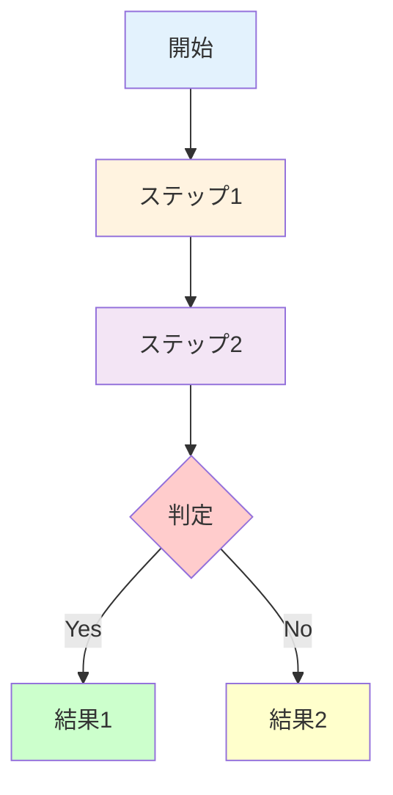

---
# 章テンプレート（Chapter Template）
# このテンプレートをコピーして新しい章のMarkdownファイルを作成してください

# ============================================
# メタデータ（YAML Frontmatter）
# ============================================

# 章基本情報
title: "[章タイトル]"  # 例: "第1章：なぜ材料科学にGNNが必要か"
subtitle: "[サブタイトル]"  # 例: "グラフ表現の基礎と必要性"
chapter_number: [章番号]  # 例: 1
section_count: [セクション数]  # 例: 6

# 学習メタデータ
level: "[レベル]"  # "beginner" | "intermediate" | "advanced"
difficulty: "[難易度（日本語）]"  # "入門" | "初級" | "中級" | "上級"
target_audience: "[対象読者]"  # "undergraduate" | "graduate" | "professional"
estimated_time: "[読了時間]"  # 例: "25-30分"

# 学習目標
learning_objectives:
  - "[学習目標1]"  # 例: "グラフ表現の基礎概念を理解する"
  - "[学習目標2]"  # 例: "材料・分子のグラフ表現方法を説明できる"
  - "[学習目標3]"  # 例: "GNNの必要性を具体例とともに説明できる"
  - "[学習目標4（オプション）]"

# トピック・キーワード
topics:
  - "[トピック1]"  # 例: "graph-representation"
  - "[トピック2]"  # 例: "materials-informatics"
  - "[トピック3]"  # 例: "neural-networks"

keywords:
  - "[キーワード1]"  # 例: "グラフニューラルネットワーク"
  - "[キーワード2]"  # 例: "分子表現"
  - "[キーワード3]"  # 例: "材料記述子"

# 前提知識
prerequisites:
  - "[前提知識1]"  # 例: "基礎化学"
  - "[前提知識2]"  # 例: "Python基礎"
  - "[前提知識3（オプション）]"

# シリーズ情報
series: "[シリーズ名]"  # 例: "GNN入門シリーズ v1.0"
series_id: "[シリーズID]"  # 例: "gnn-introduction"
series_order: [この章の順序]  # 例: 1

# コード例
code_examples: [コード例数]  # 例: 8（この章のコード例総数）
has_interactive_examples: [true/false]  # インタラクティブな例があるか
colab_notebook: "[Colabノートブック URL]"  # 例: "https://colab.research.google.com/..."

# 演習問題
exercises:
  easy: [easy問題数]  # 例: 2
  medium: [medium問題数]  # 例: 2
  hard: [hard問題数]  # 例: 1

# ナビゲーション
navigation:
  previous:
    title: "[前章タイトル]"  # 例: "シリーズ目次"
    url: "[前章URL]"  # 例: "./index.html"
  next:
    title: "[次章タイトル]"  # 例: "第2章：GNNの基礎理論"
    url: "[次章URL]"  # 例: "./chapter2-fundamentals.html"

# バージョン情報
version: "[バージョン]"  # 例: "1.0"
created_at: "[作成日]"  # 例: "2025-10-20"
updated_at: "[更新日]"  # 例: "2025-10-20"
template_version: "1.0"

# 著者情報
author:
  name: "[著者名]"
  role: "[役割]"  # 例: "Content Creator"

# ライセンス
license: "CC BY 4.0"

---

# [章タイトル]

## 学習目標

この章を読むことで、以下を習得できます：
- [学習目標1の詳細説明]
- [学習目標2の詳細説明]
- [学習目標3の詳細説明]
- [学習目標4の詳細説明（オプション）]

---

## [セクション番号] [セクションタイトル]

[セクションの導入文。このセクションで何を学ぶかを明確に述べる]

### [サブセクションタイトル（必要に応じて）]

[本文内容。段落は2-3文程度で区切り、読みやすさを重視]

**重要なポイント:**
- [ポイント1]
- [ポイント2]
- [ポイント3]

**例: [具体例のタイトル]**

[具体例の説明。実際の応用や事例を示す]

```
[必要に応じて、テキストベースの図や表を挿入]
例:
材料A → 特性X: 高
材料B → 特性Y: 低
```

### [図表: [図表タイトル]]

[Mermaidダイアグラムを使用する場合]



**図の説明**: [図の内容を簡潔に説明]

### [比較表: [表タイトル]]

| 項目 | 手法A | 手法B | 比較 |
|------|-------|-------|------|
| **特性1** | [値] | [値] | [比較コメント] |
| **特性2** | [値] | [値] | [比較コメント] |
| **特性3** | [値] | [値] | [比較コメント] |

---

## [セクション番号] [セクションタイトル]

### [数式を含むセクション（必要に応じて）]

[数式の説明文]

**数式:**

$$
[LaTeX形式の数式]
$$

ここで、
- $[変数1]$ : [変数の説明]
- $[変数2]$ : [変数の説明]
- $[変数3]$ : [変数の説明]

**例: [数式の具体例]**

[数値例を用いた計算]

---

## [セクション番号] [コード例を含むセクション]

### [コード例タイトル]

[コードの目的と背景を説明]

**ステップ:**
1. [ステップ1の説明]
2. [ステップ2の説明]
3. [ステップ3の説明]

**コード: [コードの名前]**

```python
# [コードの説明コメント]
import [必要なライブラリ]

# [セクション1: データ準備]
[コード行1]
[コード行2]

# [セクション2: モデル構築]
[コード行3]
[コード行4]

# [セクション3: 実行・評価]
[コード行5]
[コード行6]

# 結果の表示
print(f"結果: {[変数名]}")
```

**期待される出力:**

```
結果: [期待される出力内容]
```

**コードの解説:**

1. **行[N]-[M]**: [この部分の説明]
2. **行[N]-[M]**: [この部分の説明]
3. **行[N]-[M]**: [この部分の説明]

**ポイント:**
- [ポイント1: 注意すべき点や改善のヒント]
- [ポイント2]

### [トラブルシューティング（必要に応じて）]

**よくあるエラーと解決策:**

| エラー | 原因 | 解決策 |
|--------|------|--------|
| `[エラーメッセージ1]` | [原因] | [解決策] |
| `[エラーメッセージ2]` | [原因] | [解決策] |

---

## [セクション番号] [ケーススタディセクション]

### [ケーススタディ: [タイトル]]

**背景:**
[ケーススタディの背景説明]

**課題:**
[解決すべき課題]

**アプローチ:**
1. **[アプローチ1]**: [説明]
2. **[アプローチ2]**: [説明]
3. **[アプローチ3]**: [説明]

**結果:**
- **定量的成果**: [数値での成果。例: "予測精度85%達成"]
- **開発期間**: [時間短縮など]
- **コスト削減**: [コスト面での改善]

**影響:**
[産業・社会への影響]

**論文:**
[著者]. ([年]). "[タイトル]." *[ジャーナル名]*, [巻]([号]), [ページ].
DOI: [10.xxxx/xxxxx](URL)

**学べること:**
- [学び1]
- [学び2]
- [学び3]

---

## [セクション番号] [コラム（オプション）]

### [コラムタイトル]

[コラムの内容。本文とは別の観点や、興味深い補足情報を提供]

**ポイント:**
- [ポイント1]
- [ポイント2]

---

## [章番号] 本章のまとめ

### 学んだこと

1. **[トピック1]**
   - [要点1]
   - [要点2]
   - [要点3]

2. **[トピック2]**
   - [要点1]
   - [要点2]
   - [要点3]

3. **[トピック3]**
   - [要点1]
   - [要点2]

### 重要なポイント

- [重要ポイント1]
- [重要ポイント2]
- [重要ポイント3]
- [重要ポイント4]

### 次の章へ

第[N]章では、[次章の内容概要]：
- [学ぶ内容1]
- [学ぶ内容2]
- [学ぶ内容3]

**[第[N]章: [タイトル] →](./chapter[N]-[slug].html)**

---

## 演習問題

### 問題1（難易度：easy）

[問題文。基本的な理解を確認する問題]

<details>
<summary>ヒント</summary>

[ヒントの内容。問題を解くための手がかり]

</details>

<details>
<summary>解答例</summary>

**解答:**

[詳細な解答。ステップバイステップで説明]

**解説:**

[解答の背景にある概念や、なぜその答えになるかの説明]

</details>

---

### 問題2（難易度：easy）

[問題文]

<details>
<summary>ヒント</summary>

[ヒント]

</details>

<details>
<summary>解答例</summary>

**解答:**

[解答内容]

**コード（必要な場合）:**

```python
# 解答コード
[コード]
```

**出力:**

```
[期待される出力]
```

</details>

---

### 問題3（難易度：medium）

[より応用的な問題文]

<details>
<summary>ヒント</summary>

[ヒント。複数のステップがある場合は番号付きリストで]

1. [ヒント1]
2. [ヒント2]
3. [ヒント3]

</details>

<details>
<summary>解答例</summary>

**解答:**

[詳細な解答]

**ステップバイステップ解説:**

1. **[ステップ1]**: [説明]
2. **[ステップ2]**: [説明]
3. **[ステップ3]**: [説明]

**完全なコード:**

```python
# 完全な解答コード
[コード]
```

**結果の解釈:**

[結果の意味と、なぜこの結果が重要かの説明]

</details>

---

### 問題4（難易度：medium）

[問題文]

<details>
<summary>ヒント</summary>

[ヒント]

</details>

<details>
<summary>解答例</summary>

[解答]

</details>

---

### 問題5（難易度：hard）

[応用問題・発展問題]

<details>
<summary>ヒント</summary>

[ヒント]

</details>

<details>
<summary>解答例</summary>

**解答:**

[詳細な解答]

**拡張アイデア:**

このアプローチをさらに発展させるには：
- [拡張アイデア1]
- [拡張アイデア2]
- [拡張アイデア3]

</details>

---

## さらに学びを深めるために

### 推奨リソース

**論文:**
1. [著者]. ([年]). "[タイトル]." *[ジャーナル名]*.
   DOI: [DOI](URL)
   - **概要**: [論文の簡単な説明]
   - **レベル**: [beginner/intermediate/advanced]

2. [著者]. ([年]). "[タイトル]." *[ジャーナル名]*.
   DOI: [DOI](URL)
   - **概要**: [論文の簡単な説明]
   - **レベル**: [beginner/intermediate/advanced]

**書籍:**
- [著者]. *[書籍タイトル]*. [出版社], [年].
  - **関連章**: [関連する章番号]
  - **推奨度**: [★★★★★ / ★★★★☆ など]

**オンラインリソース:**
- [[リソース名]](URL) - [説明]
- [[リソース名]](URL) - [説明]

**ビデオ:**
- [[ビデオタイトル]](URL) - [説明] ([時間])

---

## 参考文献

1. [著者]. ([年]). "[タイトル]." *[ジャーナル名]*, [巻]([号]), [ページ].
   DOI: [10.xxxx/xxxxx](https://doi.org/10.xxxx/xxxxx)

2. [著者]. ([年]). "[タイトル]." *[ジャーナル名]*, [巻]([号]), [ページ].
   DOI: [10.xxxx/xxxxx](https://doi.org/10.xxxx/xxxxx)

3. [著者]. ([年]). "[タイトル]." *[ジャーナル名]*, [巻]([号]), [ページ].
   DOI: [10.xxxx/xxxxx](https://doi.org/10.xxxx/xxxxx)

4. [著者]. ([年]). "[タイトル]." *[ジャーナル名]*, [巻]([号]), [ページ].
   DOI: [10.xxxx/xxxxx](https://doi.org/10.xxxx/xxxxx)

5. [著者]. ([年]). "[タイトル]." *[ジャーナル名]*, [巻]([号]), [ページ].
   DOI: [10.xxxx/xxxxx](https://doi.org/10.xxxx/xxxxx)

---

## 用語集（この章で登場した重要用語）

- **[用語1]**: [定義と説明]
- **[用語2]**: [定義と説明]
- **[用語3]**: [定義と説明]
- **[用語4]**: [定義と説明]
- **[用語5]**: [定義と説明]

---

## 著者情報

**作成者**: [作成者名]
**監修**: [監修者名]（[所属]）
**作成日**: [作成日]
**バージョン**: [バージョン]（[章タイトル]）
**テンプレート**: chapter-template.md v1.0

**更新履歴**:
- **[日付]**: v[バージョン] [変更内容]
- **[日付]**: v[バージョン] [変更内容]

**ライセンス**: Creative Commons BY 4.0

---

## ナビゲーション

<div class="nav-buttons">
    <a href="[前章URL]" class="nav-button">← [前章タイトル]</a>
    <a href="./index.html" class="nav-button">シリーズ目次</a>
    <a href="[次章URL]" class="nav-button">[次章タイトル] →</a>
</div>

---

**次の章で、さらに深く学んでいきましょう！**
