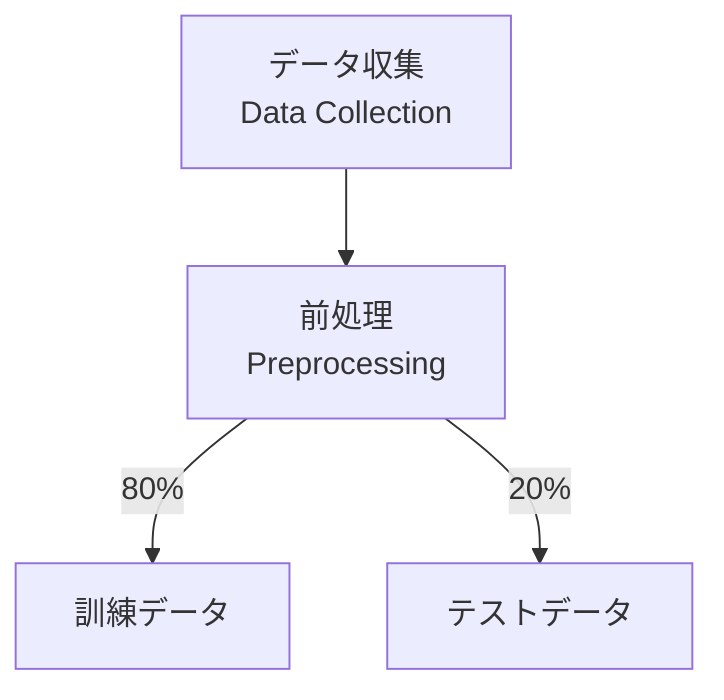

# MI寺子屋 スタイルガイド v2.0

**Materials Informatics Terakoya - Content Style Guide**

**作成日**: 2025-10-17
**バージョン**: 2.0
**対象**: コンテンツ作成者、編集者、レビュアー

---

## 目次

1. [はじめに](#1-はじめに)
2. [Markdownフォーマット規約](#2-markdownフォーマット規約)
3. [コードブロック規約](#3-コードブロック規約)
4. [Mermaid図表規約](#4-mermaid図表規約)
5. [日本語文章規約](#5-日本語文章規約)
6. [セクション番号付け規約](#6-セクション番号付け規約)
7. [リンク規約](#7-リンク規約)
8. [画像・図表規約](#8-画像図表規約)
9. [演習問題規約](#9-演習問題規約)
10. [参考文献規約](#10-参考文献規約)
11. [YAMLフロントマター規約](#11-yamlフロントマター規約)
12. [品質チェックリスト](#12-品質チェックリスト)

---

## 1. はじめに

### 1.1 このガイドの目的

このスタイルガイドは、MI寺子屋プロジェクトの全コンテンツにおいて、**一貫性**、**読みやすさ**、**保守性**を確保するための標準ルールを定めます。

### 1.2 適用範囲

- シリーズindex.md（全シリーズ）
- 各章のMarkdownファイル（chapterN-*.md）
- HTML変換後のファイル
- 関連ドキュメント（README、CONTRIBUTING）

### 1.3 原則

1. **一貫性（Consistency）**: 全コンテンツで同じルールを適用
2. **読みやすさ（Readability）**: 初学者でも理解しやすい表現
3. **保守性（Maintainability）**: 将来の更新・修正が容易
4. **アクセシビリティ（Accessibility）**: スクリーンリーダー対応
5. **再現性（Reproducibility）**: 全コード例が実行可能

---

## 2. Markdownフォーマット規約

### 2.1 見出し（Headers）

**ルール**:
- `#`（H1）は章タイトルのみに使用
- `##`（H2）はセクション番号付き（例: `## 1.1 セクション名`）
- `###`（H3）はサブセクション
- `####`（H4）はサブサブセクション
- H5、H6は使用しない（深すぎる階層を避ける）

**正しい例**:
```markdown
# 第1章：なぜ今マテリアルズインフォマティクスなのか

## 1.1 材料開発の歴史

### 古代：偶然の発見の時代

#### 青銅器時代（紀元前3000年頃）
```

**間違った例**:
```markdown
## 第1章：なぜ今マテリアルズインフォマティクスなのか  ❌（H1を使うべき）

# 1.1 材料開発の歴史  ❌（H2を使うべき）

##### サブサブサブセクション  ❌（H5は使わない）
```

### 2.2 強調（Emphasis）

**ルール**:
- **太字**（`**text**`）: 重要な概念、キーワード
- *斜体*（`*text*`）: 英語の書籍名、専門用語の初出
- `インラインコード`（`` `code` ``）: 関数名、変数名、コマンド

**正しい例**:
```markdown
**マテリアルズ・インフォマティクス（MI）**とは、材料科学とデータサイエンスを融合した新しい研究手法です。

*Nature Materials*に掲載された論文で、`scikit-learn`ライブラリを使用しています。
```

**間違った例**:
```markdown
マテリアルズ・インフォマティクス（MI）とは、  ❌（キーワードは太字）

Nature Materialsに掲載された論文  ❌（英語書籍名は斜体）

scikit-learnライブラリ  ❌（ライブラリ名はインラインコード）
```

### 2.3 リスト（Lists）

**ルール**:
- 箇条書きは`-`（ハイフン）を使用
- 番号付きリストは`1.`、`2.`、`3.`（自動番号付けは使わない）
- ネストは2レベルまで
- リスト項目は1行に収める（長い場合は分割）

**正しい例**:
```markdown
**課題**:
- 時間がかかる: 平均15-20年
- コストが高い: 1材料あたり100-700万円
- 探索範囲が限られる: 年間10-30種類のみ

**開発フェーズ**:
1. 基礎研究（1970年代）
2. 負極材料の開発（1980年代）
3. 電解液の最適化（1980年代後半）
4. 実用化（1991年）
```

**間違った例**:
```markdown
* 課題1  ❌（`-`を使用）
+ 課題2  ❌（`-`を使用）

1) 基礎研究  ❌（`.`を使用）
```

### 2.4 引用（Blockquotes）

**ルール**:
- `>`を使用
- 定義、重要な引用、注意事項に使用
- 改行は`>`の後に空行を入れる

**正しい例**:
```markdown
> **定義**: マテリアルズ・インフォマティクス（MI）とは、材料科学とデータサイエンスを融合し、計算・実験・データベースを統合して材料開発を加速する手法です。

> **注意**: このコードはPython 3.8以降で動作します。
```

### 2.5 水平線（Horizontal Rules）

**ルール**:
- `---`（ハイフン3つ）を使用
- セクションの区切りに使用
- 前後に空行を入れる

**正しい例**:
```markdown
## 1.1 セクション1

内容...

---

## 1.2 セクション2

内容...
```

---

## 3. コードブロック規約

### 3.1 言語タグ（Language Tags）

**ルール**:
- 必ず言語タグを指定
- Pythonコードは`python`
- Bashコマンドは`bash`
- 出力は`text`または言語タグなし

**正しい例**:
````markdown
```python
import numpy as np

data = np.random.rand(100, 10)
print(data.shape)
```

```bash
pip install numpy pandas matplotlib
```

```
出力: (100, 10)
```
````

**間違った例**:
````markdown
```  ❌（言語タグを指定）
import numpy as np
```

```py  ❌（`python`を使用）
import numpy as np
```
````

### 3.2 コメント規約

**ルール**:
- 全てのコードに日本語コメントを付ける
- ステップごとにコメントを分ける
- コメントは処理の**目的**を説明（何をするかではなく、なぜするか）
- 関数には必ずdocstringを付ける

**正しい例**:
```python
# ステップ1: データの読み込みと前処理
# 欠損値を含む行を削除し、特徴量を正規化
df = pd.read_csv('data.csv')
df = df.dropna()  # 欠損値削除
df = (df - df.mean()) / df.std()  # 標準化

# ステップ2: 訓練データとテストデータに分割
# 再現性のためrandom_state=42を固定
X_train, X_test, y_train, y_test = train_test_split(
    X, y, test_size=0.2, random_state=42
)

def calculate_accuracy(y_true, y_pred):
    """
    精度（Accuracy）を計算する

    Parameters:
    -----------
    y_true : array-like
        正解ラベル
    y_pred : array-like
        予測ラベル

    Returns:
    --------
    accuracy : float
        精度（0.0-1.0の範囲）
    """
    correct = (y_true == y_pred).sum()
    total = len(y_true)
    return correct / total
```

**間違った例**:
```python
df = pd.read_csv('data.csv')  # データを読み込む  ❌（当たり前のことを書かない）

X_train, X_test, y_train, y_test = train_test_split(X, y, test_size=0.2, random_state=42)  # 分割  ❌（なぜこのパラメータかを説明）
```

### 3.3 変数名規約

**ルール**:
- PEP 8準拠（snake_case）
- 説明的な名前を使用（`x`、`tmp`などは避ける）
- 一時変数も意味のある名前に

**正しい例**:
```python
band_gap_energy = 2.5  # eV
formation_energy_per_atom = -1.2  # eV/atom
lithium_concentration = 0.3  # mol fraction
```

**間違った例**:
```python
x = 2.5  ❌（何の値か不明）
tmp = -1.2  ❌（一時変数でも説明的に）
c = 0.3  ❌（略語は避ける）
```

### 3.4 行長制限

**ルール**:
- 1行は80文字以内（可読性優先）
- 長い行は適切に改行
- 改行位置はPEP 8に従う

**正しい例**:
```python
# 関数呼び出しが長い場合
model = RandomForestClassifier(
    n_estimators=100,
    max_depth=10,
    min_samples_split=5,
    random_state=42
)

# リストが長い場合
features = [
    'band_gap', 'formation_energy', 'volume',
    'density', 'ionic_conductivity', 'thermal_stability'
]
```

### 3.5 実行可能性

**ルール**:
- 全てのコード例は実行可能でなければならない
- サンプルデータを含める（外部ファイル依存を避ける）
- 必要なライブラリを明記
- エラーが出ないことを確認

**正しい例**:
```python
# サンプルデータを直接定義（外部ファイル不要）
import numpy as np
import pandas as pd

# サンプルデータ生成
np.random.seed(42)
data = {
    'band_gap': np.random.uniform(0, 5, 100),
    'formation_energy': np.random.uniform(-5, 0, 100),
    'target': np.random.choice([0, 1], 100)
}
df = pd.DataFrame(data)

# 以下、処理...
```

---

## 4. Mermaid図表規約

### 4.1 図表の種類

**使用可能な図表**:
- `flowchart`または`graph`: フローチャート、ワークフロー図
- `sequenceDiagram`: シーケンス図（あまり使用しない）
- `classDiagram`: クラス図（必要時のみ）
- `stateDiagram-v2`: 状態図（必要時のみ）

**推奨**: `flowchart`を主に使用

### 4.2 スタイル規約

**ルール**:
- ノードIDは大文字アルファベット（A, B, C...）
- サブグラフには明確な名前を付ける
- カラーは以下の標準パレットから選択
  - `#e3f2fd`: 淡い青（開始・データ）
  - `#fff3e0`: 淡いオレンジ（処理）
  - `#f3e5f5`: 淡い紫（モデル・分析）
  - `#e8f5e9`: 淡い緑（結果・成功）
  - `#fce4ec`: 淡いピンク（終了・評価）

**正しい例**:
````markdown

````

### 4.3 複雑度の制限

**ルール**:
- 1つの図に含めるノードは15個以下
- サブグラフは3階層まで
- 複雑な図は分割する

**正しい例**:
複雑な場合は2つの図に分割
````markdown
**フェーズ1: データ準備**


**フェーズ2: モデル構築**

````

### 4.4 ラベルの日本語化

**ルール**:
- ノードラベルは日本語
- 英語の専門用語は併記（例: `[機械学習\nMachine Learning]`）
- 矢印ラベルは簡潔に

**正しい例**:
````markdown

````

---

## 5. 日本語文章規約

### 5.1 トーン・スタイル

**ルール**:
- 敬体（です・ます調）を使用
- 丁寧語で統一（尊敬語・謙譲語は避ける）
- 読者を「あなた」と呼ばない（「読者」「学習者」も避ける）
- 断定的表現を使用（「〜と考えられます」→「〜です」）

**正しい例**:
```
マテリアルズ・インフォマティクス（MI）は、材料科学とデータサイエンスを融合した新しい研究手法です。

この手法により、材料開発期間を大幅に短縮できます。
```

**間違った例**:
```
MIは、材料科学とデータサイエンスを融合した手法である。  ❌（常体は避ける）

あなたはこの章で基礎を学びます。  ❌（「あなた」は使わない）

材料開発期間を短縮できると考えられます。  ❌（断定的に）
```

### 5.2 専門用語の扱い

**ルール**:
- 初出時に英語を併記: `マテリアルズ・インフォマティクス（Materials Informatics, MI）`
- 2回目以降は略語を使用: `MI`
- 英語のみの用語は初出時に定義
- カタカナ語の乱用を避ける

**正しい例**:
```
第1段落（初出）:
マテリアルズ・インフォマティクス（Materials Informatics, MI）は...

第2段落以降:
MIの主な目的は...
```

### 5.3 数値の表記

**ルール**:
- 3桁ごとにカンマ: `10,000`、`1,000,000`
- 単位は半角スペースを入れる: `100 kg`、`3.5 eV`
- 範囲は`〜`（波ダッシュ）: `10〜20年`、`100〜150分`
- パーセントは`%`: `95%`

**正しい例**:
```
Materials Projectには140,000種類以上の材料データが含まれています。

リチウムイオン電池のエネルギー密度は約200 Wh/kgです。

開発期間は15〜20年かかります。

成功率は5〜10%です。
```

### 5.4 句読点

**ルール**:
- 句点は`。`（全角）
- 読点は`、`（全角）
- 英語の文中では`,`（半角カンマ）と`.`（半角ピリオド）
- 括弧は`（）`（全角）、英数字のみの場合は`()`（半角）

**正しい例**:
```
材料開発には、時間、コスト、探索範囲の3つの課題があります。

Materials Projectには140,000種類以上のデータが含まれています。

開発期間（15〜20年）を大幅に短縮できます。

Accuracy: 0.875 (87.5%)
```

---

## 6. セクション番号付け規約

### 6.1 章レベル番号

**ルール**:
- 第N章: 大見出しは`# 第N章：[タイトル]`
- セクション: `## N.1 [セクション名]`、`## N.2 [セクション名]`
- サブセクション: `### [サブセクション名]`（番号なし）

**正しい例**:
```markdown
# 第1章：なぜ今マテリアルズインフォマティクスなのか

## 1.1 材料開発の歴史

### 古代：偶然の発見の時代

#### 青銅器時代（紀元前3000年頃）

## 1.2 従来の材料開発の限界

### 課題1：時間がかかる
```

### 6.2 特殊セクション

**番号を付けないセクション**:
- 学習目標
- 本章のまとめ
- 演習問題
- 参考文献
- コラム

**正しい例**:
```markdown
## 学習目標

## 本章のまとめ

## 演習問題

## 参考文献

## 1.5 コラム：材料科学者の一日
```

---

## 7. リンク規約

### 7.1 内部リンク（章間）

**ルール**:
- 相対パスを使用
- `.md`拡張子を含める（HTML変換時に自動置換）
- リンクテキストは明確に

**正しい例**:
```markdown
**[第2章：基礎知識と用語 →](./chapter2-fundamentals.md)**

詳細は[第3章](./chapter3-hands-on.md)を参照してください。

**[← シリーズ目次に戻る](./index.md)**
```

**間違った例**:
```markdown
[こちら](./chapter2-fundamentals.md)  ❌（「こちら」は避ける）

[第2章](chapter2-fundamentals.md)  ❌（`./`を付ける）

[第2章](./chapter2-fundamentals.html)  ❌（`.md`を使う）
```

### 7.2 外部リンク

**ルール**:
- HTTPSを使用
- リンク切れを定期的にチェック
- 重要なリンクはDOI付き論文を優先

**正しい例**:
```markdown
[Materials Project](https://materialsproject.org)

DOI: [10.1038/s41524-017-0056-5](https://doi.org/10.1038/s41524-017-0056-5)
```

### 7.3 シリーズ横断リンク

**ルール**:
- 相対パスで他シリーズを参照
- シリーズIDを明確に

**正しい例**:
```markdown
詳細は**[MI入門シリーズ](../mi-introduction/index.md)**を参照してください。

**[ベイズ最適化入門](../bayesian-optimization/chapter1-introduction.md)**で学習した手法を活用します。
```

---

## 8. 画像・図表規約

### 8.1 画像ファイル

**ルール**:
- PNG形式を優先（品質とサイズのバランス）
- ファイル名は説明的に（例: `gnn-architecture.png`）
- `assets/images/[series-id]/`ディレクトリに配置
- 代替テキスト（alt属性）を必ず付ける

**正しい例**:
```markdown

```

### 8.2 図表キャプション

**ルール**:
- 画像の下に太字でキャプションを追加
- 「図N.M」の形式で番号を付ける

**正しい例**:
```markdown


**図1.1: Graph Neural Networkの基本アーキテクチャ**
```

### 8.3 表（Tables）

**ルール**:
- Markdown形式のテーブルを使用
- ヘッダー行を太字に
- 数値は右揃え、テキストは左揃え

**正しい例**:
```markdown
| 手法 | 精度 | 速度 | メモリ | 推奨ケース |
|------|-----:|------|--------|----------|
| 手法1 | 0.92 | 遅い | 大 | 高精度重視 |
| 手法2 | 0.85 | 速い | 小 | 速度重視 |
```

---

## 9. 演習問題規約

### 9.1 難易度ラベル

**ルール**:
- 難易度を明記: `easy`, `medium`, `hard`
- 各章に最低3問（easy 1問、medium 1問、hard 1問）
- 番号は通し番号（問題1、問題2、問題3）

**正しい例**:
```markdown
### 問題1（難易度：easy）

### 問題2（難易度：medium）

### 問題3（難易度：hard）
```

### 9.2 `<details>`タグの使用

**ルール**:
- ヒントと解答は`<details>`タグで隠す
- `<summary>`には「ヒント」または「解答例」
- 前後に空行を入れる（Markdown構文の競合を避ける）

**正しい例**:
```markdown
### 問題1（難易度：easy）

次の文章の正誤を判定してください。

<details>
<summary>ヒント</summary>

第1章のセクション1.2を参照してください。

</details>

<details>
<summary>解答例</summary>

**解答**:
1. 正 - 理由は...
2. 誤 - 理由は...

**解説**:
詳細な解説...

</details>
```

### 9.3 問題の種類

**easyレベル**:
- 知識確認（正誤問題、穴埋め、選択肢）
- 章の内容を直接確認

**mediumレベル**:
- 応用問題（計算、コード穴埋め、簡単な実装）
- 章の内容を組み合わせる

**hardレベル**:
- 統合的問題（実践的シナリオ、完全な実装）
- 複数章の知識を統合

---

## 10. 参考文献規約

### 10.1 引用スタイル

**ルール**:
- APA形式に準拠（簡略版）
- DOI付き論文はDOIリンクを必ず含める
- 番号付きリストで記載

**正しい例**:
```markdown
## 参考文献

1. Ramprasad, R., Batra, R., Pilania, G., Mannodi-Kanakkithodi, A., & Kim, C. (2017). "Machine learning in materials informatics: recent applications and prospects." *npj Computational Materials*, 3(1), 54.
   DOI: [10.1038/s41524-017-0056-5](https://doi.org/10.1038/s41524-017-0056-5)

2. Butler, K. T., Davies, D. W., Cartwright, H., Isayev, O., & Walsh, A. (2018). "Machine learning for molecular and materials science." *Nature*, 559(7715), 547-555.
   DOI: [10.1038/s41586-018-0337-2](https://doi.org/10.1038/s41586-018-0337-2)

3. Materials Project: [https://materialsproject.org](https://materialsproject.org)
```

### 10.2 本文中の引用

**ルール**:
- 番号付き引用: `[1]`, `[2,3]`, `[1-5]`
- 著者名と年: `Ramprasad et al. (2017)`

**正しい例**:
```markdown
MIの最近の応用については多くのレビューがあります[1,2]。

Materials Genome Initiative（2011年開始）は[5]...
```

---

## 11. YAMLフロントマター規約

### 11.1 必須フィールド

**シリーズindex.md**:
```yaml
---
title: "シリーズ名 v1.0"
series_id: "series-id"
category: "beginner|advanced|practical|fundamentals"
level: "beginner|intermediate|advanced"
total_reading_time: "XX-YY分"
total_chapters: N
created_at: "YYYY-MM-DD"
authors:
  - name: "Dr. Yusuke Hashimoto"
    affiliation: "Tohoku University"
license: "CC BY 4.0"
language: "ja"
---
```

**チャプター**:
```yaml
---
title: "第N章：タイトル"
series_id: "series-id"
chapter_number: N
chapter_id: "chapterN-id"
level: "beginner|intermediate|advanced"
reading_time: "XX-YY分"
code_examples: N
created_at: "YYYY-MM-DD"
license: "CC BY 4.0"
language: "ja"
---
```

### 11.2 日付形式

**ルール**:
- ISO 8601形式: `YYYY-MM-DD`
- `created_at`（作成日）と`updated_at`（更新日）を記録

---

## 12. 品質チェックリスト

### 12.1 執筆前チェック

- [ ] YAMLフロントマターが完全に記入されている
- [ ] 学習目標が3-5個設定されている
- [ ] セクション構成が決まっている
- [ ] コード例が実行可能であることを確認

### 12.2 執筆中チェック

- [ ] 見出しレベルが正しい（H1、H2、H3、H4のみ）
- [ ] セクション番号が一貫している
- [ ] コードに日本語コメントが付いている
- [ ] Mermaid図が複雑すぎない（15ノード以下）
- [ ] 専門用語の初出時に英語を併記している
- [ ] 敬体（です・ます調）で統一されている

### 12.3 執筆後チェック

- [ ] 全コード例が実行可能
- [ ] 演習問題が3問ある（easy, medium, hard）
- [ ] `<details>`タグが正しく動作する
- [ ] 参考文献がAPA形式
- [ ] DOIリンクが有効
- [ ] 内部リンクが正しい（`.md`拡張子）
- [ ] 画像にalt属性がある
- [ ] 誤字脱字がない（校正ツール使用）

### 12.4 HTML変換後チェック

- [ ] Mermaid図が正しく表示される
- [ ] コードハイライトが動作する
- [ ] リンクが全て有効
- [ ] モバイル表示が正しい
- [ ] ナビゲーションボタンが動作する

---

## 付録A: よくある間違い

### A.1 Markdown構文

**間違い**: 見出しの後に空行がない
```markdown
## セクション1
本文...  ❌
```

**正しい**:
```markdown
## セクション1

本文...  ✅
```

---

**間違い**: コードブロックに言語タグがない
````markdown
```
import numpy as np  ❌
```
````

**正しい**:
````markdown
```python
import numpy as np  ✅
```
````

---

### A.2 日本語表現

**間違い**: 常体と敬体の混在
```
MIは新しい手法である。この手法は材料開発を加速します。  ❌
```

**正しい**:
```
MIは新しい手法です。この手法は材料開発を加速します。  ✅
```

---

**間違い**: カタカナ語の乱用
```
このメソッドはデータをフィルタリングしてアウトプットします。  ❌
```

**正しい**:
```
この関数はデータを絞り込んで結果を返します。  ✅
```

---

## 付録B: ツール推奨

### B.1 エディタ

- **VS Code**: Markdown Preview、Mermaid Preview拡張機能
- **Typora**: リアルタイムプレビュー（有料）

### B.2 校正ツール

- **textlint**: 日本語校正（コマンドライン）
- **LanguageTool**: 多言語対応校正ツール

### B.3 Mermaidエディタ

- **Mermaid Live Editor**: [https://mermaid.live](https://mermaid.live)

---

## 更新履歴

| バージョン | 日付 | 変更内容 | 著者 |
|----------|------|---------|------|
| 1.0 | 2025-10-17 | 初版作成 | Dr. Yusuke Hashimoto |
| 2.0 | 2025-10-17 | MI寺子屋向けに全面改訂 | Dr. Yusuke Hashimoto |

---

**このスタイルガイドに従い、一貫性のある高品質なコンテンツを作成しましょう！**
