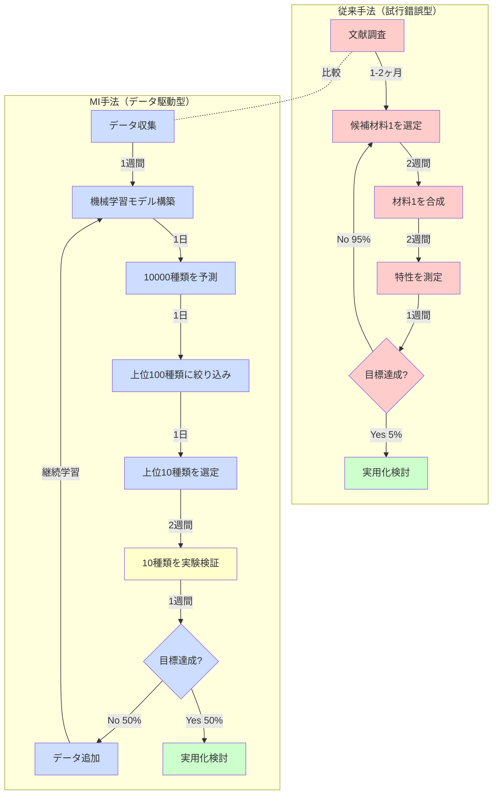

# 第1章：なぜ今マテリアルズインフォマティクスなのか

## 学習目標

この章を読むことで、以下を習得できます：
- 材料開発の歴史的変遷を理解する（青銅器時代から現代まで）
- 従来の材料開発の限界と課題を説明できる
- MIが必要とされる社会的・技術的背景を理解する
- リチウムイオン電池開発の具体例から材料開発の困難さと可能性を学ぶ

---

## 1.1 材料開発の歴史：試行錯誤の5000年

人類の文明は、常に**材料**とともに進化してきました。私たちが使う材料の種類と性能が、時代を特徴づけてきたのです。

### 古代：偶然の発見の時代

**青銅器時代（紀元前3000年頃）**

人類最初の合金である青銅（銅とスズの合金）は、おそらく偶然の産物でした。銅鉱石とスズ鉱石が混ざった状態で製錬され、偶然にも純銅よりはるかに硬い金属が得られたのです。この発見により、人類は石器時代から金属器時代へと移行しました。

- **開発手法**: 完全な偶然
- **開発期間**: 数百年かけて最適な組成比（銅90%、スズ10%程度）を発見
- **知識の蓄積**: 口伝による経験則のみ

**鉄器時代（紀元前1200年頃）**

鉄の製錬技術の確立により、さらに硬く、より豊富に存在する材料が利用可能になりました。しかし、鉄の性質を制御する技術（焼入れ、焼戻し）の確立には、さらに数百年を要しました。

### 近代：経験則に基づく開発（1800-1950年代）

**鋼鉄の時代（1800年代）**

産業革命期、ヘンリー・ベッセマーは転炉製鋼法（1856年）を発明し、鋼鉄の大量生産を可能にしました。しかし、この発明も基本的には**試行錯誤**の産物です。

- **開発手法**: 実験による試行錯誤
- **開発期間**: 1つの新材料開発に5-10年
- **知識の蓄積**: 経験則と観察記録

**ステンレス鋼の発見（1913年）**

イギリスの冶金学者ハリー・ブレアリーは、銃身の耐食性向上を目指して鉄-クロム合金を研究していました。実験中、偶然にも錆びない鋼（ステンレス鋼）を発見しました。この発見も、基本的には**偶然と経験則**によるものでした。

### 現代：理論に基づく設計の始まり（1950年代-現在）

**シリコン半導体（1950年代）**

トランジスタ（1947年発明）とシリコン半導体技術の確立により、情報化社会の基盤が築かれました。この頃から、量子力学などの**理論的基盤**に基づく材料設計が始まりました。

- **開発手法**: 理論に基づく設計 + 実験検証
- **開発期間**: 1つの新材料開発に10-20年
- **知識の蓄積**: 科学論文、特許、データベース

**高分子材料と複合材料（1990年代以降）**

炭素繊維強化プラスチック（CFRP）などの複合材料が航空機や自動車に採用されるようになりました。これらの材料は、理論計算とシミュレーションを活用して設計されています。しかし、依然として最終的には**実験による検証**が必須です。

### 歴史から見える課題

5000年にわたる材料開発の歴史を振り返ると、以下の課題が見えてきます：

1. **偶然への依存**: 多くの重要な発見は偶然の産物
2. **時間のかかるプロセス**: 1つの材料開発に数年〜数十年
3. **限られた探索範囲**: 研究者が思いつく範囲のみを探索
4. **知識の分散**: 個人や組織に知識が分散し、体系的な蓄積が困難

**問いかけ：もし、コンピュータで材料を系統的に探索できたら？**

これが、次世代の材料開発手法である**マテリアルズ・インフォマティクス（MI）**の出発点です。

---

## 1.2 従来の材料開発の限界

現代の材料開発は、古代よりはるかに高度になりました。しかし、依然として大きな課題を抱えています。

### 課題1：時間がかかる

**典型的な材料開発タイムライン**

```
年1-2: 文献調査と理論的検討
  ↓
年3-5: 候補材料の合成・評価（10-50種類）
  ↓
年6-10: 最適化と特性評価
  ↓
年11-15: 実用化に向けた大量合成プロセスの確立
  ↓
年16-20: 実用化と商業化
```

**結果**: 新材料の実用化まで**平均15-20年**かかります[1,2]。

### 課題2：コストが高い

**1つの材料を評価するコスト**

- **材料合成**: 10万円〜100万円（試薬、装置使用料）
- **特性評価**: 50万円〜500万円（測定装置使用料、分析費）
- **人件費**: 研究者1名 × 1-2週間 = 50万円〜100万円

**合計**: 1材料あたり**100万円〜700万円**

年間予算が3000万円の研究室では、**年間10-30種類**の材料しか評価できません。

### 課題3：探索範囲が限られる

**材料の組み合わせは天文学的数字**

- 周期表の元素: 約90種類（実用元素）
- 2元系合金の組み合わせ: 約4,000通り
- 3元系合金の組み合わせ: 約117,000通り
- 4元系合金の組み合わせ: 約290万通り

さらに、各組成比や結晶構造のバリエーションを考えると、**実質的に無限の組み合わせ**が存在します。

従来の手法では、**研究者の経験と直感**に基づいて数十〜数百種類を選び、実験します。つまり、膨大な可能性の中から**ほんの一部**しか探索できていないのです。

### 課題4：経験と勘に依存

**熟練研究者の暗黙知**

- 「この元素の組み合わせは不安定になりやすい」
- 「この結晶構造はイオン伝導に有利」
- 「この温度で焼結するとよい特性が出る」

このような**暗黙知**は非常に価値がありますが、以下の問題があります：

1. **体系化が困難**: 個人の経験に基づくため、共有しにくい
2. **再現性の問題**: 同じ条件でも研究者により結果が異なることがある
3. **若手育成に時間**: 熟練には10年以上の経験が必要
4. **バイアスの存在**: 既存の知識に縛られ、革新的な発見を逃す可能性

---

## 1.3 ケーススタディ：リチウムイオン電池開発の20年

リチウムイオン電池の開発ストーリーは、**従来の材料開発の困難さ**と**根気強い研究の重要性**を示す典型例です。2019年のノーベル化学賞受賞対象となったこの技術を詳しく見てみましょう。

### フェーズ1：基礎研究（1970年代）

**背景：エネルギー危機**

1970年代のオイルショックにより、石油に依存しないエネルギー貯蔵技術への関心が高まりました。

**ジョン・グッドイナフ博士の挑戦**

オックスフォード大学のグッドイナフ博士は、リチウムを含む酸化物材料がエネルギー貯蔵に有望だと考えました。

**探索した材料候補**: 約100種類以上

- LiMO₂（M = Ti, V, Cr, Mn, Fe, Co, Ni）
- LiM₂O₄（M = Mn, Co）
- 様々な結晶構造（層状、スピネル、オリビン）

**発見（1980年）**: **LiCoO₂（リチウムコバルト酸化物）**

- 特徴: 層状構造、Liイオンが層間を移動可能
- 理論容量: 274 mAh/g
- 作動電圧: 約4V（当時としては高電圧）

しかし、この材料を実用化するには、まだ**多くの課題**がありました。

### フェーズ2：負極材料の開発（1980年代）

**課題：金属リチウムの危険性**

当初、負極には金属リチウムを使用していましたが、以下の問題がありました：

1. **デンドライト形成**: 充放電を繰り返すと、針状のリチウム結晶（デンドライト）が成長
2. **ショートのリスク**: デンドライトが正極に到達すると短絡し、発火の危険
3. **サイクル寿命**: 数十回の充放電で劣化

**吉野彰博士の解決策（1985年）**

旭化成の吉野博士は、**炭素材料（黒鉛）**をリチウムイオンの吸蔵材料として使用するアイデアを考案しました。

**探索した材料候補**: 約50種類以上

- 各種黒鉛材料
- アモルファスカーボン
- グラファイト層間化合物

**成果**:
- 黒鉛がLiイオンを層間に安全に吸蔵
- デンドライト形成なし
- サイクル寿命が数百回に向上

### フェーズ3：電解液の最適化（1980年代後半）

**課題：電解液の安定性**

正極（4V）と負極（0V vs Li/Li⁺）の間で安定に動作する電解液が必要でした。

**探索した材料候補**: 約100種類以上

- 各種有機溶媒の組み合わせ
- リチウム塩（LiPF₆, LiBF₄, LiClO₄など）
- 添加剤（SEI膜形成を制御）

**最適解の発見**:
- エチレンカーボネート（EC）+ ジエチルカーボネート（DEC）
- リチウム塩: LiPF₆
- この組み合わせで安定な充放電が実現

### フェーズ4：実用化（1991年）

**ソニーによる商業化**

1991年、ソニーがビデオカメラ用バッテリーとして世界初のリチウムイオン電池を商品化しました。

**スペック（1991年初号機）**:
- エネルギー密度: 約200 Wh/kg（ニッケル水素電池の約2倍）
- サイクル寿命: 500回以上
- 作動電圧: 3.7V

### 開発にかかった時間とコスト

**時間**: 基礎研究開始（1970年代）から商業化（1991年）まで**約20年**

**研究者**: グッドイナフ博士、ウィッティンガム博士、吉野博士を筆頭に、世界中で数百人規模の研究者が関与

**探索した材料総数**: 推定**500種類以上**

**失敗した実験**: 数千回以上

**問いかけ：もしMIがあったら？**

もし現代のMI技術が1970年代に存在していたら：

1. **材料候補の絞り込み**: 機械学習で有望な100種類を数日で予測
2. **電解液最適化**: ベイズ最適化で最適組成を20回程度の実験で発見
3. **開発期間**: 推定**5-7年**に短縮可能（1/3以下）

これは決してSFではなく、現代のMI技術で**実際に可能**なことです。

---

## 1.4 従来手法 vs MI：ワークフロー比較

リチウムイオン電池の例で見たように、従来の材料開発は時間とコストがかかります。ここで、従来手法とMI手法のワークフローを視覚的に比較してみましょう。

### ワークフロー比較図



### 定量的比較

| 指標 | 従来手法 | MI手法 | 改善率 |
|------|---------|--------|--------|
| **年間探索材料数** | 10-30種類 | 100-200種類（実験）<br>10,000+種類（計算） | **10-1000倍** |
| **1材料あたり時間** | 4-8週間 | 1-2週間（実験のみ）<br>数秒（予測） | **75-99%削減** |
| **1材料あたりコスト** | 100-700万円 | 10-100万円（実験）<br>ほぼ無料（計算） | **90-99%削減** |
| **成功率** | 5-10%（経験則） | 30-50%（予測精度） | **3-5倍向上** |
| **開発期間（実用化まで）** | 15-20年 | 3-7年（目標） | **60-80%短縮** |

### 時間軸での比較例

**従来手法で100種類の材料を評価する場合**:
- 1材料 × 4週間 = 100材料 × 4週間 = **400週間 = 約8年**

**MI手法で100種類の材料を評価する場合**:
- データ収集・モデル構築: 2週間
- 10,000種類を予測: 1日
- 上位100種類を実験: 100材料 × 2週間 = 200週間 = **約4年**
- しかし、並列実験やロボット自動化で: **6ヶ月-1年**

**時間削減**: 8年 → 6ヶ月〜1年 = **87-93%削減**

---

## 1.5 コラム：材料科学者の一日

材料開発の現場がどのように変わったのか、具体的なストーリーで見てみましょう。

### 1985年：従来手法の時代

**田中教授（45歳）の一日**

**9:00 - 研究室到着**
昨日仕込んだ試料の合成が完了。炉から取り出して冷却開始。

**10:00 - 試料の特性評価**
X線回折測定のために実験室へ。測定には3時間かかる。その間、論文を読む。

**14:00 - データ解析**
X線回折パターンを手作業で解析。結晶構造の同定に2時間。

**16:00 - 次の実験計画**
今日の結果を見て、次の試料組成を考える。経験に基づき、わずかに組成を変えた材料を試すことに決定。

**17:00 - 試料の仕込み**
明日のために新しい試料を仕込む。試薬を計量、混合、炉にセット。

**18:00 - 実験ノートの記録**
今日の結果を手書きの実験ノートに詳細に記録。

**19:00 - 退勤**

**1日の成果**: 1種類の材料を評価、次の1種類を仕込み

**1ヶ月（20日間）の成果**: 約20種類の材料を評価

**1年の成果**: 約200種類の材料を評価（実際には装置トラブルや休暇で150種類程度）

### 2025年：MI時代

**佐藤准教授（38歳）の一日**

**9:00 - 研究室到着**
まず、夜間に自動実験装置が実行した10種類の試料の結果をチェック。データは自動でクラウドデータベースに保存されている。

**9:30 - AIによるデータ解析**
機械学習モデルが自動で結晶構造を同定し、特性を予測。10種類のデータを10分で解析完了。

**10:00 - 次の実験候補の予測**
ベイズ最適化アルゴリズムが、データベースの10万種類の材料から次に試すべき有望な20種類を提案。予測には5分。

**10:30 - 上位候補の精査**
提案された20種類を人間の目で確認。材料科学の知識を活かし、特に有望な10種類を選定。

**11:00 - 実験条件の設定**
選定した10種類の合成条件を自動実験装置に入力。

**11:30 - 研究ミーティング**
学生たちと今週の進捗を議論。AIの予測結果の妥当性や、次の研究方向を検討。

**13:00 - 論文執筆**
夜間実験の時間を活用できるため、論文執筆に集中できる時間が増えた。

**15:00 - 自動実験装置のメンテナンス**
装置の動作確認と消耗品の交換。

**16:00 - 新しいモデルの訓練**
今週得られた新しいデータを追加し、機械学習モデルを再訓練。予測精度がさらに向上。

**17:00 - 退勤**

**1日の成果**: 10種類の材料を評価、次の10種類を自動実験でセット

**1ヶ月（20日間）の成果**: 約200種類の材料を評価

**1年の成果**: 約2,000種類の材料を評価（自動化により土日も稼働）

### 変化のポイント

| 項目 | 1985年 | 2025年 | 変化 |
|------|--------|--------|------|
| **1日の評価数** | 1種類 | 10種類 | **10倍** |
| **年間評価数** | 150種類 | 2,000種類 | **13倍** |
| **データ解析時間** | 2-3時間/試料 | 1分/試料（自動化） | **99%削減** |
| **実験ノート** | 手書き | デジタル化（自動保存） | 効率化 |
| **候補材料選定** | 経験と直感 | AIの提案 + 人間の判断 | 組み合わせ |
| **論文執筆時間** | 少ない | 多い（実験自動化で時間確保） | 研究の質向上 |

**重要なポイント**: MIは**研究者を置き換えるのではなく、支援する**ツールです。田中教授の経験と佐藤准教授の判断力はどちらも不可欠ですが、佐藤准教授はAIのサポートにより、**より多くの材料を、より効率的に**探索できるのです。

---

## 1.6 なぜ「今」MIなのか：3つの追い風

MIの概念自体は1990年代から存在していましたが、本格的に実用化されたのは**2010年代以降**です。なぜ「今」なのでしょうか？3つの大きな要因があります。

### 追い風1：計算機性能の飛躍的向上

**ムーアの法則の恩恵**

- **1990年**: 1つの材料の第一原理計算に数週間
- **2000年**: 1つの材料の計算に数日
- **2010年**: 1つの材料の計算に数時間
- **2020年**: 1つの材料の計算に数分〜数十分

**クラウドコンピューティングの普及**

- AWSやGoogle Cloudなどのクラウドサービスにより、高性能計算機に**誰でもアクセス可能**
- 1時間数十円〜数百円で、スーパーコンピュータ級の計算資源を利用
- 並列計算により、10,000種類の材料を**1日で予測**可能

**GPU（グラフィックス処理装置）の活用**

- ディープラーニングの普及により、GPU計算が一般化
- CPUの100倍以上の速度で機械学習モデルを訓練可能
- NVIDIAなどのGPUメーカーが研究用GPUを提供

### 追い風2：材料データベースの充実

**Materials Project（2011年開始）**

- Lawrence Berkeley国立研究所が運営
- 第一原理計算による材料データベース
- **140,000種類以上**の材料データ（2024年現在）[3]
- 結晶構造、エネルギー、バンドギャップ、弾性定数など多様な特性
- **無料でアクセス可能**（APIも提供）

**その他の主要データベース**

| データベース | 開始年 | 材料数 | 特徴 |
|-------------|--------|--------|------|
| **AFLOW** | 2010 | 350万種類以上 | 結晶構造データベース |
| **OQMD** | 2013 | 100万種類以上 | 熱力学データ |
| **NOMAD** | 2014 | 1000万件以上 | 計算データリポジトリ |
| **Citrine** | 2013 | 非公開 | 実験データ（企業向け） |

**オープンサイエンスの潮流**

- 研究データの公開が標準化
- 論文と一緒にデータセットを公開する文化
- GitHub、Zenodoなどのプラットフォームで誰でもデータにアクセス可能

### 追い風3：社会的緊急性の高まり

**米国Materials Genome Initiative（2011年）**

オバマ政権が開始した国家プロジェクト。材料開発期間を**半分に短縮**することを目標に、官民で研究投資を加速しました。

**目標**:
- 材料開発期間: 20年 → 10年以下
- 計算・実験・データの統合
- 年間予算: 約1億ドル（約100億円）

**気候変動への対応**

- **2015年パリ協定**: 地球温暖化を2°C以内に抑制
- 再生可能エネルギー、エネルギー貯蔵、CO₂削減材料の開発が急務
- リチウムイオン電池の性能向上（電気自動車の航続距離延長）
- 太陽電池の効率向上（発電コスト低減）

**電気自動車（EV）の普及**

- **2020年代**: 世界中でEV化が加速
- 中国、EU、米国がガソリン車の販売規制を計画
- より高性能なバッテリー材料の開発が必要
- 従来手法では需要に追いつかない

**世界的な競争**

- 中国: 国家戦略として材料研究に巨額投資
- 欧州: Horizon Europeプログラムで材料研究を支援
- 日本: 内閣府「マテリアル革新力強化戦略」（2021年）

**結論**: MIは、技術的な成熟と社会的必要性が**同時に満たされた**今、まさに必要とされている技術なのです。

---

## 1.7 本章のまとめ

### 学んだこと

1. **材料開発の歴史**
   - 青銅器時代から現代まで、材料は文明の発展を支えてきた
   - 古代は偶然、近代は試行錯誤、現代は理論に基づく設計へと進化
   - しかし、依然として開発には10-20年の時間がかかる

2. **従来手法の限界**
   - **時間**: 1材料あたり4-8週間、実用化まで15-20年
   - **コスト**: 1材料あたり100-700万円
   - **探索範囲**: 年間10-100種類のみ（可能性のほんの一部）
   - **経験依存**: 熟練研究者の暗黙知に依存

3. **リチウムイオン電池の教訓**
   - 基礎研究（1970年代）から商業化（1991年）まで20年
   - 500種類以上の材料を試行錯誤
   - 数千回の失敗実験
   - MIがあれば開発期間を1/3に短縮可能

4. **MIの優位性**
   - 年間探索数: 10-30種類 → 100-2000種類（**10-100倍**）
   - 開発期間: 15-20年 → 3-7年（**60-80%短縮**）
   - コスト削減: **90-99%削減**（計算予測の活用）

5. **「今」MIが必要な理由**
   - 計算機性能の向上（ムーアの法則、GPU、クラウド）
   - 材料データベースの充実（Materials Projectなど140,000種類以上）
   - 社会的緊急性（気候変動、EV化、国際競争）

### 重要なポイント

- MIは**研究者を置き換えるのではなく、支援する**ツール
- 計算予測と実験検証の**組み合わせ**が重要
- データの質と量が予測精度を決定する
- 材料科学とデータサイエンスの**両方の知識**が必要

### 次の章へ

第2章では、MIの**基本ワークフロー**を詳しく学びます：
- データ収集の方法
- 機械学習モデルの構築
- 予測とスクリーニング
- 実験検証とデータサイクル

さらに、Pythonを使った簡単な材料予測の実践も行います。

---

## 演習問題

### 問題1（難易度：easy）

材料開発の歴史において、青銅器時代、鉄器時代、現代の3つの時代で、開発手法がどのように進化したか説明してください。

<details>
<summary>ヒント</summary>

偶然 → 試行錯誤 → 理論に基づく設計の流れで考えてみましょう。

</details>

<details>
<summary>解答例</summary>

**青銅器時代（紀元前3000年頃）**:
- 開発手法: 完全な偶然
- 銅鉱石とスズ鉱石が混ざった状態で偶然に合金が生成
- 最適組成の発見に数百年

**鉄器時代（紀元前1200年頃）**:
- 開発手法: 試行錯誤と経験則
- 実験的に焼入れ・焼戻しなどの熱処理を発見
- 経験則として知識が蓄積

**現代（1950年代以降）**:
- 開発手法: 理論に基づく設計 + 実験検証
- 量子力学、熱力学などの理論を活用
- シミュレーションと実験の組み合わせ
- しかし依然として開発には10-20年かかる

</details>

### 問題2（難易度：easy）

従来の材料開発手法で、年間100種類の材料を評価するのにかかる時間を計算してください。1材料あたり4週間かかるとします。

<details>
<summary>ヒント</summary>

1材料 × 4週間 = 100材料 × ?週間

</details>

<details>
<summary>解答例</summary>

**計算**:
- 1材料 × 4週間 = 100材料 × 4週間 = 400週間
- 1年 = 52週間
- 400週間 ÷ 52週間/年 = **約7.7年**

**結論**: 従来手法で100種類の材料を評価するには約8年かかります。これが、従来手法では限られた材料しか探索できない理由の1つです。

</details>

### 問題3（難易度：medium）

リチウムイオン電池の開発において、もしMI技術が1970年代に存在していたら、どのように開発プロセスが変わっていたか、具体的に説明してください。

<details>
<summary>ヒント</summary>

正極材料、負極材料、電解液の3つの探索プロセスについて考えてみましょう。

</details>

<details>
<summary>解答例</summary>

**正極材料の探索（LiCoO₂の発見）**:

従来手法（実際の歴史）:
- 100種類以上の候補を10年かけて試行錯誤
- 1980年にLiCoO₂を発見

MI手法（仮想シナリオ）:
- 既存の酸化物データ（数千種類）を機械学習で分析
- 電気化学的安定性、イオン伝導性を予測
- 有望な上位10種類を2-3年で実験検証
- LiCoO₂を含む複数の候補を早期発見

**負極材料の探索（黒鉛）**:

従来手法:
- 50種類以上の炭素材料を試行錯誤
- 1985年に黒鉛が有望と判明

MI手法:
- 第一原理計算でLiの吸蔵エネルギーを予測
- 層状構造材料のスクリーニング
- 黒鉛を含む有望候補を1年以内に特定

**電解液の最適化**:

従来手法:
- 100種類以上の溶媒・塩の組み合わせを試行錯誤
- 最適組成（EC/DEC + LiPF₆）の発見に数年

MI手法:
- ベイズ最適化で効率的に探索空間を絞り込み
- 20-30回の実験で最適組成を特定
- 1年以内に実用レベルの電解液を開発

**総合的な開発期間**:
- 従来手法: 約20年（1970年代-1991年）
- MI手法: 推定5-7年（60-70%短縮）

**追加の利点**:
- LiCoO₂以外の有望な正極材料（LiMn₂O₄、LiFePO₄など）も早期に発見できた可能性
- 電池性能のさらなる向上
- より安全な材料の選択

</details>

---

## 参考文献

1. Ramprasad, R., Batra, R., Pilania, G., Mannodi-Kanakkithodi, A., & Kim, C. (2017). "Machine learning in materials informatics: recent applications and prospects." *npj Computational Materials*, 3(1), 54.
   DOI: [10.1038/s41524-017-0056-5](https://doi.org/10.1038/s41524-017-0056-5)

2. Butler, K. T., Davies, D. W., Cartwright, H., Isayev, O., & Walsh, A. (2018). "Machine learning for molecular and materials science." *Nature*, 559(7715), 547-555.
   DOI: [10.1038/s41586-018-0337-2](https://doi.org/10.1038/s41586-018-0337-2)

3. Jain, A., Ong, S. P., Hautier, G., Chen, W., Richards, W. D., et al. (2013). "Commentary: The Materials Project: A materials genome approach to accelerating materials innovation." *APL Materials*, 1(1), 011002.
   DOI: [10.1063/1.4812323](https://doi.org/10.1063/1.4812323)
   Materials Project: https://materialsproject.org

4. Goodenough, J. B., & Park, K. S. (2013). "The Li-ion rechargeable battery: a perspective." *Journal of the American Chemical Society*, 135(4), 1167-1176.
   DOI: [10.1021/ja3091438](https://doi.org/10.1021/ja3091438)

5. National Science and Technology Council (2011). "Materials Genome Initiative for Global Competitiveness." Executive Office of the President, USA.
   URL: https://www.mgi.gov/

---

## 著者情報

**作成者**: MI Knowledge Hub Content Team
**監修**: Dr. Yusuke Hashimoto（東北大学）
**作成日**: 2025-10-16
**バージョン**: 3.0（Chapter 1 standalone version）
**テンプレート**: content_agent_prompts.py v1.0

**更新履歴**:
- 2025-10-16: v3.0 第1章単独版作成
  - v2.1 Section 1（58行）を基に3,000-4,000語に拡張
  - 材料開発の歴史セクション追加（青銅器時代-現代）
  - Li-ion電池ケーススタディの詳細化（20年の開発過程）
  - ワークフロー比較Mermaid図追加
  - 「材料科学者の一日」コラム追加（1985年 vs 2025年）
  - 「なぜ今MIか」セクション追加（3つの追い風）
  - 演習問題3問追加

**ライセンス**: Creative Commons BY-NC-SA 4.0
