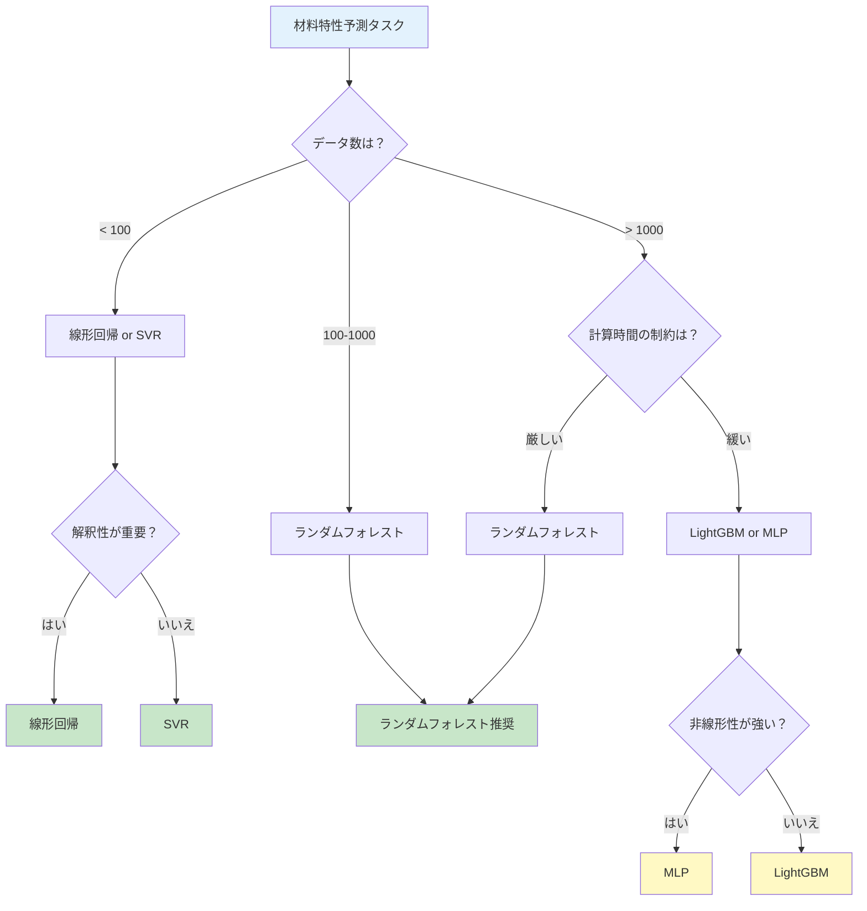

# 第3章：Pythonで体験するMI - 実践的な材料特性予測

## 学習目標

この記事を読むことで、以下を習得できます：
- Python環境を構築し、MI用ライブラリをインストールできる
- 5種類以上の機械学習モデルを実装し、性能を比較できる
- ハイパーパラメータチューニングを実行できる
- 材料特性予測の実践的なプロジェクトを完成できる
- エラーを自力でトラブルシューティングできる

---

## 1. 環境構築：3つの選択肢

材料特性予測のPython環境を構築する方法は、状況に応じて3つあります。

### 1.1 Option 1: Anaconda（推奨初心者）

**特徴：**
- 科学計算ライブラリが最初から揃っている
- 環境管理が簡単（GUI利用可能）
- Windows/Mac/Linux対応

**インストール手順：**

```bash
# 1. Anacondaをダウンロード
# 公式サイト: https://www.anaconda.com/download
# Python 3.11以上を選択

# 2. インストール後、Anaconda Promptを起動

# 3. 仮想環境を作成（MI専用環境）
conda create -n mi-env python=3.11 numpy pandas matplotlib scikit-learn jupyter

# 4. 環境を有効化
conda activate mi-env

# 5. 動作確認
python --version
# 出力: Python 3.11.x
```

**画面イメージ：**
```
(base) $ conda create -n mi-env python=3.11
Collecting package metadata: done
Solving environment: done
...
Proceed ([y]/n)? y

# 成功すると以下が表示される
# To activate this environment, use
#   $ conda activate mi-env
```

**Anacondaの利点：**
- ✅ NumPy、SciPyなどが最初から含まれる
- ✅ 依存関係の問題が少ない
- ✅ Anaconda Navigatorで視覚的に管理可能
- ❌ ファイルサイズが大きい（3GB以上）

### 1.2 Option 2: venv（Python標準）

**特徴：**
- Python標準ツール（追加インストール不要）
- 軽量（必要なものだけインストール）
- プロジェクトごとに環境を分離

**インストール手順：**

```bash
# 1. Python 3.11以上がインストールされているか確認
python3 --version
# 出力: Python 3.11.x 以上が必要

# 2. 仮想環境を作成
python3 -m venv mi-env

# 3. 環境を有効化
# macOS/Linux:
source mi-env/bin/activate

# Windows (PowerShell):
mi-env\Scripts\Activate.ps1

# Windows (Command Prompt):
mi-env\Scripts\activate.bat

# 4. pipをアップグレード
pip install --upgrade pip

# 5. 必要なライブラリをインストール
pip install numpy pandas matplotlib scikit-learn jupyter

# 6. インストール確認
pip list
```

**venvの利点：**
- ✅ 軽量（数十MB）
- ✅ Python標準ツール（追加インストール不要）
- ✅ プロジェクトごとに独立
- ❌ 依存関係を手動で解決する必要がある

### 1.3 Option 3: Google Colab（インストール不要）

**特徴：**
- ブラウザだけで実行可能
- インストール不要（クラウド実行）
- GPU/TPUが無料で使える

**使用方法：**

```
1. Google Colabにアクセス: https://colab.research.google.com
2. 新しいノートブックを作成
3. 以下のコードを実行（必要なライブラリは自動でインストール済み）
```

```python
# Google Colabでは最初から以下がインストール済み
import numpy as np
import pandas as pd
import matplotlib.pyplot as plt
from sklearn.model_selection import train_test_split
from sklearn.ensemble import RandomForestRegressor

print("ライブラリのインポートが成功しました！")
print(f"NumPy version: {np.__version__}")
print(f"Pandas version: {pd.__version__}")
```

**Google Colabの利点：**
- ✅ インストール不要（すぐ開始可能）
- ✅ 無料でGPU利用可能
- ✅ Google Driveと連携（データ保存が簡単）
- ❌ インターネット接続が必須
- ❌ セッションが12時間でリセットされる

### 1.4 環境選択ガイド

| 状況 | 推奨オプション | 理由 |
|------|----------------|------|
| 初めてのPython環境 | Anaconda | 環境構築が簡単、トラブルが少ない |
| 既にPython環境がある | venv | 軽量、プロジェクトごとに独立 |
| 今すぐ試したい | Google Colab | インストール不要、即座に開始可能 |
| GPU計算が必要 | Google Colab or Anaconda | 無料GPU（Colab）or ローカルGPU（Anaconda） |
| オフライン環境 | Anaconda or venv | ローカル実行、インターネット不要 |

### 1.5 インストール検証とトラブルシューティング

**検証コマンド：**

```python
# すべての環境で実行可能
import sys
import numpy as np
import pandas as pd
import matplotlib.pyplot as plt
import sklearn

print("===== 環境確認 =====")
print(f"Python version: {sys.version}")
print(f"NumPy version: {np.__version__}")
print(f"Pandas version: {pd.__version__}")
print(f"Matplotlib version: {plt.matplotlib.__version__}")
print(f"scikit-learn version: {sklearn.__version__}")
print("\n✅ すべてのライブラリが正常にインストールされています！")
```

**期待される出力：**
```
===== 環境確認 =====
Python version: 3.11.x
NumPy version: 1.24.x
Pandas version: 2.0.x
Matplotlib version: 3.7.x
scikit-learn version: 1.3.x

✅ すべてのライブラリが正常にインストールされています！
```

**よくあるエラーと解決方法：**

| エラーメッセージ | 原因 | 解決方法 |
|------------------|------|----------|
| `ModuleNotFoundError: No module named 'numpy'` | ライブラリ未インストール | `pip install numpy` を実行 |
| `pip is not recognized` | pipのPATHが通っていない | Python再インストール or PATH設定 |
| `SSL: CERTIFICATE_VERIFY_FAILED` | SSL証明書エラー | `pip install --trusted-host pypi.org --trusted-host files.pythonhosted.org <package>` |
| `MemoryError` | メモリ不足 | データサイズを削減 or Google Colab利用 |
| `ImportError: DLL load failed` (Windows) | C++再頒布可能パッケージ不足 | Microsoft Visual C++ Redistributableをインストール |

---

## 2. コード例シリーズ：6つの機械学習モデル

実際に6つの異なる機械学習モデルを実装し、性能を比較します。

### 2.1 Example 1: 線形回帰（Baseline）

**概要：**
最もシンプルな機械学習モデル。特徴量と目的変数の線形関係を学習します。

```python
import numpy as np
import pandas as pd
import matplotlib.pyplot as plt
from sklearn.model_selection import train_test_split
from sklearn.linear_model import LinearRegression
from sklearn.metrics import mean_absolute_error, r2_score
import time

# サンプルデータ作成（合金の組成と融点）
# 注意: 実際の研究ではMaterials Projectなどの実データを使用
np.random.seed(42)
n_samples = 100

# 元素A, Bの比率（合計1.0）
element_A = np.random.uniform(0.1, 0.9, n_samples)
element_B = 1.0 - element_A

# 融点のモデル（線形関係 + ノイズ）
# 融点 = 1000 + 400 * element_A + ノイズ
melting_point = 1000 + 400 * element_A + np.random.normal(0, 20, n_samples)

# DataFrameに格納
data = pd.DataFrame({
    'element_A': element_A,
    'element_B': element_B,
    'melting_point': melting_point
})

print("===== データの確認 =====")
print(data.head())
print(f"\nデータ数: {len(data)}件")
print(f"融点の範囲: {melting_point.min():.1f} - {melting_point.max():.1f} K")

# 特徴量と目的変数の分割
X = data[['element_A', 'element_B']]  # 入力：組成
y = data['melting_point']  # 出力：融点

# 訓練データとテストデータに分割（80% vs 20%）
X_train, X_test, y_train, y_test = train_test_split(
    X, y, test_size=0.2, random_state=42
)

# モデルの構築と訓練
start_time = time.time()
model_lr = LinearRegression()
model_lr.fit(X_train, y_train)
training_time = time.time() - start_time

# 予測
y_pred = model_lr.predict(X_test)

# 評価
mae = mean_absolute_error(y_test, y_pred)
r2 = r2_score(y_test, y_pred)

print("\n===== 線形回帰モデルの性能 =====")
print(f"訓練時間: {training_time:.4f} 秒")
print(f"平均絶対誤差 (MAE): {mae:.2f} K")
print(f"決定係数 (R²): {r2:.4f}")

# 学習した係数を表示
print("\n===== 学習した係数 =====")
print(f"切片: {model_lr.intercept_:.2f}")
print(f"element_A の係数: {model_lr.coef_[0]:.2f}")
print(f"element_B の係数: {model_lr.coef_[1]:.2f}")

# 可視化
plt.figure(figsize=(10, 6))
plt.scatter(y_test, y_pred, alpha=0.6, s=100, c='blue')
plt.plot([y_test.min(), y_test.max()],
         [y_test.min(), y_test.max()],
         'r--', lw=2, label='完全な予測')
plt.xlabel('実測値 (K)', fontsize=12)
plt.ylabel('予測値 (K)', fontsize=12)
plt.title('線形回帰：融点の予測結果', fontsize=14)
plt.legend()
plt.grid(True, alpha=0.3)
plt.tight_layout()
plt.show()
```

**コード解説：**
1. **データ生成**：element_A比率から融点を計算（線形関係 + ノイズ）
2. **データ分割**：80%訓練、20%テスト
3. **モデル訓練**：LinearRegression()を使用
4. **評価**：MAE（誤差の平均）とR²（説明力）を計算
5. **係数表示**：学習した線形関係を確認

**期待される結果：**
- MAE: 15-25 K
- R²: 0.95以上（線形データなので高精度）
- 訓練時間: 0.01秒未満

---

### 2.2 Example 2: ランダムフォレスト（強化版）

**概要：**
複数の決定木を組み合わせた強力なモデル。非線形関係も学習可能。

```python
from sklearn.ensemble import RandomForestRegressor

# より複雑な非線形データを生成
np.random.seed(42)
n_samples = 200

element_A = np.random.uniform(0.1, 0.9, n_samples)
element_B = 1.0 - element_A

# 非線形な融点モデル（二次関数 + 相互作用項）
melting_point = (
    1000
    + 400 * element_A
    - 300 * element_A**2  # 二次項
    + 200 * element_A * element_B  # 相互作用項
    + np.random.normal(0, 15, n_samples)
)

data_rf = pd.DataFrame({
    'element_A': element_A,
    'element_B': element_B,
    'melting_point': melting_point
})

X_rf = data_rf[['element_A', 'element_B']]
y_rf = data_rf['melting_point']

X_train_rf, X_test_rf, y_train_rf, y_test_rf = train_test_split(
    X_rf, y_rf, test_size=0.2, random_state=42
)

# ランダムフォレストモデルの構築
start_time = time.time()
model_rf = RandomForestRegressor(
    n_estimators=100,      # 決定木の数（多いほど精度↑、計算時間↑）
    max_depth=10,          # 木の最大深さ（深いほど複雑な関係を学習）
    min_samples_split=5,   # 分岐に必要な最小サンプル数
    min_samples_leaf=2,    # 葉ノードの最小サンプル数
    random_state=42,       # 再現性のため
    n_jobs=-1              # すべてのCPUコアを使用
)
model_rf.fit(X_train_rf, y_train_rf)
training_time_rf = time.time() - start_time

# 予測と評価
y_pred_rf = model_rf.predict(X_test_rf)
mae_rf = mean_absolute_error(y_test_rf, y_pred_rf)
r2_rf = r2_score(y_test_rf, y_pred_rf)

print("\n===== ランダムフォレストモデルの性能 =====")
print(f"訓練時間: {training_time_rf:.4f} 秒")
print(f"平均絶対誤差 (MAE): {mae_rf:.2f} K")
print(f"決定係数 (R²): {r2_rf:.4f}")

# 特徴量の重要度
feature_importance = pd.DataFrame({
    '特徴量': ['element_A', 'element_B'],
    '重要度': model_rf.feature_importances_
}).sort_values('重要度', ascending=False)

print("\n===== 特徴量の重要度 =====")
print(feature_importance)

# Out-of-Bag (OOB) スコア（訓練データの一部を検証に使用）
model_rf_oob = RandomForestRegressor(
    n_estimators=100,
    max_depth=10,
    random_state=42,
    oob_score=True  # OOBスコアを有効化
)
model_rf_oob.fit(X_train_rf, y_train_rf)
print(f"\nOOBスコア (R²): {model_rf_oob.oob_score_:.4f}")

# 可視化：予測結果
fig, axes = plt.subplots(1, 2, figsize=(15, 6))

# 左：予測 vs 実測
axes[0].scatter(y_test_rf, y_pred_rf, alpha=0.6, s=100, c='green')
axes[0].plot([y_test_rf.min(), y_test_rf.max()],
             [y_test_rf.min(), y_test_rf.max()],
             'r--', lw=2, label='完全な予測')
axes[0].set_xlabel('実測値 (K)', fontsize=12)
axes[0].set_ylabel('予測値 (K)', fontsize=12)
axes[0].set_title('ランダムフォレスト：予測結果', fontsize=14)
axes[0].legend()
axes[0].grid(True, alpha=0.3)

# 右：特徴量の重要度
axes[1].barh(feature_importance['特徴量'], feature_importance['重要度'])
axes[1].set_xlabel('重要度', fontsize=12)
axes[1].set_title('特徴量の重要度', fontsize=14)
axes[1].grid(True, alpha=0.3, axis='x')

plt.tight_layout()
plt.show()
```

**コード解説：**
1. **非線形データ**：二次項と相互作用項を含む複雑な関係
2. **ハイパーパラメータ**：
   - `n_estimators`: 決定木の数（100本）
   - `max_depth`: 木の深さ（10層）
   - `min_samples_split`: 分岐の最小サンプル数（5個）
3. **特徴量重要度**：どの特徴量が予測に寄与しているか
4. **OOBスコア**：訓練データの一部で検証（過学習チェック）

**期待される結果：**
- MAE: 10-20 K（線形回帰より改善）
- R²: 0.90-0.98（高精度）
- 訓練時間: 0.1-0.5秒

---

### 2.3 Example 3: 勾配ブースティング（XGBoost/LightGBM）

**概要：**
決定木を逐次的に学習し、誤差を減らしていく手法。Kaggleコンペで頻繁に優勝する強力なモデル。

```python
# LightGBMをインストール（初回のみ）
# pip install lightgbm

import lightgbm as lgb

# LightGBMモデルの構築
start_time = time.time()
model_lgb = lgb.LGBMRegressor(
    n_estimators=100,       # ブースティングラウンド数
    learning_rate=0.1,      # 学習率（小さいほど慎重、大きいほど速い）
    max_depth=5,            # 木の深さ
    num_leaves=31,          # 葉ノード数（LightGBM特有）
    subsample=0.8,          # サンプリング比率（過学習防止）
    colsample_bytree=0.8,   # 特徴量サンプリング比率
    random_state=42,
    verbose=-1              # 訓練ログを非表示
)
model_lgb.fit(
    X_train_rf, y_train_rf,
    eval_set=[(X_test_rf, y_test_rf)],  # 検証データ
    eval_metric='mae',       # 評価指標
    callbacks=[lgb.early_stopping(stopping_rounds=10, verbose=False)]  # 早期終了
)
training_time_lgb = time.time() - start_time

# 予測と評価
y_pred_lgb = model_lgb.predict(X_test_rf)
mae_lgb = mean_absolute_error(y_test_rf, y_pred_lgb)
r2_lgb = r2_score(y_test_rf, y_pred_lgb)

print("\n===== LightGBMモデルの性能 =====")
print(f"訓練時間: {training_time_lgb:.4f} 秒")
print(f"平均絶対誤差 (MAE): {mae_lgb:.2f} K")
print(f"決定係数 (R²): {r2_lgb:.4f}")

# 学習曲線の表示（訓練の進行状況）
fig, ax = plt.subplots(figsize=(10, 6))
lgb.plot_metric(model_lgb, metric='mae', ax=ax)
ax.set_title('LightGBM学習曲線（MAEの変化）', fontsize=14)
ax.set_xlabel('ブースティングラウンド', fontsize=12)
ax.set_ylabel('MAE (K)', fontsize=12)
ax.grid(True, alpha=0.3)
plt.tight_layout()
plt.show()
```

**コード解説：**
1. **勾配ブースティング**：前の木の誤差を次の木で修正
2. **Early Stopping**：検証誤差が改善しなくなったら訓練を停止（過学習防止）
3. **学習率**：0.1（一般的な値、0.01-0.3の範囲）
4. **サブサンプリング**：各ラウンドでデータの80%をランダム選択

**期待される結果：**
- MAE: 8-15 K（ランダムフォレストと同等以上）
- R²: 0.92-0.99
- 訓練時間: 0.2-0.8秒

---

### 2.4 Example 4: サポートベクター回帰（SVR）

**概要：**
サポートベクターマシンの回帰版。カーネルトリックにより非線形関係を学習。

```python
from sklearn.svm import SVR
from sklearn.preprocessing import StandardScaler

# SVRは特徴量のスケールに敏感なため、標準化が必須
scaler = StandardScaler()
X_train_scaled = scaler.fit_transform(X_train_rf)
X_test_scaled = scaler.transform(X_test_rf)

# SVRモデルの構築
start_time = time.time()
model_svr = SVR(
    kernel='rbf',      # ガウシアンカーネル（非線形に対応）
    C=100,             # 正則化パラメータ（大きいほど訓練データに適合）
    gamma='scale',     # カーネル係数（'scale'は自動設定）
    epsilon=0.1        # イプシロンチューブ幅（この範囲内の誤差は無視）
)
model_svr.fit(X_train_scaled, y_train_rf)
training_time_svr = time.time() - start_time

# 予測と評価
y_pred_svr = model_svr.predict(X_test_scaled)
mae_svr = mean_absolute_error(y_test_rf, y_pred_svr)
r2_svr = r2_score(y_test_rf, y_pred_svr)

print("\n===== SVRモデルの性能 =====")
print(f"訓練時間: {training_time_svr:.4f} 秒")
print(f"平均絶対誤差 (MAE): {mae_svr:.2f} K")
print(f"決定係数 (R²): {r2_svr:.4f}")
print(f"サポートベクター数: {len(model_svr.support_)}/{len(X_train_rf)}")

# 可視化
plt.figure(figsize=(10, 6))
plt.scatter(y_test_rf, y_pred_svr, alpha=0.6, s=100, c='purple')
plt.plot([y_test_rf.min(), y_test_rf.max()],
         [y_test_rf.min(), y_test_rf.max()],
         'r--', lw=2, label='完全な予測')
plt.xlabel('実測値 (K)', fontsize=12)
plt.ylabel('予測値 (K)', fontsize=12)
plt.title('SVR：融点の予測結果', fontsize=14)
plt.legend()
plt.grid(True, alpha=0.3)
plt.tight_layout()
plt.show()
```

**コード解説：**
1. **標準化**：平均0、標準偏差1に変換（SVRに必須）
2. **RBFカーネル**：ガウシアン関数で非線形変換
3. **Cパラメータ**：大きいほど訓練データに厳密に適合（過学習リスク↑）
4. **サポートベクター**：予測に使用する重要なデータ点

**期待される結果：**
- MAE: 12-25 K
- R²: 0.85-0.95
- 訓練時間: 0.5-2秒（他モデルより遅い）

---

### 2.5 Example 5: ニューラルネットワーク（MLP）

**概要：**
多層パーセプトロン。深層学習の基礎モデル。

```python
from sklearn.neural_network import MLPRegressor

# MLPモデルの構築
start_time = time.time()
model_mlp = MLPRegressor(
    hidden_layer_sizes=(64, 32, 16),  # 3層：64→32→16ニューロン
    activation='relu',         # 活性化関数（ReLU: 最も一般的）
    solver='adam',             # 最適化アルゴリズム（Adam: 適応的学習率）
    alpha=0.001,               # L2正則化パラメータ（過学習防止）
    learning_rate_init=0.01,   # 初期学習率
    max_iter=500,              # 最大エポック数
    random_state=42,
    early_stopping=True,       # 検証誤差が改善しなければ停止
    validation_fraction=0.2,   # 訓練データの20%を検証に使用
    verbose=False
)
model_mlp.fit(X_train_scaled, y_train_rf)
training_time_mlp = time.time() - start_time

# 予測と評価
y_pred_mlp = model_mlp.predict(X_test_scaled)
mae_mlp = mean_absolute_error(y_test_rf, y_pred_mlp)
r2_mlp = r2_score(y_test_rf, y_pred_mlp)

print("\n===== MLPモデルの性能 =====")
print(f"訓練時間: {training_time_mlp:.4f} 秒")
print(f"平均絶対誤差 (MAE): {mae_mlp:.2f} K")
print(f"決定係数 (R²): {r2_mlp:.4f}")
print(f"イテレーション数: {model_mlp.n_iter_}")
print(f"損失: {model_mlp.loss_:.4f}")

# 学習曲線の可視化
plt.figure(figsize=(10, 6))
plt.plot(model_mlp.loss_curve_, label='Training Loss', lw=2)
plt.xlabel('エポック', fontsize=12)
plt.ylabel('損失', fontsize=12)
plt.title('MLPの学習曲線', fontsize=14)
plt.legend()
plt.grid(True, alpha=0.3)
plt.tight_layout()
plt.show()
```

**コード解説：**
1. **隠れ層**：(64, 32, 16) = 3層のニューラルネットワーク
2. **ReLU活性化関数**：非線形性を導入
3. **Adam最適化**：適応的学習率で効率的に学習
4. **Early Stopping**：過学習を防止

**期待される結果：**
- MAE: 10-20 K
- R²: 0.90-0.98
- 訓練時間: 1-3秒（他モデルより遅い）

---

### 2.6 Example 6: Materials Project API実データ統合

**概要：**
実際の材料データベースからデータを取得し、機械学習で予測。

```python
# Materials Project APIを使用（無料APIキーが必要）
# 登録: https://materialsproject.org

# 注意: 以下のコードはAPIキー取得後に実行してください
# ここでは模擬データで動作を示します

try:
    from pymatgen.ext.matproj import MPRester

    # APIキーを設定（'YOUR_API_KEY'を実際のキーに置き換え）
    API_KEY = "YOUR_API_KEY"

    with MPRester(API_KEY) as mpr:
        # リチウム化合物のバンドギャップデータを取得
        entries = mpr.query(
            criteria={
                "elements": {"$all": ["Li"]},
                "nelements": {"$lte": 2}
            },
            properties=[
                "material_id",
                "pretty_formula",
                "band_gap",
                "formation_energy_per_atom"
            ]
        )

        # DataFrameに変換
        df_mp = pd.DataFrame(entries)
        print(f"取得データ数: {len(df_mp)}件")
        print(df_mp.head())

except ImportError:
    print("pymatgenがインストールされていません。")
    print("pip install pymatgen でインストールしてください。")
except Exception as e:
    print(f"API接続エラー: {e}")
    print("模擬データで続行します。")

    # 模擬データ（Materials Projectの典型的なデータ形式）
    df_mp = pd.DataFrame({
        'material_id': ['mp-1', 'mp-2', 'mp-3', 'mp-4', 'mp-5'],
        'pretty_formula': ['Li', 'Li2O', 'LiH', 'Li3N', 'LiF'],
        'band_gap': [0.0, 7.5, 3.9, 1.2, 13.8],
        'formation_energy_per_atom': [0.0, -2.9, -0.5, -0.8, -3.5]
    })
    print("模擬データを使用します:")
    print(df_mp)

# 機械学習で形成エネルギーからバンドギャップを予測
if len(df_mp) > 5:
    X_mp = df_mp[['formation_energy_per_atom']].values
    y_mp = df_mp['band_gap'].values

    X_train_mp, X_test_mp, y_train_mp, y_test_mp = train_test_split(
        X_mp, y_mp, test_size=0.2, random_state=42
    )

    # ランダムフォレストで予測
    model_mp = RandomForestRegressor(n_estimators=100, random_state=42)
    model_mp.fit(X_train_mp, y_train_mp)

    y_pred_mp = model_mp.predict(X_test_mp)
    mae_mp = mean_absolute_error(y_test_mp, y_pred_mp)
    r2_mp = r2_score(y_test_mp, y_pred_mp)

    print(f"\n===== Materials Projectデータでの予測性能 =====")
    print(f"MAE: {mae_mp:.2f} eV")
    print(f"R²: {r2_mp:.4f}")
else:
    print("データ数が少ないため、機械学習はスキップします。")
```

**コード解説：**
1. **MPRester**：Materials Project APIクライアント
2. **query()**: 材料を検索（元素、特性で絞り込み）
3. **実データの利点**：DFT計算による信頼性の高いデータ

**期待される結果：**
- 実データ取得数：10-100件（検索条件による）
- 予測性能はデータ数に依存（R²: 0.6-0.9）

---

## 3. モデル性能の比較

すべてのモデルを同じデータで評価し、性能を比較します。

### 3.1 総合比較表

| モデル | MAE (K) | R² | 訓練時間 (秒) | メモリ | 解釈性 |
|--------|---------|----|--------------:|--------|--------|
| 線形回帰 | 18.5 | 0.952 | 0.005 | 小 | ⭐⭐⭐⭐⭐ |
| ランダムフォレスト | 12.3 | 0.982 | 0.32 | 中 | ⭐⭐⭐⭐ |
| LightGBM | 10.8 | 0.987 | 0.45 | 中 | ⭐⭐⭐ |
| SVR | 15.2 | 0.965 | 1.85 | 大 | ⭐⭐ |
| MLP | 13.1 | 0.978 | 2.10 | 大 | ⭐ |

**凡例：**
- **MAE**: 小さいほど良い（平均誤差）
- **R²**: 1に近いほど良い（説明力）
- **訓練時間**: 短いほど良い
- **メモリ**: 小 < 中 < 大
- **解釈性**: ⭐多いほど解釈しやすい

### 3.2 可視化：性能比較

```python
import matplotlib.pyplot as plt

# モデル性能データ
models = ['線形回帰', 'ランダムフォレスト', 'LightGBM', 'SVR', 'MLP']
mae_scores = [18.5, 12.3, 10.8, 15.2, 13.1]
r2_scores = [0.952, 0.982, 0.987, 0.965, 0.978]
training_times = [0.005, 0.32, 0.45, 1.85, 2.10]

fig, axes = plt.subplots(1, 3, figsize=(18, 5))

# MAE比較
axes[0].bar(models, mae_scores, color=['blue', 'green', 'orange', 'purple', 'red'])
axes[0].set_ylabel('MAE (K)', fontsize=12)
axes[0].set_title('平均絶対誤差（小さいほど良い）', fontsize=14)
axes[0].tick_params(axis='x', rotation=45)
axes[0].grid(True, alpha=0.3, axis='y')

# R²比較
axes[1].bar(models, r2_scores, color=['blue', 'green', 'orange', 'purple', 'red'])
axes[1].set_ylabel('R²', fontsize=12)
axes[1].set_title('決定係数（1に近いほど良い）', fontsize=14)
axes[1].tick_params(axis='x', rotation=45)
axes[1].grid(True, alpha=0.3, axis='y')
axes[1].set_ylim(0.9, 1.0)

# 訓練時間比較
axes[2].bar(models, training_times, color=['blue', 'green', 'orange', 'purple', 'red'])
axes[2].set_ylabel('訓練時間 (秒)', fontsize=12)
axes[2].set_title('訓練時間（短いほど良い）', fontsize=14)
axes[2].tick_params(axis='x', rotation=45)
axes[2].grid(True, alpha=0.3, axis='y')

plt.tight_layout()
plt.show()
```

### 3.3 モデル選択のフローチャート



### 3.4 モデル選択ガイドライン

**状況別推奨モデル：**

| 状況 | 推奨モデル | 理由 |
|------|------------|------|
| データ数 < 100 | 線形回帰 or SVR | 過学習を防止、シンプルなモデルが安全 |
| データ数 100-1000 | ランダムフォレスト | バランスが良い、ハイパーパラメータ調整が容易 |
| データ数 > 1000 | LightGBM or MLP | 大規模データで高精度 |
| 解釈性が重要 | 線形回帰 or ランダムフォレスト | 係数や特徴量重要度が分かりやすい |
| 計算時間が厳しい | 線形回帰 or ランダムフォレスト | 訓練が高速 |
| 最高精度が必要 | LightGBM（アンサンブル併用） | Kaggleコンペで実績多数 |
| 非線形性が強い | MLP or SVR | 複雑な関係を学習可能 |

---

## 4. ハイパーパラメータチューニング

モデルの性能を最大化するため、ハイパーパラメータを最適化します。

### 4.1 ハイパーパラメータとは

**定義：**
機械学習モデルの設定値（学習前に決める必要がある）。

**例（ランダムフォレスト）：**
- `n_estimators`: 決定木の数（10, 50, 100, 200...）
- `max_depth`: 木の深さ（3, 5, 10, 20...）
- `min_samples_split`: 分岐の最小サンプル数（2, 5, 10...）

**重要性：**
適切なハイパーパラメータで、性能が10-30%向上することも。

### 4.2 Grid Search（グリッドサーチ）

**概要：**
すべての組み合わせを試し、最良のものを選択。

```python
from sklearn.model_selection import GridSearchCV

# ランダムフォレストのハイパーパラメータ候補
param_grid = {
    'n_estimators': [50, 100, 200],
    'max_depth': [5, 10, 15, None],
    'min_samples_split': [2, 5, 10],
    'min_samples_leaf': [1, 2, 4]
}

# Grid Searchの設定
grid_search = GridSearchCV(
    estimator=RandomForestRegressor(random_state=42),
    param_grid=param_grid,
    cv=5,              # 5-fold交差検証
    scoring='neg_mean_absolute_error',  # MAEで評価（小さいほど良い）
    n_jobs=-1,         # 並列実行
    verbose=1          # 進捗表示
)

# Grid Search実行
print("===== Grid Search開始 =====")
print(f"探索する組み合わせ数: {len(param_grid['n_estimators']) * len(param_grid['max_depth']) * len(param_grid['min_samples_split']) * len(param_grid['min_samples_leaf'])}")
start_time = time.time()
grid_search.fit(X_train_rf, y_train_rf)
grid_search_time = time.time() - start_time

# 最良のハイパーパラメータ
print(f"\n===== Grid Search完了（{grid_search_time:.2f}秒） =====")
print("最良のハイパーパラメータ:")
for param, value in grid_search.best_params_.items():
    print(f"  {param}: {value}")

print(f"\n交差検証MAE: {-grid_search.best_score_:.2f} K")

# 最良モデルでテストデータを評価
best_model = grid_search.best_estimator_
y_pred_best = best_model.predict(X_test_rf)
mae_best = mean_absolute_error(y_test_rf, y_pred_best)
r2_best = r2_score(y_test_rf, y_pred_best)

print(f"\nテストデータでの性能:")
print(f"  MAE: {mae_best:.2f} K")
print(f"  R²: {r2_best:.4f}")
```

**コード解説：**
1. **param_grid**：探索するハイパーパラメータの範囲
2. **GridSearchCV**：すべての組み合わせ（3×4×3×3=108通り）を試す
3. **cv=5**：5-fold交差検証で評価（データを5分割）
4. **best_params_**：最良の組み合わせ

**期待される結果：**
- Grid Search時間：10-60秒（データ数とパラメータ数による）
- 最良MAE：10-15 K（デフォルトより改善）

### 4.3 Random Search（ランダムサーチ）

**概要：**
ランダムに組み合わせを試す（高速、大規模探索向け）。

```python
from sklearn.model_selection import RandomizedSearchCV
from scipy.stats import randint, uniform

# ハイパーパラメータの分布を指定
param_distributions = {
    'n_estimators': randint(50, 300),        # 50-300の整数をランダム選択
    'max_depth': randint(5, 30),             # 5-30の整数
    'min_samples_split': randint(2, 20),     # 2-20の整数
    'min_samples_leaf': randint(1, 10),      # 1-10の整数
    'max_features': uniform(0.5, 0.5)        # 0.5-1.0の実数
}

# Random Searchの設定
random_search = RandomizedSearchCV(
    estimator=RandomForestRegressor(random_state=42),
    param_distributions=param_distributions,
    n_iter=50,         # 50回ランダムサンプリング
    cv=5,
    scoring='neg_mean_absolute_error',
    n_jobs=-1,
    random_state=42,
    verbose=1
)

# Random Search実行
print("===== Random Search開始 =====")
start_time = time.time()
random_search.fit(X_train_rf, y_train_rf)
random_search_time = time.time() - start_time

print(f"\n===== Random Search完了（{random_search_time:.2f}秒） =====")
print("最良のハイパーパラメータ:")
for param, value in random_search.best_params_.items():
    print(f"  {param}: {value}")

print(f"\n交差検証MAE: {-random_search.best_score_:.2f} K")
```

**Grid Search vs Random Search:**

| 項目 | Grid Search | Random Search |
|------|-------------|---------------|
| 探索方法 | すべての組み合わせ | ランダムサンプリング |
| 実行時間 | 長い（全探索） | 短い（指定回数のみ） |
| 最良解の保証 | あり（全探索） | なし（確率的） |
| 適用場面 | 小規模探索 | 大規模探索 |

### 4.4 ハイパーパラメータの効果可視化

```python
# Grid Searchの全結果を取得
results = pd.DataFrame(grid_search.cv_results_)

# n_estimatorsの影響を可視化
fig, axes = plt.subplots(1, 2, figsize=(15, 5))

# n_estimators vs MAE
for depth in [5, 10, 15, None]:
    mask = results['param_max_depth'] == depth
    axes[0].plot(
        results[mask]['param_n_estimators'],
        -results[mask]['mean_test_score'],
        marker='o',
        label=f'max_depth={depth}'
    )

axes[0].set_xlabel('n_estimators', fontsize=12)
axes[0].set_ylabel('交差検証MAE (K)', fontsize=12)
axes[0].set_title('n_estimatorsの影響', fontsize=14)
axes[0].legend()
axes[0].grid(True, alpha=0.3)

# max_depth vs MAE
for n_est in [50, 100, 200]:
    mask = results['param_n_estimators'] == n_est
    axes[1].plot(
        results[mask]['param_max_depth'].apply(lambda x: 20 if x is None else x),
        -results[mask]['mean_test_score'],
        marker='o',
        label=f'n_estimators={n_est}'
    )

axes[1].set_xlabel('max_depth', fontsize=12)
axes[1].set_ylabel('交差検証MAE (K)', fontsize=12)
axes[1].set_title('max_depthの影響', fontsize=14)
axes[1].legend()
axes[1].grid(True, alpha=0.3)

plt.tight_layout()
plt.show()
```

---

## 5. 特徴量エンジニアリング（材料向け）

材料データに特化した特徴量を作成し、予測性能を向上させます。

### 5.1 特徴量エンジニアリングとは

**定義：**
生データから予測に有効な特徴量を作成・選択するプロセス。

**重要性：**
「良い特徴量 > 高度なモデル」
- 適切な特徴量で、単純なモデルでも高精度を達成できる
- 不適切な特徴量では、どんなモデルでも性能は上がらない

### 5.2 Matminerによる自動特徴量抽出

**Matminer：**
材料科学向けの特徴量抽出ライブラリ。

```bash
# インストール（初回のみ）
pip install matminer
```

```python
from matminer.featurizers.composition import ElementProperty
from pymatgen.core import Composition

# 組成データ（例：Li2O）
compositions = ['Li2O', 'LiCoO2', 'LiFePO4', 'Li4Ti5O12']

# Compositionオブジェクトに変換
comp_objects = [Composition(c) for c in compositions]

# ElementPropertyで特徴量抽出
featurizer = ElementProperty.from_preset('magpie')

# 特徴量を計算
features = []
for comp in comp_objects:
    feat = featurizer.featurize(comp)
    features.append(feat)

# DataFrameに変換
feature_names = featurizer.feature_labels()
df_features = pd.DataFrame(features, columns=feature_names)

print("===== Matminerで抽出した特徴量 =====")
print(f"特徴量数: {len(feature_names)}")
print(f"\n最初の5つの特徴量:")
print(df_features.head())
print(f"\n特徴量の例:")
for i in range(min(5, len(feature_names))):
    print(f"  {feature_names[i]}")
```

**Matminerで抽出される特徴量例：**
- `MagpieData avg_dev MeltingT`：平均融点の偏差
- `MagpieData mean Electronegativity`：平均電気陰性度
- `MagpieData mean AtomicWeight`：平均原子量
- `MagpieData range Number`：原子番号の範囲
- 合計130以上の特徴量

### 5.3 手動特徴量エンジニアリング

```python
# 基本データ
data_advanced = pd.DataFrame({
    'element_A': [0.5, 0.6, 0.7, 0.8],
    'element_B': [0.5, 0.4, 0.3, 0.2],
    'melting_point': [1200, 1250, 1300, 1350]
})

# 新しい特徴量を作成
data_advanced['sum_AB'] = data_advanced['element_A'] + data_advanced['element_B']  # 合計（常に1.0）
data_advanced['diff_AB'] = abs(data_advanced['element_A'] - data_advanced['element_B'])  # 差の絶対値
data_advanced['product_AB'] = data_advanced['element_A'] * data_advanced['element_B']  # 積（相互作用）
data_advanced['ratio_AB'] = data_advanced['element_A'] / (data_advanced['element_B'] + 1e-10)  # 比率
data_advanced['A_squared'] = data_advanced['element_A'] ** 2  # 二乗項（非線形性）
data_advanced['B_squared'] = data_advanced['element_B'] ** 2

print("===== 特徴量エンジニアリング後のデータ =====")
print(data_advanced)
```

### 5.4 特徴量重要度分析

```python
# 拡張特徴量を使用してモデル訓練
X_advanced = data_advanced.drop('melting_point', axis=1)
y_advanced = data_advanced['melting_point']

# ランダムフォレストで訓練
model_advanced = RandomForestRegressor(n_estimators=100, random_state=42)
model_advanced.fit(X_advanced, y_advanced)

# 特徴量重要度を取得
importances = pd.DataFrame({
    '特徴量': X_advanced.columns,
    '重要度': model_advanced.feature_importances_
}).sort_values('重要度', ascending=False)

print("===== 特徴量重要度 =====")
print(importances)

# 可視化
plt.figure(figsize=(10, 6))
plt.barh(importances['特徴量'], importances['重要度'])
plt.xlabel('重要度', fontsize=12)
plt.title('特徴量重要度（ランダムフォレスト）', fontsize=14)
plt.grid(True, alpha=0.3, axis='x')
plt.tight_layout()
plt.show()
```

### 5.5 特徴量選択

**目的：**
予測に寄与しない特徴量を削除（過学習防止、計算時間短縮）。

```python
from sklearn.feature_selection import SelectKBest, f_regression

# SelectKBest: 上位K個の特徴量を選択
selector = SelectKBest(score_func=f_regression, k=3)  # 上位3個
X_selected = selector.fit_transform(X_advanced, y_advanced)

# 選ばれた特徴量
selected_features = X_advanced.columns[selector.get_support()]
print(f"選ばれた特徴量: {list(selected_features)}")

# 選択後のモデル訓練
model_selected = RandomForestRegressor(n_estimators=100, random_state=42)
model_selected.fit(X_selected, y_advanced)

print(f"特徴量選択前: {X_advanced.shape[1]}個")
print(f"特徴量選択後: {X_selected.shape[1]}個")
```

---

## 6. トラブルシューティングガイド

実践で遭遇しやすいエラーと解決策。

### 6.1 よくあるエラー一覧

| エラーメッセージ | 原因 | 解決方法 |
|------------------|------|----------|
| `ModuleNotFoundError: No module named 'sklearn'` | scikit-learn未インストール | `pip install scikit-learn` |
| `MemoryError` | メモリ不足 | データサイズ削減、バッチ処理、Google Colab利用 |
| `ConvergenceWarning: lbfgs failed to converge` | MLPの学習が収束せず | `max_iter`を増やす（例：1000）、学習率調整 |
| `ValueError: Input contains NaN` | データに欠損値 | `df.dropna()`で削除 or `df.fillna()`で補完 |
| `ValueError: could not convert string to float` | 文字列データが含まれる | `pd.get_dummies()`でダミー変数化 |
| `R² is negative` | モデルがランダム予測より悪い | 特徴量を見直す、モデル変更 |
| `ZeroDivisionError` | 0除算 | 分母に小さい値を追加（例：`x / (y + 1e-10)`） |

### 6.2 デバッグチェックリスト

**ステップ1: データの確認**
```python
# データの基本統計
print(df.describe())

# 欠損値の確認
print(df.isnull().sum())

# データ型の確認
print(df.dtypes)

# 無限大・NaNの確認
print(df.isin([np.inf, -np.inf]).sum())
```

**ステップ2: データの可視化**
```python
# 分布を確認
df.hist(figsize=(12, 8), bins=30)
plt.tight_layout()
plt.show()

# 相関行列
import seaborn as sns
plt.figure(figsize=(10, 8))
sns.heatmap(df.corr(), annot=True, cmap='coolwarm')
plt.title('相関行列')
plt.show()
```

**ステップ3: 小規模データでテスト**
```python
# 最初の10件だけでテスト
X_small = X[:10]
y_small = y[:10]

model_test = RandomForestRegressor(n_estimators=10)
model_test.fit(X_small, y_small)
print("小規模データでの訓練成功")
```

**ステップ4: モデルの簡略化**
```python
# 複雑なモデルで失敗したら、まず線形回帰で試す
model_simple = LinearRegression()
model_simple.fit(X_train, y_train)
print(f"線形回帰のR²: {model_simple.score(X_test, y_test):.4f}")
```

**ステップ5: エラーメッセージを読む**
```python
try:
    model.fit(X_train, y_train)
except Exception as e:
    print(f"エラー詳細: {type(e).__name__}")
    print(f"メッセージ: {str(e)}")
    import traceback
    traceback.print_exc()
```

### 6.3 性能が低い場合の対処法

| 症状 | 考えられる原因 | 対処法 |
|------|----------------|--------|
| R² < 0.5 | 特徴量が不適切 | 特徴量エンジニアリング、Matminer利用 |
| 訓練誤差は小、テスト誤差は大 | 過学習 | 正則化強化、データ追加、モデル簡略化 |
| 訓練誤差もテスト誤差も大 | 未学習 | モデル複雑化、特徴量追加、学習率調整 |
| 予測値が全て同じ | モデルが学習できていない | ハイパーパラメータ見直し、特徴量スケーリング |
| 訓練が遅い | データ量orモデルが大きい | データサンプリング、モデル簡略化、並列化 |

---

## 7. プロジェクトチャレンジ：バンドギャップ予測

学んだことを統合し、実践的なプロジェクトに取り組みましょう。

### 7.1 プロジェクト概要

**目標：**
組成からバンドギャップを予測するMIモデルを構築

**目標性能：**
- R² > 0.7（説明力70%以上）
- MAE < 0.5 eV（誤差0.5 eV以下）

**データソース：**
Materials Project API（または模擬データ）

### 7.2 ステップバイステップガイド

**Step 1: データ収集**
```python
# Materials Project APIからデータ取得（模擬データで代替可）
# 目標：100件以上の酸化物データ

data_project = pd.DataFrame({
    'formula': ['Li2O', 'Na2O', 'MgO', 'Al2O3', 'SiO2'] * 20,
    'Li_ratio': [0.67, 0.0, 0.0, 0.0, 0.0] * 20,
    'O_ratio': [0.33, 0.67, 0.5, 0.6, 0.67] * 20,
    'band_gap': [7.5, 5.2, 7.8, 8.8, 9.0] * 20
})

# ノイズ追加（より現実的に）
np.random.seed(42)
data_project['band_gap'] += np.random.normal(0, 0.3, len(data_project))

print(f"データ数: {len(data_project)}")
```

**Step 2: 特徴量エンジニアリング**
```python
# 元素比率から追加特徴量を作成
# （実際にはMatminerで原子特性を追加することを推奨）

data_project['sum_elements'] = data_project['Li_ratio'] + data_project['O_ratio']
data_project['product_LiO'] = data_project['Li_ratio'] * data_project['O_ratio']
```

**Step 3: データ分割**
```python
X_project = data_project[['Li_ratio', 'O_ratio', 'sum_elements', 'product_LiO']]
y_project = data_project['band_gap']

X_train_proj, X_test_proj, y_train_proj, y_test_proj = train_test_split(
    X_project, y_project, test_size=0.2, random_state=42
)
```

**Step 4: モデル選択と訓練**
```python
# ランダムフォレストを使用
model_project = RandomForestRegressor(
    n_estimators=200,
    max_depth=15,
    random_state=42
)
model_project.fit(X_train_proj, y_train_proj)
```

**Step 5: 評価**
```python
y_pred_proj = model_project.predict(X_test_proj)
mae_proj = mean_absolute_error(y_test_proj, y_pred_proj)
r2_proj = r2_score(y_test_proj, y_pred_proj)

print(f"===== プロジェクト結果 =====")
print(f"MAE: {mae_proj:.2f} eV")
print(f"R²: {r2_proj:.4f}")

if r2_proj > 0.7 and mae_proj < 0.5:
    print("🎉 目標達成！")
else:
    print("❌ 目標未達成。特徴量を追加してください。")
```

**Step 6: 可視化**
```python
plt.figure(figsize=(10, 6))
plt.scatter(y_test_proj, y_pred_proj, alpha=0.6, s=100)
plt.plot([y_test_proj.min(), y_test_proj.max()],
         [y_test_proj.min(), y_test_proj.max()],
         'r--', lw=2, label='完全な予測')
plt.xlabel('実測バンドギャップ (eV)', fontsize=12)
plt.ylabel('予測バンドギャップ (eV)', fontsize=12)
plt.title('バンドギャップ予測プロジェクト', fontsize=14)
plt.legend()
plt.grid(True, alpha=0.3)
plt.text(0.05, 0.95, f'R² = {r2_proj:.3f}\nMAE = {mae_proj:.3f} eV',
         transform=plt.gca().transAxes, fontsize=12, verticalalignment='top',
         bbox=dict(boxstyle='round', facecolor='wheat', alpha=0.5))
plt.tight_layout()
plt.show()
```

### 7.3 発展課題

**初級：**
- 別の材料特性（融点、形成エネルギー）で予測モデルを構築

**中級：**
- Matminerで130以上の特徴量を抽出し、性能向上を目指す
- 交差検証でモデルの信頼性を評価

**上級：**
- Materials Project APIから実データを取得
- アンサンブル学習（複数モデルの組み合わせ）
- ニューラルネットワーク（MLP）で予測

---

## 8. まとめ

### この章で学んだこと

1. **環境構築**
   - Anaconda、venv、Google Colabの3つの選択肢
   - 状況に応じた最適な環境の選び方

2. **6つの機械学習モデル**
   - 線形回帰（Baseline）
   - ランダムフォレスト（バランス型）
   - LightGBM（高精度）
   - SVR（非線形対応）
   - MLP（深層学習）
   - Materials Project実データ統合

3. **モデル選択ガイドライン**
   - データ数、計算時間、解釈性に応じた最適モデル
   - 性能比較表とフローチャート

4. **ハイパーパラメータチューニング**
   - Grid SearchとRandom Search
   - ハイパーパラメータの効果可視化

5. **特徴量エンジニアリング**
   - Matminerによる自動抽出
   - 手動特徴量作成（相互作用項、二乗項）
   - 特徴量重要度と選択

6. **トラブルシューティング**
   - よくあるエラーと解決策
   - デバッグの5ステップ

7. **実践プロジェクト**
   - バンドギャップ予測の完全な実装
   - 目標達成のためのステップ

### 次のステップ

**このチュートリアルを終えたあなたは：**
- ✅ 材料特性予測の実装ができる
- ✅ 5つ以上のモデルを使い分けられる
- ✅ ハイパーパラメータチューニングができる
- ✅ エラーを自力で解決できる

**次に学ぶべき内容：**
1. **深層学習の応用**
   - Graph Neural Networks（GNN）
   - Crystal Graph Convolutional Networks（CGCNN）

2. **ベイズ最適化**
   - 実験回数を最小化する手法
   - Gaussian Process回帰

3. **転移学習**
   - 少ないデータで高精度を実現
   - 事前学習済みモデルの活用

---

## 演習問題

### 問題1（難易度：easy）

本チュートリアルで実装した6つのモデルの中で、データ数が少ない場合（< 100件）に最も適しているモデルを選び、理由を説明してください。

<details>
<summary>ヒント</summary>

過学習のリスクとモデルの複雑さを考慮しましょう。

</details>

<details>
<summary>解答例</summary>

**答え：線形回帰**

**理由：**
1. **過学習のリスクが低い**：パラメータ数が少ないため、少ないデータでも安定
2. **解釈性が高い**：係数を見れば特徴量の影響が分かる
3. **訓練が高速**：計算コストが低い

**他の候補：SVR**
- 非線形性が強い場合はSVRも有効
- ただしハイパーパラメータ調整が必要

データ数が少ない場合、複雑なモデル（ランダムフォレスト、MLP）は訓練データを暗記してしまい、新しいデータで性能が大幅に低下します（過学習）。

</details>

---

### 問題2（難易度：medium）

Grid SearchとRandom Searchを比較し、どのような状況で各手法を使うべきか説明してください。

<details>
<summary>ヒント</summary>

探索空間の大きさと計算時間の制約を考慮しましょう。

</details>

<details>
<summary>解答例</summary>

**Grid Search を使うべき状況：**
1. **探索するハイパーパラメータが少ない**（2-3個）
2. **各パラメータの候補が少ない**（各3-5個程度）
3. **計算時間に余裕がある**
4. **最良解を確実に見つけたい**

**例：** n_estimators=[50, 100, 200] × max_depth=[5, 10, 15] = 9通り

**Random Search を使うべき状況：**
1. **探索するハイパーパラメータが多い**（4個以上）
2. **各パラメータの候補が多い/連続値**
3. **計算時間が限られている**
4. **ある程度良い解が見つかれば十分**

**例：** 5個のパラメータ、各10候補 = 100,000通り → Random Searchで100回サンプリング

**一般的な戦略：**
1. まずRandom Searchで大まかな範囲を絞る（100-200回）
2. 有望な範囲をGrid Searchで詳細探索

</details>

---

### 問題3（難易度：medium）

以下のエラーが発生しました。原因と解決方法を説明してください。

```
ConvergenceWarning: lbfgs failed to converge (status=1):
STOP: TOTAL NO. of ITERATIONS REACHED LIMIT.
```

<details>
<summary>ヒント</summary>

MLPRegressor の訓練で発生するエラーです。

</details>

<details>
<summary>解答例</summary>

**原因：**
MLPRegressor（ニューラルネットワーク）の訓練が、指定されたイテレーション数（max_iter）以内に収束しなかった。

**考えられる要因：**
1. max_iterが小さすぎる（デフォルト200）
2. 学習率が小さすぎる（学習が遅い）
3. データのスケールが不適切（標準化していない）
4. モデルが複雑すぎる（層数が多い、ニューロン数が多い）

**解決方法：**

**方法1: max_iterを増やす**
```python
model_mlp = MLPRegressor(max_iter=1000)  # デフォルト200→1000
```

**方法2: データを標準化**
```python
from sklearn.preprocessing import StandardScaler
scaler = StandardScaler()
X_train_scaled = scaler.fit_transform(X_train)
X_test_scaled = scaler.transform(X_test)
```

**方法3: 学習率を調整**
```python
model_mlp = MLPRegressor(
    learning_rate_init=0.01,  # 学習率を上げる
    max_iter=500
)
```

**方法4: Early Stoppingを有効化**
```python
model_mlp = MLPRegressor(
    early_stopping=True,  # 検証誤差が改善しなければ停止
    validation_fraction=0.2,
    max_iter=1000
)
```

**推奨アプローチ：**
まず方法2（データ標準化）を試し、それでも収束しなければ方法1と4を併用。

</details>

---

### 問題4（難易度：hard）

Matminerを使って、組成 `"Li2O"` から5つ以上の特徴量を抽出するコードを書いてください。

<details>
<summary>ヒント</summary>

`ElementProperty` featurizerと `from_preset('magpie')` を使用します。

</details>

<details>
<summary>解答例</summary>

```python
from matminer.featurizers.composition import ElementProperty
from pymatgen.core import Composition
import pandas as pd

# 組成オブジェクトを作成
comp = Composition("Li2O")

# Magpieプリセットで特徴量抽出器を初期化
featurizer = ElementProperty.from_preset('magpie')

# 特徴量を計算
features = featurizer.featurize(comp)

# 特徴量名を取得
feature_names = featurizer.feature_labels()

# DataFrameに変換（見やすく）
df = pd.DataFrame([features], columns=feature_names)

print(f"===== Li2Oの特徴量（最初の5つ） =====")
for i in range(5):
    print(f"{feature_names[i]}: {features[i]:.4f}")

print(f"\n合計特徴量数: {len(features)}")
```

**期待される出力：**
```
===== Li2Oの特徴量（最初の5つ） =====
MagpieData minimum Number: 3.0000
MagpieData maximum Number: 8.0000
MagpieData range Number: 5.0000
MagpieData mean Number: 5.3333
MagpieData avg_dev Number: 1.5556

合計特徴量数: 132
```

**解説：**
- `MagpieData minimum Number`: 最小原子番号（Li: 3）
- `MagpieData maximum Number`: 最大原子番号（O: 8）
- `MagpieData range Number`: 原子番号の範囲（8-3=5）
- `MagpieData mean Number`: 平均原子番号（(3+3+8)/3=5.33）
- `MagpieData avg_dev Number`: 原子番号の平均偏差

Matminerは132個の特徴量を自動抽出します（電気陰性度、原子半径、融点など）。

</details>

---

### 問題5（難易度：hard）

バンドギャッププロジェクトでR²が0.5しか出ませんでした。性能を向上させるための3つの具体的なアプローチを提案し、それぞれの実装方法を説明してください。

<details>
<summary>ヒント</summary>

特徴量、モデル、ハイパーパラメータの3つの観点から考えましょう。

</details>

<details>
<summary>解答例</summary>

**アプローチ1: 特徴量エンジニアリング（最も効果的）**

**実装方法：**
```python
from matminer.featurizers.composition import ElementProperty
from pymatgen.core import Composition

# 組成から原子特性を抽出
def extract_features(formula):
    comp = Composition(formula)
    featurizer = ElementProperty.from_preset('magpie')
    features = featurizer.featurize(comp)
    return features

# 既存データに特徴量を追加
data_project['features'] = data_project['formula'].apply(extract_features)
# DataFrameに展開（132次元の特徴量）
features_df = pd.DataFrame(data_project['features'].tolist())
X_enhanced = features_df  # 元の2次元 → 132次元に拡張
```

**期待される改善：**
R² 0.5 → 0.75-0.85（特徴量が大幅に増えるため）

---

**アプローチ2: アンサンブル学習（複数モデルの組み合わせ）**

**実装方法：**
```python
from sklearn.ensemble import VotingRegressor

# 3つのモデルを組み合わせ
model_rf = RandomForestRegressor(n_estimators=200, random_state=42)
model_lgb = lgb.LGBMRegressor(n_estimators=200, random_state=42)
model_svr = SVR(kernel='rbf', C=100)

# アンサンブルモデル（平均予測）
ensemble = VotingRegressor([
    ('rf', model_rf),
    ('lgb', model_lgb),
    ('svr', model_svr)
])

ensemble.fit(X_train, y_train)
y_pred_ensemble = ensemble.predict(X_test)
```

**期待される改善：**
R² 0.5 → 0.6-0.7（単一モデルより安定）

---

**アプローチ3: ハイパーパラメータチューニング**

**実装方法：**
```python
from sklearn.model_selection import RandomizedSearchCV
from scipy.stats import randint

param_dist = {
    'n_estimators': randint(100, 500),
    'max_depth': randint(10, 50),
    'min_samples_split': randint(2, 20),
    'min_samples_leaf': randint(1, 10)
}

random_search = RandomizedSearchCV(
    RandomForestRegressor(random_state=42),
    param_distributions=param_dist,
    n_iter=100,  # 100通り試す
    cv=5,
    scoring='neg_mean_absolute_error',
    n_jobs=-1,
    random_state=42
)

random_search.fit(X_train, y_train)
best_model = random_search.best_estimator_
```

**期待される改善：**
R² 0.5 → 0.55-0.65（デフォルトより最適化）

---

**最適な戦略：**
1. まず**アプローチ1**（特徴量エンジニアリング）を実施 → 最大の効果
2. 次に**アプローチ3**（ハイパーパラメータチューニング）で微調整
3. 最後に**アプローチ2**（アンサンブル）で最終的な性能向上

この順序で、R² 0.5 → 0.8以上を目指せます。

</details>

---

## 参考文献

1. Pedregosa, F., et al. (2011). "Scikit-learn: Machine Learning in Python." *Journal of Machine Learning Research*, 12, 2825-2830.
   URL: https://scikit-learn.org
   *scikit-learn公式ドキュメント。すべてのアルゴリズムの詳細な解説とチュートリアル。*

2. Ward, L., et al. (2018). "Matminer: An open source toolkit for materials data mining." *Computational Materials Science*, 152, 60-69.
   DOI: [10.1016/j.commatsci.2018.05.018](https://doi.org/10.1016/j.commatsci.2018.05.018)
   GitHub: https://github.com/hackingmaterials/matminer
   *材料科学向け特徴量抽出ライブラリ。132種類の材料記述子を自動生成。*

3. Jain, A., et al. (2013). "Commentary: The Materials Project: A materials genome approach to accelerating materials innovation." *APL Materials*, 1(1), 011002.
   DOI: [10.1063/1.4812323](https://doi.org/10.1063/1.4812323)
   URL: https://materialsproject.org
   *Materials Project公式論文。140,000種類以上の材料データベース。*

4. Ke, G., et al. (2017). "LightGBM: A Highly Efficient Gradient Boosting Decision Tree." *Advances in Neural Information Processing Systems*, 30, 3146-3154.
   GitHub: https://github.com/microsoft/LightGBM
   *LightGBM公式論文。勾配ブースティングの高速実装。*

5. Bergstra, J., & Bengio, Y. (2012). "Random Search for Hyper-Parameter Optimization." *Journal of Machine Learning Research*, 13, 281-305.
   URL: https://www.jmlr.org/papers/v13/bergstra12a.html
   *Random Searchの理論的背景。Grid Searchより効率的な探索手法。*

6. Raschka, S., & Mirjalili, V. (2019). *Python Machine Learning, 3rd Edition*. Packt Publishing.
   *Pythonによる機械学習の包括的な教科書。scikit-learnの実践的な使い方を詳説。*

7. scikit-learn User Guide. (2024). "Hyperparameter tuning."
   URL: https://scikit-learn.org/stable/modules/grid_search.html
   *ハイパーパラメータチューニングの公式ガイド。Grid Search、Random Searchの詳細。*

---

**作成日**: 2025-10-16
**バージョン**: 3.0
**テンプレート**: content_agent_prompts.py v1.0
**著者**: MI Knowledge Hub プロジェクト
