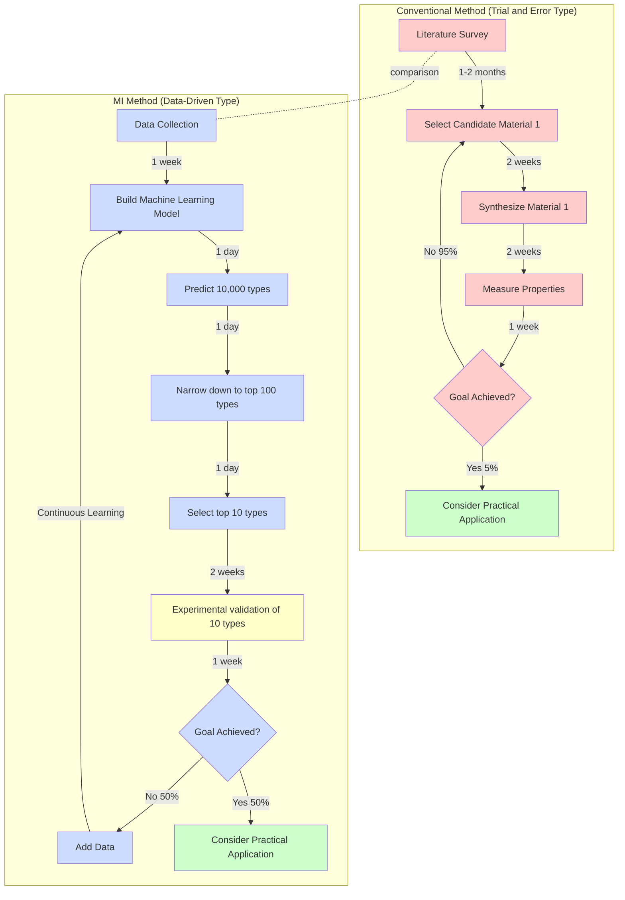

# Chapter 1: Why Materials Informatics Now?

## Learning Objectives

By reading this chapter, you will learn:
- Understand the historical evolution of materials development (from Bronze Age to modern era)
- Explain the limitations and challenges of conventional materials development
- Understand the social and technical background necessitating MI
- Learn from the specific example of lithium-ion battery development about the difficulties and possibilities of materials development

---

## 1.1 History of Materials Development: 5000 Years of Trial and Error

Human civilization has always evolved alongside **materials**. The types and performance of materials we use have characterized each era.

### Ancient Times: The Era of Accidental Discovery

**Bronze Age (circa 3000 BCE)**

Bronze, humanity's first alloy (an alloy of copper and tin), was probably an accidental product. It was smelted in a state where copper ore and tin ore were mixed, and by chance, a metal much harder than pure copper was obtained. This discovery led humanity to transition from the Stone Age to the Metal Age.

- **Development method**: Complete accident
- **Development period**: Several hundred years to discover the optimal composition ratio (approximately 90% copper, 10% tin)
- **Knowledge accumulation**: Only empirical rules passed down orally

**Iron Age (circa 1200 BCE)**

With the establishment of iron smelting technology, harder materials that exist more abundantly became available. However, establishing techniques to control iron properties (quenching, tempering) took several more hundred years.

### Modern Era: Development Based on Empirical Rules (1800-1950s)

**Age of Steel (1800s)**

During the Industrial Revolution period, Henry Bessemer invented the Bessemer converter process (1856), enabling mass production of steel. However, this invention was also basically a product of **trial and error**.

- **Development method**: Trial and error through experimentation
- **Development period**: 5-10 years for one new material development
- **Knowledge accumulation**: Empirical rules and observation records

**Discovery of Stainless Steel (1913)**

British metallurgist Harry Brearley was researching iron-chromium alloys aiming to improve the corrosion resistance of gun barrels. During experiments, he accidentally discovered steel that doesn't rust (stainless steel). This discovery was also basically through **accident and empirical rules**.

### Contemporary Era: Beginning of Theory-Based Design (1950s-Present)

**Silicon Semiconductors (1950s)**

With the establishment of transistor technology (invented in 1947) and silicon semiconductor technology, the foundation of the information society was built. Around this time, materials design based on **theoretical foundations** such as quantum mechanics began.

- **Development method**: Theory-based design + experimental validation
- **Development period**: 10-20 years for one new material development
- **Knowledge accumulation**: Scientific papers, patents, databases

**Polymer Materials and Composite Materials (1990s onwards)**

Composite materials such as carbon fiber reinforced plastic (CFRP) came to be adopted in aircraft and automobiles. These materials are designed utilizing theoretical calculations and simulations. However, **experimental validation** is still essential in the end.

### Challenges Visible from History

Looking back at 5000 years of materials development history, the following challenges become visible:

1. **Dependence on accident**: Many important discoveries were products of chance
2. **Time-consuming process**: Several years to several decades for one material development
3. **Limited exploration range**: Only exploring the range researchers can think of
4. **Dispersed knowledge**: Knowledge dispersed among individuals and organizations, making systematic accumulation difficult

**Question: What if we could systematically explore materials by computer?**

This is the starting point of **Materials Informatics (MI)**, the next generation of materials development methods.

---

## 1.2 Limitations of Conventional Materials Development

Modern materials development has become far more advanced than ancient times. However, it still faces major challenges.

### Challenge 1: Time-consuming

**Typical Materials Development Timeline**

```
Years 1-2: Literature survey and theoretical examination
  ↓
Years 3-5: Synthesis and evaluation of candidate materials (10-50 types)
  ↓
Years 6-10: Optimization and characterization
  ↓
Years 11-15: Establishment of mass synthesis process for practical application
  ↓
Years 16-20: Practical application and commercialization
```

**Result**: It takes **an average of 15-20 years** from new material to practical application[1,2].

### Challenge 2: High cost

**Cost to evaluate one material**

- **Material synthesis**: 100,000-1,000,000 yen (reagents, equipment usage fees)
- **Characterization**: 500,000-5,000,000 yen (measurement equipment usage fees, analysis costs)
- **Personnel costs**: 1 researcher × 1-2 weeks = 500,000-1,000,000 yen

**Total**: **1-7 million yen per material**

A laboratory with an annual budget of 30 million yen can only evaluate **10-30 materials per year**.

### Challenge 3: Limited exploration range

**Material combinations are astronomical numbers**

- Elements in periodic table: About 90 types (practical elements)
- Binary alloy combinations: About 4,000 patterns
- Ternary alloy combinations: About 117,000 patterns
- Quaternary alloy combinations: About 2.9 million patterns

Furthermore, considering variations in composition ratios and crystal structures, there are **essentially infinite combinations**.

With conventional methods, based on **researcher experience and intuition**, they select and experiment with tens to hundreds of types. In other words, only **a small fraction** of the vast possibilities can be explored.

### Challenge 4: Dependence on experience and intuition

**Tacit knowledge of experienced researchers**

- "This combination of elements tends to become unstable"
- "This crystal structure is advantageous for ion conduction"
- "Sintering at this temperature produces good properties"

Such **tacit knowledge** is very valuable, but has the following problems:

1. **Difficult to systematize**: Hard to share because based on individual experience
2. **Reproducibility issues**: Results may differ among researchers even under same conditions
3. **Time for training young researchers**: 10+ years of experience needed to become proficient
4. **Existence of bias**: May miss innovative discoveries by being bound to existing knowledge

---

## 1.3 Case Study: 20 Years of Lithium-Ion Battery Development

The development story of lithium-ion batteries is a typical example showing **the difficulty of conventional materials development** and **the importance of persistent research**. Let's look closely at this technology, which was the subject of the 2019 Nobel Prize in Chemistry.

### Phase 1: Basic Research (1970s)

**Background: Energy Crisis**

The oil shock of the 1970s heightened interest in energy storage technology not dependent on petroleum.

**Dr. John Goodenough's Challenge**

Dr. Goodenough at Oxford University believed that oxide materials containing lithium were promising for energy storage.

**Material candidates explored**: About 100+ types

- LiMO₂ (M = Ti, V, Cr, Mn, Fe, Co, Ni)
- LiM₂O₄ (M = Mn, Co)
- Various crystal structures (layered, spinel, olivine)

**Discovery (1980)**: **LiCoO₂ (Lithium cobalt oxide)**

- Features: Layered structure, Li ions can move between layers
- Theoretical capacity: 274 mAh/g
- Operating voltage: About 4V (high voltage for the time)

However, there were still **many challenges** to put this material into practical use.

### Phase 2: Development of Negative Electrode Material (1980s)

**Challenge: Danger of metallic lithium**

Initially, metallic lithium was used for the negative electrode, but there were the following problems:

1. **Dendrite formation**: With repeated charging and discharging, needle-like lithium crystals (dendrites) grow
2. **Short circuit risk**: When dendrites reach the positive electrode, they short circuit and risk ignition
3. **Cycle life**: Degradation after tens of charge-discharge cycles

**Dr. Akira Yoshino's Solution (1985)**

Dr. Yoshino at Asahi Kasei conceived the idea of using **carbon material (graphite)** as a lithium-ion storage material.

**Material candidates explored**: About 50+ types

- Various graphite materials
- Amorphous carbon
- Graphite intercalation compounds

**Results**:
- Graphite safely stores Li ions between layers
- No dendrite formation
- Cycle life improved to hundreds of times

### Phase 3: Electrolyte Optimization (Late 1980s)

**Challenge: Electrolyte stability**

An electrolyte that operates stably between the positive electrode (4V) and negative electrode (0V vs Li/Li⁺) was needed.

**Material candidates explored**: About 100+ types

- Combinations of various organic solvents
- Lithium salts (LiPF₆, LiBF₄, LiClO₄, etc.)
- Additives (controlling SEI film formation)

**Discovery of optimal solution**:
- Ethylene carbonate (EC) + Diethyl carbonate (DEC)
- Lithium salt: LiPF₆
- This combination achieved stable charging and discharging

### Phase 4: Practical Application (1991)

**Commercialization by Sony**

In 1991, Sony commercialized the world's first lithium-ion battery as a battery for video cameras.

**Specifications (1991 first model)**:
- Energy density: About 200 Wh/kg (about twice that of nickel-metal hydride batteries)
- Cycle life: 500+ times
- Operating voltage: 3.7V

### Time and Cost for Development

**Time**: About **20 years** from basic research start (1970s) to commercialization (1991)

**Researchers**: Led by Dr. Goodenough, Dr. Whittingham, and Dr. Yoshino, several hundred researchers worldwide were involved

**Total number of materials explored**: Estimated **500+ types**

**Failed experiments**: Thousands or more

**Question: What if MI existed?**

If modern MI technology existed in the 1970s:

1. **Narrowing down material candidates**: Machine learning predicts 100 promising types in a few days
2. **Electrolyte optimization**: Bayesian optimization discovers optimal composition in about 20 experiments
3. **Development period**: Estimated **5-7 years** (less than 1/3) reduction possible

This is not science fiction but what is **actually possible** with modern MI technology.

---

## 1.4 Conventional Method vs MI: Workflow Comparison

As seen in the example of lithium-ion batteries, conventional materials development is time-consuming and costly. Here, let's visually compare the workflows of conventional methods and MI methods.

### Workflow Comparison Diagram



### Quantitative Comparison

| Metric | Conventional Method | MI Method | Improvement Rate |
|------|---------|--------|--------|
| **Annual materials explored** | 10-30 types | 100-200 types (experimental)<br>10,000+ types (computational) | **10-1000x** |
| **Time per material** | 4-8 weeks | 1-2 weeks (experiment only)<br>seconds (prediction) | **75-99% reduction** |
| **Cost per material** | 1-7 million yen | 100,000-1 million yen (experiment)<br>almost free (computation) | **90-99% reduction** |
| **Success rate** | 5-10% (empirical rules) | 30-50% (prediction accuracy) | **3-5x improvement** |
| **Development period (to practical use)** | 15-20 years | 3-7 years (target) | **60-80% reduction** |

### Timeline Comparison Example

**When evaluating 100 materials with conventional method**:
- 1 material × 4 weeks = 100 materials × 4 weeks = **400 weeks = about 8 years**

**When evaluating 100 materials with MI method**:
- Data collection & model building: 2 weeks
- Predict 10,000 types: 1 day
- Experiment on top 100 types: 100 materials × 2 weeks = 200 weeks = **about 4 years**
- However, with parallel experiments and robot automation: **6 months-1 year**

**Time reduction**: 8 years → 6 months~1 year = **87-93% reduction**

---

## 1.5 Column: A Day in the Life of a Materials Scientist

Let's see how the materials development field has changed through a specific story.

### 1985: Era of Conventional Methods

**A Day of Professor Tanaka (45 years old)**

**9:00 - Arrive at laboratory**
The sample prepared yesterday has completed synthesis. Remove from furnace and start cooling.

**10:00 - Characterize sample**
Go to experimental room for X-ray diffraction measurement. Measurement takes 3 hours. Read papers in the meantime.

**14:00 - Data analysis**
Manually analyze X-ray diffraction patterns. Takes 2 hours to identify crystal structure.

**16:00 - Plan next experiment**
Looking at today's results, think about the composition of the next sample. Based on experience, decide to try a material with slightly changed composition.

**17:00 - Prepare sample**
Prepare new sample for tomorrow. Weigh reagents, mix, set in furnace.

**18:00 - Record in laboratory notebook**
Record today's results in detail in handwritten laboratory notebook.

**19:00 - Leave work**

**Daily achievement**: Evaluated 1 type of material, prepared next 1 type

**Monthly achievement (20 days)**: About 20 types of materials evaluated

**Annual achievement**: About 200 types of materials evaluated (actually about 150 types due to equipment troubles and holidays)

### 2025: MI Era

**A Day of Associate Professor Sato (38 years old)**

**9:00 - Arrive at laboratory**
First, check the results of 10 types of samples that the automated experimental equipment executed overnight. Data is automatically saved in cloud database.

**9:30 - AI data analysis**
Machine learning model automatically identifies crystal structures and predicts properties. Completes analysis of 10 types of data in 10 minutes.

**10:00 - Predict next experiment candidates**
Bayesian optimization algorithm proposes 20 promising types to try next from a database of 100,000 types of materials. Prediction takes 5 minutes.

**10:30 - Examine top candidates**
Check the proposed 20 types with human eyes. Utilizing materials science knowledge, select 10 particularly promising types.

**11:00 - Set experimental conditions**
Input synthesis conditions for the selected 10 types into automated experimental equipment.

**11:30 - Research meeting**
Discuss this week's progress with students. Review validity of AI prediction results and consider next research directions.

**13:00 - Write papers**
With overnight experiments available, more time can be devoted to paper writing.

**15:00 - Maintain automated experimental equipment**
Check equipment operation and replace consumables.

**16:00 - Train new model**
Add new data obtained this week and retrain machine learning model. Prediction accuracy improves further.

**17:00 - Leave work**

**Daily achievement**: Evaluated 10 types of materials, set next 10 types in automated experiments

**Monthly achievement (20 days)**: About 200 types of materials evaluated

**Annual achievement**: About 2,000 types of materials evaluated (operating weekends with automation)

### Points of Change

| Item | 1985 | 2025 | Change |
|------|--------|--------|------|
| **Daily evaluation count** | 1 type | 10 types | **10x** |
| **Annual evaluation count** | 150 types | 2,000 types | **13x** |
| **Data analysis time** | 2-3 hours/sample | 1 minute/sample (automated) | **99% reduction** |
| **Laboratory notebook** | Handwritten | Digitized (auto-saved) | Efficiency |
| **Candidate material selection** | Experience and intuition | AI proposal + human judgment | Combination |
| **Paper writing time** | Little | Much (time secured by experiment automation) | Improved research quality |

**Important point**: MI is **not replacing researchers but supporting them**. Both Professor Tanaka's experience and Associate Professor Sato's judgment are indispensable, but Associate Professor Sato can explore **more materials, more efficiently** with AI support.

---

## 1.6 Why "Now" for MI: Three Tailwinds

The concept of MI itself has existed since the 1990s, but it was not until **the 2010s and beyond** that it was fully put into practical use. Why "now"? There are three major factors.

### Tailwind 1: Dramatic improvement in computational performance

**Benefits of Moore's Law**

- **1990**: First-principles calculation of one material took several weeks
- **2000**: Calculation of one material took several days
- **2010**: Calculation of one material took several hours
- **2020**: Calculation of one material takes several minutes to tens of minutes

**Spread of cloud computing**

- Cloud services like AWS and Google Cloud allow **anyone to access** high-performance computers
- Use supercomputer-class computing resources for tens to hundreds of yen per hour
- With parallel computing, **predict 10,000 materials in 1 day**

**Utilization of GPUs (Graphics Processing Units)**

- With the spread of deep learning, GPU computing has become common
- Can train machine learning models at 100+ times the speed of CPUs
- GPU manufacturers like NVIDIA provide research GPUs

### Tailwind 2: Enhancement of materials databases

**Materials Project (started in 2011)**

- Operated by Lawrence Berkeley National Laboratory
- Materials database by first-principles calculations
- **140,000+ types** of material data (as of 2024)[3]
- Various properties such as crystal structure, energy, band gap, elastic constants
- **Free access** (API also provided)

**Other major databases**

| Database | Start Year | Material Count | Features |
|-------------|--------|--------|------|
| **AFLOW** | 2010 | 3.5+ million types | Crystal structure database |
| **OQMD** | 2013 | 1+ million types | Thermodynamic data |
| **NOMAD** | 2014 | 10+ million entries | Computational data repository |
| **Citrine** | 2013 | Undisclosed | Experimental data (for enterprises) |

**Trend of open science**

- Research data publication has become standardized
- Culture of publishing datasets with papers
- Anyone can access data on platforms like GitHub and Zenodo

### Tailwind 3: Heightened social urgency

**US Materials Genome Initiative (2011)**

A national project started by the Obama administration. Accelerated public-private research investment with the goal of **reducing materials development period by half**.

**Goals**:
- Materials development period: 20 years → 10 years or less
- Integration of computation, experimentation, and data
- Annual budget: About $100 million (about 10 billion yen)

**Response to climate change**

- **2015 Paris Agreement**: Keep global warming within 2°C
- Urgent need to develop renewable energy, energy storage, and CO₂ reduction materials
- Improved performance of lithium-ion batteries (extend electric vehicle range)
- Improved solar cell efficiency (reduce power generation costs)

**Spread of electric vehicles (EVs)**

- **2020s**: EV adoption accelerating worldwide
- China, EU, and US planning regulations on gasoline vehicle sales
- Need to develop higher-performance battery materials
- Conventional methods cannot keep up with demand

**Global competition**

- China: Enormous investment in materials research as national strategy
- Europe: Supporting materials research through Horizon Europe program
- Japan: Cabinet Office "Material Innovation Strengthening Strategy" (2021)

**Conclusion**: MI is a technology that is needed now precisely when technological maturity and social necessity are **simultaneously satisfied**.

---

## 1.7 Summary of This Chapter

### What We Learned

1. **History of materials development**
   - From Bronze Age to modern times, materials have supported civilization development
   - Evolved from ancient accidents, to modern trial and error, to contemporary theory-based design
   - However, development still takes 10-20 years

2. **Limitations of conventional methods**
   - **Time**: 4-8 weeks per material, 15-20 years to practical application
   - **Cost**: 1-7 million yen per material
   - **Exploration range**: Only 10-100 types per year (just a fraction of possibilities)
   - **Experience-dependent**: Dependent on experienced researchers' tacit knowledge

3. **Lessons from lithium-ion batteries**
   - 20 years from basic research (1970s) to commercialization (1991)
   - Trial and error with 500+ types of materials
   - Thousands of failed experiments
   - With MI, development period could be reduced to 1/3

4. **Advantages of MI**
   - Annual exploration: 10-30 types → 100-2000 types (**10-100x**)
   - Development period: 15-20 years → 3-7 years (**60-80% reduction**)
   - Cost reduction: **90-99% reduction** (utilizing computational prediction)

5. **Why MI is needed "now"**
   - Improved computational performance (Moore's Law, GPUs, cloud)
   - Enhancement of materials databases (Materials Project etc. 140,000+ types)
   - Social urgency (climate change, EV adoption, international competition)

### Important Points

- MI is **not replacing but supporting researchers**
- **Combination** of computational prediction and experimental validation is important
- Data quality and quantity determine prediction accuracy
- **Both** materials science and data science knowledge is needed

### To the Next Chapter

In Chapter 2, we will learn in detail about the **basic workflow** of MI:
- Data collection methods
- Building machine learning models
- Prediction and screening
- Experimental validation and data cycle

Additionally, we will practice simple materials prediction using Python.

---

## Exercises

### Problem 1 (Difficulty: easy)

In the history of materials development, explain how development methods evolved across three eras: Bronze Age, Iron Age, and modern era.

<details>
<summary>Hint</summary>

Think about the flow from accident → trial and error → theory-based design.

</details>

<details>
<summary>Sample Answer</summary>

**Bronze Age (circa 3000 BCE)**:
- Development method: Complete accident
- Alloy accidentally formed when copper ore and tin ore were mixed
- Several hundred years to discover optimal composition

**Iron Age (circa 1200 BCE)**:
- Development method: Trial and error and empirical rules
- Experimentally discovered heat treatments like quenching and tempering
- Knowledge accumulated as empirical rules

**Modern Era (1950s onwards)**:
- Development method: Theory-based design + experimental validation
- Utilizing theories like quantum mechanics and thermodynamics
- Combination of simulation and experimentation
- However, still takes 10-20 years for development

</details>

### Problem 2 (Difficulty: easy)

Calculate how long it takes to evaluate 100 materials per year with conventional materials development methods. Assume it takes 4 weeks per material.

<details>
<summary>Hint</summary>

1 material × 4 weeks = 100 materials × ? weeks

</details>

<details>
<summary>Sample Answer</summary>

**Calculation**:
- 1 material × 4 weeks = 100 materials × 4 weeks = 400 weeks
- 1 year = 52 weeks
- 400 weeks ÷ 52 weeks/year = **about 7.7 years**

**Conclusion**: It takes about 8 years to evaluate 100 materials with conventional methods. This is one reason why conventional methods can only explore a limited number of materials.

</details>

### Problem 3 (Difficulty: medium)

In the development of lithium-ion batteries, if MI technology had existed in the 1970s, how would the development process have changed? Explain specifically.

<details>
<summary>Hint</summary>

Think about the exploration processes for the three components: positive electrode material, negative electrode material, and electrolyte.

</details>

<details>
<summary>Sample Answer</summary>

**Exploration of positive electrode material (discovery of LiCoO₂)**:

Conventional method (actual history):
- Trial and error with 100+ candidates over 10 years
- Discovered LiCoO₂ in 1980

MI method (hypothetical scenario):
- Analyze existing oxide data (thousands of types) with machine learning
- Predict electrochemical stability and ion conductivity
- Experimentally validate top 10 promising types in 2-3 years
- Early discovery of multiple candidates including LiCoO₂

**Exploration of negative electrode material (graphite)**:

Conventional method:
- Trial and error with 50+ types of carbon materials
- Graphite found promising in 1985

MI method:
- Predict Li insertion energy with first-principles calculations
- Screen layered structure materials
- Identify promising candidates including graphite within 1 year

**Electrolyte optimization**:

Conventional method:
- Trial and error with 100+ combinations of solvents and salts
- Several years to discover optimal composition (EC/DEC + LiPF₆)

MI method:
- Efficiently narrow down search space with Bayesian optimization
- Identify optimal composition in 20-30 experiments
- Develop practical electrolyte within 1 year

**Overall development period**:
- Conventional method: About 20 years (1970s-1991)
- MI method: Estimated 5-7 years (60-70% reduction)

**Additional benefits**:
- Could have discovered other promising positive electrode materials (LiMn₂O₄, LiFePO₄, etc.) early
- Further improvement in battery performance
- Selection of safer materials

</details>

---

## References

1. Ramprasad, R., Batra, R., Pilania, G., Mannodi-Kanakkithodi, A., & Kim, C. (2017). "Machine learning in materials informatics: recent applications and prospects." *npj Computational Materials*, 3(1), 54.
   DOI: [10.1038/s41524-017-0056-5](https://doi.org/10.1038/s41524-017-0056-5)

2. Butler, K. T., Davies, D. W., Cartwright, H., Isayev, O., & Walsh, A. (2018). "Machine learning for molecular and materials science." *Nature*, 559(7715), 547-555.
   DOI: [10.1038/s41586-018-0337-2](https://doi.org/10.1038/s41586-018-0337-2)

3. Jain, A., Ong, S. P., Hautier, G., Chen, W., Richards, W. D., et al. (2013). "Commentary: The Materials Project: A materials genome approach to accelerating materials innovation." *APL Materials*, 1(1), 011002.
   DOI: [10.1063/1.4812323](https://doi.org/10.1063/1.4812323)
   Materials Project: https://materialsproject.org

4. Goodenough, J. B., & Park, K. S. (2013). "The Li-ion rechargeable battery: a perspective." *Journal of the American Chemical Society*, 135(4), 1167-1176.
   DOI: [10.1021/ja3091438](https://doi.org/10.1021/ja3091438)

5. National Science and Technology Council (2011). "Materials Genome Initiative for Global Competitiveness." Executive Office of the President, USA.
   URL: https://www.mgi.gov/

---

## Author Information

**Created by**: MI Knowledge Hub Content Team
**Supervised by**: Dr. Yusuke Hashimoto (Tohoku University)
**Created**: 2025-10-16
**Version**: 3.0 (Chapter 1 standalone version)
**Template**: content_agent_prompts.py v1.0

**Update History**:
- 2025-10-16: v3.0 Chapter 1 standalone version created
  - Expanded to 3,000-4,000 words based on v2.1 Section 1 (58 lines)
  - Added materials development history section (Bronze Age to modern era)
  - Detailed Li-ion battery case study (20 years of development process)
  - Added workflow comparison Mermaid diagram
  - Added "A Day in the Life of a Materials Scientist" column (1985 vs 2025)
  - Added "Why MI Now" section (three tailwinds)
  - Added 3 exercise problems

**License**: Creative Commons BY-NC-SA 4.0
