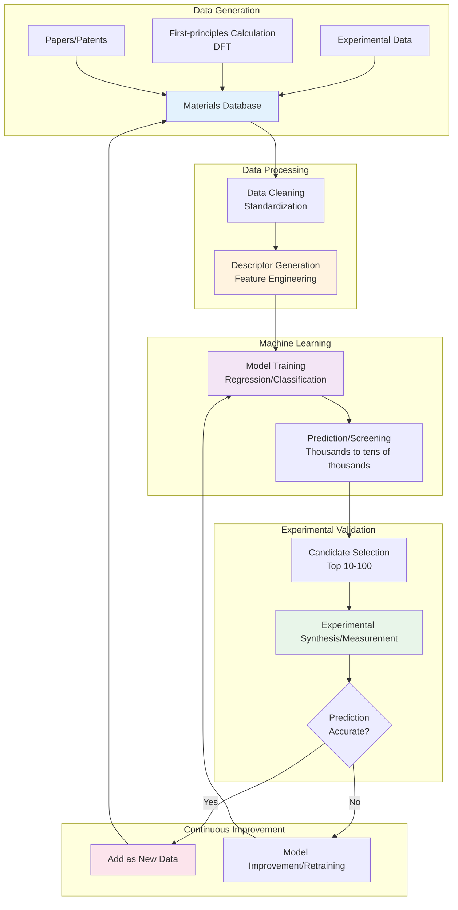
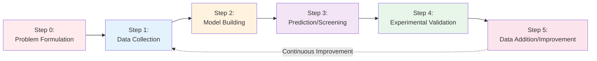

# Chapter 2: MI Fundamentals - Concepts, Methods & Ecosystem

## Learning Objectives

By reading this chapter, you will be able to:
- Explain the definition of MI and its differences from related fields (computational materials science, cheminformatics, etc.)
- Understand the characteristics and use cases of major materials databases (Materials Project, AFLOW, OQMD, JARVIS)
- Explain the 5-step MI workflow in detail (from problem formulation to validation)
- Understand the types and importance of materials descriptors (composition-based, structure-based, property-based)
- Correctly use 20 specialized terms frequently used in the MI field

---

## 2.1 What is MI: Definition and Related Fields

### 2.1.1 Etymology and History of Materials Informatics

The term **Materials Informatics (MI)** began to be used in the early 2000s. It gained worldwide attention particularly with the launch of the **U.S. Materials Genome Initiative (MGI) in 2011** [1].

**MGI Goals:**
- Reduce new materials development time to half of traditional approaches
- Significantly reduce development costs
- Accelerate through integration of computation, experiment, and data

This initiative was expected to have the potential to fundamentally transform materials science, just as the Human Genome Project transformed biology.

### 2.1.2 Definition

**Materials Informatics (MI)** is an academic field that combines materials science with data science. It is a methodology that accelerates the discovery of new materials and prediction of material properties by leveraging large amounts of materials data and information science technologies such as machine learning.

**Concise Definition:**
> "Science that speeds up materials development through the power of data and AI"

**Core Elements:**
1. **Data**: Experimental data, computational data, knowledge from literature
2. **Computation**: First-principles calculations, molecular dynamics simulations
3. **Machine Learning**: Predictive models, optimization algorithms
4. **Experimental Validation**: Verification of predictions and data addition

### 2.1.3 Comparison with Related Fields

MI is related to multiple fields, but each has a different focus.

| Field | Subject | Main Methods | Objective | Relationship to MI |
|-------|---------|--------------|-----------|-------------------|
| **Computational Materials Science** | Physical/chemical phenomena in materials | DFT, molecular dynamics | Theoretical prediction of material properties | MI utilizes this data |
| **Cheminformatics** | Compounds, small molecules | QSAR, molecular descriptors | Drug design, molecular property prediction | Shares descriptor concepts |
| **Bioinformatics** | Biomolecules, DNA/proteins | Sequence analysis, structure prediction | Decoding genetic information | Shares data-driven approach |
| **Materials Informatics<br>(MI)** | Solid materials in general | Machine learning, Bayesian optimization | Discovery and design of new materials | - |

**Uniqueness of MI:**
- **Inverse Design Approach**: Design materials from target properties (traditional approach calculates properties from materials)
- **Diverse Material Types**: Covers a wide range including metals, ceramics, semiconductors, polymers
- **Strong Experimental Collaboration**: Emphasizes experimental validation, not just computation

### 2.1.4 Forward Design vs Inverse Design

**Traditional Materials Development (Forward Design):**
```
Material composition → Calculate/measure structure/properties → Evaluate results
```
- Researchers propose candidate materials
- Repeated trial and error
- Time-consuming

**MI Approach (Inverse Design):**
```
Target properties → Predict candidate materials with ML → Experiment top candidates
```
- AI proposes optimal materials
- Efficiently screens large numbers of candidates
- Significant time reduction

**Concrete Example of Inverse Design:**
"I want a semiconductor material with a bandgap of 2.0 eV"
→ MI system automatically generates candidate material list
→ Researchers experimentally validate only the top 10

---

## 2.2 MI Glossary: Essential 20 Terms

Here is a compilation of specialized terms frequently used in learning MI. For beginners, correctly understanding these terms is the first step.

### Data & Model Related (1-7)

| Term (English) | Term (Japanese) | Description |
|----------------|-----------------|-------------|
| **1. Descriptor** | 記述子 | Numerical representation of material features. Examples: electronegativity, atomic radius, lattice constant. Used as input to machine learning models. |
| **2. Feature Engineering** | 特徴量エンジニアリング | Process of designing and selecting descriptors suitable for machine learning from raw data. Critical step that determines model performance. |
| **3. Screening** | スクリーニング | Efficiently selecting materials with target properties from a large number of candidates. Computational screening can evaluate thousands to tens of thousands in a short time. |
| **4. Overfitting** | 過学習 | Phenomenon where a model "memorizes" training data, resulting in poor prediction performance on unseen data. Requires special attention in materials science with limited data. |
| **5. Cross-validation** | 交差検証 | Method to evaluate model generalization performance. Divides data into K parts, using one for testing and the rest for training, repeating K times. |
| **6. Ensemble Methods** | アンサンブル法 | Methods that achieve higher accuracy by combining predictions from multiple models. Examples: Random Forest, Gradient Boosting. |
| **7. Validation** | 検証 | Process of confirming whether prediction results match actual material properties through experiment or high-accuracy calculations. Critical step to ensure MI reliability. |

### Computational Methods Related (8-13)

| Term (English) | Term (Japanese) | Description |
|----------------|-----------------|-------------|
| **8. DFT** | 密度汎関数理論 | Density Functional Theory. Method to calculate electronic states of materials based on quantum mechanics. Can theoretically predict material properties (bandgap, formation energy, etc.). |
| **9. Active Learning** | 能動学習 | Learning method where the model suggests "which data to acquire next". Can improve models while minimizing experimental costs. |
| **10. Bayesian Optimization** | ベイズ最適化 | Method to search for optimal materials while minimizing the number of experiments. Uses Gaussian processes to determine next experimental candidates. |
| **11. Transfer Learning** | 転移学習 | Method of applying a model trained on one material system to a related but different material system. Enables high-accuracy predictions even for new material systems with limited data. |
| **12. Graph Neural Networks (GNN)** | グラフニューラルネットワーク | Neural networks that treat crystal structures as graphs (atoms=nodes, bonds=edges) and directly learn structural information. Recently gaining attention. |
| **13. High-throughput Computation** | ハイスループット計算 | Method to automatically perform first-principles calculations on large numbers of materials. Materials Project evaluates over 140,000 materials through high-throughput computation. |

### Materials Science Related (14-20)

| Term (English) | Term (Japanese) | Description |
|----------------|-----------------|-------------|
| **14. Crystal Structure** | 結晶構造 | Structure where atoms are arranged in a regular pattern. Types include FCC (face-centered cubic), BCC (body-centered cubic), HCP (hexagonal close-packed), etc. |
| **15. Space Group** | 空間群 | 230 mathematical groups that classify the symmetry of crystal structures. Closely related to material properties. |
| **16. Bandgap** | バンドギャップ | In semiconductors and insulators, the energy difference between the occupied valence band and empty conduction band. Important for solar cell and semiconductor device design. |
| **17. Formation Energy** | 形成エネルギー | Energy change when a material is generated from its constituent elements. Negative values indicate stable materials. |
| **18. Phase Diagram** | 状態図 | Diagram showing which phase (solid, liquid, gas) a material exists in as a function of temperature, pressure, and composition. Essential for alloy design. |
| **19. Multi-objective Optimization** | 多目的最適化 | Method to simultaneously optimize multiple properties (e.g., lightweight and strength). Balances properties that typically have trade-off relationships. |
| **20. Pareto Front** | パレートフロント | In multi-objective optimization, the set of solutions that are not optimal in all objectives but cannot be improved in any objective without compromising another. Represents candidate optimal materials. |

**Key Points for Learning Terminology:**
- First prioritize understanding 1-7 (Data & Model related)
- Learn 8-13 (Computational methods) in detail at intermediate level
- Review 14-20 (Materials science) together with basic materials science knowledge

---

## 2.3 Overview of Materials Databases

Let's compare the four major materials databases that form the foundation of MI in detail.

### 2.3.1 Detailed Comparison of Major Databases

| Database Name | Number of Materials | Data Source | Main Property Data | Access Method | Advantages | Use Case Examples |
|--------------|---------------------|-------------|-------------------|---------------|------------|-------------------|
| **Materials Project** | 140,000+ | DFT calculations (VASP) | Bandgap, formation energy, elastic constants, phase stability | Web UI, API (Python: `pymatgen`) | Largest scale, active community, rich tools | Battery materials, semiconductors, structural materials |
| **AFLOW** | 3,500,000+ | DFT calculations (VASP) | Crystal structures, electronic structures, thermodynamic stability | Web UI, API (RESTful) | Most crystal structure data, standardized naming conventions | Crystal structure exploration, novel structure prediction |
| **OQMD** | 1,000,000+ | DFT calculations (VASP) | Formation energy, stability, phase diagrams | Web UI, API (Python: `qmpy`) | Strong in phase diagram calculations, rich alloy data | Alloy design, phase stability evaluation |
| **JARVIS** | 70,000+ | DFT calculations (VASP)<br>Machine learning predictions | Optical properties, mechanical properties, topological properties | Web UI, API (Python: `jarvis-tools`) | Diverse properties, provides ML models | Optical materials, topological materials |

### 2.3.2 How to Use Different Databases

**1. Materials Project**
- **When to use**: Exploration of battery materials, semiconductors, general inorganic materials
- **Strengths**:
  - Intuitive Web UI, beginner-friendly
  - Rich Python library (`pymatgen`)
  - Active community with abundant information
- **Weaknesses**: Lower coverage for some structure types

**2. AFLOW**
- **When to use**: Exploration of novel crystal structures, structural similarity search
- **Strengths**:
  - Most crystal structures (3.5 million types)
  - Standardized crystal structure description (AFLOW prototype)
  - Fast structural similarity search
- **Weaknesses**: Fewer types of property data than Materials Project

**3. OQMD**
- **When to use**: Phase diagram calculations for alloys, detailed phase stability evaluation
- **Strengths**:
  - Specialized in phase diagram calculations
  - Rich multi-component alloy data
  - Temperature-dependent evaluation possible
- **Weaknesses**: Less user-friendly Web UI

**4. JARVIS**
- **When to use**: Optical materials, topological materials, using ML models
- **Strengths**:
  - Integrated machine learning models
  - Rich optical properties (permittivity, refractive index)
  - Topological property calculations
- **Weaknesses**: Fewer materials than others

### 2.3.3 Practical Examples of Database Utilization

**Scenario 1: Finding novel cathode materials for lithium-ion batteries**

1. **Search in Materials Project**:
   - Conditions: Contains Li, voltage 3.5-4.5V, stable
   - Candidates: 100 types found

2. **Select top 10 types**:
   - Evaluate based on balance of capacity, voltage, stability

3. **Confirm phase stability in OQMD**:
   - Check possibility of decomposition with temperature changes

4. **Experimental validation**:
   - Actually synthesize top 3 types

**Scenario 2: Finding transparent conductive materials (for solar cells)**

1. **Search in JARVIS**:
   - Conditions: Bandgap > 3.0 eV (transparent), high electrical conductivity
   - Candidates: 50 types

2. **Additional information from Materials Project**:
   - Confirm formation energy, thermal stability

3. **Search for similar structures in AFLOW**:
   - Find structures similar to promising materials found

4. **Experimental validation**

### 2.3.4 Example of Database Access

**Materials Project API (Python) usage example:**

```python
from pymatgen.ext.matproj import MPRester

# Get API key: https://materialsproject.org
with MPRester("YOUR_API_KEY") as mpr:
    # Get LiCoO2 information
    data = mpr.get_data("mp-1234")  # material_id

    print(f"Chemical formula: {data[0]['pretty_formula']}")
    print(f"Bandgap: {data[0]['band_gap']} eV")
    print(f"Formation energy: {data[0]['formation_energy_per_atom']} eV/atom")
```

**Important Points:**
- Each database has a complementary relationship
- Using multiple databases together is recommended, not just one
- Important to compare results across different databases to ensure data reliability

---

## 2.4 MI Ecosystem: Data Flow

MI is not a standalone technology but an ecosystem where multiple elements collaborate. The following diagram shows the data flow in MI.



**How to Read the Diagram:**
1. **Data Generation**: Collect data from experiments, calculations, literature
2. **Data Processing**: Convert raw data into formats suitable for machine learning
3. **Machine Learning**: Train models and predict large numbers of candidates
4. **Experimental Validation**: Experimentally verify promising candidates
5. **Continuous Improvement**: Add results to data and improve models

**Importance of Feedback Loop:**
- Accurate prediction → Add data to further improve model
- Inaccurate prediction → Review model, change descriptors or learning methods
- Model accuracy improves by repeating this cycle

---

## 2.5 Basic MI Workflow: Detailed Version

Chapter 1 introduced a 4-step workflow, but here we expand to a more practical **5-step** approach.

### 2.5.1 Overview



### 2.5.2 Step 0: Problem Formulation (Most Important, Often Overlooked)

**What to do:**
- Clearly define the problem to solve
- Specify target properties and constraints
- Set success criteria

**Concrete Example: Battery Material Development**

**Poor problem formulation:**
> "I want to find good battery materials"

**Good problem formulation:**
> "Discover materials with the following properties as cathode materials for lithium-ion batteries:
> - Theoretical capacity: ≥200 mAh/g
> - Operating voltage: 3.5-4.5 V vs. Li/Li+
> - Cycle life: Capacity retention ≥80% after 500 cycles
> - Cost: ≤$50/kg (raw materials basis)
> - Safety: Thermal runaway temperature ≥200°C
> - Environmental constraint: Minimize Co usage (ideally Co-free)"

**Problem Formulation Checklist:**
- [ ] Are target properties quantitatively defined?
- [ ] Are constraints (cost, environment, safety) clear?
- [ ] Are success criteria measurable?
- [ ] Is it experimentally verifiable?

**Time estimate:** 1-2 weeks (including literature review and expert discussions)

**Common Failures:**
- Vague goals that change repeatedly later
- Ignore constraints and end up searching for infeasible materials
- No success criteria, so exploration never ends

### 2.5.3 Step 1: Data Collection

**What to do:**
- Collect material information from existing experimental data and literature
- Download relevant data from materials databases
- Add data through first-principles calculations if necessary

**Priority of Data Sources:**
1. **Existing Databases** (Most efficient)
   - Materials Project, AFLOW, OQMD
   - High reliability, immediately usable

2. **Papers/Patents** (Manual work required)
   - Google Scholar, Web of Science
   - May contain experimental data

3. **Self-calculate/measure** (Time-consuming)
   - Generate new material data through DFT calculations
   - Laboratory measurements

**Concrete Example: Lithium-ion Battery Cathode Materials**

```python
from pymatgen.ext.matproj import MPRester
import pandas as pd

# Search for Li-containing oxides from Materials Project
with MPRester("YOUR_API_KEY") as mpr:
    # Search criteria
    criteria = {
        "elements": {"$all": ["Li", "O"]},  # Must contain Li and O
        "nelements": {"$gte": 2, "$lte": 4},  # 2-4 elements
        "e_above_hull": {"$lte": 0.05}  # Stable or metastable
    }

    # Properties to retrieve
    properties = [
        "material_id",
        "pretty_formula",
        "formation_energy_per_atom",
        "energy_above_hull",
        "band_gap",
        "density"
    ]

    # Get data
    results = mpr.query(criteria, properties)

    # Convert to DataFrame
    df = pd.DataFrame(results)

    print(f"Number of materials retrieved: {len(df)}")
    print(df.head())
```

**Expected Results:**
- Data for hundreds to thousands of candidate materials
- Basic properties of each material (composition, formation energy, bandgap, etc.)

**Time Estimate:**
- Database use: Several hours to days
- Literature review: 1-2 weeks
- DFT calculations: Several weeks to months (depends on number of materials)

**Common Problems:**
- Missing data (specific properties available only for some materials)
- Data inconsistency (values differ between different databases)
- Data bias (biased toward specific material systems)

**Solutions:**
- Compare multiple databases to verify reliability
- Consider imputation methods for missing values (mean, ML estimation, etc.)
- Recognize data bias and clarify model applicability range

### 2.5.4 Step 2: Model Building

**What to do:**
- Train machine learning models using collected data
- Select appropriate descriptors (features)
- Evaluate and optimize model performance

**Sub-steps:**

**2.1 Descriptor Design**

Need to convert materials into numerical vectors.

**Types of Descriptors:**

| Type | Concrete Examples | Advantages | Disadvantages |
|------|-------------------|------------|---------------|
| **Composition-based** | Element electronegativity, atomic radius, atomic weight | Easy to calculate, interpretable | Ignores structural information |
| **Structure-based** | Lattice constants, space group, coordination number | Captures structure-property relationships | Requires crystal structure data |
| **Property-based** | Melting point, density, bandgap | Utilizes property correlations | Difficult to apply to unknown materials |

**Descriptor Example: Numerical Representation of LiCoO2**

```python
# Simple example: Composition-based descriptors
material = "LiCoO2"

# Fraction of each element
Li_fraction = 0.25  # 1/(1+1+2)
Co_fraction = 0.25
O_fraction = 0.50

# Element properties (from periodic table)
electronegativity_Li = 0.98
electronegativity_Co = 1.88
electronegativity_O = 3.44

# Weighted average
avg_electronegativity = (
    Li_fraction * electronegativity_Li +
    Co_fraction * electronegativity_Co +
    O_fraction * electronegativity_O
)  # = 2.38

# Vector representation
descriptor_vector = [
    Li_fraction, Co_fraction, O_fraction,  # Composition
    avg_electronegativity,  # Electronegativity
    # ... Add other properties
]
```

**In actual projects, use the `matminer` library:**

```python
from matminer.featurizers.composition import ElementProperty

# Automatically generate numerous descriptors
featurizer = ElementProperty.from_preset("magpie")
features = featurizer.featurize_dataframe(df, col_id="composition")
```

**2.2 Model Selection**

**Beginner-friendly Models:**
- **Linear Regression**: Simple, interpretable
- **Decision Tree**: Visualizable, captures non-linear relationships

**Intermediate Models:**
- **Random Forest**: High accuracy, robust to overfitting
- **Gradient Boosting (XGBoost, LightGBM)**: Highest accuracy

**Advanced Models:**
- **Neural Networks**: Learn complex non-linear relationships
- **Graph Neural Networks (GNN)**: Directly learn crystal structures

**2.3 Training and Evaluation**

```python
from sklearn.model_selection import train_test_split, cross_val_score
from sklearn.ensemble import RandomForestRegressor
from sklearn.metrics import mean_absolute_error, r2_score

# Data split
X = features  # Descriptors
y = df['target_property']  # Example: voltage

X_train, X_test, y_train, y_test = train_test_split(
    X, y, test_size=0.2, random_state=42
)

# Model training
model = RandomForestRegressor(n_estimators=100, random_state=42)
model.fit(X_train, y_train)

# Prediction
y_pred = model.predict(X_test)

# Evaluation
mae = mean_absolute_error(y_test, y_pred)
r2 = r2_score(y_test, y_pred)

print(f"MAE: {mae:.3f}")
print(f"R²: {r2:.3f}")

# Cross-validation (more reliable evaluation)
cv_scores = cross_val_score(model, X, y, cv=5, scoring='neg_mean_absolute_error')
print(f"CV MAE: {-cv_scores.mean():.3f} ± {cv_scores.std():.3f}")
```

**Performance Guidelines:**
- **R² > 0.8**: Good
- **R² > 0.9**: Excellent
- **R² < 0.5**: Model needs revision

**Time Estimate:**
- Descriptor design: Several days to 1 week
- Model training and optimization: 1-2 weeks

**Common Problems:**
- Overfitting (high accuracy on training data but low on test data)
- Poor descriptor selection (missing important features)

**Solutions:**
- Verify generalization performance with cross-validation
- Analyze feature importance and remove unnecessary descriptors
- Introduce regularization (L1/L2)

### 2.5.5 Step 3: Prediction/Screening

**What to do:**
- Predict properties of unknown materials using trained model
- Evaluate large numbers of candidate materials (thousands to tens of thousands) in a short time
- Select promising top candidates

**Screening Flow:**

```
Candidate materials: 10,000 types (generated by calculations)
  ↓ (Predict with ML: minutes)
Rank by predicted values
  ↓
Select top 1,000 (close to target properties)
  ↓ (Detailed calculation/evaluation: hours to days)
Narrow down to top 100
  ↓
Materials to experiment: Top 10 (most promising candidates)
```

**Concrete Code Example:**

```python
import numpy as np

# Generate candidate material list (example: create candidates by varying composition)
# Actually use more systematic methods
candidate_compositions = [...]  # 10,000 items

# Calculate descriptors for each candidate
candidate_features = compute_descriptors(candidate_compositions)

# Predict with model
predicted_properties = model.predict(candidate_features)

# Rank (example: by highest voltage)
ranked_indices = np.argsort(predicted_properties)[::-1]

# Select top 100
top_100 = [candidate_compositions[i] for i in ranked_indices[:100]]

print("Top 10 candidates:")
for i, comp in enumerate(top_100[:10]):
    pred_val = predicted_properties[ranked_indices[i]]
    print(f"{i+1}. {comp}: Predicted value = {pred_val:.2f}")
```

**Efficiency Example:**
- **Traditional**: Evaluate 10,000 types experimentally → About 30 years (1 per day)
- **MI**: Evaluate 10 types experimentally → About 2 weeks
- **Time reduction rate**: 99.9%

**Time Estimate:**
- Prediction calculation: Minutes to hours (depends on number of candidates)
- Result analysis: Several days

**Cautions:**
- Predictions are just predictions. Must validate experimentally
- Prediction accuracy is low for materials outside model applicability range (materials very different from training data)
- More reliable with uncertainty evaluation (Bayesian methods)

### 2.5.6 Step 4: Experimental Validation

**What to do:**
- Actually synthesize materials narrowed down by prediction
- Measure properties and verify if predictions were correct
- Analyze discrepancies between predictions and measurements

**Experimental Priority:**
1. **Materials with highest predicted values** (Best case)
2. **Materials with moderate predicted values but low uncertainty** (Safe choice)
3. **Materials with high predicted values but also high uncertainty** (High risk, high return)

**Validation Checklist:**
- [ ] Are synthesis conditions established?
- [ ] Are measurement instruments available?
- [ ] Does measurement accuracy meet target property requirements?
- [ ] Reproducibility confirmation (multiple measurements)

**Time Estimate:**
- Synthesis: Several days to weeks (depends on material)
- Measurement: Several days to 1 week
- Total: 2-3 months for top 10

**Judging Success and Failure:**

| Result | Judgment | Next Action |
|--------|----------|-------------|
| Prediction matches measurement | Success | Add to data, explore further |
| Better than prediction | Great success | Analyze model to investigate why it underestimated |
| Worse than prediction | Partial failure | Review descriptors and model |
| Completely different | Failure | Possibly outside model applicability. Reconsider data and model |

**Important Points:**
- Failures are also valuable data. Always add to database
- Analyzing causes of prediction-measurement discrepancies improves models

### 2.5.7 Step 5: Data Addition/Model Improvement

**What to do:**
- Add experimental results (both success and failure) to database
- Retrain model with new data
- Verify improved prediction accuracy

**Continuous Improvement Cycle:**

```
Initial model (R² = 0.75)
  ↓
Add 10 experimental results
  ↓
Model retraining (R² = 0.82)
  ↓
10 more experiments
  ↓
Model retraining (R² = 0.88)
  ↓
Finally discover optimal material
```

**Active Learning Application:**

In typical MI, materials with high predicted values are experimented on, but in **active learning**, the model suggests "materials with high uncertainty".

```python
# Estimate uncertainty with Random Forest
predictions = []
for tree in model.estimators_:
    pred = tree.predict(candidate_features)
    predictions.append(pred)

predictions = np.array(predictions)
uncertainty = predictions.std(axis=0)  # High std = high uncertainty

# Prioritize materials with high uncertainty for experiment
high_uncertainty_indices = np.argsort(uncertainty)[::-1]
next_experiment = candidate_compositions[high_uncertainty_indices[0]]
```

**Time Estimate:** 1-2 weeks per cycle

**Termination Conditions:**
- Found materials satisfying target properties
- Prediction accuracy sufficiently high (R² > 0.9)
- Budget/time constraints

---

## 2.6 Details of Materials Descriptors

### 2.6.1 Types of Descriptors and Concrete Examples

**1. Composition-based Descriptors**

**Characteristics:**
- Calculable from chemical formula alone
- Usable even when crystal structure is unknown
- Low computational cost

**Concrete Examples:**

| Descriptor | Description | Example (LiCoO2) |
|-----------|-------------|------------------|
| Average electronegativity | Weighted average of element electronegativities | 2.38 |
| Average atomic radius | Weighted average of element atomic radii | 1.15 Å |
| Number of element types | Number of constituent elements | 3 (Li, Co, O) |
| Average atomic weight | Weighted average of element atomic weights | 30.8 g/mol |
| Electronegativity difference | Difference between max and min electronegativity | 2.46 (O - Li) |

**2. Structure-based Descriptors**

**Characteristics:**
- Utilize crystal structure information
- Capture structure-property relationships
- Require crystal structure data

**Concrete Examples:**

| Descriptor | Description | Example (LiCoO2) |
|-----------|-------------|------------------|
| Lattice constants | Unit cell lengths a, b, c | a=2.82 Å, c=14.05 Å (hexagonal) |
| Space group | Crystal symmetry | R-3m (166) |
| Coordination number | Number of neighboring atoms around an atom | Co: 6-coordinated (surrounded by oxygen) |
| Bond distance | Distance between adjacent atoms | Co-O: 1.93 Å |
| Density | Mass per unit volume | 5.06 g/cm³ |

**3. Property-based Descriptors**

**Characteristics:**
- Predict unknown properties from known properties
- Utilize property correlations
- Difficult to apply to unknown materials

**Concrete Examples:**

| Descriptor | Description | Example (LiCoO2) |
|-----------|-------------|------------------|
| Melting point | Solid-to-liquid phase transition temperature | ~1200 K |
| Bandgap | Energy gap in electronic structure | ~2.7 eV (insulator) |
| Formation energy | Energy when generated from elements | -2.5 eV/atom (stable) |
| Elastic modulus | Material hardness/resistance to deformation | 150 GPa |
| Thermal conductivity | Ease of heat transfer | 5 W/(m·K) |

### 2.6.2 Automatic Descriptor Generation (Using Matminer)

```python
from matminer.featurizers.composition import ElementProperty, Stoichiometry
from matminer.featurizers.structure import DensityFeatures
from pymatgen.core import Composition

# Automatic generation of composition-based descriptors
comp = Composition("LiCoO2")

# Example 1: Element property-based descriptors (73 types)
element_featurizer = ElementProperty.from_preset("magpie")
element_features = element_featurizer.featurize(comp)

print(f"Number of generated descriptors: {len(element_features)}")
print(f"Example descriptors: {element_features[:5]}")

# Example 2: Composition ratio-based descriptors
stoich_featurizer = Stoichiometry()
stoich_features = stoich_featurizer.featurize(comp)

print(f"Composition ratio descriptors: {stoich_features}")
```

**Descriptors Generated by Matminer (partial list):**
- Average electronegativity, atomic radius, atomic weight
- Element position on periodic table (group, period)
- Electronic configuration (s-orbital electrons, p-orbital electrons, etc.)
- Average and variance of oxidation states
- Number of valence electrons

### 2.6.3 Descriptor Selection and Feature Engineering

**Not all descriptors are useful:**
- Irrelevant descriptors → Become noise and degrade model performance
- Redundant descriptors → Waste of computational cost

**Descriptor Selection Methods:**

**1. Feature Importance**

```python
import matplotlib.pyplot as plt
import pandas as pd

# Random Forest feature importance
importances = model.feature_importances_
feature_names = X.columns

# Sort by importance
indices = np.argsort(importances)[::-1]

# Visualize top 20
plt.figure(figsize=(10, 6))
plt.bar(range(20), importances[indices[:20]])
plt.xticks(range(20), [feature_names[i] for i in indices[:20]], rotation=90)
plt.xlabel("Feature")
plt.ylabel("Importance")
plt.title("Feature Importance Top 20")
plt.tight_layout()
plt.show()
```

**2. Correlation Analysis**

```python
# Correlation matrix between features
correlation_matrix = X.corr()

# Remove feature pairs with high correlation (>0.9)
high_corr_pairs = []
for i in range(len(correlation_matrix.columns)):
    for j in range(i+1, len(correlation_matrix.columns)):
        if abs(correlation_matrix.iloc[i, j]) > 0.9:
            high_corr_pairs.append((correlation_matrix.columns[i],
                                   correlation_matrix.columns[j]))

print(f"High correlation pairs: {len(high_corr_pairs)}")
```

**3. Recursive Feature Elimination (RFE)**

```python
from sklearn.feature_selection import RFE

# Select best 50 features
selector = RFE(model, n_features_to_select=50, step=1)
selector.fit(X_train, y_train)

selected_features = X.columns[selector.support_]
print(f"Selected features: {list(selected_features)}")
```

---

## 2.7 Summary

### What We Learned in This Chapter

1. **Definition and Positioning of MI**
   - Fusion of materials science and data science
   - Efficiency through inverse design approach
   - Differences from computational materials science and cheminformatics

2. **20 MI Terms**
   - Data/model related (descriptors, feature engineering, overfitting, etc.)
   - Computational methods related (DFT, Bayesian optimization, GNN, etc.)
   - Materials science related (crystal structure, bandgap, phase diagram, etc.)

3. **Materials Databases**
   - Materials Project: Largest scale, beginner-friendly
   - AFLOW: Most crystal structure data
   - OQMD: Strong in phase diagram calculations
   - JARVIS: Integrated machine learning models
   - Using multiple databases together is recommended

4. **MI Ecosystem**
   - Cycle of data generation → processing → machine learning → experimental validation → improvement
   - Feedback loop is important

5. **MI 5-Step Workflow**
   - Step 0: Problem formulation (most important)
   - Step 1: Data collection (databases, literature, computation)
   - Step 2: Model building (descriptor design, training, evaluation)
   - Step 3: Prediction/screening (efficiently evaluate large candidates)
   - Step 4: Experimental validation (synthesis/measurement of top candidates)
   - Step 5: Data addition/improvement (continuous improvement cycle)

6. **Details of Materials Descriptors**
   - Three types: composition-based, structure-based, property-based
   - Automatic generation with Matminer
   - Importance of feature selection

### To the Next Chapter

In Chapter 3, we'll put this knowledge into practice. Using actual Python code, you'll experience the entire flow from data acquisition from materials databases, descriptor generation, machine learning model building, to prediction.

---

## Exercise Problems

### Problem 1 (Difficulty: easy)

Select 5 terms from the MI glossary and explain them in your own words.

<details>
<summary>Sample Answer</summary>

**1. Descriptor**
Numerical representation of material features so they can be input into machine learning models. Examples include element electronegativity and atomic radius.

**2. Screening**
Efficiently narrowing down materials with target properties from a large number of candidates. MI can evaluate thousands to tens of thousands computationally in a short time.

**3. Overfitting**
Phenomenon where a machine learning model memorizes training data, resulting in poor prediction performance on new data. Can be detected with cross-validation.

**4. Bandgap**
In semiconductors, the energy difference between the occupied valence band and empty conduction band. Important metric for solar cell design.

**5. Bayesian Optimization**
Method to search for optimal materials while minimizing the number of experiments. AI suggests which material to experiment on next.

</details>

### Problem 2 (Difficulty: medium)

Regarding the use of Materials Project vs AFLOW, answer which to use for the following scenarios with reasons.

**Scenario A**: Want to search for novel lithium-ion battery cathode materials. Need bandgap and formation energy data.

**Scenario B**: Want to find novel materials with similar crystal structures to existing materials. Need structural similarity search.

<details>
<summary>Sample Answer</summary>

**Scenario A: Use Materials Project**

**Reasons:**
- Materials Project has over 140,000 material data with both bandgap and formation energy available
- Rich tools specialized for battery materials research (voltage, capacity calculations, etc.)
- Well-developed Python library (pymatgen) for easy data acquisition
- Intuitive Web UI, user-friendly even for beginners

**Scenario B: Use AFLOW**

**Reasons:**
- AFLOW has the most crystal structure data with 3.5 million types
- Fast and accurate structural similarity search functionality
- Easy to search for similar structures due to standardized structure description via AFLOW prototype
- Rich tools specialized for structure exploration

**Summary:**
Materials Project is suitable when emphasizing property data, AFLOW when emphasizing structure exploration. In actual projects, often both are used together.

</details>

### Problem 3 (Difficulty: medium)

Explain why Step 0 (problem formulation) in the MI workflow is most important, with concrete examples.

<details>
<summary>Hint</summary>

When problem formulation is vague, it affects all subsequent steps. Consider the importance of clarifying target properties, constraints, and success criteria.

</details>

<details>
<summary>Sample Answer</summary>

**Importance of Problem Formulation:**

When problem formulation is insufficient, the following problems occur.

**Bad Example:**
> "I want to find high-performance catalyst materials"

**Problems:**
- "High-performance" is not defined (reaction rate? selectivity? durability?)
- No constraints (cost, toxicity, availability)
- Success criteria unclear (how long to continue exploration?)

**Results:**
1. Waste time in data collection (collect even unrelated data)
2. Model optimizes wrong objectives
3. Realize at experimental stage that "actually a different property was important" and restart

**Good Example:**
> "Discover materials with the following properties as catalyst materials for hydrogen production:
> - Reaction rate: ≥100 mol H2/(m²·h)
> - Selectivity: ≥95% (suppress byproducts other than hydrogen)
> - Durability: Activity maintained at ≥80% after 1000 hours continuous operation
> - Cost: ≤$100/kg
> - Constraint: Minimize use of precious metals like Pt, Pd"

**Effects:**
1. Data collection is clear (prioritize reaction rate, selectivity, durability data)
2. Model optimizes correct objectives
3. Success criteria are clear, easy to evaluate project progress
4. Easy to prioritize experiments

**Value of Time Investment:**
Spending 1-2 weeks on problem formulation can significantly reduce the risk of wasting months to years of subsequent work.

</details>

### Problem 4 (Difficulty: hard)

There are three types of material descriptors: composition-based, structure-based, and property-based. List the advantages and disadvantages of each, and explain in what situations each should be used.

<details>
<summary>Hint</summary>

Consider the trade-offs between computational cost, required data, and prediction accuracy for each descriptor.

</details>

<details>
<summary>Sample Answer</summary>

**Composition-based Descriptors**

**Advantages:**
- Calculable from chemical formula alone (no crystal structure needed)
- Low computational cost (seconds)
- Applicable to unknown materials

**Disadvantages:**
- Ignores structural information (properties change even with same composition if structure differs)
- Prediction accuracy may be lower than structure-based

**Use in:**
- Many materials with unknown crystal structures
- Need for fast screening (tens of thousands)
- Early project stages (rough screening)

**Structure-based Descriptors**

**Advantages:**
- Captures structure-property relationships (more accurate predictions)
- Can distinguish different structures with same composition

**Disadvantages:**
- Requires crystal structure data (determined experimentally or by DFT calculation)
- High computational cost
- Need to predict structure for unknown materials

**Use in:**
- Crystal structure data available
- Need high accuracy (narrowing down final candidates)
- Want to understand structure-property correlations

**Property-based Descriptors**

**Advantages:**
- Utilizes property correlations (e.g., materials with high melting points tend to have high hardness)
- High accuracy for known materials

**Disadvantages:**
- Difficult to apply to unknown materials (need other properties to predict target property)
- Unclear causal relationships (why are those properties related)

**Use in:**
- Estimating properties of known materials from other properties
- Material systems with abundant experimental data
- Research exploring property correlations

**Practical Use Strategy:**

1. **Initial Screening (tens of thousands)**: Composition-based descriptors
   - Rapidly narrow down to about 1,000 candidates

2. **Intermediate Screening (1,000)**: Structure-based descriptors
   - More accurately narrow down to 100

3. **Final Selection (100)**: Property-based descriptors (if available)
   - Utilize known properties to determine final 10

4. **Experimental Validation (10)**

This staged approach balances computational cost and prediction accuracy.

</details>

---

## References

1. **Materials Genome Initiative (MGI)** - White House Office of Science and Technology Policy (2011)
   URL: https://www.mgi.gov
   *U.S. materials development acceleration project launched in 2011. Triggered worldwide spread of MI.*

2. Ramprasad, R., Batra, R., Pilania, G., Mannodi-Kanakkithodi, A., & Kim, C. (2017). "Machine learning in materials informatics: recent applications and prospects." *npj Computational Materials*, 3(1), 54.
   DOI: [10.1038/s41524-017-0056-5](https://doi.org/10.1038/s41524-017-0056-5)

3. Jain, A., Ong, S. P., Hautier, G., Chen, W., Richards, W. D., et al. (2013). "Commentary: The Materials Project: A materials genome approach to accelerating materials innovation." *APL Materials*, 1(1), 011002.
   DOI: [10.1063/1.4812323](https://doi.org/10.1063/1.4812323)
   Materials Project: https://materialsproject.org

4. Curtarolo, S., Setyawan, W., Hart, G. L., Jahnatek, M., Chepulskii, R. V., et al. (2012). "AFLOW: An automatic framework for high-throughput materials discovery." *Computational Materials Science*, 58, 218-226.
   DOI: [10.1016/j.commatsci.2012.02.005](https://doi.org/10.1016/j.commatsci.2012.02.005)
   AFLOW: http://www.aflowlib.org

5. Saal, J. E., Kirklin, S., Aykol, M., Meredig, B., & Wolverton, C. (2013). "Materials Design and Discovery with High-Throughput Density Functional Theory: The Open Quantum Materials Database (OQMD)." *JOM*, 65(11), 1501-1509.
   DOI: [10.1007/s11837-013-0755-4](https://doi.org/10.1007/s11837-013-0755-4)
   OQMD: http://oqmd.org

6. Choudhary, K., Garrity, K. F., Reid, A. C. E., DeCost, B., Biacchi, A. J., et al. (2020). "The joint automated repository for various integrated simulations (JARVIS) for data-driven materials design." *npj Computational Materials*, 6(1), 173.
   DOI: [10.1038/s41524-020-00440-1](https://doi.org/10.1038/s41524-020-00440-1)
   JARVIS: https://jarvis.nist.gov

---

**Author Information**

This article was created as part of the MI Knowledge Hub project under Dr. Yusuke Hashimoto at Tohoku University.

**Update History**
- 2025-10-16: v3.0 Initial version created
  - Expanded Section 2 from v2.1 (approximately 2,000 words) to 4,000-5,000 words
  - Added 20-term glossary
  - Added detailed materials database comparison table
  - Added MI ecosystem diagram (Mermaid)
  - Added detailed explanation of 5-step workflow
  - Added deep-dive section on materials descriptors
  - Added 4 exercise problems (difficulty: 1 easy, 2 medium, 1 hard)
