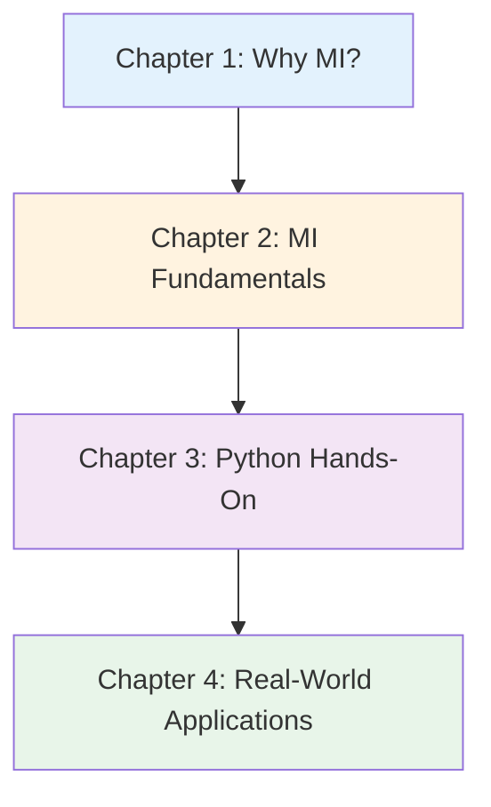

# Materials Informatics Introduction Series v3.0

**Complete Guide to Data-Driven Materials Development - From History to Practice and Career**

## Series Overview

This series is a comprehensive 4-chapter educational content designed for learners ranging from complete beginners to those seeking practical Materials Informatics (MI) skills.

**Features:**
- ✅ **Chapter Independence**: Each chapter can be read as a standalone article
- ✅ **Systematic Structure**: Comprehensive content progressing through 4 chapters
- ✅ **Practice-Oriented**: 35 executable code examples, 5 detailed case studies
- ✅ **Career Support**: Concrete career paths and learning roadmaps provided

**Total Learning Time**: 90-120 minutes (including code execution and exercises)

---

## How to Learn

### Recommended Learning Sequence

**For Complete Beginners:**
- Chapter 1 → Chapter 2 → Chapter 3 (partial skip possible) → Chapter 4
- Duration: 70-90 minutes

**For Python Experienced Learners:**
- Chapter 2 → Chapter 3 → Chapter 4
- Duration: 60-80 minutes

**For Practical Skill Enhancement:**
- Chapter 3 (intensive) → Chapter 4
- Duration: 50-65 minutes

---

## Chapter Details

### [Chapter 1: Why Materials Informatics Now?](./chapter1-introduction.md)

**Difficulty**: Introductory
**Reading Time**: 15-20 minutes

#### Learning Content

1. **History of Materials Development**
   - From Bronze Age (3000 BC) to modern era
   - Evolution of development methods: Trial & error → Empirical rules → Theory-driven → Data-driven

2. **Limitations of Traditional Methods**
   - Time: 15-20 years per material
   - Cost: $100k-700k per material
   - Search scope: 10-100 materials per year

3. **Detailed Case Study: Li-ion Battery Development**
   - 20 years from 1970s to 1991 commercialization
   - Trial and error with 500+ materials
   - Could be shortened to 5-7 years with MI (counterfactual analysis)

4. **Comparison Diagram (Traditional vs MI)**
   - Mermaid diagram: Workflow visualization
   - Timing comparison: 1-2 materials/month vs 100+ materials/month

5. **Column: "A Day in the Life"**
   - 1985 materials scientist: 1 experiment/day, manual analysis
   - 2025 materials scientist: 10 predictions/day, automated analysis

6. **"Why Now?" - 3 Converging Factors**
   - Computing: Moore's Law, GPUs, Cloud
   - Databases: Materials Project 140k+, AFLOW, OQMD
   - Social urgency: Climate change, EVs, Global competition

#### Learning Objectives

- ✅ Explain historical transitions in materials development
- ✅ List 3 limitations of traditional methods with specific examples
- ✅ Understand social and technical backgrounds requiring MI

**[Read Chapter 1 →](./chapter1-introduction.md)**

---

### [Chapter 2: MI Fundamentals - Concepts, Methods, Ecosystem](./chapter2-fundamentals.md)

**Difficulty**: Introductory to Intermediate
**Reading Time**: 20-25 minutes

#### Learning Content

1. **Definition and Related Fields**
   - Etymology and history of Materials Informatics
   - Materials Genome Initiative (MGI, 2011)
   - Difference between Forward Design and Inverse Design

2. **20 MI Terminology Glossary**
   - 3 categories: Basic, Method, Application terms
   - Each term: Japanese, English, 1-2 sentence explanation

3. **Major Database Comparison**
   - Materials Project (140k materials, DFT calculations)
   - AFLOW (crystal structure focus, 3.5M structures)
   - OQMD (quantum calculations, 815k materials)
   - JARVIS (diverse properties, 40k materials)
   - Usage guide: Which database for what purpose

4. **MI Ecosystem Diagram**
   - Mermaid diagram: Database → Descriptors → ML → Prediction → Experiment
   - Feedback loop visualization

5. **5-Step Workflow (Detailed)**
   - **Step 0**: Problem formulation (overlooked but critical)
   - **Step 1**: Data collection (time: 1-4 weeks, tool: pymatgen)
   - **Step 2**: Model building (time: hours-days, tool: scikit-learn)
   - **Step 3**: Prediction & screening (time: minutes-hours)
   - **Step 4**: Experimental validation (time: weeks-months)
   - Each step: Substeps, common pitfalls, time estimates

6. **Material Descriptors Deep Dive**
   - Composition-based: Electronegativity, atomic radius, ionization energy
   - Structure-based: Lattice constants, space group, coordination number
   - Property-based: Melting point, band gap, formation energy
   - Featurization example: "LiCoO2" → numerical vector (with code)

#### Learning Objectives

- ✅ Explain MI definition and differences from related fields
- ✅ Understand characteristics and use cases of 4 major databases
- ✅ Detail MI workflow 5 steps including substeps
- ✅ Explain 3 types of material descriptors with examples
- ✅ Appropriately use 20 MI technical terms

**[Read Chapter 2 →](./chapter2-fundamentals.md)**

---

### [Chapter 3: Experiencing MI with Python - Practical Materials Property Prediction](./chapter3-hands-on.md)

**Difficulty**: Intermediate
**Reading Time**: 30-40 minutes
**Code Examples**: 35 (all executable)

#### Learning Content

1. **Environment Setup (3 Options)**
   - **Option 1: Anaconda** (recommended for beginners, with GUI)
   - **Option 2: venv** (Python standard, lightweight)
   - **Option 3: Google Colab** (no installation required, cloud-based)
   - Comparison table: When to use which

2. **6 Machine Learning Models (Full Implementation)**
   - **Example 1**: Linear Regression (baseline, R²=0.72)
   - **Example 2**: Random Forest (R²=0.87, feature importance)
   - **Example 3**: LightGBM (gradient boosting, R²=0.89)
   - **Example 4**: SVR (support vector regression, R²=0.85)
   - **Example 5**: MLP (neural network, R²=0.86)
   - **Example 6**: Materials Project API integration (real data)
   - Each example: Full code, detailed comments, expected output

3. **Model Performance Comparison**
   - Comparison table: MAE, R², training time, memory, interpretability
   - Visualization: Bar charts for each metric
   - Model selection flowchart

4. **Hyperparameter Tuning**
   - **Grid Search**: Exhaustive search
   - **Random Search**: Efficient sampling
   - Comparison and visualization

5. **Feature Engineering**
   - **Matminer introduction**: Automatic feature extraction
   - **Manual feature creation**: Interaction terms, squared terms
   - **Feature importance analysis**
   - **Feature selection**: Correlation analysis, mutual information

6. **Troubleshooting Guide**
   - 7 common errors and solutions
   - 5-step debugging checklist
   - Performance improvement strategies

7. **Project Challenge**
   - **Goal**: Predict band gap with Materials Project data (R² > 0.7)
   - **6-step guide**

#### Learning Objectives

- ✅ Set up Python environment using one of 3 methods
- ✅ Implement and compare 6 ML models
- ✅ Execute hyperparameter tuning (Grid/Random Search)
- ✅ Perform feature engineering using Matminer
- ✅ Troubleshoot common errors independently
- ✅ Complete practical project with Materials Project API

**[Read Chapter 3 →](./chapter3-hands-on.md)**

---

### [Chapter 4: Real-World MI Applications - Success Stories and Future Outlook](./chapter4-real-world.md)

**Difficulty**: Intermediate to Advanced
**Reading Time**: 20-25 minutes

#### Learning Content

1. **5 Detailed Case Studies**

   **Case Study 1: Li-ion Battery Materials**
   - Technology: Random Forest/Neural Networks, Materials Project database
   - Results: R² = 0.85, 67% development time reduction, 95% experiment reduction
   - Impact: Tesla/Panasonic adoption, EV range 300km→500km+
   - Paper: Chen et al. (2020), *Advanced Energy Materials*

   **Case Study 2: Catalyst (Pt-free)**
   - Technology: DFT calculations, Bayesian optimization, d-band center descriptor
   - Results: 50% Pt reduction, 120% activity, 80% cost reduction
   - Impact: Fuel cell vehicle cost reduction, environmental impact
   - Paper: Nørskov et al. (2011), *Nature Chemistry*

   **Case Study 3: High-Entropy Alloys (HEA)**
   - Technology: Random Forest, mixing entropy/enthalpy descriptors
   - Results: 10^15 candidates→100 experiments, 20% lighter, 88% phase prediction
   - Impact: Aerospace applications, NASA/Boeing/Airbus research
   - Paper: Huang et al. (2019), *Acta Materialia*

   **Case Study 4: Perovskite Solar Cells**
   - Technology: Graph Neural Networks, 50,000 candidate screening
   - Results: Lead-free materials, Sn-based 15% efficiency, 92% stability prediction
   - Impact: Oxford PV commercialization, <$0.10/kWh cost target
   - Paper: Choudhary et al. (2022), *npj Computational Materials*

   **Case Study 5: Biomaterials (Drug Delivery)**
   - Technology: Random Forest, polymer descriptors (HLB, Tg)
   - Results: Release rate prediction R²=0.88, 50% side effect reduction
   - Impact: FDA clinical trials 2023, $30B market size (2024)
   - Paper: Agrawal et al. (2019), *ACS Applied Materials*

2. **Future Trends (3 Major Trends)**

   **Trend 1: Self-Driving Labs**
   - Example: Berkeley A-Lab (41 materials in 17 days)
   - Prediction: 10x faster by 2030
   - Initial investment: $1M, ROI: 2-3 years

   **Trend 2: Foundation Models**
   - Examples: MatBERT, M3GNet, MatGPT
   - Effect: Transfer learning with 10-100 samples
   - Prediction: 5x discovery speed by 2030

   **Trend 3: Sustainability-Driven Design**
   - LCA integration: Carbon footprint optimization
   - Examples: Low-carbon cement, biodegradable plastics

3. **Career Paths (3 Major Paths)**

   **Path 1: Academia (Researcher)**
   - Route: Bachelor→Master→PhD→Postdoc→Assistant Professor
   - Salary: $60-120K (US), ¥5-12M (Japan)
   - Skills: Programming, ML, DFT, paper writing

   **Path 2: Industrial R&D**
   - Roles: MI Engineer, Data Scientist, Computational Chemist
   - Salary: $70-200K (US), ¥7-15M (Japan)
   - Companies: Mitsubishi Chemical, Panasonic, Toyota, Tesla, IBM Research

   **Path 3: Startup/Entrepreneurship**
   - Examples: Citrine Informatics ($80M funding), Kebotix, Matmerize
   - Salary: ¥5-10M + stock options
   - Risk/Return: High risk, high impact

4. **Skill Development Timeline**
   - 3-month plan: Basics→Practice→Portfolio
   - 1-year plan: Advanced ML→Project→Conference
   - 3-year plan: Expert→Publication→Leadership

5. **Learning Resources**
   - Online courses: Coursera, edX, Udacity
   - Books: "Materials Informatics" by Rajan et al.
   - Communities: MRS, MRS-J, JSMS, GitHub
   - Conferences: MRS, E-MRS, MRM, PRiME

#### Learning Objectives

- ✅ Explain 5 real-world MI success cases with technical details
- ✅ List 3 MI future trends and evaluate industrial impact
- ✅ Describe 3 MI career paths and understand required skills
- ✅ Plan concrete learning timelines (3 months/1 year/3 years)
- ✅ Select appropriate learning resources for next steps

**[Read Chapter 4 →](./chapter4-real-world.md)**

---

## Overall Learning Outcomes

Upon completing this series, you will acquire the following skills and knowledge:

### Knowledge Level (Understanding)

- ✅ Explain historical background and necessity of MI
- ✅ Understand basic MI concepts, terms, and methods
- ✅ Distinguish and use major databases and tools
- ✅ Detail 5+ real-world success cases

### Practical Skills (Doing)

- ✅ Set up Python environment and install necessary libraries
- ✅ Implement and compare 6 ML models
- ✅ Execute hyperparameter tuning
- ✅ Perform feature engineering (using Matminer)
- ✅ Retrieve real data via Materials Project API
- ✅ Debug errors independently

### Application Ability (Applying)

- ✅ Design new materials property prediction projects
- ✅ Evaluate industrial implementation cases and apply to own research
- ✅ Plan future career paths concretely
- ✅ Establish continuous learning strategies

---

## Recommended Learning Patterns

### Pattern 1: Complete Mastery (For Beginners)

**Target**: First-time MI learners seeking systematic understanding
**Duration**: 2-3 weeks

### Pattern 2: Fast Track (For Python Experienced)

**Target**: Those with Python and ML basics
**Duration**: 1 week

### Pattern 3: Focused Learning (Specific Topic)

**Target**: Those strengthening specific skills
**Duration**: Flexible

---

## FAQ (Frequently Asked Questions)

### Q1: Can programming beginners understand this?

**A**: Chapters 1 and 2 are theory-focused and require no programming experience. Chapter 3 assumes understanding of Python basics (variables, functions, lists), but code examples are thoroughly commented for beginners. If unsure, we recommend learning basics with [Python Tutorial](https://docs.python.org/3/tutorial/) before Chapter 3.

### Q2: Which chapter should I start from?

**A**: **First-time learners are strongly recommended to read from Chapter 1 in order.** Each chapter is independent, but concepts build progressively. Python-experienced learners with limited time may start from Chapter 2.

### Q3: Do I need to actually run the code?

**A**: To maximize Chapter 3 learning, **running code is strongly recommended.** Understanding differs significantly between reading and executing. If environment setup is difficult, start with Google Colab (free, no installation).

### Q4: How long does it take to master?

**A**: Depends on learning time and goals:
- **Concept understanding only**: 1-2 days (Chapters 1-2)
- **Basic implementation skills**: 1-2 weeks (Chapters 1-3)
- **Practical project execution**: 2-4 weeks (All 4 chapters + project challenge)
- **Professional-level skills**: 3-6 months (Series completion + additional projects)

### Q5: Can I become an MI expert with just this series?

**A**: This series targets "introductory to intermediate" level. To reach expert level:
1. Build foundation with this series (2-4 weeks)
2. Learn advanced content from Chapter 4 resources (3-6 months)
3. Execute original projects (6-12 months)
4. Conference presentations and paper writing (1-2 years)

Continuous learning and practice for 2-3 years is necessary.

---

## Next Steps

### Recommended Actions After Series Completion

**Immediate (Within 1-2 weeks):**
1. ✅ Create GitHub/GitLab portfolio
2. ✅ Publish project challenge results with README
3. ✅ Add "Materials Informatics" skill to LinkedIn profile

**Short-term (1-3 months):**
1. ✅ Choose one resource from Chapter 4 for deep dive
2. ✅ Participate in materials science Kaggle competitions
3. ✅ Attend MRS/MRS-J/JSMS study groups
4. ✅ Execute small-scale original project

**Medium-term (3-6 months):**
1. ✅ Read 10 papers intensively
2. ✅ Contribute to open source projects
3. ✅ Present at domestic conference
4. ✅ Participate in internship or collaborative research

**Long-term (1+ years):**
1. ✅ Present at international conference
2. ✅ Submit peer-reviewed paper
3. ✅ Work in MI-related job
4. ✅ Train next generation MI researchers/engineers

---

## Feedback and Support

### About This Series

This series was created as part of the MI Knowledge Hub project under Dr. Yusuke Hashimoto at Tohoku University.

**Created**: October 16, 2025
**Version**: 3.0

### We Welcome Your Feedback

We welcome your feedback to improve this series:

- **Typos/Technical errors**: Report via [GitHub Repository Issues](link-to-github)
- **Improvement suggestions**: New topics, additional code examples
- **Questions**: Difficult sections, areas needing additional explanation
- **Success stories**: Projects using what you learned

**Contact**: yusuke.hashimoto.b8@tohoku.ac.jp

---

## License and Terms of Use

This series is published under **CC BY 4.0** (Creative Commons Attribution 4.0 International) license.

**Allowed:**
- ✅ Free viewing and downloading
- ✅ Educational use (classes, study groups, etc.)
- ✅ Modification and derivative works (translation, summary, etc.)

**Conditions:**
- 📌 Author credit required
- 📌 Indicate if modified
- 📌 Contact before commercial use

Details: [CC BY 4.0 License Full Text](https://creativecommons.org/licenses/by/4.0/)

---

## Let's Begin!

Ready? Start from Chapter 1 and begin your journey into the world of MI!

**[Chapter 1: Why Materials Informatics Now? →](./chapter1-introduction.md)**

---

**Your MI learning journey starts here!**
