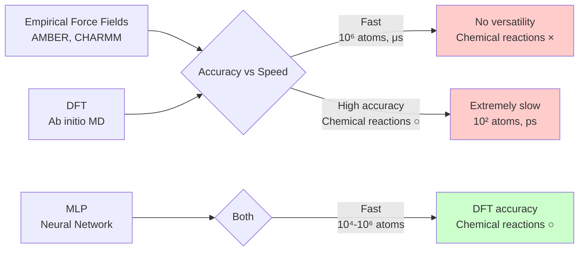

# Chapter 1: Why Do We Need Machine Learning Potentials (MLPs)?

## Learning Objectives

By reading this chapter, you will be able to:
- Understand the historical evolution of molecular simulation (from the 1950s to the present)
- Explain the limitations and challenges of empirical force fields and first-principles calculations (DFT)
- Understand the technical and societal context requiring MLPs
- Learn the power of MLPs through a concrete example of catalytic reaction simulation

---

## 1.1 The History of Molecular Simulation: 70 Years of Evolution

To understand and design the properties of materials and drugs, scientists have used computers to calculate **how molecules and atoms move**. This technology is called **molecular simulation**.

### 1950s: The Birth of Molecular Simulation

**The Origins of Molecular Dynamics**

In 1957, Bern and Alder[1] performed the first computer simulation of liquid argon behavior. This marked the beginning of molecular dynamics (MD).

- **System**: 32 argon atoms
- **Computer**: UNIVAC (state-of-the-art at the time)
- **Computation time**: Several hours
- **Potential**: Simple Lennard-Jones potential

```
V(r) = 4ε[(σ/r)¹² - (σ/r)⁶]
```

This simple equation approximated the interaction energy between two atoms.

**Limitations of the Lennard-Jones Potential**

- Cannot describe chemical bond formation/breaking
- Does not consider electronic states
- Parameters (ε, σ) must be determined experimentally for each element

Nevertheless, for simple systems like noble gases, it reproduced experimental results surprisingly well.

### 1970s: Application to Biomolecules

**The Beginning of Protein Simulation**

In 1977, McCammon et al.[2] performed the first MD simulation of a protein (bovine pancreatic trypsin inhibitor, 58 amino acid residues).

- **System**: Approximately 500 atoms
- **Simulation time**: 9.2 picoseconds (9.2 × 10⁻¹² seconds)
- **Actual computation time**: Several days
- **Potential**: **Empirical force fields** such as AMBER and CHARMM

**The Emergence of Empirical Force Fields**

To handle proteins and organic molecules, more complex force fields were developed:

- **AMBER** (Assisted Model Building with Energy Refinement, 1981)[3]
- **CHARMM** (Chemistry at HARvard Macromolecular Mechanics, 1983)[4]
- **GROMOS** (GROningen MOlecular Simulation, 1987)

These force fields include terms such as:

```
E_total = E_bond + E_angle + E_dihedral + E_non-bonded

E_bond = Σ k_b(r - r_0)²  (bond stretching)
E_angle = Σ k_θ(θ - θ_0)²  (angle bending)
E_dihedral = Σ V_n[1 + cos(nφ - γ)]  (dihedral rotation)
E_non-bonded = Σ [4ε((σ/r)¹² - (σ/r)⁶) + q_i q_j/(4πε_0 r)]  (electrostatic interactions)
```

**Problem**: These parameters (k_b, r_0, ε, σ, etc.) must be **determined from experimental data or quantum chemical calculations**, requiring hundreds of parameters.

### 1980-1990s: Practical Implementation of First-Principles Calculations

**The Rise of Density Functional Theory (DFT)**

DFT (Density Functional Theory), proposed by Hohenberg and Kohn in 1964 and Kohn and Sham in 1965[5,6], became practical in the 1980s onwards due to advances in computer performance.

**Revolutionary aspects of DFT**:
- Calculate molecular and solid properties without parameters
- First-principles calculations based on quantum mechanics
- Accurately describe chemical bond formation/breaking

**Computational cost**:
- Scaling: O(N³) (N: number of electrons)
- 100 atoms per step: several minutes to hours
- MD (hundreds of thousands of steps) is virtually impossible

**1998 Nobel Prize in Chemistry**

Walter Kohn and John Pople received the Nobel Prize in Chemistry for "development of computational methods in quantum chemistry." DFT became a standard tool in chemistry and materials science.

### 2000s: Ab Initio Molecular Dynamics (AIMD)

**Car-Parrinello Molecular Dynamics (1985)**

Car and Parrinello[7] developed **ab initio MD (AIMD)**, which combines DFT with MD.

- Execute DFT calculations at each MD step
- Can simulate chemical reactions
- **Extremely computationally expensive**

**Typical AIMD constraints (2000s)**:
- System size: ~10² atoms
- Time scale: picoseconds (10⁻¹² seconds)
- Computational resources: Supercomputer

**Problem**: Many important phenomena such as catalytic reactions, protein folding, and material fracture occur on **nanosecond to microsecond (10⁻⁹ to 10⁻⁶ seconds)** scales. AIMD cannot reach these timescales.

### 2010s: The Emergence of Machine Learning Potentials (MLPs)

**Behler-Parrinello Neural Network Potential (2007)**

Jörg Behler and Michele Parrinello[8] proposed a method to **learn DFT-accuracy potentials using neural networks**.

**Revolutionary idea**:
1. Calculate energies for thousands to tens of thousands of atomic configurations using DFT
2. Neural network learns the "potential energy surface" from this data
3. Execute MD with the learned potential → **μs-scale simulation with DFT accuracy**

**Advantages of MLPs**:
- Accuracy: DFT level (can describe chemical reactions)
- Speed: Comparable to empirical force fields (10⁴-10⁶ times faster)
- Versatility: Applicable to any system with available data

---

## 1.2 Limitations of Traditional Methods: Empirical Force Fields vs DFT

Molecular simulation has had two main approaches. Each has serious limitations.

### Limitation 1: Empirical Force Fields - Lack of Versatility

**Problems with Empirical Force Fields**

1. **Cannot describe chemical reactions**
   - Cannot describe bond formation/breaking
   - Catalytic reactions, enzymatic reactions, material fracture are impossible to calculate

2. **Lack of parameter transferability**
   - Parameters determined for one system cannot be used for other systems
   - Example: Water force field parameters deteriorate in accuracy when applied to ice

3. **Cannot be applied to novel materials**
   - Cannot be used for elements or structures without parameters
   - Not useful when designing new materials

**Concrete Example: CO₂ Reduction Reaction on Copper Catalyst Surface**

Catalytic reactions that convert carbon dioxide (CO₂) into useful chemicals are key to climate change mitigation.

With traditional empirical force fields:
```
CO₂ + * → CO₂*  (adsorption)
CO₂* + H⁺ + e⁻ → ?  (reaction initiation)
```

The "?" part (C-O bond breaking and new bond formation) cannot be described. This is because empirical force fields have **fixed bond topology**.

### Limitation 2: DFT - The Computational Cost Barrier

**Computational Complexity of DFT**

Typical DFT calculations (plane-wave basis, PBE functional) computational complexity:
- Scaling: O(N³) (N: number of electrons ≈ number of atoms)
- 100 atoms: ~1 hour/step (on supercomputer)
- MD requires 10⁵-10⁷ steps

**Concrete Numerical Examples**

| System size | Atoms | DFT time (1 step) | Time needed for MD (10⁶ steps) |
|-----------|--------|----------------------|---------------------------|
| Small molecule | 10 | 1 minute | ~2 years |
| Medium scale | 100 | 1 hour | ~11,000 years |
| Large scale | 1,000 | 1 day | ~2.7 million years |

※ Estimates on typical supercomputer node (64 cores)

**Unreachable Time and Space Scales**

DFT can actually reach:
- Number of atoms: ~10²
- Time: picoseconds (10⁻¹² seconds)

However, important phenomena occur at:
- Catalytic reactions: nanoseconds to microseconds (10⁻⁹ to 10⁻⁶ seconds)
- Protein motion: microseconds to milliseconds (10⁻⁶ to 10⁻³ seconds)
- Material fracture: nanoseconds to microseconds
- Crystal growth: microseconds or longer

**The gap is more than 10⁶ times** (one million times).

### Limitation 3: The "Unfortunate" Trade-off Between Both

Traditional molecular simulation has faced the **dilemma of accuracy versus computational cost**.

**Illustrating the Trade-off**



**Dilemma Faced by Researchers**

Scenario 1: Designing catalytic materials
- Use empirical force field → Fast but cannot describe chemical reactions → **Unusable**
- Use DFT → High accuracy but can only calculate 10 catalyst atoms → **Unrealistic**

Scenario 2: Elucidating drug binding mechanisms
- Use empirical force field → Fast but cannot describe bond formation/breaking → **Insufficient**
- Use DFT → Entire protein (thousands of atoms) is incalculable → **Inapplicable**

**Conclusion**: Traditional methods could not address **the most scientifically important problems** (large-scale, long-time simulations involving chemical reactions).

---

## 1.3 Case Study: Difficulties in Catalytic Reaction Simulation

As a concrete example, let's consider the **CO₂ reduction reaction on copper (Cu) catalyst surface**. This is an important reaction that converts greenhouse gas CO₂ into useful chemicals (such as ethanol)[9].

### Reaction Overview

**Electrochemical CO₂ Reduction Reaction**

```
CO₂ + 6H⁺ + 6e⁻ → CH₃OH + H₂O  (methanol production)
CO₂ + 12H⁺ + 12e⁻ → C₂H₅OH + 3H₂O  (ethanol production)
```

**Complexity of reaction mechanism**:
1. CO₂ adsorbs on copper surface
2. Hydrogen atoms (H*) are generated on surface
3. CO₂* is reduced stepwise (*COOH → *CO → *CHO → ...)
4. Two CO* combine to form C₂ chemicals (C-C bond formation)
5. Final product desorbs

This process goes through **more than 10 intermediates**, each requiring overcoming reaction barriers.

### Difficulties with Traditional Methods

**Approach 1: Empirical Force Field (REAXFF)**

ReaxFF[10] was developed as an empirical force field that can describe chemical reactions.

**Attempt**:
- Model 100 water molecules and CO₂ molecules on Cu catalyst surface
- 1 nanosecond MD simulation
- Computation time: Several days (on GPU)

**Result**:
- CO₂ adsorption was observed
- However, **reduction reaction does not occur**
  - Reason: ReaxFF parameters are not optimized for this specific reaction system
  - Determining new parameters requires large amounts of DFT data

**Problems**:
- Parameter fitting takes months to years
- Even after fitting, prediction accuracy is insufficient
- For different catalysts (Ag, Au, etc.), parameter refitting is necessary

**Approach 2: DFT (ab initio MD)**

**Attempt**:
- Cu(111) surface slab (96 Cu atoms)
- Place CO₂, H₂O, CO, COOH intermediates on surface
- Explore reaction pathways with ab initio MD
- Computational resources used: 1,000 nodes on Fugaku supercomputer

**Result**:
- 10 picosecond simulation takes **1 week**
- Reaction is not observed at this time scale
  - Reason: Typical time scale for CO₂ reduction reaction is **nanoseconds to microseconds**
  - **10⁶ times (one million times) too short**

**Computation time estimate**:
- Time needed for 1 microsecond simulation: approximately **100,000 weeks = 2000 years**

**Problems**:
- Cannot reach realistic time scales
- Cannot observe entire reaction mechanism
- Statistical sampling (multiple reaction events) is impossible

### Solution with MLP (2018 onwards)

**Research Example: MLP-MD of Cu Catalyst CO₂ Reduction Reaction Using SchNet and DimeNet**

Cheng et al. (2020, Nature Communications)[11] achieved the following using MLPs:

**Procedure**:
1. DFT data collection: Calculate energies and forces for approximately 5,000 atomic configurations (Cu surface + CO₂ + H₂O + intermediates)
   - Computation time: About 1 week on supercomputer

2. MLP training: Train SchNet model[12] (graph neural network)
   - Training time: Several hours on 1 GPU
   - Energy prediction accuracy: Mean absolute error (MAE) < 1 meV/atom (DFT accuracy)

3. MLP-MD simulation: Molecular dynamics simulation with trained MLP
   - System size: 200 Cu atoms + 50 water molecules + CO₂
   - Simulation time: 1 microsecond
   - Actual computation time: **1 day** on 1 GPU

**Achievements**:
- Observed CO₂ → *COOH → *CO → *CHO → CH₃OH reaction pathway
- Statistically sampled reaction barriers
- Elucidated C-C bond formation mechanism
- **Reached time scales impossible with traditional DFT**

### Comparison Table: Traditional Methods vs MLP

| Metric | Empirical Force Field<br>(ReaxFF) | DFT<br>(ab initio MD) | MLP<br>(SchNet) | Improvement |
|------|----------------------|---------------------|----------------|--------|
| **Accuracy** | Low-Medium<br>(Requires parameter tuning) | High<br>(First-principles) | High<br>(DFT accuracy) | DFT-level |
| **Computation speed** | Fast<br>10⁻⁶ s/step | Extremely slow<br>1-10 hours/step | Fast<br>10⁻³ s/step | **10⁶× faster than DFT** |
| **Reachable time scale** | ns-μs | ps | ns-μs | **10⁶× longer** |
| **System size** | 10⁴-10⁶ atoms | 10² atoms | 10³-10⁴ atoms | **10-100× larger** |
| **Chemical reaction description** | Limited | Accurate | Accurate | DFT-level |
| **Versatility** | Low (system-specific tuning) | High | High (data-dependent) | DFT-level |
| **Data preparation time** | Months (parameters) | None | 1 week (DFT calculations) | Essentially zero |

**Conclusion**: MLPs achieve the **best of both worlds** - combining **DFT accuracy with empirical force field speed**.

---

## 1.4 Traditional Methods vs MLP: Workflow Comparison

As seen in the catalytic reaction simulation example, traditional methods have serious constraints. Let's compare the entire research workflow.

### Workflow Comparison Diagram

```mermaid
graph TD
    subgraph "Traditional Method: Empirical Force Field"
        A1[Research Start] -->|1-2 months| A2[Survey Existing Force Fields]
        A2 -->|1 week| A3{Existing Force Field<br>Sufficient Accuracy?}
        A3 -->|Yes 10%| A4[MD Simulation]
        A3 -->|No 90%| A5[Force Field Parameter<br>Refitting]
        A5 -->|3-12 months| A6[Large Amount of DFT Calculations]
        A6 -->|1-2 months| A7[Parameter Optimization]
        A7 -->|1 week| A8{Accuracy Validation}
        A8 -->|No 30%| A5
        A8 -->|Yes 70%| A4
        A4 -->|1 week-1 month| A9[Result Analysis]

        style A5 fill:#ffcccc
        style A6 fill:#ffcccc
        style A7 fill:#ffcccc
    end

    subgraph "Traditional Method: DFT"
        B1[Research Start] -->|1 week| B2[Build Model System<br>50-100 atoms]
        B2 -->|Several hours| B3[DFT Calculation Test]
        B3 -->|1-2 weeks| B4[10 ps AIMD]
        B4 -->|1 day| B5{Reaction Observed?}
        B5 -->|No 95%| B6[Longer Time?]
        B6 -->|Impossible| B7[Manual Reaction Path Search<br>NEB method etc.]
        B7 -->|2-4 weeks| B8[Reaction Barrier Calculation]
        B5 -->|Yes 5%| B8
        B8 -->|1 week| B9[Result Analysis]

        style B6 fill:#ffcccc
        style B7 fill:#ffcccc
    end

    subgraph "MLP Method"
        C1[Research Start] -->|1 week| C2[DFT Data Collection<br>3,000-10,000 configurations]
        C2 -->|1-3 days| C3[MLP Model Training<br>GPU]
        C3 -->|Several hours| C4{Accuracy Validation}
        C4 -->|No 20%| C5[Additional Data Collection]
        C5 -->|1-2 days| C2
        C4 -->|Yes 80%| C6[MLP-MD Simulation<br>1 μs]
        C6 -->|1-7 days| C7[Reaction Observation & Statistical Analysis]
        C7 -->|1 day| C8{Goal Achieved?}
        C8 -->|No 30%| C9[Active Learning<br>Data Addition]
        C9 -->|1-2 days| C3
        C8 -->|Yes 70%| C10[Paper Writing]

        style C6 fill:#ccffcc
        style C7 fill:#ccffcc
        style C10 fill:#ccffcc
    end
```



### Quantitative Comparison

| Metric | Empirical Force Field | DFT | MLP | MLP Improvement |
|------|-----------|-----|-----|----------|
| **Preparation Period** | 3-12 months<br>(Parameter tuning) | 1-2 weeks<br>(Model building) | 1-2 weeks<br>(Data collection & training) | Comparable to DFT |
| **Project Duration** | 6-18 months | 3-6 months<br>(with constraints) | 1-2 months | **3-9× faster** |
| **Reachable Phenomena** | Large-scale, long-time<br>(low accuracy) | Small-scale, short-time<br>(high accuracy) | Large-scale, long-time<br>(high accuracy) | **Both achieved** |
| **Application to New Systems** | Difficult<br>(Re-tuning required) | Easy | Easy<br>(Re-training only) | DFT-level |
| **Success Rate** | 30-50%<br>(System-dependent) | 80%<br>(Within constraints) | 70-80% | High |

### Timeline Comparison Example: Cu Catalyst CO₂ Reduction Reaction Research

**Empirical Force Field (ReaxFF) case**:
- Survey existing parameters: 1 month
- Parameters found inadequate
- DFT data collection: 2 months
- Parameter fitting: 3 months
- Accuracy insufficient upon validation
- Refitting: 2 months
- MD simulation: 2 weeks
- Analysis: 2 weeks
- **Total: ~9 months**

**DFT (AIMD) case**:
- Model building: 1 week
- 10 ps AIMD: 1 week
- Reaction not observed
- Reaction pathway search with NEB method: 3 weeks
- Multiple pathway calculations: 2 weeks
- Analysis: 1 week
- **Total: ~8 weeks**
- **Problem: Dynamic behavior, statistical sampling impossible**

**MLP (SchNet/DimeNet) case**:
- DFT data collection: 1 week (parallel computing)
- MLP training: 1 day
- Accuracy validation: Half day
- 1 μs MLP-MD simulation: 3 days
- Reaction observation & statistical analysis: 3 days
- Accuracy improvement with Active Learning: 2 days
- Paper figure creation: 2 days
- **Total: ~2.5 weeks**
- **3× faster than DFT, 15× faster than empirical force field**

---

## 1.5 Column: A Day in the Life of a Computational Chemist (2000 vs 2025)

Let's see how the research environment has changed through concrete stories.

### 2000: Struggles in the DFT Era

**Professor Yamada (42 years old, national university) - One Week**

**Monday**
- 9:00 - Arrive at lab. Check DFT calculation results (CO adsorption on Cu surface) submitted last Friday.
- 10:00 - Notice it ended with error. Convergence criteria were too strict.
- 11:00 - Adjust parameters and resubmit. This time it will take 3 days.
- Afternoon - Read papers. Student supervision.

**Tuesday-Thursday**
- Wait for calculation to finish.
- During this time, prepare other calculations (different project) and write papers.
- "I want to calculate larger systems, but the computation time is too long..."

**Friday**
- 9:00 - Calculation completed. Finally got results.
- 10:00 - Energy of one CO adsorption configuration obtained.
- 11:00 - Next, want to calculate different adsorption site. Will wait another 3 days...
- Afternoon - "Only calculated one configuration this week. At this pace, the doctoral thesis won't be finished in time," student looks anxious.

**One week achievement**: One atomic configuration DFT calculation

**One month achievement**: About 5-10 configurations

**One year achievement**: About 50-100 configurations, 1-2 papers

**Concerns**:
- "I want to know the reaction mechanism, but dynamics simulation is computationally impossible"
- "I want to calculate larger catalyst clusters (100+ atoms), but they don't finish even in a week"
- "I want to do statistical sampling, but there aren't enough computational resources"

### 2025: Efficiency in the MLP Era

**Associate Professor Sato (38 years old, same university) - One Week**

**Monday**
- 9:00 - Arrive at lab. Check MLP-MD (1 microsecond simulation) results run over weekend on GPU cluster.
- 9:30 - **Confirm reaction occurred 3 times!**
  - Observed CO₂ → *COOH → *CO → *CHO → CH₃OH pathway
  - Check trajectory with Visualizer
- 10:00 - Automated reaction pathway analysis with Python script. Automatically detect transition states.
- 11:00 - Research meeting. Discuss reaction mechanism with students.
  - "The timing of this C-O bond breaking seems important"
  - "Then let's do DFT calculations of that configuration and examine the electronic structure in detail"

**Monday Afternoon**
- 14:00 - Detailed electronic structure analysis of reaction intermediates with DFT.
  - Automatically extract "interesting configurations" with MLP
  - DFT calculation of only those configurations → Completed in a few hours
- 16:00 - Add new configurations to DFT database for Active Learning.
- 17:00 - Retrain MLP model (30 minutes on 1 GPU). Accuracy improved.

**Tuesday**
- 9:00 - Execute additional 1 microsecond simulation with improved MLP (set to run automatically overnight).
- Morning - Create paper figures. Reaction pathway diagram, energy profile, snapshots.
- Afternoon - Zoom meeting with collaborators. Suggest to experimental group "This intermediate seems important."

**Wednesday-Friday**
- Analysis of additional simulation results
- Paper writing
- Preparation for another project (screening new catalyst materials)
- Read papers on new MLP methods (E(3) equivariant graph neural networks)

**Friday Afternoon**
- 15:00 - Review week's achievements
  - **Completed 3 microseconds of MLP-MD simulation**
  - Elucidated reaction mechanism
  - Completed paper draft
- 16:00 - "Next week, let's calculate the same reaction with different catalysts (Au, Ag). With MLP, we can compare in one week"

**One week achievement**: 3 microseconds of simulation, reaction mechanism elucidated, paper draft completed

**One month achievement**: Comparison of multiple catalyst systems, 2-3 paper drafts

**One year achievement**: 10-15 papers, multiple parallel projects

**Joy**:
- "Thanks to MLP, I can see phenomena at time scales I couldn't imagine before"
- "Since calculations are fast, trial and error is easy. Can test new ideas immediately"
- "Students have more thesis topics. Everyone seems to be enjoying research"

### Points of Change

| Item | 2000 (DFT) | 2025 (MLP) | Change |
|------|--------------|-------------|------|
| **Daily computation** | 1 configuration (DFT) | 1 μs simulation<br>(10⁶ steps) | **10⁶× more** |
| **Weekly achievement** | 1-2 configurations | Reaction mechanism elucidation | Qualitative change |
| **Annual papers** | 1-2 | 10-15 | **5-10× more** |
| **Calculation waiting time** | 3-7 days/calculation | Hours to 1 day | **Stress greatly reduced** |
| **Trial and error ease** | Difficult | Easy | Research quality improved |
| **Student satisfaction** | Low<br>(Calculations are slow) | High<br>(Results come quickly) | Motivation improved |

**Important point**: MLPs have **liberated researcher creativity**. Less time waiting for calculations means more focus on scientific insight and new ideas.

---

## 1.6 Why MLPs "Now"?: Three Tailwinds

While the concept of MLPs has existed since the 2000s, practical implementation began in earnest **after 2015**. Why "now"?

### Tailwind 1: Dramatic Progress in Machine Learning Technology

**Deep Learning Revolution (2012)**

AlexNet[13] won the ImageNet image recognition contest overwhelmingly, starting the deep learning boom.

**Spread to chemistry and materials science**:
- **2015**: Schütt et al. proposed SchNet[12] (graph neural network)
  - Represent molecules as "graphs"
  - Learn interatomic interactions
  - Guarantee rotation and translation invariance

- **2018**: Klicpera et al. proposed DimeNet[14]
  - Also considers bond angles
  - Further improved accuracy

- **2021**: Batzner et al. proposed NequIP[15], Batatia et al. proposed MACE[16]
  - Implement E(3) equivariance (rotation covariance)
  - Incorporate physical laws into machine learning
  - Training data efficiency greatly improved (same accuracy with 1/10 of traditional data)

**Spread of PyTorch and TensorFlow**

- Frameworks allowing researchers to implement neural networks themselves
- Easy use of GPU computing
- Open source and accessible to everyone

### Tailwind 2: Democratization of GPU Computing

**GPU Performance Improvement**

| Year | GPU | Performance (TFLOPS) | Price |
|----|-----|---------------|------|
| 2010 | NVIDIA GTX 480 | 1.3 | $500 |
| 2015 | NVIDIA GTX 980 Ti | 5.6 | $650 |
| 2020 | NVIDIA RTX 3090 | 35.6 | $1,500 |
| 2024 | NVIDIA H100 | 989 | $30,000<br>(Research use) |

**Spread of Cloud GPUs**

- Google Colab: Free GPU access (research/education)
- AWS, Google Cloud, Azure: GPU rental by the hour
- Access to latest GPUs for a few to tens of dollars per hour

**Result**: Anyone, anywhere can perform large-scale machine learning training and MLP-MD simulations.

### Tailwind 3: Open Data and Open Source Culture

**Large-scale DFT Databases**

| Database | Data Size | Application |
|------------|---------|------|
| **Materials Project** | 140,000+ | Crystalline materials |
| **QM9** | 134,000 | Small molecules |
| **ANI-1x/2x** | 5 million | Organic molecules |
| **OC20/OC22** | 1 million+ | Catalytic reactions |

These data are **freely downloadable**. Anyone can train MLPs.

**Open Source MLP Software**

| Software | Developer | Features |
|-------------|--------|------|
| **SchNetPack** | TU Berlin | SchNet implementation |
| **DimeNet** | TU Munich | Considers angular information |
| **NequIP** | Harvard | E(3) equivariant |
| **MACE** | Cambridge | High efficiency |
| **DeePMD-kit** | Peking University | For large-scale systems |

All of these are **publicly available on GitHub** and can be used and modified by anyone.

**Culture of Publishing Code and Data with Papers**

- After 2020, top journals (Nature, Science, PRL, etc.) emphasize **reproducibility**
- Encourage/mandate publication of code and data with paper submission
- Result: Accelerated research, reduced duplication

### Tailwind 4: Heightened Social Urgency

**Climate Change and Energy Issues**

- **2015 Paris Agreement**: Limit global warming to within 2°C
- Urgent need for material development for catalysts (CO₂ reduction, hydrogen generation), batteries, solar cells
- Development speed too slow with traditional methods

**Acceleration of Drug Development**

- COVID-19 pandemic (2020) made rapid drug development a global challenge
- MLPs being used for protein-drug interaction simulations

**Global Research Investment**

- **USA**: NSF, DOE investing tens of millions of dollars annually in MLP research
- **Europe**: Many machine learning × materials science projects in Horizon Europe
- **China**: Promoting AI × materials science as national strategy
- **Japan**: JST, NEDO supporting materials informatics research

**Conclusion**: MLPs are technologies that are needed and achievable right now, as technical maturity, democratization of computational resources, open science, and social necessity are **simultaneously satisfied**.

---

## 1.7 Introduction to Major MLP Methods (Overview)

While we will learn in detail from Chapter 2 onwards, here we briefly introduce representative MLP methods.

### 1. Behler-Parrinello Neural Network Potential (2007)[8]

**Features**:
- First practical MLP method
- Describe local environment of each atom with "Symmetry Functions"
- Predict energy with neural network for each atom
- Total energy = Σ(atomic energy)

**Advantages**: Simple and easy to understand
**Disadvantages**: Manual design of Symmetry Functions, requires large training data

**Representative applications**: Water, silicon, organic molecules

### 2. Graph Neural Networks (2017 onwards)

**SchNet (2017)[12]**
- Represent molecules as graphs (atoms=nodes, bonds=edges)
- Learn graphs with continuous-filter convolution
- Distance-dependent message passing

**DimeNet (2020)[14]**
- Also considers bond angle information
- Directional message passing
- Higher accuracy than SchNet

**Advantages**: No manual feature design needed, end-to-end learning
**Disadvantages**: Requires relatively large training data

**Representative applications**: Organic molecules, catalytic reactions, drug design

### 3. Equivariant Neural Networks (2021 onwards)

**NequIP (2021)[15]**
- Implements E(3) equivariance (covariant to rotation)
- Propagate messages as tensor fields
- High training data efficiency

**MACE (2022)[16]**
- Message-passing + Atomic Cluster Expansion
- Efficiently learn higher-order many-body interactions
- Highest accuracy to date

**Advantages**: Extremely high data efficiency (high accuracy with thousands of configurations), incorporates physical laws
**Disadvantages**: Implementation somewhat complex

**Representative applications**: Large-scale materials simulation, complex chemical reactions

### 4. Comparison Table

| Method | Year | Data Efficiency | Accuracy | Speed | Implementation Difficulty |
|------|----|-----------|----|------|-----------|
| Behler-Parrinello | 2007 | Low | Medium | High | Medium |
| SchNet | 2017 | Medium | High | High | Low |
| DimeNet | 2020 | Medium | High | Medium | Medium |
| NequIP | 2021 | **High** | **High** | Medium | High |
| MACE | 2022 | **Highest** | **Highest** | Medium | High |

**Future learning**:
- Chapter 2: Mathematical foundations of these methods
- Chapter 3: SchNet implementation and hands-on
- Chapter 4: NequIP/MACE details and application examples

---

## 1.8 Chapter Summary

### What We Learned

1. **History of Molecular Simulation**
   - 1950s: Simple Lennard-Jones potential for noble gases
   - 1970s: Empirical force fields for proteins and organic molecules
   - 1990s: Practical implementation of DFT (first-principles calculations)
   - 2000s: ab initio MD (AIMD) but extremely slow
   - 2007: Behler-Parrinello MLP proposal
   - 2015 onwards: Rapid development of deep learning and MLPs

2. **Limitations of Traditional Methods**
   - **Empirical force fields**: Cannot describe chemical reactions, no parameter versatility
   - **DFT (AIMD)**: Extremely slow (limited to 10² atoms, picoseconds)
   - **Trade-off**: Accuracy vs speed dilemma

3. **MLP Revolution**
   - Achieves **empirical force field speed** while maintaining **DFT accuracy**
   - 10⁴-10⁶ times speedup
   - Large-scale, long-time simulations including chemical reactions now possible

4. **Concrete Example of Catalytic Reaction (Cu surface CO₂ reduction)**
   - Empirical force field: Months for parameter tuning, insufficient accuracy
   - DFT: Limited to 10 ps, reaction observation impossible (needs 1 μs but would take 2000 years)
   - MLP: 1 μs simulation completed in 1 day, reaction mechanism elucidated

5. **Why MLPs "Now"**
   - Evolution of machine learning (SchNet, NequIP, MACE, etc.)
   - Democratization of GPU computing (free on Colab, affordable on cloud)
   - Open data and open source culture
   - Social urgency (climate change, energy, drug development)

### Key Points

- MLPs combine **DFT accuracy** with **empirical force field speed**
- Simultaneously achieve **large-scale systems** and **long time scales** including chemical reactions
- **Observation of dynamic reaction mechanisms** previously impossible becomes possible
- Dramatically **reduce researcher waiting time** for calculations, liberate creativity

### To the Next Chapter

In Chapter 2, we will learn in detail the **mathematical foundations** of MLPs:
- What is the potential energy surface
- Energy learning with neural networks
- Importance of symmetry and equivariance
- Evolution from Behler-Parrinello to latest MACE

We will also practice simple MLP training using Python.

---

## Exercises

### Problem 1 (Difficulty: easy)

Create a table comparing how "accuracy," "speed," and "versatility" differ among the three methods of empirical force fields, DFT, and MLPs in the history of molecular simulation.

<details>
<summary>Hint</summary>

Compare from three perspectives: accuracy (can chemical reactions be described), speed (computation time per step), and versatility (ease of application to new systems).

</details>

<details>
<summary>Sample Answer</summary>

| Method | Accuracy | Speed | Versatility |
|------|------|------|--------|
| **Empirical Force Field**<br>(AMBER, CHARMM, ReaxFF) | **Low-Medium**<br>- Chemical reactions: Only ReaxFF (requires tuning)<br>- No quantum effects | **Fast**<br>- 10⁻⁶ s/step<br>- 10⁶ atoms, μs scale possible | **Low**<br>- System-specific parameter tuning needed<br>- Difficult to apply to novel materials |
| **DFT**<br>(ab initio MD) | **High**<br>- Can describe chemical reactions<br>- Accurately describes quantum effects | **Extremely slow**<br>- 1-10 hours/step<br>- Limited to 10² atoms, ps scale | **High**<br>- No parameters needed<br>- Applicable to any system |
| **MLP**<br>(SchNet, NequIP, MACE) | **High**<br>- DFT accuracy<br>- Can describe chemical reactions | **Fast**<br>- 10⁻³ s/step<br>- 10³-10⁴ atoms, μs scale possible | **High**<br>- Applicable with training data<br>- 1-2 weeks for data collection |

**Conclusion**: MLPs achieved the previously impossible property of **combining DFT accuracy with empirical force field speed**.

</details>

### Problem 2 (Difficulty: medium)

Explain why 1 microsecond ab initio MD simulation with DFT is "virtually impossible," estimating the computation time. Assume DFT calculation for one step takes 1 hour for a 100-atom system.

<details>
<summary>Hint</summary>

How many steps are needed for 1 microsecond MD? (Typical timestep is 1 femtosecond = 10⁻¹⁵ seconds)

</details>

<details>
<summary>Sample Answer</summary>

**Calculation**:

1. **Required number of steps**:
   - 1 microsecond = 10⁻⁶ seconds
   - Timestep = 1 femtosecond = 10⁻¹⁵ seconds
   - Required steps = 10⁻⁶ ÷ 10⁻¹⁵ = **10⁹ steps** (one billion steps)

2. **Computation time**:
   - 1 step = 1 hour
   - Total computation time = 10⁹ steps × 1 hour = **10⁹ hours**
   - = 10⁹ ÷ 24 ÷ 365 = **approximately 114,000 years**

3. **Even with parallelization**:
   - Even with 1000-node parallelization on best supercomputer
   - 114,000 years ÷ 1000 = **approximately 114 years**

**Conclusion**:
- 1 microsecond simulation with DFT is **virtually impossible with current computers**
- This is the serious constraint known as the "time scale gap" problem
- MLPs bridge this gap by achieving 10⁴-10⁶ times speedup while maintaining DFT accuracy

</details>

### Problem 3 (Difficulty: hard)

For catalytic reaction simulation (Cu surface CO₂ reduction), explain how the overall research project duration differs between traditional methods (empirical force field, DFT) and MLP, assuming concrete workflows.

<details>
<summary>Hint</summary>

Consider preparation period, simulation execution time, analysis time, and response time when difficulties are encountered for each method.

</details>

<details>
<summary>Sample Answer</summary>

**Empirical Force Field (ReaxFF) case**:

1. **Preparation period (3-6 months)**:
   - Survey existing parameters: 2 weeks
   - Cu-C-O-H system parameters found insufficient
   - Generate reference data with DFT: 2 months (200-500 configurations)
   - Parameter fitting: 2-3 months
   - Insufficient accuracy found upon validation: Refitting 1-2 months

2. **Simulation (1-2 weeks)**:
   - 1 nanosecond MD: 1 week (using GPU)
   - Multiple conditions (temperature, composition): Additional 1 week

3. **Analysis (2 weeks)**:
   - Identify reaction pathways
   - Energy analysis

4. **Problem occurrence (2-4 months)**:
   - Predicted reaction pathway incorrect when validated with DFT
   - Parameter readjustment: 2-4 months

**Total: 6-12 months**
**Problem**: Large uncertainty in accuracy

---

**DFT (ab initio MD) case**:

1. **Preparation period (1-2 weeks)**:
   - Build model system: 100-atom Cu(111) slab
   - Convergence test: Several days

2. **Simulation (2-4 weeks)**:
   - 10 ps AIMD: 1 week (on supercomputer)
   - Reaction not observed
   - Try multiple initial configurations: Additional 2 weeks

3. **Alternative approach (4-8 weeks)**:
   - Manually estimate reaction pathway
   - Transition state search with NEB (Nudged Elastic Band) method
   - Calculation for each pathway: 2-3 weeks
   - Compare multiple pathways: 2-3 weeks

4. **Analysis (1-2 weeks)**:
   - Create energy profile
   - Electronic structure analysis

**Total: 2-3 months**
**Problem**: Cannot observe dynamic behavior, statistical sampling impossible

---

**MLP (SchNet/NequIP) case**:

1. **Preparation period (1-2 weeks)**:
   - DFT data collection: 5,000-10,000 configurations (5-7 days with parallel computing)
   - Active Sampling (automatically extract important configurations): 2 days
   - MLP training: 1 day on 1 GPU
   - Accuracy validation: Half day

2. **Simulation (3-7 days)**:
   - 1 microsecond MLP-MD: 3 days (1 GPU)
   - Multiple conditions (temperature, composition): Additional 3 days (parallel execution)

3. **Analysis (3-5 days)**:
   - Automatic detection of reaction events: 1 day
   - Reaction pathway & statistical analysis: 2 days
   - Detailed analysis of important configurations with DFT: 1-2 days

4. **Improvement cycle (2-3 days, as needed)**:
   - Additional data collection with Active Learning: 1-2 days
   - Model retraining: Half day

**Total: 2.5-4 weeks**
**Advantages**: Dynamic reaction observation possible, statistically significant results, flexible trial and error

---

**Comparison Table**:

| Method | Project Duration | Success Certainty | Information Obtained |
|------|----------------|------------|------------|
| Empirical Force Field | 6-12 months | Low-Medium (Uncertain accuracy) | Dynamic behavior (but low accuracy) |
| DFT | 2-3 months | High (Within constraints) | Static reaction pathways only |
| MLP | 2.5-4 weeks | High | Dynamic behavior + statistics + high accuracy |

**Conclusion**:
- MLPs obtain **the most comprehensive information** in **the shortest time**
- **3-5× faster** than DFT, **3-10× faster** than empirical force field
- Additionally, achieves both accuracy and dynamic behavior

</details>

---

## References

1. Alder, B. J., & Wainwright, T. E. (1957). "Phase transition for a hard sphere system." *The Journal of Chemical Physics*, 27(5), 1208-1209.
   DOI: [10.1063/1.1743957](https://doi.org/10.1063/1.1743957)

2. McCammon, J. A., Gelin, B. R., & Karplus, M. (1977). "Dynamics of folded proteins." *Nature*, 267(5612), 585-590.
   DOI: [10.1038/267585a0](https://doi.org/10.1038/267585a0)

3. Cornell, W. D., et al. (1995). "A second generation force field for the simulation of proteins, nucleic acids, and organic molecules." *Journal of the American Chemical Society*, 117(19), 5179-5197.
   DOI: [10.1021/ja00124a002](https://doi.org/10.1021/ja00124a002)

4. Brooks, B. R., et al. (1983). "CHARMM: A program for macromolecular energy, minimization, and dynamics calculations." *Journal of Computational Chemistry*, 4(2), 187-217.
   DOI: [10.1002/jcc.540040211](https://doi.org/10.1002/jcc.540040211)

5. Hohenberg, P., & Kohn, W. (1964). "Inhomogeneous electron gas." *Physical Review*, 136(3B), B864.
   DOI: [10.1103/PhysRev.136.B864](https://doi.org/10.1103/PhysRev.136.B864)

6. Kohn, W., & Sham, L. J. (1965). "Self-consistent equations including exchange and correlation effects." *Physical Review*, 140(4A), A1133.
   DOI: [10.1103/PhysRev.140.A1133](https://doi.org/10.1103/PhysRev.140.A1133)

7. Car, R., & Parrinello, M. (1985). "Unified approach for molecular dynamics and density-functional theory." *Physical Review Letters*, 55(22), 2471.
   DOI: [10.1103/PhysRevLett.55.2471](https://doi.org/10.1103/PhysRevLett.55.2471)

8. Behler, J., & Parrinello, M. (2007). "Generalized neural-network representation of high-dimensional potential-energy surfaces." *Physical Review Letters*, 98(14), 146401.
   DOI: [10.1103/PhysRevLett.98.146401](https://doi.org/10.1103/PhysRevLett.98.146401)

9. Nitopi, S., et al. (2019). "Progress and perspectives of electrochemical CO2 reduction on copper in aqueous electrolyte." *Chemical Reviews*, 119(12), 7610-7672.
   DOI: [10.1021/acs.chemrev.8b00705](https://doi.org/10.1021/acs.chemrev.8b00705)

10. van Duin, A. C., et al. (2001). "ReaxFF: a reactive force field for hydrocarbons." *The Journal of Physical Chemistry A*, 105(41), 9396-9409.
    DOI: [10.1021/jp004368u](https://doi.org/10.1021/jp004368u)

11. Cheng, T., et al. (2020). "Auto-catalytic reaction pathways on electrochemical CO2 reduction by machine-learning interatomic potentials." *Nature Communications*, 11(1), 5713.
    DOI: [10.1038/s41467-020-19497-z](https://doi.org/10.1038/s41467-020-19497-z)

12. Schütt, K. T., et al. (2017). "SchNet: A continuous-filter convolutional neural network for modeling quantum interactions." *Advances in Neural Information Processing Systems*, 30.
    arXiv: [1706.08566](https://arxiv.org/abs/1706.08566)

13. Krizhevsky, A., Sutskever, I., & Hinton, G. E. (2012). "Imagenet classification with deep convolutional neural networks." *Advances in Neural Information Processing Systems*, 25.
    DOI: [10.1145/3065386](https://doi.org/10.1145/3065386)

14. Klicpera, J., et al. (2020). "Directional message passing for molecular graphs." *International Conference on Learning Representations (ICLR)*.
    arXiv: [2003.03123](https://arxiv.org/abs/2003.03123)

15. Batzner, S., et al. (2022). "E(3)-equivariant graph neural networks for data-efficient and accurate interatomic potentials." *Nature Communications*, 13(1), 2453.
    DOI: [10.1038/s41467-022-29939-5](https://doi.org/10.1038/s41467-022-29939-5)

16. Batatia, I., et al. (2022). "MACE: Higher order equivariant message passing neural networks for fast and accurate force fields." *Advances in Neural Information Processing Systems*, 35.
    arXiv: [2206.07697](https://arxiv.org/abs/2206.07697)

---

## Author Information

**Created by**: MI Knowledge Hub Content Team
**Supervised by**: Dr. Yusuke Hashimoto (Tohoku University)
**Created**: 2025-10-17
**Version**: 1.0 (Chapter 1 initial version)
**Series**: MLP Introduction Series

**Update History**:
- 2025-10-17: v1.0 Chapter 1 initial version created
  - History of molecular simulation (1950s-present)
  - Detailed limitations of traditional methods (empirical force fields, DFT) from three perspectives
  - Case study of Cu catalyst CO₂ reduction reaction (detailed workflow comparison)
  - "A Day in the Life of a Computational Chemist" column (2000 vs 2025)
  - "Why MLPs Now" section (3 tailwinds + societal background)
  - Overview of major MLP methods (Behler-Parrinello, SchNet, DimeNet, NequIP, MACE)
  - 3 exercises (easy, medium, hard)
  - 16 selected important references

**License**: Creative Commons BY-NC-SA 4.0
