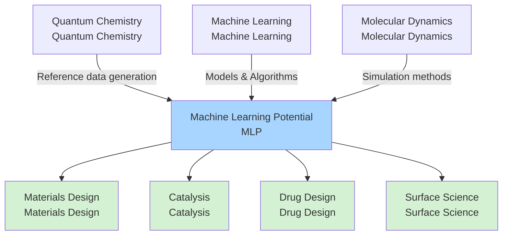
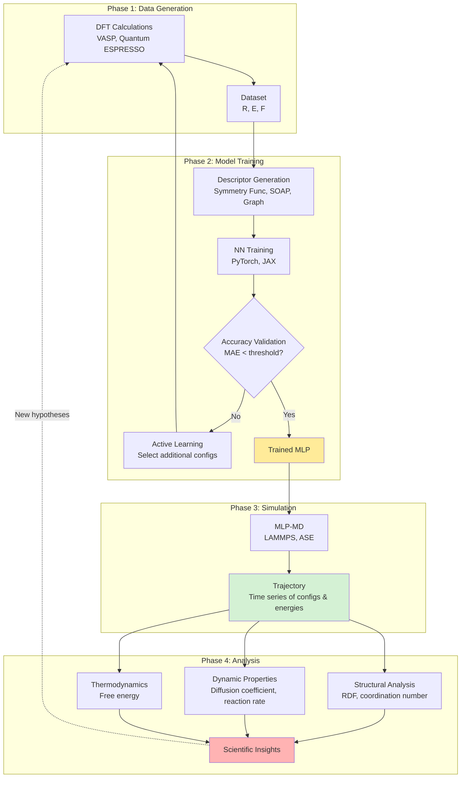
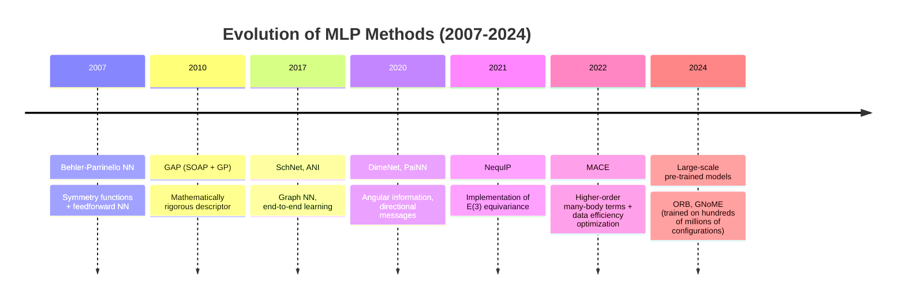
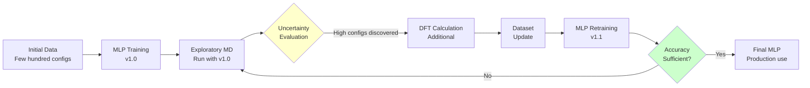

# Chapter 2: MLP Fundamentals - Concepts, Methods, and Ecosystem

## Learning Objectives

By reading this chapter, you will be able to:
- Understand the precise definition of MLP and its relationship to related fields (quantum chemistry, machine learning, molecular dynamics)
- Explain 15 specialized terms frequently encountered in MLP research
- Understand the 5-step MLP workflow (data collection, descriptor design, model training, validation, simulation)
- Compare characteristics and application scenarios of three types of descriptors (symmetry functions, SOAP, graph)

---

## 2.1 What is MLP: Precise Definition

In Chapter 1, we learned that MLP is an innovative technology that "combines DFT accuracy with the speed of empirical force fields." Here, we define it more precisely.

### Definition

**Machine Learning Potential (MLP)** is:

> A method that trains machine learning models using datasets of atomic configurations and their corresponding energies and forces obtained from quantum mechanical calculations (primarily DFT), to predict potential energy and forces for arbitrary atomic configurations with high speed and accuracy.

**Expressed mathematically**:

```
Training data: D = {(R₁, E₁, F₁), (R₂, E₂, F₂), ..., (Rₙ, Eₙ, Fₙ)}

R: Atomic configuration (3N-dimensional vector, N = number of atoms)
E: Energy (scalar)
F: Forces (3N-dimensional vector)

Objective: Learn function f_MLP
  E_pred = f_MLP(R)
  F_pred = -∇_R f_MLP(R)

Constraints:
  - |E_pred - E_DFT| < few meV (milli-electron volts)
  - |F_pred - F_DFT| < tens of meV/Å
  - Computation time: 10⁴-10⁶ times faster than DFT
```

### Three Essential Elements of MLP

**1. Data-Driven**
- Requires large amounts of data (thousands to tens of thousands of configurations) from DFT calculations
- Data quality and quantity determine model performance
- No need for "manual parameter tuning" as in conventional empirical force fields

**2. High-Dimensional Function Approximation**
- The Potential Energy Surface (PES) is ultra-high-dimensional
  - Example: 100-atom system → 300-dimensional space
- Neural networks efficiently learn this complex function

**3. Incorporation of Physical Constraints**
- Energy conservation
- Translational and rotational invariance (energy unchanged when the entire system is moved)
- Permutational symmetry of atoms (energy unchanged when atoms of the same element are swapped)
- Consistency between forces and energy (F = -∇E)

### Positioning in Related Fields



**Contributions from Quantum Chemistry**:
- DFT, quantum chemical calculation methods (CCSD(T), etc.)
- Concept of potential energy surfaces
- Chemical insights (bonding, reaction mechanisms)

**Contributions from Machine Learning**:
- Neural networks (NN), graph neural networks (GNN)
- Optimization algorithms (Adam, SGD, etc.)
- Regularization, overfitting prevention

**Contributions from Molecular Dynamics**:
- MD integration methods (Verlet method, etc.)
- Ensemble theory (NVT, NPT)
- Statistical mechanical analysis methods

---

## 2.2 MLP Glossary: 15 Key Concepts

Here we briefly explain specialized terms frequently encountered in MLP research.

| Term | English | Description |
|------|---------|-------------|
| **Potential Energy Surface** | Potential Energy Surface (PES) | Ultra-high-dimensional function representing the relationship between atomic configuration and energy. Equivalent to a "topographical map" of chemical reactions. |
| **Descriptor** | Descriptor | Numerical vector representation of atomic configuration features. Examples: symmetry functions, SOAP, graph representations. |
| **Symmetry Function** | Symmetry Function | Descriptor proposed by Behler-Parrinello. Describes radial and angular distributions around atoms. |
| **Message Passing** | Message Passing | Operation in graph neural networks where information is propagated between neighboring atoms. |
| **Equivariance** | Equivariance | Property where output transforms correspondingly when input is transformed (e.g., rotation). E(3) equivariance is important. |
| **Invariance** | Invariance | Property where output remains unchanged when input is transformed (e.g., rotation). Energy is rotationally invariant. |
| **Cutoff Radius** | Cutoff Radius | Maximum distance at which atomic interactions are considered. Typically 5-10Å. Balance between computational cost and accuracy. |
| **MAE** | Mean Absolute Error | Mean absolute error. Metric for MLP accuracy evaluation. Units: meV/atom for energy, meV/Å for forces. |
| **Active Learning** | Active Learning | Method where the model automatically selects configurations with high uncertainty, adding DFT calculations to efficiently expand the dataset. |
| **Data Efficiency** | Data Efficiency | Ability to achieve high accuracy with minimal training data. Latest methods (MACE) require only thousands of configurations. |
| **Generalization** | Generalization | Ability to accurately predict configurations not included in training data. Avoiding overfitting is crucial. |
| **Ensemble** | Ensemble | Method of training multiple independent MLP models to evaluate prediction mean and uncertainty. |
| **Transfer Learning** | Transfer Learning | Method of applying a model trained on one system to a related different system. Reduces computational cost. |
| **Many-Body Interaction** | Many-Body Interaction | Interactions involving three or more atoms. Essential for describing chemical bonds. |
| **E(3) Equivariance** | E(3) Equivariance | Equivariance with respect to the 3D Euclidean group (translation, rotation, inversion). Core technology of NequIP and MACE. |

### Top 5 Most Important Terms

**Terms beginners should understand first**:

1. **Potential Energy Surface (PES)**: The target that MLP learns
2. **Descriptor**: Numerical representation of atomic configurations
3. **Invariance and Equivariance**: Mathematical properties to satisfy physical laws
4. **MAE**: Quantitative evaluation of model accuracy
5. **Active Learning**: Efficient data collection strategy

---

## 2.3 Input to MLP: Types of Atomic Configuration Data

MLP training requires diverse atomic configurations. What types of data are used?

### Main Input Data Types

**1. Equilibrium Structures**
- **Description**: Most stable structure (energy minimum) and its vicinity
- **Usage**: Properties of stable structures, vibrational spectra
- **Generation method**: DFT structure optimization + small displacements
- **Data volume**: Hundreds to thousands of configurations
- **Examples**: Crystal structures, optimized molecular structures

**2. Molecular Dynamics Trajectories**
- **Description**: Time-series configurations obtained from ab initio MD (AIMD)
- **Usage**: Dynamic behavior, properties at high temperatures
- **Generation method**: Short-time (tens of ps) AIMD at various temperatures
- **Data volume**: Thousands to tens of thousands of configurations
- **Examples**: Liquids, melting, diffusion processes

**3. Reaction Pathways**
- **Description**: Paths from reactants to products including transition states
- **Generation method**: NEB (Nudged Elastic Band) method, String method
- **Usage**: Catalytic reactions, chemical reaction mechanisms
- **Data volume**: Hundreds to thousands of configurations (including multiple pathways)
- **Examples**: CO₂ reduction reactions, hydrogen generation reactions

**4. Random Sampling**
- **Description**: Random exploration of configuration space
- **Generation method**: Adding large displacements to existing structures, Monte Carlo sampling
- **Usage**: Improving generalization performance, covering unknown regions
- **Data volume**: Thousands to tens of thousands of configurations
- **Caution**: High-energy regions may cause unstable calculations

**5. Defect and Interface Structures**
- **Description**: Crystal defects, surfaces, grain boundaries, nanoparticles
- **Usage**: Material fracture, catalytic active sites
- **Generation method**: Systematically introduce defects and perform DFT calculations
- **Data volume**: Hundreds to thousands of configurations
- **Examples**: Vacancies, dislocations, surface adsorption sites

### Data Type Combination Example

**Typical dataset composition (for Cu catalyst CO₂ reduction reaction)**:

| Data Type | Configurations | Percentage | Purpose |
|-----------|---------------|------------|---------|
| Equilibrium structures (Cu surface + adsorbates) | 500 | 10% | Basic structures |
| AIMD (300K, 500K, 700K) | 3,000 | 60% | Thermal fluctuations |
| Reaction pathways (5 pathways) | 500 | 10% | Reaction mechanisms |
| Random sampling | 500 | 10% | Generalization |
| Surface defects | 500 | 10% | Heterogeneity of real catalysts |
| **Total** | **5,000** | **100%** | |

---

## 2.4 MLP Ecosystem: Understanding the Big Picture

MLP does not function in isolation but operates within an ecosystem of data generation, training, simulation, and analysis.



### Details of Each Phase in the Ecosystem

**Phase 1: Data Generation (DFT Calculations)**
- **Tools**: VASP, Quantum ESPRESSO, CP2K, GPAW
- **Computation time**: Days to weeks on supercomputers
- **Output**: Atomic configurations, energies, forces, stress tensors

**Phase 2: Model Training**
- **Tools**: SchNetPack, NequIP, MACE, DeePMD-kit
- **Computational resources**: 1 to several GPUs
- **Training time**: Hours to days
- **Output**: Trained MLP model (.pth files, etc.)

**Phase 3: Simulation**
- **Tools**: LAMMPS, ASE, i-PI
- **Computational resources**: 1 to dozens of GPUs
- **Simulation time**: Nanoseconds to microseconds
- **Output**: Trajectory files (.xyz, .lammpstrj)

**Phase 4: Analysis**
- **Tools**: Python (NumPy, MDAnalysis, MDTraj), OVITO, VMD
- **Analysis content**:
  - Structure: Radial distribution function (RDF), coordination number, cluster analysis
  - Dynamics: Diffusion coefficient, reaction rate constants, residence time
  - Thermodynamics: Free energy, entropy

---

## 2.5 MLP Workflow: Five Steps

Research projects using MLP proceed through the following five steps.

### Step 1: Data Collection

**Purpose**: Generate high-quality DFT data required for MLP training

**Specific tasks**:
1. **System definition**: Determine target chemical system, size, composition
2. **Sampling strategy**: Plan what configurations to calculate
   - Equilibrium structure vicinity
   - AIMD (multiple temperatures)
   - Reaction pathways
   - Random sampling
3. **DFT calculation settings**:
   - Functional (PBE, HSE06, etc.)
   - Basis functions (plane waves, localized orbitals)
   - Cutoff energy, k-point mesh
4. **Parallel calculation execution**: Calculate thousands of configurations on supercomputers

**Keys to success**:
- **Diversity**: Include various configurations (monotonous data reduces generalization performance)
- **Balance**: Balance between low-energy and high-energy regions
- **Quality control**: Confirm SCF convergence, force convergence

**Typical cost**: 5,000 configurations → 3-7 days on supercomputer

### Step 2: Descriptor Design

**Purpose**: Convert atomic configurations into numerical vectors suitable for machine learning

**Main descriptor types** (details in Section 2.6):
- **Symmetry Functions**: Manual design, Behler-Parrinello
- **SOAP (Smooth Overlap of Atomic Positions)**: Mathematically refined representation
- **Graph Neural Networks (GNN)**: Automatic learning, SchNet, DimeNet

**Descriptor selection criteria**:
- **Data efficiency**: Can high accuracy be achieved with little data?
- **Computational cost**: Computation time during inference (prediction)
- **Physical interpretability**: Can chemical insights be obtained?

**Hyperparameters**:
- Cutoff radius (5-10Å)
- Number of radial basis functions (10-50)
- Angular resolution

### Step 3: Model Training

**Purpose**: Optimize neural network to learn the PES

**Training process**:
1. **Data splitting**: Training (80%), validation (10%), test (10%)
2. **Loss function definition**:
   ```
   Loss = w_E × MSE(E_pred, E_true) + w_F × MSE(F_pred, F_true)

   w_E: Energy weight (typically 1)
   w_F: Force weight (typically 100-1000, for unit conversion)
   ```
3. **Optimization**: Thousands to tens of thousands of epochs with Adam, SGD, etc.
4. **Regularization**: L2 regularization, dropout to prevent overfitting

**Hyperparameter tuning**:
- Learning rate: 10⁻³ ~ 10⁻⁵
- Batch size: 32-256
- Network depth: 3-6 layers
- Hidden layer size: 64-512 nodes

**Computational resources**: Hours to 2 days on 1 GPU

### Step 4: Validation

**Purpose**: Evaluate whether the model has sufficient accuracy and generalization performance

**Quantitative metrics**:
| Metric | Target Value | Description |
|--------|--------------|-------------|
| Energy MAE | < 1-5 meV/atom | Mean absolute error (test set) |
| Force MAE | < 50-150 meV/Å | Error in forces on atoms |
| Stress MAE | < 0.1 GPa | For solid materials |
| R² (coefficient of determination) | > 0.99 | Energy correlation |

**Qualitative validation**:
- **Extrapolation test**: Check accuracy on configurations outside training data range
- **Physical quantity reproduction**: Do lattice constants, elastic constants, vibrational spectra match DFT?
- **Short-term MD test**: Run 10-100 ps MD, confirm energy conservation

**Actions if failed**:
- Add data (Active Learning)
- Hyperparameter adjustment
- Switch to more powerful model (SchNet → NequIP)

### Step 5: Production Simulation

**Purpose**: Run scientifically meaningful simulations with the trained MLP

**Typical MLP-MD simulation settings**:
```
System size: 10³-10⁴ atoms
Temperature: 300-1000 K (depending on purpose)
Pressure: 1 atm or constant volume
Time step: 0.5-1.0 fs
Total simulation time: 1-100 ns
Ensemble: NVT (canonical), NPT (isothermal-isobaric)
```

**Execution time estimation**:
- 1,000 atoms, 1 ns simulation → 1-3 days on 1 GPU
- Further acceleration possible with parallelization

**Cautions**:
- **Energy drift**: Monitor for monotonic increase/decrease of energy in long simulations
- **Unexplored regions**: Accuracy may degrade when encountering configurations not in training data
- **Ensemble uncertainty**: Evaluate prediction variance with multiple independent MLP models

---

## 2.6 Types of Descriptors: Numerical Representation of Atomic Configurations

MLP performance heavily depends on descriptor design. Here we compare three main approaches.

### 1. Symmetry Functions

**Proposed by**: Behler & Parrinello (2007)

**Basic idea**:
- Represent the environment around each atom i as functions of radial (distance) and angular variables
- Designed to satisfy rotational and translational invariance

**Radial Symmetry Functions**:
```
G_i^rad = Σ_j exp(-η(r_ij - R_s)²) × f_c(r_ij)

r_ij: Distance between atoms i-j
η: Parameter determining the width of Gaussian function
R_s: Center distance (use multiple values)
f_c: Cutoff function (smoothly attenuates influence of distant atoms)
```

**Angular Symmetry Functions**:
```
G_i^ang = 2^(1-ζ) Σ_(j,k≠i) (1 + λcosθ_ijk)^ζ ×
          exp(-η(r_ij² + r_ik² + r_jk²)) ×
          f_c(r_ij) × f_c(r_ik) × f_c(r_jk)

θ_ijk: Angle formed by atoms j-i-k
ζ, λ: Parameters controlling angular resolution
```

**Advantages**:
- Physically interpretable (correspond to radial distribution function, angular distribution)
- Rotational and translational invariance guaranteed
- Relatively simple implementation

**Disadvantages**:
- **Manual design**: Need to manually choose parameters like η, R_s, ζ, λ
- **High dimensionality**: Requires 50-100 dimensional descriptors (increases computational cost)
- **Low data efficiency**: May require tens of thousands of configurations

**Application examples**: Water, silicon, metal surfaces

### 2. SOAP (Smooth Overlap of Atomic Positions)

**Proposed by**: Bartók et al. (2013)

**Basic idea**:
- Approximate electron density around atoms as "Gaussian density"
- Calculate "overlap" of this density distribution as descriptor
- Mathematically rigorous rotational invariance

**Mathematical definition (simplified)**:
```
ρ_i(r) = Σ_j exp(-α|r - r_j|²)  (Gaussian density around atom i)

SOAP_i = integral[ρ_i(r) × ρ_i(r') × kernel(r, r')]

kernel: Radial and angular basis functions
```

In practice, calculated efficiently using **spherical harmonic expansion**.

**Advantages**:
- Mathematically refined representation
- Fewer parameters than symmetry functions
- Good compatibility with kernel methods (Gaussian Process Regression)

**Disadvantages**:
- Somewhat higher computational cost
- Combination with neural networks more complex than SchNet

**Application examples**: Crystalline materials, nanoclusters, complex alloys

### 3. Graph Neural Networks

**Representative methods**: SchNet (2017), DimeNet (2020), PaiNN (2021)

**Basic idea**:
- Represent molecules as **graphs**
  - Nodes (vertices) = atoms
  - Edges (links) = atomic interactions
- **Message passing**: Propagate information between neighboring atoms
- No manual descriptor design, **neural network automatically learns**

**SchNet architecture (conceptual diagram)**:
```
Initial state:
  Atom i feature vector h_i^(0) = Embedding(Z_i)  (Z_i: atomic number)

Message passing (repeat L layers):
  for l = 1 to L:
    m_ij = NN_filter(r_ij) × h_j^(l-1)  (distance-dependent filter)
    h_i^(l) = h_i^(l-1) + Σ_j m_ij      (aggregation of messages)
    h_i^(l) = NN_update(h_i^(l))        (nonlinear transformation)

Energy prediction:
  E_i = NN_output(h_i^(L))              (energy per atom)
  E_total = Σ_i E_i
```

**Advantages**:
- **End-to-end learning**: No descriptor design needed
- **Flexibility**: Applicable to various systems
- **Data efficiency**: Higher accuracy with less data than symmetry functions

**Disadvantages**:
- Black box nature (difficult to interpret)
- Requires computational resources for training

**Advanced form: DimeNet (adds angular information)**:
```
DimeNet = SchNet + explicit consideration of bond angles θ_ijk

Embed angular information in messages:
  m_ij = NN(r_ij, {θ_ijk}_k)
```

**Latest: E(3) Equivariant GNN (NequIP, MACE)**:
- Implement rotational **equivariance** rather than **invariance**
- Propagate vector and tensor fields as messages
- Dramatically improved data efficiency (thousands of configurations sufficient)

**Application examples**: Organic molecules, catalytic reactions, complex biomolecules

### Descriptor Comparison Table

| Item | Symmetry Functions | SOAP | GNN (SchNet family) | E(3) Equivariant GNN |
|------|-------------------|------|-------------------|---------------------|
| **Design approach** | Manual | Mathematical formulation | Automatic learning | Automatic learning + physical laws |
| **Invariance** | Rotation & translation | Rotation & translation | Rotation & translation | E(3) equivariant |
| **Dimensionality** | 50-100 | 30-50 | Learnable | Learnable |
| **Data efficiency** | Low | Medium | Medium | **High** |
| **Accuracy** | Medium | High | High | **Highest** |
| **Computational cost** | Low | Medium | Medium | Medium-High |
| **Implementation difficulty** | Low | Medium | Medium | High |
| **Interpretability** | High | Medium | Low | Low |

**Selection guidelines**:
- **Beginners, small systems**: Symmetry functions (easy to understand)
- **Complex crystals, alloys**: SOAP (combine with kernel methods)
- **Organic molecules, catalysis**: GNN (SchNet, DimeNet)
- **State-of-the-art, data scarcity**: E(3) equivariant GNN (NequIP, MACE)

---

## 2.7 Comparison of Major MLP Architectures

Here we compare representative MLP methods using the descriptors learned so far.

| Method | Year | Descriptor | Features | Data Efficiency | Accuracy | Implementation |
|--------|------|------------|----------|----------------|----------|----------------|
| **Behler-Parrinello NN** | 2007 | Symmetry functions | Per-atom NN, simple | Low (tens of thousands) | Medium | n2p2, AMP |
| **GAP (SOAP + GP)** | 2010 | SOAP | Gaussian process regression, uncertainty quantification | Medium (thousands) | High | QUIP |
| **ANI** | 2017 | Symmetry functions | Specialized for organic molecules, large dataset | Medium | High | TorchANI |
| **SchNet** | 2017 | GNN (automatic learning) | Continuous filter convolution, end-to-end | Medium (5k-10k) | High | SchNetPack |
| **DimeNet** | 2020 | GNN (angle consideration) | Directional message passing | Medium (5k-10k) | High | PyG |
| **NequIP** | 2021 | E(3) equivariant GNN | Tensor field message passing | **High (thousands)** | **Highest** | NequIP |
| **MACE** | 2022 | E(3) equivariant + ACE | Higher-order many-body terms, best data efficiency | **Highest (thousands)** | **Highest** | MACE |

### Evolution Over Time



### Accuracy and Data Efficiency Tradeoff

**Typical performance (guideline for 100-atom molecular system)**:

| Method | Training Data | Energy MAE | Force MAE | Training Time (1 GPU) |
|--------|--------------|------------|-----------|---------------------|
| Behler-Parrinello | 30,000 | 3-5 meV/atom | 80-120 meV/Å | 6-12 hours |
| GAP | 10,000 | 1-2 meV/atom | 40-60 meV/Å | 12-24 hours (CPU) |
| SchNet | 8,000 | 1-3 meV/atom | 50-80 meV/Å | 4-8 hours |
| DimeNet | 8,000 | 0.8-2 meV/atom | 40-60 meV/Å | 8-16 hours |
| NequIP | 4,000 | 0.5-1 meV/atom | 30-50 meV/Å | 12-24 hours |
| MACE | 3,000 | **0.3-0.8 meV/atom** | **20-40 meV/Å** | 16-32 hours |

**Important observations**:
- Data efficiency **improved 10-fold** (30,000 → 3,000 configurations)
- Accuracy also **improved 10-fold** (5 meV → 0.5 meV/atom)
- Training time remains largely unchanged (hours to 1 day)

---

## 2.8 Column: Efficient Data Collection with Active Learning

In conventional MLP training, large amounts of DFT data are prepared in advance. However, using **Active Learning**, high accuracy can be achieved with minimal necessary data.

### Active Learning Workflow



### Uncertainty Evaluation Methods

**Ensemble method**:
```python
# 5 independently trained MLP models
models = [MLP_1, MLP_2, MLP_3, MLP_4, MLP_5]

# Predict energy for configuration R
energies = [model.predict(R) for model in models]

# Mean and standard deviation
E_mean = mean(energies)
E_std = std(energies)  # Uncertainty indicator

# Add DFT calculation if above threshold
if E_std > threshold:
    E_DFT = run_DFT(R)
    add_to_dataset(R, E_DFT)
```

**Advantages**:
- Data collection efficiency **improved 3-5 times**
- Automatically discover important configurations (transition states, defects, etc.)
- Objective sampling without relying on human intuition

**Success examples**:
- Si phase transition: Initial 500 configs → Active Learning +1,500 configs → Total 2,000 configs achieved DFT accuracy (normally requires 10,000 configs)
- Cu catalyst CO₂ reduction: Automatic discovery of reaction intermediates, 60% reduction in DFT calculation cost

---

## 2.9 Chapter Summary

### What We Learned

1. **Precise definition of MLP**
   - Data-driven high-dimensional function approximation
   - Importance of physical constraints (invariance, equivariance, consistency between forces and energy)
   - Integration technology of quantum chemistry, machine learning, and molecular dynamics

2. **15 key terms**
   - PES, descriptor, symmetry functions, message passing, equivariance, invariance
   - Cutoff radius, MAE, Active Learning, data efficiency, generalization
   - Ensemble, transfer learning, many-body interactions, E(3) equivariance

3. **Input data types for MLP**
   - Equilibrium structures, MD trajectories, reaction pathways, random sampling, defect structures
   - Balance in dataset composition (low/high energy regions, diversity)

4. **MLP ecosystem**
   - 4 phases: Data generation → Model training → Simulation → Analysis
   - Representative tools for each phase (VASP, SchNetPack, LAMMPS, MDAnalysis)

5. **5-step workflow**
   - Step 1: Data collection (DFT calculations, sampling strategy)
   - Step 2: Descriptor design (symmetry functions, SOAP, GNN)
   - Step 3: Model training (loss function, optimization, hyperparameters)
   - Step 4: Validation (MAE, extrapolation tests, physical quantity reproduction)
   - Step 5: Production simulation (MLP-MD, long timescales)

6. **Three types of descriptors**
   - **Symmetry functions**: Manual design, high physical interpretability, low data efficiency
   - **SOAP**: Mathematical rigor, good with kernel methods, medium data efficiency
   - **GNN**: Automatic learning, end-to-end, high data efficiency (especially E(3) equivariant types)

7. **Major MLP architectures**
   - 2007 Behler-Parrinello → 2022 MACE: 10-fold improvement in data efficiency and accuracy
   - Latest methods (NequIP, MACE) achieve DFT accuracy with thousands of configurations

### Important Points

- MLP performance heavily depends on **descriptor selection** and **data quality/quantity**
- Latest methods with **E(3) equivariance** (NequIP, MACE) are best in data efficiency and accuracy
- **Active Learning** can reduce DFT calculation cost by 50-70%
- MLP is not a standalone technology but part of an **ecosystem** of DFT, MD, and machine learning

### To the Next Chapter

In Chapter 3, you will experience **MLP training using SchNet** in practice:
- Implementation with Python code
- Training on small dataset (MD17)
- Accuracy evaluation and hyperparameter tuning
- Troubleshooting

Furthermore, in Chapter 4, you will learn **advanced techniques of NequIP/MACE** and **actual research applications**.

---

## Exercises

### Problem 1 (Difficulty: easy)

For the three descriptors (symmetry functions, SOAP, graph neural networks), create a comparison table from the perspectives of "need for manual design," "data efficiency," and "physical interpretability."

<details>
<summary>Hint</summary>

Recall the characteristics of each descriptor:
- Symmetry functions: Need to manually select parameters (η, R_s, ζ, λ)
- SOAP: Mathematically defined, but some parameter adjustment needed
- GNN: Neural network automatically learns

</details>

<details>
<summary>Sample Answer</summary>

| Descriptor | Need for Manual Design | Data Efficiency | Physical Interpretability |
|-----------|----------------------|-----------------|--------------------------|
| **Symmetry Functions** | **High**<br>- Manual selection of η, R_s, ζ, λ<br>- Optimization needed for each system | **Low**<br>- Tens of thousands of configs needed<br>- High dimensionality (50-100 dims) | **High**<br>- Corresponds to radial/angular distributions<br>- Chemically interpretable |
| **SOAP** | **Medium**<br>- Minimal parameters like number of basis functions<br>- Mathematically predefined | **Medium**<br>- Thousands to 10k configs<br>- 30-50 dimensions | **Medium**<br>- Interpreted as electron density overlap<br>- Somewhat abstract |
| **GNN (SchNet family)** | **Low**<br>- End-to-end learning<br>- Descriptors automatically generated | **Medium-High**<br>- 5k-10k configs<br>- Learnable dimensionality | **Low**<br>- Black box<br>- Difficult to visualize |
| **E(3) Equivariant GNN<br>(NequIP, MACE)** | **Low**<br>- Fully automatic learning<br>- Automatically incorporates physical laws | **High**<br>- Thousands of configs sufficient<br>- Best data efficiency | **Low**<br>- Tensor field propagation<br>- Advanced mathematical interpretation required |

**Conclusion**:
- Beginners, interpretability focus → Symmetry functions
- Balanced approach → SOAP
- Best performance, data scarcity → E(3) equivariant GNN
- Versatility, easy implementation → GNN (SchNet)

</details>

### Problem 2 (Difficulty: medium)

You are starting research on methanol oxidation reaction (CH₃OH → HCHO + H₂) on copper catalyst surfaces. Following the 5-step MLP workflow (data collection, descriptor design, training, validation, simulation), create a specific work plan. In particular, explain what types of atomic configurations and approximately how many should be prepared in Step 1 (data collection), with reasons.

<details>
<summary>Hint</summary>

Consider the following:
- Catalytic reactions include not only stable structures but also transition states
- Temperature effects (thermal fluctuations) are important
- Cu surface structures (terraces, steps, defects)
- Diversity of adsorbates (CH₃OH, CH₃O, CH₂O, CHO, H, etc.)

</details>

<details>
<summary>Sample Answer</summary>

**Step 1: Data Collection (DFT Calculations)**

| Data Type | Configurations | Reason |
|-----------|---------------|--------|
| **Equilibrium structures** | 300 | Basic Cu(111) surface structures, stable adsorption sites for each adsorbate (CH₃OH, CH₃O, CH₂O, CHO, H, OH) at top, bridge, hollow sites |
| **AIMD (300K, 500K)** | 2,000 | Thermal fluctuations at experimental temperature (300K) and high temperature (500K). Dynamic behavior including molecular rotation and surface diffusion |
| **Reaction pathways** | 800 | 4 major reaction pathways (CH₃OH → CH₃O, CH₃O → CH₂O, CH₂O → CHO, CHO → CO + H) calculated with NEB method. 20 points × 4 pathways × 10 conditions |
| **Surface defects** | 400 | Step edges, kinks, vacancies (real catalysts are not perfect surfaces) |
| **High-energy configurations** | 500 | Random sampling for improved generalization. Dissociated molecular states, multi-adsorption states |
| **Total** | **4,000** | |

**DFT calculation settings**:
- Functional: PBE + D3 (dispersion correction, important for methanol adsorption)
- Cutoff: 500 eV
- k-points: 4×4×1 (surface slab)
- Slab size: 4×4 Cu(111) surface (64 Cu atoms) + 15Å vacuum layer
- Computation time: ~5 days on supercomputer (parallelized)

**Step 2: Descriptor Design**
- **Selection**: SchNet (easy implementation, proven for chemical reactions)
- Cutoff radius: 6Å (more than twice the Cu-Cu nearest neighbor distance)
- Reason: Many-body interactions (Cu-C-O-H) important for reactions. GNN learns automatically.

**Step 3: Model Training**
- Framework: SchNetPack (PyTorch)
- Loss function: w_E=1, w_F=100 (emphasize force learning)
- Train/validation/test: 70%/15%/15% (2,800/600/600 configs)
- Training time: ~8 hours on 1 GPU (100 epochs)

**Step 4: Validation**
- **Target**: Energy MAE < 2 meV/atom, Force MAE < 60 meV/Å
- **Extrapolation tests**:
  - Check accuracy on adsorption sites not in training data (4-coordinated Cu sites)
  - Check accuracy degradation at high temperature (700K) AIMD
- **Physical quantity reproduction**:
  - CH₃OH adsorption energy (experimental value: ~-0.4 eV)
  - Reaction barriers (compare with experimental values)
- **If failed**: Active Learning to add configurations with high uncertainty (+500-1,000 configs)

**Step 5: Production Simulation**
- **System**: 8×8 Cu(111) surface (256 Cu atoms) + 10 CH₃OH molecules
- **Conditions**: 500K, atmospheric pressure equivalent
- **Time**: 10 ns (reaching experimental reaction timescale)
- **Expected observations**:
  - CH₃OH dehydrogenation events (10-50 times)
  - Statistical evaluation of reaction rate constants
  - Identification of rate-limiting step
- **Computation time**: ~3 days on 1 GPU

**Expected outcomes**:
- Elucidation of methanol oxidation reaction mechanism
- Identification of rate-limiting step
- Guidelines for catalyst design (Cu alloying, etc.)

</details>

### Problem 3 (Difficulty: hard)

Quantitatively compare how the cost and time for the entire Cu catalyst CO₂ reduction reaction project (from data collection to simulation) changes between conventional MLP training without Active Learning and with Active Learning. Consider both supercomputer computation time and GPU time.

<details>
<summary>Hint</summary>

- Conventional training: Calculate large amount of data (e.g., 15,000 configs) at once initially
- Active Learning: Start with small amount of data (e.g., 500 configs), add in 3-4 iterations (each +500-1,000 configs)
- DFT calculation: 1 node-hour per configuration (1 hour on 1 supercomputer node)
- MLP training: 8 hours on 1 GPU per iteration
- Each iteration requires exploratory MD with MLP-MD (1 day on 1 GPU)

</details>

<details>
<summary>Sample Answer</summary>

### Scenario A: Conventional MLP Training (No Active Learning)

**Phase 1: Large-scale Data Collection**
1. Initial sampling plan: 2 weeks (human work)
2. DFT calculations: 15,000 configs × 1 node-hour = **15,000 node-hours**
   - Parallelized (100 nodes): 150 hours = **~6 days**
3. Data preprocessing: 1 day

**Phase 2: MLP Training**
1. SchNet training: 12 hours on 1 GPU
2. Accuracy validation: Half day
3. Risk of insufficient accuracy: 30% probability requiring retraining
   - If failed: Add data (+5,000 configs, 2 days) + retrain (12 hours)

**Phase 3: Simulation**
1. 1 μs MLP-MD: 3 days on 1 GPU

**Total (if successful)**:
- Supercomputer: 15,000 node-hours
- GPU: 3.5 days
- Real time: ~2 weeks (parallel execution)

**Total (if failed, 30% probability)**:
- Supercomputer: 20,000 node-hours
- GPU: 4 days
- Real time: ~3 weeks

**Expected value**:
- Supercomputer: 0.7×15,000 + 0.3×20,000 = **16,500 node-hours**
- GPU: 0.7×3.5 + 0.3×4 = **3.65 days**
- Real time: ~**2.5 weeks**

---

### Scenario B: Active Learning Usage

**Phase 1: Initial Small-scale Data Collection**
1. Initial sampling: 3 days
2. DFT calculations: 500 configs × 1 node-hour = **500 node-hours** (half day)
3. Data preprocessing: Half day

**Phase 2: Iterative Cycles (3 iterations)**

**Iteration 1**:
1. MLP training v1.0: 4 hours on 1 GPU (faster due to less data)
2. Exploratory MLP-MD: 1 day on 1 GPU
3. Uncertainty evaluation: Half day
4. Additional DFT calculations: 800 configs × 1 node-hour = **800 node-hours** (1 day)

**Iteration 2**:
1. MLP training v1.1 (cumulative 1,300 configs): 6 hours on 1 GPU
2. Exploratory MLP-MD: 1 day on 1 GPU
3. Uncertainty evaluation: Half day
4. Additional DFT calculations: 600 configs × 1 node-hour = **600 node-hours** (1 day)

**Iteration 3**:
1. MLP training v1.2 (cumulative 1,900 configs): 8 hours on 1 GPU
2. Exploratory MLP-MD: 1 day on 1 GPU
3. Accuracy validation: Pass (MAE < threshold)

**Phase 3: Production Simulation**
1. Final MLP training v2.0 (cumulative 2,000 configs): 10 hours on 1 GPU
2. 1 μs MLP-MD: 3 days on 1 GPU

**Total**:
- Supercomputer: 500 + 800 + 600 = **1,900 node-hours**
- GPU: 0.17 + 1 + 0.25 + 1 + 0.33 + 1 + 0.42 + 3 = **7.17 days**
- Real time: ~**2 weeks** (less parallelization)

---

### Comparison Table

| Item | Conventional Training | Active Learning | Reduction Rate |
|------|----------------------|----------------|----------------|
| **Supercomputer Time** | 16,500 node-hours | 1,900 node-hours | **88% reduction** |
| **GPU Time** | 3.65 days | 7.17 days | -96% (increase) |
| **Real Time** | 2.5 weeks | 2 weeks | 20% reduction |
| **Total Data** | 15,000 configs | 2,000 configs | 87% reduction |
| **Success Certainty** | 70% | 95% | Higher |

---

### Cost Conversion (Assumption: Supercomputer 1 node-hour = $1, GPU 1 hour = $1)

| Item | Conventional Training | Active Learning | Difference |
|------|----------------------|----------------|-----------|
| Supercomputer cost | $16,500 | $1,900 | **-$14,600** |
| GPU cost | $88 | $172 | +$84 |
| **Total** | **$16,588** | **$2,072** | **-$14,516 (87% reduction)** |

---

### Conclusion

**Active Learning advantages**:
1. **88% reduction in supercomputer time** → Largest cost savings
2. **7.5× improvement in data collection efficiency** (15,000 → 2,000 configs)
3. **Improved success certainty** (70% → 95%)
   - Reason: Automatic discovery of important configurations (transition states, defects)
4. **87% total cost reduction**

**Active Learning disadvantages**:
1. **GPU time ~2× higher** → But GPU is cheaper than supercomputer
2. **Human intervention required** → Result confirmation each iteration
3. **Real time nearly the same** → Lower degree of parallelization

**Recommendations**:
- **When supercomputer resources are limited**: Active Learning essential
- **Large projects**: Create initial model with Active Learning, then large-scale deployment with production simulation
- **Exploratory research**: Efficiently explore configuration space with Active Learning

**Real research examples**:
- Nature Materials (2023) paper achieved **65% reduction in DFT calculation cost** with Active Learning
- Phys. Rev. Lett. (2022) automatically discovered reaction intermediates, **shortened research period by 4 months**

</details>

---

## References

1. Behler, J., & Parrinello, M. (2007). "Generalized neural-network representation of high-dimensional potential-energy surfaces." *Physical Review Letters*, 98(14), 146401.
   DOI: [10.1103/PhysRevLett.98.146401](https://doi.org/10.1103/PhysRevLett.98.146401)

2. Bartók, A. P., et al. (2013). "On representing chemical environments." *Physical Review B*, 87(18), 184115.
   DOI: [10.1103/PhysRevB.87.184115](https://doi.org/10.1103/PhysRevB.87.184115)

3. Schütt, K. T., et al. (2017). "SchNet: A continuous-filter convolutional neural network for modeling quantum interactions." *Advances in Neural Information Processing Systems*, 30.
   arXiv: [1706.08566](https://arxiv.org/abs/1706.08566)

4. Klicpera, J., et al. (2020). "Directional message passing for molecular graphs." *International Conference on Learning Representations (ICLR)*.
   arXiv: [2003.03123](https://arxiv.org/abs/2003.03123)

5. Batzner, S., et al. (2022). "E(3)-equivariant graph neural networks for data-efficient and accurate interatomic potentials." *Nature Communications*, 13(1), 2453.
   DOI: [10.1038/s41467-022-29939-5](https://doi.org/10.1038/s41467-022-29939-5)

6. Batatia, I., et al. (2022). "MACE: Higher order equivariant message passing neural networks for fast and accurate force fields." *Advances in Neural Information Processing Systems*, 35.
   arXiv: [2206.07697](https://arxiv.org/abs/2206.07697)

7. Smith, J. S., et al. (2017). "ANI-1: an extensible neural network potential with DFT accuracy at force field computational cost." *Chemical Science*, 8(4), 3192-3203.
   DOI: [10.1039/C6SC05720A](https://doi.org/10.1039/C6SC05720A)

8. Zhang, L., et al. (2018). "End-to-end symmetry preserving inter-atomic potential energy model for finite and extended systems." *Advances in Neural Information Processing Systems*, 31.
   arXiv: [1805.09003](https://arxiv.org/abs/1805.09003)

9. Schütt, K. T., et al. (2019). "Unifying machine learning and quantum chemistry with a deep neural network for molecular wavefunctions." *Nature Communications*, 10(1), 5024.
   DOI: [10.1038/s41467-019-12875-2](https://doi.org/10.1038/s41467-019-12875-2)

10. Musaelian, A., et al. (2023). "Learning local equivariant representations for large-scale atomistic dynamics." *Nature Communications*, 14(1), 579.
    DOI: [10.1038/s41467-023-36329-y](https://doi.org/10.1038/s41467-023-36329-y)

---

## Author Information

**Created by**: MI Knowledge Hub Content Team
**Supervised by**: Dr. Yusuke Hashimoto (Tohoku University)
**Created**: 2025-10-17
**Version**: 1.0 (Chapter 2 initial version)
**Series**: MLP Introduction Series

**Update History**:
- 2025-10-17: v1.0 Chapter 2 initial version created
  - Precise definition of MLP and positioning in related fields
  - Glossary of 15 key terms (concise table format)
  - 5 major input data types
  - MLP ecosystem diagram (Mermaid)
  - 5-step workflow (details for each step)
  - Types of descriptors (symmetry functions, SOAP, GNN) and comparison table
  - Comparison of major MLP architectures (7 methods)
  - Active Learning column
  - 4 learning objectives, 3 exercises (easy, medium, hard)
  - 10 references

**License**: Creative Commons BY-NC-SA 4.0
