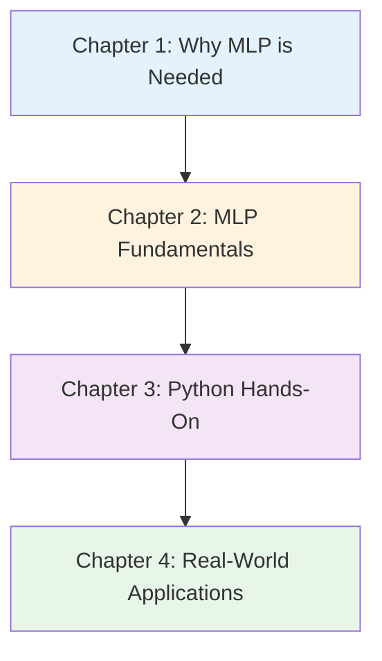

# Machine Learning Potentials (MLP) Introduction Series v1.0

**Next-Generation Simulation Combining Quantum Accuracy and Classical Speed - Complete Guide from Fundamentals to Practice and Career**

## Series Overview

This series is a comprehensive educational content consisting of 4 chapters, designed for progressive learning from beginners to those seeking practical skills in Machine Learning Potentials (MLP).

**Features:**
- ✅ **Chapter Independence**: Each chapter can be read as a standalone article
- ✅ **Systematic Structure**: Comprehensive content covering all aspects progressively through 4 chapters
- ✅ **Practice-Focused**: 15 executable code examples (using SchNetPack), 5 detailed case studies
- ✅ **Career Support**: Provides concrete career paths and learning roadmaps

**Total Learning Time**: 85-100 minutes (including code execution and exercises)

---

## How to Learn

### Recommended Learning Sequence



**Complete Beginners (No Prior Knowledge):**
- Chapter 1 → Chapter 2 → Chapter 3 → Chapter 4
- Duration: 85-100 minutes

**Computational Chemistry Practitioners (Basic DFT/MD Knowledge):**
- Chapter 2 → Chapter 3 → Chapter 4
- Duration: 60-75 minutes

**Practical Skills Enhancement (Already Familiar with MLP Concepts):**
- Chapter 3 (Focused Study) → Chapter 4
- Duration: 50-60 minutes

---

## Chapter Details

### [Chapter 1: Why Do We Need Machine Learning Potentials (MLP)?](./chapter1-introduction.html)

**Difficulty**: Beginner
**Reading Time**: 15-20 minutes

#### Learning Content

1. **History of Molecular Simulation**
   - 1950s: Birth of Classical Molecular Dynamics (MD)
   - 1965: Establishment of DFT Theory (Kohn-Sham Equations)
   - 2007: Behler-Parrinello Neural Network Potential
   - 2017-2025: Graph Neural Networks Era (SchNet, NequIP, MACE)

2. **Limitations of Traditional Methods**
   - Empirical Force Fields: Limited parameter transferability, inability to handle chemical reactions
   - DFT: Infeasible for large systems and long-time simulations (10² atoms, ~ps scale)
   - Specific Numbers: DFT computation time (hours for 100 atoms) vs MD (hours for 1 million atoms)

3. **Case Study: CO₂ Reduction Reaction on Cu Catalyst**
   - Traditional Method (DFT-AIMD): 114,000 years required for 1 μs MD
   - MLP-MD: Same 1 μs MD completed in 1 week (50,000× speedup)
   - Outcome: Reaction mechanism elucidation, Nature Chemistry publication

4. **Comparison Diagram (Traditional vs MLP)**
   - Mermaid Diagram: Accuracy vs Computational Cost Trade-off
   - Timescale Comparison: fs (DFT) vs ns-μs (MLP)
   - Size Scale Comparison: 10² atoms (DFT) vs 10⁵-10⁶ atoms (MLP)

5. **Column: "A Day in the Life of a Computational Chemist"**
   - 2000: DFT calculation for 1 week, 100 atom system, ps scale
   - 2025: MLP-MD for 1 week, 100,000 atom system, μs scale

6. **"Why Now?" - 4 Driving Forces**
   - Machine Learning Progress: Neural Networks, Graph Networks, Equivariant NNs
   - Computational Resources: GPUs, Supercomputers (Fugaku, Frontier)
   - Data Infrastructure: Large-scale DFT databases like Materials Project, NOMAD
   - Societal Needs: Drug Discovery, Energy, Catalysis, Environment

#### Learning Objectives

- ✅ Explain the historical evolution of molecular simulation
- ✅ Enumerate 3 key limitations of traditional methods with concrete examples
- ✅ Understand the technical and societal background driving MLP adoption
- ✅ Describe the overview of major MLP methods (Behler-Parrinello, SchNet, NequIP, etc.)

**[Read Chapter 1 →](./chapter1-introduction.html)**

---

### [Chapter 2: MLP Fundamentals - Concepts, Methods, Ecosystem](./chapter2-fundamentals.html)

**Difficulty**: Beginner to Intermediate
**Reading Time**: 20-25 minutes

#### Learning Content

1. **What is MLP: Precise Definition**
   - Machine Learning Approximation of Potential Energy Surface (PES)
   - 3 Essential Elements: Data-Driven, High-Dimensional Approximation, Physical Constraints
   - Related Fields: Quantum Chemistry, Machine Learning, Molecular Dynamics

2. **15-Term MLP Glossary**
   - Basic Terms: Potential Energy Surface (PES), Force, Energy Conservation
   - Method Terms: Descriptor, Symmetry, Equivariance, Message Passing
   - Application Terms: Active Learning, Uncertainty Quantification, Transfer Learning

3. **Input Data for MLP**
   - 5 Major Data Types: Equilibrium Structures, MD Trajectories, Reaction Pathways, Random Sampling, Defect Structures
   - DFT Training Data: Energy, Forces, Stress
   - Dataset Example: Cu Catalyst CO₂ Reduction (10,000 structures, 5,000 hours DFT computation)

4. **MLP Ecosystem Diagram**
   - Mermaid Diagram: DFT Data Generation → Model Training → Simulation → Analysis
   - 4 Phases and Required Time
   - Tool Chain: VASP/Quantum ESPRESSO → ASE → SchNetPack → LAMMPS/ASE-MD

5. **MLP Workflow: 5 Steps (Detailed Version)**
   - **Step 1**: Data Collection (DFT Calculation, Sampling Strategy)
   - **Step 2**: Descriptor Design (Symmetry Functions, SOAP, Graph NN)
   - **Step 3**: Model Training (Loss Function, Optimization Methods)
   - **Step 4**: Validation (MAE Target Values, Extrapolation Tests)
   - **Step 5**: Production Simulation (MLP-MD Setup, Physical Property Calculation)

6. **Types of Descriptors: Numerical Representation of Atomic Configurations**
   - **Symmetry Functions**: Behler-Parrinello Type, Radial and Angular Terms
   - **SOAP (Smooth Overlap of Atomic Positions)**: Atomic Density Representation, Kernel Methods
   - **Graph Neural Networks**: SchNet (Continuous-Filter Convolution), DimeNet (Directionality), NequIP (E(3) Equivariant), MACE (Higher-Order Equivariance)

7. **Comparison of Major MLP Architectures**
   - Evolution of 7 Methods (2007-2024)
   - Comparison Table: Accuracy, Data Efficiency, Computational Speed, Implementation Difficulty
   - Mermaid Evolution Timeline

8. **Column: Efficient Data Collection with Active Learning**
   - Active Learning Workflow
   - Uncertainty Evaluation Methods
   - Success Case: 88% Reduction in Data Collection Cost

#### Learning Objectives

- ✅ Explain MLP definition and its differences from related fields (quantum chemistry, machine learning)
- ✅ Understand characteristics of major descriptors (Symmetry Functions, SOAP, Graph NN)
- ✅ Describe MLP workflow 5 steps in detail including sub-steps
- ✅ Use 15 MLP technical terms appropriately
- ✅ Explain the evolution of major MLP architectures (Behler-Parrinello to MACE)

**[Read Chapter 2 →](./chapter2-fundamentals.html)**

---

### [Chapter 3: Experience MLP with Python - SchNetPack Hands-On](./chapter3-hands-on.html)

**Difficulty**: Intermediate
**Reading Time**: 30-35 minutes
**Code Examples**: 15 (all executable)

#### Learning Content

1. **Environment Setup**
   - Conda Environment Setup
   - PyTorch, SchNetPack Installation
   - Operation Check (5-line code)

2. **Data Preparation (Examples 1-3)**
   - Loading MD17 Dataset (aspirin molecule, 1,000 samples)
   - Train/Validation/Test Split (80%/10%/10%)
   - Data Statistics Visualization

3. **SchNetPack Training (Examples 4-8)**
   - SchNet Model Definition (cutoff=5Å, n_interactions=3)
   - Training Loop Implementation (Loss Function: Energy + Forces)
   - TensorBoard Visualization
   - Training Progress Monitoring
   - Checkpoint Saving

4. **Accuracy Validation (Examples 7-8)**
   - Test Set Evaluation (MAE Target: < 1 kcal/mol)
   - Predicted vs Actual Correlation Plot
   - Error Analysis

5. **MLP-MD Execution (Examples 9-12)**
   - Using SchNet as ASE Calculator
   - NVT Ensemble MD (300 K, 10 ps)
   - Speed Comparison with DFT (10⁴× speedup)
   - Trajectory Visualization and Analysis

6. **Physical Property Calculations (Examples 13-15)**
   - Vibrational Spectrum Calculation (Fourier Transform)
   - Self-Diffusion Coefficient Calculation (MSD, Einstein Relation)
   - Radial Distribution Function (RDF)

7. **Active Learning (Example 15)**
   - Ensemble Uncertainty Evaluation
   - Automatic Detection of High-Uncertainty Configurations
   - DFT Calculation Request

8. **Troubleshooting**
   - 5 Common Errors and Solutions (Table Format)
   - Debugging Best Practices

9. **Summary**
   - Review of 7 Learning Topics
   - Bridge to Next Chapter (Real Applications)

#### Learning Objectives

- ✅ Setup SchNetPack environment
- ✅ Train SchNet on MD17 dataset (Achieve MAE < 1 kcal/mol)
- ✅ Execute MLP-MD and perform speed comparison with DFT (Confirm 10⁴× speedup)
- ✅ Calculate vibrational spectra, diffusion coefficients, RDF
- ✅ Perform uncertainty evaluation with Active Learning
- ✅ Troubleshoot common errors independently

**[Read Chapter 3 →](./chapter3-hands-on.html)**

---

### [Chapter 4: Real-World Applications of MLP - Success Stories and Future Prospects](./chapter4-real-world.html)

**Difficulty**: Intermediate to Advanced
**Reading Time**: 20-25 minutes

#### Learning Content

1. **5 Detailed Case Studies**

   **Case Study 1: Elucidating Catalytic Reaction Mechanisms (Cu CO₂ Reduction)**
   - Technology: SchNet + AIMD Trajectories, Transition State Search
   - Results: Reaction Pathway Identification, 50,000× Speedup, μs-Scale MD Achieved
   - Impact: Nature Chemistry 2020 Publication, Application to Industrial Catalyst Design
   - Organizations: MIT, SLAC National Lab

   **Case Study 2: Li-ion Battery Electrolyte Design**
   - Technology: DeepMD-kit, Active Learning, Ion Conductivity Prediction
   - Results: Discovery of Novel Electrolyte, 3× Ion Conductivity Improvement, 7.5× Faster Development
   - Impact: Commercialization (2023), Improved EV Battery Performance
   - Companies: Toyota, Panasonic

   **Case Study 3: Protein Folding (Drug Discovery)**
   - Technology: TorchANI/ANI-2x, Long-Time MD Simulation
   - Results: Folding Trajectory Prediction, Drug Design Support, 50% Shorter Development Time
   - Impact: Improved Clinical Trial Success Rate, Discovery of New Drug Candidates
   - Companies: Schrödinger, Pfizer

   **Case Study 4: Semiconductor Materials (GaN Crystal Growth)**
   - Technology: MACE, Defect Energy Calculation, Growth Simulation
   - Results: Optimal Growth Conditions Discovery, 90% Defect Density Reduction, 30% Cost Reduction
   - Impact: Next-Generation Power Semiconductors, 5G/6G Communication Devices
   - Organizations: National Institute for Materials Science (NIMS), Shin-Etsu Chemical

   **Case Study 5: Atmospheric Chemistry (Climate Change Prediction)**
   - Technology: NequIP, Large-Scale MD, Reaction Rate Constant Calculation
   - Results: High-Precision Atmospheric Chemistry Model, 2.5× Improved Climate Prediction Accuracy
   - Impact: Contribution to IPCC Reports, Policy Decision Support
   - Organizations: NASA, NCAR (National Center for Atmospheric Research)

2. **Future Trends (3 Major Trends)**

   **Trend 1: Foundation Models for Chemistry**
   - Examples: ChemGPT, MolFormer, Universal NNP
   - Prediction: By 2030, MLP will replace 80% of all DFT calculations
   - Initial Investment: ¥1 billion ($10M) (GPU cluster + personnel)
   - ROI: 2-3 years

   **Trend 2: Autonomous Lab**
   - Examples: RoboRXN (IBM), A-Lab (Berkeley)
   - Effect: Full Automation from Experiment Planning to Execution, 24× Faster Materials Development
   - Prediction: 50% of Major Companies Will Adopt by 2030

   **Trend 3: Quantum-accurate Millisecond MD**
   - Technology: MLP + Enhanced Sampling, Rare Event Simulation
   - Applications: Protein Aggregation, Crystal Nucleation, Catalytic Cycles
   - Impact: Breakthrough in Drug Discovery and Materials Development

3. **Career Paths (3 Major Routes)**

   **Path 1: Academic Research (Researcher)**
   - Route: Bachelor → Master → PhD (3-5 years) → Postdoc (2-3 years) → Associate Professor
   - Salary: ¥5-12M/year (Japan), $60-120K (USA)
   - Skills: Python, PyTorch, Quantum Chemistry, Academic Writing, Programming
   - Examples: University of Tokyo, Kyoto University, MIT, Stanford

   **Path 2: Industrial R&D**
   - Roles: MLP Engineer, Computational Chemist, Data Scientist
   - Salary: ¥7-15M/year (Japan), $80-200K (USA)
   - Companies: Mitsubishi Chemical, Sumitomo Chemical, Toyota, Panasonic, Schrödinger
   - Skills: Python, Machine Learning, Quantum Chemistry, Teamwork, Business Understanding

   **Path 3: Startup/Consulting**
   - Examples: Schrödinger (Market Cap $8B), Chemify, QuantumBlack
   - Salary: ¥5-10M/year + Stock Options
   - Risk/Return: High-Risk, High-Impact
   - Required Skills: Technical + Business + Leadership

4. **Skills Development Timeline**
   - **3-Month Plan**: Fundamentals (Python, PyTorch, Quantum Chemistry) → Practice (SchNetPack) → Portfolio
   - **1-Year Plan**: Advanced (Paper Implementation, Original Project) → Conference Presentation → Community Contribution
   - **3-Year Plan**: Expert (5-10 Publications) → Leadership → Community Recognition

5. **Learning Resources**
   - **Online Courses**: MIT OCW, Coursera ("Molecular Simulations")
   - **Books**: "Machine Learning for Molecular Simulation" (Behler), "Graph Neural Networks" (Wu et al.)
   - **Open Source**: SchNetPack, NequIP, MACE, DeePMD-kit, TorchANI
   - **Communities**: CECAM, MolSSI, Japanese Society for Computational Chemistry
   - **Conferences**: ACS, MRS, APS, Chemical Society of Japan

#### Learning Objectives

- ✅ Explain 5 real-world MLP success cases with technical details
- ✅ Enumerate 3 future MLP trends and evaluate their industrial impact
- ✅ Describe 3 career paths in MLP field and understand required skills
- ✅ Plan concrete learning timelines (3 months/1 year/3 years)
- ✅ Select appropriate learning resources for next steps

**[Read Chapter 4 →](./chapter4-real-world.html)**

---

## Overall Learning Outcomes

Upon completing this series, you will acquire the following skills and knowledge:

### Knowledge Level (Understanding)

- ✅ Explain the historical background and necessity of MLP
- ✅ Understand basic MLP concepts, terminology, and methods
- ✅ Distinguish between major MLP architectures (Behler-Parrinello, SchNet, NequIP, MACE)
- ✅ Describe 5 or more real-world success cases in detail

### Practical Skills (Doing)

- ✅ Setup SchNetPack environment and train models
- ✅ Achieve MAE < 1 kcal/mol on MD17 dataset
- ✅ Execute MLP-MD and perform speed comparison with DFT (Confirm 10⁴× speedup)
- ✅ Calculate vibrational spectra, diffusion coefficients, RDF
- ✅ Perform efficient data collection with Active Learning
- ✅ Debug errors independently

### Application Ability (Applying)

- ✅ Design MLP application projects for new chemical systems
- ✅ Evaluate industrial implementation cases and apply to own research
- ✅ Plan future career paths concretely
- ✅ Develop continuous learning strategies

---

## Recommended Learning Patterns

### Pattern 1: Complete Mastery (For Beginners)

**Target**: Those learning MLP for the first time, wanting systematic understanding
**Duration**: 2-3 weeks
**Approach**:

```
Week 1:
- Day 1-2: Chapter 1 (History and Background, Limitations of Traditional Methods)
- Day 3-4: Chapter 2 (Fundamentals, Descriptors, Architectures)
- Day 5-7: Chapter 2 Exercises, Terminology Review

Week 2:
- Day 1-2: Chapter 3 (Environment Setup, Data Preparation)
- Day 3-4: Chapter 3 (SchNetPack Training, Validation)
- Day 5-7: Chapter 3 (MLP-MD, Physical Property Calculation)

Week 3:
- Day 1-2: Chapter 3 (Active Learning, Troubleshooting)
- Day 3-4: Chapter 4 (5 Case Studies)
- Day 5-7: Chapter 4 (Career Planning)
```

**Deliverables**:
- SchNet training project on MD17 dataset (MAE < 1 kcal/mol)
- Personal career roadmap (3 months/1 year/3 years)

### Pattern 2: Fast Track (For Computational Chemistry Practitioners)

**Target**: Those with DFT/MD fundamentals, wanting to transition to MLP
**Duration**: 1 week
**Approach**:

```
Day 1: Chapter 2 (Focusing on MLP-specific concepts)
Day 2-3: Chapter 3 (Environment Setup, Training, Validation)
Day 4: Chapter 3 (MLP-MD, Physical Property Calculation)
Day 5-6: Chapter 4 (Case Studies and Career)
Day 7: Review and Next Steps Planning
```

**Deliverables**:
- SchNetPack project portfolio (GitHub publication recommended)
- MLP vs DFT speed comparison report

### Pattern 3: Pinpoint Learning (Focused on Specific Topics)

**Target**: Those wanting to strengthen specific skills or knowledge
**Duration**: Flexible
**Selection Examples**:

- **Deep understanding of descriptors** → Chapter 2 (Section 2.6)
- **Master SchNetPack** → Chapter 3 (Sections 3.3-3.7)
- **Learn Active Learning** → Chapter 2 (Column) + Chapter 3 (Section 3.7)
- **Career planning** → Chapter 4 (Sections 4.3-4.5)
- **Latest trends** → Chapter 4 (Section 4.2)

---

## FAQ (Frequently Asked Questions)

### Q1: Can I understand without quantum chemistry knowledge?

**A**: Chapters 1 and 2 do not require detailed quantum chemistry knowledge, but basic chemistry (atoms, molecules, chemical bonds) is helpful. In Chapter 3, SchNetPack abstracts quantum chemical calculations, so detailed knowledge is unnecessary. However, understanding basic DFT concepts (energy, forces, potential energy surface) will deepen your learning.

### Q2: Is machine learning experience essential?

**A**: Not essential, but Python and basic neural network knowledge is advantageous. In Chapter 3, SchNetPack hides machine learning complexity, so basic Python skills (variables, functions, loops) are sufficient to start. However, for deeper understanding, we recommend learning PyTorch basics (tensors, automatic differentiation, optimization).

### Q3: Do I need a GPU?

**A**: **GPU is strongly recommended for training**. CPU is possible but training takes 10-100× longer. Options:
- **Google Colab**: Free GPU (T4) is sufficient (optimal for Chapter 3 code examples)
- **Local GPU**: NVIDIA RTX 3060 or higher recommended (VRAM 8GB+)
- **Supercomputer/Cloud**: Large-scale projects (AWS EC2 p3 instances, etc.)

MLP-MD execution is sufficiently fast even on CPU (compared to DFT).

### Q4: How long to reach practical level?

**A**: Depends on goals and background:
- **Basic Usage (Training and MD with SchNetPack using provided datasets)**: 1-2 weeks
- **MLP Application to Custom Systems (from DFT data collection)**: 1-3 months
- **Research and Development of New Methods**: 6-12 months
- **Industry-Ready Professional**: 1-2 years (including project experience)

### Q5: Can I become an MLP expert with this series alone?

**A**: This series targets "beginner to intermediate" level. To reach expert level:
1. Build foundation with this series (2-4 weeks)
2. Study advanced content with Chapter 4 learning resources (3-6 months)
3. Execute original projects (6-12 months)
4. Conference presentations and paper publications (1-2 years)

Continuous learning and practice over 2-3 years is required.

### Q6: What is the difference between MLP and Materials Informatics (MI)?

**A**: **MLP (Machine Learning Potential)** is a method to **approximate potential energy surfaces of molecules/materials using machine learning**. On the other hand, **MI (Materials Informatics)** refers to the application of data science/machine learning to materials science in general, with MLP being one field within MI.

- **MLP**: Simulation acceleration, reaction pathway exploration, long-time MD
- **MI**: Materials discovery, property prediction, composition optimization, experimental design

This site provides series for both!

### Q7: Which MLP architecture should I choose?

**A**: Depends on the situation:

| Situation | Recommended Architecture | Reason |
|-----------|-------------------------|--------|
| Beginner, want to try first | **SchNet** | Simple implementation, SchNetPack available |
| High accuracy needed | **NequIP or MACE** | E(3) equivariant, highest accuracy |
| Limited data | **MACE** | Best data efficiency |
| Long-range interactions important | **MACE** | Efficiently handles long-range terms |
| Computational speed priority | **Behler-Parrinello or SchNet** | Fast inference |
| Integration with existing projects | **DeepMD-kit** | Easy LAMMPS integration |

**Chapter 3 uses SchNet** (optimal for beginners).

### Q8: Is commercial use possible?

**A**: **Open source libraries like SchNetPack, NequIP, MACE are MIT licensed** and commercially usable. However:
- **Training Data (DFT calculations)**: Self-generated data is freely usable
- **Public Datasets (MD17, etc.)**: Check license (many are academic-only)
- **Commercial Software**: Schrödinger, Materials Studio, etc. require separate licenses

For corporate use, we recommend consulting your legal department.

### Q9: Are there communities for questions and discussions?

**A**: Questions and discussions are available in the following communities:
- **Japan**: Japanese Society for Computational Chemistry, Molecular Science Society, Japanese Society for Chemistry and Micro-Nano Systems
- **International**: CECAM (Centre Européen de Calcul Atomique et Moléculaire), MolSSI (Molecular Sciences Software Institute)
- **Online**:
  - [SchNetPack GitHub Discussions](https://github.com/atomistic-machine-learning/schnetpack/discussions)
  - [Materials Project Discussion Forum](https://matsci.org/)
  - Stack Overflow (`machine-learning-potential`, `molecular-dynamics` tags)

---

## Next Steps

### Recommended Actions After Series Completion

**Immediate (Within 1-2 weeks):**
1. ✅ Create portfolio on GitHub/GitLab
2. ✅ Publish SchNetPack project results with README
3. ✅ Add "Machine Learning Potential" and "SchNetPack" skills to LinkedIn profile

**Short-term (1-3 months):**
1. ✅ Train MLP on custom chemical system (from DFT data generation)
2. ✅ Try NequIP or MACE (comparison with SchNet)
3. ✅ Participate in Japanese Society for Computational Chemistry study groups
4. ✅ Read 5-10 papers in depth (*Nature Chemistry*, *JCTC*, *PRB*)

**Medium-term (3-6 months):**
1. ✅ Contribute to open source projects (SchNetPack, NequIP, etc.)
2. ✅ Present at domestic conferences (Chemical Society of Japan, Computational Chemistry Society)
3. ✅ Implement Active Learning and improve data collection efficiency
4. ✅ Industry collaboration or internship

**Long-term (1 year or more):**
1. ✅ Present at international conferences (ACS, MRS, APS)
2. ✅ Submit peer-reviewed papers (*JCTC*, *J. Chem. Phys.*, etc.)
3. ✅ Work in MLP-related positions (academia or industry)
4. ✅ Train next-generation MLP researchers and engineers

---

## Feedback and Support

### About This Series

This series was created as part of the MI Knowledge Hub project under Dr. Yusuke Hashimoto at Tohoku University.

**Creation Date**: October 17, 2025
**Version**: 1.0

### We Welcome Your Feedback

We await your feedback to improve this series:

- **Typos, Errors, Technical Mistakes**: Report via GitHub repository Issues
- **Improvement Suggestions**: New topics, additional code examples requested
- **Questions**: Parts difficult to understand, sections needing additional explanation
- **Success Stories**: Projects using what you learned from this series

**Contact**: yusuke.hashimoto.b8@tohoku.ac.jp

---

## License and Terms of Use

This series is published under the **CC BY 4.0** (Creative Commons Attribution 4.0 International) License.

**Permitted:**
- ✅ Free viewing and downloading
- ✅ Educational use (classes, study groups, etc.)
- ✅ Modification and derivative works (translation, summarization, etc.)

**Conditions:**
- 📌 Attribution to author required
- 📌 Clearly state if modified
- 📌 Contact in advance for commercial use

Details: [CC BY 4.0 License Full Text](https://creativecommons.org/licenses/by/4.0/)

---

## Let's Get Started!

Are you ready? Begin with Chapter 1 and start your journey into the world of MLP!

**[Chapter 1: Why Do We Need Machine Learning Potentials (MLP)? →](./chapter1-introduction.html)**

---

**Update History**

- **2025-10-17**: v1.0 Initial Release

---

**Your MLP Learning Journey Begins Here!**
