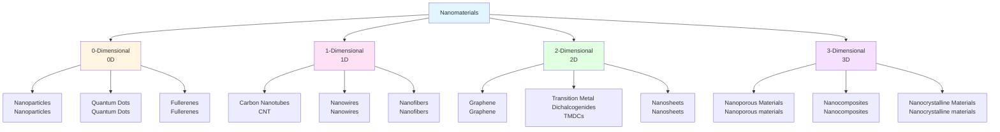

# Chapter 1: Introduction to Nanomaterials

The Nanoscale World and Size Effects

---

## Learning Objectives

By studying this chapter, you will be able to:

- ✅ Understand the sense of nanoscale dimensions and compare them with everyday scales
- ✅ Quantitatively explain physical property changes resulting from increased surface area/volume ratio
- ✅ Understand the fundamental principles of quantum effects and quantum confinement effects
- ✅ Classify nanomaterials based on dimensionality (0D/1D/2D/3D)
- ✅ Explain major application areas of nanomaterials and their characteristics
- ✅ Discuss safety and ethical issues related to nanomaterials

---

## 1.1 What are Nanomaterials?

### Definition of Nanoscale

The first step in understanding nanomaterials is to grasp what the "nano" scale actually means.

**Nanometer (nm)** is an extremely small unit of length, one billionth of a meter:

$$
1 \text{ nm} = 10^{-9} \text{ m} = 0.000000001 \text{ m}
$$

To understand this incredibly small scale, let's compare it with familiar sizes:

| Object | Size | Nanometer Equivalent |
|--------|------|---------------------|
| Human height | ~1.7 m | 1,700,000,000 nm |
| Hair thickness | ~80 μm | 80,000 nm |
| Red blood cell | ~7 μm | 7,000 nm |
| Bacteria (E. coli) | ~2 μm | 2,000 nm |
| Virus (influenza) | ~100 nm | 100 nm |
| **Typical nanomaterial size** | **1-100 nm** | **1-100 nm** |
| DNA double helix diameter | ~2 nm | 2 nm |
| Water molecule | ~0.3 nm | 0.3 nm |
| Atom (carbon) | ~0.15 nm | 0.15 nm |

Nanomaterials exist at a scale comparable to or smaller than viruses. At this scale, structures are formed by the assembly of several to thousands of atoms.

### Definition of Nanomaterials

According to the International Organization for Standardization (ISO) technical specification ISO/TS 80004-1, nanomaterials are defined as follows:

> **Nanomaterial**: Material with any external dimension, or internal structure, at the nanoscale (approximately 1 nm to 100 nm)

The critical point in this definition is the phrase "at least one dimension." This means that not all three dimensions need to be at the nanoscale; even if only one direction is nanoscale, it qualifies as a nanomaterial. This concept leads to the dimensional classification (0D, 1D, 2D, 3D) discussed later.

The **key characteristics** of nanomaterials are the following four:

1. **Dramatic increase in surface area/volume ratio**: As size decreases, the proportion of surface atoms increases
2. **Emergence of quantum effects**: When particle size becomes comparable to the electron wavelength, quantum mechanical effects become significant
3. **Size-dependent properties**: Even with the same chemical composition, properties such as color, melting point, and catalytic activity change with size
4. **Unique optical properties**: Novel optical properties absent in bulk materials appear, such as localized surface plasmon resonance in metal nanoparticles

### Why are Nanomaterials Attracting Attention?

Bulk materials (conventional-sized materials) and nanomaterials can exhibit completely different properties even with the same chemical composition.

As a representative example, let's look at the size effect of **gold (Au)**:

| Particle Size | Color | Melting Point | Characteristics |
|--------------|-------|---------------|-----------------|
| Bulk (ingot) | Gold color (golden) | 1,064°C | Chemically stable, no catalytic activity |
| 50-100 nm | Blue-violet | ~900-1,000°C | Localized surface plasmon resonance |
| 20-30 nm | Red | ~700-800°C | Strong light absorption, bioimaging |
| 5-10 nm | Red-violet | ~500-600°C | High catalytic activity |
| 2-3 nm | Variable | ~300-400°C | Emergence of quantum effects |

The same element, gold, exhibits such dramatic property changes depending on particle size. This **size dependence** is the fascination of nanomaterial research and the source of diverse application possibilities.

---

## 1.2 Size Effects and Surface/Interface Effects

### Increase in Surface Area/Volume Ratio

One of the most important properties of nanomaterials is the **dramatic increase in surface area/volume ratio**.

As a simple example, consider a spherical particle with radius $r$.

- **Surface area**: $S = 4\pi r^2$
- **Volume**: $V = \frac{4}{3}\pi r^3$
- **Surface area/volume ratio**:

$$
\frac{S}{V} = \frac{4\pi r^2}{\frac{4}{3}\pi r^3} = \frac{3}{r}
$$

From this equation, we see that **as particle radius decreases, surface area/volume ratio increases**. In other words, if size becomes 1/10, the surface area/volume ratio becomes 10 times larger.

Let's compare with specific numerical values:

| Particle Diameter | Surface Area/Volume Ratio | Total Atoms (Au) | Surface Atom Fraction |
|------------------|---------------------------|------------------|----------------------|
| 1 cm (10⁷ nm) | 0.6 m⁻¹ | ~10²² | <0.001% |
| 1 mm (10⁶ nm) | 6 m⁻¹ | ~10¹⁹ | ~0.01% |
| 100 μm (10⁵ nm) | 60 m⁻¹ | ~10¹⁶ | ~0.1% |
| 10 μm (10⁴ nm) | 600 m⁻¹ | ~10¹³ | ~1% |
| 1 μm (1000 nm) | 6,000 m⁻¹ | ~10¹⁰ | ~10% |
| **100 nm** | **60,000 m⁻¹** | **~10⁷** | **~20%** |
| **10 nm** | **600,000 m⁻¹** | **~10⁴** | **~40%** |
| **5 nm** | **1,200,000 m⁻¹** | **~10³** | **~60%** |
| **2 nm** | **3,000,000 m⁻¹** | **~250** | **~80%** |

In a 10 nm gold nanoparticle, approximately 40% of all atoms are on the surface. At 2 nm, an astonishing 80% of atoms are on the surface.

This increase in surface atoms leads to the following dramatic property changes:

- **Enhanced catalytic activity**: Reactions primarily occur at surfaces
- **Increased reactivity**: Surface atoms are more unstable than interior atoms
- **Melting point depression**: Surface energy contribution becomes larger
- **Solubility changes**: Dissolution rate increases with surface area

### Influence of Surface Energy

In nanoparticles, surface energy has a major impact on the overall material properties.

A representative phenomenon is **melting point depression**. Nanoparticles melt at temperatures lower than bulk materials.

This phenomenon is known as the **Gibbs-Thomson effect** and can be approximated by the following equation:

$$
T_m(r) = T_{m,\text{bulk}} \left(1 - \frac{2\gamma V_m}{r \Delta H_f}\right)
$$

Where:
- $T_m(r)$: Melting point of particle with radius $r$
- $T_{m,\text{bulk}}$: Melting point of bulk material
- $\gamma$: Surface energy (surface tension)
- $V_m$: Molar volume
- $\Delta H_f$: Enthalpy of fusion
- $r$: Particle radius

**Experimental data for gold nanoparticle melting points**:

| Particle Diameter | Melting Point | Depression from Bulk |
|------------------|---------------|---------------------|
| Bulk | 1,064°C | 0°C |
| 100 nm | ~1,050°C | ~14°C |
| 50 nm | ~1,020°C | ~44°C |
| 20 nm | ~950°C | ~114°C |
| 10 nm | ~850°C | ~214°C |
| 5 nm | ~650°C | ~414°C |
| 2 nm | ~350°C | ~714°C |

A 2 nm gold nanoparticle melts at a temperature more than 700°C lower than bulk gold. This property is utilized in developing low-temperature sintering materials and thermally responsive materials.

### Enhancement of Catalytic Activity

The increase in surface area/volume ratio leads to **dramatic enhancement of catalytic activity**.

Let's consider **platinum (Pt) catalysts** as an example:

- **Applications**: Electrode catalyst for fuel cells, automotive exhaust purification catalyst
- **Reaction**: Hydrogen oxidation reaction (H₂ → 2H⁺ + 2e⁻)

Relationship between platinum particle size and catalytic activity:

| Pt Particle Size | Surface Area (per gram) | Relative Catalytic Activity | Cost Efficiency |
|-----------------|-------------------------|---------------------------|----------------|
| Bulk plate | ~1 m²/g | 1× | 1× |
| 10 μm powder | ~0.1 m²/g | 2× | 2× |
| 100 nm powder | ~10 m²/g | 50× | 50× |
| **10 nm nanoparticles** | **~100 m²/g** | **500×** | **500×** |
| **3 nm nanoparticles** | **~300 m²/g** | **1,500×** | **1,500×** |

3 nm platinum nanoparticles exhibit 1,500 times the catalytic activity of bulk platinum plates. This means 1,500 times the performance can be extracted from the same mass of platinum, significantly contributing to reducing the use of rare metals.

---

## 1.3 Quantum Effects and Quantum Confinement

### Emergence of Quantum Effects

When particle size reaches the nanoscale, **quantum mechanical effects** that cannot be explained by classical physics become significant.

The key to understanding quantum effects is the **de Broglie wavelength**. All particles have wave-like properties, and their wavelength $\lambda$ is given by:

$$
\lambda = \frac{h}{p} = \frac{h}{mv}
$$

Where:
- $h$: Planck's constant ($6.626 \times 10^{-34}$ J·s)
- $p = mv$: Momentum (mass × velocity)
- $m$: Particle mass
- $v$: Particle velocity

Let's calculate the **de Broglie wavelength of an electron at room temperature (300 K)**:

- Thermal kinetic energy of electron: $E = \frac{3}{2}k_BT \approx 0.039$ eV
- Electron mass: $m_e = 9.109 \times 10^{-31}$ kg
- Velocity: $v = \sqrt{\frac{2E}{m}} \approx 1.17 \times 10^5$ m/s
- **de Broglie wavelength**:

$$
\lambda = \frac{h}{m_e v} \approx \frac{6.626 \times 10^{-34}}{9.109 \times 10^{-31} \times 1.17 \times 10^5} \approx 6.2 \text{ nm}
$$

The de Broglie wavelength of an electron is approximately **6 nm**. When particle size becomes comparable to or smaller than this wavelength, electrons behave as "waves confined within the particle," and quantum effects become important.

### Quantum Confinement Effect

The **quantum confinement effect** is a phenomenon where electrons or holes (positive charge carriers) are confined in a narrow space, causing their energy states to become discrete.

As the simplest model, consider a **one-dimensional infinite potential well**. The energy levels of a particle confined in a box of length $L$ are:

$$
E_n = \frac{n^2 h^2}{8mL^2} \quad (n = 1, 2, 3, \ldots)
$$

Where:
- $n$: Quantum number
- $h$: Planck's constant
- $m$: Particle mass
- $L$: Box length (particle size)

Important conclusions can be drawn from this equation:

1. **Energy is discrete**: Only specific values ($E_1, E_2, E_3, \ldots$) are allowed, not continuous values
2. **A minimum energy (ground state) exists**: $E_1 = \frac{h^2}{8mL^2}$, which is not zero
3. **Energy gap depends on size**:

$$
\Delta E = E_2 - E_1 = \frac{3h^2}{8mL^2} \propto \frac{1}{L^2}
$$

**As particle size decreases, the energy gap increases.**

This is why semiconductor nanoparticles (quantum dots) change color with size.

### Emission Color Control in Semiconductor Quantum Dots

**Quantum dots (QDs)** are semiconductor nanoparticles where the bandgap (forbidden gap) changes with size, allowing control of emission color.

Example of **CdSe (cadmium selenide) quantum dots**:

| Particle Diameter | Bandgap | Emission Color | Emission Wavelength | Application Example |
|------------------|---------|----------------|--------------------|--------------------|
| Bulk | 1.74 eV | Infrared | ~710 nm | - |
| 10 nm | 1.85 eV | Red | ~670 nm | Red QLED |
| 6 nm | 2.00 eV | Orange | ~620 nm | Display |
| 4 nm | 2.25 eV | Yellow-green | ~550 nm | Bioimaging |
| 3 nm | 2.50 eV | Green | ~495 nm | Green QLED |
| 2 nm | 2.75 eV | Blue | ~450 nm | Blue QLED |

As particle diameter decreases from 10 nm to 2 nm, the bandgap increases from 1.85 eV to 2.75 eV, and the emission color changes from red to blue.

This can be explained by the **Brus equation** (simplest approximation form):

$$
E_g(r) = E_{g,\text{bulk}} + \frac{h^2}{8r^2}\left(\frac{1}{m_e^*} + \frac{1}{m_h^*}\right) - \frac{1.8e^2}{4\pi\epsilon\epsilon_0 r}
$$

Where:
- $E_g(r)$: Bandgap of quantum dot with radius $r$
- $E_{g,\text{bulk}}$: Bandgap of bulk semiconductor
- $m_e^*$, $m_h^*$: Effective mass of electron and hole
- $e$: Electron charge
- $\epsilon$: Dielectric constant
- Second term: Energy increase due to quantum confinement ($\propto 1/r^2$)
- Third term: Energy decrease due to Coulomb interaction ($\propto 1/r$)

**Major applications** of quantum dots:

1. **QLED (Quantum dot LED displays)**: Commercialized by Samsung, Sony; color reproducibility improved by 150% over conventional displays
2. **Bioimaging**: Brighter than fluorescent dyes, less photobleaching
3. **Solar cells**: Multi-junction solar cells with theoretical efficiency improvement (possibility to exceed Shockley-Queisser limit)
4. **Quantum information technology**: Candidate material for quantum bits

### Localized Surface Plasmon Resonance in Metal Nanoparticles

Metal nanoparticles exhibit a unique optical phenomenon called **localized surface plasmon resonance (LSPR)**.

**Plasmons** are collective oscillations of free electrons in metals. In nanoparticles, the electron cloud oscillates due to the electric field of light, and resonance occurs at specific wavelengths.

**LSPR in gold nanoparticles**:

| Particle Size/Shape | LSPR Wavelength | Observed Color | Application |
|--------------------|-----------------|----------------|-------------|
| 10-20 nm spherical | ~520 nm | Red | Biosensing |
| 50 nm spherical | ~530 nm | Red-violet | Photothermal therapy |
| 100 nm spherical | ~570 nm | Blue-violet | SERS substrate |
| Nanorod (3:1 aspect ratio) | ~650 nm, ~520 nm | Blue-green | Imaging |
| Nanoshell (Au/SiO₂) | ~800 nm | Transparent (near-infrared) | Cancer hyperthermia |

**LSPR application examples**:

1. **Biosensing**: Antibodies modified on gold nanoparticles; LSPR wavelength shifts upon target molecule binding (detection limit: pM order)
2. **Surface-Enhanced Raman Scattering (SERS)**: Raman signal enhanced by 10⁶-10¹⁴ times; single-molecule detection possible
3. **Cancer hyperthermia**: Near-infrared light (high tissue penetration) heats gold nanoparticles to selectively kill cancer cells
4. **Color filters**: Plasmonic color filters with controlled LSPR wavelength

---

## 1.4 Classification of Nanomaterials

Nanomaterials are classified based on **how many dimensions are at the nanoscale**.

### Classification by Dimensionality

**Classification criteria**:

- **0-Dimensional (0D)**: All three dimensions are nanoscale (length, width, height all < 100 nm)
- **1-Dimensional (1D)**: Two dimensions are nanoscale, one dimension is long (diameter < 100 nm, length arbitrary)
- **2-Dimensional (2D)**: One dimension is nanoscale, two dimensions have extent (thickness < 100 nm, length and width arbitrary)
- **3-Dimensional (3D)**: Bulk materials with internal nanostructures (nanopores, nanocrystalline grains, etc.)

### 0-Dimensional Nanomaterials (0D)

**Nanoparticles**

- **Definition**: Particles with all dimensions between 1-100 nm
- **Representative examples**: Gold nanoparticles, silver nanoparticles, titanium dioxide (TiO₂) nanoparticles
- **Characteristics**: High surface area/volume ratio, size-dependent optical properties, catalytic activity
- **Applications**: Catalysts, drug delivery, antimicrobial materials, sunscreen (UV absorption)

**Quantum Dots**

- **Definition**: Semiconductor nanoparticles exhibiting quantum confinement effects
- **Representative examples**: CdSe, PbS, InP, perovskite (CsPbBr₃)
- **Characteristics**: Emission color control by size, high luminescence efficiency, photostability
- **Applications**: QLED displays, bioimaging, solar cells, quantum computing

**Fullerenes**

- **Definition**: Soccer ball-shaped molecules composed only of carbon atoms
- **Representative examples**: C₆₀ (buckyballs), C₇₀, C₈₄
- **Characteristics**: High symmetry, electron acceptor properties, radical scavenging ability
- **Applications**: Organic solar cells, antioxidants, drug delivery

### 1-Dimensional Nanomaterials (1D)

**Carbon Nanotubes (CNTs)**

Carbon nanotubes are structures formed by rolling graphene sheets (hexagonal lattice of carbon atoms) into cylindrical shapes.

**Classification**:
1. **Single-walled carbon nanotubes (SWCNT)**: Composed of one graphene sheet
   - Diameter: 0.4-3 nm
   - Electronic properties: Metallic or semiconducting depending on rolling direction
   - Strength: Tensile strength ~100 GPa (100 times that of steel)

2. **Multi-walled carbon nanotubes (MWCNT)**: Multiple graphene sheets concentrically layered
   - Diameter: 10-100 nm
   - Electronic properties: Primarily metallic
   - Conductivity: Higher than copper (up to 10⁷ S/m)

**Key properties**:

| Property | Value | Comparison |
|----------|-------|------------|
| Tensile strength | 50-100 GPa | 50-100 times steel |
| Young's modulus | ~1 TPa | Comparable to diamond |
| Electrical conductivity | Up to 10⁷ S/m | Close to copper (6×10⁷ S/m) |
| Thermal conductivity | ~3,000 W/m·K | Exceeds diamond (2,200 W/m·K) |
| Current density | Up to 10⁹ A/cm² | 1,000 times copper |

**Applications**:
- **Composite materials**: Lightweight high-strength materials (aerospace, sports equipment)
- **Electronic devices**: CNT transistors (CNT-FETs), transparent conductive films
- **Energy storage**: Lithium-ion battery electrodes, supercapacitors
- **Sensors**: Gas sensors, biosensors

**Nanowires**

- **Definition**: Wire-like materials with diameter 10-100 nm, length several μm to several mm
- **Representative examples**: Si, ZnO, Ag, Au, InP nanowires
- **Characteristics**: High aspect ratio (length/diameter > 100), one-dimensional electron conduction
- **Applications**: Nanoelectronics, solar cells, sensors, LEDs

**Nanofibers**

- **Definition**: Fibrous materials with diameter 10-1,000 nm
- **Representative examples**: Polymer nanofibers fabricated by electrospinning
- **Characteristics**: High specific surface area, flexibility, porosity
- **Applications**: Filters, tissue engineering scaffolds, sensors

### 2-Dimensional Nanomaterials (2D)

**Graphene**

Graphene is a **two-dimensional sheet with thickness of approximately 0.34 nm (one atomic layer of carbon)** where carbon atoms are arranged in a hexagonal lattice. In 2004, Andre Geim and Konstantin Novoselov isolated it by mechanical exfoliation and received the Nobel Prize in Physics in 2010.

**Remarkable properties**:

| Property | Value | Comparison |
|----------|-------|------------|
| Electrical conductivity | ~10⁸ S/m | About 100 times copper |
| Electron mobility | 200,000 cm²/V·s (room temperature) | More than 100 times silicon |
| Tensile strength | 130 GPa | About 200 times steel |
| Young's modulus | 1 TPa | Comparable to diamond |
| Thermal conductivity | 5,000 W/m·K | About 12 times copper (400 W/m·K) |
| Optical transmittance | 97.7% (monolayer) | Nearly transparent |
| Specific surface area | 2,630 m²/g (theoretical) | More than twice activated carbon |

**Application fields**:
1. **Electronics**: Graphene FETs (high-speed transistors), transparent conductive films, flexible electronics
2. **Energy**: Lithium-ion battery electrodes (3× capacity improvement), supercapacitors (10× energy density)
3. **Composite materials**: Graphene/polymer composites (strength and conductivity improvement)
4. **Sensors**: Chemical sensors, biosensors (single-molecule detection possible)
5. **Transparent conductive films**: Touch panels, solar cells (expected as ITO replacement)

**Transition Metal Dichalcogenides (TMDCs)**

- **Chemical formula**: MX₂ (M = Mo, W, Ti, V, etc., X = S, Se, Te)
- **Representative examples**: MoS₂, WS₂, WSe₂
- **Structure**: Single to few layers of X-M-X sandwich structure
- **Thickness**: Monolayer ~0.65 nm
- **Characteristics**:
  - Layer-dependent bandgap (bulk is indirect transition type, monolayer is direct transition type)
  - Strong light-matter interaction
  - Valleytronics (degrees of freedom in electron spin and orbit)
- **Applications**: 2D semiconductor devices, photodetectors, catalysts (hydrogen evolution reaction)

**Nanosheets**

- **Definition**: Two-dimensional sheets with thickness below several nm, lateral size μm to mm
- **Representative examples**: Layered double hydroxides (LDH), graphene oxide (GO), transition metal oxide nanosheets
- **Applications**: Catalyst supports, gas barrier films, energy storage materials

### 3-Dimensional Nanomaterials (3D)

**Nanoporous Materials**

- **Definition**: Bulk materials with nanoscale pores
- **Pore size classification** (IUPAC):
  - Micropores: < 2 nm
  - Mesopores: 2-50 nm
  - Macropores: > 50 nm
- **Representative examples**:
  - **Zeolites**: Microporous aluminosilicates, catalysts, adsorbents
  - **Mesoporous silica**: MCM-41, SBA-15, drug delivery
  - **Metal-organic frameworks (MOFs)**: Porous materials composed of metal ions and organic ligands, hydrogen storage, CO₂ adsorption
  - **Porous carbons**: Activated carbon, carbon aerogels, electric double-layer capacitors
- **Characteristics**: Ultra-high specific surface area (up to 7,000 m²/g), size-selective adsorption, catalytic activity
- **Applications**: Catalysts, gas storage and separation, drug delivery, sensors

**Nanocomposites**

- **Definition**: Composite materials containing nanoscale fillers
- **Representative examples**:
  - CNT/epoxy resin composites (strength and conductivity improvement)
  - Graphene/polymer composites (gas barrier property improvement)
  - Clay/polymer nanocomposites (flame retardancy, mechanical property improvement)
- **Characteristics**: Significant property improvement with small addition (1-5 wt%)
- **Applications**: Automotive parts, aerospace materials, packaging materials, sports equipment

**Nanocrystalline Materials**

- **Definition**: Bulk materials with crystalline grain size below 100 nm
- **Characteristics**: High grain boundary density, high strength (Hall-Petch effect), superplasticity
- **Applications**: High-strength metal materials, magnetic materials, catalysts

---

## 1.5 Application Areas of Nanomaterials

Nanomaterials are bringing innovation to various fields by exploiting their unique properties.

### Energy Sector

**Lithium-ion Batteries (LIB)**

- **Graphene electrodes**:
  - Theoretical capacity: 744 mAh/g (conventional graphite: 372 mAh/g)
  - Fast charging: 80% charge in 10 minutes possible
  - Long lifetime: Over 1,000 cycles

- **Si/C nanocomposite anodes**:
  - Silicon theoretical capacity: 4,200 mAh/g (11 times graphite)
  - Problem: Volume change during charge/discharge (~300%) → solved by nanostructuring
  - Commercial example: Tesla Model 3 (Si-containing anode)

- **Nano-LiFePO₄ cathodes**:
  - Particle size 20-50 nm improves electron and ion conductivity
  - 5× power density improvement

**Fuel Cells**

- **Pt nanoparticle catalysts**:
  - Particle size 2-3 nm maximizes mass activity
  - Pt usage reduced to 1/10 (cost reduction)
  - Catalyst support: Carbon nanotubes, graphene

**Solar Cells**

- **Quantum dot solar cells**:
  - Theoretical efficiency: 44% (conventional Si: 29%, Shockley-Queisser limit)
  - Light absorption over wide wavelength range through multi-junction design

- **Perovskite solar cells**:
  - Nanocrystalline perovskite (CH₃NH₃PbI₃)
  - Conversion efficiency: 25.7% (2023, research level)
  - Manufacturing cost: 1/10 of Si solar cells

- **Dye-sensitized solar cells (DSSC)**:
  - TiO₂ nanoparticles (20 nm diameter) used in electrodes
  - Increased specific surface area enables more dye adsorption

### Electronics Sector

**Semiconductor Devices**

- **CNT transistors (CNT-FET)**:
  - Switching speed: 10 times Si transistors
  - Low power consumption: Operating voltage below 0.5 V
  - Under development by IBM, Intel

- **Graphene transistors (Graphene-FET)**:
  - Electron mobility: 200,000 cm²/V·s (Si: 1,400 cm²/V·s)
  - High-frequency operation: Over 300 GHz
  - Applications: High-frequency communication, THz detectors

**Displays**

- **QLED (Quantum dot LED)**:
  - Commercialized by Samsung, Sony
  - Color gamut: 150% of conventional LCD (DCI-P3 coverage 100%)
  - Luminous efficiency: Comparable to organic EL
  - Lifetime: More than twice organic EL

- **Transparent conductive films**:
  - Graphene, CNT, silver nanowires
  - Expected as ITO (indium tin oxide) replacement
  - Ideal for flexible displays

### Medical and Biomedical Sectors

**Drug Delivery Systems (DDS)**

- **Liposomes (lipid nanoparticles)**:
  - Size: 50-200 nm
  - EPR effect (Enhanced Permeability and Retention): Selective accumulation in tumor tissue
  - FDA-approved drugs: Doxil (anticancer drug), COVID-19 mRNA vaccines (Pfizer, Moderna)

- **Polymeric micelles**:
  - Size: 10-100 nm
  - Solubilization of hydrophobic drugs
  - Extended blood circulation time

- **Gold nanoparticle DDS systems**:
  - High drug loading capacity (high surface area/volume ratio)
  - Controlled drug release by near-infrared light irradiation
  - Targeting capability (antibody modification)

**Imaging**

- **Quantum dot contrast agents**:
  - 10-100 times brighter than fluorescent dyes
  - Less photobleaching (fluorescence lifetime: hours to days)
  - Multi-color simultaneous imaging (color control by size)

- **Iron oxide (Fe₃O₄) nanoparticles**:
  - MRI contrast agent (T₂-weighted imaging)
  - High biocompatibility
  - Also used for magnetic hyperthermia (cancer thermal therapy)

**Biosensors**

- **Gold nanoparticle sensors**:
  - Molecular binding detection by LSPR change
  - Detection limit: pM to fM order
  - Applications: DNA detection, protein detection, virus detection

- **CNT biosensors**:
  - Glucose sensors, DNA sensors
  - Electrochemical detection
  - High sensitivity, rapid response

### Environmental and Catalysis Sectors

**Water Treatment**

- **TiO₂ photocatalysts**:
  - Organic compound decomposition under UV light irradiation
  - Antimicrobial action (E. coli, Staphylococcus aureus, etc.)
  - Applications: Water purification, sewage treatment, self-cleaning surfaces

- **CNT adsorbents**:
  - Heavy metal ion adsorption (Pb²⁺, Cd²⁺, As³⁺)
  - Adsorption capacity: 2-3 times activated carbon
  - Regeneration and reuse possible

**Air Purification**

- **Pt nanoparticle catalysts**:
  - Automotive exhaust purification (three-way catalyst)
  - Simultaneous removal of NOx, CO, hydrocarbons
  - Improved low-temperature activity

- **Nanofiber filters**:
  - PM2.5 collection efficiency: 99.9%
  - Low pressure drop
  - Applications: Masks, air purifiers

**CO₂ Reduction**

- **MOFs (Metal-organic frameworks)**:
  - CO₂ adsorption capacity: Up to 40 wt%
  - Selective CO₂ adsorption (separation from CH₄, N₂)
  - Application: CO₂ recovery from exhaust gases

- **Cu nanoparticle catalysts**:
  - CO₂ electrochemical reduction (CO₂ → CO, CH₄, ethanol)
  - Faradaic efficiency: Over 70%
  - Carbon neutrality achieved in combination with renewable energy

### Materials and Structural Sectors

**Composite Materials**

- **CNT/epoxy resin composites**:
  - CNT content: 1-5 wt%
  - Tensile strength: 50% improvement
  - Electrical conductivity: 10⁻¹² S/m → 10³ S/m (insulator → conductor)
  - Applications: Aircraft components (Boeing 787), sports equipment

- **Graphene/polymer composites**:
  - Graphene content: 0.1-1 wt%
  - Gas barrier property: 10× improvement
  - Thermal conductivity: 5× improvement
  - Applications: Packaging materials, electronic device housings

**Coatings**

- **Silver nanoparticle antimicrobial coatings**:
  - Antimicrobial mechanism: Silver ion release, bacterial membrane disruption
  - Effective bacteria: E. coli, MRSA, Pseudomonas aeruginosa, etc.
  - Applications: Medical devices, food containers, textiles

- **Superhydrophobic coatings (nanostructured surfaces)**:
  - Contact angle: Over 150°
  - Lotus effect
  - Applications: Building materials, automotive glass, textiles

- **Hard coatings (nanocomposites)**:
  - TiN, TiAlN nanoparticle-containing
  - Hardness: Over HV 2,000
  - Applications: Cutting tools, molds

---

## 1.6 Market and Future Prospects of Nanomaterials

### Global Market Size

The market for nanomaterials and nanotechnology is rapidly expanding.

**Market size and growth rate by sector (2023-2030 forecast)**:

| Sector | 2023 Market Size | 2030 Forecast | Annual Growth Rate (CAGR) |
|--------|------------------|---------------|--------------------------|
| Nanoelectronics | $45 billion | $85 billion | 9.5% |
| Nanomedicine/Drug Delivery | $38 billion | $72 billion | 10.2% |
| Nanoenergy (Batteries/Solar Cells) | $32 billion | $68 billion | 11.3% |
| Nanocomposites | $27 billion | $51 billion | 9.8% |
| Nanocatalysts/Environmental Materials | $18 billion | $34 billion | 9.4% |
| Others (Coatings, Cosmetics, etc.) | $40 billion | $70 billion | 8.2% |
| **Total** | **$200 billion** | **$380 billion** | **9.8%** |

Major market expansion drivers:
1. **Electric vehicle (EV) adoption**: High-performance battery demand
2. **5G/6G communication**: High-frequency devices, transparent conductive films
3. **Renewable energy**: Solar cells, fuel cells, energy storage
4. **Personalized medicine**: Drug delivery, biosensors
5. **Carbon neutrality policies**: CO₂ reduction catalysts, lightweight materials

### Major Research Countries and Regions

**Publication ranking (nanomaterials field, 2022)**:

1. **China**: 72,000 papers (35%)
2. **United States**: 38,000 papers (18%)
3. **India**: 22,000 papers (11%)
4. **South Korea**: 14,000 papers (7%)
5. **Japan**: 12,000 papers (6%)
6. **Germany**: 11,000 papers (5%)
7. **Iran**: 9,000 papers (4%)
8. **United Kingdom**: 8,000 papers (4%)

**Top patent-filing companies (2018-2022 cumulative)**:

1. **Samsung Electronics** (South Korea): 3,200 patents
2. **LG Chem** (South Korea): 2,800 patents
3. **BASF** (Germany): 2,100 patents
4. **IBM** (United States): 1,900 patents
5. **Intel** (United States): 1,700 patents
6. **Toray** (Japan): 1,500 patents
7. **Panasonic** (Japan): 1,400 patents
8. **3M** (United States): 1,300 patents

### Future Research Trends

**1. Sustainable Nanomaterials**

- **Green synthesis methods**: Metal nanoparticle synthesis using plant extracts, microorganisms (chemical reduction)
- **Bio-based nanomaterials**: Cellulose nanofibers, chitin nanofibers
- **Recyclable nanomaterials**: Design for easy decomposition and recovery
- **Environmental burden reduction**: Reduction or substitution of rare metals (Pt, In, Co, etc.)

**2. Multifunctional Nanomaterials**

- **Self-healing materials**: Nanocapsule-containing materials that self-repair damage
- **Stimuli-responsive materials**: Property changes in response to pH, temperature, light, magnetic field
- **Multimodal imaging**: Simultaneous MRI + optical imaging
- **Theranostics**: Nanoparticles that perform diagnosis and therapy simultaneously

**3. Computational and AI-Driven Nanomaterial Design**

- **Machine learning for material discovery**: Property prediction from composition/structure, inverse design
- **High-throughput computational screening**: Optimal material selection from tens of thousands of candidates
- **Materials Informatics**: Accelerated material development through experimental data + computation + AI
- **Digital twin**: Reproduction and optimization of nanomaterial behavior in virtual space

**4. Nano-Bio Convergence**

- **Artificial cells**: Liposome-based cell-mimicking systems
- **Biohybrid materials**: Complexes of biomolecules (DNA, proteins) and nanomaterials
- **Nanorobots**: Drug delivery robots using DNA origami, magnetic nanoparticles
- **Brain-machine interface (BMI)**: High-precision brain signal measurement using graphene electrodes

---

## 1.7 Safety and Ethical Issues of Nanomaterials

With the rapid development of nanomaterials, consideration of their safety and ethical aspects is becoming increasingly important.

### Safety Concerns

**Potential risks**:

1. **Biological effects**
   - **Cytotoxicity**: Oxidative stress due to reactive oxygen species (ROS) generation
   - **Lung effects**: Inhaled nanoparticles reaching deep lungs, risk of inflammation and fibrosis
   - **Barrier penetration**: Possibility of crossing blood-brain barrier, placenta
   - **Accumulation**: Long-term accumulation in liver, spleen

   **High-risk examples**:
   - CNTs: Asbestos-like shape, risk of pulmonary fibrosis
   - Silver nanoparticles: Accumulation in liver cells, cytotoxicity due to silver ion release
   - Titanium dioxide (TiO₂) nanoparticles: Classified by IARC (International Agency for Research on Cancer) as Group 2B (possibly carcinogenic to humans)

2. **Environmental effects**
   - **Impact on aquatic ecosystems**: Toxicity to algae, fish
   - **Impact on soil microorganisms**: Decreased activity of nitrogen-fixing bacteria
   - **Bioconcentration**: Possibility of concentration through food chain

3. **Occupational exposure**
   - **Manufacturing site risks**: Inhalation, skin contact
   - **Waste disposal**: Dispersion during incineration, leaching from landfills

**Current status of risk assessment**:

- **Size dependence**: Same substance shows different toxicity with different sizes (e.g., TiO₂ shows increased toxicity below 100 nm)
- **Surface modification effects**: Biocompatibility changes with surface functional groups (-COOH, -NH₂, etc.)
- **Shape dependence**: Cell uptake efficiency differs between spherical vs rod-shaped
- **Data insufficiency**: Insufficient research on long-term exposure effects, combined exposure

### Regulations and Guidelines

**Major regulatory agencies and regulations**:

1. **European Union (EU)**
   - **REACH regulation** (Registration, Evaluation, Authorization and Restriction of Chemicals): Nanomaterials covered, special registration requirements
   - **Cosmetics regulation**: Labeling obligation for nanomaterial-containing products ("nano" notation in ingredient name)
   - **Food regulation**: Approval system for novel foods containing nanomaterials

2. **United States**
   - **FDA (Food and Drug Administration)**: Guidance for nanomaterial-containing products (2014)
   - **EPA (Environmental Protection Agency)**: Environmental risk assessment of nanomaterials
   - **NIOSH (National Institute for Occupational Safety and Health)**: Recommended occupational exposure limits

3. **Japan**
   - **Ministry of Economy, Trade and Industry**: Guidelines for appropriate management of nanomaterials
   - **Ministry of Health, Labour and Welfare**: Evaluation under Chemical Substances Control Law
   - **Ministry of the Environment**: Environmental impact assessment of nanomaterials

**Safe handling**:

- **Engineering controls**: Handling in closed systems, local exhaust ventilation, HEPA filters
- **Personal protective equipment (PPE)**: N95/FFP2 masks, safety goggles, gloves, lab coats
- **Work management**: Wet handling (dust dispersion prevention), proper waste disposal
- **Health management**: Regular health examinations, exposure monitoring

### Ethical and Social Issues

**1. Technology divide**

- **Gap between developed and developing countries**: Benefits of nanotechnology concentrated in developed countries
- **Gap by company size**: Large companies monopolize through patents, barriers for SMEs and emerging countries
- **Solutions**: Technology transfer, open innovation, international cooperation

**2. Transparency and information disclosure**

- **Product labeling**: Consumers' right to know nanomaterial content
- **Risk communication**: Provision of scientifically accurate and understandable information
- **Citizen participation**: Social dialogue from research and development stage

**3. Responsible Research and Innovation (RRI)**

- **Precautionary principle**: Take precautionary measures even when risks are uncertain
- **Dual-use problem**: Possibility of military application (e.g., nanosensors, nanorobots)
- **Design for environment**: Minimization of environmental impact throughout product lifecycle
- **Stakeholder dialogue**: Collaboration among researchers, companies, regulatory authorities, citizens, NGOs

**Nanomaterial safety assessment projects in Japan**:

- **NEDO (New Energy and Industrial Technology Development Organization)**: Published nanomaterial risk assessment reports (CNT, TiO₂, fullerenes, etc.)
- **AIST (National Institute of Advanced Industrial Science and Technology)**: Biological impact assessment of nanomaterials, standardization of safety testing methods

---

## Summary

In this chapter, we learned the fundamentals of nanomaterials. Here is a summary of the key points:

1. **Nanoscale**: The extremely small world of 1-100 nm. About 10 times the size of water molecules, comparable to viruses.

2. **Size effects**: Dramatic increase in surface area/volume ratio (40% of atoms are on the surface at 10 nm). Physical property changes occur, such as melting point depression, enhanced catalytic activity, and increased reactivity.

3. **Quantum effects**: When particle size becomes comparable to the electron de Broglie wavelength (~6 nm), quantum confinement effects emerge. In semiconductor quantum dots, bandgap and emission color can be controlled by size.

4. **Classification by dimensionality**: 0-dimensional (nanoparticles, quantum dots), 1-dimensional (CNTs, nanowires), 2-dimensional (graphene, TMDCs), 3-dimensional (nanoporous materials, nanocomposites). Properties and applications differ by dimensionality.

5. **Wide range of applications**: Energy (batteries, fuel cells, solar cells), electronics (transistors, displays), medicine (drug delivery, imaging), environment (catalysts, water treatment), materials (composites, coatings), and many other fields.

6. **Rapidly growing market**: From $200 billion in 2023 to $380 billion in 2030 (annual growth rate 9.8%). China and the United States lead in research.

7. **Safety and ethics**: Risk assessment of biological and environmental impacts is important. Regulatory development, safe handling, and responsible research and development are required.

Nanomaterials are a fascinating field where the simple parameter of size brings about dramatic property changes. Further development from basic science to practical applications is expected in the future.

### Preview of Next Chapter

In the next chapter (Chapter 2: Fundamental Principles of Nanomaterials), we will study the following topics to gain a deeper understanding of the phenomena learned in this chapter:

- Details of surface energy and interface chemistry
- Fundamentals of quantum mechanics and band theory
- Electrical, optical, and magnetic properties at the nanoscale
- Thermodynamics and kinetics of nanomaterials
- Theory of surface plasmons
- Mechanical properties of nanomaterials

We will aim for more quantitative understanding using mathematical formulas.

---

## Exercises

### Problem 1: Calculation of Size Effects

For a spherical gold (Au) nanoparticle with a diameter of 10 nm, calculate the following:

(a) Calculate the surface area/volume ratio.

(b) Assuming the atomic radius of gold is 0.144 nm, estimate the total number of atoms in this particle (Hint: The unit cell volume of gold's face-centered cubic lattice is approximately 0.068 nm³, with 4 atoms per unit cell).

(c) Estimate the number of surface atoms and calculate the fraction of surface atoms (Hint: Assume the surface atomic layer as a shell with thickness 0.3 nm).

### Problem 2: Quantum Confinement Effect

Explain how the bandgap changes when the size of a CdSe quantum dot decreases from 6 nm to 2 nm. Also, describe the change in emission color. Qualitatively explain the change in energy levels from the perspective of quantum confinement effects.

### Problem 3: Classification of Nanomaterials

Classify the following nanomaterials as 0-dimensional, 1-dimensional, 2-dimensional, or 3-dimensional:

(a) Single-walled carbon nanotube (diameter 1 nm, length 10 μm)

(b) Graphene sheet (thickness 0.34 nm, lateral size 1 mm × 1 mm)

(c) CdSe quantum dot (diameter 5 nm)

(d) MOF (metal-organic framework, crystal size 100 μm, pore size 1 nm)

(e) Silver nanowire (diameter 50 nm, length 20 μm)

(f) Fullerene C₆₀ (diameter approximately 0.7 nm)

---

Answer Examples

### Answer to Problem 1

**(a) Surface area/volume ratio**

Radius $r = 5$ nm = $5 \times 10^{-9}$ m

$$
\frac{S}{V} = \frac{3}{r} = \frac{3}{5 \times 10^{-9}} = 6 \times 10^8 \text{ m}^{-1}
$$

**Answer: $6 \times 10^8$ m⁻¹ = 600,000 m⁻¹**

**(b) Total number of atoms**

Particle volume:
$$
V = \frac{4}{3}\pi r^3 = \frac{4}{3}\pi (5 \times 10^{-9})^3 = 5.24 \times 10^{-25} \text{ m}^3 = 524 \text{ nm}^3
$$

Unit cell volume: $V_{\text{cell}} = 0.068$ nm³, 4 atoms per unit cell

$$
\text{Total atoms} = \frac{V}{V_{\text{cell}}} \times 4 = \frac{524}{0.068} \times 4 \approx 30,800 \text{ atoms}
$$

**Answer: Approximately 30,000 atoms**

**(c) Fraction of surface atoms**

Surface shell volume (outer radius 5 nm, inner radius 4.7 nm):

$$
V_{\text{shell}} = \frac{4}{3}\pi (5^3 - 4.7^3) = \frac{4}{3}\pi (125 - 103.8) = 88.9 \text{ nm}^3
$$

Surface atom number:
$$
N_{\text{surface}} = \frac{88.9}{0.068} \times 4 \approx 5,230 \text{ atoms}
$$

Surface atom fraction:
$$
\frac{N_{\text{surface}}}{N_{\text{total}}} = \frac{5,230}{30,800} \approx 0.17 = 17\%
$$

**Answer: Surface atoms approximately 5,200, fraction approximately 17%**

(Note: More rigorous calculations would consider coordination numbers, but here we use a simplified shell model)

---

### Answer to Problem 2

**Bandgap change**:

Due to the quantum confinement effect, as particle size decreases, the spacing between energy levels increases.

In the one-dimensional infinite well model:
$$
E_n \propto \frac{1}{L^2}
$$

Therefore, when size decreases from 6 nm to 2 nm (1/3), the energy level spacing increases approximately 9 times ($(1/3)^{-2} = 9$).

Since this quantum confinement energy is added to the bulk CdSe bandgap (1.74 eV):

- **6 nm quantum dot**: Bandgap approximately 2.00 eV → **Orange emission** (wavelength approximately 620 nm)
- **2 nm quantum dot**: Bandgap approximately 2.75 eV → **Blue emission** (wavelength approximately 450 nm)

**Energy level change**:

As particle size decreases, the motion of electrons and holes is strongly restricted, and the ground state energy increases. This causes the maximum energy of the valence band to decrease and the minimum energy of the conduction band to increase, resulting in bandgap expansion.

**Emission color change**: Shifts from orange → yellow-green → green → blue toward shorter wavelengths.

---

### Answer to Problem 3

| Nanomaterial | Classification | Reason |
|--------------|---------------|---------|
| (a) Single-walled CNT | **1-dimensional** | Diameter 1 nm (nanoscale), length 10 μm (macroscale) |
| (b) Graphene sheet | **2-dimensional** | Thickness 0.34 nm (nanoscale), lateral dimensions 1 mm (macroscale) |
| (c) CdSe quantum dot | **0-dimensional** | All directions are 5 nm (nanoscale) |
| (d) MOF | **3-dimensional** | Overall crystal is 100 μm (macro) but contains 1 nm pores (nanostructure) internally |
| (e) Silver nanowire | **1-dimensional** | Diameter 50 nm (nanoscale), length 20 μm (macroscale) |
| (f) Fullerene C₆₀ | **0-dimensional** | All directions are approximately 0.7 nm (nanoscale) |

---

## References

1. **Roduner, E.** (2006). Size matters: why nanomaterials are different. *Chemical Society Reviews*, 35(7), 583-592. [DOI: 10.1039/B502142C](https://doi.org/10.1039/B502142C)

2. **Burda, C., Chen, X., Narayanan, R., & El-Sayed, M. A.** (2005). Chemistry and properties of nanocrystals of different shapes. *Chemical Reviews*, 105(4), 1025-1102. [DOI: 10.1021/cr030063a](https://doi.org/10.1021/cr030063a)

3. **Alivisatos, A. P.** (1996). Semiconductor clusters, nanocrystals, and quantum dots. *Science*, 271(5251), 933-937. [DOI: 10.1126/science.271.5251.933](https://doi.org/10.1126/science.271.5251.933)

4. **Brus, L. E.** (1984). Electron–electron and electron‐hole interactions in small semiconductor crystallites: The size dependence of the lowest excited electronic state. *The Journal of Chemical Physics*, 80(9), 4403-4409. [DOI: 10.1063/1.447218](https://doi.org/10.1063/1.447218)

5. **Maier, S. A.** (2007). *Plasmonics: Fundamentals and Applications*. Springer Science & Business Media. [DOI: 10.1007/0-387-37825-1](https://doi.org/10.1007/0-387-37825-1)

6. **Nel, A., Xia, T., Mädler, L., & Li, N.** (2006). Toxic potential of materials at the nanolevel. *Science*, 311(5761), 622-627. [DOI: 10.1126/science.1114397](https://doi.org/10.1126/science.1114397)

---

[← Back to Series Contents](index.html) | [Next Chapter: Fundamental Principles of Nanomaterials →](chapter2-fundamentals.html)
