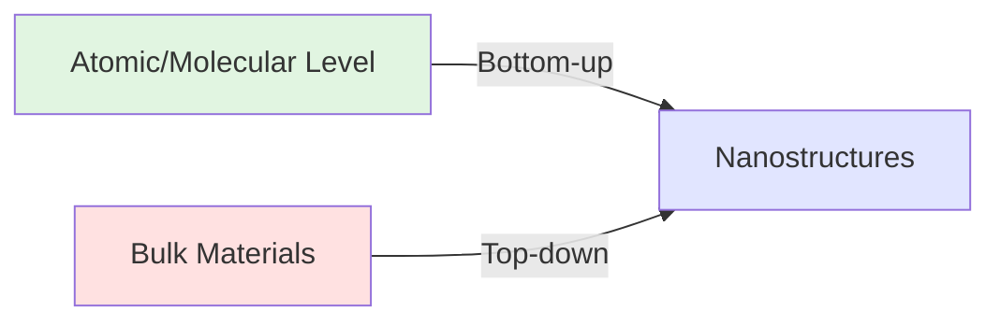

# Chapter 2: Fundamental Principles of Nanomaterials

Synthesis Methods and Characterization Techniques

---

## Learning Objectives

In this chapter, you will learn the fundamental synthesis techniques and characterization methods that form the foundation of nanomaterials research.

- ✅ Understand the differences between bottom-up and top-down approaches and master representative synthesis methods
- ✅ Master the principles and applications of major characterization techniques including TEM, SEM, and XRD
- ✅ Quantitatively understand size-dependent properties such as melting point depression, optical property changes, and superparamagnetism
- ✅ Understand the effects of surface and interface phenomena on nanomaterial properties
- ✅ Acquire methods for interpreting experimental data and criteria for selecting appropriate evaluation techniques
- ✅ Gain practical knowledge of synthesis and evaluation applicable in real research environments

---

## 2.1 Synthesis Methods for Nanomaterials

Nanomaterial synthesis methods are broadly classified into two approaches: **Bottom-up** and **Top-down** methods. These approaches differ fundamentally in the direction of material construction, and each has suitable application areas.

### Bottom-up vs Top-down Methods



| Comparison Item | Bottom-up Method | Top-down Method |
|---------|--------------|--------------|
| **Construction Direction** | Atoms/molecules → nanostructures | Bulk materials → nanostructures |
| **Size Control** | Excellent (atomic level) | Limited (~10 nm) |
| **Shape Control** | Various morphologies possible | Limited |
| **Crystallinity** | Easy to achieve high crystallinity | Prone to defects |
| **Scalability** | Large-scale synthesis possible | Parallelization required |
| **Cost** | Relatively low cost | Expensive equipment |
| **Representative Examples** | CVD, solution synthesis, self-assembly | Lithography, etching |
| **Application Areas** | Catalysis, medicine, energy | Semiconductors, MEMS, sensors |

### Major Bottom-up Synthesis Methods

#### Chemical Vapor Deposition (CVD)

**Principle**

CVD is a technique that forms thin films or nanostructures on substrates by chemically reacting precursors in the gas phase. The typical process proceeds through the following stages:

1. **Gas transport**: Precursor gas is introduced into the reaction chamber
2. **Surface diffusion**: Gas molecules adsorb and diffuse on the substrate surface
3. **Chemical reaction**: Decomposition and reaction occur on catalyst surfaces or under high-temperature conditions
4. **Nucleation and growth**: Nanostructures form and grow
5. **Byproduct removal**: Gases produced by the reaction are exhausted

**Representative Example: Carbon Nanotube (CNT) Synthesis**

CNT synthesis by catalytic CVD uses metal nanoparticles such as iron (Fe), cobalt (Co), and nickel (Ni) as catalysts to decompose hydrocarbon gases (ethylene, methane, acetylene, etc.) at 800-1000°C.

```
C₂H₄ (g) → 2C (CNT) + 2H₂ (g)  [Catalyst: Fe/Co/Ni, 800-1000°C]
```

**Representative Example: Graphene Synthesis**

CVD on copper foil is an established method for synthesizing high-quality single-layer graphene over large areas. Methane gas is decomposed at high temperatures around 1000°C, and single-layer graphene grows through the catalytic action of the copper surface.

**Advantages and Disadvantages**

✅ Advantages:
- High crystallinity and high purity materials can be obtained
- Large-scale production possible through continuous processes
- Structural control possible through growth conditions (temperature, gas flow rate, pressure)
- Direct growth on substrates eliminates complex processes

❌ Disadvantages:
- High-temperature processes (500-1000°C or higher) required
- High equipment costs
- Precursor gases may be toxic or flammable
- Substrate materials limited (high-temperature resistance essential)

#### Solution-phase Synthesis Methods

Solution-phase synthesis produces nanomaterials through chemical reactions in solution and can be performed at relatively low temperatures (room temperature to ~300°C).

**Sol-gel Method**

Metal oxide nanoparticles and porous materials are synthesized using hydrolysis and condensation reactions of metal alkoxides.

```
Si(OC₂H₅)₄ + 4H₂O → Si(OH)₄ + 4C₂H₅OH  (Hydrolysis)
Si(OH)₄ → SiO₂ + 2H₂O                   (Condensation)
```

Applications: SiO₂, TiO₂, ZrO₂ nanoparticles, mesoporous silica

**Hydrothermal Synthesis**

In sealed vessels (autoclaves), aqueous solutions are reacted under high temperature and high pressure (100-300°C, several MPa). Thermodynamically stable crystalline phases can be obtained, and particle size and shape control is easy.

Applications: ZnO, TiO₂, zeolites, metal oxide nanorods

**Co-precipitation**

pH adjusting agents (NaOH, NH₃, etc.) are added to metal salt solutions to precipitate metal hydroxides, which are then calcined to obtain oxide nanoparticles.

```
Fe²⁺ + 2Fe³⁺ + 8OH⁻ → Fe₃O₄ + 4H₂O
```

Applications: Magnetic nanoparticles (Fe₃O₄, γ-Fe₂O₃), spinel-type oxides

**Reduction Synthesis of Metal Nanoparticles**

Metal nanoparticles are synthesized by reducing metal ions with reducing agents in the presence of protective agents (surfactants, polymers).

Representative Example: **Gold Nanoparticle Synthesis by Turkevich Method**

```
HAuCl₄ + C₆H₅O₇Na₃ → Au⁰ (nanoparticles) + oxidation products
```

Sodium citrate acts as both reducing agent and protective agent, yielding spherical gold nanoparticles of 10-50 nm. Size can be controlled by the concentration ratio of gold salt to citrate.

#### Gas-phase Synthesis Methods

**Sputtering**

Physical vapor deposition method where high-energy ions (typically Ar⁺) collide with target material, and ejected atoms are deposited on substrates. Performed in vacuum chambers and widely used for thin film and nanoparticle fabrication.

Features:
- Applicable to almost all materials (metals, oxides, nitrides, alloys)
- Precise control of deposition rate and particle size
- Uniform film thickness distribution
- Established industrial applications (semiconductors, displays, hard coatings)

**Laser Ablation**

Method where high-power pulsed laser irradiates solid targets, and gas-phase growth occurs from plasma generated by instantaneous evaporation.

Features:
- Applicable to high melting point materials and ceramics
- Stoichiometric composition preserved
- Narrow nanoparticle size distribution
- Suitable for small-scale research applications

### Major Top-down Synthesis Methods

#### Mechanical Milling (Ball Milling)

High-speed rotation of hard balls mechanically pulverizes bulk materials to produce nanoparticles.

**Process**

1. Bulk material and hard balls (zirconia, stainless steel, WC, etc.) are placed in a container
2. High-speed rotation (200-600 rpm) imparts impact and friction energy
3. Repeated pulverization reduces particle size (typically several hours to several tens of hours)

**Applications**

- Metal and alloy nanoparticles
- Ceramic nanopowders
- Mechanical alloying
- Drug nanoparticles (improving pharmaceutical solubility)

**Advantages and Disadvantages**

✅ Advantages:
- Simple equipment with low cost
- Easy scale-up
- Applicable to wide range of materials

❌ Disadvantages:
- Broad particle size distribution (lacks uniformity)
- Crystal defects and amorphization occur
- Risk of contamination (wear from balls and container)
- Difficult shape control

#### Lithography

Patterns are formed on substrates using photomasks or beams, and nanostructures are created through etching or lift-off.

**Photolithography**

- Resolution: ~100 nm (5-7 nm with cutting-edge EUV lithography)
- Applications: Semiconductor integrated circuits, MEMS

**Electron Beam Lithography (EBL)**

- Resolution: <10 nm
- Direct writing with electron beam (mask-free)
- Suitable for R&D and prototyping (low throughput)

**Nanoimprint Lithography (NIL)**

- Physical transfer using molds
- Low cost, high throughput
- Biosensor and metamaterial applications

#### Etching

**Dry Etching**

Physical or chemical removal using plasma or ion beams. Anisotropic etching (selective in vertical direction) possible, standard technology for semiconductor processes.

**Wet Etching**

Chemical removal using chemical solutions. Basically isotropic etching, but anisotropic etching utilizing crystallographic orientation dependence is also possible (such as KOH etching of silicon).

---

## 2.2 Characterization Techniques

To accurately evaluate nanomaterial properties, it is essential to combine multiple analytical methods. Here we explain major techniques in morphology observation, structural analysis, compositional analysis, and optical property evaluation.

### Morphology Observation Techniques

#### Transmission Electron Microscopy (TEM)

**Principle**

TEM transmits electron beams accelerated at 100-300 kV through thin specimen samples (thickness <100 nm) and detects transmitted or scattered electrons to form images. Since the electron wavelength is much shorter than visible light (400-700 nm) at approximately 2.5 pm for 200 kV accelerated electrons, atomic-level resolution can be achieved.

**Measurable Parameters**

| Observation Mode | Measured Parameters | Resolution |
|----------|---------|--------|
| **Bright Field (BF)** | Morphology, size, dispersion state | <0.5 nm |
| **Dark Field (DF)** | Crystal grain boundaries, defect observation | <1 nm |
| **High-Resolution TEM (HRTEM)** | Crystal lattice images, atomic arrangement | <0.1 nm |
| **Selected Area Electron Diffraction (SAED)** | Crystal structure, lattice parameters | Angular resolution |
| **Scanning TEM (STEM)** | Elemental mapping (with EELS, EDX) | <0.1 nm |

**Typical Resolution**: 0.2-0.5 nm (point resolution), <0.1 nm (cutting-edge instruments)

**Applications**

1. **Size and shape evaluation of gold nanoparticles**
   - Measure >50 particles to evaluate size distribution as histogram
   - Quantify uniformity with standard deviation (SD) or coefficient of variation (CV = SD/mean × 100%)

2. **Structural analysis of carbon nanotubes**
   - Determine number of layers (single-wall SWCNT, multi-wall MWCNT)
   - Measure diameter and length
   - Evaluate defect density

3. **Crystallinity evaluation of quantum dots**
   - Identify crystal structure from HRTEM lattice images
   - Measure crystallographic plane spacing (e.g., CdSe (111) plane = 0.35 nm)

#### Scanning Electron Microscopy (SEM)

**Principle**

SEM scans a finely focused electron beam (probe diameter 1-10 nm) across the sample surface and detects emitted secondary or backscattered electrons to image surface morphology.

**Differences from TEM**

| Item | TEM | SEM |
|-----|-----|-----|
| **Electron Detection** | Transmitted electrons | Secondary/backscattered electrons |
| **Sample Requirements** | Thin sections (<100 nm) | Bulk samples acceptable |
| **Observation Area** | Small regions (≤ several μm) | Wide range (mm to cm) |
| **Resolution** | <0.5 nm | 1-10 nm |
| **Sample Preparation** | Difficult (thinning required) | Easy (only conductive coating) |
| **Information Depth** | Entire sample thickness | Surface to several μm |
| **Applications** | Internal structure, atomic arrangement | Surface morphology, roughness |

**Applications**

1. **Morphology observation of nanowires and nanorods**
   - Measure length and diameter
   - Calculate aspect ratio (length/diameter)
   - Evaluate orientation

2. **Pore structure of nanoporous materials**
   - Pore size distribution
   - Surface roughness

3. **Dispersion state of nanocomposites**
   - Nanoparticle distribution in matrix
   - Presence of agglomeration

#### Atomic Force Microscopy (AFM)

**Principle**

AFM brings a sharp cantilever probe (tip radius 10-100 nm) close to the sample surface and images surface morphology by detecting probe displacement due to interatomic forces (van der Waals forces, electrostatic forces, etc.) through laser reflection.

**Measurement Modes**

- **Contact Mode**: Probe scans in contact with sample (high resolution but risk of sample damage)
- **Tapping Mode**: Probe intermittently contacts with resonant vibration (suitable for soft samples)
- **Non-contact Mode**: Detects electrostatic forces without contact (ultrahigh resolution)

**Features**

✅ Advantages:
- No vacuum required (measurement in air or liquid)
- Applicable to insulators and conductors
- Quantitative height information (Z-direction resolution <0.1 nm)

❌ Disadvantages:
- Slow scanning speed (several minutes to tens of minutes per image)
- Limited measurement range (typically <100 μm square)
- Image degradation due to probe wear

**Applications**

- Determine graphene layer number (identify interlayer distance 0.34 nm by height measurement)
- Structural observation of DNA and proteins
- Surface roughness evaluation of thin films (calculate Ra, RMS)

### Structural Analysis Techniques

#### X-ray Diffraction (XRD)

**Principle (Bragg's Law)**

Diffraction peaks appear due to X-ray interference at crystal lattice planes. Bragg's law expresses the diffraction condition with the following equation:

$$
n\lambda = 2d\sin\theta
$$

Where:
- $n$: Diffraction order (integer)
- $\lambda$: X-ray wavelength (0.154 nm for Cu Kα)
- $d$: Lattice plane spacing
- $\theta$: Incident angle (Bragg angle)

**Crystal Structure Identification**

Crystal phases are identified by comparing diffraction patterns (2θ vs intensity) with standard databases (ICDD PDF, COD).

Example: Gold nanoparticles (FCC structure)
- (111) plane: 2θ ≈ 38.2°
- (200) plane: 2θ ≈ 44.4°
- (220) plane: 2θ ≈ 64.6°
- (311) plane: 2θ ≈ 77.5°

**Crystallite Size Estimation (Scherrer Equation)**

Nanocrystal particle size can be estimated from the full width at half maximum (FWHM) of diffraction peaks:

$$
D = \frac{K\lambda}{\beta\cos\theta}
$$

Where:
- $D$: Crystallite size (nm)
- $K$: Shape factor (0.9 for spherical particles)
- $\beta$: Physical broadening of FWHM (radians) = measured FWHM - instrumental broadening
- $\theta$: Bragg angle

**Note**: The Scherrer equation gives crystallite size (coherent scattering region), which may differ from particle size (such as polycrystalline structures where one particle consists of multiple crystallites).

**Application Example**

```
XRD measurement results for gold nanoparticles:
(111) peak: 2θ = 38.2°, FWHM = 0.8° = 0.0140 rad

Crystallite size calculation:
D = (0.9 × 0.154 nm) / (0.0140 × cos(19.1°))
  = 0.1386 / 0.0132
  ≈ 10.5 nm
```

#### Raman Spectroscopy

**Principle**

When laser light irradiates a sample, scattered light with energy changed by molecular vibration (Raman scattered light) is generated. By measuring this energy shift (Raman shift, unit: cm⁻¹), molecular vibrational modes and crystal structures can be identified.

**Evaluation of Graphene and CNTs**

For carbon-based nanomaterials, the following characteristic peaks are observed:

| Peak | Wavenumber (cm⁻¹) | Origin | Meaning |
|-------|------------|------|-----|
| **D band** | ~1350 | Defects/disorder | Indicator of structural defects |
| **G band** | ~1580 | sp² carbon stretching vibration | Indicator of crystallinity |
| **2D band** | ~2700 | Second-order overtone of D band | Indicator of layer number |

**Defect Density Evaluation**

The D/G intensity ratio ($I_D/I_G$) increases with higher defect density.

- Perfect graphene: $I_D/I_G \approx 0$
- High-quality CVD graphene: $I_D/I_G < 0.1$
- Defective graphene: $I_D/I_G > 0.5$

**Single-layer Graphene Identification**

Layer number can be distinguished by 2D band shape:
- **Single-layer**: 2D band is a single sharp peak, $I_{2D}/I_G > 2$
- **Bilayer**: 2D band separates into four Lorentzian functions
- **Multilayer**: 2D band broadens, $I_{2D}/I_G < 1$

### Compositional Analysis Techniques

#### X-ray Photoelectron Spectroscopy (XPS)

**Principle**

X-rays irradiate the sample, and the kinetic energy of photoelectrons emitted by the photoelectric effect is measured. The binding energy ($E_B$) of photoelectrons is determined by the following equation:

$$
E_B = h\nu - E_K - \phi
$$

Where $h\nu$ is X-ray energy, $E_K$ is photoelectron kinetic energy, and $\phi$ is work function.

**Surface Chemical Composition**

Since XPS provides information from several nm (approximately 5-10 nm) of the surface, it is suitable for surface chemical composition analysis. Atomic % of detected elements can be quantified.

**Chemical State Analysis**

Since binding energy changes with chemical bonding state for the same element (**chemical shift**), oxidation states and bonding forms can be identified.

Example: Surface modification evaluation of gold nanoparticles
- Au 4f₇/₂ peak (Au⁰): 84.0 eV
- Au-S thiol bond Au: 84.4 eV (0.4 eV shift)
- S 2p peak: 162 eV (thiol bond)

#### Energy Dispersive X-ray Spectroscopy (EDX/EDS)

**Principle**

Characteristic X-rays emitted from samples by electron beam irradiation are measured for energy to identify elements. Since each element has unique X-ray energies, qualitative and quantitative analysis is possible.

**Elemental Mapping**

In SEM/TEM-EDX, two-dimensional maps of elemental distribution can be obtained by detecting X-rays while scanning the electron beam.

**Applications**

- Quantify composition ratio of alloy nanoparticles (Au-Ag, Pt-Pd)
- Confirm core-shell nanoparticle structure (e.g., visualize Fe, Si, O distribution in Fe₃O₄@SiO₂ by elemental mapping)
- Elemental dispersion in nanocomposites

**Note**: Detection sensitivity for light elements (H, He, Li, Be, B, C, N, O) is low, and quantification accuracy also decreases.

### Optical Property Evaluation

#### UV-Vis Absorption Spectroscopy

**Principle**

Ultraviolet-visible light (wavelength 200-800 nm) is irradiated on the sample, and the intensity of transmitted or reflected light is measured. Absorbance ($A$) follows the Lambert-Beer law:

$$
A = \varepsilon c l
$$

Where $\varepsilon$ is molar extinction coefficient, $c$ is concentration, and $l$ is path length.

**Light Absorption Properties**

Electronic states and optical band gaps can be evaluated from absorption spectra of nanomaterials.

**Observation of Plasmon Resonance**

Metal nanoparticles exhibit characteristic absorption peaks due to collective oscillation of free electrons (**Localized Surface Plasmon Resonance, LSPR**).

Example: Gold nanoparticles
- Particle size 10-50 nm (spherical): λmax ≈ 520 nm (red-purple)
- Increasing particle size → red shift
- Shape change (rod, star) → multiple peaks

**Band Gap Estimation (Tauc plot)**

The band gap ($E_g$) of semiconductor nanoparticles is determined from the absorption edge using a Tauc plot:

$$
(\alpha h\nu)^{1/n} = B(h\nu - E_g)
$$

Where $\alpha$ is absorption coefficient, $h\nu$ is photon energy, $n$ is transition type (2 for direct transition, 1/2 for indirect transition), and $B$ is a constant.

Plot $(αh\nu)^2$ vs $h\nu$ (for direct transitions) or $(αh\nu)^{1/2}$ vs $h\nu$ (for indirect transitions), and extrapolate the linear portion to read $E_g$ from the intersection with the horizontal axis.

**Application Example**: CdSe quantum dots
- Bulk CdSe band gap: $E_g$ = 1.74 eV (λ ≈ 710 nm)
- Quantum dots (diameter 3 nm): $E_g$ = 2.4 eV (λ ≈ 520 nm) → blue shift due to quantum confinement effect

#### Fluorescence Spectroscopy

**Principle**

Excitation light irradiates the sample, and the wavelength and intensity of fluorescence emitted from fluorescent materials are measured. Fluorescence with longer wavelength than excitation light is observed (**Stokes shift**).

**Emission Properties of Quantum Dots**

Semiconductor quantum dots (CdSe, CdTe, InP, PbS, carbon dots, etc.) exhibit size-dependent emission colors.

**Size-Emission Color Relationship (CdSe Quantum Dots)**

| Particle Size (nm) | Band Gap (eV) | Emission Wavelength (nm) | Emission Color |
|----------|-------------------|-------------|-------|
| 2.0 | 2.7 | ~460 | Blue |
| 3.0 | 2.4 | ~520 | Green |
| 4.0 | 2.1 | ~590 | Yellow-orange |
| 5.0 | 1.9 | ~650 | Red |

**Quantum Yield (QY)**

An indicator representing emission efficiency of fluorophores, defined as the ratio of emitted photons to absorbed photons:

$$
QY = \frac{\text{Number of emitted photons}}{\text{Number of absorbed photons}} \times 100\%
$$

High-quality quantum dots: QY = 50-90%

**Applications**: Bioimaging, displays (QLED), solar cells

---

## 2.3 Size-dependent Properties

At the nanoscale, unique properties not seen in bulk materials emerge. These arise from increased surface area-to-volume ratio, quantum size effects, and contributions of surface energy.

### Melting Point Depression

**Gibbs-Thomson Effect**

The melting point of nanoparticles ($T_m(r)$) decreases with decreasing particle radius ($r$). This is described by the Gibbs-Thomson equation:

$$
T_m(r) = T_m(\infty) \left(1 - \frac{4\sigma_{sl}}{\rho \Delta H_f r}\right)
$$

Where:
- $T_m(\infty)$: Bulk melting point (K)
- $\sigma_{sl}$: Solid-liquid interface energy (J/m²)
- $\rho$: Density (kg/m³)
- $\Delta H_f$: Enthalpy of fusion (J/kg)
- $r$: Particle radius (m)

**Physical Interpretation**

In nanoparticles, the proportion of surface atoms increases, and the contribution of surface energy becomes significant. Surface atoms have weaker bonding than interior atoms, making them thermally unstable and lowering the melting point.

**Gold Nanoparticle Example**

Bulk melting point of gold (Au): $T_m(\infty)$ = 1337 K (1064°C)

Parameters:
- $\sigma_{sl}$ = 0.132 J/m²
- $\rho$ = 19300 kg/m³
- $\Delta H_f$ = 6.3 × 10⁴ J/kg

Relationship between particle size and melting point:

| Particle Size (nm) | Melting Point (K) | Melting Point (°C) | Melting Point Depression (K) |
|----------|---------|---------|------------|
| 100 | 1327 | 1054 | 10 |
| 50 | 1317 | 1044 | 20 |
| 20 | 1287 | 1014 | 50 |
| 10 | 1237 | 964 | 100 |
| 5 | 1137 | 864 | 200 |
| 2 | 870 | 597 | 467 |

**Experimental Data**

Actual measurements confirm by differential scanning calorimetry (DSC) that the melting point of 2-5 nm gold nanoparticles decreases to 600-900°C.

### Changes in Optical Properties

#### Localized Surface Plasmon Resonance (LSPR) in Metal Nanoparticles

**Principle**

When light is incident on metal nanoparticles, free electrons oscillate collectively, causing a resonance phenomenon (**plasmon resonance**). At this resonance frequency, light absorption is maximized, and a strong absorption band appears.

The plasmon resonance frequency ($\omega_p$) of spherical metal nanoparticles is approximated by the Drude-Sommerfeld model:

$$
\omega_p = \sqrt{\frac{ne^2}{m^* \varepsilon_0}}
$$

Where $n$ is electron density, $e$ is elementary charge, $m^*$ is effective mass, and $\varepsilon_0$ is vacuum permittivity.

**Size Dependence**

LSPR peak wavelength of gold nanoparticles (spherical):

| Particle Size (nm) | LSPR Wavelength (nm) | Color |
|----------|--------------|---|
| 10 | 517 | Red-purple |
| 20 | 520 | Red-purple |
| 40 | 525 | Red |
| 60 | 535 | Red-orange |
| 80 | 550 | Orange |
| 100 | 570 | Yellow-orange |

As particle size increases, increased damping causes a shift to longer wavelengths (**red shift**).

**Shape Dependence**

Non-spherical particles exhibit multiple plasmon resonance modes due to anisotropy.

Example: Gold nanorods
- **Transverse mode**: Short axis direction, ~520 nm
- **Longitudinal mode**: Long axis direction, 600-1200 nm (varies with aspect ratio)

As aspect ratio (length/diameter) increases, the longitudinal mode shifts to longer wavelengths and can be tuned to the near-infrared region.

**Applications**

- Biosensing (detecting wavelength shift from antibody-antigen binding)
- Photothermal therapy (PTT): Near-infrared light absorption → heat generation → cancer cell destruction
- Surface-enhanced Raman scattering (SERS): 10⁶-10⁸ fold signal enhancement from plasmon enhancement effect

#### Band Gap Changes in Semiconductor Quantum Dots

**Quantum Confinement Effect**

When semiconductor nanoparticle size becomes smaller than the exciton Bohr radius ($a_B$), the motion of electrons and holes is spatially confined, and energy levels become discrete. As a result, the band gap expands, and absorption/emission wavelengths blue shift.

**Brus Equation (Effective Mass Approximation Model)**

The band gap of quantum dots ($E_g(r)$) is described by the following equation:

$$
E_g(r) = E_g(\infty) + \frac{\hbar^2 \pi^2}{2r^2} \left(\frac{1}{m_e^*} + \frac{1}{m_h^*}\right) - \frac{1.8e^2}{4\pi\varepsilon\varepsilon_0 r}
$$

Where:
- $E_g(\infty)$: Bulk band gap
- $\hbar$: Planck constant/2π
- $r$: Quantum dot radius
- $m_e^*, m_h^*$: Effective mass of electron and hole
- $\varepsilon$: Relative permittivity

Second term (positive): Energy increase from quantum confinement (main term)
Third term (negative): Energy decrease from Coulomb interaction (correction term)

**Size-Emission Color Relationship (CdSe Quantum Dots)**

CdSe property values:
- $E_g(\infty)$ = 1.74 eV
- $m_e^*$ = 0.13 $m_0$
- $m_h^*$ = 0.45 $m_0$
- $\varepsilon$ = 10.2
- Exciton Bohr radius: $a_B$ = 5.6 nm

Calculation examples of particle size and band gap:

| Particle Size (nm) | Band Gap (eV) | Emission Wavelength (nm) | Color |
|----------|-------------------|-------------|---|
| 2.0 | 2.70 | 459 | Blue |
| 3.0 | 2.40 | 517 | Green |
| 4.0 | 2.15 | 577 | Yellow |
| 5.0 | 1.98 | 626 | Orange |
| 6.0 | 1.86 | 667 | Red |

**Applications**

- Bioimaging: Near-infrared emitting quantum dots with high tissue penetration (700-900 nm)
- Displays: Create RGB primary colors by size tuning (QLED TV)
- Solar cells: Absorb broad wavelength range with multiple-sized quantum dots

### Changes in Magnetic Properties

#### Superparamagnetism

**Principle**

When ferromagnetic nanoparticles become smaller than a critical size, thermal energy ($k_B T$) exceeds magnetic anisotropy energy ($KV$), and the magnetization direction frequently reverses. This state is called **superparamagnetism**.

**Critical Size**

The critical particle diameter ($d_c$) for superparamagnetism emergence is determined by the following condition:

$$
KV \approx 25 k_B T
$$

Where:
- $K$: Magnetic anisotropy constant (J/m³)
- $V = \frac{\pi d^3}{6}$: Particle volume
- $k_B$: Boltzmann constant (1.38 × 10⁻²³ J/K)
- $T$: Temperature (K)

**Magnetite (Fe₃O₄) Example**

- $K$ = 1.1 × 10⁴ J/m³
- Critical particle diameter at room temperature ($T$ = 300 K):

$$
d_c \approx \left(\frac{150 k_B T}{\pi K}\right)^{1/3} \approx 15 \text{ nm}
$$

**Characteristics of Superparamagnetism**

✅ Advantages:
- Magnetization becomes zero when magnetic field is turned off (no remanence)
- Less prone to agglomeration (no magnetic attraction)
- Easy redispersion

❌ Disadvantages:
- Zero coercivity (unsuitable for magnetic recording)

**Medical Application: MRI Contrast Agent**

Superparamagnetic iron oxide nanoparticles (SPION) are used as T₂ contrast agents for MRI.

Example: Feridex® (iron oxide nanoparticles, particle size 4-6 nm)
- Improved biocompatibility with dextran coating
- Detection of lesions in liver and spleen

Other applications:
- Magnetic hyperthermia (cancer treatment): Heat generation in alternating magnetic field
- Drug delivery: Guided to target site by magnetic field

### Mechanical Properties

#### Size Strengthening Effect (Hall-Petch Relationship)

**Hall-Petch Relationship**

The yield stress ($\sigma_y$) of polycrystalline materials increases with decreasing grain size ($d$):

$$
\sigma_y = \sigma_0 + \frac{k}{\sqrt{d}}
$$

Where $\sigma_0$ is friction stress and $k$ is a material constant.

**Physical Interpretation**

As grain size decreases, grain boundary density increases, and dislocation movement is inhibited at grain boundaries, causing material hardening.

**Inverse Hall-Petch Effect (< 10 nm)**

When grain size becomes less than 10 nm, grain boundary sliding becomes dominant, and conversely softening occurs. This phenomenon is called the **inverse Hall-Petch effect**.

**Application Examples**

- Nanocrystalline metals: Grain size 10-100 nm, 2-5 times the strength of bulk
- Superhard tool materials: WC-Co nanocomposites

---

## 2.4 Surface and Interface Effects

In nanoparticles, the surface area-to-volume ratio ($S/V$) increases dramatically. For spherical particles:

$$
\frac{S}{V} = \frac{4\pi r^2}{\frac{4}{3}\pi r^3} = \frac{3}{r}
$$

When particle size becomes 1/10, the surface area-to-volume ratio increases 10 times.

**Proportion of Surface Atoms**

| Particle Size (nm) | Total Atoms | Surface Atoms | Surface Atom Percentage (%) |
|----------|---------|-----------|--------------|
| 100 | 3 × 10⁷ | 1 × 10⁵ | 0.3 |
| 10 | 3 × 10⁴ | 1 × 10³ | 3 |
| 3 | 900 | 300 | 33 |
| 1 | 30 | 20 | 67 |

At particle size 3 nm, approximately one-third of atoms exist on the surface, and the contribution of surface energy cannot be ignored.

### Surface Energy and Surface Tension

**Surface Energy**

Energy required to create a surface, expressed as energy per unit area (J/m²) or force per unit length (N/m).

Representative surface energy values (room temperature):

| Material | Surface Energy (J/m²) |
|-----|-------------------|
| Water | 0.072 |
| Gold | 1.50 |
| Silver | 1.25 |
| Platinum | 2.49 |
| Aluminum oxide (Al₂O₃) | 0.90 |

Since metals have high surface energy, they become prone to agglomeration upon nanoparticle formation.

### Surface Functionalization

Surface modification is an important technique for controlling nanoparticle dispersibility, stability, and functionality.

#### Modification with Organic Molecules

**Thiol Compounds (Gold Nanoparticles)**

Thiol groups (-SH) form strong Au-S bonds (bonding energy ~200 kJ/mol) with gold surfaces.

Representative examples:
- Alkanethiol (HS-(CH₂)ₙ-CH₃): Imparts hydrophobicity
- Mercaptoundecanoic acid (HS-(CH₂)₁₀-COOH): Imparts hydrophilicity, bioconjugation
- Thiolated DNA/peptides: Biosensing applications

**Silane Coupling Agents (Oxide Nanoparticles)**

Silane coupling agents (R-Si(OR')₃) react with hydroxyl groups (-OH) on oxide surfaces to form covalent bonds.

Representative examples:
- APTES (3-aminopropyltriethoxysilane): Amino group introduction
- MPTMS (3-mercaptopropyltrimethoxysilane): Thiol group introduction
- GPTMS (3-glycidyloxypropyltrimethoxysilane): Epoxy group introduction

Applications: Surface modification of TiO₂, SiO₂, Fe₃O₄ nanoparticles

#### Polymer Coating

**PEG Modification (Polyethylene Glycol)**

PEG modification is a standard method for improving biocompatibility and extending blood circulation time.

Effects:
- Suppression of protein adsorption (stealth effect)
- Avoidance of recognition by immune system
- Delayed excretion from kidneys

Applications: Drug delivery systems (DDS), in vivo imaging

**Surfactants**

Amphiphilic molecules (with hydrophilic head and hydrophobic tail) enable stable dispersion of nanoparticles in water.

Representative examples:
- Citrate (reducing agent and protective agent in gold nanoparticle synthesis)
- CTAB (cetyltrimethylammonium bromide): Gold nanorod synthesis
- Triton X-100, Tween 20: Nonionic surfactants

#### Purposes of Surface Modification

1. **Improving Dispersibility**
   - Electrostatic repulsion (introducing charged groups: -COO⁻, -NH₃⁺)
   - Steric repulsion (osmotic pressure of polymer chains)

2. **Preventing Agglomeration**
   - DLVO theory: Electrostatic repulsion vs van der Waals attraction
   - Increase repulsive force through modification

3. **Imparting Functionality**
   - Bioconjugation: Antibody, DNA, peptide immobilization
   - Targeting: Folic acid, RGD peptide
   - Stimuli-responsiveness: pH-responsive, temperature-responsive

---

## Summary

In this chapter, we have learned the fundamental synthesis techniques, characterization methods, and size-dependent properties that form the foundation of nanomaterials research.

1. **Bottom-up and top-down methods** differ in construction direction, and various techniques such as CVD, solution synthesis, and lithography are used according to applications

2. For **characterization**, it is important to comprehensively evaluate using multiple analytical methods such as TEM (morphology and internal structure), XRD (crystal structure), and UV-Vis (optical properties)

3. **Size-dependent properties** such as melting point depression (Gibbs-Thomson effect), LSPR, quantum confinement effect, and superparamagnetism emerge as nanoscale-specific phenomena

4. **Surface and interface effects** dominate nanoparticle stability and functionality, and appropriate surface modification can control dispersibility, biocompatibility, and targeting

5. **Quantitative understanding** is important, and properties can be predicted and evaluated using equations such as Scherrer equation, Brus equation, and Hall-Petch relationship

### Preview of Next Chapter

In the next chapter (Chapter 3), you will learn practical analysis methods for nanomaterial data using Python. Specifically, the following themes will be covered:

- Statistical analysis of nanoparticle size distribution and histogram creation
- Crystallite size estimation from XRD data using Scherrer equation
- UV-Vis spectral analysis and plasmon resonance peak detection
- Visualization of size-band gap relationship in quantum dots
- Introduction to machine learning for nanomaterial property prediction

Let's master the basics of data-driven nanomaterials research using actual experimental data and Python code.

---

## Exercises

### Problem 1: Selection of Synthesis Methods

Select the optimal nanomaterial synthesis method for the following purposes and explain the reasons.

**(a)** Synthesize 100 mg of monodisperse gold nanoparticles with particle size 5 nm
**(b)** Form alignment-controlled nanodot patterns (pitch 100 nm) on semiconductor substrates
**(c)** Large-scale production (1 kg or more) of 10 nm magnetic nanoparticles (Fe₃O₄) at low cost
**(d)** Synthesize single-layer graphene on copper foil over large area (10 cm square)

### Problem 2: XRD Analysis

In XRD measurement of gold nanoparticles, the (111) plane diffraction peak was observed at 2θ = 38.2° with FWHM = 1.2°. Estimate the crystallite size using the Scherrer equation.

**Given Information:**
- Cu Kα radiation: λ = 0.154 nm
- Shape factor: K = 0.9
- Bragg angle for (111) plane: θ = 19.1°
- Instrumental physical broadening: 0.1° (included in FWHM)

**Calculation Steps:**
1. Calculate physical broadening (β)
2. Convert β to radians
3. Substitute into Scherrer equation to calculate crystallite size

### Problem 3: Size-dependent Properties

For CdSe quantum dots (particle size 4.0 nm), answer the following questions.

**(a)** Using only the second term (quantum confinement term) of Brus equation, calculate the band gap increase from bulk (ΔEg).
**(b)** Estimate the emission wavelength of this quantum dot.
**(c)** If the particle size is changed to 3.0 nm, how does the emission wavelength change?

**Given Information:**
- Bulk band gap of CdSe: Eg(∞) = 1.74 eV
- Electron effective mass: me* = 0.13 m₀
- Hole effective mass: mh* = 0.45 m₀
- Planck constant: ℏ = 1.055 × 10⁻³⁴ J·s
- Electron mass: m₀ = 9.109 × 10⁻³¹ kg
- Elementary charge: e = 1.602 × 10⁻¹⁹ C

<details>
<summary>Solution Examples</summary>

### Solution to Problem 1

**(a) Solution-phase reduction synthesis (Turkevich method or Brust-Schiffrin method)**

**Reasons:**
- Easy size control (adjusted by reducing agent concentration and reaction temperature)
- High monodispersity (CV < 10%)
- Suitable for scale of approximately 100 mg
- Mild conditions around room temperature to 100°C
- Long-term stability ensured by protective agents (citrate, thiols, etc.)

**(b) Electron beam lithography (EBL) + etching**

**Reasons:**
- Precise patterning with 100 nm pitch possible
- Maskless direct writing accommodates arbitrary shapes
- Direct formation on substrates
- Compatibility with semiconductor processes

Alternative: Nanoimprint lithography (for mass production)

**(c) Co-precipitation method**

**Reasons:**
- Compatible with large-scale production of 1 kg or more
- Low equipment cost (no autoclave required)
- Reaction conditions of room temperature to 100°C
- Established method for Fe₃O₄ synthesis (co-precipitation of Fe²⁺ + Fe³⁺)
- Size control around 10 nm possible

Method: FeCl₂ + 2FeCl₃ + 8NaOH → Fe₃O₄ + 8NaCl + 4H₂O

**(d) Chemical vapor deposition (CVD)**

**Reasons:**
- Standard method for large-area synthesis of single-layer graphene
- Single layer guaranteed by growth on copper foil
- Compatible with scales of 10 cm square or larger
- Transferable to arbitrary substrates

Conditions: Methane gas, 1000°C, low-pressure CVD

---

### Solution to Problem 2

**Step 1: Physical Broadening Calculation**

Measured FWHM = 1.2°
Instrumental broadening = 0.1°

Physical broadening (β):
$$
\beta = \sqrt{(1.2)^2 - (0.1)^2} = \sqrt{1.44 - 0.01} = \sqrt{1.43} \approx 1.196°
$$

**Step 2: Radian Conversion**

$$
\beta_{\text{rad}} = 1.196° \times \frac{\pi}{180°} = 0.02087 \text{ rad}
$$

**Step 3: Crystallite Size Calculation by Scherrer Equation**

$$
D = \frac{K\lambda}{\beta \cos\theta}
$$

$$
D = \frac{0.9 \times 0.154 \text{ nm}}{0.02087 \times \cos(19.1°)}
$$

$$
\cos(19.1°) = 0.9455
$$

$$
D = \frac{0.1386}{0.02087 \times 0.9455} = \frac{0.1386}{0.01973} \approx 7.02 \text{ nm}
$$

**Conclusion: Crystallite size is approximately 7 nm.**

**Notes:**
- This is crystallite size (coherent scattering region) and may differ from particle size
- Verification by combining with TEM observation is recommended
- More accurate results obtained by analyzing multiple peaks ((200), (220), etc.) and averaging

---

### Solution to Problem 3

**(a) Band Gap Increase Calculation**

Quantum confinement term of Brus equation:

$$
\Delta E_g = \frac{\hbar^2 \pi^2}{2r^2} \left(\frac{1}{m_e^*} + \frac{1}{m_h^*}\right)
$$

Particle size d = 4.0 nm → radius r = 2.0 nm = 2.0 × 10⁻⁹ m

$$
\frac{1}{m_e^*} + \frac{1}{m_h^*} = \frac{1}{0.13 m_0} + \frac{1}{0.45 m_0} = \frac{1}{m_0}\left(\frac{1}{0.13} + \frac{1}{0.45}\right)
$$

$$
= \frac{1}{9.109 \times 10^{-31}} \times (7.692 + 2.222) = \frac{9.914}{9.109 \times 10^{-31}} = 1.088 \times 10^{31} \text{ kg}^{-1}
$$

$$
\Delta E_g = \frac{(1.055 \times 10^{-34})^2 \times \pi^2}{2 \times (2.0 \times 10^{-9})^2} \times 1.088 \times 10^{31}
$$

$$
= \frac{1.113 \times 10^{-68} \times 9.870}{8 \times 10^{-18}} \times 1.088 \times 10^{31}
$$

$$
= \frac{1.098 \times 10^{-67}}{8 \times 10^{-18}} \times 1.088 \times 10^{31} = 1.373 \times 10^{-50} \times 1.088 \times 10^{31}
$$

$$
= 1.494 \times 10^{-19} \text{ J}
$$

eV conversion:

$$
\Delta E_g = \frac{1.494 \times 10^{-19}}{1.602 \times 10^{-19}} \approx 0.93 \text{ eV}
$$

**(b) Emission Wavelength Estimation**

Bulk band gap: Eg(∞) = 1.74 eV

Quantum dot band gap (ignoring third term):

$$
E_g(r) = 1.74 + 0.93 = 2.67 \text{ eV}
$$

Emission wavelength:

$$
\lambda = \frac{hc}{E_g} = \frac{1240 \text{ eV·nm}}{2.67 \text{ eV}} \approx 464 \text{ nm}
$$

**Conclusion: Emission wavelength is approximately 464 nm (blue emission).**

**(c) Change at Particle Size 3.0 nm**

Radius r = 1.5 nm = 1.5 × 10⁻⁹ m

Since quantum confinement term is proportional to r⁻²:

$$
\Delta E_g(3.0 \text{ nm}) = \Delta E_g(4.0 \text{ nm}) \times \left(\frac{4.0}{3.0}\right)^2 = 0.93 \times (1.333)^2 = 0.93 \times 1.778 \approx 1.65 \text{ eV}
$$

$$
E_g(3.0 \text{ nm}) = 1.74 + 1.65 = 3.39 \text{ eV}
$$

$$
\lambda = \frac{1240}{3.39} \approx 366 \text{ nm}
$$

**Conclusion: At particle size 3.0 nm, emission wavelength blue shifts to approximately 366 nm (ultraviolet region).**

**Wavelength change: 464 nm → 366 nm (approximately 100 nm shift to shorter wavelength)**

**Physical Interpretation:**
- Quantum confinement effect strengthens with decreasing particle size
- Band gap expands, emitting shorter wavelength (higher energy) light
- This principle enables emission color control by size tuning alone using the same material

</details>

---

## References

1. **Cao, G. & Wang, Y.** (2011). *Nanostructures and Nanomaterials: Synthesis, Properties, and Applications* (2nd ed.). World Scientific. [DOI: 10.1142/7885](https://doi.org/10.1142/7885)

2. **Buffat, P. & Borel, J.-P.** (1976). Size effect on the melting temperature of gold particles. *Physical Review A*, 13(6), 2287-2298. [DOI: 10.1103/PhysRevA.13.2287](https://doi.org/10.1103/PhysRevA.13.2287)

3. **Brus, L. E.** (1984). Electron–electron and electron‐hole interactions in small semiconductor crystallites: The size dependence of the lowest excited electronic state. *The Journal of Chemical Physics*, 80(9), 4403-4409. [DOI: 10.1063/1.447218](https://doi.org/10.1063/1.447218)

4. **Link, S. & El-Sayed, M. A.** (1999). Size and Temperature Dependence of the Plasmon Absorption of Colloidal Gold Nanoparticles. *The Journal of Physical Chemistry B*, 103(21), 4212-4217. [DOI: 10.1021/jp984796o](https://doi.org/10.1021/jp984796o)

5. **Gupta, A. K. & Gupta, M.** (2005). Synthesis and surface engineering of iron oxide nanoparticles for biomedical applications. *Biomaterials*, 26(18), 3995-4021. [DOI: 10.1016/j.biomaterials.2004.10.012](https://doi.org/10.1016/j.biomaterials.2004.10.012)

6. **Ferrari, A. C. & Basko, D. M.** (2013). Raman spectroscopy as a versatile tool for studying the properties of graphene. *Nature Nanotechnology*, 8(4), 235-246. [DOI: 10.1038/nnano.2013.46](https://doi.org/10.1038/nnano.2013.46)

---

[← Previous Chapter: Introduction to Nanomaterials](chapter1-introduction.html) | [Next Chapter: Python Hands-on Tutorial →](chapter3-hands-on.html)
