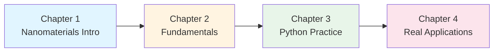

# Nanomaterials Introduction Series

Learning Nanomaterial Science with Python Practice

---

## About This Series

This series is educational content for systematic learning from nanomaterial fundamentals to practical data analysis and materials design. Using representative nanomaterials such as carbon nanotubes, graphene, quantum dots, and metal nanoparticles, you will master property prediction and materials design methods through machine learning and data-driven approaches.

### Target Audience

- Undergraduate/Graduate students (Engineering, Materials Science, Chemistry, Physics)
- Nanomaterials research beginners
- Researchers and engineers who want to apply machine learning to materials development
- Those considering careers in nanotechnology

### Learning Objectives

Upon completing this series, you will acquire the following skills:

✅ Understanding of nanomaterial fundamentals and size effects
✅ Knowledge of nanoparticle synthesis and characterization techniques
✅ Nanomaterial data analysis and visualization with Python
✅ Nanomaterial property prediction using machine learning
✅ Practical nanomaterial design with Bayesian optimization
✅ Problem-solving skills through real-world application cases

### Prerequisites

- **Required**: High school mathematics (statistics, calculus), Python basics
- **Recommended**: University-level (1-2 years) physics and chemistry, linear algebra, basic machine learning concepts

---

## Series Structure

### 📘 Chapter 1: Introduction to Nanomaterials

**Reading Time**: 20-25 minutes | **Level**: Beginner

Learn about nanomaterial definitions, size effects, quantum effects, and classification (0D to 3D nanomaterials). Understand the characteristics and application areas of representative nanomaterials such as carbon nanotubes, graphene, quantum dots, and metal nanoparticles.

**Learning Content**:
- Nanoscale definition and size effects
- Quantum effects and quantum confinement
- Dimensional classification of nanomaterials
- Application areas (energy, electronics, medicine, environment)

[👉 Read Chapter 1](chapter1-introduction.html)

---

### 📗 Chapter 2: Fundamental Principles of Nanomaterials

**Reading Time**: 25-30 minutes | **Level**: Beginner to Intermediate

Learn about nanomaterial synthesis methods, characterization techniques, size-dependent properties, and surface/interface effects. Understand measurement techniques such as TEM, SEM, XRD, UV-Vis, and mechanisms of nanomaterial-specific property manifestation.

**Learning Content**:
- Bottom-up and top-down synthesis methods
- Characterization techniques (TEM, SEM, XRD, UV-Vis, Raman)
- Size-dependent properties (melting point depression, optical properties, magnetic properties)
- Surface area/volume ratio and surface energy

[👉 Read Chapter 2](chapter2-fundamentals.html)

---

### 💻 Chapter 3: Python Practical Tutorial

**Reading Time**: 30-40 minutes | **Level**: Intermediate

Practice nanomaterial data analysis and visualization with Python, property prediction using machine learning, and materials design with Bayesian optimization. Through **30-35 executable code examples**, acquire techniques usable in actual nanomaterial research.

**Learning Content**:
- Nanoparticle size distribution analysis and visualization
- Optical property prediction (plasmon resonance, quantum dot emission)
- Property prediction with 5 regression models
- Nanomaterial design with Bayesian optimization
- Molecular dynamics (MD) data analysis
- Prediction interpretation with SHAP analysis

**Libraries Used**:
```python
pandas, numpy, matplotlib, seaborn, scikit-learn,
lightgbm, scipy, scikit-optimize, shap
```

[👉 Read Chapter 3](chapter3-hands-on.html)

---

### 🏭 Chapter 4: Real-World Applications and Career

**Reading Time**: 20-25 minutes | **Level**: Intermediate

Learn through 5 case studies of actual nanomaterial research success stories. Understand problem-solving workflows through commercialization cases of carbon nanotube composites, quantum dots, gold nanoparticle catalysts, graphene, and nanomedicine.

**Case Studies**:
1. **Mechanical Property Optimization of Carbon Nanotube (CNT) Composites**
2. **Emission Wavelength Control of Quantum Dots**
3. **Activity Prediction of Gold Nanoparticle Catalysts**
4. **Electrical Property Control of Graphene**
5. **Nanomedicine (Drug Delivery) Design**

**Career Information**:
- Academia vs Industry
- Job types and salaries in nanomaterials field
- Required skill sets

[👉 Read Chapter 4](chapter4-real-world.html)

---

## How to Learn

### Recommended Learning Path



### Learning Methods

1. **Chapter 1-2 (Fundamentals)**: First, understand concepts thoroughly
   - Basic principles and size effects of nanomaterials
   - Synthesis and characterization techniques

2. **Chapter 3 (Practice)**: Learn by doing
   - Execute all code examples yourself
   - Observe behavior by changing parameters
   - Work on exercise problems

3. **Chapter 4 (Applications)**: Consider application to real problems
   - Replace case studies with your own research
   - Concretize career plans

### Environment Setup

For Chapter 3 practice, the following environment is needed:

**Recommended Environment**:
- Python 3.8 or higher
- Jupyter Notebook or Google Colab
- Main libraries: `pandas`, `scikit-learn`, `lightgbm`, `scipy`, `scikit-optimize`

**Installation methods** are explained in detail in Chapter 3.

---

## Series Features

### 🎯 Practice-Oriented

Acquire techniques usable in actual nanomaterial research through 30-35 executable Python code examples.

### 📊 Data-Driven Approach

Learn latest methods of nanomaterial design using machine learning and Bayesian optimization.

### 🔬 Real Application Cases

Understand actual R&D project workflows through 5 detailed case studies.

### 🌐 Learn in English with Japanese Support

Technical terms include Japanese, building foundation for reading international literature.

---

## Related Series

This site also offers the following series:

- **[Materials Informatics Introduction](../mi-introduction/)** - AI/ML application to materials science in general
- **[Process Informatics Introduction](../pi-introduction/)** - Chemical process optimization and digital twins

---

## References and Resources

### Key Textbooks

1. **Cao, G. & Wang, Y.** (2011). *Nanostructures and Nanomaterials: Synthesis, Properties, and Applications* (2nd ed.). World Scientific. [DOI: 10.1142/7885](https://doi.org/10.1142/7885)

2. **Pokropivny, V. V. & Skorokhod, V. V.** (2007). Classification of nanostructures by dimensionality and concept of surface forms engineering in nanomaterial science. *Materials Science and Engineering: C*, 27(5-8), 990-993. [DOI: 10.1016/j.msec.2006.09.023](https://doi.org/10.1016/j.msec.2006.09.023)

3. **Roduner, E.** (2006). Size matters: why nanomaterials are different. *Chemical Society Reviews*, 35(7), 583-592. [DOI: 10.1039/B502142C](https://doi.org/10.1039/B502142C)

### Online Resources

- **MIT OpenCourseWare**: Nanomaterials courses
- **Coursera**: Nanotechnology specialization
- **Materials Project**: Nanomaterial database (https://materialsproject.org)

---

## Feedback and Questions

For questions or feedback about this series, please contact:

**Dr. Yusuke Hashimoto**
Institute of Multidisciplinary Research for Advanced Materials (IMRAM)
Tohoku University
Email: yusuke.hashimoto.b8@tohoku.ac.jp

---

## License

This content is published under [Creative Commons Attribution 4.0 International License](https://creativecommons.org/licenses/by/4.0/).

We welcome free use for educational and research purposes. For citations, please use the following format:

```
Yusuke Hashimoto (2025) 'Nanomaterials Introduction Series v1.0' Tohoku University
https://yusukehashimotolab.github.io/wp/knowledge/nm-introduction/
```

---

**Last Updated**: October 16, 2025
**Version**: 1.0

[Start from Chapter 1 →](chapter1-introduction.html)
