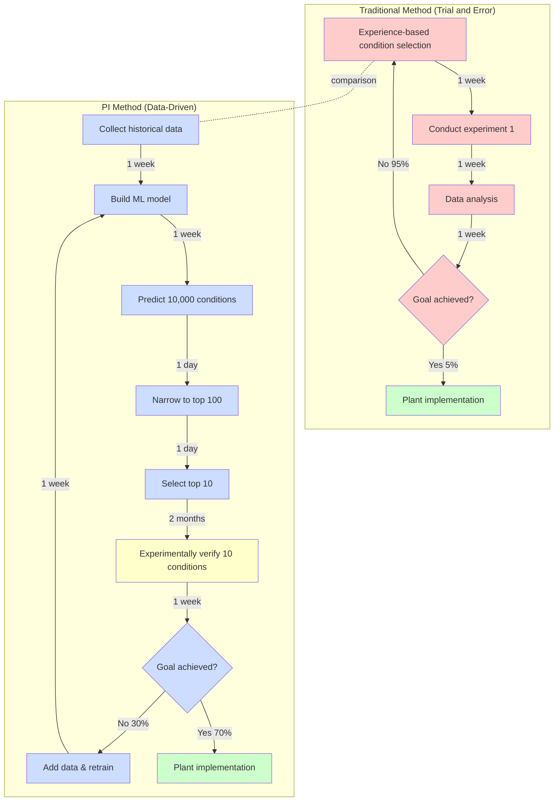

# Chapter 1: Why Process Informatics?

## Learning Objectives

By reading this chapter, you will be able to:
- Understand the historical evolution of chemical process development (from ancient times to the present)
- Explain the limitations and challenges of traditional process development
- Understand the social and technical context requiring PI
- Learn from concrete examples of chemical plant optimization

---

## 1.1 History of Chemical Process Development: Millennia of Trial and Error

The evolution of the chemical industry is closely intertwined with human civilization. Many products we use—pharmaceuticals, plastics, fuels, fibers—are produced through chemical processes.

### Ancient Era: The Age of Empirical Rules

**Distillation Technology (circa 3000 BCE)**

Distillation, one of humanity's oldest chemical processes, was used for perfume production in ancient Mesopotamia. However, this technology was entirely based on **empirical rules**.

- **Development method**: Trial and error, oral tradition across generations
- **Development period**: Hundreds of years to discover optimal temperature and time
- **Knowledge accumulation**: No records, only craftsmen's tacit knowledge

**Fermentation Technology (circa 7000 BCE)**

Beer and wine production represents the oldest bioprocess utilizing microbial metabolism. Ancient peoples discovered appropriate conditions (temperature, sugar concentration) empirically, despite having no knowledge of microorganisms.

### Modern Era: The Beginning of Scientific Approaches (1800-1950s)

**Haber-Bosch Process (1909)**

German chemists Fritz Haber and Carl Bosch developed an industrial process to synthesize ammonia from nitrogen and hydrogen. This marked the beginning of **design based on scientific principles**.

- **Development method**: Theoretical calculations based on thermodynamics and reaction kinetics + experimental verification
- **Development period**: Approximately 10 years (from laboratory to industrial plant)
- **Impact**: Enabled mass production of chemical fertilizers to support global population
- **Nobel Prizes**: 1918 (Haber, Chemistry), 1931 (Bosch, Chemistry)

However, discovering the optimal **catalyst** (iron-based) still required enormous trial and error. Haber is said to have tested approximately 6,500 catalyst candidates.

**Development of Petrochemical Industry (1940-1970s)**

After World War II, the petroleum-based chemical industry developed rapidly. Basic chemicals like ethylene and propylene enabled mass production of plastics such as polyethylene and polypropylene.

- **Development method**: Chemical engineering theory (mass balance, energy balance) + pilot plants
- **Development period**: 5-10 years for new process development
- **Scale-up challenges**: Differences between laboratory and plant conditions (reactor size increases over 1,000-fold)

### Contemporary Era: The Age of Process Control (1980s-Present)

**Introduction of DCS (Distributed Control System) (1980s)**

Distributed control systems enabled automatic control of temperature, pressure, and flow throughout entire plants. This significantly reduced the burden on human operators.

- **Effects**: Improved safety, quality stabilization
- **Challenges**: Optimization still depended on human judgment

**Smart Factories and Industry 4.0 (2010s-Present)**

Integration of IoT sensors, big data, and AI/machine learning is making **real-time optimization** increasingly possible.

- **Characteristics**: Collecting data from thousands of sensors every second
- **Goals**: Minimize human intervention and autonomously maintain optimal operating conditions
- **Challenges**: How to effectively utilize this data?

### Challenges Revealed by History

Looking back over millennia of chemical process development history reveals several challenges:

1. **Time-consuming**: 5-10 years for new process development, additional years for scale-up
2. **High cost**: Hundreds of millions for pilot plants, tens of billions for actual plants
3. **Dependence on trial and error**: Enormous experiments needed to discover optimal conditions
4. **Reliance on tacit knowledge**: Skilled operator experience and intuition essential

**Question: What if we could systematically optimize chemical processes using data and AI?**

This is the starting point for **Process Informatics (PI)**, the next generation of process development methodology.

---

## 1.2 Limitations of Traditional Process Development

Modern chemical process development has become far more sophisticated than in ancient times. However, it still faces significant challenges.

### Challenge 1: Time-Consuming

**Typical Process Development Timeline**

```
Years 1-2: Literature review and laboratory-level experiments
  ↓
Years 3-5: Bench-scale experiments (100mL-1L scale)
  ↓
Years 6-8: Pilot plant construction and operation (10-100L scale)
  ↓
Years 9-12: Scale-up optimization
  ↓
Years 13-15: Commercial plant construction and commissioning (1,000-10,000L scale)
  ↓
Years 16-20: Commercial production start and continuous optimization
```

**Result**: **Average 10-15 years** from new process to commercialization[1,2].

### Challenge 2: High Cost

**Typical Process Development Costs (Medium-Scale Chemical Plant)**

| Development Stage | Cost (JPY) | Duration |
|-------------------|-----------|----------|
| Laboratory research | 50-100 million | 2-3 years |
| Bench scale | 100-300 million | 2-3 years |
| Pilot plant | 1-3 billion | 3-5 years |
| Commercial plant | 10-50 billion | 3-5 years |
| **Total** | **11.6-53.4 billion** | **10-16 years** |

**50-70% of projects fail to reach commercialization**, making failure costs enormous.

### Challenge 3: Scale-Up Difficulties

**Problems in Scale-Up**

Chemical reactions change behavior depending on reactor size. This is called "scale-up effects."

**Differences between Laboratory (100mL) and Commercial Plant (10,000L):**

| Factor | Laboratory | Commercial Plant | Impact |
|--------|-----------|------------------|--------|
| **Mixing efficiency** | Uniform | Non-uniform (dead zones) | Reduced reaction rate |
| **Heat removal** | Easy | Difficult (small surface/volume ratio) | Temperature rise, increased side reactions |
| **Residence time distribution** | Uniform | Non-uniform | Reduced yield |
| **Scale ratio** | 1 | 100,000× | Changed fluid dynamics |

**Concrete Example: Failed Scale-Up of Pharmaceutical Process**

- Laboratory level (100mL): 95% yield
- Bench scale (1L): 90% yield
- Pilot plant (100L): 78% yield
- Commercial plant (10,000L): 65% yield

**Cause**: For exothermic reactions, heat removal at large scale couldn't keep pace, increasing side reactions.

**Time to resolve**: 2 additional years of experiments and 300 million JPY additional investment.

### Challenge 4: Batch-to-Batch Variation

**Quality Variation Problems**

In chemical processes, product quality varies between batches (production lots) even when supposedly operating under identical conditions.

**Causes of Variation:**
- Raw material variations (purity, impurities)
- Environmental condition changes (ambient temperature, humidity)
- Equipment aging
- Operator skill differences

**Concrete Example: Pharmaceutical Manufacturing**

Pharmaceuticals require strict quality specifications. FDA (U.S. Food and Drug Administration) standards:
- Active ingredient content: Within 95-105% range
- Impurities: <0.1%

**Traditional Management Methods:**
- Record measurement results for each batch
- Discard off-specification batches (cost loss)
- Investigate causes (takes weeks)

**Problem**: Post-event response cannot prevent quality defects.

### Challenge 5: Dependence on Experience and Intuition

**Tacit Knowledge of Skilled Operators**

In chemical plants, skilled operator "intuition" is crucial:

- "This sound means a problem with reactor mixing"
- "This color indicates good quality"
- "High humidity today, so lower temperature by 2°C"

Such **tacit knowledge** is extremely valuable but has the following problems:

1. **Difficult to systematize**: Based on personal experience, hard to verbalize
2. **Reproducibility issues**: Different people make different judgments under same conditions
3. **Time-consuming training**: 10-20 years of experience needed for expertise
4. **Loss of knowledge upon retirement**: Technology is lost when veterans retire

**Question: What if we could formalize tacit knowledge using data and AI?**

---

## 1.3 Case Study: Real Example of Chemical Plant Optimization

Let's examine in detail a catalytic reaction process optimization project at a major chemical manufacturer. This is a typical example demonstrating **difficulties of traditional methods** and **potential of PI**.

### Background: Yield Improvement Challenge

**Product**: Fine chemical product (pharmaceutical intermediate)
**Process**: Catalytic reaction (3-stage reaction in reactor)
**Challenge**: Yield stagnant at 70%, industry leader at 85%

**Management Requirement**:
> "Increase yield to 78% or higher and increase annual sales by 500 million JPY. Deadline: 12 months."

### Phase 1: Optimization Using Traditional Methods (6 months)

**Approach**: Trial and error by experienced engineers

**Variable Parameters**:
- Reaction temperature (80-120°C)
- Pressure (1-5 atm)
- Catalyst amount (1-5 wt%)
- Residence time (30-180 min)
- Feed flow rate (10-50 L/h)

**Experimental Design**:
- 3 levels for each parameter
- Total combinations: 3^5 = 243
- Actually selected 50 conditions based on experience

**Experimental Schedule**:
- 1 week per condition (preparation, reaction, analysis)
- 50 conditions × 1 week = 50 weeks (approximately 12 months)

**Results (6-month point)**:
- Completed experiments: 24 conditions
- Maximum yield: 73% (+3%pt)
- **Won't meet deadline**

### Phase 2: Introduction of PI Methods (3 months)

Management decided to transfer to PI team.

**Step 1: Collect Existing Data (1 week)**

Collected 5 years of operating data:
- Process parameters: Temperature, pressure, flow, catalyst amount (every second)
- Product quality data: Yield, selectivity, impurities (per batch)
- **Total data**: Approximately 500 batches, each with 1,000,000 data points

**Step 2: Build Machine Learning Model (2 weeks)**

**Model Used**: Random Forest

```python
# Simplified code example
from sklearn.ensemble import RandomForestRegressor

# Descriptors (inputs): Temperature, pressure, catalyst, residence time, flow
X = process_data[['temperature', 'pressure', 'catalyst', 'residence_time', 'flow_rate']]

# Target (output): Yield
y = process_data['yield']

# Train model
model = RandomForestRegressor(n_estimators=100)
model.fit(X, y)

# Prediction accuracy
print(f"R² score: {model.score(X_test, y_test):.3f}")
# Output: R² score: 0.893 (high accuracy)
```

**Model Performance**:
- R² = 0.893 (prediction accuracy 89.3%)
- MAE (mean absolute error) = 2.1% (yield prediction error ±2.1%)

**Step 3: Search Using Bayesian Optimization (2 months)**

Used machine learning model to efficiently search for optimal conditions.

**Conditions Searched**: 20 conditions (traditional method planned 50)

**Bayesian Optimization Mechanism**:
1. Model proposes "next conditions to try"
2. Verify experimentally
3. Add results to data and update model
4. Repeat

**Results (3-month point)**:
- Maximum yield: **85.3%** (+15.3%pt, exceeded target of 78%)
- Optimal conditions:
  - Temperature: 102°C (previously 95°C)
  - Pressure: 3.2 atm (previously 4.0 atm)
  - Catalyst amount: 2.8 wt% (previously 3.5 wt%)
  - Residence time: 65 min (previously 90 min)

### Phase 3: Validation in Actual Plant (1 month)

**Pilot Test**: Confirmed predicted yield of 85%

**Commercial Plant Deployment**:
- First batch: 84.2% yield
- After stable operation (10 batches): 85.1% average yield

**Additional Discoveries**:
- Energy consumption reduced 30% (effect of lower temperature and shorter time)
- By-products reduced 40% (improved selectivity)

### Results and Impact

| Metric | Traditional | After PI | Improvement |
|--------|------------|----------|-------------|
| **Yield** | 70% | 85.3% | +15.3%pt |
| **Development Period** | 12 months (planned) | 4 months (actual) | **67% reduction** |
| **Number of Experiments** | 50 (planned) | 20 (actual) | **60% reduction** |
| **Energy Consumption** | 100 (baseline) | 70 | **30% reduction** |
| **Annual Sales Increase** | - | 2 billion JPY | Exceeded 500M target |
| **CO2 Emission Reduction** | - | 500 tons/year | Environmental contribution |

**Management Comment**:
> "PI is not just technological innovation, it's business model transformation. We will deploy this across all plants."

---

## 1.4 Traditional Methods vs PI: Workflow Comparison

As seen in the chemical plant optimization example, traditional methods are time-consuming and costly. Let's visually compare the workflows of traditional and PI methods.

### Workflow Comparison Diagram



### Quantitative Comparison

| Metric | Traditional Method | PI Method | Improvement |
|--------|-------------------|-----------|-------------|
| **Annual Experiments** | 10-30 conditions | 100-200 conditions (prediction-assisted efficiency) | **5-10×** |
| **Time per Condition** | 1-2 weeks | 1-2 weeks (experiment only)<br>Seconds (prediction) | **Prediction essentially zero** |
| **Optimization Period** | 6-12 months | 2-4 months | **50-75% reduction** |
| **Success Rate** | 5-10% (empirical) | 50-70% (prediction accuracy) | **5-10× improvement** |
| **Cost** | 100-300 million JPY | 30-80 million JPY | **60-70% reduction** |

### Timeline Comparison Example

**Traditional method to test 50 conditions**:
- 1 condition × 1 week = 50 conditions × 1 week = **50 weeks = approximately 12 months**

**PI method to evaluate 50 conditions**:
- Data collection & model building: 2 weeks
- Predict 10,000 conditions: 1 day
- Experimentally test top 10 of top 50: 10 conditions × 1 week = 10 weeks
- **Total: approximately 3 months**

**Time Reduction**: 12 months → 3 months = **75% reduction**

---

## 1.5 Column: A Day in the Life of a Process Engineer

Let's see how the process development workplace has changed through a concrete story.

### 1990: Era of Traditional Methods

**A Day with Engineer Tanaka (35 years old)**

**6:00 - Arrive at plant (early morning inspection)**
Check overnight operation status. Reactor operating under yesterday's experimental conditions.

**8:00 - Sampling and analysis preparation**
Extract product sample from reactor. Bring to analysis room.

**9:00 - Quality analysis (GC, HPLC)**
Component analysis by gas chromatography and high-performance liquid chromatography. 3 hours of measurement.

**12:00 - Data analysis**
Manually calculate peak areas and determine yield. Manual entry into Excel.

**14:00 - Consider next experimental conditions**
Based on today's results, decide next conditions based on experience. "Let's raise temperature by 5°C."

**16:00 - Set reactor conditions**
Manually set temperature controller for tomorrow's experiment.

**18:00 - Record in lab notebook**
Record today's results in detail in handwritten lab notebook.

**20:00 - Leave work**

**One week's results**: Evaluated 1 condition, prepared next 1 condition

**One month's results (20 days)**: Evaluated approximately 4 conditions

**One year's results**: Evaluated approximately 40-50 conditions

### 2025: PI Era

**A Day with Engineer Sato (32 years old)**

**9:00 - Arrive at office, check dashboard**
Check results of 10 conditions executed overnight by automated experimental apparatus on monitor. Data automatically saved to cloud database.

**9:15 - AI data analysis**
Machine learning model automatically predicts yields and proposes optimizations. Analyzes 10 conditions in 3 minutes.

**9:30 - Respond to anomaly detection alert**
One condition has yield 5% lower than predicted. Root cause analysis tool detects "pressure sensor abnormality." Contact maintenance team.

**10:00 - Consider next experimental candidates**
Bayesian optimization algorithm proposes 20 next conditions to try based on historical data and this morning's results. Predicted yields also displayed.

**10:30 - Review and select top candidates**
Review proposed 20 conditions with engineer's eye. Considering process constraints (temperature limits, pressure safety range), select 10 conditions.

**11:00 - Submit to automated experimental apparatus**
Input selected 10 conditions to automated experiment system. Scheduled for automatic overnight batch execution.

**11:30 - Team meeting**
Discuss this week's progress. Evaluate new model performance, formulate next week's experiment plan.

**13:00 - Model improvement work**
Add new data obtained this week, retrain machine learning model. Prediction accuracy improved (R²: 0.88 → 0.91).

**15:00 - Report preparation**
Review automatically generated optimization report, create summary for management.

**17:00 - Leave work**

**One day's results**: Evaluated 10 conditions, set next 10 conditions for automated experiment

**One month's results (20 days)**: Evaluated approximately 200 conditions

**One year's results**: Evaluated approximately 2,000 conditions

### Key Changes

| Item | 1990 | 2025 | Change |
|------|------|------|--------|
| **Daily Evaluations** | 0.2 conditions (1 per 5 days) | 10 conditions | **50×** |
| **Annual Evaluations** | 40-50 conditions | 2,000 conditions | **40-50×** |
| **Data Analysis Time** | 3-4 hours/condition | 3 min/10 conditions (automated) | **99% reduction** |
| **Lab Notebook** | Handwritten | Digitized (auto-save) | Efficient, searchable |
| **Condition Selection** | Experience & intuition | AI proposal + human judgment | Combination |
| **Report Creation Time** | Half day | 10 min (auto-generate + review) | 95% reduction |

**Important Point**: PI is **a tool to support, not replace, engineers**. Both Tanaka's experience and Sato's judgment are essential, but Sato can explore **more conditions, more efficiently** with AI support.

---

## 1.6 Why PI "Now"?: Three Tailwinds

The concept of PI has existed since the 1990s, but practical implementation accelerated after the **2010s**. Why "now"? Three major factors exist.

### Tailwind 1: Development of Sensor Technology and IoT

**Realization of Real-Time Monitoring**

**1990s**:
- Number of sensors: 50-100 per plant
- Measurement frequency: Every minute
- Data storage: Local server (capacity limited)
- Cost: 500,000-1,000,000 JPY per sensor

**2025**:
- Number of sensors: 5,000-10,000 per plant
- Measurement frequency: Every second (some every 0.1 second)
- Data storage: Cloud (unlimited)
- Cost: 10,000-50,000 JPY per sensor (**90-95% reduction**)

**Proliferation of IoT (Internet of Things)**:
- Wireless sensors: Easy installation without wiring
- Edge computing: Data preprocessing at sensor side
- 5G communication: Real-time transmission of massive data

**Concrete Example: Smart Chemical Plant**

A major chemical manufacturer's plant:
- **Temperature sensors**: 1,200 (reactors, piping, heat exchangers)
- **Pressure sensors**: 800
- **Flow sensors**: 600
- **Quality sensors**: 200 (online analyzers)
- **Total data volume**: 10TB per day

Using this data enables AI prediction and optimization.

### Tailwind 2: Computing Performance and Cloud Proliferation

**Benefits of Moore's Law**

- **1990**: Days for one process optimization calculation
- **2000**: Hours for one calculation
- **2010**: Minutes for one calculation
- **2025**: Seconds for one calculation, 10,000 conditions in minutes with parallel computing

**Cloud Computing Proliferation**

- **Traditional**: In-house server (100M JPY initial investment, 30M JPY annual maintenance)
- **Current**: AWS, Google Cloud, Azure (pay-as-you-go, zero initial investment)
- **Effects**:
  - SMEs can access high-performance computing
  - Secure computing resources only when needed (cost reduction)
  - Easy data sharing and collaboration

**GPU Utilization**

- GPU computing became mainstream with deep learning proliferation
- Train machine learning models 100× faster than CPUs
- Industrial GPUs provided by companies like NVIDIA

### Tailwind 3: Rising Social Urgency

**Carbon Neutrality (2050 Goal)**

Since the 2015 Paris Agreement, chemical companies worldwide are working on CO2 emission reduction.

**Japan's Chemical Industry CO2 Emissions**:
- Approximately 10% of all industries (approximately 100 million tons/year)
- Goal: 46% reduction from 2013 levels by 2030

**PI Contributions**:
- Energy consumption reduction through process optimization (20-30%)
- Waste treatment energy reduction through by-product reduction
- Accelerated development of new green chemistry processes

**Concrete Example**: A petrochemical plant reduced energy consumption 25% through PI optimization, reducing annual CO2 emissions by 10,000 tons.

**Quality Assurance and GMP (Good Manufacturing Practice)**

Pharmaceutical manufacturing has strict regulations from FDA (U.S. Food and Drug Administration) and EMA (European Medicines Agency).

**Stricter Regulations**:
- Narrowed allowable range for batch-to-batch variation
- Process Analytical Technology (PAT) implementation recommended
- Real-time quality management required

**PI's Role**:
- 50-70% reduction in batch-to-batch variation
- Real-time quality prediction and control
- Accountability to regulators (data-driven decision-making)

**Labor Shortage and Technology Transfer**

Japan's chemical industry faces serious aging of skilled technicians and youth shortage.

**Statistics**:
- Average age in chemical industry: Approximately 45 (2023)
- 30% of technicians retiring within 10 years
- Youth moving away from manufacturing

**PI Solutions**:
- Formalize skilled workers' tacit knowledge as data
- Reduce burden on young workers with AI-assisted operation
- Enable operation with fewer people through remote monitoring

**Conclusion**: PI is technology needed precisely now, when technical maturity and social necessity are **simultaneously satisfied**.

---

## 1.7 Chapter Summary

### What We Learned

1. **History of Chemical Process Development**
   - From ancient distillation/fermentation to modern smart factories
   - Evolution from empirical rules → scientific approach → process control → data-driven
   - However, development still takes 5-10 years

2. **Limitations of Traditional Methods**
   - **Time**: 10-15 years for new process development
   - **Cost**: 11.6-53.4 billion JPY (laboratory to commercial plant)
   - **Scale-up difficulties**: Behavior changes between laboratory and plant
   - **Batch-to-batch variation**: Quality variation
   - **Experience dependence**: Reliance on skilled operator tacit knowledge

3. **Lessons from Chemical Plant Optimization**
   - Traditional method (6 months): 24 conditions, +3%pt yield
   - PI method (3 months): 20 conditions, +15.3%pt yield
   - **67% time reduction, 5× better results**

4. **PI Advantages**
   - Annual evaluations: 40-50 conditions → 2,000 conditions (**40-50×**)
   - Optimization period: 6-12 months → 2-4 months (**50-75% reduction**)
   - Cost reduction: **60-70% reduction**

5. **Why PI is Needed "Now"**
   - Sensor technology and IoT (real-time data collection)
   - Computing performance and cloud (high-speed calculation, parallel processing)
   - Social urgency (carbon neutrality, quality assurance, labor shortage)

### Key Points

- PI is **a tool to support, not replace, engineers**
- **Combination** of computational prediction and experimental verification is crucial
- Data quality and quantity determine prediction accuracy
- Knowledge of **both** chemical engineering and data science is necessary

### To the Next Chapter

Chapter 2 will learn in detail about **basic concepts and methods of PI**:
- Definition of PI and related fields
- 20-word PI glossary
- Types of process data
- PI 5-step workflow
- What are process descriptors?

---

## Practice Problems

### Problem 1 (Difficulty: easy)

Explain how development methods evolved through three eras in chemical process development history: ancient, modern, and contemporary.

<details>
<summary>Hint</summary>

Consider the flow: empirical rules → scientific approach → data-driven.

</details>

<details>
<summary>Sample Answer</summary>

**Ancient Era (Pre-1800)**:
- Development method: Empirical rules and oral tradition
- Examples: Distillation, fermentation
- Hundreds of years to discover optimal conditions
- No scientific understanding

**Modern Era (1800-1980)**:
- Development method: Design based on scientific principles
- Example: Haber-Bosch process (thermodynamics and reaction kinetics)
- Combination of experiments and theory
- But still required trial and error (Haber tested 6,500 catalysts)

**Contemporary Era (1980s-Present)**:
- Development method: Process control + data-driven
- DCS (Distributed Control System) for automatic control
- IoT sensors and big data
- AI/machine learning optimization
- But full automation not yet achieved

**Conclusion**: Over millennia, evolved from empirical rules to scientific approaches, and further to data-driven methods.

</details>

### Problem 2 (Difficulty: easy)

How long does traditional process optimization of 50 conditions take, assuming 1 week per condition? How many months can PI methods reduce this to?

<details>
<summary>Hint</summary>

Traditional method: 50 conditions × 1 week = ? weeks
PI method: Data collection 2 weeks + prediction 1 day + experiment 10 conditions × 1 week = ? weeks

</details>

<details>
<summary>Sample Answer</summary>

**Traditional Method**:
- 50 conditions × 1 week = 50 weeks
- 1 year = 52 weeks
- **Approximately 12 months** (almost 1 year)

**PI Method**:
- Data collection & model building: 2 weeks
- Predict 10,000 conditions: 1 day (negligible)
- Experimentally test top 10 conditions: 10 conditions × 1 week = 10 weeks
- **Total: 12 weeks = approximately 3 months**

**Time Reduction Rate**: 12 months → 3 months = **75% reduction**

**Conclusion**: PI methods can reduce process optimization period to 1/4.

</details>

### Problem 3 (Difficulty: medium)

What is the biggest difference between traditional and PI methods in the chemical plant optimization case study? Explain from the perspectives of time, number of experiments, and results.

<details>
<summary>Hint</summary>

Use the numbers from Table 1.3 to compare each metric.

</details>

<details>
<summary>Sample Answer</summary>

**Time Comparison**:
- Traditional method: 6 months, 24 conditions evaluated, maximum 73% yield (+3%pt)
- PI method: 3 months, 20 conditions evaluated, maximum 85.3% yield (+15.3%pt)
- **Difference**: PI method achieved 5× results in half the time

**Experiment Count Comparison**:
- Traditional method: Planned 50 conditions based on experience (actually 24 before running out of time)
- PI method: Efficiently selected 20 conditions using Bayesian optimization
- **Difference**: PI method achieved higher results with fewer experiments

**Results Comparison**:
- Traditional method: +3%pt yield, no energy reduction
- PI method: +15.3%pt yield, 30% energy reduction
- **Difference**: PI method simultaneously achieved multiple goals

**Biggest Difference**:
**"Smart search" enabled by machine learning models**. Traditional methods randomly selected conditions based on engineer experience, but PI methods learn from historical data and propose **the most promising conditions to try next**. This enables reaching optimal solutions with fewer experiments.

Furthermore, PI can simultaneously evaluate **secondary effects** like energy consumption, enabling multi-objective optimization.

</details>

---

## References

1. Venkatasubramanian, V. (2019). "The promise of artificial intelligence in chemical engineering: Is it here, finally?" *AIChE Journal*, 65(2), 466-478.
   DOI: [10.1002/aic.16489](https://doi.org/10.1002/aic.16489)

2. McBride, K., & Sundmacher, K. (2019). "Overview of Surrogate Modeling in Chemical Process Engineering." *Chemie Ingenieur Technik*, 91(3), 228-239.
   DOI: [10.1002/cite.201800091](https://doi.org/10.1002/cite.201800091)

3. Lee, J. H., Shin, J., & Realff, M. J. (2018). "Machine learning: Overview of the recent progresses and implications for the process systems engineering field." *Computers & Chemical Engineering*, 114, 111-121.
   DOI: [10.1016/j.compchemeng.2017.10.008](https://doi.org/10.1016/j.compchemeng.2017.10.008)

4. Society of Chemical Engineers, Japan (2023). "Recommendations on DX Promotion in Chemical Process Industries"
   URL: https://www.scej.org

---

## Author Information

**Created by**: MI Knowledge Hub Content Team
**Supervised by**: Dr. Yusuke Hashimoto (Tohoku University)
**Created**: 2025-10-16
**Version**: 1.0
**Series**: PI Introduction Series v1.0

**Update History**:
- 2025-10-16: v1.0 Initial version
  - History of chemical process development (ancient to modern)
  - Five limitations of traditional methods
  - Detailed case study of chemical plant optimization
  - Workflow comparison diagram (Mermaid)
  - "A Day in the Life of a Process Engineer" column (1990 vs 2025)
  - "Why PI Now" three tailwinds
  - Three practice problems

**License**: CC BY 4.0
