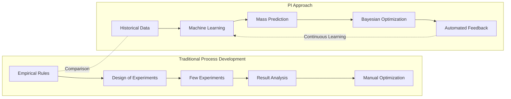
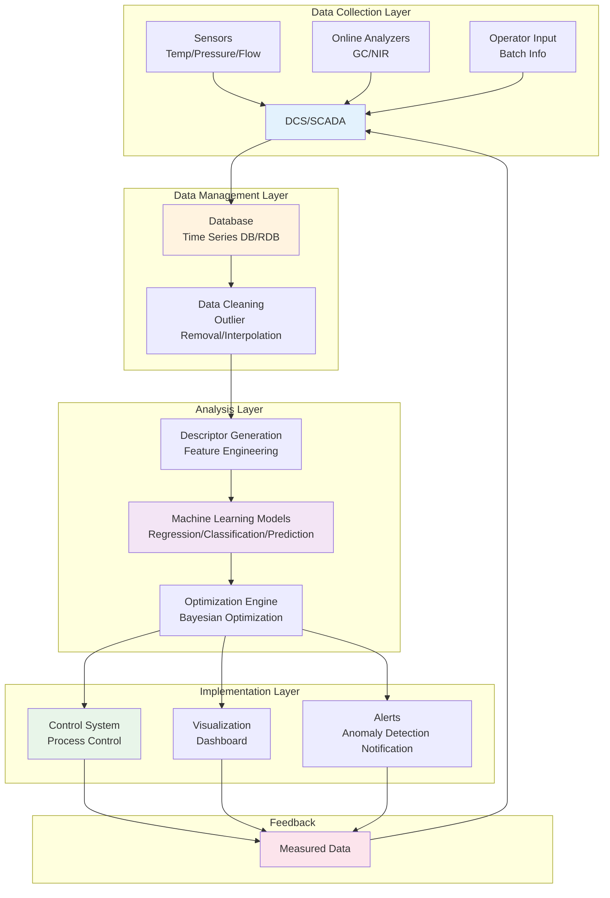
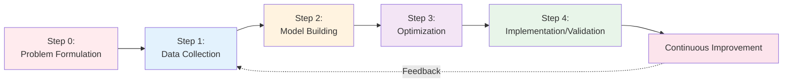

# Chapter 2: PI Fundamentals - Concepts, Methods, and Ecosystem

## Learning Objectives

By reading this chapter, you will be able to:
- Explain the definition of PI and its differences from related fields (Quality Engineering, Design of Experiments, etc.)
- Understand the major data types in chemical processes (time series, batch, quality data)
- Explain the 5-step PI workflow in detail (from problem formulation to implementation)
- Understand the types and importance of process descriptors (physicochemical parameters, equipment characteristics)
- Correctly use 20 specialized terms frequently used in the PI domain

---

## 2.1 What is PI: Definition and Related Fields

### 2.1.1 Etymology and History of Process Informatics

The term **Process Informatics (PI)** began to be used in the early 2000s. It gained particular attention in the context of **Industry 4.0** (the Fourth Industrial Revolution, proposed in Germany in 2011)[1].

**The Four Pillars of Industry 4.0:**
1. **IoT (Internet of Things)**: Data collection through sensor networks
2. **Big Data**: Accumulation and management of massive amounts of data
3. **AI/Machine Learning**: Knowledge extraction and prediction from data
4. **Cyber-Physical Systems**: Integration of digital space and physical world

PI can be described as **applying these technologies to the chemical process industry**.

### 2.1.2 Definition

**Process Informatics (PI)** is an academic discipline that merges chemical process engineering with data science. It is a methodology that realizes process optimization, quality control, anomaly detection, and predictive maintenance by utilizing large amounts of process data and information science technologies such as machine learning.

**Concise Definition:**
> "The science of optimizing and smartifying chemical processes through the power of data and AI"

**Core Elements:**
1. **Data**: Process data, quality data, operational data
2. **Modeling**: Machine learning, statistical models, physical models
3. **Optimization**: Bayesian optimization, multi-objective optimization, evolutionary computation
4. **Implementation**: Process control, real-time monitoring

### 2.1.3 Comparison with Related Fields

PI is related to multiple fields, but each has a different focus.

| Field | Target | Main Methods | Purpose | Relationship with PI |
|-------|--------|--------------|---------|---------------------|
| **Quality Engineering<br>(QE)** | Product quality stabilization | Taguchi Method, S/N ratio, Robust design | Minimizing variation | PI enhances QE data analysis |
| **Design of Experiments<br>(DoE)** | Efficient experiment design | Orthogonal arrays, Response Surface Methodology | Optimization with fewer experiments | PI combines DoE with machine learning |
| **Statistical Process Control<br>(SPC)** | Process stability monitoring | Control charts, Cp/Cpk | Early detection of anomalies | PI adds predictive capabilities to SPC |
| **Process Control** | Automated process control | PID control, MPC | Tracking target values | PI optimizes control parameters |
| **Process Informatics<br>(PI)** | Overall process optimization | Machine learning, optimization, real-time analysis | Simultaneous optimization of yield, quality, cost, and environment | - |

**PI's Uniqueness:**
- **Integrated Approach**: Integrates quality, control, and optimization
- **Data-Driven**: Learns from large amounts of measured data
- **Real-Time Capability**: Online analysis and feedback control
- **Multi-Objective Optimization**: Simultaneously considers yield, quality, cost, and environment

### 2.1.4 Traditional Process Development vs. PI



---

## 2.2 PI Glossary: 20 Essential Terms

This section summarizes specialized terms frequently encountered when learning PI, organized by category.

### Basic Terms (1-7)

| Term (Japanese) | Term (English) | Description |
|----------------|---------------|-------------|
| **1. プロセス変数** | Process Variable (PV) | A measurable quantity representing the state of the process. Temperature, pressure, flow rate, pH, concentration, etc. The subject of control. |
| **2. 記述子** | Descriptor | A numerical representation of process features. Used as input to machine learning models. Examples: reaction temperature, catalyst amount, residence time. |
| **3. 目的関数** | Objective Function | Mathematical expression of optimization goals. Examples: maximizing yield, minimizing cost. Multi-objective optimization considers multiple objective functions simultaneously. |
| **4. 制約条件** | Constraints | Conditions that must be satisfied in optimization. Examples: temperature limit 200°C, pressure minimum 1 atm, quality specification ≥99%. |
| **5. バッチプロセス** | Batch Process | A process where raw materials are charged all at once, and products are removed after reaction/processing. Common in pharmaceuticals and fine chemicals. |
| **6. 連続プロセス** | Continuous Process | A process where raw materials are continuously supplied and products are continuously removed. Suitable for petrochemicals and mass production. |
| **7. スケールアップ** | Scale-up | Expansion of process from laboratory level to commercial plant. Reactor size can increase by more than 1,000 times. |

### Methodology Terms (8-14)

| Term (Japanese) | Term (English) | Description |
|----------------|---------------|-------------|
| **8. ベイズ最適化** | Bayesian Optimization | A method to search for optimal conditions while minimizing the number of experiments. Uses Gaussian processes to determine the next experimental candidate. |
| **9. 多目的最適化** | Multi-objective Optimization | A method to simultaneously optimize multiple objectives (e.g., yield and purity, cost and quality). Usually involves trade-off relationships. |
| **10. 応答曲面法** | Response Surface Methodology (RSM) | A method to approximate the relationship between input variables and output with a surface (polynomial) and search for optimal conditions. Used in combination with Design of Experiments. |
| **11. 実験計画法** | Design of Experiments (DoE) | A method to design combinations of experiments to efficiently obtain information. Orthogonal arrays, Box-Behnken design, etc. |
| **12. 異常検知** | Anomaly Detection | A method to automatically detect deviations from normal operation. Utilizes machine learning (One-Class SVM, Isolation Forest, etc.). |
| **13. ソフトセンサー** | Soft Sensor | A technology to estimate difficult-to-measure variables from measurable variables. Example: online quality estimation (alternative to GC measurement). |
| **14. モデル予測制御** | Model Predictive Control (MPC) | An advanced control method that controls while predicting future behavior based on a process model. Effective for multivariable control. |

### Application Terms (15-20)

| Term (Japanese) | Term (English) | Description |
|----------------|---------------|-------------|
| **15. デジタルツイン** | Digital Twin | A simulation model that replicates the physical process in digital space. Simulates the process like a mirror in real-time. |
| **16. 予知保全** | Predictive Maintenance | A method to predict equipment failures in advance and perform planned maintenance. Minimizes downtime. |
| **17. DCS** | Distributed Control System | A system that performs distributed control of the entire plant. Automatically controls temperature, pressure, flow rate, etc. |
| **18. SCADA** | Supervisory Control and Data Acquisition | A system for monitoring and controlling processes. Visualizes status for operators. |
| **19. パレートフロント** | Pareto Front | In multi-objective optimization, a set of solutions where no objective can be improved. Indicates optimal compromise points. |
| **20. オンライン分析** | Online Analysis | Technology for real-time component analysis during process operation. Examples: online GC, NIR spectroscopy. |

**Key Points for Learning Terms:**
- First, prioritize understanding 1-7 (basic terms)
- Study 8-14 (methodology terms) in detail at intermediate level
- Apply 15-20 (application terms) in practical projects

---

## 2.3 Types and Characteristics of Process Data

Various types of data are generated in chemical processes. Understanding the characteristics of each is important for applying PI methods.

### 2.3.1 Time Series Data

**Characteristics:**
- Data measured continuously along the time axis
- Sampling frequency: every 1 second to 1 minute
- Massive data volume (1 sensor × 1 day = 86,400 data points)

**Typical Examples:**

| Measured Item | Sampling Frequency | Data Volume/Day | Usage |
|--------------|-------------------|----------------|-------|
| Reactor Temperature | 1 second | 86,400 points | Real-time control |
| Pressure | 1 second | 86,400 points | Safety monitoring |
| Flow Rate | 5 seconds | 17,280 points | Mass balance calculation |
| pH | 10 seconds | 8,640 points | Reaction progress monitoring |

**Analysis Methods:**
- **Time Series Forecasting**: ARIMA, Prophet, LSTM (deep learning)
- **Anomaly Detection**: Control charts, One-Class SVM
- **Trend Analysis**: Moving average, seasonal decomposition

**Challenges:**
- High noise (sensor accuracy, external environmental effects)
- Missing values (sensor failure, communication errors)
- Massive data volume (1 plant × 1 year = several TB)

### 2.3.2 Batch Data

**Characteristics:**
- One data point per batch
- Each batch is an independent production unit
- Conditions vary subtly between batches

**Typical Example (Pharmaceutical Batch):**

| Batch ID | Raw Material Lot | Reaction Temp (°C) | Reaction Time (h) | Yield (%) | Purity (%) |
|----------|-----------------|-------------------|------------------|-----------|-----------|
| Batch001 | Lot-A | 85 | 4.5 | 92.3 | 99.2 |
| Batch002 | Lot-A | 87 | 4.3 | 91.8 | 99.1 |
| Batch003 | Lot-B | 85 | 4.6 | 90.5 | 99.3 |

**Analysis Methods:**
- **Regression Analysis**: Linear regression, Random Forest
- **Batch-to-Batch Variation Analysis**: ANOVA, Principal Component Analysis (PCA)
- **Optimization**: Bayesian optimization, Response Surface Methodology

**Challenges:**
- Small sample size (tens to hundreds of batches per year)
- Need to capture subtle differences between batches
- Raw material lot dependency

### 2.3.3 Quality Data

**Characteristics:**
- Often offline measurement (GC, HPLC, NMR, etc.)
- Measurements take time and cost
- Low measurement frequency

**Typical Examples:**

| Measured Item | Measurement Method | Frequency | Cost/Measurement | Measurement Time |
|--------------|-------------------|-----------|-----------------|-----------------|
| Main Component Content | HPLC | Each batch | $50 | 30 minutes |
| Impurity Profile | GC-MS | Each batch | $100 | 1 hour |
| Molecular Weight Distribution | GPC | Each batch | $80 | 45 minutes |
| Crystal Structure | XRD | Sampling (10%) | $200 | 2 hours |

**Analysis Methods:**
- **Quality Prediction (Soft Sensor)**: Estimate quality from process variables
- **Quality Control**: Control charts, Cp/Cpk
- **Out-of-Spec Determination**: Classification models (SVM, logistic regression)

**Challenges:**
- Low measurement frequency (not real-time)
- Measurement errors exist
- High cost

### 2.3.4 Operational Data

**Characteristics:**
- Data representing the operational state of the plant
- Operator action history, alarms, event logs

**Typical Examples:**

```
2025-10-16 09:15:32 | High Temperature Alarm | Reactor R-101 | Temp 120°C (Limit 115°C)
2025-10-16 09:16:05 | Operator Action | Cooling Water Flow Increase | 50 L/min → 70 L/min
2025-10-16 09:18:20 | Alarm Cleared | Reactor R-101 | Temp 112°C
```

**Analysis Methods:**
- **Event Log Analysis**: Extraction of anomaly occurrence patterns
- **Alarm Frequency Analysis**: Discrimination of true alarms vs. false alarms
- **Root Cause Analysis**: Tracking alarm chains

### 2.3.5 Data Integration and Preprocessing

In PI, these different types of data are **integrated** for use.

**Preprocessing Steps:**

1. **Data Cleaning**: Removal of outliers and missing values
2. **Time Axis Unification**: Synchronize data with different sampling frequencies
3. **Normalization**: Scale data to 0-1 or standardize data with different scales
4. **Feature Engineering**: Derive new variables (e.g., temperature × time)

```python
import pandas as pd
import numpy as np

# Time series data preprocessing example
def preprocess_process_data(df):
    # 1. Outlier removal (3σ method)
    df = df[(np.abs(df['temperature'] - df['temperature'].mean())
             <= 3 * df['temperature'].std())]

    # 2. Missing value interpolation (linear interpolation)
    df = df.interpolate(method='linear')

    # 3. Moving average (noise removal)
    df['temperature_smooth'] = df['temperature'].rolling(window=10).mean()

    # 4. Normalization (0-1)
    df['temperature_norm'] = (df['temperature'] - df['temperature'].min()) / \
                             (df['temperature'].max() - df['temperature'].min())

    return df
```

---

## 2.4 PI Ecosystem: Data Flow

PI is not a standalone technology but an ecosystem where multiple elements cooperate. The following diagram shows the data flow in PI.



**How to Read the Diagram:**
1. **Data Collection Layer**: Collect data from sensors, analyzers, and operators
2. **Data Management Layer**: Store data and perform preprocessing
3. **Analysis Layer**: Build machine learning models and perform optimization
4. **Implementation Layer**: Utilize prediction results for process control and visualization
5. **Feedback**: Return measured data to the system for continuous improvement

**Important Points:**
- Data **circulates** (feedback loop)
- Each layer has a specialized role
- Real-time capability is important (seconds to minutes)

---

## 2.5 Basic PI Workflow: Detailed 5 Steps

Chapter 1 introduced an overview, but here we explain the practical **5-step workflow** in detail.

### 2.5.1 Overall Picture



### 2.5.2 Step 0: Problem Formulation

**What to Do:**
- Clearly define the problem to be solved
- Specify objective functions and constraints
- Set success criteria (KPIs)

**Concrete Example: Yield Improvement in Chemical Reaction Process**

**Poor Problem Formulation:**
> "I want to increase yield"

**Good Problem Formulation:**
> "Maximize yield of chemical reaction process X under the following conditions:
> - **Objective**: Improve yield from current 70% to 80% or higher
> - **Constraints**:
>   - Temperature: 80-120°C (safety range)
>   - Pressure: 1-5 atm
>   - Reaction time: ≤6 hours (maintain productivity)
>   - Purity: ≥98% (quality specification)
>   - Cost: Within current +10%
> - **KPIs (Success Criteria)**:
>   - Achieve yield ≥80% for 10 consecutive batches
>   - Batch-to-batch variation ≤2%
>   - Deadline: Within 6 months"

**Problem Formulation Checklist:**
- [ ] Is the objective quantitatively defined?
- [ ] Are the constraints clear?
- [ ] Are the KPIs measurable?
- [ ] Is the deadline realistic?
- [ ] Have stakeholders agreed?

**Time Guideline:** 1-2 weeks (including discussions with stakeholders)

### 2.5.3 Step 1: Data Collection

**What to Do:**
- Collect historical operational data
- Check data quality (missing values, outliers)
- Conduct additional experiments if necessary

**Data Source Priority:**

1. **Existing Plant Data** (Most efficient)
   - Export time series data from DCS/SCADA
   - Usually, several months to years of data are accumulated

2. **Laboratory Data** (Supplementary)
   - Bench-scale experimental results
   - Detailed quality analysis data

3. **New Experiments** (As needed)
   - Add experiments for conditions lacking in existing data

**Concrete Example: Data Collection for Reaction Process**

```python
import pandas as pd

# Example of data export from DCS
process_data = pd.read_csv('dcs_export.csv', parse_dates=['timestamp'])

print(f"Data period: {process_data['timestamp'].min()} - {process_data['timestamp'].max()}")
print(f"Number of data points: {len(process_data):,}")
print(f"Number of variables: {process_data.shape[1]}")

# Basic statistics
print("\nBasic statistics:")
print(process_data[['temperature', 'pressure', 'flow_rate', 'yield']].describe())

# Check for missing values
print("\nMissing values:")
print(process_data.isnull().sum())
```

**Expected Output:**
```
Data period: 2023-01-01 - 2024-12-31
Number of data points: 31,536,000
Number of variables: 50

Basic statistics:
       temperature  pressure  flow_rate    yield
count    31536000  31536000   31536000  1200.0
mean         95.3      3.2       45.2    70.3
std           8.7      0.8       12.3     3.1
...

Missing values:
temperature        120
pressure            85
flow_rate          156
yield                0
```

**Time Guideline:** 1 week (data identification, export, quality verification)

### 2.5.4 Step 2: Model Building

**What to Do:**
- Train machine learning models using collected data
- Select appropriate descriptors (features)
- Evaluate and optimize model performance

**Sub-steps:**

**2.1 Descriptor Design**

Transform process variables into a format suitable for machine learning models.

**Descriptor Examples:**

| Category | Descriptor | Description |
|----------|-----------|-------------|
| **Direct Measurement** | Temperature, Pressure, Flow Rate | Directly obtained from sensors |
| **Derived Variables** | Residence Time = Reactor Volume / Flow Rate | Calculated |
| **Interaction Terms** | Temperature × Pressure | Capture nonlinear effects |
| **Time Series Features** | Temperature moving average, rate of change | Capture dynamic behavior |

**2.2 Model Selection**

| Model | Application | Advantages | Disadvantages |
|-------|------------|-----------|--------------|
| **Linear Regression** | When linear relationships are expected | Simple, easy to interpret | Cannot capture nonlinear relationships |
| **Random Forest** | Nonlinear, complex relationships | High accuracy, robust to overfitting | Black box |
| **Gradient Boosting** | Pursuing highest accuracy | Very high accuracy | Requires tuning |
| **SVR** | Small-scale data | High generalization performance | High computational cost |

**2.3 Model Training and Evaluation**

```python
from sklearn.ensemble import RandomForestRegressor
from sklearn.model_selection import train_test_split, cross_val_score
from sklearn.metrics import mean_absolute_error, r2_score

# Data splitting
X = df[['temperature', 'pressure', 'catalyst_conc', 'residence_time']]
y = df['yield']

X_train, X_test, y_train, y_test = train_test_split(
    X, y, test_size=0.2, random_state=42
)

# Model training
model = RandomForestRegressor(n_estimators=100, random_state=42)
model.fit(X_train, y_train)

# Prediction and evaluation
y_pred = model.predict(X_test)
mae = mean_absolute_error(y_test, y_pred)
r2 = r2_score(y_test, y_pred)

print(f"MAE: {mae:.2f}%")
print(f"R²: {r2:.3f}")

# Cross-validation
cv_scores = cross_val_score(model, X, y, cv=5,
                            scoring='neg_mean_absolute_error')
print(f"CV MAE: {-cv_scores.mean():.2f} ± {cv_scores.std():.2f}%")
```

**Performance Guidelines:**
- **R² > 0.8**: Good
- **R² > 0.9**: Excellent
- **R² < 0.7**: Model revision needed

**Time Guideline:** 2 weeks (descriptor design, model training, tuning)

### 2.5.5 Step 3: Optimization

**What to Do:**
- Use the trained model to search for optimal operating conditions
- Apply methods such as Bayesian optimization and multi-objective optimization

**Bayesian Optimization Example:**

```python
from skopt import gp_minimize
from skopt.space import Real

# Objective function (maximize yield = minimize negative yield)
def objective(params):
    temperature, pressure, catalyst_conc = params
    predicted_yield = model.predict([[temperature, pressure, catalyst_conc, 60]])
    return -predicted_yield[0]  # Convert to minimization problem

# Define search space
space = [
    Real(80, 120, name='temperature'),     # Temperature range
    Real(1, 5, name='pressure'),           # Pressure range
    Real(0.5, 3, name='catalyst_conc'),    # Catalyst concentration range
]

# Execute Bayesian optimization
result = gp_minimize(
    objective,
    space,
    n_calls=20,      # 20 evaluations
    random_state=42
)

print(f"Optimal conditions:")
print(f"  Temperature: {result.x[0]:.1f}°C")
print(f"  Pressure: {result.x[1]:.2f} atm")
print(f"  Catalyst concentration: {result.x[2]:.2f}%")
print(f"  Predicted yield: {-result.fun:.1f}%")
```

**Multi-objective Optimization Example (Yield vs. Cost):**

```python
from pymoo.algorithms.moo.nsga2 import NSGA2
from pymoo.optimize import minimize
from pymoo.core.problem import Problem

class ProcessOptimizationProblem(Problem):
    def __init__(self):
        super().__init__(
            n_var=3,           # 3 variables
            n_obj=2,           # 2 objectives (yield, cost)
            n_constr=0,
            xl=[80, 1, 0.5],   # Lower bounds
            xu=[120, 5, 3]     # Upper bounds
        )

    def _evaluate(self, X, out, *args, **kwargs):
        # Objective 1: Maximize yield (→ minimize negative yield)
        yield_pred = model_yield.predict(X)
        f1 = -yield_pred

        # Objective 2: Minimize cost
        cost = X[:, 0] * 0.1 + X[:, 1] * 5 + X[:, 2] * 20  # Simplified example
        f2 = cost

        out["F"] = np.column_stack([f1, f2])

# Optimize with NSGA-II algorithm
algorithm = NSGA2(pop_size=100)
problem = ProcessOptimizationProblem()

result = minimize(
    problem,
    algorithm,
    ('n_gen', 50),  # 50 generations
    verbose=False
)

print(f"Number of Pareto optimal solutions: {len(result.F)}")
```

**Time Guideline:** 1-2 weeks (selection of optimization method, execution, result analysis)

### 2.5.6 Step 4: Implementation and Validation

**What to Do:**
- Test the conditions obtained from optimization in the actual plant
- Analyze the deviation between prediction and measurement
- Implement in stages (pilot → commercial plant)

**Implementation Steps:**

1. **Pilot Test** (1-2 batches)
   - Safety verification
   - Check agreement with predictions

2. **Small-Scale Introduction** (10 batches)
   - Reproducibility verification
   - Evaluation of batch-to-batch variation

3. **Full Deployment** (Continuous operation)
   - Adopt as standard operating conditions
   - Continuous monitoring

**Validation Checklist:**
- [ ] Does it meet safety standards?
- [ ] Does it meet quality specifications?
- [ ] Does the measured value match the predicted yield within ±5%?
- [ ] Is the batch-to-batch variation within acceptable range?
- [ ] Can operators operate it?

**Time Guideline:** 1-2 months (pilot testing, staged introduction)

### 2.5.7 Continuous Improvement

**What to Do:**
- Collect post-implementation data
- Periodically retrain models
- Explore further optimization opportunities

**Continuous Improvement Cycle:**

```
Initial model (R² = 0.85)
  ↓ Add 10 batches of data
Model retraining (R² = 0.88)
  ↓ Add 20 batches of data
Model retraining (R² = 0.91)
  ↓ Discover new optimization opportunities
```

**Time Guideline:** Continuous (recommend retraining every 3 months)

---

## 2.6 Process Descriptor Details

### 2.6.1 Types of Descriptors

**1. Physicochemical Parameters**

| Descriptor | Unit | Typical Range | Importance |
|-----------|------|--------------|-----------|
| Temperature | °C | 50-200 | Directly affects reaction rate, equilibrium constant |
| Pressure | atm | 1-10 | Gas phase reaction equilibrium, mass transfer |
| pH | - | 0-14 | Catalyst activity, side reactions |
| Concentration | mol/L | 0.1-5 | Reaction rate, selectivity |
| Flow Rate | L/h | 10-100 | Residence time, mixing |

**2. Equipment Characteristics**

| Descriptor | Description | Impact |
|-----------|-------------|--------|
| Reactor Volume | Process scale | Heat removal, mixing efficiency |
| Stirring Speed | rpm | Mass transfer, homogeneity |
| Heat Transfer Area | m² | Temperature control |

**3. Operating Conditions**

| Descriptor | Description | Controllability |
|-----------|-------------|----------------|
| Heating Rate | °C/min | Easy to control |
| Raw Material Feed Order | - | Easy to control |
| Cooling Start Time | Time from reaction start | Easy to control |

### 2.6.2 Automatic Descriptor Generation

```python
import pandas as pd

# Calculate basic descriptors
def generate_descriptors(df):
    # Derived variables
    df['residence_time'] = df['reactor_volume'] / df['flow_rate']  # minutes

    # Interaction terms
    df['temp_pressure'] = df['temperature'] * df['pressure']

    # Time series features (moving average)
    df['temp_ma_10min'] = df['temperature'].rolling(window=10).mean()

    # Rate of change
    df['temp_change_rate'] = df['temperature'].diff()

    return df
```

---

## 2.7 Summary

### What You Learned in This Chapter

1. **PI Definition and Position**
   - Optimizing chemical processes with data and AI
   - Differences from related fields (QE, DoE, SPC, Process Control)

2. **20 PI Terms**
   - Basic terms, methodology terms, application terms
   - Understanding specialized terms frequently encountered in practice

3. **Types of Process Data**
   - Time series data, batch data, quality data, operational data
   - Characteristics and analysis methods for each data type

4. **PI Ecosystem**
   - Data collection → management → analysis → implementation → feedback
   - Role and coordination of each layer

5. **5-Step PI Workflow**
   - Step 0: Problem formulation
   - Step 1: Data collection
   - Step 2: Model building
   - Step 3: Optimization
   - Step 4: Implementation and validation
   - Continuous improvement cycle

6. **Process Descriptors**
   - Physicochemical parameters, equipment characteristics, operating conditions
   - Automatic descriptor generation methods

### To the Next Chapter

In Chapter 3, you will learn practical PI methods using Python:
- Environment setup (3 options)
- 35 executable code examples
- Chemical reactor optimization project

---

## Practice Problems

### Problem 1 (Difficulty: easy)

Explain the differences between PI and related fields (Quality Engineering, Design of Experiments, Statistical Process Control).

<details>
<summary>Sample Answer</summary>

**Quality Engineering (QE)**:
- Purpose: Product quality stabilization, minimizing variation
- Methods: Taguchi Method, S/N ratio
- Difference from PI: PI enhances QE data analysis with machine learning

**Design of Experiments (DoE)**:
- Purpose: Efficient experiment design
- Methods: Orthogonal arrays, Response Surface Methodology
- Difference from PI: PI combines DoE with machine learning for optimization with fewer experiments

**Statistical Process Control (SPC)**:
- Purpose: Process stability monitoring
- Methods: Control charts, Cp/Cpk
- Difference from PI: PI adds predictive capabilities (machine learning) to SPC

**PI (Process Informatics)**:
- Purpose: Overall process optimization (simultaneous optimization of yield, quality, cost, and environment)
- Methods: Machine learning, Bayesian optimization, real-time analysis
- Characteristics: Integrates all of the above and optimizes in a data-driven manner

</details>

### Problem 2 (Difficulty: medium)

Explain the characteristics and suitable analysis methods for each of the three types of chemical process data: time series data, batch data, and quality data.

<details>
<summary>Sample Answer</summary>

**Time Series Data**:
- Characteristics: Continuous measurement along time axis, high sampling frequency (1 second to 1 minute), massive data volume
- Typical examples: Temperature, pressure, flow rate, pH
- Analysis methods:
  - Time series forecasting (ARIMA, Prophet, LSTM)
  - Anomaly detection (control charts, One-Class SVM)
  - Trend analysis (moving average)
- Challenges: Noise, missing values, massive data volume

**Batch Data**:
- Characteristics: One data point per batch, small sample size, conditions vary subtly between batches
- Typical examples: Yield, purity, reaction time for each batch
- Analysis methods:
  - Regression analysis (linear regression, Random Forest)
  - Batch-to-batch variation analysis (ANOVA, PCA)
  - Optimization (Bayesian optimization, Response Surface Methodology)
- Challenges: Small sample size, risk of overfitting

**Quality Data**:
- Characteristics: Often offline measurement, measurements take time and cost, low frequency
- Typical examples: HPLC, GC-MS, XRD
- Analysis methods:
  - Quality prediction (soft sensor, estimation from process variables)
  - Quality control (control charts, Cp/Cpk)
  - Out-of-spec determination (classification models)
- Challenges: Not real-time, measurement errors, high cost

</details>

### Problem 3 (Difficulty: medium)

Explain why Step 0 (problem formulation) in the PI workflow is the most important, with a concrete example.

<details>
<summary>Sample Answer</summary>

**Importance:**

Insufficient problem formulation can negatively affect all subsequent steps and potentially cause the entire project to fail.

**Bad Example:**
> "I want to increase yield"

**Problems:**
- Vague goal (increase to what percentage?)
- No constraints (temperature, pressure, cost limits?)
- No success criteria (by when? in how many batches?)

**Result:**
1. Collect unnecessary variables during data collection
2. Model optimizes the wrong objective (e.g., increases yield only by sacrificing purity)
3. At implementation stage, discover "purity was actually important too" and have to redo

**Good Example:**
> "Improve yield of chemical reaction process X from current 70% to 80% or higher, meeting the following conditions:
> - Temperature: 80-120°C (safety range)
> - Purity: ≥98% (quality specification)
> - Cost: Within current +10%
> - Deadline: Within 6 months
> - KPI: Achieve yield ≥80% for 10 consecutive batches"

**Effect:**
1. Data collection is clear (prioritize temperature, purity, cost data)
2. Model optimizes the correct objectives (multi-objective optimization: yield vs. purity vs. cost)
3. Success criteria are clear, making project progress easy to evaluate

**Value of Time Investment:**
Spending 1-2 weeks on problem formulation can significantly reduce the risk of wasting several months of subsequent work.

</details>

---

## References

1. Venkatasubramanian, V. (2019). "The promise of artificial intelligence in chemical engineering: Is it here, finally?" *AIChE Journal*, 65(2), 466-478.
   DOI: [10.1002/aic.16489](https://doi.org/10.1002/aic.16489)

2. Lee, J. H., Shin, J., & Realff, M. J. (2018). "Machine learning: Overview of the recent progresses and implications for the process systems engineering field." *Computers & Chemical Engineering*, 114, 111-121.
   DOI: [10.1016/j.compchemeng.2017.10.008](https://doi.org/10.1016/j.compchemeng.2017.10.008)

3. Seborg, D. E., Edgar, T. F., Mellichamp, D. A., & Doyle III, F. J. (2016). *Process Dynamics and Control* (4th ed.). Wiley.

4. The Society of Chemical Engineers, Japan (Ed.). (2020). *Chemical Engineering Handbook* (8th ed.). Maruzen Publishing.

---

**Author Information**

This article was created as part of the MI Knowledge Hub project under Dr. Yusuke Hashimoto at Tohoku University.

**Update History**
- 2025-10-16: v1.0 Initial version

**License**: CC BY 4.0
