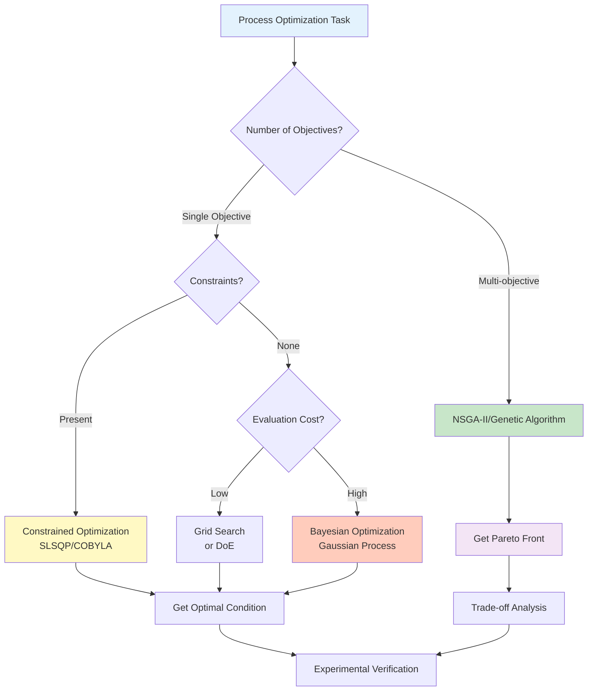

# Chapter 3: Experiencing PI with Python - Process Optimization Practice

## Learning Objectives

By reading this article, you will acquire:
- Ability to set up Python environment and install PI libraries
- Skills in process data preprocessing and visualization
- Implementation of 5+ regression models for process property prediction
- Optimization of process conditions using Bayesian optimization
- Analysis of trade-offs with multi-objective optimization
- Independent troubleshooting of errors

---

## 1. Environment Setup: 3 Options

There are three ways to set up a Python environment for chemical process optimization, depending on your situation.

### 1.1 Option 1: Anaconda (Recommended for Beginners)

**Features:**
- Scientific computing libraries included from the start
- Easy environment management (GUI available)
- Windows/Mac/Linux support

**Installation Steps:**

```bash
# 1. Download Anaconda
# Official site: https://www.anaconda.com/download
# Select Python 3.11 or higher

# 2. After installation, launch Anaconda Prompt

# 3. Create virtual environment (PI-dedicated environment)
conda create -n pi-env python=3.11 numpy pandas matplotlib scikit-learn jupyter scipy

# 4. Activate environment
conda activate pi-env

# 5. Install additional libraries
conda install -c conda-forge lightgbm scikit-optimize pymoo

# 6. Verify installation
python --version
# Output: Python 3.11.x
```

**Advantages of Anaconda:**
- ✅ NumPy, SciPy included from the start
- ✅ Fewer dependency issues
- ✅ Visual management with Anaconda Navigator
- ❌ Large file size (3GB+)

### 1.2 Option 2: venv (Python Standard)

**Features:**
- Python standard tool (no additional installation required)
- Lightweight (install only what you need)
- Project-specific environment isolation

**Installation Steps:**

```bash
# 1. Check if Python 3.11 or higher is installed
python3 --version
# Output: Python 3.11.x or higher required

# 2. Create virtual environment
python3 -m venv pi-env

# 3. Activate environment
# macOS/Linux:
source pi-env/bin/activate

# Windows (PowerShell):
pi-env\Scripts\Activate.ps1

# Windows (Command Prompt):
pi-env\Scripts\activate.bat

# 4. Upgrade pip
pip install --upgrade pip

# 5. Install required libraries
pip install numpy pandas matplotlib scikit-learn scipy jupyter
pip install lightgbm scikit-optimize pymoo

# 6. Verify installation
pip list
```

**Advantages of venv:**
- ✅ Lightweight (tens of MB)
- ✅ Python standard tool (no additional installation)
- ✅ Independent per project
- ❌ Need to resolve dependencies manually

### 1.3 Option 3: Google Colab (No Installation Required)

**Features:**
- Executable in browser only
- No installation required (cloud execution)
- Free GPU/TPU access

**Usage:**

```
1. Access Google Colab: https://colab.research.google.com
2. Create new notebook
3. Run the following code (required libraries already installed)
```

```python
# Google Colab has the following pre-installed
import numpy as np
import pandas as pd
import matplotlib.pyplot as plt
from sklearn.model_selection import train_test_split
from sklearn.ensemble import RandomForestRegressor

# Additional libraries require installation
!pip install scikit-optimize pymoo lightgbm

print("Library import successful!")
print(f"NumPy version: {np.__version__}")
print(f"Pandas version: {pd.__version__}")
```

**Advantages of Google Colab:**
- ✅ No installation required (immediate start)
- ✅ Free GPU access
- ✅ Google Drive integration (easy data storage)
- ❌ Internet connection required
- ❌ Session resets after 12 hours

### 1.4 Environment Selection Guide

| Situation | Recommended Option | Reason |
|-----------|-------------------|--------|
| First-time Python environment | Anaconda | Easy setup, fewer issues |
| Already have Python environment | venv | Lightweight, project independence |
| Want to try immediately | Google Colab | No installation, instant start |
| Large-scale optimization needed | Anaconda or venv | Local execution, no resource limits |
| Offline environment | Anaconda or venv | Local execution, no internet required |

### 1.5 Installation Verification and Troubleshooting

**Verification Commands:**

```python
# Executable in all environments
import sys
import numpy as np
import pandas as pd
import matplotlib.pyplot as plt
import sklearn
import scipy

print("===== Environment Check =====")
print(f"Python version: {sys.version}")
print(f"NumPy version: {np.__version__}")
print(f"Pandas version: {pd.__version__}")
print(f"Matplotlib version: {plt.matplotlib.__version__}")
print(f"scikit-learn version: {sklearn.__version__}")
print(f"SciPy version: {scipy.__version__}")

# PI-specific library check
try:
    import skopt
    print(f"scikit-optimize version: {skopt.__version__}")
except ImportError:
    print("⚠️ scikit-optimize not installed (pip install scikit-optimize)")

try:
    import pymoo
    print(f"pymoo version: {pymoo.__version__}")
except ImportError:
    print("⚠️ pymoo not installed (pip install pymoo)")

print("\n✅ Basic libraries are properly installed!")
```

**Common Errors and Solutions:**

| Error Message | Cause | Solution |
|---------------|-------|----------|
| `ModuleNotFoundError: No module named 'skopt'` | scikit-optimize not installed | Run `pip install scikit-optimize` |
| `ImportError: DLL load failed` (Windows) | Missing C++ redistributable package | Install Microsoft Visual C++ Redistributable |
| `SSL: CERTIFICATE_VERIFY_FAILED` | SSL certificate error | `pip install --trusted-host pypi.org --trusted-host files.pythonhosted.org <package>` |
| `MemoryError` | Out of memory | Reduce data size or use Google Colab |

---

## 2. Process Data Preparation and Visualization

We will simulate real chemical process data and perform preprocessing and visualization.

### 2.1 Example 1: Process Data Generation and Loading

**Overview:**
Generate simulated data for chemical reaction process (temperature, pressure, catalyst amount → yield).

```python
import numpy as np
import pandas as pd
import matplotlib.pyplot as plt
from sklearn.model_selection import train_test_split
import time

# Generate simulated chemical reaction process data
np.random.seed(42)
n_samples = 200

# Process conditions (input variables)
temperature = np.random.uniform(300, 500, n_samples)  # Temperature [K]
pressure = np.random.uniform(1, 10, n_samples)  # Pressure [bar]
catalyst = np.random.uniform(0.1, 5.0, n_samples)  # Catalyst amount [wt%]

# Yield model (nonlinear relationship + noise)
# Yield = f(temperature, pressure, catalyst amount) + noise
yield_percentage = (
    20  # Base yield
    + 0.15 * temperature  # Temperature effect (positive correlation)
    - 0.0002 * temperature**2  # Temperature quadratic term (optimal temperature exists)
    + 5.0 * pressure  # Pressure effect (positive correlation)
    + 3.0 * catalyst  # Catalyst effect (positive correlation)
    - 0.3 * catalyst**2  # Catalyst quadratic term (effect decreases with excess)
    + 0.01 * temperature * pressure  # Temperature-pressure interaction
    + np.random.normal(0, 3, n_samples)  # Noise (measurement error)
)

# Store data in DataFrame
process_data = pd.DataFrame({
    'temperature_K': temperature,
    'pressure_bar': pressure,
    'catalyst_wt%': catalyst,
    'yield_%': yield_percentage
})

print("===== Process Data Overview =====")
print(process_data.head(10))
print(f"\nNumber of data points: {len(process_data)}")
print(f"\nBasic statistics:")
print(process_data.describe())

# Save in CSV format (actual process data provided in this format)
process_data.to_csv('process_data.csv', index=False)
print("\n✅ Data saved to process_data.csv")
```

**Code Explanation:**
1. **Process Conditions**: Temperature (300-500 K), Pressure (1-10 bar), Catalyst amount (0.1-5.0 wt%)
2. **Yield Model**: Nonlinear relationship (quadratic terms, interaction terms) + noise
3. **Real Data Simulation**: Typical chemical reaction behavior (optimal conditions exist, effect decreases with excess)

### 2.2 Example 2: Data Visualization (Pairplot)

```python
import seaborn as sns

# Check relationships between variables with pairplot
fig = plt.figure(figsize=(12, 10))
sns.pairplot(
    process_data,
    diag_kind='hist',  # Histogram on diagonal
    plot_kws={'alpha': 0.6, 's': 50},  # Scatter plot settings
    diag_kws={'bins': 20, 'edgecolor': 'black'}  # Histogram settings
)
plt.suptitle('Process Data Pairplot', y=1.01, fontsize=16)
plt.tight_layout()
plt.show()

print("===== Correlation Matrix =====")
correlation_matrix = process_data.corr()
print(correlation_matrix)

# Visualize correlation with heatmap
plt.figure(figsize=(8, 6))
sns.heatmap(
    correlation_matrix,
    annot=True,  # Display numbers
    fmt='.3f',  # 3 decimal places
    cmap='coolwarm',  # Colormap
    center=0,  # Center at 0
    square=True,  # Square cells
    linewidths=1,  # Cell borders
    cbar_kws={'label': 'Correlation Coefficient'}
)
plt.title('Process Variable Correlation Heatmap', fontsize=14)
plt.tight_layout()
plt.show()
```

**Interpretation Points:**
- Temperature vs Yield: Curved relationship (optimal temperature exists)
- Pressure vs Yield: Positive correlation (pressure↑ → yield↑)
- Catalyst amount vs Yield: Curved relationship (effect decreases with excess)

### 2.3 Example 3: Data Preprocessing (Missing Values & Outliers)

```python
# Check and handle missing values
print("===== Missing Values Check =====")
print(process_data.isnull().sum())

# Add missing values artificially (frequent in real data)
process_data_with_missing = process_data.copy()
missing_indices = np.random.choice(process_data.index, size=10, replace=False)
process_data_with_missing.loc[missing_indices, 'catalyst_wt%'] = np.nan

print(f"\nAfter adding missing values: {process_data_with_missing.isnull().sum()['catalyst_wt%']} cases")

# Impute missing values (fill with mean)
process_data_filled = process_data_with_missing.copy()
process_data_filled['catalyst_wt%'].fillna(
    process_data_filled['catalyst_wt%'].mean(),
    inplace=True
)

print("✅ Missing values imputed with mean")

# Outlier detection (Z-score method)
from scipy import stats

z_scores = np.abs(stats.zscore(process_data[['yield_%']]))
outliers = (z_scores > 3).any(axis=1)

print(f"\n===== Outlier Detection =====")
print(f"Number of outliers: {outliers.sum()}")
print(f"Outlier percentage: {outliers.sum() / len(process_data) * 100:.1f}%")

# Remove outliers
process_data_clean = process_data[~outliers].copy()
print(f"Data count after removal: {len(process_data_clean)}")
```

### 2.4 Example 4: Feature Engineering (Interaction Terms)

```python
# Create process-specific features
process_data_enhanced = process_data_clean.copy()

# Interaction terms (temperature×pressure, temperature×catalyst)
process_data_enhanced['temp_pressure'] = (
    process_data_enhanced['temperature_K'] * process_data_enhanced['pressure_bar']
)
process_data_enhanced['temp_catalyst'] = (
    process_data_enhanced['temperature_K'] * process_data_enhanced['catalyst_wt%']
)

# Quadratic terms (temperature², catalyst²)
process_data_enhanced['temp_squared'] = process_data_enhanced['temperature_K'] ** 2
process_data_enhanced['catalyst_squared'] = process_data_enhanced['catalyst_wt%'] ** 2

# Ratio (catalyst/pressure)
process_data_enhanced['catalyst_pressure_ratio'] = (
    process_data_enhanced['catalyst_wt%'] / (process_data_enhanced['pressure_bar'] + 1e-10)
)

print("===== Data After Feature Engineering =====")
print(process_data_enhanced.head())
print(f"\nNumber of features: {len(process_data_enhanced.columns) - 1} (original 3 → 8)")
```

### 2.5 Example 5: Data Splitting (Train/Test)

```python
# Separate features and target variable
X = process_data_enhanced.drop('yield_%', axis=1)  # Input: Process conditions
y = process_data_enhanced['yield_%']  # Output: Yield

# Split into training and test data (80% vs 20%)
X_train, X_test, y_train, y_test = train_test_split(
    X, y, test_size=0.2, random_state=42
)

print("===== Data Split =====")
print(f"Training data: {len(X_train)} samples")
print(f"Test data: {len(X_test)} samples")
print(f"\nFeature column names:")
print(list(X.columns))
```

### 2.6 Example 6: Data Standardization

```python
from sklearn.preprocessing import StandardScaler

# Create standardizer (convert to mean 0, standard deviation 1)
scaler = StandardScaler()

# Learn standardization parameters from training data
X_train_scaled = scaler.fit_transform(X_train)
X_test_scaled = scaler.transform(X_test)  # Transform test data with same parameters

print("===== Standardization =====")
print("Training data (before standardization):")
print(f"  Temperature mean: {X_train['temperature_K'].mean():.1f} K")
print(f"  Temperature std: {X_train['temperature_K'].std():.1f} K")

print("\nTraining data (after standardization):")
print(f"  Temperature mean: {X_train_scaled[:, 0].mean():.3f}")
print(f"  Temperature std: {X_train_scaled[:, 0].std():.3f}")

print("\n✅ All features standardized to mean 0, std 1")
```

### 2.7 Example 7: Time Series Process Data Visualization

```python
# Generate time series process data (batch process example)
np.random.seed(42)
time_hours = np.arange(0, 24, 0.5)  # 24 hours, 0.5 hour intervals
n_points = len(time_hours)

# Time series changes in process variables
temp_time = 350 + 50 * np.sin(2 * np.pi * time_hours / 24) + np.random.normal(0, 2, n_points)
pressure_time = 5 + 2 * np.sin(2 * np.pi * time_hours / 12 + np.pi/4) + np.random.normal(0, 0.3, n_points)
yield_time = 60 + 10 * np.sin(2 * np.pi * time_hours / 24 - np.pi/2) + np.random.normal(0, 1.5, n_points)

# Visualization
fig, axes = plt.subplots(3, 1, figsize=(12, 10))

axes[0].plot(time_hours, temp_time, 'r-', linewidth=2, label='Temperature')
axes[0].set_ylabel('Temperature [K]', fontsize=12)
axes[0].legend()
axes[0].grid(True, alpha=0.3)

axes[1].plot(time_hours, pressure_time, 'b-', linewidth=2, label='Pressure')
axes[1].set_ylabel('Pressure [bar]', fontsize=12)
axes[1].legend()
axes[1].grid(True, alpha=0.3)

axes[2].plot(time_hours, yield_time, 'g-', linewidth=2, label='Yield')
axes[2].set_xlabel('Time [h]', fontsize=12)
axes[2].set_ylabel('Yield [%]', fontsize=12)
axes[2].legend()
axes[2].grid(True, alpha=0.3)

plt.suptitle('Batch Process Time Series Data', fontsize=16)
plt.tight_layout()
plt.show()
```

---

## 3. Yield Prediction with Regression Models

We implement 5 machine learning models to predict yield from process conditions.

### 3.1 Example 8: Linear Regression (Baseline)

```python
from sklearn.linear_model import LinearRegression
from sklearn.metrics import mean_absolute_error, mean_squared_error, r2_score

# Build linear regression model
start_time = time.time()
model_lr = LinearRegression()
model_lr.fit(X_train, y_train)
training_time_lr = time.time() - start_time

# Prediction
y_pred_lr = model_lr.predict(X_test)

# Evaluation
mae_lr = mean_absolute_error(y_test, y_pred_lr)
rmse_lr = np.sqrt(mean_squared_error(y_test, y_pred_lr))
r2_lr = r2_score(y_test, y_pred_lr)

print("===== Linear Regression Model Performance =====")
print(f"Training time: {training_time_lr:.4f} seconds")
print(f"Mean Absolute Error (MAE): {mae_lr:.2f} %")
print(f"Root Mean Squared Error (RMSE): {rmse_lr:.2f} %")
print(f"R-squared (R²): {r2_lr:.4f}")

# Display learned coefficients
print("\n===== Learned Coefficients (Top 3) =====")
coefficients = pd.DataFrame({
    'Feature': X.columns,
    'Coefficient': model_lr.coef_
}).sort_values('Coefficient', key=abs, ascending=False)
print(coefficients.head(3))
```

### 3.2 Example 9: Random Forest Regression

```python
from sklearn.ensemble import RandomForestRegressor

# Build Random Forest model
start_time = time.time()
model_rf = RandomForestRegressor(
    n_estimators=100,
    max_depth=15,
    min_samples_split=5,
    min_samples_leaf=2,
    random_state=42,
    n_jobs=-1
)
model_rf.fit(X_train, y_train)
training_time_rf = time.time() - start_time

# Prediction and evaluation
y_pred_rf = model_rf.predict(X_test)
mae_rf = mean_absolute_error(y_test, y_pred_rf)
rmse_rf = np.sqrt(mean_squared_error(y_test, y_pred_rf))
r2_rf = r2_score(y_test, y_pred_rf)

print("\n===== Random Forest Performance =====")
print(f"Training time: {training_time_rf:.4f} seconds")
print(f"Mean Absolute Error (MAE): {mae_rf:.2f} %")
print(f"Root Mean Squared Error (RMSE): {rmse_rf:.2f} %")
print(f"R-squared (R²): {r2_rf:.4f}")

# Feature importance
feature_importance = pd.DataFrame({
    'Feature': X.columns,
    'Importance': model_rf.feature_importances_
}).sort_values('Importance', ascending=False)

print("\n===== Feature Importance (Top 3) =====")
print(feature_importance.head(3))
```

### 3.3 Example 10: LightGBM Regression

```python
import lightgbm as lgb

# Build LightGBM model
start_time = time.time()
model_lgb = lgb.LGBMRegressor(
    n_estimators=100,
    learning_rate=0.1,
    max_depth=10,
    num_leaves=31,
    subsample=0.8,
    colsample_bytree=0.8,
    random_state=42,
    verbose=-1
)
model_lgb.fit(
    X_train, y_train,
    eval_set=[(X_test, y_test)],
    eval_metric='rmse',
    callbacks=[lgb.early_stopping(stopping_rounds=10, verbose=False)]
)
training_time_lgb = time.time() - start_time

# Prediction and evaluation
y_pred_lgb = model_lgb.predict(X_test)
mae_lgb = mean_absolute_error(y_test, y_pred_lgb)
rmse_lgb = np.sqrt(mean_squared_error(y_test, y_pred_lgb))
r2_lgb = r2_score(y_test, y_pred_lgb)

print("\n===== LightGBM Performance =====")
print(f"Training time: {training_time_lgb:.4f} seconds")
print(f"Mean Absolute Error (MAE): {mae_lgb:.2f} %")
print(f"Root Mean Squared Error (RMSE): {rmse_lgb:.2f} %")
print(f"R-squared (R²): {r2_lgb:.4f}")
```

### 3.4 Example 11: Support Vector Regression (SVR)

```python
from sklearn.svm import SVR

# Build SVR model (use standardized data)
start_time = time.time()
model_svr = SVR(
    kernel='rbf',
    C=100,
    gamma='scale',
    epsilon=0.1
)
model_svr.fit(X_train_scaled, y_train)
training_time_svr = time.time() - start_time

# Prediction and evaluation
y_pred_svr = model_svr.predict(X_test_scaled)
mae_svr = mean_absolute_error(y_test, y_pred_svr)
rmse_svr = np.sqrt(mean_squared_error(y_test, y_pred_svr))
r2_svr = r2_score(y_test, y_pred_svr)

print("\n===== SVR Performance =====")
print(f"Training time: {training_time_svr:.4f} seconds")
print(f"Mean Absolute Error (MAE): {mae_svr:.2f} %")
print(f"Root Mean Squared Error (RMSE): {rmse_svr:.2f} %")
print(f"R-squared (R²): {r2_svr:.4f}")
```

### 3.5 Example 12: Neural Network (MLP)

```python
from sklearn.neural_network import MLPRegressor

# Build MLP model
start_time = time.time()
model_mlp = MLPRegressor(
    hidden_layer_sizes=(64, 32, 16),
    activation='relu',
    solver='adam',
    alpha=0.001,
    learning_rate_init=0.01,
    max_iter=500,
    random_state=42,
    early_stopping=True,
    validation_fraction=0.2,
    verbose=False
)
model_mlp.fit(X_train_scaled, y_train)
training_time_mlp = time.time() - start_time

# Prediction and evaluation
y_pred_mlp = model_mlp.predict(X_test_scaled)
mae_mlp = mean_absolute_error(y_test, y_pred_mlp)
rmse_mlp = np.sqrt(mean_squared_error(y_test, y_pred_mlp))
r2_mlp = r2_score(y_test, y_pred_mlp)

print("\n===== MLP Performance =====")
print(f"Training time: {training_time_mlp:.4f} seconds")
print(f"Mean Absolute Error (MAE): {mae_mlp:.2f} %")
print(f"Root Mean Squared Error (RMSE): {rmse_mlp:.2f} %")
print(f"R-squared (R²): {r2_mlp:.4f}")
print(f"Number of iterations: {model_mlp.n_iter_}")
```

### 3.6 Example 13: Model Performance Comparison

```python
# Model performance comparison table
comparison = pd.DataFrame({
    'Model': ['Linear Regression', 'Random Forest', 'LightGBM', 'SVR', 'MLP'],
    'MAE (%)': [mae_lr, mae_rf, mae_lgb, mae_svr, mae_mlp],
    'RMSE (%)': [rmse_lr, rmse_rf, rmse_lgb, rmse_svr, rmse_mlp],
    'R²': [r2_lr, r2_rf, r2_lgb, r2_svr, r2_mlp],
    'Training Time (s)': [training_time_lr, training_time_rf, training_time_lgb,
                  training_time_svr, training_time_mlp]
})

print("\n===== Comprehensive Model Performance Comparison =====")
print(comparison.to_string(index=False))

# Visualization
fig, axes = plt.subplots(1, 3, figsize=(18, 5))

# MAE comparison
axes[0].bar(comparison['Model'], comparison['MAE (%)'],
            color=['blue', 'green', 'orange', 'purple', 'red'])
axes[0].set_ylabel('MAE (%)', fontsize=12)
axes[0].set_title('Mean Absolute Error (Lower is Better)', fontsize=14)
axes[0].tick_params(axis='x', rotation=45)
axes[0].grid(True, alpha=0.3, axis='y')

# R² comparison
axes[1].bar(comparison['Model'], comparison['R²'],
            color=['blue', 'green', 'orange', 'purple', 'red'])
axes[1].set_ylabel('R²', fontsize=12)
axes[1].set_title('R-squared (Closer to 1 is Better)', fontsize=14)
axes[1].tick_params(axis='x', rotation=45)
axes[1].grid(True, alpha=0.3, axis='y')

# Training time comparison
axes[2].bar(comparison['Model'], comparison['Training Time (s)'],
            color=['blue', 'green', 'orange', 'purple', 'red'])
axes[2].set_ylabel('Training Time (s)', fontsize=12)
axes[2].set_title('Training Time (Shorter is Better)', fontsize=14)
axes[2].tick_params(axis='x', rotation=45)
axes[2].grid(True, alpha=0.3, axis='y')

plt.tight_layout()
plt.show()
```

### 3.7 Example 14: Predicted vs Actual Plot

```python
# Visualize best model (LightGBM) prediction results
plt.figure(figsize=(10, 8))
plt.scatter(y_test, y_pred_lgb, alpha=0.6, s=100, c='green', edgecolors='k', linewidth=0.5)
plt.plot([y_test.min(), y_test.max()], [y_test.min(), y_test.max()],
         'r--', lw=2, label='Perfect Prediction')
plt.xlabel('Actual Yield (%)', fontsize=14)
plt.ylabel('Predicted Yield (%)', fontsize=14)
plt.title('LightGBM: Yield Prediction Accuracy', fontsize=16)
plt.legend(fontsize=12)
plt.grid(True, alpha=0.3)

# Add performance metrics as text
textstr = f'R² = {r2_lgb:.3f}\nMAE = {mae_lgb:.2f} %\nRMSE = {rmse_lgb:.2f} %'
plt.text(0.05, 0.95, textstr, transform=plt.gca().transAxes,
         fontsize=12, verticalalignment='top',
         bbox=dict(boxstyle='round', facecolor='wheat', alpha=0.5))

plt.tight_layout()
plt.show()
```

---

## 4. Process Optimization

### 4.1 Example 15: Grid Search for Optimal Conditions

```python
from scipy.optimize import minimize

# Objective function: Maximize yield (minimize negative yield)
def objective_yield(params):
    """
    params = [temperature, pressure, catalyst]
    """
    # Unpack parameters
    temp = params[0]
    press = params[1]
    cat = params[2]

    # Build features (same order as training)
    features = np.array([[
        temp, press, cat,
        temp * press,  # temp_pressure
        temp * cat,    # temp_catalyst
        temp**2,       # temp_squared
        cat**2,        # catalyst_squared
        cat / (press + 1e-10)  # catalyst_pressure_ratio
    ]])

    # Predict with model (using LightGBM)
    predicted_yield = model_lgb.predict(features)[0]

    # Return negative value for maximization
    return -predicted_yield

# Constraints (process operating range)
bounds = [
    (300, 500),  # Temperature [K]
    (1, 10),     # Pressure [bar]
    (0.1, 5.0)   # Catalyst amount [wt%]
]

# Initial guess
x0 = [400, 5, 2.5]

# Run optimization
result = minimize(
    objective_yield,
    x0,
    method='L-BFGS-B',
    bounds=bounds
)

print("===== Grid Search Optimization Results =====")
print(f"Optimal conditions:")
print(f"  Temperature: {result.x[0]:.1f} K")
print(f"  Pressure: {result.x[1]:.2f} bar")
print(f"  Catalyst amount: {result.x[2]:.2f} wt%")
print(f"\nMaximum predicted yield: {-result.fun:.2f} %")
print(f"Optimization success: {result.success}")
print(f"Number of iterations: {result.nit}")
```

### 4.2 Example 16: Bayesian Optimization (Efficient Search)

```python
from skopt import gp_minimize
from skopt.space import Real
from skopt.utils import use_named_args

# Define search space
space = [
    Real(300, 500, name='temperature'),
    Real(1, 10, name='pressure'),
    Real(0.1, 5.0, name='catalyst')
]

# Objective function (for Bayesian optimization)
@use_named_args(space)
def objective_bayes(**params):
    temp = params['temperature']
    press = params['pressure']
    cat = params['catalyst']

    # Build features
    features = np.array([[
        temp, press, cat,
        temp * press,
        temp * cat,
        temp**2,
        cat**2,
        cat / (press + 1e-10)
    ]])

    # Predicted yield (negative value for maximization)
    predicted_yield = model_lgb.predict(features)[0]
    return -predicted_yield

# Run Bayesian optimization
result_bayes = gp_minimize(
    objective_bayes,
    space,
    n_calls=30,  # 30 evaluations
    random_state=42,
    verbose=False
)

print("\n===== Bayesian Optimization Results =====")
print(f"Optimal conditions:")
print(f"  Temperature: {result_bayes.x[0]:.1f} K")
print(f"  Pressure: {result_bayes.x[1]:.2f} bar")
print(f"  Catalyst amount: {result_bayes.x[2]:.2f} wt%")
print(f"\nMaximum predicted yield: {-result_bayes.fun:.2f} %")

# Optimization convergence history
plt.figure(figsize=(10, 6))
plt.plot(range(1, len(result_bayes.func_vals) + 1),
         -result_bayes.func_vals, 'b-o', linewidth=2, markersize=6)
plt.axhline(y=-result_bayes.fun, color='r', linestyle='--',
            label=f'Best value: {-result_bayes.fun:.2f}%')
plt.xlabel('Number of Evaluations', fontsize=12)
plt.ylabel('Predicted Yield (%)', fontsize=12)
plt.title('Bayesian Optimization Convergence History', fontsize=14)
plt.legend()
plt.grid(True, alpha=0.3)
plt.tight_layout()
plt.show()
```

### 4.3 Example 17: Design of Experiments (DoE)

```python
from itertools import product

# 2-level experimental design (2^3 = 8 experiments)
levels = {
    'temperature': [350, 450],  # Low level, high level
    'pressure': [3, 8],
    'catalyst': [1.0, 4.0]
}

# Generate all combinations
experiments = list(product(levels['temperature'], levels['pressure'], levels['catalyst']))

# Calculate predicted yield for each experiment
results_doe = []
for temp, press, cat in experiments:
    features = np.array([[
        temp, press, cat,
        temp * press,
        temp * cat,
        temp**2,
        cat**2,
        cat / (press + 1e-10)
    ]])
    predicted_yield = model_lgb.predict(features)[0]
    results_doe.append({
        'Temperature [K]': temp,
        'Pressure [bar]': press,
        'Catalyst [wt%]': cat,
        'Predicted Yield [%]': predicted_yield
    })

# Convert results to DataFrame
df_doe = pd.DataFrame(results_doe).sort_values('Predicted Yield [%]', ascending=False)

print("\n===== Design of Experiments (2^3 DoE) Results =====")
print(df_doe.to_string(index=False))

# Extract best condition
best_condition = df_doe.iloc[0]
print(f"\nBest condition:")
print(f"  Temperature: {best_condition['Temperature [K]']:.0f} K")
print(f"  Pressure: {best_condition['Pressure [bar]']:.0f} bar")
print(f"  Catalyst amount: {best_condition['Catalyst [wt%]']:.1f} wt%")
print(f"  Predicted yield: {best_condition['Predicted Yield [%]']:.2f} %")
```

### 4.4 Example 18: Response Surface Method

```python
from scipy.interpolate import griddata

# Create grid for temperature and pressure range (catalyst fixed)
temp_range = np.linspace(300, 500, 50)
press_range = np.linspace(1, 10, 50)
temp_grid, press_grid = np.meshgrid(temp_range, press_range)

# Predict yield at each grid point (catalyst amount fixed to optimal value)
catalyst_fixed = result_bayes.x[2]
yield_grid = np.zeros_like(temp_grid)

for i in range(len(temp_range)):
    for j in range(len(press_range)):
        temp = temp_grid[j, i]
        press = press_grid[j, i]
        cat = catalyst_fixed

        features = np.array([[
            temp, press, cat,
            temp * press,
            temp * cat,
            temp**2,
            cat**2,
            cat / (press + 1e-10)
        ]])

        yield_grid[j, i] = model_lgb.predict(features)[0]

# Visualize response surface
fig = plt.figure(figsize=(14, 6))

# Contour plot
ax1 = fig.add_subplot(1, 2, 1)
contour = ax1.contourf(temp_grid, press_grid, yield_grid, levels=20, cmap='viridis')
ax1.set_xlabel('Temperature [K]', fontsize=12)
ax1.set_ylabel('Pressure [bar]', fontsize=12)
ax1.set_title(f'Response Surface (Catalyst = {catalyst_fixed:.2f} wt%)', fontsize=14)
plt.colorbar(contour, ax=ax1, label='Predicted Yield [%]')

# 3D surface
ax2 = fig.add_subplot(1, 2, 2, projection='3d')
surf = ax2.plot_surface(temp_grid, press_grid, yield_grid,
                        cmap='viridis', alpha=0.8)
ax2.set_xlabel('Temperature [K]', fontsize=10)
ax2.set_ylabel('Pressure [bar]', fontsize=10)
ax2.set_zlabel('Predicted Yield [%]', fontsize=10)
ax2.set_title('3D Response Surface', fontsize=14)
plt.colorbar(surf, ax=ax2, label='Predicted Yield [%]', shrink=0.5)

plt.tight_layout()
plt.show()
```

### 4.5 Example 19: Constrained Optimization

```python
from scipy.optimize import NonlinearConstraint

# Objective function (maximize yield)
def objective_constrained(params):
    temp, press, cat = params
    features = np.array([[
        temp, press, cat,
        temp * press,
        temp * cat,
        temp**2,
        cat**2,
        cat / (press + 1e-10)
    ]])
    predicted_yield = model_lgb.predict(features)[0]
    return -predicted_yield

# Constraint function: Energy cost < 100 [arbitrary units]
# Cost = 0.1 * temperature + 2.0 * pressure
def energy_cost_constraint(params):
    temp, press, cat = params
    cost = 0.1 * temp + 2.0 * press
    return cost

# Constraint: Energy cost <= 100
constraint = NonlinearConstraint(energy_cost_constraint, -np.inf, 100)

# Run optimization
result_constrained = minimize(
    objective_constrained,
    x0=[400, 5, 2.5],
    method='SLSQP',
    bounds=bounds,
    constraints=constraint
)

print("\n===== Constrained Optimization Results =====")
print(f"Optimal conditions (under energy cost constraint):")
print(f"  Temperature: {result_constrained.x[0]:.1f} K")
print(f"  Pressure: {result_constrained.x[1]:.2f} bar")
print(f"  Catalyst amount: {result_constrained.x[2]:.2f} wt%")
print(f"\nMaximum predicted yield: {-result_constrained.fun:.2f} %")
print(f"Energy cost: {energy_cost_constraint(result_constrained.x):.2f}")
print(f"Constraint satisfied: {energy_cost_constraint(result_constrained.x) <= 100}")
```

### 4.6 Example 20: Multi-objective Optimization (Yield vs Cost)

```python
from pymoo.algorithms.moo.nsga2 import NSGA2
from pymoo.core.problem import Problem
from pymoo.optimize import minimize as pymoo_minimize

# Define multi-objective optimization problem
class ProcessOptimizationProblem(Problem):
    def __init__(self):
        super().__init__(
            n_var=3,  # Number of variables (temperature, pressure, catalyst)
            n_obj=2,  # Number of objectives (yield, cost)
            xl=np.array([300, 1, 0.1]),  # Lower bounds
            xu=np.array([500, 10, 5.0])  # Upper bounds
        )

    def _evaluate(self, X, out, *args, **kwargs):
        # X: (n_samples, 3) array
        n_samples = X.shape[0]
        f1 = np.zeros(n_samples)  # Objective 1: -yield (minimize)
        f2 = np.zeros(n_samples)  # Objective 2: cost (minimize)

        for i in range(n_samples):
            temp, press, cat = X[i]

            # Predict yield
            features = np.array([[
                temp, press, cat,
                temp * press,
                temp * cat,
                temp**2,
                cat**2,
                cat / (press + 1e-10)
            ]])
            predicted_yield = model_lgb.predict(features)[0]

            # Objective 1: Maximize yield → Minimize -yield
            f1[i] = -predicted_yield

            # Objective 2: Minimize cost
            # Cost = Energy cost + Catalyst cost
            energy_cost = 0.1 * temp + 2.0 * press
            catalyst_cost = 5.0 * cat
            f2[i] = energy_cost + catalyst_cost

        out["F"] = np.column_stack([f1, f2])

# Optimize with NSGA-II algorithm
problem = ProcessOptimizationProblem()
algorithm = NSGA2(pop_size=50)

result_nsga2 = pymoo_minimize(
    problem,
    algorithm,
    ('n_gen', 100),  # 100 generations
    verbose=False
)

# Get Pareto optimal solutions
pareto_front = result_nsga2.F
pareto_solutions = result_nsga2.X

print("\n===== Multi-objective Optimization (NSGA-II) Results =====")
print(f"Number of Pareto optimal solutions: {len(pareto_solutions)}")
print(f"\nPareto optimal solution examples (first 3):")
for i in range(min(3, len(pareto_solutions))):
    temp, press, cat = pareto_solutions[i]
    yield_val = -pareto_front[i, 0]
    cost_val = pareto_front[i, 1]
    print(f"\nSolution {i+1}:")
    print(f"  Temperature: {temp:.1f} K, Pressure: {press:.2f} bar, Catalyst: {cat:.2f} wt%")
    print(f"  Yield: {yield_val:.2f} %, Cost: {cost_val:.2f}")

# Visualize Pareto front
plt.figure(figsize=(10, 6))
plt.scatter(-pareto_front[:, 0], pareto_front[:, 1],
            c='blue', s=50, alpha=0.6, edgecolors='k', linewidth=0.5)
plt.xlabel('Yield [%]', fontsize=12)
plt.ylabel('Cost [arbitrary units]', fontsize=12)
plt.title('Pareto Front (Yield vs Cost)', fontsize=14)
plt.grid(True, alpha=0.3)
plt.tight_layout()
plt.show()
```

### 4.7 Example 21: Optimization Results Comparison

```python
# Compare results of all optimization methods
optimization_results = pd.DataFrame({
    'Method': [
        'Grid Search',
        'Bayesian Optimization',
        'DoE (2^3)',
        'Constrained Optimization'
    ],
    'Temperature [K]': [
        result.x[0],
        result_bayes.x[0],
        best_condition['Temperature [K]'],
        result_constrained.x[0]
    ],
    'Pressure [bar]': [
        result.x[1],
        result_bayes.x[1],
        best_condition['Pressure [bar]'],
        result_constrained.x[1]
    ],
    'Catalyst [wt%]': [
        result.x[2],
        result_bayes.x[2],
        best_condition['Catalyst [wt%]'],
        result_constrained.x[2]
    ],
    'Predicted Yield [%]': [
        -result.fun,
        -result_bayes.fun,
        best_condition['Predicted Yield [%]'],
        -result_constrained.fun
    ]
})

print("\n===== Optimization Method Comparison =====")
print(optimization_results.to_string(index=False))
```

### 4.8 Example 22: Optimization Method Flowchart

```python
# Mermaid flowchart (displayed in Markdown)
print("""

""")
```

---

## 5. Advanced Techniques

### 5.9 Example 23: Hyperparameter Tuning (Grid Search)

```python
from sklearn.model_selection import GridSearchCV

# Random Forest hyperparameter candidates
param_grid = {
    'n_estimators': [50, 100, 200],
    'max_depth': [10, 15, 20],
    'min_samples_split': [2, 5, 10]
}

# Grid Search settings
grid_search = GridSearchCV(
    estimator=RandomForestRegressor(random_state=42),
    param_grid=param_grid,
    cv=5,  # 5-fold cross-validation
    scoring='neg_mean_absolute_error',
    n_jobs=-1,
    verbose=1
)

# Run Grid Search
print("===== Grid Search Started =====")
grid_search.fit(X_train, y_train)

print(f"\n===== Best Hyperparameters =====")
for param, value in grid_search.best_params_.items():
    print(f"{param}: {value}")

print(f"\nCross-validation MAE: {-grid_search.best_score_:.2f} %")

# Evaluate best model on test data
best_model_gs = grid_search.best_estimator_
y_pred_gs = best_model_gs.predict(X_test)
mae_gs = mean_absolute_error(y_test, y_pred_gs)
r2_gs = r2_score(y_test, y_pred_gs)

print(f"\nTest data performance:")
print(f"  MAE: {mae_gs:.2f} %")
print(f"  R²: {r2_gs:.4f}")
```

### 5.10 Example 24: Time Series Process Anomaly Detection

```python
from sklearn.ensemble import IsolationForest

# Time series process data (using data generated in Example 7)
process_time_series = pd.DataFrame({
    'time_h': time_hours,
    'temperature_K': temp_time,
    'pressure_bar': pressure_time,
    'yield_%': yield_time
})

# Anomaly detection with Isolation Forest
iso_forest = IsolationForest(
    contamination=0.1,  # Assume 10% anomaly rate
    random_state=42
)

# Features (temperature, pressure, yield)
X_anomaly = process_time_series[['temperature_K', 'pressure_bar', 'yield_%']]

# Calculate anomaly scores
anomaly_scores = iso_forest.fit_predict(X_anomaly)
process_time_series['anomaly'] = anomaly_scores

# Extract anomalous data
anomalies = process_time_series[process_time_series['anomaly'] == -1]

print(f"\n===== Anomaly Detection Results =====")
print(f"Anomalous data count: {len(anomalies)} / {len(process_time_series)}")
print(f"Anomaly rate: {len(anomalies) / len(process_time_series) * 100:.1f}%")

# Visualization
plt.figure(figsize=(14, 5))
plt.plot(process_time_series['time_h'], process_time_series['yield_%'],
         'b-', linewidth=1.5, label='Normal Data')
plt.scatter(anomalies['time_h'], anomalies['yield_%'],
            c='red', s=100, marker='x', linewidth=2, label='Anomalous Data')
plt.xlabel('Time [h]', fontsize=12)
plt.ylabel('Yield [%]', fontsize=12)
plt.title('Time Series Process Anomaly Detection', fontsize=14)
plt.legend()
plt.grid(True, alpha=0.3)
plt.tight_layout()
plt.show()
```

### 5.11 Example 25: SHAP Value Interpretability Analysis

```python
# Analyze feature influence with SHAP (SHapley Additive exPlanations)
try:
    import shap

    # Create SHAP Explainer (for LightGBM)
    explainer = shap.TreeExplainer(model_lgb)
    shap_values = explainer.shap_values(X_test)

    # SHAP value summary plot
    plt.figure(figsize=(10, 6))
    shap.summary_plot(shap_values, X_test, feature_names=X.columns, show=False)
    plt.title('SHAP Value Summary Plot (Feature Influence)', fontsize=14)
    plt.tight_layout()
    plt.show()

    print("\n✅ SHAP value analysis completed")
    print("Visualized how each feature influences predictions.")

except ImportError:
    print("\n⚠️ SHAP library not installed")
    print("Install with: pip install shap")
```

### 5.12 Example 26: Process Simulation (PID Control)

```python
# Simple PID controller simulation
class PIDController:
    def __init__(self, Kp, Ki, Kd, setpoint):
        self.Kp = Kp  # Proportional gain
        self.Ki = Ki  # Integral gain
        self.Kd = Kd  # Derivative gain
        self.setpoint = setpoint  # Target value
        self.integral = 0
        self.prev_error = 0

    def update(self, measured_value, dt):
        # Calculate error
        error = self.setpoint - measured_value

        # Integral term
        self.integral += error * dt

        # Derivative term
        derivative = (error - self.prev_error) / dt

        # PID output
        output = (
            self.Kp * error +
            self.Ki * self.integral +
            self.Kd * derivative
        )

        # Save error for next step
        self.prev_error = error

        return output

# Process model (first-order lag system)
def process_model(input_val, current_temp, tau=5.0, K=1.0, dt=0.1):
    """
    First-order lag system process model
    tau: time constant, K: gain
    """
    dT = (K * input_val - current_temp) / tau
    new_temp = current_temp + dT * dt
    return new_temp

# Simulation setup
dt = 0.1  # Time step [seconds]
t_end = 50  # Simulation time [seconds]
time_sim = np.arange(0, t_end, dt)

# Initialize PID controller (target temperature: 400 K)
pid = PIDController(Kp=2.0, Ki=0.5, Kd=1.0, setpoint=400)

# Run simulation
temperature = 350  # Initial temperature [K]
temperatures = []
inputs = []

for t in time_sim:
    # Calculate PID control input
    control_input = pid.update(temperature, dt)

    # Update temperature with process model
    temperature = process_model(control_input, temperature, dt=dt)

    # Record
    temperatures.append(temperature)
    inputs.append(control_input)

# Visualization
fig, axes = plt.subplots(2, 1, figsize=(12, 8))

# Temperature trajectory
axes[0].plot(time_sim, temperatures, 'b-', linewidth=2, label='Process Temperature')
axes[0].axhline(y=400, color='r', linestyle='--', linewidth=1.5, label='Target Temperature')
axes[0].set_ylabel('Temperature [K]', fontsize=12)
axes[0].set_title('PID Control Simulation', fontsize=14)
axes[0].legend()
axes[0].grid(True, alpha=0.3)

# Control input trajectory
axes[1].plot(time_sim, inputs, 'g-', linewidth=2, label='Control Input')
axes[1].set_xlabel('Time [seconds]', fontsize=12)
axes[1].set_ylabel('Control Input', fontsize=12)
axes[1].legend()
axes[1].grid(True, alpha=0.3)

plt.tight_layout()
plt.show()

print(f"\n===== PID Control Simulation Results =====")
print(f"Final temperature: {temperatures[-1]:.2f} K (Target: 400 K)")
print(f"Steady-state error: {abs(400 - temperatures[-1]):.2f} K")
```

---

## 6. Troubleshooting Guide

### 6.1 Common Error List

| Error Message | Cause | Solution |
|---------------|-------|----------|
| `ModuleNotFoundError: No module named 'skopt'` | scikit-optimize not installed | `pip install scikit-optimize` |
| `ValueError: Input contains NaN` | Data contains missing values | Remove with `df.dropna()` or impute with `df.fillna()` |
| `ConvergenceWarning` | Optimization not converged | Increase `max_iter`, adjust learning rate |
| `MemoryError` | Out of memory | Reduce data size, use batch processing |
| `LinAlgError: Singular matrix` | Matrix is singular | Check multicollinearity, add regularization |

### 6.2 Debug Checklist

**Step 1: Check Data**
```python
# Basic statistics
print(process_data.describe())

# Check missing values
print(process_data.isnull().sum())

# Check data types
print(process_data.dtypes)
```

**Step 2: Simplify Model**
```python
# If complex model fails, try linear regression first
model_simple = LinearRegression()
model_simple.fit(X_train, y_train)
print(f"Linear regression R²: {model_simple.score(X_test, y_test):.4f}")
```

**Step 3: Check Scaling**
```python
# Standardization required for SVR and MLP
from sklearn.preprocessing import StandardScaler
scaler = StandardScaler()
X_train_scaled = scaler.fit_transform(X_train)
X_test_scaled = scaler.transform(X_test)
```

---

## 7. Project Challenge: Chemical Reactor Optimization

Apply what you've learned to a practical project.

### 7.1 Project Overview

**Goal:**
Optimize chemical reactor operating conditions to maximize yield

**Target Performance:**
- Prediction model: R² > 0.85
- Optimization: Yield > 90%

### 7.2 Step-by-Step Guide

**Step 1: Data Generation (More Realistic Data)**
```python
# Generate more complex reactor data
np.random.seed(42)
n_reactor = 300

temp_reactor = np.random.uniform(320, 480, n_reactor)
press_reactor = np.random.uniform(2, 12, n_reactor)
cat_reactor = np.random.uniform(0.5, 6.0, n_reactor)
residence_time = np.random.uniform(5, 30, n_reactor)  # Residence time [min]

# More complex yield model (4 variables, interactions, optimal values)
yield_reactor = (
    25
    + 0.18 * temp_reactor
    - 0.00025 * temp_reactor**2
    + 6.0 * press_reactor
    - 0.3 * press_reactor**2
    + 4.0 * cat_reactor
    - 0.4 * cat_reactor**2
    + 1.5 * residence_time
    - 0.03 * residence_time**2
    + 0.015 * temp_reactor * press_reactor
    + 0.008 * cat_reactor * residence_time
    + np.random.normal(0, 2.5, n_reactor)
)

reactor_data = pd.DataFrame({
    'temperature': temp_reactor,
    'pressure': press_reactor,
    'catalyst': cat_reactor,
    'residence_time': residence_time,
    'yield': yield_reactor
})

print("===== Reactor Data =====")
print(reactor_data.describe())
```

**Step 2: Feature Engineering**
```python
# Add features
reactor_data['temp_press'] = reactor_data['temperature'] * reactor_data['pressure']
reactor_data['cat_time'] = reactor_data['catalyst'] * reactor_data['residence_time']
reactor_data['temp_sq'] = reactor_data['temperature'] ** 2
reactor_data['press_sq'] = reactor_data['pressure'] ** 2

X_reactor = reactor_data.drop('yield', axis=1)
y_reactor = reactor_data['yield']

X_train_r, X_test_r, y_train_r, y_test_r = train_test_split(
    X_reactor, y_reactor, test_size=0.2, random_state=42
)
```

**Step 3: Model Training (LightGBM)**
```python
model_reactor = lgb.LGBMRegressor(
    n_estimators=200,
    learning_rate=0.05,
    max_depth=15,
    random_state=42,
    verbose=-1
)
model_reactor.fit(X_train_r, y_train_r)

y_pred_r = model_reactor.predict(X_test_r)
r2_reactor = r2_score(y_test_r, y_pred_r)
mae_reactor = mean_absolute_error(y_test_r, y_pred_r)

print(f"\n===== Reactor Model Performance =====")
print(f"R²: {r2_reactor:.3f}")
print(f"MAE: {mae_reactor:.2f}%")

if r2_reactor > 0.85:
    print("🎉 Goal achieved! (R² > 0.85)")
```

**Step 4: Bayesian Optimization for Condition Search**
```python
# Search for optimal conditions
space_reactor = [
    Real(320, 480, name='temperature'),
    Real(2, 12, name='pressure'),
    Real(0.5, 6.0, name='catalyst'),
    Real(5, 30, name='residence_time')
]

@use_named_args(space_reactor)
def objective_reactor(**params):
    temp = params['temperature']
    press = params['pressure']
    cat = params['catalyst']
    res_time = params['residence_time']

    features = np.array([[
        temp, press, cat, res_time,
        temp * press,
        cat * res_time,
        temp**2,
        press**2
    ]])

    predicted_yield = model_reactor.predict(features)[0]
    return -predicted_yield

result_reactor = gp_minimize(
    objective_reactor,
    space_reactor,
    n_calls=50,
    random_state=42,
    verbose=False
)

print(f"\n===== Optimal Conditions =====")
print(f"Temperature: {result_reactor.x[0]:.1f} K")
print(f"Pressure: {result_reactor.x[1]:.2f} bar")
print(f"Catalyst amount: {result_reactor.x[2]:.2f} wt%")
print(f"Residence time: {result_reactor.x[3]:.1f} min")
print(f"\nMaximum predicted yield: {-result_reactor.fun:.2f}%")

if -result_reactor.fun > 90:
    print("🎉 Goal achieved! (Yield > 90%)")
```

---

## 8. Summary

### What You Learned in This Chapter

1. **Environment Setup**
   - Three options: Anaconda, venv, Google Colab
   - Installation of PI-specific libraries (scikit-optimize, pymoo)

2. **Process Data Processing**
   - Data generation and visualization (pairplot, heatmap)
   - Preprocessing (missing value imputation, outlier removal, standardization)
   - Feature engineering (interaction terms, quadratic terms)

3. **5 Regression Models**
   - Linear regression, Random Forest, LightGBM, SVR, MLP
   - Model performance comparison (MAE, RMSE, R²)

4. **Process Optimization Methods**
   - Grid search, Bayesian optimization, DoE, response surface method
   - Constrained optimization, multi-objective optimization (NSGA-II)

5. **Advanced Techniques**
   - Hyperparameter tuning
   - Anomaly detection (Isolation Forest)
   - Interpretability analysis (SHAP values)
   - PID control simulation

### Next Steps

**After completing this tutorial, you can:**
- ✅ Preprocess and visualize process data
- ✅ Use 5+ regression models appropriately
- ✅ Optimize process conditions with Bayesian optimization
- ✅ Analyze trade-offs with multi-objective optimization

**What to learn next:**
1. **Application to Real Processes**
   - Data acquisition from DCS (Distributed Control System)
   - Real-time optimization

2. **Deep Learning Applications**
   - LSTM (time series prediction)
   - Autoencoder (anomaly detection)

3. **Autonomous Process Control**
   - Reinforcement learning control
   - Model Predictive Control (MPC)

---

## Exercise Problems

### Problem 1 (Difficulty: Easy)

List three reasons why Bayesian optimization is superior to grid search for process optimization.

<details>
<summary>Answer</summary>

**Advantages of Bayesian Optimization:**

1. **Fewer Evaluations Required**
   - Grid search: Try all combinations (e.g., 10×10×10 = 1000 times)
   - Bayesian optimization: Reach optimal solution in ~30-50 evaluations

2. **Intelligent Search**
   - Utilizes past evaluation results to prioritize promising regions
   - Grid search blindly explores all combinations

3. **Reduced Experimental Cost**
   - Chemical process experiments take hours to days per run
   - Fewer evaluations = significant reduction in total experiment time

**Example:**
- Grid search: 1000 experiments × 3 hours = 3000 hours (125 days)
- Bayesian optimization: 50 experiments × 3 hours = 150 hours (6.25 days)

**Approximately 20× time reduction!**

</details>

### Problem 2 (Difficulty: Medium)

Explain what a Pareto front obtained from multi-objective optimization (NSGA-II) is and provide one application example in chemical processes.

<details>
<summary>Answer</summary>

**What is Pareto Front:**

In simultaneous optimization of multiple objectives, there exists a trade-off relationship where improving one objective worsens another. The Pareto front is "the set of solutions where no objective can be improved without worsening others."

**Characteristics:**
- All solutions on Pareto front are "optimal solutions"
- Which solution to choose depends on decision maker's priorities

**Chemical Process Application Example: Distillation Column Optimization**

**Objective 1**: Minimize energy cost
**Objective 2**: Maximize product purity

**Pareto Front Example:**

| Solution | Energy Cost | Product Purity |
|----------|------------|----------------|
| A  | Low (100 $/kg)   | Low (95%) |
| B  | Medium (150 $/kg)   | Medium (98%) |
| C  | High (200 $/kg)   | High (99.5%) |

**Selection Criteria:**
- Cost-focused → Solution A (minimum energy cost)
- Quality-focused → Solution C (maximum purity)
- Balanced → Solution B (middle ground)

NSGA-II automatically discovers such Pareto fronts.

</details>

### Problem 3 (Difficulty: Hard)

Explain the impact of PID control parameters (Kp, Ki, Kd) on temperature control behavior, describing advantages and disadvantages when increasing each parameter.

<details>
<summary>Answer</summary>

**PID Parameter Impacts:**

**1. Increasing Kp (Proportional Gain)**

**Advantages:**
- Faster response (reach target faster)
- Reduced steady-state error

**Disadvantages:**
- Larger overshoot (oscillation beyond target)
- Reduced stability (oscillatory behavior)

**2. Increasing Ki (Integral Gain)**

**Advantages:**
- Complete elimination of steady-state error
- Improved long-term accuracy

**Disadvantages:**
- Slower response (takes time to accumulate integral term)
- Wind-up phenomenon (integral term becomes excessively large)
- Increased overshoot

**3. Increasing Kd (Derivative Gain)**

**Advantages:**
- Overshoot suppression (anticipatory control)
- Improved stability
- Oscillation damping

**Disadvantages:**
- Sensitive to noise (amplifies small measurement fluctuations)
- Potential high-frequency oscillations

**Optimal Tuning Methods:**

1. **Ziegler-Nichols method** (classical)
2. **Auto-tuning** (modern)
3. **Simulation-based optimization** (applying Bayesian optimization learned in this chapter)

**Implementation Example:**
```python
# Auto-tune PID parameters with Bayesian optimization
space_pid = [
    Real(0.1, 10.0, name='Kp'),
    Real(0.01, 1.0, name='Ki'),
    Real(0.01, 5.0, name='Kd')
]

@use_named_args(space_pid)
def objective_pid(**params):
    # Run PID simulation
    # Goal: Minimize overshoot + settling time
    overshoot, settling_time = simulate_pid(
        Kp=params['Kp'],
        Ki=params['Ki'],
        Kd=params['Kd']
    )
    return overshoot + 0.1 * settling_time

# Run optimization
result_pid = gp_minimize(objective_pid, space_pid, n_calls=50)
```

</details>

---

## References

1. Pedregosa, F., et al. (2011). "Scikit-learn: Machine Learning in Python." *Journal of Machine Learning Research*, 12, 2825-2830.
   URL: https://scikit-learn.org

2. Brochu, E., Cora, V. M., & de Freitas, N. (2010). "A Tutorial on Bayesian Optimization of Expensive Cost Functions." arXiv:1012.2599.
   URL: https://arxiv.org/abs/1012.2599

3. Deb, K., et al. (2002). "A fast and elitist multiobjective genetic algorithm: NSGA-II." *IEEE Transactions on Evolutionary Computation*, 6(2), 182-197.
   DOI: [10.1109/4235.996017](https://doi.org/10.1109/4235.996017)

4. Shahriari, B., et al. (2016). "Taking the Human Out of the Loop: A Review of Bayesian Optimization." *Proceedings of the IEEE*, 104(1), 148-175.
   DOI: [10.1109/JPROC.2015.2494218](https://doi.org/10.1109/JPROC.2015.2494218)

5. Lundberg, S. M., & Lee, S. I. (2017). "A Unified Approach to Interpreting Model Predictions." *Advances in Neural Information Processing Systems*, 30.
   URL: https://github.com/slundberg/shap

6. Åström, K. J., & Hägglund, T. (2006). *Advanced PID Control*. ISA-The Instrumentation, Systems, and Automation Society.
   ISBN: 978-1556179426

7. scikit-optimize Documentation. (2024). "Bayesian Optimization."
   URL: https://scikit-optimize.github.io/stable/

8. pymoo Documentation. (2024). "Multi-objective Optimization."
   URL: https://pymoo.org/

---

**Created**: 2025-10-16
**Version**: 1.0
**Series**: PI Introduction Series v1.0
**Author**: MI Knowledge Hub Project
