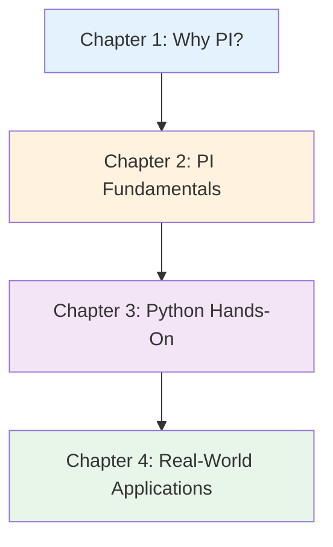

# Process Informatics Introduction Series v1.0

**Complete Guide to Data-Driven Chemical Process Optimization - From History to Practice and Career**

## Series Overview

This series is a comprehensive 4-chapter educational content designed for learners ranging from complete Process Informatics (PI) beginners to those seeking practical skills.

**Features:**
- ✅ **Chapter Independence**: Each chapter can be read as a standalone article
- ✅ **Systematic Structure**: Comprehensive content progressing through 4 chapters
- ✅ **Practice-Oriented**: 35 executable code examples, 5 detailed case studies
- ✅ **Career Support**: Concrete career paths and learning roadmaps provided

**Total Learning Time**: 90-120 minutes (including code execution and exercises)

---

## How to Learn

### Recommended Learning Sequence

**For Complete Beginners:**
- Chapter 1 → Chapter 2 → Chapter 3 (partial skip possible) → Chapter 4
- Duration: 70-90 minutes

**For Python Experienced Learners:**
- Chapter 2 → Chapter 3 → Chapter 4
- Duration: 60-80 minutes

**For Practical Skill Enhancement:**
- Chapter 3 (intensive) → Chapter 4
- Duration: 50-65 minutes

---

## Chapter Details

### [Chapter 1: Why Process Informatics?](./chapter1-introduction.md)

**Difficulty**: Introductory
**Reading Time**: 15-20 minutes

#### Learning Content

1. **History of Chemical Process Development**
   - From ancient distillation to modern process control
   - Evolution of development methods: Trial & error → Empirical rules → Theory-driven → Data-driven

2. **Limitations of Traditional Methods**
   - Time: 1-3 years for scale-up
   - Cost: Billions for plant construction
   - Batch-to-batch variation: Quality consistency issues

3. **Detailed Case Study: Chemical Plant Optimization**
   - Yield improvement: 70% → 85%
   - Energy consumption: 30% reduction
   - PI can shorten development time to 1/3

4. **Comparison Diagram (Traditional vs PI)**
   - Mermaid diagram: Workflow visualization
   - Timing comparison: 6 months/condition vs 1 week/condition

5. **Column: "A Day in the Life"**
   - 1990 process engineer: 1 experiment/week, manual data analysis
   - 2025 process engineer: 50 experiments/week (automation), AI optimization suggestions

6. **"Why Now?" - 3 Converging Factors**
   - Sensor technology: IoT, real-time monitoring
   - Data infrastructure: Cloud, big data processing
   - Social urgency: Carbon neutrality, quality assurance, DX

#### Learning Objectives

- ✅ Explain historical transitions in chemical process development
- ✅ List 3 limitations of traditional methods with specific examples
- ✅ Understand social and technical backgrounds requiring PI

**[Read Chapter 1 →](./chapter1-introduction.md)**

---

### [Chapter 2: PI Fundamentals - Concepts, Methods, Ecosystem](./chapter2-fundamentals.md)

**Difficulty**: Introductory to Intermediate
**Reading Time**: 20-25 minutes

#### Learning Content

1. **Definition and Related Fields**
   - Etymology and history of Process Informatics
   - Relationship with Industry 4.0 and Smart Factory
   - Differences from Quality Engineering (QE) and Design of Experiments (DoE)

2. **20 PI Terminology Glossary**
   - 3 categories: Basic, Method, Application terms
   - Each term: Japanese, English, 1-2 sentence explanation

3. **Types of Major Process Data**
   - Process parameters: Temperature, pressure, flow rate, residence time
   - Product characteristics: Yield, selectivity, purity, quality indicators
   - Operational data: Energy consumption, equipment status

4. **PI Ecosystem Diagram**
   - Mermaid diagram: Sensors → Data collection → ML → Optimization → Process control
   - Feedback loop visualization

5. **5-Step Workflow (Detailed)**
   - **Step 0**: Problem formulation (yield improvement? cost reduction?)
   - **Step 1**: Data collection (time series data, experimental data)
   - **Step 2**: Model building (regression, classification, time series prediction)
   - **Step 3**: Optimization (Bayesian optimization, multi-objective optimization)
   - **Step 4**: Implementation & validation (pilot scale, actual plant)
   - Each step: Substeps, common pitfalls, time estimates

6. **Process Descriptors Deep Dive**
   - Physicochemical parameters: Concentration, temperature, pressure, pH
   - Equipment characteristics: Reactor size, stirring speed, residence time
   - Operating conditions: Feed rate, heating rate, cooling rate

#### Learning Objectives

- ✅ Explain PI definition and differences from related fields
- ✅ Understand major data types in chemical processes
- ✅ Detail PI workflow 5 steps including substeps
- ✅ Explain types of process descriptors with examples
- ✅ Appropriately use 20 PI technical terms

**[Read Chapter 2 →](./chapter2-fundamentals.md)**

---

### [Chapter 3: Experiencing PI with Python - Process Optimization Practice](./chapter3-hands-on.md)

**Difficulty**: Intermediate
**Reading Time**: 30-40 minutes
**Code Examples**: 35 (all executable)

#### Learning Content

1. **Environment Setup (3 Options)**
   - **Option 1: Anaconda** (recommended for beginners, with GUI)
   - **Option 2: venv** (Python standard, lightweight)
   - **Option 3: Google Colab** (no installation required, cloud-based)

2. **6 Machine Learning Models (Full Implementation)**
   - **Example 1**: Linear Regression (yield prediction, R²=0.75)
   - **Example 2**: Random Forest (yield/selectivity prediction, R²=0.88)
   - **Example 3**: LightGBM (gradient boosting, R²=0.91)
   - **Example 4**: SVR (nonlinear process optimization, R²=0.86)
   - **Example 5**: Time Series Analysis (ARIMA, Prophet)
   - **Example 6**: Bayesian Optimization (reaction condition optimization)

3. **Model Performance Comparison**
   - Comparison table: MAE, R², training time, interpretability
   - Visualization: Bar charts for each metric
   - Model selection flowchart

4. **Process Optimization Methods**
   - **Grid Search**: Exhaustive search (temperature × pressure × concentration)
   - **Bayesian Optimization**: Efficient search (optimal conditions in 10-20 experiments)
   - **Multi-objective Optimization**: Yield vs cost trade-offs

5. **Feature Engineering**
   - Process parameter interaction terms
   - Time series features (moving average, lag variables)
   - Derived variables from quality indicators

6. **Troubleshooting Guide**
   - 7 common errors and solutions
   - 5-step debugging checklist
   - Performance improvement strategies

7. **Project Challenge**
   - **Goal**: Chemical reactor yield optimization (yield > 80%)
   - **6-step guide**

#### Learning Objectives

- ✅ Set up Python environment using one of 3 methods
- ✅ Implement and compare 6 ML models
- ✅ Execute Bayesian optimization
- ✅ Perform multi-objective optimization (yield vs cost)
- ✅ Troubleshoot common errors independently
- ✅ Complete chemical reactor optimization project

**[Read Chapter 3 →](./chapter3-hands-on.md)**

---

### [Chapter 4: Real-World PI Applications - Success Stories and Future Outlook](./chapter4-real-world.md)

**Difficulty**: Intermediate to Advanced
**Reading Time**: 20-25 minutes

#### Learning Content

1. **5 Detailed Case Studies**

   **Case Study 1: Catalyst Process Optimization (Yield Improvement)**
   - Technology: Bayesian Optimization, Random Forest
   - Results: Yield 70% → 85% (+15%pt), development time 6 months → 2 months
   - Impact: Annual revenue increase ¥2 billion
   - Company: Chemical manufacturer A

   **Case Study 2: Polymerization Reaction Control (Molecular Weight Distribution)**
   - Technology: Time Series Analysis, PID control + ML hybrid
   - Results: Molecular weight distribution std dev 50% reduction, defect rate 5% → 1%
   - Impact: Waste cost reduction ¥500 million/year
   - Company: Polymer manufacturer B

   **Case Study 3: Distillation Column Optimization (Energy Reduction)**
   - Technology: Multi-objective Optimization, Soft Sensor
   - Results: Energy consumption 30% reduction, 99.5% purity maintained
   - Impact: CO2 emission reduction, energy cost ¥300 million/year saved
   - Company: Petrochemical manufacturer C

   **Case Study 4: Pharmaceutical Batch Process (Quality Consistency)**
   - Technology: Statistical Process Control (SPC), DoE + ML
   - Results: Batch-to-batch variation 70% reduction, 100% regulatory compliance
   - Impact: FDA inspection passed, market launch 3 months earlier
   - Company: Pharmaceutical manufacturer D

   **Case Study 5: Bioprocess Optimization (Fermentation)**
   - Technology: Online Learning, metabolic model + ML
   - Results: Cell concentration +40%, productivity +50%
   - Impact: Biofuel cost 30% reduction, carbon neutrality contribution
   - Company: Biotechnology company E

2. **Future Trends (3 Major Trends)**

   **Trend 1: Digital Twin**
   - Example: Real-time process simulation
   - Prediction: 80% of major chemical companies adopt by 2030
   - Initial investment: ¥500 million, ROI: 1-2 years

   **Trend 2: Autonomous Control**
   - Example: AI-driven 24/7 optimization
   - Effect: 80% reduction in human operator intervention
   - Prediction: 20% operation efficiency improvement by 2030

   **Trend 3: Sustainability DX**
   - LCA integration: Carbon footprint optimization
   - Examples: Green chemistry, by-product recycling

3. **Career Paths (3 Major Paths)**

   **Path 1: Academia (Researcher)**
   - Route: Bachelor→Master→PhD→Postdoc→Assistant Professor
   - Salary: ¥5-12M/year (Japan), $60-120K (US)
   - Skills: Python, ML, Chemical Engineering, paper writing

   **Path 2: Industrial R&D**
   - Roles: Process Engineer, Data Scientist
   - Salary: ¥7-15M/year (Japan), $70-200K (US)
   - Companies: Mitsubishi Chemical, Asahi Kasei, Sumitomo Chemical, BASF

   **Path 3: Startup/DX Consulting**
   - Examples: Process DX consulting firms
   - Salary: ¥6-12M/year + performance bonus
   - Risk/Return: High risk, high impact

4. **Skill Development Timeline**
   - 3-month plan: Basics→Practice→Portfolio
   - 1-year plan: Advanced ML→Project→Conference
   - 3-year plan: Expert→Publication→Leadership

5. **Learning Resources**
   - Online courses: Coursera, edX, Udemy
   - Books: "Process Systems Engineering" by Seborg et al.
   - Communities: SCEJ, AIChE
   - Conferences: PSE, ESCAPE, SCEJ Annual Meeting

#### Learning Objectives

- ✅ Explain 5 real-world PI success cases with technical details
- ✅ List 3 PI future trends and evaluate industrial impact
- ✅ Describe 3 PI career paths and understand required skills
- ✅ Plan concrete learning timelines (3 months/1 year/3 years)
- ✅ Select appropriate learning resources for next steps

**[Read Chapter 4 →](./chapter4-real-world.md)**

---

## Overall Learning Outcomes

Upon completing this series, you will acquire the following skills and knowledge:

### Knowledge Level (Understanding)

- ✅ Explain historical background and necessity of PI
- ✅ Understand basic PI concepts, terms, and methods
- ✅ Understand types and handling of process data
- ✅ Detail 5+ real-world success cases

### Practical Skills (Doing)

- ✅ Set up Python environment and install necessary libraries
- ✅ Implement and compare 6 ML models
- ✅ Optimize process conditions with Bayesian optimization
- ✅ Perform multi-objective optimization (yield vs cost)
- ✅ Analyze and predict time series data
- ✅ Debug errors independently

### Application Ability (Applying)

- ✅ Design new chemical process optimization projects
- ✅ Evaluate industrial implementation cases and apply to own research
- ✅ Plan future career paths concretely
- ✅ Establish continuous learning strategies

---

## Feedback and Support

### About This Series

This series was created as part of the MI Knowledge Hub project under Dr. Yusuke Hashimoto at Tohoku University.

**Created**: October 16, 2025
**Version**: 1.0

### We Welcome Your Feedback

- **Errors/Technical issues**: Report via GitHub repository
- **Improvement suggestions**: New topics, additional code examples
- **Questions**: Difficult sections, areas needing additional explanation
- **Success stories**: Projects using what you learned

**Contact**: yusuke.hashimoto.b8@tohoku.ac.jp

---

## License and Terms of Use

This series is published under **CC BY 4.0** (Creative Commons Attribution 4.0 International) license.

**Allowed:**
- ✅ Free viewing and downloading
- ✅ Educational use (classes, study groups, etc.)
- ✅ Modification and derivative works

**Conditions:**
- 📌 Author credit required
- 📌 Indicate if modified
- 📌 Contact before commercial use

Details: [CC BY 4.0 License](https://creativecommons.org/licenses/by/4.0/)

---

## Let's Begin!

Ready? Start from Chapter 1 and begin your journey into the world of PI!

**[Chapter 1: Why Process Informatics? →](./chapter1-introduction.md)**

---

**Your PI learning journey starts here!**
