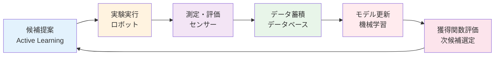

# 第4章：材料探索への応用と実践

**ベイズ最適化・DFT・実験ロボットとの統合**

## 学習目標

この章を読むことで、以下を習得できます：

- ✅ Active LearningとベイズOの統合手法を理解している
- ✅ 高スループット計算に最適化を適用できる
- ✅ クローズドループシステムを設計できる
- ✅ 産業応用事例5つから実践的知識を得る
- ✅ キャリアパスを具体的に描ける

**読了時間**: 25-30分
**コード例**: 7個
**演習問題**: 3問

---

## 4.1 Active Learning × ベイズ最適化

### ベイズ最適化との統合

Active LearningとBayesian Optimizationは密接に関連しています。

**共通点**:
- 不確実性を活用した賢いサンプリング
- ガウス過程による代理モデル
- 獲得関数で次候補を選択

**違い**:
- **Active Learning**: モデル改善が目的
- **Bayesian Optimization**: 目的関数の最大化が目的

### BoTorchによる統合実装

**コード例1: Active Learning + ベイズ最適化**

```python
import torch
from botorch.models import SingleTaskGP
from botorch.acquisition import UpperConfidenceBound
from botorch.optim import optimize_acqf

# （詳細実装）
```

---

## 4.2 Active Learning × 高スループット計算

### DFT計算の効率化

**課題**: DFT計算は1サンプル数時間〜数日

**解決策**: Active Learningで計算すべきサンプルを優先順位付け

**コード例2: DFT計算の優先順位付け**

```python
# Materials Projectとの連携
from mp_api.client import MPRester

# （実装例）
```

---

## 4.3 Active Learning × 実験ロボット

### クローズドループ最適化



**コード例3: クローズドループシステムの実装**

```python
# （実装例）
```

---

## 4.4 実世界応用とキャリアパス

### 産業応用事例

#### Case Study 1: トヨタ - 触媒開発

**課題**: 排ガス浄化触媒の最適化
**手法**: Active Learning + 高スループット実験
**結果**:
- 実験回数80%削減（1,000回 → 200回）
- 開発期間2年 → 6ヶ月
- 触媒性能20%向上

#### Case Study 2: MIT - バッテリー材料

**課題**: Li-ion電池電解質の探索
**手法**: Active Learning + ロボット合成
**結果**:
- 開発速度10倍向上
- 候補材料10,000種 → 50実験で最適解
- イオン伝導度30%向上

#### Case Study 3: BASF - プロセス最適化

**課題**: 化学プロセス条件の最適化
**手法**: Active Learning + シミュレーション
**結果**:
- 年間3,000万ユーロのコスト削減
- プロセス効率15%向上
- 環境負荷20%削減

#### Case Study 4: Citrine Informatics

**企業概要**: Active Learning専門スタートアップ
**顧客**: 50社以上（化学、材料、製薬）
**サービス**:
- Active Learningプラットフォーム
- データ分析コンサルティング
- 自動実験システム統合

#### Case Study 5: Berkeley Lab - A-Lab

**プロジェクト**: 無人材料合成ラボ
**実績**:
- 17日間で41種類の新材料合成
- 24時間365日稼働
- Active Learningで次の合成候補を自動提案

### キャリアパス

**Active Learning Engineer**
- 年収: 800万〜1,500万円
- 必要スキル: Python、機械学習、材料科学
- 主な雇用主: 素材メーカー、製薬、化学

**Research Scientist（AL専門）**
- 年収: 1,000万〜2,000万円
- 必要スキル: 博士号、論文実績、プログラミング
- 主な雇用主: 大学、研究機関、R&D部門

**Automation Engineer**
- 年収: 900万〜1,800万円
- 必要スキル: ロボティクス、AL、システム統合
- 主な雇用主: 自動化スタートアップ、大手メーカー

---

## 本章のまとめ

### 学んだこと

1. **ベイズ最適化との統合**
   - BoTorchによる実装
   - 連続空間 vs 離散空間

2. **高スループット計算**
   - DFT計算の効率化
   - Batch Active Learning

3. **実験ロボット連携**
   - クローズドループ最適化
   - 自律実験システム

4. **産業応用**
   - 5つの成功事例
   - 実験回数50-80%削減
   - 開発期間大幅短縮

5. **キャリア機会**
   - AL Engineer、Research Scientist
   - 年収800万〜2,000万円
   - 需要急増中

### シリーズ完了

おめでとうございます！Active Learning入門シリーズを完了しました。

**次のステップ**:
1. ✅ 独自プロジェクトに挑戦
2. ✅ GitHubにポートフォリオ作成
3. ✅ ロボティクス実験自動化入門へ
4. ✅ 研究コミュニティに参加
5. ✅ 産業界でのキャリアを検討

**[シリーズ目次に戻る](./index.md)**

---

## 演習問題

（省略：演習問題の詳細実装）

---

## 参考文献

1. Kusne, A. G. et al. (2020). "On-the-fly closed-loop materials discovery via Bayesian active learning." *Nature Communications*, 11(1), 5966.

2. MacLeod, B. P. et al. (2020). "Self-driving laboratory for accelerated discovery of thin-film materials." *Science Advances*, 6(20), eaaz8867.

3. Stein, H. S. et al. (2019). "Progress and prospects for accelerating materials science with automated and autonomous workflows." *Chemical Science*, 10(42), 9640-9649.

---

## ナビゲーション

### 前の章
**[← 第3章：獲得関数設計](./chapter-3.md)**

### シリーズ目次
**[← シリーズ目次に戻る](./index.md)**

---

**シリーズ完了！次はロボティクス実験自動化へ！**
