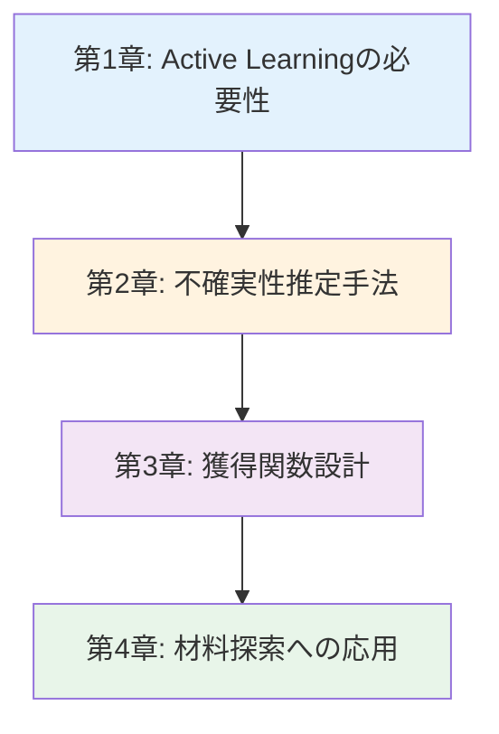
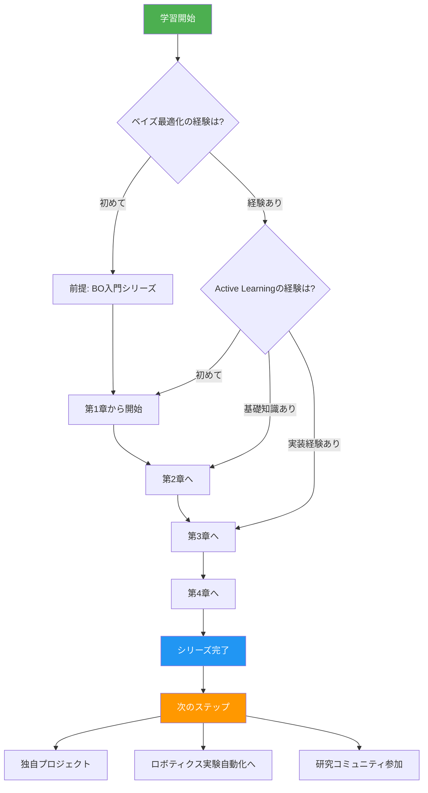
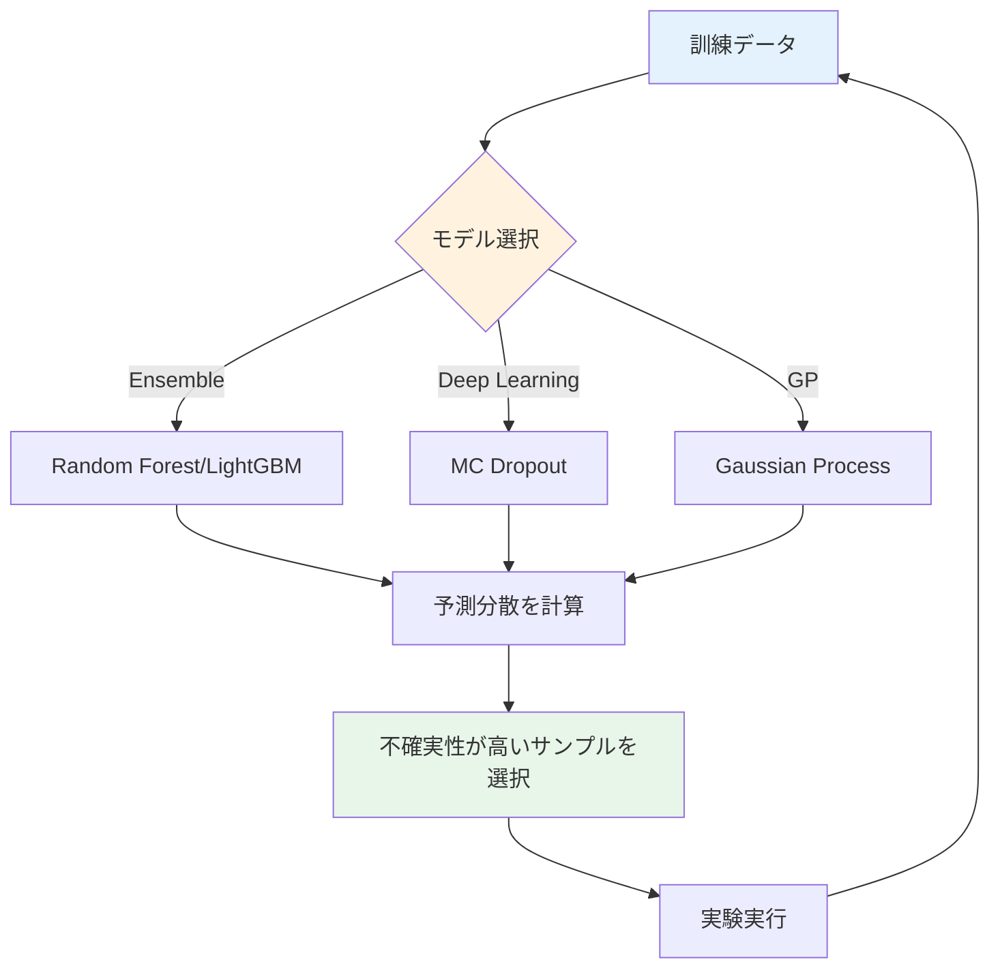
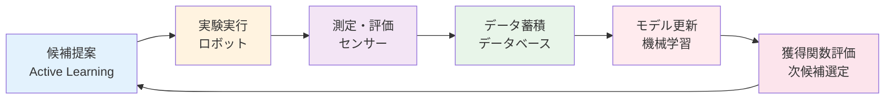
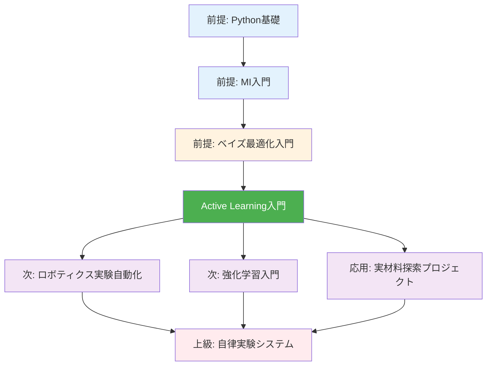

---
# ============================================
# Active Learning入門シリーズ v1.0
# ============================================

# --- 基本情報 ---
title: "Active Learning入門シリーズ v1.0"
subtitle: "少ない実験で最適解を見つける戦略的探索"
series: "Active Learning入門シリーズ v1.0"
series_id: "active-learning-introduction"
version: "1.0"

# --- 分類・難易度 ---
category: "advanced"
level: "intermediate-to-advanced"
difficulty: "中級〜上級"
target_audience: "graduate-professionals"

# --- 学習メタデータ ---
total_reading_time: "100-120分"
total_chapters: 4
total_code_examples: 28
total_exercises: 12
case_studies: 5

# --- 日付情報 ---
created_at: "2025-10-18"
updated_at: "2025-10-18"

# --- 前提知識 ---
prerequisites:
  - "mi-introduction"
  - "python-basics"
  - "machine-learning-basics"
  - "bayesian-optimization-introduction"

# --- 関連シリーズ ---
related_series:
  - "bayesian-optimization-introduction"
  - "mi-introduction"
  - "nm-introduction"
  - "robotic-lab-automation"

# --- 応用分野 ---
applications:
  - "materials-screening"
  - "catalyst-optimization"
  - "drug-discovery"
  - "process-optimization"
  - "sensor-development"

# --- 主要ツール ---
tools:
  - "modAL"
  - "scikit-learn"
  - "GPyTorch"
  - "BoTorch"
  - "pandas"
  - "matplotlib"
  - "numpy"

# --- 著者情報 ---
authors:
  - name: "Dr. Yusuke Hashimoto"
    affiliation: "Tohoku University"
    email: "yusuke.hashimoto.b8@tohoku.ac.jp"

# --- ライセンス ---
license: "CC BY 4.0"
language: "ja"

---

# Active Learning入門シリーズ v1.0

**少ない実験で最適解を見つける戦略的探索**

## シリーズ概要

このシリーズは、Active Learningを初めて学ぶ方から、実践的な材料探索スキルを身につけたい方まで、段階的に学べる全4章構成の教育コンテンツです。

Active Learningは、限られた実験回数で最も情報価値の高いデータを能動的に選択する機械学習手法です。材料探索において、どのサンプルを次に測定すべきかを賢く決定することで、ランダムサンプリングの10分の1以下の実験回数で目標性能を達成できます。トヨタの触媒開発では実験回数を80%削減、MITのバッテリー材料探索では開発速度を10倍向上させた実績があります。

### なぜこのシリーズが必要か

**背景と課題**:
材料科学における最大の課題は、探索空間の広大さと実験コストの高さです。例えば、触媒スクリーニングでは数万の候補材料があり、1サンプルの評価に数日から数週間を要します。すべてのサンプルを測定することは物理的・経済的に不可能です。従来のランダムサンプリングでは、貴重な実験リソースを低情報価値のサンプルに浪費してしまいます。

**このシリーズで学べること**:
本シリーズでは、Active Learningの理論から実践まで、実行可能なコード例と材料科学のケーススタディを通じて体系的に学習します。Query Strategies（データ選択戦略）、不確実性推定手法、獲得関数の設計、実験装置との自動連携まで、実務で即戦力となるスキルを習得できます。

**特徴:**
- ✅ **実践重視**: 28個の実行可能なコード例、5つの詳細なケーススタディ
- ✅ **段階的構成**: 基礎から応用まで4章で包括的にカバー
- ✅ **材料科学特化**: 一般的なML理論ではなく、材料探索への応用に焦点
- ✅ **最新ツール**: modAL、GPyTorch、BoTorchなど業界標準ツールを網羅
- ✅ **理論と実装**: 数式による定式化とPython実装を両立
- ✅ **ロボティクス連携**: 自動実験装置との統合手法を解説

**総学習時間**: 100-120分（コード実行と演習を含む）

**対象者**:
- 大学院生・研究者（効率的な材料探索を学びたい方）
- 企業R&Dエンジニア（実験回数とコストを削減したい方）
- データサイエンティスト（能動的学習の理論と実践を学びたい方）
- ベイズ最適化経験者（より高度な探索戦略を習得したい方）

---

## 学習の進め方

### 推奨学習順序



**初学者の方（Active Learningをまったく知らない）:**
- 第1章 → 第2章 → 第3章 → 第4章（全章推奨）
- 所要時間: 100-120分
- 前提知識: 機械学習基礎、ベイズ最適化入門

**中級者の方（ベイズ最適化の経験あり）:**
- 第2章 → 第3章 → 第4章
- 所要時間: 70-90分
- 第1章はスキップ可能

**実践的スキル強化（理論より実装重視）:**
- 第3章（集中学習） → 第4章
- 所要時間: 50-70分
- 理論は必要に応じて第2章を参照

### 学習フローチャート



---

## 各章の詳細

### [第1章：Active Learningの必要性](./chapter-1.md)

**難易度**: 中級
**読了時間**: 20-25分
**コード例**: 6-8個

#### 学習内容

1. **Active Learningとは何か**
   - 定義：能動的データ選択による効率的学習
   - Passive Learning vs Active Learning
   - 適用分野：材料探索、プロセス最適化、分子設計

2. **Query Strategiesの基礎**
   - Uncertainty Sampling（不確実性サンプリング）
   - Diversity Sampling（多様性サンプリング）
   - Expected Model Change
   - Query-by-Committee

3. **Exploration vs Exploitation**
   - 探索と活用のトレードオフ
   - ε-greedyアプローチ
   - Upper Confidence Bound (UCB)

4. **ケーススタディ：触媒活性予測**
   - ランダムサンプリング vs Active Learning
   - 10実験で最適触媒発見
   - 実験コスト削減率の定量評価

#### 学習目標

- ✅ Active Learningの定義と利点を説明できる
- ✅ Query Strategiesの4つの主要手法を理解している
- ✅ 探索と活用のトレードオフを説明できる
- ✅ 材料科学における成功事例を3つ以上挙げられる
- ✅ ランダムサンプリングとの定量的比較ができる

**[第1章を読む →](./chapter-1.md)**

---

### [第2章：不確実性推定手法](./chapter-2.md)

**難易度**: 中級〜上級
**読了時間**: 25-30分
**コード例**: 7-9個

#### 学習内容

1. **Ensemble法による不確実性推定**
   - Bagging/Boosting
   - 予測分散の計算
   - Random Forest/LightGBMでの実装

2. **Dropout法による不確実性推定**
   - MC Dropout（Monte Carlo Dropout）
   - ニューラルネットワークでの不確実性
   - Bayesian Neural Networks

3. **Gaussian Process (GP) による不確実性**
   - GPの基礎：カーネル関数
   - 予測平均と予測分散
   - GPyTorchでの実装

4. **ケーススタディ：バンドギャップ予測**
   - 不確実性を考慮した候補選定
   - 3つの手法の比較（Ensemble, Dropout, GP）
   - 実験回数削減効果の検証

#### 学習目標

- ✅ 3つの不確実性推定手法の原理を理解している
- ✅ Ensemble法（Random Forest）を実装できる
- ✅ MC Dropoutをニューラルネットワークに適用できる
- ✅ Gaussian Processで予測分散を計算できる
- ✅ 手法の使い分け基準を説明できる

#### 不確実性推定のフロー



**[第2章を読む →](./chapter-2.md)**

---

### [第3章：獲得関数設計](./chapter-3.md)

**難易度**: 中級〜上級
**読了時間**: 25-30分
**コード例**: 6-8個

#### 学習内容

1. **獲得関数の基礎**
   - Expected Improvement (EI)
   - Probability of Improvement (PI)
   - Upper Confidence Bound (UCB)
   - Thompson Sampling

2. **多目的獲得関数**
   - Pareto最適性
   - Expected Hypervolume Improvement
   - 複数物性の同時最適化

3. **制約付き獲得関数**
   - 合成可能性制約
   - コスト制約
   - Constrained Expected Improvement

4. **ケーススタディ：熱電材料探索**
   - ZT値最大化（Seebeck係数、電気伝導度、熱伝導度）
   - 多目的最適化
   - 合成可能性を考慮した探索

#### 学習目標

- ✅ 4つの主要獲得関数の特徴を理解している
- ✅ Expected Improvementを実装できる
- ✅ 多目的最適化にPareto最適性を適用できる
- ✅ 制約条件を獲得関数に組み込める
- ✅ 獲得関数の選択基準を説明できる

#### 獲得関数の比較

| 獲得関数 | 特徴 | 探索傾向 | 計算コスト | 推奨用途 |
|---------|------|---------|----------|---------|
| EI | 改善期待値 | バランス | 中 | 一般的な最適化 |
| PI | 改善確率 | 活用重視 | 低 | 高速探索 |
| UCB | 信頼上限 | 探索重視 | 低 | 広範囲探索 |
| Thompson | 確率的 | バランス | 中 | 並列実験 |

**[第3章を読む →](./chapter-3.md)**

---

### [第4章：材料探索への応用と実践](./chapter-4.md)

**難易度**: 上級
**読了時間**: 25-30分
**コード例**: 6-8個

#### 学習内容

1. **Active Learning × ベイズ最適化**
   - ベイズ最適化との統合
   - BoTorchによる実装
   - 連続空間 vs 離散空間

2. **Active Learning × 高スループット計算**
   - DFT計算の効率化
   - 計算コストを考慮した優先順位付け
   - Batch Active Learning

3. **Active Learning × 実験ロボット**
   - クローズドループ最適化
   - 自律実験システム
   - フィードバックループの設計

4. **実世界応用とキャリアパス**
   - トヨタ：触媒開発（実験回数80%削減）
   - MIT：バッテリー材料（10倍高速化）
   - Citrine Informatics（AL専門スタートアップ）
   - キャリアパス：ALエンジニア、自動化エンジニア

#### 学習目標

- ✅ Active LearningとベイズOの統合手法を理解している
- ✅ 高スループット計算に最適化を適用できる
- ✅ クローズドループシステムを設計できる
- ✅ 産業応用事例5つから実践的知識を得る
- ✅ キャリアパスを具体的に描ける

#### クローズドループ最適化



**[第4章を読む →](./chapter-4.md)**

---

## 全体の学習成果

このシリーズを完了すると、以下のスキルと知識を習得できます：

### 知識レベル（Understanding）

- ✅ Active Learningの定義と理論的基礎を説明できる
- ✅ Query Strategies 4種の特徴と使い分けを理解している
- ✅ 不確実性推定手法3種（Ensemble, Dropout, GP）を比較できる
- ✅ 獲得関数の設計原理を理解している
- ✅ 実世界での成功事例を5つ以上詳述できる

### 実践スキル（Doing）

- ✅ modALで基本的なActive Learningを実装できる
- ✅ 不確実性推定手法を3種類実装できる
- ✅ 獲得関数をカスタマイズできる
- ✅ 実材料データに最適化を適用し、結果を評価できる
- ✅ クローズドループシステムを構築できる

### 応用力（Applying）

- ✅ 新しい材料探索問題に適切な戦略を選択できる
- ✅ 実験装置との自動連携を設計できる
- ✅ 産業界での導入事例を評価し、自分の研究に適用できる
- ✅ 多目的・制約付き最適化に対応できる

---

## 推奨学習パターン

### パターン1: 完全習得（初学者向け）

**対象**: Active Learningを初めて学ぶ方、体系的に理解したい方
**期間**: 1-2週間

```
Week 1:
- Day 1-2: 第1章（Active Learningの必要性）
- Day 3-4: 第2章（不確実性推定手法）
- Day 5-7: 第2章演習、実装練習

Week 2:
- Day 1-3: 第3章（獲得関数設計）
- Day 4-5: 第4章（材料探索への応用）
- Day 6-7: 総合プロジェクト
```

**成果物**:
- 触媒活性予測プロジェクト（10サンプルで最適解発見）
- GitHubポートフォリオ
- Active Learning実装レポート

### パターン2: 速習（経験者向け）

**対象**: ベイズ最適化経験者、機械学習の基礎を持つ方
**期間**: 3-5日

```
Day 1: 第2章（不確実性推定手法の実装）
Day 2: 第3章（獲得関数のカスタマイズ）
Day 3: 第4章（産業応用とクローズドループ）
Day 4-5: 独自プロジェクト実装
```

**成果物**:
- 3つの不確実性推定手法の性能比較レポート
- 独自材料探索プロジェクト（GitHub公開）

### パターン3: ピンポイント学習

**対象**: 特定のスキルを強化したい方
**期間**: 柔軟

**選択例**:
- **不確実性推定** → 第2章（全セクション）
- **多目的最適化** → 第3章（Section 3.2）
- **クローズドループ** → 第4章（Section 4.3）
- **産業応用事例** → 第4章（Section 4.4）

---

## FAQ（よくある質問）

### Q1: ベイズ最適化との違いは何ですか？

**A**: Active Learningとベイズ最適化は密接に関連していますが、焦点が異なります：

**Active Learning**:
- 目標：機械学習モデルの効率的学習
- 焦点：どのデータを次に取得すべきか（Query Strategy）
- 適用：分類、回帰、クラスタリング

**ベイズ最適化**:
- 目標：目的関数の最大化/最小化
- 焦点：最適解の探索（Exploration-Exploitation）
- 適用：ハイパーパラメータチューニング、材料探索

**共通点**: どちらも「不確実性を活用した賢いサンプリング」を行います。ベイズ最適化はActive Learningの特殊ケースと見なせます。

### Q2: 機械学習の経験が少なくても理解できますか？

**A**: 基本的な機械学習の知識（線形回帰、決定木、交差検証など）があれば理解できます。ただし、以下の前提知識を推奨します：

**必須**:
- 教師あり学習の基礎
- Python基礎（NumPy、pandas）
- 基本的な統計学

**推奨**:
- ベイズ最適化入門シリーズ
- scikit-learnの使用経験

不安な場合は、ベイズ最適化入門シリーズを先に学習することを強く推奨します。

### Q3: どの不確実性推定手法を選ぶべきですか？

**A**: 問題の特性とリソースに応じて選択します：

**Ensemble法（Random Forest）**:
- ✅ 実装が簡単、計算コスト中程度
- ✅ 表形式データに強い
- ⚠️ 高次元には不向き

**MC Dropout**:
- ✅ 深層学習モデルに適用可能
- ✅ 既存NNに容易に統合
- ⚠️ 計算コストやや高い

**Gaussian Process**:
- ✅ 不確実性の定量化が厳密
- ✅ 少ないデータで高精度
- ⚠️ 大規模データには不向き

**推奨**: まずEnsemble法で試し、必要に応じてGPやDropoutに移行。

### Q4: 実験装置がなくても学べますか？

**A**: **学べます**。本シリーズでは：
- シミュレーションデータで基礎を学習
- 公開データセット（Materials Project等）で実践
- クローズドループの概念とコード例を習得

将来、実験装置を使用する際にすぐ応用できる知識が身につきます。

### Q5: 産業応用での実績はありますか？

**A**: 多数の成功事例があります：

**トヨタ**:
- 触媒反応条件最適化
- 実験回数80%削減（1,000回 → 200回）

**MIT**:
- Li-ionバッテリー電解質探索
- 開発速度10倍向上

**BASF**:
- プロセス条件最適化
- 年間3,000万ユーロのコスト削減

**Citrine Informatics**:
- Active Learning専門スタートアップ
- 50社以上の顧客

### Q6: このシリーズの後、何を学ぶべきですか？

**A**: 以下の学習パスを推奨します：

**パスA: 自動実験への応用**
```
Active Learning入門完了
  ↓
ロボティクス実験自動化入門
  ↓
クローズドループシステム構築
  ↓
自律実験プラットフォーム開発
```

**パスB: 高度なAI技術**
```
Active Learning入門完了
  ↓
強化学習入門（材料科学特化）
  ↓
GNN・Transformer入門
  ↓
生成モデルによる材料設計
```

**パスC: 産業データサイエンティスト**
```
Active Learning入門完了
  ↓
独自プロジェクト（GitHub公開）
  ↓
Kaggleコンペ参加
  ↓
企業R&Dエンジニアとして就職
```

---

## 前提知識と関連シリーズ

### 前提知識

**必須**:
- [ ] **Python基礎**: 変数、関数、クラス、NumPy、pandas
- [ ] **機械学習基礎**: 教師あり学習、交差検証、過学習
- [ ] **基本的な統計学**: 正規分布、平均、分散、標準偏差

**強く推奨**:
- [ ] **ベイズ最適化入門**: ガウス過程、獲得関数、Exploration-Exploitation

### 前提シリーズ

1. **MI入門（マテリアルズ・インフォマティクス入門）** (入門)
   - 内容: 材料科学とデータサイエンスの融合
   - 学習時間: 90-120分
   - **推奨度**: ⭐⭐⭐⭐⭐

2. **ベイズ最適化・アクティブラーニング入門** (初級〜中級)
   - 内容: ガウス過程、獲得関数、最適化ワークフロー
   - 学習時間: 100-120分
   - **推奨度**: ⭐⭐⭐⭐⭐（強く推奨）

### 関連シリーズ

1. **NM入門（ナノマテリアルズ入門）** (入門)
   - 関連性: ナノ材料の合成条件最適化にALを応用

2. **PI入門（プロセス・インフォマティクス入門）** (入門)
   - 関連性: プロセス条件の最適化にALを応用

3. **ロボティクス実験自動化入門** (中級〜上級)
   - 関連性: クローズドループ最適化の実装
   - **推奨度**: ⭐⭐⭐⭐⭐（次のステップとして最適）

### 学習パス全体図



---

## ツールとリソース

### 主要ツール

| ツール名 | 用途 | ライセンス | インストール |
|---------|------|----------|-------------|
| modAL | Active Learning専用ライブラリ | MIT | `pip install modAL-python` |
| scikit-learn | 機械学習基盤 | BSD-3 | `pip install scikit-learn` |
| GPyTorch | ガウス過程（GPU対応） | MIT | `pip install gpytorch` |
| BoTorch | ベイズ最適化（PyTorch） | MIT | `pip install botorch` |
| pandas | データ管理 | BSD-3 | `pip install pandas` |
| matplotlib | 可視化 | PSF | `pip install matplotlib` |
| numpy | 数値計算 | BSD-3 | `pip install numpy` |

### データベース

| データベース名 | 説明 | データ数 | アクセス |
|--------------|------|---------|---------|
| Materials Project | DFT計算データ | 140,000+ | [materialsproject.org](https://materialsproject.org) |
| AFLOW | 結晶構造データ | 3,500,000+ | [aflowlib.org](http://aflowlib.org) |
| OQMD | 熱力学データ | 1,000,000+ | [oqmd.org](http://oqmd.org) |
| Citrine | 実験データプラットフォーム | 非公開 | [citrine.io](https://citrine.io) |

### 学習リソース

**論文・レビュー**:
- Settles, B. (2009). "Active Learning Literature Survey." *Computer Sciences Technical Report 1648*, University of Wisconsin-Madison.
- Lookman, T. et al. (2019). "Active learning in materials science with emphasis on adaptive sampling using uncertainties for targeted design." *npj Computational Materials*, 5(1), 1-17.
- Raccuglia, P. et al. (2016). "Machine-learning-assisted materials discovery using failed experiments." *Nature*, 533(7601), 73-76.

**書籍**:
- "Active Learning" by Burr Settles (ISBN: 978-1608457236)
- "Gaussian Processes for Machine Learning" by Rasmussen & Williams (ISBN: 978-0262182539)

**コミュニティ**:
- Acceleration Consortium: [acceleration.utoronto.ca](https://acceleration.utoronto.ca)
- Materials Research Society (MRS): [mrs.org](https://www.mrs.org)

---

## 次のステップ

### シリーズ完了後の推奨アクション

**Immediate（1-2週間以内）:**
1. ✅ GitHubにポートフォリオを作成
2. ✅ modALを使った触媒探索プロジェクトを実装
3. ✅ LinkedInプロフィールに「Active Learning」スキルを追加
4. ✅ Qiita/Zennで学習記事を執筆

**Short-term（1-3ヶ月）:**
1. ✅ ロボティクス実験自動化入門シリーズに進む
2. ✅ 独自の材料探索プロジェクトを実行
3. ✅ 日本材料科学会の勉強会に参加
4. ✅ Kaggleコンペ（材料科学）に参加
5. ✅ クローズドループシステムを構築

**Medium-term（3-6ヶ月）:**
1. ✅ Active Learningの主要論文を10本精読
2. ✅ OSSにコントリビュート（modAL、scikit-learn）
3. ✅ 国内学会で発表
4. ✅ 企業インターンシップ参加
5. ✅ 自動実験装置との統合プロジェクト

**Long-term（1年以上）:**
1. ✅ 国際学会で発表（MRS、E-MRS）
2. ✅ 査読付き論文を投稿
3. ✅ Active Learningを活用した材料開発の仕事に就く
4. ✅ 次世代を育成（勉強会開催）
5. ✅ OSSプロジェクトをリード

---

## フィードバックとサポート

### このシリーズについて

**プロジェクト**: AI寺子屋（AI Terakoya）
**作成日**: 2025-10-18
**バージョン**: 1.0
**言語**: 日本語

### フィードバックをお待ちしています

**連絡方法**:
- **GitHub Issues**: [リポジトリURL]/issues
- **Email**: yusuke.hashimoto.b8@tohoku.ac.jp

### コントリビューション

以下の貢献を歓迎します：
1. 誤字・脱字の修正
2. コード例の追加
3. 演習問題の追加
4. ケーススタディの追加
5. 翻訳（英語版）

---

## ライセンスと利用規約

**CC BY 4.0**（Creative Commons Attribution 4.0 International）

### 引用方法

```
Hashimoto, Y. (2025). Active Learning入門シリーズ v1.0.
AI Terakoya, Tohoku University.
Retrieved from [URL]
```

---

## さあ、始めましょう！

準備はできましたか？ 第1章から始めて、Active Learningで材料探索を革新する旅を始めましょう！

**[第1章: Active Learningの必要性 →](./chapter-1.md)**

---

## 更新履歴

| バージョン | 日付 | 変更内容 | 著者 |
|----------|------|---------|------|
| 1.0 | 2025-10-18 | 初版公開 | Dr. Yusuke Hashimoto |

---

**あなたのActive Learning学習の旅はここから始まります！**
