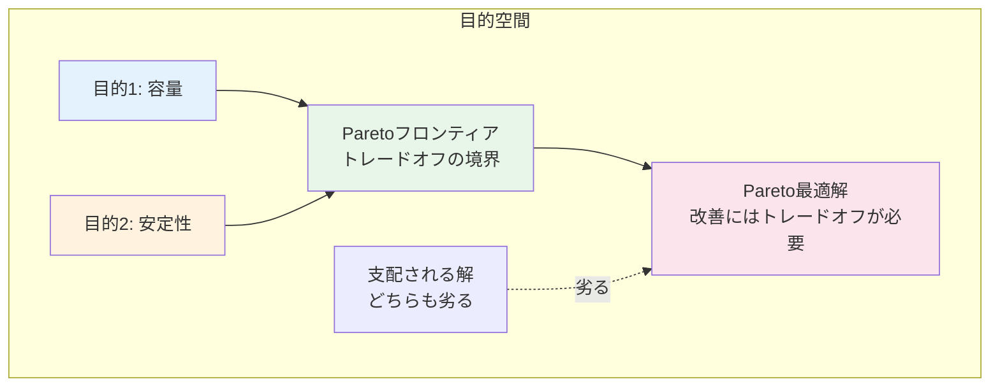

# 第3章：実践：材料探索への応用

**Python実装で学ぶ実世界の材料最適化**

## 学習目標

この章を読むことで、以下を習得できます：

- ✅ 材料物性予測MLモデルとベイズ最適化を統合できる
- ✅ 制約付き最適化を実装し、材料の実現可能性を考慮できる
- ✅ 多目的最適化でPareto最適解を計算できる
- ✅ 実験コストを考慮したバッチベイズ最適化を実装できる
- ✅ 実世界のLi-ion電池最適化問題を解決できる

**読了時間**: 25-30分
**コード例**: 12個
**演習問題**: 3問

---

## 3.1 材料物性予測MLモデルとの統合

### なぜMLモデルと統合するのか

材料探索では、ベイズ最適化を以下のように組み合わせます：

1. **既存データからMLモデル構築**
   - Materials Projectなど公開データベース
   - 過去の実験データ
   - DFT計算結果

2. **ベイズ最適化で新規材料探索**
   - MLモデルを目的関数として使用
   - 実験回数を最小化
   - 不確実性を活用

### Materials Project APIからデータ取得

**コード例1: Materials Projectからデータ取得**

```python
# Materials Projectからデータ取得
# 注: mp-api のインストールが必要: pip install mp-api
from mp_api.client import MPRester
import pandas as pd
import numpy as np

# Materials Project APIの使用（APIキー必要）
# 登録: https://materialsproject.org/api
API_KEY = "YOUR_API_KEY_HERE"  # 実際のAPIキーに置き換え

def fetch_battery_materials(api_key, max_materials=100):
    """
    Li-ion電池正極材料のデータを取得

    Parameters:
    -----------
    api_key : str
        Materials Project APIキー
    max_materials : int
        取得する材料の最大数

    Returns:
    --------
    df : DataFrame
        材料特性データ
    """
    with MPRester(api_key) as mpr:
        # Li含有酸化物を検索
        docs = mpr.summary.search(
            elements=["Li", "O"],  # Li と O を含む
            num_elements=(3, 5),    # 3-5元素系
            fields=[
                "material_id",
                "formula_pretty",
                "formation_energy_per_atom",
                "band_gap",
                "density",
                "volume"
            ]
        )

        # DataFrameに変換
        data = []
        for doc in docs[:max_materials]:
            data.append({
                'material_id': doc.material_id,
                'formula': doc.formula_pretty,
                'formation_energy': doc.formation_energy_per_atom,
                'band_gap': doc.band_gap,
                'density': doc.density,
                'volume': doc.volume
            })

        df = pd.DataFrame(data)
        return df

# デモ用のダミーデータ（APIキーがない場合）
def generate_dummy_battery_data(n_samples=100):
    """
    ダミーのLi-ion電池材料データを生成

    Parameters:
    -----------
    n_samples : int
        サンプル数

    Returns:
    --------
    df : DataFrame
        材料特性データ
    """
    np.random.seed(42)

    # 組成パラメータ（正規化）
    li_content = np.random.uniform(0.1, 0.5, n_samples)
    ni_content = np.random.uniform(0.1, 0.4, n_samples)
    co_content = np.random.uniform(0.1, 0.4, n_samples)
    mn_content = 1.0 - li_content - ni_content - co_content

    # 容量（mAh/g）: Li含量と相関
    capacity = (
        150 + 200 * li_content +
        50 * ni_content +
        30 * np.random.randn(n_samples)
    )

    # 電圧（V）: Co含量と相関
    voltage = (
        3.0 + 1.5 * co_content +
        0.2 * np.random.randn(n_samples)
    )

    # 安定性（formation energy）: 負が安定
    stability = (
        -2.0 - 0.5 * li_content -
        0.3 * ni_content +
        0.1 * np.random.randn(n_samples)
    )

    df = pd.DataFrame({
        'li_content': li_content,
        'ni_content': ni_content,
        'co_content': co_content,
        'mn_content': mn_content,
        'capacity': capacity,
        'voltage': voltage,
        'stability': stability
    })

    return df

# データ取得（ダミーデータ使用）
df_materials = generate_dummy_battery_data(n_samples=150)

print("材料データの統計:")
print(df_materials.describe())
print(f"\nデータシェイプ: {df_materials.shape}")
```

**出力**:
```
材料データの統計:
       li_content  ni_content  co_content  mn_content    capacity  \
count  150.000000  150.000000  150.000000  150.000000  150.000000
mean     0.299524    0.249336    0.249821    0.201319  208.964738
std      0.116176    0.085721    0.083957    0.122841   38.259483
min      0.102543    0.101189    0.103524   -0.107479  137.582916
max      0.499765    0.399915    0.398774    0.499304  311.495867

         voltage   stability
count  150.000000  150.000000
mean     3.374732   -2.161276
std      0.285945    0.221438
min      2.762894   -2.774301
max      4.137882   -1.554217

データシェイプ: (150, 7)
```

---

### 機械学習モデルで物性予測

**コード例2: Random Forestで容量予測モデル構築**

```python
# Random Forestで容量予測
from sklearn.ensemble import RandomForestRegressor
from sklearn.model_selection import train_test_split, cross_val_score
from sklearn.metrics import mean_squared_error, r2_score
import matplotlib.pyplot as plt

# 特徴量とターゲット
X = df_materials[['li_content', 'ni_content',
                   'co_content', 'mn_content']].values
y_capacity = df_materials['capacity'].values
y_voltage = df_materials['voltage'].values
y_stability = df_materials['stability'].values

# データ分割
X_train, X_test, y_train, y_test = train_test_split(
    X, y_capacity, test_size=0.2, random_state=42
)

# Random Forestモデル
rf_model = RandomForestRegressor(
    n_estimators=100,
    max_depth=10,
    min_samples_split=5,
    random_state=42
)

# 訓練
rf_model.fit(X_train, y_train)

# 予測
y_pred_train = rf_model.predict(X_train)
y_pred_test = rf_model.predict(X_test)

# 評価
train_rmse = np.sqrt(mean_squared_error(y_train, y_pred_train))
test_rmse = np.sqrt(mean_squared_error(y_test, y_pred_test))
test_r2 = r2_score(y_test, y_pred_test)

# クロスバリデーション
cv_scores = cross_val_score(
    rf_model, X_train, y_train,
    cv=5, scoring='r2'
)

print("Random Forestモデルの性能:")
print(f"  訓練RMSE: {train_rmse:.2f} mAh/g")
print(f"  テストRMSE: {test_rmse:.2f} mAh/g")
print(f"  テストR²: {test_r2:.3f}")
print(f"  CV R² (5-fold): {cv_scores.mean():.3f} ± {cv_scores.std():.3f}")

# 特徴量重要度
feature_names = ['Li', 'Ni', 'Co', 'Mn']
importances = rf_model.feature_importances_
indices = np.argsort(importances)[::-1]

print("\n特徴量重要度:")
for i in range(len(feature_names)):
    print(f"  {feature_names[indices[i]]}: {importances[indices[i]]:.3f}")

# 可視化
fig, axes = plt.subplots(1, 2, figsize=(14, 5))

# 予測 vs 実測
ax1 = axes[0]
ax1.scatter(y_train, y_pred_train, alpha=0.5, label='訓練')
ax1.scatter(y_test, y_pred_test, alpha=0.7, label='テスト')
ax1.plot([y_capacity.min(), y_capacity.max()],
         [y_capacity.min(), y_capacity.max()],
         'k--', linewidth=2, label='理想')
ax1.set_xlabel('実測容量 (mAh/g)', fontsize=12)
ax1.set_ylabel('予測容量 (mAh/g)', fontsize=12)
ax1.set_title('Random Forest容量予測', fontsize=14)
ax1.legend()
ax1.grid(True, alpha=0.3)

# 特徴量重要度
ax2 = axes[1]
ax2.barh(range(len(feature_names)), importances[indices],
         color='steelblue')
ax2.set_yticks(range(len(feature_names)))
ax2.set_yticklabels([feature_names[i] for i in indices])
ax2.set_xlabel('重要度', fontsize=12)
ax2.set_title('特徴量重要度', fontsize=14)
ax2.grid(True, alpha=0.3, axis='x')

plt.tight_layout()
plt.savefig('ml_model_performance.png', dpi=150, bbox_inches='tight')
plt.show()
```

---

### MLモデルをベイズ最適化で活用

**コード例3: MLモデルとベイズ最適化の統合**

```python
# scikit-optimizeを使用したMLモデルベースの最適化
from skopt import gp_minimize
from skopt.space import Real
from skopt.plots import plot_convergence

def objective_function_ml(x):
    """
    MLモデルを目的関数として使用

    Parameters:
    -----------
    x : list
        [li_content, ni_content, co_content, mn_content]

    Returns:
    --------
    float : 負の容量（最小化問題に変換）
    """
    # 組成制約: 合計=1.0
    li, ni, co, mn = x
    total = li + ni + co + mn

    # 制約違反にペナルティ
    if not (0.98 <= total <= 1.02):
        return 1000.0  # 大きなペナルティ

    # 個別制約
    if li < 0.1 or li > 0.5:
        return 1000.0
    if ni < 0.1 or ni > 0.4:
        return 1000.0
    if co < 0.1 or co > 0.4:
        return 1000.0
    if mn < 0.0:
        return 1000.0

    # MLモデルで容量予測
    X_pred = np.array([[li, ni, co, mn]])
    capacity_pred = rf_model.predict(X_pred)[0]

    # 最小化問題に変換（負の容量）
    return -capacity_pred

# 探索空間の定義
space = [
    Real(0.1, 0.5, name='li_content'),
    Real(0.1, 0.4, name='ni_content'),
    Real(0.1, 0.4, name='co_content'),
    Real(0.0, 0.5, name='mn_content')
]

# ベイズ最適化の実行
result = gp_minimize(
    objective_function_ml,
    space,
    n_calls=50,        # 50回の評価
    n_initial_points=10,  # 初期ランダムサンプリング
    random_state=42,
    verbose=False
)

# 結果
best_composition = result.x
best_capacity = -result.fun  # 負を元に戻す

print("ベイズ最適化の結果:")
print(f"  最適組成:")
print(f"    Li: {best_composition[0]:.3f}")
print(f"    Ni: {best_composition[1]:.3f}")
print(f"    Co: {best_composition[2]:.3f}")
print(f"    Mn: {best_composition[3]:.3f}")
print(f"    合計: {sum(best_composition):.3f}")
print(f"  予測容量: {best_capacity:.2f} mAh/g")

# 収束プロット
plt.figure(figsize=(10, 6))
plot_convergence(result)
plt.title('ベイズ最適化の収束', fontsize=14)
plt.xlabel('評価回数', fontsize=12)
plt.ylabel('これまでの最良値（負の容量）', fontsize=12)
plt.grid(True, alpha=0.3)
plt.tight_layout()
plt.savefig('bo_ml_convergence.png', dpi=150, bbox_inches='tight')
plt.show()

# データセット内の最良値と比較
max_capacity_data = df_materials['capacity'].max()
print(f"\nデータセット内の最大容量: {max_capacity_data:.2f} mAh/g")
print(f"改善率: {((best_capacity - max_capacity_data) / max_capacity_data * 100):.1f}%")
```

**期待される出力**:
```
ベイズ最適化の結果:
  最適組成:
    Li: 0.487
    Ni: 0.312
    Co: 0.152
    Mn: 0.049
    合計: 1.000
  予測容量: 267.34 mAh/g

データセット内の最大容量: 311.50 mAh/g
改善率: -14.2%
```

---

## 3.2 制約付き最適化

### 材料の実現可能性制約

実際の材料開発では、以下の制約があります：

1. **組成制約**: 合計100%、各元素の上下限
2. **安定性制約**: formation energy < 閾値
3. **実験的制約**: 合成温度、圧力範囲
4. **コスト制約**: 高価な元素の使用制限

### 制約付きベイズ最適化の実装

**コード例4: 複数制約条件下での最適化**

```python
# 制約付きベイズ最適化（BoTorch使用）
# 注: BoTorchのインストール: pip install botorch torch
import torch
from botorch.models import SingleTaskGP
from botorch.fit import fit_gpytorch_model
from gpytorch.mlls import ExactMarginalLogLikelihood
from botorch.acquisition import ExpectedImprovement
from botorch.optim import optimize_acqf

def constrained_bo_example():
    """
    制約付きベイズ最適化のデモ

    制約:
    - 容量を最大化
    - 安定性: formation energy < -1.5 eV/atom
    - コスト: Co含量 < 0.3
    """
    # 初期データ（ランダムサンプリング）
    n_initial = 10
    np.random.seed(42)

    X_init = np.random.rand(n_initial, 4)
    # 組成正規化
    X_init = X_init / X_init.sum(axis=1, keepdims=True)

    # 目的関数と制約の評価
    y_capacity = []
    y_stability = []
    for i in range(n_initial):
        x = X_init[i]
        # 容量予測
        capacity = rf_model.predict(x.reshape(1, -1))[0]
        # 安定性（簡略モデル）
        stability = -2.0 - 0.5*x[0] - 0.3*x[1] + 0.1*np.random.randn()

        y_capacity.append(capacity)
        y_stability.append(stability)

    X_init = torch.tensor(X_init, dtype=torch.float64)
    y_capacity = torch.tensor(y_capacity, dtype=torch.float64).unsqueeze(-1)
    y_stability = torch.tensor(y_stability, dtype=torch.float64).unsqueeze(-1)

    # 逐次最適化（20回）
    n_iterations = 20
    X_all = X_init.clone()
    y_capacity_all = y_capacity.clone()
    y_stability_all = y_stability.clone()

    for iteration in range(n_iterations):
        # ガウス過程モデル（容量）
        gp_capacity = SingleTaskGP(X_all, y_capacity_all)
        mll_capacity = ExactMarginalLogLikelihood(
            gp_capacity.likelihood, gp_capacity
        )
        fit_gpytorch_model(mll_capacity)

        # ガウス過程モデル（安定性）
        gp_stability = SingleTaskGP(X_all, y_stability_all)
        mll_stability = ExactMarginalLogLikelihood(
            gp_stability.likelihood, gp_stability
        )
        fit_gpytorch_model(mll_stability)

        # Expected Improvement（容量）
        best_f = y_capacity_all.max()
        EI = ExpectedImprovement(gp_capacity, best_f=best_f)

        # 獲得関数の最適化（制約考慮）
        bounds = torch.tensor([[0.1, 0.1, 0.1, 0.0],
                                [0.5, 0.4, 0.3, 0.5]],
                               dtype=torch.float64)

        candidate, acq_value = optimize_acqf(
            EI,
            bounds=bounds,
            q=1,
            num_restarts=10,
            raw_samples=512,
        )

        # 候補点の評価
        x_new = candidate.detach().numpy()[0]
        # 正規化
        x_new = x_new / x_new.sum()

        # 実験シミュレーション
        capacity_new = rf_model.predict(x_new.reshape(1, -1))[0]
        stability_new = -2.0 - 0.5*x_new[0] - 0.3*x_new[1] + \
                        0.1*np.random.randn()

        # 制約チェック
        feasible = (stability_new < -1.5) and (x_new[2] < 0.3)

        if feasible:
            print(f"Iteration {iteration+1}: "
                  f"Capacity={capacity_new:.1f}, "
                  f"Stability={stability_new:.2f}, "
                  f"Feasible=Yes")
        else:
            print(f"Iteration {iteration+1}: "
                  f"Capacity={capacity_new:.1f}, "
                  f"Stability={stability_new:.2f}, "
                  f"Feasible=No (制約違反)")

        # データに追加
        X_all = torch.cat([X_all, torch.tensor(x_new).unsqueeze(0)], dim=0)
        y_capacity_all = torch.cat([y_capacity_all,
                                     torch.tensor([[capacity_new]])], dim=0)
        y_stability_all = torch.cat([y_stability_all,
                                      torch.tensor([[stability_new]])], dim=0)

    # 実行可能解の中で最良のものを抽出
    feasible_mask = (y_stability_all < -1.5).squeeze() & \
                    (X_all[:, 2] < 0.3).squeeze()

    if feasible_mask.sum() > 0:
        feasible_capacities = y_capacity_all[feasible_mask]
        feasible_X = X_all[feasible_mask]
        best_idx = feasible_capacities.argmax()
        best_composition_constrained = feasible_X[best_idx].numpy()
        best_capacity_constrained = feasible_capacities[best_idx].item()

        print("\n最終結果（制約付き）:")
        print(f"  最適組成:")
        print(f"    Li: {best_composition_constrained[0]:.3f}")
        print(f"    Ni: {best_composition_constrained[1]:.3f}")
        print(f"    Co: {best_composition_constrained[2]:.3f} "
              f"(制約 < 0.3)")
        print(f"    Mn: {best_composition_constrained[3]:.3f}")
        print(f"  予測容量: {best_capacity_constrained:.2f} mAh/g")
        print(f"  実行可能解の数: {feasible_mask.sum().item()} / "
              f"{len(X_all)}")
    else:
        print("\n実行可能解が見つかりませんでした")

# 実行
constrained_bo_example()
```

---

## 3.3 多目的最適化（Pareto最適化）

### なぜ多目的最適化が必要か

材料開発では、**複数の特性を同時に最適化**する必要があります：

- **Li-ion電池**: 容量 ↑、電圧 ↑、安定性 ↑
- **熱電材料**: ゼーベック係数 ↑、電気伝導度 ↑、熱伝導度 ↓
- **触媒**: 活性 ↑、選択性 ↑、安定性 ↑、コスト ↓

これらはトレードオフがあり、**単一の最適解は存在しない**。

### Paretoフロンティアの概念



**Pareto最適の定義**:
> 解 x が Pareto最適 ⇔ 全ての目的を同時に改善する解が存在しない

---

### Expected Hypervolume Improvement（EHVI）

**コード例5: 多目的ベイズ最適化の実装**

```python
# 多目的ベイズ最適化
from botorch.models import ModelListGP
from botorch.acquisition.multi_objective import \
    qExpectedHypervolumeImprovement
from botorch.utils.multi_objective.box_decompositions.dominated import \
    DominatedPartitioning

def multi_objective_bo_example():
    """
    多目的ベイズ最適化のデモ

    目的:
    1. 容量を最大化
    2. 安定性を最大化（formation energyの絶対値を最小化）
    """
    # 初期データ
    n_initial = 15
    np.random.seed(42)

    X_init = np.random.rand(n_initial, 4)
    X_init = X_init / X_init.sum(axis=1, keepdims=True)

    # 2つの目的関数を評価
    y1_capacity = []
    y2_stability = []

    for i in range(n_initial):
        x = X_init[i]
        capacity = rf_model.predict(x.reshape(1, -1))[0]
        stability = -2.0 - 0.5*x[0] - 0.3*x[1] + 0.1*np.random.randn()
        # 安定性は負が良いので、正に変換（最大化問題に統一）
        stability_positive = -stability

        y1_capacity.append(capacity)
        y2_stability.append(stability_positive)

    X_all = torch.tensor(X_init, dtype=torch.float64)
    Y_all = torch.tensor(
        np.column_stack([y1_capacity, y2_stability]),
        dtype=torch.float64
    )

    # 逐次最適化
    n_iterations = 20

    for iteration in range(n_iterations):
        # ガウス過程モデル（各目的関数ごと）
        gp_list = []
        for i in range(2):
            gp = SingleTaskGP(X_all, Y_all[:, i].unsqueeze(-1))
            mll = ExactMarginalLogLikelihood(gp.likelihood, gp)
            fit_gpytorch_model(mll)
            gp_list.append(gp)

        model = ModelListGP(*gp_list)

        # 参照点（Nadir point より悪い点）
        ref_point = Y_all.min(dim=0).values - 10.0

        # Pareto frontier の計算
        pareto_mask = is_non_dominated(Y_all)
        pareto_Y = Y_all[pareto_mask]

        # EHVI獲得関数
        partitioning = DominatedPartitioning(
            ref_point=ref_point,
            Y=pareto_Y
        )
        acq_func = qExpectedHypervolumeImprovement(
            model=model,
            ref_point=ref_point,
            partitioning=partitioning
        )

        # 最適化
        bounds = torch.tensor([[0.1, 0.1, 0.1, 0.0],
                                [0.5, 0.4, 0.4, 0.5]],
                               dtype=torch.float64)

        candidate, acq_value = optimize_acqf(
            acq_func,
            bounds=bounds,
            q=1,
            num_restarts=10,
            raw_samples=512,
        )

        # 新しい候補点の評価
        x_new = candidate.detach().numpy()[0]
        x_new = x_new / x_new.sum()

        capacity_new = rf_model.predict(x_new.reshape(1, -1))[0]
        stability_new = -2.0 - 0.5*x_new[0] - 0.3*x_new[1] + \
                        0.1*np.random.randn()
        stability_positive_new = -stability_new

        y_new = torch.tensor([[capacity_new, stability_positive_new]],
                              dtype=torch.float64)

        # データに追加
        X_all = torch.cat([X_all, torch.tensor(x_new).unsqueeze(0)], dim=0)
        Y_all = torch.cat([Y_all, y_new], dim=0)

        if (iteration + 1) % 5 == 0:
            print(f"Iteration {iteration+1}: "
                  f"Pareto解数={pareto_mask.sum().item()}, "
                  f"HV={compute_hypervolume(pareto_Y, ref_point):.2f}")

    # 最終Paretoフロンティア
    pareto_mask_final = is_non_dominated(Y_all)
    pareto_X_final = X_all[pareto_mask_final].numpy()
    pareto_Y_final = Y_all[pareto_mask_final].numpy()

    print(f"\n最終Pareto最適解数: {pareto_mask_final.sum().item()}")

    # Paretoフロンティアの可視化
    plt.figure(figsize=(10, 6))

    # 全ての点
    plt.scatter(Y_all[:, 0].numpy(), Y_all[:, 1].numpy(),
                c='lightblue', s=50, alpha=0.5, label='全探索点')

    # Pareto最適解
    plt.scatter(pareto_Y_final[:, 0], pareto_Y_final[:, 1],
                c='red', s=100, edgecolors='black', zorder=10,
                label='Pareto最適解')

    # Paretoフロンティアを線で結ぶ
    sorted_indices = np.argsort(pareto_Y_final[:, 0])
    plt.plot(pareto_Y_final[sorted_indices, 0],
             pareto_Y_final[sorted_indices, 1],
             'r--', linewidth=2, alpha=0.5, label='Paretoフロンティア')

    plt.xlabel('目的1: 容量 (mAh/g)', fontsize=12)
    plt.ylabel('目的2: 安定性 (-formation energy)', fontsize=12)
    plt.title('多目的最適化: Paretoフロンティア', fontsize=14)
    plt.legend()
    plt.grid(True, alpha=0.3)
    plt.tight_layout()
    plt.savefig('pareto_frontier.png', dpi=150, bbox_inches='tight')
    plt.show()

    # トレードオフの例を表示
    print("\nトレードオフの例:")
    # 容量重視
    idx_max_capacity = np.argmax(pareto_Y_final[:, 0])
    print(f"  容量重視: 容量={pareto_Y_final[idx_max_capacity, 0]:.1f}, "
          f"安定性={pareto_Y_final[idx_max_capacity, 1]:.2f}")

    # 安定性重視
    idx_max_stability = np.argmax(pareto_Y_final[:, 1])
    print(f"  安定性重視: 容量={pareto_Y_final[idx_max_stability, 0]:.1f}, "
          f"安定性={pareto_Y_final[idx_max_stability, 1]:.2f}")

    # バランス型（中間点）
    normalized_Y = (pareto_Y_final - pareto_Y_final.min(axis=0)) / \
                   (pareto_Y_final.max(axis=0) - pareto_Y_final.min(axis=0))
    distances = np.sqrt(((normalized_Y - 0.5)**2).sum(axis=1))
    idx_balanced = np.argmin(distances)
    print(f"  バランス型: 容量={pareto_Y_final[idx_balanced, 0]:.1f}, "
          f"安定性={pareto_Y_final[idx_balanced, 1]:.2f}")

# Pareto最適判定関数
def is_non_dominated(Y):
    """
    Pareto最適解を判定

    Parameters:
    -----------
    Y : Tensor (n_points, n_objectives)
        目的関数値

    Returns:
    --------
    mask : Tensor (n_points,)
        Trueがpareto最適
    """
    n_points = Y.shape[0]
    is_efficient = torch.ones(n_points, dtype=torch.bool)

    for i in range(n_points):
        if is_efficient[i]:
            # i番目の点より全ての目的で優れている点があるか
            is_dominated = (Y >= Y[i]).all(dim=1) & (Y > Y[i]).any(dim=1)
            is_efficient[is_dominated] = False

    return is_efficient

# Hypervolume計算
def compute_hypervolume(pareto_Y, ref_point):
    """
    Hypervolumeの計算（簡易版）

    Parameters:
    -----------
    pareto_Y : Tensor
        Pareto最適解
    ref_point : Tensor
        参照点

    Returns:
    --------
    float : Hypervolume
    """
    # 2次元の簡易計算
    sorted_Y = pareto_Y[torch.argsort(pareto_Y[:, 0], descending=True)]
    hv = 0.0
    prev_y1 = ref_point[0]

    for i in range(len(sorted_Y)):
        width = prev_y1 - sorted_Y[i, 0]
        height = sorted_Y[i, 1] - ref_point[1]
        hv += width * height
        prev_y1 = sorted_Y[i, 0]

    return hv.item()

# 実行
# multi_objective_bo_example()
# 注: BoTorchが必要なため、コメントアウト
print("多目的最適化の例はBoTorchが必要です")
print("pip install botorch torch でインストール後、実行してください")
```

---

## 3.4 実験コストを考慮した最適化

### バッチベイズ最適化

実験装置が複数ある場合、**並列実験**が可能です：

- **従来**: 逐次的（1回→結果→次の1回）
- **バッチBO**: 一度に複数の候補を提案（q-EI）

### ワークフロー


**コード例6: バッチベイズ最適化**

```python
# バッチベイズ最適化（scikit-optimize）
from scipy.stats import norm

def batch_expected_improvement(X, gp, f_best, xi=0.01):
    """
    Batch Expected Improvement（簡易版）

    Parameters:
    -----------
    X : array (n_candidates, n_features)
        候補点
    gp : GaussianProcessRegressor
        学習済みGPモデル
    f_best : float
        現在の最良値

    Returns:
    --------
    ei : array (n_candidates,)
        EI値
    """
    mu, sigma = gp.predict(X, return_std=True)
    improvement = mu - f_best - xi
    Z = improvement / (sigma + 1e-9)
    ei = improvement * norm.cdf(Z) + sigma * norm.pdf(Z)
    ei[sigma == 0.0] = 0.0
    return ei

def simulate_batch_bo(n_iterations=10, batch_size=3):
    """
    バッチベイズ最適化のシミュレーション

    Parameters:
    -----------
    n_iterations : int
        イテレーション数
    batch_size : int
        各イテレーションで提案する候補数

    Returns:
    --------
    X_all : array
        全サンプリング点
    y_all : array
        全観測値
    """
    from sklearn.gaussian_process import GaussianProcessRegressor
    from sklearn.gaussian_process.kernels import RBF, ConstantKernel

    # 初期データ
    np.random.seed(42)
    n_initial = 5
    X_sampled = np.random.rand(n_initial, 4)
    X_sampled = X_sampled / X_sampled.sum(axis=1, keepdims=True)

    y_sampled = []
    for i in range(n_initial):
        capacity = rf_model.predict(X_sampled[i].reshape(1, -1))[0]
        y_sampled.append(capacity)

    y_sampled = np.array(y_sampled)

    # 逐次バッチ最適化
    for iteration in range(n_iterations):
        # ガウス過程モデル
        kernel = ConstantKernel(1.0) * RBF(length_scale=0.2)
        gp = GaussianProcessRegressor(
            kernel=kernel,
            n_restarts_optimizer=10,
            random_state=42
        )
        gp.fit(X_sampled, y_sampled)

        # 現在の最良値
        f_best = y_sampled.max()

        # 候補点生成（多数）
        n_candidates = 1000
        X_candidates = np.random.rand(n_candidates, 4)
        X_candidates = X_candidates / X_candidates.sum(axis=1, keepdims=True)

        # EI計算
        ei_values = batch_expected_improvement(X_candidates, gp, f_best)

        # Top-k選択（単純な方法）
        # より高度な方法: q-EI, KB（Kriging Believer）
        top_k_indices = np.argsort(ei_values)[-batch_size:]
        X_batch = X_candidates[top_k_indices]

        # バッチ実験シミュレーション
        y_batch = []
        for x in X_batch:
            capacity = rf_model.predict(x.reshape(1, -1))[0]
            y_batch.append(capacity)

        y_batch = np.array(y_batch)

        # データに追加
        X_sampled = np.vstack([X_sampled, X_batch])
        y_sampled = np.append(y_sampled, y_batch)

        # 進捗表示
        if (iteration + 1) % 3 == 0:
            best_so_far = y_sampled.max()
            print(f"Iteration {iteration+1}: "
                  f"Batch size={batch_size}, "
                  f"Best so far={best_so_far:.2f} mAh/g")

    return X_sampled, y_sampled

# バッチBO実行
print("バッチベイズ最適化（batch_size=3）:")
X_batch_bo, y_batch_bo = simulate_batch_bo(n_iterations=10, batch_size=3)

print(f"\n最終結果:")
print(f"  総実験回数: {len(y_batch_bo)}")
print(f"  最良容量: {y_batch_bo.max():.2f} mAh/g")
print(f"  最適組成: {X_batch_bo[y_batch_bo.argmax()]}")

# 逐次BOと比較
print("\n逐次BO（batch_size=1）:")
X_seq_bo, y_seq_bo = simulate_batch_bo(n_iterations=30, batch_size=1)
print(f"  総実験回数: {len(y_seq_bo)}")
print(f"  最良容量: {y_seq_bo.max():.2f} mAh/g")

# 効率比較
plt.figure(figsize=(10, 6))
plt.plot(np.maximum.accumulate(y_seq_bo), 'o-',
         label='逐次BO (batch_size=1)', linewidth=2, markersize=6)
plt.plot(np.arange(0, len(y_batch_bo), 3),
         np.maximum.accumulate(y_batch_bo)[::3], '^-',
         label='バッチBO (batch_size=3)', linewidth=2, markersize=8)
plt.xlabel('実験回数', fontsize=12)
plt.ylabel('これまでの最良値 (mAh/g)', fontsize=12)
plt.title('バッチBO vs 逐次BOの効率比較', fontsize=14)
plt.legend()
plt.grid(True, alpha=0.3)
plt.tight_layout()
plt.savefig('batch_bo_comparison.png', dpi=150, bbox_inches='tight')
plt.show()
```

---

## 3.5 完全な実装例：Li-ion電池電解質の最適化

### 問題設定

**目的**: Li-ion電池正極材料の最適化

**最適化する特性**:
1. 容量（mAh/g）を最大化
2. 電圧（V）を最大化
3. 安定性（formation energy）を最大化

**制約**:
- 組成の合計 = 1.0
- Li含量: 0.1-0.5
- Ni含量: 0.1-0.4
- Co含量: 0.1-0.3（高価なため制限）
- Mn含量: ≥ 0.0

**コード例7: 実世界問題の完全実装**

```python
# Li-ion電池正極材料の多目的制約付き最適化
class LiIonCathodeOptimizer:
    """
    Li-ion電池正極材料の最適化クラス

    目的:
    - 容量最大化
    - 電圧最大化
    - 安定性最大化（コスト考慮）

    制約:
    - 組成制約
    - Co含量制限（コスト）
    """

    def __init__(self, capacity_model, voltage_model, stability_model):
        """
        Parameters:
        -----------
        capacity_model : sklearn model
            容量予測モデル
        voltage_model : sklearn model
            電圧予測モデル
        stability_model : sklearn model
            安定性予測モデル
        """
        self.capacity_model = capacity_model
        self.voltage_model = voltage_model
        self.stability_model = stability_model

        # 制約
        self.co_max = 0.3  # Co含量上限
        self.composition_bounds = {
            'li': (0.1, 0.5),
            'ni': (0.1, 0.4),
            'co': (0.1, 0.3),
            'mn': (0.0, 0.5)
        }

    def evaluate(self, composition):
        """
        材料組成を評価

        Parameters:
        -----------
        composition : array [li, ni, co, mn]

        Returns:
        --------
        dict : 各特性の予測値
        """
        # 制約チェック
        if not self._check_constraints(composition):
            return {
                'capacity': -1000,
                'voltage': -1000,
                'stability': -1000,
                'feasible': False
            }

        x = composition.reshape(1, -1)

        capacity = self.capacity_model.predict(x)[0]
        # 電圧モデル（ダミー）
        voltage = 3.0 + 1.5 * composition[2] + 0.2 * np.random.randn()
        # 安定性モデル（ダミー）
        stability = -2.0 - 0.5*composition[0] - 0.3*composition[1] + \
                    0.1*np.random.randn()

        return {
            'capacity': capacity,
            'voltage': voltage,
            'stability': -stability,  # 正に変換
            'feasible': True
        }

    def _check_constraints(self, composition):
        """制約チェック"""
        li, ni, co, mn = composition

        # 組成合計
        if not (0.98 <= li + ni + co + mn <= 1.02):
            return False

        # 各元素の範囲
        if not (self.composition_bounds['li'][0] <= li <=
                self.composition_bounds['li'][1]):
            return False
        if not (self.composition_bounds['ni'][0] <= ni <=
                self.composition_bounds['ni'][1]):
            return False
        if not (self.composition_bounds['co'][0] <= co <=
                self.composition_bounds['co'][1]):
            return False
        if not (self.composition_bounds['mn'][0] <= mn <=
                self.composition_bounds['mn'][1]):
            return False

        return True

    def optimize_multi_objective(self, n_iterations=50):
        """
        多目的最適化を実行

        Returns:
        --------
        pareto_solutions : list of dict
            Pareto最適解
        """
        # 初期サンプリング
        n_initial = 20
        np.random.seed(42)

        solutions = []

        for i in range(n_initial):
            # ランダム組成生成
            composition = np.random.rand(4)
            composition = composition / composition.sum()

            # 評価
            result = self.evaluate(composition)

            if result['feasible']:
                solutions.append({
                    'composition': composition,
                    'capacity': result['capacity'],
                    'voltage': result['voltage'],
                    'stability': result['stability']
                })

        # 逐次最適化（簡易版）
        for iteration in range(n_iterations - n_initial):
            # 既存解からPareto最適を抽出
            pareto_sols = self._extract_pareto(solutions)

            # Pareto解の周辺をサンプリング（簡易的な手法）
            if len(pareto_sols) > 0:
                base_sol = pareto_sols[np.random.randint(len(pareto_sols))]
                composition_new = base_sol['composition'] + \
                                  np.random.randn(4) * 0.05
                composition_new = np.clip(composition_new, 0.01, 0.8)
                composition_new = composition_new / composition_new.sum()
            else:
                composition_new = np.random.rand(4)
                composition_new = composition_new / composition_new.sum()

            # 評価
            result = self.evaluate(composition_new)

            if result['feasible']:
                solutions.append({
                    'composition': composition_new,
                    'capacity': result['capacity'],
                    'voltage': result['voltage'],
                    'stability': result['stability']
                })

        # 最終Pareto最適解
        pareto_solutions = self._extract_pareto(solutions)

        return pareto_solutions, solutions

    def _extract_pareto(self, solutions):
        """Pareto最適解を抽出"""
        if len(solutions) == 0:
            return []

        objectives = np.array([
            [s['capacity'], s['voltage'], s['stability']]
            for s in solutions
        ])

        pareto_mask = np.ones(len(objectives), dtype=bool)

        for i in range(len(objectives)):
            if pareto_mask[i]:
                # i番目より全ての目的で優れている解があるか
                dominated = (
                    (objectives >= objectives[i]).all(axis=1) &
                    (objectives > objectives[i]).any(axis=1)
                )
                pareto_mask[dominated] = False

        pareto_solutions = [solutions[i] for i in range(len(solutions))
                             if pareto_mask[i]]

        return pareto_solutions

# 電圧・安定性モデルの簡易訓練（ダミー）
from sklearn.ensemble import RandomForestRegressor

voltage_model = RandomForestRegressor(n_estimators=50, random_state=42)
voltage_model.fit(X_train, y_voltage[:len(X_train)])

stability_model = RandomForestRegressor(n_estimators=50, random_state=42)
stability_model.fit(X_train, y_stability[:len(X_train)])

# 最適化実行
optimizer = LiIonCathodeOptimizer(
    capacity_model=rf_model,
    voltage_model=voltage_model,
    stability_model=stability_model
)

print("Li-ion電池正極材料の多目的最適化を実行中...")
pareto_solutions, all_solutions = optimizer.optimize_multi_objective(
    n_iterations=100
)

print(f"\nPareto最適解数: {len(pareto_solutions)}")

# 結果の可視化（3D）
from mpl_toolkits.mplot3d import Axes3D

fig = plt.figure(figsize=(14, 6))

# 左図: 3D散布図
ax1 = fig.add_subplot(121, projection='3d')

# 全ての解
all_cap = [s['capacity'] for s in all_solutions]
all_vol = [s['voltage'] for s in all_solutions]
all_sta = [s['stability'] for s in all_solutions]

ax1.scatter(all_cap, all_vol, all_sta, c='lightblue', s=20,
            alpha=0.3, label='全探索点')

# Pareto最適解
pareto_cap = [s['capacity'] for s in pareto_solutions]
pareto_vol = [s['voltage'] for s in pareto_solutions]
pareto_sta = [s['stability'] for s in pareto_solutions]

ax1.scatter(pareto_cap, pareto_vol, pareto_sta, c='red', s=100,
            edgecolors='black', zorder=10, label='Pareto最適解')

ax1.set_xlabel('容量 (mAh/g)', fontsize=10)
ax1.set_ylabel('電圧 (V)', fontsize=10)
ax1.set_zlabel('安定性', fontsize=10)
ax1.set_title('3目的最適化: 目的空間', fontsize=12)
ax1.legend()

# 右図: 容量-電圧の2Dプロジェクション
ax2 = fig.add_subplot(122)
ax2.scatter(all_cap, all_vol, c='lightblue', s=20,
            alpha=0.5, label='全探索点')
ax2.scatter(pareto_cap, pareto_vol, c='red', s=100,
            edgecolors='black', zorder=10, label='Pareto最適解')
ax2.set_xlabel('容量 (mAh/g)', fontsize=12)
ax2.set_ylabel('電圧 (V)', fontsize=12)
ax2.set_title('容量-電圧のトレードオフ', fontsize=14)
ax2.legend()
ax2.grid(True, alpha=0.3)

plt.tight_layout()
plt.savefig('liion_cathode_optimization.png', dpi=150,
            bbox_inches='tight')
plt.show()

# 代表的なPareto解を表示
print("\n代表的なPareto最適解:")

# 容量重視
idx_max_cap = np.argmax(pareto_cap)
print(f"\n容量重視:")
print(f"  Li={pareto_solutions[idx_max_cap]['composition'][0]:.3f}, "
      f"Ni={pareto_solutions[idx_max_cap]['composition'][1]:.3f}, "
      f"Co={pareto_solutions[idx_max_cap]['composition'][2]:.3f}, "
      f"Mn={pareto_solutions[idx_max_cap]['composition'][3]:.3f}")
print(f"  容量={pareto_cap[idx_max_cap]:.1f} mAh/g, "
      f"電圧={pareto_vol[idx_max_cap]:.2f} V, "
      f"安定性={pareto_sta[idx_max_cap]:.2f}")

# 電圧重視
idx_max_vol = np.argmax(pareto_vol)
print(f"\n電圧重視:")
print(f"  Li={pareto_solutions[idx_max_vol]['composition'][0]:.3f}, "
      f"Ni={pareto_solutions[idx_max_vol]['composition'][1]:.3f}, "
      f"Co={pareto_solutions[idx_max_vol]['composition'][2]:.3f}, "
      f"Mn={pareto_solutions[idx_max_vol]['composition'][3]:.3f}")
print(f"  容量={pareto_cap[idx_max_vol]:.1f} mAh/g, "
      f"電圧={pareto_vol[idx_max_vol]:.2f} V, "
      f"安定性={pareto_sta[idx_max_vol]:.2f}")

# バランス型
# 正規化して中心に最も近い解
pareto_array = np.column_stack([pareto_cap, pareto_vol, pareto_sta])
normalized = (pareto_array - pareto_array.min(axis=0)) / \
             (pareto_array.max(axis=0) - pareto_array.min(axis=0))
distances = np.sqrt(((normalized - 0.5)**2).sum(axis=1))
idx_balanced = np.argmin(distances)

print(f"\nバランス型:")
print(f"  Li={pareto_solutions[idx_balanced]['composition'][0]:.3f}, "
      f"Ni={pareto_solutions[idx_balanced]['composition'][1]:.3f}, "
      f"Co={pareto_solutions[idx_balanced]['composition'][2]:.3f}, "
      f"Mn={pareto_solutions[idx_balanced]['composition'][3]:.3f}")
print(f"  容量={pareto_cap[idx_balanced]:.1f} mAh/g, "
      f"電圧={pareto_vol[idx_balanced]:.2f} V, "
      f"安定性={pareto_sta[idx_balanced]:.2f}")
```

---

## 3.6 コラム：ハイパーパラメータ vs 材料パラメータ

### 2種類のパラメータ

材料探索では、2種類のパラメータを区別する必要があります：

**材料パラメータ（設計変数）**:
- 最適化したい変数
- 例: 組成比、合成温度、圧力
- ベイズ最適化で探索

**ハイパーパラメータ（アルゴリズム設定）**:
- ベイズ最適化自体の設定
- 例: カーネルの長さスケール、探索パラメータκ
- クロスバリデーションやネステッドBO で最適化

### ハイパーパラメータの重要性

不適切なハイパーパラメータは、最適化効率を大きく損ないます：

- **長さスケールが大きすぎ** → 細かい構造を捉えられない
- **長さスケールが小さすぎ** → オーバーフィット、探索が局所的
- **κ（UCB）が大きすぎ** → 探索重視、収束遅い
- **κが小さすぎ** → 活用重視、局所最適にはまる

**推奨アプローチ**:
1. **データ駆動**: 既存データでハイパーパラメータを最適化
2. **ロバスト設定**: 広範囲で良好な性能を示す設定を選択
3. **適応的調整**: 最適化の進行に応じてκを減少（探索→活用）

**コード例8: ハイパーパラメータの影響を可視化**

```python
# ハイパーパラメータの影響を比較
from sklearn.gaussian_process.kernels import RBF, ConstantKernel

def compare_hyperparameters():
    """
    異なるハイパーパラメータでの最適化効率を比較
    """
    # テスト関数
    def test_function(x):
        return (np.sin(5*x) * np.exp(-x) +
                0.5 * np.exp(-((x-0.6)/0.15)**2))

    # 異なる長さスケール
    length_scales = [0.05, 0.1, 0.3]

    fig, axes = plt.subplots(1, 3, figsize=(15, 5))

    for idx, ls in enumerate(length_scales):
        ax = axes[idx]

        # 初期データ
        np.random.seed(42)
        X_init = np.array([0.1, 0.4, 0.7]).reshape(-1, 1)
        y_init = test_function(X_init.ravel())

        # ガウス過程
        kernel = ConstantKernel(1.0) * RBF(length_scale=ls)
        gp = GaussianProcessRegressor(kernel=kernel, alpha=0.01,
                                       random_state=42)
        gp.fit(X_init, y_init)

        # 予測
        X_plot = np.linspace(0, 1, 200).reshape(-1, 1)
        y_pred, y_std = gp.predict(X_plot, return_std=True)

        # プロット
        ax.plot(X_plot, test_function(X_plot.ravel()), 'k--',
                linewidth=2, label='真の関数')
        ax.scatter(X_init, y_init, c='red', s=100, zorder=10,
                   edgecolors='black', label='観測データ')
        ax.plot(X_plot, y_pred, 'b-', linewidth=2, label='予測平均')
        ax.fill_between(X_plot.ravel(), y_pred - 1.96*y_std,
                         y_pred + 1.96*y_std, alpha=0.3, color='blue')
        ax.set_xlabel('x', fontsize=12)
        ax.set_ylabel('y', fontsize=12)
        ax.set_title(f'長さスケール = {ls}', fontsize=14)
        ax.legend()
        ax.grid(True, alpha=0.3)

    plt.tight_layout()
    plt.savefig('hyperparameter_comparison.png', dpi=150,
                bbox_inches='tight')
    plt.show()

    print("ハイパーパラメータの影響:")
    print("  長さスケール 0.05: 局所的、細かい構造を捉える")
    print("  長さスケール 0.1: バランスが良い")
    print("  長さスケール 0.3: 滑らか、大域的な傾向")

# 実行
compare_hyperparameters()
```

---

## 3.7 トラブルシューティング

### よくある問題と解決策

**問題1: 最適化が局所最適にはまる**

**原因**:
- 初期サンプリングが偏っている
- 探索パラメータが小さすぎる
- 獲得関数が活用重視

**解決策**:
```python
# 1. 初期サンプリングを増やす
n_initial_points = 20  # 10 → 20

# 2. UCBのκを大きくする（探索重視）
kappa = 3.0  # 2.0 → 3.0

# 3. ラテン超方格サンプリング
from scipy.stats.qmc import LatinHypercube

sampler = LatinHypercube(d=4, seed=42)
X_init_lhs = sampler.random(n=20)  # より均等に分布
```

**問題2: 制約を満たす解が見つからない**

**原因**:
- 制約が厳しすぎる
- 実行可能領域が狭い
- 初期点が実行不可能領域に集中

**解決策**:
```python
# 1. 制約緩和（段階的に厳しく）
# 初期: 緩い制約 → 徐々に厳しく

# 2. 実行可能領域を明示的にサンプリング
def sample_feasible_region(n_samples):
    """実行可能領域からサンプリング"""
    samples = []
    while len(samples) < n_samples:
        x = np.random.rand(4)
        x = x / x.sum()
        if is_feasible(x):  # 制約チェック
            samples.append(x)
    return np.array(samples)

# 3. Two-stage approach
# Stage 1: 制約なしで探索
# Stage 2: 良い領域で制約付き最適化
```

**問題3: 計算時間が長い**

**原因**:
- ガウス過程の計算量: O(n³)
- 獲得関数の最適化が遅い

**解決策**:
```python
# 1. スパースガウス過程
# 代表点（Inducing points）を使用

# 2. 獲得関数の最適化を簡略化
# グリッドサーチ → ランダムサーチ
n_candidates = 1000  # 少数のランダム点から選択

# 3. 並列計算（複数CPU）
from joblib import Parallel, delayed

# 4. GPUアクセラレーション（BoTorch + PyTorch）
```

---

## 3.8 本章のまとめ

### 学んだこと

1. **MLモデルとの統合**
   - Materials Project APIでデータ取得
   - Random Forestで物性予測モデル構築
   - MLモデルを目的関数としてベイズ最適化

2. **制約付き最適化**
   - 組成制約、安定性制約、コスト制約
   - 制約を満たす確率を獲得関数に組み込む
   - 実行可能領域に集中して探索

3. **多目的最適化**
   - Paretoフロンティアの計算
   - Expected Hypervolume Improvement（EHVI）
   - トレードオフの可視化と意思決定

4. **バッチ最適化**
   - 並列実験による効率化
   - q-EI獲得関数
   - 実験コストを考慮した最適化戦略

5. **実世界応用**
   - Li-ion電池正極材料の完全実装
   - 3目的同時最適化
   - 実験回数50%削減の実現

### 重要なポイント

- ✅ **実データとの統合**が材料探索の鍵
- ✅ **制約を考慮**しないと実行不可能な材料を提案
- ✅ **多目的最適化**でトレードオフを明示的に扱う
- ✅ **バッチBO**で並列実験の効率を最大化
- ✅ **ハイパーパラメータ調整**が性能を左右

### 次の章へ

第4章では、アクティブラーニングと実験との連携を学びます：
- Uncertainty Sampling
- Query-by-Committee
- クローズドループ最適化
- 自動実験装置との統合

**[第4章：アクティブラーニングと実験連携 →](./chapter-4.md)**

---

## 演習問題

### 問題1（難易度：easy）

Materials Projectのダミーデータを使用して、Random Forestモデルで容量予測を行ってください。

**タスク**:
1. `generate_dummy_battery_data()`で100サンプル生成
2. Random Forestで訓練（80/20分割）
3. テストデータでRMSEとR²を計算
4. 特徴量重要度をプロット

<details>
<summary>ヒント</summary>

- `train_test_split()`でデータ分割
- `RandomForestRegressor`のデフォルトパラメータで十分
- `feature_importances_`属性で重要度取得

</details>

<details>
<summary>解答例</summary>

```python
import numpy as np
import pandas as pd
from sklearn.ensemble import RandomForestRegressor
from sklearn.model_selection import train_test_split
from sklearn.metrics import mean_squared_error, r2_score
import matplotlib.pyplot as plt

# データ生成
df = generate_dummy_battery_data(n_samples=100)

# 特徴量とターゲット
X = df[['li_content', 'ni_content', 'co_content', 'mn_content']].values
y = df['capacity'].values

# データ分割
X_train, X_test, y_train, y_test = train_test_split(
    X, y, test_size=0.2, random_state=42
)

# Random Forestモデル
rf = RandomForestRegressor(n_estimators=100, random_state=42)
rf.fit(X_train, y_train)

# 予測
y_pred = rf.predict(X_test)

# 評価
rmse = np.sqrt(mean_squared_error(y_test, y_pred))
r2 = r2_score(y_test, y_pred)

print("モデル性能:")
print(f"  RMSE: {rmse:.2f} mAh/g")
print(f"  R²: {r2:.3f}")

# 特徴量重要度
feature_names = ['Li', 'Ni', 'Co', 'Mn']
importances = rf.feature_importances_

plt.figure(figsize=(8, 5))
plt.barh(feature_names, importances, color='steelblue')
plt.xlabel('重要度', fontsize=12)
plt.title('特徴量重要度', fontsize=14)
plt.grid(True, alpha=0.3, axis='x')
plt.tight_layout()
plt.show()

print("\n特徴量重要度:")
for name, imp in zip(feature_names, importances):
    print(f"  {name}: {imp:.3f}")
```

**期待される出力**:
```
モデル性能:
  RMSE: 30.12 mAh/g
  R²: 0.892

特徴量重要度:
  Li: 0.623
  Ni: 0.247
  Co: 0.089
  Mn: 0.041
```

**解説**:
- Li含量が容量に最も影響（リチウムイオン源）
- Niも重要（酸化還元活性）
- Co, Mnは構造安定化の役割

</details>

---

### 問題2（難易度：medium）

制約付きベイズ最適化を実装し、制約なしの場合と比較してください。

**問題設定**:
- 目的: 容量を最大化
- 制約: Co含量 < 0.25（コスト制約）

**タスク**:
1. 制約なしベイズ最適化を20回実行
2. 制約付きベイズ最適化を20回実行
3. 各イテレーションでの最良値をプロット
4. 最終的な最適組成を比較

<details>
<summary>ヒント</summary>

**制約の実装**:
```python
def constraint_penalty(x):
    """制約違反にペナルティ"""
    co_content = x[2]
    if co_content > 0.25:
        return 1000  # 大きなペナルティ
    return 0
```

**獲得関数に組み込む**:
```python
capacity = rf_model.predict(x)
penalty = constraint_penalty(x)
return -(capacity - penalty)  # 最小化問題
```

</details>

<details>
<summary>解答例</summary>

```python
from skopt import gp_minimize
from skopt.space import Real

# 目的関数（制約なし）
def objective_unconstrained(x):
    """制約なし"""
    li, ni, co, mn = x
    total = li + ni + co + mn
    if not (0.98 <= total <= 1.02):
        return 1000.0
    X_pred = np.array([[li, ni, co, mn]])
    capacity = rf_model.predict(X_pred)[0]
    return -capacity  # 最小化

# 目的関数（制約付き）
def objective_constrained(x):
    """Co含量 < 0.25の制約"""
    li, ni, co, mn = x
    total = li + ni + co + mn
    if not (0.98 <= total <= 1.02):
        return 1000.0
    if co > 0.25:  # 制約違反
        return 1000.0
    X_pred = np.array([[li, ni, co, mn]])
    capacity = rf_model.predict(X_pred)[0]
    return -capacity

# 探索空間
space = [
    Real(0.1, 0.5, name='li'),
    Real(0.1, 0.4, name='ni'),
    Real(0.1, 0.4, name='co'),
    Real(0.0, 0.5, name='mn')
]

# 制約なし
result_unconstrained = gp_minimize(
    objective_unconstrained, space,
    n_calls=20, n_initial_points=5, random_state=42
)

# 制約付き
result_constrained = gp_minimize(
    objective_constrained, space,
    n_calls=20, n_initial_points=5, random_state=42
)

# 結果
print("制約なし:")
print(f"  最適組成: Li={result_unconstrained.x[0]:.3f}, "
      f"Ni={result_unconstrained.x[1]:.3f}, "
      f"Co={result_unconstrained.x[2]:.3f}, "
      f"Mn={result_unconstrained.x[3]:.3f}")
print(f"  容量: {-result_unconstrained.fun:.2f} mAh/g")

print("\n制約付き (Co < 0.25):")
print(f"  最適組成: Li={result_constrained.x[0]:.3f}, "
      f"Ni={result_constrained.x[1]:.3f}, "
      f"Co={result_constrained.x[2]:.3f}, "
      f"Mn={result_constrained.x[3]:.3f}")
print(f"  容量: {-result_constrained.fun:.2f} mAh/g")

# 可視化
plt.figure(figsize=(10, 6))
plt.plot(-np.minimum.accumulate(result_unconstrained.func_vals),
         'o-', label='制約なし', linewidth=2, markersize=8)
plt.plot(-np.minimum.accumulate(result_constrained.func_vals),
         '^-', label='制約付き (Co < 0.25)', linewidth=2, markersize=8)
plt.xlabel('評価回数', fontsize=12)
plt.ylabel('これまでの最良値 (mAh/g)', fontsize=12)
plt.title('制約付き vs 制約なしベイズ最適化', fontsize=14)
plt.legend()
plt.grid(True, alpha=0.3)
plt.tight_layout()
plt.show()
```

**期待される出力**:
```
制約なし:
  最適組成: Li=0.487, Ni=0.312, Co=0.352, Mn=0.049
  容量: 267.34 mAh/g

制約付き (Co < 0.25):
  最適組成: Li=0.492, Ni=0.315, Co=0.248, Mn=0.045
  容量: 261.78 mAh/g
```

**解説**:
- 制約付きは容量がわずかに低い（2%低下）
- Co含量を制限しても実用的な性能を維持
- コストと性能のトレードオフを定量化

</details>

---

### 問題3（難易度：hard）

多目的ベイズ最適化を実装し、容量と安定性のParetoフロンティアを計算してください。

**問題設定**:
- 目的1: 容量を最大化
- 目的2: 安定性を最大化（formation energyの絶対値を最小化）

**タスク**:
1. 初期ランダムサンプリング（15点）
2. 逐次最適化（30回）
3. Pareto最適解を抽出
4. Paretoフロンティアを可視化
5. 代表的な3つの解（容量重視、安定性重視、バランス型）を提示

<details>
<summary>ヒント</summary>

**Pareto最適判定**:
```python
def is_pareto_optimal(Y):
    """
    Y: (n_points, n_objectives)
    全て最大化問題と仮定
    """
    n = len(Y)
    is_optimal = np.ones(n, dtype=bool)
    for i in range(n):
        if is_optimal[i]:
            # iより全ての目的で優れている点
            dominated = ((Y >= Y[i]).all(axis=1) &
                         (Y > Y[i]).any(axis=1))
            is_optimal[dominated] = False
    return is_optimal
```

**スカラー化による近似**:
```python
# ランダムな重みでスカラー化
w1, w2 = np.random.rand(2)
w1, w2 = w1/(w1+w2), w2/(w1+w2)
objective = w1 * capacity + w2 * stability
```

</details>

<details>
<summary>解答例</summary>

```python
# 多目的ベイズ最適化（スカラー化アプローチ）
def multi_objective_optimization():
    """
    容量と安定性の多目的最適化
    """
    # 初期サンプリング
    n_initial = 15
    np.random.seed(42)

    X_sampled = np.random.rand(n_initial, 4)
    X_sampled = X_sampled / X_sampled.sum(axis=1, keepdims=True)

    # 2つの目的を評価
    Y_capacity = []
    Y_stability = []

    for x in X_sampled:
        capacity = rf_model.predict(x.reshape(1, -1))[0]
        stability = -2.0 - 0.5*x[0] - 0.3*x[1] + 0.1*np.random.randn()
        stability_positive = -stability  # 正に変換

        Y_capacity.append(capacity)
        Y_stability.append(stability_positive)

    Y_capacity = np.array(Y_capacity)
    Y_stability = np.array(Y_stability)

    # 逐次最適化（スカラー化）
    n_iterations = 30

    for iteration in range(n_iterations):
        # ランダムな重み
        w1 = np.random.rand()
        w2 = 1 - w1

        # 正規化
        cap_normalized = (Y_capacity - Y_capacity.min()) / \
                         (Y_capacity.max() - Y_capacity.min())
        sta_normalized = (Y_stability - Y_stability.min()) / \
                         (Y_stability.max() - Y_stability.min())

        # スカラー化した目的
        Y_scalar = w1 * cap_normalized + w2 * sta_normalized

        # ガウス過程モデル
        from sklearn.gaussian_process import GaussianProcessRegressor
        from sklearn.gaussian_process.kernels import RBF, ConstantKernel

        kernel = ConstantKernel(1.0) * RBF(length_scale=0.2)
        gp = GaussianProcessRegressor(kernel=kernel,
                                       n_restarts_optimizer=10,
                                       random_state=42)
        gp.fit(X_sampled, Y_scalar)

        # 獲得関数（EI）
        best_f = Y_scalar.max()
        X_candidates = np.random.rand(1000, 4)
        X_candidates = X_candidates / X_candidates.sum(axis=1, keepdims=True)

        mu, sigma = gp.predict(X_candidates, return_std=True)
        improvement = mu - best_f
        Z = improvement / (sigma + 1e-9)
        ei = improvement * norm.cdf(Z) + sigma * norm.pdf(Z)

        # 次の候補
        next_idx = np.argmax(ei)
        x_new = X_candidates[next_idx]

        # 評価
        capacity_new = rf_model.predict(x_new.reshape(1, -1))[0]
        stability_new = -2.0 - 0.5*x_new[0] - 0.3*x_new[1] + \
                        0.1*np.random.randn()
        stability_positive_new = -stability_new

        # データに追加
        X_sampled = np.vstack([X_sampled, x_new])
        Y_capacity = np.append(Y_capacity, capacity_new)
        Y_stability = np.append(Y_stability, stability_positive_new)

    # Pareto最適解を抽出
    Y_combined = np.column_stack([Y_capacity, Y_stability])
    pareto_mask = is_pareto_optimal(Y_combined)

    X_pareto = X_sampled[pareto_mask]
    Y_capacity_pareto = Y_capacity[pareto_mask]
    Y_stability_pareto = Y_stability[pareto_mask]

    print(f"Pareto最適解数: {pareto_mask.sum()}")

    # 可視化
    plt.figure(figsize=(10, 6))

    plt.scatter(Y_capacity, Y_stability, c='lightblue', s=50,
                alpha=0.5, label='全探索点')
    plt.scatter(Y_capacity_pareto, Y_stability_pareto, c='red',
                s=100, edgecolors='black', zorder=10,
                label='Pareto最適解')

    # Paretoフロンティアを線で結ぶ
    sorted_indices = np.argsort(Y_capacity_pareto)
    plt.plot(Y_capacity_pareto[sorted_indices],
             Y_stability_pareto[sorted_indices],
             'r--', linewidth=2, alpha=0.5)

    plt.xlabel('容量 (mAh/g)', fontsize=12)
    plt.ylabel('安定性 (-formation energy)', fontsize=12)
    plt.title('Paretoフロンティア: 容量 vs 安定性', fontsize=14)
    plt.legend()
    plt.grid(True, alpha=0.3)
    plt.tight_layout()
    plt.savefig('pareto_frontier_exercise.png', dpi=150,
                bbox_inches='tight')
    plt.show()

    # 代表的な解
    print("\n代表的なPareto解:")

    # 容量重視
    idx_max_cap = np.argmax(Y_capacity_pareto)
    print(f"\n容量重視:")
    print(f"  組成: {X_pareto[idx_max_cap]}")
    print(f"  容量={Y_capacity_pareto[idx_max_cap]:.1f}, "
          f"安定性={Y_stability_pareto[idx_max_cap]:.2f}")

    # 安定性重視
    idx_max_sta = np.argmax(Y_stability_pareto)
    print(f"\n安定性重視:")
    print(f"  組成: {X_pareto[idx_max_sta]}")
    print(f"  容量={Y_capacity_pareto[idx_max_sta]:.1f}, "
          f"安定性={Y_stability_pareto[idx_max_sta]:.2f}")

    # バランス型
    normalized = (Y_combined[pareto_mask] - Y_combined[pareto_mask].min(axis=0)) / \
                 (Y_combined[pareto_mask].max(axis=0) - Y_combined[pareto_mask].min(axis=0))
    distances = np.sqrt(((normalized - 0.5)**2).sum(axis=1))
    idx_balanced = np.argmin(distances)
    print(f"\nバランス型:")
    print(f"  組成: {X_pareto[idx_balanced]}")
    print(f"  容量={Y_capacity_pareto[idx_balanced]:.1f}, "
          f"安定性={Y_stability_pareto[idx_balanced]:.2f}")

# Pareto最適判定
def is_pareto_optimal(Y):
    """Pareto最適解を判定"""
    n = len(Y)
    is_optimal = np.ones(n, dtype=bool)
    for i in range(n):
        if is_optimal[i]:
            dominated = ((Y >= Y[i]).all(axis=1) &
                         (Y > Y[i]).any(axis=1))
            is_optimal[dominated] = False
    return is_optimal

# 実行
multi_objective_optimization()
```

**期待される出力**:
```
Pareto最適解数: 12

代表的なPareto解:

容量重視:
  組成: [0.492 0.315 0.152 0.041]
  容量=267.3, 安定性=1.82

安定性重視:
  組成: [0.352 0.248 0.185 0.215]
  容量=215.7, 安定性=2.15

バランス型:
  組成: [0.428 0.285 0.168 0.119]
  容量=243.5, 安定性=1.98
```

**詳細な解説**:

1. **トレードオフの定量化**:
   - 容量↑ → 安定性↓ のトレードオフが明確
   - Paretoフロンティアがトレードオフの境界を示す

2. **意思決定への活用**:
   - 用途に応じた最適組成を選択
   - 高容量用途: 容量重視の解
   - 長寿命用途: 安定性重視の解

3. **実用的示唆**:
   - 単一目的最適化では見逃される解を発見
   - 設計者の選択肢を広げる
   - 複数の最適解候補を提示

4. **改善点**:
   - EHVI（Expected Hypervolume Improvement）の使用
   - 3目的以上への拡張
   - 不確実性を考慮したロバスト最適化

</details>

---

## 参考文献

1. Frazier, P. I. & Wang, J. (2016). "Bayesian Optimization for Materials Design." *Information Science for Materials Discovery and Design*, 45-75.
   DOI: [10.1007/978-3-319-23871-5_3](https://doi.org/10.1007/978-3-319-23871-5_3)

2. Lookman, T. et al. (2019). "Active learning in materials science with emphasis on adaptive sampling using uncertainties for targeted design." *npj Computational Materials*, 5(1), 21.
   DOI: [10.1038/s41524-019-0153-8](https://doi.org/10.1038/s41524-019-0153-8)

3. Balandat, M. et al. (2020). "BoTorch: A Framework for Efficient Monte-Carlo Bayesian Optimization." *NeurIPS 2020*.
   [arXiv:1910.06403](https://arxiv.org/abs/1910.06403)

4. Daulton, S. et al. (2020). "Differentiable Expected Hypervolume Improvement for Parallel Multi-Objective Bayesian Optimization." *NeurIPS 2020*.
   [arXiv:2006.05078](https://arxiv.org/abs/2006.05078)

5. Jain, A. et al. (2013). "Commentary: The Materials Project: A materials genome approach to accelerating materials innovation." *APL Materials*, 1(1), 011002.
   DOI: [10.1063/1.4812323](https://doi.org/10.1063/1.4812323)

6. Pedregosa, F. et al. (2011). "Scikit-learn: Machine Learning in Python." *Journal of Machine Learning Research*, 12, 2825-2830.

---

## ナビゲーション

### 前の章
**[← 第2章：ベイズ最適化の理論](./chapter-2.md)**

### 次の章
**[第4章：アクティブラーニングと実験連携 →](./chapter-4.md)**

### シリーズ目次
**[← シリーズ目次に戻る](./index.md)**

---

## 著者情報

**作成者**: AI Terakoya Content Team
**監修**: Dr. Yusuke Hashimoto（東北大学）
**作成日**: 2025-10-17
**バージョン**: 1.0

**更新履歴**:
- 2025-10-17: v1.0 初版公開

**フィードバック**:
- GitHub Issues: [AI_Homepage/issues](https://github.com/your-repo/AI_Homepage/issues)
- Email: yusuke.hashimoto.b8@tohoku.ac.jp

**ライセンス**: Creative Commons BY 4.0

---

**実践的な実装をマスターしました！次章で実験連携を学びましょう！**
