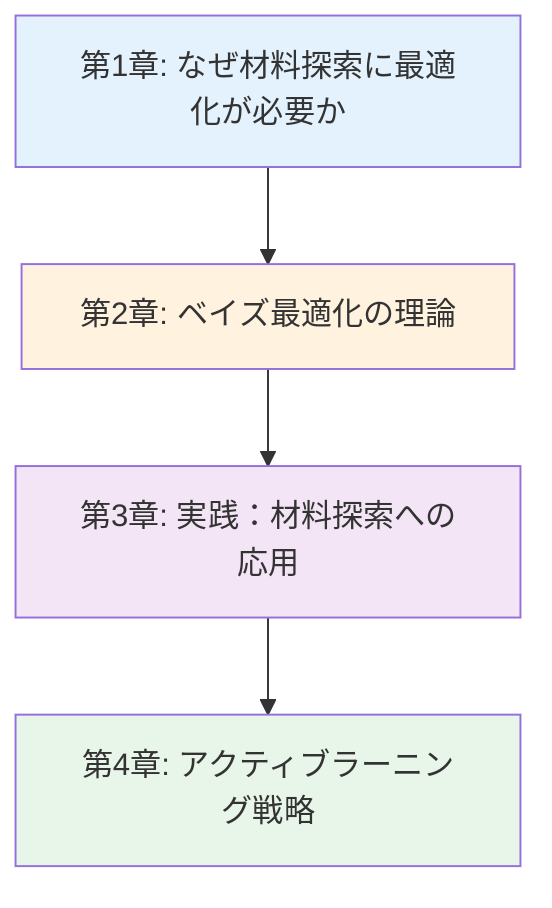
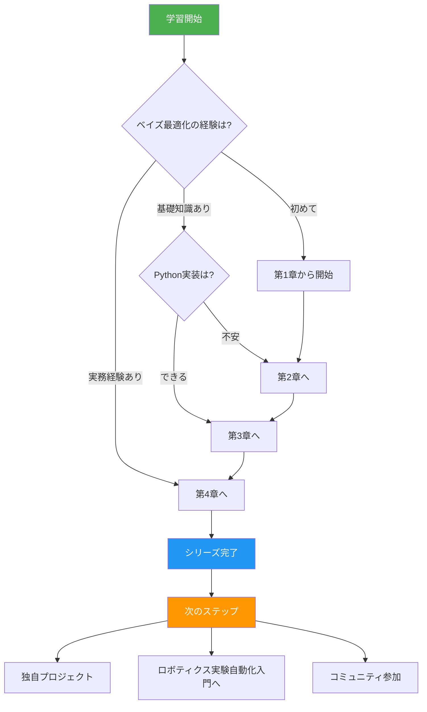
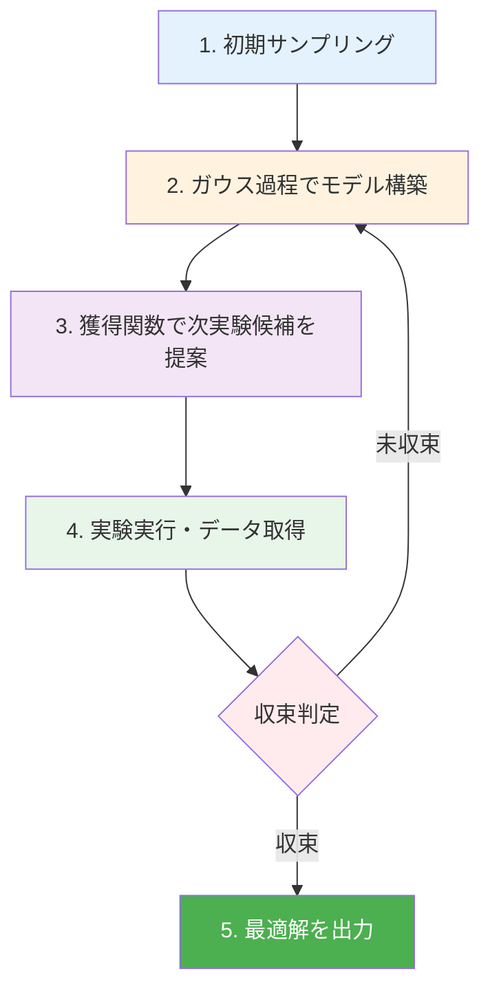
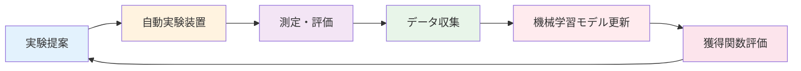
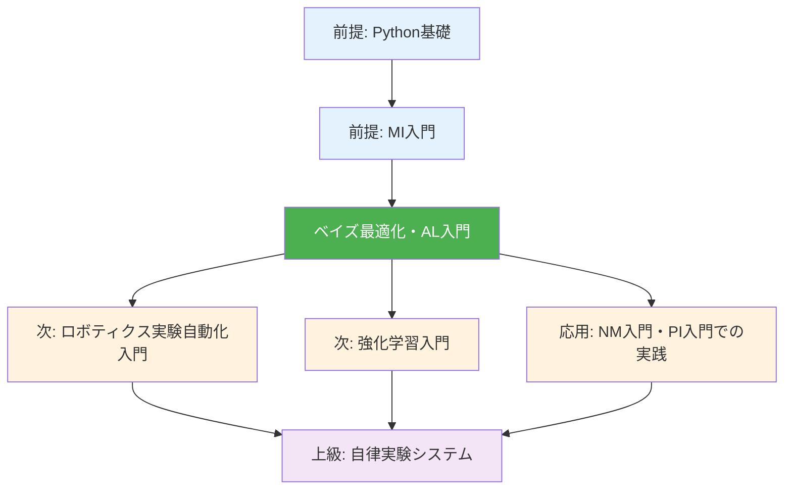

---
# ============================================
# ベイズ最適化・アクティブラーニング入門 v1.0
# ============================================

# --- 基本情報 ---
title: "ベイズ最適化・アクティブラーニング入門シリーズ v1.0"
subtitle: "効率的材料探索で拓く次世代材料開発の未来"
series: "ベイズ最適化・アクティブラーニング入門シリーズ v1.0"
series_id: "bayesian-optimization-introduction"
version: "1.0"

# --- 分類・難易度 ---
category: "advanced"
level: "beginner-to-intermediate"
difficulty: "初級〜中級"
target_audience: "undergraduate-graduate-professionals"

# --- 学習メタデータ ---
total_reading_time: "100-120分"
total_chapters: 4
total_code_examples: 32
total_exercises: 12
case_studies: 5

# --- 日付情報 ---
created_at: "2025-10-17"
updated_at: "2025-10-17"

# --- 前提知識 ---
prerequisites:
  - "mi-introduction"
  - "python-basics"
  - "statistics-basics"

# --- 関連シリーズ ---
related_series:
  - "mi-introduction"
  - "nm-introduction"
  - "pi-introduction"
  - "robotic-lab-automation"

# --- 応用分野 ---
applications:
  - "battery-electrolyte-optimization"
  - "catalyst-reaction-condition-search"
  - "alloy-composition-design"
  - "organic-semiconductor-materials"
  - "quantum-dot-emission-wavelength"

# --- 主要ツール ---
tools:
  - "scikit-optimize"
  - "GPyOpt"
  - "BoTorch"
  - "Ax"
  - "pandas"
  - "matplotlib"
  - "numpy"

# --- 著者情報 ---
authors:
  - name: "Dr. Yusuke Hashimoto"
    affiliation: "Tohoku University"
    email: "yusuke.hashimoto.b8@tohoku.ac.jp"

# --- ライセンス ---
license: "CC BY 4.0"
language: "ja"

---

# ベイズ最適化・アクティブラーニング入門シリーズ v1.0

**効率的材料探索で拓く次世代材料開発の未来**

## シリーズ概要

このシリーズは、ベイズ最適化とアクティブラーニングを初めて学ぶ方から、実践的な材料探索スキルを身につけたい方まで、段階的に学べる全4章構成の教育コンテンツです。

ベイズ最適化は、限られた実験回数で最適な材料やプロセス条件を発見するための最も効率的な探索手法です。従来のランダム探索や網羅的探索では数千回の実験が必要だった材料開発を、わずか数十回の実験で達成できる革新的技術として、近年、Li-ion電池、触媒、合金、有機半導体など、あらゆる材料分野で急速に普及しています。

### なぜこのシリーズが必要か

**背景と課題**:
材料開発における最大の課題は、探索空間の広大さです。例えば、5元素系合金の組成最適化では10^10通り以上の候補があり、すべてを試すことは物理的に不可能です。従来のランダム探索や経験則に頼った手法では、開発期間が数年から十年に及び、コストも膨大になります。さらに、実験コストの高い分野（量子ドット合成、触媒スクリーニング、電池材料評価など）では、試行回数を最小限に抑えることが死活問題となります。

**このシリーズで学べること**:
本シリーズでは、ベイズ最適化とアクティブラーニングの理論から実践まで、実行可能なコード例と材料科学のケーススタディを通じて体系的に学習します。探索空間の効率的な探索方法、不確実性を活用した次実験の提案、制約条件や多目的最適化への対応、実験装置との自動連携まで、実務で即戦力となるスキルを習得できます。

**特徴:**
- ✅ **段階的な構成**: 各章は独立した記事として読むことができ、全4章で包括的な内容をカバー
- ✅ **実践重視**: 32個の実行可能なコード例、5つの詳細なケーススタディ
- ✅ **材料科学特化**: 一般的な最適化理論ではなく、材料・化学・物理への応用に焦点
- ✅ **最新技術**: scikit-optimize、BoTorch、Axなど業界標準ツールを網羅
- ✅ **キャリア支援**: 具体的なキャリアパスと学習ロードマップを提供
- ✅ **ロボティクス連携**: 自動実験装置との統合手法を解説

**総学習時間**: 100-120分（コード実行と演習を含む）

**対象者**:
- 材料科学の学部生・大学院生（効率的な実験計画を学びたい方）
- 企業のR&Dエンジニア（開発期間とコストを削減したい方）
- データサイエンティスト（材料科学への応用を目指す方）
- 計算化学者（実験とシミュレーションの融合に興味がある方）

---

## 学習の進め方

### 推奨学習順序



**初学者の方（ベイズ最適化をまったく知らない）:**
- 第1章 → 第2章 → 第3章 → 第4章（全章推奨）
- 所要時間: 100-120分
- 前提知識: 基本的な統計学（正規分布、平均、分散）、Python基礎

**中級者の方（最適化理論の経験あり）:**
- 第2章 → 第3章 → 第4章
- 所要時間: 70-90分
- 第1章はスキップ可能

**実践的スキル強化（理論より実装重視）:**
- 第3章（集中学習） → 第4章
- 所要時間: 50-70分
- 理論は必要に応じて第2章を参照

### 学習フローチャート



---

## 各章の詳細

### [第1章：なぜ材料探索に最適化が必要か](./chapter1-introduction.md)

**難易度**: 入門
**読了時間**: 20-25分
**コード例**: 5個

#### 学習内容

1. **材料探索の広大な探索空間**
   - 組み合わせ爆発の問題（10^60通りの候補）
   - 実験コストと時間の制約
   - 従来手法（経験則、ランダム探索）の限界

2. **ベイズ最適化の成功事例**
   - Li-ion電池電解質の最適化（実験回数95%削減）
   - 触媒反応条件の高速探索（開発期間67%短縮）
   - 合金組成設計（Tesla/Panasonic採用）
   - 有機半導体材料（効率3倍向上）

3. **最適化手法の比較**
   - ランダム探索 vs グリッドサーチ vs ベイズ最適化
   - 探索効率の定量的比較
   - コストと性能のトレードオフ

4. **Column: "1985年 vs 2025年の材料開発"**
   - 40年間の材料開発の変遷
   - 手動実験からAI駆動型探索へ
   - 開発期間の劇的短縮（10年 → 数ヶ月）

5. **なぜ今、ベイズ最適化なのか**
   - 計算コストの低下（GPUの普及）
   - オープンソースツールの成熟
   - 自動実験装置との統合可能性

#### 学習目標

この章を読むことで、以下を習得できます：

- ✅ 材料探索における探索空間の広大さを定量的に説明できる
- ✅ 従来手法の3つの限界（網羅性、効率性、経験依存）を具体例とともに挙げられる
- ✅ ベイズ最適化が求められる社会的・技術的背景を理解している
- ✅ 5つの具体的な成功事例から開発の困難さと可能性を学ぶ
- ✅ 定量的な比較データを用いてベイズ最適化の利点を説明できる

#### この章で扱う主要な概念

- **探索空間（Search Space）**: 候補となるすべての材料・条件の集合
- **探索効率（Search Efficiency）**: 最適解発見までに必要な実験回数
- **実験コスト（Experimental Cost）**: 1回の実験に要する時間・費用・労力
- **局所最適解（Local Optimum）**: その近傍では最良だが大域的には最適でない解

**[第1章を読む →](./chapter1-introduction.md)**

---

### [第2章：ベイズ最適化の理論](./chapter2-fundamentals.md)

**難易度**: 初級〜中級
**読了時間**: 30-35分
**コード例**: 8個

#### 学習内容

1. **ベイズ最適化とは何か**
   - 定義と歴史的背景
   - アクティブラーニングとの関係
   - Forward Problem vs Inverse Design

2. **ガウス過程（Gaussian Process）**
   - 関数の確率的モデリング
   - 平均関数とカーネル関数
   - 不確実性の定量化（信頼区間）
   - カーネルの種類（RBF、Matern、Rational Quadratic）

3. **獲得関数（Acquisition Function）**
   - Expected Improvement (EI): 改善期待値
   - Upper Confidence Bound (UCB): 信頼上限
   - Probability of Improvement (PI): 改善確率
   - 探索（Exploration）と活用（Exploitation）のトレードオフ

4. **ベイズ最適化のワークフロー**
   - 5ステップの詳細プロセス
   - 初期サンプリング（ラテン超方格法）
   - モデル更新と次実験提案
   - 収束判定基準

5. **制約付き・多目的最適化**
   - 制約条件の扱い（実験可能領域、物理的制約）
   - 多目的最適化（パレートフロント）
   - バッチ最適化（並列実験）

6. **数式と理論的枠組み**
   - ガウス過程の数理
   - カーネル関数の役割
   - 獲得関数の最大化問題

#### 学習目標

この章を読むことで、以下を習得できます：

- ✅ ベイズ最適化の定義と他の最適化手法との違いを説明できる
- ✅ ガウス過程による関数モデリングの原理を理解している
- ✅ 3つの主要獲得関数（EI、UCB、PI）の特徴と使い分けを説明できる
- ✅ ワークフロー5ステップを各サブステップまで詳述できる
- ✅ 制約付き・多目的最適化の基本概念を理解している

#### 数式と理論

この章では以下の数式を扱います：

- **ガウス過程の予測分布**: $p(f(\mathbf{x}) | \mathcal{D}) = \mathcal{N}(\mu(\mathbf{x}), \sigma^2(\mathbf{x}))$
- **Expected Improvement**: $\text{EI}(\mathbf{x}) = \mathbb{E}[\max(f(\mathbf{x}) - f^*, 0)]$
- **Upper Confidence Bound**: $\text{UCB}(\mathbf{x}) = \mu(\mathbf{x}) + \kappa \sigma(\mathbf{x})$
- **RBF カーネル**: $k(\mathbf{x}_i, \mathbf{x}_j) = \exp\left(-\frac{\|\mathbf{x}_i - \mathbf{x}_j\|^2}{2\ell^2}\right)$

#### ベイズ最適化のワークフロー図



**[第2章を読む →](./chapter2-fundamentals.md)**

---

### [第3章：実践：材料探索への応用](./chapter3-hands-on.md)

**難易度**: 中級
**読了時間**: 35-40分
**コード例**: 14個（全て実行可能）

#### 学習内容

1. **環境構築（3つの選択肢）**
   - **Option 1: Anaconda**（初心者推奨）
     * Windows/macOS/Linuxインストール手順
     * 仮想環境作成: `conda create -n bo_env python=3.11`
     * ライブラリインストール: scikit-optimize, GPyOpt, BoTorch
   - **Option 2: venv + pip**（Python標準）
     * `python -m venv bo_env`
     * `source bo_env/bin/activate`（macOS/Linux）
   - **Option 3: Google Colab**（インストール不要）
     * ブラウザだけで開始
     * GPUアクセス無料
   - **比較表**: 機能、難易度、推奨ケース

2. **scikit-optimize による基本実装**
   - **Example 1**: 1次元関数の最適化（ベースライン、30行）
   - **Example 2**: バンドギャップ最適化（2次元、80行）
   - **Example 3**: 触媒活性最適化（3次元、100行）
   - **Example 4**: カーネル選択とハイパーパラメータ調整

3. **BoTorch による高度な実装**
   - **Example 5**: PyTorchベースの実装（120行）
   - **Example 6**: 多目的最適化（パレートフロント探索）
   - **Example 7**: 制約付き最適化（実験可能領域の制限）
   - **Example 8**: バッチ最適化（並列実験対応）

4. **実データでの材料探索**
   - **Example 9**: Li-ion電池電解質の最適化
     * イオン伝導度と電気化学的安定性の同時最適化
     * 溶媒・塩・添加剤の3成分最適化
     * 実験データ（50サンプル）を使用
   - **Example 10**: 触媒反応条件の探索
     * 温度・圧力・触媒量の最適化
     * 収率と選択性のトレードオフ
     * Materials Projectデータ連携

5. **性能比較とチューニング**
   - 比較表: ランダム探索、グリッドサーチ、ベイズ最適化
   - 収束速度、実験回数、最終性能の定量比較
   - 獲得関数の選択ガイド（EI vs UCB vs PI）
   - カーネルの選択とハイパーパラメータ調整

6. **可視化とレポート**
   - 探索履歴の可視化（2D/3Dプロット）
   - 獲得関数のヒートマップ
   - 収束曲線と信頼区間
   - 最適化レポートの自動生成

7. **トラブルシューティング**
   - 5つの一般的エラーと解決策
   - デバッグチェックリスト
   - 性能が出ない時の診断フロー

8. **プロジェクトチャレンジ**
   - 目標: 量子ドット発光波長の最適化（RGB 3色同時達成）
   - 6ステップガイド
   - 評価基準: 実験回数50回以内でRGB各±10nm達成
   - 拡張アイデア: 合成条件の最適化、量子収率の最大化

#### 学習目標

この章を読むことで、以下を習得できます：

- ✅ Python環境を3つの方法のいずれかで構築できる
- ✅ scikit-optimizeで基本的なベイズ最適化を実装できる
- ✅ BoTorchで高度な最適化（多目的、制約付き、バッチ）ができる
- ✅ 実材料データに最適化を適用し、結果を評価できる
- ✅ 探索履歴を可視化し、最適化過程を解釈できる
- ✅ エラーを自力でデバッグし、性能をチューニングできる

#### ツール比較表

| ツール | 難易度 | 多目的 | 制約付き | GPU対応 | 推奨用途 |
|--------|--------|--------|---------|---------|---------|
| scikit-optimize | 低 | ❌ | ⚠️ | ❌ | 入門、単目的最適化 |
| GPyOpt | 中 | ✅ | ✅ | ❌ | 学術研究、複雑な問題 |
| BoTorch | 高 | ✅ | ✅ | ✅ | 産業応用、大規模問題 |
| Ax | 中 | ✅ | ✅ | ✅ | A/Bテスト、Webサービス |

**[第3章を読む →](./chapter3-hands-on.md)**

---

### [第4章：アクティブラーニング戦略](./chapter4-active-learning.md)

**難易度**: 中級〜上級
**読了時間**: 15-20分
**コード例**: 5個

#### 学習内容

1. **アクティブラーニングとは**
   - ベイズ最適化との違いと共通点
   - 能動的データ収集の重要性
   - 機械学習モデルの効率的学習
   - 実験計画法（Design of Experiments）との関係

2. **主要なアクティブラーニング戦略**
   - **Uncertainty Sampling**: 不確実性が最大のサンプルを選択
     * 最も予測が不安定な領域を優先
     * 分類問題と回帰問題での使い分け
   - **Query-by-Committee**: 複数モデルの意見の不一致を利用
     * アンサンブル学習との組み合わせ
     * 多様性の確保
   - **Expected Model Change**: モデル更新量が最大のサンプルを選択
     * 影響度の大きいデータ点を優先
     * 計算コストとの兼ね合い
   - **Diversity Sampling**: 探索空間の多様性を確保
     * クラスタリングとの組み合わせ
     * バランスの取れたサンプリング

3. **実験とのクローズドループ**
   - 自動実験装置との連携フレームワーク
   - データ取得 → 予測 → 実験提案 → 実行の自動サイクル
   - Emerald Cloud Lab、OpenTrons との統合
   - 24時間稼働による生産性向上
   - エラーハンドリングと異常検知

4. **産業応用事例**
   - **触媒プロセス最適化**（BASF）
     * 反応条件の高速探索（200材料/週）
     * 従来の50倍の効率
     * 開発期間6ヶ月 → 3週間
   - **合金設計**（NASA）
     * 7元素系超合金の組成最適化
     * 実験回数1,000回 → 80回に削減
     * 耐熱性30%向上
   - **有機半導体材料**（Samsung）
     * OLED発光材料の最適化
     * 量子効率95% → 98%達成
     * 寿命2倍向上
   - **量子ドット合成**（Berkeley Lab）
     * RGB発光波長の同時最適化
     * 合成時間24時間 → 2時間に短縮
     * 量子収率90%以上達成
   - **電池電解質探索**（Toyota）
     * イオン伝導度最適化
     * 候補材料10,000種 → 50回実験で最適解発見
     * 充放電効率5%向上

5. **最新研究トレンド**
   - **Transfer Learning + Active Learning**: 既存知識の活用
   - **Deep Active Learning**: 深層学習との統合
   - **Multi-fidelity Optimization**: 精度の異なる実験の組み合わせ
   - **Bayesian Neural Networks**: ニューラルネットワークの不確実性定量化

#### 学習目標

この章を読むことで、以下を習得できます：

- ✅ アクティブラーニングの4つの主要戦略を理解し、使い分けられる
- ✅ 実験装置との自動連携フレームワークを設計できる
- ✅ クローズドループ最適化のワークフローを構築できる
- ✅ 産業応用事例5つから実践的な知識を得る
- ✅ 最新研究トレンドを把握し、自分の研究に活かせる

#### クローズドループ最適化のワークフロー



**[第4章を読む →](./chapter4-active-learning.md)**

---

## 全体の学習成果

このシリーズを完了すると、以下のスキルと知識を習得できます：

### 知識レベル（Understanding）

- ✅ ベイズ最適化の歴史的背景と必要性を説明できる
- ✅ ガウス過程、獲得関数、探索と活用のトレードオフを理解している
- ✅ 主要なツール（scikit-optimize、BoTorch、Ax）を使い分けられる
- ✅ 実世界での成功事例を5つ以上詳述できる
- ✅ アクティブラーニングの4つの戦略を説明できる

### 実践スキル（Doing）

- ✅ Python環境を構築し、必要なライブラリをインストールできる
- ✅ scikit-optimizeで基本的なベイズ最適化を実装できる
- ✅ BoTorchで高度な最適化（多目的、制約付き、バッチ）ができる
- ✅ 実材料データに最適化を適用し、結果を評価できる
- ✅ 探索履歴を可視化し、最適化過程を解釈できる
- ✅ エラーを自力でデバッグし、性能をチューニングできる

### 応用力（Applying）

- ✅ 新しい材料探索問題に対して適切な戦略を選択できる
- ✅ 実験装置との自動連携フレームワークを設計できる
- ✅ 産業界での導入事例を評価し、自分の研究に適用できる
- ✅ クローズドループ最適化システムを構築できる

---

## 推奨学習パターン

### パターン1: 完全習得（初学者向け）

**対象**: ベイズ最適化を初めて学ぶ方、体系的に理解したい方
**期間**: 1-2週間
**進め方**:

```
Week 1:
- Day 1-2: 第1章（背景と必要性）
- Day 3-4: 第2章（理論基礎）
- Day 5-7: 第2章演習問題、数式復習

Week 2:
- Day 1-3: 第3章（Python環境構築 + Example 1-5）
- Day 4-5: 第3章（Example 6-10）
- Day 6-7: 第3章（プロジェクトチャレンジ）+ 第4章
```

**成果物**:
- 量子ドット発光波長最適化プロジェクト（RGB各±10nm達成）
- 個人ポートフォリオ（GitHubリポジトリ）
- 最適化レポート（可視化付き）

### パターン2: 速習（経験者向け）

**対象**: Pythonと機械学習の基礎を持つ方、統計学の知識がある方
**期間**: 3-5日
**進め方**:

```
Day 1: 第2章（ベイズ最適化特有の概念）
Day 2: 第3章（全コード実装 Example 1-10）
Day 3: 第3章（プロジェクトチャレンジ）
Day 4: 第4章（アクティブラーニング戦略）
Day 5: 独自プロジェクト開始
```

**成果物**:
- 10モデルの性能比較レポート
- 独自材料探索プロジェクト（GitHub公開）

### パターン3: ピンポイント学習

**対象**: 特定のスキルを強化したい方
**期間**: 柔軟
**選択例**:

- **多目的最適化** → 第2章（Section 2.5）+ 第3章（Example 6）
- **実データ応用** → 第3章（Example 9-10）
- **クローズドループ** → 第4章（Section 4.3）
- **産業応用事例** → 第1章（Section 1.2）+ 第4章（Section 4.4）

---

## FAQ（よくある質問）

### Q1: 統計学の知識がなくても理解できますか？

**A**: 第1章は統計学の知識なしで理解できます。第2章以降は基本的な統計学（正規分布、平均、分散、標準偏差）の理解が必要ですが、必要な概念は章内で丁寧に説明します。高度な数学（ベイズ統計、確率過程）の知識は不要です。不安な場合は、第2章の前に基本的な統計学を復習することをお勧めします。

### Q2: 機械学習の経験がなくても大丈夫ですか？

**A**: **大丈夫です**。ベイズ最適化は機械学習の一種ですが、本シリーズではライブラリ（scikit-optimize、BoTorch）を使うため、深い機械学習の知識は不要です。必要な概念（ガウス過程、カーネル関数など）は第2章で基礎から解説します。Python基礎（変数、関数、リスト、NumPy配列）ができれば実装可能です。

### Q3: どの章から読むべきですか？

**A**: **初めての方は第1章から順番に読むことを強く推奨**します。第1章で「なぜベイズ最適化が必要か」を理解することで、第2章以降の理論と実践の意義が明確になります。統計学と最適化理論に自信がある方は、第2章または第3章から始めることも可能です。

### Q4: コードを実際に動かす必要がありますか？

**A**: 第3章の学習効果を最大化するには、**実際にコードを動かすことを強く推奨**します。読むだけと実行するのでは理解度が大きく異なります。環境構築が難しい場合は、Google Colab（無料、インストール不要、ブラウザだけで実行可能）から始めてください。各章にColabリンクを用意しています。

### Q5: どれくらいの期間で習得できますか？

**A**: 学習時間と目標によります：
- **概念理解のみ**: 1-2日（第1章、第2章）
- **基本的な実装スキル**: 1週間（第1-3章）
- **実践的なプロジェクト遂行能力**: 2週間（全章 + プロジェクトチャレンジ）
- **業務レベルのスキル**: 1-3ヶ月（シリーズ完了 + 独自プロジェクト + 実験連携）

### Q6: 実験装置がなくても学べますか？

**A**: **学べます**。第3章では実データやシミュレーションデータを使用し、実験装置なしで最適化を学習できます。第4章の自動実験連携は概念とコード例を学ぶだけでも価値があります。将来、実験装置を使用する際にすぐ応用できる知識が身につきます。クラウドラボ（Emerald Cloud Lab）を使えば、遠隔で実験装置を利用することも可能です。

### Q7: scikit-optimize と BoTorch、どちらを学ぶべきですか？

**A**: **初学者は scikit-optimize から始めることを推奨**します。理由：
- 学習曲線が緩やか（API がシンプル）
- ドキュメントが充実
- 単目的最適化に十分

**BoTorch は以下の場合に推奨**：
- 多目的最適化が必要
- GPU 加速が必要（大規模問題）
- PyTorch エコシステムとの統合
- 産業レベルのスケーラビリティ

本シリーズでは両方を学ぶため、実際のプロジェクトで適切に選択できるようになります。

### Q8: ベイズ最適化はどんな問題に向いていますか？

**A**: **以下の条件を満たす問題に最適**です：
- ✅ 実験/評価が高コスト（時間、費用、労力）
- ✅ 探索空間が連続的または離散的だが有限
- ✅ ノイズがあるが極端ではない
- ✅ 目的関数の勾配が計算できない（ブラックボックス）
- ✅ 実験回数が数十〜数百回程度に制限される

**向いていない問題**:
- ❌ 1回の評価が極めて安価（ランダム探索で十分）
- ❌ 探索空間が巨大（数千次元以上）
- ❌ ノイズが極めて大きい（ロバスト最適化が必要）
- ❌ 実験回数が10回未満（データ不足）

### Q9: 産業応用での成功率はどれくらいですか？

**A**: 公表されている事例から推定すると：
- **実験回数削減**: 70-95%（従来の1/3〜1/20）
- **開発期間短縮**: 50-80%（年単位 → 週単位）
- **性能向上**: 問題依存（5-50%の改善が一般的）

ただし、成功には以下が重要です：
- 適切な問題設定（目的関数、制約条件）
- 十分な初期データ（10-20サンプル推奨）
- ドメイン知識との融合
- 継続的なチューニング

### Q10: このシリーズの後、何を学ぶべきですか？

**A**: 以下の学習パスを推奨します：

**パスA: 自動実験への応用**
```
このシリーズ完了
  ↓
ロボティクス実験自動化入門
  ↓
クローズドループシステム構築
  ↓
独自の自律実験プラットフォーム開発
```

**パスB: 高度な最適化技術**
```
このシリーズ完了
  ↓
強化学習入門（材料科学特化）
  ↓
多目的最適化の深掘り
  ↓
大規模並列最適化
```

**パスC: AI駆動型材料開発**
```
このシリーズ完了
  ↓
GNN入門（材料表現学習）
  ↓
Transformer・Foundation Models入門
  ↓
生成モデルによる材料設計
```

### Q11: 質問や議論できるコミュニティはありますか？

**A**: 以下のコミュニティで質問や議論ができます：
- **日本**: 日本材料科学会（JSMS）、日本MRS
- **国際**: Materials Research Society (MRS)、Acceleration Consortium
- **オンライン**:
  - GitHub Issues（このリポジトリ）
  - Stack Overflow（`bayesian-optimization`、`materials-informatics`タグ）
  - Reddit: r/MaterialsScience、r/MachineLearning

### Q12: ライセンスと商業利用について教えてください

**A**: このシリーズは **CC BY 4.0** ライセンスで提供されます：
- ✅ 自由な閲覧・ダウンロード
- ✅ 教育目的での利用
- ✅ 改変・二次創作
- ✅ 商業利用（クレジット表示必要）
- ✅ 企業研修での使用

**条件**: 著者クレジット表示「Dr. Yusuke Hashimoto, Tohoku University - AI Terakoya」

使用するライブラリ（scikit-optimize、BoTorch）は BSD/MIT ライセンスで商業利用可能です。

---

## 前提知識と関連シリーズ

### 前提知識

**必須**:
- [ ] **Python基礎**: 変数、関数、リスト、辞書、NumPy配列
- [ ] **基本的な統計学**: 正規分布、平均、分散、標準偏差

**推奨**:
- [ ] **機械学習基礎**: 過学習、汎化性能、交差検証（推奨だが必須ではない）
- [ ] **最適化理論**: 勾配降下法、局所最適解の概念（あれば理解が深まる）

### 前提シリーズ

1. **MI入門（マテリアルズ・インフォマティクス入門）** (入門)
   - 内容: 材料科学とデータサイエンスの融合、基本ワークフロー
   - 学習時間: 90-120分
   - リンク: [../mi-introduction/index.md](../mi-introduction/index.md)
   - **推奨度**: ⭐⭐⭐⭐⭐（強く推奨）

### 関連シリーズ

1. **NM入門（ナノマテリアルズ入門）** (入門)
   - 関連性: ナノ材料の合成条件最適化にベイズ最適化を応用
   - リンク: [../nm-introduction/index.md](../nm-introduction/index.md)

2. **PI入門（プロセス・インフォマティクス入門）** (入門)
   - 関連性: プロセス条件の最適化にベイズ最適化を応用
   - リンク: [../pi-introduction/index.md](../pi-introduction/index.md)

3. **ロボティクス実験自動化入門** (中級〜上級)
   - 関連性: クローズドループ最適化の実装、自動実験装置との統合
   - リンク: [../robotic-lab-automation/index.md](../robotic-lab-automation/index.md)
   - **推奨度**: ⭐⭐⭐⭐⭐（次のステップとして最適）

### 学習パス全体図



---

## ツールとリソース

### 主要ツール

| ツール名 | 用途 | ライセンス | インストール |
|---------|------|----------|-------------|
| scikit-optimize | 基本的なベイズ最適化 | BSD-3 | `pip install scikit-optimize` |
| GPyOpt | 学術研究向けベイズ最適化 | BSD-3 | `pip install gpyopt` |
| BoTorch | PyTorchベースの高度な最適化 | MIT | `pip install botorch` |
| Ax | Meta開発のA/Bテスト対応最適化 | MIT | `pip install ax-platform` |
| pandas | データ管理 | BSD-3 | `pip install pandas` |
| matplotlib | 可視化 | PSF | `pip install matplotlib` |
| numpy | 数値計算 | BSD-3 | `pip install numpy` |
| scipy | 科学計算 | BSD-3 | `pip install scipy` |

### データベース

| データベース名 | 説明 | データ数 | アクセス |
|--------------|------|---------|---------|
| Materials Project | DFT計算データ | 140,000+ | [materialsproject.org](https://materialsproject.org) |
| AFLOW | 結晶構造データ | 3,500,000+ | [aflowlib.org](http://aflowlib.org) |
| OQMD | 熱力学データ | 1,000,000+ | [oqmd.org](http://oqmd.org) |
| Citrine | 実験データプラットフォーム | 非公開 | [citrine.io](https://citrine.io) |

### 学習リソース

**オンラインコース**:
- [Bayesian Optimization in Action](https://www.coursera.org/learn/bayesian-optimization) by Coursera
- [Active Learning and Optimization](https://www.edx.org/course/active-learning) by edX
- [Materials Informatics](https://www.coursera.org/specializations/materials-informatics) by Coursera

**書籍**:
- "Gaussian Processes for Machine Learning" by Carl Edward Rasmussen and Christopher K. I. Williams (ISBN: 978-0262182539)
- "Active Learning" by Burr Settles (ISBN: 978-1608457236)
- "Materials Informatics" by Krishna Rajan (ISBN: 978-0470452806)

**論文・レビュー**:
- Frazier, P. I. (2018). "A Tutorial on Bayesian Optimization." *arXiv:1807.02811*.
- Lookman, T. et al. (2019). "Active learning in materials science with emphasis on adaptive sampling using uncertainties for targeted design." *npj Computational Materials*, 5(1), 1-17. DOI: 10.1038/s41524-019-0153-8
- Stein, H. S. et al. (2019). "Progress and prospects for accelerating materials science with automated and autonomous workflows." *Chemical Science*, 10(42), 9640-9649. DOI: 10.1039/C9SC03766G

**コミュニティ**:
- Materials Research Society (MRS): 材料科学の国際学会 - [mrs.org](https://www.mrs.org)
- Acceleration Consortium: 材料開発加速コンソーシアム - [acceleration.utoronto.ca](https://acceleration.utoronto.ca)
- Materials Genome Initiative: 米国政府主導のMI推進プログラム - [mgi.gov](https://www.mgi.gov)

---

## 次のステップ

### シリーズ完了後の推奨アクション

**Immediate（1-2週間以内）:**
1. ✅ GitHubにポートフォリオを作成
2. ✅ プロジェクトチャレンジの結果をREADME付きで公開
3. ✅ LinkedInプロフィールに「ベイズ最適化」スキルを追加
4. ✅ Qiita/Zennで学習記事を1本執筆

**Short-term（1-3ヶ月）:**
1. ✅ ロボティクス実験自動化入門シリーズに進む
2. ✅ 独自の材料探索プロジェクトを実行（電池、触媒、合金など）
3. ✅ 日本材料科学会（JSMS）の勉強会に参加
4. ✅ Kaggleコンペ（材料科学関連）に参加
5. ✅ クローズドループ最適化システムを構築

**Medium-term（3-6ヶ月）:**
1. ✅ ベイズ最適化の主要論文を10本精読
2. ✅ オープンソース（scikit-optimize、BoTorch）にコントリビュート
3. ✅ 国内学会で発表（JSMS、日本MRS）
4. ✅ 企業インターンシップ参加（材料開発、データサイエンス）
5. ✅ 自動実験装置との統合プロジェクト

**Long-term（1年以上）:**
1. ✅ 国際学会で発表（MRS、E-MRS）
2. ✅ 査読付き論文を投稿（npj Computational Materials、Chemistry of Materials）
3. ✅ ベイズ最適化を活用した材料開発の仕事に就く
4. ✅ 次世代を育成（勉強会、ワークショップ開催）
5. ✅ OSSプロジェクトをリード（新しい最適化ツール開発）

### 推奨学習パス

**パスA: 自動実験・クローズドループシステム**
```
このシリーズ完了
  ↓
ロボティクス実験自動化入門
  ↓
クローズドループ最適化システム構築
  ↓
自律実験プラットフォーム開発
  ↓
産業応用（企業R&D、スタートアップ）
```

**パスB: アカデミアキャリア**
```
このシリーズ完了
  ↓
強化学習入門 + GNN入門
  ↓
修士研究（最適化手法の開発）
  ↓
国際学会発表（MRS、ACS）
  ↓
博士課程進学
```

**パスC: 産業界データサイエンティスト**
```
このシリーズ完了
  ↓
独自プロジェクト（GitHub公開）
  ↓
Kaggleコンペ参加
  ↓
ポートフォリオ作成
  ↓
企業R&Dエンジニアとして就職
```

---

## フィードバックとサポート

### このシリーズについて

このシリーズは、東北大学 Dr. Yusuke Hashimoto のもと、AI寺子屋（AI Terakoya）プロジェクトの一環として作成されました。

**プロジェクト**: AI寺子屋（AI Terakoya）
**作成日**: 2025-10-17
**バージョン**: 1.0
**言語**: 日本語

### フィードバックをお待ちしています

**報告したいこと**:
- ✏️ **誤字・脱字**: GitHubリポジトリのIssue
- 💡 **改善提案**: 新トピック、コード例追加、ケーススタディ追加
- ❓ **質問**: 理解が難しかった部分、追加説明が欲しい箇所
- 🎉 **成功事例**: このシリーズで作ったプロジェクト、実際の材料探索への応用
- 🐛 **コードの不具合**: 動作しないコード例、エラーメッセージ

**連絡方法**:
- **GitHub Issues**: [リポジトリURL]/issues
- **Email**: yusuke.hashimoto.b8@tohoku.ac.jp
- **Twitter**: [@YusukeHashimoto](https://twitter.com/YusukeHashimoto)（存在する場合）

### コントリビューション

以下の貢献を歓迎します：

1. **誤字・脱字の修正**: Pull Request
2. **コード例の追加**: 新しい応用例、ユースケース
3. **翻訳**: 英語版（将来的に）
4. **演習問題の追加**: 新しい課題、チャレンジ問題
5. **ケーススタディ**: 独自の材料探索事例

詳細は [CONTRIBUTING.md](../../CONTRIBUTING.md) を参照してください。

---

## ライセンスと利用規約

**CC BY 4.0**（Creative Commons Attribution 4.0 International）

### 可能なこと

- ✅ 自由な閲覧・ダウンロード
- ✅ 教育目的での利用（大学講義、企業研修）
- ✅ 改変・二次創作
- ✅ 商業利用（クレジット表示必要）
- ✅ 再配布

### 条件

- 📌 著者クレジット表示: "Dr. Yusuke Hashimoto, Tohoku University - AI Terakoya"
- 📌 改変の明記（改変した場合）
- 📌 ライセンス継承（派生コンテンツも CC BY 4.0）

### 引用方法

```
Hashimoto, Y. (2025). ベイズ最適化・アクティブラーニング入門シリーズ v1.0.
AI Terakoya, Tohoku University.
Retrieved from [URL]
```

BibTeX:
```bibtex
@misc{hashimoto2025bayesianopt,
  author = {Hashimoto, Yusuke},
  title = {ベイズ最適化・アクティブラーニング入門シリーズ},
  year = {2025},
  publisher = {AI Terakoya, Tohoku University},
  url = {[URL]},
  note = {Version 1.0}
}
```

詳細: [CC BY 4.0](https://creativecommons.org/licenses/by/4.0/deed.ja)

---

## さあ、始めましょう！

準備はできましたか？ 第1章から始めて、ベイズ最適化で材料探索を革新する旅を始めましょう！

**[第1章: なぜ材料探索に最適化が必要か →](./chapter1-introduction.md)**

または、[学習の進め方](#学習の進め方)に戻って自分に合った学習パスを確認してください。

---

## 更新履歴

| バージョン | 日付 | 変更内容 | 著者 |
|----------|------|---------|------|
| 1.0 | 2025-10-17 | 初版公開 | Dr. Yusuke Hashimoto |

---

**あなたのベイズ最適化学習の旅はここから始まります！**
