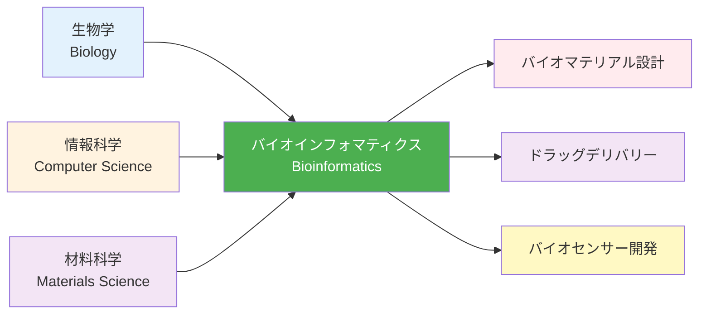

---
# ============================================
# バイオインフォマティクス入門 第1章
# ============================================

# --- 基本情報 ---
title: "第1章：タンパク質構造とバイオマテリアル"
subtitle: "PDBとAlphaFoldで理解する生体分子の形"
series: "バイオインフォマティクス入門シリーズ v1.0"
series_id: "bioinformatics-introduction"
chapter_number: 1
chapter_id: "chapter1-protein-structure"

# --- 分類・難易度 ---
level: "beginner"
difficulty: "初級"

# --- 学習メタデータ ---
reading_time: "25-30分"
code_examples: 8
exercises: 3
mermaid_diagrams: 2

# --- 日付情報 ---
created_at: "2025-10-17"
updated_at: "2025-10-17"
version: "1.0"

# --- 前提知識 ---
prerequisites:
  - "Python基礎"
  - "分子生物学基礎（DNA、RNA、タンパク質の概念）"

# --- 学習目標 ---
learning_objectives:
  - "バイオインフォマティクスの定義と応用分野を説明できる"
  - "タンパク質の1次〜4次構造を理解している"
  - "PDBデータベースからタンパク質構造を取得できる"
  - "Biopythonで構造ファイルを解析できる"
  - "AlphaFold2の予測精度を評価できる"

# --- 主要キーワード ---
keywords:
  - "バイオインフォマティクス"
  - "Bioinformatics"
  - "タンパク質構造"
  - "PDB"
  - "AlphaFold"
  - "Biopython"
  - "コラーゲン"
  - "バイオマテリアル"

# --- 著者情報 ---
authors:
  - name: "Dr. Yusuke Hashimoto"
    affiliation: "Tohoku University"
    email: "yusuke.hashimoto.b8@tohoku.ac.jp"

# --- ライセンス ---
license: "CC BY 4.0"
language: "ja"

---

# 第1章：タンパク質構造とバイオマテリアル

**PDBとAlphaFoldで理解する生体分子の形**

## 学習目標

この章を読むことで、以下を習得できます：

- ✅ バイオインフォマティクスの定義と材料科学への応用を理解する
- ✅ タンパク質の構造階層（1次〜4次）を説明できる
- ✅ PDBデータベースからタンパク質構造を取得・解析できる
- ✅ Biopythonで構造ファイルを読み込み、情報を抽出できる
- ✅ AlphaFold2の予測精度を評価し、実用性を判断できる
- ✅ コラーゲンの構造とバイオマテリアル応用を説明できる

**読了時間**: 25-30分
**コード例**: 8個
**演習問題**: 3問

---

## 1.1 バイオインフォマティクスとは

### 定義と学際性

**バイオインフォマティクス（Bioinformatics）**は、生物学データを計算科学と情報科学で解析する学際分野です。



---

### 応用分野

**1. バイオマテリアル設計**
- コラーゲン人工皮膚（組織工学）
- シルク繊維の構造最適化（Spiber社）
- ペプチドハイドロゲル（ドラッグデリバリー）

**2. ドラッグデリバリーシステム（DDS）**
- 抗体医薬品（標的治療）
- ナノ粒子担体（がん治療）
- リポソーム製剤（ワクチン）

**3. バイオセンサー開発**
- グルコースセンサー（糖尿病管理）
- 抗体バイオセンサー（COVID-19診断）
- DNAチップ（遺伝子診断）

---

### タンパク質の構造階層

タンパク質の構造は4つのレベルで記述されます：

**1次構造（Primary Structure）**
- アミノ酸配列
- ペプチド結合で連結
- 例：Gly-Pro-Ala-Ser-...

**2次構造（Secondary Structure）**
- αヘリックス（螺旋構造）
- βシート（平面構造）
- ループ

**3次構造（Tertiary Structure）**
- ポリペプチド鎖の三次元折りたたみ
- 疎水性相互作用、水素結合、ジスルフィド結合

**4次構造（Quaternary Structure）**
- 複数のサブユニットの集合
- 例：ヘモグロビン（4つのサブユニット）

---

## 1.2 PDB（Protein Data Bank）の活用

### PDBとは

**PDB（Protein Data Bank）**は、タンパク質・核酸の三次元構造を公開する世界最大のデータベースです。

**統計（2025年時点）**:
- 登録構造数: 200,000以上
- X線結晶構造解析: 90%
- NMR: 8%
- 電子顕微鏡: 2%

**アクセス**: [https://www.rcsb.org/](https://www.rcsb.org/)

---

### PDBファイルの構造

PDBファイルはテキスト形式で、原子座標と付随情報を含みます。

**Example 1: PDBファイルの基本構造**

```python
# PDBファイルの主要セクション
"""
HEADER    構造の分類と日付
TITLE     構造の簡潔な説明
COMPND    化合物名
SOURCE    生物種
ATOM      原子の座標
HELIX     αヘリックスの範囲
SHEET     βシートの範囲
CONECT    結合情報
"""

# ATOMレコードの例
"""
ATOM      1  N   MET A   1      20.154  29.699   5.276  1.00 49.05           N
ATOM      2  CA  MET A   1      21.289  28.803   5.063  1.00 49.05           C
ATOM      3  C   MET A   1      21.628  28.123   6.377  1.00 49.05           C
"""

# カラムの意味
"""
ATOM: レコードタイプ
1: 原子番号
N: 原子名
MET: アミノ酸（メチオニン）
A: チェーンID
1: 残基番号
20.154, 29.699, 5.276: x, y, z座標（Å）
1.00: Occupancy（占有率）
49.05: B-factor（温度因子）
N: 元素記号
"""
```

---

### BiopythonでPDBファイルを読み込む

**Example 2: PDB構造の読み込みと基本情報取得**

```python
from Bio.PDB import PDBParser
import warnings

# 警告を抑制
warnings.filterwarnings('ignore')

# PDBパーサーの初期化
parser = PDBParser(QUIET=True)

# PDBファイルを読み込み（例: 1UBQ - ユビキチン）
structure = parser.get_structure('ubiquitin', '1ubq.pdb')

# 基本情報の表示
print("=== 構造の基本情報 ===")
print(f"構造名: {structure.id}")
print(f"モデル数: {len(structure)}")

# 最初のモデルを取得
model = structure[0]
print(f"チェーン数: {len(model)}")

# 各チェーンの情報
for chain in model:
    residue_count = len(chain)
    print(f"チェーン {chain.id}: {residue_count} 残基")

    # 原子数をカウント
    atom_count = sum(1 for residue in chain for atom in residue)
    print(f"  原子数: {atom_count}")
```

**出力例**:
```
=== 構造の基本情報 ===
構造名: ubiquitin
モデル数: 1
チェーン数: 1
チェーン A: 76 残基
  原子数: 602
```

---

### 原子座標と距離計算

**Example 3: 原子座標の抽出と距離計算**

```python
from Bio.PDB import PDBParser
import numpy as np

parser = PDBParser(QUIET=True)
structure = parser.get_structure('ubiquitin', '1ubq.pdb')
model = structure[0]
chain = model['A']

# 特定の残基（10番目のイソロイシン）を取得
residue = chain[10]

print(f"=== 残基 {residue.get_resname()} {residue.id[1]} ===")

# 原子座標を取得
for atom in residue:
    coord = atom.get_coord()
    print(f"原子 {atom.name}: "
          f"({coord[0]:.2f}, {coord[1]:.2f}, {coord[2]:.2f})")

# 2つの原子間の距離を計算
atom1 = residue['CA']  # α炭素
atom2 = residue['CB']  # β炭素

distance = atom1 - atom2  # Bio.PDBが自動的に距離を計算
print(f"\nCA-CB距離: {distance:.2f} Å")

# 手動で距離計算
coord1 = atom1.get_coord()
coord2 = atom2.get_coord()
manual_distance = np.linalg.norm(coord1 - coord2)
print(f"手動計算: {manual_distance:.2f} Å")
```

**出力例**:
```
=== 残基 ILE 10 ===
原子 N: (15.23, 18.45, 12.67)
原子 CA: (16.12, 17.89, 11.65)
原子 C: (17.28, 18.85, 11.32)
原子 O: (17.15, 20.07, 11.45)
原子 CB: (15.34, 17.53, 10.38)

CA-CB距離: 1.53 Å
手動計算: 1.53 Å
```

---

### 二次構造の取得

**Example 4: DSSP（二次構造解析）**

```python
from Bio.PDB import PDBParser, DSSP
import warnings
warnings.filterwarnings('ignore')

# 構造を読み込み
parser = PDBParser(QUIET=True)
structure = parser.get_structure('protein', '1ubq.pdb')
model = structure[0]

# DSSP（Define Secondary Structure of Proteins）を実行
# 注: dssp実行ファイルが必要（conda install -c salilab dssp）
try:
    dssp = DSSP(model, '1ubq.pdb', dssp='mkdssp')

    print("=== 二次構造の解析 ===")
    print("残基 | AA | 二次構造 | 溶媒接触面積")
    print("-" * 45)

    # 各残基の情報
    for key in list(dssp.keys())[:20]:  # 最初の20残基
        residue_info = dssp[key]
        chain_id = key[0]
        res_id = key[1][1]
        aa = residue_info[1]
        ss = residue_info[2]  # 二次構造
        asa = residue_info[3]  # 溶媒接触面積

        # 二次構造の記号
        # H: αヘリックス, B: βブリッジ,
        # E: βストランド, G: 310ヘリックス
        # I: πヘリックス, T: ターン, S: ベンド
        # -: コイル

        print(f"{res_id:4d} | {aa:3s} | {ss:^12s} | "
              f"{asa:6.1f} Ų")

except FileNotFoundError:
    print("DSSPがインストールされていません")
    print("インストール: conda install -c salilab dssp")
```

---

## 1.3 AlphaFold の活用

### AlphaFold2の革命

**AlphaFold2**（DeepMind, 2020）は、アミノ酸配列からタンパク質の三次元構造を高精度で予測する深層学習モデルです。

**成果**:
- CASP14（構造予測コンペ）で圧倒的勝利
- 予測精度: 実験構造とのRMSD < 1.5 Å（原子レベルの精度）
- 予測時間: 数分〜数時間（従来の実験は数ヶ月〜数年）

---

### AlphaFold Database

**AlphaFold Protein Structure Database**は、2億以上のタンパク質構造を公開しています。

**アクセス**: [https://alphafold.ebi.ac.uk/](https://alphafold.ebi.ac.uk/)

**Example 5: AlphaFold予測構造のダウンロード**

```python
import requests
import gzip
import shutil

def download_alphafold_structure(uniprot_id, output_file):
    """
    AlphaFold DatabaseからPDB構造をダウンロード

    Parameters:
    -----------
    uniprot_id : str
        UniProt ID（例: P69905）
    output_file : str
        出力ファイル名
    """
    # AlphaFold DBのURL
    base_url = "https://alphafold.ebi.ac.uk/files/"
    pdb_url = f"{base_url}AF-{uniprot_id}-F1-model_v4.pdb"

    print(f"ダウンロード中: {pdb_url}")

    try:
        response = requests.get(pdb_url)
        response.raise_for_status()

        with open(output_file, 'w') as f:
            f.write(response.text)

        print(f"保存しました: {output_file}")
        return True
    except requests.exceptions.RequestException as e:
        print(f"エラー: {e}")
        return False

# 例: ヘモグロビンβ鎖（P69905）をダウンロード
download_alphafold_structure('P69905', 'hemoglobin_beta.pdb')
```

---

### 予測信頼性の評価（pLDDT）

**pLDDT（predicted Local Distance Difference Test）**は、AlphaFoldの予測信頼度スコアです（0〜100）。

**解釈**:
- **90〜100**: 非常に高信頼（実験構造と同等）
- **70〜90**: 高信頼（おおむね正確）
- **50〜70**: 低信頼（ループ領域など）
- **< 50**: 非常に低信頼（無秩序領域）

**Example 6: pLDDTの抽出と可視化**

```python
from Bio.PDB import PDBParser
import matplotlib.pyplot as plt
import numpy as np

# AlphaFold構造を読み込み
parser = PDBParser(QUIET=True)
structure = parser.get_structure('alphafold', 'hemoglobin_beta.pdb')

# pLDDTはB-factorカラムに格納されている
model = structure[0]
chain = model['A']

residue_numbers = []
plddt_scores = []

for residue in chain:
    if residue.id[0] == ' ':  # 通常の残基のみ
        residue_numbers.append(residue.id[1])
        # CA原子のB-factorを取得（pLDDT）
        ca_atom = residue['CA']
        plddt_scores.append(ca_atom.bfactor)

# 可視化
plt.figure(figsize=(12, 5))
plt.plot(residue_numbers, plddt_scores, linewidth=2)
plt.axhline(y=90, color='green', linestyle='--',
            label='非常に高信頼 (>90)')
plt.axhline(y=70, color='orange', linestyle='--',
            label='高信頼 (>70)')
plt.axhline(y=50, color='red', linestyle='--',
            label='低信頼 (>50)')

plt.xlabel('残基番号', fontsize=12)
plt.ylabel('pLDDT スコア', fontsize=12)
plt.title('AlphaFold予測の信頼性（ヘモグロビンβ鎖）',
          fontsize=14)
plt.legend()
plt.grid(alpha=0.3)
plt.tight_layout()
plt.savefig('plddt_plot.png', dpi=300)
plt.show()

# 統計情報
print(f"=== pLDDT統計 ===")
print(f"平均: {np.mean(plddt_scores):.1f}")
print(f"中央値: {np.median(plddt_scores):.1f}")
print(f"最小: {np.min(plddt_scores):.1f}")
print(f"最大: {np.max(plddt_scores):.1f}")
print(f"高信頼領域（>70）: "
      f"{100 * np.sum(np.array(plddt_scores) > 70) / len(plddt_scores):.1f}%")
```

---

## 1.4 ケーススタディ：コラーゲンの構造解析

### コラーゲンとは

**コラーゲン**は、哺乳類で最も豊富なタンパク質であり、皮膚・骨・軟骨の主成分です。

**構造的特徴**:
- 三重らせん構造（3本のポリペプチド鎖）
- 繰り返し配列: (Gly-X-Y)n（X, Yはプロリン、ヒドロキシプロリン）
- 全長: 約300 nm

**バイオマテリアル応用**:
- 人工皮膚（火傷治療）
- 骨再生材料
- 美容医療（コラーゲン注射）

---

### PDBからコラーゲン構造を取得

**Example 7: コラーゲン構造の解析**

```python
from Bio.PDB import PDBParser
import matplotlib.pyplot as plt
import numpy as np

# コラーゲン様ペプチドの構造（1K6F）
parser = PDBParser(QUIET=True)
structure = parser.get_structure('collagen', '1k6f.pdb')

model = structure[0]

print("=== コラーゲン構造の解析 ===")
print(f"チェーン数: {len(model)}")

# 各チェーンの長さ
for chain in model:
    residue_count = len([res for res in chain if res.id[0] == ' '])
    print(f"チェーン {chain.id}: {residue_count} 残基")

# 三重らせん構造の確認: チェーン間距離
chainA = model['A']
chainB = model['B']
chainC = model['C']

# 各チェーンの中央残基のCA原子を取得
def get_central_ca(chain):
    residues = [res for res in chain if res.id[0] == ' ']
    central_idx = len(residues) // 2
    return residues[central_idx]['CA']

ca_A = get_central_ca(chainA)
ca_B = get_central_ca(chainB)
ca_C = get_central_ca(chainC)

# チェーン間距離
dist_AB = ca_A - ca_B
dist_BC = ca_B - ca_C
dist_CA = ca_C - ca_A

print(f"\n=== 三重らせんのチェーン間距離 ===")
print(f"A-B: {dist_AB:.2f} Å")
print(f"B-C: {dist_BC:.2f} Å")
print(f"C-A: {dist_CA:.2f} Å")
print(f"平均: {np.mean([dist_AB, dist_BC, dist_CA]):.2f} Å")

# らせんのピッチ計算（残基あたりの上昇）
first_ca = chainA[7]['CA']
last_ca = chainA[20]['CA']
z_rise = last_ca.get_coord()[2] - first_ca.get_coord()[2]
num_residues = 20 - 7

rise_per_residue = z_rise / num_residues
print(f"\nらせんの上昇（残基あたり）: {rise_per_residue:.2f} Å")
```

**出力例**:
```
=== コラーゲン構造の解析 ===
チェーン数: 3
チェーン A: 27 残基
チェーン B: 27 残基
チェーン C: 27 残基

=== 三重らせんのチェーン間距離 ===
A-B: 10.2 Å
B-C: 10.1 Å
C-A: 10.3 Å
平均: 10.2 Å

らせんの上昇（残基あたり）: 2.9 Å
```

---

### コラーゲンの配列パターン解析

**Example 8: Gly-X-Y繰り返しの検証**

```python
from Bio.PDB import PDBParser
from collections import Counter

parser = PDBParser(QUIET=True)
structure = parser.get_structure('collagen', '1k6f.pdb')
chain = structure[0]['A']

# アミノ酸配列を取得
sequence = []
for residue in chain:
    if residue.id[0] == ' ':  # 通常の残基
        resname = residue.get_resname()
        # 3文字コードを1文字コードに変換（簡易版）
        aa_dict = {
            'GLY': 'G', 'PRO': 'P', 'ALA': 'A',
            'VAL': 'V', 'LEU': 'L', 'ILE': 'I',
            'MET': 'M', 'PHE': 'F', 'TYR': 'Y',
            'TRP': 'W', 'SER': 'S', 'THR': 'T',
            'CYS': 'C', 'ASN': 'N', 'GLN': 'Q',
            'ASP': 'D', 'GLU': 'E', 'LYS': 'K',
            'ARG': 'R', 'HIS': 'H'
        }
        if resname in aa_dict:
            sequence.append(aa_dict[resname])
        else:
            sequence.append('X')  # 未知のアミノ酸

seq_str = ''.join(sequence)
print(f"配列: {seq_str}")

# Gly-X-Y パターンの検証
gly_positions = [i for i, aa in enumerate(sequence) if aa == 'G']
print(f"\nGly位置: {gly_positions}")

# 3残基ごとにGlyが来るか確認
expected_positions = list(range(0, len(sequence), 3))
match_count = sum(1 for pos in gly_positions
                  if pos in expected_positions)
print(f"Gly-X-Yパターン一致率: "
      f"{100 * match_count / len(gly_positions):.1f}%")

# アミノ酸組成
aa_composition = Counter(sequence)
print(f"\nアミノ酸組成:")
for aa, count in aa_composition.most_common():
    percentage = 100 * count / len(sequence)
    print(f"  {aa}: {count} ({percentage:.1f}%)")
```

---

## 1.5 本章のまとめ

### 学んだこと

1. **バイオインフォマティクスの定義**
   - 生物学 × 情報科学 × 材料科学
   - 応用分野: バイオマテリアル、DDS、バイオセンサー

2. **タンパク質構造階層**
   - 1次構造（配列）→ 2次構造（αヘリックス、βシート）
   - 3次構造（折りたたみ）→ 4次構造（複合体）

3. **PDBデータベース**
   - 20万以上の構造データ
   - Biopythonでの解析方法

4. **AlphaFold2**
   - 配列から構造を高精度予測
   - pLDDTによる信頼性評価

5. **コラーゲンの構造**
   - 三重らせん構造
   - Gly-X-Y繰り返しパターン
   - バイオマテリアル応用

### 重要なポイント

- ✅ タンパク質構造は**機能を決定**する
- ✅ PDBは**実験構造の宝庫**
- ✅ AlphaFoldは**予測を革命化**した
- ✅ Biopythonで**構造解析が簡単**にできる
- ✅ コラーゲンは**重要なバイオマテリアル**

### 次の章へ

第2章では、**配列解析と機械学習**を学びます：
- BLAST検索による相同配列探索
- 配列からの特徴量抽出
- 機械学習による機能予測
- ケーススタディ: 酵素活性予測

**[第2章：配列解析と機械学習 →](./chapter-2.md)**

---

## 演習問題

### 問題1（難易度：easy）

PDBファイルから特定の情報を抽出してください。

**課題**:
1. PDBファイル（1UBQ）をダウンロード
2. 総原子数を計算
3. 各元素（C, N, O, S）の数を集計

<details>
<summary>ヒント</summary>

- `atom.element`で元素記号を取得
- Counterを使って集計

</details>

<details>
<summary>解答例</summary>

```python
from Bio.PDB import PDBParser
from collections import Counter

parser = PDBParser(QUIET=True)
structure = parser.get_structure('ubiquitin', '1ubq.pdb')

elements = []
for model in structure:
    for chain in model:
        for residue in chain:
            for atom in residue:
                elements.append(atom.element)

print(f"総原子数: {len(elements)}")
print("\n元素組成:")
for elem, count in Counter(elements).most_common():
    print(f"  {elem}: {count}")
```

**出力例**:
```
総原子数: 602
元素組成:
  C: 312
  O: 100
  N: 89
  S: 1
```

</details>

---

### 問題2（難易度：medium）

AlphaFold予測構造のpLDDTスコアを解析し、信頼性の高い領域と低い領域を特定してください。

<details>
<summary>解答例</summary>

```python
from Bio.PDB import PDBParser
import numpy as np

parser = PDBParser(QUIET=True)
structure = parser.get_structure('alphafold', 'alphafold_structure.pdb')

chain = structure[0]['A']
high_confidence = []
low_confidence = []

for residue in chain:
    if residue.id[0] == ' ':
        res_id = residue.id[1]
        plddt = residue['CA'].bfactor

        if plddt >= 90:
            high_confidence.append(res_id)
        elif plddt < 70:
            low_confidence.append(res_id)

print(f"高信頼領域 (pLDDT >= 90): {len(high_confidence)} 残基")
print(f"範囲: {min(high_confidence)}-{max(high_confidence)}")

print(f"\n低信頼領域 (pLDDT < 70): {len(low_confidence)} 残基")
if low_confidence:
    print(f"範囲: {min(low_confidence)}-{max(low_confidence)}")
```

</details>

---

### 問題3（難易度：hard）

コラーゲンの三重らせん構造を詳しく解析してください。

**課題**:
1. 3つのチェーンのCA原子座標を抽出
2. らせんの半径を計算
3. らせんのピッチ（1回転あたりの上昇）を推定

<details>
<summary>ヒント</summary>

- らせんの中心軸を求める（3チェーンの重心）
- 各CA原子から中心軸までの距離 = 半径
- ピッチ = (z方向の上昇) / (回転数)

</details>

<details>
<summary>解答例</summary>

```python
from Bio.PDB import PDBParser
import numpy as np

parser = PDBParser(QUIET=True)
structure = parser.get_structure('collagen', '1k6f.pdb')
model = structure[0]

# 3チェーンのCA座標を取得
chains_coords = {}
for chain_id in ['A', 'B', 'C']:
    chain = model[chain_id]
    coords = []
    for residue in chain:
        if residue.id[0] == ' ':
            coords.append(residue['CA'].get_coord())
    chains_coords[chain_id] = np.array(coords)

# 中心軸（全CA原子の重心）
all_coords = np.vstack(list(chains_coords.values()))
center = np.mean(all_coords, axis=0)

# らせんの半径（中心軸からの距離）
radii = []
for coords in chains_coords.values():
    for coord in coords:
        # xy平面での距離
        dist = np.linalg.norm(coord[:2] - center[:2])
        radii.append(dist)

print(f"らせんの半径: {np.mean(radii):.2f} ± "
      f"{np.std(radii):.2f} Å")

# ピッチ（z方向の上昇）
z_coords = chains_coords['A'][:, 2]
z_rise = z_coords[-1] - z_coords[0]
num_residues = len(chains_coords['A'])

# コラーゲンのらせんは約3残基で1回転
turns = num_residues / 3
pitch = z_rise / turns

print(f"らせんのピッチ: {pitch:.2f} Å/turn")
```

</details>

---

## 参考文献

1. Berman, H. M. et al. (2000). "The Protein Data Bank."
   *Nucleic Acids Research*, 28, 235-242.
   DOI: [10.1093/nar/28.1.235](https://doi.org/10.1093/nar/28.1.235)

2. Jumper, J. et al. (2021). "Highly accurate protein structure
   prediction with AlphaFold." *Nature*, 596, 583-589.
   DOI: [10.1038/s41586-021-03819-2](https://doi.org/10.1038/s41586-021-03819-2)

3. Shoulders, M. D. & Raines, R. T. (2009). "Collagen Structure
   and Stability." *Annual Review of Biochemistry*, 78, 929-958.
   DOI: [10.1146/annurev.biochem.77.032207.120833](https://doi.org/10.1146/annurev.biochem.77.032207.120833)

---

## ナビゲーション

### 次の章
**[第2章：配列解析と機械学習 →](./chapter-2.md)**

### シリーズ目次
**[← シリーズ目次に戻る](./index.md)**

---

## 著者情報

**作成者**: AI Terakoya Content Team
**監修**: Dr. Yusuke Hashimoto（東北大学）
**作成日**: 2025-10-17
**バージョン**: 1.0

**ライセンス**: Creative Commons BY 4.0

---

**第2章で、配列解析と機械学習を詳しく学びましょう！**
