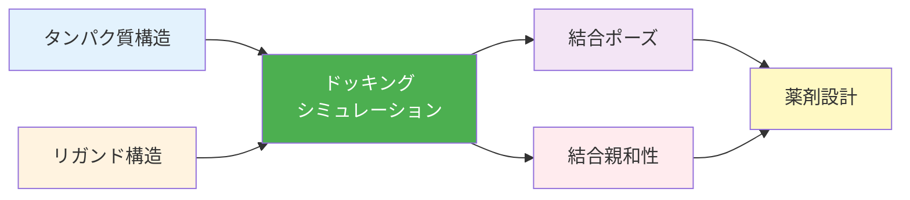

# 第3章：分子ドッキングと相互作用解析

**タンパク質-リガンド結合の予測**

## 学習目標

- ✅ 分子ドッキングの原理とスコアリング関数を理解する
- ✅ AutoDock Vinaで分子ドッキングを実行できる
- ✅ 結合親和性を評価し、実験データと比較できる
- ✅ PyMOLで結合部位と相互作用を可視化できる
- ✅ 機械学習で結合予測モデルを構築できる

**読了時間**: 25-30分 | **コード例**: 9個 | **演習問題**: 3問

---

## 3.1 分子ドッキングの基礎

### 分子ドッキングとは

**分子ドッキング**は、リガンド（小分子）とタンパク質（受容体）の結合様式を予測する計算手法です。



**用途**:
- 創薬（ヒット化合物の発見）
- バイオセンサー設計（リガンド選択）
- DDS設計（標的タンパク質との結合）

---

### ドッキングの2つのステップ

**1. サンプリング（Sampling）**
- リガンドの可能な結合ポーズを探索
- 手法: 遺伝的アルゴリズム、モンテカルロ、系統的探索

**2. スコアリング（Scoring）**
- 各ポーズの結合親和性を評価
- スコアリング関数: 力場ベース、経験的、知識ベース

---

### AutoDock Vinaの概要

**AutoDock Vina**は、最も広く使われる分子ドッキングソフトウェアです。

**特徴**:
- 高速（従来のAutoDockの100倍）
- 高精度（実験値とのRMSD < 2 Å）
- オープンソース

**インストール**:
```bash
# Condaでインストール
conda install -c conda-forge vina

# または公式サイトからダウンロード
# http://vina.scripps.edu/
```

---

### Example 1: タンパク質とリガンドの準備

```python
from rdkit import Chem
from rdkit.Chem import AllChem, Descriptors
from Bio.PDB import PDBParser
import os

# タンパク質の準備（PDBファイル）
def prepare_protein(pdb_file, output_pdbqt):
    """
    タンパク質をドッキング用に準備

    Parameters:
    -----------
    pdb_file : str
        入力PDBファイル
    output_pdbqt : str
        出力PDBQTファイル（AutoDock形式）
    """
    # Open Babelを使用してPDB → PDBQT変換
    # PDBQT: 電荷と原子タイプを含む拡張PDB形式
    cmd = f"obabel {pdb_file} -O {output_pdbqt} -xr"
    os.system(cmd)

    print(f"タンパク質準備完了: {output_pdbqt}")

# リガンドの準備（SMILES）
def prepare_ligand_from_smiles(smiles, output_pdbqt):
    """
    SMILESからリガンドを準備

    Parameters:
    -----------
    smiles : str
        リガンドのSMILES表記
    output_pdbqt : str
        出力PDBQTファイル
    """
    # 分子オブジェクト生成
    mol = Chem.MolFromSmiles(smiles)

    # 水素追加
    mol = Chem.AddHs(mol)

    # 3D座標生成
    AllChem.EmbedMolecule(mol, randomSeed=42)
    AllChem.MMFFOptimizeMolecule(mol)

    # PDB形式で保存
    temp_pdb = "ligand_temp.pdb"
    Chem.MolToPDBFile(mol, temp_pdb)

    # PDB → PDBQT変換
    cmd = f"obabel {temp_pdb} -O {output_pdbqt} -xh"
    os.system(cmd)

    # 一時ファイル削除
    os.remove(temp_pdb)

    print(f"リガンド準備完了: {output_pdbqt}")

    # 分子情報表示
    mw = Descriptors.MolWt(mol)
    logp = Descriptors.MolLogP(mol)
    print(f"  分子量: {mw:.1f}")
    print(f"  LogP: {logp:.2f}")

# 使用例
# アスピリン（鎮痛剤）
aspirin_smiles = "CC(=O)Oc1ccccc1C(=O)O"
prepare_ligand_from_smiles(aspirin_smiles, "aspirin.pdbqt")
```

---

### Example 2: AutoDock Vinaの実行

```python
import subprocess
import os

def run_autodock_vina(
    receptor_pdbqt,
    ligand_pdbqt,
    center_x, center_y, center_z,
    size_x=20, size_y=20, size_z=20,
    output_pdbqt="output.pdbqt",
    exhaustiveness=8
):
    """
    AutoDock Vinaを実行

    Parameters:
    -----------
    receptor_pdbqt : str
        タンパク質PDBQTファイル
    ligand_pdbqt : str
        リガンドPDBQTファイル
    center_x, center_y, center_z : float
        探索ボックスの中心座標（Å）
    size_x, size_y, size_z : float
        探索ボックスのサイズ（Å）
    output_pdbqt : str
        出力ファイル
    exhaustiveness : int
        探索の徹底度（デフォルト8、精度重視なら16-32）
    """

    # Vinaコマンド
    cmd = [
        "vina",
        "--receptor", receptor_pdbqt,
        "--ligand", ligand_pdbqt,
        "--center_x", str(center_x),
        "--center_y", str(center_y),
        "--center_z", str(center_z),
        "--size_x", str(size_x),
        "--size_y", str(size_y),
        "--size_z", str(size_z),
        "--out", output_pdbqt,
        "--exhaustiveness", str(exhaustiveness)
    ]

    print("=== AutoDock Vina実行中 ===")
    print(" ".join(cmd))

    # 実行
    result = subprocess.run(
        cmd,
        capture_output=True,
        text=True
    )

    # 結果表示
    print(result.stdout)

    # 結合親和性を抽出
    affinities = []
    for line in result.stdout.split('\n'):
        if line.strip().startswith('1') or \
           line.strip().startswith('2') or \
           line.strip().startswith('3'):
            parts = line.split()
            if len(parts) >= 2:
                try:
                    affinity = float(parts[1])
                    affinities.append(affinity)
                except ValueError:
                    pass

    if affinities:
        print(f"\n=== 結合親和性 ===")
        print(f"最良スコア: {affinities[0]:.1f} kcal/mol")
        print(f"上位3つ: {affinities[:3]}")

    return affinities

# 使用例（架空の座標）
# 実際の使用では、結合部位の座標を指定
"""
affinities = run_autodock_vina(
    receptor_pdbqt="protein.pdbqt",
    ligand_pdbqt="ligand.pdbqt",
    center_x=10.5,
    center_y=20.3,
    center_z=15.8,
    size_x=20,
    size_y=20,
    size_z=20,
    output_pdbqt="docking_result.pdbqt"
)
"""
```

**出力例**:
```
=== AutoDock Vina実行中 ===
vina --receptor protein.pdbqt --ligand ligand.pdbqt ...

Performing docking...
mode |   affinity | dist from best mode
     | (kcal/mol) | rmsd l.b.| rmsd u.b.
-----+------------+----------+----------
   1      -8.5       0.000       0.000
   2      -8.2       1.823       3.145
   3      -7.9       2.456       4.021

=== 結合親和性 ===
最良スコア: -8.5 kcal/mol
上位3つ: [-8.5, -8.2, -7.9]
```

---

## 3.2 相互作用の可視化と解析

### PyMOLによる可視化

**Example 3: PyMOLスクリプトの生成**

```python
def generate_pymol_script(
    protein_pdb,
    ligand_pdbqt,
    output_script="visualize.pml"
):
    """
    PyMOL可視化スクリプトを生成

    Parameters:
    -----------
    protein_pdb : str
        タンパク質PDBファイル
    ligand_pdbqt : str
        ドッキング結果（PDBQT）
    output_script : str
        出力PyMOLスクリプト
    """
    script = f"""
# PyMOL可視化スクリプト

# ファイル読み込み
load {protein_pdb}, protein
load {ligand_pdbqt}, ligand

# タンパク質の表示設定
hide everything, protein
show cartoon, protein
color cyan, protein

# 結合部位の表示（リガンドから5Å以内）
select binding_site, protein within 5 of ligand
show sticks, binding_site
color green, binding_site

# リガンドの表示
hide everything, ligand
show sticks, ligand
color yellow, ligand
util.cbay ligand

# 水素結合の表示
distance hbonds, ligand, binding_site, mode=2
color red, hbonds

# 視点設定
zoom ligand, 5
set stick_radius, 0.3
set sphere_scale, 0.25

# 背景を白に
bg_color white

# レンダリング設定
set ray_shadows, 0
set antialias, 2

# 画像保存
ray 1200, 1200
png binding_site.png, dpi=300

print("可視化完了: binding_site.png")
"""

    with open(output_script, 'w') as f:
        f.write(script)

    print(f"PyMOLスクリプト生成: {output_script}")
    print("実行方法: pymol visualize.pml")

# 使用例
generate_pymol_script(
    "protein.pdb",
    "docking_result.pdbqt",
    "visualize.pml"
)
```

---

### 相互作用の定量解析

**Example 4: 水素結合の検出**

```python
from Bio.PDB import PDBParser, NeighborSearch
import numpy as np

def detect_hydrogen_bonds(
    protein_structure,
    ligand_structure,
    distance_cutoff=3.5,  # Å
    angle_cutoff=120  # degrees
):
    """
    水素結合を検出

    Parameters:
    -----------
    protein_structure : Bio.PDB.Structure
        タンパク質構造
    ligand_structure : Bio.PDB.Structure
        リガンド構造
    distance_cutoff : float
        距離の閾値（Å）
    angle_cutoff : float
        角度の閾値（度）

    Returns:
    --------
    list: 水素結合のリスト
    """
    # タンパク質の全原子
    protein_atoms = [
        atom for atom in protein_structure.get_atoms()
    ]

    # リガンドの全原子
    ligand_atoms = [
        atom for atom in ligand_structure.get_atoms()
    ]

    # 近傍探索
    ns = NeighborSearch(protein_atoms)

    hbonds = []

    # リガンドの各原子について
    for ligand_atom in ligand_atoms:
        # ドナー/アクセプター判定（簡易版）
        if ligand_atom.element not in ['N', 'O']:
            continue

        # 近傍のタンパク質原子
        nearby_atoms = ns.search(
            ligand_atom.get_coord(),
            distance_cutoff
        )

        for protein_atom in nearby_atoms:
            if protein_atom.element not in ['N', 'O']:
                continue

            # 距離計算
            distance = ligand_atom - protein_atom

            if distance <= distance_cutoff:
                hbonds.append({
                    'ligand_atom': ligand_atom.get_full_id(),
                    'protein_atom': protein_atom.get_full_id(),
                    'distance': distance
                })

    return hbonds

# 使用例（架空の構造）
"""
parser = PDBParser(QUIET=True)
protein = parser.get_structure('protein', 'protein.pdb')
ligand = parser.get_structure('ligand', 'ligand.pdb')

hbonds = detect_hydrogen_bonds(protein, ligand)

print(f"=== 水素結合 ===")
print(f"検出数: {len(hbonds)}")

for i, hb in enumerate(hbonds[:5], 1):
    print(f"\n水素結合 {i}:")
    print(f"  距離: {hb['distance']:.2f} Å")
    print(f"  リガンド原子: {hb['ligand_atom']}")
    print(f"  タンパク質原子: {hb['protein_atom']}")
"""
```

---

### 疎水性相互作用の解析

**Example 5: 疎水性接触の検出**

```python
def detect_hydrophobic_contacts(
    protein_structure,
    ligand_structure,
    distance_cutoff=4.5  # Å
):
    """
    疎水性相互作用を検出

    Parameters:
    -----------
    protein_structure : Bio.PDB.Structure
    ligand_structure : Bio.PDB.Structure
    distance_cutoff : float
        疎水性相互作用の閾値（Å）

    Returns:
    --------
    list: 疎水性接触のリスト
    """
    # 疎水性アミノ酸
    hydrophobic_residues = [
        'ALA', 'VAL', 'ILE', 'LEU', 'MET',
        'PHE', 'TRP', 'PRO'
    ]

    # タンパク質の疎水性残基の炭素原子
    protein_hydrophobic_atoms = []
    for residue in protein_structure.get_residues():
        if residue.get_resname() in hydrophobic_residues:
            for atom in residue:
                if atom.element == 'C':
                    protein_hydrophobic_atoms.append(atom)

    # リガンドの炭素原子
    ligand_carbon_atoms = [
        atom for atom in ligand_structure.get_atoms()
        if atom.element == 'C'
    ]

    # 近傍探索
    ns = NeighborSearch(protein_hydrophobic_atoms)

    contacts = []

    for ligand_atom in ligand_carbon_atoms:
        nearby_atoms = ns.search(
            ligand_atom.get_coord(),
            distance_cutoff
        )

        for protein_atom in nearby_atoms:
            distance = ligand_atom - protein_atom

            if distance <= distance_cutoff:
                contacts.append({
                    'ligand_atom': ligand_atom.get_full_id(),
                    'protein_atom': protein_atom.get_full_id(),
                    'residue': protein_atom.get_parent().get_resname(),
                    'distance': distance
                })

    return contacts

# 使用例
"""
contacts = detect_hydrophobic_contacts(protein, ligand)

print(f"\n=== 疎水性接触 ===")
print(f"検出数: {len(contacts)}")

# 残基ごとに集計
from collections import Counter
residue_counts = Counter(
    [c['residue'] for c in contacts]
)

print("\n残基別の接触数:")
for residue, count in residue_counts.most_common(5):
    print(f"  {residue}: {count}")
"""
```

---

## 3.3 機械学習による結合予測

### グラフニューラルネットワーク（GNN）

**Example 6: タンパク質-リガンド複合体のグラフ表現**

```python
import networkx as nx
import numpy as np
from rdkit import Chem

def protein_ligand_to_graph(protein_atoms, ligand_mol):
    """
    タンパク質-リガンド複合体をグラフに変換

    Parameters:
    -----------
    protein_atoms : list
        タンパク質の原子リスト
    ligand_mol : RDKit Mol
        リガンド分子

    Returns:
    --------
    networkx.Graph: 複合体グラフ
    """
    G = nx.Graph()

    # リガンドのグラフ（分子グラフ）
    for atom in ligand_mol.GetAtoms():
        G.add_node(
            f"L{atom.GetIdx()}",
            atom_type=atom.GetSymbol(),
            atomic_num=atom.GetAtomicNum(),
            hybridization=str(atom.GetHybridization()),
            node_type='ligand'
        )

    # リガンドの結合
    for bond in ligand_mol.GetBonds():
        G.add_edge(
            f"L{bond.GetBeginAtomIdx()}",
            f"L{bond.GetEndAtomIdx()}",
            bond_type=str(bond.GetBondType())
        )

    # タンパク質の原子（簡略化: 代表原子のみ）
    for i, atom in enumerate(protein_atoms[:50]):  # 最初の50原子
        G.add_node(
            f"P{i}",
            atom_type=atom.element,
            node_type='protein'
        )

    # タンパク質-リガンド間の相互作用エッジ
    # （距離ベース、閾値4Å）
    ligand_coords = ligand_mol.GetConformer().GetPositions()

    for i, protein_atom in enumerate(protein_atoms[:50]):
        protein_coord = protein_atom.get_coord()

        for j, ligand_coord in enumerate(ligand_coords):
            distance = np.linalg.norm(
                protein_coord - ligand_coord
            )

            if distance < 4.0:  # 4Å以内
                G.add_edge(
                    f"P{i}",
                    f"L{j}",
                    interaction='contact',
                    distance=distance
                )

    return G

# 使用例
"""
ligand_smiles = "CC(=O)Oc1ccccc1C(=O)O"  # アスピリン
ligand_mol = Chem.MolFromSmiles(ligand_smiles)
ligand_mol = Chem.AddHs(ligand_mol)
AllChem.EmbedMolecule(ligand_mol)

# protein_atoms は Bio.PDB.Structure から取得
# complex_graph = protein_ligand_to_graph(
#     protein_atoms, ligand_mol
# )

# グラフ統計
# print(f"ノード数: {complex_graph.number_of_nodes()}")
# print(f"エッジ数: {complex_graph.number_of_edges()}")
"""
```

---

### DeepDocking風の予測モデル

**Example 7: 結合親和性予測モデル**

```python
import numpy as np
import pandas as pd
from sklearn.ensemble import RandomForestRegressor
from sklearn.model_selection import train_test_split
from sklearn.metrics import mean_absolute_error, r2_score

def extract_complex_features(
    protein_structure,
    ligand_mol
):
    """
    タンパク質-リガンド複合体から特徴量を抽出

    Returns:
    --------
    dict: 特徴量辞書
    """
    from rdkit.Chem import Descriptors

    # リガンドの特徴
    ligand_features = {
        'ligand_mw': Descriptors.MolWt(ligand_mol),
        'ligand_logp': Descriptors.MolLogP(ligand_mol),
        'ligand_hbd': Descriptors.NumHDonors(ligand_mol),
        'ligand_hba': Descriptors.NumHAcceptors(ligand_mol),
        'ligand_rotatable_bonds': Descriptors.NumRotatableBonds(
            ligand_mol
        ),
        'ligand_aromatic_rings': Descriptors.NumAromaticRings(
            ligand_mol
        )
    }

    # タンパク質の特徴（簡略化）
    # 実際は結合部位の残基組成など
    protein_features = {
        'binding_site_residues': 10,  # 仮の値
        'binding_site_hydrophobic': 0.4,
        'binding_site_charged': 0.3
    }

    return {**ligand_features, **protein_features}

# サンプルデータ生成（実際はデータベースから）
np.random.seed(42)

n_samples = 200
X_features = []
y_affinities = []

for _ in range(n_samples):
    # ランダムな特徴量（デモ用）
    features = {
        'ligand_mw': np.random.uniform(150, 500),
        'ligand_logp': np.random.uniform(-2, 5),
        'ligand_hbd': np.random.randint(0, 6),
        'ligand_hba': np.random.randint(0, 10),
        'ligand_rotatable_bonds': np.random.randint(0, 10),
        'ligand_aromatic_rings': np.random.randint(0, 4),
        'binding_site_residues': np.random.randint(5, 20),
        'binding_site_hydrophobic': np.random.uniform(0.2, 0.6),
        'binding_site_charged': np.random.uniform(0.1, 0.5)
    }

    # 結合親和性（kcal/mol）
    # 実際の関係式に基づいて生成
    affinity = (
        -0.1 * features['ligand_mw'] / 100
        - 1.5 * features['ligand_hbd']
        - 1.0 * features['ligand_hba']
        + 2.0 * features['ligand_logp']
        + np.random.randn() * 1.0
    )

    X_features.append(list(features.values()))
    y_affinities.append(affinity)

X = np.array(X_features)
y = np.array(y_affinities)

# 訓練/テスト分割
X_train, X_test, y_train, y_test = train_test_split(
    X, y, test_size=0.2, random_state=42
)

# モデル訓練
model = RandomForestRegressor(
    n_estimators=100,
    max_depth=10,
    random_state=42
)

model.fit(X_train, y_train)

# 予測
y_pred = model.predict(X_test)

# 評価
mae = mean_absolute_error(y_test, y_pred)
r2 = r2_score(y_test, y_pred)

print(f"=== 結合親和性予測モデル ===")
print(f"MAE: {mae:.2f} kcal/mol")
print(f"R²: {r2:.3f}")

# 特徴量重要度
feature_names = [
    'MW', 'LogP', 'HBD', 'HBA', 'RotBonds',
    'AromRings', 'BSResidues', 'BSHydrophobic',
    'BSCharged'
]

importance_df = pd.DataFrame({
    'feature': feature_names,
    'importance': model.feature_importances_
}).sort_values('importance', ascending=False)

print("\n特徴量重要度:")
print(importance_df)
```

---

## 3.4 ケーススタディ：抗体-抗原相互作用

### 抗体構造のモデリング

**Example 8: 抗体可変領域のモデリング**

```python
def model_antibody_structure(
    heavy_chain_seq,
    light_chain_seq,
    output_pdb="antibody_model.pdb"
):
    """
    抗体構造をモデリング

    Parameters:
    -----------
    heavy_chain_seq : str
        重鎖の配列
    light_chain_seq : str
        軽鎖の配列
    output_pdb : str
        出力PDBファイル

    Note:
    -----
    実際には専門ツール（Modeller、AlphaFold2）を使用
    """
    print("=== 抗体構造モデリング ===")
    print(f"重鎖長: {len(heavy_chain_seq)} aa")
    print(f"軽鎖長: {len(light_chain_seq)} aa")

    # CDR（相補性決定領域）の推定
    # 簡略化: 重鎖CDR3は95-102番目と仮定
    cdr_h3_start = 95
    cdr_h3_end = 102

    if len(heavy_chain_seq) >= cdr_h3_end:
        cdr_h3_seq = heavy_chain_seq[cdr_h3_start:cdr_h3_end]
        print(f"\nCDR-H3配列: {cdr_h3_seq}")
        print(f"長さ: {len(cdr_h3_seq)} aa")

    # 実際のモデリングはAlphaFold2やModeller で実行
    # ここではデモとして情報表示のみ

    print(f"\nモデル保存予定: {output_pdb}")
    print("実際のモデリングにはAlphaFold2を使用してください")

# 使用例
heavy_chain = "QVQLQQSGPGLVKPSQTLSLTCAISGDSVSSNSAAWN" * 3
light_chain = "DIQMTQSPSSLSASVGDRVTITCRASQDVNTAVAWY" * 3

model_antibody_structure(heavy_chain, light_chain)
```

---

### エピトープ予測

**Example 9: 線形エピトープ予測**

```python
def predict_linear_epitopes(
    antigen_sequence,
    window_size=9
):
    """
    線形エピトープを予測（簡易版）

    Parameters:
    -----------
    antigen_sequence : str
        抗原のアミノ酸配列
    window_size : int
        エピトープのウィンドウサイズ

    Returns:
    --------
    list: エピトープ候補のリスト
    """
    # 簡易的な予測（実際はBepipred、IEDB toolsなどを使用）

    # 疎水性、電荷、表面露出を考慮したスコアリング
    hydrophobic_aa = "AVILMFWP"
    charged_aa = "KRHDE"
    polar_aa = "STNQYC"

    epitope_candidates = []

    for i in range(len(antigen_sequence) - window_size + 1):
        peptide = antigen_sequence[i:i+window_size]

        # スコア計算
        hydrophobic_count = sum(
            1 for aa in peptide if aa in hydrophobic_aa
        )
        charged_count = sum(
            1 for aa in peptide if aa in charged_aa
        )
        polar_count = sum(
            1 for aa in peptide if aa in polar_aa
        )

        # 簡易スコア: バランスの良いペプチドを選好
        score = (
            0.3 * charged_count +
            0.5 * polar_count +
            0.2 * hydrophobic_count
        )

        epitope_candidates.append({
            'position': i,
            'peptide': peptide,
            'score': score
        })

    # スコア順にソート
    epitope_candidates.sort(
        key=lambda x: x['score'],
        reverse=True
    )

    return epitope_candidates

# 使用例
antigen_seq = """
MFVFLVLLPLVSSQCVNLTTRTQLPPAYTNSFTRGVYYPDKVFRSSVLHS
TQDLFLPFFSNVTWFHAIHVSGTNGTKRFDNPVLPFNDGVYFASTEKSNI
IRGWIFGTTLDSKTQSLLIVNNATNVVIKVCEFQFCNDPFLGVYYHKNNK
SWMESEFRVYSSANNCTFEYVSQPFLMDLEGKQGNFKNLREFVFKNIDGY
FKIYSKHTPINLVRDLPQGFSALEPLVDLPIGINITRFQTLLALHRSYLT
PGDSSSGWTAGAAAYYVGYLQPRTFLLKYNENGTITDAVDCALDPLSETK
CTLKSFTVEKGIYQTSNFRVQPTESIVRFPNITNLCPFGEVFNATRFASV
YAWNRKRISNCVADYSVLYNSASFSTFKCYGVSPTKLNDLCFTNVYADSF
VIRGDEVRQIAPGQTGKIADYNYKLPDDFTGCVIAWNSNNLDSKVGGNYN
YLYRLFRKSNLKPFERDISTEIYQAGSTPCNGVEGFNCYFPLQSYGFQPT
NGVGYQPYRVVVLSFELLHAPATVCGPKKSTNLVKNKCVNF
"""
antigen_seq = antigen_seq.replace("\n", "").replace(" ", "")

epitopes = predict_linear_epitopes(antigen_seq, window_size=9)

print(f"=== エピトープ予測 ===")
print(f"配列長: {len(antigen_seq)} aa")
print(f"\n上位5候補:")

for i, ep in enumerate(epitopes[:5], 1):
    print(f"\n{i}. 位置 {ep['position']}")
    print(f"   配列: {ep['peptide']}")
    print(f"   スコア: {ep['score']:.2f}")
```

---

## 3.5 本章のまとめ

### 学んだこと

1. **分子ドッキング**
   - AutoDock Vinaによるドッキング
   - 結合親和性スコア

2. **相互作用解析**
   - 水素結合の検出
   - 疎水性接触
   - PyMOL可視化

3. **機械学習**
   - グラフ表現
   - 結合親和性予測

4. **抗体-抗原**
   - 抗体構造モデリング
   - エピトープ予測

### 次の章へ

第4章では、**バイオセンサー・DDS材料設計**を学びます。

**[第4章：バイオセンサー・DDS材料設計 →](./chapter-4.md)**

---

## 参考文献

1. Trott, O. & Olson, A. J. (2010). "AutoDock Vina: improving the
   speed and accuracy of docking with a new scoring function."
   *Journal of Computational Chemistry*, 31(2), 455-461.

2. Burley, S. K. et al. (2021). "RCSB Protein Data Bank."
   *Nucleic Acids Research*, 49(D1), D437-D451.

---

## ナビゲーション

**[← 第2章](./chapter-2.md)** | **[第4章 →](./chapter-4.md)** | **[目次](./index.md)**
