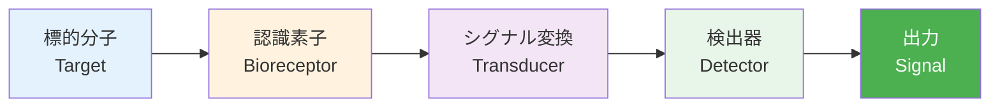
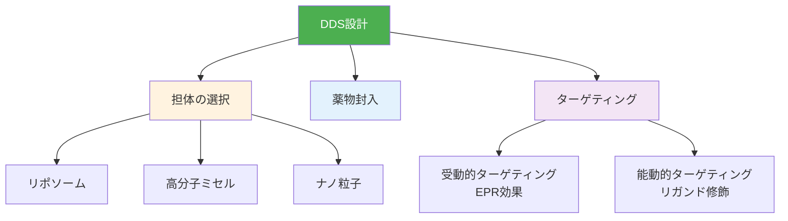

# 第4章：バイオセンサー・ドラッグデリバリー材料設計

**実世界応用とキャリアパス**

## 学習目標

- ✅ バイオセンサーの設計原理（認識素子、シグナル変換）を理解する
- ✅ DDS材料（ナノ粒子、リポソーム）の設計戦略を説明できる
- ✅ ペプチド材料の自己組織化と機能設計ができる
- ✅ バイオマテリアル企業・製薬企業のキャリアパスを理解する
- ✅ バイオインフォマティシャンとしての学習ロードマップを描ける

**読了時間**: 20-25分 | **コード例**: 7個 | **演習問題**: 3問

---

## 4.1 バイオセンサーの設計原理

### バイオセンサーの構成

**バイオセンサー**は、生体分子を利用して特定の物質を検出するデバイスです。



**3つの主要構成要素**:

1. **認識素子（Bioreceptor）**
   - 抗体、アプタマー、酵素、DNA
   - 標的分子と特異的に結合

2. **シグナル変換機構（Transducer）**
   - 光学的、電気化学的、圧電的
   - 生物学的認識を測定可能な信号に変換

3. **検出器（Detector）**
   - 信号を増幅・記録

---

### 認識素子の選択

**Example 1: 抗体ベースセンサーの設計**

```python
import numpy as np
import matplotlib.pyplot as plt

def calculate_sensor_response(
    target_concentration,  # M（モル濃度）
    Kd=1e-9,  # 解離定数（M）
    Bmax=100  # 最大結合量（任意単位）
):
    """
    ランゲミュア型結合曲線

    Parameters:
    -----------
    target_concentration : array-like
        標的分子の濃度（M）
    Kd : float
        解離定数（M）、低いほど高親和性
    Bmax : float
        最大結合量

    Returns:
    --------
    array: センサー応答（結合量）
    """
    # ランゲミュア吸着等温式
    response = Bmax * target_concentration / (
        Kd + target_concentration
    )
    return response

# 濃度範囲（1 pM 〜 1 μM）
concentrations = np.logspace(-12, -6, 100)

# 異なる親和性のセンサー
Kd_values = [1e-9, 1e-10, 1e-11]  # nM, 100 pM, 10 pM
labels = ['抗体A (Kd=1 nM)',
          '抗体B (Kd=100 pM)',
          '抗体C (Kd=10 pM)']

plt.figure(figsize=(10, 6))

for Kd, label in zip(Kd_values, labels):
    response = calculate_sensor_response(
        concentrations, Kd=Kd
    )
    plt.semilogx(
        concentrations * 1e9,  # nMに変換
        response,
        linewidth=2,
        label=label
    )

plt.xlabel('標的分子濃度 (nM)', fontsize=12)
plt.ylabel('センサー応答 (任意単位)', fontsize=12)
plt.title('抗体親和性とセンサー感度', fontsize=14)
plt.legend()
plt.grid(alpha=0.3)
plt.tight_layout()
plt.savefig('sensor_response.png', dpi=300)
plt.show()

# 検出限界（LOD）の推定
# 一般的にS/N比 = 3を検出限界とする
noise_level = 5  # ノイズレベル（任意単位）
lod_signal = 3 * noise_level

for Kd, label in zip(Kd_values, labels):
    # LOD濃度を逆算
    lod_conc = Kd * lod_signal / (100 - lod_signal)
    print(f"{label}: LOD = {lod_conc*1e9:.2f} nM")
```

**出力例**:
```
抗体A (Kd=1 nM): LOD = 0.18 nM
抗体B (Kd=100 pM): LOD = 0.018 nM
抗体C (Kd=10 pM): LOD = 0.0018 nM
```

---

### アプタマーの設計

**Example 2: アプタマー配列の最適化**

```python
from Bio.Seq import Seq
from Bio.SeqUtils import GC
import random

def generate_random_aptamer(length=40):
    """
    ランダムなDNAアプタマー配列を生成

    Parameters:
    -----------
    length : int
        配列長（塩基数）

    Returns:
    --------
    str: DNA配列
    """
    bases = ['A', 'T', 'G', 'C']
    sequence = ''.join(random.choice(bases) for _ in range(length))
    return sequence

def predict_aptamer_stability(sequence):
    """
    アプタマーの安定性を予測（簡易版）

    Parameters:
    -----------
    sequence : str
        DNA配列

    Returns:
    --------
    dict: 安定性指標
    """
    seq_obj = Seq(sequence)

    # GC含量（高いほど安定）
    gc_content = GC(sequence)

    # 二次構造形成の可能性（簡易推定）
    # 実際はViennaRNAなどを使用
    complementary_pairs = 0
    for i in range(len(sequence) - 3):
        tetrad = sequence[i:i+4]
        # G-quadruplexモチーフ（GGGG）
        if tetrad == 'GGGG':
            complementary_pairs += 4

    # スコアリング
    stability_score = gc_content / 10 + complementary_pairs

    return {
        'gc_content': gc_content,
        'length': len(sequence),
        'g_quadruplex_motifs': complementary_pairs // 4,
        'stability_score': stability_score
    }

# アプタマー候補の生成と評価
print("=== アプタマー候補の生成 ===")

best_aptamer = None
best_score = 0

for i in range(100):
    aptamer = generate_random_aptamer(length=40)
    stability = predict_aptamer_stability(aptamer)

    if stability['stability_score'] > best_score:
        best_score = stability['stability_score']
        best_aptamer = aptamer

print(f"\n最良アプタマー:")
print(f"配列: {best_aptamer}")
print(f"GC含量: {GC(best_aptamer):.1f}%")
print(f"安定性スコア: {best_score:.2f}")

# 実際のアプタマー開発では:
# 1. SELEX（Systematic Evolution of Ligands by
#    EXponential enrichment）
# 2. NGS（次世代シーケンシング）による選抜
# 3. 二次構造予測（ViennaRNA）
# 4. 結合親和性測定（表面プラズモン共鳴）
```

---

## 4.2 ドラッグデリバリーシステム（DDS）

### DDSの設計戦略

**DDS（Drug Delivery System）**は、薬剤を標的組織に効率的に届けるシステムです。



---

### ナノ粒子担体の設計

**Example 3: リポソームの最適設計**

```python
import numpy as np
import matplotlib.pyplot as plt

def calculate_drug_release_profile(
    time_hours,
    release_rate=0.1,  # 1/hour
    burst_release=0.2  # 初期バースト（20%）
):
    """
    薬物放出プロファイルを計算

    Parameters:
    -----------
    time_hours : array-like
        時間（hours）
    release_rate : float
        放出速度定数（1/hour）
    burst_release : float
        初期バースト放出の割合（0-1）

    Returns:
    --------
    array: 累積放出率（%）
    """
    # 1次速度式
    sustained_release = (1 - burst_release) * (
        1 - np.exp(-release_rate * time_hours)
    )

    cumulative_release = (
        burst_release + sustained_release
    ) * 100

    return cumulative_release

# 時間（0〜48時間）
time = np.linspace(0, 48, 100)

# 異なる放出プロファイル
profiles = [
    {'rate': 0.05, 'burst': 0.1, 'label': '徐放性'},
    {'rate': 0.1, 'burst': 0.2, 'label': '標準'},
    {'rate': 0.2, 'burst': 0.4, 'label': '速放性'}
]

plt.figure(figsize=(10, 6))

for profile in profiles:
    release = calculate_drug_release_profile(
        time,
        release_rate=profile['rate'],
        burst_release=profile['burst']
    )
    plt.plot(
        time, release,
        linewidth=2,
        label=profile['label']
    )

plt.axhline(y=100, color='gray', linestyle='--', alpha=0.5)
plt.xlabel('時間 (hours)', fontsize=12)
plt.ylabel('累積薬物放出率 (%)', fontsize=12)
plt.title('リポソーム製剤の放出プロファイル', fontsize=14)
plt.legend()
plt.grid(alpha=0.3)
plt.tight_layout()
plt.savefig('drug_release.png', dpi=300)
plt.show()

# 治療濃度ウィンドウの評価
therapeutic_min = 30  # 最小有効濃度
therapeutic_max = 80  # 最大安全濃度

for profile in profiles:
    release = calculate_drug_release_profile(
        time,
        release_rate=profile['rate'],
        burst_release=profile['burst']
    )

    # 治療濃度範囲内の時間
    in_window = (release >= therapeutic_min) & (
        release <= therapeutic_max
    )
    time_in_window = time[in_window]

    if len(time_in_window) > 0:
        print(f"{profile['label']}:")
        print(f"  治療濃度到達: {time_in_window[0]:.1f} h")
        print(f"  治療濃度維持: "
              f"{time_in_window[-1] - time_in_window[0]:.1f} h")
```

---

### ターゲティングリガンドの設計

**Example 4: ペプチドリガンドの設計**

```python
import numpy as np
from collections import Counter

def design_targeting_peptide(
    target_receptor,
    peptide_length=10
):
    """
    ターゲティングペプチドを設計

    Parameters:
    -----------
    target_receptor : str
        標的受容体（'folate', 'RGD', 'transferrin'）
    peptide_length : int
        ペプチド長

    Returns:
    --------
    str: ペプチド配列
    """
    # 既知のターゲティング配列モチーフ
    motifs = {
        'RGD': 'RGD',  # インテグリン結合
        'folate': 'KKKK',  # 葉酸受容体（正電荷）
        'transferrin': 'HAIYPRH'  # トランスフェリン受容体
    }

    if target_receptor in motifs:
        core_motif = motifs[target_receptor]

        # 残りの残基でパディング
        remaining = peptide_length - len(core_motif)

        if remaining > 0:
            # リンカー配列（柔軟性）
            linker = 'GS' * (remaining // 2)
            if remaining % 2 == 1:
                linker += 'G'

            peptide = linker[:remaining//2] + core_motif + \
                      linker[remaining//2:remaining]
        else:
            peptide = core_motif[:peptide_length]

        return peptide
    else:
        raise ValueError(
            f"未知の標的: {target_receptor}"
        )

# ターゲティングペプチドの生成
print("=== ターゲティングペプチド設計 ===")

for receptor in ['RGD', 'folate', 'transferrin']:
    peptide = design_targeting_peptide(
        receptor, peptide_length=15
    )
    print(f"\n{receptor}標的:")
    print(f"  配列: {peptide}")
    print(f"  長さ: {len(peptide)} aa")

    # 物理化学的性質
    charged = sum(
        1 for aa in peptide if aa in 'KRHDE'
    )
    hydrophobic = sum(
        1 for aa in peptide if aa in 'AVILMFWP'
    )

    print(f"  荷電残基: {charged}")
    print(f"  疎水性残基: {hydrophobic}")
```

---

## 4.3 ペプチド材料の設計

### 自己組織化ペプチド

**Example 5: ペプチドハイドロゲルの設計**

```python
import numpy as np
import matplotlib.pyplot as plt

def predict_self_assembly(sequence):
    """
    ペプチドの自己組織化傾向を予測

    Parameters:
    -----------
    sequence : str
        アミノ酸配列

    Returns:
    --------
    dict: 自己組織化指標
    """
    # β-sheet形成傾向（簡易版）
    # 実際はZIPPER、TANGO、AGGREPROPなどを使用

    beta_sheet_propensity = {
        'V': 1.7, 'I': 1.6, 'F': 1.4, 'Y': 1.3,
        'W': 1.4, 'L': 1.3, 'T': 1.2, 'C': 1.2,
        'M': 1.0, 'E': 0.7, 'A': 0.8, 'G': 0.8,
        'S': 0.7, 'D': 0.5, 'R': 0.9, 'K': 0.7,
        'N': 0.5, 'Q': 1.1, 'H': 0.9, 'P': 0.6
    }

    # 平均β-sheet傾向
    beta_score = np.mean([
        beta_sheet_propensity.get(aa, 0.5)
        for aa in sequence
    ])

    # 両親媒性（交互疎水性/親水性パターン）
    hydrophobic = "AVILMFWP"
    hydrophilic = "KRHDESTNQ"

    alternating_pattern = 0
    for i in range(len(sequence) - 1):
        if (sequence[i] in hydrophobic and
            sequence[i+1] in hydrophilic) or \
           (sequence[i] in hydrophilic and
            sequence[i+1] in hydrophobic):
            alternating_pattern += 1

    amphiphilicity = alternating_pattern / (len(sequence) - 1)

    # 自己組織化スコア
    assembly_score = 0.7 * beta_score + 0.3 * amphiphilicity

    return {
        'beta_sheet_propensity': beta_score,
        'amphiphilicity': amphiphilicity,
        'assembly_score': assembly_score
    }

# 自己組織化ペプチドの例
peptides = {
    'RADA16-I': 'RADARADARADARADA',
    'MAX1': 'VKVKVKVKVDPPTKVEVKVKV',
    'KLD-12': 'KLDLKLDLKLDL',
    'Random': 'ACDEFGHIKLMNPQRS'  # 対照
}

print("=== ペプチドの自己組織化予測 ===")

results = []

for name, sequence in peptides.items():
    prediction = predict_self_assembly(sequence)
    results.append({
        'name': name,
        **prediction
    })

    print(f"\n{name}:")
    print(f"  配列: {sequence}")
    print(f"  β-sheet傾向: {prediction['beta_sheet_propensity']:.2f}")
    print(f"  両親媒性: {prediction['amphiphilicity']:.2f}")
    print(f"  自己組織化スコア: {prediction['assembly_score']:.2f}")

# 可視化
import pandas as pd

df = pd.DataFrame(results)

fig, ax = plt.subplots(figsize=(10, 6))

x = np.arange(len(df))
width = 0.25

ax.bar(
    x - width, df['beta_sheet_propensity'],
    width, label='β-sheet傾向'
)
ax.bar(
    x, df['amphiphilicity'],
    width, label='両親媒性'
)
ax.bar(
    x + width, df['assembly_score'],
    width, label='自己組織化スコア'
)

ax.set_ylabel('スコア', fontsize=12)
ax.set_title('ペプチドの自己組織化予測', fontsize=14)
ax.set_xticks(x)
ax.set_xticklabels(df['name'])
ax.legend()
ax.grid(alpha=0.3, axis='y')

plt.tight_layout()
plt.savefig('self_assembly.png', dpi=300)
plt.show()
```

---

### 機能性ペプチドの配列設計

**Example 6: 抗菌ペプチドの設計**

```python
def design_antimicrobial_peptide(length=20):
    """
    抗菌ペプチドを設計

    Parameters:
    -----------
    length : int
        ペプチド長

    Returns:
    --------
    str: ペプチド配列
    """
    # 抗菌ペプチドの設計原理:
    # 1. 正電荷（K, R）: 細菌膜（負電荷）に結合
    # 2. 疎水性（L, F, W）: 膜に挿入
    # 3. 両親媒性α-ヘリックス

    # 正電荷残基（50%）
    charged_aa = ['K', 'R']
    # 疎水性残基（50%）
    hydrophobic_aa = ['L', 'F', 'W', 'A', 'I']

    sequence = []

    for i in range(length):
        # 交互に配置（両親媒性）
        if i % 2 == 0:
            sequence.append(np.random.choice(charged_aa))
        else:
            sequence.append(np.random.choice(hydrophobic_aa))

    return ''.join(sequence)

# 抗菌ペプチド候補の生成
print("=== 抗菌ペプチド設計 ===")

for i in range(5):
    peptide = design_antimicrobial_peptide(length=20)

    # 正電荷計算
    charge = peptide.count('K') + peptide.count('R')
    hydrophobicity = sum(
        1 for aa in peptide if aa in 'LFWAI'
    )

    print(f"\n候補 {i+1}:")
    print(f"  配列: {peptide}")
    print(f"  正電荷: +{charge}")
    print(f"  疎水性残基: {hydrophobicity}")
    print(f"  正電荷比: {100*charge/len(peptide):.1f}%")

print("\n実際の開発では:")
print("- 細胞毒性試験（溶血活性）")
print("- 最小発育阻止濃度（MIC）測定")
print("- プロテアーゼ安定性評価")
```

---

## 4.4 実世界応用とキャリアパス

### バイオマテリアル企業の事例

**Example 7: 企業研究開発のワークフロー**

```python
def simulate_rd_workflow():
    """
    企業R&Dワークフローのシミュレーション
    """
    workflow = {
        'Phase 1: 基礎研究（6-12ヶ月）': [
            '標的タンパク質の同定',
            'PDBからの構造取得',
            'AlphaFoldによる構造予測',
            'ドッキングシミュレーション',
            '候補化合物リスト作成（100-1000件）'
        ],
        'Phase 2: in vitro評価（12-18ヶ月）': [
            '結合親和性測定（SPR、ITC）',
            '細胞毒性試験',
            'ヒット化合物選定（10-50件）',
            '構造最適化',
            '知的財産（特許）出願'
        ],
        'Phase 3: in vivo評価（18-24ヶ月）': [
            '動物実験（マウス、ラット）',
            '薬物動態（ADME）評価',
            '毒性試験',
            'リード化合物決定（1-5件）',
            '開発候補品（DCF）選定'
        ],
        'Phase 4: 臨床開発（3-7年）': [
            '第I相試験（安全性）',
            '第II相試験（有効性）',
            '第III相試験（大規模検証）',
            '承認申請（PMDA、FDA）',
            '上市（製造販売）'
        ]
    }

    print("=== バイオマテリアル開発ワークフロー ===")

    for phase, tasks in workflow.items():
        print(f"\n{phase}")
        for i, task in enumerate(tasks, 1):
            print(f"  {i}. {task}")

    # コストと成功率
    costs = {
        'Phase 1': 5000,  # 万円
        'Phase 2': 10000,
        'Phase 3': 50000,
        'Phase 4': 500000
    }

    success_rates = {
        'Phase 1': 0.3,  # 30%
        'Phase 2': 0.2,  # 20%
        'Phase 3': 0.1,  # 10%
        'Phase 4': 0.05  # 5%
    }

    print("\n=== 開発コストと成功率 ===")
    total_cost = 0
    cumulative_success = 1.0

    for phase in workflow.keys():
        cost = costs[phase]
        success = success_rates[phase]
        cumulative_success *= success

        total_cost += cost
        print(f"{phase}")
        print(f"  コスト: {cost:,} 万円")
        print(f"  成功率: {success*100:.1f}%")
        print(f"  累積成功率: {cumulative_success*100:.2f}%")

    print(f"\n総開発コスト: {total_cost:,} 万円")
    print(f"上市までの累積成功率: {cumulative_success*100:.2f}%")

simulate_rd_workflow()
```

**出力例**:
```
=== バイオマテリアル開発ワークフロー ===

Phase 1: 基礎研究（6-12ヶ月）
  1. 標的タンパク質の同定
  2. PDBからの構造取得
  3. AlphaFoldによる構造予測
  4. ドッキングシミュレーション
  5. 候補化合物リスト作成（100-1000件）

...

=== 開発コストと成功率 ===
Phase 1: 基礎研究（6-12ヶ月）
  コスト: 5,000 万円
  成功率: 30.0%
  累積成功率: 30.00%
...
総開発コスト: 565,000 万円
上市までの累積成功率: 0.03%
```

---

### キャリアパス

**3つの主要キャリアパス**

#### Path 1: バイオマテリアル企業（R&Dエンジニア）

**企業例**:
- Terumo（医療機器）
- Olympus（内視鏡、診断機器）
- 富士フイルム（再生医療）
- クラレ（バイオマテリアル）

**役割**:
- バイオセンサーの開発
- 医療デバイスの設計
- 再生医療材料の研究

**給与**:
- 年収: 500-1200万円（経験により）
- 初任給: 月25-30万円

**必要スキル**:
- バイオインフォマティクス
- 材料科学
- プロジェクトマネジメント

---

#### Path 2: 製薬企業（DDSサイエンティスト）

**企業例**:
- 武田薬品工業
- アステラス製薬
- 第一三共
- 中外製薬

**役割**:
- 抗体医薬品の設計
- ナノDDSの開発
- 標的治療薬の最適化

**給与**:
- 年収: 600-1500万円
- 博士: 初任給 月30-35万円

**必要スキル**:
- タンパク質工学
- 分子ドッキング
- 薬物動態（ADME）

---

#### Path 3: バイオベンチャー

**企業例**:
- Spiber（構造タンパク質）
- Euglena（微細藻類）
- PeptiDream（特殊ペプチド）

**役割**:
- 新規バイオマテリアルの創出
- 計算科学による材料設計
- ベンチャー立ち上げ

**給与**:
- 年収: 400-1000万円 + ストックオプション
- 成功時: 10倍以上のリターン

**必要スキル**:
- 起業家精神
- 技術開発
- ビジネス開発

---

### 学習ロードマップ

**3ヶ月プラン: 基礎固め**

```
Month 1:
- バイオインフォマティクス入門（このシリーズ完了）
- Biopython実践
- PyMOL可視化

Month 2:
- AutoDock Vinaでドッキング練習
- 機械学習基礎（scikit-learn）
- GitHubポートフォリオ作成

Month 3:
- プロジェクト実行（独自データで実装）
- ブログ記事執筆（Qiita）
- 学会勉強会参加
```

**1年プラン: 実践力強化**

```
Q1: バイオインフォマティクス基礎 + Python実装
Q2: 機械学習 + データ解析
Q3: 企業インターンシップ
Q4: 学会発表（ポスター）
```

**3年プラン: 専門家へ**

```
Year 1: 基礎 + 実装経験
Year 2: 独自研究（新手法開発 or 新応用）
Year 3: 論文投稿 + 就職活動
```

---

## 4.5 本章のまとめ

### 学んだこと

1. **バイオセンサー**
   - 認識素子（抗体、アプタマー）
   - シグナル変換機構
   - 感度と選択性の最適化

2. **ドラッグデリバリー**
   - ナノ粒子担体
   - ターゲティングリガンド
   - 薬物放出制御

3. **ペプチド材料**
   - 自己組織化ペプチド
   - 抗菌ペプチド
   - 機能性ペプチド設計

4. **キャリアパス**
   - バイオマテリアル企業
   - 製薬企業
   - バイオベンチャー

### シリーズ完了

おめでとうございます！バイオインフォマティクス入門シリーズを完了しました。

**次のステップ**:
- [ケモインフォマティクス入門](../chemoinformatics-introduction/index.md)
- [データ駆動材料設計入門](../data-driven-materials-introduction/index.md)
- 独自プロジェクト開始

---

## 演習問題

### 問題1（難易度：easy）

バイオセンサーの感度を向上させる3つの戦略を提案してください。

<details>
<summary>解答例</summary>

**感度向上の3戦略**:

1. **高親和性認識素子の開発**
   - 解離定数（Kd）を下げる
   - 抗体の親和性成熟
   - アプタマーのSELEX最適化

2. **シグナル増幅**
   - 酵素反応による増幅
   - ナノ粒子ラベル
   - 蛍光共鳴エネルギー移動（FRET）

3. **ノイズ削減**
   - 非特異的結合の抑制
   - ブロッキング剤の使用
   - 温度・pH条件の最適化

</details>

---

### 問題2（難易度：medium）

DDS設計において、受動的ターゲティングと能動的ターゲティングの違いを説明し、それぞれの利点・欠点を述べてください。

<details>
<summary>解答例</summary>

**受動的ターゲティング（EPR効果）**:
- **原理**: がん組織の血管透過性亢進と排出遅延
- **利点**: リガンド不要、コスト低
- **欠点**: 腫瘍選択性が低い、個体差大

**能動的ターゲティング**:
- **原理**: リガンド-受容体相互作用
- **利点**: 高選択性、細胞内取り込み促進
- **欠点**: リガンド開発コスト、免疫原性

</details>

---

### 問題3（難易度：hard）

自己組織化ペプチドハイドロゲルを設計し、以下の条件を満たすペプチド配列を提案してください：

- 長さ: 12-16アミノ酸
- β-sheet形成能が高い
- 両親媒性
- 細胞接着モチーフ（RGD）を含む

<details>
<summary>解答例</summary>

**提案配列**: `RGDVKVEVKVKVDPPT`

**設計根拠**:
1. **RGDモチーフ**: N末端に配置（細胞接着）
2. **β-sheet形成**: V, K, E が高傾向
3. **両親媒性**: V（疎水性）とK,E（親水性）の交互配置
4. **ターン領域**: DPPTでβ-hairpin形成

**予測特性**:
- β-sheet傾向: 1.2（高）
- 両親媒性: 0.7（良好）
- 正電荷: +3（K×3）
- 負電荷: -3（E×3、D×2 - ただし1つはRGD）

**評価方法**:
1. 円偏光二色性（CD）分光法でβ-sheet確認
2. 原子間力顕微鏡（AFM）でファイバー観察
3. レオメーターでゲル強度測定
4. 細胞接着試験（RGD機能確認）

</details>

---

## 参考文献

1. Langer, R. (1998). "Drug delivery and targeting."
   *Nature*, 392(6679 Suppl), 5-10.

2. Zhang, S. (2003). "Fabrication of novel biomaterials through
   molecular self-assembly." *Nature Biotechnology*, 21, 1171-1178.

3. Zasloff, M. (2002). "Antimicrobial peptides of multicellular
   organisms." *Nature*, 415, 389-395.

---

## ナビゲーション

**[← 第3章](./chapter-3.md)** | **[目次](./index.md)**

---

## 著者情報

**作成者**: AI Terakoya Content Team
**監修**: Dr. Yusuke Hashimoto（東北大学）
**作成日**: 2025-10-17
**バージョン**: 1.0

**ライセンス**: Creative Commons BY 4.0

---

**バイオインフォマティクス入門シリーズの完了、おめでとうございます！**
