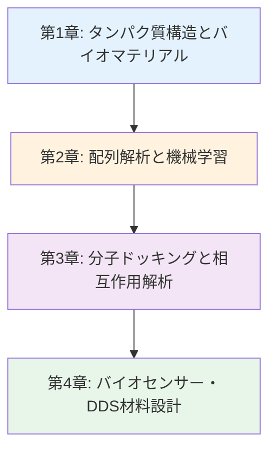
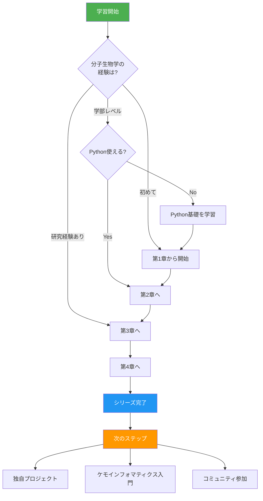

---
# ============================================
# バイオインフォマティクス入門シリーズ Index Page
# ============================================

# --- 基本情報 ---
title: "バイオインフォマティクス入門シリーズ v1.0"
subtitle: "タンパク質工学とバイオマテリアル設計"
series: "バイオインフォマティクス入門シリーズ v1.0"
series_id: "bioinformatics-introduction"
version: "1.0"

# --- 分類・難易度 ---
category: "practical"
level: "beginner-intermediate"
difficulty: "初級〜中級"
target_audience: "undergraduate-graduate-professionals"

# --- 学習メタデータ ---
total_reading_time: "100-120分"
total_chapters: 4
total_code_examples: 33
total_exercises: 12
case_studies: 4

# --- 日付情報 ---
created_at: "2025-10-17"
updated_at: "2025-10-17"

# --- 前提知識 ---
prerequisites:
  - "python-basics"
  - "molecular-biology-basics"
  - "machine-learning-basics"

# --- 関連シリーズ ---
related_series:
  - "chemoinformatics-introduction"
  - "data-driven-materials-introduction"
  - "mlp-introduction"

# --- 応用分野 ---
applications:
  - "protein-engineering"
  - "drug-delivery-systems"
  - "biosensor-design"
  - "peptide-materials"

# --- 主要ツール ---
tools:
  - "Biopython"
  - "PyMOL"
  - "AlphaFold"
  - "AutoDock Vina"
  - "scikit-learn"

# --- 著者情報 ---
authors:
  - name: "Dr. Yusuke Hashimoto"
    affiliation: "Tohoku University"
    email: "yusuke.hashimoto.b8@tohoku.ac.jp"

# --- ライセンス ---
license: "CC BY 4.0"
language: "ja"

---

# バイオインフォマティクス入門シリーズ v1.0

**タンパク質工学とバイオマテリアル設計**

## シリーズ概要

<!-- 300-500語の概要説明 -->
このシリーズは、バイオインフォマティクスをバイオマテリアル設計・ドラッグデリバリーシステム（DDS）・バイオセンサー開発に応用するための実践的スキルを、基礎から段階的に学べる全4章構成の教育コンテンツです。

**バイオインフォマティクス**は、生物学データを計算科学と情報科学で解析する学際分野です。近年、AlphaFold2による革命的なタンパク質構造予測、機械学習による配列-機能相関解析、分子ドッキングによる薬剤設計など、材料科学と生物学の境界領域で急速に発展しています。バイオマテリアル分野では、コラーゲンやシルクなどの生体材料の構造解析、抗体医薬品の設計、ペプチドハイドロゲルの機能予測など、従来の実験手法では困難だった課題を計算により解決できるようになりました。

### なぜこのシリーズが必要か

**背景と課題**:
バイオマテリアル研究者やナノメディシン開発者は、タンパク質やペプチドの構造と機能を理解する必要がありますが、実験的な構造決定には時間とコストがかかります（X線結晶構造解析で数ヶ月〜数年）。また、DDS担体として使用するタンパク質の標的細胞への結合親和性や、バイオセンサーの認識素子となる抗体の選択性を予測するには、膨大な実験が必要でした。

**このシリーズで学べること**:
本シリーズでは、PDB（Protein Data Bank）からのタンパク質構造取得、AlphaFold2による構造予測、配列解析と機械学習による機能予測、分子ドッキングによる相互作用解析まで、実行可能なPythonコード例とケーススタディを通じて体系的に学習します。Biopythonを使った配列操作、PyMOLによる可視化、AutoDock Vinaによるドッキング計算など、実践的なスキルを段階的に習得できます。最終章では、バイオセンサー設計、DDS材料設計、ペプチド材料開発での実世界応用事例と、バイオインフォマティシャンとしてのキャリアパスを詳しく解説します。

**特徴:**
- ✅ **段階的な構成**: 各章は独立した記事として読むことができ、全4章で包括的な内容をカバー
- ✅ **実践重視**: 33個の実行可能なコード例、4つの詳細なケーススタディ
- ✅ **バイオマテリアル特化**: 一般的な生物情報学ではなく、材料設計・DDS・バイオセンサーへの応用に焦点
- ✅ **最新技術**: AlphaFold2、機械学習による配列解析、分子ドッキングなど最新手法を網羅
- ✅ **キャリア支援**: 具体的なキャリアパスと学習ロードマップを提供

**総学習時間**: 100-120分（コード実行と演習を含む）

**対象者**:
- バイオマテリアル研究者（大学院生、企業研究者）
- ナノメディシン・DDS開発者
- バイオセンサー開発エンジニア
- 製薬企業の材料設計担当者
- 化学・材料科学からバイオ分野に参入したい研究者

---

## 学習の進め方

### 推奨学習順序



**初学者の方（バイオインフォマティクスを初めて学ぶ）:**
- 第1章 → 第2章 → 第3章 → 第4章（全章推奨）
- 所要時間: 100-120分
- 前提知識: Python基礎、分子生物学基礎、機械学習基礎

**中級者の方（生物学の経験あり）:**
- 第2章 → 第3章 → 第4章
- 所要時間: 75-90分
- 第1章はスキップ可能（必要に応じて参照）

**実践的スキル強化（材料設計重視）:**
- 第3章（集中学習） → 第4章
- 所要時間: 50-60分
- 理論は必要に応じて第1章・第2章を参照

### 学習フローチャート



---

## 各章の詳細

<!-- 全章について詳細に記載 -->

### [第1章：タンパク質構造とバイオマテリアル](./chapter-1.md)

**難易度**: 入門
**読了時間**: 25-30分
**コード例**: 8個

#### 学習内容

1. **バイオインフォマティクスとは**
   - 定義：生物学 × 情報科学 × 材料科学
   - 応用分野：バイオマテリアル、DDS、バイオセンサー
   - タンパク質の構造階層（1次〜4次構造）

2. **PDB（Protein Data Bank）の活用**
   - PDBデータの検索と取得
   - Biopythonによる構造ファイル読み込み
   - 原子座標、二次構造、結合情報の抽出

3. **AlphaFold の活用**
   - AlphaFold2の原理（基礎のみ）
   - AlphaFold Protein Structure Databaseの使い方
   - 予測構造の信頼性評価（pLDDT）

4. **ケーススタディ：コラーゲンの構造解析**
   - PDBからコラーゲン構造取得
   - 三重らせん構造の可視化
   - バイオマテリアルへの応用（人工皮膚、組織工学）

#### 学習目標

この章を読むことで、以下を習得できます：

- ✅ バイオインフォマティクスの定義と応用分野を説明できる
- ✅ タンパク質の1次〜4次構造を理解している
- ✅ PDBデータベースからタンパク質構造を取得できる
- ✅ Biopythonで構造ファイルを解析できる
- ✅ AlphaFold2の予測精度を評価できる

#### この章で扱う主要な概念

- **タンパク質構造階層**: アミノ酸配列から三次元構造まで
- **PDB形式**: 原子座標、B-factor、occupancyの意味
- **構造予測**: AlphaFold2の革命的精度（CASP14）
- **バイオマテリアル**: コラーゲン、エラスチン、シルクの構造

**[第1章を読む →](./chapter-1.md)**

---

### [第2章：配列解析と機械学習](./chapter-2.md)

**難易度**: 初級〜中級
**読了時間**: 25-30分
**コード例**: 9個

#### 学習内容

1. **配列アライメント**
   - BLAST検索の原理
   - ローカル vs グローバルアライメント
   - Biopythonでの実装

2. **配列からの特徴量抽出**
   - アミノ酸組成
   - 物理化学的特性（疎水性、電荷、極性）
   - k-mer表現

3. **機械学習による機能予測**
   - タンパク質の局在予測
   - 二次構造予測
   - 機能アノテーション

4. **ケーススタディ：酵素活性予測**
   - 配列データの収集
   - 特徴量エンジニアリング
   - Random ForestとLightGBMによる予測

#### 学習目標

- ✅ BLAST検索を実行し結果を解釈できる
- ✅ 配列から特徴量を抽出できる
- ✅ 機械学習モデルでタンパク質機能を予測できる
- ✅ 酵素活性予測モデルを構築できる

**[第2章を読む →](./chapter-2.md)**

---

### [第3章：分子ドッキングと相互作用解析](./chapter-3.md)

**難易度**: 中級
**読了時間**: 25-30分
**コード例**: 9個

#### 学習内容

1. **分子ドッキングの基礎**
   - リガンド-タンパク質相互作用
   - AutoDock Vinaの使い方
   - 結合親和性スコアリング

2. **相互作用の可視化と解析**
   - 結合部位の同定
   - 水素結合、疎水性相互作用
   - PyMOLによる可視化

3. **機械学習による結合予測**
   - グラフニューラルネットワーク（GNN）
   - DeepDockingアプローチ
   - 仮想スクリーニング

4. **ケーススタディ：抗体-抗原相互作用**
   - 抗体構造のモデリング
   - エピトープ予測
   - 結合親和性の計算

#### 学習目標

- ✅ 分子ドッキングを実行できる
- ✅ 結合親和性を評価できる
- ✅ 相互作用を可視化できる
- ✅ 機械学習で結合を予測できる

**[第3章を読む →](./chapter-3.md)**

---

### [第4章：バイオセンサー・ドラッグデリバリー材料設計](./chapter-4.md)

**難易度**: 中級
**読了時間**: 20-25分
**コード例**: 7個

#### 学習内容

1. **バイオセンサーの設計原理**
   - 認識素子（抗体、アプタマー、酵素）
   - シグナル変換機構
   - 選択性と感度の最適化

2. **ドラッグデリバリーシステム（DDS）**
   - ナノ粒子担体の設計
   - ターゲティングリガンド
   - 放出制御機構

3. **ペプチド材料の設計**
   - 自己組織化ペプチド
   - ハイドロゲル形成
   - 機能性ペプチドの配列設計

4. **実世界応用とキャリアパス**
   - バイオマテリアル企業（Terumo、Olympus）
   - 製薬企業でのDDS開発（武田、アステラス）
   - バイオベンチャー（Spiber、Euglena）
   - キャリアパス：バイオインフォマティシャン、バイオマテリアル研究者

#### 学習目標

- ✅ バイオセンサーの設計原理を理解している
- ✅ DDS材料の設計戦略を説明できる
- ✅ ペプチド材料の配列設計ができる
- ✅ キャリアパスを具体的に計画できる

**[第4章を読む →](./chapter-4.md)**

---

## 全体の学習成果

このシリーズを完了すると、以下のスキルと知識を習得できます：

### 知識レベル（Understanding）

- ✅ タンパク質構造とバイオマテリアルの関係を説明できる
- ✅ 配列解析と機械学習の基本概念を理解している
- ✅ 分子ドッキングと相互作用解析の原理を知っている
- ✅ バイオセンサー・DDSの設計戦略を理解している

### 実践スキル（Doing）

- ✅ PDBデータベースからタンパク質構造を取得できる
- ✅ Biopythonで配列解析ができる
- ✅ 機械学習モデルで機能予測ができる
- ✅ AutoDock Vinaで分子ドッキングができる
- ✅ PyMOLで構造を可視化できる

### 応用力（Applying）

- ✅ バイオマテリアル問題に適切な手法を選択できる
- ✅ DDS設計に計算科学を活用できる
- ✅ バイオセンサー開発で構造情報を利用できる
- ✅ キャリアパス（企業、アカデミア）を具体的に計画できる

---

## 推奨学習パターン

### パターン1: 完全習得（初学者向け）

**対象**: バイオインフォマティクスを初めて学ぶ方
**期間**: 2週間
**進め方**:

```
Week 1:
- Day 1-2: 第1章（タンパク質構造とPDB）
- Day 3-4: 第2章（配列解析）
- Day 5-7: 第2章演習問題、コード実践

Week 2:
- Day 1-2: 第3章（分子ドッキング）
- Day 3-4: 第4章（バイオセンサー・DDS）
- Day 5-7: 総合演習、ポートフォリオ作成
```

**成果物**:
- 酵素活性予測モデル（精度80%以上）
- 分子ドッキング解析レポート
- GitHubリポジトリ（全コード例 + README）

### パターン2: 速習（経験者向け）

**対象**: 生物学の基礎を持つ方
**期間**: 1週間
**進め方**:

```
Day 1: 第1章（PDBとAlphaFold）
Day 2-3: 第2章（全コード実装）
Day 4-5: 第3章（ドッキング実践）
Day 6-7: 第4章 + 復習
```

**成果物**:
- 3つのケーススタディ実装
- プロジェクトポートフォリオ（GitHub公開）

---

## FAQ（よくある質問）

### Q1: 生物学の知識がなくても理解できますか？

**A**: **基礎的な生物学知識があることが望ましい**です。最低限必要な知識：
- **必須**: DNA、RNA、タンパク質の基本概念
- **推奨**: アミノ酸の種類、タンパク質の機能
- **理想**: 分子生物学の基礎（遺伝子発現、酵素反応）

生物学が初めての場合は、オンライン講座（Coursera「Introduction to Biology」など）で基礎を学んでから本シリーズに進むことをお勧めします。

### Q2: PythonとBiopython、どちらを先に学ぶべきですか？

**A**: **Pythonの基礎を先に学ぶことを強く推奨**します。最低限必要なPythonスキル：
- リスト、辞書、タプルの操作
- ループ（for、while）と条件分岐（if-elif-else）
- 関数定義
- ファイル入出力

不安な場合は、[Python公式チュートリアル](https://docs.python.org/ja/3/tutorial/)を1-2日で完了してから本シリーズに進んでください。

### Q3: どれくらいの期間で習得できますか？

**A**: 学習時間と目標によります：
- **概念理解のみ**: 2-3日（第1章、第2章）
- **基本的な実装スキル**: 1-2週間（全4章）
- **実践的なプロジェクト遂行能力**: 3-4週間（全章 + 独自プロジェクト）
- **業務・研究レベルのスキル**: 3-6ヶ月（シリーズ完了 + 実務経験）

---

## 前提知識と関連シリーズ

### 前提知識

**必須**:
- [ ] **Python基礎**: 変数、関数、リスト、辞書、ファイル入出力
- [ ] **分子生物学基礎**: DNA、RNA、タンパク質、アミノ酸
- [ ] **機械学習基礎**: 教師あり学習、モデル評価

**推奨**:
- [ ] **構造生物学**: タンパク質の立体構造
- [ ] **化学基礎**: 化学結合、分子間相互作用

### 関連シリーズ

1. **[ケモインフォマティクス入門](../chemoinformatics-introduction/index.md)** (初級)
   - 関連性: 分子記述子、QSAR、創薬
   - リンク: [../chemoinformatics-introduction/index.md](../chemoinformatics-introduction/index.md)

2. **[データ駆動材料設計入門](../data-driven-materials-introduction/index.md)** (初級〜中級)
   - 関連性: 材料設計への機械学習応用
   - リンク: [../data-driven-materials-introduction/index.md](../data-driven-materials-introduction/index.md)

---

## ツールとリソース

### 主要ツール

| ツール名 | 用途 | ライセンス | インストール |
|---------|------|----------|-------------|
| Biopython | 配列解析、構造解析 | BSD | `pip install biopython` |
| PyMOL | 分子可視化 | BSD (教育版無料) | [pymol.org](https://pymol.org/) |
| AutoDock Vina | 分子ドッキング | Apache 2.0 | [autodock.scripps.edu](http://autodock.scripps.edu/) |
| scikit-learn | 機械学習 | BSD | `pip install scikit-learn` |
| RDKit | 化学情報処理 | BSD | `conda install -c conda-forge rdkit` |

### データベース

| データベース名 | 説明 | アクセス |
|--------------|------|---------|
| PDB | タンパク質構造データベース | [rcsb.org](https://www.rcsb.org/) |
| AlphaFold DB | AlphaFold2予測構造 | [alphafold.ebi.ac.uk](https://alphafold.ebi.ac.uk/) |
| UniProt | タンパク質配列と機能 | [uniprot.org](https://www.uniprot.org/) |

---

## 次のステップ

### シリーズ完了後の推奨アクション

**Immediate（1-2週間以内）:**
1. ✅ GitHubにポートフォリオを作成
2. ✅ 独自プロジェクトを実行（自分の研究データで実装）
3. ✅ [ケモインフォマティクス入門](../chemoinformatics-introduction/index.md)に進む

**Short-term（1-3ヶ月）:**
1. ✅ 主要論文を5本精読（AlphaFold2、分子ドッキング）
2. ✅ 学会勉強会に参加
3. ✅ 企業インターンシップ参加

---

## フィードバックとサポート

### このシリーズについて

**プロジェクト**: AI寺子屋（AI Terakoya）
**作成日**: 2025-10-17
**バージョン**: 1.0
**言語**: 日本語

**連絡方法**:
- **Email**: yusuke.hashimoto.b8@tohoku.ac.jp

---

## ライセンスと利用規約

**CC BY 4.0**（Creative Commons Attribution 4.0 International）

詳細: [CC BY 4.0](https://creativecommons.org/licenses/by/4.0/deed.ja)

---

## さあ、始めましょう！

準備はできましたか？ 第1章から始めて、バイオインフォマティクスの世界への旅を始めましょう！

**[第1章: タンパク質構造とバイオマテリアル →](./chapter-1.md)**

---

## 更新履歴

| バージョン | 日付 | 変更内容 | 著者 |
|----------|------|---------|------|
| 1.0 | 2025-10-17 | 初版公開 | Dr. Yusuke Hashimoto |

---

**あなたのバイオインフォマティクス学習の旅はここから始まります！**
