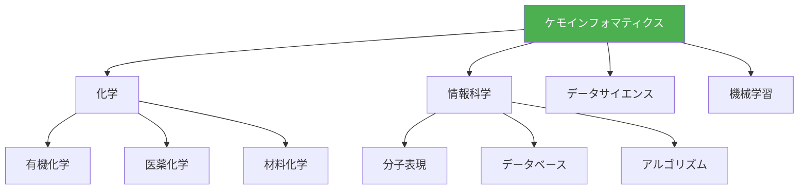
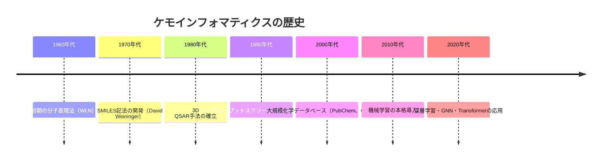
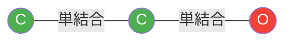

# 第1章：分子表現とRDKit基礎

## この章で学ぶこと

この章では、ケモインフォマティクスの基礎として、分子の計算機表現とRDKitによる分子操作の基本を学びます。

### 学習目標

- ✅ ケモインフォマティクスの定義と応用分野を説明できる
- ✅ SMILES、InChI、分子グラフなど主要な分子表現法を理解している
- ✅ RDKitで分子を読み込み、描画、編集できる
- ✅ 部分構造検索（SMARTS）を実行できる
- ✅ 医薬品データベースから分子情報を取得・処理できる

---

## 1.1 ケモインフォマティクスとは何か

### 定義

**ケモインフォマティクス（Chemoinformatics）**は、化学とデータサイエンスを融合した学問分野であり、計算機を用いて化学情報を管理・分析・予測する技術の総称です。



### 応用分野

ケモインフォマティクスは、以下の分野で広く活用されています：

1. **創薬（Drug Discovery）**
   - 新薬候補分子の設計と最適化
   - 仮想スクリーニングによる候補化合物の絞り込み
   - ADMET（吸収・分布・代謝・排泄・毒性）予測
   - 副作用予測と薬物相互作用解析

2. **有機材料開発**
   - 有機半導体材料の設計
   - 有機EL材料の発光特性予測
   - 導電性高分子の設計
   - 色素増感太陽電池の材料探索

3. **触媒設計**
   - 有機触媒の活性予測
   - 配位子設計と最適化
   - 反応条件の最適化
   - 選択性の予測

4. **高分子設計**
   - ポリマー物性予測
   - モノマー組成の最適化
   - 熱的性質の予測
   - 機械的性質の予測

### マテリアルズ・インフォマティクス（MI）との違い

| 項目 | ケモインフォマティクス（CI） | マテリアルズ・インフォマティクス（MI） |
|------|------------------------|------------------------------|
| **対象** | 分子（有機化合物、医薬品） | 材料全般（無機材料、合金、セラミックス） |
| **表現法** | SMILES、InChI、分子グラフ | 結晶構造、組成、微細構造 |
| **記述子** | 分子記述子、指紋 | 組成記述子、構造記述子 |
| **応用** | 創薬、有機材料、触媒 | 合金、セラミックス、電池材料 |
| **相補性** | 有機材料開発では両者が融合 | 有機-無機ハイブリッド材料 |

### 歴史的背景



**1970年代 - SMILES誕生**:
David Weiningerが開発したSMILES（Simplified Molecular Input Line Entry System）は、分子を文字列で表現する革新的手法として、ケモインフォマティクスの基盤となりました。

**2000年代 - データ爆発**:
PubChem（2004年）、ChEMBL（2009年）など大規模データベースの登場により、データ駆動型の分子設計が可能になりました。

**2020年代 - AI革命**:
Graph Neural Networks（GNN）、Transformerなど深層学習手法の導入により、従来不可能だった複雑な構造-活性相関の予測が可能になっています。

---

## 1.2 分子表現法の基礎

計算機で分子を扱うには、適切な表現法が必要です。ここでは主要な4つの表現法を学びます。

### 1.2.1 SMILES記法

**SMILES（Simplified Molecular Input Line Entry System）**は、分子構造を文字列で表現する線形記法です。

#### 基本ルール

| 記号 | 意味 | 例 |
|------|------|-----|
| C, N, O, S, P | 原子 | C（炭素）、N（窒素） |
| - | 単結合（通常省略） | C-C → CC |
| = | 二重結合 | C=C |
| # | 三重結合 | C#C |
| ( ) | 分岐 | CC(C)C |
| [ ] | 原子の詳細指定 | [CH3] |
| @ | 立体化学 | C[C@H](O)N |

#### 具体例

```python
# 代表的な分子のSMILES

分子名         SMILES          説明
----------------------------------------------
メタン         C               最も単純な炭化水素
エタノール     CCO             C-C-O の直鎖構造
酢酸           CC(=O)O         カルボン酸（分岐あり）
ベンゼン       c1ccccc1        芳香環（小文字は芳香族）
トルエン       Cc1ccccc1       ベンゼンにメチル基
アスピリン     CC(=O)Oc1ccccc1C(=O)O  解熱鎮痛剤
カフェイン     CN1C=NC2=C1C(=O)N(C(=O)N2C)C  覚醒作用
```

#### コード例1: SMILESから分子を作成

```python
# RDKitのインストール（初回のみ）
# conda install -c conda-forge rdkit
# pip install rdkit  # pip経由も可能

from rdkit import Chem
from rdkit.Chem import Draw

# SMILESから分子オブジェクトを作成
smiles = "CCO"  # エタノール
mol = Chem.MolFromSmiles(smiles)

# 分子の基本情報
print(f"分子式: {Chem.rdMolDescriptors.CalcMolFormula(mol)}")
print(f"分子量: {Chem.rdMolDescriptors.CalcExactMolWt(mol):.2f}")
print(f"原子数: {mol.GetNumAtoms()}")
print(f"結合数: {mol.GetNumBonds()}")

# 分子の描画
img = Draw.MolToImage(mol, size=(300, 300))
img.save("ethanol.png")
```

**出力例:**
```
分子式: C2H6O
分子量: 46.04
原子数: 3
結合数: 2
```

#### コード例2: 複数分子の一括描画

```python
from rdkit import Chem
from rdkit.Chem import Draw

# 主要な医薬品のSMILES
drugs = {
    "Aspirin": "CC(=O)Oc1ccccc1C(=O)O",
    "Ibuprofen": "CC(C)Cc1ccc(cc1)C(C)C(=O)O",
    "Caffeine": "CN1C=NC2=C1C(=O)N(C(=O)N2C)C",
    "Paracetamol": "CC(=O)Nc1ccc(O)cc1"
}

# 分子オブジェクトのリストを作成
mols = [Chem.MolFromSmiles(smi) for smi in drugs.values()]
legends = list(drugs.keys())

# グリッド表示
img = Draw.MolsToGridImage(
    mols,
    molsPerRow=2,
    subImgSize=(300, 300),
    legends=legends
)
img.save("common_drugs.png")
```

### 1.2.2 InChI/InChIKey

**InChI（International Chemical Identifier）**は、IUPACが標準化した分子識別子です。

#### InChI vs SMILES

| 項目 | SMILES | InChI |
|------|--------|-------|
| **一意性** | 同じ分子に複数のSMILES | 同じ分子に1つのInChI |
| **人間の読みやすさ** | 比較的読みやすい | 読みにくい |
| **標準化** | 非標準 | IUPAC標準 |
| **用途** | 分子入力、可視化 | データベース検索、識別 |

#### コード例3: InChIとInChIKeyの生成

```python
from rdkit import Chem

# SMILESから分子を作成
smiles = "CC(=O)Oc1ccccc1C(=O)O"  # アスピリン
mol = Chem.MolFromSmiles(smiles)

# InChIを生成
inchi = Chem.MolToInchi(mol)
print(f"InChI: {inchi}")

# InChIKey（固定長27文字のハッシュ値）
inchi_key = Chem.MolToInchiKey(mol)
print(f"InChIKey: {inchi_key}")

# InChIからSMILESへ変換
mol_from_inchi = Chem.MolFromInchi(inchi)
smiles_regenerated = Chem.MolToSmiles(mol_from_inchi)
print(f"再生成SMILES: {smiles_regenerated}")
```

**出力例:**
```
InChI: InChI=1S/C9H8O4/c1-6(10)13-8-5-3-2-4-7(8)9(11)12/h2-5H,1H3,(H,11,12)
InChIKey: BSYNRYMUTXBXSQ-UHFFFAOYSA-N
再生成SMILES: CC(=O)Oc1ccccc1C(=O)O
```

### 1.2.3 分子グラフ

分子は**グラフ構造**として表現できます：
- **ノード（頂点）**: 原子
- **エッジ（辺）**: 化学結合



#### コード例4: 分子グラフの解析

```python
from rdkit import Chem
import networkx as nx

# SMILESから分子を作成
smiles = "CCO"  # エタノール
mol = Chem.MolFromSmiles(smiles)

# NetworkXグラフに変換
G = nx.Graph()

# ノード（原子）を追加
for atom in mol.GetAtoms():
    G.add_node(
        atom.GetIdx(),
        symbol=atom.GetSymbol(),
        degree=atom.GetDegree()
    )

# エッジ（結合）を追加
for bond in mol.GetBonds():
    G.add_edge(
        bond.GetBeginAtomIdx(),
        bond.GetEndAtomIdx(),
        bond_type=str(bond.GetBondType())
    )

# グラフの基本情報
print(f"ノード数（原子数）: {G.number_of_nodes()}")
print(f"エッジ数（結合数）: {G.number_of_edges()}")
print(f"次数中心性: {nx.degree_centrality(G)}")

# 各原子の情報
for idx, data in G.nodes(data=True):
    print(f"原子 {idx}: {data['symbol']}, 次数 {data['degree']}")
```

**出力例:**
```
ノード数（原子数）: 3
エッジ数（結合数）: 2
次数中心性: {0: 0.5, 1: 1.0, 2: 0.5}
原子 0: C, 次数 1
原子 1: C, 次数 2
原子 2: O, 次数 1
```

### 1.2.4 3D構造と立体化学

分子の3D構造は、生物活性や物性に大きく影響します。

#### コード例5: 3D構造の生成と可視化

```python
from rdkit import Chem
from rdkit.Chem import AllChem
from rdkit.Chem import PyMol

# SMILESから分子を作成
smiles = "CC(C)Cc1ccc(cc1)C(C)C(=O)O"  # イブプロフェン
mol = Chem.MolFromSmiles(smiles)

# 3D座標を生成（ETKDG法）
AllChem.EmbedMolecule(mol, randomSeed=42)

# 分子力場で最適化（MMFF94）
AllChem.MMFFOptimizeMolecule(mol)

# 3D構造の保存（mol2形式）
writer = Chem.rdmolfiles.MolToMol2Block(mol)
with open("ibuprofen_3d.mol2", "w") as f:
    f.write(writer)

print("3D構造を生成しました")

# 原子座標の取得
conf = mol.GetConformer()
for i, atom in enumerate(mol.GetAtoms()):
    pos = conf.GetAtomPosition(i)
    print(
        f"{atom.GetSymbol()} {i}: "
        f"({pos.x:.3f}, {pos.y:.3f}, {pos.z:.3f})"
    )
```

**Column: 立体化学の重要性**

鏡像異性体（エナンチオマー）は、同じ分子式・構造式を持つが、3D構造が鏡像関係にあります。

**例：サリドマイド事件**
- (R)-サリドマイド：鎮静作用（有効）
- (S)-サリドマイド：催奇形性（有害）

立体化学の正確な表現は、創薬において生死を分ける重要性を持ちます。

---

## 1.3 RDKitの基本操作

RDKit（**R**apidly **D**eveloping **Kit**）は、ケモインフォマティクスのための最も広く使われているPythonライブラリです。

### 環境構築

#### Option 1: Anaconda（推奨）

```bash
# 仮想環境の作成
conda create -n cheminf python=3.11

# 環境のアクティベーション
conda activate cheminf

# RDKitのインストール
conda install -c conda-forge rdkit

# 追加ライブラリ
conda install -c conda-forge mordred pandas matplotlib \
  seaborn scikit-learn
```

#### Option 2: Google Colab（インストール不要）

```python
# Google Colabでは以下を実行
!pip install rdkit mordred
```

### 1.3.1 分子の読み込みと描画

#### コード例6: 多様な入力形式からの読み込み

```python
from rdkit import Chem
from rdkit.Chem import Draw

# 方法1: SMILESから
mol1 = Chem.MolFromSmiles("c1ccccc1")

# 方法2: InChIから
mol2 = Chem.MolFromInchi(
    "InChI=1S/C6H6/c1-2-4-6-5-3-1/h1-6H"
)

# 方法3: MOLファイルから
# mol3 = Chem.MolFromMolFile("benzene.mol")

# 方法4: SMARTS（部分構造パターン）から
pattern = Chem.MolFromSmarts("c1ccccc1")

# 描画オプションの設定
from rdkit.Chem.Draw import IPythonConsole
IPythonConsole.ipython_useSVG = True  # SVG形式で高画質

# 原子番号を表示
for atom in mol1.GetAtoms():
    atom.SetProp("atomLabel", str(atom.GetIdx()))

img = Draw.MolToImage(mol1, size=(400, 400))
img.save("benzene_labeled.png")
```

### 1.3.2 部分構造検索（SMARTS）

**SMARTS（SMILES ARbitrary Target Specification）**は、部分構造を柔軟に記述するためのパターンマッチング言語です。

#### 主要なSMARTSパターン

| パターン | 説明 | 例 |
|---------|------|-----|
| `[#6]` | 炭素原子 | 任意の炭素 |
| `[OH]` | ヒドロキシル基 | アルコール、フェノール |
| `C(=O)O` | カルボキシル基 | カルボン酸 |
| `c1ccccc1` | ベンゼン環 | 芳香環 |
| `[$([NX3;H2])]` | 1級アミン | RNH₂ |

#### コード例7: 部分構造検索

```python
from rdkit import Chem
from rdkit.Chem import Draw

# 検索対象の分子リスト
molecules = {
    "Aspirin": "CC(=O)Oc1ccccc1C(=O)O",
    "Ibuprofen": "CC(C)Cc1ccc(cc1)C(C)C(=O)O",
    "Paracetamol": "CC(=O)Nc1ccc(O)cc1",
    "Benzene": "c1ccccc1"
}

# 検索パターン（カルボン酸）
pattern = Chem.MolFromSmarts("C(=O)[OH]")

# 各分子でパターンマッチング
for name, smiles in molecules.items():
    mol = Chem.MolFromSmiles(smiles)
    if mol.HasSubstructMatch(pattern):
        # マッチした原子のインデックス
        matches = mol.GetSubstructMatches(pattern)
        print(f"{name}: カルボン酸を含む（マッチ: {matches}）")
    else:
        print(f"{name}: カルボン酸を含まない")

# マッチ箇所をハイライト表示
mol_highlight = Chem.MolFromSmiles(molecules["Aspirin"])
matches = mol_highlight.GetSubstructMatches(pattern)
img = Draw.MolToImage(
    mol_highlight,
    highlightAtoms=[atom for match in matches for atom in match]
)
img.save("aspirin_highlighted.png")
```

**出力例:**
```
Aspirin: カルボン酸を含む（マッチ: ((7, 8, 9),)）
Ibuprofen: カルボン酸を含む（マッチ: ((12, 13, 14),)）
Paracetamol: カルボン酸を含まない
Benzene: カルボン酸を含まない
```

### 1.3.3 分子の編集と変換

#### コード例8: 官能基の追加と削除

```python
from rdkit import Chem
from rdkit.Chem import AllChem

# ベンゼンから始める
mol = Chem.MolFromSmiles("c1ccccc1")

# 編集可能な分子オブジェクトに変換
mol_edit = Chem.RWMol(mol)

# 新しい原子（酸素）を追加
new_atom_idx = mol_edit.AddAtom(Chem.Atom(8))  # 8 = 酸素

# 既存の炭素（インデックス0）と新しい酸素を結合
mol_edit.AddBond(0, new_atom_idx, Chem.BondType.SINGLE)

# 水素を追加して分子を完成
final_mol = mol_edit.GetMol()
final_mol = Chem.AddHs(final_mol)

# SMILES を取得
smiles_final = Chem.MolToSmiles(Chem.RemoveHs(final_mol))
print(f"生成された分子: {smiles_final}")
# 出力: c1ccccc1O （フェノール）

# 描画
img = Draw.MolToImage(Chem.RemoveHs(final_mol))
img.save("phenol.png")
```

---

## 1.4 ケーススタディ：医薬品データベース検索

実際のデータベースから医薬品情報を取得し、分子構造を分析します。

### データベースの種類

| データベース | 説明 | データ数 | アクセス |
|------------|------|---------|---------|
| **ChEMBL** | 生物活性分子データ | 210万+ | [ebi.ac.uk/chembl](https://www.ebi.ac.uk/chembl/) |
| **PubChem** | 化合物データベース | 1億1千万+ | [pubchem.ncbi.nlm.nih.gov](https://pubchem.ncbi.nlm.nih.gov/) |
| **DrugBank** | 承認医薬品データ | 14,000+ | [drugbank.com](https://go.drugbank.com/) |
| **ZINC** | 市販化合物 | 10億+ | [zinc15.docking.org](https://zinc15.docking.org/) |

### コード例9: ChEMBLからのデータ取得

```python
# chembl_webresource_clientのインストール
# pip install chembl_webresource_client

from chembl_webresource_client.new_client import new_client
from rdkit import Chem
from rdkit.Chem import Descriptors
import pandas as pd

# ターゲット（標的タンパク質）の検索
target = new_client.target
target_query = target.search('EGFR')  # 上皮成長因子受容体
targets = list(target_query)

# 最初のターゲットIDを取得
chembl_id = targets[0]['target_chembl_id']
print(f"ターゲットID: {chembl_id}")

# 該当ターゲットに対するアッセイデータを取得
activity = new_client.activity
activities = activity.filter(
    target_chembl_id=chembl_id,
    type="IC50",
    relation="="
).filter(assay_type="B")

# データフレームに変換
df = pd.DataFrame.from_dict(activities)

# SMILES列が存在する場合
if 'canonical_smiles' in df.columns:
    # 有効なSMILESのみを保持
    df['mol'] = df['canonical_smiles'].apply(
        Chem.MolFromSmiles
    )
    df = df[df['mol'].notna()]

    # 分子記述子を計算
    df['MW'] = df['mol'].apply(
        Descriptors.MolWt
    )
    df['LogP'] = df['mol'].apply(
        Descriptors.MolLogP
    )

    print(f"\n取得した化合物数: {len(df)}")
    print(df[['canonical_smiles', 'MW', 'LogP']].head())
```

### コード例10: SMILES検証とサニタイゼーション

```python
from rdkit import Chem
from rdkit.Chem import Descriptors

def validate_and_sanitize_smiles(smiles_list):
    """
    SMILESリストを検証し、サニタイズする

    Parameters:
    -----------
    smiles_list : list
        SMILESのリスト

    Returns:
    --------
    valid_smiles : list
        有効なSMILESのリスト
    invalid_smiles : list
        無効なSMILESのリスト
    """
    valid_smiles = []
    invalid_smiles = []

    for smi in smiles_list:
        try:
            # SMILESから分子を作成
            mol = Chem.MolFromSmiles(smi)

            if mol is None:
                invalid_smiles.append(smi)
                continue

            # サニタイゼーション（化学的妥当性チェック）
            Chem.SanitizeMol(mol)

            # 標準化されたSMILESを取得
            canonical = Chem.MolToSmiles(mol)
            valid_smiles.append(canonical)

        except Exception as e:
            print(f"エラー: {smi} - {e}")
            invalid_smiles.append(smi)

    return valid_smiles, invalid_smiles

# テストデータ
test_smiles = [
    "CCO",                      # 有効
    "c1ccccc1",                 # 有効
    "CC(=O)Oc1ccccc1C(=O)O",   # 有効（アスピリン）
    "C1CC",                     # 無効（開環）
    "INVALID",                  # 無効
    "CC(C)(C)c1ccc(O)cc1"      # 有効（BHT）
]

valid, invalid = validate_and_sanitize_smiles(test_smiles)

print(f"有効: {len(valid)} 件")
print(f"無効: {len(invalid)} 件")
print("\n有効なSMILES:")
for smi in valid:
    mol = Chem.MolFromSmiles(smi)
    print(f"  {smi} - MW: {Descriptors.MolWt(mol):.2f}")
```

**出力例:**
```
有効: 4 件
無効: 2 件

有効なSMILES:
  CCO - MW: 46.07
  c1ccccc1 - MW: 78.11
  CC(=O)Oc1ccccc1C(=O)O - MW: 180.16
  CC(C)(C)c1ccc(O)cc1 - MW: 150.22
```

---

## 演習問題

### 演習1: 基本的な分子操作

以下の分子のSMILESを作成し、RDKitで描画してください：
1. プロパノール（C₃H₇OH）
2. トルエン（メチルベンゼン）
3. アセトアミノフェン（パラセタモール）

<details>
<summary>解答例</summary>

```python
from rdkit import Chem
from rdkit.Chem import Draw

smiles_dict = {
    "Propanol": "CCCO",
    "Toluene": "Cc1ccccc1",
    "Acetaminophen": "CC(=O)Nc1ccc(O)cc1"
}

mols = [Chem.MolFromSmiles(smi) for smi in smiles_dict.values()]
legends = list(smiles_dict.keys())

img = Draw.MolsToGridImage(
    mols,
    molsPerRow=3,
    subImgSize=(300, 300),
    legends=legends
)
img.save("exercise1.png")
```
</details>

### 演習2: 部分構造検索

以下の官能基を含む分子を、サンプルデータセットから検索してください：
- ヒドロキシル基（-OH）
- アミノ基（-NH₂）
- ニトロ基（-NO₂）

<details>
<summary>解答例</summary>

```python
from rdkit import Chem

# サンプル分子
molecules = {
    "Ethanol": "CCO",
    "Aniline": "c1ccccc1N",
    "Nitrobenzene": "c1ccc(cc1)[N+](=O)[O-]",
    "Phenol": "c1ccc(cc1)O",
    "Benzoic acid": "c1ccc(cc1)C(=O)O"
}

# 検索パターン
patterns = {
    "Hydroxyl": "[OH]",
    "Amino": "[NH2]",
    "Nitro": "[N+](=O)[O-]"
}

# 検索実行
for func_group, smarts in patterns.items():
    pattern = Chem.MolFromSmarts(smarts)
    print(f"\n{func_group}基を含む分子:")

    for name, smiles in molecules.items():
        mol = Chem.MolFromSmiles(smiles)
        if mol.HasSubstructMatch(pattern):
            print(f"  - {name}")
```

**出力例:**
```
Hydroxyl基を含む分子:
  - Ethanol
  - Phenol
  - Benzoic acid

Amino基を含む分子:
  - Aniline

Nitro基を含む分子:
  - Nitrobenzene
```
</details>

### 演習3: 分子記述子の計算

RDKitを使用して、以下の分子記述子を計算してください：
- 分子量（Molecular Weight）
- logP（脂溶性）
- TPSA（極性表面積）
- 回転可能結合数

<details>
<summary>解答例</summary>

```python
from rdkit import Chem
from rdkit.Chem import Descriptors
import pandas as pd

# サンプル医薬品
drugs = {
    "Aspirin": "CC(=O)Oc1ccccc1C(=O)O",
    "Ibuprofen": "CC(C)Cc1ccc(cc1)C(C)C(=O)O",
    "Paracetamol": "CC(=O)Nc1ccc(O)cc1"
}

# 記述子計算
data = []
for name, smiles in drugs.items():
    mol = Chem.MolFromSmiles(smiles)
    data.append({
        'Name': name,
        'MW': Descriptors.MolWt(mol),
        'LogP': Descriptors.MolLogP(mol),
        'TPSA': Descriptors.TPSA(mol),
        'RotBonds': Descriptors.NumRotatableBonds(mol)
    })

df = pd.DataFrame(data)
print(df.to_string(index=False))
```

**出力例:**
```
        Name      MW  LogP  TPSA  RotBonds
     Aspirin  180.16  1.19 63.60         3
   Ibuprofen  206.28  3.50 37.30         4
 Paracetamol  151.16  0.46 49.33         1
```
</details>

### 演習4: PubChemからのデータ取得

PubChemのREST APIを使用して、特定の化合物（例: カフェイン）の情報を取得し、構造を描画してください。

<details>
<summary>解答例</summary>

```python
import requests
from rdkit import Chem
from rdkit.Chem import Draw

# PubChemのREST API（化合物名から検索）
compound_name = "caffeine"
url = f"https://pubchem.ncbi.nlm.nih.gov/rest/pug/" \
      f"compound/name/{compound_name}/property/" \
      f"CanonicalSMILES,MolecularWeight,IUPACName/JSON"

response = requests.get(url)
data = response.json()

# データの取得
properties = data['PropertyTable']['Properties'][0]
smiles = properties['CanonicalSMILES']
mw = properties['MolecularWeight']
iupac = properties.get('IUPACName', 'N/A')

print(f"化合物名: {compound_name}")
print(f"IUPAC名: {iupac}")
print(f"SMILES: {smiles}")
print(f"分子量: {mw}")

# 構造描画
mol = Chem.MolFromSmiles(smiles)
img = Draw.MolToImage(mol, size=(400, 400))
img.save(f"{compound_name}_structure.png")
```

**出力例:**
```
化合物名: caffeine
IUPAC名: 1,3,7-trimethylpurine-2,6-dione
SMILES: CN1C=NC2=C1C(=O)N(C(=O)N2C)C
分子量: 194.19
```
</details>

---

## まとめ

この章では、以下を学びました：

### 学習した内容

1. **ケモインフォマティクスの定義**
   - 化学×データサイエンスの融合分野
   - 創薬、有機材料、触媒、高分子への応用

2. **分子表現法**
   - SMILES: 線形文字列表現
   - InChI/InChIKey: 標準化された識別子
   - 分子グラフ: ノードとエッジ
   - 3D構造: 立体化学の重要性

3. **RDKitの基本操作**
   - 分子の読み込みと描画
   - 部分構造検索（SMARTS）
   - 分子の編集と変換

4. **実践：医薬品データベース検索**
   - ChEMBL/PubChemからのデータ取得
   - SMILES検証とサニタイゼーション

### 次のステップ

第2章では、分子記述子の計算とQSAR/QSPRモデリングを学びます。

**[第2章：QSAR/QSPR入門 - 物性予測の基礎 →](./chapter-2.md)**

---

## 参考文献

1. Weininger, D. (1988). "SMILES, a chemical language and information system." *Journal of Chemical Information and Computer Sciences*, 28(1), 31-36. DOI: 10.1021/ci00057a005
2. Heller, S. et al. (2015). "InChI, the IUPAC International Chemical Identifier." *Journal of Cheminformatics*, 7, 23. DOI: 10.1186/s13321-015-0068-4
3. Landrum, G. (2024). "RDKit: Open-source cheminformatics." [rdkit.org](https://www.rdkit.org/)
4. Gaulton, A. et al. (2017). "The ChEMBL database in 2017." *Nucleic Acids Research*, 45(D1), D945-D954. DOI: 10.1093/nar/gkw1074

---

**[← シリーズトップへ](./index.md)** | **[第2章へ →](./chapter-2.md)**
