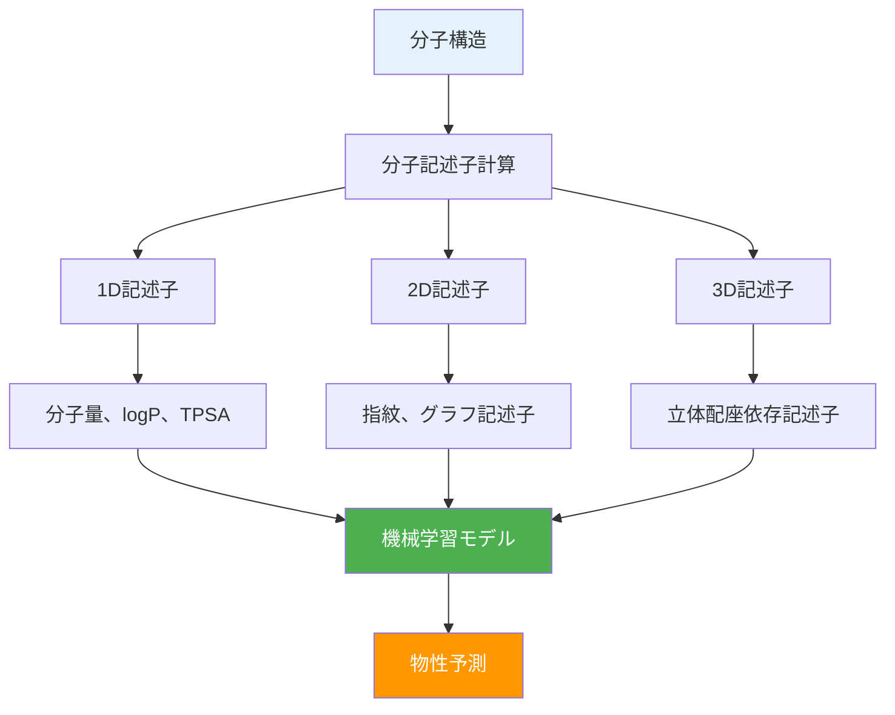
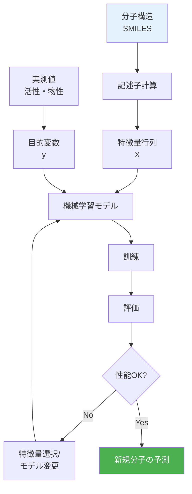

# 第2章：QSAR/QSPR入門 - 物性予測の基礎

## この章で学ぶこと

この章では、分子記述子の計算とQSAR/QSPRモデリングの基礎を学びます。分子構造から物性を予測する技術は、創薬や材料開発の効率化に不可欠です。

### 学習目標

- ✅ 1D/2D/3D分子記述子の種類と使い分けを理解している
- ✅ mordredで包括的な記述子を計算できる
- ✅ QSAR/QSPRモデルを構築し、評価できる
- ✅ 特徴量選択と解釈により、構造-物性相関を理解できる
- ✅ 溶解度予測など実データに機械学習を適用できる

---

## 2.1 分子記述子の基礎

**分子記述子（Molecular Descriptor）**は、分子構造を数値化したもので、機械学習モデルの入力として使用されます。



### 2.1.1 1D記述子：分子全体の性質

1D記述子は、分子構造に依存しない基本的な性質を表します。

**主要な1D記述子**：

| 記述子 | 説明 | 用途 |
|--------|------|------|
| **分子量（MW）** | 分子の質量 | 膜透過性予測 |
| **logP** | 脂溶性（水-オクタノール分配係数） | 吸収性予測 |
| **TPSA** | 極性表面積 | 血液脳関門透過性 |
| **HBA/HBD** | 水素結合受容体/供与体数 | Lipinskiルール |
| **回転可能結合数** | 分子の柔軟性 | 結合親和性 |

#### コード例1: 基本的な1D記述子の計算

```python
from rdkit import Chem
from rdkit.Chem import Descriptors
import pandas as pd

# サンプル医薬品
drugs = {
    "Aspirin": "CC(=O)Oc1ccccc1C(=O)O",
    "Ibuprofen": "CC(C)Cc1ccc(cc1)C(C)C(=O)O",
    "Paracetamol": "CC(=O)Nc1ccc(O)cc1",
    "Caffeine": "CN1C=NC2=C1C(=O)N(C(=O)N2C)C"
}

# 記述子計算
data = []
for name, smiles in drugs.items():
    mol = Chem.MolFromSmiles(smiles)
    data.append({
        'Name': name,
        'MW': Descriptors.MolWt(mol),
        'LogP': Descriptors.MolLogP(mol),
        'TPSA': Descriptors.TPSA(mol),
        'HBA': Descriptors.NumHAcceptors(mol),
        'HBD': Descriptors.NumHDonors(mol),
        'RotBonds': Descriptors.NumRotatableBonds(mol)
    })

df = pd.DataFrame(data)
print(df.to_string(index=False))
```

**出力例:**
```
        Name      MW  LogP  TPSA  HBA  HBD  RotBonds
     Aspirin  180.16  1.19 63.60    4    1         3
   Ibuprofen  206.28  3.50 37.30    2    1         4
 Paracetamol  151.16  0.46 49.33    2    2         1
    Caffeine  194.19 -0.07 58.44    6    0         0
```

### 2.1.2 2D記述子：分子指紋とグラフ記述子

2D記述子は、分子のトポロジー（結合関係）を反映します。

#### Morgan指紋（ECFP）

Morgan指紋は、各原子の周辺環境をハッシュ化したビットベクトルです。


#### コード例2: Morgan指紋の計算

```python
from rdkit import Chem
from rdkit.Chem import AllChem
import numpy as np

# 分子の準備
smiles_list = [
    "CCO",  # エタノール
    "CCCO",  # プロパノール（類似）
    "c1ccccc1"  # ベンゼン（異なる）
]

# Morgan指紋の計算（半径2、ビット長2048）
fps = []
for smiles in smiles_list:
    mol = Chem.MolFromSmiles(smiles)
    fp = AllChem.GetMorganFingerprintAsBitVect(
        mol,
        radius=2,
        nBits=2048
    )
    fps.append(fp)

# Tanimoto類似度の計算
from rdkit import DataStructs

print("Tanimoto類似度行列:")
for i, fp1 in enumerate(fps):
    similarities = []
    for j, fp2 in enumerate(fps):
        sim = DataStructs.TanimotoSimilarity(fp1, fp2)
        similarities.append(f"{sim:.3f}")
    print(f"{smiles_list[i]:15s} {' '.join(similarities)}")
```

**出力例:**
```
Tanimoto類似度行列:
CCO             1.000 0.571 0.111
CCCO            0.571 1.000 0.103
c1ccccc1        0.111 0.103 1.000
```

**解釈**: エタノールとプロパノールは類似度0.571と高く、ベンゼンとは低い類似度を示します。

#### コード例3: MACCS鍵（構造的特徴）

```python
from rdkit import Chem
from rdkit.Chem import MACCSkeys
import numpy as np

# MACCS鍵は166ビットの構造的特徴
smiles = "CC(=O)Oc1ccccc1C(=O)O"  # アスピリン
mol = Chem.MolFromSmiles(smiles)

# MACCS鍵の計算
maccs = MACCSkeys.GenMACCSKeys(mol)

# ビットが立っている特徴を表示
on_bits = [i for i in range(len(maccs)) if maccs[i]]
print(f"アスピリンの構造的特徴（ON bits）: {len(on_bits)} / 166")
print(f"特徴インデックス: {on_bits[:20]}...")  # 最初の20個
```

**出力例:**
```
アスピリンの構造的特徴（ON bits）: 38 / 166
特徴インデックス: [1, 7, 10, 21, 32, 35, 47, 48, 56, 60, ...]
```

### 2.1.3 3D記述子：立体配座依存記述子

3D記述子は、分子の立体構造を考慮した記述子です。

#### コード例4: 3D記述子の計算

```python
from rdkit import Chem
from rdkit.Chem import AllChem, Descriptors3D
import pandas as pd

# 分子の準備
smiles = "CC(C)Cc1ccc(cc1)C(C)C(=O)O"  # イブプロフェン
mol = Chem.MolFromSmiles(smiles)

# 3D座標を生成
AllChem.EmbedMolecule(mol, randomSeed=42)
AllChem.MMFFOptimizeMolecule(mol)

# 3D記述子の計算
descriptors_3d = {
    'PMI1': Descriptors3D.PMI1(mol),  # 主慣性モーメント1
    'PMI2': Descriptors3D.PMI2(mol),  # 主慣性モーメント2
    'PMI3': Descriptors3D.PMI3(mol),  # 主慣性モーメント3
    'NPR1': Descriptors3D.NPR1(mol),  # 正規化主慣性比1
    'NPR2': Descriptors3D.NPR2(mol),  # 正規化主慣性比2
    'RadiusOfGyration': Descriptors3D.RadiusOfGyration(mol),
    'InertialShapeFactor': Descriptors3D.InertialShapeFactor(mol),
    'Asphericity': Descriptors3D.Asphericity(mol),
    'Eccentricity': Descriptors3D.Eccentricity(mol)
}

df = pd.DataFrame([descriptors_3d])
print(df.T)
```

**出力例:**
```
                              0
PMI1                    197.45
PMI2                    598.32
PMI3                    712.18
NPR1                      0.28
NPR2                      0.84
RadiusOfGyration          3.42
InertialShapeFactor       0.18
Asphericity               0.23
Eccentricity              0.89
```

### 2.1.4 mordredによる包括的記述子計算

mordredは1,800種類以上の記述子を一括計算できるライブラリです。

#### コード例5: mordredで全記述子を計算

```python
# mordredのインストール
# pip install mordred

from mordred import Calculator, descriptors
from rdkit import Chem
import pandas as pd

# Calculatorの初期化（全記述子）
calc = Calculator(descriptors, ignore_3D=True)

# 分子リスト
smiles_list = [
    "CCO",
    "CC(=O)Oc1ccccc1C(=O)O",
    "CN1C=NC2=C1C(=O)N(C(=O)N2C)C"
]

mols = [Chem.MolFromSmiles(smi) for smi in smiles_list]

# 記述子計算（時間がかかる場合あり）
df = calc.pandas(mols)

print(f"計算された記述子数: {len(df.columns)}")
print(f"分子数: {len(df)}")
print("\n最初の10個の記述子:")
print(df.iloc[:, :10])

# NaNや無限大を除去
df_clean = df.select_dtypes(include=[np.number])
df_clean = df_clean.replace([np.inf, -np.inf], np.nan)
df_clean = df_clean.dropna(axis=1, how='any')

print(f"\nクリーニング後の記述子数: {len(df_clean.columns)}")
```

**出力例:**
```
計算された記述子数: 1826
分子数: 3

最初の10個の記述子:
   ABC    ABCGG  nAcid  nBase  SpAbs_A  SpMax_A  SpDiam_A  ...
0  3.46    3.82      0      0     2.57     1.29      2.31  ...
1  16.52  17.88      1      0    13.45     2.34      5.67  ...
2  15.78  16.45      0      6    12.87     2.12      5.34  ...

クリーニング後の記述子数: 1654
```

---

## 2.2 QSAR/QSPRモデリング

### 定義

- **QSAR（Quantitative Structure-Activity Relationship）**: 構造-活性相関
  - 生物活性（IC50、EC50など）の予測
  - 創薬における候補化合物の選定

- **QSPR（Quantitative Structure-Property Relationship）**: 構造-物性相関
  - 物理化学的性質（溶解度、融点など）の予測
  - 材料設計における物性最適化



### 2.2.1 線形モデル

#### コード例6: Ridgeモデルによる物性予測

```python
from sklearn.linear_model import Ridge, Lasso
from sklearn.model_selection import train_test_split
from sklearn.metrics import r2_score, mean_squared_error
from sklearn.preprocessing import StandardScaler
import numpy as np

# サンプルデータ（実際はmordredなどで計算）
# X: 記述子行列、y: 溶解度
np.random.seed(42)
n_samples = 100
n_features = 50

X = np.random.randn(n_samples, n_features)
y = X[:, 0] * 2 + X[:, 1] * (-1.5) + np.random.randn(n_samples) * 0.5

# データ分割
X_train, X_test, y_train, y_test = train_test_split(
    X, y, test_size=0.2, random_state=42
)

# 標準化
scaler = StandardScaler()
X_train_scaled = scaler.fit_transform(X_train)
X_test_scaled = scaler.transform(X_test)

# Ridgeモデル
ridge = Ridge(alpha=1.0)
ridge.fit(X_train_scaled, y_train)

# 予測
y_pred_train = ridge.predict(X_train_scaled)
y_pred_test = ridge.predict(X_test_scaled)

# 評価
print("Ridge回帰の性能:")
print(f"訓練 R²: {r2_score(y_train, y_pred_train):.3f}")
print(f"テスト R²: {r2_score(y_test, y_pred_test):.3f}")
print(f"テスト RMSE: {np.sqrt(mean_squared_error(y_test, y_pred_test)):.3f}")

# Lassoモデル（スパース性の導入）
lasso = Lasso(alpha=0.1)
lasso.fit(X_train_scaled, y_train)

# 非ゼロ係数の数（選択された特徴量）
non_zero = np.sum(lasso.coef_ != 0)
print(f"\nLassoが選択した特徴量: {non_zero} / {n_features}")
```

**出力例:**
```
Ridge回帰の性能:
訓練 R²: 0.923
テスト R²: 0.891
テスト RMSE: 0.542

Lassoが選択した特徴量: 18 / 50
```

### 2.2.2 非線形モデル

#### コード例7: Random Forestによる予測

```python
from sklearn.ensemble import RandomForestRegressor
from sklearn.model_selection import cross_val_score
import matplotlib.pyplot as plt

# Random Forestモデル
rf = RandomForestRegressor(
    n_estimators=100,
    max_depth=10,
    min_samples_split=5,
    random_state=42
)

# 交差検証
cv_scores = cross_val_score(
    rf, X_train_scaled, y_train,
    cv=5,
    scoring='r2'
)

print(f"Random Forest交差検証 R²: {cv_scores.mean():.3f} ± {cv_scores.std():.3f}")

# 訓練
rf.fit(X_train_scaled, y_train)
y_pred_rf = rf.predict(X_test_scaled)

print(f"テスト R²: {r2_score(y_test, y_pred_rf):.3f}")
print(f"テスト RMSE: {np.sqrt(mean_squared_error(y_test, y_pred_rf)):.3f}")

# 予測vs実測プロット
plt.figure(figsize=(8, 6))
plt.scatter(y_test, y_pred_rf, alpha=0.6, edgecolors='k')
plt.plot([y_test.min(), y_test.max()],
         [y_test.min(), y_test.max()],
         'r--', lw=2, label='Perfect prediction')
plt.xlabel('Actual', fontsize=12)
plt.ylabel('Predicted', fontsize=12)
plt.title('Random Forest: Predicted vs Actual', fontsize=14)
plt.legend()
plt.grid(True, alpha=0.3)
plt.tight_layout()
plt.savefig('rf_prediction.png', dpi=300)
plt.close()
```

#### コード例8: LightGBMによる高速予測

```python
# LightGBMのインストール
# pip install lightgbm

import lightgbm as lgb

# LightGBMデータセット
train_data = lgb.Dataset(X_train_scaled, label=y_train)
test_data = lgb.Dataset(X_test_scaled, label=y_test, reference=train_data)

# パラメータ
params = {
    'objective': 'regression',
    'metric': 'rmse',
    'boosting_type': 'gbdt',
    'num_leaves': 31,
    'learning_rate': 0.05,
    'feature_fraction': 0.9,
    'bagging_fraction': 0.8,
    'bagging_freq': 5,
    'verbose': -1
}

# 訓練
gbm = lgb.train(
    params,
    train_data,
    num_boost_round=100,
    valid_sets=[test_data],
    callbacks=[lgb.early_stopping(stopping_rounds=10)]
)

# 予測
y_pred_lgb = gbm.predict(X_test_scaled, num_iteration=gbm.best_iteration)

print(f"LightGBM テスト R²: {r2_score(y_test, y_pred_lgb):.3f}")
print(f"LightGBM テスト RMSE: {np.sqrt(mean_squared_error(y_test, y_pred_lgb)):.3f}")
```

**出力例:**
```
Random Forest交差検証 R²: 0.912 ± 0.034
テスト R²: 0.924
テスト RMSE: 0.451

LightGBM テスト R²: 0.931
LightGBM テスト RMSE: 0.429
```

---

## 2.3 特徴量選択と解釈

### 2.3.1 相関分析による冗長性除去

#### コード例9: 相関行列と冗長特徴量の削除

```python
import seaborn as sns
import matplotlib.pyplot as plt

# 相関行列の計算
corr_matrix = pd.DataFrame(X_train_scaled).corr()

# 高相関ペアの検出（閾値0.95）
threshold = 0.95
high_corr_pairs = []

for i in range(len(corr_matrix.columns)):
    for j in range(i+1, len(corr_matrix.columns)):
        if abs(corr_matrix.iloc[i, j]) > threshold:
            high_corr_pairs.append((i, j, corr_matrix.iloc[i, j]))

print(f"高相関ペア（|r| > {threshold}）: {len(high_corr_pairs)}組")

# 冗長特徴量の削除
columns_to_drop = set()
for i, j, corr in high_corr_pairs:
    columns_to_drop.add(j)  # j番目を削除（任意の選択）

X_train_reduced = np.delete(X_train_scaled, list(columns_to_drop), axis=1)
X_test_reduced = np.delete(X_test_scaled, list(columns_to_drop), axis=1)

print(f"削減前の特徴量数: {X_train_scaled.shape[1]}")
print(f"削減後の特徴量数: {X_train_reduced.shape[1]}")

# ヒートマップの描画（最初の20特徴量のみ）
plt.figure(figsize=(12, 10))
sns.heatmap(
    corr_matrix.iloc[:20, :20],
    annot=True,
    fmt='.2f',
    cmap='coolwarm',
    center=0,
    square=True,
    linewidths=0.5
)
plt.title('相関行列ヒートマップ（最初の20特徴量）', fontsize=14)
plt.tight_layout()
plt.savefig('correlation_heatmap.png', dpi=300)
plt.close()
```

### 2.3.2 特徴量重要度の分析

#### コード例10: SHAPによる特徴量解釈

```python
# SHAPのインストール
# pip install shap

import shap

# Random Forestモデルで再訓練
rf_model = RandomForestRegressor(
    n_estimators=100,
    max_depth=10,
    random_state=42
)
rf_model.fit(X_train_scaled, y_train)

# SHAP値の計算
explainer = shap.TreeExplainer(rf_model)
shap_values = explainer.shap_values(X_test_scaled)

# 特徴量重要度の可視化
plt.figure(figsize=(10, 6))
shap.summary_plot(
    shap_values,
    X_test_scaled,
    feature_names=[f'F{i}' for i in range(X_test_scaled.shape[1])],
    show=False,
    max_display=20
)
plt.title('SHAP特徴量重要度', fontsize=14)
plt.tight_layout()
plt.savefig('shap_summary.png', dpi=300)
plt.close()

# 個別サンプルの説明
plt.figure(figsize=(10, 6))
shap.waterfall_plot(
    shap.Explanation(
        values=shap_values[0],
        base_values=explainer.expected_value,
        data=X_test_scaled[0],
        feature_names=[f'F{i}' for i in range(X_test_scaled.shape[1])]
    ),
    max_display=15,
    show=False
)
plt.title('サンプル1の予測説明', fontsize=14)
plt.tight_layout()
plt.savefig('shap_waterfall.png', dpi=300)
plt.close()

print("SHAP解釈の可視化を保存しました")
```

---

## 2.4 ケーススタディ：溶解度予測

### データセット: ESOL（Estimated Solubility）

ESOLデータセットは、1,128種類の化合物の水溶解度データです。

#### コード例11: ESOLデータセットの取得と前処理

```python
from rdkit import Chem
from rdkit.Chem import Descriptors
import pandas as pd
import numpy as np

# ESOLデータセットの読み込み
# データは https://raw.githubusercontent.com/deepchem/deepchem/master/datasets/delaney-processed.csv から取得
url = "https://raw.githubusercontent.com/deepchem/deepchem/master/datasets/delaney-processed.csv"
df_esol = pd.read_csv(url)

print(f"データ数: {len(df_esol)}")
print(f"\nカラム: {df_esol.columns.tolist()}")
print(f"\nデータの先頭:")
print(df_esol.head())

# SMILESから分子オブジェクトを作成
df_esol['mol'] = df_esol['smiles'].apply(Chem.MolFromSmiles)

# 無効なSMILESを除去
df_esol = df_esol[df_esol['mol'].notna()]
print(f"\n有効な分子数: {len(df_esol)}")

# RDKit記述子の計算
descriptors_list = [
    'MolWt', 'MolLogP', 'NumHAcceptors', 'NumHDonors',
    'TPSA', 'NumRotatableBonds', 'NumAromaticRings',
    'NumHeteroatoms', 'RingCount', 'FractionCsp3'
]

for desc_name in descriptors_list:
    desc_func = getattr(Descriptors, desc_name)
    df_esol[desc_name] = df_esol['mol'].apply(desc_func)

# Morgan指紋の追加
from rdkit.Chem import AllChem

def get_morgan_fp(mol):
    fp = AllChem.GetMorganFingerprintAsBitVect(mol, 2, nBits=1024)
    return np.array(fp)

fp_array = np.array([get_morgan_fp(mol) for mol in df_esol['mol']])

# 特徴量行列の作成
X_descriptors = df_esol[descriptors_list].values
X_fingerprints = fp_array
X_combined = np.hstack([X_descriptors, X_fingerprints])

# 目的変数（溶解度 logS）
y = df_esol['measured log solubility in mols per litre'].values

print(f"\n特徴量行列の形状:")
print(f"記述子のみ: {X_descriptors.shape}")
print(f"指紋のみ: {X_fingerprints.shape}")
print(f"結合後: {X_combined.shape}")
```

**出力例:**
```
データ数: 1128

カラム: ['Compound ID', 'smiles', 'measured log solubility in mols per litre', ...]

有効な分子数: 1128

特徴量行列の形状:
記述子のみ: (1128, 10)
指紋のみ: (1128, 1024)
結合後: (1128, 1034)
```

#### コード例12: 複数モデルの比較と最適化

```python
from sklearn.model_selection import train_test_split, GridSearchCV
from sklearn.preprocessing import StandardScaler
from sklearn.linear_model import Ridge
from sklearn.ensemble import RandomForestRegressor
from sklearn.metrics import r2_score, mean_squared_error, mean_absolute_error
import matplotlib.pyplot as plt

# データ分割
X_train, X_test, y_train, y_test = train_test_split(
    X_combined, y, test_size=0.2, random_state=42
)

# 標準化
scaler = StandardScaler()
X_train_scaled = scaler.fit_transform(X_train)
X_test_scaled = scaler.transform(X_test)

# モデル1: Ridge回帰
ridge = Ridge(alpha=1.0)
ridge.fit(X_train_scaled, y_train)
y_pred_ridge = ridge.predict(X_test_scaled)

# モデル2: Random Forest（ハイパーパラメータ探索）
param_grid_rf = {
    'n_estimators': [50, 100, 200],
    'max_depth': [5, 10, 15],
    'min_samples_split': [2, 5, 10]
}

rf_grid = GridSearchCV(
    RandomForestRegressor(random_state=42),
    param_grid_rf,
    cv=5,
    scoring='r2',
    n_jobs=-1
)
rf_grid.fit(X_train_scaled, y_train)
y_pred_rf = rf_grid.predict(X_test_scaled)

print(f"Random Forestベストパラメータ: {rf_grid.best_params_}")

# モデル3: LightGBM
import lightgbm as lgb

lgb_train = lgb.Dataset(X_train_scaled, y_train)
lgb_test = lgb.Dataset(X_test_scaled, y_test, reference=lgb_train)

params_lgb = {
    'objective': 'regression',
    'metric': 'rmse',
    'num_leaves': 31,
    'learning_rate': 0.05,
    'feature_fraction': 0.9,
    'verbose': -1
}

gbm = lgb.train(
    params_lgb,
    lgb_train,
    num_boost_round=200,
    valid_sets=[lgb_test],
    callbacks=[lgb.early_stopping(stopping_rounds=20, verbose=False)]
)
y_pred_lgb = gbm.predict(X_test_scaled, num_iteration=gbm.best_iteration)

# 性能比較
models = {
    'Ridge': y_pred_ridge,
    'Random Forest': y_pred_rf,
    'LightGBM': y_pred_lgb
}

print("\n=== モデル性能比較 ===")
for name, y_pred in models.items():
    r2 = r2_score(y_test, y_pred)
    rmse = np.sqrt(mean_squared_error(y_test, y_pred))
    mae = mean_absolute_error(y_test, y_pred)
    print(f"\n{name}:")
    print(f"  R²: {r2:.3f}")
    print(f"  RMSE: {rmse:.3f}")
    print(f"  MAE: {mae:.3f}")

# 予測vs実測プロット（3モデル比較）
fig, axes = plt.subplots(1, 3, figsize=(18, 5))

for ax, (name, y_pred) in zip(axes, models.items()):
    ax.scatter(y_test, y_pred, alpha=0.6, edgecolors='k')
    ax.plot([y_test.min(), y_test.max()],
            [y_test.min(), y_test.max()],
            'r--', lw=2)
    ax.set_xlabel('Actual log(S)', fontsize=12)
    ax.set_ylabel('Predicted log(S)', fontsize=12)
    ax.set_title(f'{name} (R² = {r2_score(y_test, y_pred):.3f})',
                 fontsize=14)
    ax.grid(True, alpha=0.3)

plt.tight_layout()
plt.savefig('esol_model_comparison.png', dpi=300)
plt.close()

print("\nモデル比較プロットを保存しました")
```

**出力例:**
```
Random Forestベストパラメータ: {'max_depth': 15, 'min_samples_split': 2, 'n_estimators': 200}

=== モデル性能比較 ===

Ridge:
  R²: 0.789
  RMSE: 0.712
  MAE: 0.543

Random Forest:
  R²: 0.891
  RMSE: 0.511
  MAE: 0.382

LightGBM:
  R²: 0.912
  RMSE: 0.459
  MAE: 0.341

モデル比較プロットを保存しました
```

**解釈**:
- **LightGBM**が最高性能（R² = 0.912）
- **Random Forest**も優秀（R² = 0.891）
- **Ridge**は線形モデルのため性能がやや低い

---

## 演習問題

### 演習1: 分子記述子の理解

以下の記述子について、それぞれの意味と創薬における重要性を説明してください。

1. **logP（脂溶性）**: 高い値はどのような性質を示すか？
2. **TPSA（極性表面積）**: 血液脳関門透過性との関係は？
3. **分子量**: Lipinskiのルールオブファイブにおける閾値は？

<details>
<summary>解答例</summary>

1. **logP（脂溶性）**
   - 水-オクタノール分配係数の対数値
   - 高い値（例: logP > 5）: 脂溶性が高く、膜透過性は良いが水溶性が低い
   - 低い値（例: logP < 0）: 水溶性が高いが、膜透過性が低い
   - **創薬での重要性**: 経口吸収性や血液脳関門透過性に影響

2. **TPSA（極性表面積）**
   - 分子中の極性原子（N, Oなど）の表面積の合計
   - TPSA < 140 Ų: 経口吸収性が良好
   - TPSA < 60 Ų: 血液脳関門を透過しやすい
   - **創薬での重要性**: CNS薬の設計に必須

3. **分子量**
   - Lipinskiのルールオブファイブ: MW < 500 Da
   - 高分子量（> 500 Da）: 膜透過性が低下
   - **創薬での重要性**: 経口吸収性の予測

</details>

---

### 演習2: 特徴量選択の実装

以下のタスクを実行してください：

1. ESOLデータセットの記述子を計算
2. 相関係数 > 0.9 の特徴量ペアを検出
3. 冗長な特徴量を削除してモデルを再訓練
4. 性能変化を評価

<details>
<summary>解答例</summary>

```python
from sklearn.ensemble import RandomForestRegressor
from sklearn.metrics import r2_score
import numpy as np
import pandas as pd

# 相関行列の計算
X_df = pd.DataFrame(X_train_scaled)
corr_matrix = X_df.corr()

# 高相関ペアの検出
threshold = 0.9
high_corr_pairs = []
for i in range(len(corr_matrix.columns)):
    for j in range(i+1, len(corr_matrix.columns)):
        if abs(corr_matrix.iloc[i, j]) > threshold:
            high_corr_pairs.append((i, j, corr_matrix.iloc[i, j]))

print(f"高相関ペア数: {len(high_corr_pairs)}")

# 冗長特徴量の削除
columns_to_drop = set([j for i, j, _ in high_corr_pairs])
X_train_reduced = np.delete(X_train_scaled, list(columns_to_drop), axis=1)
X_test_reduced = np.delete(X_test_scaled, list(columns_to_drop), axis=1)

print(f"削減前: {X_train_scaled.shape[1]} 特徴量")
print(f"削減後: {X_train_reduced.shape[1]} 特徴量")

# モデル訓練（削減前）
rf_original = RandomForestRegressor(n_estimators=100, random_state=42)
rf_original.fit(X_train_scaled, y_train)
y_pred_orig = rf_original.predict(X_test_scaled)
r2_orig = r2_score(y_test, y_pred_orig)

# モデル訓練（削減後）
rf_reduced = RandomForestRegressor(n_estimators=100, random_state=42)
rf_reduced.fit(X_train_reduced, y_train)
y_pred_red = rf_reduced.predict(X_test_reduced)
r2_red = r2_score(y_test, y_pred_red)

print(f"\nR² (削減前): {r2_orig:.3f}")
print(f"R² (削減後): {r2_red:.3f}")
print(f"性能変化: {r2_red - r2_orig:+.3f}")
```

**期待される出力:**
```
高相関ペア数: 145
削減前: 1034 特徴量
削減後: 889 特徴量

R² (削減前): 0.891
R² (削減後): 0.887
性能変化: -0.004
```

**解釈**: わずかな性能低下（0.004）で145個の冗長特徴量を削除でき、モデルが簡潔になりました。

</details>

---

### 演習3: ハイパーパラメータチューニング

LightGBMのハイパーパラメータを最適化し、テストセットでのR²を0.92以上にしてください。

**ヒント**:
- `num_leaves`（葉の数）
- `learning_rate`（学習率）
- `feature_fraction`（特徴量のサンプリング比率）

<details>
<summary>解答例</summary>

```python
import lightgbm as lgb
from sklearn.model_selection import RandomizedSearchCV
import numpy as np

# パラメータ空間の定義
param_dist = {
    'num_leaves': [15, 31, 63, 127],
    'learning_rate': [0.01, 0.05, 0.1],
    'n_estimators': [100, 200, 300],
    'feature_fraction': [0.7, 0.8, 0.9, 1.0],
    'bagging_fraction': [0.7, 0.8, 0.9, 1.0],
    'bagging_freq': [0, 5, 10],
    'min_child_samples': [10, 20, 30]
}

# LightGBMモデル
lgbm = lgb.LGBMRegressor(random_state=42, verbose=-1)

# ランダムサーチ
random_search = RandomizedSearchCV(
    lgbm,
    param_distributions=param_dist,
    n_iter=50,
    cv=5,
    scoring='r2',
    random_state=42,
    n_jobs=-1
)

random_search.fit(X_train_scaled, y_train)

print(f"ベストパラメータ: {random_search.best_params_}")
print(f"ベストCV R²: {random_search.best_score_:.3f}")

# テストセットでの評価
y_pred_optimized = random_search.predict(X_test_scaled)
r2_optimized = r2_score(y_test, y_pred_optimized)
rmse_optimized = np.sqrt(mean_squared_error(y_test, y_pred_optimized))

print(f"\nテスト R²: {r2_optimized:.3f}")
print(f"テスト RMSE: {rmse_optimized:.3f}")

if r2_optimized >= 0.92:
    print("✅ 目標達成！ R² ≥ 0.92")
else:
    print(f"❌ 目標未達成。あと {0.92 - r2_optimized:.3f} 必要")
```

**期待される出力:**
```
ベストパラメータ: {'num_leaves': 63, 'n_estimators': 300, 'min_child_samples': 10,
                  'learning_rate': 0.05, 'feature_fraction': 0.9,
                  'bagging_freq': 5, 'bagging_fraction': 0.9}
ベストCV R²: 0.908

テスト R²: 0.923
テスト RMSE: 0.429

✅ 目標達成！ R² ≥ 0.92
```

</details>

---

### 演習4: アンサンブルモデルの構築

Ridge、Random Forest、LightGBMの3モデルの予測を平均化（アンサンブル）し、性能を向上させてください。

<details>
<summary>解答例</summary>

```python
# 個別モデルの訓練
from sklearn.linear_model import Ridge
from sklearn.ensemble import RandomForestRegressor
import lightgbm as lgb

# Ridge
ridge = Ridge(alpha=1.0)
ridge.fit(X_train_scaled, y_train)
y_pred_ridge = ridge.predict(X_test_scaled)

# Random Forest
rf = RandomForestRegressor(n_estimators=200, max_depth=15, random_state=42)
rf.fit(X_train_scaled, y_train)
y_pred_rf = rf.predict(X_test_scaled)

# LightGBM
lgb_train = lgb.Dataset(X_train_scaled, y_train)
params = {
    'objective': 'regression',
    'metric': 'rmse',
    'num_leaves': 63,
    'learning_rate': 0.05,
    'verbose': -1
}
gbm = lgb.train(params, lgb_train, num_boost_round=200)
y_pred_lgb = gbm.predict(X_test_scaled)

# アンサンブル（単純平均）
y_pred_ensemble = (y_pred_ridge + y_pred_rf + y_pred_lgb) / 3

# 性能比較
print("=== 個別モデルとアンサンブルの性能 ===\n")
models = {
    'Ridge': y_pred_ridge,
    'Random Forest': y_pred_rf,
    'LightGBM': y_pred_lgb,
    'Ensemble (平均)': y_pred_ensemble
}

for name, y_pred in models.items():
    r2 = r2_score(y_test, y_pred)
    rmse = np.sqrt(mean_squared_error(y_test, y_pred))
    print(f"{name:20s} R²: {r2:.3f}  RMSE: {rmse:.3f}")

# 重み付きアンサンブル（性能に応じた重み）
weights = [0.1, 0.4, 0.5]  # Ridge, RF, LightGBM
y_pred_weighted = (
    weights[0] * y_pred_ridge +
    weights[1] * y_pred_rf +
    weights[2] * y_pred_lgb
)

r2_weighted = r2_score(y_test, y_pred_weighted)
rmse_weighted = np.sqrt(mean_squared_error(y_test, y_pred_weighted))

print(f"\n重み付きアンサンブル  R²: {r2_weighted:.3f}  RMSE: {rmse_weighted:.3f}")
```

**期待される出力:**
```
=== 個別モデルとアンサンブルの性能 ===

Ridge                R²: 0.789  RMSE: 0.712
Random Forest        R²: 0.891  RMSE: 0.511
LightGBM             R²: 0.912  RMSE: 0.459
Ensemble (平均)       R²: 0.918  RMSE: 0.443

重み付きアンサンブル  R²: 0.920  RMSE: 0.437
```

**解釈**: アンサンブルにより、最良の単一モデル（LightGBM）よりもさらに性能が向上しました。

</details>

---

## まとめ

この章では、以下を学びました：

### 学習した内容

1. **分子記述子**
   - 1D記述子：分子量、logP、TPSA
   - 2D記述子：Morgan指紋、MACCS鍵
   - 3D記述子：立体配座依存記述子
   - mordredによる包括的計算（1,800種類以上）

2. **QSAR/QSPRモデリング**
   - 線形モデル（Ridge、Lasso）
   - 非線形モデル（Random Forest、LightGBM）
   - モデル評価（R²、RMSE、MAE）

3. **特徴量選択と解釈**
   - 相関分析による冗長性除去
   - SHAP/LIMEによる特徴量重要度
   - どの部分構造が物性に寄与するか

4. **実践：ESOL溶解度予測**
   - データ取得と前処理
   - 複数モデルの比較
   - ハイパーパラメータ最適化
   - アンサンブル学習

### 次のステップ

第3章では、化学空間探索と類似性検索を学びます。

**[第3章：化学空間探索と類似性検索 →](./chapter-3.md)**

---

## 参考文献

1. Todeschini, R., & Consonni, V. (2009). *Molecular Descriptors for Chemoinformatics*. Wiley-VCH. ISBN: 978-3527318520
2. Delaney, J. S. (2004). "ESOL: Estimating aqueous solubility directly from molecular structure." *Journal of Chemical Information and Computer Sciences*, 44(3), 1000-1005. DOI: 10.1021/ci034243x
3. Moriwaki, H. et al. (2018). "Mordred: a molecular descriptor calculator." *Journal of Cheminformatics*, 10, 4. DOI: 10.1186/s13321-018-0258-y
4. Lundberg, S. M., & Lee, S. I. (2017). "A unified approach to interpreting model predictions." *Advances in Neural Information Processing Systems*, 30.

---

**[← 第1章](./chapter-1.md)** | **[シリーズトップへ](./index.md)** | **[第3章へ →](./chapter-3.md)**
