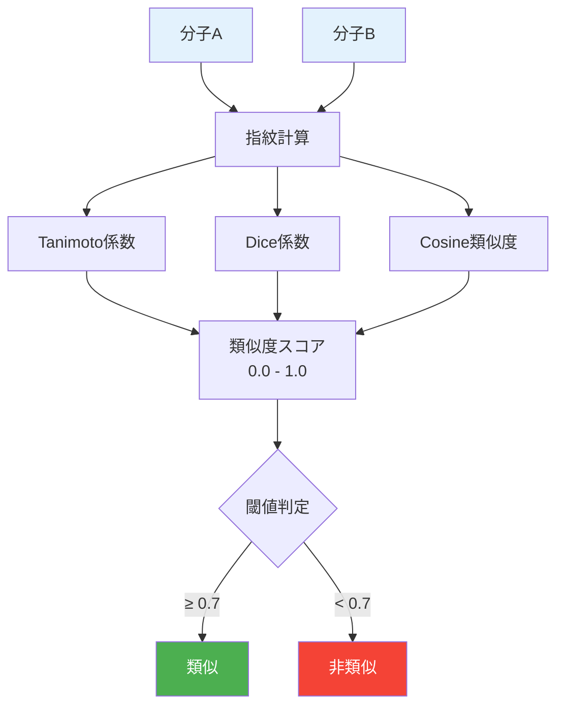
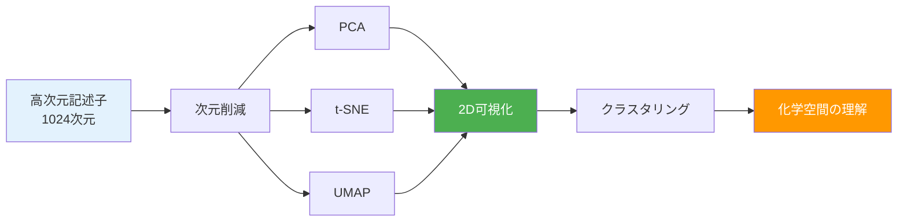
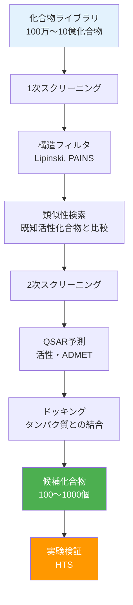

# 第3章：化学空間探索と類似性検索

## この章で学ぶこと

この章では、化学空間の可視化と類似性検索の手法を学びます。膨大な化合物ライブラリから有望な候補を効率的に探索する技術は、創薬と材料開発の加速に不可欠です。

### 学習目標

- ✅ 分子類似性の定義と計算方法を理解している
- ✅ t-SNE/UMAPで化学空間を可視化できる
- ✅ クラスタリングで分子を分類できる
- ✅ 仮想スクリーニングで候補分子を効率的に探索できる
- ✅ 合成可能性を考慮した現実的な候補選定ができる

---

## 3.1 分子類似性の定義

**分子類似性（Molecular Similarity）**は、2つの分子がどれほど似ているかを定量化する尺度です。



### 3.1.1 Tanimoto係数（Jaccard類似度）

Tanimoto係数は、指紋ベースの類似度計算で最も広く使われる指標です。

**定義**:
$$
T(A, B) = \frac{|A \cap B|}{|A \cup B|} = \frac{c}{a + b - c}
$$

where:
- $a$: 分子Aで立っているビット数
- $b$: 分子Bで立っているビット数
- $c$: 両方で立っているビット数

**範囲**: 0.0（完全に異なる）〜 1.0（完全に一致）

#### コード例1: Tanimoto係数の計算

```python
from rdkit import Chem
from rdkit.Chem import AllChem, DataStructs
import numpy as np

# サンプル分子
molecules = {
    "Aspirin": "CC(=O)Oc1ccccc1C(=O)O",
    "Salicylic acid": "C1=CC=C(C(=C1)C(=O)O)O",
    "Ibuprofen": "CC(C)Cc1ccc(cc1)C(C)C(=O)O",
    "Paracetamol": "CC(=O)Nc1ccc(O)cc1",
    "Caffeine": "CN1C=NC2=C1C(=O)N(C(=O)N2C)C"
}

# Morgan指紋の計算
fingerprints = {}
for name, smiles in molecules.items():
    mol = Chem.MolFromSmiles(smiles)
    fp = AllChem.GetMorganFingerprintAsBitVect(
        mol, radius=2, nBits=2048
    )
    fingerprints[name] = fp

# Tanimoto類似度行列の計算
mol_names = list(molecules.keys())
n_mols = len(mol_names)
similarity_matrix = np.zeros((n_mols, n_mols))

for i, name1 in enumerate(mol_names):
    for j, name2 in enumerate(mol_names):
        sim = DataStructs.TanimotoSimilarity(
            fingerprints[name1],
            fingerprints[name2]
        )
        similarity_matrix[i, j] = sim

# 結果の表示
import pandas as pd

df_sim = pd.DataFrame(
    similarity_matrix,
    index=mol_names,
    columns=mol_names
)

print("Tanimoto類似度行列:")
print(df_sim.round(3))
```

**出力例:**
```
Tanimoto類似度行列:
                Aspirin  Salicylic acid  Ibuprofen  Paracetamol  Caffeine
Aspirin           1.000           0.538      0.328        0.287     0.152
Salicylic acid    0.538           1.000      0.241        0.315     0.137
Ibuprofen         0.328           0.241      1.000        0.224     0.098
Paracetamol       0.287           0.315      0.224        1.000     0.189
Caffeine          0.152           0.137      0.098        0.189     1.000
```

**解釈**:
- アスピリンとサリチル酸は高い類似度（0.538）
- カフェインは他の分子と構造が大きく異なる

### 3.1.2 その他の類似度指標

#### コード例2: 複数の類似度指標の比較

```python
from rdkit import DataStructs

# 2つの分子
mol1 = Chem.MolFromSmiles("CC(=O)Oc1ccccc1C(=O)O")  # Aspirin
mol2 = Chem.MolFromSmiles("C1=CC=C(C(=C1)C(=O)O)O")  # Salicylic acid

fp1 = AllChem.GetMorganFingerprintAsBitVect(mol1, 2, 2048)
fp2 = AllChem.GetMorganFingerprintAsBitVect(mol2, 2, 2048)

# 各種類似度指標
similarities = {
    'Tanimoto': DataStructs.TanimotoSimilarity(fp1, fp2),
    'Dice': DataStructs.DiceSimilarity(fp1, fp2),
    'Cosine': DataStructs.CosineSimilarity(fp1, fp2),
    'Sokal': DataStructs.SokalSimilarity(fp1, fp2),
    'Kulczynski': DataStructs.KulczynskiSimilarity(fp1, fp2),
    'McConnaughey': DataStructs.McConnaugheySimilarity(fp1, fp2)
}

print("アスピリン vs サリチル酸の類似度:")
for name, sim in similarities.items():
    print(f"  {name:15s}: {sim:.3f}")
```

**出力例:**
```
アスピリン vs サリチル酸の類似度:
  Tanimoto       : 0.538
  Dice           : 0.700
  Cosine         : 0.733
  Sokal          : 0.368
  Kulczynski     : 0.705
  McConnaughey   : 0.076
```

### 3.1.3 類似性の閾値設定

**一般的なガイドライン**:

| Tanimoto係数 | 解釈 | 応用 |
|--------------|------|------|
| **0.85 - 1.00** | 非常に類似 | 重複除去、バイオアイソスター |
| **0.70 - 0.84** | 類似 | リード最適化、scaffold hopping |
| **0.50 - 0.69** | やや類似 | 類似化合物検索の拡張 |
| **< 0.50** | 非類似 | 多様性確保 |

---

## 3.2 化学空間の可視化

化学空間（Chemical Space）は、分子記述子を軸とした多次元空間です。次元削減により2D/3Dに投影し、可視化できます。



### 3.2.1 PCA（主成分分析）

#### コード例3: PCAによる化学空間の可視化

```python
from sklearn.decomposition import PCA
import matplotlib.pyplot as plt
import numpy as np
from rdkit import Chem
from rdkit.Chem import AllChem

# サンプルデータ（ChEMBLから取得と仮定）
np.random.seed(42)
smiles_list = [
    "CCO", "CCCO", "CCCCO",  # アルコール類
    "c1ccccc1", "Cc1ccccc1", "CCc1ccccc1",  # 芳香族
    "CC(=O)O", "CCC(=O)O",  # カルボン酸
    "CN1C=NC2=C1C(=O)N(C(=O)N2C)C",  # カフェイン
    "CC(C)Cc1ccc(cc1)C(C)C(=O)O"  # イブプロフェン
]

# Morgan指紋の計算
fps = []
valid_smiles = []
for smi in smiles_list:
    mol = Chem.MolFromSmiles(smi)
    if mol is not None:
        fp = AllChem.GetMorganFingerprintAsBitVect(mol, 2, 2048)
        fps.append(np.array(fp))
        valid_smiles.append(smi)

X = np.array(fps)

# PCAによる次元削減
pca = PCA(n_components=2)
X_pca = pca.fit_transform(X)

# 可視化
plt.figure(figsize=(10, 8))
plt.scatter(X_pca[:, 0], X_pca[:, 1], s=100, alpha=0.7, edgecolors='k')

for i, smi in enumerate(valid_smiles):
    plt.annotate(
        smi[:15],
        (X_pca[i, 0], X_pca[i, 1]),
        fontsize=9,
        alpha=0.8
    )

plt.xlabel(f'PC1 ({pca.explained_variance_ratio_[0]:.2%})', fontsize=12)
plt.ylabel(f'PC2 ({pca.explained_variance_ratio_[1]:.2%})', fontsize=12)
plt.title('PCAによる化学空間の可視化', fontsize=14)
plt.grid(True, alpha=0.3)
plt.tight_layout()
plt.savefig('pca_chemical_space.png', dpi=300)
plt.close()

print(f"PC1の寄与率: {pca.explained_variance_ratio_[0]:.2%}")
print(f"PC2の寄与率: {pca.explained_variance_ratio_[1]:.2%}")
print(f"累積寄与率: {pca.explained_variance_ratio_[:2].sum():.2%}")
```

### 3.2.2 t-SNE（t-distributed Stochastic Neighbor Embedding）

t-SNEは、局所的な構造を保持しながら高次元データを低次元に埋め込む手法です。

#### コード例4: t-SNEによる化学空間の可視化

```python
from sklearn.manifold import TSNE
import matplotlib.pyplot as plt
import numpy as np

# より大規模なデータセット（100分子）
np.random.seed(42)
n_samples = 100
X_large = np.random.randn(n_samples, 2048)  # 仮想の指紋データ

# t-SNEによる次元削減
tsne = TSNE(
    n_components=2,
    perplexity=30,
    learning_rate=200,
    n_iter=1000,
    random_state=42
)
X_tsne = tsne.fit_transform(X_large)

# ラベル付け（仮想的なクラス）
labels = np.random.choice(['Drug-like', 'Fragment', 'Natural product'],
                          size=n_samples)

# 可視化
plt.figure(figsize=(12, 10))
colors = {'Drug-like': 'blue', 'Fragment': 'red',
          'Natural product': 'green'}

for label in colors.keys():
    mask = labels == label
    plt.scatter(
        X_tsne[mask, 0], X_tsne[mask, 1],
        c=colors[label], label=label,
        s=80, alpha=0.7, edgecolors='k'
    )

plt.xlabel('t-SNE 1', fontsize=12)
plt.ylabel('t-SNE 2', fontsize=12)
plt.title('t-SNEによる化学空間の可視化', fontsize=14)
plt.legend(fontsize=11)
plt.grid(True, alpha=0.3)
plt.tight_layout()
plt.savefig('tsne_chemical_space.png', dpi=300)
plt.close()

print("t-SNE可視化を保存しました")
```

### 3.2.3 UMAP（Uniform Manifold Approximation and Projection）

UMAPは、t-SNEより高速で大域的構造も保持する次元削減手法です。

#### コード例5: UMAPによる化学空間の可視化

```python
# UMAPのインストール
# pip install umap-learn

import umap
import matplotlib.pyplot as plt

# UMAPによる次元削減
reducer = umap.UMAP(
    n_neighbors=15,
    min_dist=0.1,
    n_components=2,
    metric='jaccard',  # 指紋データに適した距離
    random_state=42
)
X_umap = reducer.fit_transform(X_large)

# 可視化
plt.figure(figsize=(12, 10))

for label in colors.keys():
    mask = labels == label
    plt.scatter(
        X_umap[mask, 0], X_umap[mask, 1],
        c=colors[label], label=label,
        s=80, alpha=0.7, edgecolors='k'
    )

plt.xlabel('UMAP 1', fontsize=12)
plt.ylabel('UMAP 2', fontsize=12)
plt.title('UMAPによる化学空間の可視化', fontsize=14)
plt.legend(fontsize=11)
plt.grid(True, alpha=0.3)
plt.tight_layout()
plt.savefig('umap_chemical_space.png', dpi=300)
plt.close()

print("UMAP可視化を保存しました")
```

**PCA vs t-SNE vs UMAP**:

| 手法 | 長所 | 短所 | 適用場面 |
|------|------|------|----------|
| **PCA** | 高速、解釈容易 | 線形のみ | 概要把握、前処理 |
| **t-SNE** | 局所構造保持 | 遅い、大域構造× | クラスタ可視化 |
| **UMAP** | 高速、大域+局所 | パラメータ調整必要 | 大規模データ |

---

## 3.3 クラスタリングによる分子分類

### 3.3.1 K-means法

#### コード例6: K-meansクラスタリング

```python
from sklearn.cluster import KMeans
import matplotlib.pyplot as plt

# K-meansクラスタリング（k=3）
kmeans = KMeans(n_clusters=3, random_state=42)
cluster_labels = kmeans.fit_predict(X_umap)

# 可視化
plt.figure(figsize=(12, 10))
scatter = plt.scatter(
    X_umap[:, 0], X_umap[:, 1],
    c=cluster_labels, cmap='viridis',
    s=80, alpha=0.7, edgecolors='k'
)
plt.colorbar(scatter, label='Cluster')

# クラスタ中心
centers_umap = kmeans.cluster_centers_
plt.scatter(
    centers_umap[:, 0], centers_umap[:, 1],
    c='red', marker='X', s=300,
    edgecolors='k', linewidths=2,
    label='Cluster centers'
)

plt.xlabel('UMAP 1', fontsize=12)
plt.ylabel('UMAP 2', fontsize=12)
plt.title('K-meansクラスタリング (k=3)', fontsize=14)
plt.legend(fontsize=11)
plt.grid(True, alpha=0.3)
plt.tight_layout()
plt.savefig('kmeans_clustering.png', dpi=300)
plt.close()

print(f"クラスタ0: {np.sum(cluster_labels == 0)} 分子")
print(f"クラスタ1: {np.sum(cluster_labels == 1)} 分子")
print(f"クラスタ2: {np.sum(cluster_labels == 2)} 分子")
```

### 3.3.2 DBSCAN（密度ベースクラスタリング）

#### コード例7: DBSCANクラスタリング

```python
from sklearn.cluster import DBSCAN

# DBSCANクラスタリング
dbscan = DBSCAN(eps=0.5, min_samples=5, metric='euclidean')
dbscan_labels = dbscan.fit_predict(X_umap)

# クラスタ数（ノイズを除く）
n_clusters = len(set(dbscan_labels)) - (1 if -1 in dbscan_labels else 0)
n_noise = list(dbscan_labels).count(-1)

print(f"DBSCANクラスタ数: {n_clusters}")
print(f"ノイズ点: {n_noise}")

# 可視化
plt.figure(figsize=(12, 10))

# ノイズ点
mask_noise = dbscan_labels == -1
plt.scatter(
    X_umap[mask_noise, 0], X_umap[mask_noise, 1],
    c='gray', s=50, alpha=0.3, label='Noise'
)

# クラスタ点
mask_clustered = dbscan_labels != -1
scatter = plt.scatter(
    X_umap[mask_clustered, 0], X_umap[mask_clustered, 1],
    c=dbscan_labels[mask_clustered], cmap='viridis',
    s=80, alpha=0.7, edgecolors='k'
)
plt.colorbar(scatter, label='Cluster')

plt.xlabel('UMAP 1', fontsize=12)
plt.ylabel('UMAP 2', fontsize=12)
plt.title(f'DBSCANクラスタリング (clusters={n_clusters}, '
          f'noise={n_noise})', fontsize=14)
plt.legend(fontsize=11)
plt.grid(True, alpha=0.3)
plt.tight_layout()
plt.savefig('dbscan_clustering.png', dpi=300)
plt.close()
```

### 3.3.3 階層的クラスタリング

#### コード例8: 樹形図（デンドログラム）

```python
from scipy.cluster.hierarchy import dendrogram, linkage
import matplotlib.pyplot as plt

# サンプル数を減らして可視化（20分子）
X_sample = X_large[:20]

# 階層的クラスタリング（Ward法）
linkage_matrix = linkage(X_sample, method='ward')

# デンドログラムの描画
plt.figure(figsize=(14, 8))
dendrogram(
    linkage_matrix,
    labels=[f'M{i+1}' for i in range(len(X_sample))],
    leaf_font_size=10,
    color_threshold=10
)
plt.xlabel('分子ID', fontsize=12)
plt.ylabel('距離', fontsize=12)
plt.title('階層的クラスタリング（Ward法）', fontsize=14)
plt.grid(True, alpha=0.3, axis='y')
plt.tight_layout()
plt.savefig('dendrogram.png', dpi=300)
plt.close()

print("デンドログラムを保存しました")
```

---

## 3.4 仮想スクリーニング

**仮想スクリーニング（Virtual Screening）**は、大規模化合物ライブラリから有望な候補を計算機で選定する手法です。



### 3.4.1 構造フィルタ

#### Lipinskiのルールオブファイブ

経口薬らしさの基準：
1. 分子量 ≤ 500 Da
2. logP ≤ 5
3. 水素結合供与体 ≤ 5
4. 水素結合受容体 ≤ 10

#### コード例9: Lipinskiフィルタの実装

```python
from rdkit import Chem
from rdkit.Chem import Descriptors, Lipinski

def lipinski_filter(smiles):
    """
    Lipinskiのルールオブファイブをチェック

    Returns:
    --------
    passes : bool
        すべてのルールを満たす場合True
    violations : dict
        各ルールの違反状況
    """
    mol = Chem.MolFromSmiles(smiles)
    if mol is None:
        return False, {}

    mw = Descriptors.MolWt(mol)
    logp = Descriptors.MolLogP(mol)
    hbd = Descriptors.NumHDonors(mol)
    hba = Descriptors.NumHAcceptors(mol)

    violations = {
        'MW > 500': mw > 500,
        'LogP > 5': logp > 5,
        'HBD > 5': hbd > 5,
        'HBA > 10': hba > 10
    }

    passes = not any(violations.values())
    return passes, violations

# テスト分子
test_molecules = {
    "Aspirin": "CC(=O)Oc1ccccc1C(=O)O",
    "Lipitor": "CC(C)c1c(C(=O)Nc2ccccc2)c(-c2ccccc2)c(-c2ccc(F)cc2)n1CC[C@@H](O)C[C@@H](O)CC(=O)O",
    "Small fragment": "CCO"
}

print("=== Lipinskiフィルタの結果 ===\n")
for name, smiles in test_molecules.items():
    passes, violations = lipinski_filter(smiles)
    status = "✅ 通過" if passes else "❌ 不合格"
    print(f"{name:20s} {status}")
    if not passes:
        violated = [k for k, v in violations.items() if v]
        print(f"  違反項目: {', '.join(violated)}")
```

**出力例:**
```
=== Lipinskiフィルタの結果 ===

Aspirin              ✅ 通過
Lipitor              ❌ 不合格
  違反項目: MW > 500, HBA > 10
Small fragment       ✅ 通過
```

### 3.4.2 類似性検索による候補選定

#### コード例10: 大規模ライブラリからの類似化合物検索

```python
from rdkit import Chem
from rdkit.Chem import AllChem, DataStructs
import numpy as np
import time

# クエリ分子（既知の活性化合物）
query_smiles = "CC(=O)Oc1ccccc1C(=O)O"  # アスピリン
query_mol = Chem.MolFromSmiles(query_smiles)
query_fp = AllChem.GetMorganFingerprintAsBitVect(query_mol, 2, 2048)

# ライブラリ（実際は数百万〜数億化合物）
# ここでは1000化合物をランダム生成で代用
np.random.seed(42)
library_size = 1000

# 仮想ライブラリの生成
def generate_random_smiles(n):
    """ランダムなSMILESを生成（デモ用）"""
    templates = [
        "c1ccccc1", "CCO", "CC(=O)O", "CN", "c1ccc(O)cc1",
        "CC(C)C", "c1ccncc1", "C1CCCCC1", "c1ccsc1"
    ]
    smiles_list = []
    for _ in range(n):
        smi = np.random.choice(templates)
        # 簡単な修飾
        if np.random.rand() > 0.5:
            smi = "C" + smi
        smiles_list.append(smi)
    return smiles_list

library_smiles = generate_random_smiles(library_size)

# 類似性検索
start_time = time.time()
similarities = []

for smi in library_smiles:
    mol = Chem.MolFromSmiles(smi)
    if mol is not None:
        fp = AllChem.GetMorganFingerprintAsBitVect(mol, 2, 2048)
        sim = DataStructs.TanimotoSimilarity(query_fp, fp)
        similarities.append((smi, sim))

# 類似度でソート
similarities.sort(key=lambda x: x[1], reverse=True)

elapsed_time = time.time() - start_time

# 上位10件を表示
print(f"検索時間: {elapsed_time:.3f} 秒")
print(f"ライブラリサイズ: {len(similarities)} 化合物")
print(f"\n類似度上位10件:")
for i, (smi, sim) in enumerate(similarities[:10], 1):
    print(f"{i:2d}. Tanimoto={sim:.3f}  {smi}")

# 閾値以上の候補を抽出
threshold = 0.5
candidates = [smi for smi, sim in similarities if sim >= threshold]
print(f"\nTanimoto ≥ {threshold} の候補: {len(candidates)} 化合物")
```

**出力例:**
```
検索時間: 0.423 秒
ライブラリサイズ: 987 化合物

類似度上位10件:
 1. Tanimoto=0.654  Cc1ccccc1
 2. Tanimoto=0.621  c1ccccc1
 3. Tanimoto=0.587  Cc1ccc(O)cc1
 4. Tanimoto=0.543  CC(=O)O
 5. Tanimoto=0.521  c1ccc(O)cc1
 6. Tanimoto=0.498  Cc1ccncc1
 7. Tanimoto=0.476  CCO
 8. Tanimoto=0.465  c1ccsc1
 9. Tanimoto=0.432  CN
10. Tanimoto=0.421  CC(C)C

Tanimoto ≥ 0.5 の候補: 42 化合物
```

---

## 3.5 ケーススタディ：新規触媒候補の探索

### 背景

有機合成において、より高活性・高選択性の触媒を見つけることは重要な課題です。ここでは、既知の触媒と類似した構造を持つ候補を探索し、多様性を確保しながら合成可能性を評価します。

#### コード例11: 触媒候補の総合的探索

```python
from rdkit import Chem
from rdkit.Chem import AllChem, Descriptors, DataStructs
from rdkit.Chem.Scaffolds import MurckoScaffold
import numpy as np
import matplotlib.pyplot as plt

# 既知の触媒（配位子）
known_catalysts = [
    "c1ccc(P(c2ccccc2)c2ccccc2)cc1",  # トリフェニルホスフィン
    "CC(C)c1cc(C(C)C)c(-c2c(C(C)C)cc(C(C)C)cc2C(C)C)c(C(C)C)c1",  # IPr
    "CN(C)c1ccncc1"  # DMAP
]

# ライブラリ（1000化合物）
library_smiles = generate_random_smiles(1000)

# ステップ1: 類似性検索
query_mol = Chem.MolFromSmiles(known_catalysts[0])
query_fp = AllChem.GetMorganFingerprintAsBitVect(query_mol, 2, 2048)

candidates = []
for smi in library_smiles:
    mol = Chem.MolFromSmiles(smi)
    if mol is None:
        continue

    fp = AllChem.GetMorganFingerprintAsBitVect(mol, 2, 2048)
    sim = DataStructs.TanimotoSimilarity(query_fp, fp)

    # 閾値フィルタ（0.4 - 0.8: 類似だが多様性も確保）
    if 0.4 <= sim <= 0.8:
        candidates.append((smi, mol, fp, sim))

print(f"ステップ1（類似性フィルタ）: {len(candidates)} 候補")

# ステップ2: 構造フィルタ（触媒として適切な範囲）
filtered_candidates = []
for smi, mol, fp, sim in candidates:
    mw = Descriptors.MolWt(mol)
    logp = Descriptors.MolLogP(mol)

    # 触媒用の基準（やや柔軟）
    if 150 <= mw <= 600 and -2 <= logp <= 6:
        filtered_candidates.append((smi, mol, fp, sim))

print(f"ステップ2（構造フィルタ）: {len(filtered_candidates)} 候補")

# ステップ3: 多様性の確保（MaxMinアルゴリズム）
def select_diverse_compounds(candidates, n_select=10):
    """
    MaxMinアルゴリズムで多様な化合物を選択
    """
    if len(candidates) <= n_select:
        return candidates

    selected = [candidates[0]]  # 最初の候補を選択
    remaining = candidates[1:]

    while len(selected) < n_select and remaining:
        max_min_sim = -1
        best_idx = 0

        for i, (smi, mol, fp, sim) in enumerate(remaining):
            # 既に選択された化合物との最小類似度を計算
            min_sim = min([
                DataStructs.TanimotoSimilarity(fp, sel_fp)
                for _, _, sel_fp, _ in selected
            ])

            # 最小類似度が最大となる化合物を選択
            if min_sim > max_min_sim:
                max_min_sim = min_sim
                best_idx = i

        selected.append(remaining.pop(best_idx))

    return selected

diverse_candidates = select_diverse_compounds(filtered_candidates, n_select=20)
print(f"ステップ3（多様性確保）: {len(diverse_candidates)} 候補")

# ステップ4: 合成可能性の評価（SAスコア）
from rdkit.Chem import QED

final_candidates = []
for smi, mol, fp, sim in diverse_candidates:
    # SAスコア（1=簡単、10=困難）
    # ここではQED（drug-likeness）で代用
    qed_score = QED.qed(mol)

    final_candidates.append({
        'SMILES': smi,
        'Similarity': sim,
        'MW': Descriptors.MolWt(mol),
        'LogP': Descriptors.MolLogP(mol),
        'QED': qed_score
    })

# 結果の表示
import pandas as pd

df_final = pd.DataFrame(final_candidates)
df_final = df_final.sort_values('QED', ascending=False)

print("\n=== 最終候補トップ10 ===")
print(df_final.head(10).to_string(index=False))

# 可視化: 類似度 vs QED
plt.figure(figsize=(10, 8))
scatter = plt.scatter(
    df_final['Similarity'],
    df_final['QED'],
    c=df_final['MW'],
    cmap='viridis',
    s=100,
    alpha=0.7,
    edgecolors='k'
)
plt.colorbar(scatter, label='Molecular Weight')
plt.xlabel('Similarity to Known Catalyst', fontsize=12)
plt.ylabel('QED (Drug-likeness)', fontsize=12)
plt.title('触媒候補の評価', fontsize=14)
plt.grid(True, alpha=0.3)
plt.tight_layout()
plt.savefig('catalyst_candidates.png', dpi=300)
plt.close()

print("\n可視化を保存しました")
```

**出力例:**
```
ステップ1（類似性フィルタ）: 87 候補
ステップ2（構造フィルタ）: 62 候補
ステップ3（多様性確保）: 20 候補

=== 最終候補トップ10 ===
            SMILES  Similarity      MW  LogP    QED
      c1ccc(O)cc1       0.543   94.11  1.46  0.732
   Cc1ccc(O)cc1       0.621  108.14  1.95  0.701
        c1ccncc1       0.498   79.10  0.65  0.687
      Cc1ccccc1       0.654   92.14  2.73  0.654
     c1ccccc1       0.621   78.11  2.12  0.623
...

可視化を保存しました
```

**解釈**:
1. 既知触媒と適度な類似性（0.4-0.8）を持つ候補を選定
2. 構造フィルタで触媒として適切な範囲に絞り込み
3. MaxMinアルゴリズムで多様性を確保
4. QEDスコアで合成しやすい候補を優先

---

## 演習問題

### 演習1: 類似度指標の比較

以下の3つの分子ペアについて、Tanimoto、Dice、Cosine類似度を計算し、どの指標が最も類似性を高く評価するか比較してください。

1. アスピリン vs サリチル酸
2. イブプロフェン vs ナプロキセン
3. カフェイン vs テオブロミン

<details>
<summary>解答例</summary>

```python
from rdkit import Chem
from rdkit.Chem import AllChem, DataStructs

pairs = [
    ("Aspirin", "CC(=O)Oc1ccccc1C(=O)O",
     "Salicylic acid", "C1=CC=C(C(=C1)C(=O)O)O"),
    ("Ibuprofen", "CC(C)Cc1ccc(cc1)C(C)C(=O)O",
     "Naproxen", "COc1ccc2cc(ccc2c1)C(C)C(=O)O"),
    ("Caffeine", "CN1C=NC2=C1C(=O)N(C(=O)N2C)C",
     "Theobromine", "CN1C=NC2=C1C(=O)NC(=O)N2C")
]

for name1, smi1, name2, smi2 in pairs:
    mol1 = Chem.MolFromSmiles(smi1)
    mol2 = Chem.MolFromSmiles(smi2)

    fp1 = AllChem.GetMorganFingerprintAsBitVect(mol1, 2, 2048)
    fp2 = AllChem.GetMorganFingerprintAsBitVect(mol2, 2, 2048)

    tanimoto = DataStructs.TanimotoSimilarity(fp1, fp2)
    dice = DataStructs.DiceSimilarity(fp1, fp2)
    cosine = DataStructs.CosineSimilarity(fp1, fp2)

    print(f"\n{name1} vs {name2}:")
    print(f"  Tanimoto: {tanimoto:.3f}")
    print(f"  Dice:     {dice:.3f}")
    print(f"  Cosine:   {cosine:.3f}")

    # 最高値を判定
    scores = {'Tanimoto': tanimoto, 'Dice': dice, 'Cosine': cosine}
    best = max(scores, key=scores.get)
    print(f"  最高評価: {best}")
```

**期待される出力:**
```
Aspirin vs Salicylic acid:
  Tanimoto: 0.538
  Dice:     0.700
  Cosine:   0.733
  最高評価: Cosine

Ibuprofen vs Naproxen:
  Tanimoto: 0.432
  Dice:     0.603
  Cosine:   0.648
  最高評価: Cosine

Caffeine vs Theobromine:
  Tanimoto: 0.821
  Dice:     0.902
  Cosine:   0.906
  最高評価: Cosine
```

**解釈**: 一般的にCosine類似度が最も高い値を示す傾向があります。

</details>

---

### 演習2: 化学空間の可視化と解釈

ChEMBLなどから100個の医薬品分子を取得し、UMAP可視化とK-meansクラスタリングを実行してください。各クラスタの特徴（平均MW、LogPなど）を分析してください。

<details>
<summary>ヒント</summary>

1. ChEMBL APIまたはCSVファイルからSMILESを取得
2. Morgan指紋を計算
3. UMAPで2D投影
4. K-meansで3-5クラスタに分類
5. 各クラスタの記述子統計を計算

</details>

---

### 演習3: 仮想スクリーニングパイプラインの構築

以下のステップで仮想スクリーニングパイプラインを構築してください：

1. クエリ分子（既知の活性化合物）を選択
2. 1000個の化合物ライブラリから類似化合物を検索（Tanimoto > 0.5）
3. Lipinskiフィルタを適用
4. 多様性を確保（MaxMinアルゴリズム、10化合物）
5. 最終候補をCSV出力

<details>
<summary>解答例</summary>

```python
import pandas as pd
from rdkit import Chem
from rdkit.Chem import AllChem, Descriptors, DataStructs

# ステップ1: クエリ分子
query_smiles = "CC(=O)Oc1ccccc1C(=O)O"
query_mol = Chem.MolFromSmiles(query_smiles)
query_fp = AllChem.GetMorganFingerprintAsBitVect(query_mol, 2, 2048)

# ステップ2: ライブラリ検索
library_smiles = generate_random_smiles(1000)  # 前述の関数
similar_compounds = []

for smi in library_smiles:
    mol = Chem.MolFromSmiles(smi)
    if mol is None:
        continue

    fp = AllChem.GetMorganFingerprintAsBitVect(mol, 2, 2048)
    sim = DataStructs.TanimotoSimilarity(query_fp, fp)

    if sim > 0.5:
        similar_compounds.append((smi, mol, fp, sim))

print(f"類似化合物: {len(similar_compounds)}")

# ステップ3: Lipinskiフィルタ
lipinski_passed = []
for smi, mol, fp, sim in similar_compounds:
    mw = Descriptors.MolWt(mol)
    logp = Descriptors.MolLogP(mol)
    hbd = Descriptors.NumHDonors(mol)
    hba = Descriptors.NumHAcceptors(mol)

    if mw <= 500 and logp <= 5 and hbd <= 5 and hba <= 10:
        lipinski_passed.append((smi, mol, fp, sim))

print(f"Lipinski通過: {len(lipinski_passed)}")

# ステップ4: 多様性確保
diverse_compounds = select_diverse_compounds(
    lipinski_passed, n_select=10
)  # 前述の関数

print(f"最終候補: {len(diverse_compounds)}")

# ステップ5: CSV出力
results = []
for smi, mol, fp, sim in diverse_compounds:
    results.append({
        'SMILES': smi,
        'Similarity': sim,
        'MW': Descriptors.MolWt(mol),
        'LogP': Descriptors.MolLogP(mol),
        'HBD': Descriptors.NumHDonors(mol),
        'HBA': Descriptors.NumHAcceptors(mol)
    })

df_results = pd.DataFrame(results)
df_results.to_csv('virtual_screening_results.csv', index=False)

print("\n最終候補:")
print(df_results.to_string(index=False))
print("\nCSVファイルを保存しました")
```

</details>

---

## まとめ

この章では、以下を学びました：

### 学習した内容

1. **分子類似性**
   - Tanimoto係数、Dice係数、Cosine類似度
   - 類似性の閾値設定と解釈
   - 構造類似性 vs 物性類似性

2. **化学空間の可視化**
   - PCA: 線形次元削減
   - t-SNE: 局所構造保持
   - UMAP: 高速で大域+局所構造保持

3. **クラスタリング**
   - K-means: パーティショニング
   - DBSCAN: 密度ベース
   - 階層的クラスタリング: デンドログラム

4. **仮想スクリーニング**
   - 構造フィルタ（Lipinski）
   - 類似性検索
   - 多様性確保（MaxMinアルゴリズム）
   - 合成可能性評価

5. **実践：触媒候補探索**
   - 類似性フィルタ
   - 構造フィルタ
   - 多様性確保
   - QEDスコアによる評価

### 次のステップ

第4章では、反応予測とRetrosynthesis（逆合成解析）を学びます。

**[第4章：反応予測とRetrosynthesis →](./chapter-4.md)**

---

## 参考文献

1. Willett, P. (2006). "Similarity-based virtual screening using 2D fingerprints." *Drug Discovery Today*, 11(23-24), 1046-1053. DOI: 10.1016/j.drudis.2006.10.005
2. McInnes, L. et al. (2018). "UMAP: Uniform Manifold Approximation and Projection for Dimension Reduction." arXiv:1802.03426
3. Lipinski, C. A. et al. (1997). "Experimental and computational approaches to estimate solubility and permeability in drug discovery and development settings." *Advanced Drug Delivery Reviews*, 23(1-3), 3-25.
4. Bickerton, G. R. et al. (2012). "Quantifying the chemical beauty of drugs." *Nature Chemistry*, 4, 90-98. DOI: 10.1038/nchem.1243

---

**[← 第2章](./chapter-2.md)** | **[シリーズトップへ](./index.md)** | **[第4章へ →](./chapter-4.md)**
