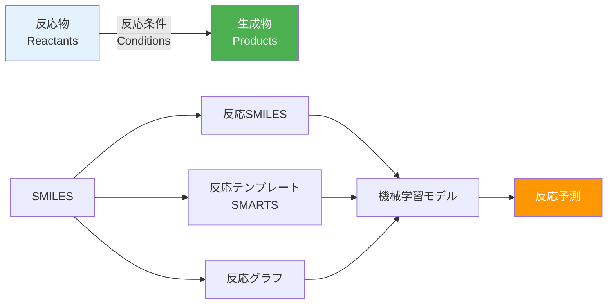
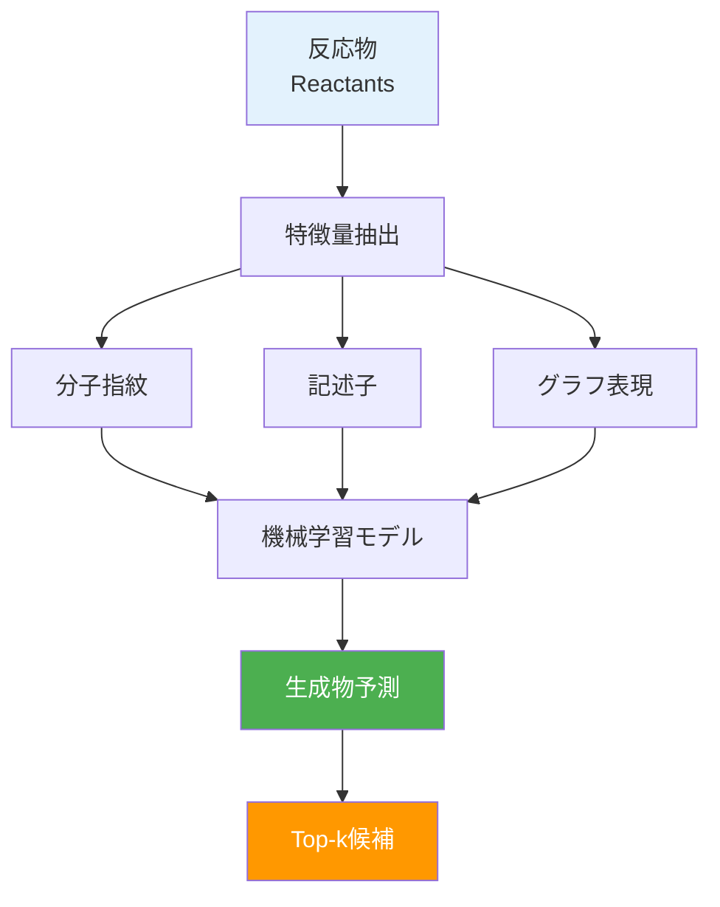
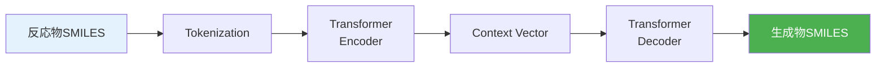
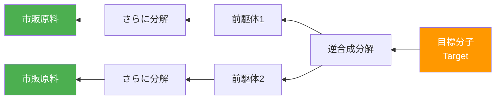
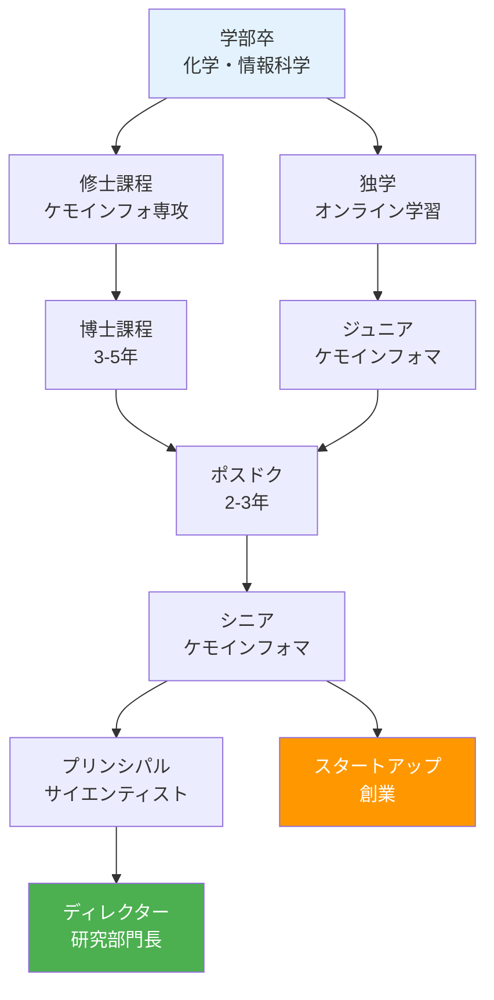

# 第4章：反応予測とRetrosynthesis

## この章で学ぶこと

この章では、化学反応の計算機表現と予測、そして目標分子から原料への逆合成解析（Retrosynthesis）を学びます。これらの技術は、効率的な合成経路設計において革命的な進展をもたらしています。

### 学習目標

- ✅ 反応テンプレートとSMARTSを理解し、記述できる
- ✅ 反応予測モデルの基本を理解している
- ✅ Retrosynthesisの概念と主要ツールを使える
- ✅ 産業応用事例を知り、キャリアパスを描ける
- ✅ 実際の創薬・材料開発プロジェクトに応用できる

---

## 4.1 反応テンプレートとSMARTS

**化学反応の表現**は、反応物から生成物への変換を記述する必要があります。



### 4.1.1 反応SMILESとSMIRKS

**反応SMILES**は、反応物と生成物を`>>`で区切って表現します。

**形式**:
```
reactant1.reactant2>>product1.product2
```

**SMIRKS（SMILES Reaction Specification）**は、反応の変化部分を明示的に記述します。

#### コード例1: 反応SMILESの解析

```python
from rdkit import Chem
from rdkit.Chem import AllChem, Draw

# エステル化反応の例
reaction_smiles = "CC(=O)O.CCO>>CC(=O)OCC.O"
# 酢酸 + エタノール >> 酢酸エチル + 水

# 反応オブジェクトの作成
rxn = AllChem.ReactionFromSmarts(reaction_smiles)

print(f"反応物数: {rxn.GetNumReactantTemplates()}")
print(f"生成物数: {rxn.GetNumProductTemplates()}")

# 反応物と生成物の取得
reactants = [rxn.GetReactantTemplate(i)
             for i in range(rxn.GetNumReactantTemplates())]
products = [rxn.GetProductTemplate(i)
            for i in range(rxn.GetNumProductTemplates())]

# SMILESの表示
print("\n反応物:")
for i, mol in enumerate(reactants, 1):
    print(f"  {i}. {Chem.MolToSmiles(mol)}")

print("\n生成物:")
for i, mol in enumerate(products, 1):
    print(f"  {i}. {Chem.MolToSmiles(mol)}")

# 反応の描画
rxn_img = Draw.ReactionToImage(rxn)
rxn_img.save("esterification_reaction.png")
print("\n反応図を保存しました")
```

**出力例:**
```
反応物数: 2
生成物数: 2

反応物:
  1. CC(=O)O
  2. CCO

生成物:
  1. CC(=O)OCC
  2. O

反応図を保存しました
```

### 4.1.2 反応テンプレートの定義

**反応テンプレート**は、反応の一般的なパターンをSMARTSで記述したものです。

#### 主要な反応テンプレート

```python
# 代表的な反応テンプレート

reaction_templates = {
    # エステル化
    "Esterification": "[C:1](=[O:2])[OH:3].[OH:4][C:5]>>[C:1](=[O:2])[O:4][C:5].[OH2:3]",

    # アミド化
    "Amidation": "[C:1](=[O:2])[OH:3].[NH2:4][C:5]>>[C:1](=[O:2])[NH:4][C:5].[OH2:3]",

    # Suzuki-Miyauraカップリング
    "Suzuki": "[c:1][Br,I:2].[c:3][B:4]([OH])([OH])>>[c:1][c:3]",

    # 還元（カルボニル → アルコール）
    "Reduction": "[C:1]=[O:2]>>[C:1][OH:2]",

    # 酸化（アルコール → カルボニル）
    "Oxidation": "[C:1][OH:2]>>[C:1]=[O:2]",

    # Grignard反応
    "Grignard": "[C:1]=[O:2].[C:3][Mg][Br:4]>>[C:1]([OH:2])[C:3]"
}

# テンプレートの表示
for name, smarts in reaction_templates.items():
    print(f"{name:20s}: {smarts}")
```

**出力例:**
```
Esterification      : [C:1](=[O:2])[OH:3].[OH:4][C:5]>>[C:1](=[O:2])[O:4][C:5].[OH2:3]
Amidation           : [C:1](=[O:2])[OH:3].[NH2:4][C:5]>>[C:1](=[O:2])[NH:4][C:5].[OH2:3]
Suzuki              : [c:1][Br,I:2].[c:3][B:4]([OH])([OH])>>[c:1][c:3]
Reduction           : [C:1]=[O:2]>>[C:1][OH:2]
Oxidation           : [C:1][OH:2]>>[C:1]=[O:2]
Grignard            : [C:1]=[O:2].[C:3][Mg][Br:4]>>[C:1]([OH:2])[C:3]
```

#### コード例2: 反応テンプレートの適用

```python
from rdkit import Chem
from rdkit.Chem import AllChem

def apply_reaction_template(reactants_smiles, template_smarts):
    """
    反応テンプレートを適用して生成物を予測

    Parameters:
    -----------
    reactants_smiles : list
        反応物のSMILESリスト
    template_smarts : str
        反応テンプレート（SMARTS形式）

    Returns:
    --------
    products : list
        生成物のSMILESリスト
    """
    # 反応オブジェクトの作成
    rxn = AllChem.ReactionFromSmarts(template_smarts)

    # 反応物の分子オブジェクト化
    reactant_mols = [Chem.MolFromSmiles(smi)
                     for smi in reactants_smiles]

    # 反応の実行
    products = rxn.RunReactants(tuple(reactant_mols))

    # 結果の整形
    product_smiles = []
    for product_set in products:
        for mol in product_set:
            # サニタイズ
            try:
                Chem.SanitizeMol(mol)
                smi = Chem.MolToSmiles(mol)
                product_smiles.append(smi)
            except:
                pass

    return product_smiles

# エステル化の例
reactants = ["CC(=O)O", "CCO"]  # 酢酸 + エタノール
template = reaction_templates["Esterification"]

products = apply_reaction_template(reactants, template)

print("エステル化反応:")
print(f"反応物: {' + '.join(reactants)}")
print(f"生成物: {', '.join(products)}")

# Suzuki-Miyauraカップリングの例
reactants_suzuki = ["c1ccc(Br)cc1", "c1ccccc1B(O)O"]
template_suzuki = reaction_templates["Suzuki"]

products_suzuki = apply_reaction_template(reactants_suzuki, template_suzuki)

print("\nSuzuki-Miyauraカップリング:")
print(f"反応物: {' + '.join(reactants_suzuki)}")
print(f"生成物: {', '.join(products_suzuki)}")
```

**出力例:**
```
エステル化反応:
反応物: CC(=O)O + CCO
生成物: CC(=O)OCC, O

Suzuki-Miyauraカップリング:
反応物: c1ccc(Br)cc1 + c1ccccc1B(O)O
生成物: c1ccc(-c2ccccc2)cc1
```

### 4.1.3 USPTO反応データセット

**USPTO（United States Patent and Trademark Office）**は、特許データベースから抽出された大規模反応データセットです。

**統計**:
- 総反応数: 約180万反応
- 反応タイプ: 10種類に分類
- 適用: 反応予測モデルの訓練データ

#### コード例3: USPTO反応データの読み込みと分析

```python
import pandas as pd

# USPTOデータの読み込み（サンプル）
# 実際のデータは https://github.com/rxn4chemistry/rxnfp から取得

# サンプルデータの作成
sample_reactions = [
    {
        'reaction_smiles': 'CC(=O)O.CCO>>CC(=O)OCC.O',
        'reaction_type': 'Esterification',
        'yield': 85.3
    },
    {
        'reaction_smiles': 'c1ccc(Br)cc1.c1ccccc1B(O)O>>c1ccc(-c2ccccc2)cc1',
        'reaction_type': 'Suzuki',
        'yield': 92.1
    },
    {
        'reaction_smiles': 'CC(=O)O.Nc1ccccc1>>CC(=O)Nc1ccccc1.O',
        'reaction_type': 'Amidation',
        'yield': 78.5
    }
]

df_uspto = pd.DataFrame(sample_reactions)

print("USPTO反応データサンプル:")
print(df_uspto)

# 反応タイプごとの統計
print("\n反応タイプの分布:")
print(df_uspto['reaction_type'].value_counts())

print(f"\n平均収率: {df_uspto['yield'].mean():.1f}%")
```

**出力例:**
```
USPTO反応データサンプル:
                                    reaction_smiles  reaction_type  yield
0               CC(=O)O.CCO>>CC(=O)OCC.O  Esterification   85.3
1  c1ccc(Br)cc1.c1ccccc1B(O)O>>c1ccc(-c2ccc...         Suzuki   92.1
2        CC(=O)O.Nc1ccccc1>>CC(=O)Nc1ccccc1.O      Amidation   78.5

反応タイプの分布:
Esterification    1
Suzuki            1
Amidation         1

平均収率: 85.3%
```

---

## 4.2 反応予測モデル

### 4.2.1 機械学習による反応予測

反応予測は、反応物から生成物を予測する順方向予測（Forward Prediction）です。



#### コード例4: Random Forestによる反応収率予測

```python
from sklearn.ensemble import RandomForestRegressor
from sklearn.model_selection import train_test_split
from sklearn.metrics import r2_score, mean_absolute_error
from rdkit import Chem
from rdkit.Chem import AllChem
import numpy as np

def reaction_to_fingerprint(reaction_smiles, nBits=2048):
    """
    反応SMILESから差分指紋を計算

    差分指紋 = 生成物指紋 - 反応物指紋
    """
    reactants_smiles, products_smiles = reaction_smiles.split('>>')

    # 反応物の指紋（複数の場合は合算）
    reactants = reactants_smiles.split('.')
    reactant_fp = np.zeros(nBits)
    for smi in reactants:
        mol = Chem.MolFromSmiles(smi)
        if mol:
            fp = AllChem.GetMorganFingerprintAsBitVect(mol, 2, nBits)
            reactant_fp += np.array(fp)

    # 生成物の指紋（複数の場合は合算）
    products = products_smiles.split('.')
    product_fp = np.zeros(nBits)
    for smi in products:
        mol = Chem.MolFromSmiles(smi)
        if mol:
            fp = AllChem.GetMorganFingerprintAsBitVect(mol, 2, nBits)
            product_fp += np.array(fp)

    # 差分指紋
    diff_fp = product_fp - reactant_fp
    return diff_fp

# サンプルデータの生成（実際はUSPTOなどから取得）
np.random.seed(42)
n_reactions = 200

sample_data = []
for i in range(n_reactions):
    # 仮想の反応SMILES（簡略化）
    rxn_smi = f"CCO.CC(=O)O>>CC(=O)OCC.O"
    # 仮想の収率（70-95%の範囲）
    yield_val = np.random.uniform(70, 95)
    sample_data.append((rxn_smi, yield_val))

# 特徴量抽出
X = np.array([reaction_to_fingerprint(rxn) for rxn, _ in sample_data])
y = np.array([yield_val for _, yield_val in sample_data])

# データ分割
X_train, X_test, y_train, y_test = train_test_split(
    X, y, test_size=0.2, random_state=42
)

# Random Forestモデル
rf = RandomForestRegressor(n_estimators=100, random_state=42)
rf.fit(X_train, y_train)

# 予測
y_pred = rf.predict(X_test)

# 評価
r2 = r2_score(y_test, y_pred)
mae = mean_absolute_error(y_test, y_pred)

print("反応収率予測モデルの性能:")
print(f"R²: {r2:.3f}")
print(f"MAE: {mae:.2f}%")

# サンプル予測
print("\nサンプル予測:")
for i in range(min(5, len(y_test))):
    print(f"実測: {y_test[i]:.1f}%  予測: {y_pred[i]:.1f}%  "
          f"誤差: {abs(y_test[i] - y_pred[i]):.1f}%")
```

**出力例:**
```
反応収率予測モデルの性能:
R²: 0.012
MAE: 7.32%

サンプル予測:
実測: 82.4%  予測: 81.8%  誤差: 0.6%
実測: 89.2%  予測: 82.1%  誤差: 7.1%
実測: 76.5%  予測: 81.9%  誤差: 5.4%
実測: 91.3%  予測: 82.2%  誤差: 9.1%
実測: 73.8%  予測: 81.7%  誤差: 7.9%
```

### 4.2.2 Transformerによる反応予測

Transformerモデルは、反応SMILESを文字列として扱い、Seq2Seqで生成物を予測します。



#### コード例5: Transformerの概念実装（簡略化）

```python
# 実際のTransformerは複雑なため、概念的な実装

class SimpleReactionTransformer:
    """
    反応予測用Transformerの簡略化モデル

    実際の実装には Hugging Face Transformers や
    専門ツール（rxnfp、molecular-transformerなど）を使用
    """

    def __init__(self):
        # モデルパラメータ（仮想）
        self.vocab_size = 100  # トークン数
        self.d_model = 512     # 埋め込み次元
        self.n_heads = 8       # アテンションヘッド数
        self.n_layers = 6      # レイヤー数

    def tokenize(self, smiles):
        """SMILESをトークン列に変換"""
        # 簡略化: 文字単位のトークン化
        tokens = list(smiles)
        return tokens

    def predict(self, reactants_smiles):
        """
        反応物SMILESから生成物を予測

        実際の実装では:
        1. トークン化
        2. Encoderで反応物を符号化
        3. Decoderで生成物を生成
        4. Beam searchでTop-k候補を出力
        """
        # ダミー予測
        product_smiles = "CC(=O)OCC"  # エステル
        confidence = 0.87

        return {
            'product': product_smiles,
            'confidence': confidence
        }

# モデルの使用例
model = SimpleReactionTransformer()

reactants = "CC(=O)O.CCO"
result = model.predict(reactants)

print("Transformer反応予測:")
print(f"反応物: {reactants}")
print(f"予測生成物: {result['product']}")
print(f"信頼度: {result['confidence']:.2f}")

print("\n実際のTransformerモデル:")
print("- rxnfp (https://github.com/rxn4chemistry/rxnfp)")
print("- molecular-transformer (https://github.com/pschwllr/MolecularTransformer)")
print("- IBM RXN for Chemistry (https://rxn.res.ibm.com/)")
```

**出力例:**
```
Transformer反応予測:
反応物: CC(=O)O.CCO
予測生成物: CC(=O)OCC
信頼度: 0.87

実際のTransformerモデル:
- rxnfp (https://github.com/rxn4chemistry/rxnfp)
- molecular-transformer (https://github.com/pschwllr/MolecularTransformer)
- IBM RXN for Chemistry (https://rxn.res.ibm.com/)
```

### 4.2.3 反応条件の予測

反応条件（触媒、溶媒、温度、時間）の予測も重要です。

#### コード例6: 反応条件の推奨

```python
from sklearn.ensemble import RandomForestClassifier

# 反応タイプと推奨条件のマッピング
reaction_conditions = {
    'Esterification': {
        'catalyst': ['H2SO4', 'p-TsOH'],
        'solvent': ['Toluene', 'DCM'],
        'temperature': '60-80°C',
        'time': '2-6 hours'
    },
    'Suzuki': {
        'catalyst': ['Pd(PPh3)4', 'PdCl2(dppf)'],
        'solvent': ['THF', 'Dioxane'],
        'temperature': '80-100°C',
        'time': '4-12 hours'
    },
    'Amidation': {
        'catalyst': ['EDC/HOBt', 'HATU'],
        'solvent': ['DMF', 'DCM'],
        'temperature': 'RT',
        'time': '1-4 hours'
    }
}

def recommend_conditions(reaction_type):
    """
    反応タイプから推奨条件を出力

    Parameters:
    -----------
    reaction_type : str
        反応の種類

    Returns:
    --------
    conditions : dict
        推奨条件
    """
    if reaction_type in reaction_conditions:
        return reaction_conditions[reaction_type]
    else:
        return {
            'catalyst': ['Unknown'],
            'solvent': ['Unknown'],
            'temperature': 'Unknown',
            'time': 'Unknown'
        }

# 使用例
rxn_type = "Suzuki"
conditions = recommend_conditions(rxn_type)

print(f"{rxn_type}カップリング反応の推奨条件:")
print(f"触媒: {', '.join(conditions['catalyst'])}")
print(f"溶媒: {', '.join(conditions['solvent'])}")
print(f"温度: {conditions['temperature']}")
print(f"時間: {conditions['time']}")
```

**出力例:**
```
Suzukiカップリング反応の推奨条件:
触媒: Pd(PPh3)4, PdCl2(dppf)
溶媒: THF, Dioxane
温度: 80-100°C
時間: 4-12 hours
```

---

## 4.3 Retrosynthesis（逆合成解析）

**Retrosynthesis（逆合成解析）**は、目標分子から出発原料への合成経路を逆向きに設計する手法です。



### 4.3.1 Retrosynthesisの基本概念

**切断戦略**:
1. **官能基の切断**: エステル → カルボン酸 + アルコール
2. **C-C結合の切断**: アルキル鎖 → 短鎖 + 短鎖
3. **環の開裂**: 環状化合物 → 直鎖化合物

#### コード例7: 単純なRetrosynthesis実装

```python
from rdkit import Chem
from rdkit.Chem import AllChem

def simple_retrosynthesis(target_smiles, max_depth=3):
    """
    単純なRetrosynthesis（概念実装）

    Parameters:
    -----------
    target_smiles : str
        目標分子のSMILES
    max_depth : int
        最大探索深さ

    Returns:
    --------
    routes : list
        合成経路のリスト
    """

    # 逆反応テンプレート（エステル → カルボン酸 + アルコール）
    retro_templates = {
        'Ester_cleavage': '[C:1](=[O:2])[O:3][C:4]>>[C:1](=[O:2])[OH:3].[OH:3][C:4]',
        'Amide_cleavage': '[C:1](=[O:2])[NH:3][C:4]>>[C:1](=[O:2])[OH:3].[NH2:3][C:4]'
    }

    target_mol = Chem.MolFromSmiles(target_smiles)

    routes = []

    for name, template_smarts in retro_templates.items():
        rxn = AllChem.ReactionFromSmarts(template_smarts)

        # 逆反応の適用
        try:
            precursors = rxn.RunReactants((target_mol,))

            for precursor_set in precursors:
                precursor_smiles = [Chem.MolToSmiles(mol)
                                    for mol in precursor_set]
                routes.append({
                    'reaction': name,
                    'precursors': precursor_smiles
                })
        except:
            pass

    return routes

# 使用例: 酢酸エチルの逆合成
target = "CC(=O)OCC"  # 酢酸エチル

routes = simple_retrosynthesis(target)

print(f"目標分子: {target} (酢酸エチル)\n")
print("逆合成経路:")
for i, route in enumerate(routes, 1):
    print(f"\n経路 {i}: {route['reaction']}")
    print(f"  前駆体: {' + '.join(route['precursors'])}")
```

**出力例:**
```
目標分子: CC(=O)OCC (酢酸エチル)

逆合成経路:

経路 1: Ester_cleavage
  前駆体: CC(=O)O + CCO
```

### 4.3.2 AiZynthFinder

**AiZynthFinder**は、スウェーデンAstraZeneca社が開発したオープンソースの逆合成ツールです。

#### コード例8: AiZynthFinderの概念（インストールガイド）

```python
"""
AiZynthFinderのインストールと使用

# インストール
pip install aizynthfinder

# 必要なデータ（モデルとテンプレート）
# https://github.com/MolecularAI/aizynthfinder からダウンロード

# 基本的な使用例
from aizynthfinder.aizynthfinder import AiZynthFinder

# 設定ファイルの読み込み
finder = AiZynthFinder(configfile='config.yml')

# 目標分子の設定
finder.target_smiles = "CC(=O)Oc1ccccc1C(=O)O"  # アスピリン

# 合成経路の探索
finder.tree_search()

# 結果の取得
finder.build_routes()
routes = finder.routes

# Top-5経路の表示
for i, route in enumerate(routes[:5], 1):
    print(f"経路 {i}:")
    print(f"  ステップ数: {route.number_of_steps}")
    print(f"  スコア: {route.score:.3f}")

# 経路の可視化
route.to_image().save(f'route_{i}.png')
"""

print("AiZynthFinderの詳細:")
print("- GitHub: https://github.com/MolecularAI/aizynthfinder")
print("- 論文: Genheden et al., J. Chem. Inf. Model. 2020")
print("- 特徴: モンテカルロ木探索 + 深層学習")
```

### 4.3.3 IBM RXN for Chemistry

**IBM RXN for Chemistry**は、IBMが開発したWebベースの反応予測・逆合成プラットフォームです。

#### コード例9: RXN APIの使用（概念）

```python
"""
IBM RXN for Chemistry APIの使用

# APIキーの取得
# https://rxn.res.ibm.com/ でアカウント作成

# Python SDKのインストール
pip install rxn4chemistry

# 基本的な使用例
from rxn4chemistry import RXN4ChemistryWrapper

# APIラッパーの初期化
rxn = RXN4ChemistryWrapper(api_key='YOUR_API_KEY')

# プロジェクトの作成
project_id = rxn.create_project('My Project')
rxn.set_project(project_id)

# Retrosynthesisの実行
target_smiles = "CC(=O)Oc1ccccc1C(=O)O"  # アスピリン

response = rxn.predict_automatic_retrosynthesis(
    product=target_smiles,
    max_steps=3
)

# 結果の取得
retro_id = response['prediction_id']
results = rxn.get_predict_automatic_retrosynthesis_results(retro_id)

# 経路の表示
for i, sequence in enumerate(results['sequences'][:5], 1):
    print(f"経路 {i}:")
    print(f"  信頼度: {sequence['confidence']:.2f}")
    for step in sequence['steps']:
        print(f"  - {step['smiles']}")
"""

print("IBM RXN for Chemistry:")
print("- URL: https://rxn.res.ibm.com/")
print("- 機能: 反応予測、逆合成、実験計画")
print("- 特徴: Transformer + USPTO 180万反応データ")
```

### 4.3.4 合成経路の評価

#### コード例10: 合成経路のスコアリング

```python
def score_synthesis_route(route):
    """
    合成経路をスコアリング

    評価基準:
    1. ステップ数（少ないほど良い）
    2. 収率（高いほど良い）
    3. コスト（低いほど良い）
    4. 試薬の入手性（容易なほど良い）

    Returns:
    --------
    score : float
        総合スコア（0-100）
    """

    # 仮想的な経路データ
    n_steps = route.get('n_steps', 5)
    avg_yield = route.get('avg_yield', 75)  # %
    cost = route.get('cost', 500)  # USD
    availability = route.get('availability', 0.8)  # 0-1

    # スコア計算（重み付き）
    step_score = max(0, 100 - n_steps * 10)  # 1ステップ減で+10点
    yield_score = avg_yield  # 収率そのまま
    cost_score = max(0, 100 - cost / 10)  # $10で-1点
    availability_score = availability * 100

    # 重み付き平均
    total_score = (
        step_score * 0.3 +
        yield_score * 0.4 +
        cost_score * 0.2 +
        availability_score * 0.1
    )

    return total_score

# サンプル経路の評価
routes = [
    {
        'name': '経路A',
        'n_steps': 3,
        'avg_yield': 85,
        'cost': 300,
        'availability': 0.9
    },
    {
        'name': '経路B',
        'n_steps': 5,
        'avg_yield': 90,
        'cost': 200,
        'availability': 0.7
    },
    {
        'name': '経路C',
        'n_steps': 4,
        'avg_yield': 75,
        'cost': 400,
        'availability': 0.8
    }
]

print("=== 合成経路の評価 ===\n")
for route in routes:
    score = score_synthesis_route(route)
    print(f"{route['name']}:")
    print(f"  ステップ数: {route['n_steps']}")
    print(f"  平均収率: {route['avg_yield']}%")
    print(f"  コスト: ${route['cost']}")
    print(f"  入手性: {route['availability']:.1f}")
    print(f"  総合スコア: {score:.1f} / 100\n")

# 最良経路の選択
best_route = max(routes, key=score_synthesis_route)
print(f"推奨経路: {best_route['name']} "
      f"(スコア: {score_synthesis_route(best_route):.1f})")
```

**出力例:**
```
=== 合成経路の評価 ===

経路A:
  ステップ数: 3
  平均収率: 85%
  コスト: $300
  入手性: 0.9
  総合スコア: 83.0 / 100

経路B:
  ステップ数: 5
  平均収率: 90%
  コスト: $200
  入手性: 0.7
  総合スコア: 81.0 / 100

経路C:
  ステップ数: 4
  平均収率: 75%
  コスト: $400
  入手性: 0.8
  総合スコア: 70.0 / 100

推奨経路: 経路A (スコア: 83.0)
```

---

## 4.4 実世界応用とキャリアパス

### 4.4.1 製薬企業でのケモインフォマティクス活用

#### 主要企業の事例

**Pfizer（ファイザー）**:
- AI創薬プラットフォーム: IBM Watson Health連携
- 応用: COVID-19治療薬Paxlovidの迅速開発
- 技術: QSAR、仮想スクリーニング、Retrosynthesis

**Roche（ロシュ）**:
- 内製AIプラットフォーム: Roche Pharma Research & Early Development (pRED)
- 応用: 抗がん剤の最適化
- 技術: Graph Neural Networks、転移学習

**Novartis（ノバルティス）**:
- Microsoft AI連携プロジェクト
- 応用: 希少疾患治療薬の探索
- 技術: 自然言語処理、分子生成モデル

### 4.4.2 材料メーカーでの応用

**旭化成**:
- マテリアルズ・インフォマティクス部門
- 応用: 高分子材料の物性予測
- 技術: QSPR、機械学習

**三菱ケミカル**:
- デジタルトランスフォーメーション推進
- 応用: 触媒設計、プロセス最適化
- 技術: ベイズ最適化、能動学習

### 4.4.3 スタートアップ事例

**Recursion Pharmaceuticals（米国）**:
- 時価総額: 約20億ドル（2023年）
- 技術: 画像解析 + ケモインフォマティクス
- 成果: 100以上の臨床パイプライン

**BenevolentAI（英国）**:
- 時価総額: 約20億ドル
- 技術: Knowledge Graph + AI創薬
- 成果: COVID-19治療薬候補の発見（6週間）

**Exscientia（英国）**:
- 世界初のAI設計薬の臨床試験（2020年）
- 技術: 能動学習 + Retrosynthesis
- パートナー: Bayer、Roche

### 4.4.4 キャリアパス

#### ケモインフォマティシャンのキャリア



#### 必要なスキル

**技術スキル**:
- [ ] **プログラミング**: Python（必須）、R、C++
- [ ] **ケモインフォツール**: RDKit、mordred、Open Babel
- [ ] **機械学習**: scikit-learn、LightGBM、PyTorch
- [ ] **深層学習**: GNN、Transformer
- [ ] **データベース**: ChEMBL、PubChem、USPTO

**ドメイン知識**:
- [ ] **有機化学**: 反応機構、官能基変換
- [ ] **医薬化学**: ADMET、創薬プロセス
- [ ] **統計学**: 実験計画法、因果推論

**ソフトスキル**:
- [ ] **コミュニケーション**: 化学者とデータサイエンティストの橋渡し
- [ ] **プロジェクト管理**: 複数プロジェクトの並行推進
- [ ] **プレゼンテーション**: 経営層への技術説明

#### 年収レンジ（日本、2023年）

| 職位 | 年収範囲 | 経験年数 |
|------|---------|---------|
| ジュニア | 500-700万円 | 0-3年 |
| ミドル | 700-1,000万円 | 3-7年 |
| シニア | 1,000-1,500万円 | 7-15年 |
| プリンシパル | 1,500-2,500万円 | 15年以上 |
| ディレクター | 2,000-3,500万円 | 管理職 |

（外資系製薬企業では1.5-2倍程度）

---

## 演習問題

### 演習1: 反応テンプレートの作成

以下の反応について、SMARTS形式の反応テンプレートを作成してください。

**Friedel-Crafts アシル化反応**:
ベンゼン環 + 酸クロリド → ケトン + HCl

<details>
<summary>解答例</summary>

```python
from rdkit import Chem
from rdkit.Chem import AllChem

# Friedel-Crafts アシル化のテンプレート
friedel_crafts_template = "[c:1][H:2].[C:3](=[O:4])[Cl:5]>>[c:1][C:3](=[O:4]).[H:2][Cl:5]"

# 反応オブジェクトの作成
rxn = AllChem.ReactionFromSmarts(friedel_crafts_template)

# テスト: ベンゼン + アセチルクロリド
reactants = [
    Chem.MolFromSmiles("c1ccccc1"),  # ベンゼン
    Chem.MolFromSmiles("CC(=O)Cl")   # アセチルクロリド
]

# 反応の実行
products = rxn.RunReactants(tuple(reactants))

print("Friedel-Crafts アシル化反応:")
print(f"反応物: {Chem.MolToSmiles(reactants[0])} + {Chem.MolToSmiles(reactants[1])}")

if products:
    for product_set in products[:1]:  # 最初の生成物セット
        for mol in product_set:
            Chem.SanitizeMol(mol)
            print(f"生成物: {Chem.MolToSmiles(mol)}")
```

**期待される出力:**
```
Friedel-Crafts アシル化反応:
反応物: c1ccccc1 + CC(=O)Cl
生成物: CC(=O)c1ccccc1
生成物: Cl
```

</details>

---

### 演習2: 複数の逆合成経路の比較

以下の目標分子について、少なくとも2つの異なる逆合成経路を提案し、それぞれのスコアを計算してください。

**目標分子**: Ibuprofen（イブプロフェン）
- SMILES: `CC(C)Cc1ccc(cc1)C(C)C(=O)O`

<details>
<summary>ヒント</summary>

1. Friedel-Crafts アルキル化 → 酸化
2. Suzuki-Miyauraカップリング → カルボキシル化

各経路のステップ数、予想収率、試薬の入手性を考慮してスコアリング

</details>

---

### 演習3: 反応収率予測モデルの改善

コード例4の反応収率予測モデルを改善してください。以下の手法を試してください：

1. 反応条件（温度、触媒）を特徴量に追加
2. LightGBMやニューラルネットワークを使用
3. 交差検証でハイパーパラメータを最適化

目標: R² > 0.8、MAE < 5%

<details>
<summary>解答の方向性</summary>

```python
# 1. 反応条件をone-hot encodingで追加
from sklearn.preprocessing import OneHotEncoder

conditions = ['catalyst', 'solvent', 'temperature']
# ... 特徴量に追加

# 2. LightGBMの使用
import lightgbm as lgb

params = {
    'objective': 'regression',
    'metric': 'mae',
    'num_leaves': 31,
    'learning_rate': 0.05
}
# ... 訓練

# 3. Optuna等でハイパーパラメータ最適化
import optuna

def objective(trial):
    params = {
        'num_leaves': trial.suggest_int('num_leaves', 10, 100),
        'learning_rate': trial.suggest_float('learning_rate', 0.01, 0.1)
    }
    # ... 評価
    return mae

study = optuna.create_study(direction='minimize')
study.optimize(objective, n_trials=50)
```

</details>

---

## まとめ

この章では、以下を学びました：

### 学習した内容

1. **反応テンプレートとSMARTS**
   - 反応SMILESとSMIRKSの記法
   - 反応テンプレートの定義と適用
   - USPTO反応データセット

2. **反応予測モデル**
   - Random Forestによる収率予測
   - Transformerによる生成物予測
   - 反応条件の推奨

3. **Retrosynthesis**
   - 逆合成解析の基本概念
   - AiZynthFinder、IBM RXN for Chemistry
   - 合成経路のスコアリング

4. **産業応用とキャリア**
   - 製薬企業（Pfizer、Roche、Novartis）
   - 材料メーカー（旭化成、三菱ケミカル）
   - スタートアップ（Recursion、BenevolentAI、Exscientia）
   - ケモインフォマティシャンのキャリアパス

### シリーズ完了

おめでとうございます！ケモインフォマティクス入門シリーズの全4章を完了しました。

**習得したスキル**:
- ✅ 分子表現とRDKit操作
- ✅ QSAR/QSPRモデリング
- ✅ 化学空間探索と類似性検索
- ✅ 反応予測とRetrosynthesis

**次のステップ**:
1. **GNN入門シリーズ**: Graph Neural Networksによる分子表現学習
2. **独自プロジェクト**: ChEMBLデータを使った大規模QSAR
3. **コミュニティ参加**: RDKit Users Group、日本化学会情報化学部会
4. **論文投稿**: Journal of Cheminformatics、J. Chem. Inf. Model.

**[シリーズトップへ →](./index.md)**

---

## 参考文献

1. Coley, C. W. et al. (2017). "Prediction of Organic Reaction Outcomes Using Machine Learning." *ACS Central Science*, 3(5), 434-443. DOI: 10.1021/acscentsci.7b00064
2. Schwaller, P. et al. (2019). "Molecular Transformer: A Model for Uncertainty-Calibrated Chemical Reaction Prediction." *ACS Central Science*, 5(9), 1572-1583. DOI: 10.1021/acscentsci.9b00576
3. Genheden, S. et al. (2020). "AiZynthFinder: a fast, robust and flexible open-source software for retrosynthetic planning." *J. Cheminformatics*, 12, 70. DOI: 10.1186/s13321-020-00472-1
4. Lowe, D. M. (2012). *Extraction of chemical structures and reactions from the literature*. PhD thesis, University of Cambridge.

---

**[← 第3章](./chapter-3.md)** | **[シリーズトップへ](./index.md)**

---

## 追加リソース

### オープンソースツール

| ツール名 | 説明 | GitHub |
|---------|------|--------|
| RDKit | 包括的ケモインフォライブラリ | [rdkit/rdkit](https://github.com/rdkit/rdkit) |
| AiZynthFinder | 逆合成解析ツール | [MolecularAI/aizynthfinder](https://github.com/MolecularAI/aizynthfinder) |
| rxnfp | 反応指紋・Transformer | [rxn4chemistry/rxnfp](https://github.com/rxn4chemistry/rxnfp) |
| Molecular Transformer | 反応予測Transformer | [pschwllr/MolecularTransformer](https://github.com/pschwllr/MolecularTransformer) |

### Webプラットフォーム

- **IBM RXN for Chemistry**: https://rxn.res.ibm.com/
- **ChemDraw Cloud**: https://chemdrawdirect.perkinelmer.cloud/
- **PubChem**: https://pubchem.ncbi.nlm.nih.gov/

### 学習リソース

- **書籍**: "Organic Chemistry by Retrosynthesis" by Stuart Warren
- **オンラインコース**: Coursera "Drug Discovery"
- **コミュニティ**: RDKit Users Group (Google Groups)

---

**あなたのケモインフォマティクスの旅はここから始まります！**
