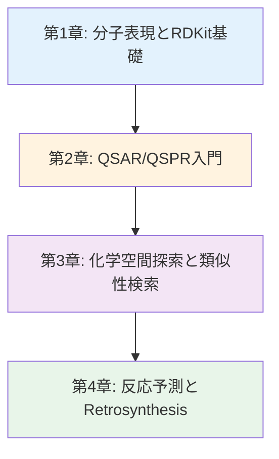
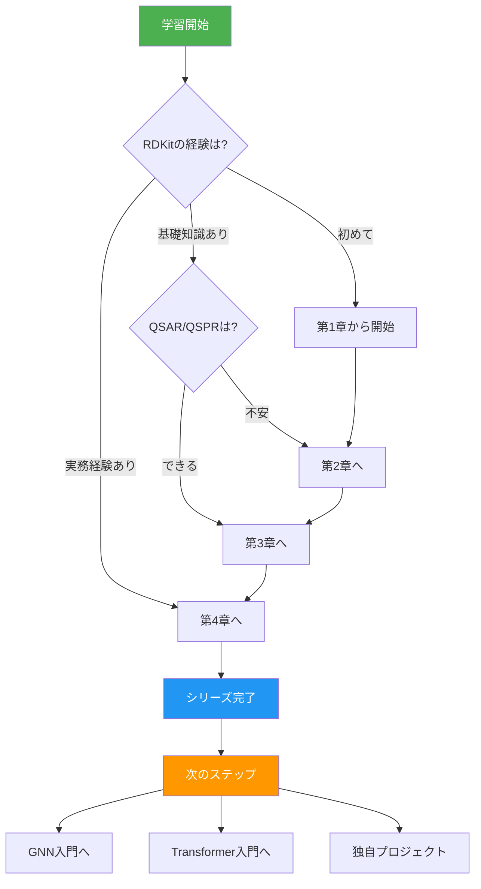
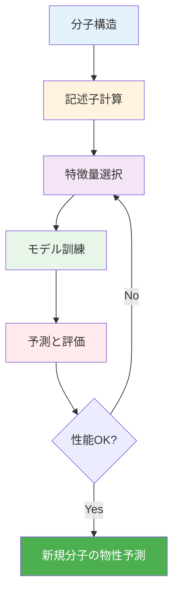
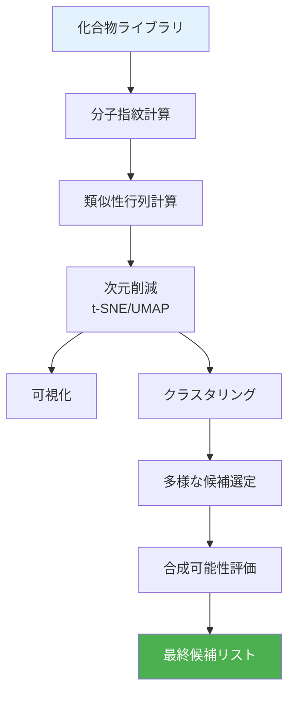
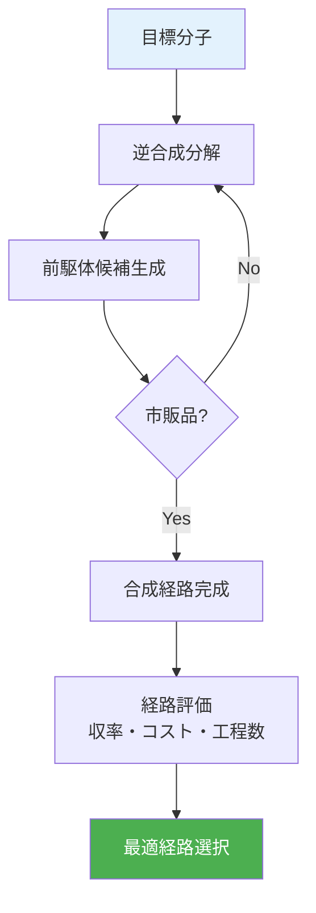
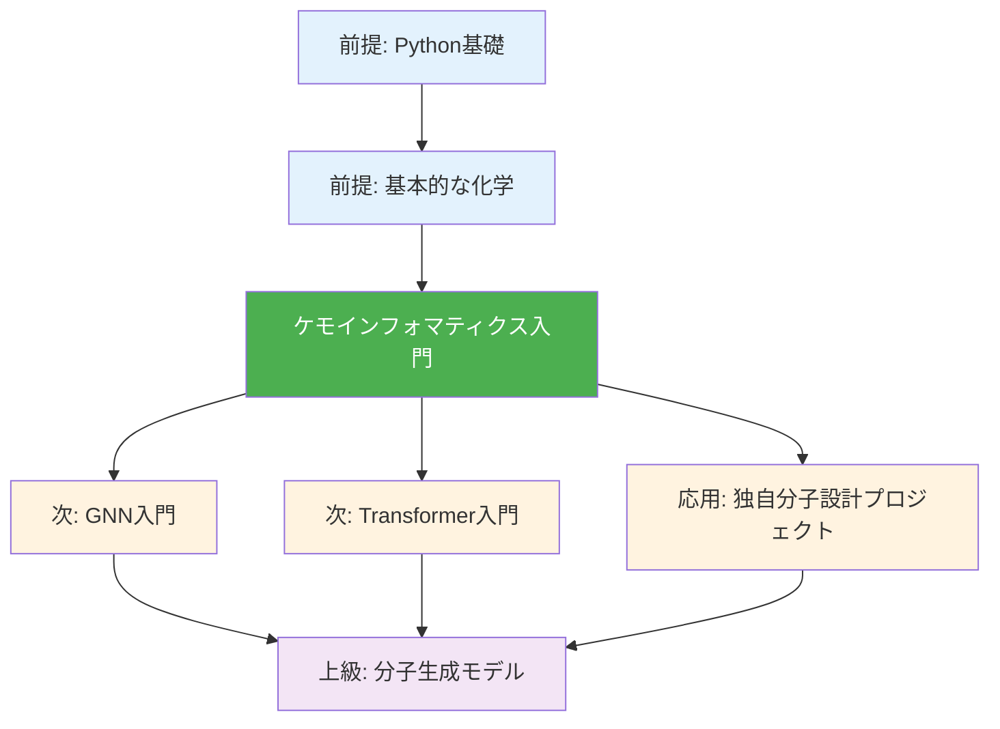

---
# ============================================
# ケモインフォマティクス入門シリーズ v1.0
# ============================================

# --- 基本情報 ---
title: "ケモインフォマティクス入門シリーズ v1.0"
subtitle: "分子設計とデータ駆動創薬・有機材料開発"
series: "ケモインフォマティクス入門シリーズ v1.0"
series_id: "chemoinformatics-introduction"
version: "1.0"

# --- 分類・難易度 ---
category: "practical-technology"
level: "beginner-to-intermediate"
difficulty: "初級〜中級"
target_audience: "undergraduate-graduate-professionals"

# --- 学習メタデータ ---
total_reading_time: "100-120分"
total_chapters: 4
total_code_examples: 38
total_exercises: 16
case_studies: 6

# --- 日付情報 ---
created_at: "2025-10-17"
updated_at: "2025-10-17"

# --- 前提知識 ---
prerequisites:
  - "python-basics"
  - "chemistry-basics"
  - "data-science-basics"

# --- 関連シリーズ ---
related_series:
  - "mi-introduction"
  - "gnn-introduction"
  - "data-driven-materials-introduction"

# --- 応用分野 ---
applications:
  - "drug-discovery"
  - "organic-materials-design"
  - "catalyst-screening"
  - "polymer-design"
  - "virtual-screening"

# --- 主要ツール ---
tools:
  - "RDKit"
  - "mordred"
  - "scikit-learn"
  - "pandas"
  - "matplotlib"
  - "seaborn"

# --- 著者情報 ---
authors:
  - name: "Dr. Yusuke Hashimoto"
    affiliation: "Tohoku University"
    email: "yusuke.hashimoto.b8@tohoku.ac.jp"

# --- ライセンス ---
license: "CC BY 4.0"
language: "ja"

---

# ケモインフォマティクス入門シリーズ v1.0

**分子設計とデータ駆動創薬・有機材料開発**

## シリーズ概要

このシリーズは、ケモインフォマティクス（化学情報学）を初めて学ぶ方から、実践的な分子設計スキルを身につけたい方まで、段階的に学べる全4章構成の教育コンテンツです。

ケモインフォマティクスは、化学とデータサイエンスの融合分野であり、創薬、有機材料開発、触媒設計、高分子設計など、あらゆる分子関連研究で必須のスキルとなっています。分子構造から物性を予測し、望ましい特性を持つ新規分子を設計する技術は、研究開発の効率化と革新的材料の発見に直結します。

### なぜこのシリーズが必要か

**背景と課題**:
化学空間は無限に広大です。炭素、窒素、酸素など主要な10元素だけで構成可能な分子数は10^60以上と推定され、すべてを合成・評価することは不可能です。従来の試行錯誤的な分子設計では、1つの有望な化合物を見つけるのに数年から十年かかることも珍しくありません。医薬品開発では、1つの承認薬を生み出すのに平均10年以上、1,000億円以上のコストがかかります。

**このシリーズで学べること**:
本シリーズでは、分子の計算機表現から物性予測、化学空間探索、反応予測まで、ケモインフォマティクスの基礎から実践までを体系的に学習します。RDKitによる分子操作、QSAR/QSPRモデリング、類似性検索、逆合成解析など、実務で即戦力となるスキルを習得できます。

**特徴:**
- ✅ **段階的な構成**: 各章は独立した記事として読むことができ、全4章で包括的な内容をカバー
- ✅ **実践重視**: 38個の実行可能なコード例、6つの詳細なケーススタディ
- ✅ **化学・材料特化**: 創薬だけでなく有機材料、触媒、高分子への応用に焦点
- ✅ **最新技術**: RDKit、mordred、機械学習など業界標準ツールを網羅
- ✅ **キャリア支援**: 具体的なキャリアパスと学習ロードマップを提供
- ✅ **Google Colab対応**: すべてのコード例がブラウザで実行可能

**総学習時間**: 100-120分（コード実行と演習を含む）

**対象者**:
- 有機化学・材料科学の学部生・大学院生（計算化学を学びたい方）
- 創薬・材料開発の研究者（データ駆動型手法を取り入れたい方）
- データサイエンティスト（化学・材料分野への応用を目指す方）
- ケムインフォマティシャンを目指す方

---

## 学習の進め方

### 推奨学習順序



**初学者の方（ケモインフォマティクスをまったく知らない）:**
- 第1章 → 第2章 → 第3章 → 第4章（全章推奨）
- 所要時間: 100-120分
- 前提知識: 基本的な有機化学、Python基礎

**中級者の方（RDKitの経験あり）:**
- 第2章 → 第3章 → 第4章
- 所要時間: 75-90分
- 第1章はスキップ可能

**実践的スキル強化（理論より実装重視）:**
- 第3章（集中学習） → 第4章
- 所要時間: 50-65分
- 理論は必要に応じて第2章を参照

### 学習フローチャート



---

## 各章の詳細

### [第1章：分子表現とRDKit基礎](./chapter-1.md)

**難易度**: 入門
**読了時間**: 25-30分
**コード例**: 10個

#### 学習内容

1. **ケモインフォマティクスとは何か**
   - 定義：化学×情報科学の融合分野
   - 応用分野：創薬、有機材料、触媒、高分子
   - マテリアルズ・インフォマティクス（MI）との違いと相補性
   - 歴史的背景と現在の重要性

2. **分子表現法の基礎**
   - SMILES記法：線形文字列表現（例: CCO = エタノール）
   - InChI/InChIKey：標準化された表現と識別子
   - 分子グラフ：原子=ノード、結合=エッジ
   - 3D構造：立体化学と配座の重要性

3. **RDKitの基本操作**
   - インストールと環境構築（conda/pip/Colab）
   - 分子の読み込みと描画
   - 部分構造検索（SMARTS）
   - 分子の編集と変換
   - 基本的な化学的性質の計算

4. **ケーススタディ：医薬品データベース検索**
   - ChEMBL/PubChemからのデータ取得
   - SMILES検証とサニタイゼーション
   - 分子の可視化と構造確認
   - 基本的な分子記述子の計算

#### 学習目標

この章を読むことで、以下を習得できます：

- ✅ ケモインフォマティクスの定義と応用分野を説明できる
- ✅ SMILES、InChI、分子グラフなど主要な分子表現法を理解している
- ✅ RDKitで分子を読み込み、描画、編集できる
- ✅ 部分構造検索（SMARTS）を実行できる
- ✅ 医薬品データベースから分子情報を取得・処理できる

#### この章で扱う主要な概念

- **SMILES（Simplified Molecular Input Line Entry System）**: 分子を文字列で表現
- **InChI（International Chemical Identifier）**: 標準化された分子識別子
- **分子グラフ**: 分子をノードとエッジで表現
- **SMARTS**: 部分構造検索のためのパターンマッチング記法

**[第1章を読む →](./chapter-1.md)**

---

### [第2章：QSAR/QSPR入門 - 物性予測の基礎](./chapter-2.md)

**難易度**: 初級〜中級
**読了時間**: 25-30分
**コード例**: 12個

#### 学習内容

1. **分子記述子の計算**
   - 1D記述子：分子量、logP、TPSA（極性表面積）
   - 2D記述子：Morgan指紋、MACCS鍵、分子グラフ記述子
   - 3D記述子：WHIM、RDF記述子、立体配座依存記述子
   - mordredによる包括的記述子計算（1,800種類以上）

2. **QSAR/QSPR モデリング**
   - 定義：構造-活性相関（QSAR）、構造-物性相関（QSPR）
   - 線形モデル（Ridge、Lasso、ElasticNet）
   - 非線形モデル（Random Forest、LightGBM、XGBoost）
   - モデル評価：R²、RMSE、MAE、交差検証

3. **特徴量選択と解釈**
   - 相関分析による冗長性除去
   - 再帰的特徴量削除（RFE）
   - SHAP/LIMEによる特徴量重要度
   - どの部分構造が物性に寄与するか

4. **ケーススタディ：溶解度予測**
   - ESOL（Estimated Solubility）データセット
   - 記述子計算からモデル訓練まで
   - 予測と実測の比較
   - 外れ値分析と改善

#### 学習目標

この章を読むことで、以下を習得できます：

- ✅ 1D/2D/3D分子記述子の種類と使い分けを理解している
- ✅ mordredで包括的な記述子を計算できる
- ✅ QSAR/QSPRモデルを構築し、評価できる
- ✅ 特徴量選択と解釈により、構造-物性相関を理解できる
- ✅ 溶解度予測など実データに機械学習を適用できる

#### QSAR/QSPRワークフロー図



**[第2章を読む →](./chapter-2.md)**

---

### [第3章：化学空間探索と類似性検索](./chapter-3.md)

**難易度**: 中級
**読了時間**: 25-30分
**コード例**: 11個

#### 学習内容

1. **分子類似性の定義**
   - Tanimoto係数：指紋ベース類似度
   - Dice係数、Cosine類似度
   - 構造類似性 vs 物性類似性
   - 類似性の閾値設定と妥当性

2. **化学空間の可視化**
   - t-SNE/UMAPによる2D投影
   - PCA（主成分分析）
   - クラスタリング（K-means、DBSCAN、階層的）
   - 多様性分析とカバレッジ評価

3. **仮想スクリーニング**
   - ライブラリからの候補選定
   - ファーマコフォアモデリング
   - ドッキングシミュレーション
   - hit-to-leadプロセス

4. **ケーススタディ：新規触媒候補の探索**
   - 既知触媒の類似化合物検索
   - 化学空間における多様性確保
   - 合成可能性の評価（SAスコア）
   - 候補化合物のランキング

#### 学習目標

この章を読むことで、以下を習得できます：

- ✅ 分子類似性の定義と計算方法を理解している
- ✅ t-SNE/UMAPで化学空間を可視化できる
- ✅ クラスタリングで分子を分類できる
- ✅ 仮想スクリーニングで候補分子を効率的に探索できる
- ✅ 合成可能性を考慮した現実的な候補選定ができる

#### 化学空間探索のワークフロー



**[第3章を読む →](./chapter-3.md)**

---

### [第4章：反応予測とRetrosynthesis](./chapter-4.md)

**難易度**: 中級〜上級
**読了時間**: 25-30分
**コード例**: 10個

#### 学習内容

1. **反応テンプレートとSMARTS**
   - 反応の形式的記述
   - テンプレートマッチング
   - USPTO反応データセット
   - 反応分類と一般性

2. **反応予測モデル**
   - Seq2Seq/Transformer for reactions
   - 反応条件の予測
   - 収率予測
   - 副生成物の予測

3. **Retrosynthesis（逆合成解析）**
   - 目標分子から原料への分解
   - AiZynthFinder: テンプレートベース逆合成
   - RXN for Chemistry: IBMの逆合成プラットフォーム
   - 合成経路の最適化とスコアリング

4. **実世界応用とキャリアパス**
   - 製薬企業でのCI活用（Pfizer、Roche、Novartis）
   - 材料メーカーでの応用（旭化成、三菱ケミカル）
   - スタートアップ事例（Recursion、BenevolentAI）
   - キャリアパス：ケモインフォマティシャン、創薬AI研究者

#### 学習目標

この章を読むことで、以下を習得できます：

- ✅ 反応テンプレートとSMARTSを理解し、記述できる
- ✅ 反応予測モデルの基本を理解している
- ✅ Retrosynthesisの概念と主要ツールを使える
- ✅ 産業応用事例を知り、キャリアパスを描ける
- ✅ 実際の創薬・材料開発プロジェクトに応用できる

#### Retrosynthesisワークフロー



**[第4章を読む →](./chapter-4.md)**

---

## 全体の学習成果

このシリーズを完了すると、以下のスキルと知識を習得できます：

### 知識レベル（Understanding）

- ✅ ケモインフォマティクスの定義と応用分野を説明できる
- ✅ 分子表現法（SMILES、InChI、分子グラフ）を理解している
- ✅ QSAR/QSPRの原理と応用を理解している
- ✅ 化学空間探索の手法を説明できる
- ✅ Retrosynthesisの概念と主要ツールを知っている

### 実践スキル（Doing）

- ✅ RDKitで分子を操作・可視化できる
- ✅ mordredで包括的な分子記述子を計算できる
- ✅ QSAR/QSPRモデルを構築し、評価できる
- ✅ 分子類似性検索と仮想スクリーニングができる
- ✅ 化学空間を可視化し、多様な候補を選定できる
- ✅ 反応テンプレートを理解し、逆合成解析の基礎ができる

### 応用力（Applying）

- ✅ 新しい創薬・材料開発問題に適切な手法を選択できる
- ✅ 産業界での導入事例を評価し、自分の研究に適用できる
- ✅ ケモインフォマティクスツールを組み合わせたワークフローを構築できる

---

## 推奨学習パターン

### パターン1: 完全習得（初学者向け）

**対象**: ケモインフォマティクスを初めて学ぶ方
**期間**: 1-2週間
**進め方**:

```
Week 1:
- Day 1-2: 第1章（分子表現とRDKit）
- Day 3-4: 第2章（QSAR/QSPR）
- Day 5-7: 第2章演習問題、記述子の深掘り

Week 2:
- Day 1-3: 第3章（化学空間探索）
- Day 4-5: 第4章（反応予測とRetrosynthesis）
- Day 6-7: 総合プロジェクト
```

**成果物**:
- 溶解度予測プロジェクト
- 化学空間可視化レポート
- 個人ポートフォリオ（GitHubリポジトリ）

### パターン2: 速習（経験者向け）

**対象**: Pythonと化学の基礎を持つ方
**期間**: 3-5日
**進め方**:

```
Day 1: 第1章（RDKit基礎の確認）
Day 2: 第2章（QSAR/QSPRモデリング）
Day 3: 第3章（化学空間探索と仮想スクリーニング）
Day 4: 第4章（反応予測とRetrosynthesis）
Day 5: 独自プロジェクト開始
```

**成果物**:
- 複数モデルの性能比較レポート
- 独自分子設計プロジェクト（GitHub公開）

### パターン3: ピンポイント学習

**対象**: 特定のスキルを強化したい方
**期間**: 柔軟
**選択例**:

- **分子記述子と物性予測** → 第2章
- **仮想スクリーニング** → 第3章
- **逆合成解析** → 第4章
- **産業応用事例** → 第4章（Section 4.4）

---

## FAQ（よくある質問）

### Q1: 有機化学の知識がなくても理解できますか？

**A**: 第1章は基本的な化学知識（原子、結合、分子の概念）があれば理解できます。第2章以降は有機化学の基礎（官能基、反応性、極性）の理解が推奨されますが、必要な概念は章内で説明します。高度な有機化学の知識は不要です。

### Q2: プログラミング経験がなくても大丈夫ですか？

**A**: **Python基礎**（変数、関数、リスト、for文）の理解が必要です。完全な初心者の場合は、先にPython入門チュートリアル（1-2日）を完了することをお勧めします。各コード例は丁寧にコメントされているため、基礎があればフォローできます。

### Q3: どの章から読むべきですか？

**A**: **初めての方は第1章から順番に読むことを強く推奨**します。第1章でRDKitの基礎を習得することで、第2章以降のコードがスムーズに理解できます。RDKit経験者は第2章から始めることも可能です。

### Q4: コードを実際に動かす必要がありますか？

**A**: **強く推奨**します。ケモインフォマティクスは実践的スキルのため、読むだけと実行するのでは習得度が大きく異なります。Google Colab（無料、インストール不要）から始めてください。

### Q5: どれくらいの期間で習得できますか？

**A**: 学習時間と目標によります：
- **概念理解のみ**: 1-2日（第1章、第2章）
- **基本的な実装スキル**: 1週間（第1-3章）
- **実践的なプロジェクト遂行能力**: 2週間（全章 + プロジェクト）
- **業務レベルのスキル**: 1-3ヶ月（シリーズ完了 + 独自プロジェクト）

### Q6: RDKitとmordred、どちらを学ぶべきですか？

**A**: **両方とも重要**です。RDKitは分子操作と基本記述子計算、mordredは包括的な記述子計算に特化しています。本シリーズでは両方を学ぶため、実際のプロジェクトで適切に使い分けられるようになります。

### Q7: ケモインフォマティクスはどんな仕事に活かせますか？

**A**: 以下のキャリアパスがあります：
- **製薬企業**: 創薬研究者、ケモインフォマティシャン
- **化学メーカー**: 材料開発研究者、プロセス最適化エンジニア
- **スタートアップ**: AI創薬、材料設計、触媒開発
- **アカデミア**: 計算化学研究者、ケモインフォマティクス研究者
- **CRO/受託研究**: データサイエンティスト、ケモインフォマティクスコンサルタント

### Q8: マテリアルズ・インフォマティクス（MI）との違いは？

**A**: **ケモインフォマティクス（CI）**は分子レベル（有機化合物、医薬品、有機材料）に焦点を当て、**マテリアルズ・インフォマティクス（MI）**は材料全般（無機材料、合金、セラミックス）を対象とします。両者は相補的であり、有機材料開発では両方のスキルが求められます。

### Q9: このシリーズの後、何を学ぶべきですか？

**A**: 以下の学習パスを推奨します：

**パスA: GNNによる分子表現学習**
```
このシリーズ完了
  ↓
GNN入門（Graph Neural Networks）
  ↓
分子生成モデル
  ↓
独自の分子設計プラットフォーム開発
```

**パスB: Transformerによる反応予測**
```
このシリーズ完了
  ↓
Transformer入門
  ↓
Seq2Seqによる反応予測
  ↓
大規模言語モデルの化学応用
```

**パスC: 実験とのクローズドループ**
```
このシリーズ完了
  ↓
ロボティクス実験自動化入門
  ↓
クローズドループ分子設計
  ↓
自律合成システム
```

### Q10: 質問や議論できるコミュニティはありますか？

**A**: 以下のコミュニティで質問や議論ができます：
- **日本**: 日本化学会情報化学部会、日本薬学会情報部会
- **国際**: ACS (American Chemical Society), RSC (Royal Society of Chemistry)
- **オンライン**:
  - RDKit Users Group（Google Groups）
  - Stack Overflow（`rdkit`、`cheminformatics`タグ）
  - Reddit: r/cheminformatics、r/chemistry

---

## 前提知識と関連シリーズ

### 前提知識

**必須**:
- [ ] **Python基礎**: 変数、関数、リスト、for文、NumPy基礎
- [ ] **基本的な化学**: 原子、結合、分子、官能基

**推奨**:
- [ ] **有機化学基礎**: 反応機構、極性、芳香族性（推奨だが必須ではない）
- [ ] **機械学習基礎**: 回帰、分類、交差検証（あれば理解が深まる）

### 関連シリーズ

1. **MI入門（マテリアルズ・インフォマティクス入門）** (入門)
   - 内容: 材料科学とデータサイエンスの融合
   - リンク: [../mi-introduction/index.md](../mi-introduction/index.md)
   - **推奨度**: ⭐⭐⭐⭐（MIとの違いを理解）

2. **GNN入門（Graph Neural Networks入門）** (中級)
   - 内容: グラフニューラルネットワークによる分子表現学習
   - リンク: [../gnn-introduction/index.md](../gnn-introduction/index.md)
   - **推奨度**: ⭐⭐⭐⭐⭐（次のステップとして最適）

3. **Transformer入門** (中級)
   - 内容: Transformerによる反応予測
   - リンク: [../transformer-introduction/index.md](../transformer-introduction/index.md)

### 学習パス全体図



---

## ツールとリソース

### 主要ツール

| ツール名 | 用途 | ライセンス | インストール |
|---------|------|----------|-------------|
| RDKit | 分子操作・可視化 | BSD | `conda install -c conda-forge rdkit` |
| mordred | 包括的記述子計算 | BSD-3 | `pip install mordred` |
| scikit-learn | 機械学習 | BSD-3 | `pip install scikit-learn` |
| pandas | データ管理 | BSD-3 | `pip install pandas` |
| matplotlib | 可視化 | PSF | `pip install matplotlib` |
| seaborn | 統計的可視化 | BSD-3 | `pip install seaborn` |
| umap-learn | 次元削減 | BSD-3 | `pip install umap-learn` |

### データベース

| データベース名 | 説明 | データ数 | アクセス |
|--------------|------|---------|---------|
| ChEMBL | 生物活性分子データ | 2,100,000+ | [ebi.ac.uk/chembl](https://www.ebi.ac.uk/chembl/) |
| PubChem | 化合物データベース | 110,000,000+ | [pubchem.ncbi.nlm.nih.gov](https://pubchem.ncbi.nlm.nih.gov/) |
| ZINC | 市販化合物ライブラリ | 1,000,000,000+ | [zinc15.docking.org](https://zinc15.docking.org/) |
| USPTO | 反応データベース | 1,800,000+ | [patents.google.com](https://patents.google.com/) |

### 学習リソース

**オンラインコース**:
- [Cheminformatics: Navigating the world of chemical data](https://www.coursera.org/learn/cheminformatics) by Coursera
- [Drug Discovery](https://www.edx.org/course/drug-discovery) by edX
- [Applied Computational Thinking with Python](https://www.edx.org/course/applied-computational-thinking-with-python) by MIT

**書籍**:
- "Chemoinformatics and Computational Chemical Biology" by Jürgen Bajorath (ISBN: 978-1588297815)
- "Introduction to Cheminformatics" by Johann Gasteiger and Thomas Engel (ISBN: 978-3527331499)
- "Molecular Descriptors for Chemoinformatics" by Roberto Todeschini and Viviana Consonni (ISBN: 978-3527318520)

**論文・レビュー**:
- Walters, W. P., & Barzilay, R. (2021). "Applications of deep learning in molecule generation and molecular property prediction." *Accounts of Chemical Research*, 54(2), 263-270. DOI: 10.1021/acs.accounts.0c00699
- Coley, C. W. et al. (2019). "A graph-convolutional neural network model for the prediction of chemical reactivity." *Chemical Science*, 10(2), 370-377. DOI: 10.1039/C8SC04228D
- Chen, H. et al. (2020). "The rise of deep learning in drug discovery." *Drug Discovery Today*, 23(6), 1241-1250. DOI: 10.1016/j.drudis.2018.01.039

**コミュニティ**:
- RDKit Users Group: Google Groups - [groups.google.com/g/rdkit-discuss](https://groups.google.com/g/rdkit-discuss)
- Cheminformatics Stack Exchange: Q&A - [chemistry.stackexchange.com](https://chemistry.stackexchange.com/)
- OpenSMILES: 分子表現標準化コミュニティ - [opensmiles.org](http://opensmiles.org/)

---

## 次のステップ

### シリーズ完了後の推奨アクション

**Immediate（1-2週間以内）:**
1. ✅ GitHubにポートフォリオを作成
2. ✅ 溶解度予測プロジェクトの結果をREADME付きで公開
3. ✅ LinkedInプロフィールに「ケモインフォマティクス」スキルを追加
4. ✅ Qiita/Zennで学習記事を1本執筆

**Short-term（1-3ヶ月）:**
1. ✅ GNN入門シリーズに進む
2. ✅ 独自の分子設計プロジェクトを実行
3. ✅ 日本化学会情報化学部会の勉強会に参加
4. ✅ Kaggleコンペ（分子物性予測）に参加
5. ✅ ChEMBL/PubChemデータを使った大規模プロジェクト

**Medium-term（3-6ヶ月）:**
1. ✅ ケモインフォマティクスの主要論文を10本精読
2. ✅ オープンソース（RDKit、mordred）にコントリビュート
3. ✅ 国内学会で発表（日本化学会、日本薬学会）
4. ✅ 製薬企業・化学メーカーでインターンシップ参加
5. ✅ 分子生成モデルのプロジェクト

**Long-term（1年以上）:**
1. ✅ 国際学会で発表（ACS、RSC）
2. ✅ 査読付き論文を投稿（Journal of Cheminformatics、Journal of Chemical Information and Modeling）
3. ✅ ケモインフォマティシャンとして就職
4. ✅ 次世代を育成（勉強会、ワークショップ開催）
5. ✅ OSSプロジェクトをリード（新しいケモインフォマティクスツール開発）

---

## フィードバックとサポート

### このシリーズについて

このシリーズは、東北大学 Dr. Yusuke Hashimoto のもと、AI寺子屋（AI Terakoya）プロジェクトの一環として作成されました。

**プロジェクト**: AI寺子屋（AI Terakoya）
**作成日**: 2025-10-17
**バージョン**: 1.0
**言語**: 日本語

### フィードバックをお待ちしています

**報告したいこと**:
- ✏️ **誤字・脱字**: GitHubリポジトリのIssue
- 💡 **改善提案**: 新トピック、コード例追加、ケーススタディ追加
- ❓ **質問**: 理解が難しかった部分、追加説明が欲しい箇所
- 🎉 **成功事例**: このシリーズで作ったプロジェクト、実際の分子設計への応用
- 🐛 **コードの不具合**: 動作しないコード例、エラーメッセージ

**連絡方法**:
- **GitHub Issues**: [リポジトリURL]/issues
- **Email**: yusuke.hashimoto.b8@tohoku.ac.jp

---

## ライセンスと利用規約

**CC BY 4.0**（Creative Commons Attribution 4.0 International）

### 可能なこと

- ✅ 自由な閲覧・ダウンロード
- ✅ 教育目的での利用（大学講義、企業研修）
- ✅ 改変・二次創作
- ✅ 商業利用（クレジット表示必要）
- ✅ 再配布

### 条件

- 📌 著者クレジット表示: "Dr. Yusuke Hashimoto, Tohoku University - AI Terakoya"
- 📌 改変の明記（改変した場合）
- 📌 ライセンス継承（派生コンテンツも CC BY 4.0）

### 引用方法

```
Hashimoto, Y. (2025). ケモインフォマティクス入門シリーズ v1.0.
AI Terakoya, Tohoku University.
Retrieved from [URL]
```

BibTeX:
```bibtex
@misc{hashimoto2025chemoinformatics,
  author = {Hashimoto, Yusuke},
  title = {ケモインフォマティクス入門シリーズ},
  year = {2025},
  publisher = {AI Terakoya, Tohoku University},
  url = {[URL]},
  note = {Version 1.0}
}
```

詳細: [CC BY 4.0](https://creativecommons.org/licenses/by/4.0/deed.ja)

---

## さあ、始めましょう！

準備はできましたか？ 第1章から始めて、ケモインフォマティクスで分子設計を革新する旅を始めましょう！

**[第1章: 分子表現とRDKit基礎 →](./chapter-1.md)**

または、[学習の進め方](#学習の進め方)に戻って自分に合った学習パスを確認してください。

---

## 更新履歴

| バージョン | 日付 | 変更内容 | 著者 |
|----------|------|---------|------|
| 1.0 | 2025-10-17 | 初版公開 | Dr. Yusuke Hashimoto |

---

**あなたのケモインフォマティクス学習の旅はここから始まります！**
