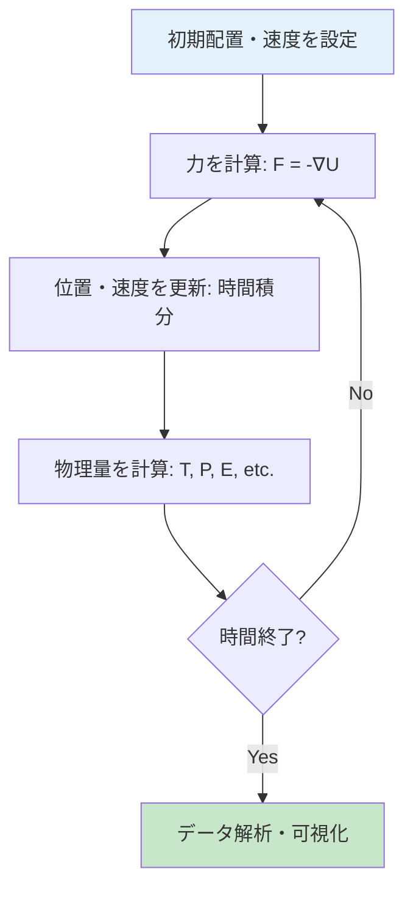

# 第3章：分子動力学（MD）シミュレーション

## 学習目標

この章を読むことで、以下を習得できます：
- MDシミュレーションの基本原理（ニュートン運動方程式、時間積分）を理解する
- 力場（Force Field）とポテンシャルの概念を理解する
- 統計アンサンブル（NVE、NVT、NPT）の違いを説明できる
- LAMMPSで基本的なMDシミュレーションを実行できる
- Ab Initio MD（AIMD）とClassical MDの違いを理解する

---

## 3.1 分子動力学の基本原理

### ニュートンの運動方程式

MDシミュレーションの核心は、古典力学の**ニュートンの運動方程式**です：

$$
m_i \frac{d^2 \mathbf{r}_i}{dt^2} = \mathbf{F}_i = -\nabla_i U(\mathbf{r}_1, \mathbf{r}_2, \ldots, \mathbf{r}_N)
$$

- $m_i$: 原子$i$の質量
- $\mathbf{r}_i$: 原子$i$の位置
- $\mathbf{F}_i$: 原子$i$に働く力
- $U(\mathbf{r}_1, \ldots, \mathbf{r}_N)$: ポテンシャルエネルギー

### MDシミュレーションの手順



**時間ステップ**: 典型的には$\Delta t = 0.5$-$2$ fs（フェムト秒、$10^{-15}$秒）

---

## 3.2 時間積分アルゴリズム

### Verlet法（最も基本的）

位置のTaylor展開：

$$
\mathbf{r}(t + \Delta t) = \mathbf{r}(t) + \mathbf{v}(t)\Delta t + \frac{1}{2}\mathbf{a}(t)\Delta t^2 + O(\Delta t^3)
$$

$$
\mathbf{r}(t - \Delta t) = \mathbf{r}(t) - \mathbf{v}(t)\Delta t + \frac{1}{2}\mathbf{a}(t)\Delta t^2 + O(\Delta t^3)
$$

2式を足すと：

$$
\mathbf{r}(t + \Delta t) = 2\mathbf{r}(t) - \mathbf{r}(t - \Delta t) + \mathbf{a}(t)\Delta t^2
$$

**特徴**:
- ✅ シンプル、メモリ効率良い
- ✅ 時間反転対称性を保つ
- ❌ 速度が陽に現れない

### Velocity Verlet法（最もよく使われる）

$$
\mathbf{r}(t + \Delta t) = \mathbf{r}(t) + \mathbf{v}(t)\Delta t + \frac{1}{2}\mathbf{a}(t)\Delta t^2
$$

$$
\mathbf{v}(t + \Delta t) = \mathbf{v}(t) + \frac{1}{2}[\mathbf{a}(t) + \mathbf{a}(t + \Delta t)]\Delta t
$$

**特徴**:
- ✅ 位置と速度を同時に更新
- ✅ エネルギー保存が良い
- ✅ 最も広く使われる

### Leap-frog法

$$
\mathbf{v}(t + \frac{\Delta t}{2}) = \mathbf{v}(t - \frac{\Delta t}{2}) + \mathbf{a}(t)\Delta t
$$

$$
\mathbf{r}(t + \Delta t) = \mathbf{r}(t) + \mathbf{v}(t + \frac{\Delta t}{2})\Delta t
$$

位置と速度が半時間ステップずれる「跳び石」のような動き。

### Pythonでの実装例

```python
import numpy as np
import matplotlib.pyplot as plt

def lennard_jones(r, epsilon=1.0, sigma=1.0):
    """Lennard-Jonesポテンシャル"""
    return 4 * epsilon * ((sigma/r)**12 - (sigma/r)**6)

def lj_force(r, epsilon=1.0, sigma=1.0):
    """Lennard-Jonesポテンシャルの力"""
    return 24 * epsilon * (2*(sigma/r)**13 - (sigma/r)**7) / r

def velocity_verlet_md(N_steps=1000, dt=0.001):
    """
    Velocity Verlet法による1次元MDシミュレーション
    2つのLennard-Jones粒子
    """
    # 初期条件
    r = np.array([0.0, 2.0])  # 位置
    v = np.array([0.5, -0.5])  # 速度
    m = np.array([1.0, 1.0])  # 質量

    # 履歴保存用
    r_history = np.zeros((N_steps, 2))
    v_history = np.zeros((N_steps, 2))
    E_history = np.zeros(N_steps)

    for step in range(N_steps):
        # 力の計算
        r12 = r[1] - r[0]
        F = lj_force(abs(r12))
        a = np.array([-F/m[0], F/m[1]])  # 加速度

        # 位置の更新
        r = r + v * dt + 0.5 * a * dt**2

        # 新しい力の計算
        r12_new = r[1] - r[0]
        F_new = lj_force(abs(r12_new))
        a_new = np.array([-F_new/m[0], F_new/m[1]])

        # 速度の更新
        v = v + 0.5 * (a + a_new) * dt

        # エネルギー計算
        KE = 0.5 * np.sum(m * v**2)
        PE = lennard_jones(abs(r12_new))
        E_total = KE + PE

        # 保存
        r_history[step] = r
        v_history[step] = v
        E_history[step] = E_total

    return r_history, v_history, E_history

# シミュレーション実行
r_hist, v_hist, E_hist = velocity_verlet_md(N_steps=5000, dt=0.001)

# プロット
fig, axes = plt.subplots(2, 2, figsize=(12, 10))
time = np.arange(len(r_hist)) * 0.001

# 位置
axes[0,0].plot(time, r_hist[:, 0], label='Particle 1')
axes[0,0].plot(time, r_hist[:, 1], label='Particle 2')
axes[0,0].set_xlabel('Time')
axes[0,0].set_ylabel('Position')
axes[0,0].set_title('Particle Positions')
axes[0,0].legend()
axes[0,0].grid(alpha=0.3)

# 速度
axes[0,1].plot(time, v_hist[:, 0], label='Particle 1')
axes[0,1].plot(time, v_hist[:, 1], label='Particle 2')
axes[0,1].set_xlabel('Time')
axes[0,1].set_ylabel('Velocity')
axes[0,1].set_title('Particle Velocities')
axes[0,1].legend()
axes[0,1].grid(alpha=0.3)

# エネルギー保存
axes[1,0].plot(time, E_hist)
axes[1,0].set_xlabel('Time')
axes[1,0].set_ylabel('Total Energy')
axes[1,0].set_title('Energy Conservation (NVE)')
axes[1,0].grid(alpha=0.3)

# 相空間軌道
axes[1,1].plot(r_hist[:, 0] - r_hist[:, 1], v_hist[:, 0], alpha=0.5)
axes[1,1].set_xlabel('Relative Position')
axes[1,1].set_ylabel('Velocity 1')
axes[1,1].set_title('Phase Space Trajectory')
axes[1,1].grid(alpha=0.3)

plt.tight_layout()
plt.savefig('md_verlet.png', dpi=150)
plt.show()

print(f"エネルギー変動: {np.std(E_hist):.6f} (理想的には0に近い)")
```

**実行結果**: エネルギー変動 < $10^{-6}$（エネルギー保存則が良好）

---

## 3.3 力場（Force Field）とポテンシャル

### Lennard-Jonesポテンシャル

最も基本的な2体ポテンシャル：

$$
U_{\text{LJ}}(r) = 4\epsilon \left[\left(\frac{\sigma}{r}\right)^{12} - \left(\frac{\sigma}{r}\right)^6\right]
$$

- $\epsilon$: ポテンシャルの深さ（結合エネルギー）
- $\sigma$: 平衡距離のスケール
- $r^{-12}$: 短距離斥力（Pauli斥力）
- $r^{-6}$: 長距離引力（van der Waals力）

**用途**: 希ガス（Ar, Ne）、粗視化モデル

### 多体ポテンシャル

**Embedded Atom Method (EAM)** - 金属向け:

$$
U_{\text{EAM}} = \sum_i F_i(\rho_i) + \frac{1}{2}\sum_{i \neq j} \phi_{ij}(r_{ij})
$$

- $F_i(\rho_i)$: 埋め込みエネルギー（電子密度$\rho_i$の関数）
- $\phi_{ij}(r_{ij})$: 対ポテンシャル

**Tersoff/Brenner** - 共有結合系（C, Si, Ge）:

$$
U_{\text{Tersoff}} = \sum_i \sum_{j>i} [f_R(r_{ij}) - b_{ij} f_A(r_{ij})]
$$

$b_{ij}$は結合次数（bond order）、周囲の環境に依存。

### 水の力場

**TIP3P**（3点電荷モデル）:
- O原子に負電荷$-0.834e$
- 各H原子に正電荷$+0.417e$
- Lennard-Jonesポテンシャル（O-O間のみ）

**特徴**:
- ✅ 計算が高速
- ✅ 液体水の密度・拡散係数を再現
- ❌ 氷の構造は不正確

---

## 3.4 統計アンサンブル

### NVE（微小正準）アンサンブル

**条件**: 粒子数$N$、体積$V$、エネルギー$E$が一定（孤立系）

**実装**: 時間積分のみ（熱浴なし）

**用途**:
- エネルギー保存のテスト
- 理論的基礎研究

### NVT（正準）アンサンブル

**条件**: 粒子数$N$、体積$V$、温度$T$が一定（熱浴と接触）

**Nosé-Hoover熱浴**:

$$
\frac{d\mathbf{r}_i}{dt} = \mathbf{v}_i
$$

$$
\frac{d\mathbf{v}_i}{dt} = \frac{\mathbf{F}_i}{m_i} - \zeta \mathbf{v}_i
$$

$$
\frac{d\zeta}{dt} = \frac{1}{Q}\left(\sum_i m_i v_i^2 - 3NkT\right)
$$

- $\zeta$: 熱浴変数（摩擦係数のような役割）
- $Q$: 熱浴の「質量」（緩和時間を制御）

**用途**:
- 平衡状態の熱力学量計算
- 相転移の研究

### NPT（等温等圧）アンサンブル

**条件**: 粒子数$N$、圧力$P$、温度$T$が一定（熱浴＋圧力浴）

**Parrinello-Rahman法**: セルの形状とサイズが変動

**用途**:
- 実験条件との直接比較
- 格子定数の計算
- 相転移（固-液など）

### 比較表

| アンサンブル | 保存量 | 変動量 | 用途 |
|-----------|--------|--------|------|
| NVE | $N, V, E$ | $T, P$ | 孤立系、検証 |
| NVT | $N, V, T$ | $E, P$ | 熱平衡状態 |
| NPT | $N, P, T$ | $E, V$ | 実験条件再現 |

---

## 3.5 LAMMPSによる実践

### LAMMPSとは

**LAMMPS**（Large-scale Atomic/Molecular Massively Parallel Simulator）:
- Sandia National Laboratoryが開発
- オープンソース、無料
- 並列計算に最適化（数億原子スケール可能）

### Example 1: Arガスの平衡化（NVT）

```bash
# LAMMPS入力ファイル: ar_nvt.in

# 初期設定
units lj                    # Lennard-Jones単位系
atom_style atomic
dimension 3
boundary p p p              # 周期境界条件

# 系の作成
region box block 0 10 0 10 0 10
create_box 1 box
create_atoms 1 random 100 12345 box

# 質量設定
mass 1 1.0

# ポテンシャル
pair_style lj/cut 2.5
pair_coeff 1 1 1.0 1.0 2.5  # epsilon, sigma, cutoff

# 初期速度（温度1.0に対応）
velocity all create 1.0 87287 dist gaussian

# NVT設定（Nosé-Hoover）
fix 1 all nvt temp 1.0 1.0 0.1

# 時間ステップ
timestep 0.005

# 熱力学出力
thermo 100
thermo_style custom step temp press pe ke etotal vol density

# トラジェクトリ保存
dump 1 all custom 1000 ar_nvt.lammpstrj id type x y z vx vy vz

# 実行
run 10000

# 終了
write_data ar_nvt_final.data
```

**実行**:
```bash
lammps -in ar_nvt.in
```

### Example 2: Pythonから LAMMPSを制御

```python
from lammps import lammps
import numpy as np
import matplotlib.pyplot as plt

# LAMMPSインスタンス
lmp = lammps()

# 入力ファイルを実行
lmp.file('ar_nvt.in')

# 熱力学データの抽出
temps = lmp.extract_compute("thermo_temp", 0, 0)
press = lmp.extract_compute("thermo_press", 0, 0)

print(f"平衡温度: {temps:.3f} (目標: 1.0)")
print(f"平衡圧力: {press:.3f}")

# 動径分布関数（RDF）の計算
lmp.command("compute myRDF all rdf 100")
lmp.command("fix 2 all ave/time 100 1 100 c_myRDF[*] file ar_rdf.dat mode vector")
lmp.command("run 5000")

# RDFの読み込みとプロット
rdf_data = np.loadtxt('ar_rdf.dat')
r = rdf_data[:, 1]
g_r = rdf_data[:, 2]

plt.figure(figsize=(8, 6))
plt.plot(r, g_r, linewidth=2)
plt.xlabel('r (σ)', fontsize=12)
plt.ylabel('g(r)', fontsize=12)
plt.title('Radial Distribution Function (Ar gas)', fontsize=14)
plt.grid(alpha=0.3)
plt.savefig('ar_rdf.png', dpi=150)
plt.show()

lmp.close()
```

---

### Example 3: 水分子のMDシミュレーション（TIP3P）

```bash
# water_nvt.in

units real                  # 実単位系 (Å, fs, kcal/mol)
atom_style full
dimension 3
boundary p p p

# データファイル読み込み（水分子216個）
read_data water_box.data

# TIP3P水モデル
pair_style lj/cut/coul/long 10.0
pair_coeff 1 1 0.102 3.188   # O-O
pair_coeff * 2 0.0 0.0       # H原子はLJなし
kspace_style pppm 1e-4       # 長距離クーロン（Ewald和）

# 結合・角度
bond_style harmonic
bond_coeff 1 450.0 0.9572    # O-H結合
angle_style harmonic
angle_coeff 1 55.0 104.52    # H-O-H角度

# SHAKE制約（O-H結合を固定）
fix shake all shake 0.0001 20 0 b 1 a 1

# NVT（300K）
fix 1 all nvt temp 300.0 300.0 100.0

# 時間ステップ
timestep 1.0  # 1 fs

# 出力
thermo 100
dump 1 all custom 1000 water.lammpstrj id mol type x y z

# 実行（100 ps）
run 100000
```

**拡散係数の計算**:
```python
import numpy as np
from MDAnalysis import Universe
import matplotlib.pyplot as plt

# トラジェクトリ読み込み
u = Universe('water_box.data', 'water.lammpstrj', format='LAMMPSDUMP')

# 酸素原子のみ選択
oxygens = u.select_atoms('type 1')

# 平均二乗変位（MSD）の計算
n_frames = len(u.trajectory)
msd = np.zeros(n_frames)

for i, ts in enumerate(u.trajectory):
    if i == 0:
        r0 = oxygens.positions.copy()
    dr = oxygens.positions - r0
    msd[i] = np.mean(np.sum(dr**2, axis=1))

# 時間軸（fs）
time = np.arange(n_frames) * 1.0

# プロット
plt.figure(figsize=(8, 6))
plt.plot(time/1000, msd, linewidth=2)
plt.xlabel('Time (ps)', fontsize=12)
plt.ylabel('MSD (Ų)', fontsize=12)
plt.title('Mean Square Displacement (H₂O)', fontsize=14)
plt.grid(alpha=0.3)
plt.savefig('water_msd.png', dpi=150)
plt.show()

# 拡散係数の計算（Einstein関係式）
# MSD = 6Dt → D = slope / 6
slope = np.polyfit(time[len(time)//2:], msd[len(time)//2:], 1)[0]
D = slope / 6 / 1000  # Ų/ps → 10⁻⁵ cm²/s
print(f"拡散係数: {D:.2f} × 10⁻⁵ cm²/s")
print(f"実験値: 2.30 × 10⁻⁵ cm²/s (300K)")
```

---

## 3.6 Ab Initio MD（AIMD）

### Classical MD vs Ab Initio MD

| 項目 | Classical MD | Ab Initio MD |
|------|-------------|--------------|
| **力の計算** | 経験的ポテンシャル（力場） | DFT計算（第一原理） |
| **精度** | 力場に依存 | 量子力学的に正確 |
| **計算コスト** | 低い（$\sim$1 ns/day） | 極めて高い（$\sim$10 ps/day） |
| **系のサイズ** | 数百万原子 | 数百原子 |
| **用途** | 大規模系、長時間 | 化学反応、電子状態 |

### Born-Oppenheimer MD（BOMD）

各時間ステップでDFT計算を実行：

```
1. 原子配置 R(t) を与える
2. DFT計算で基底状態エネルギー E(R(t)) を計算
3. 力 F = -∇E を計算
4. ニュートン方程式で R(t+Δt) を計算
5. 1に戻る
```

### GPAWによるAIMD実装例

```python
from ase import Atoms
from ase.md.velocitydistribution import MaxwellBoltzmannDistribution
from ase.md.verlet import VelocityVerlet
from ase import units
from gpaw import GPAW, PW

# 水分子の作成
h2o = Atoms('H2O',
            positions=[[0.00, 0.00, 0.00],
                       [0.96, 0.00, 0.00],
                       [0.24, 0.93, 0.00]])
h2o.center(vacuum=5.0)

# DFT計算機（力場の代わり）
calc = GPAW(mode=PW(400),
            xc='PBE',
            txt='h2o_aimd.txt')

h2o.calc = calc

# 初期速度（300K）
MaxwellBoltzmannDistribution(h2o, temperature_K=300)

# Velocity Verlet MD
dyn = VelocityVerlet(h2o, timestep=1.0*units.fs,
                     trajectory='h2o_aimd.traj')

# 10 ps実行（実際には非常に時間がかかる）
def print_energy(a=h2o):
    epot = a.get_potential_energy()
    ekin = a.get_kinetic_energy()
    print(f"Time: {dyn.get_time()/units.fs:.1f} fs, "
          f"Epot: {epot:.3f} eV, "
          f"Ekin: {ekin:.3f} eV, "
          f"Etot: {epot+ekin:.3f} eV")

dyn.attach(print_energy, interval=10)
dyn.run(100)  # 100ステップ = 100 fs
```

**用途**:
- 化学反応の研究
- 相転移のメカニズム
- 力場が存在しない新規材料

---

## 3.7 本章のまとめ

### 学んだこと

1. **MDの基本原理**
   - ニュートン運動方程式
   - 時間積分アルゴリズム（Verlet、Velocity Verlet、Leap-frog）
   - エネルギー保存則

2. **力場とポテンシャル**
   - Lennard-Jones（希ガス）
   - EAM（金属）
   - Tersoff/Brenner（共有結合系）
   - TIP3P（水）

3. **統計アンサンブル**
   - NVE（微小正準）
   - NVT（正準、Nosé-Hoover熱浴）
   - NPT（等温等圧、Parrinello-Rahman）

4. **LAMMPSによる実践**
   - 入力ファイルの作成
   - 平衡化シミュレーション
   - 動径分布関数、拡散係数

5. **Ab Initio MD**
   - Classical MDとの違い
   - Born-Oppenheimer MD
   - GPAWでの実装

### 重要なポイント

- MDは古典力学に基づく
- 時間ステップは約1 fs
- 統計アンサンブルで実験条件を再現
- 力場の選択が精度を決める
- AIMDは精度が高いが計算コスト大

### 次の章へ

第4章では、格子振動（フォノン）と熱力学特性の計算を学びます。

---

## 演習問題

### 問題1（難易度：easy）

Velocity Verlet法とLeap-frog法の違いを説明してください。

<details>
<summary>解答例</summary>

**Velocity Verlet法**:
- 位置$\mathbf{r}$と速度$\mathbf{v}$を同じ時刻$t$で更新
- 速度は現在と次時刻の加速度の平均を使用
- 熱力学量（温度、運動エネルギー）が直接計算可能

**Leap-frog法**:
- 位置$\mathbf{r}(t)$と速度$\mathbf{v}(t+\Delta t/2)$が半時間ステップずれる
- 「跳び石」のように交互に更新
- 熱力学量を計算するには速度の補間が必要

**どちらも**:
- エネルギー保存性は同等
- 2次精度（$O(\Delta t^2)$）
- 時間反転対称性を持つ

</details>

### 問題2（難易度：medium）

NVTアンサンブルとNPTアンサンブルをいつ使うべきか、具体例とともに説明してください。

<details>
<summary>解答例</summary>

**NVTアンサンブル（N, V, T一定）**:

**使用場面**:
- 固体の熱力学特性（比熱、熱膨張係数）
- 液体の構造因子、動径分布関数
- 表面・界面のシミュレーション（体積固定）
- 特定の密度での挙動を調べたい場合

**具体例**:
- Si結晶の300Kでの原子振動
- 水溶液中のタンパク質の構造揺らぎ
- リチウムイオン電池電解液の輸送特性

**NPTアンサンブル（N, P, T一定）**:

**使用場面**:
- 実験条件（1気圧、室温など）との直接比較
- 相転移（固-液、液-気）
- 格子定数の計算
- 密度の温度・圧力依存性

**具体例**:
- 1気圧、300Kでの液体水の密度計算
- 高圧下での材料の構造変化
- 熱膨張係数の計算
- 氷の融解シミュレーション

**判断基準**:
- 実験が定圧条件 → NPT
- 理論研究で密度固定 → NVT
- 相転移の研究 → NPT（体積変化を観測）

</details>

### 問題3（難易度：hard）

Classical MDとAb Initio MDの計算コストの違いを、100原子系で見積もってください。各MDステップでDFT計算にかかる時間が1秒とします。

<details>
<summary>解答例</summary>

**前提条件**:
- 系: 100原子
- 時間ステップ: $\Delta t = 1$ fs
- DFT計算: 1ステップあたり1秒

**Classical MD**:

力の計算: 力場（解析式）
- Lennard-Jonesの場合: $O(N^2)$ または $O(N)$（カットオフ使用）
- 1ステップの計算時間: $\sim 10^{-3}$ 秒（100原子程度）

**シミュレーション時間**:
- 1 ns（ナノ秒）= $10^6$ fs = $10^6$ステップ
- 総計算時間: $10^6 \times 10^{-3}$ 秒 = 1000秒 ≈ **17分**

**Ab Initio MD (AIMD)**:

力の計算: DFT（SCF計算）
- 1ステップの計算時間: 1秒（前提）

**シミュレーション時間**:
- 10 ps（ピコ秒）= $10^4$ fs = $10^4$ステップ
- 総計算時間: $10^4 \times 1$ 秒 = 10000秒 ≈ **2.8時間**

**比較**:

| 項目 | Classical MD | AIMD |
|------|-------------|------|
| 1ステップ計算時間 | 0.001秒 | 1秒 |
| 到達可能時間 | 1 ns (17分) | 10 ps (2.8時間) |
| **時間スケール比** | **100倍長い** | - |
| **計算コスト比** | 1 | **1000倍** |

**結論**:
- AIMDは1ステップあたり約1000倍遅い
- 同じ計算時間で、Classical MDは100倍長い時間をシミュレート可能
- AIMDは化学反応（ps-nsスケール）には適用可能
- 拡散過程（nsスケール以上）にはClassical MDが必須

**実用的戦略**:
1. AIMDで短時間シミュレーション（10-100 ps）
2. AIMDの結果から力場（Machine Learning Potential）を訓練
3. MLPを使ったClassical MDで長時間シミュレーション（ns-μs）

→ 第5章でMLPについて詳しく学びます！

</details>

---

## 参考文献

1. Frenkel, D., & Smit, B. (2001). *Understanding Molecular Simulation: From Algorithms to Applications* (2nd ed.). Academic Press.

2. Haile, J. M. (1992). *Molecular Dynamics Simulation: Elementary Methods*. Wiley-Interscience.

3. Plimpton, S. (1995). "Fast Parallel Algorithms for Short-Range Molecular Dynamics." *Journal of Computational Physics*, 117(1), 1-19.
   DOI: [10.1006/jcph.1995.1039](https://doi.org/10.1006/jcph.1995.1039)

4. LAMMPS Documentation: https://docs.lammps.org/
5. ASE-MD Documentation: https://wiki.fysik.dtu.dk/ase/ase/md.html

---

## 著者情報

**作成者**: MI Knowledge Hub Content Team
**監修**: Dr. Yusuke Hashimoto（東北大学）
**作成日**: 2025-10-17
**バージョン**: 1.0
**シリーズ**: 計算材料科学基礎入門 v1.0

**ライセンス**: Creative Commons BY-NC-SA 4.0
