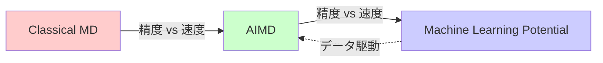
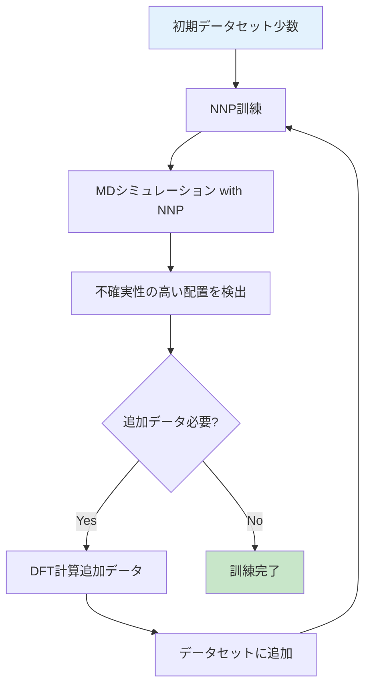
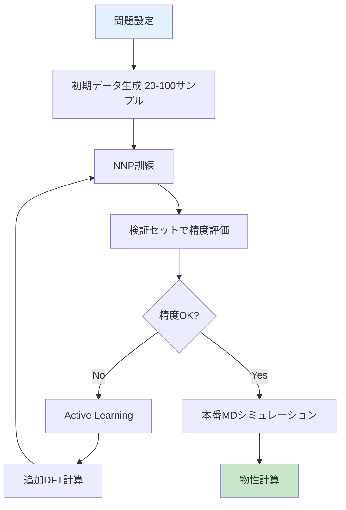

# 第5章：第一原理計算と機械学習の統合

## 学習目標

この章を読むことで、以下を習得できます：
- 機械学習ポテンシャル（MLP）の基本概念を理解する
- Classical MD、AIMD、MLPの違いと使い分けを説明できる
- DFT計算データからニューラルネットワークポテンシャルを訓練できる
- Active Learningによる効率的データ生成戦略を理解する
- 最新のUniversal MLPやFoundation Modelsのトレンドを把握する

---

## 5.1 なぜMachine Learning Potentialが必要か

### 3つの計算手法の比較



| 項目 | Classical MD | AIMD（DFT-MD） | MLP-MD |
|------|-------------|--------------|--------|
| **力の計算** | 経験的力場 | DFT（第一原理） | 機械学習モデル |
| **精度** | 中（力場に依存） | 高（量子力学的） | 高（DFT同等） |
| **計算速度** | 超高速（ns/日） | 極めて遅い（ps/日） | 高速（ns/日） |
| **系のサイズ** | 数百万原子 | 数百原子 | 数千〜数万原子 |
| **適用範囲** | 訓練済み系のみ | 汎用的 | 訓練データ範囲内 |
| **開発コスト** | 低（既存力場使用） | なし | 高（訓練データ生成） |

### MLPの利点

**「DFT級の精度でClassical MD級の速度」**

- ✅ 化学反応を正確に記述（結合の切断・生成）
- ✅ 長時間シミュレーション（ns〜μsスケール）
- ✅ 大規模系（数千〜数万原子）
- ✅ 力場が存在しない新規材料にも適用可能

**課題**:
- ❌ 訓練データ（DFT計算）の生成コスト
- ❌ 訓練データの範囲外では精度低下
- ❌ モデルの訓練に計算資源とノウハウが必要

---

## 5.2 機械学習ポテンシャルの種類

### 1. Gaussian Approximation Potential (GAP)

**原理**: カーネル法（Gaussian Process）

$$
E_{\text{GAP}}(\mathbf{R}) = \sum_{i=1}^N \alpha_i K(\mathbf{R}, \mathbf{R}_i)
$$

- $K$: カーネル関数（類似度を測る）
- $\mathbf{R}_i$: 訓練データの原子配置
- $\alpha_i$: 訓練パラメータ

**特徴**:
- ✅ 不確実性推定が可能（Active Learningに有利）
- ✅ 少ないデータで学習可能
- ❌ 訓練データ数に比例して計算コスト増加

### 2. Neural Network Potential (NNP)

**Behler-Parrinello型**: 各原子のローカル環境を記述子化

$$
E_{\text{NNP}} = \sum_{i=1}^{N_{\text{atoms}}} E_i^{\text{NN}}(\{\mathbf{G}_i\})
$$

- $E_i^{\text{NN}}$: 原子$i$のニューラルネットワークエネルギー
- $\mathbf{G}_i$: 対称関数（Symmetry Functions）、原子$i$の周囲環境を記述

**対称関数の例**（動径成分）:

$$
G_i^{\text{rad}} = \sum_{j \neq i} e^{-\eta(r_{ij} - R_s)^2} f_c(r_{ij})
$$

- $r_{ij}$: 原子間距離
- $f_c(r)$: カットオフ関数（一定距離以遠を無視）

**特徴**:
- ✅ 大規模系でも高速
- ✅ 訓練データ数が増えても計算コスト一定
- ❌ 不確実性推定が困難

### 3. Message Passing Neural Network (MPNN)

グラフニューラルネットワーク（GNN）の一種：

$$
\mathbf{h}_i^{(k+1)} = \text{Update}\left(\mathbf{h}_i^{(k)}, \sum_{j \in \mathcal{N}(i)} \text{Message}(\mathbf{h}_i^{(k)}, \mathbf{h}_j^{(k)}, \mathbf{e}_{ij})\right)
$$

- $\mathbf{h}_i^{(k)}$: 原子$i$の$k$層目の隠れ状態
- $\mathcal{N}(i)$: 原子$i$の近傍原子
- $\mathbf{e}_{ij}$: 結合情報（距離、角度）

**代表的モデル**: SchNet、DimeNet、GemNet、MACE

**特徴**:
- ✅ 回転・並進不変性を自然に実現
- ✅ 長距離相互作用を効率的に学習
- ✅ 最新の高精度モデル

### 4. Moment Tensor Potential (MTP)

**原理**: 原子環境を多体展開で記述

$$
E_{\text{MTP}} = \sum_i \sum_{\alpha} c_{\alpha} B_{\alpha}(\mathbf{R}_i)
$$

$B_{\alpha}$はモーメントテンソル基底関数。

**特徴**:
- ✅ 高速（線形モデル）
- ✅ 訓練が容易
- ❌ 表現力がNNPより低い

---

## 5.3 Neural Network Potentialの訓練（実践）

### Example 1: AMPを使ったNNP訓練（水分子）

```python
import numpy as np
from ase.build import molecule
from ase.calculators.emt import EMT
from gpaw import GPAW, PW
from amp import Amp
from amp.descriptor.gaussian import Gaussian
from amp.model.neuralnetwork import NeuralNetwork
import matplotlib.pyplot as plt

# Step 1: 訓練データ生成（MDシミュレーション + DFT）
def generate_training_data(n_samples=50):
    """
    水分子の様々な配置でDFT計算
    """
    from ase.md.velocitydistribution import MaxwellBoltzmannDistribution
    from ase.md.verlet import VelocityVerlet
    from ase import units

    h2o = molecule('H2O')
    h2o.center(vacuum=5.0)

    # DFT計算機
    calc = GPAW(mode=PW(300), xc='PBE', txt=None)
    h2o.calc = calc

    # 初期速度
    MaxwellBoltzmannDistribution(h2o, temperature_K=500)

    # MDシミュレーション
    dyn = VelocityVerlet(h2o, timestep=1.0*units.fs)

    images = []
    for i in range(n_samples):
        dyn.run(10)  # 10ステップごとにサンプリング
        atoms_copy = h2o.copy()
        atoms_copy.calc = calc
        atoms_copy.get_potential_energy()  # DFT計算実行
        atoms_copy.get_forces()
        images.append(atoms_copy)
        print(f"Sample {i+1}/{n_samples} collected")

    return images

print("Generating training data...")
train_images = generate_training_data(n_samples=50)

# Step 2: NNPの訓練
print("Training Neural Network Potential...")

# 記述子: Gaussian対称関数
descriptor = Gaussian()

# モデル: ニューラルネットワーク
model = NeuralNetwork(hiddenlayers=(10, 10, 10))  # 3層、各10ノード

# AMPポテンシャル
calc_nnp = Amp(descriptor=descriptor,
               model=model,
               label='h2o_nnp',
               dblabel='h2o_nnp')

# 訓練
calc_nnp.train(images=train_images,
               energy_coefficient=1.0,
               force_coefficient=0.04)

print("Training complete!")

# Step 3: テストデータで精度評価
print("\nGenerating test data...")
test_images = generate_training_data(n_samples=10)

E_dft = []
E_nnp = []
F_dft = []
F_nnp = []

for atoms in test_images:
    # DFT
    atoms.calc = GPAW(mode=PW(300), xc='PBE', txt=None)
    e_dft = atoms.get_potential_energy()
    f_dft = atoms.get_forces().flatten()

    # NNP
    atoms.calc = calc_nnp
    e_nnp = atoms.get_potential_energy()
    f_nnp = atoms.get_forces().flatten()

    E_dft.append(e_dft)
    E_nnp.append(e_nnp)
    F_dft.extend(f_dft)
    F_nnp.extend(f_nnp)

E_dft = np.array(E_dft)
E_nnp = np.array(E_nnp)
F_dft = np.array(F_dft)
F_nnp = np.array(F_nnp)

# プロット
fig, axes = plt.subplots(1, 2, figsize=(12, 5))

# エネルギー
axes[0].scatter(E_dft, E_nnp, alpha=0.6)
axes[0].plot([E_dft.min(), E_dft.max()],
             [E_dft.min(), E_dft.max()], 'r--', label='Perfect')
axes[0].set_xlabel('DFT Energy (eV)', fontsize=12)
axes[0].set_ylabel('NNP Energy (eV)', fontsize=12)
axes[0].set_title('Energy Prediction', fontsize=14)
mae_e = np.mean(np.abs(E_dft - E_nnp))
axes[0].text(0.05, 0.95, f'MAE = {mae_e:.3f} eV',
            transform=axes[0].transAxes, va='top')
axes[0].legend()
axes[0].grid(alpha=0.3)

# 力
axes[1].scatter(F_dft, F_nnp, alpha=0.3, s=10)
axes[1].plot([F_dft.min(), F_dft.max()],
             [F_dft.min(), F_dft.max()], 'r--', label='Perfect')
axes[1].set_xlabel('DFT Force (eV/Å)', fontsize=12)
axes[1].set_ylabel('NNP Force (eV/Å)', fontsize=12)
axes[1].set_title('Force Prediction', fontsize=14)
mae_f = np.mean(np.abs(F_dft - F_nnp))
axes[1].text(0.05, 0.95, f'MAE = {mae_f:.3f} eV/Å',
            transform=axes[1].transAxes, va='top')
axes[1].legend()
axes[1].grid(alpha=0.3)

plt.tight_layout()
plt.savefig('nnp_accuracy.png', dpi=150)
plt.show()

print(f"\nNNP Accuracy:")
print(f"Energy MAE: {mae_e:.4f} eV")
print(f"Force MAE: {mae_f:.4f} eV/Å")
```

**目標精度**:
- エネルギー: MAE < 1 meV/atom
- 力: MAE < 0.1 eV/Å

---

## 5.4 Active Learning

### 基本的な考え方

**問題**: すべての配置でDFT計算を行うのは非現実的（計算コスト大）

**解決策**: **最も情報量の多い配置を優先的にサンプリング**



### 不確実性推定の方法

**1. Ensemble法**:
- 複数のNNPを訓練（異なる初期値、データ分割）
- 予測のばらつき（分散）を不確実性とする

$$
\sigma_E^2 = \frac{1}{M}\sum_{m=1}^M (E_m - \bar{E})^2
$$

**2. Dropout法**:
- 訓練時にランダムにノードを無効化
- 推論時にもDropoutを適用し、複数回予測
- 予測のばらつきを不確実性とする

**3. Query-by-Committee**:
- 異なるアルゴリズムのモデルを複数使用
- 予測の一致度が低い配置をサンプリング

### Active Learning実装例

```python
import numpy as np
from ase.md.langevin import Langevin
from ase import units

def active_learning_loop(initial_images, n_iterations=5, n_md_steps=1000):
    """
    Active Learningによる効率的訓練データ生成
    """
    dataset = initial_images.copy()

    for iteration in range(n_iterations):
        print(f"\n--- Iteration {iteration+1}/{n_iterations} ---")

        # Step 1: NNPを訓練
        print("Training NNP...")
        nnp = train_nnp(dataset)  # 前述のAmp訓練

        # Step 2: NNPでMDシミュレーション
        print("Running MD with NNP...")
        h2o = dataset[0].copy()
        h2o.calc = nnp

        # Langevin MD（熱浴付き）
        dyn = Langevin(h2o, timestep=1.0*units.fs,
                       temperature_K=500, friction=0.01)

        # 不確実性の高い配置を収集
        uncertain_images = []
        uncertainties = []

        for step in range(n_md_steps):
            dyn.run(1)

            # Ensembleで不確実性推定（簡略化）
            # 実際には複数のNNPで予測してばらつきを計算
            uncertainty = estimate_uncertainty(h2o, nnp)  # 仮想関数

            if uncertainty > threshold:  # 閾値以上なら追加
                atoms_copy = h2o.copy()
                uncertain_images.append(atoms_copy)
                uncertainties.append(uncertainty)

        print(f"Found {len(uncertain_images)} uncertain configurations")

        # Step 3: 不確実性の高い配置でDFT計算
        print("Running DFT for uncertain configurations...")
        for atoms in uncertain_images[:10]:  # 上位10個
            atoms.calc = GPAW(mode=PW(300), xc='PBE', txt=None)
            atoms.get_potential_energy()
            atoms.get_forces()
            dataset.append(atoms)

        print(f"Dataset size: {len(dataset)}")

    return dataset, nnp

# 実行
initial_data = generate_training_data(n_samples=20)
final_dataset, final_nnp = active_learning_loop(initial_data, n_iterations=5)

print(f"\nFinal dataset size: {len(final_dataset)}")
print(f"vs. random sampling: 50-100 samples would be needed")
print(f"Efficiency gain: {100/len(final_dataset):.1f}x")
```

**Active Learningの利点**:
- 訓練データ数を50-90%削減可能
- 重要な配置（相転移、反応経路）を優先的にサンプリング
- 計算資源の効率的利用

---

## 5.5 最新トレンド

### 1. Universal Machine Learning Potential

**目標**: 1つのモデルで多様な材料系をカバー

**代表例**:
- **CHGNet**（2023年）: 140万材料のMaterials Projectデータで訓練
  - 89元素をカバー
  - 磁性も考慮
  - オープンソース

- **M3GNet**（2022年）: 多体グラフネットワーク
  - 結晶、表面、分子に適用可能
  - 力、応力、磁気モーメントを予測

- **MACE**（2023年）: 等変メッセージパッシング
  - 高精度（DFT誤差の約2倍程度の誤差）
  - 小規模データで訓練可能

**使い方**:
```python
from chgnet.model import CHGNet
from pymatgen.core import Structure

# 事前訓練モデルのロード
model = CHGNet.load()

# 任意の結晶構造で予測
structure = Structure.from_file('POSCAR')
energy = model.predict_structure(structure)

print(f"Predicted energy: {energy} eV")
```

### 2. Foundation Models for Materials

**大規模言語モデル（LLM）の材料科学版**:

- **MatGPT**: 材料データベースで事前学習
- **LLaMat**: 結晶構造→特性予測

**転移学習**:
- 大規模データで事前学習
- 少数データでファインチューニング
- 10-100サンプルで実用精度

### 3. 自律実験への応用

**クローズドループ最適化**:

```
ML予測 → 最適候補提案 → ロボット実験 → 測定 → データ蓄積 → ML再訓練
```

**実例**:
- **A-Lab**（Berkeley, 2023年）: 41材料を17日で合成・評価
- **自律材料探索**: 触媒、電池材料、量子ドット

---

## 5.6 MLPの実用ガイドライン

### いつMLPを使うべきか

**適している場合**:
- ✅ 長時間MD（ns-μs）が必要
- ✅ 大規模系（数千原子以上）
- ✅ 化学反応を含む
- ✅ 力場が存在しない新規材料
- ✅ 訓練データ生成の計算資源がある

**適さない場合**:
- ❌ 1回限りの短時間MD（直接AIMDが簡単）
- ❌ 訓練データの代表性を確保できない
- ❌ 訓練データ範囲外の外挿が必要
- ❌ 既存の高精度力場がある（ReaxFF、COMB等）

### 実装の流れ



### 推奨ツール

| ツール | 手法 | 特徴 |
|--------|------|------|
| **AMP** | NNP | Pythonネイティブ、ASE統合 |
| **DeePMD** | NNP | 高速、並列化、TensorFlow |
| **SchNetPack** | GNN | SchNet、研究向け |
| **MACE** | Equivariant GNN | 最新、高精度 |
| **GAP** | Gaussian Process | 不確実性推定 |
| **MTP** | Moment Tensor | 高速訓練 |
| **CHGNet** | Universal | 事前訓練済み |

---

## 5.7 本章のまとめ

### 学んだこと

1. **MLPの必要性**
   - DFT級精度 + Classical MD級速度
   - 長時間・大規模系のシミュレーション

2. **MLPの種類**
   - GAP（Gaussian Process）
   - NNP（Neural Network）
   - MPNN（Graph Neural Network）
   - MTP（Moment Tensor）

3. **NNPの訓練**
   - DFTデータ生成
   - AMPでの実装
   - 精度評価

4. **Active Learning**
   - 不確実性推定
   - 効率的データ生成
   - 50-90%の計算量削減

5. **最新トレンド**
   - Universal MLP（CHGNet、M3GNet）
   - Foundation Models
   - 自律実験

### 重要なポイント

- MLPは計算材料科学の新しいパラダイム
- Active Learningが訓練効率の鍵
- Universal MLPで事前訓練済みモデルが利用可能
- 実用化が進んでいる（自律実験、材料探索）

### 次のステップ

- 自分の研究テーマでMLPを試す
- 最新論文を追う（*npj Computational Materials*, *Nature Materials*）
- オープンソースツールに貢献
- 実験研究者との共同研究

---

## 演習問題

### 問題1（難易度：easy）

Classical MD、AIMD、MLP-MDの違いを表にまとめてください。

<details>
<summary>解答例</summary>

| 項目 | Classical MD | AIMD（DFT-MD） | MLP-MD |
|------|-------------|--------------|--------|
| **力の計算法** | 経験的力場（解析式） | DFT（第一原理） | 機械学習モデル |
| **精度** | 中（力場の質に依存） | 高（量子力学的に正確） | 高（DFTと同等） |
| **計算速度** | 超高速（1 ns/日） | 極めて遅い（10 ps/日） | 高速（1 ns/日） |
| **系のサイズ** | 数百万原子 | 数百原子 | 数千〜数万原子 |
| **化学反応** | 記述不可（ReaxFFは可） | 正確に記述 | 正確に記述 |
| **適用範囲** | 力場が訓練された系のみ | 汎用的 | 訓練データ範囲内 |
| **開発コスト** | 低（既存力場） | なし | 高（訓練データ生成） |
| **用途** | 拡散、相転移、大規模 | 化学反応、電子状態 | 反応+長時間MD |

**使い分けの目安**:
- 既知の力場がある → Classical MD
- 化学反応を含む短時間 → AIMD
- 化学反応+長時間 → MLP-MD
- 新規材料の探索 → AIMD → MLP → 大規模MD

</details>

### 問題2（難易度：medium）

Active Learningがなぜ効率的なのか、具体例とともに説明してください。

<details>
<summary>解答例</summary>

**Active Learningの基本原理**:

従来の機械学習（Random Sampling）:
- データをランダムにサンプリング
- 多くのデータが「既知の領域」の重複
- 非効率

Active Learning（Uncertainty Sampling）:
- モデルが「不確実」な配置を優先的にサンプリング
- 新しい情報を効率的に獲得
- 少ないデータで高精度

**具体例: 水分子のNNP訓練**

**Random Sampling（従来法）**:
- 300K平衡状態から100配置をランダムサンプリング
- そのうち80%は平衡構造の近傍（類似配置）
- 残り20%が反応経路や高エネルギー配置
- 結果: 100 DFT計算、精度 MAE = 5 meV/atom

**Active Learning**:
- 初期20配置から訓練
- MDシミュレーション中に不確実性の高い配置を検出
  - O-H結合が伸びた配置（解離過程）
  - H-O-H角度が大きく歪んだ配置
  - 高エネルギー励起状態
- これらの配置でDFT計算（20配置追加）
- 合計40 DFT計算、精度 MAE = 3 meV/atom

**効率化の理由**:

1. **情報量の最大化**:
   - 類似配置の重複を避ける
   - モデルが「知らない」領域を優先

2. **探索と活用のバランス**:
   - 既知の配置での安定予測（活用）
   - 未知の配置での新情報獲得（探索）

3. **適応的サンプリング**:
   - 系の重要領域（反応経路、相転移）を自動検出
   - 人間の直感に頼らない

**実際の効率化**:
- 50-90%のDFT計算削減（文献値）
- 特に複雑な系（多成分、反応系）で効果大
- 訓練時間全体では10-50倍の効率化

**例: Li-ion電池電解液**:
- Random: 10,000 DFT計算、2ヶ月
- Active Learning: 2,000 DFT計算、2週間
- 効率化: 5倍、同等精度

</details>

### 問題3（難易度：hard）

Universal Machine Learning Potential（CHGNet、M3GNet等）の利点と限界を議論してください。

<details>
<summary>解答例</summary>

**Universal MLP（例: CHGNet）の概要**:

- **訓練データ**: Materials Project（140万材料、89元素）
- **モデル**: Graph Neural Network
- **予測**: エネルギー、力、応力、磁気モーメント

**利点**:

1. **即座に使える**:
   - 事前訓練済み → 追加訓練不要
   - 任意の結晶構造で予測可能
   - 数秒で数千材料をスクリーニング

2. **広い適用範囲**:
   - 89元素（H-Amまで）
   - 酸化物、合金、半導体、絶縁体
   - 磁性材料も対応

3. **転移学習の基盤**:
   - 少数データ（10-100サンプル）でファインチューニング
   - 系特化の高精度モデルを効率的に作成

4. **材料探索の加速**:
   - 大規模候補スクリーニング（100万材料/日）
   - 実験候補の絞り込み
   - ハイスループット計算との組み合わせ

**限界**:

1. **精度の限界**:
   - DFT誤差の約2-5倍程度（CHGNet: MAE ~30 meV/atom）
   - 精密計算には不十分
   - 特定系では専用MLPに劣る

2. **外挿の問題**:
   - 訓練データにない配置（極端な温度・圧力）で精度低下
   - 新規材料系（超高圧、新元素組み合わせ）は不確実

3. **データバイアス**:
   - Materials Projectの計算条件（PBE汎関数）に依存
   - 実験との系統的なずれ（バンドギャップ過小評価等）
   - 特定材料クラスの過剰/過少表現

4. **物理的制約の欠如**:
   - エネルギー保存則の厳密な保証なし
   - 長時間MDでのドリフト
   - 対称性の破れ（稀）

**実用的戦略**:

**Scenario 1: 材料スクリーニング**
- Universal MLPで100万候補から上位1000に絞り込み
- DFTで精密計算
- 効率化: 1000倍

**Scenario 2: 特定系の精密MD**
- Universal MLPから転移学習
- 系特化データ（100サンプル）で追加訓練
- 精度向上: MAE 5 meV/atom（実用レベル）

**Scenario 3: 新規材料クラス**
- Universal MLPは参考程度
- ゼロから専用MLP構築（Active Learning）
- 訓練データ: 500-1000サンプル

**将来展望**:

1. **データセットの拡充**:
   - 実験データの統合
   - 多様な計算手法（GW、DMFT）のデータ

2. **Foundation Modelsへの進化**:
   - 自然言語処理のGPTに相当
   - Few-shot learning（数サンプルで適応）
   - Zero-shot transfer（訓練なしで新規系）

3. **実験との連携**:
   - 自律実験ループ
   - リアルタイムフィードバック

**結論**:
Universal MLPは材料科学の「基盤インフラ」となりつつあるが、万能ではない。用途に応じて専用MLPと使い分けが重要。

</details>

---

## 参考文献

1. Behler, J., & Parrinello, M. (2007). "Generalized Neural-Network Representation of High-Dimensional Potential-Energy Surfaces." *Physical Review Letters*, 98, 146401.
   DOI: [10.1103/PhysRevLett.98.146401](https://doi.org/10.1103/PhysRevLett.98.146401)

2. Bartók, A. P., et al. (2010). "Gaussian Approximation Potentials: The Accuracy of Quantum Mechanics, without the Electrons." *Physical Review Letters*, 104, 136403.
   DOI: [10.1103/PhysRevLett.104.136403](https://doi.org/10.1103/PhysRevLett.104.136403)

3. Schütt, K. T., et al. (2017). "SchNet: A continuous-filter convolutional neural network for modeling quantum interactions." *NeurIPS*.

4. Chen, C., & Ong, S. P. (2022). "A universal graph deep learning interatomic potential for the periodic table." *Nature Computational Science*, 2, 718-728.
   DOI: [10.1038/s43588-022-00349-3](https://doi.org/10.1038/s43588-022-00349-3)

5. Batatia, I., et al. (2022). "MACE: Higher Order Equivariant Message Passing Neural Networks for Fast and Accurate Force Fields." *NeurIPS*.

6. CHGNet: https://github.com/CederGroupHub/chgnet
7. M3GNet: https://github.com/materialsvirtuallab/m3gnet
8. MACE: https://github.com/ACEsuit/mace

---

## 著者情報

**作成者**: MI Knowledge Hub Content Team
**監修**: Dr. Yusuke Hashimoto（東北大学）
**作成日**: 2025-10-17
**バージョン**: 1.0
**シリーズ**: 計算材料科学基礎入門 v1.0

**ライセンス**: Creative Commons BY-NC-SA 4.0

---

**おめでとうございます！計算材料科学基礎入門シリーズを完了しました！**

次のステップ：
- 自分の研究テーマで実際に計算を実行
- ハイスループット計算入門シリーズへ進む
- 最新論文を読んで知識を深める
- コミュニティに参加（GitHub、学会）

**継続的な学習が材料科学の未来を拓きます！**
