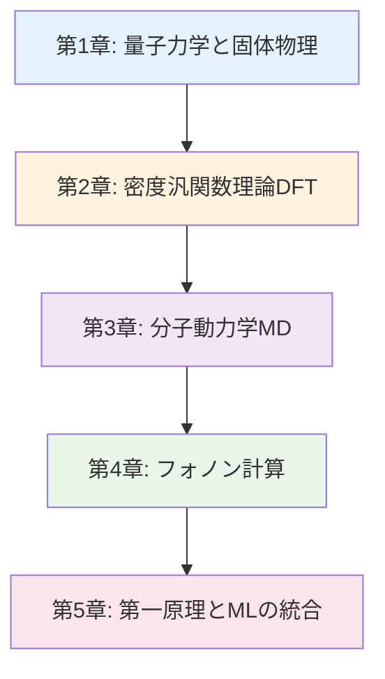

# 計算材料科学基礎入門シリーズ v1.0

**量子力学から分子動力学まで - 理論と実践の完全ガイド**

## シリーズ概要

このシリーズは、計算材料科学の基礎理論から実践的なシミュレーション技術まで、体系的に学べる全5章構成の教育コンテンツです。量子力学に基づく第一原理計算、分子動力学シミュレーション、フォノン計算など、現代の材料研究に不可欠な計算手法を網羅的に解説します。

**特徴:**
- ✅ **理論と実践の融合**: 物理・化学の理論から実際のコード実装まで
- ✅ **体系的な構成**: 量子力学 → DFT → MD → フォノン → 実践の順序で段階的に学習
- ✅ **実行可能なコード**: 30-35個の実践的なPython/シェルスクリプト例
- ✅ **主要ツールを網羅**: ASE、GPAW、LAMMPS、Phonopy等の使い方を実践的に習得

**総学習時間**: 115-140分（コード実行と演習を含む）

---

## 学習の進め方

### 推奨学習順序



**物理・化学の基礎がある方（学部3-4年、大学院生）:**
- 第1章（基礎確認） → 第2章 → 第3章 → 第4章 → 第5章
- 所要時間: 115-140分

**DFT/MD経験者（実践スキル強化）:**
- 第2章（Section 2.3以降）→ 第4章 → 第5章
- 所要時間: 60-80分

**機械学習研究者（材料科学への応用）:**
- 第1章 → 第2章（Section 2.1-2.2）→ 第5章（集中学習）
- 所要時間: 50-70分

---

## 各章の詳細

### [第1章：量子力学と固体物理の基礎](./chapter-1.md)

**難易度**: 中級
**読了時間**: 25-30分
**コード例**: 6-7個

#### 学習内容

1. **量子力学の基本原理**
   - シュレーディンガー方程式
   - 波動関数とハミルトニアン
   - ボルン・オッペンハイマー近似

2. **原子と分子の電子構造**
   - 水素原子の解
   - 多電子系の問題
   - 電子相関の重要性

3. **固体の量子力学**
   - 周期境界条件
   - ブロッホの定理
   - バンド構造の基礎

4. **実践演習**
   - Pythonで水素原子のシュレーディンガー方程式を解く
   - 量子井戸のエネルギー準位計算
   - 簡単なバンド構造の可視化

#### 学習目標

- ✅ シュレーディンガー方程式の物理的意味を説明できる
- ✅ ボルン・オッペンハイマー近似の重要性を理解している
- ✅ 固体のバンド構造の概念を理解している
- ✅ Pythonで基本的な量子力学計算を実行できる

**[第1章を読む →](./chapter-1.md)**

---

### [第2章：密度汎関数理論（DFT）入門](./chapter-2.md)

**難易度**: 中級〜上級
**読了時間**: 30-35分
**コード例**: 7-8個

#### 学習内容

1. **DFTの基礎理論**
   - Hohenberg-Kohnの定理
   - Kohn-Sham方程式
   - 交換相関汎関数（LDA、GGA）

2. **DFT計算の実際**
   - 基底関数（平面波、原子軌道）
   - k点サンプリング
   - 収束判定

3. **ASE + GPAWによる実践**
   - 環境構築
   - 構造最適化
   - バンドギャップ計算
   - 状態密度（DOS）の計算

4. **DFTの限界と対策**
   - バンドギャップ問題
   - van der Waals相互作用
   - 強相関系

#### 学習目標

- ✅ DFTの基本原理を説明できる
- ✅ Kohn-Sham方程式の意味を理解している
- ✅ ASEとGPAWを使ってDFT計算を実行できる
- ✅ DFTの限界を理解し、適切な手法選択ができる

**[第2章を読む →](./chapter-2.md)**

---

### [第3章：分子動力学（MD）シミュレーション](./chapter-3.md)

**難易度**: 中級
**読了時間**: 25-30分
**コード例**: 6-7個

#### 学習内容

1. **MDの基礎理論**
   - ニュートンの運動方程式
   - 力場（Force Field）とポテンシャル
   - 時間積分アルゴリズム（Verlet、Leap-frog）

2. **統計アンサンブル**
   - NVE（微小正準）
   - NVT（正準）- Nosé-Hoover熱浴
   - NPT（等温等圧）- Parrinello-Rahman

3. **LAMMPSによる実践**
   - 入力ファイルの作成
   - 水分子系のMDシミュレーション
   - 拡散係数の計算
   - 動径分布関数（RDF）の解析

4. **Ab Initio MD（AIMD）**
   - DFT + MDの組み合わせ
   - Car-Parrinello MD
   - Born-Oppenheimer MD

#### 学習目標

- ✅ MDシミュレーションの基本原理を説明できる
- ✅ 統計アンサンブルの違いを理解している
- ✅ LAMMPSで基本的なMDシミュレーションを実行できる
- ✅ Ab Initio MDの特徴と用途を理解している

**[第3章を読む →](./chapter-3.md)**

---

### [第4章：フォノン計算と熱力学特性](./chapter-4.md)

**難易度**: 中級〜上級
**読了時間**: 20-25分
**コード例**: 5-6個

#### 学習内容

1. **格子振動の理論**
   - 調和近似
   - 動力学行列
   - フォノン分散関係

2. **Phonopyによるフォノン計算**
   - 有限変位法
   - 力定数の計算
   - フォノンバンド構造

3. **熱力学特性の計算**
   - 自由エネルギー
   - 比熱
   - 熱膨張係数
   - デバイ温度

4. **実践プロジェクト**
   - Siの完全なフォノン計算
   - 温度依存性の解析
   - 熱伝導率の推定

#### 学習目標

- ✅ 格子振動とフォノンの関係を説明できる
- ✅ Phonopyでフォノン計算を実行できる
- ✅ 熱力学特性の計算原理を理解している
- ✅ フォノン計算結果から物性を予測できる

**[第4章を読む →](./chapter-4.md)**

---

### [第5章：第一原理計算と機械学習の統合](./chapter-5.md)

**難易度**: 上級
**読了時間**: 15-20分
**コード例**: 5-6個

#### 学習内容

1. **機械学習ポテンシャル（MLP）**
   - Gaussian Approximation Potential (GAP)
   - Neural Network Potential (NNP)
   - Moment Tensor Potential (MTP)

2. **データ生成戦略**
   - Active Learning
   - DFT計算からのデータ抽出
   - 効率的なサンプリング

3. **実践：NNPの訓練**
   - ASEとAMPを使ったNNP構築
   - 訓練データの準備
   - ポテンシャルの評価

4. **将来展望**
   - Universal Machine Learning Potential
   - Foundation Models for Materials
   - 自律実験への応用

#### 学習目標

- ✅ 機械学習ポテンシャルの概念を理解している
- ✅ DFTデータからMLPを訓練できる
- ✅ Active Learningの重要性を理解している
- ✅ 最新のML+計算材料科学トレンドを把握している

**[第5章を読む →](./chapter-5.md)**

---

## 全体の学習成果

このシリーズを完了すると、以下のスキルと知識を習得できます：

### 理論的知識（Understanding）

- ✅ 量子力学とシュレーディンガー方程式の基礎を理解している
- ✅ DFTの原理（Hohenberg-Kohn定理、Kohn-Sham方程式）を説明できる
- ✅ MDシミュレーションの統計力学的基盤を理解している
- ✅ フォノン計算と熱力学特性の関係を説明できる

### 実践スキル（Doing）

- ✅ ASE/GPAWでDFT計算を実行できる
- ✅ LAMMPSでMDシミュレーションを実行できる
- ✅ Phonopyでフォノン計算を実行できる
- ✅ Pythonで計算結果を解析・可視化できる
- ✅ 機械学習ポテンシャルを訓練できる

### 応用力（Applying）

- ✅ 材料の電子構造を計算し、物性を予測できる
- ✅ 熱力学特性を理論計算から評価できる
- ✅ 適切な計算手法を選択できる（DFT vs MD vs MLP）
- ✅ 計算と実験を組み合わせた研究戦略を立案できる

---

## 推奨学習パターン

### パターン1: 基礎から完全習得（大学院生向け）

**対象**: 計算材料科学を初めて学ぶ大学院生
**期間**: 2-3週間
**進め方**:

```
Week 1:
- Day 1-2: 第1章（量子力学基礎の復習）
- Day 3-4: 第2章（DFT理論、前半）
- Day 5-7: 第2章（DFT実践、ASE/GPAW演習）

Week 2:
- Day 1-3: 第3章（MD理論と実践）
- Day 4-5: 第4章（フォノン計算）
- Day 6-7: 各章の演習問題を復習

Week 3:
- Day 1-4: 第5章（ML+計算材料科学）
- Day 5-7: 独自プロジェクト（興味のある材料で計算実践）
```

**成果物**:
- 3種類以上の材料のDFT計算結果
- MDシミュレーションレポート
- フォノン計算プロジェクト

### パターン2: 実践スキル速習（ポスドク・研究者向け）

**対象**: 理論は知っているが実装経験がない研究者
**期間**: 1週間
**進め方**:

```
Day 1: 第2章（ASE/GPAW環境構築と基本計算）
Day 2-3: 第2章（実践プロジェクト: バンド構造、DOS）
Day 4: 第3章（LAMMPS実践）
Day 5: 第4章（Phonopy実践）
Day 6-7: 第5章（MLP訓練とActive Learning）
```

**成果物**:
- GitHubにコードとドキュメントを公開
- 計算ワークフロー自動化スクリプト

### パターン3: ピンポイント学習（特定手法の習得）

**対象**: 特定の計算手法を習得したい研究者
**期間**: 柔軟
**選択例**:

- **DFT計算を学びたい** → 第1章（Section 1.3）+ 第2章（全体）
- **MDシミュレーションを学びたい** → 第3章（全体）+ 第5章（Section 5.3）
- **フォノン計算を学びたい** → 第1章（Section 1.3）+ 第4章（全体）
- **機械学習ポテンシャルを学びたい** → 第5章（全体）+ 第2章（Section 2.3）

---

## FAQ（よくある質問）

### Q1: このシリーズを学ぶのに必要な前提知識は？

**A**: 以下の知識が前提となります：
- **物理**: 大学1-2年レベルの量子力学、統計力学、固体物理
- **化学**: 大学1-2年レベルの物理化学、無機化学
- **数学**: 線形代数、微分方程式、フーリエ変換
- **プログラミング**: Python基礎（変数、関数、リスト、NumPy/Matplotlib）

不安な場合は、各章の「前提知識チェックリスト」で確認してください。

### Q2: コードを実際に動かす必要がありますか？

**A**: **強く推奨します**。計算材料科学は実践的なスキルです。理論だけでなく、実際にコードを動かして結果を見ることで深い理解が得られます。環境構築が難しい場合は、Google Colab（無料）から始めることも可能です。

### Q3: 商用ソフトウェア（VASP等）がなくても学習できますか？

**A**: **はい、可能です**。このシリーズは主にオープンソースツール（ASE、GPAW、LAMMPS、Phonopy）を使用します。これらは無料で利用でき、学術研究にも産業応用にも十分な機能を持っています。VASPやQuantum ESPRESSOの説明もありますが、それらがなくても学習できます。

### Q4: 計算にはどれくらいの計算資源が必要ですか？

**A**:
- **最低要件**: ノートPC（メモリ8GB以上、4コアCPU）で基本的な演習は実行可能
- **推奨環境**: デスクトップPC（メモリ16GB以上、8コアCPU）で快適に実行
- **大規模計算**: 大学のスーパーコンピュータ、クラウドHPC（AWS、Google Cloud）を利用

基本的な演習はノートPCで十分です。

### Q5: どれくらいの期間で習得できますか？

**A**: 学習時間と目標によります：
- **理論の理解**: 1-2週間（全5章を読む）
- **基本的な計算スキル**: 2-4週間（コード例を全て実行）
- **研究レベルのスキル**: 2-3ヶ月（独自プロジェクトを含む）
- **専門家レベル**: 1-2年（継続的な実践と論文執筆）

### Q6: DFTとMDの違いは何ですか？いつどちらを使うべきですか？

**A**:
**DFT（密度汎関数理論）**:
- 電子状態を量子力学的に計算
- バンド構造、バンドギャップ、磁性など
- 計算コスト: 高い（原子数〜数百個）
- 用途: 電子物性、化学反応、構造最適化

**MD（分子動力学）**:
- 原子の運動を古典力学的にシミュレーション
- 拡散、相転移、界面現象など
- 計算コスト: 中〜高（原子数〜数百万個可能）
- 用途: 熱力学、動的過程、大規模系

**使い分け**:
- 電子構造が重要 → DFT
- 時間発展や大規模系 → MD
- 両方の精度が必要 → Ab Initio MD（第3章で解説）

### Q7: このシリーズだけで論文が書けるようになりますか？

**A**: このシリーズは**基礎固めと実践スキルの習得**に焦点を当てています。論文執筆にはさらに以下が必要です：
1. 特定の研究テーマの深掘り（3-6ヶ月）
2. 先行研究の徹底的な調査
3. オリジナルな研究成果の創出
4. 論文執筆技術の習得

このシリーズ完了後、指導教員や共同研究者と相談しながら研究を進めることをお勧めします。

---

## 次のステップ

### シリーズ完了後の推奨アクション

**Immediate（1-2週間以内）:**
1. ✅ GitHubに計算スクリプトとノートをアップロード
2. ✅ 研究室ゼミで学んだ内容を発表
3. ✅ 自分の研究テーマに関連する材料で計算を実践

**Short-term（1-3ヶ月）:**
1. ✅ 専門論文を10本精読（*Physical Review B*, *Computational Materials Science*）
2. ✅ オープンソースプロジェクトにコントリビュート（ASE、Phonopy等）
3. ✅ 学会発表（ポスター発表を目標に）
4. ✅ 計算ワークフロー自動化スクリプトを開発

**Medium-term（3-6ヶ月）:**
1. ✅ 独自の研究プロジェクトで計算結果を論文にまとめる
2. ✅ 高度な計算手法を学ぶ（GW近似、DMFT、QMC等）
3. ✅ 国内学会で口頭発表
4. ✅ スーパーコンピュータ利用課題に応募

**Long-term（1年以上）:**
1. ✅ 国際学会（APS March Meeting, MRS）で発表
2. ✅ 査読付き論文を投稿・掲載
3. ✅ 博士論文のテーマとして確立
4. ✅ 次世代の学生に計算材料科学を教える

---

## 学習リソース

### 推奨教科書

**DFT・第一原理計算**:
1. Richard M. Martin, "Electronic Structure: Basic Theory and Practical Methods"
2. 常行真司「計算物理学」（岩波書店）
3. David S. Sholl & Janice A. Steckel, "Density Functional Theory: A Practical Introduction"

**分子動力学**:
1. Daan Frenkel & Berend Smit, "Understanding Molecular Simulation"
2. J. M. Haile, "Molecular Dynamics Simulation"
3. 岡崎進「分子シミュレーション」（岩波書店）

**固体物理・量子力学**:
1. Neil W. Ashcroft & N. David Mermin, "Solid State Physics"
2. 黒沢達美「固体物理学」（裳華房）
3. J. J. Sakurai, "Modern Quantum Mechanics"

### オンラインリソース

**公式ドキュメント**:
- [ASE Documentation](https://wiki.fysik.dtu.dk/ase/)
- [GPAW Documentation](https://wiki.fysik.dtu.dk/gpaw/)
- [LAMMPS Documentation](https://docs.lammps.org/)
- [Phonopy Documentation](https://phonopy.github.io/phonopy/)

**チュートリアル・コース**:
- Materials Project Tutorials
- ASE Workshop Materials
- LAMMPS Tutorials by Sandia National Lab

**コミュニティ**:
- [Materials Project Forum](https://matsci.org/)
- [LAMMPS Mailing List](https://www.lammps.org/mail.html)
- [ASE Users Mailing List](https://listserv.fysik.dtu.dk/mailman/listinfo/ase-users)

---

## フィードバックとサポート

### このシリーズについて

このシリーズは、東北大学 Dr. Yusuke Hashimotoのもと、MI Knowledge Hubプロジェクトの一環として作成されました。

**作成日**: 2025年10月17日
**バージョン**: 1.0

### フィードバックをお待ちしています

このシリーズを改善するため、皆様のフィードバックをお待ちしています：

- **誤字・脱字・技術的誤り**: GitHubリポジトリのIssueで報告
- **改善提案**: 新しいトピック、追加して欲しいコード例等
- **質問**: 理解が難しかった部分、追加説明が欲しい箇所
- **成功事例**: このシリーズで学んだことを使ったプロジェクト

**連絡先**: yusuke.hashimoto.b8@tohoku.ac.jp

---

## ライセンスと利用規約

このシリーズは **CC BY 4.0**（Creative Commons Attribution 4.0 International）ライセンスのもとで公開されています。

**可能なこと:**
- ✅ 自由な閲覧・ダウンロード
- ✅ 教育目的での利用（授業、勉強会等）
- ✅ 改変・二次創作（翻訳、要約等）

**条件:**
- 📌 著者のクレジット表示が必要
- 📌 改変した場合はその旨を明記
- 📌 商業利用の場合は事前に連絡

詳細: [CC BY 4.0ライセンス全文](https://creativecommons.org/licenses/by/4.0/deed.ja)

---

## さあ、始めましょう！

準備はできましたか？ 第1章から始めて、計算材料科学の世界への旅を始めましょう！

**[第1章: 量子力学と固体物理の基礎 →](./chapter-1.md)**

---

**更新履歴**

- **2025-10-17**: v1.0 初版公開

---

**あなたの計算材料科学の旅はここから始まります！**
