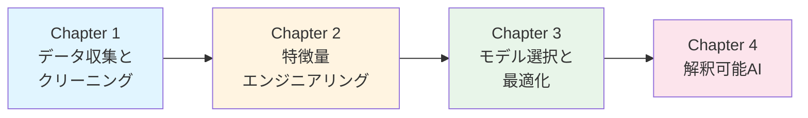
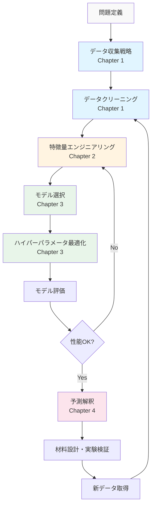

# データ駆動材料科学入門シリーズ

実践的データ解析手法とワークフロー設計

---

## シリーズについて

本シリーズは、**データ駆動材料科学（Data-Driven Materials Science）** の実践的データ解析手法とワークフロー設計を体系的に学ぶ教育コンテンツです。データ収集戦略、特徴量エンジニアリング、モデル選択、解釈可能AIまで、材料研究で必須となるデータ解析スキルを習得できます。

### 対象読者

- 大学院生・研究者（材料科学、化学、物理、工学）
- データ解析の実務スキルを高めたい材料研究者
- 機械学習を材料開発に活用したいエンジニア
- Materials Informaticsのキャリアを目指す方

### 学習目標

本シリーズを完了すると、以下のスキルを習得できます：

✅ 材料データの収集戦略と実験計画法の理解
✅ 欠損値・外れ値の適切な処理手法の習得
✅ 材料記述子の設計と特徴量エンジニアリング
✅ モデル選択とハイパーパラメータ最適化の実践
✅ SHAP/LIMEによる予測の解釈と物理的意味づけ
✅ 実データセットを用いたワークフロー構築能力

### 前提知識

- **必須**：Python基礎、機械学習の基本概念、大学数学（統計、線形代数）
- **推奨**：scikit-learn経験、材料科学の基礎知識

---

## シリーズ構成

### 📘 Chapter 1: データ収集戦略とクリーニング

**読了時間**: 25-30分 | **レベル**: 初級〜中級 | **コード例**: 9-11個

材料データの特徴（小規模・不均衡・ノイズ）を理解し、効果的なデータ収集戦略と前処理手法を学びます。実験計画法（DOE）、Latin Hypercube Sampling、欠損値処理（MICE）、外れ値検出（Isolation Forest）を実践します。

**学習内容**：
- 材料データの特徴と課題
- データ収集戦略（DOE、Active Learning）
- 欠損値処理（Simple/KNN/MICE Imputation）
- 外れ値検出（Z-score、IQR、Isolation Forest、LOF）
- ケーススタディ：熱電材料データセット

[👉 Chapter 1を読む](chapter-1.md)

---

### 📗 Chapter 2: 特徴量エンジニアリング

**読了時間**: 25-30分 | **レベル**: 中級 | **コード例**: 10-12個

材料記述子の選択・設計、特徴量変換、次元削減、特徴量選択を学びます。matminerを活用した組成・構造記述子の生成から、SHAP-based selectionまで、材料科学に特化した特徴量エンジニアリングを習得します。

**学習内容**：
- 材料記述子（組成、構造、電子構造）
- 特徴量変換（正規化、対数変換、多項式特徴量）
- 次元削減（PCA、t-SNE、UMAP）
- 特徴量選択（Filter、Wrapper、Embedded、SHAP-based）
- ケーススタディ：バンドギャップ予測（200次元→20次元）

[👉 Chapter 2を読む](chapter-2.md)

---

### 💻 Chapter 3: モデル選択とハイパーパラメータ最適化

**読了時間**: 25-30分 | **レベル**: 中級 | **コード例**: 8-10個

データサイズに応じたモデル選択、交差検証、ハイパーパラメータ最適化（Optuna）、アンサンブル学習を実践します。線形モデル、木ベース、NN、GNNの使い分けと、Bayesian Optimizationによる自動最適化を習得します。

**学習内容**：
- モデル選択戦略（解釈性 vs 精度）
- 交差検証（K-Fold、Stratified、Time Series Split）
- ハイパーパラメータ最適化（Grid/Random/Bayesian）
- アンサンブル学習（Bagging、Boosting、Stacking）
- ケーススタディ：Li-ion電池容量予測

[👉 Chapter 3を読む](chapter-3.md)

---

### 🔍 Chapter 4: 解釈可能AI (XAI)

**読了時間**: 20-25分 | **レベル**: 中級 | **コード例**: 8-10個

SHAP、LIME、Attention可視化による予測の解釈手法を学びます。材料科学における物理的解釈の重要性と、トヨタ・IBM・Citrineなどの実世界応用事例を通じて、XAIのキャリアパスを理解します。

**学習内容**：
- 解釈可能性の重要性（ブラックボックス問題）
- SHAP（Shapley値、Tree SHAP、Global/Local解釈）
- LIME（局所線形近似、Tabular LIME）
- Attention可視化（NN/GNN用）
- 実世界応用とキャリアパス（年収情報含む）

[👉 Chapter 4を読む](chapter-4.md)

---

## 学習の進め方

### 推奨学習パス



### 学習方法

1. **Chapter 1-2（基礎編）**：データの質を高める技術を習得
   - 実験計画法とデータ収集戦略
   - 特徴量設計と次元削減

2. **Chapter 3（最適化編）**：モデル性能を最大化
   - 交差検証とハイパーパラメータ最適化
   - アンサンブル学習による精度向上

3. **Chapter 4（解釈編）**：予測の物理的意味を理解
   - SHAP/LIMEによる解釈
   - 実世界応用事例とキャリア情報

### 環境構築

実践には以下の環境が必要です：

**推奨環境**：
- Python 3.8以上
- Jupyter Notebook または Google Colab
- 主要ライブラリ：

```bash
pip install pandas numpy matplotlib seaborn scikit-learn
pip install lightgbm xgboost optuna shap lime
pip install matminer pymatgen scipy scikit-optimize
```

**Google Colabを使う場合**：

```python
!pip install matminer optuna shap lime
# 他のライブラリはプリインストール済み
```

---

## シリーズの特徴

### 🎯 実践重視

35-40個の実行可能なPythonコード例を通じて、実際の材料研究で使える技術を習得できます。全てのコードはGoogle Colab対応です。

### 📊 材料科学特化

matminerによる材料記述子生成、Materials Project連携など、材料科学に特化したデータ解析手法を学びます。

### 🔬 実データセット

熱電材料、バンドギャップ予測、Li-ion電池など、実際の材料データセットを使った演習で実務スキルを習得できます。

### 🌐 最新技術

Optuna、SHAP、LIMEなど、2024-2025年時点の最新ツールと手法を学びます。

---

## ワークフロー全体像

本シリーズで学ぶデータ駆動材料科学のワークフローは以下の通りです：



---

## 関連シリーズ

本サイトでは、他にも以下のシリーズを公開しています：

- **[マテリアルズ・インフォマティクス入門](../mi-introduction/)** - MI全般の基礎から実践
- **[ベイズ最適化入門](../bayesian-optimization-introduction/)** - 材料探索の効率化
- **[グラフニューラルネットワーク入門](../gnn-introduction/)** - 結晶構造予測
- **[Active Learning入門](../active-learning-introduction/)** - 効率的データ収集

---

## 参考文献・リソース

### 主要教科書

1. **Ramprasad, R., Batra, R., Pilania, G., Mannodi-Kanakkithodi, A., & Kim, C.** (2017). Machine learning in materials informatics: recent applications and prospects. *npj Computational Materials*, 3(1), 54. [DOI: 10.1038/s41524-017-0056-5](https://doi.org/10.1038/s41524-017-0056-5)

2. **Butler, K. T., Davies, D. W., Cartwright, H., Isayev, O., & Walsh, A.** (2018). Machine learning for molecular and materials science. *Nature*, 559(7715), 547-555. [DOI: 10.1038/s41586-018-0337-2](https://doi.org/10.1038/s41586-018-0337-2)

3. **Ward, L., Agrawal, A., Choudhary, A., & Wolverton, C.** (2016). A general-purpose machine learning framework for predicting properties of inorganic materials. *npj Computational Materials*, 2(1), 16028. [DOI: 10.1038/npjcompumats.2016.28](https://doi.org/10.1038/npjcompumats.2016.28)

### オンラインリソース

- **matminer**: 材料記述子生成ライブラリ（https://hackingmaterials.lbl.gov/matminer/）
- **Materials Project**: 材料データベース（https://materialsproject.org）
- **SHAP Documentation**: 解釈可能AI（https://shap.readthedocs.io/）
- **Optuna**: ハイパーパラメータ最適化（https://optuna.org/）

---

## 総コード例数と読了時間

| Chapter | 読了時間 | コード例数 | 演習問題数 |
|---------|----------|-----------|----------|
| Chapter 1 | 25-30分 | 9-11個 | 5-7問 |
| Chapter 2 | 25-30分 | 10-12個 | 6-8問 |
| Chapter 3 | 25-30分 | 8-10個 | 5-7問 |
| Chapter 4 | 20-25分 | 8-10個 | 4-6問 |
| **合計** | **100-120分** | **35-43個** | **20-28問** |

---

## フィードバック・質問

本シリーズに関するご質問やフィードバックは、以下までお願いします：

**Dr. Yusuke Hashimoto**
Institute of Multidisciplinary Research for Advanced Materials (IMRAM)
Tohoku University
Email: yusuke.hashimoto.b8@tohoku.ac.jp

---

## ライセンス

本コンテンツは [Creative Commons Attribution 4.0 International License](https://creativecommons.org/licenses/by/4.0/) の下で公開されています。

教育・研究目的での自由な利用を歓迎します。引用の際は以下の形式をご利用ください：

```
橋本佑介（2025）『データ駆動材料科学入門シリーズ v1.0』東北大学
https://yusukehashimotolab.github.io/wp/knowledge/jp/data-driven-materials-introduction/
```

---

**最終更新**: 2025年10月18日
**Version**: 1.0

[Chapter 1から始める →](chapter-1.md)
