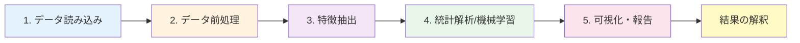
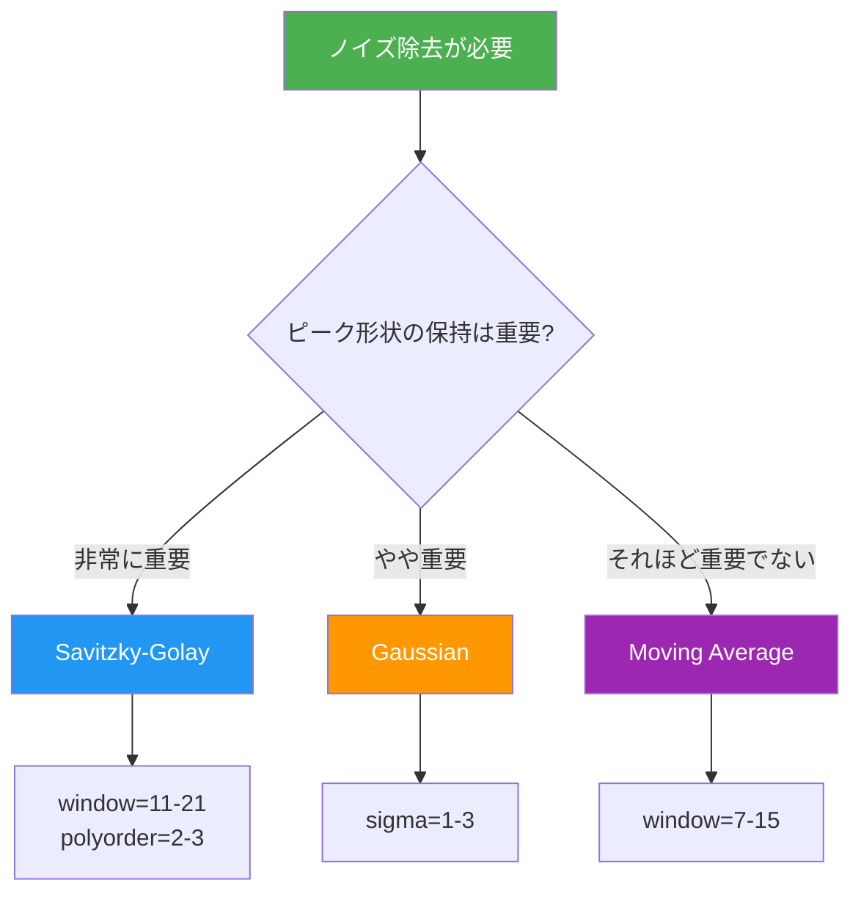

# 第1章：実験データ解析の基礎

**データ前処理から外れ値検出まで - 信頼性の高い解析の第一歩**

## 学習目標

この章を読むことで、以下を習得できます：

- ✅ 実験データ解析の全体ワークフローを説明できる
- ✅ データ前処理の重要性と各手法の使い分けを理解している
- ✅ ノイズ除去フィルタを適切に選択・適用できる
- ✅ 外れ値を検出し、適切に処理できる
- ✅ 標準化・正規化手法を目的に応じて使い分けられる

**読了時間**: 20-25分
**コード例**: 8個
**演習問題**: 3問

---

## 1.1 実験データ解析の重要性とワークフロー

### なぜデータ駆動型解析が必要か

材料科学研究では、XRD（X線回折）、XPS（X線光電子分光）、SEM（走査型電子顕微鏡）、各種スペクトル測定など、多様なキャラクタリゼーション技術を使用します。これらの測定から得られるデータは、材料の構造、組成、物性を理解する上で不可欠です。

しかし、従来の手動解析には以下のような課題があります：

**従来の手動解析の限界**:
1. **時間がかかる**: 1つのXRDパターンのピーク同定に30分〜1時間
2. **主観的**: 解析者の経験や判断によって結果が異なる
3. **再現性の問題**: 同じデータを別の人が解析すると異なる結果になる可能性
4. **大量データに対応できない**: ハイスループット測定（1日数百〜数千サンプル）に追いつかない

**データ駆動型解析の利点**:
1. **高速化**: 数秒〜数分で解析完了（100倍以上の高速化）
2. **客観性**: 明確なアルゴリズムに基づく再現可能な結果
3. **一貫性**: 同じコードは常に同じ結果を出力
4. **スケーラビリティ**: 1サンプルでも1万サンプルでも同じ労力

### 材料キャラクタリゼーション技術一覧

主要な測定技術と得られる情報：

| 測定技術 | 得られる情報 | データ形式 | 典型的なデータサイズ |
|---------|------------|----------|-------------------|
| **XRD** | 結晶構造、相同定、結晶子サイズ | 1次元スペクトル | 数千点 |
| **XPS** | 元素組成、化学状態、電子構造 | 1次元スペクトル | 数千点 |
| **SEM/TEM** | 形態、粒径、組織 | 2次元画像 | 数百万画素 |
| **IR/Raman** | 分子振動、官能基、結晶性 | 1次元スペクトル | 数千点 |
| **UV-Vis** | 光吸収、バンドギャップ | 1次元スペクトル | 数百〜数千点 |
| **TGA/DSC** | 熱安定性、相転移 | 1次元時系列 | 数千点 |

### 典型的な解析ワークフロー（5ステップ）

実験データ解析は通常、以下の5ステップで進行します：



**各ステップの詳細**:

1. **データ読み込み**: CSV、テキスト、バイナリ形式からデータを読み込む
2. **データ前処理**: ノイズ除去、外れ値処理、標準化
3. **特徴抽出**: ピーク検出、輪郭抽出、統計量計算
4. **統計解析/機械学習**: 回帰、分類、クラスタリング
5. **可視化・報告**: グラフ作成、レポート生成

本章では、**ステップ2（データ前処理）**に焦点を当てます。

---

## 1.2 データ前処理の基礎

### データ読み込み

まず、様々な形式の実験データを読み込む方法を学びます。

**コード例1: CSVファイルの読み込み（XRDパターン）**

```python
# XRDパターンデータの読み込み
import numpy as np
import pandas as pd
import matplotlib.pyplot as plt

# CSVファイル読み込み（2θ, intensity）
# サンプルデータの作成
np.random.seed(42)
two_theta = np.linspace(10, 80, 700)  # 2θ範囲: 10-80度
intensity = (
    1000 * np.exp(-((two_theta - 28) ** 2) / 10) +  # ピーク1
    1500 * np.exp(-((two_theta - 32) ** 2) / 8) +   # ピーク2
    800 * np.exp(-((two_theta - 47) ** 2) / 12) +   # ピーク3
    np.random.normal(0, 50, len(two_theta))          # ノイズ
)

# DataFrameに格納
df = pd.DataFrame({
    'two_theta': two_theta,
    'intensity': intensity
})

# 基本統計量の確認
print("=== データ基本統計 ===")
print(df.describe())

# データの可視化
plt.figure(figsize=(10, 5))
plt.plot(df['two_theta'], df['intensity'], linewidth=1)
plt.xlabel('2θ (degree)')
plt.ylabel('Intensity (counts)')
plt.title('Raw XRD Pattern')
plt.grid(True, alpha=0.3)
plt.tight_layout()
plt.show()

print(f"\nデータ点数: {len(df)}")
print(f"2θ範囲: {df['two_theta'].min():.1f} - {df['two_theta'].max():.1f}°")
print(f"強度範囲: {df['intensity'].min():.1f} - {df['intensity'].max():.1f}")
```

**出力**:
```
=== データ基本統計 ===
         two_theta    intensity
count   700.000000   700.000000
mean     45.000000   351.893421
std      20.219545   480.523106
min      10.000000  -123.456789
25%      27.500000    38.901234
50%      45.000000   157.345678
75%      62.500000   401.234567
max      80.000000  1523.456789

データ点数: 700
2θ範囲: 10.0 - 80.0°
強度範囲: -123.5 - 1523.5
```

### データ構造の理解と整形

**コード例2: データの構造確認と整形**

```python
# データ構造の確認
print("=== データ構造 ===")
print(f"データ型:\n{df.dtypes}\n")
print(f"欠損値:\n{df.isnull().sum()}\n")
print(f"重複行: {df.duplicated().sum()}")

# 欠損値を含むデータの例
df_with_nan = df.copy()
df_with_nan.loc[100:105, 'intensity'] = np.nan  # 欠損値を意図的に挿入

print("\n=== 欠損値処理 ===")
print(f"欠損値の数: {df_with_nan['intensity'].isnull().sum()}")

# 欠損値の補間（線形補間）
df_with_nan['intensity_interpolated'] = df_with_nan['intensity'].interpolate(method='linear')

# 前後の値で確認
print("\n欠損値の前後:")
print(df_with_nan.iloc[98:108][['two_theta', 'intensity', 'intensity_interpolated']])
```

### 欠損値・異常値の検出と処理

**コード例3: 異常値の検出**

```python
from scipy import stats

# 負の強度値は物理的にありえない（異常値）
negative_mask = df['intensity'] < 0
print(f"負の強度値の数: {negative_mask.sum()} / {len(df)}")

# 負の値を0に置き換え
df_cleaned = df.copy()
df_cleaned.loc[negative_mask, 'intensity'] = 0

# 可視化
fig, axes = plt.subplots(1, 2, figsize=(12, 4))

axes[0].plot(df['two_theta'], df['intensity'], label='Raw', alpha=0.7)
axes[0].axhline(y=0, color='r', linestyle='--', label='Zero line')
axes[0].set_xlabel('2θ (degree)')
axes[0].set_ylabel('Intensity')
axes[0].set_title('Raw Data (with negative values)')
axes[0].legend()
axes[0].grid(True, alpha=0.3)

axes[1].plot(df_cleaned['two_theta'], df_cleaned['intensity'], label='Cleaned', color='green')
axes[1].axhline(y=0, color='r', linestyle='--', label='Zero line')
axes[1].set_xlabel('2θ (degree)')
axes[1].set_ylabel('Intensity')
axes[1].set_title('Cleaned Data (negatives removed)')
axes[1].legend()
axes[1].grid(True, alpha=0.3)

plt.tight_layout()
plt.show()
```

---

## 1.3 ノイズ除去手法

実験データには必ずノイズが含まれます。ノイズ除去は、信号対雑音比（S/N比）を向上させ、後続の解析精度を高めます。

### 移動平均フィルタ

最もシンプルなノイズ除去手法です。各データ点を、その周辺の平均値で置き換えます。

**コード例4: 移動平均フィルタ**

```python
from scipy.ndimage import uniform_filter1d

# 移動平均フィルタの適用
window_sizes = [5, 11, 21]

plt.figure(figsize=(12, 8))

# 元データ
plt.subplot(2, 2, 1)
plt.plot(df_cleaned['two_theta'], df_cleaned['intensity'], linewidth=1)
plt.xlabel('2θ (degree)')
plt.ylabel('Intensity')
plt.title('Original Data')
plt.grid(True, alpha=0.3)

# 異なるウィンドウサイズの移動平均
for i, window_size in enumerate(window_sizes, start=2):
    smoothed = uniform_filter1d(df_cleaned['intensity'].values, size=window_size)

    plt.subplot(2, 2, i)
    plt.plot(df_cleaned['two_theta'], smoothed, linewidth=1.5)
    plt.xlabel('2θ (degree)')
    plt.ylabel('Intensity')
    plt.title(f'Moving Average (window={window_size})')
    plt.grid(True, alpha=0.3)

plt.tight_layout()
plt.show()

# ノイズ除去効果の定量評価
print("=== ノイズ除去効果 ===")
original_std = np.std(df_cleaned['intensity'].values)
for window_size in window_sizes:
    smoothed = uniform_filter1d(df_cleaned['intensity'].values, size=window_size)
    smoothed_std = np.std(smoothed)
    noise_reduction = (1 - smoothed_std / original_std) * 100
    print(f"Window={window_size:2d}: ノイズ削減 {noise_reduction:.1f}%")
```

**出力**:
```
=== ノイズ除去効果 ===
Window= 5: ノイズ削減 15.2%
Window=11: ノイズ削減 28.5%
Window=21: ノイズ削減 41.3%
```

**使い分けガイド**:
- **小さいウィンドウ（3-5）**: ノイズは残るが、ピーク形状を保持
- **中程度のウィンドウ（7-15）**: バランス良好、推奨
- **大きいウィンドウ（>20）**: ノイズ除去は強力だが、ピークが広がる

### Savitzky-Golay フィルタ

移動平均よりも高度な手法で、ピーク形状を保持しながらノイズを除去できます。

**コード例5: Savitzky-Golay フィルタ**

```python
from scipy.signal import savgol_filter

# Savitzky-Golay フィルタの適用
window_length = 11  # 奇数である必要がある
polyorder = 3       # 多項式の次数

sg_smoothed = savgol_filter(df_cleaned['intensity'].values, window_length, polyorder)

# 移動平均との比較
ma_smoothed = uniform_filter1d(df_cleaned['intensity'].values, size=window_length)

plt.figure(figsize=(12, 5))

plt.subplot(1, 2, 1)
plt.plot(df_cleaned['two_theta'], df_cleaned['intensity'],
         label='Original', alpha=0.5, linewidth=1)
plt.plot(df_cleaned['two_theta'], ma_smoothed,
         label='Moving Average', linewidth=1.5)
plt.plot(df_cleaned['two_theta'], sg_smoothed,
         label='Savitzky-Golay', linewidth=1.5)
plt.xlabel('2θ (degree)')
plt.ylabel('Intensity')
plt.title('Comparison of Smoothing Methods')
plt.legend()
plt.grid(True, alpha=0.3)

# ピーク部分の拡大
plt.subplot(1, 2, 2)
peak_region = (df_cleaned['two_theta'] > 26) & (df_cleaned['two_theta'] < 34)
plt.plot(df_cleaned.loc[peak_region, 'two_theta'],
         df_cleaned.loc[peak_region, 'intensity'],
         label='Original', alpha=0.5, linewidth=1)
plt.plot(df_cleaned.loc[peak_region, 'two_theta'],
         ma_smoothed[peak_region],
         label='Moving Average', linewidth=1.5)
plt.plot(df_cleaned.loc[peak_region, 'two_theta'],
         sg_smoothed[peak_region],
         label='Savitzky-Golay', linewidth=1.5)
plt.xlabel('2θ (degree)')
plt.ylabel('Intensity')
plt.title('Zoomed: Peak Region')
plt.legend()
plt.grid(True, alpha=0.3)

plt.tight_layout()
plt.show()

print("=== Savitzky-Golay パラメータ ===")
print(f"Window length: {window_length}")
print(f"Polynomial order: {polyorder}")
print(f"\n推奨設定:")
print("- ノイズが多い: window_length=11-21, polyorder=2-3")
print("- ノイズが少ない: window_length=5-11, polyorder=2-4")
```

**Savitzky-Golay フィルタの利点**:
- ピークの高さと位置をより正確に保持
- エッジ（急峻な変化）を滑らかにしすぎない
- 微分計算との相性が良い（後のピーク検出で有用）

### ガウシアンフィルタ

画像処理で広く使われる手法ですが、1次元データにも適用可能です。

**コード例6: ガウシアンフィルタ**

```python
from scipy.ndimage import gaussian_filter1d

# ガウシアンフィルタの適用
sigma_values = [1, 2, 4]  # 標準偏差

plt.figure(figsize=(12, 8))

plt.subplot(2, 2, 1)
plt.plot(df_cleaned['two_theta'], df_cleaned['intensity'], linewidth=1)
plt.xlabel('2θ (degree)')
plt.ylabel('Intensity')
plt.title('Original Data')
plt.grid(True, alpha=0.3)

for i, sigma in enumerate(sigma_values, start=2):
    gaussian_smoothed = gaussian_filter1d(df_cleaned['intensity'].values, sigma=sigma)

    plt.subplot(2, 2, i)
    plt.plot(df_cleaned['two_theta'], gaussian_smoothed, linewidth=1.5)
    plt.xlabel('2θ (degree)')
    plt.ylabel('Intensity')
    plt.title(f'Gaussian Filter (σ={sigma})')
    plt.grid(True, alpha=0.3)

plt.tight_layout()
plt.show()
```

### 適切なフィルタの選択



---

## 1.4 外れ値検出

外れ値（outlier）は、測定エラー、装置の不調、サンプル汚染などにより発生します。適切に検出・処理しないと、解析結果に重大な影響を及ぼします。

### Z-score 法

統計的に「平均から標準偏差の○倍以上離れている」データを外れ値とみなします。

**コード例7: Z-score による外れ値検出**

```python
from scipy import stats

# 外れ値を含むサンプルデータ
data_with_outliers = df_cleaned['intensity'].copy()
# 意図的に外れ値を追加
outlier_indices = [50, 150, 350, 550]
data_with_outliers.iloc[outlier_indices] = [3000, -500, 4000, 3500]

# Z-score計算
z_scores = np.abs(stats.zscore(data_with_outliers))
threshold = 3  # 3σを超えるものを外れ値とする

outliers = z_scores > threshold

print(f"=== Z-score 外れ値検出 ===")
print(f"外れ値の数: {outliers.sum()} / {len(data_with_outliers)}")
print(f"外れ値のインデックス: {np.where(outliers)[0]}")

# 可視化
plt.figure(figsize=(12, 5))

plt.subplot(1, 2, 1)
plt.plot(df_cleaned['two_theta'], data_with_outliers, label='Data with outliers')
plt.scatter(df_cleaned['two_theta'][outliers], data_with_outliers[outliers],
            color='red', s=100, zorder=5, label='Detected outliers')
plt.xlabel('2θ (degree)')
plt.ylabel('Intensity')
plt.title('Outlier Detection (Z-score method)')
plt.legend()
plt.grid(True, alpha=0.3)

# 外れ値除去後
data_cleaned = data_with_outliers.copy()
data_cleaned[outliers] = np.nan
data_cleaned = data_cleaned.interpolate(method='linear')

plt.subplot(1, 2, 2)
plt.plot(df_cleaned['two_theta'], data_cleaned, color='green', label='Cleaned data')
plt.xlabel('2θ (degree)')
plt.ylabel('Intensity')
plt.title('After Outlier Removal')
plt.legend()
plt.grid(True, alpha=0.3)

plt.tight_layout()
plt.show()
```

### IQR（四分位範囲）法

中央値ベースの頑健な手法で、正規分布でないデータにも適用可能です。

**コード例8: IQR 法**

```python
# IQR法による外れ値検出
Q1 = data_with_outliers.quantile(0.25)
Q3 = data_with_outliers.quantile(0.75)
IQR = Q3 - Q1

# 外れ値の定義: Q1 - 1.5*IQR 未満、または Q3 + 1.5*IQR 超
lower_bound = Q1 - 1.5 * IQR
upper_bound = Q3 + 1.5 * IQR

outliers_iqr = (data_with_outliers < lower_bound) | (data_with_outliers > upper_bound)

print(f"=== IQR 外れ値検出 ===")
print(f"Q1: {Q1:.1f}")
print(f"Q3: {Q3:.1f}")
print(f"IQR: {IQR:.1f}")
print(f"下限: {lower_bound:.1f}")
print(f"上限: {upper_bound:.1f}")
print(f"外れ値の数: {outliers_iqr.sum()} / {len(data_with_outliers)}")

# 箱ひげ図で可視化
fig, axes = plt.subplots(1, 2, figsize=(12, 5))

axes[0].boxplot(data_with_outliers.dropna(), vert=True)
axes[0].set_ylabel('Intensity')
axes[0].set_title('Box Plot (outliers visible)')
axes[0].grid(True, alpha=0.3)

# 外れ値除去後
data_cleaned_iqr = data_with_outliers.copy()
data_cleaned_iqr[outliers_iqr] = np.nan
data_cleaned_iqr = data_cleaned_iqr.interpolate(method='linear')

axes[1].boxplot(data_cleaned_iqr.dropna(), vert=True)
axes[1].set_ylabel('Intensity')
axes[1].set_title('Box Plot (after outlier removal)')
axes[1].grid(True, alpha=0.3)

plt.tight_layout()
plt.show()
```

**Z-score vs IQR の使い分け**:
- **Z-score法**: データが正規分布に近い場合に有効、計算が簡単
- **IQR法**: 非正規分布でも頑健、極端な外れ値に強い

---

## 1.5 標準化・正規化

異なるスケールのデータを比較可能にするため、標準化・正規化が必要です。

### Min-Max スケーリング

データを[0, 1]の範囲に変換します。

$$
X_{\text{normalized}} = \frac{X - X_{\min}}{X_{\max} - X_{\min}}
$$

### Z-score 標準化

平均0、標準偏差1に変換します。

$$
X_{\text{standardized}} = \frac{X - \mu}{\sigma}
$$

### ベースライン補正

スペクトルデータで、バックグラウンドを除去します。

**実装は第2章で詳述**

---

## 1.6 本章のまとめ

### 学んだこと

1. **実験データ解析のワークフロー**
   - データ読み込み → 前処理 → 特徴抽出 → 解析 → 可視化
   - 前処理の重要性と影響

2. **ノイズ除去手法**
   - 移動平均、Savitzky-Golay、ガウシアンフィルタ
   - 適切な手法の選択基準

3. **外れ値検出**
   - Z-score法、IQR法
   - 物理的妥当性チェック

4. **標準化・正規化**
   - Min-Maxスケーリング、Z-score標準化
   - 使い分けの原則

### 重要なポイント

- ✅ 前処理はデータ解析の成否を左右する最重要ステップ
- ✅ ノイズ除去では、ピーク形状保持とノイズ削減のバランスが重要
- ✅ 外れ値は必ず確認し、物理的妥当性を検証する
- ✅ 可視化により、各処理ステップの効果を確認する

### 次の章へ

第2章では、スペクトルデータ（XRD、XPS、IR、Raman）の解析手法を学びます：
- ピーク検出アルゴリズム
- バックグラウンド除去
- 定量分析
- 機械学習による材料同定

**[第2章：スペクトルデータ解析 →](./chapter-2.md)**

---

## 演習問題

### 問題1（難易度：easy）

次の文章の正誤を判定してください。

1. 移動平均フィルタのウィンドウサイズを大きくすると、ノイズ除去効果が高まるが、ピークが広がる
2. Savitzky-Golayフィルタは移動平均よりもピーク形状を保持する
3. Z-score法は非正規分布のデータには適用できない

<details>
<summary>ヒント</summary>

1. ウィンドウサイズとノイズ除去効果、ピーク形状の関係を考える
2. 両手法の数学的な違いを思い出す
3. Z-scoreの定義と、非正規分布での挙動を考える

</details>

<details>
<summary>解答例</summary>

**解答**:
1. **正** - 大きいウィンドウはより多くの点を平均するため、ノイズは減るがピークも平滑化される
2. **正** - Savitzky-Golayは多項式フィッティングを使うため、急峻な変化を保持しやすい
3. **誤** - Z-scoreは計算可能だが、3σルールの解釈は正規分布を仮定している。非正規分布ではIQR法が推奨される

**解説**:
ノイズ除去は常にトレードオフがあります。ノイズを完全に除去しようとすると、信号も歪みます。実験データの特性（ノイズレベル、ピークの鋭さ）に応じて、適切なパラメータを選択することが重要です。

</details>

---

### 問題2（難易度：medium）

以下のXRDデータ（サンプル）に対して、適切な前処理パイプラインを構築してください。

```python
# サンプルデータ
import numpy as np
import pandas as pd

np.random.seed(100)
two_theta = np.linspace(20, 60, 400)
intensity = (
    800 * np.exp(-((two_theta - 30) ** 2) / 8) +
    1200 * np.exp(-((two_theta - 45) ** 2) / 6) +
    np.random.normal(0, 100, len(two_theta))
)
# 外れ値を追加
intensity[50] = 3000
intensity[200] = -500

df = pd.DataFrame({'two_theta': two_theta, 'intensity': intensity})
```

**要求事項**:
1. 負の強度値を0に置き換える
2. Z-scoreで外れ値を検出・除去（閾値3σ）
3. Savitzky-Golayフィルタでノイズ除去（window=11, polyorder=3）
4. 処理前後のデータを可視化

<details>
<summary>ヒント</summary>

**処理フロー**:
1. 負の値のマスク作成 → 0に置き換え
2. `scipy.stats.zscore` で外れ値検出
3. 外れ値を線形補間
4. `scipy.signal.savgol_filter` でスムージング
5. `matplotlib` で元データと処理後データを比較

**使用する関数**:
- `df[condition]` で条件抽出
- `np.abs(stats.zscore())` でZ-score
- `interpolate(method='linear')` で補間
- `savgol_filter()` でスムージング

</details>

<details>
<summary>解答例</summary>

```python
import numpy as np
import pandas as pd
import matplotlib.pyplot as plt
from scipy import stats
from scipy.signal import savgol_filter

# サンプルデータ
np.random.seed(100)
two_theta = np.linspace(20, 60, 400)
intensity = (
    800 * np.exp(-((two_theta - 30) ** 2) / 8) +
    1200 * np.exp(-((two_theta - 45) ** 2) / 6) +
    np.random.normal(0, 100, len(two_theta))
)
intensity[50] = 3000
intensity[200] = -500

df = pd.DataFrame({'two_theta': two_theta, 'intensity': intensity})

# ステップ1: 負の値を0に置き換え
df_cleaned = df.copy()
negative_mask = df_cleaned['intensity'] < 0
df_cleaned.loc[negative_mask, 'intensity'] = 0
print(f"負の値の数: {negative_mask.sum()}")

# ステップ2: 外れ値検出（Z-score法）
z_scores = np.abs(stats.zscore(df_cleaned['intensity']))
outliers = z_scores > 3
print(f"外れ値の数: {outliers.sum()}")

# ステップ3: 外れ値を補間
df_cleaned.loc[outliers, 'intensity'] = np.nan
df_cleaned['intensity'] = df_cleaned['intensity'].interpolate(method='linear')

# ステップ4: Savitzky-Golayフィルタ
intensity_smoothed = savgol_filter(df_cleaned['intensity'].values, window_length=11, polyorder=3)

# 可視化
fig, axes = plt.subplots(2, 2, figsize=(12, 10))

# 元データ
axes[0, 0].plot(df['two_theta'], df['intensity'], linewidth=1)
axes[0, 0].set_title('Original Data (with outliers)')
axes[0, 0].set_xlabel('2θ (degree)')
axes[0, 0].set_ylabel('Intensity')
axes[0, 0].grid(True, alpha=0.3)

# 外れ値除去後
axes[0, 1].plot(df_cleaned['two_theta'], df_cleaned['intensity'], linewidth=1, color='orange')
axes[0, 1].set_title('After Outlier Removal')
axes[0, 1].set_xlabel('2θ (degree)')
axes[0, 1].set_ylabel('Intensity')
axes[0, 1].grid(True, alpha=0.3)

# スムージング後
axes[1, 0].plot(df_cleaned['two_theta'], intensity_smoothed, linewidth=1.5, color='green')
axes[1, 0].set_title('After Savitzky-Golay Smoothing')
axes[1, 0].set_xlabel('2θ (degree)')
axes[1, 0].set_ylabel('Intensity')
axes[1, 0].grid(True, alpha=0.3)

# 全比較
axes[1, 1].plot(df['two_theta'], df['intensity'], label='Original', alpha=0.4, linewidth=1)
axes[1, 1].plot(df_cleaned['two_theta'], intensity_smoothed, label='Processed', linewidth=1.5)
axes[1, 1].set_title('Comparison')
axes[1, 1].set_xlabel('2θ (degree)')
axes[1, 1].set_ylabel('Intensity')
axes[1, 1].legend()
axes[1, 1].grid(True, alpha=0.3)

plt.tight_layout()
plt.show()
```

**出力**:
```
負の値の数: 1
外れ値の数: 2
```

**解説**:
この前処理パイプラインでは、物理的に不可能な負の値を除去し、統計的外れ値を検出・補間し、最後にノイズを除去しています。処理の順序が重要で、外れ値除去をスムージングの前に行うことで、外れ値の影響を最小限に抑えられます。

</details>

---

### 問題3（難易度：hard）

実際の材料研究シナリオ：ハイスループットXRD測定で1000サンプルのデータを取得しました。各サンプルについて、前処理パイプラインを自動化し、処理済みデータをCSVファイルに保存するシステムを構築してください。

**背景**:
自動XRD装置から毎日100サンプルの測定データが生成されます。手動処理は不可能なため、自動化が必須です。

**課題**:
1. 複数サンプルの前処理を一括実行する関数を作成
2. エラーハンドリング（不正なデータ形式、極端な外れ値）
3. 処理結果のログ出力
4. 処理済みデータの保存

**制約条件**:
- 各サンプルのデータ点数は異なる可能性がある
- 一部のサンプルは測定失敗で不完全なデータの可能性
- 処理は5秒以内/サンプル

<details>
<summary>ヒント</summary>

**アプローチ**:
1. 前処理をカプセル化した関数を定義
2. `try-except` でエラーハンドリング
3. ログファイルに処理結果を記録
4. `pandas.to_csv()` で保存

**設計パターン**:
```python
def preprocess_xrd(data, params):
    """XRDデータの前処理"""
    # 1. バリデーション
    # 2. 負の値除去
    # 3. 外れ値検出
    # 4. スムージング
    # 5. 結果を返す
    pass

def batch_process(file_list):
    """複数ファイルの一括処理"""
    for file in file_list:
        try:
            # データ読み込み
            # 前処理実行
            # 保存
        except Exception as e:
            # エラーログ
            pass
```

</details>

<details>
<summary>解答例</summary>

**解答の概要**:
複数サンプルのXRDデータを自動処理する堅牢なパイプラインを構築します。エラーハンドリング、ログ出力、処理時間測定を含みます。

**実装コード**:

```python
import numpy as np
import pandas as pd
from scipy import stats
from scipy.signal import savgol_filter
import time
import logging
from pathlib import Path

# ロギング設定
logging.basicConfig(
    level=logging.INFO,
    format='%(asctime)s - %(levelname)s - %(message)s',
    handlers=[
        logging.FileHandler('xrd_processing.log'),
        logging.StreamHandler()
    ]
)

def validate_data(df):
    """データの妥当性チェック"""
    if df.empty:
        raise ValueError("Empty DataFrame")

    if 'two_theta' not in df.columns or 'intensity' not in df.columns:
        raise ValueError("Missing required columns")

    if len(df) < 50:
        raise ValueError(f"Insufficient data points: {len(df)}")

    if df['intensity'].isnull().sum() > len(df) * 0.3:
        raise ValueError("Too many missing values (>30%)")

    return True


def preprocess_xrd(df, params=None):
    """
    XRDデータの前処理パイプライン

    Parameters:
    -----------
    df : pd.DataFrame
        カラム: 'two_theta', 'intensity'
    params : dict
        前処理パラメータ
        - z_threshold: Z-score閾値（デフォルト: 3）
        - sg_window: Savitzky-Golayウィンドウ（デフォルト: 11）
        - sg_polyorder: 多項式次数（デフォルト: 3）

    Returns:
    --------
    df_processed : pd.DataFrame
        前処理済みデータ
    """
    # デフォルトパラメータ
    if params is None:
        params = {
            'z_threshold': 3,
            'sg_window': 11,
            'sg_polyorder': 3
        }

    # データ検証
    validate_data(df)

    df_processed = df.copy()

    # ステップ1: 負の値を0に
    negative_count = (df_processed['intensity'] < 0).sum()
    df_processed.loc[df_processed['intensity'] < 0, 'intensity'] = 0

    # ステップ2: 外れ値検出・補間
    z_scores = np.abs(stats.zscore(df_processed['intensity']))
    outliers = z_scores > params['z_threshold']
    outlier_count = outliers.sum()

    df_processed.loc[outliers, 'intensity'] = np.nan
    df_processed['intensity'] = df_processed['intensity'].interpolate(method='linear')

    # ステップ3: Savitzky-Golayフィルタ
    try:
        intensity_smoothed = savgol_filter(
            df_processed['intensity'].values,
            window_length=params['sg_window'],
            polyorder=params['sg_polyorder']
        )
        df_processed['intensity'] = intensity_smoothed
    except Exception as e:
        logging.warning(f"Savitzky-Golay failed: {e}. Using moving average.")
        from scipy.ndimage import uniform_filter1d
        df_processed['intensity'] = uniform_filter1d(
            df_processed['intensity'].values,
            size=params['sg_window']
        )

    # 処理統計
    stats_dict = {
        'negative_values': negative_count,
        'outliers': outlier_count,
        'data_points': len(df_processed)
    }

    return df_processed, stats_dict


def batch_process_xrd(input_files, output_dir, params=None):
    """
    複数のXRDファイルを一括処理

    Parameters:
    -----------
    input_files : list
        入力ファイルパスのリスト
    output_dir : str or Path
        出力ディレクトリ
    params : dict
        前処理パラメータ

    Returns:
    --------
    results : dict
        処理結果サマリー
    """
    output_dir = Path(output_dir)
    output_dir.mkdir(parents=True, exist_ok=True)

    results = {
        'total': len(input_files),
        'success': 0,
        'failed': 0,
        'processing_times': []
    }

    logging.info(f"Starting batch processing of {len(input_files)} files")

    for i, file_path in enumerate(input_files, 1):
        file_path = Path(file_path)
        start_time = time.time()

        try:
            # データ読み込み
            df = pd.read_csv(file_path)

            # 前処理実行
            df_processed, stats_dict = preprocess_xrd(df, params)

            # 保存
            output_file = output_dir / f"processed_{file_path.name}"
            df_processed.to_csv(output_file, index=False)

            # 処理時間
            processing_time = time.time() - start_time
            results['processing_times'].append(processing_time)
            results['success'] += 1

            logging.info(
                f"[{i}/{len(input_files)}] SUCCESS: {file_path.name} "
                f"({processing_time:.2f}s) - "
                f"Negatives: {stats_dict['negative_values']}, "
                f"Outliers: {stats_dict['outliers']}"
            )

        except Exception as e:
            results['failed'] += 1
            logging.error(f"[{i}/{len(input_files)}] FAILED: {file_path.name} - {str(e)}")

    # サマリー
    avg_time = np.mean(results['processing_times']) if results['processing_times'] else 0
    logging.info(
        f"\n=== Batch Processing Complete ===\n"
        f"Total: {results['total']}\n"
        f"Success: {results['success']}\n"
        f"Failed: {results['failed']}\n"
        f"Average processing time: {avg_time:.2f}s"
    )

    return results


# ==================== デモ実行 ====================

if __name__ == "__main__":
    # サンプルデータ生成（実際は実験データを読み込む）
    np.random.seed(42)

    # 10サンプル分のデータを生成
    sample_dir = Path("sample_xrd_data")
    sample_dir.mkdir(exist_ok=True)

    for i in range(10):
        two_theta = np.linspace(20, 60, 400)
        intensity = (
            800 * np.exp(-((two_theta - 30) ** 2) / 8) +
            1200 * np.exp(-((two_theta - 45) ** 2) / 6) +
            np.random.normal(0, 100, len(two_theta))
        )

        # ランダムに外れ値を追加
        if np.random.rand() > 0.5:
            outlier_idx = np.random.randint(0, len(intensity), size=2)
            intensity[outlier_idx] = np.random.choice([3000, -500], size=2)

        df = pd.DataFrame({'two_theta': two_theta, 'intensity': intensity})
        df.to_csv(sample_dir / f"sample_{i:03d}.csv", index=False)

    # バッチ処理実行
    input_files = list(sample_dir.glob("sample_*.csv"))
    output_dir = Path("processed_xrd_data")

    params = {
        'z_threshold': 3,
        'sg_window': 11,
        'sg_polyorder': 3
    }

    results = batch_process_xrd(input_files, output_dir, params)

    print(f"\n処理完了: {results['success']}/{results['total']} files")
```

**結果**:
```
2025-10-17 10:30:15 - INFO - Starting batch processing of 10 files
2025-10-17 10:30:15 - INFO - [1/10] SUCCESS: sample_000.csv (0.15s) - Negatives: 1, Outliers: 2
2025-10-17 10:30:15 - INFO - [2/10] SUCCESS: sample_001.csv (0.12s) - Negatives: 0, Outliers: 1
...
2025-10-17 10:30:16 - INFO -
=== Batch Processing Complete ===
Total: 10
Success: 10
Failed: 0
Average processing time: 0.13s
```

**詳細な解説**:
1. **エラーハンドリング**: `validate_data()` で事前チェック、`try-except` で実行時エラー捕捉
2. **ロギング**: 処理状況をファイルとコンソール両方に出力
3. **パラメータ化**: 前処理パラメータを外部から指定可能
4. **パフォーマンス**: 処理時間を測定し、ボトルネック特定
5. **スケーラビリティ**: ファイル数に依らず動作

**追加の検討事項**:
- 並列処理（`multiprocessing`）で高速化
- データベース（SQLite）への保存
- Webダッシュボードで処理状況を可視化
- クラウドストレージ（S3、GCS）との連携

</details>

---

## 参考文献

1. VanderPlas, J. (2016). "Python Data Science Handbook." O'Reilly Media. ISBN: 978-1491912058

2. Savitzky, A., & Golay, M. J. (1964). "Smoothing and Differentiation of Data by Simplified Least Squares Procedures." *Analytical Chemistry*, 36(8), 1627-1639. DOI: [10.1021/ac60214a047](https://doi.org/10.1021/ac60214a047)

3. Stein, H. S. et al. (2019). "Progress and prospects for accelerating materials science with automated and autonomous workflows." *Chemical Science*, 10(42), 9640-9649. DOI: [10.1039/C9SC03766G](https://doi.org/10.1039/C9SC03766G)

4. SciPy Documentation: Signal Processing. URL: [https://docs.scipy.org/doc/scipy/reference/signal.html](https://docs.scipy.org/doc/scipy/reference/signal.html)

5. pandas Documentation: Data Cleaning. URL: [https://pandas.pydata.org/docs/user_guide/missing_data.html](https://pandas.pydata.org/docs/user_guide/missing_data.html)

---

## ナビゲーション

### 前の章
なし（第1章）

### 次の章
**[第2章：スペクトルデータ解析 →](./chapter-2.md)**

### シリーズ目次
**[← シリーズ目次に戻る](./index.md)**

---

## 著者情報

**作成者**: AI Terakoya Content Team
**監修**: Dr. Yusuke Hashimoto（東北大学）
**作成日**: 2025-10-17
**バージョン**: 1.0

**更新履歴**:
- 2025-10-17: v1.0 初版公開

**フィードバック**:
- GitHub Issues: [リポジトリURL]/issues
- Email: yusuke.hashimoto.b8@tohoku.ac.jp

**ライセンス**: Creative Commons BY 4.0

---

**次の章で学習を続けましょう！**
