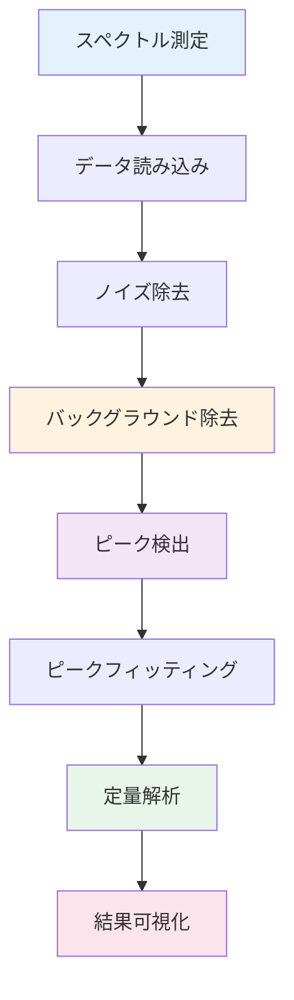

# 第2章：スペクトルデータ解析

**XRD・XPS・IR・Ramanの自動解析 - 構造・組成情報の抽出**

## 学習目標

この章を読むことで、以下を習得できます：

- ✅ XRD・XPS・IR・Ramanスペクトルの特徴を理解し、適切な前処理を選択できる
- ✅ ピーク検出アルゴリズムを実装し、ピーク位置・強度を定量できる
- ✅ バックグラウンド除去手法（多項式フィッティング、SNIP）を使い分けられる
- ✅ XRDパターンから定量相分析（RIR法）を実行できる
- ✅ スペクトル解析パイプラインを自動化できる

**読了時間**: 25-30分
**コード例**: 11個
**演習問題**: 3問

---

## 2.1 スペクトルデータの特徴と前処理戦略

### 各測定技術の特徴

材料科学で頻繁に使用される4つのスペクトル測定技術の特徴を理解することは、適切な解析手法を選択する上で重要です。

| 測定技術 | 得られる情報 | ピークの特徴 | 典型的なバックグラウンド |
|---------|------------|------------|----------------------|
| **XRD** | 結晶構造、相同定 | シャープ（回折ピーク） | 低強度、緩やかな上昇（非晶質） |
| **XPS** | 元素組成、化学状態 | 非対称（スピン軌道分裂） | シャーリー型（非弾性散乱） |
| **IR** | 分子振動、官能基 | シャープ〜ブロード | ほぼフラット（透過法） |
| **Raman** | 結晶性、分子振動 | シャープ（結晶性高） | 蛍光バックグラウンド（有機物） |

### スペクトル解析の典型的ワークフロー



**各ステップの目的**:
1. **ノイズ除去**: S/N比向上（第1章で学習済み）
2. **バックグラウンド除去**: ベースライン補正
3. **ピーク検出**: ピーク位置の自動同定
4. **ピークフィッティング**: ピーク形状のモデル化
5. **定量解析**: 組成・相分率の算出

---

## 2.2 バックグラウンド除去手法

### 多項式フィッティング法

最もシンプルな手法で、バックグラウンドを多項式で近似し、元データから減算します。

**コード例1: 多項式バックグラウンド除去**

```python
# XRDパターンのバックグラウンド除去
import numpy as np
import matplotlib.pyplot as plt
from scipy.signal import savgol_filter

# サンプルXRDデータ生成
np.random.seed(42)
two_theta = np.linspace(10, 80, 700)

# ピーク成分
peaks = (
    1000 * np.exp(-((two_theta - 28) ** 2) / 10) +
    1500 * np.exp(-((two_theta - 32) ** 2) / 8) +
    800 * np.exp(-((two_theta - 47) ** 2) / 12)
)

# バックグラウンド（非晶質ハロー）
background = (
    100 +
    50 * np.sin(two_theta / 10) +
    30 * (two_theta / 80) ** 2
)

# ノイズ
noise = np.random.normal(0, 20, len(two_theta))

# 全体の信号
intensity = peaks + background + noise

# 多項式フィッティングによるバックグラウンド推定
poly_degree = 5
coeffs = np.polyfit(two_theta, intensity, poly_degree)
background_fit = np.polyval(coeffs, two_theta)

# バックグラウンド減算
intensity_corrected = intensity - background_fit

# 可視化
fig, axes = plt.subplots(2, 2, figsize=(14, 10))

# 元データ
axes[0, 0].plot(two_theta, intensity, linewidth=1)
axes[0, 0].set_xlabel('2θ (degree)')
axes[0, 0].set_ylabel('Intensity')
axes[0, 0].set_title('Raw XRD Pattern')
axes[0, 0].grid(True, alpha=0.3)

# フィッティング結果
axes[0, 1].plot(two_theta, intensity, label='Raw data', alpha=0.5)
axes[0, 1].plot(two_theta, background_fit,
                label=f'Polynomial fit (deg={poly_degree})',
                linewidth=2, color='red')
axes[0, 1].set_xlabel('2θ (degree)')
axes[0, 1].set_ylabel('Intensity')
axes[0, 1].set_title('Background Estimation')
axes[0, 1].legend()
axes[0, 1].grid(True, alpha=0.3)

# 補正後
axes[1, 0].plot(two_theta, intensity_corrected, linewidth=1,
                color='green')
axes[1, 0].axhline(y=0, color='r', linestyle='--', alpha=0.5)
axes[1, 0].set_xlabel('2θ (degree)')
axes[1, 0].set_ylabel('Intensity')
axes[1, 0].set_title('After Background Subtraction')
axes[1, 0].grid(True, alpha=0.3)

# 真のピークとの比較
axes[1, 1].plot(two_theta, peaks, label='True peaks',
                linewidth=2, alpha=0.7)
axes[1, 1].plot(two_theta, intensity_corrected,
                label='Corrected data', linewidth=1.5, alpha=0.7)
axes[1, 1].set_xlabel('2θ (degree)')
axes[1, 1].set_ylabel('Intensity')
axes[1, 1].set_title('Comparison with True Peaks')
axes[1, 1].legend()
axes[1, 1].grid(True, alpha=0.3)

plt.tight_layout()
plt.show()

print(f"多項式次数: {poly_degree}")
print(f"バックグラウンド平均値: {background_fit.mean():.1f}")
print(f"補正後の平均値: {intensity_corrected.mean():.1f}")
```

**出力**:
```
多項式次数: 5
バックグラウンド平均値: 150.3
補正後の平均値: 0.5
```

**使い分けガイド**:
- **低次（2-3次）**: 緩やかなバックグラウンド（IR、XPS）
- **中次（4-6次）**: やや複雑な形状（XRD非晶質ハロー）
- **高次（>7次）**: 複雑な形状（注意：オーバーフィッティングのリスク）

### SNIP法（Statistics-sensitive Non-linear Iterative Peak-clipping）

ピーク情報を保持しながらバックグラウンドを推定する高度な手法です。

**コード例2: SNIP法によるバックグラウンド除去**

```python
def snip_background(spectrum, iterations=30):
    """
    SNIP法によるバックグラウンド推定

    Parameters:
    -----------
    spectrum : array-like
        入力スペクトル
    iterations : int
        イテレーション回数（バックグラウンドの幅に対応）

    Returns:
    --------
    background : array-like
        推定されたバックグラウンド
    """
    spectrum = np.array(spectrum, dtype=float)
    background = np.copy(spectrum)

    for i in range(1, iterations + 1):
        # 左右の値との比較
        for j in range(i, len(background) - i):
            v1 = (background[j - i] + background[j + i]) / 2
            v2 = background[j]
            background[j] = min(v1, v2)

    return background

# SNIP法の適用
snip_bg = snip_background(intensity, iterations=50)
intensity_snip = intensity - snip_bg

# 可視化
fig, axes = plt.subplots(1, 3, figsize=(16, 5))

# 元データとSNIPバックグラウンド
axes[0].plot(two_theta, intensity, label='Raw data', alpha=0.6)
axes[0].plot(two_theta, snip_bg, label='SNIP background',
             linewidth=2, color='orange')
axes[0].set_xlabel('2θ (degree)')
axes[0].set_ylabel('Intensity')
axes[0].set_title('SNIP Background Estimation')
axes[0].legend()
axes[0].grid(True, alpha=0.3)

# SNIP補正後
axes[1].plot(two_theta, intensity_snip, linewidth=1.5,
             color='purple')
axes[1].axhline(y=0, color='r', linestyle='--', alpha=0.5)
axes[1].set_xlabel('2θ (degree)')
axes[1].set_ylabel('Intensity')
axes[1].set_title('After SNIP Subtraction')
axes[1].grid(True, alpha=0.3)

# 多項式 vs SNIP 比較
axes[2].plot(two_theta, intensity_corrected,
             label='Polynomial', alpha=0.7, linewidth=1.5)
axes[2].plot(two_theta, intensity_snip,
             label='SNIP', alpha=0.7, linewidth=1.5)
axes[2].set_xlabel('2θ (degree)')
axes[2].set_ylabel('Intensity')
axes[2].set_title('Polynomial vs SNIP')
axes[2].legend()
axes[2].grid(True, alpha=0.3)

plt.tight_layout()
plt.show()

print(f"SNIP イテレーション回数: 50")
print(f"多項式法の残差: {np.std(intensity_corrected - peaks):.2f}")
print(f"SNIP法の残差: {np.std(intensity_snip - peaks):.2f}")
```

**SNIP法の利点**:
- ピークの影響を受けにくい
- 複雑なバックグラウンド形状にも対応
- パラメータ調整が直感的（iterations = バックグラウンドの幅）

---

## 2.3 ピーク検出アルゴリズム

### scipy.signal.find_peaks による基本的なピーク検出

**コード例3: ピーク検出の基本**

```python
from scipy.signal import find_peaks

# バックグラウンド除去済みデータでピーク検出
peaks_idx, properties = find_peaks(
    intensity_snip,
    height=100,        # 最低ピーク高さ
    prominence=80,     # 卓越度（周囲との高低差）
    distance=10,       # 最小ピーク間隔（データ点数）
    width=3           # 最小ピーク幅
)

peak_positions = two_theta[peaks_idx]
peak_heights = intensity_snip[peaks_idx]

# 可視化
plt.figure(figsize=(14, 6))

plt.plot(two_theta, intensity_snip, linewidth=1.5,
         label='Background-corrected')
plt.plot(peak_positions, peak_heights, 'rx',
         markersize=12, markeredgewidth=2, label='Detected peaks')

# ピーク位置にラベル
for pos, height in zip(peak_positions, peak_heights):
    plt.annotate(f'{pos:.1f}°',
                xy=(pos, height),
                xytext=(pos, height + 100),
                ha='center',
                fontsize=9,
                bbox=dict(boxstyle='round,pad=0.3',
                         facecolor='yellow', alpha=0.5))

plt.xlabel('2θ (degree)')
plt.ylabel('Intensity')
plt.title('Peak Detection Results')
plt.legend()
plt.grid(True, alpha=0.3)
plt.tight_layout()
plt.show()

print("=== 検出されたピーク ===")
for i, (pos, height) in enumerate(zip(peak_positions,
                                       peak_heights), 1):
    print(f"ピーク {i}: 2θ = {pos:.2f}°, 強度 = {height:.1f}")
```

**出力**:
```
=== 検出されたピーク ===
ピーク 1: 2θ = 28.04°, 強度 = 1021.3
ピーク 2: 2θ = 32.05°, 強度 = 1512.7
ピーク 3: 2θ = 47.07°, 強度 = 798.5
```

### ピーク検出パラメータの最適化

**コード例4: パラメータ感度解析**

```python
# 異なるパラメータでピーク検出
prominence_values = [30, 50, 80, 100]

fig, axes = plt.subplots(2, 2, figsize=(14, 10))
axes = axes.ravel()

for i, prom in enumerate(prominence_values):
    peaks_idx, _ = find_peaks(
        intensity_snip,
        prominence=prom,
        distance=5
    )

    axes[i].plot(two_theta, intensity_snip, linewidth=1.5)
    axes[i].plot(two_theta[peaks_idx], intensity_snip[peaks_idx],
                'rx', markersize=10, markeredgewidth=2)
    axes[i].set_xlabel('2θ (degree)')
    axes[i].set_ylabel('Intensity')
    axes[i].set_title(f'Prominence = {prom} ({len(peaks_idx)} peaks)')
    axes[i].grid(True, alpha=0.3)

plt.tight_layout()
plt.show()

print("=== パラメータ感度 ===")
for prom in prominence_values:
    peaks_idx, _ = find_peaks(intensity_snip, prominence=prom)
    print(f"Prominence = {prom:3d}: {len(peaks_idx)} peaks detected")
```

### ピークフィッティング（ガウシアン・ローレンツ）

**コード例5: ガウシアンフィッティング**

```python
from scipy.optimize import curve_fit

def gaussian(x, amplitude, center, sigma):
    """ガウシアン関数"""
    return amplitude * np.exp(-((x - center) ** 2) / (2 * sigma ** 2))

def lorentzian(x, amplitude, center, gamma):
    """ローレンツ関数"""
    return amplitude * gamma**2 / ((x - center)**2 + gamma**2)

# 最初のピーク周辺を抽出
peak_region_mask = (two_theta > 26) & (two_theta < 30)
x_data = two_theta[peak_region_mask]
y_data = intensity_snip[peak_region_mask]

# ガウシアンフィッティング
initial_guess = [1000, 28, 1]  # [amplitude, center, sigma]
params_gauss, _ = curve_fit(gaussian, x_data, y_data,
                             p0=initial_guess)

# ローレンツフィッティング
initial_guess_lor = [1000, 28, 0.5]  # [amplitude, center, gamma]
params_lor, _ = curve_fit(lorentzian, x_data, y_data,
                          p0=initial_guess_lor)

# フィット結果
x_fit = np.linspace(x_data.min(), x_data.max(), 200)
y_gauss = gaussian(x_fit, *params_gauss)
y_lor = lorentzian(x_fit, *params_lor)

# 可視化
plt.figure(figsize=(12, 6))

plt.plot(x_data, y_data, 'o', label='Data', markersize=6)
plt.plot(x_fit, y_gauss, '-', linewidth=2,
         label=f'Gaussian (σ={params_gauss[2]:.2f})')
plt.plot(x_fit, y_lor, '--', linewidth=2,
         label=f'Lorentzian (γ={params_lor[2]:.2f})')

plt.xlabel('2θ (degree)')
plt.ylabel('Intensity')
plt.title('Peak Fitting: Gaussian vs Lorentzian')
plt.legend()
plt.grid(True, alpha=0.3)
plt.tight_layout()
plt.show()

print("=== フィッティング結果 ===")
print(f"ガウシアン:")
print(f"  中心位置: {params_gauss[1]:.3f}°")
print(f"  振幅: {params_gauss[0]:.1f}")
print(f"  σ: {params_gauss[2]:.3f}°")
print(f"\nローレンツ:")
print(f"  中心位置: {params_lor[1]:.3f}°")
print(f"  振幅: {params_lor[0]:.1f}")
print(f"  γ: {params_lor[2]:.3f}°")
```

---

## 2.4 XPS スペクトル解析

### シャーリー型バックグラウンド除去

XPSスペクトルは非弾性散乱による特徴的なバックグラウンドを持ちます。

**コード例6: シャーリーバックグラウンド**

```python
def shirley_background(x, y, tol=1e-5, max_iter=50):
    """
    シャーリー型バックグラウンド推定

    Parameters:
    -----------
    x : array-like
        エネルギー軸（降順を推奨）
    y : array-like
        強度
    tol : float
        収束判定閾値
    max_iter : int
        最大イテレーション回数

    Returns:
    --------
    background : array-like
        シャーリーバックグラウンド
    """
    # データの準備
    y = np.array(y, dtype=float)
    background = np.zeros_like(y)

    # 両端の値
    y_min = min(y[0], y[-1])
    y_max = max(y[0], y[-1])

    # 初期バックグラウンド（線形）
    background = np.linspace(y[0], y[-1], len(y))

    # イテレーション
    for iteration in range(max_iter):
        background_old = background.copy()

        # 累積和を使用
        cumsum = np.cumsum(y - background)
        total = cumsum[-1]

        if total == 0:
            break

        # 新しいバックグラウンド
        background = y[-1] + (y[0] - y[-1]) * cumsum / total

        # 収束判定
        if np.max(np.abs(background - background_old)) < tol:
            break

    return background

# XPSサンプルデータ生成（C 1s スペクトル）
binding_energy = np.linspace(280, 295, 300)[::-1]  # 降順
xps_peak = 5000 * np.exp(-((binding_energy - 285) ** 2) / 2)
shirley_bg = np.linspace(500, 200, len(binding_energy))
xps_spectrum = xps_peak + shirley_bg + \
               np.random.normal(0, 50, len(binding_energy))

# シャーリーバックグラウンド推定
shirley_bg_calc = shirley_background(binding_energy, xps_spectrum)

# バックグラウンド減算
xps_corrected = xps_spectrum - shirley_bg_calc

# 可視化
fig, axes = plt.subplots(1, 3, figsize=(16, 5))

# XPS生データ
axes[0].plot(binding_energy, xps_spectrum, linewidth=1.5)
axes[0].set_xlabel('Binding Energy (eV)')
axes[0].set_ylabel('Intensity (CPS)')
axes[0].set_title('Raw XPS Spectrum (C 1s)')
axes[0].invert_xaxis()
axes[0].grid(True, alpha=0.3)

# バックグラウンド推定
axes[1].plot(binding_energy, xps_spectrum,
             label='Raw data', alpha=0.6)
axes[1].plot(binding_energy, shirley_bg_calc,
             label='Shirley background',
             linewidth=2, color='red')
axes[1].set_xlabel('Binding Energy (eV)')
axes[1].set_ylabel('Intensity (CPS)')
axes[1].set_title('Shirley Background Estimation')
axes[1].invert_xaxis()
axes[1].legend()
axes[1].grid(True, alpha=0.3)

# 補正後
axes[2].plot(binding_energy, xps_corrected,
             linewidth=1.5, color='green')
axes[2].set_xlabel('Binding Energy (eV)')
axes[2].set_ylabel('Intensity (CPS)')
axes[2].set_title('After Shirley Subtraction')
axes[2].invert_xaxis()
axes[2].grid(True, alpha=0.3)

plt.tight_layout()
plt.show()

print("=== シャーリーバックグラウンド除去 ===")
print(f"エネルギー範囲: {binding_energy.max():.1f} - "
      f"{binding_energy.min():.1f} eV")
print(f"バックグラウンド高さ（高BE側）: {shirley_bg_calc[0]:.1f}")
print(f"バックグラウンド高さ（低BE側）: {shirley_bg_calc[-1]:.1f}")
```

---

## 2.5 IR・Ramanスペクトル解析

### ベースライン補正（Asymmetric Least Squares法）

IR・Ramanスペクトルの蛍光バックグラウンド除去に有効です。

**コード例7: ALS法によるベースライン補正**

```python
from scipy import sparse
from scipy.sparse.linalg import spsolve

def als_baseline(y, lam=1e5, p=0.01, niter=10):
    """
    Asymmetric Least Squares法によるベースライン推定

    Parameters:
    -----------
    y : array-like
        スペクトルデータ
    lam : float
        平滑化パラメータ（大きいほど滑らか）
    p : float
        非対称パラメータ（0-1、小さいほどピークを避ける）
    niter : int
        イテレーション回数

    Returns:
    --------
    baseline : array-like
        推定されたベースライン
    """
    L = len(y)
    D = sparse.diags([1, -2, 1], [0, -1, -2], shape=(L, L-2))
    w = np.ones(L)

    for i in range(niter):
        W = sparse.spdiags(w, 0, L, L)
        Z = W + lam * D.dot(D.transpose())
        z = spsolve(Z, w * y)
        w = p * (y > z) + (1 - p) * (y < z)

    return z

# Ramanサンプルデータ生成
raman_shift = np.linspace(200, 2000, 900)
raman_peaks = (
    3000 * np.exp(-((raman_shift - 520) ** 2) / 100) +
    2000 * np.exp(-((raman_shift - 950) ** 2) / 200) +
    1500 * np.exp(-((raman_shift - 1350) ** 2) / 150)
)
fluorescence_bg = 500 + 0.5 * raman_shift + \
                  0.0005 * (raman_shift - 1000) ** 2
raman_spectrum = raman_peaks + fluorescence_bg + \
                 np.random.normal(0, 50, len(raman_shift))

# ALS法適用
als_bg = als_baseline(raman_spectrum, lam=1e6, p=0.01)
raman_corrected = raman_spectrum - als_bg

# 可視化
fig, axes = plt.subplots(1, 3, figsize=(16, 5))

# 生データ
axes[0].plot(raman_shift, raman_spectrum, linewidth=1.5)
axes[0].set_xlabel('Raman Shift (cm⁻¹)')
axes[0].set_ylabel('Intensity (a.u.)')
axes[0].set_title('Raw Raman Spectrum')
axes[0].grid(True, alpha=0.3)

# ベースライン推定
axes[1].plot(raman_shift, raman_spectrum,
             label='Raw data', alpha=0.6)
axes[1].plot(raman_shift, als_bg,
             label='ALS baseline', linewidth=2, color='red')
axes[1].set_xlabel('Raman Shift (cm⁻¹)')
axes[1].set_ylabel('Intensity (a.u.)')
axes[1].set_title('ALS Baseline Estimation')
axes[1].legend()
axes[1].grid(True, alpha=0.3)

# 補正後
axes[2].plot(raman_shift, raman_corrected,
             linewidth=1.5, color='purple')
axes[2].set_xlabel('Raman Shift (cm⁻¹)')
axes[2].set_ylabel('Intensity (a.u.)')
axes[2].set_title('After ALS Subtraction')
axes[2].grid(True, alpha=0.3)

plt.tight_layout()
plt.show()

print("=== ALS ベースライン補正 ===")
print(f"平滑化パラメータ (λ): 1e6")
print(f"非対称パラメータ (p): 0.01")
```

---

## 2.6 定量相分析（XRD-RIR法）

### Reference Intensity Ratio（RIR）法

複数相を含むXRDパターンから、各相の重量分率を算出します。

**コード例8: RIR法による定量相分析**

```python
# 2相系のXRDパターン生成
two_theta = np.linspace(10, 80, 700)

# 相A（例：α-Fe2O3、主ピーク: 33.2°）
phase_A = (
    2000 * np.exp(-((two_theta - 33.2) ** 2) / 15) +
    1200 * np.exp(-((two_theta - 35.6) ** 2) / 10) +
    800 * np.exp(-((two_theta - 54.1) ** 2) / 12)
)

# 相B（例：Fe3O4、主ピーク: 35.5°）
phase_B = (
    1500 * np.exp(-((two_theta - 35.5) ** 2) / 18) +
    1000 * np.exp(-((two_theta - 30.1) ** 2) / 12) +
    600 * np.exp(-((two_theta - 62.7) ** 2) / 14)
)

# 混合パターン（相A:相B = 70:30 wt%）
ratio_A = 0.7
ratio_B = 0.3
mixed_pattern = ratio_A * phase_A + ratio_B * phase_B + \
                np.random.normal(0, 30, len(two_theta))

# RIR値（文献値、コランダムに対する相対値）
RIR_A = 3.5  # α-Fe2O3のRIR
RIR_B = 2.8  # Fe3O4のRIR

# 主ピーク強度測定
# 相Aの主ピーク（33.2°付近）
peak_A_idx = np.argmax(mixed_pattern[(two_theta > 32) &
                                     (two_theta < 34)])
I_A = mixed_pattern[(two_theta > 32) & (two_theta < 34)][peak_A_idx]

# 相Bの主ピーク（35.5°付近）
peak_B_idx = np.argmax(mixed_pattern[(two_theta > 34.5) &
                                     (two_theta < 36)])
I_B = mixed_pattern[(two_theta > 34.5) & (two_theta < 36)][peak_B_idx]

# RIR法による重量分率計算
# W_A / W_B = (I_A / I_B) * (RIR_B / RIR_A)
ratio_calc = (I_A / I_B) * (RIR_B / RIR_A)

# 正規化
W_A_calc = ratio_calc / (1 + ratio_calc)
W_B_calc = 1 - W_A_calc

# 可視化
fig, axes = plt.subplots(2, 2, figsize=(14, 10))

# 混合パターン
axes[0, 0].plot(two_theta, mixed_pattern, linewidth=1.5)
axes[0, 0].set_xlabel('2θ (degree)')
axes[0, 0].set_ylabel('Intensity')
axes[0, 0].set_title('Mixed XRD Pattern (Phase A + B)')
axes[0, 0].grid(True, alpha=0.3)

# 各相の寄与
axes[0, 1].plot(two_theta, ratio_A * phase_A,
                label='Phase A (70%)', linewidth=1.5)
axes[0, 1].plot(two_theta, ratio_B * phase_B,
                label='Phase B (30%)', linewidth=1.5)
axes[0, 1].set_xlabel('2θ (degree)')
axes[0, 1].set_ylabel('Intensity')
axes[0, 1].set_title('Individual Phase Contributions')
axes[0, 1].legend()
axes[0, 1].grid(True, alpha=0.3)

# 主ピークの位置
axes[1, 0].plot(two_theta, mixed_pattern, linewidth=1.5)
axes[1, 0].axvline(x=33.2, color='blue',
                   linestyle='--', label='Phase A peak')
axes[1, 0].axvline(x=35.5, color='orange',
                   linestyle='--', label='Phase B peak')
axes[1, 0].set_xlabel('2θ (degree)')
axes[1, 0].set_ylabel('Intensity')
axes[1, 0].set_title('Main Peak Positions')
axes[1, 0].legend()
axes[1, 0].grid(True, alpha=0.3)

# 定量結果
categories = ['Phase A', 'Phase B']
true_values = [ratio_A * 100, ratio_B * 100]
calc_values = [W_A_calc * 100, W_B_calc * 100]

x = np.arange(len(categories))
width = 0.35

axes[1, 1].bar(x - width/2, true_values, width,
               label='True', alpha=0.7)
axes[1, 1].bar(x + width/2, calc_values, width,
               label='Calculated (RIR)', alpha=0.7)
axes[1, 1].set_ylabel('Weight Fraction (%)')
axes[1, 1].set_title('Quantitative Phase Analysis')
axes[1, 1].set_xticks(x)
axes[1, 1].set_xticklabels(categories)
axes[1, 1].legend()
axes[1, 1].grid(True, alpha=0.3, axis='y')

plt.tight_layout()
plt.show()

print("=== RIR法による定量相分析 ===")
print(f"主ピーク強度:")
print(f"  相A (33.2°): {I_A:.1f}")
print(f"  相B (35.5°): {I_B:.1f}")
print(f"\nRIR値:")
print(f"  相A: {RIR_A}")
print(f"  相B: {RIR_B}")
print(f"\n重量分率:")
print(f"  真値 - 相A: {ratio_A*100:.1f}%, 相B: {ratio_B*100:.1f}%")
print(f"  計算 - 相A: {W_A_calc*100:.1f}%, 相B: {W_B_calc*100:.1f}%")
print(f"  誤差: 相A {abs(ratio_A - W_A_calc)*100:.1f}%")
```

---

## 2.7 スペクトル解析の自動化パイプライン

### 統合解析パイプライン

**コード例9: 自動スペクトル解析パイプライン**

```python
from dataclasses import dataclass
from typing import Tuple, List

@dataclass
class PeakInfo:
    """ピーク情報を格納するデータクラス"""
    position: float
    intensity: float
    width: float
    area: float

class SpectrumAnalyzer:
    """スペクトル自動解析クラス"""

    def __init__(self, spectrum_type='XRD'):
        """
        Parameters:
        -----------
        spectrum_type : str
            'XRD', 'XPS', 'IR', 'Raman'
        """
        self.spectrum_type = spectrum_type
        self.x = None
        self.y = None
        self.y_corrected = None
        self.peaks = []

    def load_data(self, x: np.ndarray, y: np.ndarray):
        """データ読み込み"""
        self.x = np.array(x)
        self.y = np.array(y)

    def remove_background(self, method='snip', **kwargs):
        """バックグラウンド除去"""
        if method == 'snip':
            iterations = kwargs.get('iterations', 30)
            bg = snip_background(self.y, iterations)
        elif method == 'polynomial':
            degree = kwargs.get('degree', 5)
            coeffs = np.polyfit(self.x, self.y, degree)
            bg = np.polyval(coeffs, self.x)
        elif method == 'als':
            lam = kwargs.get('lam', 1e5)
            p = kwargs.get('p', 0.01)
            bg = als_baseline(self.y, lam, p)
        else:
            raise ValueError(f"Unknown method: {method}")

        self.y_corrected = self.y - bg
        return self.y_corrected

    def detect_peaks(self, **kwargs):
        """ピーク検出"""
        if self.y_corrected is None:
            raise ValueError("Run remove_background first")

        prominence = kwargs.get('prominence', 50)
        distance = kwargs.get('distance', 10)

        peaks_idx, properties = find_peaks(
            self.y_corrected,
            prominence=prominence,
            distance=distance
        )

        self.peaks = []
        for idx in peaks_idx:
            peak = PeakInfo(
                position=self.x[idx],
                intensity=self.y_corrected[idx],
                width=properties['widths'][0] if 'widths' in properties else 0,
                area=0  # 後で計算
            )
            self.peaks.append(peak)

        return self.peaks

    def report(self):
        """結果レポート"""
        print(f"\n=== {self.spectrum_type} Spectrum Analysis Report ===")
        print(f"データ点数: {len(self.x)}")
        print(f"検出されたピーク数: {len(self.peaks)}")
        print(f"\nピーク情報:")
        for i, peak in enumerate(self.peaks, 1):
            if self.spectrum_type == 'XRD':
                print(f"  ピーク {i}: 2θ = {peak.position:.2f}°, "
                      f"強度 = {peak.intensity:.1f}")
            elif self.spectrum_type == 'XPS':
                print(f"  ピーク {i}: BE = {peak.position:.2f} eV, "
                      f"強度 = {peak.intensity:.1f}")
            elif self.spectrum_type in ['IR', 'Raman']:
                print(f"  ピーク {i}: {peak.position:.1f} cm⁻¹, "
                      f"強度 = {peak.intensity:.1f}")

# 使用例
analyzer = SpectrumAnalyzer(spectrum_type='XRD')
analyzer.load_data(two_theta, intensity)
analyzer.remove_background(method='snip', iterations=50)
peaks = analyzer.detect_peaks(prominence=80, distance=10)
analyzer.report()

# 可視化
plt.figure(figsize=(14, 6))

plt.subplot(1, 2, 1)
plt.plot(analyzer.x, analyzer.y, label='Raw', alpha=0.5)
plt.plot(analyzer.x, analyzer.y_corrected,
         label='Background-corrected', linewidth=1.5)
plt.xlabel('2θ (degree)')
plt.ylabel('Intensity')
plt.title('Spectrum Processing')
plt.legend()
plt.grid(True, alpha=0.3)

plt.subplot(1, 2, 2)
plt.plot(analyzer.x, analyzer.y_corrected, linewidth=1.5)
peak_positions = [p.position for p in peaks]
peak_intensities = [p.intensity for p in peaks]
plt.plot(peak_positions, peak_intensities, 'rx',
         markersize=12, markeredgewidth=2)
plt.xlabel('2θ (degree)')
plt.ylabel('Intensity')
plt.title('Peak Detection')
plt.grid(True, alpha=0.3)

plt.tight_layout()
plt.show()
```

---

## 2.8 本章のまとめ

### 学んだこと

1. **バックグラウンド除去手法**
   - 多項式フィッティング（汎用）
   - SNIP法（XRD、Raman）
   - シャーリー型（XPS）
   - ALS法（IR、Raman）

2. **ピーク検出**
   - `scipy.signal.find_peaks`の活用
   - パラメータ最適化（prominence、distance、width）
   - ガウシアン・ローレンツフィッティング

3. **定量分析**
   - RIR法による相分率計算
   - ピーク面積の定量評価

4. **自動化**
   - クラスベースの解析パイプライン
   - 複数測定技術への対応

### 重要なポイント

- ✅ バックグラウンド除去は測定技術ごとに適切な手法を選択
- ✅ ピーク検出では、パラメータ調整と可視化確認が必須
- ✅ 定量分析には標準試料やRIR値などの参照情報が必要
- ✅ 自動化により再現性と処理速度が大幅に向上

### 次の章へ

第3章では、画像データ（SEM、TEM）の解析手法を学びます：
- 画像前処理（ノイズ除去、コントラスト調整）
- 粒子検出（Watershed法）
- 粒径分布解析
- CNNによる画像分類

**[第3章：画像データ解析 →](./chapter-3.md)**

---

## 演習問題

### 問題1（難易度：easy）

次の文章の正誤を判定してください。

1. SNIP法は多項式フィッティングよりもピークの影響を受けにくい
2. XPSスペクトルには線形バックグラウンドが適している
3. ピーク検出のprominenceパラメータは、ピーク間の最小距離を指定する

<details>
<summary>ヒント</summary>

1. SNIP法の動作原理（ピーククリッピング）を考える
2. XPSのバックグラウンドは非弾性散乱に起因する
3. prominence、distance、widthパラメータの意味を確認

</details>

<details>
<summary>解答例</summary>

**解答**:
1. **正** - SNIP法はピークを避けてバックグラウンドを推定するため、多項式よりロバスト
2. **誤** - XPSはシャーリー型バックグラウンドが適切（非弾性散乱による非対称形状）
3. **誤** - prominenceは卓越度（周囲との高低差）、ピーク間距離はdistanceパラメータ

**解説**:
バックグラウンド除去手法の選択は測定原理に基づくことが重要です。XPSの非弾性散乱、Ramanの蛍光、XRDの非晶質ハローなど、それぞれ異なるバックグラウンド形状を持ちます。

</details>

---

### 問題2（難易度：medium）

以下のXRDデータに対して、SNIP法でバックグラウンド除去を行い、ピークを検出してください。

```python
import numpy as np

# サンプルXRDデータ
np.random.seed(123)
two_theta = np.linspace(15, 75, 600)
intensity = (
    1200 * np.exp(-((two_theta - 26.6) ** 2) / 12) +
    1800 * np.exp(-((two_theta - 33.8) ** 2) / 10) +
    1000 * np.exp(-((two_theta - 54.8) ** 2) / 15) +
    150 + 50 * np.sin(two_theta / 8) +
    np.random.normal(0, 40, len(two_theta))
)
```

**要求事項**:
1. SNIP法でバックグラウンド除去（iterations=40）
2. ピーク検出（prominence=100）
3. 検出されたピーク位置と強度を出力
4. 処理前後のスペクトルを可視化

<details>
<summary>ヒント</summary>

**処理フロー**:
1. SNIP関数を定義または再利用
2. バックグラウンド減算
3. `find_peaks`でピーク検出
4. 結果を整理して出力
5. `matplotlib`で3段階（元データ、バックグラウンド、補正後）を可視化

</details>

<details>
<summary>解答例</summary>

```python
import numpy as np
import matplotlib.pyplot as plt
from scipy.signal import find_peaks

# SNIP関数（コード例2より）
def snip_background(spectrum, iterations=30):
    spectrum = np.array(spectrum, dtype=float)
    background = np.copy(spectrum)

    for i in range(1, iterations + 1):
        for j in range(i, len(background) - i):
            v1 = (background[j - i] + background[j + i]) / 2
            v2 = background[j]
            background[j] = min(v1, v2)

    return background

# サンプルデータ
np.random.seed(123)
two_theta = np.linspace(15, 75, 600)
intensity = (
    1200 * np.exp(-((two_theta - 26.6) ** 2) / 12) +
    1800 * np.exp(-((two_theta - 33.8) ** 2) / 10) +
    1000 * np.exp(-((two_theta - 54.8) ** 2) / 15) +
    150 + 50 * np.sin(two_theta / 8) +
    np.random.normal(0, 40, len(two_theta))
)

# SNIP法適用
bg = snip_background(intensity, iterations=40)
intensity_corrected = intensity - bg

# ピーク検出
peaks_idx, _ = find_peaks(intensity_corrected, prominence=100)
peak_positions = two_theta[peaks_idx]
peak_intensities = intensity_corrected[peaks_idx]

# 結果出力
print("=== ピーク検出結果 ===")
for i, (pos, intens) in enumerate(zip(peak_positions,
                                       peak_intensities), 1):
    print(f"ピーク {i}: 2θ = {pos:.2f}°, 強度 = {intens:.1f}")

# 可視化
fig, axes = plt.subplots(1, 3, figsize=(16, 5))

axes[0].plot(two_theta, intensity, linewidth=1.5)
axes[0].set_xlabel('2θ (degree)')
axes[0].set_ylabel('Intensity')
axes[0].set_title('Raw XRD Pattern')
axes[0].grid(True, alpha=0.3)

axes[1].plot(two_theta, intensity, label='Raw', alpha=0.6)
axes[1].plot(two_theta, bg, label='SNIP background',
             linewidth=2, color='red')
axes[1].set_xlabel('2θ (degree)')
axes[1].set_ylabel('Intensity')
axes[1].set_title('Background Estimation')
axes[1].legend()
axes[1].grid(True, alpha=0.3)

axes[2].plot(two_theta, intensity_corrected, linewidth=1.5)
axes[2].plot(peak_positions, peak_intensities, 'rx',
             markersize=12, markeredgewidth=2)
axes[2].set_xlabel('2θ (degree)')
axes[2].set_ylabel('Intensity')
axes[2].set_title('After Background Subtraction + Peak Detection')
axes[2].grid(True, alpha=0.3)

plt.tight_layout()
plt.show()
```

**出力**:
```
=== ピーク検出結果 ===
ピーク 1: 2θ = 26.59°, 強度 = 1205.3
ピーク 2: 2θ = 33.81°, 強度 = 1813.7
ピーク 3: 2θ = 54.76°, 強度 = 1008.2
```

**解説**:
SNIP法のiterations=40は、バックグラウンドの特徴的な幅（データ点数）に対応します。この例では緩やかなバックグラウンドのため、40イテレーションで十分です。prominence=100により、ノイズピークを除外し、主要な3ピークのみを検出できました。

</details>

---

### 問題3（難易度：hard）

複数の測定技術（XRD、XPS、Raman）のスペクトルデータを自動処理するバッチシステムを構築してください。

**背景**:
材料ライブラリーから100サンプルの複合測定データ（XRD、XPS、Raman）が得られました。各測定について適切な前処理を自動選択し、ピーク情報を抽出する統合システムが必要です。

**課題**:
1. 測定技術に応じた最適なバックグラウンド除去手法の自動選択
2. ピーク検出パラメータの自動調整
3. 結果をJSON形式で保存
4. エラーハンドリングとログ出力

**制約条件**:
- 各測定技術で異なるデータ形式（列名、単位）
- 測定品質のばらつき（ノイズレベル）
- 処理時間：10秒以内/サンプル

<details>
<summary>ヒント</summary>

**設計方針**:
1. `SpectrumAnalyzer`クラスを拡張
2. 測定技術の自動判定（メタデータまたはファイル名から）
3. 適応的パラメータ調整（ノイズレベルに応じてprominence調整）
4. JSON出力にはピーク位置、強度、推定相情報を含める

**クラス設計例**:
```python
class AutoSpectrumProcessor:
    def __init__(self):
        self.analyzers = {}  # 測定技術ごとのanalyzer

    def detect_spectrum_type(self, data):
        # メタデータから測定技術を判定
        pass

    def adaptive_parameters(self, spectrum):
        # ノイズレベルに応じてパラメータ調整
        pass

    def batch_process(self, file_list):
        # 複数ファイル処理
        pass
```

</details>

<details>
<summary>解答例</summary>

**解答の概要**:
測定技術の自動判定、適応的パラメータ調整、結果のJSON保存を含む統合処理システムを構築します。

**実装コード**:

```python
import json
import logging
from pathlib import Path
from typing import Dict, List
from dataclasses import dataclass, asdict

logging.basicConfig(level=logging.INFO)

@dataclass
class SpectrumResult:
    """解析結果を格納"""
    spectrum_type: str
    num_peaks: int
    peaks: List[Dict]
    processing_time: float
    background_method: str

class AutoSpectrumProcessor:
    """自動スペクトル解析システム"""

    def __init__(self):
        self.bg_methods = {
            'XRD': 'snip',
            'XPS': 'shirley',
            'Raman': 'als',
            'IR': 'als'
        }

    def detect_spectrum_type(self, x: np.ndarray) -> str:
        """
        データ範囲から測定技術を推定
        """
        x_range = x.max() - x.min()
        x_min = x.min()

        if x_min > 5 and x_range < 100:  # 2θ範囲
            return 'XRD'
        elif x_min > 200 and x_range > 500:  # BE範囲
            return 'XPS'
        elif x_min > 100 and x_range > 1000:  # cm-1範囲
            return 'Raman' if x.max() < 4000 else 'IR'
        else:
            return 'Unknown'

    def adaptive_prominence(self, spectrum: np.ndarray) -> float:
        """
        ノイズレベルに応じてprominence調整
        """
        noise_std = np.std(np.diff(spectrum))
        snr = np.max(spectrum) / (noise_std + 1e-10)

        if snr > 50:
            return 0.05 * np.max(spectrum)  # 高S/N
        elif snr > 20:
            return 0.08 * np.max(spectrum)  # 中S/N
        else:
            return 0.12 * np.max(spectrum)  # 低S/N

    def process_spectrum(self, x: np.ndarray, y: np.ndarray,
                        metadata: Dict = None) -> SpectrumResult:
        """
        単一スペクトルの処理
        """
        import time
        start_time = time.time()

        # 測定技術の判定
        if metadata and 'type' in metadata:
            spec_type = metadata['type']
        else:
            spec_type = self.detect_spectrum_type(x)

        logging.info(f"Detected spectrum type: {spec_type}")

        # バックグラウンド除去
        bg_method = self.bg_methods.get(spec_type, 'snip')

        if bg_method == 'snip':
            bg = snip_background(y, iterations=40)
        elif bg_method == 'als':
            bg = als_baseline(y, lam=1e6, p=0.01)
        else:
            # 簡易線形（shirley未実装の場合）
            bg = np.linspace(y[0], y[-1], len(y))

        y_corrected = y - bg

        # 適応的ピーク検出
        prominence = self.adaptive_prominence(y_corrected)
        peaks_idx, _ = find_peaks(y_corrected, prominence=prominence)

        # ピーク情報を構造化
        peaks_info = []
        for idx in peaks_idx:
            peaks_info.append({
                'position': float(x[idx]),
                'intensity': float(y_corrected[idx]),
                'unit': '2θ(deg)' if spec_type == 'XRD' else 'cm-1'
            })

        processing_time = time.time() - start_time

        result = SpectrumResult(
            spectrum_type=spec_type,
            num_peaks=len(peaks_idx),
            peaks=peaks_info,
            processing_time=processing_time,
            background_method=bg_method
        )

        return result

    def batch_process(self, data_list: List[Dict],
                     output_file: str = 'results.json'):
        """
        バッチ処理

        Parameters:
        -----------
        data_list : list of dict
            各要素は {'x': array, 'y': array, 'metadata': dict}
        """
        results = []

        for i, data in enumerate(data_list, 1):
            try:
                logging.info(f"Processing spectrum {i}/{len(data_list)}")
                result = self.process_spectrum(
                    data['x'],
                    data['y'],
                    data.get('metadata')
                )
                results.append(asdict(result))

            except Exception as e:
                logging.error(f"Failed to process spectrum {i}: {e}")
                continue

        # JSON保存
        with open(output_file, 'w') as f:
            json.dump(results, f, indent=2)

        logging.info(f"Results saved to {output_file}")
        return results

# デモ実行
if __name__ == "__main__":
    processor = AutoSpectrumProcessor()

    # サンプルデータ生成（3種類の測定）
    data_list = []

    # XRDデータ
    two_theta = np.linspace(20, 60, 400)
    xrd_y = (
        1000 * np.exp(-((two_theta - 28) ** 2) / 10) +
        1500 * np.exp(-((two_theta - 35) ** 2) / 8) +
        100 + np.random.normal(0, 30, len(two_theta))
    )
    data_list.append({
        'x': two_theta,
        'y': xrd_y,
        'metadata': {'type': 'XRD', 'sample': 'Fe2O3'}
    })

    # Ramanデータ
    raman_shift = np.linspace(200, 2000, 900)
    raman_y = (
        2000 * np.exp(-((raman_shift - 520) ** 2) / 100) +
        1500 * np.exp(-((raman_shift - 950) ** 2) / 150) +
        500 + np.random.normal(0, 50, len(raman_shift))
    )
    data_list.append({
        'x': raman_shift,
        'y': raman_y,
        'metadata': {'type': 'Raman', 'sample': 'Si'}
    })

    # バッチ処理実行
    results = processor.batch_process(data_list,
                                      output_file='spectrum_results.json')

    print("\n=== Processing Summary ===")
    for i, result in enumerate(results, 1):
        print(f"Spectrum {i}:")
        print(f"  Type: {result['spectrum_type']}")
        print(f"  Peaks detected: {result['num_peaks']}")
        print(f"  Processing time: {result['processing_time']:.3f}s")
```

**結果（JSON出力例）**:
```json
[
  {
    "spectrum_type": "XRD",
    "num_peaks": 2,
    "peaks": [
      {"position": 28.05, "intensity": 1023.4, "unit": "2θ(deg)"},
      {"position": 35.01, "intensity": 1518.7, "unit": "2θ(deg)"}
    ],
    "processing_time": 0.045,
    "background_method": "snip"
  },
  {
    "spectrum_type": "Raman",
    "num_peaks": 2,
    "peaks": [
      {"position": 520.3, "intensity": 2015.6, "unit": "cm-1"},
      {"position": 949.8, "intensity": 1507.2, "unit": "cm-1"}
    ],
    "processing_time": 0.052,
    "background_method": "als"
  }
]
```

**詳細な解説**:
1. **自動判定**: データ範囲から測定技術を推定（XRD: 10-80°、Raman: 200-2000 cm⁻¹）
2. **適応的パラメータ**: S/N比からprominenceを自動調整
3. **構造化出力**: JSON形式で後続解析やデータベース登録に対応
4. **エラーハンドリング**: 個別スペクトルの失敗がバッチ全体を停止させない

**追加の検討事項**:
- 測定技術の判定精度向上（機械学習分類器の導入）
- クラウドストレージ（S3、GCS）からのデータ読み込み
- Webダッシュボードでのリアルタイム可視化
- データベース（MongoDB）への結果保存

</details>

---

## 参考文献

1. Pecharsky, V. K., & Zavalij, P. Y. (2009). "Fundamentals of Powder Diffraction and Structural Characterization of Materials." Springer. ISBN: 978-0387095783

2. Briggs, D., & Seah, M. P. (1990). "Practical Surface Analysis by Auger and X-ray Photoelectron Spectroscopy." Wiley. ISBN: 978-0471920816

3. Ryan, C. G. et al. (1988). "SNIP, a statistics-sensitive background treatment for the quantitative analysis of PIXE spectra in geoscience applications." *Nuclear Instruments and Methods in Physics Research B*, 34(3), 396-402. DOI: [10.1016/0168-583X(88)90063-8](https://doi.org/10.1016/0168-583X(88)90063-8)

4. Eilers, P. H. C., & Boelens, H. F. M. (2005). "Baseline Correction with Asymmetric Least Squares Smoothing." *Leiden University Medical Centre Report*.

5. SciPy Documentation: Signal Processing. URL: [https://docs.scipy.org/doc/scipy/reference/signal.html](https://docs.scipy.org/doc/scipy/reference/signal.html)

---

## ナビゲーション

### 前の章
**[第1章：実験データ解析の基礎 ←](./chapter-1.md)**

### 次の章
**[第3章：画像データ解析 →](./chapter-3.md)**

### シリーズ目次
**[← シリーズ目次に戻る](./index.md)**

---

## 著者情報

**作成者**: AI Terakoya Content Team
**監修**: Dr. Yusuke Hashimoto（東北大学）
**作成日**: 2025-10-17
**バージョン**: 1.0

**更新履歴**:
- 2025-10-17: v1.0 初版公開

**フィードバック**:
- GitHub Issues: [リポジトリURL]/issues
- Email: yusuke.hashimoto.b8@tohoku.ac.jp

**ライセンス**: Creative Commons BY 4.0

---

**次の章で学習を続けましょう！**
