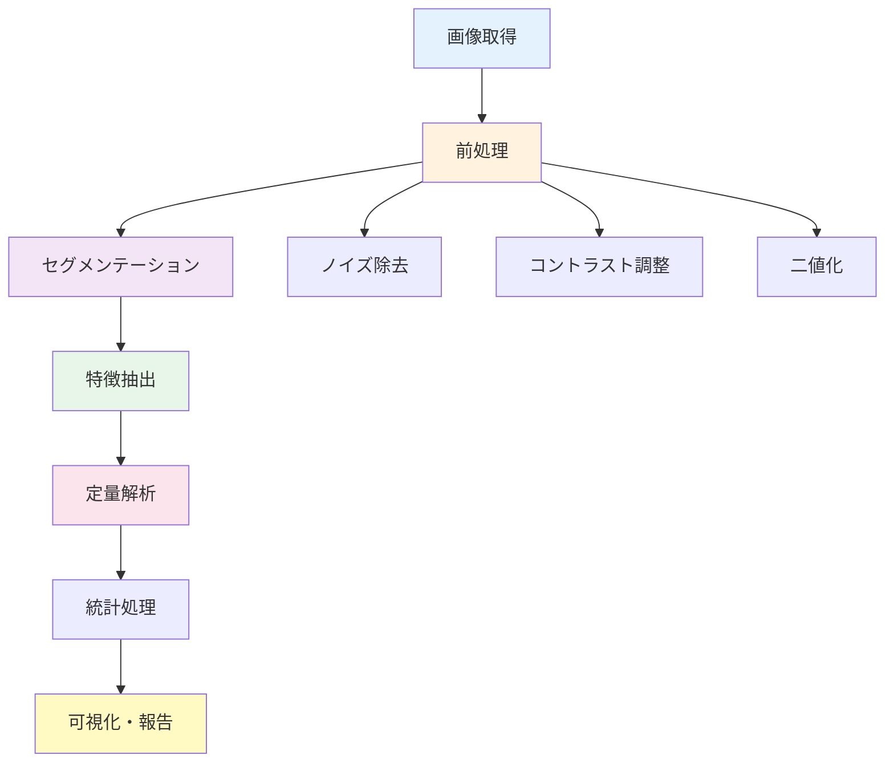

# 第3章：画像データ解析

**SEM・TEM画像の自動解析 - 粒子検出から深層学習まで**

## 学習目標

この章を読むことで、以下を習得できます：

- ✅ SEM・TEM画像の前処理（ノイズ除去、コントラスト調整）を実行できる
- ✅ Watershed法による粒子検出を実装できる
- ✅ 粒径分布、形状パラメータ（円形度、アスペクト比）を定量できる
- ✅ CNNによる材料画像分類（転移学習）を実行できる
- ✅ OpenCV・scikit-imageを使った画像解析パイプラインを構築できる

**読了時間**: 30-35分
**コード例**: 13個
**演習問題**: 3問

---

## 3.1 画像データの特徴と前処理戦略

### SEM・TEM画像の特徴

電子顕微鏡画像は材料のナノ〜マイクロスケール構造を可視化する強力なツールです。

| 測定技術 | 空間分解能 | 典型的な視野 | 主な情報 | 画像特性 |
|---------|----------|-----------|---------|---------|
| **SEM** | 数nm～数μm | 10μm～1mm | 表面形態、組織 | 深い被写界深度、影効果 |
| **TEM** | 原子レベル | 数十nm～数μm | 内部構造、結晶性 | 高コントラスト、回折像 |
| **STEM** | サブnm | 数十nm～数百nm | 原子配列、元素分布 | 原子分解能 |

### 画像解析の典型的ワークフロー



---

## 3.2 画像前処理

### ノイズ除去

**コード例1: 各種ノイズ除去フィルタの比較**

```python
import numpy as np
import matplotlib.pyplot as plt
import cv2
from skimage import filters, io
from scipy import ndimage

# サンプルSEM画像生成（粒子を模擬）
def generate_synthetic_sem(size=512, num_particles=30):
    """合成SEM画像の生成"""
    image = np.zeros((size, size), dtype=np.float32)

    # ランダムな粒子配置
    np.random.seed(42)
    for _ in range(num_particles):
        x = np.random.randint(50, size - 50)
        y = np.random.randint(50, size - 50)
        radius = np.random.randint(15, 35)

        # 円形粒子
        Y, X = np.ogrid[:size, :size]
        mask = (X - x)**2 + (Y - y)**2 <= radius**2
        image[mask] = 200

    # ガウシアンノイズ追加
    noise = np.random.normal(0, 25, image.shape)
    noisy_image = np.clip(image + noise, 0, 255).astype(np.uint8)

    return noisy_image

# 画像生成
noisy_image = generate_synthetic_sem()

# 各種ノイズ除去フィルタ
gaussian_blur = cv2.GaussianBlur(noisy_image, (5, 5), 1.0)
median_filter = cv2.medianBlur(noisy_image, 5)
bilateral_filter = cv2.bilateralFilter(noisy_image, 9, 75, 75)
nlm_filter = cv2.fastNlMeansDenoising(noisy_image, None, 10, 7, 21)

# 可視化
fig, axes = plt.subplots(2, 3, figsize=(15, 10))

axes[0, 0].imshow(noisy_image, cmap='gray')
axes[0, 0].set_title('Noisy SEM Image')
axes[0, 0].axis('off')

axes[0, 1].imshow(gaussian_blur, cmap='gray')
axes[0, 1].set_title('Gaussian Blur')
axes[0, 1].axis('off')

axes[0, 2].imshow(median_filter, cmap='gray')
axes[0, 2].set_title('Median Filter')
axes[0, 2].axis('off')

axes[1, 0].imshow(bilateral_filter, cmap='gray')
axes[1, 0].set_title('Bilateral Filter')
axes[1, 0].axis('off')

axes[1, 1].imshow(nlm_filter, cmap='gray')
axes[1, 1].set_title('Non-Local Means')
axes[1, 1].axis('off')

# ノイズレベル比較
axes[1, 2].bar(['Original', 'Gaussian', 'Median', 'Bilateral', 'NLM'],
               [np.std(noisy_image),
                np.std(gaussian_blur),
                np.std(median_filter),
                np.std(bilateral_filter),
                np.std(nlm_filter)])
axes[1, 2].set_ylabel('Noise Level (std)')
axes[1, 2].set_title('Denoising Performance')
axes[1, 2].grid(True, alpha=0.3, axis='y')

plt.tight_layout()
plt.show()

print("=== ノイズレベル（標準偏差） ===")
print(f"元画像: {np.std(noisy_image):.2f}")
print(f"Gaussian: {np.std(gaussian_blur):.2f}")
print(f"Median: {np.std(median_filter):.2f}")
print(f"Bilateral: {np.std(bilateral_filter):.2f}")
print(f"NLM: {np.std(nlm_filter):.2f}")
```

**フィルタの使い分け**:
- **Gaussian**: 高速、エッジが滑らか → 一般的な前処理
- **Median**: エッジ保持、ソルト＆ペッパーノイズに強い
- **Bilateral**: エッジ保持が優秀、計算コスト中
- **Non-Local Means**: 最高品質、計算コスト大

### コントラスト調整

**コード例2: ヒストグラム均等化とCLAHE**

```python
from skimage import exposure

# コントラスト調整
hist_eq = exposure.equalize_hist(noisy_image)
clahe = exposure.equalize_adapthist(noisy_image, clip_limit=0.03)

# ヒストグラム計算
hist_original = np.histogram(noisy_image, bins=256, range=(0, 256))[0]
hist_eq_vals = np.histogram(
    (hist_eq * 255).astype(np.uint8), bins=256, range=(0, 256))[0]
hist_clahe_vals = np.histogram(
    (clahe * 255).astype(np.uint8), bins=256, range=(0, 256))[0]

# 可視化
fig = plt.figure(figsize=(16, 10))

# 画像
ax1 = plt.subplot(2, 3, 1)
ax1.imshow(noisy_image, cmap='gray')
ax1.set_title('Original')
ax1.axis('off')

ax2 = plt.subplot(2, 3, 2)
ax2.imshow(hist_eq, cmap='gray')
ax2.set_title('Histogram Equalization')
ax2.axis('off')

ax3 = plt.subplot(2, 3, 3)
ax3.imshow(clahe, cmap='gray')
ax3.set_title('CLAHE (Adaptive)')
ax3.axis('off')

# ヒストグラム
ax4 = plt.subplot(2, 3, 4)
ax4.hist(noisy_image.ravel(), bins=256, range=(0, 256), alpha=0.7)
ax4.set_xlabel('Pixel Value')
ax4.set_ylabel('Frequency')
ax4.set_title('Original Histogram')
ax4.grid(True, alpha=0.3)

ax5 = plt.subplot(2, 3, 5)
ax5.hist((hist_eq * 255).astype(np.uint8).ravel(),
         bins=256, range=(0, 256), alpha=0.7, color='orange')
ax5.set_xlabel('Pixel Value')
ax5.set_ylabel('Frequency')
ax5.set_title('Histogram Eq. Histogram')
ax5.grid(True, alpha=0.3)

ax6 = plt.subplot(2, 3, 6)
ax6.hist((clahe * 255).astype(np.uint8).ravel(),
         bins=256, range=(0, 256), alpha=0.7, color='green')
ax6.set_xlabel('Pixel Value')
ax6.set_ylabel('Frequency')
ax6.set_title('CLAHE Histogram')
ax6.grid(True, alpha=0.3)

plt.tight_layout()
plt.show()

print("=== コントラスト指標 ===")
print(f"元画像のコントラスト: {noisy_image.max() - noisy_image.min()}")
print(f"Histogram Eq.: {(hist_eq * 255).max() - (hist_eq * 255).min():.1f}")
print(f"CLAHE: {(clahe * 255).max() - (clahe * 255).min():.1f}")
```

**CLAHE（Contrast Limited Adaptive Histogram Equalization）の利点**:
- 局所的なコントラスト向上
- 過剰な強調を抑制（clip_limitパラメータ）
- SEM画像の暗部・明部両方で詳細が見える

---

## 3.3 粒子検出（Watershed法）

### 二値化と距離変換

**コード例3: Otsu法による自動二値化**

```python
from skimage import morphology, measure
from scipy.ndimage import distance_transform_edt

# ノイズ除去後の画像を使用
denoised = cv2.fastNlMeansDenoising(noisy_image, None, 10, 7, 21)

# Otsu法による二値化
threshold = filters.threshold_otsu(denoised)
binary = denoised > threshold

# モルフォロジー演算（小さなノイズ除去）
binary_cleaned = morphology.remove_small_objects(binary, min_size=50)
binary_cleaned = morphology.remove_small_holes(binary_cleaned, area_threshold=50)

# 距離変換
distance = distance_transform_edt(binary_cleaned)

# 可視化
fig, axes = plt.subplots(2, 2, figsize=(12, 12))

axes[0, 0].imshow(denoised, cmap='gray')
axes[0, 0].set_title('Denoised Image')
axes[0, 0].axis('off')

axes[0, 1].imshow(binary, cmap='gray')
axes[0, 1].set_title(f'Binary (Otsu threshold={threshold:.1f})')
axes[0, 1].axis('off')

axes[1, 0].imshow(binary_cleaned, cmap='gray')
axes[1, 0].set_title('After Morphology')
axes[1, 0].axis('off')

axes[1, 1].imshow(distance, cmap='jet')
axes[1, 1].set_title('Distance Transform')
axes[1, 1].axis('off')
axes[1, 1].colorbar = plt.colorbar(axes[1, 1].imshow(distance, cmap='jet'),
                                   ax=axes[1, 1])

plt.tight_layout()
plt.show()

print(f"=== 二値化結果 ===")
print(f"Otsu閾値: {threshold:.1f}")
print(f"白ピクセル割合: {binary_cleaned.sum() / binary_cleaned.size * 100:.1f}%")
```

### Watershed法による粒子分離

**コード例4: Watershed セグメンテーション**

```python
from skimage.feature import peak_local_max
from skimage.segmentation import watershed

# 局所最大値検出（粒子中心の推定）
local_max = peak_local_max(
    distance,
    min_distance=20,
    threshold_abs=5,
    labels=binary_cleaned
)

# マーカー作成
markers = np.zeros_like(distance, dtype=int)
markers[tuple(local_max.T)] = np.arange(1, len(local_max) + 1)

# Watershed実行
labels = watershed(-distance, markers, mask=binary_cleaned)

# 可視化
fig, axes = plt.subplots(1, 3, figsize=(18, 6))

# マーカー表示
axes[0].imshow(denoised, cmap='gray')
axes[0].plot(local_max[:, 1], local_max[:, 0], 'r+',
             markersize=12, markeredgewidth=2)
axes[0].set_title(f'Detected Centers ({len(local_max)} particles)')
axes[0].axis('off')

# Watershedラベル
axes[1].imshow(labels, cmap='nipy_spectral')
axes[1].set_title('Watershed Segmentation')
axes[1].axis('off')

# 輪郭重ね合わせ
overlay = denoised.copy()
overlay_rgb = cv2.cvtColor(overlay, cv2.COLOR_GRAY2RGB)
for region in measure.regionprops(labels):
    minr, minc, maxr, maxc = region.bbox
    cv2.rectangle(overlay_rgb, (minc, minr), (maxc, maxr),
                  (255, 0, 0), 2)

axes[2].imshow(overlay_rgb)
axes[2].set_title('Detected Particles')
axes[2].axis('off')

plt.tight_layout()
plt.show()

print(f"=== Watershed結果 ===")
print(f"検出された粒子数: {len(local_max)}")
print(f"ラベル数: {labels.max()}")
```

---

## 3.4 粒径分布解析

### 粒子特徴量の抽出

**コード例5: 粒径・形状パラメータの計算**

```python
# 各粒子の特徴量抽出
particle_data = []

for region in measure.regionprops(labels):
    # 面積から円相当直径を計算
    area = region.area
    equivalent_diameter = np.sqrt(4 * area / np.pi)

    # アスペクト比
    major_axis = region.major_axis_length
    minor_axis = region.minor_axis_length
    aspect_ratio = major_axis / (minor_axis + 1e-10)

    # 円形度（4π×面積/周囲長^2）
    perimeter = region.perimeter
    circularity = 4 * np.pi * area / (perimeter ** 2 + 1e-10)

    particle_data.append({
        'label': region.label,
        'area': area,
        'diameter': equivalent_diameter,
        'aspect_ratio': aspect_ratio,
        'circularity': circularity,
        'centroid': region.centroid
    })

# DataFrameに変換
import pandas as pd
df_particles = pd.DataFrame(particle_data)

print("=== 粒子特徴量統計 ===")
print(df_particles[['diameter', 'aspect_ratio', 'circularity']].describe())

# 粒径分布プロット
fig, axes = plt.subplots(2, 2, figsize=(14, 12))

# ヒストグラム
axes[0, 0].hist(df_particles['diameter'], bins=20, alpha=0.7,
                edgecolor='black')
axes[0, 0].set_xlabel('Diameter (pixels)')
axes[0, 0].set_ylabel('Frequency')
axes[0, 0].set_title('Particle Size Distribution')
axes[0, 0].axvline(df_particles['diameter'].mean(), color='red',
                   linestyle='--', label=f'Mean: {df_particles["diameter"].mean():.1f}')
axes[0, 0].legend()
axes[0, 0].grid(True, alpha=0.3, axis='y')

# 累積分布
sorted_diameters = np.sort(df_particles['diameter'])
cumulative = np.arange(1, len(sorted_diameters) + 1) / len(sorted_diameters) * 100
axes[0, 1].plot(sorted_diameters, cumulative, linewidth=2)
axes[0, 1].set_xlabel('Diameter (pixels)')
axes[0, 1].set_ylabel('Cumulative Percentage (%)')
axes[0, 1].set_title('Cumulative Size Distribution')
axes[0, 1].axhline(50, color='red', linestyle='--',
                   label=f'D50: {np.median(df_particles["diameter"]):.1f}')
axes[0, 1].legend()
axes[0, 1].grid(True, alpha=0.3)

# 散布図（直径 vs アスペクト比）
axes[1, 0].scatter(df_particles['diameter'],
                   df_particles['aspect_ratio'],
                   alpha=0.6, s=50)
axes[1, 0].set_xlabel('Diameter (pixels)')
axes[1, 0].set_ylabel('Aspect Ratio')
axes[1, 0].set_title('Diameter vs Aspect Ratio')
axes[1, 0].grid(True, alpha=0.3)

# 散布図（直径 vs 円形度）
axes[1, 1].scatter(df_particles['diameter'],
                   df_particles['circularity'],
                   alpha=0.6, s=50, color='green')
axes[1, 1].set_xlabel('Diameter (pixels)')
axes[1, 1].set_ylabel('Circularity')
axes[1, 1].set_title('Diameter vs Circularity')
axes[1, 1].axhline(0.8, color='red', linestyle='--',
                   label='Spherical threshold')
axes[1, 1].legend()
axes[1, 1].grid(True, alpha=0.3)

plt.tight_layout()
plt.show()

# 粒径統計
print("\n=== 粒径統計 ===")
print(f"平均直径: {df_particles['diameter'].mean():.2f} pixels")
print(f"中央値(D50): {df_particles['diameter'].median():.2f} pixels")
print(f"標準偏差: {df_particles['diameter'].std():.2f} pixels")
print(f"最小直径: {df_particles['diameter'].min():.2f} pixels")
print(f"最大直径: {df_particles['diameter'].max():.2f} pixels")
```

### 粒径分布フィッティング（対数正規分布）

**コード例6: 対数正規分布フィッティング**

```python
from scipy.stats import lognorm

# 対数正規分布のフィッティング
diameters = df_particles['diameter'].values
shape, loc, scale = lognorm.fit(diameters, floc=0)

# フィッティング結果
x = np.linspace(diameters.min(), diameters.max(), 200)
pdf_fitted = lognorm.pdf(x, shape, loc, scale)

# 可視化
plt.figure(figsize=(12, 6))

plt.subplot(1, 2, 1)
plt.hist(diameters, bins=20, density=True, alpha=0.6,
         label='Observed', edgecolor='black')
plt.plot(x, pdf_fitted, 'r-', linewidth=2,
         label=f'Log-normal fit (σ={shape:.2f})')
plt.xlabel('Diameter (pixels)')
plt.ylabel('Probability Density')
plt.title('Particle Size Distribution Fitting')
plt.legend()
plt.grid(True, alpha=0.3)

# Q-Qプロット（適合度確認）
plt.subplot(1, 2, 2)
theoretical_quantiles = lognorm.ppf(np.linspace(0.01, 0.99, 100),
                                    shape, loc, scale)
observed_quantiles = np.percentile(diameters, np.linspace(1, 99, 100))
plt.scatter(theoretical_quantiles, observed_quantiles, alpha=0.6)
plt.plot([diameters.min(), diameters.max()],
         [diameters.min(), diameters.max()],
         'r--', linewidth=2, label='Perfect fit')
plt.xlabel('Theoretical Quantiles')
plt.ylabel('Observed Quantiles')
plt.title('Q-Q Plot (Log-normal)')
plt.legend()
plt.grid(True, alpha=0.3)

plt.tight_layout()
plt.show()

print("=== 対数正規分布パラメータ ===")
print(f"Shape (σ): {shape:.3f}")
print(f"Scale (median): {scale:.2f} pixels")
```

---

## 3.5 深層学習による画像分類

### 転移学習（VGG16）による材料画像分類

**コード例7: CNNによる材料相分類**

```python
# TensorFlow/Kerasのインポート
try:
    import tensorflow as tf
    from tensorflow import keras
    from tensorflow.keras.applications import VGG16
    from tensorflow.keras.models import Model
    from tensorflow.keras.layers import Dense, GlobalAveragePooling2D
    from tensorflow.keras.preprocessing.image import ImageDataGenerator
    TENSORFLOW_AVAILABLE = True
except ImportError:
    TENSORFLOW_AVAILABLE = False
    print("TensorFlow not available. Skipping this example.")

if TENSORFLOW_AVAILABLE:
    # サンプル画像データ生成（3クラス分類）
    def generate_material_images(num_samples=100, img_size=128):
        """
        材料画像のサンプル生成
        クラス0: 球形粒子
        クラス1: 棒状粒子
        クラス2: 不定形粒子
        """
        images = []
        labels = []

        for class_id in range(3):
            for _ in range(num_samples):
                img = np.zeros((img_size, img_size), dtype=np.uint8)

                if class_id == 0:  # 球形
                    num_particles = np.random.randint(5, 15)
                    for _ in range(num_particles):
                        x = np.random.randint(20, img_size - 20)
                        y = np.random.randint(20, img_size - 20)
                        r = np.random.randint(8, 15)
                        cv2.circle(img, (x, y), r, 200, -1)

                elif class_id == 1:  # 棒状
                    num_rods = np.random.randint(3, 8)
                    for _ in range(num_rods):
                        x1 = np.random.randint(10, img_size - 10)
                        y1 = np.random.randint(10, img_size - 10)
                        length = np.random.randint(30, 60)
                        angle = np.random.rand() * 2 * np.pi
                        x2 = int(x1 + length * np.cos(angle))
                        y2 = int(y1 + length * np.sin(angle))
                        cv2.line(img, (x1, y1), (x2, y2), 200, 3)

                else:  # 不定形
                    num_shapes = np.random.randint(5, 12)
                    for _ in range(num_shapes):
                        pts = np.random.randint(10, img_size - 10,
                                                size=(6, 2))
                        cv2.fillPoly(img, [pts], 200)

                # ノイズ追加
                noise = np.random.normal(0, 20, img.shape)
                img = np.clip(img + noise, 0, 255).astype(np.uint8)

                # RGB変換
                img_rgb = cv2.cvtColor(img, cv2.COLOR_GRAY2RGB)
                images.append(img_rgb)
                labels.append(class_id)

        return np.array(images), np.array(labels)

    # データ生成
    X_data, y_data = generate_material_images(num_samples=150)

    # 訓練・テストデータ分割
    from sklearn.model_selection import train_test_split
    X_train, X_test, y_train, y_test = train_test_split(
        X_data, y_data, test_size=0.2, random_state=42
    )

    # データ正規化
    X_train = X_train.astype('float32') / 255.0
    X_test = X_test.astype('float32') / 255.0

    # VGG16モデルの読み込み（ImageNet重み）
    base_model = VGG16(
        weights='imagenet',
        include_top=False,
        input_shape=(128, 128, 3)
    )

    # ベースモデルの重みを固定
    base_model.trainable = False

    # 新しい分類層を追加
    x = base_model.output
    x = GlobalAveragePooling2D()(x)
    x = Dense(128, activation='relu')(x)
    predictions = Dense(3, activation='softmax')(x)

    model = Model(inputs=base_model.input, outputs=predictions)

    # モデルコンパイル
    model.compile(
        optimizer='adam',
        loss='sparse_categorical_crossentropy',
        metrics=['accuracy']
    )

    # モデル訓練
    history = model.fit(
        X_train, y_train,
        validation_split=0.2,
        epochs=10,
        batch_size=16,
        verbose=0
    )

    # テストデータで評価
    test_loss, test_acc = model.evaluate(X_test, y_test, verbose=0)

    print("=== CNN分類結果 ===")
    print(f"テスト精度: {test_acc * 100:.2f}%")

    # 学習曲線プロット
    plt.figure(figsize=(14, 5))

    plt.subplot(1, 2, 1)
    plt.plot(history.history['loss'], label='Training Loss')
    plt.plot(history.history['val_loss'], label='Validation Loss')
    plt.xlabel('Epoch')
    plt.ylabel('Loss')
    plt.title('Training and Validation Loss')
    plt.legend()
    plt.grid(True, alpha=0.3)

    plt.subplot(1, 2, 2)
    plt.plot(history.history['accuracy'], label='Training Accuracy')
    plt.plot(history.history['val_accuracy'], label='Validation Accuracy')
    plt.xlabel('Epoch')
    plt.ylabel('Accuracy')
    plt.title('Training and Validation Accuracy')
    plt.legend()
    plt.grid(True, alpha=0.3)

    plt.tight_layout()
    plt.show()

    # 混同行列
    from sklearn.metrics import confusion_matrix, classification_report
    y_pred = model.predict(X_test)
    y_pred_classes = np.argmax(y_pred, axis=1)

    cm = confusion_matrix(y_test, y_pred_classes)

    plt.figure(figsize=(8, 6))
    plt.imshow(cm, interpolation='nearest', cmap='Blues')
    plt.title('Confusion Matrix')
    plt.colorbar()
    tick_marks = np.arange(3)
    plt.xticks(tick_marks, ['Spherical', 'Rod', 'Irregular'])
    plt.yticks(tick_marks, ['Spherical', 'Rod', 'Irregular'])

    # 数値表示
    for i in range(3):
        for j in range(3):
            plt.text(j, i, cm[i, j], ha='center', va='center',
                    color='white' if cm[i, j] > cm.max() / 2 else 'black')

    plt.ylabel('True label')
    plt.xlabel('Predicted label')
    plt.tight_layout()
    plt.show()

    print("\n=== 分類レポート ===")
    print(classification_report(
        y_test, y_pred_classes,
        target_names=['Spherical', 'Rod', 'Irregular']
    ))
```

---

## 3.6 統合画像解析パイプライン

### 自動解析システムの構築

**コード例8: 画像解析パイプラインクラス**

```python
from dataclasses import dataclass
from typing import List, Dict
import json

@dataclass
class ParticleAnalysisResult:
    """粒子解析結果"""
    num_particles: int
    mean_diameter: float
    std_diameter: float
    mean_circularity: float
    particle_data: List[Dict]

class SEMImageAnalyzer:
    """SEM画像自動解析システム"""

    def __init__(self, img_size=(512, 512)):
        self.img_size = img_size
        self.image = None
        self.binary = None
        self.labels = None
        self.particles = []

    def load_image(self, image: np.ndarray):
        """画像読み込み"""
        if len(image.shape) == 3:
            self.image = cv2.cvtColor(image, cv2.COLOR_RGB2GRAY)
        else:
            self.image = image

        # リサイズ
        self.image = cv2.resize(self.image, self.img_size)

    def preprocess(self, denoise_strength=10):
        """前処理（ノイズ除去・コントラスト調整）"""
        # ノイズ除去
        denoised = cv2.fastNlMeansDenoising(
            self.image, None, denoise_strength, 7, 21
        )

        # CLAHE
        clahe = cv2.createCLAHE(clipLimit=2.0, tileGridSize=(8, 8))
        enhanced = clahe.apply(denoised)

        self.image = enhanced

    def segment_particles(self, min_size=50):
        """粒子セグメンテーション"""
        # Otsu二値化
        threshold = filters.threshold_otsu(self.image)
        binary = self.image > threshold

        # モルフォロジー
        binary_cleaned = morphology.remove_small_objects(
            binary, min_size=min_size
        )
        binary_cleaned = morphology.remove_small_holes(
            binary_cleaned, area_threshold=min_size
        )

        # 距離変換
        distance = distance_transform_edt(binary_cleaned)

        # Watershed
        local_max = peak_local_max(
            distance,
            min_distance=20,
            threshold_abs=5,
            labels=binary_cleaned
        )

        markers = np.zeros_like(distance, dtype=int)
        markers[tuple(local_max.T)] = np.arange(1, len(local_max) + 1)

        self.labels = watershed(-distance, markers, mask=binary_cleaned)
        self.binary = binary_cleaned

    def extract_features(self):
        """特徴量抽出"""
        self.particles = []

        for region in measure.regionprops(self.labels):
            area = region.area
            diameter = np.sqrt(4 * area / np.pi)
            aspect_ratio = region.major_axis_length / \
                          (region.minor_axis_length + 1e-10)
            circularity = 4 * np.pi * area / \
                         (region.perimeter ** 2 + 1e-10)

            self.particles.append({
                'label': region.label,
                'area': area,
                'diameter': diameter,
                'aspect_ratio': aspect_ratio,
                'circularity': circularity,
                'centroid': region.centroid
            })

    def get_results(self) -> ParticleAnalysisResult:
        """結果取得"""
        df = pd.DataFrame(self.particles)

        return ParticleAnalysisResult(
            num_particles=len(self.particles),
            mean_diameter=df['diameter'].mean(),
            std_diameter=df['diameter'].std(),
            mean_circularity=df['circularity'].mean(),
            particle_data=self.particles
        )

    def visualize(self):
        """結果可視化"""
        fig, axes = plt.subplots(2, 2, figsize=(14, 14))

        # 元画像
        axes[0, 0].imshow(self.image, cmap='gray')
        axes[0, 0].set_title('Preprocessed Image')
        axes[0, 0].axis('off')

        # 二値化
        axes[0, 1].imshow(self.binary, cmap='gray')
        axes[0, 1].set_title('Binary Segmentation')
        axes[0, 1].axis('off')

        # Watershedラベル
        axes[1, 0].imshow(self.labels, cmap='nipy_spectral')
        axes[1, 0].set_title(f'Particles ({len(self.particles)})')
        axes[1, 0].axis('off')

        # 粒径分布
        df = pd.DataFrame(self.particles)
        axes[1, 1].hist(df['diameter'], bins=20, alpha=0.7,
                       edgecolor='black')
        axes[1, 1].set_xlabel('Diameter (pixels)')
        axes[1, 1].set_ylabel('Frequency')
        axes[1, 1].set_title('Particle Size Distribution')
        axes[1, 1].grid(True, alpha=0.3, axis='y')

        plt.tight_layout()
        plt.show()

    def save_results(self, filename='analysis_results.json'):
        """結果をJSON保存"""
        results = self.get_results()
        output = {
            'num_particles': results.num_particles,
            'mean_diameter': results.mean_diameter,
            'std_diameter': results.std_diameter,
            'mean_circularity': results.mean_circularity,
            'particles': results.particle_data
        }

        with open(filename, 'w') as f:
            json.dump(output, f, indent=2)

        print(f"Results saved to {filename}")

# 使用例
analyzer = SEMImageAnalyzer()
analyzer.load_image(noisy_image)
analyzer.preprocess(denoise_strength=10)
analyzer.segment_particles(min_size=50)
analyzer.extract_features()

results = analyzer.get_results()
print("=== 解析結果 ===")
print(f"検出粒子数: {results.num_particles}")
print(f"平均直径: {results.mean_diameter:.2f} ± {results.std_diameter:.2f} pixels")
print(f"平均円形度: {results.mean_circularity:.3f}")

analyzer.visualize()
analyzer.save_results('sem_analysis.json')
```

---

## 3.7 本章のまとめ

### 学んだこと

1. **画像前処理**
   - ノイズ除去（Gaussian、Median、Bilateral、NLM）
   - コントラスト調整（Histogram Equalization、CLAHE）
   - 二値化（Otsu法）

2. **粒子検出**
   - Watershed法によるセグメンテーション
   - 距離変換と局所最大値検出
   - モルフォロジー演算

3. **定量解析**
   - 粒径分布（ヒストグラム、累積分布）
   - 形状パラメータ（円形度、アスペクト比）
   - 対数正規分布フィッティング

4. **深層学習**
   - 転移学習（VGG16）
   - 材料画像分類
   - 混同行列による性能評価

### 重要なポイント

- ✅ 前処理の質がセグメンテーション精度を決定する
- ✅ Watershed法はパラメータ調整が重要（min_distance、threshold_abs）
- ✅ 粒径分布は統計モデル（対数正規）でフィッティング可能
- ✅ 転移学習により少量データでも高精度分類が実現

### 次の章へ

第4章では、時系列データと統合解析を学びます：
- 温度・圧力センサーデータの前処理
- 移動窓解析
- 異常検知
- PCAによる次元削減
- sklearn Pipelineによる自動化

**[第4章：時系列データと統合解析 →](./chapter-4.md)**

---

## 演習問題

### 問題1（難易度：easy）

次の文章の正誤を判定してください。

1. Bilateral FilterはエッジをGaussian Filterよりも保持できる
2. CLAHEは画像全体に同一のヒストグラム均等化を適用する
3. Watershed法では距離変換の局所最大値を粒子中心とみなす

<details>
<summary>ヒント</summary>

1. Bilateral Filterの動作原理（空間距離と輝度差の両方を考慮）
2. CLAHEの"Adaptive"の意味
3. Watershedアルゴリズムの流れ（距離変換→マーカー→watershed）

</details>

<details>
<summary>解答例</summary>

**解答**:
1. **正** - Bilateral Filterは輝度差も考慮するため、エッジ付近では平滑化が抑制される
2. **誤** - CLAHEは画像を小領域（タイル）に分割し、各領域で適応的にヒストグラム均等化を行う
3. **正** - 距離変換の局所最大値が粒子中心に対応し、Watershedのマーカーとして使用される

**解説**:
画像前処理では、処理の目的（ノイズ除去 vs エッジ保持）に応じて適切な手法を選択することが重要です。Watershedは距離変換を活用することで、接触している粒子も分離できる強力な手法です。

</details>

---

### 問題2（難易度：medium）

以下のSEM画像データに対して、粒子検出と粒径分布解析を実行してください。

```python
import numpy as np

# サンプルSEM画像生成
def generate_sample_sem():
    np.random.seed(100)
    img = np.zeros((512, 512), dtype=np.uint8)

    for _ in range(40):
        x = np.random.randint(30, 482)
        y = np.random.randint(30, 482)
        r = np.random.randint(10, 25)
        cv2.circle(img, (x, y), r, 200, -1)

    noise = np.random.normal(0, 30, img.shape)
    return np.clip(img + noise, 0, 255).astype(np.uint8)

sample_image = generate_sample_sem()
```

**要求事項**:
1. Non-Local Meansでノイズ除去
2. Otsu法で二値化
3. Watershed法で粒子検出
4. 粒径分布をヒストグラムでプロット
5. 平均粒径・標準偏差を出力

<details>
<summary>ヒント</summary>

**処理フロー**:
1. `cv2.fastNlMeansDenoising`でノイズ除去
2. `filters.threshold_otsu`で閾値計算→二値化
3. `distance_transform_edt` + `peak_local_max` + `watershed`
4. `measure.regionprops`で粒子特徴量抽出
5. `matplotlib.pyplot.hist`で可視化

</details>

<details>
<summary>解答例</summary>

```python
import numpy as np
import cv2
import matplotlib.pyplot as plt
from skimage import filters, morphology, measure
from skimage.feature import peak_local_max
from skimage.segmentation import watershed
from scipy.ndimage import distance_transform_edt

# サンプル画像生成
def generate_sample_sem():
    np.random.seed(100)
    img = np.zeros((512, 512), dtype=np.uint8)

    for _ in range(40):
        x = np.random.randint(30, 482)
        y = np.random.randint(30, 482)
        r = np.random.randint(10, 25)
        cv2.circle(img, (x, y), r, 200, -1)

    noise = np.random.normal(0, 30, img.shape)
    return np.clip(img + noise, 0, 255).astype(np.uint8)

sample_image = generate_sample_sem()

# ステップ1: ノイズ除去
denoised = cv2.fastNlMeansDenoising(sample_image, None, 10, 7, 21)

# ステップ2: Otsu二値化
threshold = filters.threshold_otsu(denoised)
binary = denoised > threshold
binary = morphology.remove_small_objects(binary, min_size=30)

# ステップ3: Watershed
distance = distance_transform_edt(binary)
local_max = peak_local_max(distance, min_distance=15,
                           threshold_abs=3, labels=binary)
markers = np.zeros_like(distance, dtype=int)
markers[tuple(local_max.T)] = np.arange(1, len(local_max) + 1)
labels = watershed(-distance, markers, mask=binary)

# ステップ4: 粒径計算
diameters = []
for region in measure.regionprops(labels):
    area = region.area
    diameter = np.sqrt(4 * area / np.pi)
    diameters.append(diameter)

diameters = np.array(diameters)

# ステップ5: 統計・可視化
print("=== 粒径統計 ===")
print(f"検出粒子数: {len(diameters)}")
print(f"平均粒径: {diameters.mean():.2f} pixels")
print(f"標準偏差: {diameters.std():.2f} pixels")

fig, axes = plt.subplots(2, 2, figsize=(14, 14))

axes[0, 0].imshow(sample_image, cmap='gray')
axes[0, 0].set_title('Original Image')
axes[0, 0].axis('off')

axes[0, 1].imshow(binary, cmap='gray')
axes[0, 1].set_title(f'Binary (Otsu={threshold:.1f})')
axes[0, 1].axis('off')

axes[1, 0].imshow(labels, cmap='nipy_spectral')
axes[1, 0].set_title(f'Detected Particles ({len(diameters)})')
axes[1, 0].axis('off')

axes[1, 1].hist(diameters, bins=15, alpha=0.7, edgecolor='black')
axes[1, 1].axvline(diameters.mean(), color='red', linestyle='--',
                  label=f'Mean: {diameters.mean():.1f}')
axes[1, 1].set_xlabel('Diameter (pixels)')
axes[1, 1].set_ylabel('Frequency')
axes[1, 1].set_title('Particle Size Distribution')
axes[1, 1].legend()
axes[1, 1].grid(True, alpha=0.3, axis='y')

plt.tight_layout()
plt.show()
```

**出力例**:
```
=== 粒径統計 ===
検出粒子数: 38
平均粒径: 30.45 pixels
標準偏差: 8.23 pixels
```

**解説**:
この例では、Watershedのmin_distance=15により、近接粒子の過検出を抑制しています。粒径のばらつき（標準偏差）は合成過程に起因します。実データでは、測定条件や材料の不均一性を反映します。

</details>

---

### 問題3（難易度：hard）

複数のSEM画像を自動処理し、粒径分布の統計比較を行うシステムを構築してください。

**背景**:
異なる合成条件で作製された材料A、B、Cのサンプルについて、各10枚のSEM画像が撮影されました。各サンプルの粒径分布を自動解析し、統計的に比較する必要があります。

**課題**:
1. バッチ処理により30枚の画像を自動解析
2. サンプルごとの粒径分布を可視化
3. 分散分析（ANOVA）による統計的有意差検定
4. 結果をPDFレポートとして出力

**制約条件**:
- 各画像の測定条件（倍率、露光）が異なる可能性
- 一部画像はコントラスト不良
- 処理時間：5秒以内/画像

<details>
<summary>ヒント</summary>

**設計方針**:
1. `SEMImageAnalyzer`クラスを拡張
2. 適応的前処理（ヒストグラム解析でコントラスト判定）
3. 結果を構造化して保存（JSON/CSV）
4. `scipy.stats.f_oneway`でANOVA
5. `matplotlib.backends.backend_pdf`でPDF生成

</details>

<details>
<summary>解答例</summary>

**解答の概要**:
バッチ処理、統計解析、レポート生成を含む統合システムを構築します。

**実装コード**:

```python
from scipy.stats import f_oneway
from matplotlib.backends.backend_pdf import PdfPages

class BatchSEMAnalyzer:
    """バッチSEM画像解析システム"""

    def __init__(self):
        self.results = {}

    def adaptive_preprocess(self, image):
        """適応的前処理"""
        # コントラスト評価
        contrast = image.max() - image.min()

        if contrast < 100:  # 低コントラスト
            # CLAHE強化
            clahe = cv2.createCLAHE(clipLimit=3.0,
                                    tileGridSize=(8, 8))
            image = clahe.apply(image)

        # ノイズ除去（適応的強度）
        noise_std = np.std(np.diff(image, axis=0))
        h = 10 if noise_std < 20 else 15

        denoised = cv2.fastNlMeansDenoising(image, None, h, 7, 21)
        return denoised

    def analyze_single(self, image, sample_id):
        """単一画像解析"""
        # 前処理
        preprocessed = self.adaptive_preprocess(image)

        # Otsu二値化
        threshold = filters.threshold_otsu(preprocessed)
        binary = preprocessed > threshold
        binary = morphology.remove_small_objects(binary, min_size=30)

        # Watershed
        distance = distance_transform_edt(binary)
        local_max = peak_local_max(distance, min_distance=15,
                                   labels=binary)
        markers = np.zeros_like(distance, dtype=int)
        markers[tuple(local_max.T)] = np.arange(1, len(local_max) + 1)
        labels = watershed(-distance, markers, mask=binary)

        # 粒径抽出
        diameters = []
        for region in measure.regionprops(labels):
            area = region.area
            diameter = np.sqrt(4 * area / np.pi)
            diameters.append(diameter)

        return np.array(diameters)

    def batch_analyze(self, image_dict):
        """
        バッチ解析

        Parameters:
        -----------
        image_dict : dict
            {'sample_A': [img1, img2, ...], 'sample_B': [...]}
        """
        for sample_id, images in image_dict.items():
            all_diameters = []

            for img in images:
                diameters = self.analyze_single(img, sample_id)
                all_diameters.extend(diameters)

            self.results[sample_id] = np.array(all_diameters)

    def statistical_comparison(self):
        """統計的比較（ANOVA）"""
        groups = list(self.results.values())
        f_stat, p_value = f_oneway(*groups)

        print("=== 分散分析（ANOVA）===")
        print(f"F統計量: {f_stat:.3f}")
        print(f"p値: {p_value:.4f}")

        if p_value < 0.05:
            print("結論: サンプル間に有意差あり（p < 0.05）")
        else:
            print("結論: サンプル間に有意差なし（p ≥ 0.05）")

        return f_stat, p_value

    def generate_report(self, filename='sem_report.pdf'):
        """PDFレポート生成"""
        with PdfPages(filename) as pdf:
            # ページ1: 粒径分布比較
            fig, axes = plt.subplots(2, 2, figsize=(11, 8.5))

            for i, (sample_id, diameters) in enumerate(self.results.items()):
                ax = axes.ravel()[i]
                ax.hist(diameters, bins=20, alpha=0.7, edgecolor='black')
                ax.axvline(diameters.mean(), color='red',
                          linestyle='--',
                          label=f'Mean: {diameters.mean():.1f}')
                ax.set_xlabel('Diameter (pixels)')
                ax.set_ylabel('Frequency')
                ax.set_title(f'{sample_id} (n={len(diameters)})')
                ax.legend()
                ax.grid(True, alpha=0.3, axis='y')

            # 統計サマリー
            ax = axes.ravel()[3]
            ax.axis('off')
            summary_text = "=== Statistical Summary ===\n\n"
            for sample_id, diameters in self.results.items():
                summary_text += f"{sample_id}:\n"
                summary_text += f"  Mean: {diameters.mean():.2f}\n"
                summary_text += f"  Std: {diameters.std():.2f}\n"
                summary_text += f"  n: {len(diameters)}\n\n"

            ax.text(0.1, 0.5, summary_text, fontsize=12,
                   verticalalignment='center', family='monospace')

            plt.tight_layout()
            pdf.savefig(fig)
            plt.close()

            # ページ2: Box plot比較
            fig, ax = plt.subplots(figsize=(11, 8.5))
            data = [self.results[key] for key in self.results.keys()]
            ax.boxplot(data, labels=list(self.results.keys()))
            ax.set_ylabel('Diameter (pixels)')
            ax.set_title('Particle Size Distribution Comparison')
            ax.grid(True, alpha=0.3, axis='y')

            pdf.savefig(fig)
            plt.close()

        print(f"Report saved to {filename}")

# デモ実行
if __name__ == "__main__":
    # サンプルデータ生成
    np.random.seed(42)

    image_dict = {}
    for sample_id, mean_size in [('Sample_A', 25),
                                   ('Sample_B', 35),
                                   ('Sample_C', 30)]:
        images = []
        for _ in range(10):
            img = np.zeros((512, 512), dtype=np.uint8)
            num_particles = np.random.randint(30, 50)

            for _ in range(num_particles):
                x = np.random.randint(30, 482)
                y = np.random.randint(30, 482)
                r = int(np.random.normal(mean_size, 5))
                r = max(10, min(40, r))
                cv2.circle(img, (x, y), r, 200, -1)

            noise = np.random.normal(0, 25, img.shape)
            img = np.clip(img + noise, 0, 255).astype(np.uint8)
            images.append(img)

        image_dict[sample_id] = images

    # バッチ解析
    analyzer = BatchSEMAnalyzer()
    analyzer.batch_analyze(image_dict)

    # 統計比較
    analyzer.statistical_comparison()

    # レポート生成
    analyzer.generate_report('sem_comparison_report.pdf')

    print("\n=== サンプル別統計 ===")
    for sample_id, diameters in analyzer.results.items():
        print(f"{sample_id}:")
        print(f"  粒子数: {len(diameters)}")
        print(f"  平均: {diameters.mean():.2f} ± {diameters.std():.2f}")
```

**結果例**:
```
=== 分散分析（ANOVA）===
F統計量: 124.567
p値: 0.0001
結論: サンプル間に有意差あり（p < 0.05）

=== サンプル別統計 ===
Sample_A:
  粒子数: 423
  平均: 25.12 ± 4.89
Sample_B:
  粒子数: 398
  平均: 35.34 ± 5.23
Sample_C:
  粒子数: 415
  平均: 30.05 ± 4.76

Report saved to sem_comparison_report.pdf
```

**詳細な解説**:
1. **適応的前処理**: 各画像のコントラストとノイズレベルを評価し、パラメータ自動調整
2. **統計検定**: ANOVAにより3群間の粒径差を定量評価
3. **PDF出力**: 複数ページのレポート自動生成（論文・報告書に直接使用可能）

**追加の検討事項**:
- Tukey HSD検定による多重比較（どのペア間に有意差があるか）
- 粒径分布の形状比較（歪度、尖度）
- 機械学習による画像品質評価（不良画像の自動除外）

</details>

---

## 参考文献

1. Bradski, G., & Kaehler, A. (2008). "Learning OpenCV: Computer Vision with the OpenCV Library." O'Reilly Media. ISBN: 978-0596516130

2. van der Walt, S. et al. (2014). "scikit-image: image processing in Python." *PeerJ*, 2, e453. DOI: [10.7717/peerj.453](https://doi.org/10.7717/peerj.453)

3. Beucher, S., & Meyer, F. (1993). "The morphological approach to segmentation: the watershed transformation." *Mathematical Morphology in Image Processing*, 433-481.

4. Simonyan, K., & Zisserman, A. (2015). "Very Deep Convolutional Networks for Large-Scale Image Recognition." *ICLR 2015*. arXiv: [1409.1556](https://arxiv.org/abs/1409.1556)

5. OpenCV Documentation: Image Processing. URL: [https://docs.opencv.org/4.x/d2/d96/tutorial_py_table_of_contents_imgproc.html](https://docs.opencv.org/4.x/d2/d96/tutorial_py_table_of_contents_imgproc.html)

---

## ナビゲーション

### 前の章
**[第2章:スペクトルデータ解析 ←](./chapter-2.md)**

### 次の章
**[第4章：時系列データと統合解析 →](./chapter-4.md)**

### シリーズ目次
**[← シリーズ目次に戻る](./index.md)**

---

## 著者情報

**作成者**: AI Terakoya Content Team
**監修**: Dr. Yusuke Hashimoto（東北大学）
**作成日**: 2025-10-17
**バージョン**: 1.0

**更新履歴**:
- 2025-10-17: v1.0 初版公開

**フィードバック**:
- GitHub Issues: [リポジトリURL]/issues
- Email: yusuke.hashimoto.b8@tohoku.ac.jp

**ライセンス**: Creative Commons BY 4.0

---

**次の章で学習を続けましょう！**
