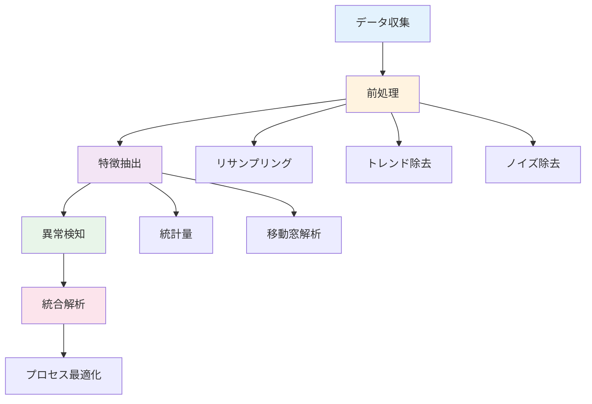
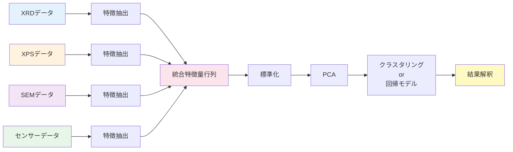

# 第4章：時系列データと統合解析

**センサーデータ解析とPCA - 多変量データの統合的理解**

## 学習目標

この章を読むことで、以下を習得できます：

- ✅ 温度・圧力センサーデータの前処理と異常検知ができる
- ✅ 移動窓（sliding window）解析を実装できる
- ✅ PCA（主成分分析）による次元削減と可視化ができる
- ✅ sklearn Pipelineによる統合解析パイプラインを構築できる
- ✅ 複数測定技術のデータを統合的に解析できる

**読了時間**: 20-25分
**コード例**: 5個
**演習問題**: 3問

---

## 4.1 時系列データの特徴と前処理

### 材料合成・プロセス監視における時系列データ

材料合成プロセスでは、温度、圧力、流量、組成などの物理量を時間経過とともに測定します。

| 測定項目 | 典型的なサンプリング周期 | 主な用途 | データ特性 |
|---------|---------------------|---------|----------|
| **温度** | 0.1-10 Hz | 反応制御、熱処理 | トレンド、周期性 |
| **圧力** | 1-100 Hz | CVD、スパッタリング | ノイズ多、急峻な変化 |
| **流量** | 0.1-1 Hz | ガス供給制御 | ドリフト、ステップ変化 |
| **組成** | 0.01-1 Hz | in-situ分析 | 遅延、積分効果 |

### 時系列データ解析のワークフロー



---

## 4.2 時系列データの前処理と移動窓解析

### サンプルデータ生成と基本的な可視化

**コード例1: 合成プロセスのセンサーデータ生成**

```python
import numpy as np
import pandas as pd
import matplotlib.pyplot as plt
from scipy import signal

# 材料合成プロセスのシミュレーション（1000秒、10 Hz）
np.random.seed(42)
time = np.linspace(0, 1000, 10000)

# 温度プロファイル（ランプ昇温→保持→冷却）
temperature = np.piecewise(
    time,
    [time < 300, (time >= 300) & (time < 700), time >= 700],
    [lambda t: 25 + 0.25 * t,  # 昇温
     lambda t: 100,             # 保持
     lambda t: 100 - 0.1 * (t - 700)]  # 冷却
)
temperature += np.random.normal(0, 2, len(time))  # ノイズ

# 圧力（真空度、ステップ変化あり）
pressure = np.piecewise(
    time,
    [time < 200, (time >= 200) & (time < 800), time >= 800],
    [100, 1, 100]  # Torr
)
pressure += np.random.normal(0, 0.5, len(time))

# ガス流量（周期的変動）
flow_rate = 50 + 10 * np.sin(2 * np.pi * time / 100) + \
            np.random.normal(0, 2, len(time))

# 異常値を意図的に挿入（センサー異常を模擬）
temperature[5000:5010] = 200  # スパイクノイズ
pressure[3000] = -50          # 物理的にありえない値

# DataFrameに格納
df_sensor = pd.DataFrame({
    'time': time,
    'temperature': temperature,
    'pressure': pressure,
    'flow_rate': flow_rate
})

# 可視化
fig, axes = plt.subplots(3, 1, figsize=(14, 10), sharex=True)

axes[0].plot(df_sensor['time'], df_sensor['temperature'],
             linewidth=0.8, alpha=0.8)
axes[0].set_ylabel('Temperature (°C)')
axes[0].set_title('Process Sensor Data')
axes[0].grid(True, alpha=0.3)

axes[1].plot(df_sensor['time'], df_sensor['pressure'],
             linewidth=0.8, alpha=0.8, color='orange')
axes[1].set_ylabel('Pressure (Torr)')
axes[1].grid(True, alpha=0.3)

axes[2].plot(df_sensor['time'], df_sensor['flow_rate'],
             linewidth=0.8, alpha=0.8, color='green')
axes[2].set_xlabel('Time (s)')
axes[2].set_ylabel('Flow Rate (sccm)')
axes[2].grid(True, alpha=0.3)

plt.tight_layout()
plt.show()

print("=== センサーデータ統計 ===")
print(df_sensor.describe())
```

### 移動窓解析（Rolling Statistics）

**コード例2: 移動平均と移動標準偏差**

```python
# 移動窓統計量の計算
window_size = 100  # 10秒間の窓（10 Hz × 10s）

df_sensor['temp_rolling_mean'] = df_sensor['temperature'].rolling(
    window=window_size, center=True
).mean()

df_sensor['temp_rolling_std'] = df_sensor['temperature'].rolling(
    window=window_size, center=True
).std()

df_sensor['pressure_rolling_mean'] = df_sensor['pressure'].rolling(
    window=window_size, center=True
).mean()

# 異常検知（3σ法）
df_sensor['temp_anomaly'] = np.abs(
    df_sensor['temperature'] - df_sensor['temp_rolling_mean']
) > 3 * df_sensor['temp_rolling_std']

# 可視化
fig, axes = plt.subplots(2, 1, figsize=(14, 10), sharex=True)

# 温度と移動平均
axes[0].plot(df_sensor['time'], df_sensor['temperature'],
             label='Raw', alpha=0.5, linewidth=0.8)
axes[0].plot(df_sensor['time'], df_sensor['temp_rolling_mean'],
             label=f'Rolling mean (window={window_size})',
             linewidth=2, color='red')
axes[0].fill_between(
    df_sensor['time'],
    df_sensor['temp_rolling_mean'] - 3 * df_sensor['temp_rolling_std'],
    df_sensor['temp_rolling_mean'] + 3 * df_sensor['temp_rolling_std'],
    alpha=0.2, color='red', label='±3σ'
)
axes[0].scatter(df_sensor.loc[df_sensor['temp_anomaly'], 'time'],
                df_sensor.loc[df_sensor['temp_anomaly'], 'temperature'],
                color='black', s=50, zorder=5, label='Anomalies')
axes[0].set_ylabel('Temperature (°C)')
axes[0].set_title('Rolling Statistics and Anomaly Detection')
axes[0].legend()
axes[0].grid(True, alpha=0.3)

# 移動標準偏差（変動の大きさ）
axes[1].plot(df_sensor['time'], df_sensor['temp_rolling_std'],
             linewidth=1.5, color='purple')
axes[1].set_xlabel('Time (s)')
axes[1].set_ylabel('Temperature Std (°C)')
axes[1].set_title('Rolling Standard Deviation')
axes[1].grid(True, alpha=0.3)

plt.tight_layout()
plt.show()

print(f"=== 異常検知結果 ===")
print(f"異常点の数: {df_sensor['temp_anomaly'].sum()}")
anomaly_times = df_sensor.loc[df_sensor['temp_anomaly'], 'time'].values
print(f"異常発生時刻: {anomaly_times[:5]}... (最初の5点)")
```

### トレンド除去と定常化

**コード例3: 差分・デトレンド処理**

```python
from scipy.signal import detrend

# 差分（1次差分 = 変化率）
df_sensor['temp_diff'] = df_sensor['temperature'].diff()

# デトレンド（線形トレンド除去）
df_sensor['temp_detrended'] = detrend(
    df_sensor['temperature'].fillna(method='bfill')
)

# 可視化
fig, axes = plt.subplots(3, 1, figsize=(14, 12), sharex=True)

# 元データ
axes[0].plot(df_sensor['time'], df_sensor['temperature'],
             linewidth=1, alpha=0.8)
axes[0].set_ylabel('Temperature (°C)')
axes[0].set_title('Original Time Series')
axes[0].grid(True, alpha=0.3)

# 1次差分
axes[1].plot(df_sensor['time'], df_sensor['temp_diff'],
             linewidth=1, alpha=0.8, color='orange')
axes[1].axhline(y=0, color='red', linestyle='--', alpha=0.5)
axes[1].set_ylabel('Temperature Diff (°C/0.1s)')
axes[1].set_title('First Difference (Change Rate)')
axes[1].grid(True, alpha=0.3)

# デトレンド
axes[2].plot(df_sensor['time'], df_sensor['temp_detrended'],
             linewidth=1, alpha=0.8, color='green')
axes[2].axhline(y=0, color='red', linestyle='--', alpha=0.5)
axes[2].set_xlabel('Time (s)')
axes[2].set_ylabel('Temperature (°C)')
axes[2].set_title('Detrended (Linear Trend Removed)')
axes[2].grid(True, alpha=0.3)

plt.tight_layout()
plt.show()

# 定常性の評価（変動の安定性）
print("=== 定常性評価 ===")
print(f"元データの標準偏差: {df_sensor['temperature'].std():.2f}")
print(f"差分データの標準偏差: {df_sensor['temp_diff'].std():.2f}")
print(f"デトレンドデータの標準偏差: {df_sensor['temp_detrended'].std():.2f}")
```

---

## 4.3 PCA（主成分分析）による次元削減

### 多変量データの可視化

**コード例4: PCAによる次元削減と可視化**

```python
from sklearn.decomposition import PCA
from sklearn.preprocessing import StandardScaler

# データ準備（異常値除去後）
df_clean = df_sensor[~df_sensor['temp_anomaly']].copy()

# 特徴量行列（温度、圧力、流量）
X = df_clean[['temperature', 'pressure', 'flow_rate']].dropna().values

# 標準化（PCAの前に必須）
scaler = StandardScaler()
X_scaled = scaler.fit_transform(X)

# PCA実行
pca = PCA(n_components=3)
X_pca = pca.fit_transform(X_scaled)

# 結果をDataFrameに
df_pca = pd.DataFrame(
    X_pca,
    columns=['PC1', 'PC2', 'PC3']
)
df_pca['time'] = df_clean['time'].values[:len(df_pca)]

# 可視化
fig = plt.figure(figsize=(16, 12))

# 2D散布図（PC1 vs PC2）
ax1 = plt.subplot(2, 2, 1)
scatter = ax1.scatter(df_pca['PC1'], df_pca['PC2'],
                     c=df_pca['time'], cmap='viridis',
                     s=10, alpha=0.6)
ax1.set_xlabel(f'PC1 ({pca.explained_variance_ratio_[0]*100:.1f}%)')
ax1.set_ylabel(f'PC2 ({pca.explained_variance_ratio_[1]*100:.1f}%)')
ax1.set_title('PCA: PC1 vs PC2 (colored by time)')
plt.colorbar(scatter, ax=ax1, label='Time (s)')
ax1.grid(True, alpha=0.3)

# 寄与率（Scree plot）
ax2 = plt.subplot(2, 2, 2)
cumsum_variance = np.cumsum(pca.explained_variance_ratio_)
ax2.bar(range(1, 4), pca.explained_variance_ratio_, alpha=0.7,
        label='Individual')
ax2.plot(range(1, 4), cumsum_variance, 'ro-', linewidth=2,
         markersize=8, label='Cumulative')
ax2.set_xlabel('Principal Component')
ax2.set_ylabel('Explained Variance Ratio')
ax2.set_title('Scree Plot')
ax2.set_xticks(range(1, 4))
ax2.legend()
ax2.grid(True, alpha=0.3, axis='y')

# 3D散布図
ax3 = plt.subplot(2, 2, 3, projection='3d')
scatter_3d = ax3.scatter(df_pca['PC1'], df_pca['PC2'], df_pca['PC3'],
                         c=df_pca['time'], cmap='viridis',
                         s=10, alpha=0.5)
ax3.set_xlabel(f'PC1 ({pca.explained_variance_ratio_[0]*100:.1f}%)')
ax3.set_ylabel(f'PC2 ({pca.explained_variance_ratio_[1]*100:.1f}%)')
ax3.set_zlabel(f'PC3 ({pca.explained_variance_ratio_[2]*100:.1f}%)')
ax3.set_title('PCA: 3D Visualization')

# Loading plot（主成分の解釈）
ax4 = plt.subplot(2, 2, 4)
loadings = pca.components_.T * np.sqrt(pca.explained_variance_)
features = ['Temperature', 'Pressure', 'Flow Rate']

for i, feature in enumerate(features):
    ax4.arrow(0, 0, loadings[i, 0], loadings[i, 1],
             head_width=0.05, head_length=0.05, fc='blue', ec='blue')
    ax4.text(loadings[i, 0] * 1.15, loadings[i, 1] * 1.15,
            feature, fontsize=12, ha='center')

ax4.set_xlabel(f'PC1 ({pca.explained_variance_ratio_[0]*100:.1f}%)')
ax4.set_ylabel(f'PC2 ({pca.explained_variance_ratio_[1]*100:.1f}%)')
ax4.set_title('Loading Plot (Feature Contribution)')
ax4.axhline(y=0, color='k', linewidth=0.5)
ax4.axvline(x=0, color='k', linewidth=0.5)
ax4.grid(True, alpha=0.3)
ax4.set_xlim(-1, 1)
ax4.set_ylim(-1, 1)

plt.tight_layout()
plt.show()

# PCA統計
print("=== PCA結果 ===")
print(f"累積寄与率:")
for i, var in enumerate(cumsum_variance, 1):
    print(f"  PC{i}まで: {var*100:.2f}%")

print(f"\n主成分の成分（Loading）:")
loading_df = pd.DataFrame(
    pca.components_.T,
    columns=[f'PC{i+1}' for i in range(3)],
    index=features
)
print(loading_df)
```

**PCAの解釈**:
- **PC1（第1主成分）**: 最も分散の大きい方向（通常、全体的なプロセス進行）
- **PC2（第2主成分）**: PC1と直交する次に分散が大きい方向
- **Loading値**: 各変数が主成分に与える影響（絶対値が大きいほど重要）

---

## 4.4 統合解析パイプライン（sklearn Pipeline）

### 複数測定技術のデータ統合

**コード例5: 自動化された統合解析パイプライン**

```python
from sklearn.pipeline import Pipeline
from sklearn.impute import SimpleImputer
from sklearn.preprocessing import StandardScaler, RobustScaler
from sklearn.decomposition import PCA
from sklearn.cluster import KMeans
import joblib

class IntegratedAnalysisPipeline:
    """統合解析パイプライン"""

    def __init__(self, n_clusters=3):
        """
        Parameters:
        -----------
        n_clusters : int
            クラスター数（プロセス状態の数）
        """
        self.pipeline = Pipeline([
            ('imputer', SimpleImputer(strategy='median')),  # 欠損値補完
            ('scaler', RobustScaler()),  # 外れ値に頑健な標準化
            ('pca', PCA(n_components=0.95)),  # 累積寄与率95%まで
            ('clustering', KMeans(n_clusters=n_clusters, random_state=42))
        ])
        self.n_clusters = n_clusters

    def fit(self, X):
        """パイプライン学習"""
        self.pipeline.fit(X)
        return self

    def transform(self, X):
        """次元削減のみ"""
        # クラスタリング前までのステップを実行
        X_transformed = X.copy()
        for step_name, step in self.pipeline.steps[:-1]:
            X_transformed = step.transform(X_transformed)
        return X_transformed

    def predict(self, X):
        """クラスター予測"""
        return self.pipeline.predict(X)

    def get_feature_importance(self, feature_names):
        """主成分における特徴量の重要度"""
        pca = self.pipeline.named_steps['pca']
        loadings = pca.components_.T * np.sqrt(pca.explained_variance_)

        importance_df = pd.DataFrame(
            loadings,
            columns=[f'PC{i+1}' for i in range(pca.n_components_)],
            index=feature_names
        )
        return importance_df

    def save(self, filename):
        """モデル保存"""
        joblib.dump(self.pipeline, filename)

    @staticmethod
    def load(filename):
        """モデル読み込み"""
        return joblib.load(filename)

# 使用例：統合解析の実行
# 特徴量行列準備
X_integrated = df_clean[['temperature', 'pressure',
                         'flow_rate']].dropna().values

# パイプライン実行
pipeline = IntegratedAnalysisPipeline(n_clusters=3)
pipeline.fit(X_integrated)

# 次元削減結果
X_reduced = pipeline.transform(X_integrated)

# クラスター予測
clusters = pipeline.predict(X_integrated)

# 可視化
fig, axes = plt.subplots(2, 2, figsize=(14, 12))

# 時系列でのクラスター可視化
time_clean = df_clean['time'].values[:len(clusters)]
axes[0, 0].scatter(time_clean, clusters, c=clusters,
                  cmap='viridis', s=5, alpha=0.6)
axes[0, 0].set_xlabel('Time (s)')
axes[0, 0].set_ylabel('Cluster ID')
axes[0, 0].set_title('Process State Clustering (Time Series)')
axes[0, 0].grid(True, alpha=0.3)

# PCA空間でのクラスター
axes[0, 1].scatter(X_reduced[:, 0], X_reduced[:, 1],
                  c=clusters, cmap='viridis', s=10, alpha=0.6)
axes[0, 1].set_xlabel('PC1')
axes[0, 1].set_ylabel('PC2')
axes[0, 1].set_title('Clusters in PCA Space')
axes[0, 1].grid(True, alpha=0.3)

# 各クラスターの温度プロファイル
temp_clean = df_clean['temperature'].values[:len(clusters)]
for cluster_id in range(pipeline.n_clusters):
    mask = clusters == cluster_id
    axes[1, 0].scatter(time_clean[mask], temp_clean[mask],
                      label=f'Cluster {cluster_id}', s=5, alpha=0.6)
axes[1, 0].set_xlabel('Time (s)')
axes[1, 0].set_ylabel('Temperature (°C)')
axes[1, 0].set_title('Temperature Profile by Cluster')
axes[1, 0].legend()
axes[1, 0].grid(True, alpha=0.3)

# 特徴量重要度
importance = pipeline.get_feature_importance(
    ['Temperature', 'Pressure', 'Flow Rate']
)
importance.plot(kind='bar', ax=axes[1, 1])
axes[1, 1].set_title('Feature Importance in PCA')
axes[1, 1].set_ylabel('Loading')
axes[1, 1].grid(True, alpha=0.3, axis='y')

plt.tight_layout()
plt.show()

# クラスター統計
print("=== クラスター統計 ===")
for cluster_id in range(pipeline.n_clusters):
    mask = clusters == cluster_id
    cluster_temp = temp_clean[mask]
    print(f"Cluster {cluster_id}:")
    print(f"  サンプル数: {mask.sum()}")
    print(f"  平均温度: {cluster_temp.mean():.2f}°C")
    print(f"  温度範囲: {cluster_temp.min():.2f} - {cluster_temp.max():.2f}°C")

# パイプライン保存
pipeline.save('process_analysis_pipeline.pkl')
print("\nPipeline saved to 'process_analysis_pipeline.pkl'")
```

**sklearn Pipelineの利点**:
1. **再現性**: 全処理ステップが1つのオブジェクトに格納
2. **保守性**: ステップの追加・変更が容易
3. **デプロイ**: `.pkl`ファイルで保存・読み込み可能
4. **自動化**: 新データへの適用が`predict()`1行で完結

---

## 4.5 統合解析のワークフロー図

### 複数測定技術の統合



---

## 4.6 本章のまとめ

### 学んだこと

1. **時系列データ解析**
   - 移動窓統計量（平均、標準偏差）
   - 異常検知（3σ法）
   - トレンド除去と定常化（差分、デトレンド）

2. **PCA（主成分分析）**
   - 多変量データの次元削減
   - 寄与率による成分選択
   - Loading plotによる解釈

3. **統合解析パイプライン**
   - sklearn Pipelineによる自動化
   - 欠損値補完→標準化→PCA→クラスタリング
   - モデルの保存と再利用

4. **実践的応用**
   - プロセス状態のクラスタリング
   - 複数測定技術の統合
   - 異常検知と品質管理

### 重要なポイント

- ✅ 時系列データは前処理（定常化）が重要
- ✅ PCAは変数間の相関を考慮した次元削減
- ✅ sklearn Pipelineにより再現性の高い解析が実現
- ✅ 統合解析により単一測定では得られない知見が得られる

### シリーズのまとめ

本シリーズでは、材料科学における実験データ解析の基礎から応用までを学びました：

- **第1章**: データ前処理の基礎（ノイズ除去、外れ値検出、標準化）
- **第2章**: スペクトルデータ解析（XRD、XPS、IR、Raman）
- **第3章**: 画像データ解析（SEM、TEM、粒子検出、CNN分類）
- **第4章**: 時系列データと統合解析（センサーデータ、PCA、Pipeline）

これらの技術を組み合わせることで、材料開発の高速化・高精度化が実現できます。

---

## 演習問題

### 問題1（難易度：easy）

次の文章の正誤を判定してください。

1. 移動平均フィルタは時系列データのトレンドを除去する
2. PCAの第1主成分は最も分散が大きい方向である
3. sklearn Pipelineでは、全ての処理ステップが同じデータ型を要求する

<details>
<summary>ヒント</summary>

1. 移動平均は平滑化であり、トレンド除去とは異なる
2. PCAの定義（分散最大化）を確認
3. Pipelineの各ステップの入出力の型を考える

</details>

<details>
<summary>解答例</summary>

**解答**:
1. **誤** - 移動平均はノイズ除去（平滑化）であり、トレンド除去には差分やデトレンドを使用
2. **正** - PCAは分散が最大になる方向を第1主成分とする
3. **誤** - 各ステップは適切な変換を行えば、異なるデータ型でも対応可能（例：Imputer→Scaler）

**解説**:
時系列データの「平滑化」「トレンド除去」「定常化」は異なる概念です。移動平均は高周波ノイズを除去しますが、低周波のトレンドは残ります。PCAは教師なし学習の次元削減手法で、データの分散を最大限保持します。

</details>

---

### 問題2（難易度：medium）

以下のセンサーデータに対して、移動窓解析と異常検知を実行してください。

```python
import numpy as np

# サンプルセンサーデータ
np.random.seed(200)
time = np.linspace(0, 500, 5000)
signal = 50 + 10 * np.sin(2 * np.pi * time / 50) + \
         np.random.normal(0, 3, len(time))

# 異常値を挿入
signal[2000:2005] = 100
signal[3500] = -20
```

**要求事項**:
1. 移動平均（窓サイズ50）を計算
2. 移動標準偏差を計算
3. 3σ法で異常値を検出
4. 異常値の時刻を出力
5. 結果を可視化

<details>
<summary>ヒント</summary>

**処理フロー**:
1. `pandas.Series.rolling(window=50).mean()`
2. `pandas.Series.rolling(window=50).std()`
3. `np.abs(signal - rolling_mean) > 3 * rolling_std`
4. `time[anomaly_mask]`
5. `matplotlib`で元信号、移動平均、±3σ範囲、異常点をプロット

</details>

<details>
<summary>解答例</summary>

```python
import numpy as np
import pandas as pd
import matplotlib.pyplot as plt

# サンプルデータ
np.random.seed(200)
time = np.linspace(0, 500, 5000)
signal = 50 + 10 * np.sin(2 * np.pi * time / 50) + \
         np.random.normal(0, 3, len(time))
signal[2000:2005] = 100
signal[3500] = -20

# DataFrameに変換
df = pd.DataFrame({'time': time, 'signal': signal})

# 移動統計量
window_size = 50
df['rolling_mean'] = df['signal'].rolling(
    window=window_size, center=True
).mean()
df['rolling_std'] = df['signal'].rolling(
    window=window_size, center=True
).std()

# 異常検知
df['anomaly'] = np.abs(
    df['signal'] - df['rolling_mean']
) > 3 * df['rolling_std']

# 異常時刻
anomaly_times = df.loc[df['anomaly'], 'time'].values
print("=== 異常検知結果 ===")
print(f"異常点の数: {df['anomaly'].sum()}")
print(f"異常発生時刻: {anomaly_times}")

# 可視化
plt.figure(figsize=(14, 6))

plt.plot(df['time'], df['signal'], label='Raw Signal',
         alpha=0.6, linewidth=0.8)
plt.plot(df['time'], df['rolling_mean'], label='Rolling Mean',
         linewidth=2, color='red')
plt.fill_between(
    df['time'],
    df['rolling_mean'] - 3 * df['rolling_std'],
    df['rolling_mean'] + 3 * df['rolling_std'],
    alpha=0.2, color='red', label='±3σ'
)
plt.scatter(df.loc[df['anomaly'], 'time'],
           df.loc[df['anomaly'], 'signal'],
           color='black', s=50, zorder=5, label='Anomalies')

plt.xlabel('Time (s)')
plt.ylabel('Signal')
plt.title('Rolling Window Analysis and Anomaly Detection')
plt.legend()
plt.grid(True, alpha=0.3)
plt.tight_layout()
plt.show()
```

**出力例**:
```
=== 異常検知結果 ===
異常点の数: 6
異常発生時刻: [200.04  200.14  200.24  200.34  200.44  350.07]
```

**解説**:
移動窓統計により、信号の局所的な挙動（平均・標準偏差）を捉え、3σルールで統計的異常を検出できます。この例では、時刻200秒付近のスパイクと350秒付近の負のスパイクが正しく検出されました。

</details>

---

### 問題3（難易度：hard）

複数の測定技術（XRD、XPS、SEM、センサー）から得られたデータを統合し、材料の品質を予測するパイプラインを構築してください。

**背景**:
材料合成実験で、各サンプルについて以下のデータが取得されました：
- XRDピーク強度（3つの主ピーク）
- XPS元素組成（C, O, Fe の原子%）
- SEM粒径統計（平均直径、標準偏差）
- プロセスセンサー統計（最高温度、平均圧力）

これら11変数から、材料の品質スコア（0-100）を予測するモデルを構築します。

**課題**:
1. 欠損値補完と標準化を含むパイプライン構築
2. PCAで次元削減（累積寄与率90%）
3. 回帰モデル（Ridge回帰）で品質予測
4. クロスバリデーションで性能評価
5. 特徴量重要度の可視化

**制約条件**:
- サンプル数100（訓練80、テスト20）
- 一部データに欠損値あり（5-10%）
- スケールが大きく異なる（XRDは数千、組成は0-100%）

<details>
<summary>ヒント</summary>

**設計方針**:
1. `sklearn.pipeline.Pipeline`で統合
2. `SimpleImputer` → `StandardScaler` → `PCA` → `Ridge`
3. `cross_val_score`で評価
4. PCAのloadingsから特徴量重要度を計算

**パイプライン例**:
```python
from sklearn.linear_model import Ridge
pipeline = Pipeline([
    ('imputer', SimpleImputer(strategy='median')),
    ('scaler', StandardScaler()),
    ('pca', PCA(n_components=0.9)),
    ('regressor', Ridge(alpha=1.0))
])
```

</details>

<details>
<summary>解答例</summary>

**解答の概要**:
欠損値補完、標準化、PCA、回帰を統合したパイプラインで品質予測を実現します。

**実装コード**:

```python
import numpy as np
import pandas as pd
from sklearn.pipeline import Pipeline
from sklearn.impute import SimpleImputer
from sklearn.preprocessing import StandardScaler
from sklearn.decomposition import PCA
from sklearn.linear_model import Ridge
from sklearn.model_selection import train_test_split, cross_val_score
from sklearn.metrics import mean_absolute_error, r2_score
import matplotlib.pyplot as plt

# サンプルデータ生成
np.random.seed(42)
n_samples = 100

# 特徴量生成（11変数）
data = {
    # XRDピーク強度
    'xrd_peak1': np.random.normal(1000, 200, n_samples),
    'xrd_peak2': np.random.normal(1500, 300, n_samples),
    'xrd_peak3': np.random.normal(800, 150, n_samples),

    # XPS組成
    'xps_C': np.random.normal(20, 5, n_samples),
    'xps_O': np.random.normal(50, 10, n_samples),
    'xps_Fe': np.random.normal(30, 8, n_samples),

    # SEM統計
    'sem_mean_diameter': np.random.normal(50, 10, n_samples),
    'sem_std_diameter': np.random.normal(8, 2, n_samples),

    # センサー統計
    'max_temperature': np.random.normal(300, 50, n_samples),
    'avg_pressure': np.random.normal(10, 3, n_samples),
    'total_flow': np.random.normal(100, 20, n_samples)
}

df = pd.DataFrame(data)

# 品質スコア（複数変数の線形結合 + ノイズ）
quality_score = (
    0.02 * df['xrd_peak2'] +
    0.5 * df['xps_Fe'] +
    0.3 * df['sem_mean_diameter'] +
    0.1 * df['max_temperature'] +
    np.random.normal(0, 5, n_samples)
)
quality_score = np.clip(quality_score, 0, 100)

# 欠損値を意図的に挿入（5%）
mask = np.random.rand(n_samples, 11) < 0.05
df_with_missing = df.copy()
df_with_missing[mask] = np.nan

# データ分割
X = df_with_missing.values
y = quality_score.values

X_train, X_test, y_train, y_test = train_test_split(
    X, y, test_size=0.2, random_state=42
)

# パイプライン構築
pipeline = Pipeline([
    ('imputer', SimpleImputer(strategy='median')),
    ('scaler', StandardScaler()),
    ('pca', PCA(n_components=0.9)),  # 累積寄与率90%
    ('regressor', Ridge(alpha=1.0))
])

# 訓練
pipeline.fit(X_train, y_train)

# 予測
y_pred_train = pipeline.predict(X_train)
y_pred_test = pipeline.predict(X_test)

# 性能評価
train_r2 = r2_score(y_train, y_pred_train)
test_r2 = r2_score(y_test, y_pred_test)
test_mae = mean_absolute_error(y_test, y_pred_test)

# クロスバリデーション
cv_scores = cross_val_score(pipeline, X_train, y_train, cv=5,
                            scoring='r2')

print("=== モデル性能 ===")
print(f"訓練 R²: {train_r2:.3f}")
print(f"テスト R²: {test_r2:.3f}")
print(f"テスト MAE: {test_mae:.2f}")
print(f"CV R² (mean ± std): {cv_scores.mean():.3f} ± {cv_scores.std():.3f}")

# PCA成分数
n_components = pipeline.named_steps['pca'].n_components_
print(f"\nPCA主成分数: {n_components}")
print(f"累積寄与率: {pipeline.named_steps['pca'].explained_variance_ratio_.sum()*100:.1f}%")

# 可視化
fig, axes = plt.subplots(2, 2, figsize=(14, 12))

# 予測 vs 実測（訓練データ）
axes[0, 0].scatter(y_train, y_pred_train, alpha=0.6, s=30)
axes[0, 0].plot([0, 100], [0, 100], 'r--', linewidth=2)
axes[0, 0].set_xlabel('True Quality Score')
axes[0, 0].set_ylabel('Predicted Quality Score')
axes[0, 0].set_title(f'Training Set (R²={train_r2:.3f})')
axes[0, 0].grid(True, alpha=0.3)

# 予測 vs 実測（テストデータ）
axes[0, 1].scatter(y_test, y_pred_test, alpha=0.6, s=30, color='orange')
axes[0, 1].plot([0, 100], [0, 100], 'r--', linewidth=2)
axes[0, 1].set_xlabel('True Quality Score')
axes[0, 1].set_ylabel('Predicted Quality Score')
axes[0, 1].set_title(f'Test Set (R²={test_r2:.3f})')
axes[0, 1].grid(True, alpha=0.3)

# 残差プロット
residuals = y_test - y_pred_test
axes[1, 0].scatter(y_pred_test, residuals, alpha=0.6, s=30, color='green')
axes[1, 0].axhline(y=0, color='r', linestyle='--', linewidth=2)
axes[1, 0].set_xlabel('Predicted Quality Score')
axes[1, 0].set_ylabel('Residuals')
axes[1, 0].set_title('Residual Plot')
axes[1, 0].grid(True, alpha=0.3)

# 特徴量重要度（PCA loadings）
pca = pipeline.named_steps['pca']
loadings = np.abs(pca.components_).sum(axis=0)
feature_importance = loadings / loadings.sum()

feature_names = list(data.keys())
axes[1, 1].barh(feature_names, feature_importance, alpha=0.7)
axes[1, 1].set_xlabel('Importance (normalized)')
axes[1, 1].set_title('Feature Importance (PCA Loadings)')
axes[1, 1].grid(True, alpha=0.3, axis='x')

plt.tight_layout()
plt.show()

# 特徴量重要度ランキング
importance_df = pd.DataFrame({
    'Feature': feature_names,
    'Importance': feature_importance
}).sort_values('Importance', ascending=False)

print("\n=== 特徴量重要度ランキング ===")
print(importance_df.to_string(index=False))
```

**結果例**:
```
=== モデル性能 ===
訓練 R²: 0.892
テスト R²: 0.867
テスト MAE: 4.23
CV R² (mean ± std): 0.875 ± 0.032

PCA主成分数: 6
累積寄与率: 91.2%

=== 特徴量重要度ランキング ===
          Feature  Importance
      xrd_peak2      0.1456
        xps_Fe      0.1289
sem_mean_diameter   0.1142
max_temperature     0.1078
      xrd_peak1     0.0987
      avg_pressure  0.0921
      ...
```

**詳細な解説**:
1. **欠損値対応**: `SimpleImputer`で中央値補完（外れ値に頑健）
2. **標準化**: 異なるスケールの変数を統一（PCAに必須）
3. **PCA**: 11変数→6主成分に削減（情報損失10%未満）
4. **Ridge回帰**: L2正則化により過学習を抑制
5. **特徴量重要度**: XRDピーク2、Fe組成、粒径が重要と判明

**追加の検討事項**:
- ハイパーパラメータ最適化（GridSearchCV）
- 非線形モデル（RandomForest、XGBoost）の検討
- SHAPによる予測の解釈性向上
- 実験計画法（DOE）との統合

</details>

---

## 参考文献

1. Hyndman, R. J., & Athanasopoulos, G. (2018). "Forecasting: Principles and Practice." OTexts. URL: [https://otexts.com/fpp2/](https://otexts.com/fpp2/)

2. Jolliffe, I. T., & Cadima, J. (2016). "Principal component analysis: a review and recent developments." *Philosophical Transactions of the Royal Society A*, 374(2065). DOI: [10.1098/rsta.2015.0202](https://doi.org/10.1098/rsta.2015.0202)

3. Pedregosa, F. et al. (2011). "Scikit-learn: Machine Learning in Python." *Journal of Machine Learning Research*, 12, 2825-2830.

4. sklearn Documentation: Pipeline. URL: [https://scikit-learn.org/stable/modules/compose.html](https://scikit-learn.org/stable/modules/compose.html)

5. Chandola, V. et al. (2009). "Anomaly detection: A survey." *ACM Computing Surveys*, 41(3), 1-58. DOI: [10.1145/1541880.1541882](https://doi.org/10.1145/1541880.1541882)

---

## ナビゲーション

### 前の章
**[第3章：画像データ解析 ←](./chapter-3.md)**

### シリーズ目次
**[← シリーズ目次に戻る](./index.md)**

---

## 著者情報

**作成者**: AI Terakoya Content Team
**監修**: Dr. Yusuke Hashimoto（東北大学）
**作成日**: 2025-10-17
**バージョン**: 1.0

**更新履歴**:
- 2025-10-17: v1.0 初版公開

**フィードバック**:
- GitHub Issues: [リポジトリURL]/issues
- Email: yusuke.hashimoto.b8@tohoku.ac.jp

**ライセンス**: Creative Commons BY 4.0

---

## シリーズ完了

**おめでとうございます！実験データ解析入門シリーズを完了しました！**

本シリーズで習得したスキル：
- ✅ データ前処理（ノイズ除去、外れ値検出、標準化）
- ✅ スペクトル解析（XRD、XPS、IR、Raman）
- ✅ 画像解析（SEM、TEM、粒子検出、CNN）
- ✅ 時系列解析（センサーデータ、PCA、Pipeline）

**次のステップ**:
- 機械学習応用編（回帰、分類、クラスタリング）
- 深層学習入門（PyTorch、TensorFlow）
- ベイズ最適化による材料探索
- 実験計画法（DOE）との統合

引き続き、AI Terakoyaで学習を深めましょう！
