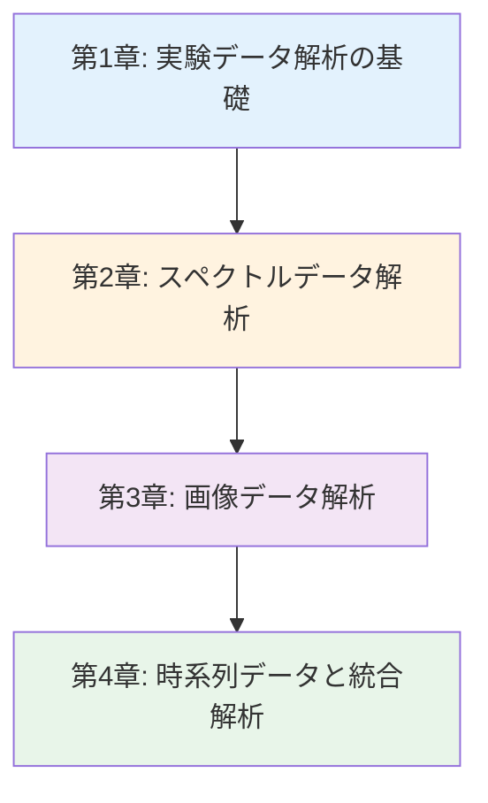
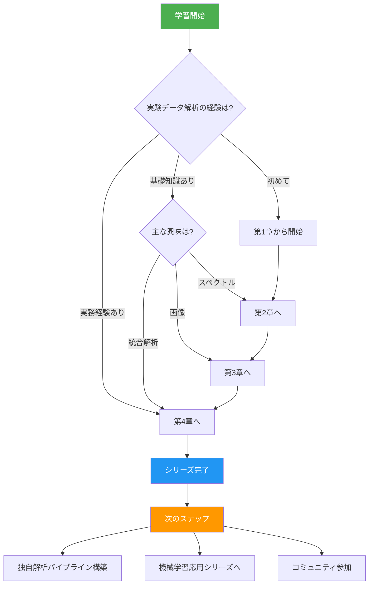
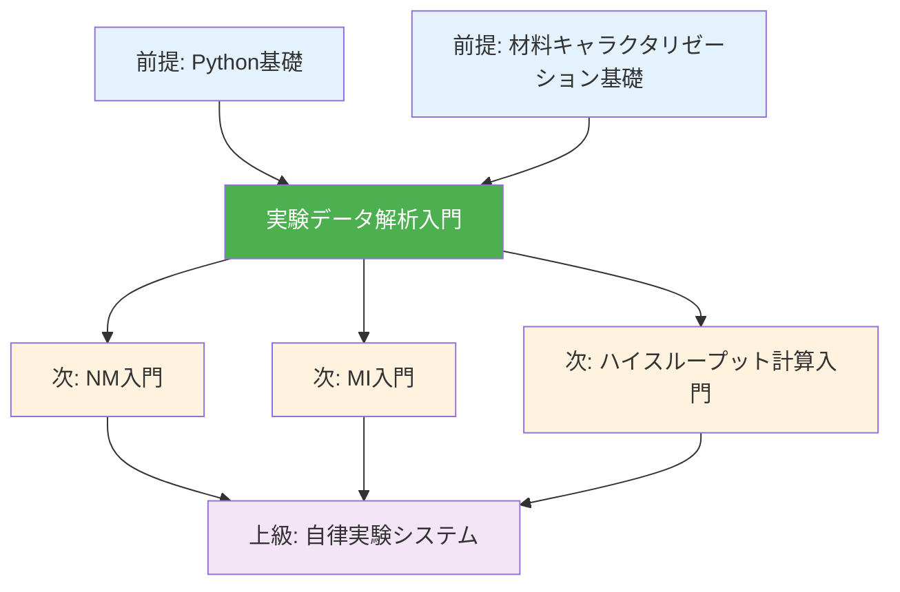

---
# ============================================
# 実験データ解析入門シリーズ v1.0 - Index
# ============================================

# --- 基本情報 ---
title: "実験データ解析入門シリーズ v1.0"
subtitle: "材料キャラクタリゼーションデータを Python で読み解く"
series: "実験データ解析入門シリーズ v1.0"
series_id: "experimental-data-analysis-introduction"
version: "1.0"

# --- 分類・難易度 ---
category: "practical"
level: "beginner-to-intermediate"
difficulty: "初級〜中級"
target_audience: "undergraduate-graduate-professionals"

# --- 学習メタデータ ---
total_reading_time: "100-120分"
total_chapters: 4
total_code_examples: 37
total_exercises: 12
case_studies: 4

# --- 日付情報 ---
created_at: "2025-10-17"
updated_at: "2025-10-17"

# --- 前提知識 ---
prerequisites:
  - "python-basics"
  - "basic-materials-characterization"

# --- 関連シリーズ ---
related_series:
  - "nm-introduction"
  - "mi-introduction"

# --- 応用分野 ---
applications:
  - "spectroscopy-analysis"
  - "microscopy-image-processing"
  - "materials-characterization-automation"

# --- 主要ツール ---
tools:
  - "scipy"
  - "scikit-image"
  - "OpenCV"
  - "pandas"
  - "matplotlib"

# --- 著者情報 ---
authors:
  - name: "Dr. Yusuke Hashimoto"
    affiliation: "Tohoku University"
    email: "yusuke.hashimoto.b8@tohoku.ac.jp"

# --- ライセンス ---
license: "CC BY 4.0"
language: "ja"

---

# 実験データ解析入門シリーズ v1.0

**材料キャラクタリゼーションデータを Python で読み解く**

## シリーズ概要

このシリーズは、材料科学における実験データ解析を初めて学ぶ方から、データ駆動型の実験解析スキルを身につけたい方まで、段階的に学べる全4章構成の教育コンテンツです。

材料科学研究では、XRD、XPS、SEM/TEM、各種スペクトル測定など、多様なキャラクタリゼーション技術からデータを取得します。しかし、従来の手動解析では、データ量の増加に対応できず、解析者の経験に依存するバイアスや再現性の問題が生じていました。

### なぜこのシリーズが必要か

**背景と課題**:
ハイスループット実験や自動測定装置の普及により、1日に数百〜数千のスペクトルや画像データが生成されるようになりました。従来の手動ピーク同定や目視による画像解析では、(1) 時間がかかりすぎる、(2) 解析者によって結果が異なる、(3) 大量データを体系的に扱えない、という限界があります。

**このシリーズで学べること**:
本シリーズでは、Python を用いた実験データの前処理、ノイズ除去、特徴抽出、統計解析、機械学習統合までを実践的に学習します。scipy、scikit-image、OpenCV などのライブラリを活用し、XRD パターン解析、SEM/TEM 画像処理、スペクトルデータ解析、時系列センサーデータ解析を網羅します。

**特徴:**
- ✅ **段階的な構成**: 各章は独立した記事として読むことができ、全4章で包括的な内容をカバー
- ✅ **実践重視**: 37個の実行可能なコード例、実験データを使用した実践演習
- ✅ **材料科学特化**: XRD、SEM/TEM、IR/Raman など材料キャラクタリゼーションに焦点
- ✅ **自動化重視**: バッチ処理、パイプライン構築、再現性確保の実践
- ✅ **機械学習統合**: 従来手法と深層学習の組み合わせによる高度な解析

**総学習時間**: 100-120分（コード実行と演習を含む）

**対象者**:
- 材料科学の学部生・大学院生（実験データの効率的解析を学びたい）
- 企業のR&Dエンジニア（測定データの自動解析を導入したい）
- 分析装置オペレーター（データ処理の高度化を目指す）
- データサイエンティスト（材料科学データへの応用を学びたい）

---

## 学習の進め方

### 推奨学習順序



**初学者の方（実験データ解析が初めて）:**
- 第1章 → 第2章 → 第3章 → 第4章（全章推奨）
- 所要時間: 100-120分
- 前提知識: Python基礎、基本的な材料キャラクタリゼーション知識

**中級者の方（Pythonと基本的なデータ解析の経験あり）:**
- 第2章 → 第3章 → 第4章
- 所要時間: 75-90分
- 第1章はスキップ可能（前処理の基礎を復習したい場合は推奨）

**特定技術重視（スペクトル解析のみ、または画像解析のみ）:**
- スペクトル: 第1章 → 第2章
- 画像: 第1章 → 第3章
- 所要時間: 50-60分

### 学習フローチャート



---

## 各章の詳細

### [第1章：実験データ解析の基礎](./chapter-1.md)

**難易度**: 初級
**読了時間**: 20-25分
**コード例**: 8個

#### 学習内容

1. **実験データ解析の重要性とワークフロー**
   - なぜデータ駆動型解析が必要か
   - 材料キャラクタリゼーション技術一覧
   - 典型的な解析ワークフロー（5ステップ）

2. **データ前処理の基礎**
   - データ読み込み（CSV、テキスト、バイナリ）
   - データ構造の理解と整形（pandas）
   - 欠損値・異常値の検出と処理

3. **ノイズ除去手法**
   - 移動平均フィルタ
   - Savitzky-Golay フィルタ
   - ガウシアンフィルタ
   - 適切なフィルタの選択

4. **外れ値検出**
   - Z-score 法
   - IQR（四分位範囲）法
   - DBSCAN クラスタリング
   - 物理的妥当性チェック

5. **標準化・正規化**
   - Min-Max スケーリング
   - Z-score 標準化
   - ベースライン補正
   - 正規化の使い分け

6. **演習プロジェクト**
   - XRD パターンの前処理パイプライン構築

#### 学習目標

この章を読むことで、以下を習得できます：

- ✅ 実験データ解析の全体ワークフローを説明できる
- ✅ データ前処理の重要性と各手法の使い分けを理解している
- ✅ ノイズ除去フィルタを適切に選択・適用できる
- ✅ 外れ値を検出し、適切に処理できる
- ✅ 標準化・正規化手法を目的に応じて使い分けられる

#### この章で扱う主要な概念

- **データ前処理パイプライン**: 生データ → 前処理 → 解析可能データへの変換フロー
- **ノイズ除去**: 信号対雑音比（S/N比）の向上手法
- **外れ値検出**: 統計的・物理的アプローチの組み合わせ
- **正規化**: データスケールの統一と比較可能性の確保

**[第1章を読む →](./chapter-1.md)**

---

### [第2章：スペクトルデータ解析](./chapter-2.md)

**難易度**: 初級〜中級
**読了時間**: 25-30分
**コード例**: 11個

#### 学習内容

1. **スペクトル測定技術の概要**
   - XRD（X線回折）
   - XPS（X線光電子分光）
   - IR（赤外分光）
   - Raman（ラマン分光）
   - 各技術の特徴と使い分け

2. **ピーク検出アルゴリズム**
   - `scipy.signal.find_peaks` の使い方
   - ピーク検出パラメータ（height、distance、prominence）
   - 複雑なスペクトルでのピーク検出
   - 自動ピーク同定

3. **バックグラウンド除去**
   - 多項式フィッティング
   - Rolling Ball アルゴリズム
   - SNIP（Statistics-sensitive Non-linear Iterative Peak-clipping）
   - ベースライン補正の比較

4. **ピーク分離とデコンボリューション**
   - ガウシアンフィッティング
   - ローレンツィアンフィッティング
   - Voigt プロファイル
   - 複数ピークの同時フィッティング

5. **定量分析**
   - ピーク面積の計算
   - 標準試料による検量線作成
   - 相対定量と絶対定量
   - XRD相分率解析

6. **機械学習による材料同定**
   - スペクトル特徴量抽出
   - Random Forest によるフェーズ分類
   - 未知試料の推定

#### 学習目標

この章を読むことで、以下を習得できます：

- ✅ 各スペクトル測定技術の特徴と得られる情報を説明できる
- ✅ scipy を用いてピーク検出・分離を実行できる
- ✅ バックグラウンド除去手法を適切に選択・適用できる
- ✅ ピークフィッティングによる定量分析ができる
- ✅ 機械学習を用いたスペクトル分類を実装できる

#### 数式と理論

この章では以下の数式を扱います：

- **ガウシアン関数**: $f(x) = A \exp\left(-\frac{(x-\mu)^2}{2\sigma^2}\right)$
- **ローレンツィアン関数**: $f(x) = \frac{A}{\pi} \frac{\gamma}{(x-x_0)^2 + \gamma^2}$
- **Bragg の法則**: $n\lambda = 2d\sin\theta$

**[第2章を読む →](./chapter-2.md)**

---

### [第3章：画像データ解析](./chapter-3.md)

**難易度**: 中級
**読了時間**: 30-35分
**コード例**: 13個（全て実行可能）

#### 学習内容

1. **顕微鏡画像の基礎**
   - SEM（走査型電子顕微鏡）画像
   - TEM（透過型電子顕微鏡）画像
   - 光学顕微鏡画像
   - 画像形式と解像度

2. **画像前処理**
   - **画像読み込み**: OpenCV、PIL
   - **ノイズ除去**: メディアンフィルタ、ガウシアンフィルタ、Non-local Means
   - **コントラスト調整**: ヒストグラム均等化、CLAHE
   - **二値化**: Otsu 法、適応的閾値処理

3. **粒子検出とセグメンテーション**
   - **Watershed アルゴリズム**: 接触粒子の分離
   - **輪郭検出**: `cv2.findContours`
   - **形状特徴抽出**: 面積、円形度、アスペクト比
   - **粒子カウント**: 自動計数

4. **粒径分布解析**
   - 等価円直径の計算
   - ヒストグラムと累積分布
   - 平均粒径、中央値、標準偏差
   - 対数正規分布フィッティング

5. **深層学習による画像分類**
   - **畳み込みニューラルネットワーク（CNN）**: 構造と原理
   - **転移学習**: ResNet、VGG を用いた材料画像分類
   - **データ拡張**: 回転、反転、明度調整
   - **モデル評価**: 混同行列、F1スコア

6. **U-Net によるセマンティックセグメンテーション**
   - U-Net アーキテクチャ
   - 訓練データ作成（アノテーション）
   - セグメンテーション精度評価（IoU、Dice係数）
   - ナノ構造の自動検出

7. **演習プロジェクト**
   - SEM画像からナノ粒子の粒径分布解析
   - 深層学習による材料組織分類（フェライト、パーライト、マルテンサイト）

#### 学習目標

この章を読むことで、以下を習得できます：

- ✅ OpenCV と scikit-image を使いこなせる
- ✅ 画像前処理手法を適切に適用できる
- ✅ Watershed アルゴリズムで粒子を分離できる
- ✅ 粒径分布を定量的に解析できる
- ✅ CNN を用いた材料画像分類を実装できる
- ✅ U-Net によるセグメンテーションを理解している

**[第3章を読む →](./chapter-3.md)**

---

### [第4章：時系列データと統合解析](./chapter-4.md)

**難易度**: 中級
**読了時間**: 20-25分
**コード例**: 5個

#### 学習内容

1. **時系列センサーデータ解析**
   - 温度、圧力、流量センサーデータ
   - 時系列データの読み込みと可視化
   - トレンド分析と季節性分解
   - 異常検知（変化点検出）

2. **リアルタイムデータ解析**
   - ストリーミングデータ処理
   - オンライン機械学習（Incremental Learning）
   - リアルタイムアラートシステム
   - データバッファリングとウィンドウ処理

3. **多変量解析**
   - **主成分分析（PCA）**: 次元削減と可視化
   - **相関分析**: ピアソン相関、スピアマン相関
   - **クラスタリング**: K-Means、階層的クラスタリング
   - プロセス変数の関係性解析

4. **実験データと計算データの統合**
   - XRD実験とDFT計算の比較
   - スペクトルと電子構造の対応付け
   - マルチモーダル学習（複数データソース統合）
   - 実験-計算クローズドループ

5. **自動化パイプライン構築**
   - データ取得 → 前処理 → 解析 → 可視化の自動化
   - エラーハンドリングとロギング
   - 再現性確保（バージョン管理、Dockerコンテナ）
   - クラウド連携（データストレージ、API）

#### 学習目標

- ✅ 時系列センサーデータを前処理・可視化できる
- ✅ リアルタイムデータ処理パイプラインを構築できる
- ✅ PCA、クラスタリングによる多変量解析ができる
- ✅ 実験データと計算データを統合解析できる
- ✅ 再現性の高い自動解析パイプラインを設計できる

**[第4章を読む →](./chapter-4.md)**

---

## 全体の学習成果

このシリーズを完了すると、以下のスキルと知識を習得できます：

### 知識レベル（Understanding）

- ✅ 実験データ解析の全体ワークフローを説明できる
- ✅ 各キャラクタリゼーション技術の特徴とデータ構造を理解している
- ✅ 前処理、特徴抽出、統計解析、機械学習の使い分けを説明できる
- ✅ 実世界での自動化事例を複数挙げられる
- ✅ OpenCV、scikit-image、scipy の主要機能を理解している

### 実践スキル（Doing）

- ✅ Python環境を構築し、必要なライブラリをインストールできる
- ✅ XRD パターンのピーク検出・定量分析を実行できる
- ✅ SEM/TEM 画像から粒径分布を自動抽出できる
- ✅ スペクトルデータの前処理・バックグラウンド除去ができる
- ✅ CNN で材料画像を分類できる
- ✅ 自動解析パイプラインを構築できる

### 応用力（Applying）

- ✅ 新しい測定データに対して適切な解析手法を選択できる
- ✅ 大量データの効率的な処理戦略を立てられる
- ✅ 機械学習モデルを実験解析に統合できる
- ✅ 再現性の高い解析環境を構築できる

---

## 推奨学習パターン

### パターン1: 完全習得（初学者向け）

**対象**: 実験データ解析を初めて学ぶ方、体系的に理解したい方
**期間**: 2週間
**進め方**:

```
Week 1:
- Day 1-2: 第1章（前処理基礎、ノイズ除去）
- Day 3-4: 第2章（スペクトル解析前半）
- Day 5-7: 第2章（スペクトル解析後半、演習）

Week 2:
- Day 1-3: 第3章（画像解析前半）
- Day 4-5: 第3章（画像解析後半、深層学習）
- Day 6-7: 第4章（時系列・統合解析）
```

**成果物**:
- XRD パターン自動解析スクリプト
- SEM画像粒径分布解析パイプライン
- 材料組織画像分類モデル
- GitHubリポジトリ公開

### パターン2: 速習（経験者向け）

**対象**: Pythonとデータ解析の基礎を持つ方
**期間**: 3-4日
**進め方**:

```
Day 1: 第2章（スペクトル解析全体）
Day 2: 第3章（画像解析、機械学習以外）
Day 3: 第3章（深層学習部分）
Day 4: 第4章（統合解析、パイプライン構築）
```

**成果物**:
- 特定測定データの自動解析システム
- 既存解析ツールの Python 移植

### パターン3: ピンポイント学習

**対象**: 特定のスキルを強化したい方
**期間**: 柔軟
**選択例**:

- **XRD解析のみ** → 第1章 + 第2章（Section 2.1-2.5）
- **SEM画像解析のみ** → 第1章 + 第3章（Section 3.1-3.4）
- **深層学習統合** → 第3章（Section 3.5-3.6）+ 第4章
- **自動化パイプライン** → 第4章（Section 4.5）

---

## FAQ（よくある質問）

### Q1: プログラミング初心者でも理解できますか？

**A**: 第1章、第2章前半はPython基礎（変数、関数、リスト、NumPy/pandas基本）を理解していることが前提です。コード例は詳細にコメントされているため、基本文法を理解していれば順を追って学習できます。第3章の深層学習部分は中級レベルですが、TensorFlow/PyTorch の基本的な使い方から説明します。

### Q2: どの章から読むべきですか？

**A**: **初めての方は第1章から順番に読むことを推奨**します。各章は独立していますが、前処理の概念が共通するため、第1章で基礎を固めると理解が早まります。特定の測定技術のみ学びたい場合は、第1章 → 該当する章（第2章または第3章）と進んでください。

### Q3: コードを実際に動かす必要がありますか？

**A**: **実際にコードを動かすことを強く推奨**します。実験データは材料ごとに異なるため、サンプルデータで動作を確認し、自分のデータに適用する過程で理解が深まります。環境構築が難しい場合は、Google Colab（無料、インストール不要）から始めてください。

### Q4: どれくらいの期間で習得できますか？

**A**: 学習時間と目標によります：
- **概念理解のみ**: 2-3日（全章読破）
- **基本的な実装スキル**: 1-2週間（第1-3章、コード実行）
- **実践的なパイプライン構築**: 2-3週間（全章 + 自分のデータで演習）
- **業務レベルの自動化**: 1-2ヶ月（シリーズ完了 + 実プロジェクト適用）

### Q5: このシリーズだけで実験解析の専門家になれますか？

**A**: このシリーズは「基礎から実践まで」を対象としています。専門家レベルに達するには：
1. このシリーズで基礎を固める（2-3週間）
2. 実際の測定データで継続的に練習（3-6ヶ月）
3. 機械学習・深層学習の発展的内容を学ぶ（3-6ヶ月）
4. 論文発表や業務での実装経験（1年以上）

### Q6: OpenCV と scikit-image の違いは何ですか？

**A**:
- **OpenCV**: コンピュータビジョン全般に特化、処理速度が速い、C++ベース
- **scikit-image**: 科学計算向け画像処理、NumPy統合、Pythonネイティブ

**使い分け**: 基本的な画像処理（フィルタ、二値化）はどちらでも可能です。OpenCV はリアルタイム処理や複雑な物体検出に強く、scikit-image は科学研究向けのアルゴリズムが豊富です。本シリーズでは両方を扱い、適材適所で使い分けます。

### Q7: 深層学習部分はGPUが必要ですか？

**A**: 第3章の深層学習部分では、Google Colab の無料GPU を使用することで、ローカル環境にGPUがなくても実行可能です。訓練時間は、CPU（数時間）、GPU（数十分）程度の違いがあります。推論（予測）はCPUでも十分高速です。

### Q8: 測定装置から直接データを取得する方法は学べますか？

**A**: 第4章でセンサーデータのリアルタイム取得を扱いますが、装置固有のAPIやSDKは各メーカーのドキュメントを参照してください。一般的なデータフォーマット（CSV、テキスト、バイナリ）の読み込み方法は全章で詳しく説明します。

### Q9: 質問や議論できるコミュニティはありますか？

**A**: 以下のコミュニティで質問や議論ができます：
- **GitHub Issues**: フィードバック、バグ報告
- **Stack Overflow**: `materials-science`, `image-processing`, `scipy` タグ
- **日本**: 日本材料学会、日本金属学会
- **国際**: Materials Research Society (MRS)

---

## 前提知識と関連シリーズ

### 前提知識

**必須**:
- [ ] **Python基礎**: 変数、関数、リスト、辞書、制御構文
- [ ] **NumPy基礎**: 配列操作、基本的な演算
- [ ] **基本的な材料キャラクタリゼーション**: XRD、SEM、スペクトル測定の概要

**推奨**:
- [ ] **pandas基礎**: データフレーム操作
- [ ] **matplotlib基礎**: グラフ作成
- [ ] **線形代数基礎**: 行列演算（第4章の多変量解析で使用）

### 前提シリーズ

なし（独立して学習可能）

### 関連シリーズ

1. **NM入門（ナノ材料入門）** (初級)
   - 関連性: ナノ材料のキャラクタリゼーション技術と本シリーズの解析手法を組み合わせて活用
   - リンク: [../nm-introduction/index.md](../nm-introduction/index.md)

2. **MI入門（マテリアルズインフォマティクス入門）** (初級)
   - 関連性: 実験データを機械学習パイプラインに統合
   - リンク: [../mi-introduction/index.md](../mi-introduction/index.md)

### 学習パス全体図



---

## ツールとリソース

### 主要ツール

| ツール名 | 用途 | ライセンス | インストール |
|---------|------|----------|-------------|
| scipy | スペクトル解析、信号処理 | BSD | `pip install scipy` |
| scikit-image | 科学画像処理 | BSD | `pip install scikit-image` |
| OpenCV | コンピュータビジョン | BSD | `pip install opencv-python` |
| pandas | データ操作 | BSD | `pip install pandas` |
| matplotlib | データ可視化 | PSF | `pip install matplotlib` |
| TensorFlow | 深層学習 | Apache 2.0 | `pip install tensorflow` |
| PyTorch | 深層学習 | BSD | `pip install torch` |

### データセット

| データセット名 | 説明 | データ数 | アクセス |
|--------------|------|---------|---------|
| RRUFF Database | 鉱物のRamanスペクトル | 14,000+ | https://rruff.info/ |
| COD (Crystallography Open Database) | 結晶構造とXRDパターン | 500,000+ | http://www.crystallography.net/ |
| Materials Project | 計算XRDパターン | 140,000+ | https://materialsproject.org/ |

### 学習リソース

**オンラインコース**:
- Image Processing with Python (Coursera) - University of Michigan
- Digital Image Processing (edX) - RIT
- Materials Characterization (MIT OpenCourseWare)

**書籍**:
- "Python Data Science Handbook" by Jake VanderPlas (ISBN: 978-1491912058)
- "Digital Image Processing" by Gonzalez & Woods (ISBN: 978-0133356724)
- "Materials Characterization" by Yang Leng (ISBN: 978-3527334636)

**論文・レビュー**:
- Liu, Y. et al. (2020). "Materials discovery and design using machine learning." *Journal of Materiomics*, 3(3), 159-177.
- Stein, H. S. et al. (2019). "Progress and prospects for accelerating materials science with automated and autonomous workflows." *Chemical Science*, 10(42), 9640-9649.

**コミュニティ**:
- Python Scientific Computing Community: https://scipy.org/community.html
- OpenCV Community: https://opencv.org/community/
- Materials Science Stack Exchange: https://mattermodeling.stackexchange.com/

---

## 次のステップ

### シリーズ完了後の推奨アクション

**Immediate（1-2週間以内）:**
1. ✅ 自分の測定データで解析パイプラインを構築
2. ✅ GitHubにコードを公開（ポートフォリオ作成）
3. ✅ 研究室内で解析ツールを共有
4. ✅ 解析手法をラボノートやプロトコルに記録

**Short-term（1-3ヶ月）:**
1. ✅ 大量データのバッチ処理自動化
2. ✅ 深層学習モデルを自分のデータで訓練
3. ✅ 学会発表用の高品質な可視化
4. ✅ NM入門またはMI入門シリーズに進む
5. ✅ 論文の Methods セクションに手法を記載

**Medium-term（3-6ヶ月）:**
1. ✅ 装置とPythonスクリプトの連携（自動測定→自動解析）
2. ✅ 研究室全体の解析ワークフロー標準化
3. ✅ 機械学習モデルの論文発表
4. ✅ オープンソース解析ツールへの貢献

**Long-term（1年以上）:**
1. ✅ ハイスループット実験システムの構築
2. ✅ 自律実験（実験提案→実行→解析→次実験のループ）
3. ✅ 解析手法の論文化・標準化
4. ✅ 教育コンテンツの作成・共有

### 推奨学習パス

**パスA: 実験研究者のデータ駆動化**
```
実験データ解析入門完了
  ↓
大量データ自動解析システム構築
  ↓
MI入門で機械学習統合
  ↓
ハイスループット実験導入
```

**パスB: 材料データサイエンティスト**
```
実験データ解析入門完了
  ↓
MI入門・NM入門で領域知識強化
  ↓
GNN入門で最新AI技術習得
  ↓
産業界R&Dデータサイエンティスト
```

**パスC: 自律実験システム開発**
```
実験データ解析入門完了
  ↓
ベイズ最適化・アクティブラーニング入門
  ↓
ロボティクス実験自動化入門
  ↓
自律実験プラットフォーム構築
```

---

## フィードバックとサポート

### このシリーズについて

このシリーズは、東北大学 Dr. Yusuke Hashimotoのもと、AI寺子屋（AI Terakoya）プロジェクトの一環として作成されました。

**プロジェクト**: AI寺子屋（AI Terakoya）
**作成日**: 2025-10-17
**バージョン**: 1.0
**言語**: 日本語

### フィードバックをお待ちしています

**報告したいこと**:
- ✏️ **誤字・脱字**: GitHubリポジトリのIssue
- 💡 **改善提案**: 新しい解析手法、追加したい測定技術
- ❓ **質問**: 理解が難しかった部分、追加説明が欲しい箇所
- 🎉 **成功事例**: このシリーズで作った解析パイプライン
- 🐛 **コードの不具合**: 動作しないコード例

**連絡方法**:
- **GitHub Issues**: [リポジトリURL]/issues
- **Email**: yusuke.hashimoto.b8@tohoku.ac.jp

### コントリビューション

1. **誤字・脱字の修正**: Pull Request
2. **コード例の追加**: 新しい測定技術やアルゴリズム
3. **翻訳**: 英語版（将来的に）
4. **データセットの提供**: 教育用サンプルデータ

詳細は [CONTRIBUTING.md](../../CONTRIBUTING.md)

---

## ライセンスと利用規約

**CC BY 4.0**（Creative Commons Attribution 4.0 International）

### 可能なこと

- ✅ 自由な閲覧・ダウンロード
- ✅ 教育目的での利用
- ✅ 改変・二次創作
- ✅ 商業利用（クレジット表示必要）
- ✅ 再配布

### 条件

- 📌 著者クレジット表示: "Dr. Yusuke Hashimoto, Tohoku University - AI Terakoya"
- 📌 改変の明記
- 📌 ライセンス継承

### 引用方法

```
Hashimoto, Y. (2025). 実験データ解析入門シリーズ v1.0.
AI Terakoya, Tohoku University.
Retrieved from [URL]
```

BibTeX:
```bibtex
@misc{hashimoto2025experimental_data_analysis,
  author = {Hashimoto, Yusuke},
  title = {実験データ解析入門シリーズ},
  year = {2025},
  publisher = {AI Terakoya, Tohoku University},
  url = {[URL]},
  note = {Version 1.0}
}
```

詳細: [CC BY 4.0](https://creativecommons.org/licenses/by/4.0/deed.ja)

---

## さあ、始めましょう！

準備はできましたか？ 第1章から始めて、実験データ解析の世界への旅を始めましょう！

**[第1章: 実験データ解析の基礎 →](./chapter-1.md)**

または、[学習の進め方](#学習の進め方)に戻って自分に合った学習パスを確認してください。

---

## 更新履歴

| バージョン | 日付 | 変更内容 | 著者 |
|----------|------|---------|------|
| 1.0 | 2025-10-17 | 初版公開 | Dr. Yusuke Hashimoto |

---

**あなたの実験データ解析学習の旅はここから始まります！**
