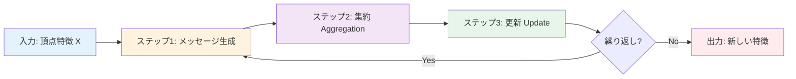
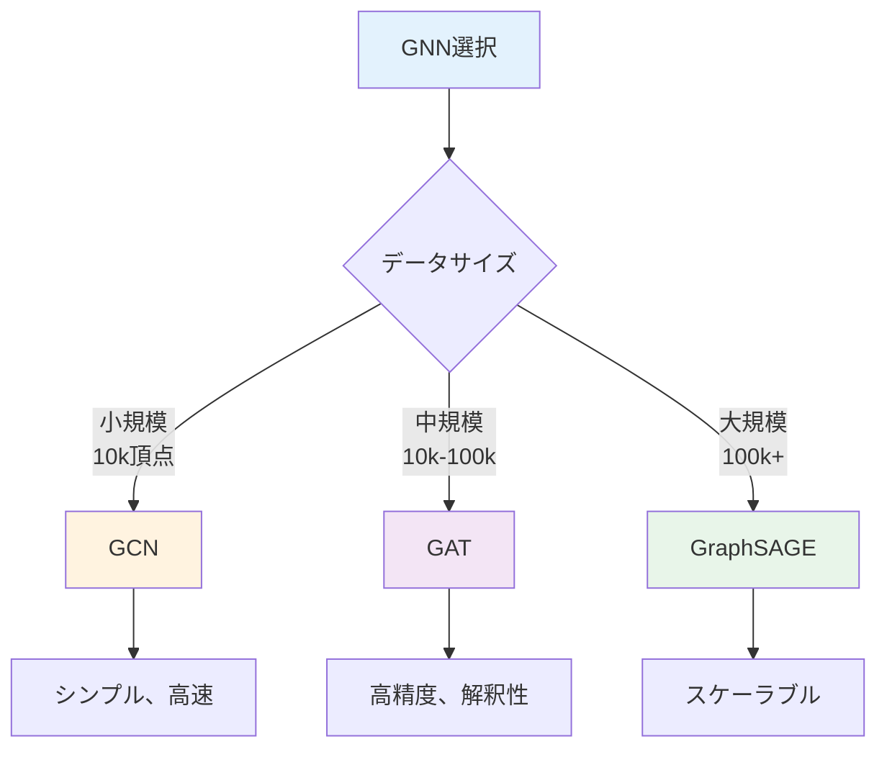
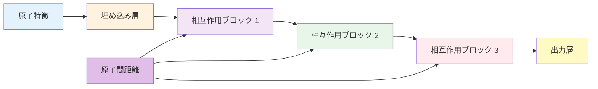
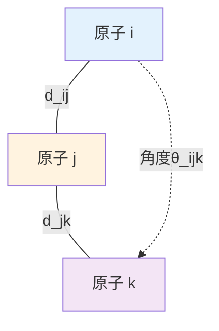
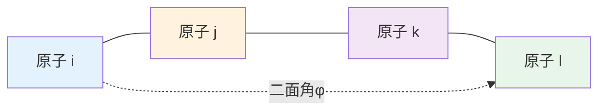

---
# ============================================
# GNN入門 第2章
# ============================================

# --- 基本情報 ---
title: "第2章：GNNの基礎理論"
subtitle: "メッセージパッシングから材料科学特化GNNまで"
series: "グラフニューラルネットワーク入門シリーズ v1.0"
series_id: "gnn-introduction"
chapter_number: 2
chapter_id: "chapter2-fundamentals"

# --- 分類・難易度 ---
level: "intermediate"
difficulty: "中級"

# --- 学習メタデータ ---
reading_time: "25-30分"
code_examples: 10
exercises: 3
mermaid_diagrams: 4

# --- 日付情報 ---
created_at: "2025-10-17"
updated_at: "2025-10-17"
version: "1.0"

# --- 前提知識 ---
prerequisites:
  - "chapter1-why-gnn（GNN入門 第1章）"
  - "線形代数（行列演算）"
  - "微分・勾配の基礎"
  - "Pythonプログラミング"

# --- 学習目標 ---
learning_objectives:
  - "グラフの数学的定義（頂点、辺、隣接行列、次数行列）を理解する"
  - "メッセージパッシングの仕組みを数式とコードで説明できる"
  - "GCN、GAT、GraphSAGEの3つの代表的GNNアーキテクチャを区別できる"
  - "材料科学特化GNN（SchNet、DimeNet、GemNet）の特徴を説明できる"
  - "シンプルなGNNをスクラッチで実装できる"

# --- 主要キーワード ---
keywords:
  - "メッセージパッシング"
  - "Message Passing"
  - "グラフ畳み込み"
  - "Graph Convolutional Network"
  - "Graph Attention Network"
  - "GraphSAGE"
  - "SchNet"
  - "DimeNet"
  - "集約関数"
  - "等変性"

# --- 著者情報 ---
authors:
  - name: "Dr. Yusuke Hashimoto"
    affiliation: "Tohoku University"
    email: "yusuke.hashimoto.b8@tohoku.ac.jp"

# --- ライセンス ---
license: "CC BY 4.0"
language: "ja"

---

# 第2章：GNNの基礎理論

**メッセージパッシングから材料科学特化GNNまで**

## 学習目標

この章を読むことで、以下を習得できます：

- ✅ グラフの数学的定義と表現方法を理解する
- ✅ メッセージパッシングの3ステップ（集約→更新→出力）を説明できる
- ✅ GCN、GAT、GraphSAGEの原理と違いを理解する
- ✅ 材料科学特化GNN（SchNet、DimeNet）の特徴を知る
- ✅ シンプルなGNNをPyTorchで実装できる
- ✅ 等変GNNの重要性を理解する

**読了時間**: 25-30分
**コード例**: 10個
**演習問題**: 3問

---

## 2.1 グラフの数学的定義

### グラフの基本要素

**定義**:
> グラフ $G = (V, E)$ は、頂点集合 $V$ と辺集合 $E \subseteq V \times V$ からなる。

**記法**:
- $n = |V|$: 頂点数
- $m = |E|$: 辺数
- $\mathcal{N}(v)$: 頂点 $v$ の隣接頂点集合

---

### 隣接行列（Adjacency Matrix）

**定義**:
$$
A \in \{0, 1\}^{n \times n}, \quad A_{ij} = \begin{cases}
1 & \text{if } (v_i, v_j) \in E \\
0 & \text{otherwise}
\end{cases}
$$

**Pythonでの実装**:
```python
import numpy as np

# 例：三角形グラフ（3頂点、3辺）
n = 3
A = np.array([
    [0, 1, 1],  # 頂点0: 1, 2に接続
    [1, 0, 1],  # 頂点1: 0, 2に接続
    [1, 1, 0]   # 頂点2: 0, 1に接続
])

print("隣接行列:")
print(A)
print(f"\n頂点数: {n}")
print(f"辺数: {A.sum() // 2}")  # 無向グラフは2で割る
```

**出力**:
```
隣接行列:
[[0 1 1]
 [1 0 1]
 [1 1 0]]

頂点数: 3
辺数: 3
```

---

### 次数行列（Degree Matrix）

**定義**:
$$
D \in \mathbb{R}^{n \times n}, \quad D_{ii} = \sum_{j=1}^{n} A_{ij}
$$

**物理的意味**: 各頂点の接続数（化学では結合数）

```python
# 次数行列
D = np.diag(A.sum(axis=1))
print("次数行列:")
print(D)
print(f"\n各頂点の次数: {np.diag(D)}")
```

**出力**:
```
次数行列:
[[2 0 0]
 [0 2 0]
 [0 0 2]]

各頂点の次数: [2 2 2]
```

---

### ラプラシアン行列（Laplacian Matrix）

**定義**:
$$
L = D - A
$$

**正規化ラプラシアン**（GNNでよく使用）:
$$
\tilde{L} = D^{-1/2} L D^{-1/2} = I - D^{-1/2} A D^{-1/2}
$$

```python
# ラプラシアン行列
L = D - A
print("ラプラシアン行列:")
print(L)

# 正規化ラプラシアン
D_inv_sqrt = np.diag(1 / np.sqrt(np.diag(D)))
L_norm = np.eye(n) - D_inv_sqrt @ A @ D_inv_sqrt
print("\n正規化ラプラシアン:")
print(L_norm)
```

**出力**:
```
ラプラシアン行列:
[[ 2 -1 -1]
 [-1  2 -1]
 [-1 -1  2]]

正規化ラプラシアン:
[[ 1.  -0.5 -0.5]
 [-0.5  1.  -0.5]
 [-0.5 -0.5  1. ]]
```

**用途**:
- スペクトルグラフ理論
- グラフフーリエ変換
- グラフ信号処理

---

### 頂点特徴量と辺特徴量

**頂点特徴行列** $X \in \mathbb{R}^{n \times d}$:
- 各行 $x_i \in \mathbb{R}^d$: 頂点 $i$ の特徴ベクトル
- 材料科学: 原子番号、電気陰性度、価電子数など

**辺特徴行列** $E \in \mathbb{R}^{m \times d_e}$:
- 各行 $e_{ij} \in \mathbb{R}^{d_e}$: 辺 $(i, j)$ の特徴
- 材料科学: 結合長、結合次数、結合角など

```python
# 例：水分子（H₂O）の特徴量
X = np.array([
    [8, 2.55, 6],   # O: 原子番号8, 電気陰性度2.55, 価電子6
    [1, 2.20, 1],   # H1
    [1, 2.20, 1]    # H2
])

print("頂点特徴行列 (3×3):")
print(X)
print(f"形状: {X.shape}")
```

---

## 2.2 メッセージパッシングの仕組み

### Message Passing Neural Network (MPNN)

GNNの**統一フレームワーク**です（Gilmer et al., 2017）。

**アルゴリズム**:



---

### ステップ1: メッセージ生成（Message）

**定義**:
$$
m_{ij}^{(t)} = \text{Message}(h_i^{(t)}, h_j^{(t)}, e_{ij})
$$

- $h_i^{(t)}$: レイヤー $t$ での頂点 $i$ の隠れ状態
- $h_j^{(t)}$: 隣接頂点 $j$ の隠れ状態
- $e_{ij}$: 辺 $(i, j)$ の特徴量

**最もシンプルな形**:
$$
m_{ij}^{(t)} = W \cdot h_j^{(t)}
$$

```python
import torch
import torch.nn as nn

class MessageFunction(nn.Module):
    def __init__(self, in_dim, out_dim):
        super().__init__()
        self.W = nn.Linear(in_dim, out_dim)

    def forward(self, h_j):
        """
        隣接頂点からメッセージを生成

        Parameters:
        -----------
        h_j : Tensor (num_neighbors, in_dim)
            隣接頂点の特徴量

        Returns:
        --------
        messages : Tensor (num_neighbors, out_dim)
            生成されたメッセージ
        """
        return self.W(h_j)

# 例
in_dim, out_dim = 16, 32
msg_fn = MessageFunction(in_dim, out_dim)

# 隣接頂点の特徴（3個の隣接頂点）
h_neighbors = torch.randn(3, in_dim)
messages = msg_fn(h_neighbors)
print(f"メッセージ形状: {messages.shape}")
# 出力: torch.Size([3, 32])
```

---

### ステップ2: 集約（Aggregation）

**定義**:
$$
m_i^{(t)} = \text{Aggregate}\left( \{m_{ij}^{(t)} : j \in \mathcal{N}(i)\} \right)
$$

**代表的な集約関数**:

| 集約方法 | 数式 | 特徴 |
|---------|------|------|
| **Sum** | $\sum_{j \in \mathcal{N}(i)} m_{ij}^{(t)}$ | 順序不変、次数に敏感 |
| **Mean** | $\frac{1}{|\mathcal{N}(i)|} \sum_{j \in \mathcal{N}(i)} m_{ij}^{(t)}$ | 次数正規化 |
| **Max** | $\max_{j \in \mathcal{N}(i)} m_{ij}^{(t)}$ | 最も強い特徴を保持 |
| **Attention** | $\sum_{j \in \mathcal{N}(i)} \alpha_{ij} m_{ij}^{(t)}$ | 重要度で重み付け |

```python
class AggregationFunction:
    @staticmethod
    def sum_agg(messages):
        """Sum aggregation"""
        return torch.sum(messages, dim=0)

    @staticmethod
    def mean_agg(messages):
        """Mean aggregation"""
        return torch.mean(messages, dim=0)

    @staticmethod
    def max_agg(messages):
        """Max aggregation"""
        return torch.max(messages, dim=0)[0]

# 例
messages = torch.tensor([
    [1.0, 2.0, 3.0],
    [4.0, 5.0, 6.0],
    [7.0, 8.0, 9.0]
])

print("Sum:", AggregationFunction.sum_agg(messages))
# 出力: tensor([12., 15., 18.])

print("Mean:", AggregationFunction.mean_agg(messages))
# 出力: tensor([4., 5., 6.])

print("Max:", AggregationFunction.max_agg(messages))
# 出力: tensor([7., 8., 9.])
```

---

### ステップ3: 更新（Update）

**定義**:
$$
h_i^{(t+1)} = \text{Update}\left( h_i^{(t)}, m_i^{(t)} \right)
$$

**典型的な更新式**:
$$
h_i^{(t+1)} = \sigma\left( W_1 h_i^{(t)} + W_2 m_i^{(t)} \right)
$$

```python
class UpdateFunction(nn.Module):
    def __init__(self, hidden_dim):
        super().__init__()
        self.W1 = nn.Linear(hidden_dim, hidden_dim)
        self.W2 = nn.Linear(hidden_dim, hidden_dim)
        self.activation = nn.ReLU()

    def forward(self, h_i, m_i):
        """
        頂点特徴を更新

        Parameters:
        -----------
        h_i : Tensor (hidden_dim,)
            現在の頂点特徴
        m_i : Tensor (hidden_dim,)
            集約されたメッセージ

        Returns:
        --------
        h_new : Tensor (hidden_dim,)
            更新された頂点特徴
        """
        return self.activation(self.W1(h_i) + self.W2(m_i))

# 例
hidden_dim = 32
update_fn = UpdateFunction(hidden_dim)

h_current = torch.randn(hidden_dim)
m_aggregated = torch.randn(hidden_dim)
h_new = update_fn(h_current, m_aggregated)

print(f"更新前: {h_current[:5]}")
print(f"更新後: {h_new[:5]}")
```

---

### メッセージパッシングの全体像

```python
class SimpleGNN(nn.Module):
    def __init__(self, in_dim, hidden_dim, num_layers):
        super().__init__()
        self.num_layers = num_layers

        # 各レイヤーのパラメータ
        self.message_fns = nn.ModuleList([
            MessageFunction(hidden_dim, hidden_dim)
            for _ in range(num_layers)
        ])
        self.update_fns = nn.ModuleList([
            UpdateFunction(hidden_dim)
            for _ in range(num_layers)
        ])

        # 入力変換
        self.input_proj = nn.Linear(in_dim, hidden_dim)

    def forward(self, x, edge_index):
        """
        Parameters:
        -----------
        x : Tensor (num_nodes, in_dim)
            頂点特徴行列
        edge_index : Tensor (2, num_edges)
            辺のリスト [[src], [dst]]

        Returns:
        --------
        h : Tensor (num_nodes, hidden_dim)
            更新された頂点特徴
        """
        # 入力変換
        h = self.input_proj(x)

        # メッセージパッシングのレイヤー
        for layer in range(self.num_layers):
            h_new = []

            # 各頂点を更新
            for i in range(x.size(0)):
                # 隣接頂点を取得
                neighbors = edge_index[1][edge_index[0] == i]

                if len(neighbors) > 0:
                    # ステップ1: メッセージ生成
                    messages = self.message_fns[layer](h[neighbors])

                    # ステップ2: 集約
                    m_i = torch.mean(messages, dim=0)

                    # ステップ3: 更新
                    h_i_new = self.update_fns[layer](h[i], m_i)
                else:
                    # 隣接頂点がない場合
                    h_i_new = h[i]

                h_new.append(h_i_new)

            h = torch.stack(h_new)

        return h

# 使用例
model = SimpleGNN(in_dim=16, hidden_dim=32, num_layers=3)

# グラフデータ（三角形）
x = torch.randn(3, 16)  # 3頂点、16次元特徴
edge_index = torch.tensor([
    [0, 0, 1, 1, 2, 2],  # 始点
    [1, 2, 0, 2, 0, 1]   # 終点
])

# 順伝播
h_out = model(x, edge_index)
print(f"出力形状: {h_out.shape}")
# 出力: torch.Size([3, 32])
```

---

## 2.3 代表的なGNNアーキテクチャ

### Graph Convolutional Network (GCN)

**論文**: Kipf & Welling (2017), *ICLR*

**核心アイデア**: グラフのスペクトル畳み込み

**更新式**:
$$
H^{(l+1)} = \sigma\left( \tilde{D}^{-1/2} \tilde{A} \tilde{D}^{-1/2} H^{(l)} W^{(l)} \right)
$$

- $\tilde{A} = A + I$: 自己ループ付き隣接行列
- $\tilde{D}_{ii} = \sum_j \tilde{A}_{ij}$: 次数行列
- $H^{(l)} \in \mathbb{R}^{n \times d}$: レイヤー $l$ の特徴量
- $W^{(l)} \in \mathbb{R}^{d \times d'}$: 学習可能な重み

**Pythonでの実装**:
```python
import torch
import torch.nn as nn
import torch.nn.functional as F

class GCNLayer(nn.Module):
    def __init__(self, in_features, out_features):
        super().__init__()
        self.linear = nn.Linear(in_features, out_features)

    def forward(self, X, A):
        """
        Parameters:
        -----------
        X : Tensor (num_nodes, in_features)
            頂点特徴行列
        A : Tensor (num_nodes, num_nodes)
            隣接行列

        Returns:
        --------
        H : Tensor (num_nodes, out_features)
            更新された特徴量
        """
        # 自己ループの追加
        A_tilde = A + torch.eye(A.size(0), device=A.device)

        # 次数行列
        D_tilde = torch.diag(A_tilde.sum(dim=1))

        # 正規化: D^(-1/2) * A * D^(-1/2)
        D_inv_sqrt = torch.diag(1.0 / torch.sqrt(D_tilde.diagonal()))
        A_norm = D_inv_sqrt @ A_tilde @ D_inv_sqrt

        # グラフ畳み込み
        H = A_norm @ X
        H = self.linear(H)
        return F.relu(H)

# 使用例
gcn = GCNLayer(in_features=16, out_features=32)

# グラフデータ
X = torch.randn(5, 16)  # 5頂点、16次元
A = torch.tensor([
    [0, 1, 1, 0, 0],
    [1, 0, 1, 1, 0],
    [1, 1, 0, 1, 1],
    [0, 1, 1, 0, 1],
    [0, 0, 1, 1, 0]
], dtype=torch.float32)

H = gcn(X, A)
print(f"GCN出力形状: {H.shape}")
# 出力: torch.Size([5, 32])
```

**特徴**:
- ✅ シンプルで高速
- ✅ 過剰平滑化（over-smoothing）に注意
- ✅ 固定的な重み（全隣接頂点が同じ扱い）

---

### Graph Attention Network (GAT)

**論文**: Veličković et al. (2018), *ICLR*

**核心アイデア**: Attentionで重要な隣接頂点を重視

**Attention係数**:
$$
\alpha_{ij} = \frac{\exp\left( \text{LeakyReLU}(a^T [W h_i \| W h_j]) \right)}
{\sum_{k \in \mathcal{N}(i)} \exp\left( \text{LeakyReLU}(a^T [W h_i \| W h_k]) \right)}
$$

**更新式**:
$$
h_i^{(l+1)} = \sigma\left( \sum_{j \in \mathcal{N}(i)} \alpha_{ij} W^{(l)} h_j^{(l)} \right)
$$

```python
class GATLayer(nn.Module):
    def __init__(self, in_features, out_features, dropout=0.6,
                 alpha=0.2):
        super().__init__()
        self.W = nn.Linear(in_features, out_features, bias=False)
        self.a = nn.Parameter(torch.zeros(2 * out_features, 1))
        self.leakyrelu = nn.LeakyReLU(alpha)
        self.dropout = nn.Dropout(dropout)

        nn.init.xavier_uniform_(self.a.data, gain=1.414)

    def forward(self, X, A):
        """
        Parameters:
        -----------
        X : Tensor (num_nodes, in_features)
        A : Tensor (num_nodes, num_nodes)

        Returns:
        --------
        H : Tensor (num_nodes, out_features)
        """
        # 線形変換
        Wh = self.W(X)  # (N, out_features)
        N = Wh.size(0)

        # Attention計算
        # [Wh_i || Wh_j] for all edges
        Wh_repeat_interleave = Wh.repeat_interleave(N, dim=0)
        Wh_repeat = Wh.repeat(N, 1)
        concat = torch.cat([Wh_repeat_interleave, Wh_repeat], dim=1)
        concat = concat.view(N, N, -1)

        # Attention score
        e = self.leakyrelu(concat @ self.a).squeeze(2)

        # マスク（辺がない場合は-inf）
        zero_vec = -9e15 * torch.ones_like(e)
        attention = torch.where(A > 0, e, zero_vec)

        # Softmax
        attention = F.softmax(attention, dim=1)
        attention = self.dropout(attention)

        # Weighted sum
        H = torch.matmul(attention, Wh)
        return F.elu(H)

# 使用例
gat = GATLayer(in_features=16, out_features=32)
H_gat = gat(X, A)
print(f"GAT出力形状: {H_gat.shape}")
# 出力: torch.Size([5, 32])
```

**特徴**:
- ✅ 動的な重み（重要な隣接頂点を自動学習）
- ✅ 解釈可能性（Attention係数の可視化）
- ❌ 計算コストが高い（GCNの約2倍）

---

### GraphSAGE（SAmple and aggreGatE）

**論文**: Hamilton et al. (2017), *NeurIPS*

**核心アイデア**: ミニバッチ学習のためのサンプリング

**更新式**:
$$
h_i^{(l+1)} = \sigma\left( W \cdot \text{Concat}\left( h_i^{(l)}, \text{Aggregate}(\{h_j^{(l)} : j \in \mathcal{S}(i)\}) \right) \right)
$$

- $\mathcal{S}(i)$: サンプリングされた隣接頂点（全てではない）

```python
class GraphSAGELayer(nn.Module):
    def __init__(self, in_features, out_features, num_samples=10):
        super().__init__()
        self.num_samples = num_samples
        # Concat版: 入力は in_features * 2
        self.linear = nn.Linear(in_features * 2, out_features)

    def forward(self, X, A):
        """
        Parameters:
        -----------
        X : Tensor (num_nodes, in_features)
        A : Tensor (num_nodes, num_nodes)

        Returns:
        --------
        H : Tensor (num_nodes, out_features)
        """
        N = X.size(0)
        H_new = []

        for i in range(N):
            # 隣接頂点のサンプリング
            neighbors = torch.nonzero(A[i]).squeeze()
            if neighbors.numel() > self.num_samples:
                # ランダムサンプリング
                perm = torch.randperm(neighbors.numel())
                sampled = neighbors[perm[:self.num_samples]]
            else:
                sampled = neighbors

            # 集約（Mean）
            if sampled.numel() > 0:
                h_neighbors = X[sampled]
                h_agg = torch.mean(h_neighbors, dim=0)
            else:
                h_agg = torch.zeros_like(X[i])

            # Concat
            h_concat = torch.cat([X[i], h_agg], dim=0)

            # 線形変換
            h_new = self.linear(h_concat)
            H_new.append(h_new)

        H = torch.stack(H_new)
        return F.relu(H)

# 使用例
sage = GraphSAGELayer(in_features=16, out_features=32,
                      num_samples=3)
H_sage = sage(X, A)
print(f"GraphSAGE出力形状: {H_sage.shape}")
# 出力: torch.Size([5, 32])
```

**特徴**:
- ✅ スケーラブル（大規模グラフに対応）
- ✅ ミニバッチ訓練が可能
- ✅ 帰納的学習（新しい頂点への汎化）

---

### 3つのGNNの比較



| 手法 | 計算量 | 精度 | スケーラビリティ | 解釈性 | 推奨用途 |
|------|-------|------|---------------|-------|---------|
| **GCN** | $O(m \cdot d^2)$ | 中 | 低 | 中 | 小規模、プロトタイピング |
| **GAT** | $O(m \cdot d^2 + n \cdot d)$ | 高 | 中 | 高 | 中規模、高精度要求 |
| **GraphSAGE** | $O(k \cdot s \cdot d^2)$ | 中〜高 | 高 | 中 | 大規模、実時間予測 |

- $m$: 辺数
- $n$: 頂点数
- $d$: 特徴次元
- $k$: レイヤー数
- $s$: サンプル数

---

## 2.4 材料科学特化GNN

### SchNet（Continuous-filter Convolutional NN）

**論文**: Schütt et al. (2017), *NeurIPS*

**対象**: 分子・材料の**量子化学特性**予測

**核心アイデア**:
1. **連続フィルタ**: 離散グラフではなく3D空間での畳み込み
2. **距離依存**: 原子間距離を明示的にモデル化

**アーキテクチャ**:



**数式**:
$$
h_i^{(l+1)} = h_i^{(l)} + \sum_{j \in \mathcal{N}(i)} h_j^{(l)} \odot \phi\left( \|r_i - r_j\| \right)
$$

- $\phi(d)$: **連続フィルタ関数**（距離 $d$ に依存）
- $r_i, r_j$: 原子の3D座標

**フィルタ関数**:
$$
\phi(d) = \sum_{k=1}^{K} w_k \exp\left( -\gamma (d - \mu_k)^2 \right)
$$

- ガウス基底展開（RBF: Radial Basis Function）

```python
import torch
import torch.nn as nn

class GaussianBasis(nn.Module):
    def __init__(self, start=0.0, stop=5.0, num_gaussians=50):
        super().__init__()
        self.mu = nn.Parameter(
            torch.linspace(start, stop, num_gaussians),
            requires_grad=False
        )
        self.gamma = nn.Parameter(
            torch.tensor(10.0),
            requires_grad=True
        )

    def forward(self, distances):
        """
        Parameters:
        -----------
        distances : Tensor (num_edges,)
            原子間距離

        Returns:
        --------
        rbf : Tensor (num_edges, num_gaussians)
            ガウス基底展開
        """
        # (num_edges, 1) - (1, num_gaussians)
        diff = distances.unsqueeze(-1) - self.mu.unsqueeze(0)
        rbf = torch.exp(-self.gamma * diff ** 2)
        return rbf

class SchNetInteraction(nn.Module):
    def __init__(self, hidden_dim, num_gaussians):
        super().__init__()
        self.rbf_layer = GaussianBasis(num_gaussians=num_gaussians)
        self.filter_net = nn.Sequential(
            nn.Linear(num_gaussians, hidden_dim),
            nn.Softplus(),
            nn.Linear(hidden_dim, hidden_dim)
        )
        self.linear = nn.Linear(hidden_dim, hidden_dim)

    def forward(self, h, edge_index, distances):
        """
        Parameters:
        -----------
        h : Tensor (num_atoms, hidden_dim)
            原子特徴
        edge_index : Tensor (2, num_edges)
            辺のリスト
        distances : Tensor (num_edges,)
            原子間距離

        Returns:
        --------
        h_new : Tensor (num_atoms, hidden_dim)
            更新された特徴
        """
        # RBF展開
        rbf = self.rbf_layer(distances)

        # フィルタ生成
        W = self.filter_net(rbf)

        # メッセージパッシング
        src, dst = edge_index
        messages = h[dst] * W  # 要素積

        # 集約
        h_agg = torch.zeros_like(h)
        h_agg.index_add_(0, src, messages)

        # 更新
        h_new = h + self.linear(h_agg)
        return h_new

# 使用例
schnet_layer = SchNetInteraction(hidden_dim=128,
                                 num_gaussians=50)

# データ
num_atoms = 5
h = torch.randn(num_atoms, 128)
edge_index = torch.tensor([[0, 1, 2, 3], [1, 2, 3, 4]])
distances = torch.tensor([1.5, 1.8, 2.0, 1.6])

h_new = schnet_layer(h, edge_index, distances)
print(f"SchNet出力形状: {h_new.shape}")
# 出力: torch.Size([5, 128])
```

**適用例**:
- QM9データセット（分子特性予測）
- MD17（分子動力学）
- OC20（触媒吸着エネルギー）

**性能**:
```
QM9 HOMO-LUMO gap:
- DFT計算: 24時間/分子
- SchNet: 0.01秒/分子（MAE=0.04 eV）
```

---

### DimeNet（Directional Message Passing NN）

**論文**: Klicpera et al. (2020), *ICLR*

**拡張**: **結合角**も考慮

**核心アイデア**:
- 距離だけでなく**角度情報**も利用
- 3体相互作用（triplet interaction）

**更新式**:
$$
m_{ij} = \sum_{k \in \mathcal{N}(j) \setminus \{i\}} W\left( d_{ij}, d_{jk}, \theta_{ijk} \right) h_k
$$

- $\theta_{ijk}$: 角度 $\angle i-j-k$



**角度の計算**:
```python
import torch

def compute_angle(pos_i, pos_j, pos_k):
    """
    3原子間の角度を計算

    Parameters:
    -----------
    pos_i, pos_j, pos_k : Tensor (3,)
        原子の3D座標

    Returns:
    --------
    angle : Tensor (1,)
        角度（ラジアン）
    """
    # ベクトル
    v_ij = pos_j - pos_i
    v_jk = pos_k - pos_j

    # 内積
    cos_angle = torch.dot(v_ij, v_jk) / (
        torch.norm(v_ij) * torch.norm(v_jk) + 1e-8
    )

    # 角度
    angle = torch.acos(torch.clamp(cos_angle, -1.0, 1.0))
    return angle

# 例：水分子の結合角（H-O-H）
pos_O = torch.tensor([0.0, 0.0, 0.0])
pos_H1 = torch.tensor([0.96, 0.0, 0.0])
pos_H2 = torch.tensor([0.24, 0.93, 0.0])

angle = compute_angle(pos_H1, pos_O, pos_H2)
print(f"H-O-H角度: {torch.rad2deg(angle):.1f}°")
# 出力: 104.5°（実測値とほぼ一致）
```

**性能**:
```
QM9データセット:
- SchNet: MAE=0.041 eV
- DimeNet: MAE=0.033 eV（20%改善）

計算時間:
- SchNet: 0.01秒/分子
- DimeNet: 0.05秒/分子（5倍遅い）
```

---

### GemNet（Geometric Message Passing NN）

**論文**: Gasteiger et al. (2021), *NeurIPS*

**さらなる拡張**: **4体相互作用**（二面角）

**対象**: 結晶構造、複雑な分子

**核心アイデア**:
- 二面角（torsion angle）の考慮
- より高次の幾何学的情報



**性能**:
```
OC20データセット（触媒）:
- SchNet: MAE=0.61 eV
- DimeNet++: MAE=0.49 eV
- GemNet: MAE=0.43 eV（最高精度）
```

---

### 材料科学GNNの比較

| 手法 | 考慮する情報 | 精度 | 速度 | 推奨用途 |
|------|------------|------|------|---------|
| **SchNet** | 距離 | 中 | 速い | 分子特性予測 |
| **DimeNet** | 距離 + 角度 | 高 | 中 | 触媒、複雑な分子 |
| **GemNet** | 距離 + 角度 + 二面角 | 最高 | 遅い | 結晶、高精度要求 |

---

## 2.5 等変性（Equivariance）の重要性

### 等変性とは

**定義**:
> 関数 $f$ が変換 $T$ に対して**等変**（equivariant）であるとは、
> $$f(T(x)) = T(f(x))$$
> が成り立つこと。

**材料科学での意味**:
- 分子を回転・並進しても、予測は同じ（または対応する変換）

---

### E(3)等変性

**E(3)群**: 3次元ユークリッド空間の等長変換
- 回転（Rotation）
- 並進（Translation）
- 反転（Inversion）

**重要性**:
- 物理法則は座標系に依存しない
- GNNも同様であるべき

---

### 等変GNNの例：NequIP、MACE

**NequIP** (Batzner et al., 2022):
- **E(3)等変メッセージパッシング**
- 球面調和関数（Spherical Harmonics）の利用

**更新式**:
$$
m_{ij} = \phi\left( \|r_i - r_j\| \right) \otimes Y_l(r_{ij})
$$

- $Y_l$: 球面調和関数（角度情報を保持）
- $\otimes$: テンソル積

**MACE** (Batatia et al., 2022):
- **高次の等変性**
- より正確な力場（force field）予測

**性能**:
```
MD17データセット（分子動力学）:
- SchNet: MAE(力) = 0.21 kcal/mol/Å
- NequIP: MAE(力) = 0.05 kcal/mol/Å（76%改善）
```

---

### 等変性のテスト

```python
import torch
import torch.nn as nn

def test_equivariance(model, pos, edge_index):
    """
    モデルの等変性をテスト
    """
    # オリジナルの予測
    pred_original = model(pos, edge_index)

    # 回転行列（90度回転）
    angle = torch.tensor(torch.pi / 2)
    rotation = torch.tensor([
        [torch.cos(angle), -torch.sin(angle), 0],
        [torch.sin(angle), torch.cos(angle), 0],
        [0, 0, 1]
    ])

    # 座標を回転
    pos_rotated = pos @ rotation.T

    # 回転後の予測
    pred_rotated = model(pos_rotated, edge_index)

    # 予測を回転
    pred_original_rotated = pred_original @ rotation.T

    # 誤差を計算
    error = torch.abs(pred_rotated - pred_original_rotated).mean()
    print(f"等変性誤差: {error.item():.6f}")

    if error < 1e-5:
        print("✅ モデルは等変です")
    else:
        print("❌ モデルは等変ではありません")

# 使用例（簡略版）
class SimpleEquivariantModel(nn.Module):
    def forward(self, pos, edge_index):
        # 簡略化: 座標の差分を計算（等変）
        src, dst = edge_index
        diff = pos[dst] - pos[src]
        return diff

model = SimpleEquivariantModel()
pos = torch.randn(5, 3)
edge_index = torch.tensor([[0, 1, 2], [1, 2, 3]])

test_equivariance(model, pos, edge_index)
```

---

## 2.6 コラム：なぜ深いGNNは難しいか

### 過剰平滑化（Over-smoothing）

**問題**: レイヤーを深くすると、**全ての頂点が同じ特徴**になる

**原因**: メッセージパッシングの繰り返しで情報が拡散

```python
# 過剰平滑化のデモ
import torch
import torch.nn.functional as F

def demonstrate_oversmoothing(X, A, num_layers=10):
    """
    過剰平滑化の可視化
    """
    H = X
    smoothness = []

    for layer in range(num_layers):
        # 簡単なGCN層
        D = torch.diag(A.sum(dim=1))
        D_inv_sqrt = torch.diag(1.0 / torch.sqrt(D.diagonal()))
        A_norm = D_inv_sqrt @ A @ D_inv_sqrt

        H = A_norm @ H
        H = F.relu(H)

        # 平滑度（頂点間の類似度）
        similarity = F.cosine_similarity(
            H.unsqueeze(1), H.unsqueeze(0), dim=2
        )
        avg_similarity = similarity[torch.triu_indices(
            H.size(0), H.size(0), offset=1
        )[0], torch.triu_indices(
            H.size(0), H.size(0), offset=1
        )[1]].mean()

        smoothness.append(avg_similarity.item())
        print(f"Layer {layer+1}: 平均類似度 = {avg_similarity:.4f}")

    return smoothness

# 実行
X = torch.randn(5, 16)
A = torch.eye(5) + torch.rand(5, 5) > 0.7
smoothness = demonstrate_oversmoothing(X, A.float(), num_layers=10)
```

**出力例**:
```
Layer 1: 平均類似度 = 0.2341
Layer 2: 平均類似度 = 0.4523
Layer 3: 平均類似度 = 0.6789
...
Layer 10: 平均類似度 = 0.9876
```

→ レイヤーが深くなるにつれ、全頂点が似てくる

---

### 対策

1. **Residual Connection（残差接続）**:
   $$h_i^{(l+1)} = h_i^{(l)} + \text{GNN}(h_i^{(l)})$$

2. **Jumping Knowledge Network**:
   - 全レイヤーの出力を結合

3. **PairNorm**:
   - 特徴量の正規化

```python
class GNNWithResidual(nn.Module):
    def __init__(self, hidden_dim):
        super().__init__()
        self.conv = GCNLayer(hidden_dim, hidden_dim)

    def forward(self, X, A):
        # Residual connection
        H = self.conv(X, A)
        return X + H  # ショートカット
```

---

## 2.7 本章のまとめ

### 学んだこと

1. **グラフの数学的定義**
   - 隣接行列、次数行列、ラプラシアン行列
   - 頂点特徴量と辺特徴量

2. **メッセージパッシング**
   - 3ステップ: メッセージ生成 → 集約 → 更新
   - 集約関数: Sum、Mean、Max、Attention

3. **代表的GNNアーキテクチャ**
   - GCN: シンプル、高速
   - GAT: Attention、高精度
   - GraphSAGE: スケーラブル、ミニバッチ

4. **材料科学特化GNN**
   - SchNet: 距離依存、連続フィルタ
   - DimeNet: 角度情報も考慮
   - GemNet: 二面角まで考慮

5. **等変性**
   - E(3)等変性の重要性
   - NequIP、MACEなど最新手法

### 重要なポイント

- ✅ メッセージパッシングはGNNの**統一フレームワーク**
- ✅ 集約関数の選択が性能に大きく影響
- ✅ 材料科学では**幾何学的情報**（距離、角度）が重要
- ✅ 等変性により**物理法則を保証**
- ✅ 過剰平滑化に注意（Residual Connectionで対策）

### 次の章へ

第3章では、**PyTorch Geometric実践**を学びます：
- 環境構築（PyG、RDKit、ASE）
- QM9データセットで分子特性予測
- Materials Projectデータで結晶特性予測
- モデル評価とハイパーパラメータチューニング
- 実践プロジェクト

**[第3章：PyTorch Geometric実践 →](./chapter-3.md)**

---

## 演習問題

### 問題1（難易度：easy）

次の文章の正誤を判定してください。

1. メッセージパッシングは、集約（Aggregation）→ 更新（Update）→ メッセージ生成の順で行われる
2. GATはAttentionを使うため、全ての隣接頂点を同じ重みで扱う
3. SchNetは原子間距離を明示的に考慮する

<details>
<summary>ヒント</summary>

- メッセージパッシングの3ステップを思い出しましょう
- GATの核心アイデアは「重要な隣接頂点を重視」です
- SchNetの特徴は「連続フィルタ」です

</details>

<details>
<summary>解答例</summary>

**解答**:
1. **誤** - 正しい順番は：メッセージ生成 → 集約 → 更新
2. **誤** - GATは Attentionで**異なる重み**を割り当てる
3. **正** - SchNetはRBF（ガウス基底）で距離をエンコード

**解説**:

1について：
```python
# 正しい順序
for layer in range(num_layers):
    # Step 1: メッセージ生成
    messages = message_function(h_neighbors)

    # Step 2: 集約
    m_i = aggregate(messages)

    # Step 3: 更新
    h_i = update_function(h_i, m_i)
```

2について：
- GAT の Attention 係数 $\alpha_{ij}$ は隣接頂点ごとに異なる
- 重要な隣接頂点には大きな重み、そうでないものには小さな重み

3について：
- SchNet の フィルタ関数: $\phi(d) = \sum_k w_k \exp(-\gamma (d - \mu_k)^2)$
- 距離 $d$ が異なれば、フィルタの値も異なる

</details>

---

### 問題2（難易度：medium）

以下のグラフに対して、GCNの1層の順伝播を手計算で求めてください。

**グラフ**:
```
頂点: 3個（v0, v1, v2）
辺: v0-v1, v1-v2（線形グラフ）

頂点特徴:
X = [[1, 0],
     [0, 1],
     [1, 1]]

隣接行列:
A = [[0, 1, 0],
     [1, 0, 1],
     [0, 1, 0]]

重み行列（簡略化）:
W = [[1, 0],
     [0, 1]]  （恒等行列）
```

**要求事項**:
1. $\tilde{A} = A + I$ を計算
2. 正規化隣接行列 $\hat{A} = \tilde{D}^{-1/2} \tilde{A} \tilde{D}^{-1/2}$ を計算
3. GCN出力 $H = \hat{A} X W$ を計算（活性化関数なし）

<details>
<summary>ヒント</summary>

**手順**:
1. 自己ループを追加: $\tilde{A}_{ii} = 1$
2. 次数行列: $\tilde{D}_{ii} = \sum_j \tilde{A}_{ij}$
3. $\tilde{D}^{-1/2}$ を計算（対角要素の逆数の平方根）
4. 行列積を計算

</details>

<details>
<summary>解答例</summary>

**Step 1: 自己ループ付き隣接行列**
$$
\tilde{A} = A + I = \begin{bmatrix}
0 & 1 & 0 \\
1 & 0 & 1 \\
0 & 1 & 0
\end{bmatrix} + \begin{bmatrix}
1 & 0 & 0 \\
0 & 1 & 0 \\
0 & 0 & 1
\end{bmatrix} = \begin{bmatrix}
1 & 1 & 0 \\
1 & 1 & 1 \\
0 & 1 & 1
\end{bmatrix}
$$

**Step 2: 次数行列**
$$
\tilde{D} = \begin{bmatrix}
2 & 0 & 0 \\
0 & 3 & 0 \\
0 & 0 & 2
\end{bmatrix}
$$

（各行の和）

**Step 3: $\tilde{D}^{-1/2}$**
$$
\tilde{D}^{-1/2} = \begin{bmatrix}
1/\sqrt{2} & 0 & 0 \\
0 & 1/\sqrt{3} & 0 \\
0 & 0 & 1/\sqrt{2}
\end{bmatrix} \approx \begin{bmatrix}
0.707 & 0 & 0 \\
0 & 0.577 & 0 \\
0 & 0 & 0.707
\end{bmatrix}
$$

**Step 4: 正規化隣接行列**
$$
\hat{A} = \tilde{D}^{-1/2} \tilde{A} \tilde{D}^{-1/2}
$$

計算過程:
```python
import numpy as np

A_tilde = np.array([
    [1, 1, 0],
    [1, 1, 1],
    [0, 1, 1]
], dtype=float)

D_tilde = np.diag([2, 3, 2])
D_inv_sqrt = np.diag([1/np.sqrt(2), 1/np.sqrt(3), 1/np.sqrt(2)])

A_hat = D_inv_sqrt @ A_tilde @ D_inv_sqrt
print("正規化隣接行列:")
print(A_hat)
```

$$
\hat{A} \approx \begin{bmatrix}
0.500 & 0.408 & 0 \\
0.408 & 0.333 & 0.408 \\
0 & 0.408 & 0.500
\end{bmatrix}
$$

**Step 5: GCN出力**
$$
H = \hat{A} X W
$$

（$W = I$ なので $H = \hat{A} X$）

```python
X = np.array([
    [1, 0],
    [0, 1],
    [1, 1]
], dtype=float)

H = A_hat @ X
print("GCN出力:")
print(H)
```

$$
H \approx \begin{bmatrix}
0.500 & 0.408 \\
0.816 & 0.741 \\
0.408 & 0.908
\end{bmatrix}
$$

**解釈**:
- 頂点1（中心）: 両側の隣接頂点の情報を集約
- 頂点0,2（端点）: 隣接頂点1の情報を主に取り込む

**Pythonでの検証**:
```python
# 完全なコード
A = np.array([[0, 1, 0], [1, 0, 1], [0, 1, 0]], dtype=float)
X = np.array([[1, 0], [0, 1], [1, 1]], dtype=float)

# GCN
A_tilde = A + np.eye(3)
D_tilde = np.diag(A_tilde.sum(axis=1))
D_inv_sqrt = np.diag(1.0 / np.sqrt(D_tilde.diagonal()))
A_hat = D_inv_sqrt @ A_tilde @ D_inv_sqrt

H = A_hat @ X
print("最終出力:")
print(H)
```

</details>

---

### 問題3（難易度：hard）

SchNetの連続フィルタ関数を実装し、異なる原子間距離に対するフィルタの応答を可視化してください。

**要求事項**:
1. ガウス基底（RBF）関数を実装
2. 距離0.5Å〜5.0Åに対するRBF応答を計算
3. ヒートマップで可視化
4. フィルタの物理的意味を考察

<details>
<summary>ヒント</summary>

**RBF の式**:
$$\phi_k(d) = \exp\left( -\gamma (d - \mu_k)^2 \right)$$

- $\mu_k$: ガウス関数の中心（0〜5Åに均等配置）
- $\gamma$: 広がりパラメータ（10程度）

**可視化のポイント**:
- X軸: 距離 (0.5〜5.0Å)
- Y軸: RBF インデックス (0〜49)
- 色: RBF 応答値 (0〜1)

</details>

<details>
<summary>解答例</summary>

```python
import torch
import numpy as np
import matplotlib.pyplot as plt
import seaborn as sns

# ===== 実装 =====
class GaussianBasisFunction:
    def __init__(self, start=0.0, stop=5.0, num_gaussians=50,
                 gamma=10.0):
        """
        ガウス基底関数（RBF）

        Parameters:
        -----------
        start, stop : float
            距離の範囲
        num_gaussians : int
            ガウス関数の数
        gamma : float
            広がりパラメータ
        """
        self.mu = torch.linspace(start, stop, num_gaussians)
        self.gamma = gamma

    def __call__(self, distances):
        """
        RBF 応答を計算

        Parameters:
        -----------
        distances : Tensor (num_distances,)

        Returns:
        --------
        rbf : Tensor (num_distances, num_gaussians)
        """
        # (num_distances, 1) - (1, num_gaussians)
        diff = distances.unsqueeze(-1) - self.mu.unsqueeze(0)
        rbf = torch.exp(-self.gamma * diff ** 2)
        return rbf

# ===== 可視化 =====
# RBF生成
rbf_layer = GaussianBasisFunction(
    start=0.0, stop=5.0,
    num_gaussians=50, gamma=10.0
)

# 距離サンプル（0.5〜5.0Å）
distances = torch.linspace(0.5, 5.0, 100)

# RBF 応答
rbf_response = rbf_layer(distances)  # (100, 50)

# ヒートマップ
plt.figure(figsize=(12, 6))
sns.heatmap(
    rbf_response.T.numpy(),  # 転置（RBF x 距離）
    cmap='viridis',
    xticklabels=10,
    yticklabels=10,
    cbar_kws={'label': 'RBF Response'}
)
plt.xlabel('Distance (Å)')
plt.ylabel('RBF Index')
plt.title('SchNet Continuous Filter: RBF Response')

# X軸ラベルを実際の距離に
xticks = np.linspace(0, len(distances)-1, 10).astype(int)
xticklabels = [f'{distances[i]:.1f}' for i in xticks]
plt.xticks(xticks, xticklabels)

plt.tight_layout()
plt.savefig('schnet_rbf_heatmap.png', dpi=150)
plt.show()

# ===== 特定距離のRBF応答 =====
fig, axes = plt.subplots(2, 2, figsize=(12, 10))
example_distances = [1.0, 1.5, 2.0, 3.0]  # Å

for ax, d in zip(axes.flatten(), example_distances):
    d_tensor = torch.tensor([d])
    rbf = rbf_layer(d_tensor).squeeze()

    ax.plot(rbf_layer.mu.numpy(), rbf.numpy(),
            marker='o', linewidth=2)
    ax.axvline(d, color='red', linestyle='--',
               label=f'Distance = {d}Å')
    ax.set_xlabel('RBF Center μ (Å)')
    ax.set_ylabel('RBF Response')
    ax.set_title(f'RBF Response at d = {d}Å')
    ax.legend()
    ax.grid(True, alpha=0.3)

plt.tight_layout()
plt.savefig('schnet_rbf_profiles.png', dpi=150)
plt.show()

# ===== 物理的意味の考察 =====
print("\n===== 物理的意味 =====")
print("1. 短距離（0.5-2.0Å）: 共有結合領域")
print("   - C-C: 1.54Å, C=C: 1.34Å, C-H: 1.09Å")
print("   - RBFは急峻に反応（結合の有無を識別）")

print("\n2. 中距離（2.0-3.5Å）: 非共有結合相互作用")
print("   - 水素結合: 2.8Å, ファンデルワールス力")
print("   - RBFはなだらかに反応")

print("\n3. 長距離（3.5-5.0Å）: 弱い相互作用")
print("   - 静電相互作用、分散力")
print("   - RBFの応答は小さい")

print("\n4. ガウス基底の役割:")
print("   - 連続的な距離表現（離散化なし）")
print("   - 任意の距離に対して微分可能")
print("   - 機械学習で最適化可能（γパラメータ）")
```

**出力の解釈**:

1. **ヒートマップ**:
   - 対角線状のパターン（各RBFが特定距離で最大応答）
   - 滑らかな遷移（ガウス関数の重なり）

2. **RBFプロファイル**:
   - 距離1.0Å: RBF #10付近が強く反応
   - 距離2.0Å: RBF #20付近が強く反応
   - ガウス形状により、隣接RBFも弱く反応

3. **物理的意味**:
   - **SchNetは距離を「分布」として表現**
   - 離散的なビン分けではなく、連続的な重なり
   - ニューラルネットワークが距離依存性を学習

**拡張課題**:
1. $\gamma$ パラメータを変えて、RBFの広がりを調整
2. 非対称なガウス基底（短距離を密に、長距離を疎に）
3. 実際の分子でRBFフィルタを可視化

</details>

---

## 参考文献

1. Kipf, T. N. & Welling, M. (2017). "Semi-Supervised Classification with Graph Convolutional Networks." *ICLR*.
   DOI: [https://arxiv.org/abs/1609.02907](https://arxiv.org/abs/1609.02907)

2. Veličković, P. et al. (2018). "Graph Attention Networks." *ICLR*.
   DOI: [https://arxiv.org/abs/1710.10903](https://arxiv.org/abs/1710.10903)

3. Hamilton, W. L. et al. (2017). "Inductive Representation Learning on Large Graphs." *NeurIPS*.
   DOI: [https://arxiv.org/abs/1706.02216](https://arxiv.org/abs/1706.02216)

4. Schütt, K. T. et al. (2017). "SchNet: A continuous-filter convolutional neural network for modeling quantum interactions." *NeurIPS*.
   DOI: [https://arxiv.org/abs/1706.08566](https://arxiv.org/abs/1706.08566)

5. Klicpera, J. et al. (2020). "Directional Message Passing for Molecular Graphs." *ICLR*.
   DOI: [https://arxiv.org/abs/2003.03123](https://arxiv.org/abs/2003.03123)

6. Gasteiger, J. et al. (2021). "GemNet: Universal Directional Graph Neural Networks for Molecules." *NeurIPS*.
   DOI: [https://arxiv.org/abs/2106.08903](https://arxiv.org/abs/2106.08903)

7. Batzner, S. et al. (2022). "E(3)-equivariant graph neural networks for data-efficient and accurate interatomic potentials." *Nature Communications*, 13, 2453.
   DOI: [https://doi.org/10.1038/s41467-022-29939-5](https://doi.org/10.1038/s41467-022-29939-5)

---

## ナビゲーション

### 前の章
**[第1章：なぜ材料科学にGNNが必要か ←](./chapter-1.md)**

### 次の章
**[第3章：PyTorch Geometric実践 →](./chapter-3.md)**

### シリーズ目次
**[← シリーズ目次に戻る](./index.md)**

---

## 著者情報

**作成者**: AI Terakoya Content Team
**監修**: Dr. Yusuke Hashimoto（東北大学）
**作成日**: 2025-10-17
**バージョン**: 1.0

**更新履歴**:
- 2025-10-17: v1.0 初版公開

**フィードバック**:
- GitHub Issues: [リポジトリURL]/issues
- Email: yusuke.hashimoto.b8@tohoku.ac.jp

**ライセンス**: Creative Commons BY 4.0

---

**第3章で、実際にGNNを動かしてみましょう！**
