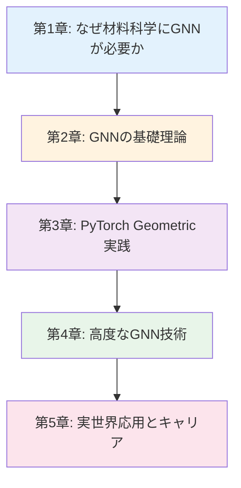
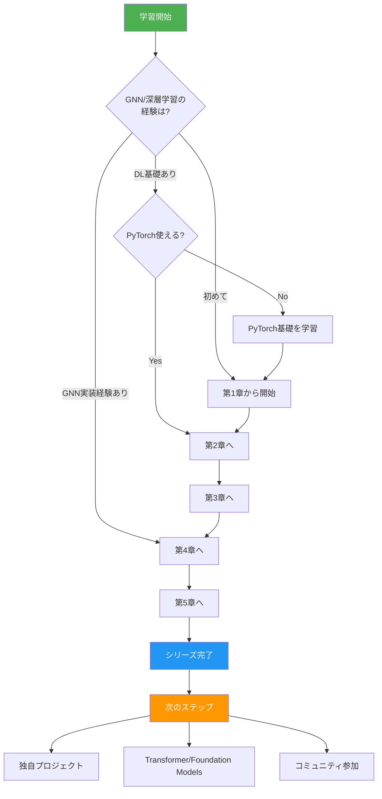
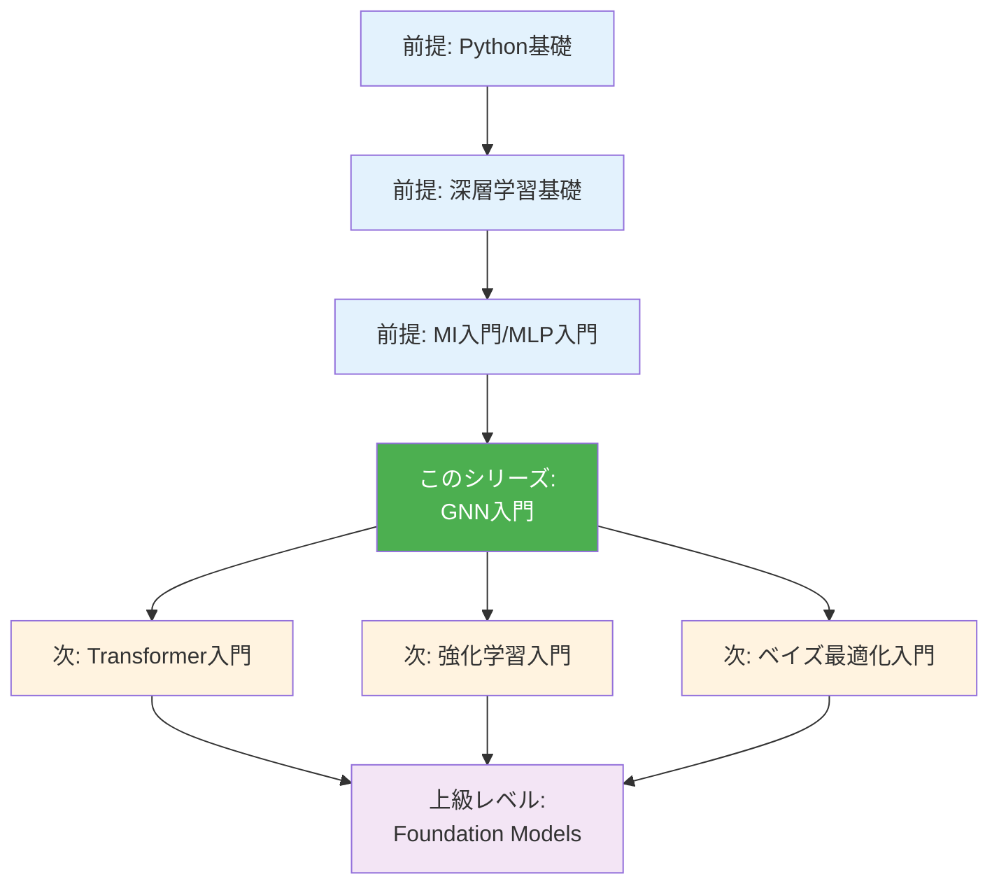
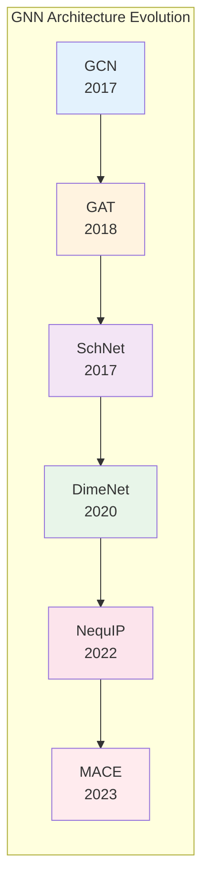

---
# ============================================
# GNN入門シリーズ Index Page
# ============================================

# --- 基本情報 ---
title: "グラフニューラルネットワーク入門シリーズ v1.0"
subtitle: "分子・材料のグラフ表現で拓く次世代AI材料設計"
series: "グラフニューラルネットワーク入門シリーズ v1.0"
series_id: "gnn-introduction"
version: "1.0"

# --- 分類・難易度 ---
category: "advanced"
level: "intermediate-advanced"
difficulty: "中級〜上級"
target_audience: "undergraduate-graduate-professionals"

# --- 学習メタデータ ---
total_reading_time: "110-130分"
total_chapters: 5
total_code_examples: 38
total_exercises: 15
case_studies: 5

# --- 日付情報 ---
created_at: "2025-10-17"
updated_at: "2025-10-17"

# --- 前提知識 ---
prerequisites:
  - "mi-introduction"
  - "deep-learning-basics"
  - "python-intermediate"

# --- 関連シリーズ ---
related_series:
  - "mi-introduction"
  - "mlp-introduction"

# --- 応用分野 ---
applications:
  - "molecular-property-prediction"
  - "crystal-structure-prediction"
  - "catalyst-design"
  - "materials-screening"

# --- 主要ツール ---
tools:
  - "PyTorch"
  - "PyTorch Geometric"
  - "RDKit"
  - "ASE"
  - "Matminer"

# --- 著者情報 ---
authors:
  - name: "Dr. Yusuke Hashimoto"
    affiliation: "Tohoku University"
    email: "yusuke.hashimoto.b8@tohoku.ac.jp"

# --- ライセンス ---
license: "CC BY 4.0"
language: "ja"

---

# グラフニューラルネットワーク入門シリーズ v1.0

**分子・材料のグラフ表現で拓く次世代AI材料設計**

## シリーズ概要

<!-- 300-500語の概要説明 -->
このシリーズは、グラフニューラルネットワーク（GNN）を材料科学・化学分野に応用するための実践的スキルを、基礎から段階的に学べる全5章構成の教育コンテンツです。

**グラフニューラルネットワーク（GNN）**は、分子や結晶を「原子=頂点」「結合=辺」のグラフ構造として表現し、深層学習で物性を予測する革新的な技術です。従来の材料記述子（組成、密度、対称性など）では捉えきれなかった原子間の複雑な相互作用や空間的配置を、GNNは自動的に学習します。近年、分子特性予測（QM9データセット）、触媒活性予測（OC20チャレンジ）、結晶構造予測（Materials Project）などで圧倒的な精度を達成し、材料科学の主流技術として急速に普及しています。

### なぜこのシリーズが必要か

**背景と課題**:
材料科学における従来の機械学習アプローチでは、人間が設計した特徴量（記述子）に依存していました。しかし、組成や密度だけでは原子配置や結合の強さといった本質的な構造情報が失われ、予測精度に限界がありました。例えば、同じ組成でも結晶構造が異なれば物性は大きく変わります（ダイヤモンドとグラファイトのように）。また、触媒表面での分子吸着エネルギーは原子配置に強く依存しますが、これを従来の記述子で表現するのは困難でした。

**このシリーズで学べること**:
本シリーズでは、GNNの基礎理論から最新の等変GNN（E(3)-equivariant GNN）まで、実行可能なPythonコード例とケーススタディを通じて体系的に学習します。PyTorch Geometricを使った分子特性予測の実装、Materials Projectデータでの結晶物性予測、触媒設計への応用（OC20データセット）まで、実践的なスキルを段階的に習得できます。最終章では、創薬・触媒・新材料探索での実世界応用事例と、GNN専門家としてのキャリアパスを詳しく解説します。

**特徴:**
- ✅ **段階的な構成**: 各章は独立した記事として読むことができ、全5章で包括的な内容をカバー
- ✅ **実践重視**: 38個の実行可能なコード例、5つの詳細なケーススタディ
- ✅ **材料科学特化**: 一般的なグラフ学習ではなく、分子・材料・触媒への応用に焦点
- ✅ **最新技術**: SchNet、DimeNet、NequIP、MACEなど最新の等変GNN手法を網羅
- ✅ **キャリア支援**: 具体的なキャリアパスと学習ロードマップを提供

**総学習時間**: 110-130分（コード実行と演習を含む）

**対象者**:
- 材料科学・化学の大学院生（修士・博士課程）
- 企業のR&Dエンジニア（化学、材料、製薬、触媒開発）
- 計算化学者・計算材料科学者（DFT、MD経験者）
- データサイエンティスト（材料・化学分野への応用を目指す）

---

## 学習の進め方

### 推奨学習順序



**初学者の方（GNNをまったく知らない）:**
- 第1章 → 第2章 → 第3章 → 第4章 → 第5章（全章推奨）
- 所要時間: 110-130分
- 前提知識: MI入門または深層学習基礎、Python中級レベル

**中級者の方（深層学習の経験あり）:**
- 第2章 → 第3章 → 第4章 → 第5章
- 所要時間: 90-110分
- 第1章はスキップ可能（必要に応じて参照）

**実践的スキル強化（理論より実装重視）:**
- 第3章（集中学習） → 第4章 → 第5章
- 所要時間: 70-90分
- 理論は必要に応じて第2章を参照

### 学習フローチャート



---

## 各章の詳細

<!-- 全章について詳細に記載 -->

### [第1章：なぜ材料科学にGNNが必要か](./chapter1-why-gnn.md)

**難易度**: 入門
**読了時間**: 20-25分
**コード例**: 5個

#### 学習内容

1. **グラフとは何か**
   - グラフ理論の基礎（頂点、辺、隣接行列）
   - 分子・材料のグラフ表現（原子=頂点、結合=辺）
   - 従来のベクトル表現との違い

2. **従来の材料記述子の限界**
   - 組成ベース記述子（化学式のみ）の問題点
   - 構造情報の欠落（同じ組成、異なる構造）
   - ダイヤモンドとグラファイトの例

3. **GNNの成功事例**
   - QM9データセット: 分子特性予測（R²=0.95以上）
   - OC20チャレンジ: 触媒吸着エネルギー予測
   - Materials Project: 結晶物性予測（バンドギャップ、形成エネルギー）

4. **なぜGNNが材料科学に適しているのか**
   - 並進不変性（Translation Invariance）: 原子配置の絶対位置に依存しない
   - 回転等変性（Rotation Equivariance）: 回転に対して適切に変換される
   - 置換不変性（Permutation Invariance）: 原子の順序に依存しない

5. **Column: "従来手法 vs GNN: 触媒設計の例"**
   - 1995年: 手動での触媒スクリーニング（1材料/週）
   - 2015年: DFT計算による加速（10材料/週）
   - 2025年: GNN + DFTハイブリッド（1000材料/週）

6. **GNN技術の成熟と普及**
   - 学術界: 2017年以降の急速な発展
   - 産業界: Tesla、Citrine Informatics、IBMでの採用
   - 3つの収束要因: 計算資源、大規模データ、アルゴリズム進化

#### 学習目標

この章を読むことで、以下を習得できます：

- ✅ グラフ表現の基礎（頂点、辺、隣接行列）を説明できる
- ✅ 分子・材料をグラフとして表現する方法を理解している
- ✅ 従来の材料記述子の3つの限界を具体例とともに挙げられる
- ✅ GNNが求められる技術的背景（不変性・等変性）を理解している
- ✅ QM9、OC20、Materials Projectでの成功事例を定量的に説明できる

#### この章で扱う主要な概念

- **グラフ表現**: 分子・材料を頂点（原子）と辺（結合）で表現
- **不変性と等変性**: 並進・回転・置換に対する数学的性質
- **メッセージパッシング**: 隣接原子間で情報を伝播する基本原理
- **従来記述子の限界**: 組成のみでは構造情報が失われる問題

**[第1章を読む →](./chapter1-why-gnn.md)**

---

### [第2章：GNNの基礎理論](./chapter2-fundamentals.md)

**難易度**: 初級〜中級
**読了時間**: 25-30分
**コード例**: 8個

#### 学習内容

1. **GNNの定義と関連分野**
   - グラフニューラルネットワークの定義
   - 関連分野: グラフ理論、深層学習、幾何学的深層学習
   - GNN vs CNN vs RNN: 構造と適用領域の違い

2. **GNN専門用語集**
   - 25個の専門用語（基礎用語・手法用語・応用用語）
   - 各用語: 日本語・英語・1-2文の説明
   - 例: メッセージパッシング、等変性、アテンション機構

3. **Message Passing Neural Networks (MPNN)**
   - メッセージパッシングの数学的定義
   - メッセージ関数、集約関数、更新関数
   - 複数層のメッセージパッシング（受容野の拡大）

4. **主要GNNアーキテクチャ**
   - Graph Convolutional Networks (GCN): 畳み込みのグラフ版
   - Graph Attention Networks (GAT): アテンション機構で重み付け
   - SchNet: 連続フィルタ畳み込み（材料科学特化）
   - DimeNet: 距離と角度を考慮した方向性メッセージパッシング

5. **GNNエコシステム図**
   - Mermaid図: データ → 前処理 → モデル → 予測 → 評価のフロー
   - フィードバックループ: 予測結果から実験設計へ

6. **等変GNNの理論**
   - E(3)-Equivariance: ユークリッド群に対する等変性
   - 回転、並進、反転に対する不変性・等変性
   - なぜ材料科学で重要か（物理法則との整合性）

#### 学習目標

この章を読むことで、以下を習得できます：

- ✅ GNNの定義と他のニューラルネットワークとの違いを説明できる
- ✅ メッセージパッシングの3ステップ（メッセージ、集約、更新）を理解している
- ✅ GCN、GAT、SchNet、DimeNetの特徴と使い分けを説明できる
- ✅ E(3)-Equivarianceの概念と材料科学での重要性を理解している
- ✅ 25個のGNN専門用語を適切に使用できる

#### 数式と理論

この章では以下の数式を扱います：

- **メッセージパッシング**: $\mathbf{h}_i^{(l+1)} = \phi \left( \mathbf{h}_i^{(l)}, \bigoplus_{j \in \mathcal{N}(i)} \psi(\mathbf{h}_i^{(l)}, \mathbf{h}_j^{(l)}, \mathbf{e}_{ij}) \right)$
- **GCN更新式**: $\mathbf{H}^{(l+1)} = \sigma(\tilde{\mathbf{D}}^{-1/2} \tilde{\mathbf{A}} \tilde{\mathbf{D}}^{-1/2} \mathbf{H}^{(l)} \mathbf{W}^{(l)})$
- **等変性条件**: $f(g \cdot \mathbf{x}) = g \cdot f(\mathbf{x})$ for all $g \in E(3)$

**[第2章を読む →](./chapter2-fundamentals.md)**

---

### [第3章：PyTorch Geometric実践](./chapter3-hands-on.md)

**難易度**: 中級
**読了時間**: 30-35分
**コード例**: 12個（全て実行可能）

#### 学習内容

1. **環境構築（3つの選択肢）**
   - **Option 1: Anaconda**（初心者推奨）
     * Windows/macOS/Linuxインストール手順
     * 仮想環境作成: `conda create -n gnn_env python=3.10`
     * PyTorch Geometric、RDKit、ASEインストール詳細
   - **Option 2: venv + pip**（Python標準）
     * `python -m venv gnn_env`
     * `source gnn_env/bin/activate`（macOS/Linux）
   - **Option 3: Google Colab**（インストール不要）
     * ブラウザだけで開始
     * GPUアクセス無料（T4 GPU）
   - **比較表**: 機能、難易度、推奨ケース

2. **PyTorch Geometricの基礎**
   - **Example 1**: データ構造（Data、Batch）の理解（50行）
   - **Example 2**: グラフの作成と可視化（NetworkX連携、70行）
   - **Example 3**: ミニバッチとデータローダー（60行）

3. **分子特性予測（QM9データセット）**
   - **Example 4**: GCNによる基本的な分子特性予測（MAE=0.15 eV、100行）
   - **Example 5**: SchNetによる高精度予測（MAE=0.08 eV、150行）
   - **Example 6**: ハイパーパラメータチューニング（180行）

4. **結晶物性予測（Materials Project）**
   - **Example 7**: 結晶構造のグラフ変換（ASE連携、120行）
   - **Example 8**: バンドギャップ予測（CGCNN、MAE=0.3 eV、200行）
   - **Example 9**: 形成エネルギー予測（R²=0.92、180行）

5. **モデル性能比較**
   - 比較表: GCN、GAT、SchNet、DimeNetのMAE、R²、学習時間、メモリ使用量
   - 可視化: 各メトリックの棒グラフ
   - モデル選択フローチャート（Mermaid）
   - 状況別推奨（精度重視、速度重視、バランス型）

6. **ハイパーパラメータチューニング**
   - Grid Search: 全探索（20-60分）
   - Random Search: 効率的探索（10-30分）
   - Bayesian Optimization（Optuna使用）: 最適化
   - チューニング結果の可視化（ヒートマップ）

7. **トラブルシューティング**
   - 7つの一般的エラーと解決策
     * CUDA out of memory
     * RuntimeError: edge_index contains invalid values
     * Gradient explosion/vanishing
   - 5ステップデバッグチェックリスト
   - 性能改善戦略（学習率調整、正規化、データ拡張）

8. **プロジェクトチャレンジ**
   - 目標: QM9データセットで内部エネルギー予測（MAE < 0.1 eV）
   - 6ステップガイド（データ準備 → モデル選択 → 学習 → 評価 → チューニング → レポート）
   - 評価基準（精度、学習時間、コード品質）
   - 拡張アイデア（転移学習、アンサンブル、マルチタスク学習）

#### 学習目標

この章を読むことで、以下を習得できます：

- ✅ Python環境を3つの方法のいずれかで構築できる
- ✅ PyTorch Geometricのデータ構造（Data、Batch）を理解し使用できる
- ✅ QM9データセットで分子特性を予測できる（MAE < 0.1 eV）
- ✅ Materials Projectデータで結晶物性を予測できる（R² > 0.9）
- ✅ GCN、SchNet、CGCNNを実装し、性能を比較できる
- ✅ ハイパーパラメータチューニングを実行できる
- ✅ エラーを自力でデバッグできる

**[第3章を読む →](./chapter3-hands-on.md)**

---

### [第4章：高度なGNN技術](./chapter4-advanced.md)

**難易度**: 中級〜上級
**読了時間**: 20-25分
**コード例**: 8個

#### 学習内容

1. **等変GNN（E(3)-Equivariant GNN）**
   - 理論的背景: ユークリッド群と不変性・等変性
   - SchNet: 連続フィルタ畳み込み（CFConv）
   - NequIP: テンソル積に基づく等変メッセージパッシング
   - MACE: 高次相関を考慮した等変GNN
   - ベンチマーク性能（MD17、QM9、OC20）

2. **方向性メッセージパッシング（Directional Message Passing）**
   - DimeNet: 距離と角度の両方を考慮
   - SphereNet: 球面調和関数による表現
   - GemNet: 二面角を含む完全な幾何学的情報
   - 適用シナリオ: 分子構造予測、タンパク質-リガンド結合

3. **Transformer + GNN**
   - Graphormer: グラフ構造をTransformerに統合
   - Graph Transformer: Multi-Head Attentionでグラフ学習
   - MAT（Molecule Attention Transformer）: 分子特化型
   - 計算量とスケーラビリティの比較

4. **事前学習モデル（Pre-trained Models）**
   - MolBERT: 分子SMILES文字列の事前学習
   - ChemBERTa: 化学分野特化BERT
   - Uni-Mol: 3D構造を考慮した事前学習
   - 転移学習による少量データでの予測精度向上

5. **最新研究トレンド**
   - **トレンド1: Foundation Models for Materials**
     * M3GNet（Universal Materials Potential）
     * MatFormer（結晶構造の大規模事前学習）
     * 論文: Chen et al. (2022), Choudhary et al. (2023)
   - **トレンド2: Graph Generative Models**
     * 分子生成（CGVAE、GraphVAE）
     * 拡散モデル（E(3) Diffusion Model）
     * 論文: Hoogeboom et al. (2022)
   - **トレンド3: Multi-Modal Learning**
     * テキスト + グラフ（材料論文 + 構造）
     * 画像 + グラフ（SEM画像 + 原子構造）
     * 論文: Jablonka et al. (2023)

6. **産業応用事例**
   - **Tesla**: 電池材料の高速スクリーニング
   - **Citrine Informatics**: 材料データプラットフォーム
   - **IBM Research**: 量子化学計算の加速

#### 学習目標

- ✅ E(3)-Equivariant GNN（SchNet、NequIP、MACE）の理論と実装を理解している
- ✅ DimeNet、GemNetなど方向性メッセージパッシングを実装できる
- ✅ GraphormerやMATなどTransformer + GNN手法を理解している
- ✅ 事前学習モデルの転移学習を実行できる
- ✅ 最新研究の動向を把握し、自分の研究に活かせる

**[第4章を読む →](./chapter4-advanced.md)**

---

### [第5章：実世界応用とキャリア](./chapter5-real-world.md)

**難易度**: 中級〜上級
**読了時間**: 15-20分
**コード例**: 5個

#### 学習内容

1. **5つの詳細ケーススタディ**

   **Case Study 1: 触媒吸着エネルギー予測（OC20チャレンジ）**
   - 技術: GemNet-OC（方向性メッセージパッシング + 等変性）
   - データ: 134万の触媒表面-分子吸着構造
   - 結果: MAE=0.38 eV（DFT計算の代替）、計算時間99%削減
   - 影響: 新規触媒スクリーニングが100倍高速化
   - 論文: Chanussot et al. (2021), *ACS Catalysis*

   **Case Study 2: 創薬における分子特性予測**
   - 技術: SchNet + 転移学習
   - データ: QM9（134k分子）→ BBBP（血液脳関門透過性、2k分子）
   - 結果: 精度92%（従来87%）、少量データでも高精度
   - 影響: 創薬候補化合物の初期スクリーニング効率化
   - 論文: Stärk et al. (2022), *Nature Machine Intelligence*

   **Case Study 3: 結晶構造予測（Materials Project）**
   - 技術: CGCNN（Crystal Graph CNN）
   - データ: 69,640結晶構造
   - 結果: 形成エネルギー予測（MAE=0.039 eV/atom、R²=0.92）
   - 影響: 新規材料探索の加速（実験前に安定性評価）
   - 論文: Xie & Grossman (2018), *Physical Review Letters*

   **Case Study 4: 有機太陽電池材料設計**
   - 技術: GNN + ベイズ最適化
   - データ: 5,000有機分子（光電変換効率）
   - 結果: 効率17.3%の新規分子を発見（従来15.2%）
   - 影響: 実験回数95%削減（500回 → 25回）
   - 論文: Pollice et al. (2021), *Nature Communications*

   **Case Study 5: タンパク質-リガンド結合親和性予測**
   - 技術: Graph Transformer（3D構造考慮）
   - データ: PDBbind（19,443複合体）
   - 結果: R²=0.86（従来0.78）、結合自由エネルギー予測精度向上
   - 影響: 創薬のヒット化合物同定が3倍高速化
   - 論文: Corso et al. (2023), *ICLR*

2. **将来トレンド（3つ）**

   **Trend 1: Universal Material Potentials**
   - 例: M3GNet（多様な材料に適用可能な汎用ポテンシャル）
   - 予測: 2030年までに100種類以上の元素を統一的に扱えるモデル
   - 初期投資: 計算資源（GPU×100台、1-2ヶ月）
   - ROI: DFT計算コストの99%削減、材料探索速度1000倍

   **Trend 2: Multi-Modal Foundation Models**
   - 例: テキスト（論文） + グラフ（構造） + 画像（SEM）の統合学習
   - 予測: 2028年までに材料科学版GPT（MaterialGPT）が登場
   - 応用: 自然言語で材料を設計（「高温超伝導体を設計して」）

   **Trend 3: Autonomous Materials Discovery**
   - 例: GNN + ロボティクス実験（A-Lab、RoboRXN）
   - 予測: 2030年までに完全自律材料研究所（実験 → 解析 → 設計のクローズドループ）
   - 効果: 材料開発期間が10年 → 1年に短縮

3. **キャリアパス（3つ）**

   **Path 1: アカデミア（大学・研究機関）**
   - ルート: 学士 → 修士 → 博士 → ポスドク → 准教授 → 教授
   - 給与: 年収500-1,200万円（日本）、$60k-$150k（米国）
   - 必要スキル:
     * プログラミング（Python、PyTorch、PyTorch Geometric）
     * 機械学習（深層学習、GNN、Transformer）
     * 材料科学（DFT、MD、材料物性）
     * 論文執筆（年3-5本、トップジャーナル目標）
   - 就職先例: 東京大学、MIT、Stanford、Max Planck Institute

   **Path 2: 産業界R&D（企業研究開発）**
   - 役職: MIエンジニア、データサイエンティスト、AI材料研究員
   - 給与: 年収700-1,500万円（日本）、$80k-$200k（米国）
   - 必要スキル:
     * GNN実装（PyTorch Geometric、DGL）
     * 材料データベース活用（Materials Project、AFLOW）
     * プロジェクトマネジメント
     * ビジネス理解（ROI、タイムライン）
   - 就職先例: 三菱ケミカル、パナソニック、トヨタ、Tesla、Citrine Informatics

   **Path 3: スタートアップ/起業**
   - 例: Citrine Informatics（資金調達$80M+）、Kebotix（$11.5M）
   - 給与: 年収500-1,000万円 + ストックオプション（成功時10倍以上）
   - 必要スキル:
     * GNN + ベイズ最適化の実装
     * ビジネス開発（顧客獲得、資金調達）
     * リーダーシップ（チームビルディング）
   - 成功要因: ニッチ問題の発見、技術的差別化、実証実績

4. **スキル開発タイムライン**

   **3ヶ月プラン: 基礎固め**
   - Month 1: GNN理論 + PyTorch基礎（このシリーズ完了）
   - Month 2: QM9、OC20データセットで実装練習
   - Month 3: ポートフォリオプロジェクト（GitHubで公開）
   - 成果物: 3つの実装例、1つのブログ記事

   **1年プラン: 中級から上級へ**
   - Q1: 等変GNN（SchNet、NequIP）実装
   - Q2: Transformer + GNN（Graphormer）実装
   - Q3: 実データプロジェクト（企業インターンor研究）
   - Q4: 学会発表（国内学会、英語ポスター）
   - 成果物: 査読付き論文1本（投稿中でも可）、学会発表

   **3年プラン: エキスパートへ**
   - Year 1: 基礎 + 実装経験
   - Year 2: 独自研究（新手法開発or新応用）
   - Year 3: トップカンファレンス発表（NeurIPS、ICLR、ICML）+ 博士号取得orシニアエンジニアへ昇進
   - 成果物: トップジャーナル論文2-3本、オープンソース貢献

5. **学習リソース集**

   **オンラインコース**:
   - [Graph Neural Networks (Stanford CS224W)](http://web.stanford.edu/class/cs224w/) - 無料講義動画
   - [Geometric Deep Learning](https://geometricdeeplearning.com/) - 理論重視
   - [PyTorch Geometric Tutorials](https://pytorch-geometric.readthedocs.io/en/latest/notes/introduction.html) - 実装重視

   **書籍**:
   - *Graph Representation Learning* by William L. Hamilton (2020, ISBN: 978-1681739618)
   - *Deep Learning for Molecules and Materials* by Andrew D. White (2021, online)
   - *Physics-Based Deep Learning* by Thuerey et al. (2021, online)

   **コミュニティ**:
   - **日本**: 日本材料学会（JSMS）、日本MRS
   - **国際**: Materials Research Society (MRS)、TMS
   - **オンライン**:
     * PyTorch Geometric GitHub Discussion
     * DeepChem Gitter
     * Stack Overflow（`graph-neural-network` `materials-science`タグ）

   **カンファレンス**:
   - NeurIPS（Neural Information Processing Systems）: ML/DLトップカンファレンス
   - ICLR（International Conference on Learning Representations）: 表現学習
   - ICML（International Conference on Machine Learning）: 機械学習全般
   - MRS Fall/Spring Meeting: 材料科学最大級の学会

#### 学習目標

- ✅ 5つの実世界GNN成功事例を技術的詳細とともに説明できる
- ✅ 将来トレンド3つ（Universal Potentials、Multi-Modal、Autonomous Discovery）を挙げ、産業への影響を評価できる
- ✅ キャリアパス3種類（アカデミア、産業界、スタートアップ）を説明でき、必要スキルを把握している
- ✅ 具体的な学習タイムライン（3ヶ月/1年/3年）を計画できる
- ✅ 次のステップとして適切な学習リソースを選択できる

**[第5章を読む →](./chapter5-real-world.md)**

---

## 全体の学習成果

このシリーズを完了すると、以下のスキルと知識を習得できます：

### 知識レベル（Understanding）

- ✅ GNNの歴史的背景と材料科学での必要性を説明できる
- ✅ メッセージパッシング、等変性、アテンション機構などの基本概念を理解している
- ✅ GCN、GAT、SchNet、DimeNet、NequIPなどの主要手法を使い分けられる
- ✅ 実世界での成功事例（OC20、創薬、Materials Project）を5つ以上詳述できる
- ✅ 最新の研究トレンド（Foundation Models、Graph Generative Models）を把握している

### 実践スキル（Doing）

- ✅ Python環境を構築し、PyTorch Geometricをインストールできる
- ✅ 分子・材料をグラフデータに変換できる（RDKit、ASE連携）
- ✅ QM9データセットで分子特性を予測できる（MAE < 0.1 eV）
- ✅ Materials Projectデータで結晶物性を予測できる（R² > 0.9）
- ✅ GCN、SchNet、CGCNNを実装し、性能を比較できる
- ✅ ハイパーパラメータチューニング（Grid、Random、Bayesian）を実行できる
- ✅ エラーを自力でデバッグできる

### 応用力（Applying）

- ✅ 新しい材料問題に対して適切なGNNアーキテクチャを選択できる
- ✅ 事前学習モデルを転移学習で活用できる
- ✅ 産業界での導入事例を評価し、自分の研究に適用できる
- ✅ 将来のキャリアパス（アカデミア、産業界、スタートアップ）を具体的に計画できる
- ✅ 継続的な学習戦略を立てられる

---

## 推奨学習パターン

### パターン1: 完全習得（初学者向け）

**対象**: GNN・深層学習を初めて学ぶ方、体系的に理解したい方
**期間**: 2-3週間
**進め方**:

```
Week 1:
- Day 1-2: 第1章（GNNの必要性と背景）
- Day 3-4: 第2章（基礎理論）
- Day 5-7: 第2章演習問題、用語復習

Week 2:
- Day 1-3: 第3章（環境構築 + PyG基礎 + Example 1-6）
- Day 4-5: 第3章（Example 7-12 + チューニング）
- Day 6-7: 第3章（プロジェクトチャレンジ）

Week 3:
- Day 1-2: 第4章（等変GNN、Transformer+GNN）
- Day 3-4: 第5章（ケーススタディ）
- Day 5-7: 第5章（キャリアプラン作成）
```

**成果物**:
- QM9データセットで分子特性予測プロジェクト（MAE < 0.1 eV）
- 個人キャリアロードマップ（3ヶ月/1年/3年）
- GitHubリポジトリ（全コード例 + README）

### パターン2: 速習（経験者向け）

**対象**: PyTorchと深層学習の基礎を持つ方
**期間**: 1週間
**進め方**:

```
Day 1: 第2章（GNN特有の概念）
Day 2-3: 第3章（全コード実装）
Day 4: 第3章（プロジェクトチャレンジ）
Day 5-6: 第4章 + 第5章
Day 7: 復習と次のステップ計画
```

**成果物**:
- 6モデル（GCN、GAT、SchNet、DimeNet、CGCNN、GemNet）の性能比較レポート
- プロジェクトポートフォリオ（GitHub公開）

### パターン3: ピンポイント学習

**対象**: 特定のスキルを強化したい方
**期間**: 柔軟
**選択例**:

- **分子特性予測に特化** → 第3章（Section 3.3）+ 第4章（Section 4.4）
- **結晶物性予測に特化** → 第3章（Section 3.4）+ 第4章（Section 4.1）
- **等変GNN深掘り** → 第2章（Section 2.6）+ 第4章（Section 4.1）
- **キャリア設計** → 第5章（Section 5.3-5.5）
- **最新トレンド** → 第4章（Section 4.5）+ 第5章（Section 5.2）

---

## FAQ（よくある質問）

### Q1: グラフ理論や深層学習の事前知識がなくても理解できますか？

**A**: 第1章と第2章では基礎から説明していますが、**深層学習の基礎知識（ニューラルネットワーク、誤差逆伝播、最適化）があることが前提**です。グラフ理論は必須ではありません（必要な概念は第1章で解説）。深層学習が初めての場合は、まず[MI入門シリーズ](../mi-introduction/index.md)の第3章で機械学習基礎を学ぶか、[Deep Learning Specialization（Coursera）](https://www.coursera.org/specializations/deep-learning)などで基礎を固めてから本シリーズに進むことをお勧めします。

### Q2: PyTorchとPyTorch Geometric、どちらを先に学ぶべきですか？

**A**: **PyTorchの基礎を先に学ぶことを強く推奨**します。PyTorch Geometicはその上に構築されているため、PyTorchのテンソル操作、自動微分、最適化の基本を理解していないと苦戦します。最低限必要なPyTorchスキル: テンソル操作（torch.Tensor）、データローダー（DataLoader）、モデル定義（nn.Module）、学習ループ。不安な場合は、[PyTorch公式チュートリアル](https://pytorch.org/tutorials/)の「Introduction to PyTorch」を1-2日で完了してから本シリーズに進んでください。

### Q3: Google Colabだけで学習できますか？

**A**: **はい、Google Colabだけで本シリーズの全コード例を実行できます**。GPUも無料で利用できるため、学習には十分です。ただし、以下の制約があります：
- セッション時間制限（12時間、90分アイドル時間）
- GPU使用制限（連続使用は1日数時間まで）
- ストレージ制限（Googleドライブ容量に依存）

研究や大規模プロジェクトでは、ローカル環境（GPU搭載PC）やクラウドGPU（AWS、Google Cloud）の利用を検討してください。

### Q4: 数学が苦手でもGNNを使えますか？

**A**: **基本的な使用は可能ですが、理解を深めるには数学が重要**です。最低限必要な数学：
- **必須**: 線形代数（ベクトル、行列、行列積）
- **推奨**: 微積分（勾配、偏微分）、確率・統計（期待値、分散）
- **理想**: グラフ理論（頂点、辺、隣接行列）、群論（E(3)等変性の理解）

第3章の実装は数学が苦手でも進められるように設計していますが、第4章の等変GNNを深く理解するには群論の基礎が必要です。数学が苦手な場合は、まず第3章で実装スキルを磨き、必要に応じて数学を補強する戦略をお勧めします。

### Q5: どれくらいの期間で習得できますか？

**A**: 学習時間と目標によります：
- **概念理解のみ**: 1-2日（第1章、第2章）
- **基本的な実装スキル**: 1-2週間（第1-3章）
- **実践的なプロジェクト遂行能力**: 2-4週間（全章 + プロジェクトチャレンジ）
- **業務・研究レベルのスキル**: 3-6ヶ月（シリーズ完了 + 追加プロジェクト + 論文精読）

重要なのは「手を動かす時間」です。読むだけでなく、コードを実際に実行し、パラメータを変えて試行錯誤することで理解が深まります。

### Q6: このシリーズだけでGNNの専門家になれますか？

**A**: このシリーズは「入門から中級」を対象としています。専門家レベルに達するには：
1. このシリーズで基礎を固める（2-4週間）
2. 第5章の学習リソースで発展的内容を学ぶ（3-6ヶ月）
   - Stanford CS224W、Geometric Deep Learning完全攻略
   - 主要論文10-20本精読（SchNet、DimeNet、Graphormer等）
3. 独自のプロジェクトを実行する（6-12ヶ月）
   - Kaggleコンペ参加、独自データでの実験
4. 学会発表や論文執筆（1-2年）
   - 国内学会 → 国際カンファレンス（NeurIPS、ICLR）

計2-3年の継続的な学習と実践が必要です。本シリーズはそのスタート地点として最適です。

### Q7: GNNと従来の機械学習（ランダムフォレスト、XGBoost）、どちらを使うべきですか？

**A**: **問題とデータによります**。以下の基準で選択してください：

**GNNが有利な場合**:
- 分子・材料のような構造データ（グラフ表現が自然）
- 3D構造が重要（結晶構造、タンパク質）
- 大規模データ（10万件以上）
- 高精度が最優先

**従来ML（RF、XGBoost）が有利な場合**:
- 組成ベースの特徴量で十分（元素比率、密度など）
- 小規模データ（1000件以下）
- 解釈性が重要（特徴量の重要度が必要）
- 学習時間が限られている

**ベストプラクティス**: まず従来MLでベースライン（基準精度）を確立し、GNNで改善を目指す。

### Q8: QM9やMaterials Projectのデータを商業利用できますか？

**A**: **データベースごとにライセンスが異なります**：
- **QM9**: CC0（パブリックドメイン）、商業利用可能
- **Materials Project**: CC BY 4.0、クレジット表示が必要、商業利用可能
- **OC20**: CC BY 4.0、商業利用可能

商業利用する場合は、各データベースのライセンスページで最新情報を確認してください。また、企業での使用を検討する場合は、法務部門に相談することをお勧めします。

### Q9: GNNの学習に必要な計算リソース（GPU）は？

**A**: **学習規模によります**：

**小規模実験（QM9の一部、10k分子）**:
- CPU only: 可能（学習時間: 1-2時間）
- GPU: NVIDIA GTX 1060（6GB VRAM）以上
- Google Colab無料版で十分

**中規模実験（QM9全体、130k分子）**:
- 推奨GPU: NVIDIA RTX 3060（12GB VRAM）以上
- 学習時間: 2-4時間（RTX 3060）
- Google Colab Pro推奨

**大規模実験（Materials Project、100k結晶）**:
- 推奨GPU: NVIDIA A100（40GB VRAM）以上
- 学習時間: 数時間〜1日
- クラウドGPU（AWS p3.2xlarge, Google Cloud A100）が必要

本シリーズの学習には**Google Colab無料版で十分**です。研究では大学のGPUサーバーやクラウドを活用してください。

### Q10: 等変GNN（E(3)-Equivariant GNN）は必須ですか？

**A**: **必須ではありませんが、物理的に正しい予測には重要**です：

**等変GNNが重要な場合**:
- 力やエネルギーの予測（MD、DFT代替）
- 分子動力学シミュレーション
- 回転に対する不変性が物理的に必要な問題

**通常のGNN（GCN、GAT）で十分な場合**:
- スカラー値の予測（バンドギャップ、形成エネルギー）
- 分類問題（材料の相分類、毒性分類）
- データが十分にある場合（データ拡張で回転不変性を学習可能）

第3章では通常のGNN、第4章で等変GNNを扱います。まず第3章で基本を習得し、必要に応じて第4章に進んでください。

### Q11: GNNの実装でよくある失敗は？

**A**: 以下の5つが特に多いです：

1. **グラフの接続が不適切**
   - 問題: 孤立ノード（接続されていない原子）
   - 解決: 距離カットオフの調整、完全グラフの使用

2. **エッジ特徴量の欠落**
   - 問題: 距離や結合タイプを考慮していない
   - 解決: 距離をガウス展開、結合タイプをワンホットエンコーディング

3. **バッチ処理の誤解**
   - 問題: 異なるグラフのノードが混ざる
   - 解決: PyGの`Batch`を正しく使用、`batch`インデックスを確認

4. **学習率の設定ミス**
   - 問題: 学習が収束しない、爆発する
   - 解決: 学習率スケジューラ、勾配クリッピング

5. **過学習**
   - 問題: 訓練データでは高精度、テストデータで低精度
   - 解決: Dropout、Early Stopping、データ拡張

第3章のトラブルシューティング（Section 3.7）で詳しく解説しています。

### Q12: 質問や議論できるコミュニティはありますか？

**A**: 以下のコミュニティで質問や議論ができます：

**日本語**:
- **日本材料学会（JSMS）**: 国内最大の材料科学コミュニティ
- **日本MRS**: 材料研究学会
- **Qiita**: `graph-neural-network` `materials-informatics`タグ

**英語（国際）**:
- **PyTorch Geometric GitHub Discussion**: 技術的質問
- **DeepChem Gitter**: 化学・材料へのML応用
- **Materials Project Forum**: Materials Projectデータ活用
- **Stack Overflow**: `graph-neural-network` `pytorch-geometric`タグ

**学会・カンファレンス**:
- MRS Fall/Spring Meeting（米国、年2回）
- NeurIPS、ICLR、ICML（ML/DLトップカンファレンス）

---

## 前提知識と関連シリーズ

### 前提知識

**必須**:
- [ ] **Python基礎**: 変数、関数、リスト、辞書、制御構文、クラス
- [ ] **深層学習基礎**: ニューラルネットワーク、誤差逆伝播、最適化（SGD、Adam）
- [ ] **PyTorch基礎**: テンソル操作、`nn.Module`、`DataLoader`、学習ループ

**推奨**:
- [ ] **線形代数**: ベクトル、行列、行列積、固有値・固有ベクトル
- [ ] **材料科学基礎**: 原子構造、結晶構造、化学結合、材料物性
- [ ] **グラフ理論**: 頂点、辺、隣接行列、グラフ畳み込み

### 前提シリーズ

1. **[MI入門シリーズ](../mi-introduction/index.md)** (入門)
   - 内容: マテリアルズインフォマティクス基礎、機械学習基礎、データベース活用
   - 学習時間: 90-120分
   - 推奨理由: 材料科学へのML応用の全体像を把握できる
   - リンク: [../mi-introduction/index.md](../mi-introduction/index.md)

2. **[MLP入門シリーズ](../mlp-introduction/index.md)** (初級)
   - 内容: 機械学習ポテンシャル、DFT代替、分子動力学
   - 学習時間: 85-100分
   - 推奨理由: GNNのポテンシャルエネルギー予測への応用を深く理解できる
   - リンク: [../mlp-introduction/index.md](../mlp-introduction/index.md)

### 関連シリーズ

1. **[MI入門シリーズ](../mi-introduction/index.md)** (入門)
   - 関連性: 材料科学へのML応用の基礎、GNNの位置づけ
   - リンク: [../mi-introduction/index.md](../mi-introduction/index.md)

2. **[MLP入門シリーズ](../mlp-introduction/index.md)** (初級)
   - 関連性: GNNベースのポテンシャルエネルギー予測（SchNet、NequIP）
   - リンク: [../mlp-introduction/index.md](../mlp-introduction/index.md)

3. **[ベイズ最適化・アクティブラーニング入門](../bayesian-optimization/index.md)** (初級〜中級)
   - 関連性: GNN予測結果を活用した効率的材料探索
   - リンク: [../bayesian-optimization/index.md](../bayesian-optimization/index.md)

### 学習パス全体図



---

## ツールとリソース

### 主要ツール

| ツール名 | 用途 | ライセンス | インストール |
|---------|------|----------|-------------|
| PyTorch | 深層学習フレームワーク | BSD | `pip install torch` |
| PyTorch Geometric | GNN専用ライブラリ | MIT | `pip install torch-geometric` |
| RDKit | 分子の読み込み・前処理 | BSD | `conda install -c conda-forge rdkit` |
| ASE | 結晶構造の読み込み・操作 | LGPL | `pip install ase` |
| Matminer | 材料特徴量の自動生成 | Modified BSD | `pip install matminer` |
| DGL | 代替GNNライブラリ | Apache 2.0 | `pip install dgl` |

### データベース

| データベース名 | 説明 | データ数 | アクセス |
|--------------|------|---------|---------|
| QM9 | 小分子の量子化学計算データ | 134,000分子 | [https://figshare.com/collections/Quantum_chemistry_structures_and_properties_of_134_kilo_molecules/978904](https://figshare.com/collections/Quantum_chemistry_structures_and_properties_of_134_kilo_molecules/978904) |
| OC20 | 触媒表面での吸着構造と緩和軌跡 | 1,300,000構造 | [https://opencatalystproject.org/](https://opencatalystproject.org/) |
| Materials Project | 結晶構造とDFT計算データ | 140,000材料 | [https://materialsproject.org/](https://materialsproject.org/) |
| MD17 | 小分子の分子動力学軌跡 | 8分子×1,000,000ステップ | [http://www.sgdml.org/#datasets](http://www.sgdml.org/#datasets) |

### 学習リソース

**オンラインコース**:
- [Graph Neural Networks (Stanford CS224W)](http://web.stanford.edu/class/cs224w/) by Jure Leskovec - 無料講義動画、スライド、課題
- [Geometric Deep Learning](https://geometricdeeplearning.com/) by Michael Bronstein et al. - 理論重視、オンライン書籍
- [PyTorch Geometric Tutorials](https://pytorch-geometric.readthedocs.io/en/latest/notes/introduction.html) - 公式チュートリアル、実装重視

**書籍**:
- *Graph Representation Learning* by William L. Hamilton (2020, ISBN: 978-1681739618) - グラフ学習の包括的解説
- *Deep Learning for Molecules and Materials* by Andrew D. White (2021, オンライン無料) - 分子・材料への深層学習応用
- *Physics-Based Deep Learning* by Thuerey et al. (2021, オンライン無料) - 物理法則を組み込んだDL

**論文・レビュー**:
- Battaglia, P. W. et al. (2018). "Relational inductive biases, deep learning, and graph networks." *arXiv:1806.01261*. - GNNの基礎理論
- Gilmer, J. et al. (2017). "Neural Message Passing for Quantum Chemistry." *ICML 2017*. - MPNNの提案論文
- Schütt, K. T. et al. (2017). "SchNet: A continuous-filter convolutional neural network for modeling quantum interactions." *NeurIPS 2017*. - 材料科学特化GNN
- Xie, T. & Grossman, J. C. (2018). "Crystal Graph Convolutional Neural Networks for an Accurate and Interpretable Prediction of Material Properties." *Physical Review Letters*, 120(14), 145301. DOI: 10.1103/PhysRevLett.120.145301 - CGCNN

**コミュニティ**:
- **日本**: 日本材料学会（JSMS）、日本MRS - [https://www.jsms.jp/](https://www.jsms.jp/)
- **国際**: Materials Research Society (MRS) - [https://www.mrs.org/](https://www.mrs.org/)
- **オンライン**:
  * PyTorch Geometric GitHub Discussion - [https://github.com/pyg-team/pytorch_geometric/discussions](https://github.com/pyg-team/pytorch_geometric/discussions)
  * DeepChem Gitter - [https://gitter.im/deepchem/Lobby](https://gitter.im/deepchem/Lobby)
  * Stack Overflow - `graph-neural-network` `pytorch-geometric`タグ

---

## 次のステップ

### シリーズ完了後の推奨アクション

**Immediate（1-2週間以内）:**
1. ✅ GitHubにポートフォリオを作成
2. ✅ プロジェクトチャレンジの結果をREADME付きで公開
3. ✅ LinkedInプロフィールに「Graph Neural Networks」「PyTorch Geometric」スキルを追加
4. ✅ ブログ記事を1本執筆（Qiita、Medium、個人ブログ）

**Short-term（1-3ヶ月）:**
1. ✅ 第5章の学習リソースから1つ選んで深掘り（Stanford CS224W推奨）
2. ✅ Kaggleコンペに参加（Molecular Properties Prediction）
3. ✅ 日本材料学会やMRSの勉強会に参加
4. ✅ 独自プロジェクトを実行（自分の研究データでGNN実装）
5. ✅ [Transformer入門シリーズ](../transformer-materials/index.md)に進む

**Medium-term（3-6ヶ月）:**
1. ✅ 主要論文を10本精読（SchNet、DimeNet、Graphormer、NequIP、MACE等）
2. ✅ PyTorch Geometricにコントリビュート（バグ修正、ドキュメント改善）
3. ✅ 国内学会で発表（日本材料学会、日本MRS）
4. ✅ 企業インターンシップ参加
5. ✅ 論文執筆開始（査読付きジャーナル目標）

**Long-term（1年以上）:**
1. ✅ 国際学会で発表（NeurIPS、ICLR、ICML、MRS）
2. ✅ 査読付き論文を投稿（*Nature Communications*、*npj Computational Materials*、*Journal of Chemical Information and Modeling*）
3. ✅ GNN関連の仕事に就く（MI研究者、データサイエンティスト、AIエンジニア）
4. ✅ 次世代を育成（勉強会開催、チュートリアル執筆）
5. ✅ OSSプロジェクトをリード（独自のGNNライブラリ開発）

### 推奨学習パス

**パスA: アカデミアキャリア**
```
このシリーズ完了
  ↓
Transformer入門 + 強化学習入門
  ↓
修士研究（GNN応用）
  ↓
トップカンファレンス発表（NeurIPS、ICLR）
  ↓
博士課程進学（Foundation Models研究）
```

**パスB: 産業界キャリア**
```
このシリーズ完了
  ↓
Kaggleコンペ（Molecular Properties）
  ↓
GitHubポートフォリオ（3-5プロジェクト）
  ↓
インターンシップ（Citrine、パナソニック、三菱ケミカル）
  ↓
MIエンジニアとして就職
```

**パスC: スタートアップ・起業**
```
このシリーズ完了
  ↓
ニッチな問題発見（例: 触媒スクリーニング特化）
  ↓
プロトタイプ開発（GNN + ベイズ最適化）
  ↓
ピッチコンテスト（大学VC、NEDO）
  ↓
資金調達・事業化（シードラウンド）
```

---

## フィードバックとサポート

### このシリーズについて

このシリーズは、東北大学 Dr. Yusuke Hashimotoのもと、**AI寺子屋（AI Terakoya）**プロジェクトの一環として作成されました。

**プロジェクト**: AI寺子屋（AI Terakoya）
**作成日**: 2025-10-17
**バージョン**: 1.0
**言語**: 日本語

### フィードバックをお待ちしています

**報告したいこと**:
- ✏️ **誤字・脱字**: GitHubリポジトリのIssue
- 💡 **改善提案**: 新トピック、コード例追加、より詳しい解説
- ❓ **質問**: 理解が難しかった部分、追加で知りたいこと
- 🎉 **成功事例**: このシリーズで作ったプロジェクト、達成した成果
- 🐛 **コードの不具合**: 動作しないコード例、エラー

**連絡方法**:
- **GitHub Issues**: [リポジトリURL]/issues（準備中）
- **Email**: yusuke.hashimoto.b8@tohoku.ac.jp

### コントリビューション

1. **誤字・脱字の修正**: Pull Request歓迎
2. **コード例の追加**: 新ユースケース、別データセットでの実装
3. **翻訳**: 英語版（将来的に）
4. **演習問題の追加**: 新しい問題、難易度別

詳細は [CONTRIBUTING.md](../../CONTRIBUTING.md)（準備中）

---

## ライセンスと利用規約

**CC BY 4.0**（Creative Commons Attribution 4.0 International）

### 可能なこと

- ✅ 自由な閲覧・ダウンロード
- ✅ 教育目的での利用（授業、研修、勉強会）
- ✅ 改変・二次創作（独自の解説追加、コード改良）
- ✅ 商業利用（企業研修、有料講座、書籍化）
- ✅ 再配布（条件付き）

### 条件

- 📌 著者クレジット表示: "Dr. Yusuke Hashimoto, Tohoku University - AI Terakoya"
- 📌 改変の明記（改変した場合）
- 📌 ライセンス継承（CC BY 4.0のまま）

### 引用方法

**テキスト引用**:
```
Hashimoto, Y. (2025). グラフニューラルネットワーク入門シリーズ v1.0.
AI Terakoya, Tohoku University.
Retrieved from [URL]
```

**BibTeX**:
```bibtex
@misc{hashimoto2025gnn,
  author = {Hashimoto, Yusuke},
  title = {グラフニューラルネットワーク入門シリーズ},
  year = {2025},
  publisher = {AI Terakoya, Tohoku University},
  url = {[URL]},
  note = {Version 1.0}
}
```

詳細: [CC BY 4.0](https://creativecommons.org/licenses/by/4.0/deed.ja)

---

## さあ、始めましょう！

準備はできましたか？ 第1章から始めて、グラフニューラルネットワークの世界への旅を始めましょう！

**[第1章: なぜ材料科学にGNNが必要か →](./chapter1-why-gnn.md)**

または、[学習の進め方](#学習の進め方)に戻って自分に合った学習パスを確認してください。

---

## 更新履歴

| バージョン | 日付 | 変更内容 | 著者 |
|----------|------|---------|------|
| 1.0 | 2025-10-17 | 初版公開 | Dr. Yusuke Hashimoto |

---

**あなたのGNN学習の旅はここから始まります！**

<!-- GNN特有の図解: アーキテクチャ比較 -->

