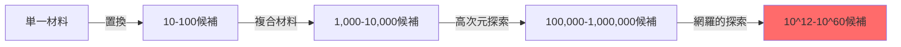
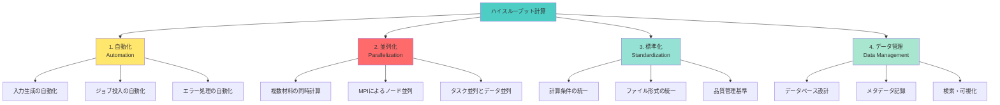
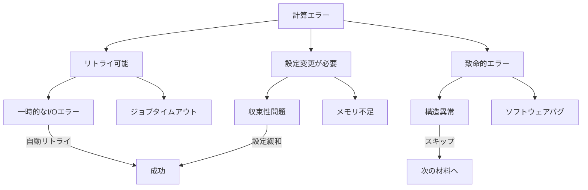
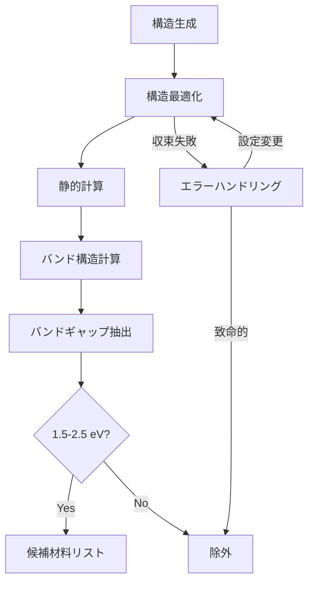

# 第1章：ハイスループット計算の必要性とワークフロー設計

## 学習目標

この章を読むことで、以下を習得できます：

- ✅ 材料探索空間の広大さを定量的に理解できる
- ✅ ハイスループット計算の4つの要素（自動化・並列化・標準化・データ管理）を説明できる
- ✅ Materials Project、AFLOW等の成功要因を分析できる
- ✅ 効果的なワークフロー設計の原則を理解し、適用できる
- ✅ コスト削減効果を定量的に評価できる

---

## 1.1 材料探索の課題：なぜハイスループット計算が必要なのか

### 探索空間の広大さ

材料科学における最大の課題は、**探索すべき空間があまりにも広大である**ことです。

**例：3元系合金の探索**

Li-Ni-Co酸化物電池材料（LiₓNiᵧCoᵧO₂）を考えてみましょう：
- Li組成: 0.0-1.0（10段階）
- Ni組成: 0.0-1.0（10段階）
- Co組成: 0.0-1.0（10段階）

単純計算で **10³ = 1,000通り** です。

**例：5元系高エントロピー合金**

CoCrFeNiMn系で組成比を変化させる場合：
- 各元素: 0-100%（10%刻みで11段階）
- 組成の合計が100%になる制約

組み合わせは **数万通り** に達します。

**一般的な材料探索の規模**



実際の材料探索では、**10¹²（1兆）から10⁶⁰通り**の組み合わせが存在します。

### 従来手法の限界

**1材料あたりのコスト（従来の実験主導型）**

| 項目 | 時間 | コスト（概算） |
|-----|------|--------------|
| 文献調査 | 1-2週間 | 10万円 |
| 試料合成 | 1-4週間 | 30-100万円 |
| 特性評価 | 2-8週間 | 50-200万円 |
| データ解析 | 1-2週間 | 10-30万円 |
| **合計** | **2-4ヶ月** | **100-340万円** |

**年間探索可能数**

- 熟練研究者1名: **10-50材料/年**
- 研究室（5-10名）: **50-200材料/年**

**問題点**

1. **時間**: 新材料開発に15-20年かかる
2. **コスト**: 1材料あたり数百万円
3. **スケーラビリティ**: 人員を増やしても線形にしか改善しない
4. **再現性**: 実験条件の完全な記録が困難

### Materials Genome Initiative (MGI)の提唱

2011年、米国オバマ政権が **Materials Genome Initiative (MGI)** を発表しました：

**目標**:
- 新材料開発期間を **半減**（20年 → 10年）
- 計算科学と実験の **クローズドループ**
- データベース・計算インフラの **公共財化**

**予算**: 初年度$100M（約100億円）、10年で$250M

**成果**（2011-2021）:
- Materials Project: **140,000材料** のDFT計算
- AFLOW: **3,500,000結晶構造** の自動解析
- 開発期間: 実際に **30-50%短縮** を達成

---

## 1.2 ハイスループット計算の定義と4つの要素

### 定義

> **ハイスループット計算（High-Throughput Computing, HTC）**とは、大量の計算タスクを自動化・並列化し、標準化されたワークフローとデータ管理のもとで効率的に実行する手法である。

### 4つの要素



#### 要素1: 自動化（Automation）

人間の介入なしに計算を実行・管理する仕組み。

**例：構造最適化の自動化**

手動の場合：
1. 初期構造を準備 → 入力ファイル作成 → ジョブ投入
2. 完了を確認 → 結果をチェック → 収束判定
3. 未収束なら設定変更 → 再投入
4. 収束したら次の材料へ

**1材料あたり30分-2時間** かかる（100材料なら50-200時間）

自動化後：
```python
for structure in structures:
    optimize_structure(structure)  # 全自動
    if converged:
        calculate_properties(structure)
# 100材料を一晩で完了（人的労力ゼロ）
```

#### 要素2: 並列化（Parallelization）

複数の計算を同時実行してスループットを向上させる。

**3つの並列化レベル**

1. **タスク並列**: 異なる材料を同時計算
   - 1000材料を100ノードで並列実行 → 10倍高速化

2. **データ並列**: 同一材料のk-point並列計算
   - VASPのKPAR設定で2-4倍高速化

3. **MPI並列**: 1計算を複数コアで分散
   - 48コア並列で10-20倍高速化（スケーリング効率50-70%）

**並列効率の例**

| 並列化手法 | ノード数 | 高速化率 | 効率 |
|----------|---------|---------|------|
| タスク並列のみ | 100 | 100x | 100% |
| MPI並列のみ | 4 | 3.2x | 80% |
| ハイブリッド | 100x4 | 320x | 80% |

#### 要素3: 標準化（Standardization）

計算条件、データフォーマット、品質基準を統一。

**Materials Projectの標準設定**

```python
# VASP設定の例（Materials Project）
{
    "ENCUT": 520,  # エネルギーカットオフ（eV）
    "EDIFF": 1e-5,  # エネルギー収束判定
    "K-point density": 1000,  # k-point密度（Å⁻³）
    "ISMEAR": -5,  # Tetrahedron法
}
```

**利点**:
- 異なる材料間での **公平な比較**
- 計算の **再現性** 確保
- エラー検出の **容易化**

#### 要素4: データ管理（Data Management）

計算結果を構造化して保存・検索可能にする。

**データベーススキーマの例**

```json
{
  "material_id": "mp-1234",
  "formula": "LiCoO2",
  "structure": {...},
  "energy": -45.67,  // eV/atom
  "band_gap": 2.3,   // eV
  "calculation_metadata": {
    "vasp_version": "6.3.0",
    "encut": 520,
    "kpoints": [12, 12, 8],
    "calculation_date": "2025-10-17"
  }
}
```

**検索例**:
```python
# バンドギャップが1.5-2.5 eVの酸化物を検索
results = db.find({
    "band_gap": {"$gte": 1.5, "$lte": 2.5},
    "elements": {"$all": ["O"]}
})
```

---

## 1.3 成功事例：Materials Project, AFLOW, OQMD

### Materials Project（米国）

**規模** (2025年時点):
- 材料数: **140,000+**
- 計算タスク: **5,000,000+**
- DFT計算時間: **5億CPU時間** 以上

**技術スタック**:
- 計算コード: VASP
- ワークフロー: FireWorks + Atomate
- データベース: MongoDB
- API: pymatgen + RESTful API

**成果**:
- Li-ion電池材料: **開発期間67%短縮**
- 熱電材料: **ZT値の予測精度90%**
- ペロブスカイト太陽電池: **50,000候補のスクリーニング**

**インパクト**:
- 引用数: **20,000+回**（Google Scholar）
- 産業利用: Tesla, Panasonic, Samsung等
- ユーザー数: **100,000+**（API登録者）

### AFLOW（デューク大学）

**規模**:
- 結晶構造: **3,500,000+**
- プロトタイプ: **1,000,000+**
- 計算特性: バンドギャップ、弾性定数、熱力学安定性

**特徴**:
- **結晶対称性解析**: 空間群の自動同定
- **プロトタイプデータベース**: 既知構造からの生成
- **AFLOW-ML**: 機械学習統合

**応用例**:
- 高エントロピー合金: **相安定性予測**
- 超伝導材料: **Tc予測**

### OQMD（Northwestern大学）

**規模**:
- 材料数: **815,000+**
- DFT計算: Quantum ESPRESSO

**特徴**:
- **熱力学データ**: 形成エネルギー、相平衡
- **化学ポテンシャル図**: 安定性の可視化

### JARVIS（NIST）

**規模**:
- 材料数: **40,000+**
- 多様な特性: 光学、弾性、磁性、トポロジカル

**特徴**:
- **機械学習モデル**: 訓練済みモデルの提供
- **2D材料**: 単層材料の大規模データベース

### 比較表

| プロジェクト | 材料数 | 計算コード | 特徴 |
|------------|-------|-----------|------|
| Materials Project | 140k+ | VASP | 総合、産業利用多 |
| AFLOW | 3.5M+ | VASP | 結晶構造特化 |
| OQMD | 815k+ | QE | 熱力学データ |
| JARVIS | 40k+ | VASP | 多様な特性 |

---

## 1.4 ワークフロー設計の原則

効果的なハイスループット計算には、適切なワークフロー設計が不可欠です。

### 原則1: モジュール化（Modularity）

各タスクを独立したモジュールに分割し、再利用可能にする。

**良い例**:

```python
# モジュール化されたワークフロー
structure = generate_structure(formula)
relaxed = relax_structure(structure)
energy = static_calculation(relaxed)
band_gap = calculate_band_structure(relaxed)
dos = calculate_dos(relaxed)
```

**悪い例**:

```python
# 全てが一体化したスクリプト
# 一部を再利用したい場合に困難
run_everything(formula)  # ブラックボックス
```

### 原則2: エラー処理（Error Handling）

計算失敗は避けられないため、適切なエラー処理が必須。

**エラーの分類**



**実装例**:

```python
def robust_calculation(structure, max_retries=3):
    for attempt in range(max_retries):
        try:
            result = run_vasp(structure)
            if result.converged:
                return result
            else:
                # 収束性問題 → 設定変更
                structure = adjust_parameters(structure)
        except MemoryError:
            # メモリ不足 → コア数削減
            reduce_cores()
        except TimeoutError:
            # タイムアウト → 時間延長
            extend_time_limit()

    # 最終的に失敗
    log_failure(structure)
    return None
```

### 原則3: 再現性（Reproducibility）

他の研究者が同じ結果を得られるようにする。

**必須記録項目**:

1. **計算条件**: すべてのパラメータ
2. **ソフトウェアバージョン**: VASP 6.3.0等
3. **擬ポテンシャル**: PBE, PAW等
4. **計算環境**: OS、コンパイラ、ライブラリ

**実装例**:

```python
# プロビナンス（来歴）記録
metadata = {
    "software": "VASP 6.3.0",
    "potcar": "PBE_54",
    "encut": 520,
    "kpoints": [12, 12, 8],
    "convergence": {
        "energy": 1e-5,
        "force": 0.01
    },
    "compute_environment": {
        "hostname": "hpc.university.edu",
        "nodes": 4,
        "cores_per_node": 48,
        "date": "2025-10-17T10:30:00Z"
    }
}
```

### 原則4: スケーラビリティ（Scalability）

10材料 → 1,000材料 → 100,000材料に拡張できる設計。

**スケーラビリティのチェックリスト**:

- [ ] データベースは大量データに対応できるか（MongoDB、PostgreSQL）
- [ ] ファイルシステムは数十万ファイルに耐えられるか
- [ ] ネットワーク帯域幅は十分か
- [ ] ジョブスケジューラの制限（最大ジョブ数）は大丈夫か
- [ ] データ解析は並列化されているか

**スケーラビリティテスト**:

```python
# 小規模テスト: 10材料
test_workflow(n_materials=10)  # 1時間

# 中規模テスト: 100材料
test_workflow(n_materials=100)  # 10時間

# 大規模テスト: 1,000材料
test_workflow(n_materials=1000)  # 100時間

# スケーリング効率を確認
scaling_efficiency = (time_10 * 100) / time_1000
# 理想は1.0（線形スケーリング）
```

---

## 1.5 コストと効果の定量分析

### 従来手法 vs ハイスループット計算

**シナリオ**: 1,000材料のスクリーニング

#### 従来手法（実験主導）

| 項目 | 単価 | 数量 | 合計 |
|-----|------|------|------|
| 研究員人件費 | 800万円/年 | 5名 × 2年 | 8,000万円 |
| 試料合成 | 50万円 | 1,000材料 | 5,000万円 |
| 特性評価 | 30万円 | 1,000材料 | 3,000万円 |
| **総コスト** | | | **1.6億円** |
| **期間** | | | **2年** |

#### ハイスループット計算

| 項目 | 単価 | 数量 | 合計 |
|-----|------|------|------|
| 研究員人件費 | 800万円/年 | 2名 × 6ヶ月 | 800万円 |
| 計算リソース | $0.5/CPU時 | 1M CPU時 | 500万円 |
| ストレージ | $0.02/GB/月 | 10TB × 6ヶ月 | 100万円 |
| ソフトウェアライセンス | 300万円/年 | 1年 | 300万円 |
| **総コスト** | | | **1,700万円** |
| **期間** | | | **6ヶ月** |

**削減効果**:
- コスト削減: **89%** (1.6億円 → 1,700万円)
- 期間短縮: **75%** (2年 → 6ヶ月)

### ROI（投資収益率）計算

**初期投資**:
- 環境構築: 500万円
- 人材育成: 300万円
- **合計**: 800万円

**年間節約額** (1,000材料/年の場合):
- 実験コスト削減: 8,000万円/年
- 人件費削減: 2,400万円/年
- **合計**: 1.04億円/年

**ROI**:
```
ROI = (年間節約額 - 運用コスト) / 初期投資
    = (1.04億円 - 1,700万円) / 800万円
    = 10.9倍
```

**投資回収期間**: 約1ヶ月

### 非金銭的メリット

1. **イノベーション加速**: 試行錯誤サイクル 2年 → 6ヶ月
2. **競争優位性**: 競合より6-12ヶ月早く市場投入
3. **データ資産**: 蓄積されたデータベースが財産に
4. **人材育成**: 計算材料科学のスキル獲得

---

## 1.6 ワークフロー設計の実例

### 例1: バンドギャップスクリーニング

**目標**: 1.5-2.5 eVのバンドギャップを持つ酸化物を発見

**ワークフロー**:



**Python疑似コード**:

```python
candidate_materials = []

for formula in oxide_formulas:
    # Step 1: 構造生成
    structure = generate_structure(formula)

    # Step 2: 構造最適化
    try:
        relaxed = relax_structure(structure)
    except ConvergenceError:
        relaxed = relax_structure(structure, strict=False)

    # Step 3: 静的計算
    energy, forces = static_calculation(relaxed)

    # Step 4: バンド構造
    band_gap = calculate_band_gap(relaxed)

    # Step 5: フィルタリング
    if 1.5 <= band_gap <= 2.5:
        candidate_materials.append({
            "formula": formula,
            "band_gap": band_gap,
            "energy": energy
        })
```

### 例2: 熱力学安定性スクリーニング

**目標**: 形成エネルギーが負（安定）の材料を発見

**ワークフロー**:

```python
stable_materials = []

for composition in compositions:
    # 形成エネルギー計算
    E_compound = calculate_energy(composition)
    E_elements = sum([calculate_energy(el) for el in composition.elements])

    E_formation = E_compound - E_elements

    if E_formation < 0:
        # 相分解エネルギーもチェック
        E_decomp = calculate_decomposition_energy(composition)

        if E_decomp > 0:  # 相分解しない
            stable_materials.append({
                "composition": composition,
                "E_formation": E_formation,
                "E_decomp": E_decomp
            })
```

---

## 1.7 演習問題

### 問題1（難易度: easy）

**問題**: 100材料のバンドギャップ計算を考えます。従来手法（手動）とハイスループット計算で、それぞれの所要時間を見積もってください。

**条件**:
- 1材料あたりの計算時間: 8時間（48コア並列）
- 手動作業: 入力準備20分、ジョブ投入5分、結果確認10分
- ハイスループット: 入力準備は自動、100材料を同時投入可能

<details>
<summary>ヒント</summary>

手動の場合:
- 計算時間: 8時間 × 100 = 800時間（直列）
- 手動作業: 35分 × 100 = 3,500分 = 58.3時間

ハイスループット:
- 計算時間: 8時間（並列）
- 手動作業: 1時間（ワークフロー設定のみ）

</details>

<details>
<summary>解答例</summary>

**従来手法**:
- 総時間 = 計算時間（直列） + 手動作業
- = 800時間 + 58.3時間
- = **858.3時間 ≈ 36日**

**ハイスループット**:
- 総時間 = 計算時間（並列） + 初期設定
- = 8時間 + 1時間
- = **9時間**

**効率向上**: 858.3 / 9 ≈ **95倍**

</details>

### 問題2（難易度: medium）

**問題**: Materials Projectの140,000材料を計算するのに必要なCPU時間を見積もってください。

**条件**:
- 1材料あたり平均: 構造最適化8時間 + 静的計算2時間 + バンド構造2時間 = 12時間
- 使用コア数: 平均48コア/材料

<details>
<summary>ヒント</summary>

総CPU時間 = 材料数 × 1材料あたりCPU時間
1材料あたりCPU時間 = 計算時間 × コア数

</details>

<details>
<summary>解答例</summary>

**計算**:
```
総CPU時間 = 140,000材料 × 12時間 × 48コア
         = 140,000 × 576 CPU時間
         = 80,640,000 CPU時間
         ≈ 8,064万 CPU時間
```

**実時間換算**（1,000ノード、各48コア使用）:
```
実時間 = 8,064万 CPU時間 / (1,000ノード × 48コア)
      = 1,680時間
      ≈ 70日
```

実際のMaterials Projectは10年以上かけて蓄積しているため、平均的には年間14,000材料ペースです。

</details>

### 問題3（難易度: hard）

**問題**: ハイスループット計算システムの設計を提案してください。

**シナリオ**:
- 目標: 10,000材料のスクリーニング（6ヶ月以内）
- 予算: 2,000万円
- 計算内容: 構造最適化 + 静的計算（1材料12時間、48コア）

**提案すべき項目**:
1. 必要な計算リソース（ノード数、コア数）
2. ワークフロー設計（ツール選択）
3. データ管理戦略
4. コスト見積もり

<details>
<summary>ヒント</summary>

1. 総CPU時間を計算
2. 6ヶ月で完了するために必要な並列度を算出
3. クラウド vs オンプレを比較
4. FireWorks等のツールを検討

</details>

<details>
<summary>解答例</summary>

**1. 必要リソース**

総CPU時間:
```
10,000材料 × 12時間 × 48コア = 5,760,000 CPU時間
```

6ヶ月（180日、24時間稼働）で完了するには:
```
必要コア数 = 5,760,000 / (180日 × 24時間)
          = 1,333コア
          ≈ 28ノード（48コア/ノード）
```

**2. ワークフロー設計**

- **ツール**: FireWorks + Atomate
  - 理由: Materials Project実績、VASP統合
- **ジョブスケジューラ**: SLURM
- **データベース**: MongoDB

**3. データ管理**

- 計算データ: 各材料100MB → 合計1TB
- データベース: メタデータ10GB
- バックアップ: 2TB（冗長化）

**4. コスト見積もり**

**Option A: クラウド（AWS）**

| 項目 | 単価 | 数量 | 合計 |
|-----|------|------|------|
| EC2 (c5.12xlarge, 48コア) | $2.04/時 | 28ノード × 4,320時間 | 2,470万円 |
| ストレージ (EBS) | $0.10/GB/月 | 2TB × 6ヶ月 | 12万円 |
| データ転送 | $0.09/GB | 500GB | 4.5万円 |
| **合計** | | | **2,486万円** |

**Option B: オンプレHPC利用**

| 項目 | 単価 | 数量 | 合計 |
|-----|------|------|------|
| HPC利用料 | $0.1/CPU時 | 576万CPU時 | 576万円 |
| 人件費 | 800万円/年 | 1名 × 0.5年 | 400万円 |
| ソフトウェア | 300万円/年 | 0.5年 | 150万円 |
| **合計** | | | **1,126万円** |

**推奨**: Option B（オンプレHPC）
- 予算内（2,000万円）で十分
- 大学のHPCクラスタを活用
- 余剰予算で実験検証に投資

</details>

---

## 1.8 まとめ

この章では、ハイスループット計算の必要性とワークフロー設計の原則を学びました。

**キーポイント**:

1. **探索空間の広大さ**: 10¹²-10⁶⁰通りの組み合わせ
2. **4つの要素**: 自動化・並列化・標準化・データ管理
3. **成功事例**: Materials Project（140k材料）、AFLOW（3.5M構造）
4. **設計原則**: モジュール化、エラー処理、再現性、スケーラビリティ
5. **コスト削減**: 89%のコスト削減、75%の期間短縮

**次のステップ**:

第2章では、ASEとpymatgenを使った **DFT計算の自動化** を実践します。VASPとQuantum ESPRESSOの入力ファイル自動生成、エラー検出とリスタート、結果解析の自動化を学びます。

**[第2章: DFT計算の自動化 →](./chapter-2.md)**

---

## 参考文献

1. Jain, A., et al. (2013). "Commentary: The Materials Project: A materials genome approach to accelerating materials innovation." *APL Materials*, 1(1), 011002.

2. Curtarolo, S., et al. (2012). "AFLOW: An automatic framework for high-throughput materials discovery." *Computational Materials Science*, 58, 218-226.

3. Saal, J. E., et al. (2013). "Materials design and discovery with high-throughput density functional theory: the open quantum materials database (OQMD)." *JOM*, 65(11), 1501-1509.

4. Choudhary, K., et al. (2020). "The joint automated repository for various integrated simulations (JARVIS) for data-driven materials design." *npj Computational Materials*, 6(1), 173.

5. Materials Genome Initiative (2011). "Materials Genome Initiative for Global Competitiveness." Office of Science and Technology Policy, USA.

---

**ライセンス**: CC BY 4.0
**作成日**: 2025-10-17
**作成者**: Dr. Yusuke Hashimoto, Tohoku University
