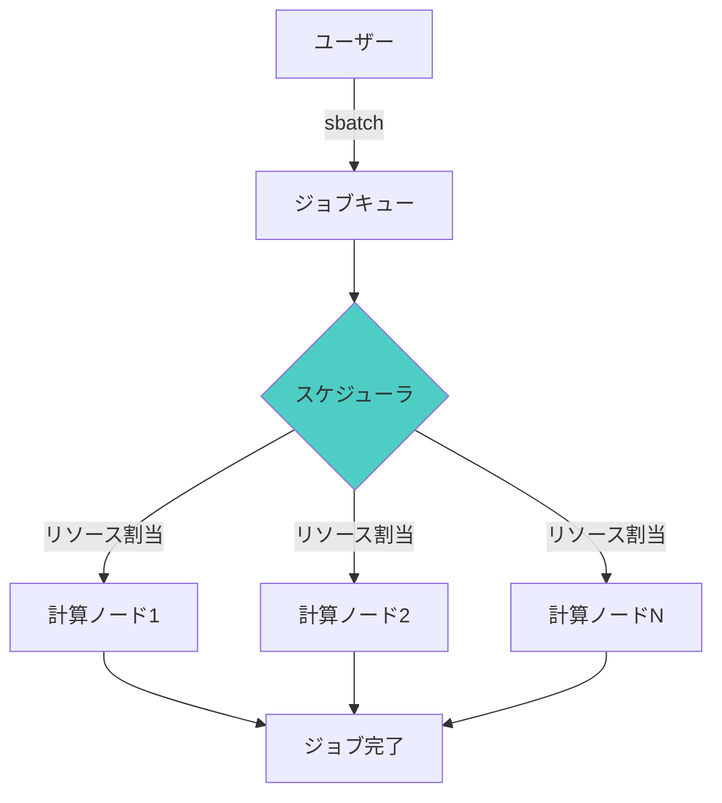

# 第3章：ジョブスケジューリングと並列化（SLURM, PBS）

## 学習目標

この章を読むことで、以下を習得できます：

- ✅ SLURMスクリプトを作成してジョブを投入できる
- ✅ MPI並列計算の効率を評価できる
- ✅ Pythonでジョブ管理スクリプトを書ける
- ✅ 1000材料規模の並列計算を設計できる
- ✅ ベンチマークによるチューニングができる

---

## 3.1 ジョブスケジューラの基礎

### SLURM vs PBS vs Torque

| 特徴 | SLURM | PBS Pro | Torque |
|-----|-------|---------|--------|
| 開発元 | SchedMD | Altair | Adaptive Computing |
| ライセンス | GPL（一部商用） | 商用 | オープンソース |
| 採用例 | TSUBAME、TOP500の多く | NASA、DOE国立研究所 | 多くの大学 |
| コマンド | `sbatch`, `squeue` | `qsub`, `qstat` | `qsub`, `qstat` |
| 推奨用途 | 大規模HPC | エンタープライズ | 中小規模HPC |

### SLURMの基本概念



**主要コマンド**:

```bash
# ジョブ投入
sbatch job.sh

# ジョブ状態確認
squeue -u username

# ジョブキャンセル
scancel job_id

# ノード情報
sinfo

# ジョブ詳細
scontrol show job job_id
```

---

## 3.2 SLURMスクリプト作成

### 基本的なSLURMスクリプト

```bash
#!/bin/bash
#SBATCH --job-name=vasp_relax       # ジョブ名
#SBATCH --output=slurm-%j.out       # 標準出力（%j=ジョブID）
#SBATCH --error=slurm-%j.err        # 標準エラー
#SBATCH --nodes=1                   # ノード数
#SBATCH --ntasks-per-node=48        # ノードあたりMPIプロセス数
#SBATCH --cpus-per-task=1           # タスクあたりスレッド数
#SBATCH --time=24:00:00             # 時間制限（24時間）
#SBATCH --partition=standard        # パーティション（キュー）
#SBATCH --account=project_name      # プロジェクト名

# 環境設定
module purge
module load intel/2021.2
module load vasp/6.3.0

# 作業ディレクトリ
cd $SLURM_SUBMIT_DIR

# VASP実行
echo "ジョブ開始: $(date)"
echo "ホスト: $(hostname)"
echo "ノード数: $SLURM_JOB_NUM_NODES"
echo "プロセス数: $SLURM_NTASKS"

mpirun -np $SLURM_NTASKS vasp_std

echo "ジョブ終了: $(date)"
```

### アレイジョブによる並列実行

**100材料を並列計算**:

```bash
#!/bin/bash
#SBATCH --job-name=vasp_array
#SBATCH --output=logs/slurm-%A_%a.out  # %A=アレイジョブID, %a=タスクID
#SBATCH --error=logs/slurm-%A_%a.err
#SBATCH --nodes=1
#SBATCH --ntasks-per-node=48
#SBATCH --time=24:00:00
#SBATCH --array=1-100%10              # 1-100のタスク、同時10個まで

# 環境設定
module load vasp/6.3.0

# 材料リスト読み込み
MATERIAL_LIST="materials.txt"
MATERIAL=$(sed -n "${SLURM_ARRAY_TASK_ID}p" $MATERIAL_LIST)

echo "処理中: タスクID=${SLURM_ARRAY_TASK_ID}, 材料=${MATERIAL}"

# 作業ディレクトリ
WORK_DIR="calculations/${MATERIAL}"
cd $WORK_DIR

# VASP実行
mpirun -np 48 vasp_std

# 収束チェック
if grep -q "reached required accuracy" OUTCAR; then
    echo "SUCCESS: ${MATERIAL}" >> ../completed.log
else
    echo "FAILED: ${MATERIAL}" >> ../failed.log
fi
```

**materials.txt**の例:
```
LiCoO2
LiNiO2
LiMnO2
LiFePO4
...（100行）
```

### 依存関係のあるジョブチェーン

```bash
# Step 1: 構造最適化
JOB1=$(sbatch --parsable relax.sh)
echo "構造最適化ジョブID: $JOB1"

# Step 2: 静的計算（構造最適化後に実行）
JOB2=$(sbatch --parsable --dependency=afterok:$JOB1 static.sh)
echo "静的計算ジョブID: $JOB2"

# Step 3: バンド構造（静的計算後に実行）
JOB3=$(sbatch --parsable --dependency=afterok:$JOB2 band.sh)
echo "バンド構造ジョブID: $JOB3"

# Step 4: データ解析（全て完了後）
sbatch --dependency=afterok:$JOB3 analysis.sh
```

---

## 3.3 MPIによる並列計算

### 並列化の種類

```python
# 1. タスク並列（推奨：ハイスループット計算）
# 100材料を100ノードで同時計算
# スケーリング効率: 100%

# 2. データ並列（VASP: KPAR設定）
# k-pointを4グループに分割
INCAR: KPAR = 4
# スケーリング効率: 80-90%

# 3. MPI並列（プロセス間通信）
# 1計算を48コアで分散
mpirun -np 48 vasp_std
# スケーリング効率: 50-70%
```

### スケーリング効率の測定

```python
import subprocess
import time
import numpy as np
import matplotlib.pyplot as plt

def benchmark_scaling(structure, core_counts=[1, 2, 4, 8, 16, 32, 48]):
    """
    並列化効率をベンチマーク

    Parameters:
    -----------
    structure : str
        テスト構造
    core_counts : list
        テストするコア数

    Returns:
    --------
    efficiency : dict
        コア数ごとの効率
    """
    timings = {}

    for n_cores in core_counts:
        # VASP実行
        start = time.time()

        result = subprocess.run(
            [f"mpirun -np {n_cores} vasp_std"],
            shell=True,
            cwd=f"benchmark_{n_cores}cores"
        )

        elapsed = time.time() - start
        timings[n_cores] = elapsed

        print(f"{n_cores}コア: {elapsed:.1f}秒")

    # 効率計算
    base_time = timings[1]
    efficiency = {}

    for n_cores, t in timings.items():
        ideal_time = base_time / n_cores
        actual_speedup = base_time / t
        ideal_speedup = n_cores

        eff = (actual_speedup / ideal_speedup) * 100
        efficiency[n_cores] = eff

    return efficiency, timings

# 結果プロット
def plot_scaling(efficiency, timings):
    fig, (ax1, ax2) = plt.subplots(1, 2, figsize=(12, 5))

    cores = list(timings.keys())
    times = list(timings.values())
    effs = [efficiency[c] for c in cores]

    # スピードアップ
    ax1.plot(cores, [timings[1]/t for t in times], 'o-', label='実測')
    ax1.plot(cores, cores, '--', label='理想（線形）')
    ax1.set_xlabel('コア数')
    ax1.set_ylabel('スピードアップ')
    ax1.set_xscale('log', base=2)
    ax1.set_yscale('log', base=2)
    ax1.legend()
    ax1.grid(True)

    # 効率
    ax2.plot(cores, effs, 'o-', color='green')
    ax2.axhline(y=80, color='red', linestyle='--', label='80%目標')
    ax2.set_xlabel('コア数')
    ax2.set_ylabel('並列化効率 (%)')
    ax2.set_xscale('log', base=2)
    ax2.legend()
    ax2.grid(True)

    plt.tight_layout()
    plt.savefig('scaling_benchmark.png', dpi=300)
    plt.show()
```

### VASPの並列化パラメータ最適化

```python
def optimize_vasp_parallelization(n_kpoints, n_bands, n_cores=48):
    """
    VASP並列化パラメータの最適化

    Parameters:
    -----------
    n_kpoints : int
        k-point数
    n_bands : int
        バンド数
    n_cores : int
        利用可能なコア数

    Returns:
    --------
    params : dict
        最適パラメータ
    """
    # KPAR: k-point並列（最も効率的）
    # 2の累乗で、k-point数の約数
    kpar_options = [1, 2, 4, 8, 16]
    valid_kpar = [k for k in kpar_options if n_kpoints % k == 0 and k <= n_cores]

    # NCORE: バンド並列
    # 通常4-8が最適
    ncore = min(4, n_cores // max(valid_kpar))

    # 推奨設定
    recommended = {
        'KPAR': max(valid_kpar),
        'NCORE': ncore,
        'cores_per_kpar_group': n_cores // max(valid_kpar),
    }

    print("並列化パラメータ推奨値:")
    print(f"  KPAR = {recommended['KPAR']} (k-point並列)")
    print(f"  NCORE = {recommended['NCORE']} (バンド並列)")
    print(f"  1 KPARグループあたり{recommended['cores_per_kpar_group']}コア")

    return recommended

# 使用例
params = optimize_vasp_parallelization(n_kpoints=64, n_bands=200, n_cores=48)
# 推奨:
#   KPAR = 16 (k-point並列)
#   NCORE = 3 (バンド並列)
#   1 KPARグループあたり3コア
```

---

## 3.4 Pythonによるジョブ管理

### ジョブ投入と監視

```python
import subprocess
import time
import re

class SLURMJobManager:
    """SLURMジョブ管理クラス"""

    def submit_job(self, script_path):
        """
        ジョブを投入

        Returns:
        --------
        job_id : int
            ジョブID
        """
        result = subprocess.run(
            ['sbatch', script_path],
            capture_output=True,
            text=True
        )

        # "Submitted batch job 12345"からIDを抽出
        match = re.search(r'(\d+)', result.stdout)
        if match:
            job_id = int(match.group(1))
            print(f"ジョブ投入: ID={job_id}")
            return job_id
        else:
            raise RuntimeError(f"ジョブ投入失敗: {result.stderr}")

    def get_job_status(self, job_id):
        """
        ジョブ状態を取得

        Returns:
        --------
        status : str
            'PENDING', 'RUNNING', 'COMPLETED', 'FAILED', 'CANCELLED'
        """
        result = subprocess.run(
            ['squeue', '-j', str(job_id), '-h', '-o', '%T'],
            capture_output=True,
            text=True
        )

        if result.stdout.strip():
            return result.stdout.strip()
        else:
            # キューにない → 完了または失敗
            result = subprocess.run(
                ['sacct', '-j', str(job_id), '-X', '-n', '-o', 'State'],
                capture_output=True,
                text=True
            )
            return result.stdout.strip()

    def wait_for_completion(self, job_id, check_interval=60):
        """
        ジョブ完了を待機

        Parameters:
        -----------
        job_id : int
            ジョブID
        check_interval : int
            チェック間隔（秒）
        """
        while True:
            status = self.get_job_status(job_id)

            if status in ['COMPLETED', 'FAILED', 'CANCELLED']:
                print(f"ジョブ{job_id}: {status}")
                return status

            print(f"ジョブ{job_id}: {status}...待機中")
            time.sleep(check_interval)

    def submit_array_job(self, script_path, n_tasks, max_concurrent=10):
        """
        アレイジョブを投入

        Parameters:
        -----------
        n_tasks : int
            タスク数
        max_concurrent : int
            同時実行数
        """
        result = subprocess.run(
            ['sbatch', f'--array=1-{n_tasks}%{max_concurrent}', script_path],
            capture_output=True,
            text=True
        )

        match = re.search(r'(\d+)', result.stdout)
        if match:
            job_id = int(match.group(1))
            print(f"アレイジョブ投入: ID={job_id}, タスク数={n_tasks}")
            return job_id
        else:
            raise RuntimeError(f"投入失敗: {result.stderr}")

# 使用例
manager = SLURMJobManager()

# 単一ジョブ
job_id = manager.submit_job('relax.sh')
status = manager.wait_for_completion(job_id)

# アレイジョブ
array_id = manager.submit_array_job('array_job.sh', n_tasks=100, max_concurrent=20)
```

### 大規模ジョブ管理（1000材料）

```python
import os
from pathlib import Path
import json

def manage_large_scale_calculation(materials, batch_size=100):
    """
    1000材料を効率的に管理

    Parameters:
    -----------
    materials : list
        材料のリスト
    batch_size : int
        バッチサイズ
    """
    manager = SLURMJobManager()
    n_materials = len(materials)

    print(f"総材料数: {n_materials}")
    print(f"バッチサイズ: {batch_size}")

    # バッチに分割
    n_batches = (n_materials + batch_size - 1) // batch_size
    print(f"バッチ数: {n_batches}")

    job_ids = []

    for batch_idx in range(n_batches):
        start_idx = batch_idx * batch_size
        end_idx = min((batch_idx + 1) * batch_size, n_materials)
        batch_materials = materials[start_idx:end_idx]

        print(f"\nバッチ {batch_idx+1}/{n_batches}")
        print(f"  材料数: {len(batch_materials)}")

        # バッチ用材料リスト作成
        list_file = f"batch_{batch_idx+1}_materials.txt"
        with open(list_file, 'w') as f:
            for mat in batch_materials:
                f.write(f"{mat}\n")

        # アレイジョブ投入
        job_id = manager.submit_array_job(
            'vasp_array.sh',
            n_tasks=len(batch_materials),
            max_concurrent=20
        )

        job_ids.append(job_id)

    # 進捗監視
    print("\n進捗監視中...")
    completed = 0

    while completed < len(job_ids):
        time.sleep(300)  # 5分ごとにチェック

        for i, job_id in enumerate(job_ids):
            status = manager.get_job_status(job_id)

            if status == 'COMPLETED' and i not in completed_jobs:
                completed += 1
                print(f"バッチ {i+1} 完了 ({completed}/{len(job_ids)})")

    print("全バッチ完了！")

# 使用例
materials = [f"material_{i:04d}" for i in range(1, 1001)]
manage_large_scale_calculation(materials, batch_size=100)
```

---

## 3.5 演習問題

### 問題1（難易度: easy）

**問題**: 以下の条件でSLURMスクリプトを作成してください：

- ジョブ名: `si_bandgap`
- ノード数: 2
- ノードあたりプロセス数: 24
- 時間制限: 12時間
- パーティション: `gpu`

<details>
<summary>解答例</summary>

```bash
#!/bin/bash
#SBATCH --job-name=si_bandgap
#SBATCH --output=slurm-%j.out
#SBATCH --error=slurm-%j.err
#SBATCH --nodes=2
#SBATCH --ntasks-per-node=24
#SBATCH --time=12:00:00
#SBATCH --partition=gpu

module load vasp/6.3.0

cd $SLURM_SUBMIT_DIR

mpirun -np 48 vasp_std
```

</details>

### 問題2（難易度: medium）

**問題**: 50個の構造最適化計算を、10個ずつ同時実行するアレイジョブを作成してください。

<details>
<summary>解答例</summary>

```bash
#!/bin/bash
#SBATCH --job-name=relax_array
#SBATCH --output=logs/slurm-%A_%a.out
#SBATCH --error=logs/slurm-%A_%a.err
#SBATCH --nodes=1
#SBATCH --ntasks-per-node=48
#SBATCH --time=24:00:00
#SBATCH --array=1-50%10

module load vasp/6.3.0

MATERIAL=$(sed -n "${SLURM_ARRAY_TASK_ID}p" materials.txt)

cd calculations/${MATERIAL}

mpirun -np 48 vasp_std
```

</details>

### 問題3（難易度: hard）

**問題**: Pythonで、1000材料のVASP計算を管理するスクリプトを作成してください。要件：

1. 50材料ずつバッチ処理
2. 各バッチは20タスク同時実行
3. 完了・失敗をログ記録
4. 失敗したタスクを自動リトライ

<details>
<summary>解答例</summary>

```python
import os
import time
import json
from pathlib import Path

class HighThroughputManager:
    def __init__(self, materials, batch_size=50, max_concurrent=20):
        self.materials = materials
        self.batch_size = batch_size
        self.max_concurrent = max_concurrent
        self.manager = SLURMJobManager()

        self.results = {
            'completed': [],
            'failed': [],
            'retry': []
        }

    def run_batch(self, batch_materials, batch_id):
        """バッチ実行"""
        # 材料リスト作成
        list_file = f"batch_{batch_id}.txt"
        with open(list_file, 'w') as f:
            for mat in batch_materials:
                f.write(f"{mat}\n")

        # ジョブ投入
        job_id = self.manager.submit_array_job(
            'vasp_array.sh',
            n_tasks=len(batch_materials),
            max_concurrent=self.max_concurrent
        )

        # 完了待ち
        status = self.manager.wait_for_completion(job_id)

        # 結果チェック
        self.check_results(batch_materials, batch_id)

    def check_results(self, batch_materials, batch_id):
        """結果確認"""
        for mat in batch_materials:
            outcar = f"calculations/{mat}/OUTCAR"

            if not os.path.exists(outcar):
                self.results['failed'].append(mat)
                continue

            with open(outcar, 'r') as f:
                content = f.read()
                if 'reached required accuracy' in content:
                    self.results['completed'].append(mat)
                else:
                    self.results['failed'].append(mat)

        # ログ保存
        with open(f'batch_{batch_id}_results.json', 'w') as f:
            json.dump(self.results, f, indent=2)

    def retry_failed(self, max_retries=2):
        """失敗タスクをリトライ"""
        for retry_count in range(max_retries):
            if not self.results['failed']:
                break

            print(f"\nリトライ {retry_count+1}/{max_retries}")
            print(f"  失敗タスク数: {len(self.results['failed'])}")

            failed_materials = self.results['failed'].copy()
            self.results['failed'] = []

            self.run_batch(failed_materials, f'retry_{retry_count+1}')

    def execute_all(self):
        """全材料を実行"""
        n_batches = (len(self.materials) + self.batch_size - 1) // self.batch_size

        for batch_idx in range(n_batches):
            start = batch_idx * self.batch_size
            end = min((batch_idx + 1) * self.batch_size, len(self.materials))
            batch_materials = self.materials[start:end]

            print(f"\nバッチ {batch_idx+1}/{n_batches}")
            self.run_batch(batch_materials, batch_idx+1)

        # リトライ
        self.retry_failed(max_retries=2)

        # 最終レポート
        print("\n最終結果:")
        print(f"  成功: {len(self.results['completed'])}")
        print(f"  失敗: {len(self.results['failed'])}")

        return self.results

# 実行
materials = [f"material_{i:04d}" for i in range(1, 1001)]
manager = HighThroughputManager(materials, batch_size=50, max_concurrent=20)
results = manager.execute_all()
```

</details>

---

## 3.6 まとめ

**キーポイント**:

1. **SLURM**: 大規模HPCで広く使用されるジョブスケジューラ
2. **アレイジョブ**: 多数の材料を効率的に並列実行
3. **MPI並列**: スケーリング効率を測定・最適化
4. **Python管理**: 大規模計算の自動化と監視

**次のステップ**:

第4章では、**FireWorksとAiiDAによるワークフロー管理**を学びます。

**[第4章: データ管理とポストプロセス →](./chapter-4.md)**

---

**ライセンス**: CC BY 4.0
**作成日**: 2025-10-17
**作成者**: Dr. Yusuke Hashimoto, Tohoku University
