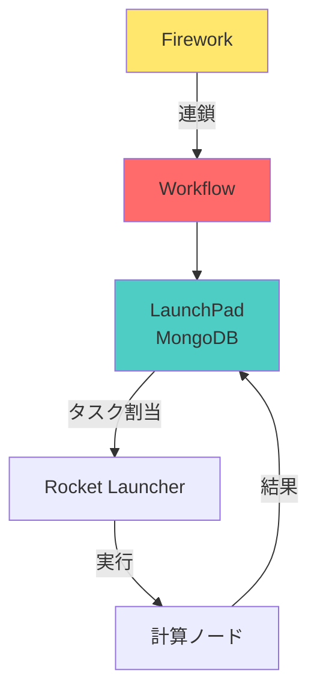

# 第4章：データ管理とポストプロセス（FireWorks, AiiDA）

## 学習目標

この章を読むことで、以下を習得できます：

- ✅ FireWorksで複雑なワークフローを構築できる
- ✅ Atomateの標準ワークフローを使いこなせる
- ✅ AiiDAでデータプロビナンスを記録できる
- ✅ 計算結果を構造化データベースに保存できる
- ✅ 結果をNOMADに公開できる

---

## 4.1 FireWorksによるワークフロー管理

### FireWorksのアーキテクチャ



**主要コンポーネント**:
- **Firework**: 単一タスク（1つのDFT計算）
- **Workflow**: 複数Fireworkの連鎖
- **LaunchPad**: データベース（MongoDB）
- **Rocket**: タスク実行エンジン

### インストールと設定

```bash
# FireWorksインストール
pip install fireworks

# MongoDBインストール（macOS）
brew install mongodb-community

# MongoDB起動
brew services start mongodb-community

# FireWorks設定
lpad init
# → my_launchpad.yamlが生成される
```

**my_launchpad.yaml**:
```yaml
host: localhost
port: 27017
name: fireworks
username: null
password: null
```

### 基本的なFirework作成

```python
from fireworks import Firework, LaunchPad, ScriptTask
from fireworks.core.rocket_launcher import rapidfire

# LaunchPad（データベース）に接続
launchpad = LaunchPad(host='localhost', port=27017, name='fireworks')

# Task定義（VASP実行）
vasp_task = ScriptTask.from_str(
    'mpirun -np 48 vasp_std',
    use_shell=True
)

# Firework作成
fw = Firework(
    vasp_task,
    name='VASP relaxation',
    spec={'_category': 'VASP'}
)

# LaunchPadに追加
launchpad.add_wf(fw)

# 実行
rapidfire(launchpad)
```

### Atomateの標準ワークフロー

**Atomate**は、Materials Projectで使用されている標準ワークフローライブラリです。

```python
from atomate.vasp.workflows.base.core import get_wf
from pymatgen.core import Structure

# 構造読み込み
structure = Structure.from_file("LiCoO2.cif")

# 標準ワークフロー取得
# optimize_structure_and_properties:
#   1. 構造最適化
#   2. 静的計算
#   3. バンド構造
#   4. DOS計算
wf = get_wf(
    structure,
    "optimize_structure_and_properties.yaml"
)

# LaunchPadに追加
launchpad.add_wf(wf)

# 実行
rapidfire(launchpad, nlaunches='infinite')
```

### カスタムワークフロー作成

```python
from fireworks import Firework, Workflow
from fireworks.core.firework import FiretaskBase
from atomate.vasp.firetasks.write_inputs import WriteVaspFromIOSet
from atomate.vasp.firetasks.run_calc import RunVaspCustodian
from atomate.vasp.firetasks.parse_outputs import VaspToDb
from pymatgen.io.vasp.sets import MPRelaxSet, MPStaticSet

class CustomWorkflow:
    """カスタムワークフロー生成"""

    @staticmethod
    def bandgap_workflow(structure):
        """
        バンドギャップ計算ワークフロー
        1. 構造最適化 → 2. 静的計算 → 3. バンドギャップ抽出
        """
        # Firework 1: 構造最適化
        fw1 = Firework(
            [
                WriteVaspFromIOSet(structure=structure, vasp_input_set=MPRelaxSet),
                RunVaspCustodian(vasp_cmd="vasp_std"),
                VaspToDb(db_file="db.json", task_label="relax")
            ],
            name="Structural relaxation",
            spec={"_category": "relax"}
        )

        # Firework 2: 静的計算
        fw2 = Firework(
            [
                WriteVaspFromIOSet(structure=structure, vasp_input_set=MPStaticSet),
                RunVaspCustodian(vasp_cmd="vasp_std"),
                VaspToDb(db_file="db.json", task_label="static")
            ],
            name="Static calculation",
            spec={"_category": "static"}
        )

        # Firework 3: バンドギャップ抽出
        fw3 = Firework(
            [ExtractBandgapTask()],
            name="Extract bandgap"
        )

        # ワークフロー構築（fw1 → fw2 → fw3）
        wf = Workflow(
            [fw1, fw2, fw3],
            links_dict={fw1: [fw2], fw2: [fw3]},
            name=f"Bandgap workflow: {structure.composition.reduced_formula}"
        )

        return wf


class ExtractBandgapTask(FiretaskBase):
    """バンドギャップ抽出タスク"""

    def run_task(self, fw_spec):
        from pymatgen.io.vasp.outputs import Vasprun

        vasprun = Vasprun("vasprun.xml")
        bandgap = vasprun.get_band_structure().get_band_gap()

        print(f"バンドギャップ: {bandgap['energy']:.3f} eV")

        # 結果をデータベースに保存
        return {"bandgap": bandgap['energy']}

# 使用例
structure = Structure.from_file("LiCoO2.cif")
wf = CustomWorkflow.bandgap_workflow(structure)

launchpad.add_wf(wf)
rapidfire(launchpad)
```

### エラーハンドリングとリスタート

```python
from custodian.custodian import Custodian
from custodian.vasp.handlers import VaspErrorHandler, UnconvergedErrorHandler
from custodian.vasp.jobs import VaspJob

# エラーハンドラー設定
handlers = [
    VaspErrorHandler(),           # 一般的なVASPエラー
    UnconvergedErrorHandler(),    # 収束性エラー
]

# VASPジョブ定義
jobs = [
    VaspJob(
        vasp_cmd=["mpirun", "-np", "48", "vasp_std"],
        output_file="vasp.out",
        auto_npar=False
    )
]

# Custodian実行（自動エラー処理）
c = Custodian(
    handlers=handlers,
    jobs=jobs,
    max_errors=5
)

c.run()
```

---

## 4.2 AiiDAによるプロビナンス管理

### データプロビナンス（来歴追跡）の重要性

**プロビナンス**とは、計算結果がどのように得られたかの完全な記録です。

**追跡すべき情報**:
- 入力データ（構造、パラメータ）
- 使用ソフトウェア（VASP 6.3.0等）
- 計算環境（ノード、コア数、日時）
- 中間結果
- 最終結果

### AiiDAインストール

```bash
# AiiDAインストール
pip install aiida-core aiida-vasp

# データベース初期化
verdi quicksetup

# 動作確認
verdi status
```

### AiiDAでの計算実行

```python
from aiida import orm, engine
from aiida.plugins import CalculationFactory, DataFactory

# VASP計算クラス取得
VaspCalculation = CalculationFactory('vasp.vasp')

# データ型
StructureData = DataFactory('structure')
KpointsData = DataFactory('array.kpoints')

# 構造データ作成
structure = StructureData()
# （構造を設定）

# k-points設定
kpoints = KpointsData()
kpoints.set_kpoints_mesh([8, 8, 8])

# 計算パラメータ
parameters = orm.Dict(dict={
    'ENCUT': 520,
    'EDIFF': 1e-5,
    'ISMEAR': 0,
    'SIGMA': 0.05,
})

# 計算ビルダー
builder = VaspCalculation.get_builder()
builder.structure = structure
builder.kpoints = kpoints
builder.parameters = parameters
builder.code = orm.Code.get_from_string('vasp@localhost')

# 実行
calc_node = engine.submit(builder)
print(f"計算ノード: {calc_node.pk}")
```

### データクエリ

```python
from aiida.orm import QueryBuilder

# すべてのVASP計算を検索
qb = QueryBuilder()
qb.append(VaspCalculation, filters={'attributes.exit_status': 0})

for calc in qb.all():
    print(f"PK: {calc[0].pk}, Formula: {calc[0].inputs.structure.get_formula()}")

# バンドギャップが1.5-2.5 eVの材料を検索
qb = QueryBuilder()
qb.append(VaspCalculation, tag='calc')
qb.append(orm.Dict, with_incoming='calc', filters={
    'attributes.band_gap': {'and': [{'>=': 1.5}, {'<=': 2.5}]}
})

results = qb.all()
print(f"該当する材料: {len(results)}個")
```

---

## 4.3 計算データの構造化

### JSONスキーマ設計

```python
import json
from datetime import datetime

class MaterialsDataSchema:
    """材料計算データのスキーマ"""

    @staticmethod
    def create_entry(material_id, formula, structure, calculation_results):
        """
        データベースエントリを作成

        Returns:
        --------
        entry : dict
            構造化データ
        """
        entry = {
            # 識別情報
            "material_id": material_id,
            "formula": formula,
            "created_at": datetime.now().isoformat(),

            # 構造情報
            "structure": {
                "lattice": structure.lattice.matrix.tolist(),
                "species": [str(site.specie) for site in structure],
                "coords": [site.frac_coords.tolist() for site in structure],
                "space_group": structure.get_space_group_info()[1]
            },

            # 計算結果
            "properties": {
                "energy": calculation_results.get("energy"),
                "band_gap": calculation_results.get("band_gap"),
                "formation_energy": calculation_results.get("formation_energy"),
            },

            # 計算メタデータ
            "calculation_metadata": {
                "software": "VASP 6.3.0",
                "functional": "PBE",
                "encut": 520,
                "kpoints": calculation_results.get("kpoints"),
                "converged": calculation_results.get("converged"),
                "calculation_time": calculation_results.get("calculation_time"),
            },

            # プロビナンス
            "provenance": {
                "input_structure_source": "Materials Project",
                "workflow": "Atomate optimize_structure",
                "hostname": calculation_results.get("hostname"),
                "date": calculation_results.get("date"),
            }
        }

        return entry

# 使用例
entry = MaterialsDataSchema.create_entry(
    material_id="custom-0001",
    formula="LiCoO2",
    structure=structure,
    calculation_results={
        "energy": -45.67,
        "band_gap": 2.3,
        "converged": True,
        "kpoints": [12, 12, 8],
        "calculation_time": "2.5 hours",
        "hostname": "hpc.university.edu",
        "date": "2025-10-17",
    }
)

# JSON保存
with open("data/custom-0001.json", 'w') as f:
    json.dump(entry, f, indent=2)
```

### MongoDBによるデータ管理

```python
from pymongo import MongoClient
import json

class MaterialsDatabase:
    """MongoDBによる材料データベース"""

    def __init__(self, host='localhost', port=27017, db_name='materials'):
        self.client = MongoClient(host, port)
        self.db = self.client[db_name]
        self.collection = self.db['calculations']

        # インデックス作成（検索高速化）
        self.collection.create_index("material_id", unique=True)
        self.collection.create_index("formula")
        self.collection.create_index("properties.band_gap")

    def insert(self, entry):
        """データを挿入"""
        result = self.collection.insert_one(entry)
        return result.inserted_id

    def find_by_formula(self, formula):
        """化学式で検索"""
        return list(self.collection.find({"formula": formula}))

    def find_by_bandgap_range(self, min_gap, max_gap):
        """バンドギャップ範囲で検索"""
        query = {
            "properties.band_gap": {
                "$gte": min_gap,
                "$lte": max_gap
            }
        }
        return list(self.collection.find(query))

    def get_statistics(self):
        """統計情報"""
        pipeline = [
            {
                "$group": {
                    "_id": None,
                    "total": {"$sum": 1},
                    "avg_bandgap": {"$avg": "$properties.band_gap"},
                    "avg_energy": {"$avg": "$properties.energy"}
                }
            }
        ]

        result = list(self.collection.aggregate(pipeline))
        return result[0] if result else {}

# 使用例
db = MaterialsDatabase()

# データ挿入
db.insert(entry)

# 検索
licoo2_results = db.find_by_formula("LiCoO2")
print(f"LiCoO2の計算: {len(licoo2_results)}件")

# バンドギャップ検索
semiconductors = db.find_by_bandgap_range(0.5, 3.0)
print(f"半導体（0.5-3.0 eV）: {len(semiconductors)}件")

# 統計
stats = db.get_statistics()
print(f"平均バンドギャップ: {stats['avg_bandgap']:.2f} eV")
```

---

## 4.4 ポストプロセスの自動化

### DOS/バンド構造の自動プロット

```python
from pymatgen.io.vasp.outputs import Vasprun
from pymatgen.electronic_structure.plotter import BSPlotter, DosPlotter
import matplotlib.pyplot as plt

def auto_plot_band_dos(directory):
    """
    バンド構造とDOSを自動プロット

    Parameters:
    -----------
    directory : str
        vasprun.xmlがあるディレクトリ
    """
    vasprun = Vasprun(f"{directory}/vasprun.xml")

    # バンド構造
    bs = vasprun.get_band_structure()
    bs_plotter = BSPlotter(bs)

    fig = bs_plotter.get_plot(ylim=[-5, 5])
    fig.savefig(f"{directory}/band_structure.png", dpi=300)
    print(f"バンド構造を保存: {directory}/band_structure.png")

    # DOS
    dos = vasprun.complete_dos
    dos_plotter = DosPlotter()
    dos_plotter.add_dos("Total", dos)

    fig = dos_plotter.get_plot(xlim=[-5, 5])
    fig.savefig(f"{directory}/dos.png", dpi=300)
    print(f"DOSを保存: {directory}/dos.png")

    # バンドギャップ
    bandgap = bs.get_band_gap()
    print(f"バンドギャップ: {bandgap['energy']:.3f} eV ({bandgap['transition']})")

# 使用例
auto_plot_band_dos("calculations/LiCoO2")
```

### レポート自動生成

```python
from jinja2 import Template
from datetime import datetime

def generate_report(material_data, output_file="report.html"):
    """
    計算結果レポートを自動生成

    Parameters:
    -----------
    material_data : dict
        材料データ
    output_file : str
        出力HTMLファイル
    """
    template_str = """
<!DOCTYPE html>
<html>
<head>
    <title>計算レポート: {{ material_data.formula }}</title>
    <style>
        body { font-family: Arial, sans-serif; margin: 40px; }
        table { border-collapse: collapse; width: 100%; }
        th, td { border: 1px solid #ddd; padding: 8px; text-align: left; }
        th { background-color: #4CAF50; color: white; }
        img { max-width: 600px; }
    </style>
</head>
<body>
    <h1>{{ material_data.formula }}</h1>
    <p>生成日時: {{ generation_time }}</p>

    <h2>構造情報</h2>
    <table>
        <tr><th>項目</th><th>値</th></tr>
        <tr><td>空間群</td><td>{{ material_data.structure.space_group }}</td></tr>
        <tr><td>格子定数 a</td><td>{{ "%.3f"|format(material_data.structure.lattice[0][0]) }} Å</td></tr>
    </table>

    <h2>計算結果</h2>
    <table>
        <tr><th>特性</th><th>値</th></tr>
        <tr><td>エネルギー</td><td>{{ "%.3f"|format(material_data.properties.energy) }} eV/atom</td></tr>
        <tr><td>バンドギャップ</td><td>{{ "%.3f"|format(material_data.properties.band_gap) }} eV</td></tr>
    </table>

    <h2>バンド構造</h2>
    

    <h2>状態密度</h2>
    
</body>
</html>
    """

    template = Template(template_str)

    html = template.render(
        material_data=material_data,
        generation_time=datetime.now().strftime("%Y-%m-%d %H:%M:%S")
    )

    with open(output_file, 'w') as f:
        f.write(html)

    print(f"レポート生成: {output_file}")

# 使用例
generate_report(entry, output_file="LiCoO2_report.html")
```

---

## 4.5 データ共有とアーカイブ

### NOMAD Repositoryへのアップロード

```python
import requests
import json

def upload_to_nomad(data_files, metadata):
    """
    NOMAD Repositoryにデータをアップロード

    Parameters:
    -----------
    data_files : list
        アップロードするファイルリスト
    metadata : dict
        メタデータ
    """
    nomad_url = "https://nomad-lab.eu/prod/rae/api/v1/uploads"

    # メタデータ準備
    upload_metadata = {
        "upload_name": metadata.get("name", "Untitled"),
        "references": metadata.get("references", []),
        "coauthors": metadata.get("coauthors", []),
    }

    # ファイルアップロード
    files = []
    for file_path in data_files:
        files.append(('file', open(file_path, 'rb')))

    response = requests.post(
        nomad_url,
        files=files,
        data={'metadata': json.dumps(upload_metadata)},
        headers={'Authorization': f'Bearer {NOMAD_API_TOKEN}'}
    )

    if response.status_code == 200:
        upload_id = response.json()['upload_id']
        print(f"アップロード成功: {upload_id}")
        print(f"URL: https://nomad-lab.eu/prod/rae/gui/uploads/{upload_id}")
        return upload_id
    else:
        print(f"アップロード失敗: {response.status_code}")
        return None

# 使用例
files = [
    "calculations/LiCoO2/vasprun.xml",
    "calculations/LiCoO2/OUTCAR",
    "calculations/LiCoO2/CONTCAR",
]

metadata = {
    "name": "LiCoO2 battery material calculations",
    "references": ["https://doi.org/10.xxxx/xxxxx"],
    "coauthors": ["Dr. Yusuke Hashimoto"]
}

upload_to_nomad(files, metadata)
```

---

## 4.6 演習問題

### 問題1（難易度: medium）

**問題**: FireWorksで、構造最適化→静的計算の2ステップワークフローを作成してください。

<details>
<summary>解答例</summary>

```python
from fireworks import Firework, Workflow
from atomate.vasp.firetasks.write_inputs import WriteVaspFromIOSet
from atomate.vasp.firetasks.run_calc import RunVaspCustodian
from pymatgen.io.vasp.sets import MPRelaxSet, MPStaticSet
from pymatgen.core import Structure

structure = Structure.from_file("POSCAR")

# Firework 1: 構造最適化
fw1 = Firework(
    [
        WriteVaspFromIOSet(structure=structure, vasp_input_set=MPRelaxSet),
        RunVaspCustodian(vasp_cmd="vasp_std")
    ],
    name="Relax"
)

# Firework 2: 静的計算
fw2 = Firework(
    [
        WriteVaspFromIOSet(structure=structure, vasp_input_set=MPStaticSet),
        RunVaspCustodian(vasp_cmd="vasp_std")
    ],
    name="Static"
)

# ワークフロー
wf = Workflow([fw1, fw2], links_dict={fw1: [fw2]})

launchpad.add_wf(wf)
```

</details>

### 問題2（難易度: hard）

**問題**: MongoDBに保存された1000材料のデータから、以下を抽出してください：
1. バンドギャップが1.0-2.0 eVの半導体
2. 形成エネルギーが負（安定）
3. 結果をCSVに保存

<details>
<summary>解答例</summary>

```python
import pandas as pd

db = MaterialsDatabase()

# クエリ
query = {
    "properties.band_gap": {"$gte": 1.0, "$lte": 2.0},
    "properties.formation_energy": {"$lt": 0}
}

results = list(db.collection.find(query))

# DataFrame化
data = []
for r in results:
    data.append({
        "formula": r["formula"],
        "band_gap": r["properties"]["band_gap"],
        "formation_energy": r["properties"]["formation_energy"],
        "space_group": r["structure"]["space_group"]
    })

df = pd.DataFrame(data)

# CSV保存
df.to_csv("stable_semiconductors.csv", index=False)
print(f"該当材料: {len(df)}個")
print(df.head())
```

</details>

---

## 4.7 まとめ

**キーポイント**:

1. **FireWorks**: Materials Project標準のワークフロー管理
2. **Atomate**: 標準化された計算ワークフロー
3. **AiiDA**: データプロビナンス追跡
4. **MongoDB**: 大規模データ管理
5. **NOMAD**: データ公開とFAIR原則

**次のステップ**: 第5章でクラウドHPC活用を学びます。

**[第5章: クラウドHPC活用と最適化 →](./chapter-5.md)**

---

**ライセンス**: CC BY 4.0
**作成日**: 2025-10-17
**作成者**: Dr. Yusuke Hashimoto, Tohoku University
