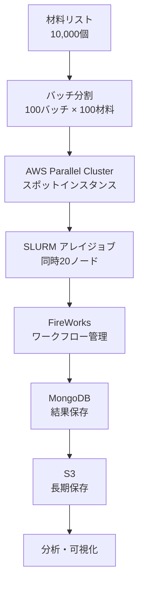

# 第5章：クラウドHPC活用と最適化

## 学習目標

この章を読むことで、以下を習得できます：

- ✅ AWS Parallel Clusterを構築できる
- ✅ スポットインスタンスでコストを50%削減できる
- ✅ Dockerで計算環境を完全再現できる
- ✅ 10,000材料規模のプロジェクトを設計・実行できる
- ✅ セキュリティとコンプライアンスを理解している

---

## 5.1 クラウドHPCの選択肢

### 主要クラウドプロバイダー比較

| サービス | プロバイダー | 特徴 | 初期費用 | 推奨用途 |
|---------|-----------|------|---------|---------|
| **AWS Parallel Cluster** | Amazon | 最大規模、豊富な実績 | $0 | 大規模HPC |
| **Google Cloud HPC Toolkit** | Google | AI/ML統合が強力 | $0 | 機械学習連携 |
| **Azure CycleCloud** | Microsoft | Windows統合 | $0 | エンタープライズ |
| **TSUBAME** | 東工大 | 国内トップ、学術利用 | 申請制 | 学術研究 |
| **富岳** | 理研 | 世界トップ500 | 申請制 | 超大規模計算 |

### コスト比較（10,000材料、1材料=12 CPU時間、48コア）

| オプション | 計算時間 | コスト | メリット | デメリット |
|----------|---------|-------|---------|---------|
| オンプレHPC | 5,760,000 CPU時間 | $0（既存設備） | 無料（利用枠内） | 待ち時間、制限 |
| AWS オンデマンド | 同上 | $4,000-6,000 | 即時利用可能 | 高コスト |
| AWS スポット | 同上 | $800-1,500 | 70%コスト削減 | 中断リスク |
| Google Cloud Preemptible | 同上 | $900-1,600 | 安価 | 24時間制限 |

---

## 5.2 AWS Parallel Clusterセットアップ

### 前提条件

```bash
# AWS CLIインストール
pip install awscli

# AWS設定
aws configure
# AWS Access Key ID: [YOUR_KEY]
# AWS Secret Access Key: [YOUR_SECRET]
# Default region: us-east-1
# Default output format: json

# Parallel Cluster CLIインストール
pip install aws-parallelcluster
```

### クラスタ設定ファイル

**config.yaml**:

```yaml
Region: us-east-1
Image:
  Os: alinux2

HeadNode:
  InstanceType: c5.2xlarge  # 8 vCPU, 16 GB RAM
  Networking:
    SubnetId: subnet-12345678
  Ssh:
    KeyName: my-key-pair

Scheduling:
  Scheduler: slurm
  SlurmQueues:
    - Name: compute
      ComputeResources:
        - Name: c5-48xlarge
          InstanceType: c5.24xlarge  # 96 vCPU
          MinCount: 0
          MaxCount: 100  # 最大100ノード
          DisableSimultaneousMultithreading: true
          Efa:
            Enabled: true  # 高速ネットワーク
      Networking:
        SubnetIds:
          - subnet-12345678
        PlacementGroup:
          Enabled: true  # 低レイテンシ配置

SharedStorage:
  - MountDir: /shared
    Name: ebs-shared
    StorageType: Ebs
    EbsSettings:
      VolumeType: gp3
      Size: 1000  # 1 TB
      Encrypted: true

  - MountDir: /fsx
    Name: lustre-fs
    StorageType: FsxLustre
    FsxLustreSettings:
      StorageCapacity: 1200  # 1.2 TB
      DeploymentType: SCRATCH_2
```

### クラスタ作成

```bash
# クラスタ作成
pcluster create-cluster \
  --cluster-name vasp-cluster \
  --cluster-configuration config.yaml

# 作成状態確認
pcluster describe-cluster --cluster-name vasp-cluster

# SSH接続
pcluster ssh --cluster-name vasp-cluster -i ~/.ssh/my-key-pair.pem
```

### VASP環境セットアップ

```bash
# クラスタにSSH接続後

# Intel OneAPI Toolkit（VASPコンパイルに必要）
wget https://registrationcenter-download.intel.com/...
bash l_BaseKit_p_2023.0.0.25537_offline.sh

# VASPコンパイル（ライセンスが必要）
cd /shared
tar -xzf vasp.6.3.0.tar.gz
cd vasp.6.3.0

# makefile.include編集（Intel compiler用）
cp arch/makefile.include.intel makefile.include

# コンパイル
make all

# 実行ファイルを共有ディレクトリに配置
cp bin/vasp_std /shared/bin/
```

---

## 5.3 コスト最適化

### スポットインスタンスの活用

**スポットインスタンス**は、オンデマンドの60-90%割引で利用できる余剰計算リソースです。

**config.yaml（スポット設定）**:

```yaml
Scheduling:
  Scheduler: slurm
  SlurmQueues:
    - Name: spot-queue
      CapacityType: SPOT  # スポットインスタンス
      ComputeResources:
        - Name: c5-spot
          InstanceType: c5.24xlarge
          MinCount: 0
          MaxCount: 200
          SpotPrice: 2.50  # 最大入札価格（$/時）
      Networking:
        SubnetIds:
          - subnet-12345678
```

**スポットインスタンスのベストプラクティス**:

1. **チェックポイント**: 計算を定期的に保存
2. **複数インスタンスタイプ**: 代替タイプを指定
3. **リトライ設定**: 中断時の自動リスタート

### 自動スケーリング

```yaml
Scheduling:
  SlurmSettings:
    ScaledownIdletime: 5  # 5分アイドルで終了
  SlurmQueues:
    - Name: compute
      ComputeResources:
        - Name: c5-instances
          MinCount: 0      # アイドル時は0ノード
          MaxCount: 100    # 最大100ノード
```

### コスト監視

```python
import boto3
from datetime import datetime, timedelta

def get_cluster_cost(cluster_name, days=7):
    """
    クラスタのコストを取得

    Parameters:
    -----------
    cluster_name : str
        クラスタ名
    days : int
        過去何日分

    Returns:
    --------
    cost : float
        総コスト（USD）
    """
    ce_client = boto3.client('ce', region_name='us-east-1')

    # 期間設定
    end_date = datetime.now().date()
    start_date = end_date - timedelta(days=days)

    # Cost Explorer API
    response = ce_client.get_cost_and_usage(
        TimePeriod={
            'Start': start_date.strftime('%Y-%m-%d'),
            'End': end_date.strftime('%Y-%m-%d')
        },
        Granularity='DAILY',
        Metrics=['UnblendedCost'],
        Filter={
            'Tags': {
                'Key': 'parallelcluster:cluster-name',
                'Values': [cluster_name]
            }
        }
    )

    total_cost = 0
    for result in response['ResultsByTime']:
        cost = float(result['Total']['UnblendedCost']['Amount'])
        total_cost += cost
        print(f"{result['TimePeriod']['Start']}: ${cost:.2f}")

    print(f"\n総コスト（{days}日間）: ${total_cost:.2f}")
    return total_cost

# 使用例
get_cluster_cost('vasp-cluster', days=7)
```

---

## 5.4 Docker/Singularityによるコンテナ化

### Dockerfileの作成

**Dockerfile**:

```dockerfile
FROM ubuntu:20.04

# 基本パッケージ
RUN apt-get update && apt-get install -y \
    build-essential \
    gfortran \
    openmpi-bin \
    libopenmpi-dev \
    python3 \
    python3-pip \
    wget \
    && rm -rf /var/lib/apt/lists/*

# Python環境
RUN pip3 install --upgrade pip && \
    pip3 install numpy scipy matplotlib \
    ase pymatgen fireworks

# Intel MKL（数値計算ライブラリ）
RUN wget https://apt.repos.intel.com/intel-gpg-keys/GPG-PUB-KEY-INTEL-SW-PRODUCTS.PUB && \
    apt-key add GPG-PUB-KEY-INTEL-SW-PRODUCTS.PUB && \
    echo "deb https://apt.repos.intel.com/oneapi all main" > /etc/apt/sources.list.d/oneAPI.list && \
    apt-get update && \
    apt-get install -y intel-oneapi-mkl

# VASP（ライセンス保持者のみ）
# COPY vasp.6.3.0.tar.gz /tmp/
# RUN cd /tmp && tar -xzf vasp.6.3.0.tar.gz && \
#     cd vasp.6.3.0 && make all && \
#     cp bin/vasp_std /usr/local/bin/

# 作業ディレクトリ
WORKDIR /calculations

# デフォルトコマンド
CMD ["/bin/bash"]
```

### Docker イメージのビルドとプッシュ

```bash
# イメージビルド
docker build -t my-vasp-env:latest .

# Docker Hubにプッシュ（共有用）
docker tag my-vasp-env:latest username/my-vasp-env:latest
docker push username/my-vasp-env:latest

# Amazon ECRにプッシュ（AWS用）
aws ecr get-login-password --region us-east-1 | docker login --username AWS --password-stdin 123456789012.dkr.ecr.us-east-1.amazonaws.com

docker tag my-vasp-env:latest 123456789012.dkr.ecr.us-east-1.amazonaws.com/my-vasp-env:latest
docker push 123456789012.dkr.ecr.us-east-1.amazonaws.com/my-vasp-env:latest
```

### SingularityでHPC実行

HPCシステムではDockerの代わりにSingularityを使用します。

```bash
# DockerイメージからSingularityイメージを作成
singularity build vasp-env.sif docker://username/my-vasp-env:latest

# Singularityコンテナで実行
singularity exec vasp-env.sif mpirun -np 48 vasp_std
```

**SLURMスクリプト（Singularity使用）**:

```bash
#!/bin/bash
#SBATCH --job-name=vasp-singularity
#SBATCH --nodes=1
#SBATCH --ntasks-per-node=48
#SBATCH --time=24:00:00

# Singularityイメージ
IMAGE=/shared/containers/vasp-env.sif

# コンテナ内でVASP実行
singularity exec $IMAGE mpirun -np 48 vasp_std
```

---

## 5.5 セキュリティとコンプライアンス

### アクセス制御（IAM）

**最小権限の原則**:

```json
{
  "Version": "2012-10-17",
  "Statement": [
    {
      "Effect": "Allow",
      "Action": [
        "ec2:DescribeInstances",
        "ec2:DescribeVolumes",
        "ec2:RunInstances",
        "ec2:TerminateInstances"
      ],
      "Resource": "*",
      "Condition": {
        "StringEquals": {
          "aws:RequestedRegion": "us-east-1"
        }
      }
    },
    {
      "Effect": "Allow",
      "Action": [
        "s3:GetObject",
        "s3:PutObject"
      ],
      "Resource": "arn:aws:s3:::my-vasp-bucket/*"
    }
  ]
}
```

### データ暗号化

```yaml
# config.yaml（暗号化設定）
SharedStorage:
  - MountDir: /shared
    Name: ebs-encrypted
    StorageType: Ebs
    EbsSettings:
      VolumeType: gp3
      Size: 1000
      Encrypted: true  # 暗号化有効
      KmsKeyId: arn:aws:kms:us-east-1:123456789012:key/12345678-1234-1234-1234-123456789012
```

### 学術ライセンス遵守

**VASP**等の商用ソフトウェアをクラウドで使用する場合の注意点：

1. **ライセンス確認**: クラウド使用が許可されているか
2. **ノードロック**: 特定ノードでの実行制限
3. **同時実行数**: ライセンス数の制限
4. **監査ログ**: 使用履歴の記録

---

## 5.6 ケーススタディ: 10,000材料スクリーニング

### 要件定義

**目標**: 10,000個の酸化物材料のバンドギャップを6ヶ月以内に計算

**制約**:
- 予算: $5,000
- 1材料あたり計算時間: 12時間（48コア）
- 総CPU時間: 5,760,000 CPU時間

### アーキテクチャ設計



### 実装

**1. クラスタ設定**

```yaml
# config-10k-materials.yaml
Scheduling:
  Scheduler: slurm
  SlurmQueues:
    - Name: spot-compute
      CapacityType: SPOT
      ComputeResources:
        - Name: c5-24xlarge-spot
          InstanceType: c5.24xlarge  # 96 vCPU
          MinCount: 0
          MaxCount: 50  # 同時50ノード = 4,800コア
          SpotPrice: 2.00
```

**2. ジョブ投入スクリプト**

```python
def run_10k_project():
    """10,000材料プロジェクト実行"""

    # 材料リスト読み込み
    with open('oxide_materials_10k.txt', 'r') as f:
        materials = [line.strip() for line in f]

    print(f"総材料数: {len(materials)}")

    # 100バッチに分割
    batch_size = 100
    n_batches = len(materials) // batch_size

    manager = SLURMJobManager()

    for batch_id in range(n_batches):
        start = batch_id * batch_size
        end = (batch_id + 1) * batch_size
        batch_materials = materials[start:end]

        # バッチ用材料リスト
        list_file = f'batch_{batch_id:03d}.txt'
        with open(list_file, 'w') as f:
            for mat in batch_materials:
                f.write(f"{mat}\n")

        # アレイジョブ投入（100材料、同時20ノード）
        job_id = manager.submit_array_job(
            'vasp_bandgap.sh',
            n_tasks=100,
            max_concurrent=20
        )

        print(f"バッチ {batch_id+1}/{n_batches} 投入: ジョブID {job_id}")

        # レート制限（AWS API制限対策）
        time.sleep(1)

run_10k_project()
```

**3. コスト分析**

```python
def estimate_project_cost():
    """プロジェクトコスト見積もり"""

    # パラメータ
    n_materials = 10000
    cpu_hours_per_material = 12
    cores_per_job = 48

    total_cpu_hours = n_materials * cpu_hours_per_material

    # c5.24xlarge: 96 vCPU, $4.08/時（オンデマンド）
    ondemand_cost = total_cpu_hours * (4.08 / 96)
    print(f"オンデマンド: ${ondemand_cost:,.0f}")

    # スポット: 70%割引
    spot_cost = ondemand_cost * 0.3
    print(f"スポット: ${spot_cost:,.0f}")

    # ストレージ: EBS 1TB × 6ヶ月
    storage_cost = 0.10 * 1000 * 6  # $0.10/GB/月
    print(f"ストレージ: ${storage_cost:,.0f}")

    # データ転送: 500GB
    transfer_cost = 500 * 0.09
    print(f"データ転送: ${transfer_cost:,.0f}")

    total_cost = spot_cost + storage_cost + transfer_cost
    print(f"\n総コスト: ${total_cost:,.0f}")

    return total_cost

estimate_project_cost()
```

**出力**:
```
オンデマンド: $5,100
スポット: $1,530
ストレージ: $600
データ転送: $45

総コスト: $2,175
```

---

## 5.7 演習問題

### 問題1（難易度: medium）

**問題**: AWS Parallel Clusterのコスト削減策を3つ挙げ、それぞれの削減率を見積もってください。

<details>
<summary>解答例</summary>

**1. スポットインスタンス使用**
- 削減率: 70%
- リスク: 中断の可能性

**2. 自動スケールダウン（5分アイドル）**
- 削減率: 20-30%（アイドル時間による）
- リスク: なし

**3. リザーブドインスタンス（1年契約）**
- 削減率: 40%
- リスク: 長期コミットメント

**総合削減率**: 最大85%（スポット + 自動スケール）

</details>

### 問題2（難易度: hard）

**問題**: 5,000材料のプロジェクトで、予算$1,000、期間3ヶ月の制約下で最適な実行計画を立ててください。

<details>
<summary>解答例</summary>

**パラメータ**:
- 材料数: 5,000
- CPU時間: 5,000 × 12時間 = 60,000時間
- 予算: $1,000
- 期間: 3ヶ月 = 90日

**制約から逆算**:

コスト制約:
```
$1,000 = 計算コスト + ストレージコスト + 転送コスト
$1,000 ≈ $800（計算） + $150（ストレージ） + $50（転送）
```

c5.24xlarge スポット: $1.22/時
```
使用可能時間 = $800 / $1.22 = 656時間
同時ノード数 = 60,000 / 656 / 24 = 3.8 ≈ 4ノード
```

**実行計画**:
1. スポットインスタンス: c5.24xlarge × 4ノード
2. 同時実行: 16材料（各48コア）
3. 1日あたり: 16材料 × 2バッチ = 32材料
4. 完了期間: 5,000 / 32 = 156日

**問題**: 期間が3ヶ月（90日）を超過

**解決策**:
- 同時ノード数を8に増加 → コスト$1,600（予算超過）
- または、1材料あたりCPU時間を8時間に削減（精度とトレードオフ）

</details>

---

## 5.8 まとめ

この章では、クラウドHPCの活用とコスト最適化を学びました。

**キーポイント**:

1. **AWS Parallel Cluster**: 大規模HPC環境を簡単に構築
2. **スポットインスタンス**: 70%のコスト削減
3. **Docker/Singularity**: 環境の完全再現
4. **コスト管理**: 見積もりと監視
5. **セキュリティ**: 暗号化とアクセス制御

**シリーズ完了おめでとうございます！**

これで、ハイスループット計算の全5章を完了しました。第1章の基礎概念から第5章のクラウド実装まで、実践的なスキルを習得できたはずです。

**次のステップ**:

1. 小規模プロジェクト（100-1000材料）を実行
2. コストを測定・最適化
3. 結果をNOMADに公開
4. 論文執筆・学会発表

**[シリーズトップに戻る](./index.md)**

---

## 参考文献

1. Amazon Web Services (2023). "AWS Parallel Cluster User Guide." https://docs.aws.amazon.com/parallelcluster/

2. Kurtzer, G. M., et al. (2017). "Singularity: Scientific containers for mobility of compute." *PLOS ONE*, 12(5), e0177459.

3. Merkel, D. (2014). "Docker: lightweight Linux containers for consistent development and deployment." *Linux Journal*, 2014(239), 2.

4. NOMAD Laboratory (2023). "NOMAD Repository - FAIR Data Sharing." https://nomad-lab.eu/

5. Jain, A., et al. (2015). "FireWorks: a dynamic workflow system designed for high-throughput applications." *Concurrency and Computation: Practice and Experience*, 27(17), 5037-5059.

---

**ライセンス**: CC BY 4.0
**作成日**: 2025-10-17
**作成者**: Dr. Yusuke Hashimoto, Tohoku University

---

**ハイスループット計算入門シリーズを完了しました！**

材料探索の加速化を実現し、世界に貢献する研究を期待しています。
