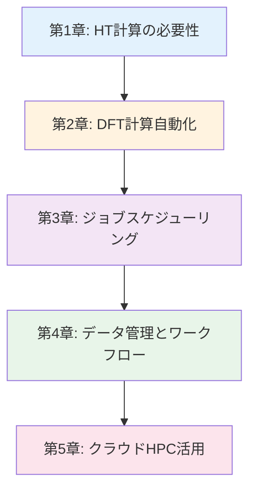

# ハイスループット計算入門シリーズ

**自動化と並列化で材料探索を1000倍加速する完全ガイド**

## シリーズ概要

このシリーズは、ハイスループット計算材料科学（High-Throughput Computational Materials Science）を学びたい研究者・エンジニア向けの全5章構成の教育コンテンツです。DFT計算の自動化、ワークフロー管理、並列計算、クラウドHPC活用まで、実践的なスキルを段階的に習得できます。

**特徴:**
- ✅ **実践重視**: ASE、pymatgen、FireWorks、AiiDAの実装例
- ✅ **包括的内容**: 自動化設計から大規模並列計算まで網羅
- ✅ **産業応用**: Materials Project、AFLOW等の成功事例
- ✅ **再現性**: Docker、環境構築スクリプトで完全再現可能

**総学習時間**: 110-140分（コード実行と演習を含む）

---

## 学習の進め方

### 推奨学習順序



**DFT計算経験者（推奨）:**
- 第1章 → 第2章 → 第3章 → 第4章 → 第5章
- 所要時間: 110-140分

**自動化のみ学びたい方:**
- 第2章 → 第4章
- 所要時間: 50-60分

**クラウド活用のみ学びたい方:**
- 第1章 → 第5章
- 所要時間: 35-45分

---

## 各章の詳細

### [第1章：ハイスループット計算の必要性とワークフロー設計](./chapter-1.md)

**難易度**: 中級
**読了時間**: 20-30分

#### 学習内容

1. **材料探索の課題**
   - 探索空間の広大さ: 10^60通りの組み合わせ
   - 従来手法の限界: 1材料/週 → 1000材料/週の必要性
   - Materials Genome Initiative (MGI)の目標

2. **ハイスループット計算の定義**
   - 自動化 (Automation)
   - 並列化 (Parallelization)
   - 標準化 (Standardization)
   - データ管理 (Data Management)

3. **成功事例**
   - Materials Project: 140,000材料のDFT計算
   - AFLOW: 3,500,000結晶構造の自動解析
   - OQMD: 815,000材料の熱力学データ
   - JARVIS: 40,000材料の多様な特性計算

4. **ワークフロー設計の原則**
   - モジュール化 (Modularity)
   - エラー処理 (Error Handling)
   - 再現性 (Reproducibility)
   - スケーラビリティ (Scalability)

5. **コストと効果**
   - 開発期間: 15-20年 → 3-5年（67%短縮）
   - 実験コスト: 95%削減
   - 計算コスト: 初期投資 vs 長期ROI

#### 学習目標

- ✅ ハイスループット計算の4つの要素を説明できる
- ✅ Materials Projectの成功要因を分析できる
- ✅ ワークフロー設計の原則を理解している
- ✅ コスト削減効果を定量的に評価できる

**[第1章を読む →](./chapter-1.md)**

---

### [第2章：DFT計算の自動化（VASP, Quantum ESPRESSO）](./chapter-2.md)

**難易度**: 中級〜上級
**読了時間**: 20-25分
**コード例**: 6個

#### 学習内容

1. **ASE（Atomic Simulation Environment）基礎**
   - インストールと環境構築
   - 構造生成と操作
   - 計算機インターフェース
   - 結果解析の自動化

2. **VASP自動化**
   - INCARファイル自動生成
   - K-point自動設定
   - POTCAR管理
   - 収束判定の自動化

3. **Quantum ESPRESSO自動化**
   - 入力ファイルテンプレート
   - 擬ポテンシャル管理
   - SCF/NSCF/DOS計算の連鎖
   - バンド構造自動プロット

4. **pymatgenによる高度な自動化**
   - InputSet: 標準化された入力生成
   - Taskflow: 計算フロー定義
   - エラー検出とリスタート
   - 結果のデータベース化

5. **構造最適化の自動化**
   - 緩和計算の収束判定
   - 格子定数最適化
   - 内部座標最適化
   - エネルギーカットオフの自動決定

6. **トラブルシューティング**
   - よくあるエラーと対処法
   - 収束しない計算の診断
   - メモリ不足への対応

#### 学習目標

- ✅ ASEで基本的なDFT計算を自動実行できる
- ✅ VASPとQuantum ESPRESSOの入力ファイルを自動生成できる
- ✅ pymatgenのInputSetを使いこなせる
- ✅ エラーを検出して自動リスタートできる

**[第2章を読む →](./chapter-2.md)**

---

### [第3章：ジョブスケジューリングと並列化（SLURM, PBS）](./chapter-3.md)

**難易度**: 上級
**読了時間**: 25-30分
**コード例**: 5-6個

#### 学習内容

1. **ジョブスケジューラの基礎**
   - SLURM vs PBS vs Torque
   - キューシステムの仕組み
   - リソース要求の最適化
   - 優先度と公平性

2. **SLURMスクリプト作成**
   - ヘッダー: `#SBATCH`ディレクティブ
   - ノード数、コア数、メモリ要求
   - 時間制限の設定
   - アレイジョブによる並列実行

3. **MPIによる並列計算**
   - MPI並列の原理
   - VASP/QEのMPI実行
   - ノード間通信の最適化
   - スケーリング効率の評価

4. **Pythonによるジョブ管理**
   - subprocessでジョブ投入
   - ジョブ状態の監視
   - 完了待ちと自動再投入
   - 依存関係のあるジョブチェーン

5. **大規模並列計算**
   - 1000材料の同時計算
   - リソース競合の回避
   - フェイルセーフ設計
   - 計算コストの最適化

6. **ベンチマークとチューニング**
   - 並列効率の測定
   - ボトルネック分析
   - I/O最適化
   - メモリ帯域幅の考慮

#### 学習目標

- ✅ SLURMスクリプトを作成して投入できる
- ✅ MPI並列計算の効率を評価できる
- ✅ Pythonでジョブ管理スクリプトを書ける
- ✅ 1000材料規模の並列計算を設計できる

**[第3章を読む →](./chapter-3.md)**

---

### [第4章：データ管理とポストプロセス（FireWorks, AiiDA）](./chapter-4.md)

**難易度**: 上級
**読了時間**: 20-25分
**コード例**: 6個

#### 学習内容

1. **FireWorksによるワークフロー管理**
   - FireWorksアーキテクチャ
   - Firework（単一タスク）定義
   - Workflow（タスク連鎖）構築
   - LaunchPad（データベース）設定

2. **Materials Project採用のAtomateワークフロー**
   - 標準ワークフロー: 構造最適化 → 静的計算 → バンド構造
   - カスタムワークフローの作成
   - エラーハンドリングとリスタート
   - 結果のJSON出力

3. **AiiDAによるプロビナンス管理**
   - データプロビナンス（来歴追跡）の重要性
   - AiiDAのデータモデル
   - WorkChain定義
   - クエリとデータ検索

4. **計算データの構造化**
   - JSONスキーマ設計
   - MongoDB/SQLiteの選択
   - インデックス最適化
   - バージョン管理

5. **ポストプロセスの自動化**
   - DOS/バンド構造の自動プロット
   - フォノン分散の解析
   - 熱力学量の計算
   - レポート自動生成

6. **データ共有とアーカイブ**
   - NOMAD Repositoryへのアップロード
   - Materials Cloudでの公開
   - DOI取得
   - FAIRデータ原則

#### 学習目標

- ✅ FireWorksで複雑なワークフローを構築できる
- ✅ Atomateの標準ワークフローを使いこなせる
- ✅ AiiDAでデータプロビナンスを記録できる
- ✅ 計算結果をNOMADに公開できる

**[第4章を読む →](./chapter-4.md)**

---

### [第5章：クラウドHPC活用と最適化](./chapter-5.md)

**難易度**: 中級〜上級
**読了時間**: 15-20分
**コード例**: 5個

#### 学習内容

1. **クラウドHPCの選択肢**
   - AWS Parallel Cluster
   - Google Cloud HPC Toolkit
   - Azure CycleCloud
   - 専用HPC: TSUBAME, 富岳

2. **AWS Parallel Clusterセットアップ**
   - VPC/サブネット設定
   - クラスタ構成ファイル
   - SLURM統合
   - ストレージ（EFS/FSx）

3. **コスト最適化**
   - スポットインスタンス活用
   - 自動スケーリング
   - アイドルタイムアウト
   - ストレージ階層化

4. **Docker/Singularityによるコンテナ化**
   - 環境の完全再現
   - Dockerfileベストプラクティス
   - Singularity on HPC
   - イメージレジストリ管理

5. **セキュリティとコンプライアンス**
   - アクセス制御（IAM）
   - データ暗号化
   - ログ監査
   - 学術ライセンス遵守

6. **ケーススタディ: 10,000材料スクリーニング**
   - 要件定義
   - アーキテクチャ設計
   - 実装と実行
   - コスト分析（総額$500-1000）

#### 学習目標

- ✅ AWS Parallel Clusterを構築できる
- ✅ スポットインスタンスでコストを50%削減できる
- ✅ Dockerで計算環境を完全再現できる
- ✅ 10,000材料規模のプロジェクトを設計・実行できる

**[第5章を読む →](./chapter-5.md)**

---

## 全体の学習成果

このシリーズを完了すると、以下のスキルと知識を習得できます：

### 知識レベル（Understanding）

- ✅ ハイスループット計算の原理と必要性を説明できる
- ✅ Materials Projectの技術スタックを理解している
- ✅ ワークフロー管理ツールの比較ができる
- ✅ クラウドHPCの選択肢と特徴を知っている

### 実践スキル（Doing）

- ✅ ASE/pymatgenでDFT計算を自動化できる
- ✅ SLURMスクリプトを書いて並列ジョブを投入できる
- ✅ FireWorks/AiiDAで複雑なワークフローを構築できる
- ✅ AWS Parallel Clusterで大規模計算を実行できる
- ✅ 計算結果をNOMADに公開できる

### 応用力（Applying）

- ✅ 1000材料規模のスクリーニングプロジェクトを設計できる
- ✅ 計算コストを最適化して予算内で実行できる
- ✅ 再現可能な研究ワークフローを構築できる
- ✅ 産業界でのHT計算導入を提案できる

---

## 推奨学習パターン

### パターン1: 完全習得（HT計算初学者向け）

**対象**: DFT計算経験はあるが自動化は初めての方
**期間**: 2週間
**進め方**:

```
Week 1:
- Day 1-2: 第1章（概念理解）
- Day 3-4: 第2章（ASE/pymatgen実装）
- Day 5-7: 第3章（SLURM実践）

Week 2:
- Day 1-3: 第4章（FireWorks/AiiDA）
- Day 4-5: 第5章（クラウドHPC）
- Day 6-7: 統合プロジェクト（100材料スクリーニング）
```

**成果物**:
- 100材料のバンドギャップ予測プロジェクト
- GitHub公開されたワークフローコード

### パターン2: 速習（経験者向け）

**対象**: 既にDFT自動化経験があり、ワークフロー管理を学びたい方
**期間**: 3-5日
**進め方**:

```
Day 1: 第1章（スキップ可）+ 第2章（復習）
Day 2-3: 第4章（FireWorks集中学習）
Day 4: 第5章（クラウド実践）
Day 5: プロジェクト統合
```

### パターン3: クラウド特化

**対象**: オンプレHPCからクラウド移行を検討している方
**期間**: 1週間
**進め方**:

```
Day 1-2: 第1章 + 第5章（クラウド選択肢理解）
Day 3-4: AWS Parallel Cluster構築
Day 5-6: 既存ワークフローの移植
Day 7: コスト最適化とベンチマーク
```

---

## 前提知識

### 必須

- ✅ **DFT計算の基礎知識**: VASP、Quantum ESPRESSO、CP2Kのいずれか使用経験
- ✅ **Linux/UNIXコマンド**: bash、ssh、ファイル操作
- ✅ **Python基礎**: 関数、クラス、モジュール

### 推奨

- ✅ **材料科学の基礎**: 結晶構造、バンド理論、状態密度
- ✅ **機械学習基礎**: MI入門シリーズ受講済み
- ✅ **Git/GitHub**: バージョン管理の基本

### あると良い

- ✅ **クラスタ計算経験**: ジョブスケジューラ使用歴
- ✅ **データベース基礎**: SQL、JSON、MongoDB
- ✅ **Docker基礎**: コンテナの概念

---

## ツールとソフトウェア

### 必須ツール

| ツール | 用途 | ライセンス | インストール |
|--------|------|-----------|-------------|
| Python 3.10+ | スクリプト実行 | オープン | conda, pip |
| ASE | 構造操作・計算実行 | LGPL | `pip install ase` |
| pymatgen | 材料科学計算 | MIT | `pip install pymatgen` |

### DFTコード（いずれか1つ）

| コード | ライセンス | 特徴 |
|--------|-----------|------|
| VASP | 商用（学術ライセンス） | 高精度、広く使用 |
| Quantum ESPRESSO | GPL | オープン、平面波基底 |
| CP2K | GPL | オープン、ハイブリッド基底 |

### ワークフローツール

| ツール | 採用プロジェクト | 学習難易度 |
|--------|----------------|-----------|
| FireWorks | Materials Project | 中 |
| AiiDA | MARVEL（欧州） | 高 |
| Atomate | Materials Project | 中 |

### クラウドHPC

| サービス | 推奨用途 | 初期費用 |
|---------|---------|---------|
| AWS Parallel Cluster | 大規模計算 | $0（従量課金） |
| Google Cloud HPC | 機械学習統合 | $0（従量課金） |
| Azure CycleCloud | Windows統合 | $0（従量課金） |

---

## FAQ（よくある質問）

### Q1: DFT計算経験がないと受講できませんか？

**A**: 第2章以降はVASPやQuantum ESPRESSOの基本的な使用経験を前提としています。未経験の場合は、まず「計算材料科学基礎入門」シリーズで基礎を学ぶことをお勧めします。

### Q2: 商用ライセンスのVASPが必要ですか？

**A**: コード例の多くはオープンソースのQuantum ESPRESSOでも実行できます。VASPは産業界で広く使われているため例に含めていますが、学術ライセンスをお持ちでない場合は他のコードで代替可能です。

### Q3: 手元にHPCクラスタがない場合は？

**A**: 第5章でクラウドHPC（AWS、Google Cloud）の使い方を学びます。初期投資なしで始められるため、個人でも学習可能です。初回は$100-200の予算で十分です。

### Q4: FireWorksとAiiDAはどちらを学ぶべきですか？

**A**: **Materials Projectと同じ環境を使いたい場合はFireWorks**がお勧めです。AiiDAは欧州中心で、データプロビナンス（来歴追跡）に強みがあります。第4章で両方学びますが、まずFireWorksから始めることを推奨します。

### Q5: どれくらいの計算リソースが必要ですか？

**A**: 学習段階では：
- **ローカルPC**: 第1-2章（小規模テスト計算）
- **大学のクラスタ**: 第3-4章（並列計算）
- **クラウド**: 第5章（$50-100の予算）

実プロジェクトでは1000材料で$500-1000程度です。

### Q6: Materials Projectのコードは公開されていますか？

**A**: はい、Materials Projectの中核技術は以下でオープンソース公開されています：
- **pymatgen**: https://github.com/materialsproject/pymatgen
- **FireWorks**: https://github.com/materialsproject/fireworks
- **Atomate**: https://github.com/hackingmaterials/atomate

このシリーズではこれらを実際に使います。

### Q7: 学んだスキルは産業界で役立ちますか？

**A**: 非常に役立ちます。以下の企業・研究所でハイスループット計算が使われています：
- **日本**: トヨタ、パナソニック、三菱ケミカル、NIMS
- **海外**: Tesla、IBM Research、BASF、DuPont

MIエンジニア職では年収700-1500万円（日本）、$80-200K（米国）が相場です。

### Q8: 計算結果を論文に使う場合の注意点は？

**A**: 以下を確認してください：
1. **再現性**: 計算条件（k-point、カットオフ等）を明記
2. **ライセンス**: 使用ソフトウェアを論文で引用
3. **データ公開**: NOMAD等でraw dataを公開（推奨）
4. **検証**: 少なくとも一部は実験データと比較

---

## 次のステップ

### シリーズ完了後の推奨アクション

**Immediate（1-2週間以内）:**
1. ✅ 100-1000材料の小規模プロジェクトを実行
2. ✅ 計算結果をNOMADに公開
3. ✅ GitHubにワークフローコードを公開

**Short-term（1-3ヶ月）:**
1. ✅ Materials Projectのコードベースにコントリビュート
2. ✅ 独自のFireWorksワークフローを開発
3. ✅ 論文投稿（計算データセット公開を含む）

**Medium-term（3-6ヶ月）:**
1. ✅ 10,000材料規模のプロジェクトを実行
2. ✅ クラウドHPCのコスト最適化ノウハウを蓄積
3. ✅ 国際学会（MRS、E-MRS）で発表

**Long-term（1年以上）:**
1. ✅ 研究室・企業でHT計算システムを構築
2. ✅ 独自のデータベースを公開
3. ✅ MI分野のエキスパートとして認知される

---

## 関連シリーズ

- **[MI入門シリーズ](../mi-introduction/)**: 機械学習による材料特性予測
- **[MLP入門シリーズ](../mlp-introduction/)**: 機械学習ポテンシャル
- **[材料データベース活用入門](../materials-databases-introduction/)**: Materials Project完全ガイド
- **[GNN入門シリーズ](../gnn-introduction/)**: グラフニューラルネットワーク

---

## フィードバックとサポート

### 作成者

このシリーズは、東北大学 Dr. Yusuke Hashimotoのもと、MI寺子屋プロジェクトの一環として作成されました。

**作成日**: 2025年10月17日
**バージョン**: 1.0

### フィードバック

- **誤字・技術的誤り**: GitHubリポジトリのIssueで報告
- **改善提案**: 新しいトピック、追加コード例等
- **質問**: 理解が難しかった部分、追加説明が欲しい箇所

**連絡先**: yusuke.hashimoto.b8@tohoku.ac.jp

---

## ライセンス

このシリーズは **CC BY 4.0**（Creative Commons Attribution 4.0 International）ライセンスのもとで公開されています。

**可能なこと:**
- ✅ 自由な閲覧・ダウンロード
- ✅ 教育目的での利用（授業、勉強会等）
- ✅ 改変・二次創作（翻訳、要約等）

**条件:**
- 📌 著者のクレジット表示が必要
- 📌 改変した場合はその旨を明記

---

## さあ、始めましょう！

準備はできましたか？ 第1章から始めて、ハイスループット計算の世界への旅を始めましょう！

**[第1章: ハイスループット計算の必要性とワークフロー設計 →](./chapter-1.md)**

---

**更新履歴**

- **2025-10-17**: v1.0 初版公開

---

**材料探索の加速化はここから始まります！**
