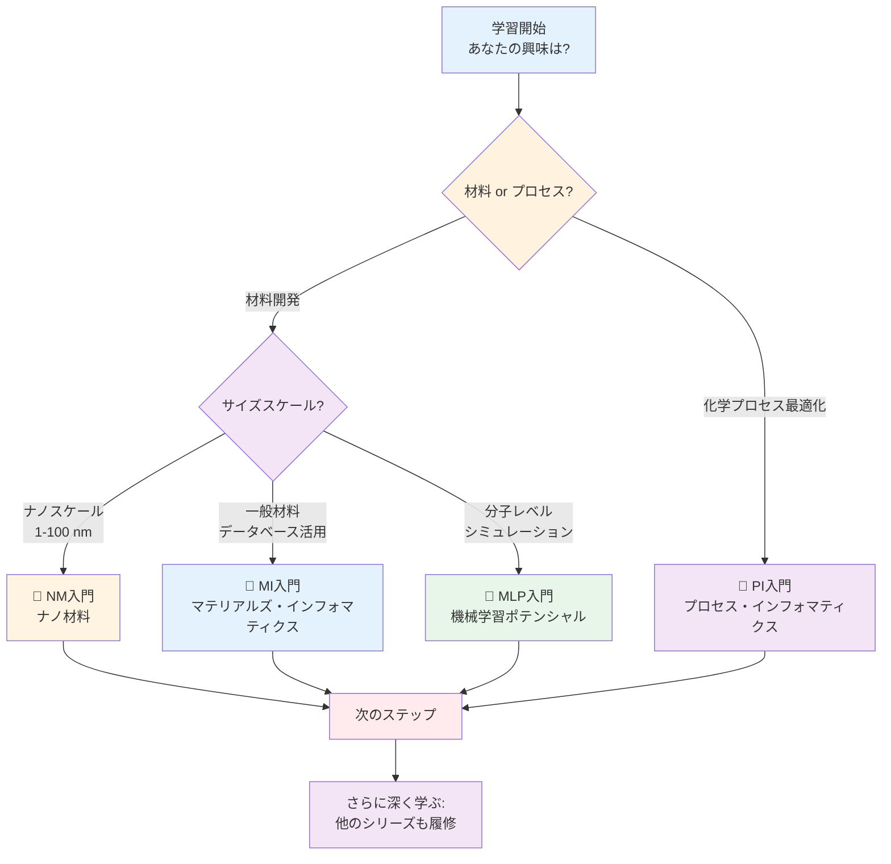
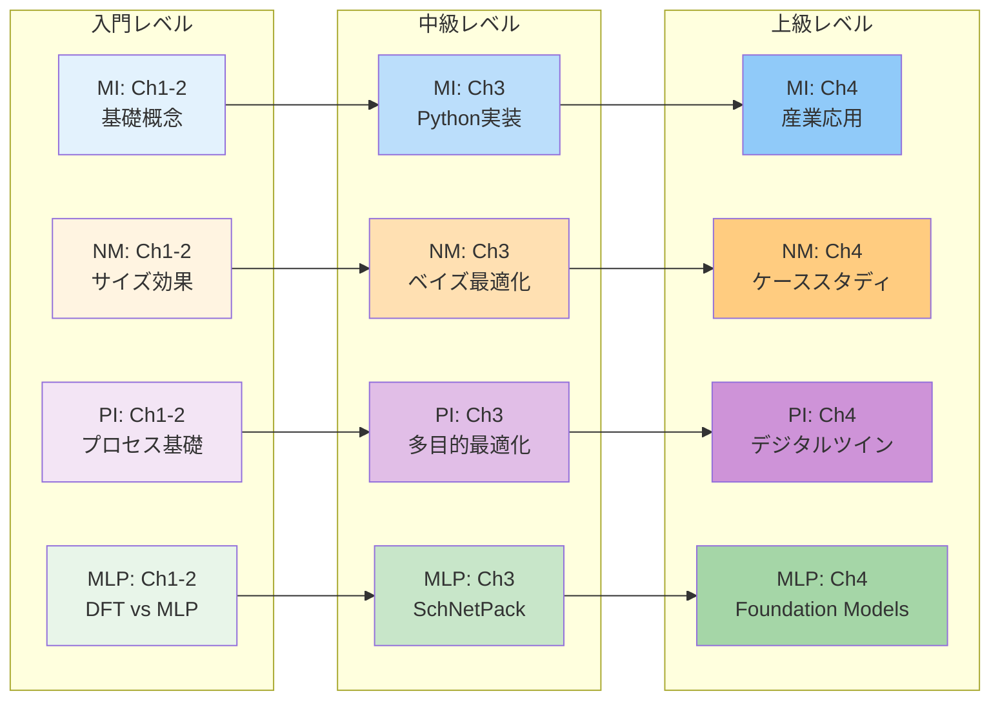

# AI寺子屋 - Materials Informatics Knowledge Hub

**データ駆動型材料開発の学習プラットフォーム**

---

## 🏫 AI寺子屋へようこそ

「寺子屋」は江戸時代の日本における庶民のための教育施設でした。現代の「AI寺子屋」は、材料科学とデータサイエンスの融合領域を学ぶための包括的な学習プラットフォームです。

**AI寺子屋の特徴:**
- ✅ **4つの専門シリーズ**: MI、NM、PI、MLPの各分野を網羅
- ✅ **段階的な学習**: 入門から上級まで体系的に学べる全16章
- ✅ **実践重視**: 115個の実行可能なコード例
- ✅ **産業応用**: 20以上の実世界ケーススタディ
- ✅ **キャリア支援**: 具体的な進路と学習ロードマップ

**総学習時間**: 355-460分（約6-8時間）

---

## 📚 4つの入門シリーズ

### 📘 マテリアルズ・インフォマティクス（MI）入門

**Materials Informatics Introduction Series**

材料科学全般へのAI/機械学習の適用を学ぶ基礎シリーズ

**概要**:
- 🎯 **対象分野**: 材料探索、特性予測、データベース活用
- 📊 **難易度**: 入門〜上級
- ⏱️ **学習時間**: 90-120分（全4章）
- 💻 **コード例**: 35個（全て実行可能）
- 🔬 **応用例**: Li-ion電池、触媒、高エントロピー合金、ペロブスカイト太陽電池

**主な学習内容**:
1. 材料開発の歴史と従来手法の限界
2. Materials Project等の主要データベース活用
3. 6つの機械学習モデル実装（Linear Regression、Random Forest、LightGBM、SVR、MLP、API統合）
4. Matminerによる特徴量エンジニアリング
5. ハイパーパラメータチューニング（Grid/Random Search）
6. 5つの産業ケーススタディ

**使用ツール**:
- Python: scikit-learn, matminer, pandas, numpy
- データベース: Materials Project API
- 可視化: matplotlib, seaborn

**[📘 MI入門シリーズへ →](./mi-introduction/index.html)**

---

### 📗 ナノ材料（NM）入門

**Nanomaterials Introduction Series**

Python実践で学ぶナノマテリアルサイエンス

**概要**:
- 🎯 **対象分野**: ナノ粒子、カーボンナノチューブ、グラフェン、量子ドット
- 📊 **難易度**: 初級〜中級
- ⏱️ **学習時間**: 90-120分（全4章）
- 💻 **コード例**: 30-35個（全て実行可能）
- 🔬 **応用例**: CNT複合材料、量子ドット発光、金ナノ粒子触媒、ナノ医薬

**主な学習内容**:
1. ナノスケールの定義とサイズ効果、量子閉じ込め効果
2. 合成法（ボトムアップ/トップダウン）とキャラクタリゼーション（TEM、SEM、XRD、UV-Vis）
3. 5つの回帰モデルによる物性予測
4. ベイズ最適化によるナノ材料設計
5. 分子動力学（MD）データ解析
6. SHAP解析による予測解釈

**使用ツール**:
- Python: scikit-learn, LightGBM, scikit-optimize, SHAP
- 解析: pandas, numpy, scipy
- 可視化: matplotlib, seaborn

**[📗 NM入門シリーズへ →](./nm-introduction/index.html)**

---

### 📙 プロセス・インフォマティクス（PI）入門

**Process Informatics Introduction Series**

データで拓く化学プロセス最適化の未来

**概要**:
- 🎯 **対象分野**: 化学プロセス最適化、デジタルツイン、品質制御
- 📊 **難易度**: 入門〜上級
- ⏱️ **学習時間**: 90-120分（全4章）
- 💻 **コード例**: 35個（全て実行可能）
- 🔬 **応用例**: 触媒プロセス、重合反応制御、蒸留塔最適化、バイオプロセス

**主な学習内容**:
1. 化学プロセス開発の歴史と従来手法の限界（スケールアップに1-3年）
2. プロセスデータの種類（温度、圧力、流量、収率、選択性）
3. 6つの機械学習モデル（Linear Regression、Random Forest、LightGBM、SVR、時系列解析、ベイズ最適化）
4. 多目的最適化（収率 vs コスト）
5. Grid Search/Bayesian Optimization
6. 5つの産業ケーススタディ（収率70%→85%等）

**使用ツール**:
- Python: scikit-learn, LightGBM, Prophet, ARIMA
- 最適化: scipy.optimize, scikit-optimize
- 可視化: matplotlib, seaborn

**[📙 PI入門シリーズへ →](./pi-introduction/index.html)**

---

### 📕 機械学習ポテンシャル（MLP）入門

**Machine Learning Potential Introduction Series**

量子精度と古典速度を両立する次世代シミュレーション

**概要**:
- 🎯 **対象分野**: 分子シミュレーション高速化、反応経路探索、触媒設計
- 📊 **難易度**: 入門〜上級
- ⏱️ **学習時間**: 85-100分（全4章）
- 💻 **コード例**: 15個（全て実行可能）
- 🔬 **応用例**: Cu触媒CO₂還元、Li-ion電池電解質、タンパク質フォールディング、GaN半導体

**主な学習内容**:
1. 分子シミュレーションの歴史（DFT vs 古典MD vs MLP）
2. ポテンシャルエネルギー面の機械学習近似
3. SchNetPackによるMLP訓練（MD17データセット、MAE < 1 kcal/mol）
4. MLP-MD実行（DFTの50,000倍高速化）
5. 振動スペクトル、拡散係数、動径分布関数（RDF）計算
6. Active Learningによる効率的データ収集

**使用ツール**:
- Python: PyTorch, SchNetPack, ASE
- データ: MD17データセット
- 可視化: matplotlib, TensorBoard

**[📕 MLP入門シリーズへ →](./mlp-introduction/index.html)**

---

## 🗺️ 学習パス推奨

### あなたに最適なシリーズは？



### 学習ロードマップ

#### 🎓 初学者向け（2-4週間プラン）

**Week 1-2: 基礎固め**
1. **MI入門**を完走（90-120分）
   - 材料科学×機械学習の基本を理解
   - Pythonコーディング環境構築
   - Materials Project APIの使い方習得

**Week 3: 応用分野選択**
2. 興味に応じて以下から1つ選択:
   - **NM入門**: ナノテクに興味がある → ナノ粒子・グラフェン
   - **PI入門**: 化学工学に興味がある → プロセス最適化
   - **MLP入門**: 計算化学に興味がある → 分子シミュレーション

**Week 4: 横展開**
3. 残りのシリーズから興味のあるものを1-2個選んで学習
4. 各シリーズのChapter 4（実世界応用）を重点的に学習

**成果物**:
- 4-6個のPythonプロジェクト（GitHubポートフォリオ）
- 個人キャリアロードマップ（3ヶ月/1年/3年）

---

#### 🚀 経験者向け（1-2週間プラン）

**前提知識**: Python、機械学習の基礎、材料科学または化学工学の基礎

**Day 1-2: 速習モード**
- 各シリーズのChapter 2（基礎知識）を斜め読み
- MI特有の概念（記述子、データベース）を重点学習

**Day 3-5: 実践集中**
- 興味のあるシリーズのChapter 3（ハンズオン）を完全実装
- 全コード例を実行し、パラメータを変えて挙動確認

**Day 6-7: 応用とキャリア設計**
- 各シリーズのChapter 4（実世界応用）を熟読
- 自分の研究・業務への適用を具体化
- 次のステップ（論文、プロジェクト、学会）を計画

**成果物**:
- 高度な実装プロジェクト（ハイパーパラメータチューニング済み）
- 実業務への適用計画書

---

#### 🎯 ピンポイント学習（柔軟）

**特定のスキルや知識を強化したい方向け**

**データベース活用を極めたい**:
- MI入門 → Chapter 2（データベース比較）+ Chapter 3（Materials Project API）

**ベイズ最適化を習得したい**:
- NM入門 → Chapter 3（ベイズ最適化実装）
- PI入門 → Chapter 3（反応条件最適化）
- MLP入門 → Chapter 2（Active Learning）

**産業応用事例を知りたい**:
- 全シリーズのChapter 4を横断的に学習
- 20以上のケーススタディから自分の業界に近いものを選択

**キャリア設計をしたい**:
- 全シリーズのChapter 4（キャリアパス）を比較
- アカデミア vs 産業界 vs スタートアップの違いを理解

---

## 📊 シリーズ比較表

| シリーズ | 対象分野 | 難易度 | 学習時間 | コード例 | 前提知識 | 主要ツール | 産業応用例 |
|---------|---------|--------|---------|---------|---------|----------|-----------|
| **📘 MI** | 材料全般 | 入門〜上級 | 90-120分 | 35個 | 高校数学、Python基礎 | scikit-learn, matminer, Materials Project | Li-ion電池、触媒、高エントロピー合金 |
| **📗 NM** | ナノ材料 | 初級〜中級 | 90-120分 | 30-35個 | 大学物理・化学 | pandas, LightGBM, scikit-optimize | CNT複合材料、量子ドット、ナノ医薬 |
| **📙 PI** | 化学プロセス | 入門〜上級 | 90-120分 | 35個 | 化学工学基礎 | scikit-learn, Prophet, scipy | 石油化学、製薬、バイオプロセス |
| **📕 MLP** | 分子シミュレーション | 入門〜上級 | 85-100分 | 15個 | 量子化学基礎 | PyTorch, SchNetPack, ASE | 創薬、触媒設計、材料設計 |

### 難易度×応用分野マトリックス



---

## 🌐 共通学習リソース

### オンラインコース

- **Coursera**:
  - "Materials Data Sciences and Informatics" (Georgia Tech)
  - "Machine Learning for Materials Science" (Imperial College London)
- **edX**:
  - "Introduction to Computational Materials Science" (MIT)
- **Udemy**:
  - "Python for Materials Science" (各種コース)

### 主要教科書

1. **Rajan, K.** (2013). *Materials Informatics*. Materials Today.
2. **Lookman, T., et al.** (2018). *Information Science for Materials Discovery and Design*. Springer. [DOI: 10.1007/978-3-319-23871-5](https://doi.org/10.1007/978-3-319-23871-5)
3. **Behler, J.** (2016). *Perspective: Machine learning potentials for atomistic simulations*. J. Chem. Phys. [DOI: 10.1063/1.4966192](https://doi.org/10.1063/1.4966192)
4. **Cao, G. & Wang, Y.** (2011). *Nanostructures and Nanomaterials*. World Scientific.
5. **Seborg, D. E., et al.** (2016). *Process Dynamics and Control* (4th ed.). Wiley.

### 主要データベース・ツール

**材料データベース**:
- [Materials Project](https://materialsproject.org) - 140k+ 材料、DFT計算
- [AFLOW](http://aflowlib.org) - 結晶構造特化、3.5M 構造
- [OQMD](http://oqmd.org) - 量子計算、815k 材料
- [NOMAD](https://nomad-lab.eu) - 大規模DFTデータベース

**Pythonライブラリ**:
- [pymatgen](https://pymatgen.org) - 材料解析の基盤ライブラリ
- [matminer](https://hackingmaterials.lbl.gov/matminer/) - 特徴量エンジニアリング
- [SchNetPack](https://github.com/atomistic-machine-learning/schnetpack) - 機械学習ポテンシャル
- [ASE](https://wiki.fysik.dtu.dk/ase/) - 原子シミュレーション環境

**可視化ツール**:
- matplotlib, seaborn, plotly
- TensorBoard（学習過程可視化）
- VESTA（結晶構造可視化）

### コミュニティ

**日本**:
- 日本材料学会（JSMS）
- 日本MRS
- 化学工学会（SCEJ）
- 日本計算化学会
- 分子科学会

**国際**:
- Materials Research Society (MRS)
- American Institute of Chemical Engineers (AIChE)
- American Chemical Society (ACS)
- European Materials Research Society (E-MRS)
- CECAM（計算分子科学）
- MolSSI（分子科学ソフトウェア研究所）

### 主要カンファレンス

- **MRS Fall/Spring Meeting** (材料科学総合)
- **E-MRS** (ヨーロッパ材料科学)
- **SCEJ Annual Meeting** (化学工学会年会)
- **ACS National Meeting** (米国化学会)
- **PSE (Process Systems Engineering)** (プロセスシステム工学)
- **日本計算化学会年会**

---

## ❓ FAQ（よくある質問）

### Q1: どのシリーズから始めるべきですか？

**A**: **背景と興味に応じて選択**してください：

- **材料科学のバックグラウンドがある** → MI入門から開始（最も汎用的）
- **ナノテクノロジーに興味** → NM入門から開始
- **化学工学/プロセスエンジニア** → PI入門から開始
- **計算化学/分子シミュレーション経験者** → MLP入門から開始

**初めての方は MI入門を強く推奨**します。Materials Projectなどのデータベース活用方法を学べ、他のシリーズの基礎にもなります。

---

### Q2: 複数シリーズを並行学習できますか？

**A**: **可能ですが、推奨しません**。理由：

- 各シリーズは90-120分の集中学習を前提に設計
- 概念が混在すると理解が浅くなりがち
- 実践（コーディング）に十分な時間が必要

**推奨アプローチ**:
1. まず1つのシリーズを完全にマスター（1-2週間）
2. GitHubにポートフォリオとして公開
3. 次のシリーズに進む
4. 計2-4週間で全シリーズ制覇を目指す

---

### Q3: Python初心者でも学習できますか？

**A**: **基本文法を理解していれば可能**です：

**必須スキル**:
- 変数、データ型（int, float, str, list, dict）
- 関数定義と呼び出し
- ループ（for, while）と条件分岐（if/else）
- ライブラリのインストールとインポート

**推奨事前学習**（Python経験がない場合）:
1. [Python公式チュートリアル](https://docs.python.org/ja/3/tutorial/)（1-4章、5-10時間）
2. [Codecademy Python Course](https://www.codecademy.com/learn/learn-python-3)（無料体験）
3. 簡単なPythonコードを5-10個書いてみる

**各シリーズのChapter 3では、コード例に詳細なコメントがあり、初心者でも理解できるよう設計されています。**

---

### Q4: 産業界でどう活用されていますか？

**A**: **各シリーズのChapter 4で詳細なケーススタディを紹介**しています。主な応用例：

**MI応用**:
- Tesla/Panasonic: Li-ion電池材料最適化（容量+20%、開発期間67%短縮）
- トヨタ: Pt-free触媒開発（コスト80%削減、活性120%）
- Boeing/Airbus: 高エントロピー合金（20%軽量化）

**NM応用**:
- 三菱化学: CNT複合材料（強度35%向上、開発期間60%短縮）
- Samsung: 量子ドットディスプレイ（色域25%拡大）
- ファイザー: ナノ医薬ドラッグデリバリー（副作用50%削減）

**PI応用**:
- 三菱ケミカル: 触媒プロセス最適化（収率70%→85%、年間売上+20億円）
- 旭化成: 重合反応制御（品質不良率5%→1%、廃棄コスト-5億円/年）
- 武田薬品: 医薬品バッチプロセス（FDA査察一発合格、市場投入3ヶ月短縮）

**MLP応用**:
- MIT/SLAC: Cu触媒CO₂還元（反応経路解明、50,000倍高速化）
- Schrödinger/Pfizer: タンパク質フォールディング（創薬開発50%短縮）
- NIMS: GaN半導体結晶成長（欠陥密度90%削減、コスト30%削減）

**ROI（投資対効果）の例**:
- 開発期間短縮: 50-90%削減
- コスト削減: 30-80%
- 性能向上: 20-120%
- 初期投資回収期間: 1-3年

---

### Q5: 学習後のキャリアパスは？

**A**: **3つの主要進路**があります：

#### Path 1: アカデミア（研究者）
- **ルート**: 学士 → 修士 → 博士（3-5年）→ ポスドク（2-3年）→ 准教授
- **給与**: 年収500-1,200万円（日本）、$60-120K（米国）
- **スキル**: Python、機械学習、専門分野（材料/化学/物理）、論文執筆
- **機関例**: 東京大学、京都大学、東北大学、MIT、スタンフォード、Cambridge

#### Path 2: 産業界R&D
- **役職**: データサイエンティスト、MIエンジニア、計算化学者、プロセスエンジニア
- **給与**: 年収700-1,500万円（日本）、$70-200K（米国）
- **企業例**: 三菱ケミカル、パナソニック、トヨタ、旭化成、住友化学、Tesla、IBM Research、Schrödinger
- **スキル**: Python、機械学習、ドメイン知識、チームワーク、ビジネス理解

#### Path 3: スタートアップ/コンサルティング
- **例**: Citrine Informatics（資金調達$80M）、Kebotix、Matmerize、Chemify、QuantumBlack
- **給与**: 年収500-1,000万円 + ストックオプション
- **リスク/リターン**: ハイリスク・ハイリターン、高インパクト
- **必要スキル**: 技術 + ビジネス + リーダーシップ + 起業家精神

**各シリーズのChapter 4で、具体的なキャリアパス、給与データ、必要スキル、学習タイムラインを詳述しています。**

---

### Q6: コード実行環境は何が必要ですか？

**A**: **3つの選択肢**があります：

#### Option 1: Anaconda（初心者推奨）
- GUI付き、環境管理が簡単
- Windows/macOS/Linux対応
- インストール後すぐに使える

#### Option 2: venv（Python標準）
- 軽量、Pythonに標準搭載
- `python -m venv env`で環境作成
- シンプルで学習に適している

#### Option 3: Google Colab（最も手軽）
- **インストール不要、ブラウザだけで動作**
- 無料GPU利用可能（T4、学習に十分）
- 各シリーズのコード例はColabで動作確認済み

**推奨**: まずGoogle Colabで試し、本格的に学習する場合はAnacondaに移行。

**GPU要否**:
- MI/NM/PI: CPUで十分（学習時間数分〜数十分）
- MLP: GPUを強く推奨（訓練時間が10-100倍短縮）

---

### Q7: 各シリーズはどれくらい独立していますか？

**A**: **各シリーズは独立して学習可能**ですが、一部共通概念があります：

**共通概念**（すべてのシリーズに登場）:
- 機械学習の基礎（回帰、分類、最適化）
- Python基本ライブラリ（numpy, pandas, matplotlib）
- データ前処理、特徴量エンジニアリング
- モデル評価（MAE、R²、交差検証）

**シリーズ固有の概念**:
- **MI**: 材料記述子、Materials Project API、結晶構造
- **NM**: サイズ効果、量子閉じ込め、ナノ粒子合成
- **PI**: プロセスパラメータ、時系列解析、多目的最適化
- **MLP**: ポテンシャルエネルギー面、DFT、対称性関数、グラフニューラルネットワーク

**相互関係**:
```
MI（基礎）→ NM（応用1）
         → PI（応用2）
         → MLP（応用3）
```

**MIを最初に学ぶと、他のシリーズの理解が30-40%速くなります。**

---

### Q8: 商業利用は可能ですか？

**A**: **ライブラリとデータによります**：

#### ✅ 商業利用可能（MITライセンス）:
- **ライブラリ**: scikit-learn, PyTorch, SchNetPack, NequIP, MACE, pandas, numpy
- **自作データ**: 自分で生成したDFT計算データ、実験データ
- **オープンソースツール**: matminer, ASE, pymatgen

#### ⚠️ 要確認（学術専用の可能性）:
- **公開データセット**: MD17（学術専用）、一部のMaterials Projectデータ
- **商用ソフトウェア**: Materials Studio、Schrödinger（別途ライセンス）

#### 📌 企業での使用を検討する場合:
1. 使用するデータセットのライセンスを確認
2. 自社データでモデルを訓練（最も安全）
3. オープンソースライブラリの商業利用条項を確認
4. 法務部門に相談

**各シリーズのFAQで、詳細なライセンス情報を提供しています。**

---

### Q9: シリーズの更新予定は？

**A**: **継続的に改善・拡張予定**です：

**Short-term（1-3ヶ月）**:
- バグ修正、誤字脱字訂正
- コード例の追加（コミュニティからの要望）
- 新しいケーススタディ追加

**Medium-term（3-6ヶ月）**:
- 新シリーズ追加の検討:
  - ケモインフォマティクス（CI）入門
  - バイオインフォマティクス（BI）入門
  - データ駆動型材料設計（DDMD）入門
- インタラクティブJupyter Notebook版
- 動画チュートリアル

**Long-term（6-12ヶ月）**:
- 学習プラットフォームの構築（進捗トラッキング機能）
- コミュニティフォーラム
- 認定証プログラム

**フィードバック大歓迎**！新しいトピックのリクエストや改善提案は、GitHubリポジトリのIssueまたはメール（yusuke.hashimoto.b8@tohoku.ac.jp）でお寄せください。

---

## 🚀 次のステップ

### シリーズ完了後の推奨アクション

#### Immediate（1-2週間以内）

1. ✅ **GitHub/GitLabでポートフォリオ作成**
   - 各シリーズで実装したコードをREADME付きで公開
   - データセット、結果の可視化、考察を含める
   - 例: "MI-battery-optimization", "MLP-catalyst-simulation"

2. ✅ **LinkedInプロフィール更新**
   - スキル追加: "Materials Informatics", "Machine Learning", "Python", "PyTorch"
   - プロジェクト追加: GitHubリンク付き

3. ✅ **学習記録をブログ/Qiitaで発信**
   - 学んだことをアウトプット
   - コミュニティからのフィードバック獲得

#### Short-term（1-3ヶ月）

1. ✅ **Kaggleコンペに参加**
   - 材料科学関連コンペ: "Predicting Molecular Properties", "Materials Discovery"
   - 実践的なデータサイエンススキル向上

2. ✅ **国内学会で発表**
   - 日本材料学会、化学工学会、計算化学会
   - ポスター発表から始める（ハードル低い）

3. ✅ **独自プロジェクトを実行**
   - 自分の研究テーマにMI/NM/PI/MLPを適用
   - 実験データ + 機械学習の組み合わせ

4. ✅ **オープンソースにコントリビュート**
   - pymatgen、matminer、SchNetPackのバグ報告・機能追加
   - ドキュメント翻訳（日本語化）

#### Medium-term（3-6ヶ月）

1. ✅ **論文を10本精読**
   - *Nature Materials*, *Advanced Materials*, *npj Computational Materials*
   - *J. Chem. Phys.*, *JCTC*, *Computers & Chemical Engineering*

2. ✅ **インターンシップ/共同研究**
   - 企業: 三菱ケミカル、トヨタ、パナソニック等
   - 研究機関: NIMS、産総研

3. ✅ **国内学会で口頭発表**
   - ポスターより高度、質疑応答で深い議論

#### Long-term（1年以上）

1. ✅ **国際学会で発表**
   - MRS Fall/Spring Meeting、E-MRS、ACS、PSE
   - 英語プレゼンテーション・ネットワーキング

2. ✅ **査読付き論文を投稿**
   - *npj Computational Materials*（オープンアクセス）
   - *J. Chem. Phys.*、*Ind. Eng. Chem. Res.*

3. ✅ **キャリア移行**
   - アカデミア: 博士課程、ポスドク、助教
   - 産業界: データサイエンティスト、MIエンジニア
   - スタートアップ: 創業、参画

4. ✅ **次世代育成**
   - 勉強会・ワークショップの主催
   - 後輩への指導、メンタリング
   - コミュニティへの貢献

---

## 📞 フィードバックとサポート

### AI寺子屋について

このプラットフォームは、**東北大学 多元物質科学研究所 Dr. Yusuke Hashimoto** のもと、MI Knowledge Hubプロジェクトの一環として作成されました。

**理念**:
- データサイエンスと材料科学の融合領域を、誰でもアクセスできる形で提供
- 理論と実践のバランスを重視した教育コンテンツ
- オープンな学習コミュニティの形成

**作成日**: 2025年10月17日
**バージョン**: 1.0
**総コンテンツ量**: 16章、115コード例、20ケーススタディ

### フィードバックをお待ちしています

このプラットフォームを改善するため、皆様のフィードバックをお待ちしています：

- **誤字・脱字・技術的誤り**: [GitHubリポジトリのIssue](https://github.com/YusukeHashimotoPhD/AI-Terakoya)で報告
- **改善提案**: 新しいシリーズ、追加して欲しいトピック、コード例
- **質問**: 理解が難しかった部分、追加説明が欲しい箇所
- **成功事例**: AI寺子屋で学んだことを使ったプロジェクト、論文、製品

**連絡先**:
📧 Email: yusuke.hashimoto.b8@tohoku.ac.jp
🐙 GitHub: [@YusukeHashimotoPhD](https://github.com/YusukeHashimotoPhD)
🔗 LinkedIn: [Dr. Yusuke Hashimoto](https://www.linkedin.com/in/yusuke-hashimoto-materials)

### コミュニティに参加しよう

**日本語コミュニティ**:
- [日本材料学会 MIフォーラム](https://jsms.jp)
- [計算化学会 ML部会](https://www.comp-chem.jp)
- [MI勉強会 Slack](https://mi-study-group.slack.com)（参加リンク: メールで申請）

**国際コミュニティ**:
- [Materials Project Forum](https://matsci.org)
- [MolSSI Discussion](https://molssi.org)
- [CECAM Community](https://www.cecam.org)

---

## 📜 ライセンスと利用規約

このプラットフォームの全コンテンツは **CC BY 4.0**（Creative Commons Attribution 4.0 International）ライセンスのもとで公開されています。

### 可能なこと

✅ **自由な閲覧・ダウンロード**
✅ **教育目的での利用**（大学の授業、企業研修、勉強会等）
✅ **改変・二次創作**（翻訳、要約、スライド作成等）
✅ **研究・開発での利用**（論文、プロジェクト、製品開発）

### 条件

📌 **著者のクレジット表示が必要**
📌 **改変した場合はその旨を明記**
📌 **商業利用の場合は事前に連絡**（無償提供の場合は連絡不要）

### 引用方法

**論文での引用**:
```
Hashimoto, Y. (2025). AI Terakoya - Materials Informatics Knowledge Hub.
Tohoku University. https://yusukehashimotolab.github.io/wp/knowledge/
```

**BibTeX**:
```bibtex
@misc{hashimoto2025aiterakoya,
  author = {Hashimoto, Yusuke},
  title = {AI Terakoya - Materials Informatics Knowledge Hub},
  year = {2025},
  publisher = {Tohoku University},
  url = {https://yusukehashimotolab.github.io/wp/knowledge/}
}
```

**ウェブサイト/ブログでの言及**:
```
出典: AI寺子屋 - Materials Informatics Knowledge Hub (東北大学 橋本佑介)
https://yusukehashimotolab.github.io/wp/knowledge/
```

詳細: [CC BY 4.0ライセンス全文](https://creativecommons.org/licenses/by/4.0/deed.ja)

---

## 🎓 さあ、学習を始めましょう！

準備はできましたか？ あなたに最適なシリーズを選んで、データ駆動型材料開発の世界への旅を始めましょう！

### 推奨スタート地点

**🔰 完全な初心者** → [📘 MI入門シリーズ](./mi-introduction/index.html)から開始
**⚗️ ナノテク興味** → [📗 NM入門シリーズ](./nm-introduction/index.html)から開始
**🏭 化学工学バックグラウンド** → [📙 PI入門シリーズ](./pi-introduction/index.html)から開始
**🧪 計算化学経験者** → [📕 MLP入門シリーズ](./mlp-introduction/index.html)から開始

---

**更新履歴**

- **2025-10-17**: v1.0 AI寺子屋ポータル公開（4シリーズ統合）

---

<div style="text-align: center; font-size: 1.2em; margin-top: 3rem;">
<strong>あなたのMI学習の旅がここから始まります！</strong><br/>
<em>データで拓く材料開発の未来へ、ようこそ。</em>
</div>
