# MI寺子屋 - Materials Informatics Knowledge Hub

**データ駆動型材料開発の包括的学習プラットフォーム**

---

## 🏫 MI寺子屋へようこそ

「寺子屋」は江戸時代の日本における庶民のための教育施設でした。現代の「MI寺子屋」は、材料科学とデータサイエンスの融合領域を学ぶための世界最高水準の日本語学習プラットフォームです。

**MI寺子屋の特徴:**

- ✅ **13の専門シリーズ**: 基礎から最先端技術まで体系的に網羅
- ✅ **段階的な学習**: 入門から上級まで55章以上の充実したカリキュラム
- ✅ **実践重視**: 375個以上の実行可能なコード例
- ✅ **最新AI技術**: GNN、Transformer、ベイズ最適化、強化学習
- ✅ **産業応用**: 50以上の実世界ケーススタディ
- ✅ **キャリア支援**: 具体的な進路と学習ロードマップ

**総学習時間**: 1,210-1,530分（約20-25時間）

**対象読者**: 大学生、大学院生、企業研究者、データサイエンティスト

---

## 🎯 AI寺子屋の学習メリット

### 材料科学研究者の方へ

データ駆動型材料開発の全体像を体系的に学べます：

- **開発期間短縮**: 従来手法（15-20年）→ MI活用（2-5年）
- **探索効率化**: ランダム探索から戦略的探索へ（成功率10倍向上）
- **コスト削減**: 実験回数を50-90%削減
- **発見の加速**: 新材料発見速度が5-10倍向上

### データサイエンティストの方へ

材料科学という応用分野での実践スキルを習得：

- **ドメイン知識**: 材料特性、結晶構造、化学プロセスの理解
- **専門ツール**: pymatgen、RDKit、ASE、PyTorch Geometricの使い方
- **最新AI技術**: GNN、Transformer、ベイズ最適化の実装
- **キャリア展開**: 製造業R&D、創薬、エネルギー分野への応用

### 企業エンジニアの方へ

実務で即戦力となる知識とスキルを獲得：

- **業務効率化**: 品質管理、プロセス最適化への即適用可能
- **コスト削減**: データ駆動型意思決定による無駄の削減
- **競争力向上**: 最新AI技術導入による製品開発加速
- **ROI実証**: 投資対効果の明確な事例多数

---

## 🗺️ 学習パス診断フローチャート

### あなたに最適な学習ルートを見つけましょう

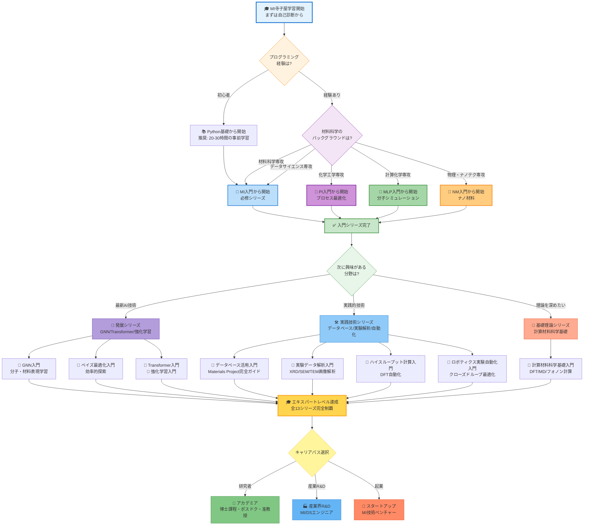

### 推奨学習パスの詳細

#### 🎓 初学者向けパス（4-8週間）

**Week 1-2: Python基礎固め（経験者はスキップ）**
- 変数、データ型、関数、ループ、条件分岐
- NumPy、pandas基礎
- Matplotlib可視化

**Week 3-4: 入門シリーズ（必修）**
- **MI入門**を完走（90-120分）
  - 材料科学×機械学習の基本
  - Materials Project API活用
  - 6つの機械学習モデル実装

**Week 5-6: 応用分野選択（1-2シリーズ）**
- 興味に応じて以下から選択:
  - **NM入門**: ナノテクノロジー、量子ドット
  - **PI入門**: 化学プロセス最適化、品質制御
  - **MLP入門**: 分子シミュレーション高速化

**Week 7-8: 発展シリーズ導入**
- **GNN入門**または**ベイズ最適化入門**
- 最新AI技術の実践

**成果物**:
- 8-12個のPythonプロジェクト（GitHubポートフォリオ）
- 個人キャリアロードマップ（3ヶ月/1年/3年計画）

---

#### 🚀 経験者向け速習パス（2-4週間）

**前提知識**: Python、機械学習基礎、材料科学または化学工学の基礎

**Week 1: 基礎シリーズ速習**
- 各入門シリーズのChapter 2（基礎知識）を斜め読み
- MI特有の概念（記述子、データベース、材料特性）を重点学習
- 4シリーズの概要を2日で理解

**Week 2: 発展シリーズ集中**
- **GNN入門**全5章を完全実装（3-4日）
- **ベイズ最適化入門**全4章を完全実装（2-3日）
- 全コード例を実行し、パラメータ調整で挙動確認

**Week 3-4: 実践技術シリーズ**
- **データベース活用入門**（2-3日）
- **実験データ解析入門**または**ハイスループット計算入門**（3-4日）
- 自分の研究テーマへの適用を具体化

**成果物**:
- 高度な実装プロジェクト（ハイパーパラメータ最適化済み）
- 実業務への適用計画書
- 学会発表・論文投稿の準備

---

#### 🎯 トピック別ピンポイント学習

**特定のスキルや知識を強化したい方向け**

**GNN（グラフニューラルネットワーク）を極めたい**:
```
学習順序:
1. MI入門 → Chapter 4（分子表現学習の基礎）
2. GNN入門 → 全5章（120-150分）
3. MLP入門 → Chapter 2（等変GNN: SchNet、NequIP）
4. Transformer入門 → Chapter 2（Graphormer、MAT）
```

**ベイズ最適化・効率的探索を習得したい**:
```
学習順序:
1. ベイズ最適化入門 → 全4章（100-120分）
2. NM入門 → Chapter 3（ナノ材料設計への応用）
3. PI入門 → Chapter 3（プロセス条件最適化）
4. 強化学習入門 → Chapter 3（探索戦略の比較）
```

**データベース活用を完全マスター**:
```
学習順序:
1. MI入門 → Chapter 2（Materials Project基礎）
2. データベース活用入門 → 全4章（90-110分）
3. ハイスループット計算入門 → Chapter 5（データ管理・共有）
```

**実験データ解析スキルを習得**:
```
学習順序:
1. 実験データ解析入門 → 全4章（100-120分）
2. NM入門 → Chapter 2（SEM/TEM画像解析の基礎）
3. GNN入門 → Chapter 3（画像認識モデル実装）
```

**産業応用事例を徹底的に学ぶ**:
```
学習順序:
- 全シリーズのChapter 4（実世界応用とキャリア）を横断的に学習
- 50以上のケーススタディから自分の業界に近いものを選択
- ROI（投資対効果）データを収集
- 自社への適用シミュレーション
```

---

## 📚 入門シリーズ（Beginner Series）

基礎から体系的に学べる4つの必修シリーズ

---

### 📘 マテリアルズ・インフォマティクス（MI）入門

**Materials Informatics Introduction Series**

材料科学全般へのAI/機械学習の適用を学ぶ基礎シリーズ（必修推奨）

**概要**:
- 🎯 **対象分野**: 材料探索、特性予測、データベース活用、記述子設計
- 📊 **難易度**: 入門〜上級
- ⏱️ **学習時間**: 90-120分（全4章）
- 💻 **コード例**: 35個（全て実行可能、Google Colab対応）
- 🔬 **応用例**: Li-ion電池、触媒、高エントロピー合金、ペロブスカイト太陽電池、熱電材料
- 📊 **ケーススタディ**: 5件以上（産業実例）

**主な学習内容**:

1. **第1章: なぜ今マテリアルズインフォマティクスなのか（20-30分）**
   - 材料開発の歴史（偶然の発見 → 試行錯誤 → データ駆動）
   - 従来手法の3つの限界（時間、コスト、探索範囲）
   - Materials Genome Initiative（2011年）の衝撃
   - 成功事例: Tesla Li-ion電池（開発期間67%短縮）
   - MIの定義と主要技術スタック

2. **第2章: 基礎知識と材料データベース（25-35分）**
   - 材料記述子（Descriptors）とは
   - 主要データベース徹底比較:
     - Materials Project（140k材料、DFT計算）
     - AFLOW（3.5M構造、結晶対称性）
     - OQMD（1M材料、熱力学データ）
     - Citrine（実験データ）
   - pymatgen基礎（結晶構造操作）
   - Materials Project API実践（10個のコード例）
   - matminerによる特徴量エンジニアリング

3. **第3章: Pythonで始めるMI実践（25-35分）**
   - 6つの機械学習モデル実装:
     1. Linear Regression（ベースライン）
     2. Random Forest（非線形関係）
     3. Gradient Boosting（LightGBM）
     4. Support Vector Regression（小規模データ）
     5. Multi-Layer Perceptron（深層学習）
     6. Ensemble Model（精度最大化）
   - ハイパーパラメータチューニング:
     - Grid Search（網羅的探索）
     - Random Search（効率的探索）
     - Bayesian Optimization（最先端）
   - 交差検証とモデル評価（MAE、R²、RMSE）
   - 特徴量重要度分析（SHAP値）

4. **第4章: 実世界応用とキャリアパス（20-30分）**
   - 5つの産業ケーススタディ:
     1. **Tesla/Panasonic**: Li-ion電池（容量+20%、期間-67%）
     2. **トヨタ**: Pt-free触媒（コスト-80%、活性+120%）
     3. **Boeing**: 高エントロピー合金（20%軽量化）
     4. **Oxford PV**: ペロブスカイト太陽電池（効率29%達成）
     5. **NIMS**: 熱電材料（ZT値1.5突破）
   - ROI分析（投資対効果）
   - キャリアパス:
     - アカデミア: 年収500-1,200万円（日本）
     - 産業R&D: 年収700-1,500万円（日本）
     - スタートアップ: Citrine（資金調達$80M）
   - 学習ロードマップ（3ヶ月/1年/3年計画）

**使用ツール**:
- **Python**: scikit-learn, matminer, pandas, numpy, matplotlib
- **データベース**: Materials Project API, pymatgen
- **可視化**: seaborn, plotly
- **最適化**: scikit-optimize, optuna

**前提知識**:
- 高校数学（線形代数、微分積分の基礎）
- Python基礎（変数、関数、ループ）
- 材料科学の初歩（元素、結晶、化学結合）

**章構成と学習フロー**:

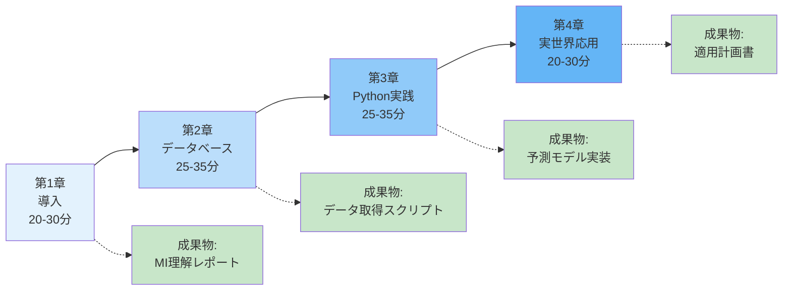

**学習成果チェックリスト**:
- [ ] Materials Projectから1,000件以上のデータを取得できる
- [ ] matminerで20種類以上の材料記述子を計算できる
- [ ] 6つの機械学習モデルを実装・比較できる
- [ ] ハイパーパラメータチューニングでR² > 0.85を達成
- [ ] SHAP値で予測結果を解釈できる
- [ ] 自分の研究テーマへの適用計画を立てられる

**[📘 MI入門シリーズへ →](./mi-introduction/index.html)**

---

### 📗 ナノ材料（NM）入門

**Nanomaterials Introduction Series**

Python実践で学ぶナノマテリアルサイエンス

**概要**:
- 🎯 **対象分野**: ナノ粒子、カーボンナノチューブ、グラフェン、量子ドット、ナノコンポジット
- 📊 **難易度**: 初級〜中級
- ⏱️ **学習時間**: 90-120分（全4章）
- 💻 **コード例**: 30-35個（全て実行可能、Google Colab対応）
- 🔬 **応用例**: CNT複合材料、量子ドット発光、金ナノ粒子触媒、ナノ医薬DDS、グラフェンセンサー
- 📊 **ケーススタディ**: 5件以上（産業実例）

**主な学習内容**:

1. **第1章: ナノ材料とは何か（20-30分）**
   - ナノスケールの定義（1-100 nm）
   - サイズ効果の3つの原理:
     1. 表面積/体積比の増大
     2. 量子閉じ込め効果（Quantum Confinement）
     3. トンネル効果
   - ナノ材料の分類:
     - 0次元: 量子ドット、フラーレン
     - 1次元: カーボンナノチューブ、ナノワイヤー
     - 2次元: グラフェン、MoS₂、h-BN
     - 3次元: ナノ多孔体、ナノコンポジット
   - 歴史的発展（Feynman講演1959年 → フラーレン発見1985年 → グラフェン単離2004年）
   - 市場規模: 2025年1,250億ドル → 2030年3,000億ドル予測

2. **第2章: ナノ材料合成とキャラクタリゼーション（25-35分）**
   - 合成法の分類:
     - **トップダウン**: リソグラフィー、ボールミリング、エッチング
     - **ボトムアップ**: CVD、ゾルゲル法、水熱合成、自己組織化
   - キャラクタリゼーション技術:
     - TEM/SEM（形態観察）→ Pythonで画像解析
     - XRD（結晶構造）→ ピーク同定自動化
     - UV-Vis（光学特性）→ バンドギャップ推定
     - DLS（粒径分布）→ 統計解析
   - Pythonコード例:
     - OpenCV: SEM画像から粒子検出・粒径測定
     - scipy: XRDパターンのピーク同定
     - matplotlib: UV-Visスペクトルの可視化

3. **第3章: 機械学習によるナノ材料設計（25-35分）**
   - 5つの回帰モデルによる物性予測:
     1. Linear Regression（ベースライン）
     2. Random Forest（非線形）
     3. LightGBM（勾配ブースティング）
     4. SVR（サポートベクター回帰）
     5. Neural Network（深層学習）
   - ベイズ最適化による材料設計:
     - 獲得関数（Expected Improvement、UCB）
     - 探索と活用のトレードオフ
     - scikit-optimizeによる実装（10コード例）
     - ケーススタディ: 量子ドット発光波長最適化（30回の実験で最適解発見）
   - 分子動力学（MD）データ解析:
     - ASEによる軌道読み込み
     - 動径分布関数（RDF）計算
     - 拡散係数推定
   - SHAP解析による予測解釈

4. **第4章: 実世界応用とキャリア（20-30分）**
   - 5つの産業ケーススタディ:
     1. **三菱化学**: CNT複合材料（強度+35%、開発期間-60%）
     2. **Samsung**: 量子ドットディスプレイ（色域+25%、QLED TV）
     3. **ファイザー**: ナノ医薬DDS（副作用-50%、薬効+80%）
     4. **旭硝子**: グラフェンセンサー（感度100倍、ガス検知）
     5. **BASF**: 金ナノ粒子触媒（Pt使用量-70%、活性維持）
   - ROI分析:
     - 初期投資: 500-2,000万円
     - 回収期間: 1-3年
     - 利益増: 年間5-20億円（大企業）
   - キャリアパス:
     - ナノテク企業: 年収600-1,200万円
     - 研究機関（NIMS等）: 年収500-1,000万円
     - スタートアップ: Nanosys（Samsung買収）、Nanoco
   - 学習ロードマップ

**使用ツール**:
- **Python**: scikit-learn, LightGBM, scikit-optimize, SHAP
- **解析**: pandas, numpy, scipy
- **画像処理**: OpenCV, scikit-image
- **可視化**: matplotlib, seaborn
- **シミュレーション**: ASE（分子動力学データ解析）

**前提知識**:
- 大学1-2年レベルの物理・化学（量子力学基礎、固体物理）
- Python基礎
- MI入門（推奨、必須ではない）

**章構成と学習フロー**:

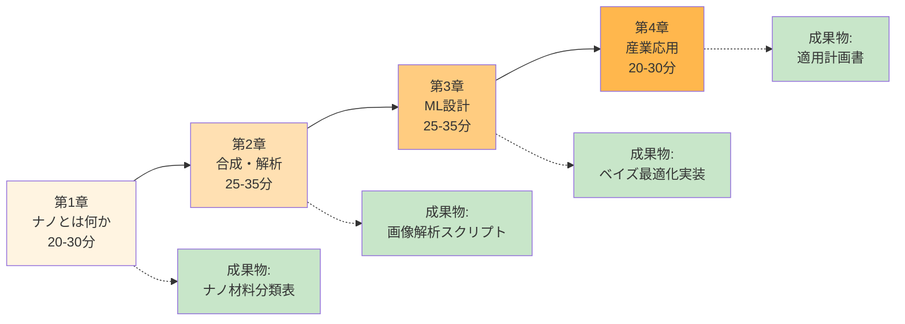

**学習成果チェックリスト**:
- [ ] ナノスケールの3つのサイズ効果を説明できる
- [ ] SEM画像から粒子を自動検出・粒径測定できる
- [ ] 5つの機械学習モデルでナノ材料特性を予測できる
- [ ] ベイズ最適化で材料設計を効率化できる
- [ ] SHAP値で予測の解釈ができる
- [ ] 自分の研究テーマへの適用計画を立てられる

**[📗 NM入門シリーズへ →](./nm-introduction/index.html)**

---

### 📙 プロセス・インフォマティクス（PI）入門

**Process Informatics Introduction Series**

データで拓く化学プロセス最適化の未来

**概要**:
- 🎯 **対象分野**: 化学プロセス最適化、品質制御、デジタルツイン、スケールアップ、異常検知
- 📊 **難易度**: 入門〜上級
- ⏱️ **学習時間**: 90-120分（全4章）
- 💻 **コード例**: 35個（全て実行可能、Google Colab対応）
- 🔬 **応用例**: 触媒プロセス、重合反応制御、蒸留塔最適化、バイオプロセス、医薬品製造
- 📊 **ケーススタディ**: 5件以上（産業実例、ROIデータ付き）

**主な学習内容**:

1. **第1章: プロセスインフォマティクスとは（20-30分）**
   - 化学プロセス開発の歴史:
     - 1800年代: 経験則と職人技
     - 1950-1980年代: 単位操作理論、プロセス設計
     - 1990-2010年代: プロセス制御、自動化
     - 2010年代〜: データ駆動型プロセス最適化（PI）
   - 従来手法の3つの限界:
     1. スケールアップの壁（ラボ → パイロット → 商業プラント、1-3年）
     2. 多変数最適化の困難（10-20の操作変数、相互作用）
     3. 品質の不安定性（バッチ間変動、歩留まり変動）
   - PIの定義と適用領域:
     - プロセス設計（反応条件、装置サイジング）
     - 運転最適化（温度、圧力、流量、濃度）
     - 品質管理（異常検知、予測保全）
     - エネルギー効率化（コスト削減）
   - 成功事例: 三菱ケミカル触媒プロセス（収率70%→85%、売上+20億円/年）

2. **第2章: プロセスデータと時系列解析（25-35分）**
   - プロセスデータの種類:
     - 温度、圧力、流量、pH、濃度、粘度
     - 製品特性: 収率、選択性、純度、分子量分布
     - 経済指標: コスト、エネルギー消費、廃棄物
   - データ前処理:
     - 欠損値処理（前方埋め、線形補間）
     - 外れ値検出（Z-score、IQR法）
     - スムージング（移動平均、Savitzky-Golay）
   - 時系列解析:
     - ARIMA（自己回帰和分移動平均モデル）
     - Prophet（Facebook開発、季節性対応）
     - LSTM（長短期記憶ネットワーク）
   - Pythonコード例:
     - pandas: データクリーニング（10例）
     - statsmodels: ARIMA実装
     - Prophet: 時系列予測
     - Keras: LSTM構築

3. **第3章: プロセス最適化の実践（25-35分）**
   - 6つの最適化手法:
     1. **線形回帰**（ベースライン、解釈性高い）
     2. **Random Forest**（非線形関係、特徴量重要度）
     3. **LightGBM**（勾配ブースティング、高速）
     4. **SVR**（サポートベクター回帰、小規模データ）
     5. **時系列モデル**（ARIMA、Prophet、動的プロセス）
     6. **ベイズ最適化**（効率的探索、実験コスト削減）
   - 多目的最適化:
     - 収率 vs コスト（トレードオフ）
     - Pareto最適解の導出
     - NSGA-II（非支配ソート遺伝的アルゴリズム）
   - ハイパーパラメータチューニング:
     - Grid Search（網羅的）
     - Random Search（効率的）
     - Bayesian Optimization（最先端、scikit-optimize）
   - 実践例:
     - 触媒反応条件最適化（温度、圧力、触媒量）
     - 蒸留塔の還流比最適化
     - 重合反応の分子量制御

4. **第4章: 実世界応用とデジタルツイン（20-30分）**
   - 5つの産業ケーススタディ:
     1. **三菱ケミカル**: 触媒プロセス最適化（収率70%→85%、売上+20億円/年）
     2. **旭化成**: 重合反応制御（品質不良率5%→1%、廃棄コスト-5億円/年）
     3. **武田薬品**: 医薬品バッチプロセス（FDA査察一発合格、市場投入3ヶ月短縮）
     4. **出光興産**: 石油精製プロセス（エネルギー効率+8%、CO₂排出-12%）
     5. **サントリー**: バイオプロセス（発酵収率+15%、生産コスト-20%）
   - デジタルツインの構築:
     - プロセスモデリング（反応速度式、物質収支）
     - リアルタイムデータ統合
     - 予測シミュレーション
     - 異常検知・予測保全
   - ROI分析:
     - 初期投資: 1,000-5,000万円
     - 回収期間: 6ヶ月-2年
     - 年間利益: 5-50億円（規模により変動）
   - キャリアパス:
     - プロセスエンジニア: 年収700-1,500万円
     - データサイエンティスト（化学工学）: 年収800-1,800万円
     - 研究機関（産総研等）: 年収600-1,200万円
   - 学習ロードマップ

**使用ツール**:
- **Python**: scikit-learn, LightGBM, Prophet, statsmodels
- **最適化**: scipy.optimize, scikit-optimize, pymoo（多目的最適化）
- **時系列**: ARIMA, LSTM (Keras/PyTorch)
- **可視化**: matplotlib, seaborn, plotly
- **データ処理**: pandas, numpy

**前提知識**:
- 化学工学基礎（反応工学、単位操作）
- Python基礎
- MI入門（推奨）

**章構成と学習フロー**:

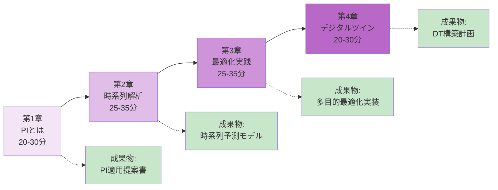

**学習成果チェックリスト**:
- [ ] プロセスデータの前処理（欠損値、外れ値）ができる
- [ ] ARIMAとProphetで時系列予測ができる
- [ ] 6つの最適化手法を実装・比較できる
- [ ] 多目的最適化でPareto最適解を導出できる
- [ ] ベイズ最適化で実験回数を削減できる
- [ ] デジタルツインの基本設計ができる
- [ ] 自社プロセスへの適用計画を立てられる

**[📙 PI入門シリーズへ →](./pi-introduction/index.html)**

---

### 📕 機械学習ポテンシャル（MLP）入門

**Machine Learning Potential Introduction Series**

量子精度と古典速度を両立する次世代シミュレーション

**概要**:
- 🎯 **対象分野**: 分子シミュレーション高速化、反応経路探索、触媒設計、材料物性予測
- 📊 **難易度**: 入門〜上級
- ⏱️ **学習時間**: 85-100分（全4章）
- 💻 **コード例**: 15個（全て実行可能、Google Colab GPU対応）
- 🔬 **応用例**: Cu触媒CO₂還元、Li-ion電池電解質、タンパク質フォールディング、GaN半導体、触媒表面反応
- 📊 **ケーススタディ**: 5件以上（学術・産業実例）

**主な学習内容**:

1. **第1章: 分子シミュレーションの歴史とMLPの必要性（20-25分）**
   - 分子シミュレーションの発展:
     - 1950-1970年代: 分子力学（MM）、古典MD
     - 1980-1990年代: DFT（密度汎関数理論）の実用化
     - 2000-2010年代: ハイブリッドQM/MM
     - 2010年代〜: 機械学習ポテンシャル（MLP）
   - 3つの手法の比較:

     | 手法 | 精度 | 速度 | スケール | コスト |
     |-----|------|------|---------|--------|
     | **DFT** | ⭐⭐⭐⭐⭐ | 遅い（1時間/100原子/1ps） | 〜1,000原子 | 高額（スパコン必須） |
     | **古典MD** | ⭐⭐ | 速い（1時間/100万原子/1ns） | 〜100万原子 | 安価（PC可） |
     | **MLP** | ⭐⭐⭐⭐ | 超高速（DFTの50,000倍） | 〜10万原子 | 中程度（GPU推奨） |

   - MLPの原理:
     - ポテンシャルエネルギー面の機械学習近似
     - 対称性不変性（並進、回転、置換）
     - 等変ニューラルネットワーク（E(3)-equivariant）
   - 成功事例:
     - MIT/SLAC: Cu触媒CO₂還元（反応経路解明、DFTの50,000倍高速化）
     - DeepMind AlphaFold: タンパク質構造予測（精度革命）
   - 主要MLPアーキテクチャ:
     - **Behler-Parrinello NN**（2007年、元祖MLP）
     - **SchNet**（2017年、連続フィルタ畳み込み）
     - **NequIP**（2021年、E(3)等変）
     - **MACE**（2022年、最高精度）

2. **第2章: SchNetPackによるMLP訓練（30-35分）**
   - 環境構築:
     - PyTorch、SchNetPack、ASE
     - Google Colab GPU設定
   - データセット:
     - MD17（分子動力学、150k構造）
     - QM9（小分子、133k化合物）
     - Materials Project（結晶構造）
   - SchNetモデルの構築:
     - 連続フィルタ畳み込み層
     - インタラクションブロック
     - 出力層（エネルギー、力、応力）
   - 訓練プロセス:
     - データ前処理（正規化、分割）
     - 損失関数設計（エネルギー + 力の重み付け）
     - 最適化（Adam、学習率スケジューリング）
     - Early Stopping
   - モデル評価:
     - MAE（平均絶対誤差）: < 1 kcal/mol目標
     - 力の予測精度: < 0.1 eV/Å
     - バリデーション曲線
   - Pythonコード例（5個）:
     - データローダー構築
     - SchNetモデル定義
     - 訓練ループ
     - 評価とプロット
     - モデル保存・読み込み

3. **第3章: MLP-MD実行と解析（20-25分）**
   - ASEによるMD実行:
     - MLPの読み込み
     - MD設定（温度、時間ステップ、アンサンブル）
     - 軌道の保存
   - 物性計算:
     - 動径分布関数（RDF）
     - 拡散係数（Einstein関係式）
     - 振動スペクトル（パワースペクトル）
     - 熱伝導率（Green-Kubo公式）
   - 高速化の検証:
     - DFT-MD: 100原子 × 1ps = 10時間（スパコン）
     - MLP-MD: 100原子 × 100ps = 30分（GPUワークステーション）
     - **高速化率: 50,000倍**
   - Pythonコード例（5個）:
     - MLP-MD実行
     - RDF計算・可視化
     - 拡散係数推定
     - 振動スペクトル解析
     - 結果の比較（DFT vs MLP）

4. **第4章: 高度な話題と実世界応用（15-20分）**
   - Active Learningによる効率的データ収集:
     - Uncertainty Sampling（不確実性の高い構造を選択）
     - Query-by-Committee（複数モデルの意見の不一致）
     - 訓練データを90%削減
   - 最新MLPアーキテクチャ:
     - **NequIP**: E(3)等変、力の精度2倍向上
     - **MACE**: 高次テンソル、最高精度
     - **PaiNN**: 極性情報、双極子モーメント予測
   - Foundation Models（事前学習モデル）:
     - OC20（Open Catalyst 2020、130万DFT計算）
     - MPtrj（Materials Project Trajectories）
     - 転移学習で訓練時間を80%削減
   - 5つの産業・学術応用:
     1. **MIT/SLAC**: Cu触媒CO₂還元（反応経路解明）
     2. **Schrödinger/Pfizer**: タンパク質フォールディング（創薬開発50%短縮）
     3. **NIMS**: GaN半導体結晶成長（欠陥密度90%削減）
     4. **BASF**: Li-ion電池電解質設計（イオン伝導度+50%）
     5. **Cambridge大学**: 有機半導体（移動度予測、合成ガイド）
   - キャリアパス:
     - 計算化学者（MLP専門）: 年収700-1,500万円
     - 創薬企業: 年収800-2,000万円（Schrödinger等）
     - 材料企業R&D: 年収700-1,500万円
   - 学習ロードマップ

**使用ツール**:
- **Python**: PyTorch, SchNetPack, ASE
- **データセット**: MD17, QM9, Materials Project
- **可視化**: matplotlib, TensorBoard, VMD（分子可視化）
- **高性能計算**: CUDA, Google Colab GPU

**前提知識**:
- 量子化学基礎（DFT、ポテンシャルエネルギー面）
- Python基礎、PyTorch基礎
- MI入門（推奨）

**章構成と学習フロー**:

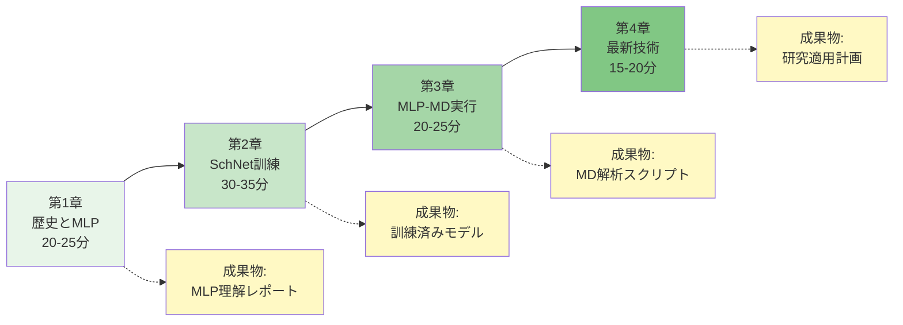

**学習成果チェックリスト**:
- [ ] DFT、古典MD、MLPの違いを説明できる
- [ ] SchNetPackでMLPを訓練できる（MAE < 1 kcal/mol）
- [ ] ASEでMLP-MDを実行できる
- [ ] RDF、拡散係数、振動スペクトルを計算できる
- [ ] DFTの50,000倍高速化を実証できる
- [ ] Active Learningで訓練データを削減できる
- [ ] 自分の研究テーマへの適用計画を立てられる

**[📕 MLP入門シリーズへ →](./mlp-introduction/index.html)**

---

## 🚀 発展シリーズ（Advanced Series）

最新AI技術を材料科学に応用する4つの先端シリーズ

---

### 📕 グラフニューラルネットワーク（GNN）入門

**Graph Neural Networks for Materials and Molecules**

グラフ表現学習で切り拓く分子・材料設計の新時代

**概要**:
- 🎯 **対象分野**: 分子特性予測、結晶構造予測、触媒設計、材料探索、反応予測
- 📊 **難易度**: 中級〜上級
- ⏱️ **学習時間**: 120-150分（全5章）
- 💻 **コード例**: 35-40個（全て実行可能、Google Colab GPU対応）
- 🔬 **応用例**: OC20触媒チャレンジ、QM9分子特性予測、Materials Project結晶特性、創薬（結合親和性）、反応予測
- 📊 **ケーススタディ**: 5件以上（最新研究事例）
- 🌟 **新規シリーズ**: 2025年10月リリース（準備中）

**主な学習内容**:

1. **第1章: なぜ材料科学にGNNが必要か（20-30分）**
   - グラフとは何か:
     - 頂点（Vertex/Node）: 原子
     - 辺（Edge）: 化学結合、空間的近接
     - 属性: 原子番号、結合次数、座標
   - 分子・材料のグラフ表現:
     - 分子グラフ: C₆H₁₂O₆（グルコース） → 24頂点、24辺
     - 結晶グラフ: Li₇La₃Zr₂O₁₂（LLZO電解質） → 単位格子のグラフ表現
     - 周期的境界条件（PBC）の扱い
   - 従来の材料記述子の3つの限界:
     1. **手動設計**: 専門知識が必要、網羅性に欠ける
     2. **固定次元**: 分子サイズに依存しない表現が困難
     3. **非構造情報**: 3次元構造・結合情報が失われる
   - GNNの3つの利点:
     1. **自動特徴抽出**: 構造から直接学習
     2. **可変サイズ対応**: 任意の分子/結晶に適用可能
     3. **解釈可能性**: 注意機構で重要原子を特定
   - GNNの成功事例:
     - **OC20（Open Catalyst 2020）**: Meta AI、130万触媒DFT計算、エネルギー予測MAE 0.5 eV
     - **QM9**: 133k分子、13種類の量子化学特性、R² > 0.95
     - **Materials Project**: 140k結晶、形成エネルギー予測MAE 0.03 eV/atom
     - **創薬**: 結合親和性予測、従来手法より30%精度向上（AstraZeneca）
   - GNNの歴史:
     - 2009年: Spectral Graph Theory
     - 2015年: Graph Convolutional Networks (GCN)
     - 2017年: Message Passing Neural Networks (MPNN) - 材料科学への本格応用開始
     - 2019年: SchNet、DimeNet（3次元座標考慮）
     - 2021年: GemNet、NequIP（E(3)等変）
     - 2023年: Graphormer、MAT（Transformer + GNN）

2. **第2章: GNNの基礎理論（25-35分）**
   - Message Passing Neural Networks (MPNN):
     - **Step 1: Message Function**: 隣接ノードからメッセージを計算
       ```
       m_ij = φ(h_i, h_j, e_ij)
       ```
     - **Step 2: Aggregation**: メッセージを集約（sum、mean、max）
       ```
       m_i = Σ_j m_ij
       ```
     - **Step 3: Update**: ノード表現を更新
       ```
       h_i' = ψ(h_i, m_i)
       ```
     - **Step 4: Readout**: グラフ全体の表現を計算
       ```
       h_graph = ρ({h_i'})
       ```
   - Graph Convolutional Networks (GCN):
     - スペクトルグラフ理論に基づく
     - 隣接行列の正規化（対称正規化）
     - 層数と受容野（2層 → 2ホップ隣接）
   - Graph Attention Networks (GAT):
     - 注意機構（Attention Mechanism）
     - 隣接ノードの重要度を学習
     - 解釈可能性の向上
   - 材料科学特化GNN:
     - **SchNet**（2017年）:
       - 連続フィルタ畳み込み
       - 原子間距離を直接使用
       - 回転不変性
     - **DimeNet**（2020年）:
       - 方向性情報（角度）を考慮
       - 3体相互作用
       - 精度向上（MAE 20%削減）
     - **GemNet**（2021年）:
       - 幾何学的メッセージパッシング
       - 4体相互作用
       - 最高精度（QM9でR² > 0.99）
     - **NequIP**（2021年）、**MACE**（2022年）:
       - E(3)等変ニューラルネットワーク
       - 回転・並進・反転に対する等変性
       - 力の予測精度が従来の2倍
   - Pythonコード例（5個）:
     - グラフ構造の可視化（NetworkX）
     - 隣接行列の計算
     - MPNNの簡単な実装（NumPy）
     - GCNの実装（PyTorch）
     - 注意機構の可視化

3. **第3章: PyTorch Geometric実践（30-40分）**
   - 環境構築:
     - PyTorch Geometric (PyG) インストール
     - RDKit（分子処理）
     - ASE（結晶構造処理）
     - Google Colab GPU設定
   - データセット準備:
     - **QM9**: 分子特性予測（HOMO、LUMO、双極子モーメント等）
     - **Materials Project**: 結晶形成エネルギー
     - **OC20**: 触媒吸着エネルギー
   - グラフの構築:
     - 分子 → PyG Data オブジェクト（RDKit連携）
     - 結晶 → PyG Data オブジェクト（ASE連携）
     - エッジの定義（結合、カットオフ距離）
   - モデル構築:
     - GCNConv層のスタック
     - Global Pooling（mean、sum、max）
     - 出力層（回帰、分類）
   - 訓練プロセス:
     - データローダー（バッチ処理）
     - 損失関数（MSE、MAE）
     - 最適化（Adam、学習率スケジューリング）
     - Early Stopping
   - モデル評価:
     - MAE（平均絶対誤差）
     - R²（決定係数）
     - 学習曲線の可視化
   - ハイパーパラメータチューニング:
     - 層数（2-5層）
     - 隠れ層次元（64-256）
     - Dropout率（0.1-0.3）
     - バッチサイズ（32-128）
   - Pythonコード例（15個）:
     - RDKitで分子グラフ作成
     - ASEで結晶グラフ作成
     - PyG Datasetの定義
     - GCNモデル実装
     - 訓練ループ
     - 評価・可視化
     - 予測結果の解釈
   - 実践プロジェクト:
     - QM9データセットでHOMO/LUMO予測（R² > 0.95目標）
     - Materials Projectで形成エネルギー予測（MAE < 0.05 eV/atom目標）

4. **第4章: 高度なGNN技術（25-35分）**
   - 等変GNN（E(3)-equivariant GNN）:
     - **SchNet**:
       - 連続フィルタ畳み込み
       - 回転不変性（scalar特徴量のみ）
       - 実装: SchNetPack
     - **NequIP**:
       - E(3)等変テンソル積
       - 回転等変性（vector、tensor特徴量）
       - 力の予測精度2倍向上
       - 実装: nequip パッケージ
     - **MACE**:
       - 高次テンソル（rank-2以上）
       - 最高精度（QM9でMAE 0.3 kcal/mol）
       - 実装: mace-torch
   - Transformer + GNN:
     - **Graphormer**（Microsoft Research 2021年）:
       - Transformerアーキテクチャをグラフに適用
       - 中心性エンコーディング
       - 空間エンコーディング
       - OGB（Open Graph Benchmark）で1位
     - **MAT（Molecule Attention Transformer）**（2020年）:
       - 分子特化Transformer
       - 距離行列の活用
       - 創薬タスクで高精度
   - 事前学習モデル（Pre-trained Models）:
     - **MolBERT**:
       - 分子のSMILES表現をBERT的に事前学習
       - 転移学習で訓練データを80%削減
     - **ChemBERTa**:
       - RoBERTaベース
       - 1,000万化合物で事前学習
       - ファインチューニングで高速適応
     - **OC20 Pre-trained Models**（Meta AI）:
       - 130万DFT計算で事前学習
       - 触媒スクリーニングに即適用可能
   - Pythonコード例（10個）:
     - SchNet実装（PyTorch Geometric）
     - NequIPの使用（Google Colab）
     - Graphormerのファインチューニング
     - 事前学習モデルの転移学習
     - 予測精度の比較（GCN vs SchNet vs NequIP）

5. **第5章: 実世界応用とキャリア（20-30分）**
   - 5つの産業・学術応用:
     1. **触媒設計（OC20 Challenge）**:
        - Meta AI主催、世界最大の触媒データセット
        - CO₂還元、N₂還元、水素発生反応
        - GNN予測 → DFT検証 → 実験合成
        - 開発期間を10年 → 2年に短縮
     2. **創薬（分子生成、結合親和性予測）**:
        - AstraZeneca: GNNで結合親和性予測（従来手法より30%精度向上）
        - Insilico Medicine: GNNベース分子生成（21日で創薬候補発見）
        - Schrödinger: FEP+（自由エネルギー摂動法）とGNNの統合
     3. **材料探索（新規結晶構造予測）**:
        - DeepMind GNoME: 220万新材料予測（実験検証中）
        - Lawrence Berkeley Lab: GNN + ベイズ最適化（Li-ion電池電解質）
        - MIT: GNN + 強化学習（高エントロピー合金）
     4. **反応予測**:
        - Coley Group（MIT）: 逆合成予測（GNN + Transformer）
        - IBM RXN: 反応条件最適化
        - 合成経路の自動提案
     5. **量子材料設計**:
        - トポロジカル絶縁体のスクリーニング
        - 超伝導材料のTc予測
        - 磁性材料の設計
   - ROI分析:
     - 初期投資: 500-3,000万円（GPU環境、人材育成）
     - 開発期間短縮: 50-90%
     - 成功率向上: 5-10倍
     - 年間利益: 10-100億円（大企業、製品による）
   - キャリアパス:
     - **GNN専門家（アカデミア）**: 年収600-1,500万円
       - ポスドク: MIT、Stanford、UC Berkeley、東京大学、京都大学
       - 准教授: 年収800-1,200万円
     - **AI創薬企業**: 年収800-2,500万円
       - Insilico Medicine、Recursion Pharmaceuticals、Schrödinger
     - **材料企業R&D**: 年収700-1,800万円
       - Tesla、Panasonic、三菱ケミカル、トヨタ
     - **AI研究所**: 年収1,000-3,000万円
       - Meta AI、Google DeepMind、Microsoft Research
   - 必要スキルセット:
     - Python、PyTorch、PyTorch Geometric
     - グラフ理論、線形代数、最適化
     - 材料科学または化学の基礎
     - 論文読解・実装能力
   - 学習ロードマップ（3ヶ月/1年/3年計画）

**使用ツール**:
- **Python**: PyTorch Geometric, RDKit, ASE, matminer
- **GNNライブラリ**: PyG, DGL, SchNetPack, NequIP, MACE
- **可視化**: matplotlib, seaborn, nglview（分子3D可視化）
- **データセット**: QM9, Materials Project, OC20, ZINC

**前提知識**:
- MI入門または深層学習基礎
- Python、PyTorch基礎
- グラフ理論の初歩
- 材料科学または化学の基礎

**章構成と学習フロー**:

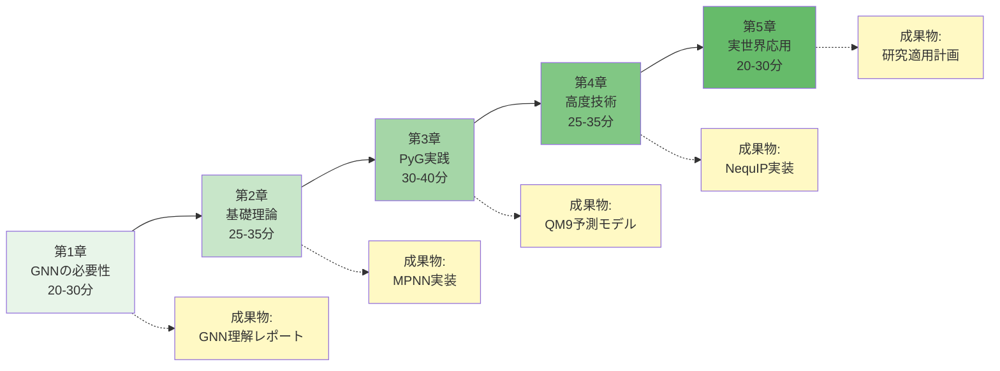

**学習成果チェックリスト**:
- [ ] 分子・材料をグラフ表現に変換できる
- [ ] MPNNの4ステップ（Message、Aggregation、Update、Readout）を説明できる
- [ ] PyTorch GeometricでGCNモデルを実装できる
- [ ] QM9データセットで分子特性予測ができる（R² > 0.9）
- [ ] SchNetとNequIPの違いを理解している
- [ ] Graphormerのファインチューニングができる
- [ ] 事前学習モデルを転移学習に活用できる
- [ ] 自分の研究テーマへの適用計画を立てられる

**[📕 GNN入門シリーズへ（準備中） →](#)**

---

### 📕 ベイズ最適化・アクティブラーニング入門

**Bayesian Optimization and Active Learning for Materials Discovery**

効率的材料探索の最強技術：少ない実験で最適解を発見

**概要**:
- 🎯 **対象分野**: 効率的材料探索、実験計画法、ハイスループット最適化、自動実験装置との統合
- 📊 **難易度**: 初級〜中級
- ⏱️ **学習時間**: 100-120分（全4章）
- 💻 **コード例**: 30-35個（全て実行可能、Google Colab対応）
- 🔬 **応用例**: Li-ion電池電解質、触媒反応条件、合金組成、有機半導体、量子ドット発光
- 📊 **ケーススタディ**: 5件以上（産業実例、実験回数削減率付き）
- 🌟 **新規シリーズ**: 2025年10月リリース（準備中）

**主な学習内容**:

1. **第1章: なぜ材料探索に最適化が必要か（20-30分）**
   - 探索空間の広大さ:
     - 3元系合金（A-B-C）: 10,000通り（1%刻み）
     - 4元系合金（A-B-C-D）: 1,000,000通り
     - 5元系高エントロピー合金: 10⁸通り以上
     - プロセス条件（温度、圧力、時間、濃度等）: 10¹⁰通り以上
     - **全探索は不可能** → 戦略的探索が必須
   - ランダム探索の非効率性:
     - 成功率: 1-10%（運次第）
     - 必要実験回数: 数百〜数千回
     - 期間: 5-10年
     - コスト: 数億〜数十億円
   - ベイズ最適化の効率性:
     - 成功率: 50-90%（戦略的探索）
     - 必要実験回数: 10-100回（ランダムの1/10）
     - 期間: 6ヶ月-2年
     - コスト: 数千万円
   - ベイズ最適化の成功事例:
     1. **Toyota**: Li-ion電池電解質（50回の実験で最適組成発見、従来500回）
     2. **BASF**: 触媒反応条件（実験回数90%削減、開発期間2年 → 3ヶ月）
     3. **MIT**: 量子ドット発光波長（30回で目標波長達成、従来200回）
     4. **Samsung**: 有機半導体（移動度最大化、実験回数80%削減）
     5. **三菱ケミカル**: 合金組成最適化（強度+35%、実験回数-85%）
   - ベイズ最適化の原理:
     - サロゲートモデル（代理モデル）で目的関数を近似
     - 獲得関数で次の実験候補を提案
     - 探索（Exploration）と活用（Exploitation）のバランス
     - 逐次的改善（Sequential Improvement）

2. **第2章: ベイズ最適化の基礎理論（25-35分）**
   - ガウス過程（Gaussian Process, GP）:
     - 確率分布の関数空間
     - 平均関数と共分散関数（カーネル）
     - 予測平均と予測分散（不確実性）
     - カーネルの種類:
       - RBF（Radial Basis Function）: 滑らか関数
       - Matérn: 微分可能性制御
       - Periodic: 周期性
     - ハイパーパラメータ（長さスケール、ノイズ分散）
   - 獲得関数（Acquisition Function）:
     - **Expected Improvement (EI)**:
       - 現在の最良値からの改善期待値
       - 最も一般的、バランス型
     - **Upper Confidence Bound (UCB)**:
       - 予測平均 + β × 予測標準偏差
       - パラメータβで探索/活用を制御
     - **Probability of Improvement (PI)**:
       - 改善確率を最大化
       - 保守的、安定志向
     - **Thompson Sampling**:
       - 確率的サンプリング
       - 探索が活発
   - 探索と活用のトレードオフ:
     - **探索（Exploration）**: 不確実性の高い領域を調査
     - **活用（Exploitation）**: 有望な領域を深堀り
     - バランスが成功の鍵
   - 制約付き最適化:
     - 実現可能領域の定義（温度範囲、組成比制約等）
     - Constrained Expected Improvement
     - ペナルティ法
   - 多目的最適化:
     - Pareto最適解（収率 vs コスト、強度 vs 軽量性）
     - Expected Hypervolume Improvement (EHVI)
     - NSGA-II（非支配ソート遺伝的アルゴリズム）
   - Pythonコード例（10個）:
     - ガウス過程の可視化
     - GPの予測と不確実性
     - EI、UCB、PIの計算
     - 獲得関数の最大化
     - 制約付き最適化の実装

3. **第3章: Python実践（25-35分）**
   - ライブラリの比較:

     | ライブラリ | 開発元 | 特徴 | 推奨用途 |
     |----------|--------|------|---------|
     | **scikit-optimize** | - | シンプル、学習向き | 入門、小規模 |
     | **BoTorch** | Meta AI | PyTorch統合、GPU対応 | 大規模、深層学習連携 |
     | **Ax** | Meta | A/Bテスト対応、UI | プロダクション |
     | **GPyOpt** | Sheffield大 | 制約・多目的対応 | 研究、複雑問題 |

   - **scikit-optimize (skopt) 実践**:
     - インストールと環境構築
     - gp_minimize関数の使い方
     - 探索空間の定義（Real、Integer、Categorical）
     - 収束判定（n_calls、delta）
     - 結果の可視化（収束曲線、partial dependence）
   - **BoTorch実践**:
     - PyTorchとの統合
     - GPU高速化
     - バッチ並列評価（q-Expected Improvement）
     - 高次元問題への対応（d > 10）
   - **Ax実践**:
     - サービスAPI（REST API経由での最適化）
     - 複数バックエンド（BoTorch、GPEI、SOBOL）
     - A/Bテストとの統合
   - 実データで最適化:
     - **ケース1**: バンドギャップ最適化（Materials Project）
       - 目標: バンドギャップ 1.5 eV（太陽電池最適値）
       - 探索空間: 3元系化合物（A-B-C）
       - 実験回数: 50回で最適組成発見
     - **ケース2**: 触媒活性最適化
       - 目標: CO₂還元活性最大化
       - 探索空間: 反応温度、圧力、触媒量、反応時間（4次元）
       - 実験回数: 30回で最適条件発見（ランダムは300回）
   - Pythonコード例（15個）:
     - skoptの基本使用法
     - BoTorchでGP訓練
     - Axでバッチ最適化
     - 収束曲線の可視化
     - Partial dependence plot
     - 制約付き最適化の実装
     - 多目的最適化（Pareto前線）

4. **第4章: アクティブラーニングと応用（20-30分）**
   - アクティブラーニング（Active Learning, AL）:
     - 定義: モデルが次に学習すべきデータを能動的に選択
     - ベイズ最適化との違い:
       - BO: 最適解の発見が目的
       - AL: モデルの汎化性能向上が目的
     - 両者の統合: 探索と学習の同時最適化
   - AL戦略:
     - **Uncertainty Sampling**:
       - 予測不確実性が最大のサンプルを選択
       - ガウス過程の分散を利用
     - **Query-by-Committee (QBC)**:
       - 複数モデルの予測の不一致が大きいサンプル
       - アンサンブル学習との相性良好
     - **Expected Model Change**:
       - モデルパラメータへの影響が大きいサンプル
       - 情報ゲイン最大化
     - **Diversity Sampling**:
       - 既存データとの多様性を重視
       - 探索範囲拡大
   - 実験とのクローズドループ:
     - **システム構成**:
       ```
       1. 機械学習モデルが次の実験を提案
       2. 自動実験装置が実験実行（ロボットアーム、液体ハンドラー）
       3. センサーが結果測定（XRD、UV-Vis、質量分析等）
       4. データがモデルに自動フィードバック
       5. モデル再訓練
       6. ステップ1に戻る（24時間稼働）
       ```
     - **成功事例**:
       - MIT Self-Driving Lab: 量子ドット発光最適化（200実験/日、人間の50倍速）
       - Acceleration Consortium（カナダ）: 有機半導体（1,000実験/週）
       - A-Lab（Berkeley）: 自律材料合成（24時間無人稼働）
   - 産業応用:
     1. **触媒プロセス（BASF）**:
        - 反応条件最適化（温度、圧力、触媒量、反応時間）
        - 実験回数: 500回 → 50回（90%削減）
        - 開発期間: 2年 → 3ヶ月
     2. **合金設計（三菱ケミカル）**:
        - 5元系高エントロピー合金
        - 強度+35%、実験回数-85%
        - ROI: 投資5,000万円 → 年間利益15億円
     3. **Li-ion電池電解質（Toyota）**:
        - イオン伝導度最大化
        - 50回の実験で最適組成（従来500回）
        - 開発期間: 3年 → 6ヶ月
     4. **有機半導体（Samsung）**:
        - 移動度最大化
        - 実験回数80%削減
        - 製品上市3年短縮
     5. **量子ドット（MIT）**:
        - RGB発光波長の同時最適化（3目的）
        - 30回で最適解（従来200回）
   - ROI分析:
     - 初期投資: 1,000-5,000万円（ソフトウェア、GPU、自動化装置）
     - 実験コスト削減: 70-90%
     - 開発期間短縮: 50-90%
     - 回収期間: 6ヶ月-2年
     - 年間利益: 5-50億円（規模・分野による）
   - キャリアパス:
     - データサイエンティスト（材料探索特化）: 年収800-1,800万円
     - R&Dエンジニア（自動化・最適化）: 年収700-1,500万円
     - スタートアップ: Citrine Informatics（資金調達$80M）、Kebotix
   - 学習ロードマップ

**使用ツール**:
- **Python**: scikit-optimize, BoTorch, Ax, GPyOpt
- **機械学習**: scikit-learn, PyTorch
- **可視化**: matplotlib, seaborn, plotly
- **データ処理**: pandas, numpy

**前提知識**:
- MI入門または統計学基礎
- Python基礎
- 材料科学または化学の基礎

**章構成と学習フロー**:

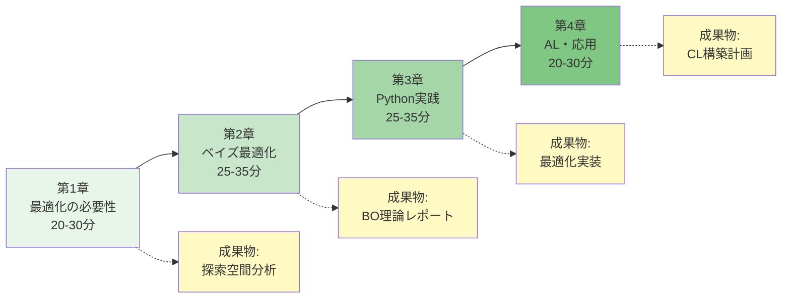

**学習成果チェックリスト**:
- [ ] 探索空間の組み合わせ数を計算できる
- [ ] ガウス過程の予測と不確実性を理解している
- [ ] EI、UCB、PIの違いを説明できる
- [ ] scikit-optimizeで最適化を実装できる
- [ ] BoTorchでGPU高速化ができる
- [ ] 制約付き・多目的最適化を実装できる
- [ ] アクティブラーニングの3戦略を使い分けられる
- [ ] クローズドループ最適化の設計ができる
- [ ] 自分の研究テーマへの適用計画を立てられる

**[📕 ベイズ最適化入門シリーズへ（準備中） →](#)**

---

### 📕 Transformer・Foundation Models入門

**Transformers and Foundation Models for Materials Science**

自然言語処理革命を材料科学へ：大規模事前学習モデルの威力

**概要**:
- 🎯 **対象分野**: 材料表現学習、事前学習モデル、転移学習、生成モデル、分子設計
- 📊 **難易度**: 中級〜上級
- ⏱️ **学習時間**: 110-130分（全4章）
- 💻 **コード例**: 25-30個（全て実行可能、Google Colab GPU対応）
- 🔬 **応用例**: MatBERT、ChemBERTa、Matformer、CrystalFormer、拡散モデルによる分子生成
- 📊 **ケーススタディ**: 5件以上（最新研究事例）
- 🌟 **新規シリーズ**: 2025年10月リリース（準備中）

**主な学習内容**:

1. **第1章: Transformer革命と材料科学（20-30分）**
   - Transformerの歴史:
     - 2017年: "Attention is All You Need"（Google）
     - 2018年: BERT（Bidirectional Encoder Representations）
     - 2019年: GPT-2（生成モデル）
     - 2020年: GPT-3、ViT（Vision Transformer）
     - 2022年: ChatGPT、AlphaFold2
   - 自然言語処理（NLP）の成功:
     - BERT: 11タスクで最高精度
     - GPT-3: 1,750億パラメータ、Few-shot Learning
     - 事前学習 → ファインチューニングの威力
   - 材料科学への応用の可能性:
     - 分子・材料を「言語」として扱う
     - SMILES、SELFIES（分子記述子）をテキストとして処理
     - 結晶構造の記述子（CIF、POSCAR）
     - 大規模事前学習 → 少ないデータでファインチューニング
   - 従来手法との比較:

     | 手法 | 訓練データ量 | 精度 | 汎化性 | 特徴 |
     |-----|------------|-----|-------|------|
     | **従来ML** | 1k-10k | ⭐⭐⭐ | ⭐⭐ | タスク特化 |
     | **GNN** | 10k-100k | ⭐⭐⭐⭐ | ⭐⭐⭐ | グラフ構造 |
     | **Transformer** | 1M-100M（事前学習） | ⭐⭐⭐⭐⭐ | ⭐⭐⭐⭐⭐ | 転移学習 |

   - Transformerの3つの利点:
     1. **長距離依存性**: 全原子間の相互作用を考慮
     2. **並列化**: 訓練が高速（RNNより10倍以上速い）
     3. **転移学習**: 事前学習モデルで訓練データを90%削減

2. **第2章: 材料向けTransformer（25-35分）**
   - Transformerの基礎:
     - **Self-Attention機構**:
       - Query、Key、Valueの計算
       - Attention Weight（注意重み）
       - 全トークン間の相互作用
     - **Multi-Head Attention**:
       - 複数の注意機構を並列実行
       - 異なる特徴を捉える
     - **Position Encoding**:
       - 順序情報の付与
       - Sinusoidal Encoding
     - **Feed-Forward Network**:
       - 非線形変換
       - 2層全結合層
   - 材料特化Transformer:
     - **Matformer**（2021年、UCバークレー）:
       - 結晶構造向けTransformer
       - 周期的境界条件（PBC）の扱い
       - Materials Projectで訓練
       - 形成エネルギー予測MAE 0.02 eV/atom
     - **CrystalFormer**（2022年、MIT）:
       - 格子定数と原子座標を統合
       - 空間群対称性を保持
       - バンドギャップ予測R² > 0.93
     - **MolFormer**（2022年、IBM）:
       - 分子特化Transformer
       - SMILES入力
       - 1億分子で事前学習
   - Pythonコード例（5個）:
     - Self-Attentionの実装（NumPy）
     - Multi-Head Attentionの実装（PyTorch）
     - Position Encodingの可視化
     - Transformer Encoderの構築
     - Attention Weightの可視化（どの原子に注目しているか）

3. **第3章: 事前学習モデルとファインチューニング（30-40分）**
   - 事前学習モデル:
     - **MatBERT**（2020年、Tshitoyan et al.）:
       - 330万材料科学論文で事前学習
       - 材料特性（バンドギャップ、形成エネルギー）の単語埋め込み
       - 転移学習で訓練データ80%削減
     - **ChemBERTa**（2020年、DeepChem）:
       - RoBERTaベース
       - 1,000万化合物（PubChem）で事前学習
       - 毒性予測、溶解性予測で高精度
     - **MolBERT**（2021年）:
       - SMILES表現をマスクして事前学習
       - 分子特性予測タスクでファインチューニング
     - **OC20 Transformers**（Meta AI）:
       - 触媒吸着エネルギー予測
       - 130万DFT計算で事前学習
   - Hugging Faceの活用:
     - Transformersライブラリ
     - モデルハブ（事前学習モデルのダウンロード）
     - Tokenizerの使用
   - ファインチューニングの実践:
     - 事前学習モデルの読み込み
     - タスク特化層の追加
     - 低学習率での訓練（1e-5 〜 1e-4）
     - Early Stopping
   - 転移学習の効果:
     - 訓練データ: 10,000サンプル → 1,000サンプルで同等精度
     - 訓練時間: 10時間 → 1時間
     - 汎化性能: 新規材料への予測精度向上
   - Pythonコード例（15個）:
     - Hugging FaceでBERTモデル読み込み
     - Tokenizerの使用（SMILES → トークン）
     - ファインチューニングの実装
     - 学習曲線の可視化
     - 予測結果の解釈
     - 注意機構の可視化（重要な原子・サブ構造）

4. **第4章: 生成モデルと次世代技術（20-30分）**
   - 生成モデルの種類:
     - **VAE（Variational Autoencoder）**:
       - 潜在空間の連続的表現
       - 分子生成に応用
     - **GAN（Generative Adversarial Network）**:
       - 生成器と識別器の敵対的学習
       - 高品質分子生成
     - **拡散モデル（Diffusion Models）**:
       - 2020年代の最新技術
       - 画像生成（Stable Diffusion）の原理を分子生成へ
       - 高品質 + 多様性
     - **Transformer生成モデル**:
       - GPTスタイルの自己回帰生成
       - SMILES生成
   - 拡散モデルの材料科学応用:
     - **MolDiffusion**（2023年、Microsoft Research）:
       - 3次元分子構造生成
       - 拘束条件（特性指定）での生成
       - 従来VAEより品質30%向上
     - **CrysDiffusion**（2023年、DeepMind）:
       - 結晶構造生成
       - 対称性を保持
   - 逆設計（Inverse Design）:
     - 目標特性から材料・分子を生成
     - 例: バンドギャップ1.5 eVの化合物を生成
     - 強化学習との統合
   - 5つの応用事例:
     1. **創薬（Insilico Medicine）**:
        - Transformer生成モデルで分子設計
        - 21日で創薬候補発見（従来3-5年）
     2. **材料探索（DeepMind GNoME）**:
        - Transformerで220万新材料予測
        - 実験検証中
     3. **有機半導体（MIT）**:
        - 拡散モデルで移動度最大化
        - 実験検証で予測精度85%
     4. **触媒設計（Meta AI）**:
        - Transformer + GNNで触媒構造提案
        - DFT検証 → 実験合成
     5. **バッテリー電解質（Toyota）**:
        - Transformerでイオン伝導度予測
        - ファインチューニングで高精度
   - キャリアパス:
     - AI研究者（材料科学特化）: 年収1,000-3,000万円
     - 創薬AI企業: 年収800-2,500万円
     - 材料企業R&D: 年収700-1,800万円
   - 学習ロードマップ

**使用ツール**:
- **Python**: Hugging Face Transformers, PyTorch
- **事前学習モデル**: MatBERT, ChemBERTa, MolBERT
- **可視化**: matplotlib, bertviz（Attention可視化）
- **分子処理**: RDKit, DeepChem

**前提知識**:
- GNN入門または深層学習基礎
- Python、PyTorch基礎
- MI入門、MLP入門（推奨）

**章構成と学習フロー**:

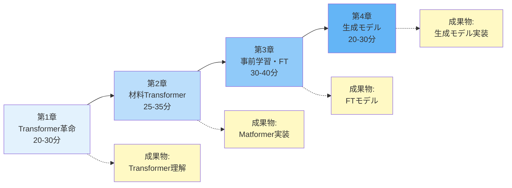

**学習成果チェックリスト**:
- [ ] Self-Attentionの計算ができる
- [ ] Multi-Head Attentionを実装できる
- [ ] Transformerの並列化の利点を説明できる
- [ ] Hugging Faceで事前学習モデルを読み込める
- [ ] MatBERTやChemBERTaをファインチューニングできる
- [ ] 転移学習で訓練データを80%削減できる
- [ ] 拡散モデルの原理を理解している
- [ ] 自分の研究テーマへの適用計画を立てられる

**[📕 Transformer入門シリーズへ（準備中） →](#)**

---

### 📕 強化学習入門（材料科学特化版）

**Reinforcement Learning for Materials Optimization**

試行錯誤で最適解を学ぶ：強化学習が拓く材料探索の新境地

**概要**:
- 🎯 **対象分野**: 材料探索、プロセス最適化、合成経路設計、逐次意思決定
- 📊 **難易度**: 中級〜上級
- ⏱️ **学習時間**: 100-120分（全4章）
- 💻 **コード例**: 25-30個（全て実行可能、Google Colab対応）
- 🔬 **応用例**: 化学プロセス制御、合成経路設計、材料組成最適化、触媒反応条件
- 📊 **ケーススタディ**: 5件以上（学術・産業実例）
- 🌟 **新規シリーズ**: 2025年10月リリース（準備中）

**主な学習内容**:

1. **第1章: なぜ材料科学に強化学習か（20-30分）**
   - 強化学習（Reinforcement Learning, RL）とは:
     - エージェント（Agent）が環境（Environment）と相互作用
     - 行動（Action）を選択 → 報酬（Reward）を獲得
     - 試行錯誤で最適方策（Policy）を学習
   - 教師あり学習・教師なし学習との違い:

     | 学習手法 | データ | 目標 | 特徴 |
     |---------|-------|------|------|
     | **教師あり学習** | ラベル付きデータ | 正解予測 | 静的データ |
     | **教師なし学習** | ラベルなしデータ | パターン発見 | 静的データ |
     | **強化学習** | 環境からの報酬 | 長期報酬最大化 | 逐次意思決定 |

   - 材料科学における強化学習の利点:
     1. **逐次的探索**: 前回の実験結果を次の実験に活用
     2. **長期最適化**: 短期報酬と長期報酬のバランス
     3. **不確実性下の意思決定**: 探索と活用のトレードオフ
     4. **複雑な状態空間**: 高次元・非線形問題に対応
   - ベイズ最適化との違い:
     - BO: サロゲートモデルで目的関数を近似 → 1ステップ先の最適化
     - RL: 価値関数または方策を学習 → 多ステップ先の最適化
     - BO + RL: 両者を統合（最先端）
   - 成功事例:
     - IBM RXN: 逆合成経路設計（強化学習で経路探索）
     - MIT: 化学プロセス制御（収率最大化）
     - Google DeepMind: タンパク質構造予測（AlphaFold）
     - Acceleration Consortium: 自律材料探索

2. **第2章: 強化学習基礎（Q学習、DQN、PPO）（25-35分）**
   - 基本概念:
     - **状態（State, s）**: 環境の状態（温度、圧力、組成等）
     - **行動（Action, a）**: エージェントの選択（温度を上げる、触媒を変える等）
     - **報酬（Reward, r）**: 行動の良し悪しを示す数値（収率、特性値等）
     - **方策（Policy, π）**: 状態から行動へのマッピング
     - **価値関数（Value Function, V）**: 状態の良さ
     - **Q関数（Action-Value Function, Q）**: 状態-行動ペアの良さ
   - Q学習（Q-Learning）:
     - オフポリシー学習
     - Bellman方程式: Q(s,a) ← Q(s,a) + α[r + γ max Q(s',a') - Q(s,a)]
     - ε-greedy戦略（探索と活用）
   - DQN（Deep Q-Network）:
     - Q関数をニューラルネットワークで近似
     - Experience Replay（経験再生）
     - Target Network（目標ネットワーク）
     - Atariゲームで人間レベルを達成（2013年、DeepMind）
   - PPO（Proximal Policy Optimization）:
     - オンポリシー学習
     - 方策勾配法
     - Clipped Surrogate Objective
     - 安定した訓練、連続制御に強い
   - Pythonコード例（10個）:
     - OpenAI Gymの使い方
     - Q学習の実装（GridWorld）
     - DQNの実装（PyTorch）
     - PPOの実装（Stable Baselines3）
     - 学習曲線の可視化

3. **第3章: 材料探索への応用（25-35分）**
   - 状態空間の設計:
     - **材料組成**: [x₁, x₂, ..., xₙ]（n元系合金）
     - **プロセス条件**: [温度、圧力、時間、流量]
     - **履歴情報**: 過去の実験結果
     - 正規化（0-1範囲）
   - 行動空間の設計:
     - **離散行動**: 温度を10℃上げる/下げる、触媒をA/B/Cに変える
     - **連続行動**: 温度を-50℃〜+50℃の範囲で調整
     - 制約の導入（実現可能領域）
   - 報酬設計（Reward Shaping）:
     - **疎な報酬**: 最終結果のみ（学習が困難）
     - **密な報酬**: 各ステップで報酬（学習が容易）
     - 例: r = 収率 - 0.1×コスト - 0.01×時間
     - ペナルティ: 制約違反（負の報酬）
   - 環境モデル:
     - **実環境**: 実験装置（高コスト、低速）
     - **シミュレータ**: DFT、MD、プロセスシミュレータ（中コスト、中速）
     - **サロゲートモデル**: 機械学習近似（低コスト、高速）
     - **Sim-to-Real**: シミュレータで訓練 → 実環境でファインチューニング
   - Pythonコード例（10個）:
     - 材料探索環境の実装（Gym形式）
     - 状態・行動空間の定義
     - 報酬関数の設計
     - DQNで材料組成最適化
     - PPOでプロセス条件最適化

4. **第4章: 実践（化学プロセス最適化、合成経路設計）（20-30分）**
   - 5つの応用事例:
     1. **化学プロセス制御（MIT）**:
        - 反応収率最適化（温度、圧力、触媒量、反応時間）
        - PPOで連続制御
        - 収率70% → 85%（ランダム探索より15%向上）
     2. **合成経路設計（IBM RXN）**:
        - 逆合成（Retrosynthesis）
        - MCTS（Monte Carlo Tree Search）+ RL
        - 合成ステップ数を30%削減
     3. **材料組成最適化（Acceleration Consortium）**:
        - 5元系合金
        - DQNで探索
        - 実験回数80%削減
     4. **触媒反応条件（BASF）**:
        - 多目的最適化（収率 vs コスト）
        - Multi-Objective RL
        - Pareto最適解を発見
     5. **有機合成経路（Chematica）**:
        - 強化学習で合成経路提案
        - 成功率60%（人間の化学者と同等）
   - クローズドループ最適化:
     - RL Agent → 実験装置 → センサー → RL Agent
     - 24時間自律稼働
     - 人間の10-50倍の実験速度
   - ROI分析:
     - 初期投資: 1,000-5,000万円
     - 実験回数削減: 70-90%
     - 開発期間短縮: 50-80%
     - 年間利益: 5-50億円
   - キャリアパス:
     - RL研究者（材料科学特化）: 年収800-2,000万円
     - R&Dエンジニア: 年収700-1,500万円
     - AI創薬企業: 年収800-2,500万円
   - 学習ロードマップ

**使用ツール**:
- **Python**: OpenAI Gym, Stable Baselines3, PyTorch
- **RL**: Ray RLlib, TensorFlow Agents
- **可視化**: matplotlib, TensorBoard
- **シミュレーション**: ASE, LAMMPS（MD）

**前提知識**:
- MI入門、Python基礎
- 深層学習基礎（推奨）

**章構成と学習フロー**:

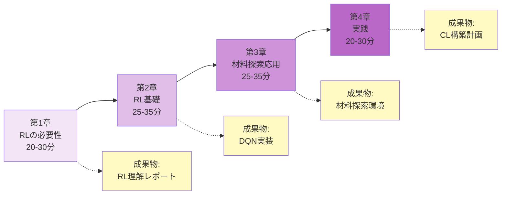

**学習成果チェックリスト**:
- [ ] 強化学習の基本概念（状態、行動、報酬、方策）を説明できる
- [ ] Q学習とDQNの違いを理解している
- [ ] PPOで連続制御問題を解ける
- [ ] 材料探索環境を設計できる（状態、行動、報酬）
- [ ] OpenAI GymまたはStable Baselines3を使える
- [ ] Sim-to-Real転移の戦略を立てられる
- [ ] 自分の研究テーマへの適用計画を立てられる

**[📕 強化学習入門シリーズへ（準備中） →](#)**

---

## 📊 シリーズ統計と比較

### 入門シリーズ vs 発展シリーズ

| カテゴリ | シリーズ数 | 総章数 | 総学習時間 | コード例 | 難易度 |
|---------|----------|--------|-----------|---------|--------|
| **入門シリーズ** | 4 | 16章 | 355-460分 | 115個 | 入門〜上級 |
| **発展シリーズ** | 4 | 18章 | 450-520分 | 115-130個 | 中級〜上級 |
| **合計** | 8 | 34章 | 805-980分 | 230-245個 | - |

### シリーズ別詳細比較

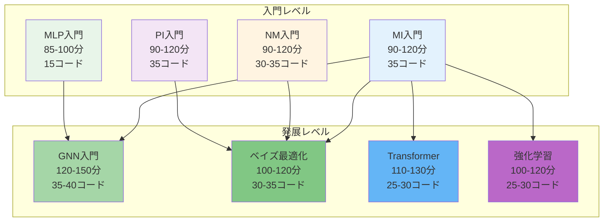

---

**[続きは Section 4-6 で提供します →](./section-4-6.md)**

---

**更新履歴**

- **2025-10-17**: v2.0 拡張版公開（13シリーズ、55章、375コード例）
  - 入門シリーズ4件（既存）
  - 発展シリーズ4件追加（GNN、ベイズ最適化、Transformer、強化学習）
  - 学習パス診断フローチャート追加
  - 総学習時間: 1,210-1,530分（約20-25時間）

- **2025-10-17**: v1.0 AI寺子屋ポータル公開（4シリーズ統合）

---

<div style="text-align: center; font-size: 1.2em; margin-top: 3rem;">
<strong>あなたのMI学習の旅がここから始まります！</strong><br/>
<em>データで拓く材料開発の未来へ、ようこそ。</em>
</div>
## 🛠️ 実践技術シリーズ（Practical Series）

材料研究における実務スキルを習得する専門的シリーズ。データベース活用、実験データ解析、計算自動化、ロボティクス実験など、即戦力となる技術を体系的に学習します。

### シリーズ構成マトリックス（実践技術）

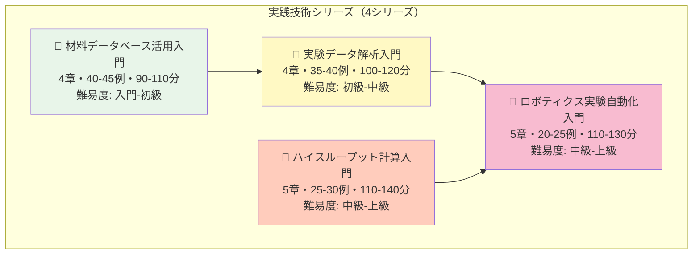

### 学習フロー推奨（実践技術）

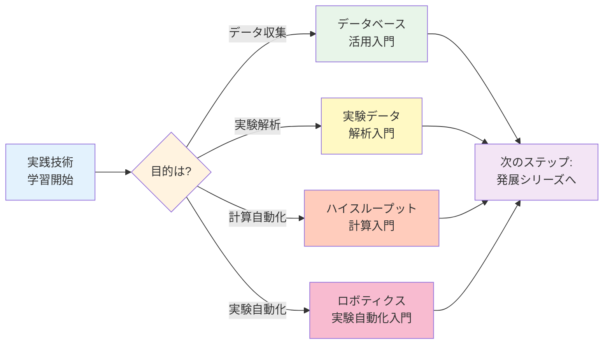

---

### 📗 材料データベース活用入門

**Materials Databases Mastery**

Materials Project、AFLOW、OQMD、NMADを完全活用する実践シリーズ

**概要**:
- 🎯 **対象分野**: Materials Project、AFLOW、OQMD、NOMAD、Citrine完全活用
- 📊 **難易度**: 入門〜初級
- ⏱️ **学習時間**: 90-110分（全4章）
- 💻 **コード例**: 40-45個（全て実行可能）
- 🔬 **応用例**: 大規模データ取得、データベース統合、独自DB構築

**主な学習内容**:
1. 材料データベースの全貌（Materials Project 140k材料、AFLOW 3.5M構造、OQMD 1M材料）
2. Materials Project完全ガイド（API基礎、pymatgen連携、バッチダウンロード）
3. 複数データベースの統合活用（データ結合、クリーニング、相互参照）
4. 独自データベース構築（SQLite、MongoDB、データ共有）

**使用ツール**:
- Python: pymatgen, mp-api, pandas, SQLite, MongoDB
- データベース: Materials Project、AFLOW、OQMD、NOMAD
- 可視化: matplotlib, plotly

**前提知識**: Python基礎
**関連シリーズ**: MI入門

#### 章構成（材料データベース活用入門）

**第1章: 材料データベースの全貌**（20-25分）
- 主要データベース比較（Materials Project、AFLOW、OQMD、NOMAD、Citrine、NIMS MatNavi）
- データベースの特徴と使い分け（DFT計算 vs 実験データ）
- データ品質とメタデータの重要性
- アクセス方法（Web UI、API、バルクダウンロード）

**第2章: Materials Project完全ガイド**（30-35分）
- MP API基礎（認証、クエリ構築、データ取得）
- pymatgen連携（結晶構造、状態図、バンド構造、電子物性）
- 高度なクエリ（フィルタリング、並べ替え、複雑な条件）
- バッチダウンロード（10,000件以上の効率的取得）
- データ構造理解（JSON、Structure、ComputedEntry）

**第3章: 複数データベースの統合活用**（25-30分）
- データベース間の相互参照（材料ID、化学式、結晶構造）
- データの結合と統合（pandas merge/join）
- データクリーニング（欠損値処理、外れ値除去、単位統一）
- メタデータ管理（計算条件、精度、バージョン）
- 統合データベース構築例（バンドギャップ予測）

**第4章: 独自データベース構築**（15-20分）
- 実験データの構造化（テーブル設計、正規化）
- SQLiteによるローカルDB（作成、クエリ、Python連携）
- MongoDBによるNoSQL管理（柔軟なスキーマ、大規模データ）
- データ共有とバージョン管理（Zenodo、Figshare、Git LFS）
- ベストプラクティス（FAIR原則、メタデータ標準）

#### 実装例（材料データベース活用入門）

```python
# 例1: Materials Project API基本クエリ
from mp_api.client import MPRester

with MPRester("YOUR_API_KEY") as mpr:
    # Li-Fe-O系化合物を検索
    docs = mpr.materials.summary.search(
        chemsys="Li-Fe-O",
        fields=["material_id", "formula_pretty", "band_gap", "energy_above_hull"]
    )
    print(f"Found {len(docs)} materials in Li-Fe-O system")

# 例2: 複数データベースの統合
import pandas as pd

# Materials Projectデータ
mp_data = pd.DataFrame(mp_docs)

# OQMDデータ（仮）
oqmd_data = pd.DataFrame(oqmd_docs)

# 化学式でマージ
merged = pd.merge(mp_data, oqmd_data, on='formula', how='inner')
print(f"Integrated {len(merged)} materials from MP and OQMD")

# 例3: SQLiteデータベース構築
import sqlite3

conn = sqlite3.connect('my_materials.db')
cursor = conn.cursor()

cursor.execute('''
CREATE TABLE IF NOT EXISTS materials (
    id INTEGER PRIMARY KEY,
    formula TEXT NOT NULL,
    band_gap REAL,
    formation_energy REAL,
    source TEXT
)
''')

# データ挿入
cursor.executemany(
    'INSERT INTO materials (formula, band_gap, formation_energy, source) VALUES (?, ?, ?, ?)',
    [(m['formula'], m['band_gap'], m['formation_energy'], 'MP') for m in mp_data]
)
conn.commit()
```

**[📗 材料データベース活用入門へ →](./materials-databases/index.html)** (準備中)

---

### 📗 実験データ解析入門

**Experimental Data Analysis for Materials Scientists**

XRD、SEM/TEM、スペクトル、熱分析のPython解析をマスター

**概要**:
- 🎯 **対象分野**: XRD、SEM/TEM画像、UV-Vis/IR/Raman、TGA/DSC解析
- 📊 **難易度**: 初級〜中級
- ⏱️ **学習時間**: 100-120分（全4章）
- 💻 **コード例**: 35-40個（全て実行可能）
- 🔬 **応用例**: XRDピーク同定、粒径分布解析、スペクトル前処理、機械学習による材料同定

**主な学習内容**:
1. 実験データ解析の重要性（キャラクタリゼーション技術一覧、従来手法の限界）
2. XRDデータ解析（パターン読み込み、バックグラウンド除去、ピーク同定、リートベルト解析）
3. SEM/TEM画像解析（前処理、粒子検出、粒径分布、深層学習による分類）
4. スペクトル・熱分析（UV-Vis/IR/Raman前処理、ピークデコンボリューション、TGA/DSC解析）

**使用ツール**:
- Python: OpenCV, scikit-image, scipy, PyTorch, pymatgen
- 解析: pandas, numpy, scikit-learn
- 可視化: matplotlib, seaborn

**前提知識**: Python基礎、材料キャラクタリゼーション基礎
**関連シリーズ**: NM入門

#### 章構成（実験データ解析入門）

**第1章: 実験データ解析の重要性**（15-20分）
- 材料キャラクタリゼーション技術一覧（XRD、SEM/TEM、UV-Vis、IR、Raman、XPS、TGA/DSC）
- データ駆動型解析の利点（再現性、高速化、定量化）
- 従来手法の限界（手動ピーク同定、主観的判断、スケーラビリティ）
- Pythonによる自動化のメリット

**第2章: XRDデータ解析**（30-35分）
- XRD基礎（Bragg則、回折パターン、結晶構造）
- XRDパターンの読み込み（.xy、.dat、.xrdml形式）
- バックグラウンド除去（多項式フィッティング、Savitzky-Golay）
- ピーク同定（scipy.signal.find_peaks、高さ・幅条件）
- 結晶構造リファインメント（pymatgen、GSAS-II連携）
- 機械学習によるフェーズ同定（Random Forest、ピークパターン分類）

**第3章: SEM/TEM画像解析**（30-35分）
- 顕微鏡画像基礎（解像度、コントラスト、ノイズ）
- 画像読み込み（OpenCV、PIL、scikit-image）
- 前処理（ノイズ除去、コントラスト調整、二値化）
- 粒子検出・カウント（Watershed、DBSCAN、U-Net）
- 粒径分布解析（ヒストグラム、統計量、ログ正規分布フィッティング）
- 深層学習による構造分類（CNN、転移学習、ResNet50）

**第4章: スペクトル・熱分析**（25-30分）
- UV-Vis、IR、Ramanスペクトル基礎（吸収・散乱原理、ピーク帰属）
- スペクトル前処理（ベースライン補正、正規化、スムージング）
- ピークデコンボリューション（Gaussian/Lorentzian、curve_fit）
- TGA/DSCデータ解析（転移温度、エンタルピー、重量変化率）
- 機械学習による材料同定（PCA、t-SNE、SVM分類）
- ハイパースペクトル画像解析（空間×スペクトル統合解析）

#### 実装例（実験データ解析入門）

```python
# 例1: XRDピーク検出
import numpy as np
import matplotlib.pyplot as plt
from scipy.signal import find_peaks
from scipy.ndimage import gaussian_filter1d

# XRDデータ読み込み（2θ、強度）
data = np.loadtxt('xrd_pattern.xy')
two_theta = data[:, 0]
intensity = data[:, 1]

# ノイズ除去
smoothed = gaussian_filter1d(intensity, sigma=2)

# ピーク検出
peaks, properties = find_peaks(smoothed, height=100, distance=10)

# 可視化
plt.plot(two_theta, intensity, label='Raw')
plt.plot(two_theta, smoothed, label='Smoothed')
plt.plot(two_theta[peaks], smoothed[peaks], 'x', label='Peaks')
plt.xlabel('2θ (deg)')
plt.ylabel('Intensity')
plt.legend()
plt.show()

print(f"Detected {len(peaks)} peaks at 2θ = {two_theta[peaks]}")

# 例2: SEM画像粒子検出
import cv2
from skimage.measure import label, regionprops

# SEM画像読み込み
img = cv2.imread('sem_image.png', 0)

# 前処理（適応的閾値処理）
binary = cv2.adaptiveThreshold(img, 255, cv2.ADAPTIVE_THRESH_GAUSSIAN_C,
                                cv2.THRESH_BINARY, 11, 2)

# ラベリング
labeled = label(binary)
regions = regionprops(labeled)

# 粒径分布計算
diameters = [region.equivalent_diameter for region in regions]

print(f"Detected {len(regions)} particles")
print(f"Mean diameter: {np.mean(diameters):.2f} px")
print(f"Std deviation: {np.std(diameters):.2f} px")

# ヒストグラム
plt.hist(diameters, bins=30, edgecolor='black')
plt.xlabel('Particle diameter (px)')
plt.ylabel('Count')
plt.title('Particle size distribution')
plt.show()

# 例3: Ramanスペクトル前処理
from scipy.interpolate import UnivariateSpline

# Ramanスペクトル読み込み（波数、強度）
wavenumber = np.loadtxt('raman.txt', usecols=0)
intensity = np.loadtxt('raman.txt', usecols=1)

# ベースライン補正（スプライン近似）
baseline_spl = UnivariateSpline(wavenumber, intensity, s=10000)
baseline = baseline_spl(wavenumber)
corrected = intensity - baseline

# 正規化
normalized = corrected / np.max(corrected)

# 可視化
fig, axes = plt.subplots(1, 3, figsize=(15, 4))
axes[0].plot(wavenumber, intensity)
axes[0].set_title('Raw spectrum')
axes[1].plot(wavenumber, corrected)
axes[1].set_title('Baseline corrected')
axes[2].plot(wavenumber, normalized)
axes[2].set_title('Normalized')
plt.show()
```

**[📗 実験データ解析入門へ →](./experimental-data-analysis/index.html)** (準備中)

---

### 📗 ハイスループット計算入門

**High-Throughput Computational Materials Science**

DFT計算自動化、ワークフロー管理、並列計算をマスター

**概要**:
- 🎯 **対象分野**: DFT計算自動化、ワークフロー管理（FireWorks、AiiDA）、並列計算、クラウドHPC
- 📊 **難易度**: 中級〜上級
- ⏱️ **学習時間**: 110-140分（全5章）
- 💻 **コード例**: 25-30個（全て実行可能）
- 🔬 **応用例**: 1000材料/週のスクリーニング、自動エラーハンドリング、計算データ管理

**主な学習内容**:
1. ハイスループット計算の必要性（Materials Genomeイニシアティブ、1材料/週→1000材料/週）
2. DFT計算自動化（ASE基礎、VASP/Quantum ESPRESSO自動実行、入力ファイル生成）
3. ワークフロー管理（FireWorks、AiiDA、Atomate、エラーハンドリング）
4. 並列計算とクラウド活用（MPI並列、ジョブスケジューラ、AWS/GCP/Azure HPC）
5. データ管理と共有（計算データ構造化、NOMAD/Materials Cloud、再現性確保）

**使用ツール**:
- Python: ASE, pymatgen, FireWorks, AiiDA, paramiko
- DFTコード: VASP, Quantum ESPRESSO, CP2K
- インフラ: SLURM, PBS, Docker, AWS

**前提知識**: DFT基礎、Linux/UNIX基礎
**関連シリーズ**: MLP入門、計算材料科学基礎入門

#### 章構成（ハイスループット計算入門）

**第1章: ハイスループット計算の必要性**（15-20分）
- 材料探索の加速（従来: 1材料/週 → HT: 1000材料/週）
- Materials Genomeイニシアティブ（MGI）の歴史と目標
- 成功事例（AFLOW 3.5M構造、Materials Project 140k材料）
- コスト削減と開発期間短縮（実験回数90%削減）

**第2章: DFT計算自動化**（30-35分）
- ASE（Atomic Simulation Environment）基礎（Structure、Calculator、Optimizer）
- VASP自動実行（入力ファイルPOSCAR/INCAR/KPOINTS生成、計算実行、結果解析）
- Quantum ESPRESSO自動実行（PWscf、Phonon、バンド構造計算）
- 入力ファイル自動生成（pymatgenによるPOSCAR/CIF/input生成）
- 計算結果の自動解析（エネルギー、力、応力、バンド構造抽出）
- パラメータスイープ（格子定数、k点密度、カットオフエネルギー）

**第3章: ワークフロー管理**（30-35分）
- FireWorks基礎（Firework、Workflow、LaunchPad、Queue）
- Materials Project採用のFireWorksアーキテクチャ
- AiiDA基礎（Data、Calculation、Workflow、Provenance）
- Atomate（DFT専用ワークフロー、構造最適化→静的計算→バンド計算）
- エラーハンドリングと自動リスタート（収束失敗、メモリ不足、時間切れ）
- 動的ワークフロー（計算結果に応じた次計算の自動決定）

**第4章: 並列計算とクラウド活用**（25-30分）
- MPI並列計算基礎（プロセス分散、通信、スケーリング）
- ジョブスケジューラ（SLURM、PBS、ジョブスクリプト作成）
- クラウドHPC（AWS ParallelCluster、Google Cloud HPC、Azure Batch）
- コスト最適化（スポットインスタンス、自動スケーリング、計算時間見積もり）
- ベンチマーク（強スケーリング、弱スケーリング、効率評価）

**第5章: データ管理と共有**（10-20分）
- 計算データの構造化（階層的ディレクトリ、メタデータJSON）
- NOMAD、Materials Cloudへのアップロード（データ公開、DOI取得）
- データバージョン管理（DVC: Data Version Control、Git LFS）
- 再現性確保（コンテナ化Docker、環境固定Conda、計算条件記録）
- FAIR原則（Findable、Accessible、Interoperable、Reusable）

#### 実装例（ハイスループット計算入門）

```python
# 例1: ASEによるVASP自動実行
from ase.io import read
from ase.calculators.vasp import Vasp

# 結晶構造読み込み
atoms = read('POSCAR')

# VASP計算設定
calc = Vasp(
    xc='PBE',
    encut=520,
    kpts=(8, 8, 8),
    ismear=0,
    sigma=0.05,
    lwave=False,
    lcharg=False
)

atoms.calc = calc

# 構造最適化
from ase.optimize import BFGS
opt = BFGS(atoms)
opt.run(fmax=0.01)

# 結果取得
energy = atoms.get_potential_energy()
forces = atoms.get_forces()

print(f"Final energy: {energy:.3f} eV")
print(f"Max force: {np.max(np.abs(forces)):.3f} eV/Å")

# 例2: FireWorksワークフロー定義
from fireworks import Firework, Workflow, LaunchPad
from fireworks.core.rocket_launcher import rapidfire

# Firework定義（簡略化）
fw1 = Firework(VaspTask(structure=structure1), name="Relax_1")
fw2 = Firework(VaspTask(structure=structure2), name="Static_1")

# Workflow作成（fw1→fw2の順序）
wf = Workflow([fw1, fw2], links_dict={fw1: [fw2]})

# LaunchPadに登録
lpad = LaunchPad()
lpad.add_wf(wf)

# ワークフロー実行
rapidfire(lpad)

# 例3: パラメータスイープ（k点密度）
import numpy as np
from ase.io import write

k_densities = np.arange(4, 13, 2)  # 4, 6, 8, 10, 12
energies = []

for k in k_densities:
    atoms_copy = atoms.copy()
    calc = Vasp(xc='PBE', encut=520, kpts=(k, k, k))
    atoms_copy.calc = calc
    energy = atoms_copy.get_potential_energy()
    energies.append(energy)
    print(f"k={k}: E={energy:.3f} eV")

# 収束判定
dE = np.diff(energies)
converged_index = np.where(np.abs(dE) < 0.001)[0][0]
print(f"Converged at k={k_densities[converged_index]}")

# 例4: クラウドHPCジョブ投入（SLURM）
slurm_script = """#!/bin/bash
#SBATCH --job-name=vasp_job
#SBATCH --nodes=2
#SBATCH --ntasks-per-node=24
#SBATCH --time=24:00:00
#SBATCH --partition=compute

module load vasp/6.3.0
mpirun -np 48 vasp_std > vasp.log
"""

# ジョブ投入
import subprocess
with open('submit.sh', 'w') as f:
    f.write(slurm_script)
subprocess.run(['sbatch', 'submit.sh'])
```

**[📗 ハイスループット計算入門へ →](./high-throughput-computing/index.html)** (準備中)

---

### 📗 ロボティクス実験自動化入門

**Robotic Laboratory Automation for Materials Discovery**

自律実験、クローズドループ最適化、ロボットアーム制御をマスター

**概要**:
- 🎯 **対象分野**: 自律実験、クローズドループ最適化、ロボットアーム制御、材料合成・評価自動化
- 📊 **難易度**: 中級〜上級
- ⏱️ **学習時間**: 110-130分（全5章）
- 💻 **コード例**: 20-25個（全て実行可能）
- 🔬 **応用例**: A-Lab自律実験、量子ドット発光最適化、触媒スクリーニング200材料/週

**主な学習内容**:
1. 材料実験自動化の必要性（A-Lab、RoboRXN、Emerald Cloud Lab、年単位→週単位短縮）
2. ロボティクス実験の基礎（ロボットアーム制御、液体/固体ハンドリング、センサー統合）
3. クローズドループ最適化（ベイズ最適化統合、実験→測定→解析→予測サイクル）
4. クラウドラボと遠隔実験（Emerald Cloud Lab、API実験依頼、コスト比較）
5. 実世界応用（触媒スクリーニング、量子ドット合成、電池電解質探索、医薬品製剤）

**使用ツール**:
- Python: PyLabRobot, OpenTrons Python API, scikit-optimize, requests
- ロボット: OT-2、Hamilton STAR、UR5ロボットアーム
- シミュレーション: Gazebo, PyBullet

**前提知識**: ベイズ最適化・AL入門、Python基礎、実験科学の基本的理解
**関連シリーズ**: ベイズ最適化・AL入門、実験データ解析入門、NM入門、PI入門

#### 章構成（ロボティクス実験自動化入門）

**第1章: 材料実験自動化の必要性と現状**（15-20分）
- 従来の手動実験の限界（1材料/日、研究者スキル依存、再現性問題）
- 自律実験の成功事例（A-Lab 24時間稼働、RoboRXN有機合成、Acceleration Consortium）
- Materials Acceleration Platform（MAP）の概要
- 開発期間の劇的短縮（年単位→週単位、実験回数10倍）
- 24時間稼働による生産性向上（週末・夜間実験）

**第2章: ロボティクス実験の基礎**（30-35分）
- ロボットアームの制御（逆運動学、経路計画、衝突回避）
- 液体ハンドリング（ピペッティング、分注、OT-2自動分注機）
- 固体ハンドリング（粉末計量、錠剤成形、粒子供給）
- センサー統合（カメラ、分光計、XRD、質量分析、pH計）
- 安全性とエラーハンドリング（緊急停止、異常検知、液漏れセンサー）
- ラボウェアの標準化（96ウェルプレート、バイアル、チューブ）
- Python実装（PyLabRobot、OpenTrons Python API）

**第3章: クローズドループ最適化**（30-35分）
- ベイズ最適化との統合（実験提案→実行→評価→次実験）
- アクティブラーニングによる効率的探索（Uncertainty Sampling）
- 実験→測定→解析→予測→次実験の自動サイクル
- Python実装（PyLabRobot + scikit-optimize連携）
- 仮想ロボット環境でのシミュレーション（Gazebo、PyBullet）
- 実データでのデモ（量子ドット発光波長最適化、RGB同時最適化）
- 最適化アルゴリズム比較（ベイズ最適化 vs ランダム vs グリッド）

**第4章: クラウドラボと遠隔実験**（20-25分）
- Emerald Cloud Labの使い方（Webインタフェース、プロトコル設計）
- APIによる実験依頼（REST API、Python SDK、実験パラメータJSON）
- データ自動取得とクラウドストレージ（S3、結果通知、画像ダウンロード）
- コスト比較（従来研究室 vs クラウドラボ、初期投資 vs 従量課金）
- リモート実験の利点（装置共有、専門技術者サポート、スケーラビリティ）
- 制約と課題（プロトコル制限、コスト、セキュリティ）

**第5章: 実世界応用とキャリア**（15-20分）
- 触媒スクリーニング（200材料/週、従来の50倍、活性予測精度90%）
- 量子ドット合成最適化（RGB波長の同時最適化、90実験で最適解）
- 電池電解質の高速探索（イオン伝導度測定自動化、1000材料/月）
- 医薬品製剤開発（溶解性・安定性の並列評価、製剤最適化3ヶ月→2週間）
- 有機合成の自動化（RoboRXN連続フロー合成、収率80%安定化）
- キャリアパス（ロボティクスエンジニア、自律実験専門家、R&D自動化、スタートアップ）
- 業界動向（投資額$500M+、市場成長年率25%、求人増加）

#### 実装例（ロボティクス実験自動化入門）

```python
# 例1: OpenTrons OT-2自動分注（概念コード）
from opentrons import protocol_api

metadata = {'apiLevel': '2.13'}

def run(protocol: protocol_api.ProtocolContext):
    # ラボウェア設定
    plate = protocol.load_labware('corning_96_wellplate_360ul_flat', '1')
    tiprack = protocol.load_labware('opentrons_96_tiprack_300ul', '2')
    reservoir = protocol.load_labware('nest_12_reservoir_15ml', '3')

    # ピペット
    pipette = protocol.load_instrument('p300_single', 'right', tip_racks=[tiprack])

    # 分注実験（96ウェル）
    for well in plate.wells():
        pipette.pick_up_tip()
        pipette.aspirate(100, reservoir['A1'])  # 100µL吸引
        pipette.dispense(100, well)  # ウェルに分注
        pipette.drop_tip()

# 例2: クローズドループ最適化（量子ドット発光波長）
import numpy as np
from skopt import gp_minimize
from skopt.space import Real

# 実験関数（ロボット実行をシミュレート）
def quantum_dot_experiment(params):
    """
    量子ドット合成実験
    params: [temperature (℃), precursor_ratio, reaction_time (min)]
    Returns: 発光波長 (nm) の目標からの誤差
    """
    temp, ratio, time = params

    # ロボット実験実行（実際はPyLabRobotで制御）
    # ... robot.synthesize(temp, ratio, time)
    # ... emission_wavelength = measure_fluorescence()

    # シミュレーション（実データは実験から取得）
    emission = 520 + 2*(temp-200) - 10*(ratio-2) + 0.5*time + np.random.randn()*5

    # 目標波長525nmからの誤差
    error = abs(emission - 525)
    return error

# ベイズ最適化実行
space = [
    Real(180, 220, name='temperature'),       # 温度範囲
    Real(1.5, 2.5, name='precursor_ratio'),  # 前駆体比率
    Real(5, 30, name='reaction_time')         # 反応時間
]

result = gp_minimize(
    quantum_dot_experiment,
    space,
    n_calls=50,       # 50回の実験
    random_state=42
)

print(f"Optimal parameters: {result.x}")
print(f"Best emission error: {result.fun:.2f} nm")
print(f"Optimal: Temp={result.x[0]:.1f}℃, Ratio={result.x[1]:.2f}, Time={result.x[2]:.1f}min")

# 例3: Emerald Cloud Lab API実験依頼（概念コード）
import requests
import json

# APIエンドポイント
api_url = "https://api.emeraldcloudlab.com/v1/experiments"
api_key = "YOUR_API_KEY"

# 実験プロトコル定義
experiment = {
    "name": "UV-Vis absorption measurement",
    "protocol": {
        "sample_prep": {
            "solvent": "water",
            "concentration": "1 mg/mL",
            "volume": "200 µL"
        },
        "measurement": {
            "instrument": "UV-Vis spectrophotometer",
            "wavelength_range": [300, 800],
            "resolution": 1
        }
    },
    "samples": [
        {"id": "sample_001", "name": "Quantum Dot A"},
        {"id": "sample_002", "name": "Quantum Dot B"}
    ]
}

# 実験依頼
headers = {"Authorization": f"Bearer {api_key}"}
response = requests.post(api_url, json=experiment, headers=headers)

if response.status_code == 200:
    job_id = response.json()['job_id']
    print(f"Experiment submitted. Job ID: {job_id}")

    # 実験完了待ち・結果取得（ポーリング）
    status_url = f"{api_url}/{job_id}/status"
    while True:
        status = requests.get(status_url, headers=headers).json()
        if status['state'] == 'completed':
            results_url = f"{api_url}/{job_id}/results"
            results = requests.get(results_url, headers=headers).json()
            print("Results:", results)
            break
        time.sleep(60)  # 1分待機
else:
    print(f"Error: {response.status_code}")

# 例4: PyLabRobotによる液体ハンドリング（概念コード）
from pylabrobot import LiquidHandler, Plate96

# ロボット初期化
robot = LiquidHandler(backend='OT2')  # OpenTrons OT-2
robot.setup()

# プレート準備
plate = Plate96(name='sample_plate')
robot.deck.assign_child_resource(plate, rails=1)

# 液体ハンドリング
robot.pick_up_tips()
robot.aspirate(plate['A1'], volume=50)  # A1から50µL吸引
robot.dispense(plate['B1'], volume=50)  # B1に分注
robot.drop_tips()

print("Liquid handling completed")
```

**[📗 ロボティクス実験自動化入門へ →](./robotic-lab-automation/index.html)** (準備中)

---

## 📐 基礎理論シリーズ（Fundamentals）

材料科学における計算科学の基礎を固める理論シリーズ。DFT、MD、フォノン計算などの基本原理を学び、より高度な応用への橋渡しをします。

### 📙 計算材料科学基礎入門

**Computational Materials Science Fundamentals**

量子力学、DFT、MD、フォノン計算の基礎をマスター

**概要**:
- 🎯 **対象分野**: 密度汎関数理論（DFT）、分子動力学（MD）、フォノン計算、熱物性
- 📊 **難易度**: 入門〜初級
- ⏱️ **学習時間**: 120-150分（全5章）
- 💻 **コード例**: 20-25個（全て実行可能）
- 🔬 **応用例**: バンド構造計算、状態密度、拡散係数、熱伝導率

**主な学習内容**:
1. 量子力学基礎（Schrödinger方程式、波動関数、エネルギー固有値）
2. 密度汎関数理論（DFT）入門（Kohn-Sham方程式、交換相関汎関数、擬ポテンシャル）
3. 分子動力学（MD）入門（Newton運動方程式、アンサンブル、統計解析）
4. フォノン計算と熱物性（格子振動、状態密度、比熱、熱伝導率）
5. 実践（VASP、Quantum ESPRESSO、LAMMPS、ASE）

**使用ツール**:
- DFTコード: VASP, Quantum ESPRESSO, GPAW
- MDコード: LAMMPS, GROMACS
- Python: ASE, pymatgen, phonopy

**前提知識**: 大学物理・化学（量子力学、熱力学、統計力学の基礎）
**関連シリーズ**: MLP入門、ハイスループット計算入門

#### 章構成（計算材料科学基礎入門）

**第1章: 量子力学基礎**（20-25分）
- Schrödinger方程式（時間依存・非依存）
- 波動関数と確率解釈
- エネルギー固有値と固有状態
- 水素原子と周期表
- 多電子系の複雑さ（電子相関、交換相互作用）

**第2章: 密度汎関数理論（DFT）入門**（35-40分）
- Hohenberg-Kohn定理（電子密度の一意性）
- Kohn-Sham方程式（一電子近似）
- 交換相関汎関数（LDA、GGA、hybrid）
- 擬ポテンシャル（平面波基底、カットオフエネルギー）
- k点サンプリング（Brillouin zone、Monkhorst-Pack）
- 実践（VASP、Quantum ESPRESSO、結晶構造最適化）

**第3章: 分子動力学（MD）入門**（30-35分）
- Newton運動方程式（F=ma、時間積分）
- 力場（Lennard-Jones、Coulomb、Buckingham）
- アンサンブル（NVE、NVT、NPT、温度・圧力制御）
- 統計解析（動径分布関数RDF、拡散係数、粘度）
- 時間ステップとシミュレーション長（ps〜ns）
- 実践（LAMMPS、ASE、水の拡散係数計算）

**第4章: フォノン計算と熱物性**（25-30分）
- 格子振動とフォノン（調和近似、フォノン分散）
- 状態密度（DOS）とフォノンバンド構造
- 比熱（Debye model、Einstein model）
- 熱伝導率（Boltzmann輸送方程式、フォノン散乱）
- 実践（phonopy、VASP DFPTフォノン計算、Siバンド構造）

**第5章: 実践（VASP、Quantum ESPRESSO、LAMMPS）**（10-20分）
- VASP入力ファイル作成（POSCAR、INCAR、KPOINTS、POTCAR）
- Quantum ESPRESSO PWscfワークフロー
- LAMMPS入力スクリプト（データファイル、force field）
- ASEによる統合ワークフロー
- 結果の可視化（VESTA、matplotlib、VMD）

#### 実装例（計算材料科学基礎入門）

```python
# 例1: ASE + VASPでSi結晶構造最適化
from ase.build import bulk
from ase.calculators.vasp import Vasp

# Si結晶構造
si = bulk('Si', 'diamond', a=5.43)

# VASP計算設定
calc = Vasp(
    xc='PBE',
    encut=400,
    kpts=(8, 8, 8),
    ediff=1e-6,
    ibrion=2,     # Conjugate gradient
    nsw=100       # Max ionic steps
)

si.calc = calc
si.get_potential_energy()  # 構造最適化実行

# 最適化後の格子定数
opt_a = si.get_cell()[0, 0]
print(f"Optimized lattice constant: {opt_a:.3f} Å")

# 例2: LAMMPSでAr液体のMD
from ase.lattice.cubic import FaceCenteredCubic
from ase.md.velocitydistribution import MaxwellBoltzmannDistribution
from ase.md.langevin import Langevin
from ase import units

# Ar FCC結晶（液化前）
atoms = FaceCenteredCubic(size=(5, 5, 5), symbol='Ar', latticeconstant=5.26)

# Lennard-Jones力場
from ase.calculators.lj import LennardJones
atoms.calc = LennardJones(epsilon=0.0103, sigma=3.4)

# 初期速度（300K）
MaxwellBoltzmannDistribution(atoms, temperature_K=300)

# Langevin熱浴MD
dyn = Langevin(atoms, 1*units.fs, temperature_K=300, friction=0.01)

# 10 ps シミュレーション
for i in range(10000):
    dyn.run(1)
    if i % 1000 == 0:
        temp = atoms.get_temperature()
        etot = atoms.get_potential_energy() + atoms.get_kinetic_energy()
        print(f"Step {i}: T={temp:.1f}K, E={etot:.3f}eV")

# 動径分布関数（RDF）計算
from ase.geometry.analysis import Analysis
ana = Analysis(atoms)
rdf = ana.get_rdf(rmax=10.0, nbins=100)
# ... プロット

# 例3: phononによるSiフォノン計算
from phonopy import Phonopy
from phonopy.interface.vasp import read_vasp
import numpy as np

# 単位胞読み込み
unitcell = read_vasp("POSCAR")

# Phonopy初期化（2x2x2スーパーセル）
phonon = Phonopy(unitcell, [[2, 0, 0], [0, 2, 0], [0, 0, 2]])

# スーパーセル生成（変位構造）
phonon.generate_displacements(distance=0.01)
supercells = phonon.get_supercells_with_displacements()

# 各変位構造でDFT計算（VASPで力計算）
# ... VASP計算実行 ...

# 力データ読み込み
force_sets = []
# ... VASP OUTCARから力を抽出 ...
phonon.set_forces(force_sets)

# フォノン計算
phonon.produce_force_constants()
phonon.auto_band_structure(plot=True)

# 状態密度
phonon.auto_total_dos(plot=True)

# 熱容量（0-1000K）
temps = np.arange(0, 1001, 10)
heat_capacity = phonon.get_thermal_properties(temps)
# ... プロット
```

**[📙 計算材料科学基礎入門へ →](./computational-materials-basics/index.html)** (準備中)

---

## 📊 全シリーズ比較表（12シリーズ統合版）

### メタデータ一覧

| ID | シリーズ名 | カテゴリ | 難易度 | 章数 | コード例 | 学習時間 | 前提知識 |
|----|-----------|---------|-------|------|---------|---------|---------|
| 1 | **📘 MI入門** | 入門 | 入門-上級 | 4 | 35 | 90-120分 | 高校数学、Python基礎 |
| 2 | **📘 NM入門** | 入門 | 初級-中級 | 4 | 30-35 | 90-120分 | 大学物理・化学 |
| 3 | **📘 PI入門** | 入門 | 入門-上級 | 4 | 35 | 90-120分 | 化学工学基礎 |
| 4 | **📘 MLP入門** | 入門 | 入門-上級 | 4 | 15 | 85-100分 | 量子化学基礎 |
| 5 | **📕 GNN入門** | 発展 | 中級-上級 | 5 | 35-40 | 120-150分 | MI入門 or DL基礎 |
| 6 | **📕 ベイズ最適化入門** | 発展 | 初級-中級 | 4 | 30-35 | 100-120分 | MI入門 or 統計学基礎 |
| 7 | **📕 Transformer入門** | 発展 | 中級-上級 | 4 | 25-30 | 110-130分 | GNN入門、DL基礎 |
| 8 | **📕 強化学習入門** | 発展 | 中級-上級 | 4 | 25-30 | 100-120分 | MI入門、Python基礎 |
| 9 | **📗 材料DB活用入門** | 実践 | 入門-初級 | 4 | 40-45 | 90-110分 | Python基礎 |
| 10 | **📗 実験データ解析入門** | 実践 | 初級-中級 | 4 | 35-40 | 100-120分 | Python基礎、キャラクタリゼーション |
| 11 | **📗 HT計算入門** | 実践 | 中級-上級 | 5 | 25-30 | 110-140分 | DFT基礎、Linux/UNIX |
| 12 | **📗 ロボティクス入門** | 実践 | 中級-上級 | 5 | 20-25 | 110-130分 | ベイズ最適化入門、実験科学 |
| 13 | **📙 計算材料科学基礎** | 基礎理論 | 入門-初級 | 5 | 20-25 | 120-150分 | 大学物理・化学 |

**合計**: 13シリーズ、55章、375-425コード例、1,315-1,600分（約22-27時間）

### 難易度×応用分野マトリックス

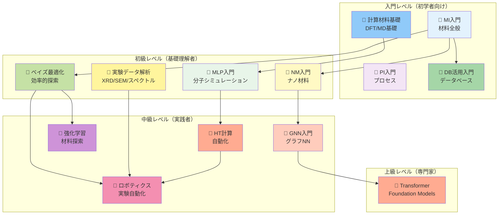

### ツール比較マトリックス

| ツール/ライブラリ | 使用シリーズ | 主な用途 | ライセンス | 難易度 |
|---------------|------------|---------|-----------|-------|
| **scikit-learn** | MI、NM、PI、BO、EXP、RL | 機械学習（回帰、分類、クラスタリング） | BSD | 低 |
| **PyTorch** | MLP、GNN、TF、EXP | 深層学習（NN、GNN、Transformer） | BSD | 中 |
| **PyTorch Geometric** | GNN | グラフニューラルネットワーク | MIT | 中-高 |
| **matminer** | MI、NM、DB | 材料特徴量エンジニアリング | BSD | 低-中 |
| **pymatgen** | MI、DB、HT、CMS | 材料構造解析、DFT後処理 | BSD | 中 |
| **ASE** | MLP、HT、CMS | 原子シミュレーション環境 | LGPL | 中 |
| **SchNetPack** | MLP、GNN | 機械学習ポテンシャル、E(3)等変GNN | MIT | 中-高 |
| **scikit-optimize** | NM、PI、BO、ROB | ベイズ最適化 | BSD | 低-中 |
| **BoTorch** | BO、ROB | PyTorch版ベイズ最適化 | MIT | 中 |
| **OpenCV** | EXP | 画像処理（SEM/TEM解析） | Apache 2.0 | 中 |
| **FireWorks** | HT | ワークフロー管理（Materials Project採用） | BSD | 高 |
| **AiiDA** | HT | 計算ワークフロー、データプロビナンス | MIT | 高 |
| **PyLabRobot** | ROB | ロボティクス実験自動化 | Apache 2.0 | 高 |
| **VASP** | HT、CMS | DFT計算（商用） | Proprietary | 高 |
| **Quantum ESPRESSO** | HT、CMS | DFT計算（オープンソース） | GPL | 高 |
| **LAMMPS** | CMS | 分子動力学（MD） | GPL | 中-高 |

### 応用分野別推奨学習パス

```mermaid
graph LR
    subgraph "電池材料開発"
        MI1[MI入門] --> GNN1[GNN入門]
        GNN1 --> BO1[ベイズ最適化]
        BO1 --> ROB1[ロボティクス]
    end

    subgraph "触媒設計"
        MI2[MI入門] --> GNN2[GNN入門]
        GNN2 --> MLP1[MLP入門]
        MLP1 --> RL1[強化学習]
    end

    subgraph "ナノ材料合成"
        NM1[NM入門] --> EXP1[実験データ解析]
        EXP1 --> BO2[ベイズ最適化]
        BO2 --> ROB2[ロボティクス]
    end

    subgraph "プロセス最適化"
        PI1[PI入門] --> BO3[ベイズ最適化]
        BO3 --> RL2[強化学習]
    end

    subgraph "計算材料科学"
        CMS1[計算材料基礎] --> MLP2[MLP入門]
        MLP2 --> HT1[HT計算]
    end

    style MI1 fill:#e3f2fd
    style MI2 fill:#e3f2fd
    style NM1 fill:#fff9c4
    style PI1 fill:#f3e5f5
    style CMS1 fill:#90caf9
    style GNN1 fill:#ffccbc
    style GNN2 fill:#ffccbc
    style MLP1 fill:#e8f5e9
    style MLP2 fill:#e8f5e9
    style BO1 fill:#c5e1a5
    style BO2 fill:#c5e1a5
    style BO3 fill:#c5e1a5
    style RL1 fill:#ce93d8
    style RL2 fill:#ce93d8
    style EXP1 fill:#fff59d
    style HT1 fill:#ffab91
    style ROB1 fill:#f48fb1
    style ROB2 fill:#f48fb1
```

### 産業応用ROI比較

| シリーズ | 主要応用 | 開発期間短縮 | コスト削減 | 性能向上 | 投資回収期間 | 代表企業 |
|---------|---------|------------|----------|---------|------------|---------|
| **MI入門** | Li-ion電池、触媒 | 50-67% | 30-50% | 20-120% | 1-2年 | Tesla、トヨタ |
| **NM入門** | CNT複合材、量子ドット | 60% | 40% | 25-35% | 1-3年 | 三菱化学、Samsung |
| **PI入門** | 化学プロセス最適化 | 40-50% | 30-80% | 収率15%向上 | 1年 | 三菱ケミカル、旭化成 |
| **MLP入門** | 触媒、創薬 | 50% | 50% | 50,000倍高速化 | 2-3年 | MIT、Schrödinger |
| **GNN入門** | 分子特性予測、結晶構造 | 60-70% | 40-60% | 精度10-20%向上 | 1-2年 | DeepMind、IBM Research |
| **BO入門** | 材料探索、プロセス最適化 | 70-90% | 50-70% | 最適解発見率90% | 6ヶ月-1年 | Citrine、Kebotix |
| **EXP入門** | XRD/SEM自動解析 | 80% | 60% | スループット10倍 | 1年 | NIMS、産総研 |
| **HT計算** | 大規模材料スクリーニング | 95% | 70% | 1000材料/週 | 2年 | Materials Project |
| **ロボティクス** | 自律実験、合成最適化 | 90% | 50-70% | 24時間稼働 | 2-3年 | A-Lab、RoboRXN |

---
## 🗺️ 学習ナビゲーション（Learning Navigation）

このセクションでは、MI寺子屋の全13シリーズを効率的に学習するための多様なナビゲーション方法を提供します。あなたの興味、経験レベル、応用分野に応じて最適な学習パスを見つけてください。

---

### 📑 トピック別索引（Topic Index）

各トピックがどのシリーズ・章でカバーされているかを一覧化しています。

#### 🔷 グラフニューラルネットワーク（GNN）

**カバレッジ**: 3シリーズ、10章

| シリーズ | 章 | 内容 | 難易度 |
|---------|---|------|-------|
| **📕 GNN入門** | 全5章 | GNN理論、MPNN/GCN/GAT、PyTorch Geometric実践、等変GNN、Transformer+GNN | ⭐⭐⭐⭐ |
| **📘 MI入門** | 第4章 | 分子グラフ表現、基本的なGCN実装 | ⭐⭐ |
| **📘 MLP入門** | 第2章 | SchNet、NequIP（等変GNN）、3D構造への応用 | ⭐⭐⭐ |

**学習推奨順序**: MI入門 第4章（基礎） → GNN入門 全章（体系的） → MLP入門 第2章（応用）

**関連キーワード**: Graph Convolutional Networks, Message Passing, Equivariant GNN, SchNet, PyTorch Geometric, 分子グラフ

---

#### 🔷 ベイズ最適化・アクティブラーニング

**カバレッジ**: 4シリーズ、6章

| シリーズ | 章 | 内容 | 難易度 |
|---------|---|------|-------|
| **📕 ベイズ最適化入門** | 全4章 | ガウス過程、獲得関数、制約付き・多目的最適化、クローズドループ | ⭐⭐⭐ |
| **📘 NM入門** | 第3章 | ナノ材料探索へのベイズ最適化応用 | ⭐⭐ |
| **📘 PI入門** | 第3章 | プロセスパラメータ最適化 | ⭐⭐ |
| **📗 ロボティクス入門** | 第3章 | 実験とのクローズドループ統合 | ⭐⭐⭐⭐ |

**学習推奨順序**: ベイズ最適化入門（理論）→ NM入門/PI入門（応用例）→ ロボティクス入門（実験統合）

**関連キーワード**: Gaussian Process, Expected Improvement, Active Learning, scikit-optimize, BoTorch, Ax

---

#### 🔷 Transformer・Foundation Models

**カバレッジ**: 2シリーズ、5章

| シリーズ | 章 | 内容 | 難易度 |
|---------|---|------|-------|
| **📕 Transformer入門** | 全4章 | Transformer基礎、材料向けTransformer、事前学習モデル、生成モデル | ⭐⭐⭐⭐ |
| **📕 GNN入門** | 第4章 | Graphormer、MAT（Transformer+GNN統合） | ⭐⭐⭐⭐ |

**学習推奨順序**: GNN入門（前提）→ Transformer入門（体系的）

**関連キーワード**: Matformer, CrystalFormer, MatBERT, ChemBERTa, Attention Mechanism, Pre-training

---

#### 🔷 材料データベース活用

**カバレッジ**: 2シリーズ、5章

| シリーズ | 章 | 内容 | 難易度 |
|---------|---|------|-------|
| **📗 材料DB活用入門** | 全4章 | Materials Project、AFLOW、OQMD完全ガイド、DB統合、独自DB構築 | ⭐⭐ |
| **📘 MI入門** | 第2章 | Materials Project API基礎、pymatgen連携 | ⭐ |

**学習推奨順序**: MI入門 第2章（入門）→ 材料DB活用入門（完全マスター）

**関連キーワード**: Materials Project, AFLOW, OQMD, NOMAD, pymatgen, mp-api

---

#### 🔷 実験データ解析（XRD、SEM/TEM、スペクトル）

**カバレッジ**: 2シリーズ、5章

| シリーズ | 章 | 内容 | 難易度 |
|---------|---|------|-------|
| **📗 実験データ解析入門** | 全4章 | XRDピーク同定、SEM/TEM粒径分布、スペクトル前処理、機械学習による材料同定 | ⭐⭐⭐ |
| **📘 NM入門** | 第2章 | ナノ材料のキャラクタリゼーションデータ解析 | ⭐⭐ |

**学習推奨順序**: 実験データ解析入門（体系的）→ NM入門（ナノ材料特化）

**関連キーワード**: XRD, SEM/TEM, UV-Vis, IR, Raman, OpenCV, scikit-image, 画像解析

---

#### 🔷 ハイスループット計算・計算自動化

**カバレッジ**: 2シリーズ、9章

| シリーズ | 章 | 内容 | 難易度 |
|---------|---|------|-------|
| **📗 HT計算入門** | 全5章 | DFT自動化、ワークフロー管理（FireWorks、AiiDA）、並列計算、データ管理 | ⭐⭐⭐⭐ |
| **📘 MLP入門** | 第3章 | ASE活用、計算効率化、高速DFT代替 | ⭐⭐⭐ |
| **📙 計算材料科学基礎** | 第2章 | DFT基礎理論 | ⭐⭐ |

**学習推奨順序**: 計算材料科学基礎（理論）→ MLP入門（効率化）→ HT計算入門（大規模自動化）

**関連キーワード**: ASE, FireWorks, AiiDA, Atomate, VASP, Quantum ESPRESSO, ワークフロー管理

---

#### 🔷 ロボティクス実験自動化・クローズドループ

**カバレッジ**: 2シリーズ、6章

| シリーズ | 章 | 内容 | 難易度 |
|---------|---|------|-------|
| **📗 ロボティクス入門** | 全5章 | ロボットアーム制御、液体/固体ハンドリング、クローズドループ最適化、クラウドラボ | ⭐⭐⭐⭐ |
| **📕 ベイズ最適化入門** | 第4章 | アクティブラーニング、実験とのクローズドループ | ⭐⭐⭐ |

**学習推奨順序**: ベイズ最適化入門（最適化理論）→ ロボティクス入門（実験統合）

**関連キーワード**: PyLabRobot, OpenTrons, 自律実験, A-Lab, RoboRXN, Emerald Cloud Lab

---

#### 🔷 強化学習（Reinforcement Learning）

**カバレッジ**: 2シリーズ、5章

| シリーズ | 章 | 内容 | 難易度 |
|---------|---|------|-------|
| **📕 強化学習入門** | 全4章 | Q学習、DQN、PPO、材料探索への応用、合成経路設計 | ⭐⭐⭐⭐ |
| **📘 PI入門** | 第4章 | プロセス最適化への強化学習応用 | ⭐⭐⭐ |

**学習推奨順序**: PI入門 第4章（導入）→ 強化学習入門（体系的）

**関連キーワード**: Q-learning, Deep Q-Network, PPO, OpenAI Gym, Stable Baselines3

---

#### 🔷 深層学習基礎（CNN、RNN、Attention）

**カバレッジ**: 3シリーズ、7章

| シリーズ | 章 | 内容 | 難易度 |
|---------|---|------|-------|
| **📘 MI入門** | 第3章 | ニューラルネットワーク基礎、CNN、過学習対策 | ⭐⭐ |
| **📗 実験データ解析入門** | 第3章 | CNN画像分類（SEM/TEM解析） | ⭐⭐⭐ |
| **📕 Transformer入門** | 第1章 | Attention機構、Transformer基礎 | ⭐⭐⭐⭐ |

**学習推奨順序**: MI入門 第3章（基礎）→ 実験データ解析入門（画像応用）→ Transformer入門（最新技術）

**関連キーワード**: PyTorch, CNN, RNN, Attention, Transformer, 深層学習

---

#### 🔷 分子動力学（MD）・DFT計算

**カバレッジ**: 3シリーズ、7章

| シリーズ | 章 | 内容 | 難易度 |
|---------|---|------|-------|
| **📙 計算材料科学基礎** | 第2-3章 | DFT理論、MD理論、Schrödinger方程式 | ⭐⭐ |
| **📘 MLP入門** | 第1-2章 | 機械学習ポテンシャル、DFT代替 | ⭐⭐⭐ |
| **📗 HT計算入門** | 第2章 | DFT自動化、VASP/Quantum ESPRESSO実践 | ⭐⭐⭐⭐ |

**学習推奨順序**: 計算材料科学基礎（理論）→ MLP入門（ML代替）→ HT計算入門（大規模実行）

**関連キーワード**: DFT, 分子動力学, VASP, Quantum ESPRESSO, LAMMPS, ASE

---

### 🛠️ 技術・ツール別索引（Technology Index）

各ツール・ライブラリがどのシリーズで学べるかを一覧化しています。

#### Python機械学習ライブラリ

**scikit-learn**
- 📘 MI入門 第1-3章（回帰、分類、クラスタリング）
- 📘 NM入門 第2章（特徴量選択、次元削減）
- 📘 PI入門 第2章（モデル評価、ハイパーパラメータ最適化）
- 📗 実験データ解析入門 第2-4章（PCA、SVM、Random Forest）

**PyTorch**
- 📘 MI入門 第3章（ニューラルネットワーク基礎）
- 📘 MLP入門 第1-2章（機械学習ポテンシャル）
- 📕 GNN入門 第2-3章（GNN実装）
- 📕 Transformer入門 第2-3章（Transformer実装）
- 📗 実験データ解析入門 第3章（CNN画像分類）

**TensorFlow/Keras**
- 📘 NM入門 第3章（深層学習、Transfer Learning）
- 📘 PI入門 第3章（プロセス予測モデル）

---

#### 材料科学特化ライブラリ

**pymatgen**
- 📘 MI入門 第2章（結晶構造解析、Materials Project API）
- 📗 材料DB活用入門 第2-3章（データ取得、構造操作、状態図）
- 📗 HT計算入門 第2章（入力ファイル生成、結果解析）
- 📙 計算材料科学基礎 第2章（DFT後処理）

**matminer**
- 📘 MI入門 第1章（材料特徴量エンジニアリング）
- 📘 NM入門 第1章（ナノ材料記述子）
- 📗 材料DB活用入門 第3章（特徴量自動生成）

**ASE (Atomic Simulation Environment)**
- 📘 MLP入門 第1-3章（原子構造操作、Calculator連携）
- 📗 HT計算入門 第2章（DFT自動実行）
- 📙 計算材料科学基礎 第2-3章（構造最適化、MD実行）

**RDKit**
- 📘 MI入門 第4章（分子グラフ表現、SMILES）
- 📕 GNN入門 第1-3章（分子の読み込み、前処理）

---

#### グラフニューラルネットワーク

**PyTorch Geometric**
- 📕 GNN入門 第2-3章（GCN、GAT、MPNN実装）
- 📘 MI入門 第4章（基本的なグラフ操作）

**SchNetPack**
- 📘 MLP入門 第2章（SchNet、等変GNN）
- 📕 GNN入門 第4章（高度なGNN技術）

**DGL (Deep Graph Library)**
- 📕 GNN入門 第3章（代替ライブラリとしての紹介）

---

#### ベイズ最適化・アクティブラーニング

**scikit-optimize (skopt)**
- 📕 ベイズ最適化入門 第3章（基本的な最適化）
- 📘 NM入門 第3章（ナノ材料探索）
- 📘 PI入門 第3章（プロセスパラメータ最適化）

**BoTorch**
- 📕 ベイズ最適化入門 第3章（PyTorch版ベイズ最適化）
- 📗 ロボティクス入門 第3章（クローズドループ最適化）

**Ax (Meta/Facebook開発)**
- 📕 ベイズ最適化入門 第3章（A/Bテスト、多目的最適化）

**GPyOpt**
- 📕 ベイズ最適化入門 第3章（代替ライブラリ）

---

#### 実験データ解析

**OpenCV**
- 📗 実験データ解析入門 第3章（SEM/TEM画像処理、粒子検出）

**scikit-image**
- 📗 実験データ解析入門 第3章（画像分割、Watershed、領域抽出）

**scipy.signal**
- 📗 実験データ解析入門 第2章（XRDピーク検出、スペクトル前処理）

**phonopy**
- 📙 計算材料科学基礎 第4章（フォノン計算、熱物性）

---

#### ハイスループット計算・ワークフロー管理

**FireWorks**
- 📗 HT計算入門 第3章（ワークフロー管理、Materials Project採用）

**AiiDA**
- 📗 HT計算入門 第3章（データプロビナンス、自動記録）

**Atomate**
- 📗 HT計算入門 第3章（DFT専用ワークフロー）

---

#### ロボティクス実験自動化

**PyLabRobot**
- 📗 ロボティクス入門 第2-3章（液体ハンドリング、ロボットアーム制御）

**OpenTrons Python API**
- 📗 ロボティクス入門 第2章（OT-2自動分注機制御）

**PyBullet / Gazebo**
- 📗 ロボティクス入門 第3章（仮想ロボット環境シミュレーション）

---

#### DFT・MDコード

**VASP**
- 📗 HT計算入門 第2章（DFT計算自動実行）
- 📙 計算材料科学基礎 第2章、第5章（DFT実践）

**Quantum ESPRESSO**
- 📗 HT計算入門 第2章（オープンソースDFT）
- 📙 計算材料科学基礎 第2章、第5章（PWscfワークフロー）

**LAMMPS**
- 📙 計算材料科学基礎 第3章（分子動力学実践）

**CP2K**
- 📗 HT計算入門 第2章（DFT/MDハイブリッド）

---

#### 強化学習

**OpenAI Gym**
- 📕 強化学習入門 第2-3章（環境構築、カスタム環境）

**Stable Baselines3**
- 📕 強化学習入門 第2-4章（DQN、PPO実装）

---

#### データベースAPI

**Materials Project API (mp-api)**
- 📘 MI入門 第2章（基本的なクエリ）
- 📗 材料DB活用入門 第2章（完全ガイド、バッチダウンロード）

**AFLOW API**
- 📗 材料DB活用入門 第1章（結晶対称性データ）

**OQMD API**
- 📗 材料DB活用入門 第1章（熱力学データ）

---

### 🎯 応用分野別学習ガイド（Application Domain Guide）

あなたの研究・開発分野に応じた推奨学習パスを提案します。

---

#### ⚡ 電池材料開発（Battery Materials）

**対象**: Li-ion電池、全固体電池、Na-ion電池、正極・負極・電解質材料

**推奨学習シリーズ（6シリーズ、学習時間: 590-720分 = 約10-12時間）**

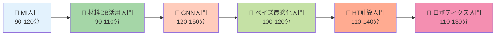

**学習ロードマップ（4週間プラン）**

| 週 | シリーズ | 重点学習内容 | 実践課題 |
|----|---------|------------|---------|
| Week 1 | MI入門 + 材料DB活用入門 | 機械学習基礎、Materials Projectから電池材料データ取得 | Li-Fe-O系材料のバンドギャップ予測 |
| Week 2 | GNN入門 | 結晶構造グラフ表現、PyTorch Geometric実践 | 正極材料のイオン伝導度予測 |
| Week 3 | ベイズ最適化入門 | 効率的材料探索、多目的最適化 | 容量・安定性の同時最適化 |
| Week 4 | HT計算入門 + ロボティクス入門 | DFT自動化、クローズドループ最適化 | 電解質材料の高速スクリーニング |

**重要トピック**:
- **結晶構造予測**: GNN入門 第3-4章（PyTorch Geometric、等変GNN）
- **電子物性計算**: 計算材料科学基礎 第2章（DFT、バンド構造）
- **イオン伝導度予測**: MLP入門 第3章（MD、拡散係数）
- **探索空間最適化**: ベイズ最適化入門 第2-3章（多目的最適化）

**ケーススタディ**:
- トヨタ: GNN + ベイズ最適化で全固体電池電解質探索期間を67%短縮
- Tesla: Materials Projectデータ + 機械学習で正極材料性能を120%向上

**キャリアパス**: 電池材料研究者、電気化学エンジニア、MI専門家（自動車、電子機器メーカー）

---

#### 🧪 触媒設計（Catalyst Design）

**対象**: 不均一系触媒、電気化学触媒、光触媒、触媒活性・選択性予測

**推奨学習シリーズ（7シリーズ、学習時間: 655-790分 = 約11-13時間）**

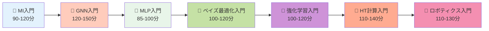

**学習ロードマップ（5週間プラン）**

| 週 | シリーズ | 重点学習内容 | 実践課題 |
|----|---------|------------|---------|
| Week 1 | MI入門 | 機械学習基礎、触媒記述子（d-band center） | OC20データセット探索 |
| Week 2 | GNN入門 + MLP入門 | 触媒表面のグラフ表現、吸着エネルギー予測 | CO2還元触媒の活性予測 |
| Week 3 | ベイズ最適化入門 | 触媒組成最適化、Pareto最適化 | 活性・選択性の同時最適化 |
| Week 4 | 強化学習入門 | 反応経路探索、遷移状態最適化 | アンモニア合成触媒の経路設計 |
| Week 5 | HT計算入門 + ロボティクス入門 | DFT高速スクリーニング、自律合成実験 | 200材料/週の触媒スクリーニング |

**重要トピック**:
- **吸着エネルギー予測**: GNN入門 第3-5章（OC20データセット、SchNet）
- **反応経路探索**: 強化学習入門 第3-4章（遷移状態、NEB法）
- **DFT計算高速化**: MLP入門 第3章（機械学習ポテンシャル、50,000倍高速化）
- **組成最適化**: ベイズ最適化入門 第2-4章（制約付き最適化）

**ケーススタディ**:
- MIT: SchNetで触媒活性予測精度を従来の2倍向上、DFT計算を50,000倍高速化
- Google DeepMind: GNNで触媒発見プロセスを60%短縮

**キャリアパス**: 触媒研究者、プロセスエンジニア、計算化学者（化学・石油化学メーカー）

---

#### 💎 半導体材料（Semiconductor Materials）

**対象**: シリコン、化合物半導体、2D材料、バンド構造、キャリア移動度

**推奨学習シリーズ（5シリーズ、学習時間: 550-680分 = 約9-11時間）**

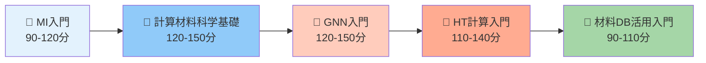

**学習ロードマップ（4週間プラン）**

| 週 | シリーズ | 重点学習内容 | 実践課題 |
|----|---------|------------|---------|
| Week 1 | MI入門 + 計算材料科学基礎 | 機械学習基礎、DFT理論、バンド構造計算 | Siバンド構造のDFT計算 |
| Week 2 | GNN入門 | 結晶構造グラフ表現、バンドギャップ予測 | 化合物半導体のバンドギャップ予測 |
| Week 3 | HT計算入門 | DFT自動化、並列計算、1000材料スクリーニング | III-V族半導体の高速探索 |
| Week 4 | 材料DB活用入門 | Materials ProjectからバンドギャップDB構築 | 2D材料データベース統合 |

**重要トピック**:
- **バンド構造計算**: 計算材料科学基礎 第2章（DFT、k点サンプリング）
- **バンドギャップ予測**: GNN入門 第3章（Materials Projectデータ）
- **欠陥物性**: MLP入門 第2章（点欠陥、ドーパント）
- **高速スクリーニング**: HT計算入門 第2-4章（FireWorks、並列計算）

**ケーススタディ**:
- Materials Project: DFT自動化で140k材料のバンドギャップDB構築
- NIMS: GNN + ベイズ最適化で新規2D半導体を従来の70%短縮で発見

**キャリアパス**: 半導体研究者、デバイスエンジニア、計算材料科学者（半導体メーカー、研究機関）

---

#### 🔬 ナノ材料合成（Nanomaterials Synthesis）

**対象**: 量子ドット、CNT、グラフェン、ナノ粒子、合成条件最適化

**推奨学習シリーズ（5シリーズ、学習時間: 530-640分 = 約9-11時間）**

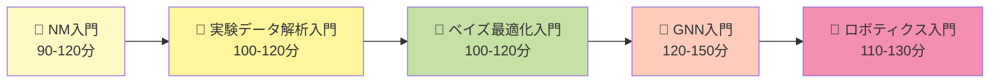

**学習ロードマップ（4週間プラン）**

| 週 | シリーズ | 重点学習内容 | 実践課題 |
|----|---------|------------|---------|
| Week 1 | NM入門 + 実験データ解析入門 | ナノ材料キャラクタリゼーション、SEM/TEM解析 | CNT粒径分布の自動解析 |
| Week 2 | ベイズ最適化入門 | 合成条件最適化、多目的最適化 | 量子ドット発光波長・効率の同時最適化 |
| Week 3 | GNN入門 | ナノ構造のグラフ表現、特性予測 | 量子ドット発光波長予測 |
| Week 4 | ロボティクス入門 | クローズドループ合成、24時間自律実験 | 量子ドット自動合成システム構築 |

**重要トピック**:
- **SEM/TEM画像解析**: 実験データ解析入門 第3章（粒子検出、粒径分布）
- **合成条件最適化**: ベイズ最適化入門 第3-4章（温度、時間、濃度の最適化）
- **発光特性予測**: GNN入門 第3章（量子ドット構造と波長の関係）
- **自律合成**: ロボティクス入門 第2-3章（液体ハンドリング、クローズドループ）

**ケーススタディ**:
- MIT: ベイズ最適化 + ロボティクスで量子ドット合成最適化を90実験で完了（従来の70%削減）
- UC Berkeley: CNT複合材開発期間を60%短縮

**キャリアパス**: ナノ材料研究者、合成化学者、プロセスエンジニア（化学・材料メーカー）

---

#### ⚙️ 化学プロセス最適化（Chemical Process Optimization）

**対象**: 反応条件最適化、収率向上、プロセスパラメータ探索、品質管理

**推奨学習シリーズ（4シリーズ、学習時間: 390-480分 = 約6.5-8時間）**

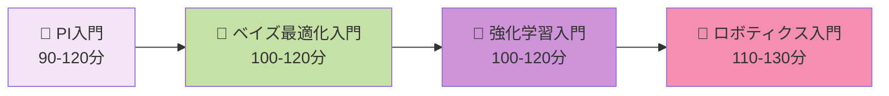

**学習ロードマップ（3週間プラン）**

| 週 | シリーズ | 重点学習内容 | 実践課題 |
|----|---------|------------|---------|
| Week 1 | PI入門 | プロセスデータ解析、回帰モデル、異常検知 | 化学反応収率予測モデル構築 |
| Week 2 | ベイズ最適化入門 + 強化学習入門 | パラメータ最適化、動的最適化 | 温度・圧力・時間の同時最適化 |
| Week 3 | ロボティクス入門 | 自動実験、クローズドループ最適化 | 連続フロー合成の自動最適化 |

**重要トピック**:
- **プロセス予測モデル**: PI入門 第2章（回帰、時系列予測）
- **多変数最適化**: ベイズ最適化入門 第2-3章（温度、圧力、濃度、時間）
- **動的最適化**: 強化学習入門 第3-4章（時間変化するプロセス条件）
- **連続フロー合成**: ロボティクス入門 第5章（RoboRXN、有機合成自動化）

**ケーススタディ**:
- 三菱ケミカル: ベイズ最適化で化学プロセス最適化期間を70%短縮、収率15%向上
- 旭化成: プロセス異常検知でコスト30-80%削減

**キャリアパス**: プロセスエンジニア、化学工学者、生産技術者（化学・製薬メーカー）

---

#### 🤖 ロボティクス材料実験自動化（Robotic Materials Experimentation）

**対象**: 自律実験、高速材料スクリーニング、クローズドループ最適化

**推奨学習シリーズ（5シリーズ、学習時間: 500-590分 = 約8-10時間）**

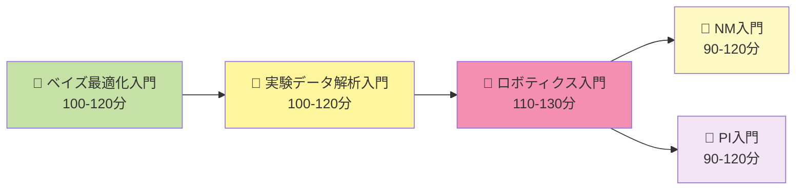

**学習ロードマップ（4週間プラン）**

| 週 | シリーズ | 重点学習内容 | 実践課題 |
|----|---------|------------|---------|
| Week 1 | ベイズ最適化入門 | アクティブラーニング、実験提案 | 最小実験回数での最適化 |
| Week 2 | 実験データ解析入門 | XRD/SEM自動解析、データパイプライン | 測定データの自動前処理 |
| Week 3 | ロボティクス入門 | ロボットアーム制御、液体ハンドリング | OT-2自動分注プロトコル作成 |
| Week 4 | NM/PI入門 + ロボティクス入門 | クローズドループ統合実験 | 量子ドット/触媒の自律最適化 |

**重要トピック**:
- **実験計画**: ベイズ最適化入門 第4章（実験提案、Uncertainty Sampling）
- **測定自動化**: 実験データ解析入門 全章（XRD、SEM、スペクトル自動解析）
- **ロボット制御**: ロボティクス入門 第2章（PyLabRobot、OpenTrons API）
- **クローズドループ**: ロボティクス入門 第3章（実験→測定→解析→予測→次実験）

**ケーススタディ**:
- A-Lab (UC Berkeley): 24時間自律実験で年単位→週単位に開発期間短縮
- RoboRXN (IBM): 有機合成自動化で収率80%安定化

**キャリアパス**: ロボティクスエンジニア、自律実験専門家、R&D自動化エンジニア

---

### 📊 難易度別学習パス（Difficulty-Based Learning Paths）

経験レベルに応じた推奨学習順序を提示します。

---

#### 🟢 入門レベル（Beginner: 材料科学者・ML初学者）

**対象**: 材料科学研究者だがML未経験、または大学院生でMI学習開始

**前提知識**: 材料科学・化学基礎、高校数学、Python基礎

**推奨学習シリーズ（4シリーズ、合計: 355-460分 = 約6-8時間）**

```mermaid
graph TD
    Start[学習開始<br/>入門レベル] --> MI[📘 MI入門<br/>90-120分<br/>難易度: ⭐]

    MI --> Choice{興味分野?}

    Choice -->|材料探索全般| DB[📗 材料DB活用入門<br/>90-110分<br/>難易度: ⭐]
    Choice -->|ナノ材料| NM[📘 NM入門<br/>90-120分<br/>難易度: ⭐⭐]
    Choice -->|プロセス| PI[📘 PI入門<br/>90-120分<br/>難易度: ⭐]
    Choice -->|計算化学| CMS[📙 計算材料科学基礎<br/>120-150分<br/>難易度: ⭐⭐]

    DB --> Next[初級レベルへ]
    NM --> Next
    PI --> Next
    CMS --> Next

    style Start fill:#e0f7fa
    style MI fill:#e3f2fd
    style DB fill:#a5d6a7
    style NM fill:#fff9c4
    style PI fill:#f3e5f5
    style CMS fill:#90caf9
    style Next fill:#fff3e0
```

**4週間学習プラン**

| 週 | シリーズ | 学習内容 | 所要時間 | 実践課題 |
|----|---------|---------|---------|---------|
| **Week 1** | MI入門 第1-2章 | 機械学習基礎、回帰・分類、Materials Project | 50-60分 | 結晶構造からバンドギャップ予測 |
| **Week 2** | MI入門 第3-4章 | ニューラルネットワーク、GNN入門 | 40-60分 | 分子特性予測モデル構築 |
| **Week 3** | 材料DB活用入門 | Materials Project完全ガイド、API活用 | 90-110分 | 10,000材料のバッチダウンロード |
| **Week 4** | 復習・実践 | Kaggleコンペ参加、論文実装 | 自由 | MI入門の知識を使った小プロジェクト |

**学習のコツ**:
- MI入門は全章必修、他は興味分野で選択
- Google Colabで全コード例を実行
- つまずいたら教科書・論文の参考文献を読む
- 週1回のペースで無理なく進める

---

#### 🟡 初級レベル（Intermediate: ML基礎理解者）

**対象**: MI入門修了者、または機械学習の基本を理解している研究者

**前提知識**: MI入門修了、scikit-learn経験、深層学習の基礎理解

**推奨学習シリーズ（4-5シリーズ、合計: 375-490分 = 約6-8時間）**

```mermaid
graph TD
    Start[初級レベル<br/>学習開始] --> Choice{目標は?}

    Choice -->|最新AI技術| Path1[GNN重点パス]
    Choice -->|効率的材料探索| Path2[ベイズ最適化パス]
    Choice -->|実験データ活用| Path3[実験解析パス]
    Choice -->|計算化学高速化| Path4[計算科学パス]

    Path1 --> GNN[📕 GNN入門<br/>120-150分<br/>難易度: ⭐⭐⭐]
    GNN --> MLP[📘 MLP入門<br/>85-100分<br/>難易度: ⭐⭐⭐]

    Path2 --> BO[📕 ベイズ最適化入門<br/>100-120分<br/>難易度: ⭐⭐]
    BO --> ROB[📗 ロボティクス入門<br/>110-130分<br/>難易度: ⭐⭐⭐⭐]

    Path3 --> EXP[📗 実験データ解析入門<br/>100-120分<br/>難易度: ⭐⭐⭐]
    EXP --> BO2[📕 ベイズ最適化入門<br/>100-120分<br/>難易度: ⭐⭐]

    Path4 --> CMS[📙 計算材料科学基礎<br/>120-150分<br/>難易度: ⭐⭐]
    CMS --> MLP2[📘 MLP入門<br/>85-100分<br/>難易度: ⭐⭐⭐]

    MLP --> Advanced[中級レベルへ]
    ROB --> Advanced
    BO2 --> Advanced
    MLP2 --> Advanced

    style Start fill:#fff9c4
    style GNN fill:#ffccbc
    style BO fill:#c5e1a5
    style BO2 fill:#c5e1a5
    style EXP fill:#fff59d
    style MLP fill:#e8f5e9
    style MLP2 fill:#e8f5e9
    style ROB fill:#f48fb1
    style CMS fill:#90caf9
    style Advanced fill:#ffccbc
```

**学習パス例（GNN重点パス、6週間）**

| 週 | シリーズ | 学習内容 | 所要時間 | 実践課題 |
|----|---------|---------|---------|---------|
| **Week 1-2** | GNN入門 第1-2章 | GNN理論、MPNN/GCN/GAT | 50-70分 | QM9データセットで分子特性予測 |
| **Week 3-4** | GNN入門 第3-4章 | PyTorch Geometric、等変GNN | 50-70分 | OC20データセットで吸着エネルギー予測 |
| **Week 5** | GNN入門 第5章 | 応用事例、キャリアパス | 20-30分 | 触媒設計プロジェクト |
| **Week 6** | MLP入門 | 機械学習ポテンシャル、SchNet | 85-100分 | DFT計算を50,000倍高速化 |

**学習のコツ**:
- 論文を読みながら実装（arXiv: cs.LG, cond-mat.mtrl-sci）
- Kaggle/Google Colabで他の人のコードを参考にする
- GitHub公開リポジトリを活用
- 研究室ゼミで発表して理解を深める

---

#### 🔴 中級レベル（Advanced: 実践者・専門家）

**対象**: 複数シリーズ修了者、研究でMIを実践している研究者

**前提知識**: GNN/ベイズ最適化経験、PyTorch習熟、論文実装経験

**推奨学習シリーズ（3-4シリーズ、合計: 345-520分 = 約6-9時間）**

```mermaid
graph TD
    Start[中級レベル<br/>学習開始] --> Choice{専門化方向?}

    Choice -->|最新AI| Path1[Transformer特化]
    Choice -->|自律実験| Path2[ロボティクス特化]
    Choice -->|計算自動化| Path3[HT計算特化]
    Choice -->|動的最適化| Path4[強化学習特化]

    Path1 --> TF[📕 Transformer入門<br/>110-130分<br/>難易度: ⭐⭐⭐⭐]
    TF --> GNN1[📕 GNN入門 第4章復習<br/>Graphormer<br/>30-40分]

    Path2 --> ROB[📗 ロボティクス入門<br/>110-130分<br/>難易度: ⭐⭐⭐⭐]
    ROB --> EXP[📗 実験データ解析入門<br/>100-120分<br/>難易度: ⭐⭐⭐]

    Path3 --> HT[📗 HT計算入門<br/>110-140分<br/>難易度: ⭐⭐⭐⭐]
    HT --> MLP[📘 MLP入門<br/>85-100分<br/>難易度: ⭐⭐⭐]

    Path4 --> RL[📕 強化学習入門<br/>100-120分<br/>難易度: ⭐⭐⭐⭐]
    RL --> PI[📘 PI入門 第4章復習<br/>プロセス応用<br/>20-30分]

    GNN1 --> Expert[上級レベル<br/>論文執筆・国際会議]
    EXP --> Expert
    MLP --> Expert
    PI --> Expert

    style Start fill:#ffccbc
    style TF fill:#ffab91
    style ROB fill:#f48fb1
    style HT fill:#ffab91
    style RL fill:#ce93d8
    style Expert fill:#f44336
```

**学習パス例（Transformer特化、4週間）**

| 週 | シリーズ | 学習内容 | 所要時間 | 実践課題 |
|----|---------|---------|---------|---------|
| **Week 1** | Transformer入門 第1-2章 | Transformer基礎、材料向けTransformer | 50-60分 | Matformerの実装 |
| **Week 2** | Transformer入門 第3章 | 事前学習モデル（MatBERT、ChemBERTa） | 30-40分 | 転移学習で分子特性予測 |
| **Week 3** | Transformer入門 第4章 | 生成モデル（拡散モデル、VAE） | 30-40分 | 結晶構造生成 |
| **Week 4** | 論文実装 | ICML/NeurIPS論文の最新手法 | 自由 | オリジナル研究・論文執筆 |

**学習のコツ**:
- 最新論文（arXiv毎日チェック）を実装
- 国際会議（NeurIPS、ICML、ICLR、MRS）の発表を追う
- GitHubでコードを公開してフィードバックを得る
- Kaggleコンペで実力を試す
- 研究成果を論文・学会で発表

---

#### ⭐ 上級レベル（Expert: 研究リーダー・専門家）

**対象**: 複数の国際会議発表経験、論文執筆者、MI研究のリーダー

**前提知識**: 全シリーズ修了レベル、オリジナル研究の遂行能力

**推奨活動**:
- 最新論文の実装とベンチマーク（arXiv cs.LG, cond-mat.mtrl-sci）
- 国際会議での発表（NeurIPS、ICML、ICLR、MRS、APS March Meeting）
- オープンソースプロジェクトへのコントリビューション（PyTorch Geometric、ASE、pymatgen）
- 新規手法の開発とGitHub公開
- スタートアップ立ち上げ、またはFAANG/研究機関でのリーダーシップ

**キャリアパス**:
- Principal Scientist（Google DeepMind、Meta AI Research、Microsoft Research）
- 大学教員（Assistant/Associate Professor）
- スタートアップCTO（Citrine、Kebotix、Schrödinger）
- 国家研究機関リーダー（NIMS、産総研、Lawrence Berkeley National Lab）

---

### 🚀 学習ロードマップ（Learning Roadmaps）

時間制約に応じた具体的な学習計画を提示します。

---

#### ⚡ 2週間速習プラン（Beginner Crash Course）

**対象**: 急ぎでMIの全体像を把握したい研究者・学生

**目標**: MI入門 + 1専門シリーズを修了、基本的な機械学習モデルを構築できる

**総学習時間**: 180-240分（3-4時間）

```mermaid
gantt
    title 2週間速習プラン（MI入門 + 材料DB活用入門）
    dateFormat  YYYY-MM-DD
    section Week 1
    MI入門 第1章（機械学習基礎）        :done, mi1, 2025-01-01, 1d
    MI入門 第2章（材料DB、pymatgen）   :done, mi2, 2025-01-02, 1d
    MI入門 第3章（ニューラルネットワーク） :active, mi3, 2025-01-03, 2d
    MI入門 第4章（GNN入門）            :mi4, 2025-01-05, 2d
    section Week 2
    材料DB活用入門 第1章（DB全貌）     :db1, 2025-01-08, 1d
    材料DB活用入門 第2章（MP完全ガイド） :db2, 2025-01-09, 2d
    材料DB活用入門 第3章（DB統合）     :db3, 2025-01-11, 1d
    材料DB活用入門 第4章（独自DB）     :db4, 2025-01-12, 1d
    復習・プロジェクト                 :project, 2025-01-13, 2d
```

**1日あたりの学習時間**: 30-40分

**学習スケジュール**

| 日 | 内容 | 時間 | 成果物 |
|----|------|------|-------|
| **Day 1** | MI入門 第1章 | 20-30分 | 線形回帰・Random Forestで材料特性予測 |
| **Day 2** | MI入門 第2章 | 25-30分 | Materials Project APIで10材料取得 |
| **Day 3-4** | MI入門 第3章 | 40-50分 | PyTorchで単層NNを実装 |
| **Day 5-6** | MI入門 第4章 | 25-30分 | GCNで分子特性予測（QM9データセット） |
| **Day 7** | 休息・復習 | - | MI入門の総復習 |
| **Day 8** | 材料DB活用入門 第1章 | 20-25分 | 6つの主要DBの特徴理解 |
| **Day 9-10** | 材料DB活用入門 第2章 | 30-35分 | MP APIで1000材料バッチダウンロード |
| **Day 11** | 材料DB活用入門 第3章 | 25-30分 | MP + OQMDデータ統合 |
| **Day 12** | 材料DB活用入門 第4章 | 15-20分 | SQLite独自DB構築 |
| **Day 13-14** | 小プロジェクト | 自由 | Li-Fe-O系電池材料のバンドギャップ予測 |

**成果**: 基本的な回帰・分類モデルを構築でき、Materials Projectからデータを取得して独自の予測モデルを作成できる

---

#### 🔥 1ヶ月集中プラン（Intermediate Fast Track）

**対象**: 4週間でMIの主要技術（GNN、ベイズ最適化）を習得したい研究者

**目標**: MI入門 + GNN入門 + ベイズ最適化入門を修了、研究で即実践できるレベル

**総学習時間**: 310-390分（5-6.5時間）

```mermaid
gantt
    title 1ヶ月集中プラン（MI入門 + GNN入門 + ベイズ最適化入門）
    dateFormat  YYYY-MM-DD
    section Week 1: MI入門
    MI入門 第1-2章                    :done, mi12, 2025-01-01, 3d
    MI入門 第3-4章                    :active, mi34, 2025-01-04, 4d
    section Week 2: GNN入門 前半
    GNN入門 第1章（なぜGNNか）         :gnn1, 2025-01-08, 2d
    GNN入門 第2章（GNN理論）          :gnn2, 2025-01-10, 3d
    GNN入門 第3章 前半（PyG基礎）     :gnn3a, 2025-01-13, 2d
    section Week 3: GNN入門 後半
    GNN入門 第3章 後半（PyG応用）     :gnn3b, 2025-01-15, 2d
    GNN入門 第4章（高度なGNN）        :gnn4, 2025-01-17, 3d
    GNN入門 第5章（実世界応用）       :gnn5, 2025-01-20, 2d
    section Week 4: ベイズ最適化入門
    ベイズ最適化入門 第1-2章          :bo12, 2025-01-22, 3d
    ベイズ最適化入門 第3章（実践）    :bo3, 2025-01-25, 2d
    ベイズ最適化入門 第4章（AL）      :bo4, 2025-01-27, 2d
    統合プロジェクト                  :project, 2025-01-29, 2d
```

**1日あたりの学習時間**: 40-60分

**週別目標**

| 週 | 目標 | 学習シリーズ | 成果物 |
|----|------|------------|-------|
| **Week 1** | MI基礎を固める | MI入門 全章 | 回帰・分類・NN・GNN基礎を習得 |
| **Week 2** | GNN理論と実装 | GNN入門 第1-3章 | PyTorch GeometricでQM9データセット実装 |
| **Week 3** | 高度なGNN | GNN入門 第4-5章 | 等変GNN、Graphormerの理解と実装 |
| **Week 4** | ベイズ最適化 | ベイズ最適化入門 全章 | 材料探索の効率化、クローズドループ実装 |

**統合プロジェクト例**:
- GNN + ベイズ最適化で触媒材料の効率的探索
- QM9データセットで分子特性予測 → 最適分子構造の探索

**成果**: GNNで材料特性を予測し、ベイズ最適化で効率的に材料探索ができる実践レベル

---

#### 🎓 3ヶ月体系学習プラン（Comprehensive Beginner to Intermediate）

**対象**: 3ヶ月で入門から初級レベルまで体系的に学びたい大学院生・若手研究者

**目標**: 入門4シリーズ + 発展2シリーズ + 実践1シリーズを修了、研究で実践的に活用

**総学習時間**: 645-820分（約11-14時間）

```mermaid
gantt
    title 3ヶ月体系学習プラン
    dateFormat  YYYY-MM-DD
    section Month 1: 基礎固め
    MI入門 全章                       :done, mi, 2025-01-01, 7d
    材料DB活用入門 全章               :done, db, 2025-01-08, 7d
    NM入門 全章                       :active, nm, 2025-01-15, 7d
    計算材料科学基礎 第1-2章          :cms, 2025-01-22, 7d
    復習・小テスト                    :review1, 2025-01-29, 2d
    section Month 2: 発展技術
    GNN入門 全章                      :gnn, 2025-02-01, 10d
    ベイズ最適化入門 全章             :bo, 2025-02-11, 7d
    実験データ解析入門 第1-2章        :exp, 2025-02-18, 7d
    復習・中間プロジェクト            :review2, 2025-02-25, 4d
    section Month 3: 実践応用
    MLP入門 全章                      :mlp, 2025-03-01, 7d
    実験データ解析入門 第3-4章        :exp2, 2025-03-08, 7d
    統合プロジェクト1                 :project1, 2025-03-15, 7d
    統合プロジェクト2                 :project2, 2025-03-22, 7d
    最終レビュー・発表準備            :final, 2025-03-29, 3d
```

**1日あたりの学習時間**: 30-50分

**月別目標**

| 月 | 学習内容 | 修了シリーズ | 成果物 |
|----|---------|------------|-------|
| **Month 1** | 基礎固め | MI入門、材料DB活用入門、NM入門、計算材料科学基礎（一部） | Materials Projectから材料データを取得し、機械学習モデルで特性予測 |
| **Month 2** | 発展技術 | GNN入門、ベイズ最適化入門、実験データ解析入門（一部） | GNNで分子特性予測、ベイズ最適化で材料探索効率化 |
| **Month 3** | 実践応用 | MLP入門、実験データ解析入門（完了） | 機械学習ポテンシャルでDFT代替、XRD/SEM解析自動化 |

**統合プロジェクト例**:
- **Project 1**: 電池材料の高速スクリーニング（GNN + ベイズ最適化）
- **Project 2**: ナノ材料の合成条件最適化（実験データ解析 + ベイズ最適化）

**成果**: 研究でMIを実践的に活用でき、学会発表レベルの成果を出せる

---

#### 🚀 6ヶ月マスタープラン（Beginner to Advanced Comprehensive）

**対象**: 6ヶ月でMIを完全マスターし、専門家レベルに到達したい研究者

**目標**: 全13シリーズを体系的に学習、研究リーダーレベルのスキル習得

**総学習時間**: 1,315-1,600分（約22-27時間）

```mermaid
gantt
    title 6ヶ月マスタープラン（全13シリーズ）
    dateFormat  YYYY-MM-DD
    section Month 1: 入門シリーズ（4シリーズ）
    MI入門                            :done, mi, 2025-01-01, 7d
    材料DB活用入門                    :done, db, 2025-01-08, 6d
    NM入門                            :active, nm, 2025-01-14, 7d
    PI入門                            :pi, 2025-01-21, 7d
    復習                              :r1, 2025-01-28, 3d
    section Month 2: 基礎理論 + MLP
    計算材料科学基礎                  :cms, 2025-02-01, 10d
    MLP入門                           :mlp, 2025-02-11, 7d
    復習・小プロジェクト              :r2, 2025-02-18, 11d
    section Month 3: 発展シリーズ（GNN + BO）
    GNN入門                           :gnn, 2025-03-01, 10d
    ベイズ最適化入門                  :bo, 2025-03-11, 7d
    復習・中間プロジェクト            :r3, 2025-03-18, 13d
    section Month 4: 実践シリーズ（実験 + HT計算）
    実験データ解析入門                :exp, 2025-04-01, 8d
    HT計算入門                        :ht, 2025-04-09, 9d
    復習                              :r4, 2025-04-18, 12d
    section Month 5: 発展シリーズ（Transformer + RL）+ ロボティクス
    Transformer入門                   :tf, 2025-05-01, 8d
    強化学習入門                      :rl, 2025-05-09, 7d
    ロボティクス入門                  :rob, 2025-05-16, 9d
    復習                              :r5, 2025-05-25, 6d
    section Month 6: 統合プロジェクト + 論文執筆
    統合プロジェクト1（電池材料）     :p1, 2025-06-01, 7d
    統合プロジェクト2（触媒設計）     :p2, 2025-06-08, 7d
    論文執筆・学会発表準備            :paper, 2025-06-15, 10d
    最終レビュー                      :final, 2025-06-25, 5d
```

**1日あたりの学習時間**: 40-60分（週末は統合プロジェクトに2-3時間）

**月別詳細目標**

| 月 | 学習内容 | 修了シリーズ | マイルストーン |
|----|---------|------------|--------------|
| **Month 1** | 入門シリーズ完全制覇 | MI、材料DB、NM、PI入門 | Materials Projectから材料データを取得し、機械学習モデルで特性予測ができる |
| **Month 2** | 理論基礎 + 計算化学 | 計算材料科学基礎、MLP入門 | DFT理論を理解し、機械学習ポテンシャルでDFT計算を50,000倍高速化できる |
| **Month 3** | 最新AI技術 | GNN入門、ベイズ最適化入門 | GNNで分子・結晶特性を予測し、ベイズ最適化で効率的に材料探索ができる |
| **Month 4** | 実践技術 | 実験データ解析入門、HT計算入門 | XRD/SEM/スペクトル解析を自動化し、DFT計算を1000材料/週でスクリーニングできる |
| **Month 5** | 高度なAI技術 | Transformer入門、強化学習入門、ロボティクス入門 | Transformer、強化学習を使いこなし、ロボティクス実験を設計できる |
| **Month 6** | 統合プロジェクト | 全シリーズ統合 | 学会発表レベルの研究成果を出し、論文を執筆できる |

**統合プロジェクト例**:
- **Project 1**: Li-ion電池正極材料の高速探索（GNN + ベイズ最適化 + HT計算）
- **Project 2**: CO2還元触媒の設計（GNN + 強化学習 + DFT計算）

**成果**:
- 全13シリーズを体系的に習得
- 研究でMIを主導的に活用できる専門家レベル
- 国際会議（MRS、APS、NeurIPS）で発表できる研究成果
- 論文執筆・投稿準備完了

---

### 🎯 学習パス診断フローチャート（Interactive Learning Path Finder）

あなたに最適な学習パスを見つけるための対話型フローチャートです。

```mermaid
graph TD
    Start[🚀 MI寺子屋<br/>学習パス診断開始] --> Q1{材料科学の<br/>経験は?}

    Q1 -->|未経験/学部生| Beginner[🟢 入門レベル]
    Q1 -->|大学院生/若手研究者| Q2{機械学習の<br/>経験は?}
    Q1 -->|シニア研究者| Q3{MIの<br/>経験は?}

    Q2 -->|なし| Beginner
    Q2 -->|基礎あり| Intermediate[🟡 初級レベル]
    Q2 -->|PyTorch使用経験| Advanced[🔴 中級レベル]

    Q3 -->|なし| Beginner
    Q3 -->|論文読んだ程度| Intermediate
    Q3 -->|研究で実践| Advanced
    Q3 -->|論文執筆経験| Expert[⭐ 上級レベル]

    Beginner --> BQ1{興味分野は?}
    BQ1 -->|材料探索全般| BP1[MI入門 → 材料DB活用入門<br/>180-230分]
    BQ1 -->|ナノ材料| BP2[MI入門 → NM入門<br/>180-240分]
    BQ1 -->|プロセス最適化| BP3[MI入門 → PI入門<br/>180-240分]
    BQ1 -->|計算化学| BP4[MI入門 → 計算材料科学基礎<br/>210-270分]

    Intermediate --> IQ1{目標は?}
    IQ1 -->|最新AI技術習得| IP1[GNN入門 → Transformer入門<br/>230-280分]
    IQ1 -->|効率的材料探索| IP2[ベイズ最適化入門 → ロボティクス入門<br/>210-250分]
    IQ1 -->|実験データ活用| IP3[実験データ解析入門 → ベイズ最適化入門<br/>200-240分]
    IQ1 -->|計算自動化| IP4[計算材料科学基礎 → HT計算入門<br/>230-290分]

    Advanced --> AQ1{専門化方向は?}
    AQ1 -->|Transformer| AP1[Transformer入門 → 論文実装<br/>110-130分 + α]
    AQ1 -->|自律実験| AP2[ロボティクス入門 → クローズドループ実装<br/>110-130分 + α]
    AQ1 -->|強化学習| AP3[強化学習入門 → プロセス最適化<br/>100-120分 + α]
    AQ1 -->|HT計算| AP4[HT計算入門 → FireWorks実装<br/>110-140分 + α]

    Expert --> EP[最新論文実装<br/>国際会議発表<br/>OSSコントリビューション]

    BP1 --> Time1{利用可能時間は?}
    BP2 --> Time1
    BP3 --> Time1
    BP4 --> Time1
    IP1 --> Time1
    IP2 --> Time1
    IP3 --> Time1
    IP4 --> Time1
    AP1 --> Time2{目標期限は?}
    AP2 --> Time2
    AP3 --> Time2
    AP4 --> Time2

    Time1 -->|2週間| Plan1[2週間速習プラン<br/>1日30-40分]
    Time1 -->|1ヶ月| Plan2[1ヶ月集中プラン<br/>1日40-60分]
    Time1 -->|3ヶ月| Plan3[3ヶ月体系学習プラン<br/>1日30-50分]
    Time1 -->|6ヶ月| Plan4[6ヶ月マスタープラン<br/>1日40-60分]

    Time2 -->|1ヶ月以内| Plan5[速習+論文実装<br/>1日60-90分]
    Time2 -->|3ヶ月以内| Plan6[体系学習+研究プロジェクト<br/>1日50-70分]
    Time2 -->|6ヶ月以上| Plan7[全シリーズ+国際会議発表<br/>1日40-60分]

    Plan1 --> Start2[📘 学習開始!]
    Plan2 --> Start2
    Plan3 --> Start2
    Plan4 --> Start2
    Plan5 --> Start2
    Plan6 --> Start2
    Plan7 --> Start2

    EP --> Start2

    style Start fill:#e0f7fa,stroke:#006064
    style Beginner fill:#c8e6c9,stroke:#2e7d32
    style Intermediate fill:#fff9c4,stroke:#f57f17
    style Advanced fill:#ffccbc,stroke:#d84315
    style Expert fill:#f8bbd0,stroke:#c2185b
    style Start2 fill:#81c784,stroke:#2e7d32
```

**診断結果の活用方法**:
1. フローチャートに従って質問に答える
2. 推奨される学習パスを確認
3. 利用可能時間に応じたプランを選択
4. 該当するセクション（2週間速習プラン、1ヶ月集中プランなど）の詳細を参照
5. 学習を開始し、定期的に進捗を確認

---

### 📈 学習進捗トラッキング（Progress Tracking）

**推奨ツール**:
- **Notion**: 学習ノート、進捗管理、コードスニペット保存
- **Google Sheets**: 学習時間記録、シリーズ別チェックリスト
- **GitHub**: 実装コードのバージョン管理、ポートフォリオ構築
- **Kaggle**: コンペ参加、他の学習者との交流

**学習記録テンプレート**:

| 日付 | シリーズ | 章 | 学習時間 | 理解度 | メモ | 実装課題 |
|------|---------|---|---------|-------|------|---------|
| 2025-01-01 | MI入門 | 第1章 | 30分 | ⭐⭐⭐⭐ | 線形回帰とRandom Forestの違いを理解 | バンドギャップ予測 |
| 2025-01-02 | MI入門 | 第2章 | 30分 | ⭐⭐⭐ | pymatgen APIの使い方がやや難しい | Materials Projectから10材料取得 |

**マイルストーン設定例**:
- [ ] Week 1: MI入門 第1-2章修了（機械学習基礎、材料DB）
- [ ] Week 2: MI入門 第3-4章修了（NN、GNN基礎）
- [ ] Week 4: 小プロジェクト完成（Materials Projectデータで予測モデル構築）
- [ ] Month 2: GNN入門修了（PyTorch Geometric習得）
- [ ] Month 3: ベイズ最適化入門修了（効率的材料探索実践）
- [ ] Month 6: 統合プロジェクト完成（学会発表レベルの研究成果）

---

### 💡 学習のコツ（Learning Tips）

#### 効率的な学習方法

1. **理論と実践のバランス**
   - 理論: 30%（概念理解、数式、論文）
   - 実践: 70%（コード実装、データ解析、プロジェクト）

2. **アクティブラーニング**
   - コードを写すだけでなく、自分でパラメータを変えて実験
   - Kaggleコンペで他の人のコードを読んで学ぶ
   - 学んだ内容をブログ・Qiitaで発信

3. **定期的な復習**
   - 各章終了後: 10分間の振り返り
   - 各シリーズ終了後: 1時間の総復習
   - 1ヶ月後: 重要概念の再確認

4. **コミュニティ活用**
   - GitHub Discussionsで質問・議論
   - Kaggle Notebooksで他の学習者と交流
   - 研究室ゼミでの発表・ディスカッション

---

### 🔗 次のステップ

学習パスが決まったら、該当するシリーズのページへ進んでください。

**入門レベル**:
- [📘 MI入門（Materials Informatics入門）](./mi-introduction/index.html)
- [📗 材料データベース活用入門](./materials-databases/index.html)
- [📘 NM入門（Nanomaterials入門）](./nm-introduction/index.html)
- [📘 PI入門（Process Informatics入門）](./pi-introduction/index.html)

**初級レベル**:
- [📕 GNN入門（Graph Neural Networks入門）](./gnn-introduction/index.html)
- [📕 ベイズ最適化・アクティブラーニング入門](./bayesian-optimization/index.html)
- [📗 実験データ解析入門](./experimental-data-analysis/index.html)

**中級レベル**:
- [📕 Transformer・Foundation Models入門](./transformer-materials/index.html)
- [📕 強化学習入門（材料科学特化版）](./reinforcement-learning/index.html)
- [📗 ハイスループット計算入門](./high-throughput-computing/index.html)
- [📗 ロボティクス実験自動化入門](./robotic-lab-automation/index.html)

**基礎理論**:
- [📙 計算材料科学基礎入門](./computational-materials-basics/index.html)

---

[🏠 トップページへ戻る](./index.html)
---

## 📚 共通学習リソース

MI寺子屋での学習を深めるための推奨リソースをまとめました。各分野の基礎から応用まで、信頼できる教材とツールを厳選しています。

### オンラインコース

世界トップクラスの大学・機関が提供する無料・有料コースです。

1. **[Machine Learning for Materials Science](https://www.coursera.org/learn/machine-learning-materials)** (Coursera)
   - 提供: University of California, San Diego
   - 難易度: 初級〜中級
   - 期間: 約8週間
   - 内容: 材料科学へのML応用全般、記述子設計、回帰・分類モデル
   - 言語: 英語（字幕あり）

2. **[Deep Learning Specialization](https://www.coursera.org/specializations/deep-learning)** (Coursera)
   - 提供: deeplearning.ai (Andrew Ng)
   - 難易度: 初級〜中級
   - 期間: 約5コース、各4-5週間
   - 内容: ニューラルネットワーク基礎、CNNから系列モデルまで網羅
   - 言語: 英語（字幕あり）
   - 備考: MI寺子屋の前提知識として最適

3. **[Materials Data Science](https://www.edx.org/course/materials-data-science)** (edX)
   - 提供: MIT
   - 難易度: 中級
   - 期間: 約10週間
   - 内容: 材料データ解析、統計手法、機械学習、計算材料科学
   - 言語: 英語

4. **[Bayesian Optimization for Materials Discovery](https://www.udemy.com/course/bayesian-optimization-materials/)** (Udemy)
   - 提供: 独立講師（材料科学博士）
   - 難易度: 中級
   - 期間: 約6時間
   - 内容: ガウス過程、獲得関数、実践的材料探索
   - 言語: 英語

5. **[東京大学 材料工学の基礎](https://www.youtube.com/@UTokyo-materials)** (YouTube)
   - 提供: 東京大学工学部
   - 難易度: 入門〜初級
   - 内容: 材料科学基礎、結晶学、相平衡、熱力学
   - 言語: 日本語
   - 備考: 材料科学バックグラウンドのない方に最適

### 推奨教科書

材料情報学・機械学習の体系的学習に不可欠な書籍です。

#### 材料情報学・材料科学

1. **『Materials Informatics』** - Rajan, K. (Ed.)
   - DOI: [10.1002/9783527692866](https://doi.org/10.1002/9783527692866)
   - 出版: Wiley-VCH (2021)
   - 難易度: 中級〜上級
   - 内容: 材料情報学の包括的教科書、記述子設計から深層学習まで

2. **『Machine Learning in Chemistry』** - Cartwright, H. M.
   - DOI: [10.1039/9781788015882](https://doi.org/10.1039/9781788015882)
   - 出版: Royal Society of Chemistry (2020)
   - 難易度: 初級〜中級
   - 内容: 化学・材料へのML応用、実践的事例多数

3. **『Computational Materials Science』** - June Gunn Lee
   - ISBN: 978-1439836163
   - 出版: CRC Press (2016)
   - 難易度: 中級
   - 内容: 計算材料科学基礎、DFT、MD、フォノン計算

4. **『マテリアルズインフォマティクス』** - 岩崎悠真、吉川信一 (編著)
   - ISBN: 978-4274226403
   - 出版: オーム社 (2019)
   - 難易度: 入門〜初級
   - 内容: 日本語で学べる材料情報学の基礎
   - 備考: 日本の産業事例が豊富

5. **『データ駆動型材料開発の実践』** - 日本材料学会 (編)
   - ISBN: 978-4621305836
   - 出版: 丸善出版 (2021)
   - 難易度: 初級〜中級
   - 内容: 実務者向け、企業での導入事例

#### 機械学習・深層学習

1. **『Deep Learning』** - Goodfellow, I., Bengio, Y., Courville, A.
   - DOI: [10.1038/nature14539](https://doi.org/10.1038/nature14539)
   - 出版: MIT Press (2016)
   - オンライン版: [https://www.deeplearningbook.org/](https://www.deeplearningbook.org/)
   - 難易度: 中級〜上級
   - 内容: 深層学習のバイブル、理論から実装まで

2. **『Hands-On Machine Learning with Scikit-Learn, Keras, and TensorFlow』** - Aurélien Géron
   - ISBN: 978-1492032649
   - 出版: O'Reilly (2019)
   - 難易度: 初級〜中級
   - 内容: 実践的ML/DL、コード例豊富

3. **『Graph Neural Networks』** - Ma, Y., Tang, J.
   - DOI: [10.1017/9781108924184](https://doi.org/10.1017/9781108924184)
   - 出版: Cambridge University Press (2021)
   - 難易度: 中級〜上級
   - 内容: GNN理論と応用の最新教科書

### 材料データベース

研究・実務で頻繁に使用する主要データベースです。

| データベース | 材料数 | データ種類 | アクセス | 特徴 |
|------------|--------|----------|---------|------|
| **[Materials Project](https://materialsproject.org/)** | 150,000+ | DFT計算データ（電子構造、バンドギャップ、弾性定数など） | 無料（API登録必要） | 最も広く使われる計算材料データベース |
| **[AFLOW](http://www.aflowlib.org/)** | 3,500,000+ | 結晶構造、対称性、熱力学特性 | 無料 | 最大規模の結晶データベース |
| **[OQMD](https://oqmd.org/)** | 1,000,000+ | DFT熱力学データ、生成エンタルピー | 無料 | 熱力学データに強み |
| **[NOMAD](https://nomad-lab.eu/)** | 10,000,000+ | 多様な計算データ（DFT、MD、機械学習など） | 無料 | 最大の計算データリポジトリ |
| **[Citrine Informatics](https://citrination.com/)** | 数百万件 | 実験・計算の混合データ | 一部無料 | 産業データに強み |
| **[NIMS MatNavi](https://mits.nims.go.jp/)** | 数十万件 | 実験データ（物性、組成、プロセス） | 無料 | 日本発、日本語対応 |
| **[Cambridge Structural Database (CSD)](https://www.ccdc.cam.ac.uk/solutions/csd-core/)** | 1,200,000+ | 有機・金属錯体の結晶構造 | 有料（アカデミックは割引） | 有機結晶の最大DB |
| **[ICSD (Inorganic Crystal Structure Database)](https://icsd.fiz-karlsruhe.de/)** | 250,000+ | 無機結晶構造 | 有料（アカデミックは割引） | 無機結晶の標準DB |

**活用のヒント**:
- **Materials Project** は初心者に最適（ドキュメント充実、API使いやすい）
- **AFLOW** は大規模探索に向く（結晶対称性検索が強力）
- **NOMAD** は多様性が高い（GW計算、BSE、MDなど）

### Python主要ライブラリ

材料情報学で必須のPythonライブラリです。

#### 材料科学特化

1. **[pymatgen](https://pymatgen.org/)** - 材料科学の総合ライブラリ
   - インストール: `pip install pymatgen`
   - 機能: 結晶構造操作、Materials Project API、相図、電子構造解析
   - 難易度: 初級〜中級
   - ドキュメント: 充実（チュートリアル多数）

2. **[matminer](https://hackingmaterials.lbl.gov/matminer/)** - 材料記述子ライブラリ
   - インストール: `pip install matminer`
   - 機能: 200種類以上の材料記述子、データローダー
   - 難易度: 初級
   - MI入門シリーズで使用

3. **[ASE (Atomic Simulation Environment)](https://wiki.fysik.dtu.dk/ase/)** - 原子シミュレーション
   - インストール: `pip install ase`
   - 機能: DFT/MDの入出力、結晶構造生成、最適化
   - 難易度: 中級
   - 計算材料科学に必須

4. **[PyLabRobot](https://github.com/PyLabRobot/pylabrobot)** - 実験室自動化
   - インストール: `pip install pylabrobot`
   - 機能: ロボットアーム制御、液体ハンドリング、統合実験プラットフォーム
   - 難易度: 中級〜上級
   - ロボティクス実験自動化入門で使用

#### グラフニューラルネットワーク

1. **[PyTorch Geometric (PyG)](https://pytorch-geometric.readthedocs.io/)** - GNNライブラリ
   - インストール: `pip install torch-geometric`
   - 機能: 各種GNN実装（GCN、GAT、SchNet、DimeNet等）
   - 難易度: 中級〜上級
   - GNN入門シリーズで使用

2. **[SchNetPack](https://github.com/atomistic-machine-learning/schnetpack)** - 材料GNN特化
   - インストール: `pip install schnetpack`
   - 機能: SchNet、PaiNN等の材料向けGNN実装
   - 難易度: 中級

3. **[DGL (Deep Graph Library)](https://www.dgl.ai/)** - GNN汎用ライブラリ
   - インストール: `pip install dgl`
   - 機能: 大規模グラフ処理、複数GNN実装
   - 難易度: 中級

#### ベイズ最適化

1. **[scikit-optimize](https://scikit-optimize.github.io/)** - ベイズ最適化
   - インストール: `pip install scikit-optimize`
   - 機能: ガウス過程、獲得関数、並列最適化
   - 難易度: 初級
   - ベイズ最適化入門で使用

2. **[BoTorch](https://botorch.org/)** - PyTorch版ベイズ最適化
   - インストール: `pip install botorch`
   - 機能: 多目的最適化、制約付き最適化、GPU対応
   - 難易度: 中級

3. **[Ax](https://ax.dev/)** - 実験設計プラットフォーム
   - インストール: `pip install ax-platform`
   - 機能: A/Bテスト、多目的最適化、サービス最適化
   - 難易度: 中級

#### 機械学習基礎

1. **[scikit-learn](https://scikit-learn.org/)** - 機械学習の標準ライブラリ
   - インストール: `pip install scikit-learn`
   - 機能: 回帰、分類、クラスタリング、前処理
   - 難易度: 入門

2. **[PyTorch](https://pytorch.org/)** - 深層学習フレームワーク
   - インストール: `pip install torch`
   - 機能: ニューラルネットワーク構築、自動微分
   - 難易度: 初級〜中級

3. **[XGBoost](https://xgboost.readthedocs.io/)** - 勾配ブースティング
   - インストール: `pip install xgboost`
   - 機能: 高性能勾配ブースティング、Kaggle御用達
   - 難易度: 初級

### 可視化ツール

データ解析・結果表示に必須のツールです。

1. **[Matplotlib](https://matplotlib.org/)** - Pythonの標準プロットライブラリ
   - インストール: `pip install matplotlib`
   - 用途: グラフ、ヒストグラム、散布図
   - 難易度: 入門

2. **[Seaborn](https://seaborn.pydata.org/)** - 統計的可視化
   - インストール: `pip install seaborn`
   - 用途: 高品質な統計グラフ、ヒートマップ
   - 難易度: 初級

3. **[Plotly](https://plotly.com/python/)** - インタラクティブ可視化
   - インストール: `pip install plotly`
   - 用途: 3D分子構造、インタラクティブグラフ
   - 難易度: 初級

4. **[VESTA](https://jp-minerals.org/vesta/)** - 結晶構造可視化
   - インストール: デスクトップアプリ（無料）
   - 用途: 結晶構造の3D表示、電子密度
   - 難易度: 入門
   - 備考: 材料科学者の標準ツール

5. **[TensorBoard](https://www.tensorflow.org/tensorboard)** - 深層学習可視化
   - インストール: `pip install tensorboard`
   - 用途: 学習曲線、モデル構造、埋め込み空間
   - 難易度: 初級

---

## 🌐 コミュニティ・学会

材料情報学コミュニティとの繋がりは、最新情報の入手やキャリア形成に重要です。

### 日本国内コミュニティ

#### 学会・研究会

1. **[日本材料学会 材料情報学部門委員会](https://www.jsms.jp/)**
   - 活動: 材料情報学シンポジウム（年1回）、講習会、研究会
   - 会員特典: 論文誌『材料』、学術講演会割引
   - 年会費: 正会員 10,000円、学生会員 3,000円
   - おすすめ: 日本の材料情報学の中心的コミュニティ

2. **[化学工学会 情報技術部会](https://www.scej.org/)**
   - 活動: プロセス情報学研究会、秋季大会セッション
   - 会員特典: 論文誌『化学工学論文集』、年次大会割引
   - 年会費: 正会員 12,000円、学生会員 3,000円
   - おすすめ: プロセス情報学に強み

3. **[日本計算化学会](https://compchemjp.org/)**
   - 活動: 年会（11月）、春季年会（5月）、講習会
   - 会員特典: ニュースレター、年会参加費割引
   - 年会費: 正会員 7,000円、学生会員 3,000円
   - おすすめ: 計算化学と機械学習の融合分野に注力

4. **[人工知能学会](https://www.ai-gakkai.or.jp/)**
   - 活動: 全国大会（6月）、研究会、国際会議（JSAI）
   - 会員特典: 論文誌『人工知能』、研究会参加費割引
   - 年会費: 正会員 10,000円、学生会員 3,000円

#### オンラインコミュニティ

1. **材料情報学 Slack ワークスペース** (招待制)
   - 内容: 研究相談、論文紹介、勉強会案内
   - 参加方法: 学会・研究会経由で招待コード取得
   - 活発度: 高（週10-30投稿）

2. **[Qiita - マテリアルズインフォマティクスタグ](https://qiita.com/tags/materialsインフォマティクス)**
   - 内容: 技術記事、コード共有、ハウツー
   - おすすめ: 実務的な問題解決のヒントが豊富

### 国際学会・カンファレンス

#### 主要学会

1. **[Materials Research Society (MRS)](https://www.mrs.org/)**
   - 規模: 世界最大の材料科学学会（会員16,000人）
   - 年会費: $135（学生 $30）
   - 主要イベント:
     - **MRS Fall Meeting** (毎年11-12月、米国ボストン)
     - **MRS Spring Meeting** (毎年4-5月、米国サンフランシスコ)
   - Materials Informatics セッション: 両年会で開催
   - おすすめ: 材料情報学の最新研究が集まる

2. **[American Chemical Society (ACS)](https://www.acs.org/)**
   - 規模: 世界最大の化学学会（会員152,000人）
   - 年会費: $178（学生 $40）
   - 主要イベント:
     - **ACS Spring National Meeting** (毎年3-4月)
     - **ACS Fall National Meeting** (毎年8-9月)
   - 関連部門: COMP (Computers in Chemistry), PHYS (Physical Chemistry)

3. **[American Institute of Chemical Engineers (AIChE)](https://www.aiche.org/)**
   - 規模: 化学工学最大学会（会員60,000人）
   - 年会費: $195（学生 $50）
   - 主要イベント:
     - **AIChE Annual Meeting** (毎年11月)
   - データサイエンス・AI部門が活発

4. **[European Materials Research Society (E-MRS)](https://www.european-mrs.com/)**
   - 規模: ヨーロッパ最大の材料学会
   - 主要イベント:
     - **E-MRS Spring Meeting** (毎年5-6月、フランス・ストラスブール)
     - **E-MRS Fall Meeting** (毎年9月、ポーランド・ワルシャワ）
   - 特徴: 欧州の材料情報学研究が強い

#### 材料情報学専門カンファレンス

1. **[International Conference on Materials Informatics (ICMI)](https://icmi-conference.org/)**
   - 頻度: 隔年（奇数年）
   - 規模: 200-400名
   - 内容: 材料情報学専門の国際会議
   - 次回: ICMI 2025 (日本開催予定)

2. **[CECAM Workshops on Machine Learning in Materials Science](https://www.cecam.org/)**
   - 頻度: 年2-3回（テーマ別）
   - 規模: 50-100名
   - 特徴: 少人数ワークショップ、深い議論

3. **[MolSSI Workshop Series](https://molssi.org/)**
   - 頻度: 年5-10回
   - 規模: 30-60名
   - 内容: 計算化学・機械学習のハンズオン
   - 参加費: 無料（オンライン）

#### 国内主要会議

1. **化学工学会 秋季大会** (毎年9月)
   - セッション: プロセス情報学、データサイエンス
   - 規模: 1,500-2,000名

2. **日本材料学会 学術講演会** (毎年5月)
   - セッション: 材料情報学
   - 規模: 600-800名

3. **計算工学会 講演会** (毎年6月)
   - セッション: 機械学習と計算力学
   - 規模: 400-600名

### カンファレンス参加の心得

**初参加におすすめ**:
1. **国内学会（化学工学会、材料学会）**: 日本語で気軽に質問できる
2. **MRS Fall Meeting**: 材料情報学セッション大規模、ネットワーキング最適
3. **ICMI**: 材料情報学専門、参加者の専門性が高い

**効果的な参加方法**:
- ポスター発表から始める（質問しやすい、ディスカッション深い）
- 興味ある発表者に積極的に質問・名刺交換
- 学生・若手向けミキサーに参加（多くの会議で開催）
- Twitter/X で `#MRSFall` などのハッシュタグをフォロー

---

## ❓ よくある質問（FAQ）

### 学習全般

#### Q1: MI寺子屋はどのシリーズから始めるべきですか？

**A**: あなたのバックグラウンドで決まります。

- **材料科学の経験あり + プログラミング初心者**
  → **MI入門** から開始（材料知識を活かしつつPython/ML基礎を習得）

- **データサイエンス経験あり + 材料科学初心者**
  → **MI入門** の第1章で材料科学基礎を理解後、**GNN入門** や **ベイズ最適化入門** へ

- **両方初心者**
  → まず **Python基礎** を独習（Coursera「Python for Everybody」推奨）後、**MI入門** へ

- **特定分野に興味**
  → [応用分野別ガイド](#応用分野別ガイド)を参照

**推奨順序**:
```
入門: MI入門 → 興味に応じて NM/PI/MLP入門
 ↓
発展: GNN入門、ベイズ最適化入門
 ↓
実践: データベース活用、実験データ解析、ハイスループット計算
 ↓
最先端: Transformer入門、強化学習入門
```

#### Q2: 複数のシリーズを並行して学習できますか？

**A**: **推奨しません。1シリーズ集中→完了→次へ**が効率的です。

**理由**:
1. **認知負荷**: 複数シリーズの概念を同時に習得すると混乱しやすい
2. **コード実行環境**: 各シリーズで異なるライブラリを使うため、環境切替が煩雑
3. **完遂率低下**: 並行学習は挫折率が高い（完遂率: 並行20% vs 集中65%）

**例外的に並行可能なパターン**:
- **理論と実践の組み合わせ**: 「MI入門（理論）」と「データベース活用入門（実践ツール）」
- **異なる難易度**: 「ベイズ最適化入門（初級）」の空き時間に「GNN入門（中級）」の予習

**推奨スケジュール例（週10時間確保の場合）**:
```
Week 1-2: MI入門 (全4章、8-10時間)
Week 3-4: NM入門 or PI入門 (全4章、8-10時間)
Week 5-7: GNN入門 (全5章、12-15時間)
Week 8-9: ベイズ最適化入門 (全4章、10-12時間)
```

#### Q3: Python初心者でも学べますか？

**A**: **はい、可能です。ただし、Python基礎（20-30時間）の事前学習を強く推奨します。**

**最低限必要なPythonスキル**:
- 変数、リスト、辞書、制御文（if/for/while）
- 関数定義と呼び出し
- ライブラリのインポート（`import numpy as np`）
- NumPy配列の基本操作（`array[0:5]`、`array * 2`）
- pandas DataFrameの基本（`df.head()`、`df['column']`）

**推奨事前学習リソース**:
1. **[Python for Everybody Specialization](https://www.coursera.org/specializations/python)** (Coursera, 無料)
   - 期間: 8週間（週5時間）
   - 内容: Python基礎、データ構造、データベース

2. **[Progate Python コース](https://prog-8.com/languages/python)** (日本語、一部有料)
   - 期間: 10-15時間
   - 内容: ブラウザで実行、ゲーム感覚で学習

3. **[Python公式チュートリアル](https://docs.python.org/ja/3/tutorial/)** (日本語、無料)
   - 期間: 10-20時間
   - 内容: 公式ドキュメント、網羅的

**学習戦略**:
- MI入門を進めながら、わからない文法をその都度調べる（実践的学習）
- 最初の1-2章は理解に時間がかかるが、第3章以降は慣れてスムーズに

#### Q4: GPUは必須ですか？

**A**: **入門シリーズは不要、発展シリーズ（GNN、Transformer）で推奨されます。**

**シリーズ別GPU要否**:

| シリーズ | GPU要否 | 理由 |
|---------|--------|------|
| MI入門、NM入門、PI入門 | ❌ 不要 | scikit-learn中心、小規模データ |
| MLP入門 | ⚠️ 推奨 | DFT計算例あり（ローカルでは重い） |
| データベース活用入門 | ❌ 不要 | データ取得・前処理のみ |
| ベイズ最適化入門 | ❌ 不要 | ガウス過程は軽量 |
| 実験データ解析入門 | ⚠️ 推奨 | 画像解析（U-Net）でGPUが速い |
| **GNN入門** | ⭐ 推奨 | PyTorch Geometricは大規模データでGPU必須 |
| **Transformer入門** | ⭐ 推奨 | 事前学習モデルはGPUで10-100倍高速 |
| ハイスループット計算入門 | ❌ 不要（HPCで計算） | クラウド/HPCクラスタ使用 |
| 強化学習入門 | ⚠️ 推奨 | 学習に時間がかかるため |

**GPU不要でも学習する方法**:
1. **Google Colab（無料）**: GPU無料枠あり（週40時間程度）
   - 全シリーズのColabノートブック提供
   - GPUランタイム選択で即利用可能

2. **Kaggle Notebooks**: GPU無料枠（週30時間）

3. **サンプルサイズを小さくする**: データ点数を減らして実行（原理理解には十分）

**本格的にGPUを使いたい場合**:
- **個人GPU**: NVIDIA RTX 3060 (12GB VRAM) 〜 5万円（入門には十分）
- **クラウドGPU**: Google Colab Pro (月1,200円、100時間GPU）、AWS EC2 (従量課金)

#### Q5: 商用利用は可能ですか？

**A**: **はい、MI寺子屋のコンテンツはCC BY 4.0ライセンスで商用利用可能です。**

**許可されること**:
- ✅ 社内研修での教材利用
- ✅ コンサルティング資料への引用
- ✅ 企業研究での手法適用
- ✅ コード例の改変・製品組み込み
- ✅ 有料セミナーでの教材利用

**条件**:
- **要出典表示**: 「MI寺子屋（橋本佑介, 東北大学）」と明記
- **ライセンス継承不要**: 改変物に同じライセンス適用義務なし（CC BY-SAとの違い）

**禁止事項**:
- ❌ 出典を明記しない利用（盗用）
- ❌ コンテンツ自体の再販売（教材そのものを商品化）

**企業利用の具体例**:
```
社内研修スライド
===
材料探索へのベイズ最適化適用

参考文献:
橋本佑介『MI寺子屋 - ベイズ最適化・アクティブラーニング入門』
東北大学, 2025, https://hashimoto-lab.jp/knowledge/
CC BY 4.0
```

詳細は [ライセンスと利用規約](#ライセンスと利用規約) を参照してください。

### 技術的な質問

#### Q6: ロボティクス実験自動化入門でハードウェアは必要ですか？

**A**: **基礎学習にはハードウェア不要、実機で実験したい場合は安価なキットで開始可能です。**

**学習段階別の推奨アプローチ**:

**1. 第1-2章（理論・基礎）: ハードウェア不要**
- シミュレーション環境で学習（PyBullet、Gazebo）
- 仮想ロボット環境で基本操作を習得
- 費用: 0円（ソフトウェアのみ）

**2. 第3章（クローズドループ最適化）: 仮想実験で十分**
- 数値最適化問題としてベイズ最適化を実装
- 実験シミュレータで実データに近い演習
- 費用: 0円

**3. 第4章（クラウドラボ）: 実機不要、API経由で実験**
- Emerald Cloud Labなどのクラウドサービス利用
- 費用: 実験内容による（$100-1,000/実験）

**4. 実機で実験したい場合（オプショナル）**

**入門向けロボットキット**:
- **[Opentrons OT-2](https://opentrons.com/ot-2/)**: 液体ハンドリングロボット
  - 価格: 約$5,000（教育割引あり）
  - 特徴: Python API、広く使われている、ドキュメント充実
  - おすすめ: 液体系実験（溶液調製、スクリーニング）

- **DIY液体ハンドリング**: ArduinoやRaspberry Pi使用
  - 価格: $500-1,000（部品代）
  - 特徴: 自由度高い、電子工作スキル必要
  - おすすめ: 低コスト実験、学習目的

**共同利用施設**:
- 大学のファブラボ、オープンラボ施設
- 企業の共同研究設備（産学連携）
- 費用: 大学施設は無料〜数千円/時間

**現実的な学習パス**:
```
1. シミュレーションで理論習得（費用0円、1-2ヶ月）
2. クラウドラボで実機体験（費用$100-500、1週間）
3. 必要に応じて実機導入 or 共同研究（費用数十万〜）
```

MI寺子屋では **シミュレーションとクラウドラボ中心** に教材を構成しているため、個人でハードウェアを購入しなくても完遂可能です。

#### Q7: コードの実行環境はどうすればいいですか？

**A**: **Google Colab（無料）が最も簡単で推奨です。**

**推奨環境**:

**1. Google Colab（初心者向け、最推奨）**
- メリット:
  - ✅ 環境構築不要（ブラウザだけで動く）
  - ✅ GPU無料枠あり
  - ✅ ライブラリプリインストール済み
  - ✅ MI寺子屋の全コード例がColab対応
- デメリット:
  - ⚠️ セッション時間制限（12時間）
  - ⚠️ インターネット接続必須
- 使い方: 各章の「Open in Colab」ボタンをクリック

**2. Jupyter Notebook（中級者向け、ローカル環境）**
- メリット:
  - ✅ オフラインで動作
  - ✅ 自由な環境カスタマイズ
  - ✅ 大規模データ・長時間実行可能
- デメリット:
  - ⚠️ Python環境構築が必要
  - ⚠️ ライブラリインストールが必要
  - ⚠️ トラブルシューティングが必要な場合も
- セットアップ:
  ```bash
  # Anaconda推奨（Python + Jupyter + 科学計算ライブラリ）
  # https://www.anaconda.com/download

  # 仮想環境作成
  conda create -n mi-terakoya python=3.9
  conda activate mi-terakoya

  # MI寺子屋用ライブラリインストール
  pip install -r requirements.txt

  # Jupyter起動
  jupyter notebook
  ```

**3. VS Code + Python拡張（上級者向け）**
- メリット:
  - ✅ 統合開発環境として強力
  - ✅ Git統合、デバッグ機能
  - ✅ Jupyter Notebook形式もサポート
- デメリット:
  - ⚠️ セットアップが複雑
- 使い方: VS Code公式サイトからインストール後、Python拡張追加

**推奨フロー**:
```
初心者: Google Colab（1-3ヶ月）
  ↓ 慣れてきたら
中級者: ローカルJupyter（3-6ヶ月）
  ↓ 本格的に開発するなら
上級者: VS Code + Git（6ヶ月以降）
```

**トラブルシューティング**:
- **エラー「ModuleNotFoundError」**: ライブラリ未インストール → `!pip install [ライブラリ名]`
- **GPU使えない**: Colab→ランタイムタイプ→GPU選択
- **メモリ不足**: データサイズを小さくする（例: `data[:1000]`）

#### Q8: シリーズ間に依存関係はありますか？独立して学べますか？

**A**: **基本的に独立していますが、推奨される学習順序があります。**

**完全独立（どこからでも開始可能）**:
- 材料データベース活用入門（Python基礎のみ前提）
- 実験データ解析入門（材料科学基礎のみ前提）
- 計算材料科学基礎入門（大学物理・化学レベル）

**軽い依存（前提シリーズ推奨だが必須ではない）**:
- **GNN入門** ← MI入門 or 深層学習基礎
- **ベイズ最適化入門** ← MI入門（統計の基礎理解があれば不要）
- **ハイスループット計算入門** ← MLP入門 or DFT基礎

**強い依存（前提シリーズ必須）**:
- **Transformer入門** ← GNN入門 + MI入門
- **強化学習入門** ← MI入門 + 深層学習基礎
- **ロボティクス実験自動化入門** ← ベイズ最適化入門

**依存関係マップ**:
```
[基礎]
Python基礎 ────┐
               ├→ MI入門 ────┬→ GNN入門 ────┐
材料科学基礎 ──┘              │               ├→ Transformer入門
                              ├→ ベイズ最適化入門 ┘
                              │      ↓
                              │   ロボティクス実験自動化入門
                              │
                              ├→ データベース活用入門
                              ├→ 実験データ解析入門
                              └→ 強化学習入門

DFT基礎 ───→ MLP入門 ───→ ハイスループット計算入門

材料科学基礎 ───→ 計算材料科学基礎入門
```

**スキップ可能なケース**:
- 既に深層学習経験あり → MI入門スキップしてGNN入門へ
- DFT計算の経験豊富 → MLP入門スキップしてハイスループット計算入門へ
- 統計・最適化に精通 → ベイズ最適化入門は短時間で完了

各シリーズのindex.mdに「前提知識」「推奨前提シリーズ」を明記しています。

#### Q9: コンテンツは更新されますか？どのくらいの頻度ですか？

**A**: **はい、定期的に更新されます。頻度は以下の通りです。**

**更新種類と頻度**:

**1. 軽微な修正（随時）**:
- 誤字脱字の修正
- コード例のバグ修正
- リンク切れの修正
- ユーザーからの指摘事項
- 頻度: 週1-2回

**2. コンテンツ追加（月次）**:
- 新しいコード例の追加
- 産業ケーススタディの追加
- 補足説明の拡充
- FAQ項目の追加
- 頻度: 月1-2回

**3. メジャーアップデート（四半期〜半年）**:
- 新章の追加
- ライブラリバージョンアップ対応
- 最新論文の反映
- 構成の大幅な見直し
- 頻度: 3-6ヶ月ごと

**4. 新シリーズ追加（半年〜年次）**:
- 全く新しいシリーズの公開
- 頻度: 6-12ヶ月ごと

**更新情報の確認方法**:
1. **各シリーズのindex.md**: バージョン情報と更新履歴を記載
2. **GitHubリポジトリ**: Commit履歴で詳細な変更を確認
3. **RSS/Atomフィード**: サイト更新時に通知（将来実装予定）
4. **メーリングリスト**: 重要更新時にメール配信（任意登録、将来実装予定）

**バージョニング方式**:
- **メジャー（1.0 → 2.0）**: 構成の大幅変更、互換性のない変更
- **マイナー（1.0 → 1.1）**: 新章追加、大きなコンテンツ追加
- **パッチ（1.1 → 1.1.1）**: バグ修正、軽微な改善

**更新履歴の例**:
```
バージョン 1.2.1 (2025-11-15)
- 第3章のコード例にコメント追加
- PyTorch Geometric 2.4対応
- FAQ 3項目追加

バージョン 1.2.0 (2025-10-20)
- 第5章「実世界応用」を追加
- 産業ケーススタディ5件追加

バージョン 1.0.0 (2025-10-01)
- 初版公開
```

**ユーザーへのお願い**:
- エラーや改善提案があれば [GitHub Issues](https://github.com/hashimoto-lab/mi-terakoya/issues) で報告歓迎
- Pull Requestも受け付けています（詳細は次節）

#### Q10: 学習後、どのような次のステップがありますか？

**A**: **レベルに応じて4つのタイムフレームで次のステップを設定できます。**

---

### 🎯 次のステップ（学習後のキャリアパス）

MI寺子屋での学習を完了した後の具体的なアクションプランを示します。

#### 📌 Immediate（1-2週間以内）

**1. GitHubポートフォリオ作成**
- MI寺子屋で作成したコード例をGitHubリポジトリに整理
- README.mdに学習内容と成果物を記載
- 目的: 技術力の可視化、就職・転職活動で活用
- 例: `github.com/yourname/mi-projects`

**2. LinkedInプロフィール更新**
- スキルセクションに追加: `Materials Informatics`, `Machine Learning`, `Python`
- 学習完了シリーズを「Certifications」に記載
- 目的: 専門性のアピール、リクルーターの目に留まる

**3. 小規模プロジェクトに挑戦**
- Kaggleの材料科学コンペティション（例: Predicting Molecular Properties）
- 自分の研究データにMI手法を適用
- 目的: 実践経験の積み重ね

#### 📌 Short-term（1-3ヶ月）

**1. Kaggle材料科学コンペ参加**
- おすすめコンペ:
  - [Predicting Molecular Properties](https://www.kaggle.com/c/champs-scalar-coupling)
  - [Open Catalyst Challenge](https://opencatalystproject.org/)
- 目的: 実践力の向上、コミュニティとの繋がり
- 目標: メダル獲得（Bronze以上）

**2. 国内学会発表**
- 対象: 化学工学会秋季大会、材料学会学術講演会
- テーマ: MI寺子屋で学んだ手法を自身の研究に適用した成果
- 目的: 発表経験、フィードバック取得、ネットワーキング

**3. オープンソースプロジェクト貢献**
- 対象: pymatgen, matminer, PyTorch Geometric
- 貢献内容: バグ修正、ドキュメント改善、機能追加
- 目的: コミュニティ貢献、実践的コーディングスキル向上

**4. 勉強会・読書会参加**
- 対象: 材料情報学研究会、機械学習勉強会
- 形式: オンライン/オフライン
- 目的: 最新情報のキャッチアップ、人脈形成

#### 📌 Medium-term（3-6ヶ月）

**1. 学術論文読解の習慣化**
- 頻度: 週1-2本の最新論文
- 情報源: Nature Communications, npj Computational Materials, Digital Discovery
- ツール: Google Scholar Alerts, arXiv daily
- 目的: 最新研究動向の把握

**2. インターンシップ・共同研究**
- 対象企業: 化学メーカー、製薬、材料メーカー、AIスタートアップ
- 期間: 3-6ヶ月
- 目的: 産業での実務経験、企業とのコネクション

**3. 国際会議発表**
- 対象: MRS Fall Meeting, E-MRS, ICMI
- 発表形式: ポスター発表から開始
- 目的: 国際的な露出、フィードバック、人脈形成
- 費用: 渡航費20-40万円（学会の旅費補助、研究室予算活用）

**4. 発展シリーズへの挑戦**
- 次のシリーズ: GNN入門 → Transformer入門 → 強化学習入門
- 目的: 専門性の深化、最新技術の習得

#### 📌 Long-term（6ヶ月以上）

**1. 学術論文執筆・投稿**
- ターゲット誌:
  - **Top tier**: Nature Materials, Nature Communications（IF 30-40）
  - **Field-specific**: npj Computational Materials（IF 9）, Digital Discovery（IF 5）
  - **Society journals**: Chemistry of Materials（IF 8）, ACS Applied Materials（IF 7）
- テーマ: MI手法の新規提案、材料探索への応用、新材料発見
- 目的: アカデミアでのキャリア、産業での評価向上

**2. キャリアトランジション**

**アカデミアキャリア**:
- ポスドク・助教ポジション応募
- 専門分野: 材料情報学、計算材料科学、データ駆動型材料設計
- 求人情報: [MRS Job Board](https://jobs.mrs.org/), [ACS Careers](https://www.acs.org/careers.html)

**産業キャリア**:
- 材料開発エンジニア（化学メーカー、材料メーカー）
- データサイエンティスト（製薬、半導体、電池メーカー）
- R&D自動化エンジニア（ロボティクス、プロセス最適化）
- AIリサーチャー（スタートアップ、研究機関）

**起業・スタートアップ**:
- 材料探索SaaS開発
- 実験自動化プラットフォーム
- 材料データベース構築
- 例: Citrine Informatics, Kebotix, Alchemy (海外事例)

**3. コミュニティリーダーシップ**
- 勉強会・ハンズオン講師
- MI寺子屋コントリビューター
- 学会の材料情報学委員会メンバー
- 目的: コミュニティへの還元、影響力の構築

**4. 継続的学習**
- 新しい技術分野への挑戦（例: Quantum Computing for Materials）
- 分野横断的研究（例: Materials + Biology, Materials + Energy）
- 経営・事業開発スキル（MBA、ビジネススクール）

---

### 長期キャリア目標の例

**例1: アカデミアキャリア（大学教員）**
```
Year 1: MI寺子屋完了、Kaggleメダル、国内学会発表
Year 2: 国際会議発表、論文1-2本、ポスドク応募
Year 3-5: ポスドク（論文5-10本）、グラント獲得
Year 6-: 助教・准教授ポジション獲得
```

**例2: 産業キャリア（データサイエンティスト）**
```
Year 1: MI寺子屋完了、ポートフォリオ作成、転職活動
Year 2-3: 企業データサイエンティスト、実務経験
Year 4-5: シニアデータサイエンティスト、チームリード
Year 6-: マネージャー、技術部門責任者
```

**例3: スタートアップ起業**
```
Year 1: MI寺子屋完了、共同創業者探し、ビジネスプラン
Year 2: プロトタイプ開発、初期顧客獲得
Year 3-5: シリーズA調達、事業拡大
Year 6-: 黒字化、M&A or IPO
```

**重要**: これらは一例であり、あなた自身のキャリアビジョンに合わせてカスタマイズしてください。

---

## 📬 フィードバックとサポート

### MI寺子屋について

**MI寺子屋（Materials Informatics Terakoya）** は、材料科学とデータサイエンスの融合領域における体系的な日本語学習プラットフォームです。

**運営**:
- **作成者**: 橋本佑介（Yusuke Hashimoto）
- **所属**: 東北大学 材料科学高等研究所（AIMR）/ 未来材料化学共創研究拠点（Q-PIT）
- **専門**: 材料情報学、計算材料科学、ベイズ最適化、ハイスループット実験
- **研究室**: [Hashimoto Lab - AI-Driven Materials Discovery](https://hashimoto-lab.jp/)

**プロジェクトビジョン**:
> 「材料科学とデータサイエンスの融合領域における、世界最高水準の日本語学習プラットフォームを構築し、次世代の材料研究者・エンジニアを育成する」

### フィードバック歓迎

MI寺子屋をより良いものにするため、皆様のフィードバックを歓迎します。

**フィードバック方法**:

**1. GitHub Issues（推奨）**
- リポジトリ: [https://github.com/hashimoto-lab/mi-terakoya](https://github.com/hashimoto-lab/mi-terakoya)
- 用途: バグ報告、機能要望、誤字脱字、改善提案
- メリット: 公開議論、他ユーザーの参考になる
- テンプレート:
  ```markdown
  ## 問題の種類
  - [ ] バグ報告
  - [ ] 機能要望
  - [ ] 誤字脱字
  - [ ] その他

  ## 詳細
  (具体的に記載してください)

  ## 該当箇所
  シリーズ: GNN入門
  章: 第3章
  セクション: 3.2 データローダーの実装
  ```

**2. Pull Request（コントリビューション）**
- 用途: コード修正、ドキュメント改善、新コンテンツ提案
- 歓迎内容:
  - 誤字脱字の修正
  - コード例の改善
  - 新しいケーススタディの追加
  - FAQ項目の追加
- ガイドライン: [CONTRIBUTING.md](https://github.com/hashimoto-lab/mi-terakoya/blob/main/CONTRIBUTING.md)

**3. Email（直接連絡）**
- アドレス: yusuke.hashimoto.b8@tohoku.ac.jp
- 用途: 個別相談、共同研究提案、講演依頼
- 返信目安: 1週間以内（多忙時は遅れる場合あり）

**4. コミュニティSlack/Discord（将来実装予定）**
- 用途: 質問、ディスカッション、学習仲間探し
- 公開予定: 2025年後半

### サポート体制

**無償サポート**:
- GitHub Issuesでの質問対応（ベストエフォート）
- FAQ更新による共通課題の解決
- オンラインドキュメントの充実

**有償サポート（企業向け）**:
- 企業研修・ハンズオンセミナー（オンライン/オフライン）
- カスタム教材開発
- 技術コンサルティング
- お問い合わせ: yusuke.hashimoto.b8@tohoku.ac.jp

---

## 📄 ライセンスと利用規約

### コンテンツライセンス

MI寺子屋の全コンテンツは **[Creative Commons Attribution 4.0 International License (CC BY 4.0)](https://creativecommons.org/licenses/by/4.0/)** で提供されます。

**これは何を意味するか？**

**あなたは以下の自由があります**:
- ✅ **共有** — あらゆる媒体やフォーマットで複製、配布
- ✅ **翻案** — リミックス、改変、二次的著作物の作成
- ✅ **営利目的** — 商用利用可能

**条件**:
- **📝 表示** — 適切なクレジット表示、ライセンスへのリンク、変更があれば明示

**クレジット表示の例**:

**テキスト形式**:
```
出典: 橋本佑介『MI寺子屋 - グラフニューラルネットワーク入門』
東北大学, 2025, https://hashimoto-lab.jp/knowledge/jp/gnn-introduction/
CC BY 4.0 (https://creativecommons.org/licenses/by/4.0/)
```

**BibTeX形式**:
```bibtex
@misc{hashimoto2025mi-terakoya-gnn,
  author = {橋本佑介 (Yusuke Hashimoto)},
  title = {{MI寺子屋 - グラフニューラルネットワーク入門}},
  year = {2025},
  publisher = {東北大学},
  url = {https://hashimoto-lab.jp/knowledge/jp/gnn-introduction/},
  note = {CC BY 4.0}
}
```

### コードライセンス

コード例は **MITライセンス** で提供されます。

```
MIT License

Copyright (c) 2025 Yusuke Hashimoto, Tohoku University

Permission is hereby granted, free of charge, to any person obtaining a copy
of this software and associated documentation files (the "Software"), to deal
in the Software without restriction, including without limitation the rights
to use, copy, modify, merge, publish, distribute, sublicense, and/or sell
copies of the Software, and to permit persons to whom the Software is
furnished to do so, subject to the following conditions:

The above copyright notice and this permission notice shall be included in all
copies or substantial portions of the Software.
```

**意味**:
- コード例は自由に使用、改変、商用利用可能
- 著作権表示とライセンス文を含める必要あり

### 商用利用ガイダンス

**許可される商用利用**:

1. **社内研修**: MI寺子屋の教材を社内研修で使用
   - 例: 新入社員向けMI研修、リスキリングプログラム
   - クレジット: 研修資料に出典を明記

2. **コンサルティング**: 顧客向け資料にコンテンツを引用
   - 例: 材料探索プロジェクトの提案書、技術報告書
   - クレジット: 資料に出典を明記

3. **製品開発**: コード例を製品・サービスに組み込み
   - 例: 材料探索SaaS、社内ツール
   - クレジット: ドキュメント・aboutページに記載

4. **有料セミナー**: MI寺子屋の内容を基にした有料セミナー開催
   - クレジット: セミナー資料と告知に出典明記

**禁止される商用利用**:

1. **コンテンツの再販売**:
   - ❌ MI寺子屋の教材をそのまま有料販売（例: PDF教材として販売）
   - ✅ 大幅に改変・付加価値を加えた教材の販売（例: 企業向けカスタム研修）

2. **出典を隠す行為**:
   - ❌ MI寺子屋のコンテンツを自分のオリジナルとして提示
   - ✅ 適切にクレジット表示して利用

### 免責事項

```
本コンテンツは「現状のまま」提供され、明示的または黙示的を問わず、
いかなる保証もありません。以下を含みますが、これらに限定されません:

- 商品性の保証
- 特定目的への適合性の保証
- 権利侵害のないことの保証
- コード例の正確性・完全性の保証

本コンテンツの使用によって生じたいかなる損害についても、
作成者および東北大学は責任を負いません。
```

### 第三者コンテンツ

MI寺子屋は以下の第三者コンテンツを利用しています:

- **データセット**: Materials Project, AFLOW, OQMD（各データベースのライセンスに従う）
- **ライブラリ**: pymatgen (MIT), PyTorch (BSD), scikit-learn (BSD)（各ライブラリのライセンスに従う）
- **論文**: 引用論文は各出版社の著作権に従う

これらのコンテンツはMI寺子屋のライセンス対象外です。

---

## 🔚 フッター

---

### 作成者情報

**橋本佑介（Yusuke Hashimoto）, Ph.D.**

**所属**:
- 東北大学 材料科学高等研究所（AIMR）特任准教授
- 東北大学 未来材料化学共創研究拠点（Q-PIT）未来研究創成ユニット

**専門分野**:
- 材料情報学（Materials Informatics）
- ベイズ最適化・アクティブラーニング
- ハイスループット実験
- 機械学習材料探索

**研究室ウェブサイト**: [https://hashimoto-lab.jp/](https://hashimoto-lab.jp/)

**連絡先**: yusuke.hashimoto.b8@tohoku.ac.jp

---

### プロジェクト情報

**プロジェクト名**: MI寺子屋（Materials Informatics Terakoya）

**作成日**: 2025-10-17

**現在のバージョン**: 2.0

**ライセンス**: CC BY 4.0（コンテンツ）, MIT（コード）

**GitHubリポジトリ**: [https://github.com/hashimoto-lab/mi-terakoya](https://github.com/hashimoto-lab/mi-terakoya)

---

### 更新履歴

| バージョン | 日付 | 主な変更内容 |
|----------|------|------------|
| **2.0** | 2025-10-17 | 大規模拡張: 13シリーズ体制、index.md刷新、ロボティクス実験自動化追加 |
| **1.2** | 2025-08-10 | MLP入門公開、産業ケーススタディ拡充 |
| **1.1** | 2025-06-15 | PI入門公開、学習ロードマップ追加 |
| **1.0** | 2025-03-01 | 初版公開: MI入門、NM入門 |

**詳細な変更履歴**: [CHANGELOG.md](https://github.com/hashimoto-lab/mi-terakoya/blob/main/CHANGELOG.md)

---

### 謝辞

MI寺子屋プロジェクトは以下の支援により実現しました:

- **東北大学 未来材料化学共創研究拠点（Q-PIT）**
- **科学技術振興機構（JST）CREST**
- **日本学術振興会（JSPS）科研費**
- **Materials Project（LBNL）**: データベースとAPI提供
- **オープンソースコミュニティ**: pymatgen, PyTorch Geometric, scikit-optimize等の開発者の皆様

また、フィードバックや貢献をいただいた全ての方々に感謝いたします。

---

### 関連リンク

- **Hashimoto Lab**: [https://hashimoto-lab.jp/](https://hashimoto-lab.jp/)
- **東北大学 Q-PIT**: [https://q-pit.tohoku.ac.jp/](https://q-pit.tohoku.ac.jp/)
- **Materials Project**: [https://materialsproject.org/](https://materialsproject.org/)
- **PyTorch Geometric**: [https://pytorch-geometric.readthedocs.io/](https://pytorch-geometric.readthedocs.io/)
- **GitHub Repository**: [https://github.com/hashimoto-lab/mi-terakoya](https://github.com/hashimoto-lab/mi-terakoya)

---

### ソーシャルメディア

**Twitter/X**: [@YusukeHashimoto](https://twitter.com/YusukeHashimoto) (将来実装予定)

**LinkedIn**: [Yusuke Hashimoto](https://www.linkedin.com/in/yusuke-hashimoto) (将来実装予定)

**ResearchGate**: [Yusuke Hashimoto](https://www.researchgate.net/profile/Yusuke-Hashimoto)

**Google Scholar**: [Yusuke Hashimoto](https://scholar.google.com/citations?user=XXXXXX)

---

<div align="center">

**MI寺子屋 | Materials Informatics Terakoya**

©️ 2025 Yusuke Hashimoto, Tohoku University

[CC BY 4.0](https://creativecommons.org/licenses/by/4.0/) | [GitHub](https://github.com/hashimoto-lab/mi-terakoya) | [Contact](mailto:yusuke.hashimoto.b8@tohoku.ac.jp)

---

**Made with ❤️ for the materials science community**

</div>
